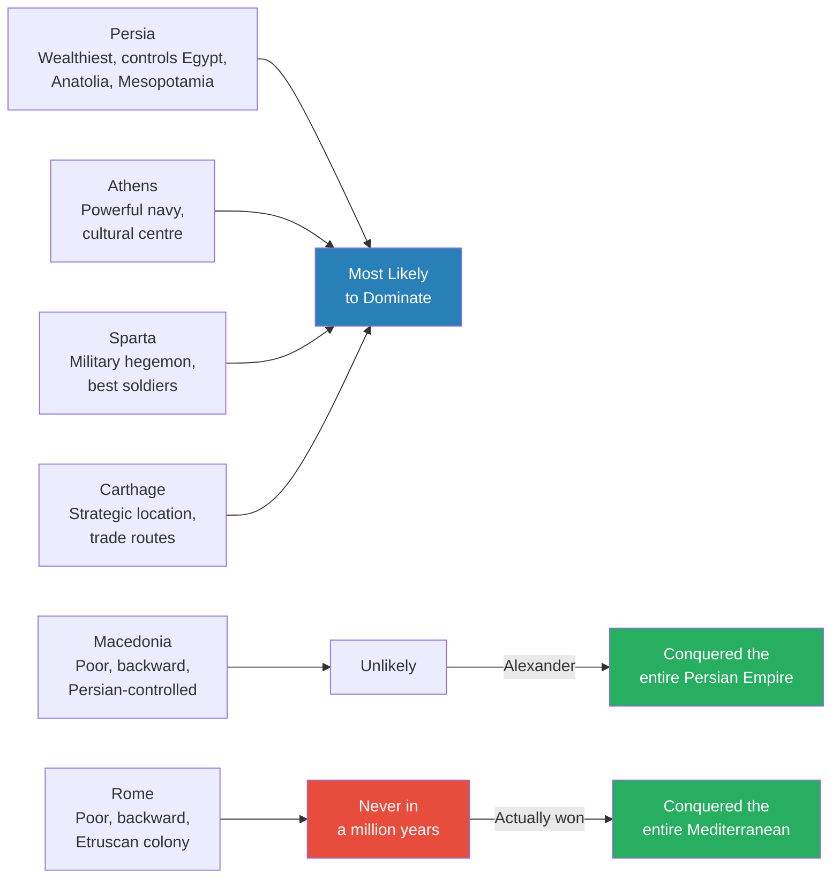
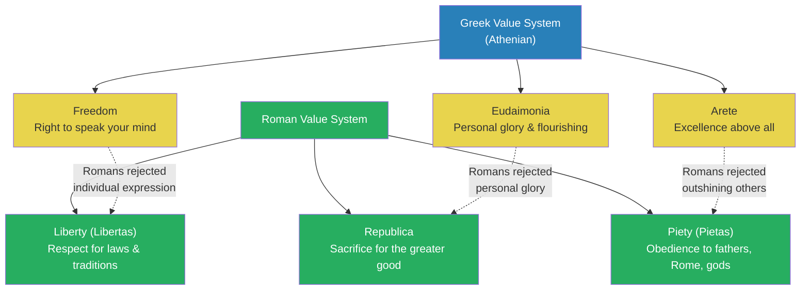
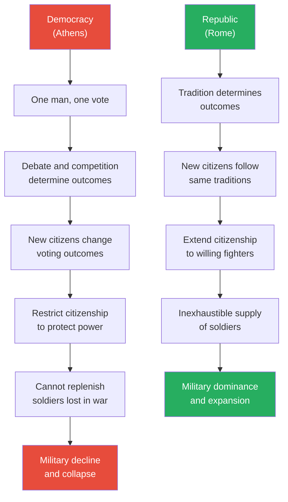
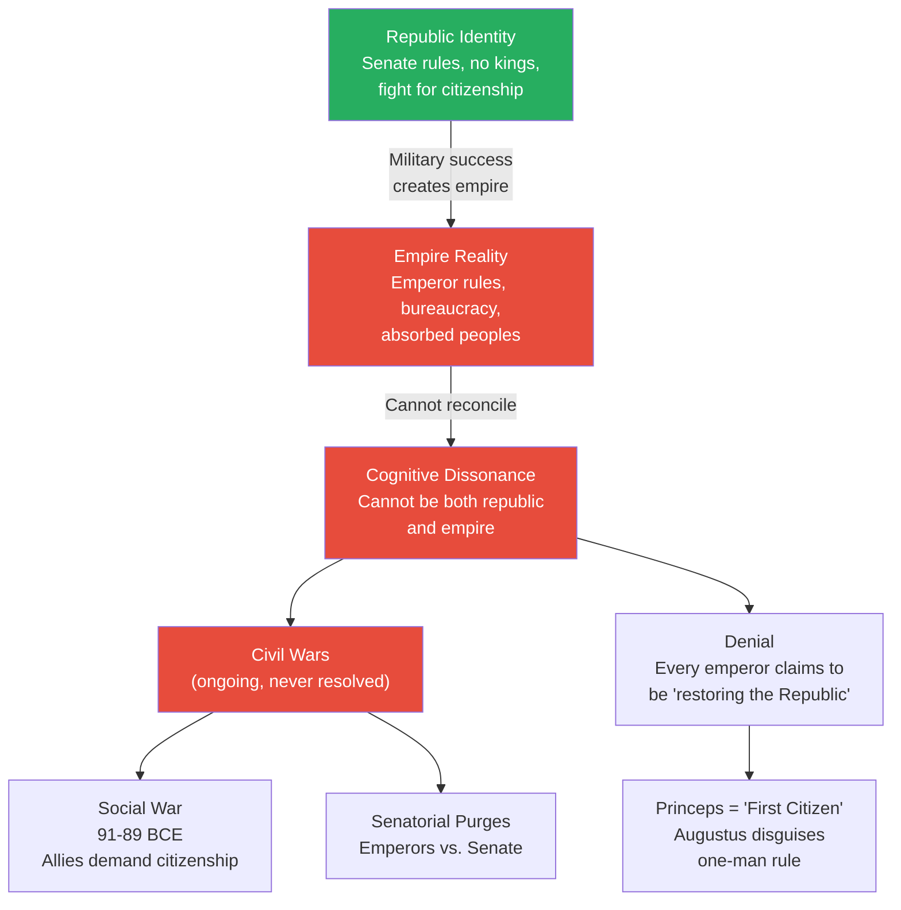
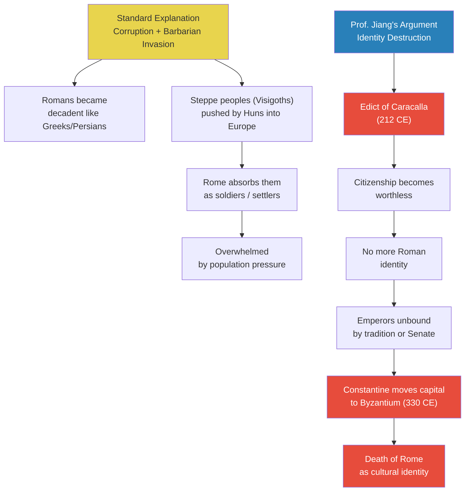
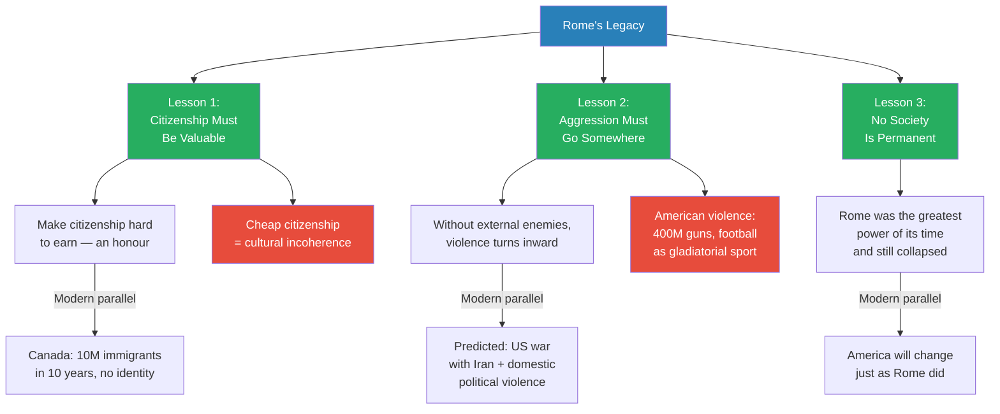

# Rome's Rise, Fall, and Legacy

> Prof. Jiang asks three questions about Rome: why did it rise, why did it fall, and what is its legacy today? His central argument is that Rome was a war machine whose cultural system — liberty, republica, and piety — created a flexible citizenship model that allowed it to overwhelm every rival in the Mediterranean. But that same system contained a fatal contradiction: Rome could not be both a republic and an empire. The refusal to resolve this identity crisis led to centuries of civil war, and when Emperor Caracalla destroyed the meaning of citizenship in 212 CE, Rome's cultural identity died — long before the last emperor was deposed in 476. The lecture draws a sustained parallel to modern America, arguing that the same pattern of outward aggression turning inward is repeating today.

---

## Overview: Key Highlights

- <b style="color: #27ae60">Rome's republic model defeated democracy</b> — flexible citizenship allowed Rome to absorb allies and replenish armies, something Athens could never do
- <b style="color: #2980b9">Liberty vs. Freedom</b> — Greek freedom meant the right to speak your mind; Roman liberty meant respect for laws, traditions, and the refusal to accept a king
- <b style="color: #2980b9">Republica</b> — the highest Roman virtue was sacrifice for the greater good, not individual glory like the Greek eudaimonia
- <b style="color: #e74c3c">Rome was never on anyone's prediction list</b> — in 500 BCE it was a poor, backward city that no one expected to dominate the Mediterranean
- <b style="color: #27ae60">Citizenship as the ultimate weapon</b> — Rome won by making citizenship available to anyone willing to fight and follow tradition, giving it inexhaustible manpower
- <b style="color: #e74c3c">The republic-empire contradiction was fatal</b> — Rome could not reconcile being an empire with its identity as a republic, and this tension drove endless civil wars
- <b style="color: #2980b9">Princeps, not Emperor</b> — Augustus Caesar called himself "first citizen," not emperor; Romans refused to acknowledge they had become an empire
- <b style="color: #e74c3c">The Edict of Caracalla (212 CE) killed Roman identity</b> — making everyone a citizen made citizenship worthless and destroyed the cultural cohesion that held Rome together
- <b style="color: #27ae60">Aggression must go somewhere</b> — when Rome ran out of external enemies, its violence turned inward; Prof. Jiang argues America faces the same trajectory
- <b style="color: #2980b9">Cognitive dissonance</b> — both Rome and America refuse to acknowledge they are empires, creating a psychological contradiction that distorts their politics
- <b style="color: #27ae60">We still live in Rome's world</b> — America's political system, legal system, and cultural values are Roman, not Greek, and America disseminates these worldwide

| Concept | One-line summary |
|---------|-----------------|
| **Liberty (Libertas)** | Respect for laws, history, and traditions — and the absolute refusal to accept a king |
| **Republica** | Sacrifice for the public good; the Roman alternative to Greek individual glory-seeking |
| **Piety (Pietas)** | Obedience and loyalty to fathers, Rome, and the gods — the highest Roman virtue |
| **Eudaimonia** | Greek pursuit of personal flourishing and glory — what Rome defined itself against |
| **Arete** | Greek excellence — admiring the best even if they are selfish; Romans rejected this |
| **Princeps** | "First citizen" — the title Augustus used to disguise one-man rule as republic |
| **Edict of Caracalla (212 CE)** | Granted citizenship to all inhabitants, destroying the exclusivity that gave citizenship meaning |
| **Cognitive dissonance** | The inability to hold two conflicting ideas — Rome and America both deny being empires |
| **Social War (91-89 BCE)** | Civil war between Rome and its Italian allies over citizenship demands |
| **Oceanic currents of history** | Empires energise their borderlands, which eventually overwhelm the empire |
| **Praetorian Guard** | The emperor's secret police — instrument of political assassination and control |

---

# The Lecture

## Why Would We Never Have Predicted Rome? [0:00 - 9:52]

*Prof. Jiang opens by mapping the Mediterranean world around 500 BCE and asking: if you had to predict which civilisation would dominate, who would you pick? He walks through Persia, Athens, Sparta, Carthage, and Macedonia — all better candidates than Rome. The fact that Rome won anyway illustrates the "oceanic currents of history" introduced in Lecture 1.*

> [!tip] Core Insight
> The nations at the bottom of everyone's prediction list — Rome and Macedonia — ended up conquering the world. Empires energise their borderlands, and those borderlands eventually overwhelm the empire.

*The powers everyone expected to win — Persia, Athens, Sparta — all declined. The two backwaters nobody predicted would rise — Macedonia and Rome — conquered the known world.*

> [!note]- Expand: Full Lecture Detail
> Prof. Jiang begins with a bold framing: Rome is extremely relevant today because the United States purposefully modelled itself on Rome. Both were the most powerful nations of their time. He makes the comparison vivid: "America is really invincible. It's protected by two oceans, and it has infinite resources, and it has an extremely aggressive population and the world's most sophisticated military."
>
> He announces the lecture's central argument: <b style="color: #27ae60">both Rome and America are war machines that turn aggression inward when they run out of external enemies</b>. Rome fought external wars until it ran out of enemies, then fought civil wars until it collapsed. America, after the fall of the Soviet Union in 1991, became a hyperpower with no peer competitor — and Prof. Jiang predicts this will lead to a massive civil war within the next decade.
>
> He then draws the map of the Mediterranean around 500 BCE:
> - <b style="color: #2980b9">Persia</b> — controls the three most prosperous regions: Egypt, Anatolia (modern Turkey), and Mesopotamia (modern Iraq). Extremely wealthy, heavily populated, intent on expansion
> - <b style="color: #2980b9">Athens and Sparta</b> — the two dominant Greek city-states across the Aegean from Persia. Athens has a powerful navy; Sparta has the best military
> - <b style="color: #2980b9">Etruscans</b> — the dominant power in Italy, not Rome. Some scholars believe Rome was originally an Etruscan colony and its first kings were Etruscan princes
> - <b style="color: #2980b9">Carthage</b> — an emerging power in North Africa with access to all Mediterranean and African trade routes
> - <b style="color: #2980b9">Macedonia</b> — a poor, backward kingdom north of Greece, controlled by Persia
> - <b style="color: #2980b9">Rome</b> — a poor, backward, isolated city along the Tiber
>
> Prof. Jiang asks who would win. The logical picks: Persia first (infinite wealth), Athens or Sparta second (naval power and military discipline), Carthage third (strategic location). Nobody would pick Macedonia. Nobody would ever pick Rome.
>
> "Now it's funny about these predictions, of course, is that eventually Rome does conquer the entire Mediterranean world." And Macedonia produced Alexander the Great, who conquered the entire Persian Empire. The pattern fits the <b style="color: #2980b9">oceanic currents of history</b> from Lecture 1: empires decline but energise their borderlands, which rise to overwhelm them.
>
> He then signals his focus: he will concentrate on the cultural reasons for Rome's triumph — the value system that made Rome ideal for military competition.

---

## Greek Values vs. Roman Values — Freedom, Glory, and Excellence [9:52 - 17:02]

*Prof. Jiang compares the Greek and Roman value systems side by side, showing how Romans deliberately developed their culture in opposition to the Greeks — much as Japan developed cultural systems in opposition to China. Three Greek values (freedom, eudaimonia, arete) map onto three Roman counterparts (liberty, republica, piety), and the Roman versions are designed to eliminate the individualism that destroyed Athens.*

*Each Roman value is a deliberate inversion of its Greek counterpart. Where the Greeks celebrated the individual, the Romans subordinated the individual to the collective — and this is precisely what made Rome militarily invincible.*

> [!note]- Expand: Full Lecture Detail
> Prof. Jiang explains that the Greeks were culturally dominant, and the Romans developed their system in opposition to Greek values — learning from Greek mistakes. He draws an analogy: "Think about the relationship between China and Japan. A lot of Japanese cultural systems and values were developed in opposition to China and because of the lessons that the Japanese learned from Chinese history."
>
> **Value 1 — Freedom vs. Liberty:**
> - Greek <b style="color: #2980b9">freedom</b>: an egalitarian society where every citizen has the right to speak his mind. The basis of Athenian democracy — everyone equal, everyone has a voice
> - Roman <b style="color: #2980b9">liberty (Libertas)</b>: respect for laws, history, and traditions, because these are what enable freedom. Without respect for laws, you get anarchy. Liberty also means "no king" — Romans would never allow a king to rule them
> - Prof. Jiang notes: "What's interesting for us is the modern Western concept is more aligned with the Romans than the Greeks. We think of freedom and liberty. We think of the Roman idea, not the Greek idea"
>
> **Value 2 — Eudaimonia vs. Republica:**
> - Greek <b style="color: #2980b9">eudaimonia</b>: the pursuit of personal flourishing, glory, and honour. Be the best, outshine your peers, win respect
> - Prof. Jiang connects this to Achilles in The Iliad: "Achilles was in Troy not to win glory for the Greek people, but to win glory for himself. He was extremely selfish." When Achilles abandoned the battlefield, he asked his mother to get Zeus to favour the Trojans — treason that the Greeks admired because it demonstrated personal greatness
> - Eudaimonia drove creativity — everyone competed to be the best — but it also led to corruption and selfishness
> - Roman <b style="color: #2980b9">republica</b>: sacrifice for the public good, for the good of Rome. "What's important is not that you win glory for yourself, but to sacrifice yourself for the greater good"
>
> **Value 3 — Arete vs. Piety:**
> - Greek <b style="color: #2980b9">arete</b>: excellence. Even though Achilles was a jerk, the Greeks admired him because he was fabulous on the battlefield. Excellence deserves admiration regardless of character
> - Roman <b style="color: #2980b9">piety (pietas)</b>: obedience, loyalty to your fathers, to Rome, to the gods. The highest virtue is not being excellent but being loyal. Romans did not want people to outshine everyone else

---

## Democracy vs. Republic — Why Citizenship Won Wars [17:02 - 27:04]

*Prof. Jiang delivers the lecture's central argument: the republic model solved the problem that destroyed Athens — the problem of citizenship. In a democracy, newcomers dilute voting power, so citizenship is restricted. In a republic, newcomers follow the same traditions as everyone else, so citizenship can be extended. This gave Rome an inexhaustible supply of soldiers while Athens bled out.*

> [!tip] Core Insight
> The beauty of a republic is that you can let in immigrants and foreigners who become citizens by following your traditions. This gives you an inexhaustible military — and it is the single most important reason Rome defeated every rival in the Mediterranean.

*The structural advantage of the republic over democracy was not philosophical — it was military. Rome could absorb losses that would have destroyed Athens, because its citizenship model was designed for expansion.*

> [!note]- Expand: Full Lecture Detail
> Prof. Jiang uses a vivid classroom analogy to explain the difference:
>
> - **Democracy:** Four students want to go to lunch. Each has a different opinion — McDonald's, dumplings, pizza. They debate, they vote, majority wins
>   - Problem: if five newcomers who all love noodles join, the original four lose control. "So we don't want newcomers"
>   - This is exactly why Athens fell: "The Athenian Empire had to fight these wars to protect its empire, but in each battle, it had to lose soldiers. And it could not replenish these soldiers because it did not want foreigners to become citizens"
> - **Republic:** The same four students, but decisions are based on tradition. "Today is Thursday, and for whatever reason, we don't know why, but every Thursday, we go out to get dumplings." Let in 100 people — doesn't matter. Everyone goes to dumplings on Thursday
>   - <b style="color: #27ae60">You can allow immigrants and foreigners into your system as long as they follow your traditions</b>
>   - They become citizens if they fight for Rome and obey Roman customs
>
> He draws a parallel to modern nations:
> - China: citizenship by birth and parentage — no other path
> - America: "You can immigrate and just say, I swear to obey the Constitution. If you say those words, you can become a US citizen" — the Roman model
>
> > [!example] The Pyrrhic Wars (280-272 BCE)
> > - Pyrrhus, a Greek king, came to Italy to aid Greek colonies complaining about Roman bullying
> > - He had the best soldiers in the world and won every battle against the Romans
> > - But after each victory, he noticed: "If I win just one more battle, I'm going to run out of soldiers"
> > - Pyrrhus could not replenish his Greek forces — citizenship was restricted
> > - Rome kept producing new armies from its Italian allies, all of whom could earn citizenship through service
> > - Pyrrhus had to retreat despite never losing a battle
> > **The lesson:** Winning every battle means nothing if you cannot replace your losses. Rome's flexible citizenship model gave it infinite manpower.
>
> > [!example] Athens Sails Away from Persia (480 BCE) vs. Rome Stands Against Hannibal (216 BCE)
> > - In 480 BCE, when Persia invaded the Greek mainland, the entire Athenian people got onto ships and sailed away
> > - The Persians were baffled — "You can't do that." Athens replied: "As long as we're a community, we will be Athens. We can leave Athens and sail to Africa and we will still be Athens"
> > - In 216 BCE, Hannibal destroyed all Roman armies. Rome had no military left
> > - Rome could have surrendered or fled — but to leave Rome would be to abandon its identity
> > - "The women said to Hannibal, we will not surrender. We will fight to the last man"
> > - Hannibal never attacked the city
> > - Prof. Jiang calls this "the proudest moment in Republican history" — every person, man, woman, or child, would have taken up arms
> > **The lesson:** In a democracy, the people are the nation. In a republic, the place and its traditions are the nation. Rome could not flee because Rome was Rome — not its people, but its soil, its temples, its history.
>
> Prof. Jiang then traces how this citizenship advantage played out:
> - Rome had no navy, but when it came into conflict with Carthage (the greatest naval power in the Mediterranean), it simply built one
> - Rome lost many naval battles but persisted because it could replace losses that Carthage could not
> - By 200 BCE, Rome was the greatest military hegemon of its time
> - By 100 BCE, it was an empire
>
> <b style="color: #e74c3c">But this created a paradox</b>: an empire needs a bureaucracy, an emperor, top-down control — all of which conflict with the republic's insistence on obeying tradition and institutions. "This created a contradiction. This created a paradox, and this will eventually lead to a series of civil wars that really never stops, until Rome collapses."

---

## The Republic-Empire Paradox — Cognitive Dissonance and Civil War [27:04 - 36:55]

*Prof. Jiang introduces the concept of cognitive dissonance: Rome became an empire but psychologically could not accept it, because "empire" contradicted everything it meant to be Roman. He draws a direct parallel to modern America, which controls the world through 800 military bases but violently rejects the label "empire." The Social War of 91-89 BCE illustrates how the citizenship question drove internal conflict.*

*The republic-empire paradox was not a phase Rome passed through — it was a permanent condition that generated civil war after civil war until the empire finally abandoned the pretence.*

> [!note]- Expand: Full Lecture Detail
> Prof. Jiang draws the parallel to America explicitly:
> - America has 800 military bases around the world; China has about two
> - America has no peer competitor and controls the world
> - But "there's one thing that you cannot say about America. If you say you guys are an empire, you will be shut down"
> - Americans believe their Middle East policy is controlled by Israel — "a nation of 8 million people in the desert" — because accepting that America wants to control the Middle East for its resources would mean admitting imperial ambitions
> - Americans believe the war in Ukraine is driven by European manipulation — "The Europeans are a vassal state of America. Israel is a vassal state of America"
> - <b style="color: #2980b9">Cognitive dissonance</b>: "It's impossible for your mind to hold in place two conflicting ideas. America cannot both be a republic and an empire, therefore it's a republic, and don't ever mention the word empire"
> - "The Romans had the same problem. They could not conceive of themselves as an empire, and they refused to be an empire, even though they were an empire"
>
> > [!example] The Social War (91-89 BCE)
> > - After Rome became an empire with no peer competitor, it began fighting wars against its own people
> > - Rome's Italian allies had fought alongside Rome for decades and lost many men
> > - They demanded citizenship — they had earned it through blood
> > - Rome said no — granting citizenship would dilute Roman cultural identity
> > - War broke out between Rome and its own allies
> > - Rome lost because its military was drawn from these same Italian allies
> > - Rome was forced to make its allies into citizens
> > **The lesson:** The citizenship model that built Rome's power also contained the seeds of its identity crisis. Every expansion forced a choice between military necessity and cultural purity.
>
> Prof. Jiang addresses the title "Emperor":
> - Augustus Caesar did not call himself emperor — the word he used was <b style="color: #2980b9">princeps</b>, meaning "first citizen" in Latin
> - "We are still equals, meaning senators, but I'm just a bit better than you. I'm the first among equals"
> - This is where the English word "prince" comes from
> - Augustus did not see himself as building an empire — "He saw himself as saving the Republic"
> - The idea that Augustus was the "first emperor" was applied by later historians, not by the Romans themselves
>
> The system of denial continued throughout Roman history: "Every new emperor believed that he was restoring the Republic, but then someone else will come along and say, no, he was a dictator."

---

## Tacitus, Marcus Terentius, and the Death of the Roman Character [36:55 - 54:04]

*Prof. Jiang uses a remarkable passage from Tacitus's Annals to show how empire transformed the Roman character. The defence speech of Marcus Terentius before the Senate — arguing that blind obedience to the emperor is the only rational course — represents the exact opposite of everything Rome stood for. Then he contrasts it with the story of Mucius from Rome's founding, who swam across the Tiber to assassinate a king and burned his own hand to prove Roman hatred of tyranny.*

> [!tip] Core Insight
> The Marcus Terentius speech is devastating because it works. The Senate rewards him for saying what everyone already thinks — that the emperor is God and obedience is the only virtue. Tacitus includes it precisely to horrify his readers into recognising what empire has done to the Roman soul.

*Five hundred years separate these two Romans — one who would burn his own hand rather than submit to a king, and one who argues that questioning the emperor is both unlawful and pointless. The distance between them is the distance between republic and empire.*

> [!note]- Expand: Full Lecture Detail
> Prof. Jiang explains that our understanding of Roman history comes largely from two Roman historians, <b style="color: #2980b9">Livy</b> and <b style="color: #2980b9">Tacitus</b>. Both were senators — members of the aristocracy who hated the emperors. They used their histories to make emperors look bad and advocate for senatorial power.
>
> He traces the succession after Augustus:
> - Augustus names <b style="color: #2980b9">Tiberius</b> (his adopted son) as emperor and <b style="color: #2980b9">Germanicus</b> as Tiberius's successor
> - Tiberius resents having his successor chosen for him
> - Tiberius elevates <b style="color: #2980b9">Sejanus</b> to head the Praetorian Guard (the secret police)
> - Sejanus, ambitious and ruthless, kills Germanicus and his entire family
> - After Sejanus finishes eliminating rivals, Tiberius has Sejanus killed — a common imperial pattern
> - Sejanus's allies are purged: children killed, supporters interrogated by the Senate and executed
> - Most claim innocence: "I had nothing to do with Sejanus. I was forced into an alliance"
>
> > [!example] Marcus Terentius's Defence (31 CE)
> > - After Sejanus's fall, his allies were dragged before the Senate for trial
> > - Everyone claimed innocence — and the Senate executed them anyway
> > - Marcus Terentius, a Roman nobleman, tried a different strategy
> > - He admitted: "Yes, I was his friend. In fact, I tried my very best to be his friend"
> > - His reasoning: Sejanus had the emperor's favour. To get anything done, you had to befriend Sejanus. And since the emperor chose Sejanus, obeying Sejanus was obeying the emperor
> > - "It is not ours to ask whom you, the Emperor, exalt above his fellow, or why"
> > - The emperor is God — he has secret designs that mortals cannot and must not question
> > - "To search out the hidden thoughts of the Emperor and the designs he may shape in secret — it's unlawful and dangerous, nor would the searcher necessarily find"
> > - The Senate was so impressed that they freed him and executed his accusers instead
> > - "A man had been discovered to utter what the world was thinking"
> > **The lesson:** The speech succeeded because it said aloud what everyone already believed — that the republic was dead and obedience to the emperor was the only rational survival strategy.
>
> Prof. Jiang then contrasts this with a founding story of the Republic:
>
> > [!example] Mucius and the King (509 BCE)
> > - In 509 BCE, the Republic was founded by throwing out the last king
> > - The deposed king organised the Etruscans and marched on Rome with a huge army
> > - Rome was surrounded and hopeless
> > - A young nobleman named Mucius proposed a daring assassination plan
> > - He swam across the Tiber, infiltrated the enemy camp, and was captured
> > - Before the king, Mucius declared: "We Romans have sworn to kill all kings"
> > - To prove his seriousness, he thrust his hand into a fire and held it there as it burned
> > - The king was so terrified that he withdrew his army
> > **The lesson:** The original Roman character defined itself by defiance of kings. Mucius would rather destroy his own body than submit.
>
> Prof. Jiang explains what Tacitus is doing: he is a senator writing about 100 years after these events, trying to show his readers what empire does to the Roman character. "If you're a Roman citizen and you read this speech, you are appalled. You're disgusted. We're Romans. We hate kings, we do not obey. We fight, we do not surrender."
>
> But he adds a crucial nuance: the fact that Tacitus is writing this proves the old Roman identity has not entirely died. "If it didn't really change, people wouldn't know it changed." People resist the change precisely because they still feel the pull of the old values. Tacitus is telling his contemporary readers: the new emperor has restored the Republic — but stay vigilant.
>
> Prof. Jiang clarifies the Senate's role in response to a student question:
> - The Senate was filled by ruling aristocratic families
> - Technically, senators controlled the provinces — like governors of states in a federal system
> - The emperor controlled the army and the Praetorian Guard (secret police)
> - "Technically, each province is independent. Each has its own army, its own legal system, and it agrees to be part of the federal system" — very similar to the American model
> - In reality, the emperor held power because he could kill senators who disobeyed
> - This Senate-emperor tension was never fully resolved

---

## Why Did Rome Really Fall? — The Edict of Caracalla [54:04 - 57:03]

*Prof. Jiang rejects the standard explanation for Rome's fall — corruption and barbarian invasion — and argues that Rome died in 212 CE when the Edict of Caracalla made everyone a citizen. If citizenship means nothing, Roman identity means nothing, and the republic is truly dead.*

*Prof. Jiang dates Rome's death not to the barbarian deposition of the last emperor in 476 CE, but to the Edict of Caracalla in 212 CE — the moment citizenship lost its meaning and the republic's cultural core dissolved.*

> [!note]- Expand: Full Lecture Detail
> Prof. Jiang presents the standard explanation:
> - Rome became too corrupt — Gibbon's argument in *The History of the Decline and Fall of the Roman Empire*
> - Romans became more like the Greeks and Persians, appreciating luxury and decadence
> - Steppe nomads (Visigoths, pushed by the Huns) invaded Europe — "the steppe is this massive competitive whirlpool hurricane that makes people more and more aggressive"
> - Rome tried to absorb them by making them soldiers or giving them land, but the population pressure overwhelmed the empire
>
> Then he offers his own argument: <b style="color: #e74c3c">it has to do with citizenship and identity</b>
> - Throughout its history, Imperial Rome struggled with the republic-empire identity crisis
> - In 212 CE, Emperor <b style="color: #2980b9">Caracalla</b> issued an edict making everyone in the Roman Empire a citizen
> - "He basically destroyed the idea of citizenship. If everyone can be a citizen, citizenship means nothing"
> - Before: you had to fight for Rome, die for Rome, believe in its customs and traditions. "It was the most valuable thing in the world"
> - After: "Everyone got it, so it's absolutely worthless"
> - Without a distinct Roman identity, emperors were no longer bound by tradition, history, or the Senate
> - They could build a pure imperial bureaucracy to replace the republic
> - In 330 CE, Emperor <b style="color: #2980b9">Constantine</b> moved the capital from Rome to Byzantium — "something that was unthinkable. How could you move the heart and centre and soul of the empire from Rome to somewhere else?"
> - It was only thinkable because "to be Roman" no longer meant anything tied to a specific place, tradition, or identity
>
> Prof. Jiang stakes his position: "Historians argue when the Roman Empire fell. The consensus is 476, when a German warlord deposed the last emperor Romulus Augustulus. But I disagree. I believe that it really happened in 212, when Rome announced everyone could be a citizen."

---

## The Legacy of Rome — We Still Live in Its World [57:03 - 1:06:26]

*Prof. Jiang closes with three lessons from Rome that apply directly to today: citizenship must be valuable and hard to earn, aggression that cannot be directed outward will turn inward, and no society is permanent. He draws sustained parallels to America, Canada, and Britain, arguing that the Western world faces the same identity crises that destroyed Rome.*

*The three lessons form a hierarchy: identity enables cohesion, cohesion channels aggression outward, and even with both in place, nothing lasts forever.*

> [!note]- Expand: Full Lecture Detail
> Prof. Jiang argues that we still live in Rome's world: "Even though we like to think that we are heavily influenced by the Greeks, it's the institutions of Rome that we've inherited." America's political system, legal system, and cultural system are "basically copy and pasted" from Rome. And because America controls the world, it disseminates Roman values globally.
>
> He notes that Rome's cultural framework survived its political collapse: "Even though Rome collapsed and the character of Rome is now dead, the Roman legacy is still there." The German warlords who fought over Rome's corpse all claimed to be carrying on Rome's legacy. "From their perspective, Rome has not died, but Rome has spread out." These warlords adopted Roman practices and built the cultures that became France, Germany, and Britain.
>
> **Lesson 1 — Citizenship and identity:**
> - <b style="color: #27ae60">"You cannot be a strong and coherent nation if you do not have a strong cultural identity"</b>
> - Prof. Jiang uses his own country as an example: Canada's population went from 30 million to 40 million in ten years, all through immigration
> - "These 10 million people are all foreigners who have no sense of Canadian identity. They have no interest in being Canadian. They just want a better life for themselves"
> - 40% of Canadians are now foreign-born or have a foreign-born parent
> - Result: when Trump threatened to make Canada the 51st state, many new Canadians were happy to join because it meant economic opportunity — they had no attachment to Canadian identity
> - "Without controlling immigration, you as a nation can't be coherent, and you will cease to exist over time"
> - The same pattern is happening in Britain and throughout the Western world
> - "Make citizenship hard to become. Make it valuable. Make it an honour to be a citizen, and your nation will be strong. If citizenship is cheap, if you can just buy it, then it's worthless"
>
> **Lesson 2 — Aggression turns inward:**
> - Rome won by being the most aggressive society in the Mediterranean
> - Once external enemies were defeated, that aggression had nowhere to go — it turned into civil war
> - America mirrors this: "America is a nation that worships aggression"
> - 400 million guns for 300 million people — "There are more guns than there are people in America"
> - American football: "There's only one nation in the world that plays American football. No other nation plays it. Why? Because it is barbaric." Players' brains are destroyed within five years, and they commit suicide at 30 or 35. "It's no different from gladiator sport in Rome"
> - <b style="color: #e74c3c">Prof. Jiang predicts America will start a war against Iran within five years, and will experience significant domestic political violence</b>
>
> **Lesson 3 — Nothing is permanent:**
> - "No societies are stable. Everything changes over time"
> - Rome was the dominant superpower and still collapsed
> - The same is inevitable for America
> - "The world will change, and it always changes"

---

## Connections

**Builds on:** [[01 - Explaining Humanity's Transition to Agriculture]] (oceanic currents of history), [[07 - Homer's Iliad and the Birth of Greek Civilization]] (Achilles and eudaimonia), [[08 - Rat Utopia and the Peloponnesian War]] (Athens vs. Sparta, democratic decline), [[14 - Hannibal Barca, Lucius Brutus, and the Triumph of Rome]] (Hannibal's invasion, Roman character), [[15 - The Myth-Making Genius of Julius Caesar]] (Caesar and Roman identity), [[16 - Julius Caesar's Will and Octavian's Birth of Empire]] (Augustus as princeps)
**Sets up:** Lecture 33 (the Byzantine Empire — what happens when Rome abandons its identity and moves to Constantinople)
**Related books in vault:** [[The 33 Strategies of War - Robert Greene]] (aggression, military flexibility), [[The 48 Laws of Power - Robert Greene]] (never outshine the master — Roman piety as political strategy)

---

## The Takeaway

This lecture reframes the fall of Rome from a story about barbarian invasion and moral decay into a story about identity. Rome's republic model — liberty, republica, piety — was the most successful military-cultural system in the ancient world because it solved the citizenship problem that destroyed Athens. But the system contained a fatal contradiction: the more successful Rome became, the more it looked like an empire, and "empire" was everything Romans defined themselves against. The refusal to resolve this cognitive dissonance drove centuries of civil war.

The most counterintuitive insight is Prof. Jiang's dating of Rome's death. He places it not at the conventional 476 CE — the deposition of the last emperor — but at 212 CE, when the Edict of Caracalla made citizenship universal. The moment the most valuable thing in the Roman world became free, it became worthless. Without a meaningful concept of citizenship, there was no Roman identity to defend, no tradition to obey, no republic to restore. Everything that followed — Constantine's move to Byzantium, the barbarian invasions, the final collapse — was aftermath.

The lecture leaves one question provocatively unresolved: if America is repeating Rome's pattern — an aggressive republic that cannot admit it has become an empire — how much time does it have? Prof. Jiang's answer is blunt: a war against Iran within five years, domestic political violence within ten. Whether that prediction holds, the structural analogy is the point: citizenship, identity, and the honest acknowledgment of what your society has become are not abstract philosophical questions. They are survival questions. Rome's answer — deny, deny, deny — did not work.
