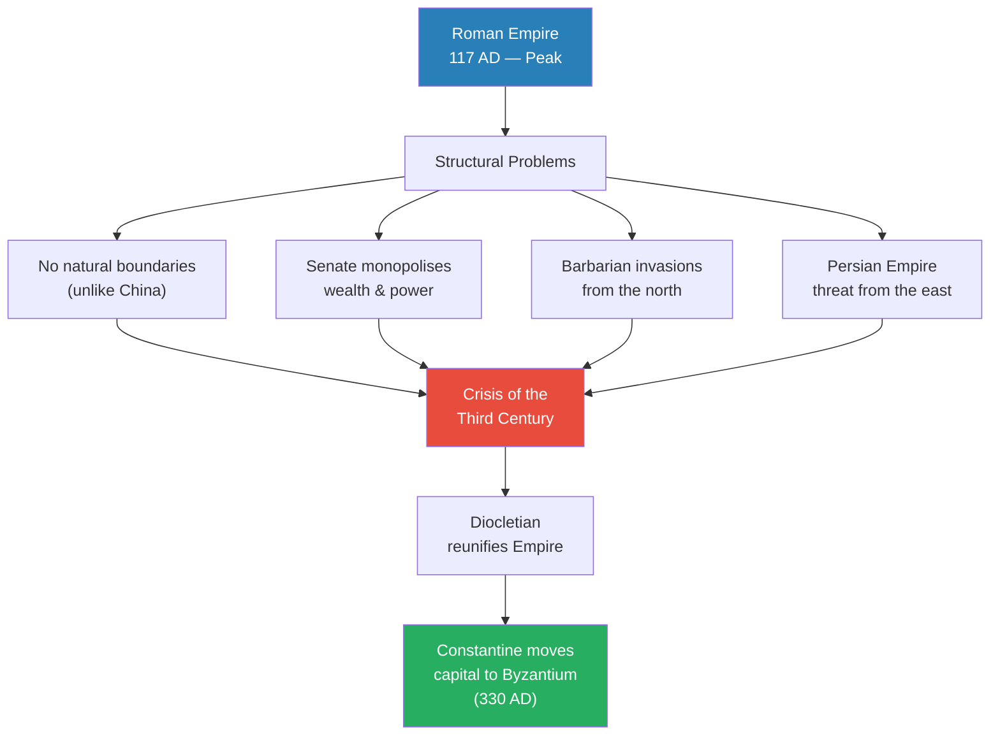
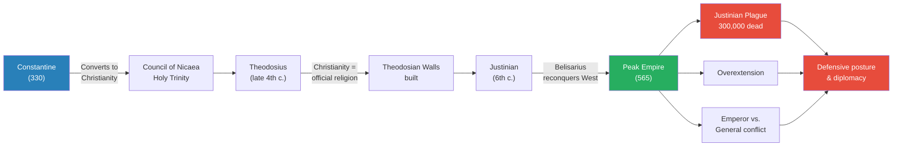
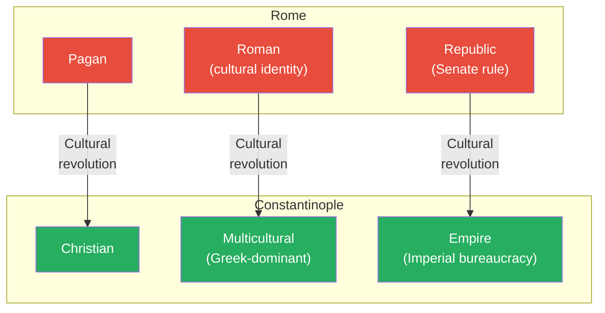
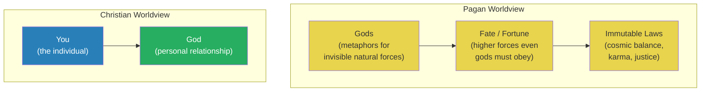
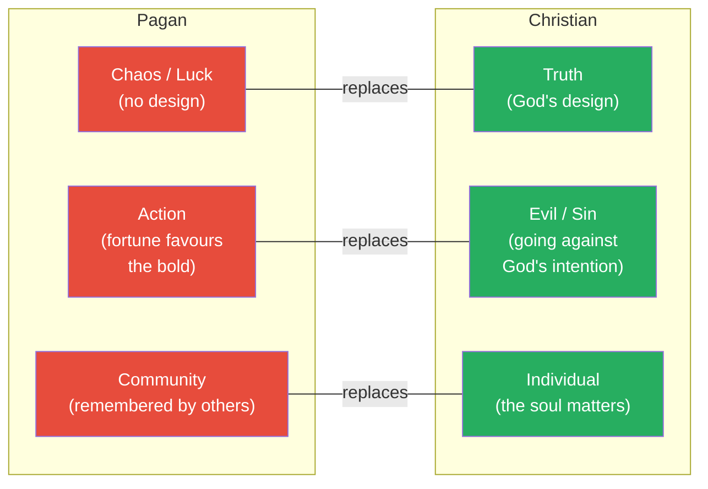
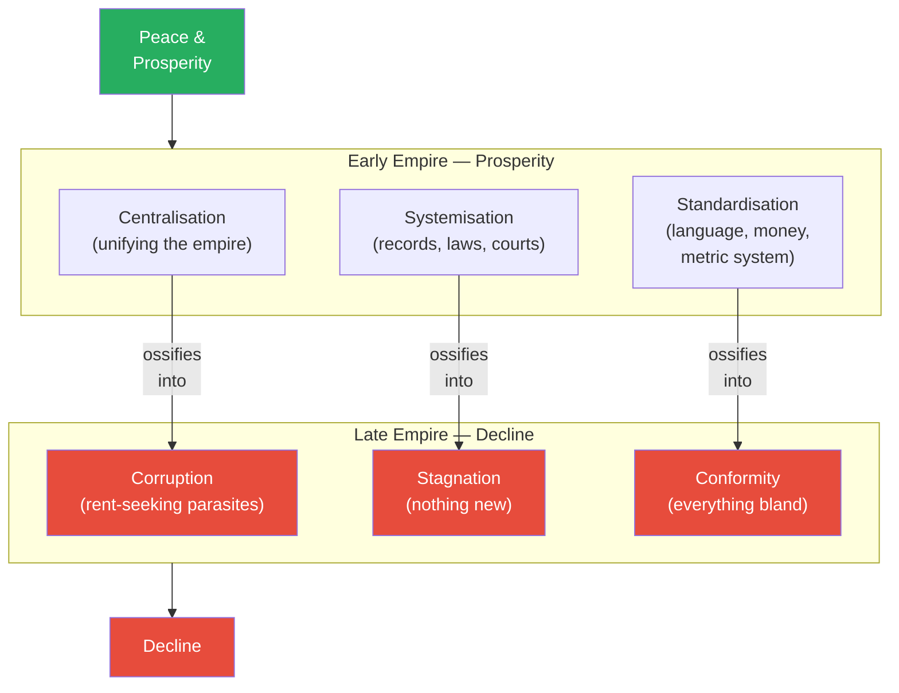
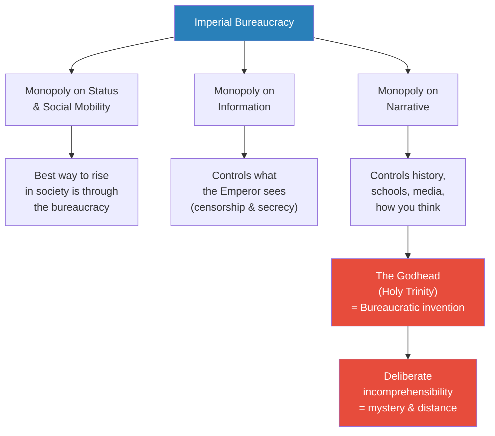

# The Rise and Fall of the Byzantine Empire

> Prof. Jiang poses three questions about the Byzantine Empire: why did Constantine move the capital from Rome to Byzantium, how did it survive for a thousand years, and why did it ultimately fall? He presents the scholarly consensus — strategic geography, impregnable walls, trade wealth — and then dismantles it with his own argument: Constantine moved because he needed to escape Roman culture in order to build an empire. The radical shift from pagan to Christian, from Republican to imperial, from Roman to Greek could never have happened inside Rome itself. The lecture then explores the deep consequences of this cultural revolution — the differences between pagan and Christian worldviews, the virtues and pathologies of bureaucracy, and why multicultural empires are stable but uncreative.

---

## Overview: Key Highlights

- <b style="color: #27ae60">Constantine moved to escape Roman culture, not for strategy</b> — you cannot transform a civilisation's identity from within; you must build somewhere new
- <b style="color: #e74c3c">The Senate was the problem</b> — committee rule by aristocratic houses meant the only thing they could agree on was to be corrupt together
- <b style="color: #2980b9">The Crisis of the Third Century</b> — civil wars, barbarian invasions, economic collapse, and plague nearly destroyed Rome before Diocletian reunified it
- <b style="color: #27ae60">Three radical cultural shifts</b> — pagan to Christian, Roman to Greek, Republic to Empire — the Byzantines were a completely different civilisation from Rome
- <b style="color: #2980b9">Pagan worldview: gods, fate, immutable laws</b> — a layered cosmology where action, community, and fortune drive human purpose
- <b style="color: #e74c3c">Christianity introduced truth, evil, and the individual</b> — three concepts that did not exist in the Greek and Roman tradition and that fundamentally restructured civilisation
- <b style="color: #2980b9">Bureaucracy's lifecycle</b> — centralisation, systemisation, and standardisation create early prosperity, then ossify into corruption, stagnation, and conformity
- <b style="color: #27ae60">Bureaucracies monopolise status, information, and narrative</b> — they control how people think, what information flows, and who rises in society
- <b style="color: #e74c3c">The Godhead as bureaucratic invention</b> — the Holy Trinity's deliberate incomprehensibility creates the mystery and distance that bureaucracies need to maintain power
- <b style="color: #2980b9">Tribal vs. multicultural societies</b> — tribalism is energetic and creative; multiculturalism is stable but conformist
- <b style="color: #e74c3c">If Homer or Dante lived in Byzantium, they would have become bureaucrats</b> — the empire's structure absorbed genius into administration
- <b style="color: #27ae60">The Theodosian Walls stood for a thousand years</b> — only Ottoman siege cannons finally breached Constantinople's defences

| Concept | One-line summary |
|---------|-----------------|
| **Crisis of the Third Century** | Civil wars, invasions, plague, and economic collapse nearly ended the Roman Empire |
| **Princeps** | Augustus's title meaning "first citizen" — maintaining the fiction of Republican government |
| **The Dominate** | Diocletian's shift to an imperial bureaucracy modelled on the Persian Empire |
| **Cultural escape** | You cannot reform a culture from within — you must move and build anew |
| **Pagan worldview** | Layered cosmology: gods (nature), fate/fortune, immutable universal laws |
| **Christian worldview** | Personal relationship between individual and God — truth, evil, and the soul |
| **Libertas** | Roman concept of liberty — the cultural tradition that resisted imperial centralisation |
| **Greek fire** | Byzantine naval weapon (kerosene-based) that made Constantinople impregnable by sea |
| **Bureaucracy lifecycle** | Centralisation → corruption; systemisation → stagnation; standardisation → conformity |
| **Rent-seeking** | Extracting value through monopoly position — the mechanism by which bureaucracies become parasitic |
| **The Godhead** | The Holy Trinity as deliberately incomprehensible — mystery as a bureaucratic tool of control |
| **Tribal vs. multicultural** | Tribal societies produce Homer and Dante; multicultural societies produce bureaucrats |

---

# The Lecture

## The Scholarly Consensus — Three Questions About Byzantium [0:00–9:29]

*Prof. Jiang opens with three questions that will structure the entire lecture: why did Constantine move the capital, how did the Byzantine Empire survive for a thousand years, and why did it ultimately fall? He first presents the standard answers — the ones you would find on Wikipedia or get from ChatGPT — before promising to demolish them with his own theory.*

> [!tip] Core Insight
> The Byzantine Empire lasted from 330 to 1453 — arguably the most enduring world empire in human history. Understanding why requires going beyond strategic geography to the deeper question of cultural transformation.

*The Roman Empire's structural contradictions — no natural borders, an aristocratic Senate, barbarian pressure, and a Persian rival — converged in the Crisis of the Third Century. Diocletian's reunification and Constantine's relocation were responses to a system on the brink of collapse.*

> [!note]- Expand: Full Lecture Detail
> Prof. Jiang opens by mapping the lecture: "This morning, we are doing the Byzantine Empire, and I will be looking at three questions." He lists them clearly:
>
> - **Why do we have the Byzantine Empire?** — Constantine the Great transferred the capital from Rome to Byzantium (later Constantinople) in 330 AD. Why?
> - **How did it rise?** — It lasted from 330 until 1453, when the Ottoman Turks overran Constantinople. How was it so successful for a thousand years?
> - **Why did it ultimately decline?** — What factors led to its eventual demise?
>
> He shows a map of the Roman Empire at its peak in 117 AD: "It is huge. It spans across the Mediterranean — Spain, Anatolia, Egypt, the Levant. And that's a problem. It's just much too big."
>
> The structural problems he identifies:
>
> - <b style="color: #e74c3c">No natural boundaries</b> — unlike China, which has mountains, deserts, and oceans, Rome's borders were open to invasion
> - Germanic and Gothic tribes from the north — "what the Romans call barbarians, basically these Germanic Gothic tribes" — continually invaded
> - The Persian Empire to the east — first the Parthians, then the Sassanid Persians — was a permanent adversary
> - Internally, the Republic-Empire contradiction persisted: "They were an empire, but they believed themselves to be Republic"
>
> The Senate was the core problem:
>
> - Composed of the Roman aristocracy, the ruling houses of Rome
> - "When you have committee rule, when power is divided up evenly among the ruling houses of an empire, the only thing they can really agree on is to be corrupt together"
> - The Senate monopolised wealth, creating discontent in the provinces
>
> This led to the <b style="color: #2980b9">Crisis of the Third Century</b>: "Civil wars going on. Invasions in the north. Economic collapse. A plague. The Roman Empire was on the brink of complete implosion."
>
> Then <b style="color: #2980b9">Diocletian</b>, a military genius, reunified the Empire and recognised the need for radical systemic change.
>
> **The scholarly consensus on why Constantine moved:**
>
> - **Defence:** Rome was not easily defended — provincial military governors like Julius Caesar could march their armies in and seize power. Constantinople, by contrast, was impregnable
> - **Geography:** Constantinople was at the centre of the Empire — Rome was too far west. The wealthiest provinces (Egypt, Anatolia, the Levant) were all in the east
> - **Threat response:** The main competitor was the Persian Empire to the east. Constantinople allowed the Emperor to respond directly to the Persian threat
>
> Prof. Jiang signals his dissent: "This is the scholarly consensus, but as I will show you later on, I disagree. I think there was a much more important reason why Constantine made this move."

---

## The Rise of Constantinople — Walls, Fire, and Faith [9:29–19:20]

*Prof. Jiang covers the Byzantine Empire's key achievements: Constantine's establishment of Christianity, the Theodosian Walls that made the city impregnable for a millennium, Justinian's overexpansion and the devastating plague, and Constantinople's extraordinary position as the centre of world trade. He also introduces the recurring tension between emperor and general.*

*From Constantine's founding through Justinian's peak, every achievement carried the seed of decline — plague, overextension, and the structural tension between emperor and general ended Byzantine military ambition permanently.*

> [!note]- Expand: Full Lecture Detail
> **Constantine and Christianity:**
>
> - Constantine the Great was the first Christian Roman emperor
> - He established the <b style="color: #2980b9">Council of Nicaea</b> to resolve the theological debate about the nature of Jesus
> - The dominant popular view was <b style="color: #2980b9">Arianism</b> — Jesus as a lesser divinity to God
> - Nicaea established the <b style="color: #2980b9">Holy Trinity</b> (the Godhead): God, Jesus, and the Holy Spirit are co-equal — "separate, but they are co-equal"
>
> **Theodosius's contributions:**
>
> - Made Christianity the official religion of the Roman Empire
> - Cracked down on both paganism and heresy (especially Arianism)
> - Built the <b style="color: #2980b9">Theodosian Walls</b> — "huge. Two walls, a moat protecting it. For 1000 years, these walls protected the city"
> - "You didn't actually need that many soldiers to protect against invaders"
> - The walls still stand today in Istanbul: "designed to stand for all of eternity"
>
> **Sea defences and Greek fire:**
>
> - Constantinople also had sea walls — attack by naval expedition was impossible
> - <b style="color: #2980b9">Greek fire</b>: "basically kerosene — you take kerosene, you throw it at someone, and then the boat is light on fire"
> - The story: during the 8th-century Muslim expansion, a Hellenised Jew who converted to Christianity invented Greek fire and brought it to the Emperor
> - "The Emperor believes that he is an angel sent by God to save the city"
>
> **Justinian's peak and its consequences:**
>
> - At the height of the Empire (565 AD), under Justinian with his general <b style="color: #2980b9">Belisarius</b>, the Byzantines nearly reconstituted the entire Roman Empire
> - Belisarius: "considered the last great Roman general. His military genius is on par with Julius Caesar, Hannibal"
> - But peak empire brought three problems:
>   - **Plague:** The <b style="color: #e74c3c">Justinian Plague</b> killed 300,000 out of 500,000 people in Constantinople — "50 to 60% of the entire population"
>     - Originally believed to have come from grain ships from Egypt (rats carrying bubonic plague)
>     - Now some historians believe it came from the steppes via the Huns
>   - **Overextension:** "When you have these military conquerors, you overextend. It is very difficult to maintain this empire"
>   - **Emperor-General conflict:** "Even though Justinian and Belisarius were great friends, the wives were great friends, they had a lot of personal conflict"
>     - Belisarius was tried for treason towards the end of his life
>     - Justinian tried to sabotage Belisarius during military campaigns: "If you're emperor, you're afraid that your great general will eventually come back and take your throne"
>
> > [!example] Belisarius — The Last Great Roman General
> > - Belisarius served under Emperor Justinian in the 6th century
> > - His military genius was on par with Julius Caesar and Hannibal
> > - Through his campaigns, the Byzantine Empire nearly reconstituted the full Roman Empire
> > - Despite personal friendship with Justinian, the emperor grew suspicious
> > - Justinian sabotaged Belisarius during campaigns out of fear he would seize the throne
> > - Belisarius was eventually tried for treason
> > - After Belisarius, the Byzantines never again embarked on a massive military campaign
> > **The lesson:** The structural tension between emperor and general — the fear that military success will produce a rival — is what ended Byzantine expansionism permanently.
>
> **The fall of Constantinople:**
>
> - By ~1450, the Ottoman Empire had conquered all Byzantine territory except Constantinople itself
> - The <b style="color: #e74c3c">invention of siege engines</b> — cannons "as big as houses" — finally breached the Theodosian Walls
> - Despite the religious divide (Christian vs. Muslim), the Ottomans treated citizens "extremely respectfully, because they were considered the heirs, the successors to the Roman Empire"
>
> **Constantinople's significance:**
>
> - The centre of the world for hundreds of years — "both intellectually, because it was the heir to the Roman Empire and to Greek civilization"
> - The meeting place of the Aegean (leading to the Mediterranean) and the Black Sea (leading to Russia): "You want to go anywhere, you basically had to go through Constantinople"
> - Through taxing trade, the city became "extremely wealthy"
> - Multicultural and cosmopolitan: "Jews, Christians, Muslims were all treated with extreme tolerance. They had their own quarters within the city"

---

## Constantine's Real Reason — You Cannot Reform Culture from Within [19:20–31:43]

*Prof. Jiang presents his own theory: Constantine moved because he needed to escape Roman culture. Just as a school consultant who wants to change a school's identity would be fired within a week, Constantine could not transform a Republican, pagan civilisation into an imperial, Christian one from inside Rome. He had to build somewhere new. The result was three radical cultural shifts that made the Byzantine Empire a completely different civilisation.*

> [!tip] Core Insight
> You cannot reform a culture from within. The Romans assassinated Julius Caesar because he threatened their traditions. Constantine's genius was recognising that the only way to build an empire was to leave Rome behind entirely and start fresh.

*Three radical cultural shifts — religion, identity, and political system — all changed simultaneously. This was not evolution but revolution, and it could only happen by physically relocating the centre of power.*

> [!note]- Expand: Full Lecture Detail
> **Student question — Greek cultural pull:**
>
> - A student asks whether Roman elites felt a cultural pull toward Greek civilisation, noting that early emperors like Augustus, Tiberius, and Claudius wrote and conversed in Greek
> - Prof. Jiang confirms: "Greek culture is really the hegemon. It's so much, so superior to Roman culture. Romans really were peasants who built an empire, but the Greeks basically built Western civilization"
> - "Homer, Plato, Herodotus — the Romans were aware of this, and this was a conflict within Roman civilization for a long time"
> - The Romans feared being "conquered culturally by the Greeks" even after conquering them militarily
> - Augustus Caesar commissioned the Aeneid specifically "in response to the hegemony of Greek culture"
> - Mark Antony "saw himself as more Greek than Roman"
> - "Eventually, Greek culture does triumph" — in the Byzantine Empire
>
> **Prof. Jiang's theory — the school analogy:**
>
> - During Augustus's time, he was not called Emperor but <b style="color: #2980b9">Princeps</b> — "first citizen" (the root of "prince" and "principal")
> - Augustus's solution to the Senate problem: "Make me the CEO. It's still committee, still rule by committee, but I'll be the coordinator"
> - This system "preserved the culture, the history, the legacy and the traditions of the Roman people" — especially <b style="color: #2980b9">Libertas</b> (Liberty)
> - But the system did not work — civil wars, provincial revolts continued, leading to the Crisis of the Third Century
> - Diocletian saved the Empire and began the <b style="color: #2980b9">Dominate</b> — "the idea of starting an imperial bureaucracy, centralising power with the Emperor through the bureaucracy"
> - "The Romans hated this idea. What emperors discovered is this cultural shift was actually disgusting"
>
> > [!example] The School Consultant — Prof. Jiang's Thought Experiment
> > - Imagine a school known for being innovative, student-centred, focused on activities and extracurriculars
> > - The school brings in a consultant (Prof. Jiang) to help improve it
> > - After months of research, the consultant concludes: the school is great at innovation but needs more academic focus — more reading, better test scores
> > - "I'm pretty sure if I tried that, I'd be fired within a week"
> > - The reason: "I am attacking your cultural traditions. I'm attacking your identity, your sense of self"
> > - "If I want to implement my vision, I can't force it on you. The thing I can really do is switch schools and build my own school"
> > **The lesson:** Cultural reform from within triggers immune-system responses — the community attacks the reformer. Constantine understood this: you must leave and build anew.
>
> - <b style="color: #27ae60">This is why Constantine moved to Byzantium</b>: "He recognised that if I'm going to build an empire, and Rome needs an empire if it is to endure, I need to switch cultures. And the best way to switch culture is by moving your capital"
> - The assassination of Julius Caesar proves the point: "The people who assassinated Julius Caesar were his best friends. Marcus Brutus was actually his biological son. Why? Because Julius Caesar was threatening the cultural traditions of Rome"
>
> **The three cultural shifts:**
>
> | Dimension | Rome | Constantinople |
> |-----------|------|----------------|
> | **Religion** | Pagan | Christian |
> | **Culture** | Roman (resisting Greek influence) | Multicultural (fully embracing Greek culture, language switched to Greek) |
> | **Government** | Republic (Senate, tradition, custom) | Empire (imperial bureaucracy) |
>
> - "The Byzantine Empire is a very distinct entity from the Roman Empire. Historians today argue it's a continuation, but that's only a superficial and shallow understanding. Culturally, the Byzantine Empire was a radical departure"

---

## The Pagan Worldview vs. the Christian Worldview [31:43–40:57]

*Prof. Jiang unpacks the deepest of the three cultural shifts — the replacement of the pagan worldview with the Christian one. He identifies three concepts Christianity introduced that did not exist in the Greek and Roman tradition: truth, evil, and the individual. Against each, he places the pagan counterpart: chaos, action, and community. The contrast illuminates everything from Achilles's death wish to the Viking berserker.*

*The pagan worldview has three layers of cosmic authority above humans. The Christian worldview collapses all of this into a single relationship: you and God. Everything else disappears.*

*Christianity introduces three ideas that had no equivalent in the Greek and Roman tradition — and each one displaces a pagan concept that drove entirely different behaviour. The colour coding does not mean one is better; it marks the direction of replacement.*

> [!note]- Expand: Full Lecture Detail
> Prof. Jiang warns the class he is making "a lot of generalisations, but it's a useful framework for the understanding of ancient cultures."
>
> **The pagan worldview — three layers:**
>
> - **Gods:** "The gods are really a metaphorical way to understand nature." Invisible forces — wind, creativity, luck — are rendered as gods. "It was very important to maintain good relations with the gods by making ritual tributes. Sacrifice and rituals were very important"
> - **Fate / Fortune:** Above the gods are "higher, invisible forces that no one has control of — fate, luck, fortune. Even the gods must submit to these"
> - **Immutable laws of the universe:** At the highest level, unwritten and eternal laws — "think of gravity." These provide cosmic order. "The idea really of karma or justice — if you do good in the world, good will happen to you. If you do evil, evil will happen to you. It may not happen to you, but it may happen to your children"
>
> **The Christian worldview:** "There's you, and there's God. And the thing that matters is your personal relationship with God. That's it, guys"
>
> **The three major differences:**
>
> - <b style="color: #2980b9">Truth vs. Chaos:</b>
>   - Christian: God has designed the universe — "the intention of God is the truth. The plan is the truth"
>   - Pagan: "There's no design, guys, it's just complete random chaos, and you just have to try your best"
>
> - <b style="color: #2980b9">Evil vs. Action:</b>
>   - Christian: Going against God's intention is sin — evil
>   - Pagan: "In a world of chaos, you have to act. If you refuse to act, you are a slave"
>   - Achilles chose death in Troy over old age at home because "fortune favours the bold" — dying young and famous was the only real option
>
> > [!example] Mucius and the Fire — Pagan Action in Practice
> > - At the beginning of the Roman Republic, the Etruscan King besieges Rome
> > - Mucius, a young nobleman of only twenty, decides to assassinate the king
> > - He swims across the Tiber and hides with his dagger — but it is payday, and the king and his secretary look alike
> > - Mucius knows the odds are 50/50 — "For us, we'd be like, 50/50 is terrible odds. Let me come back another day"
> > - But for Mucius: "Fortune favours the bold. 50/50 is great. I'm never getting better odds"
> > - He strikes and kills the secretary — the wrong man
> > - Captured, the king threatens to burn him alive
> > - Mucius puts his own hand into the fire and lets it burn in front of the king, terrifying him
> > **The lesson:** In the pagan worldview, action is the highest virtue. You do not deliberate, calculate, or wait for better odds. You act — and your willingness to suffer proves your worth.
>
> - <b style="color: #2980b9">Individual vs. Community:</b>
>   - Christian: "The individual soul is what matters"
>   - Pagan: "What matters is the community. Why is Achilles fighting in Troy? Why is Mucius sacrificing himself? Because they want to be remembered by the community"
>
> > [!example] Hector's Final Stand — Community Over Survival
> > - Hector is the greatest Trojan warrior, destroying the Greeks while Achilles refuses to fight
> > - When Achilles returns to battle, Hector's lieutenant tells him to retreat behind the walls of Troy
> > - Hector refuses: "Fortune favours the bold. The gods are with me"
> > - Achilles and the Greeks destroy the Trojans — everyone runs back to the walls except Hector
> > - Hector waits outside the walls alone, knowing Achilles will kill him
> > - "He can't go back because he's afraid of being laughed at by his lieutenant. He's afraid of shame"
> > - He must die for his community — survival would be dishonour
> > **The lesson:** In the pagan worldview, community opinion is the final judge. Hector would rather die with honour than live with shame — because the community's memory is the only immortality available.

---

## Lucretia, Augustine, and the Clash of Worldviews [40:57–51:01]

*Prof. Jiang uses the story of Lucretia to crystallise the community-versus-individual distinction, then broadens the comparison to attitudes toward sex and violence. He insists that neither worldview is objectively superior — they are simply different, with different benefits and consequences. He previews Nietzsche's argument that Christianity was a civilisational setback, and transitions to the Republic-versus-Empire divide.*

> [!note]- Expand: Full Lecture Detail
> **Lucretia and Augustine:**
>
> - Lucretia, a noble Roman woman, was raped by the son of Tarquinius Superbus (the last king of Rome) — triggering the rebellion that overthrew the monarchy
> - Lucretia killed herself because she was dishonoured
> - Augustine, in *The City of God*, condemns her suicide: "We are all the creation of God, therefore we are the property of God. When we kill ourselves, we are committing a sin against God — basically stealing from God"
> - Suicide condemns you to hell — "damnation, forever"
> - But Augustine also explains her pagan reasoning: "She killed herself because she's afraid of the shame. If she lived, she was afraid she'd be laughed at by the other women of Rome"
> - <b style="color: #27ae60">This is the divide:</b> pagan = community's judgement is ultimate; Christian = God's judgement is ultimate
>
> **Sex and violence:**
>
> - **Christians:** "Sex is bad. Sex should only happen between husband and wife, for the purpose of procreation. We shouldn't do it because we enjoy it"
> - **Pagans:** "Sex was to be embraced, enjoyed, celebrated. If the gods didn't mean for us to have sex, they wouldn't make it so much fun"
> - Violence: pagans "embraced and celebrated violence — think of the Vikings, the Romans. Christians hated violence"
> - "The Christian worldview is an improvement on the pagan worldview" is the argument — pagans had orgies, child sacrifice, genocide
>
> **Prof. Jiang's insistence on cultural relativism:**
>
> - "These are just two different worldviews. It's hard for us to objectively assess which one is better"
> - His food analogy: Americans would be disgusted by Chinese food, and Chinese would be disgusted by American food — "it's all a matter of perspective"
> - <b style="color: #e74c3c">"If they were to come here and see our world, they'd be disgusted. From their perspective, we behave like slaves"</b>
> - "Achilles is out winning glory on the beaches of Troy while we are in school memorising useless facts so that we can get useless pieces of paper so that we can make useless pieces of money"
> - He previews Nietzsche: "Later in the semester, we will discover that some thinkers such as Nietzsche believe that the switch from the pagan worldview to the Christian worldview was a major setback in the development of civilization"
>
> **Republic versus Empire — the core differences:**
>
> - **Egalitarianism vs. Hierarchy:**
>   - Republic: egalitarian — "everyone's opinion does matter"
>   - Empire: hierarchical — "if you want to meet the Emperor, you have to prostrate yourself and then kiss his feet"
>
> > [!example] The Open Door of the Roman Senator
> > - In Rome, even as it became a world power, a major tradition was that you did not lock your doors
> > - A senator who governed Gaul — who could literally put millions of people to death — had no guards
> > - The lowliest Roman could walk into his house, sit down, and have tea with him
> > - Roman senators carried umbrellas in the street — not for rain, but because angry citizens on the second floor of their houses would throw buckets of waste on politicians they disliked
> > - "You could be the most powerful man in the world, but you could still literally risk having shit thrown at you"
> > **The lesson:** Roman Republican culture enforced radical accessibility — power did not exempt you from the community's physical judgement. Empire replaced this with hierarchy, distance, and prostration.
>
> - **Openness vs. Closed system:**
>   - Republic: "People are open to new ideas. There's debate. Anyone could propose a new idea"
>   - Empire: "Very closed system. They didn't like new ideas"
>   - The Greek fire example: "A guy had to go to the Emperor and get his approval before the military could adopt it. That's really inefficient"
>   - "The Greeks would have just gone and done it. The Romans would have let the commanders make their own decisions"
>
> - **Diversity vs. Conformity:**
>   - <b style="color: #27ae60">"Republics and democracies are much more innovative and creative than empires"</b>
>   - "Empire has so much more people, wealth and resources than a republic, but historically, republics are much more innovative"
>   - The reason: bureaucracy

---

## The Bureaucracy Lifecycle — From Order to Ossification [51:01–55:54]

*Prof. Jiang introduces his theory of bureaucracy as a lifecycle — centralisation, systemisation, and standardisation create early prosperity, but each virtue inevitably rots into its opposite. This framework will recur throughout the rest of the semester.*

> [!tip] Core Insight
> Bureaucracies start as the solution to chaos and end as the cause of stagnation. The same three functions that create wealth in the early empire — centralisation, systemisation, standardisation — become corruption, stagnation, and conformity as the bureaucracy captures power.

*Every bureaucratic virtue has a shadow. Centralisation creates unity but eventually enables corruption. Systemisation creates order but eventually kills innovation. Standardisation creates efficiency but eventually produces homogeneous mediocrity.*

> [!note]- Expand: Full Lecture Detail
> **The three functions of bureaucracy:**
>
> - <b style="color: #2980b9">Centralisation</b> — unifying the empire under a single authority
> - <b style="color: #2980b9">Systemisation</b> — keeping records, creating laws, building courts
> - <b style="color: #2980b9">Standardisation</b> — getting people to speak the same language, use money, use the metric system
>
> **Early benefits:**
>
> - Legal system + monopoly on violence = neighbours stop fighting — "there are courts, they can just sue each other"
> - People use money → contracts → trade → increased economic activity
> - "People feel safe. People feel that life is predictable, so they do more, they work harder"
> - Result: "Tremendous prosperity"
>
> **The inevitable rot:**
>
> - Over time, "this bureaucracy will ossify — the people within the bureaucracy will think of how to use it for their own personal benefit"
> - Specialisation leads to <b style="color: #e74c3c">corruption</b> — "a minority of people with all the power use it for their own personal benefit. They're basically parasites"
> - The technical term: <b style="color: #2980b9">rent-seeking</b> — "think of landlords who charge rent. If it's a monopoly, they can charge as much as they want. There's nothing you can do about it"
> - Centralisation → corruption
> - Systemisation → stagnation — "nothing new going on"
> - Standardisation → conformity — "everything becomes the same, bland"
>
> **Competing institutions:**
>
> - The bureaucracy competes against: the court (emperor, controlled by eunuchs), the nobility, the military, and the church
> - "Over time, in terms of peace and prosperity, if things are really stable, eventually the bureaucracy triumphs over all these other institutions"

---

## Bureaucracy's Three Monopolies — and the Godhead as Invention [55:54–1:02:48]

*Prof. Jiang reveals the three monopolies that make bureaucracies unbeatable: status (social mobility runs through them), information (they control what flows to the Emperor), and narrative (they write history and control culture). He then makes his most provocative argument: the Godhead — the Holy Trinity — was a bureaucratic invention, deliberately incomprehensible to create the mystery and distance that bureaucracies require.*

*The bureaucracy's ultimate weapon is not force but narrative — controlling how people think. The Godhead, Prof. Jiang argues, is the theological expression of bureaucratic logic: incomprehensible by design, because mystery sustains authority.*

> [!note]- Expand: Full Lecture Detail
> **The three monopolies:**
>
> - <b style="color: #2980b9">Status and mobility:</b> "If you're just an ordinary person, the best way to rise in society is through the bureaucracy. This is certainly true in China, where everyone wants to be a bureaucrat"
> - <b style="color: #2980b9">Information:</b> "It controls what information flows into the system. It controls what the Emperor sees. Censorship and secrecy"
> - <b style="color: #2980b9">Narrative:</b> "It controls the production of culture — mainly through the process of writing history." History is "the creation of a cultural narrative to bind people together, and it's usually the Imperial bureaucrats who do this"
> - "The bureaucrats have a monopoly of literacy and knowledge. They control the schools. They control the media. They control history writing. They control how you think and write"
>
> **The Godhead as bureaucratic invention:**
>
> - During the Council of Nicaea, there were several competing explanations for the nature of Jesus:
>   - **Arianism:** Jesus was a lesser divinity
>   - **Modalism:** The Holy Spirit, Jesus, and God are different forms of the same entity
>   - **Partialism:** They are parts of the same entity
> - "These three explanations make sense. They make intuitive sense"
> - <b style="color: #e74c3c">The Godhead — where God, Jesus, and the Holy Spirit are co-equal, separate, but the same thing — makes no sense</b>
> - "The reason why they would do this is to create a sense of mystery, distance and secrecy — and that, my friends, is the definition of a bureaucracy"
> - Prof. Jiang illustrates with the American census: "The racial group I belong to is Asian American. Guess who else? Indian people, Vietnamese people, Japanese people, Korean people. That makes no sense. Indian culture is vastly different from Japanese culture. But in a bureaucracy, it just categorises everyone together, almost randomly"
>
> **Tribal vs. multicultural societies:**
>
> - "Multicultural societies are not as creative as tribal societies"
> - Examples: "Singapore is a multicultural society. Canada is. They're not very creative. They're very bland, conformist, bureaucratic"
> - "Tribal societies like the Greeks — extremely tribal, extremely chauvinistic, extremely creative. As were the Europeans. As are the Vikings"
> - "Tribalism is energetic. It makes you passionate. It makes you think deeply about the world"
> - "In a multicultural society, people have to spend their energies getting along with each other. It's important not to be offensive"
> - <b style="color: #e74c3c">"If you had a genius like Homer or Dante living in the Byzantine Empire, he would just become a bureaucrat. We would never know the genius of Homer and Dante. Homer and Dante could only arise in tribal societies"</b>

---

## Looking Ahead — From Byzantium to the Renaissance [1:02:48–end]

*Prof. Jiang maps the next several lectures: the fall of the Western Roman Empire (476 AD), the Holy Roman Empire, the rise of the Vikings, the Abbasid Caliphate, the Mongol conquests, and the Renaissance. He frames these as the chain of consequences flowing from the events discussed today.*

> [!note]- Expand: Full Lecture Detail
> Prof. Jiang outlines the upcoming sequence:
>
> - The Western Roman Empire collapses in 476 when the last emperor Romulus Augustulus is deposed — "but people don't understand the Roman Empire has come to an end"
> - Long period of civil wars leads to the <b style="color: #2980b9">Holy Roman Empire</b> (created by Charlemagne and the Franks)
> - The <b style="color: #2980b9">Vikings</b> rise and "basically influence British culture as well as Russian culture" — "Russia comes from the idea of the Rus. The Rus are basically just Vikings"
> - The <b style="color: #2980b9">Abbasid Caliphate</b> — "the golden age of the Muslims" — eventually conquered by the Mongols
> - The Mongol conquests lead into the Renaissance — "Dante — this will mark a new beginning in world history"
>
> The sequence: Holy Roman Empire → Vikings → Abbasid Caliphate → Mongols → Renaissance

---

## Connections

**Builds on:** [[32 - Rome's Rise, Fall, and Legacy]] (the structural problems of the Roman Empire that Constantine inherited), [[26 - Constantine's Monotheistic Revolution]] (the Council of Nicaea and the Godhead as equation — this lecture reframes the Godhead as bureaucratic invention rather than intellectual breakthrough), [[25 - Paul of Tarsus, Messiah of Rome]] (Christianity's compatibility with empire), [[27 - Augustine's Empire of God]] (Augustine's City of God and the condemnation of Lucretia's suicide)

**Sets up:** [[34 - The Useful Fiction of the Holy Roman Empire]] (what happens to the western half after Rome falls), [[35 - The Viking Legacy]] (the tribal, pagan societies Prof. Jiang contrasts with Byzantine bureaucratic conformity), [[37 - The Golden Age of Islam]] (the Abbasid Caliphate as a contrasting multicultural civilisation)

**Recurring themes developed:**
- **Debunking traditional narratives** — Prof. Jiang presents the scholarly consensus (strategic geography) and replaces it with cultural theory (you cannot reform culture from within)
- **Bureaucracy lifecycle** — first introduced here as a general framework; centralisation → corruption, systemisation → stagnation, standardisation → conformity
- **Rent-seeking behaviour** — from [[06 - Elite Overproduction and the Bronze Age Collapse]]; bureaucratic parasitism as the specific mechanism of imperial decline
- **Rise-and-fall paradox** — the culture that enables Byzantine stability (bureaucracy, multiculturalism, Christianity) is the same culture that kills creativity
- **Myth as political force** — from [[15 - The Myth-Making Genius of Julius Caesar]]; the Godhead as a bureaucratic myth designed to create mystery and sustain authority

**Related books in vault:**
- [[Sapiens - Yuval Noah Harari]] — the transition from Republic to Empire as one of Harari's "imagined orders" — the Byzantine bureaucracy as a collective fiction sustained by shared belief
- [[The 48 Laws of Power - Robert Greene]] — Law 27 (Create a cultlike following) and Law 37 (Create compelling spectacles) — the Godhead and the Theodosian Walls as instruments of awe

---

## The Takeaway

This lecture marks a turning point in the Civilization series — from the ancient world to the medieval. The Byzantine Empire is not simply "Rome continued." It is a completely different civilisation that adopted Rome's name but replaced its religion, its culture, and its political system. Prof. Jiang's most important argument is not about Constantinople at all but about the nature of cultural change: you cannot transform a civilisation from within. The Romans killed Caesar for trying. Constantine succeeded because he left.

The bureaucracy framework introduced here will prove essential for the rest of the semester. Every empire that follows — the Holy Roman Empire, the Abbasid Caliphate, the Mongols, the modern nation-state — will face the same lifecycle: early centralisation creates prosperity, late centralisation creates parasites. The three monopolies (status, information, narrative) explain why bureaucracies are so difficult to reform once established — they control not just the machinery of government but the machinery of thought.

The most provocative and unresolved question is the tribal-versus-multicultural argument. Prof. Jiang claims that tribal societies (Greece, the Vikings, early Europeans) produce genius while multicultural societies (Byzantium, Singapore, Canada) produce conformity. This is a strong claim that he acknowledges is a generalisation — but it raises a genuine puzzle about the relationship between cultural homogeneity, creative energy, and civilisational longevity that the course will continue to test against evidence.
