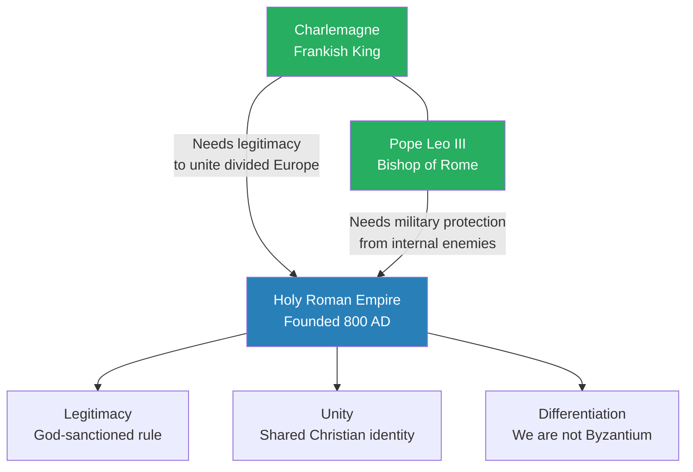
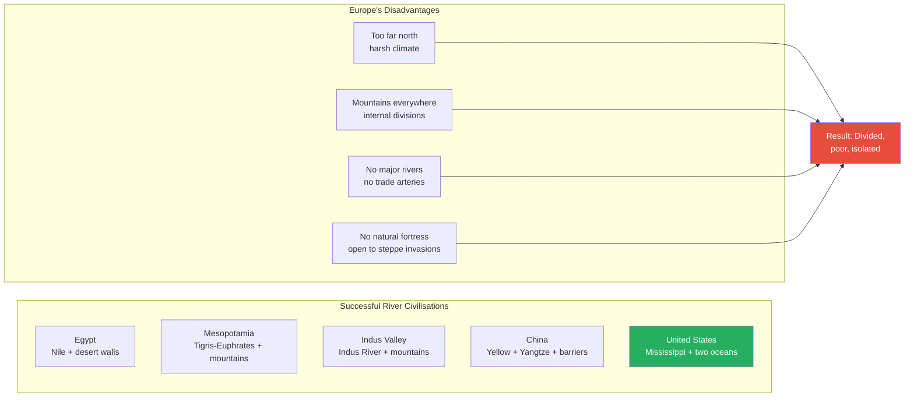
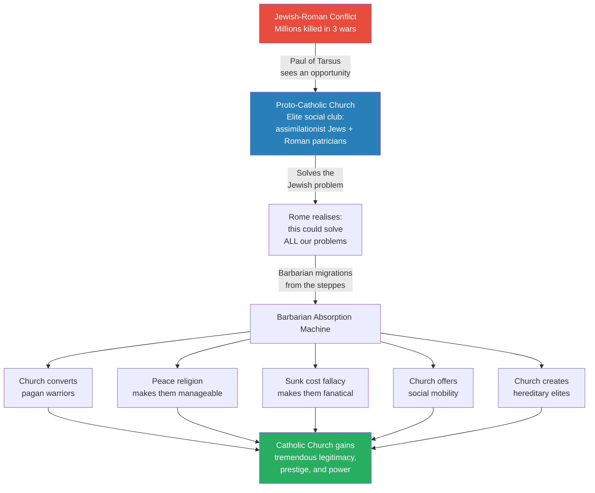
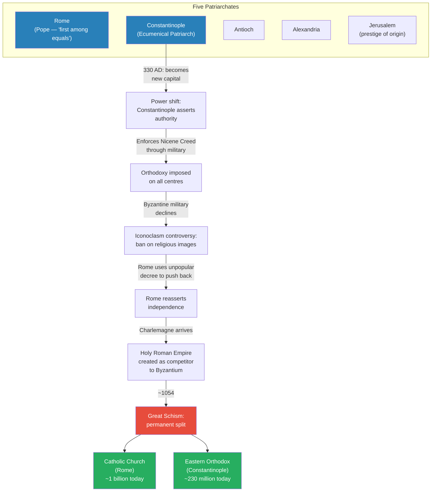
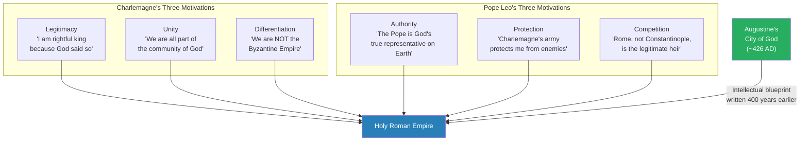
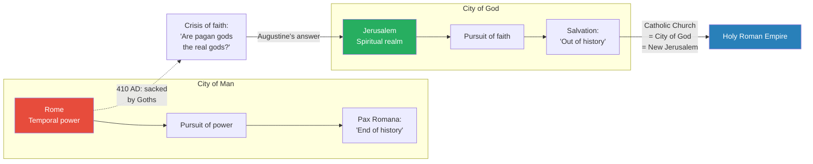
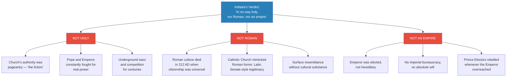
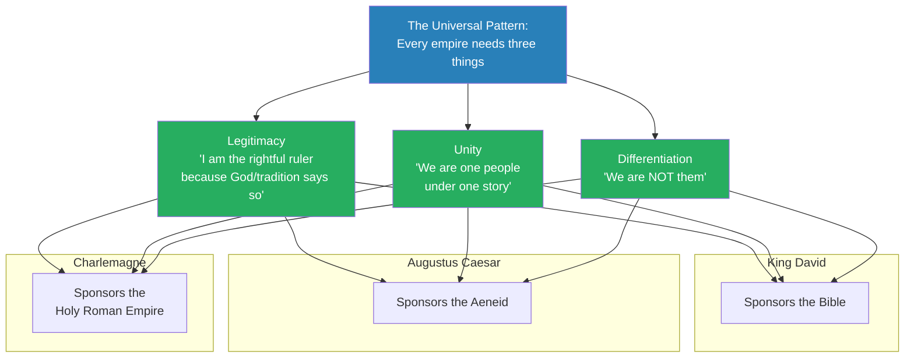

# The Useful Fiction of the Holy Roman Empire

> Voltaire famously quipped that the Holy Roman Empire was "in no way holy, nor Roman, nor an empire." Prof. Jiang demonstrates that this was not a joke but a precise diagnosis. He traces how Charlemagne and Pope Leo III created a political fiction in 800 AD to solve an impossible problem: unifying a Europe that geography had permanently divided. The lecture reveals that the Catholic Church rose to power not through miracles but as an elite social club for Jews and Romans, then as a barbarian-absorption machine exploiting the sunk cost fallacy. Augustine's *City of God* provided the intellectual blueprint centuries before anyone could build the structure. The result was a fragile confederacy held together by the idea of legitimacy rather than by territory, military, or resources.

---

## Overview: Key Highlights

- <b style="color: #27ae60">Legitimacy, not military force, is the only way to unify Europe</b> — geography made conquest impossible, so Charlemagne needed the Pope's spiritual authority
- <b style="color: #2980b9">The Holy Roman Empire</b> — a "useful fiction" created in 800 AD when Pope Leo III crowned Charlemagne, reversing who anoints whom
- <b style="color: #e74c3c">Europe's fatal geography</b> — too far north, too many mountains, no major rivers, no natural fortress: the opposite of every successful river civilisation
- <b style="color: #2980b9">Augustine's City of God</b> — the intellectual blueprint written 400 years before the Holy Roman Empire it inspired
- <b style="color: #27ae60">The Catholic Church as barbarian-absorption machine</b> — converting pagan migrants to a religion of peace made them manageable, and the sunk cost fallacy made them fanatical
- <b style="color: #e74c3c">Christianity was not a miracle — it was a political solution</b> — Paul of Tarsus backed by Rome created Christianity to neutralise the Jewish-Roman conflict
- <b style="color: #2980b9">Iconoclasm controversy</b> — Constantinople's ban on religious images gave Rome the opening to reassert independence
- <b style="color: #27ae60">New converts are the most fanatical believers</b> — the sunk cost fallacy explains why barbarian converts became zealous missionaries
- <b style="color: #2980b9">The Great Schism (~1054)</b> — permanent split between Catholic (Rome) and Eastern Orthodox (Constantinople) churches
- <b style="color: #e74c3c">Voltaire was right on all three counts</b> — not holy (the Church was a front), not Roman (Roman culture died in 212 AD), not an empire (the emperor was elected and had no absolute power)
- <b style="color: #27ae60">Ideas move history, not economics or armies</b> — without Augustine imagining it first, the Holy Roman Empire could not have existed
- <b style="color: #2980b9">Prince Electors</b> — local kings who elected the emperor and demanded autonomy, prefiguring European feudalism

| Concept | One-line summary |
|---------|-----------------|
| **Legitimacy** | The power to rule through perceived rightfulness, not military force |
| **Useful fiction** | A shared pretence maintained because all parties benefit from it |
| **Holy Roman Empire** | A confederacy of European kingdoms united by the fiction of Roman-Church legitimacy, not actual imperial power |
| **Carolingian Renaissance** | Charlemagne's era of cathedral-building and cultural revival across Europe |
| **City of God (Augustine)** | Two cities: temporal Rome (power) vs. spiritual Jerusalem (faith) — the Catholic Church as heaven on earth |
| **Iconoclasm** | Constantinople's ban on religious images, which Rome used as leverage to reassert independence |
| **Great Schism** | The permanent split (~1054) between Roman Catholic and Eastern Orthodox churches |
| **Prince Electors** | Local princes who elected the Holy Roman Emperor — the real holders of power |
| **Sunk cost fallacy** | Converts who gave up their identity to join a religion become its most fanatical adherents |
| **Barbarian migration vs. invasion** | Migrants seek assimilation and opportunity; invaders seek conquest — a critical distinction |
| **Cathedral acoustics** | Designed so the priest's voice surrounds parishioners, creating the sensation of hearing God |
| **Five patriarchates** | Rome, Constantinople, Antioch, Alexandria, Jerusalem — the five major early Christian churches |

---

# The Lecture

## Charlemagne and the Crowning That Reversed History [0:00 - 9:46]

*Prof. Jiang opens with Voltaire's famous quip about the Holy Roman Empire and promises to prove it literally true. He introduces the founding event of 800 AD — Charlemagne crowned by Pope Leo III — and explains why this reversal of who anoints whom marked a turning point in Western history. He then reveals why Europe's geography made the empire a necessary fiction.*

> [!tip] Core Insight
> Before 800 AD, emperors anointed popes. After it, popes anointed emperors. This reversal established the Catholic Church's supremacy — and it happened because Europe's geography made military unification impossible. Legitimacy was the only currency that could buy unity.

*The Holy Roman Empire was a mutual bargain: Charlemagne got divine legitimacy; Leo got military protection. Both got a competitor to the Byzantine Empire.*

*Europe lacked every geographic advantage that allowed other civilisations to unify early. This is why legitimacy — not conquest — was the only path to unity.*

> [!note]- Expand: Full Lecture Detail
> Prof. Jiang opens by framing the lecture as a companion to the previous class on the Byzantine Empire. The Byzantine Empire was the continuation of Rome in the East; the Holy Roman Empire claimed to be its continuation in the West. He introduces Voltaire — "a very famous French enlightenment thinker, we will talk about Voltaire when we get to enlightenment" — and his famous verdict: the Holy Roman Empire was "in no way holy, nor Roman, nor an empire."
>
> "A lot of historians thought it was a joke," Prof. Jiang says. "But what I will show you this class is actually this is very true."
>
> He establishes the founding event: in 800 AD, the Frankish King <b style="color: #2980b9">Charlemagne</b> — "his name means Charles the Great" — was crowned Holy Roman Emperor by <b style="color: #2980b9">Pope Leo III</b> in Rome. This was a turning point because it reversed the traditional order: previously, the emperor anointed the Pope; now the Pope anointed the emperor. This showed the supremacy of the Catholic Church.
>
> Prof. Jiang describes Charlemagne's military innovations:
> - He introduced <b style="color: #2980b9">armoured knights</b>, which became standard European military doctrine for centuries
> - The concept of the knight paved the way for feudalism — topics for later lectures
> - He united most of Europe through a combination of conquest, alliances, treaties, friendships, and strategic marriages
>
> Charlemagne's greatest cultural achievement was the <b style="color: #2980b9">Carolingian Renaissance</b>:
> - He built 14 cathedrals, the most famous being the Aachen Cathedral in Germany ("you can still go visit it")
> - Prof. Jiang compares cathedrals to pyramids — "meant to give people a sense of awe and unity"
> - The cathedrals were designed to "bring heaven onto Earth"
> - The acoustics were engineered so the priest's voice bounced off walls and surrounded the congregation: "the parishioners feel they're surrounded by the voice of God... the voice literally enters you and makes you feel transcendent"
>
> Prof. Jiang then pivots to geography, presenting a map of the four great river civilisations — Egypt, Mesopotamia, the Indus Valley, and China — and identifies three shared characteristics:
> - **Same latitude** — temperate climate enabling year-round agriculture
> - **Central rivers** surrounded by flatlands — enabling surplus, trade, and communication
> - **Natural boundaries** — mountains, deserts, or oceans protecting against invasion
>
> He uses the United States as the modern example: "a fortress, basically — protected by two oceans and then mountains," serviced internally by the Mississippi River, which allowed it to become wealthy and unified without fearing external enemies.
>
> <b style="color: #e74c3c">None of these three factors apply to Europe:</b>
> - Too far north for reliable year-round agriculture
> - Southern Europe is mountains; northern Europe is flatlands covered by forests
> - No major rivers for trade and communication
> - Internal mountains created permanent divisions between fiefdoms
> - Crucially, no natural barriers protecting against the steppes — "the most aggressive place in human history"
>
> "For most of its history, Europe was divided and poor and isolated from the rest of the world."
>
> He makes a critical distinction: "Rome was not a European empire. It was a Mediterranean empire. That's a huge difference."
>
> Because of this geography, even Charlemagne — who had the greatest army in Europe — could not compel other kings to obey. The local princes had castles, mountains, and fierce independence. <b style="color: #27ae60">"If you want to unify Europe, you cannot do so through military conquest. You have to do so through the idea of legitimacy. People have to believe you are the legitimate ruler. You cannot compel them. You must win their hearts and minds."</b>
>
> This explains why Charlemagne wanted the Pope's crown: the Pope had legitimacy as head of the Catholic Church, and many European kings were Catholic. The Pope's blessing transformed a Frankish warlord into God's chosen ruler.
>
> Prof. Jiang shows a map of the world's major cities at the fall of Rome — most were concentrated in the temperate latitude belt, with very few in northern Europe. After Rome fell, Europe was "a divided, weak and poor place."
>
> He notes the great irony: despite all these disadvantages, Europe eventually conquered the world — precisely because of its disadvantages. "These disadvantages compel you as a people, as a culture, to be innovative, to overcome these disadvantages." This will become clear when the series reaches the Enlightenment, the Renaissance, and the Scientific Revolution.
>
> **The Steppe Invasions Never Stopped:**
> - Europe had almost no natural barriers protecting it from the steppes — "the most aggressive place in human history"
> - Steppe peoples were pastoralists who needed land for sheep and cattle, constantly fighting each other for territory
> - Losers were pushed further out into the borderlands — often into Europe, the only direction available
> - Prof. Jiang connects this to earlier lectures: the same process that brought the Yamnaya into Europe continued through the fall of Rome
> - In the late Roman Empire, new migrations were triggered by the <b style="color: #2980b9">Huns</b> — "extremely violent" and possessing "major military innovations that allow them to out-compete others in the steppes"
> - Attila the Hun's campaigns forced other groups — Goths, Vandals, Franks — into Roman territory
> - After Rome collapsed, these groups formed their own kingdoms across what is now France and Germany
> - Over centuries, through "multiple kings and multiple dynasties," the Franks gradually expanded from Germany and conquered most (not all) of Europe
> - In the process, they made contact with the previously isolated Scandinavian peoples — the Norse, "we often refer to them as Vikings, and we will study them next class"
>
> **The Frankish Empire was not really an empire:**
> - The emperor was not born to the title — he was elected by other kings called <b style="color: #2980b9">Prince Electors</b>
> - "You should see this as an alliance, as a confederacy, where each king has voting power"
> - This was not a hereditary title — it was something "you are elected to"
> - After Charlemagne's death, the empire split into three within a couple of decades
> - On paper it lasted until 1806, but its history was "extremely tumultuous" — there were periods when the empire "completely disintegrates"
> - They maintained the pretence because <b style="color: #27ae60">"what matters is not territory or military or resources. What matters the most is legitimacy"</b>
> - "The idea of the Holy Roman Empire gives legitimacy, confers legitimacy, mainly through the Catholic Church"

---

## How the Catholic Church Became Europe's Power Broker [9:46 - 28:48]

*Prof. Jiang reconstructs the real history of the Catholic Church — not the miracle story, but the political one. He explains how Paul of Tarsus engineered Christianity to solve the Jewish-Roman conflict, how the Roman state then weaponised it to assimilate barbarian migrants, and how the sunk cost fallacy turned new converts into the religion's most fanatical believers.*

> [!tip] Core Insight
> The Catholic Church was not built by miracles. It was built as an elite social club where assimilationist Jews and Roman patricians could cooperate — then repurposed as a barbarian-absorption machine. New converts became the most fanatical believers because the sunk cost fallacy locked them in.

*The Catholic Church grew powerful not through faith but through institutional utility — solving first the Jewish problem, then the barbarian problem, accumulating legitimacy at each step.*

> [!note]- Expand: Full Lecture Detail
> Prof. Jiang first presents the official Catholic history:
> - Jesus, a god in human form, sacrificed himself to free humanity from sin
> - His 12 disciples spread the gospel and set up churches — the first bishops
> - Their authority came from Jesus himself
> - Despite Roman persecution, Christians triumphed through faith and converted all of Rome
> - Christianity became Rome's official religion and missionaries converted the barbarians
>
> "There are lots and lots of issues with this story," Prof. Jiang says flatly. "The major issue is, how is it that a peasant religion was able to conquer the Roman Empire?" He notes that Greek philosophy, Platonic traditions, and established pagan religions were all "much more compelling than the Christian faith." And as he has explained throughout the series, "culture is persistent. People do not want to change their cultures."
>
> The Catholic explanation: "It's a miracle, guys. It's the power of faith. That's the explanation. That's it."
>
> Prof. Jiang then offers his alternative history, building on material from [[25 - Paul of Tarsus, Messiah of Rome]]:
>
> **The Jewish-Roman Conflict:**
> - Romans and Jews were in constant conflict throughout the Empire
> - Three terrible wars were fought in Judea, killing millions
> - Jews accounted for roughly 10% of the Roman Empire's population — "that's a lot of people"
> - In Alexandria, Jews were a third of the population, and several riots erupted
> - Jews were cosmopolitan, well-educated, and looked down on the Romans
>   - Jews respected Greeks for their superior culture
>   - Jews and Persians got along well ("Persians are extremely tolerant people")
>   - Jews and Romans actively disliked each other
> - After the wars, Romans enslaved Jews and sent them to Rome — then released them "because they didn't like Jews"
>
> **Paul's Solution:**
> - <b style="color: #2980b9">Paul of Tarsus</b> was a Roman citizen, well-established within the Empire
> - He and other assimilationist Jews wanted to integrate but were blocked by a religious belief: the Messiah from the House of David would return to lead Jews to victory against Rome
> - This was a problem because "Paul knew that if the Jews united against the Romans, the Romans would probably win"
> - Jesus's crucifixion made him enormously popular in the Jewish world — "he became like a rock star within the Jewish community"
> - After his death, people flocked to his disciples; his brother James led a movement called the "poor of Jerusalem" (later the Ebionites — "these are the people who will influence the Islamic religion")
> - Paul saw an opportunity: Jesus was a prophet of peace — "forgive the Romans for destroying our temple, forgive the Romans for persecuting us. Show mercy, because what mattered is not what happens here. What matters is what happens in heaven"
> - <b style="color: #e74c3c">Paul, backed by the Roman state, created Christianity as a way for Jews to practise their faith without threatening the Roman Empire</b>
> - Over time, as Jewish-Roman conflict worsened, the Christian movement spread and "won the patronage of Roman patriarchs"
> - The proto-Catholic Church became "an elite social club for Jews and Romans to get together and to work together"
> - Because it was backed by the Roman state and had superior organisation and wealth, it won out over other Christian sects
>
> **The Barbarian Absorption Function:**
> - Rome eventually recognised: the Church could solve not just the Jewish problem but all problems
> - Barbarians migrating from the steppes were not invaders but migrants — "they're looking for better economic opportunities and therefore they are willing to conform to your worldview"
> - Prof. Jiang draws a direct parallel to the modern United States: millions crossing the southern border each year are there to assimilate, not conquer; "the group that assimilates best are Chinese Christians"
> - The Church converted pagan warriors — "they worship war, they worship violence" — to a religion preaching "peace, mercy, forgiveness, kindness" — making them easier to manage
>
> **The Sunk Cost Fallacy:**
> - Prof. Jiang identifies a key psychological mechanism: <b style="color: #27ae60">"The people who most believe in this religion, who are the most fanatical about this religion, are new converts"</b>
> - People born into a religion take it for granted and often rebel
> - Converting to a new religion means giving up "your community, your traditions, your history, your sense of identity"
> - Because of the <b style="color: #2980b9">sunk cost fallacy</b>, converts become fully committed whether or not they truly believe — "you are so fanatical that you not only convert but you want to convert others as well"
>
> **Social Mobility and Hereditary Elite Creation:**
> - The church and the military were historically the two major mechanisms of social mobility for outsiders
> - Most barbarian leaders were elected temporarily — the Church offered them something extraordinary:
>   - In exchange for joining, the Church could make temporary leaders into a <b style="color: #27ae60">hereditary elite</b> — "their advantages and social status will pass on to their children"
>   - This was "an extremely appealing deal for these barbarian leaders"
> - Through all these mechanisms — conversion, social mobility, elite creation — the Catholic Church accumulated "tremendous legitimacy and prestige and status"

---

## The Five Patriarchates and the Road to Schism [38:47 - 46:36]

*Prof. Jiang maps the five major early Christian churches, explains how Constantinople's rise to capital status triggered a power struggle over orthodoxy, and shows how the iconoclasm controversy gave Rome the opening to break free and ally with Charlemagne.*

*The road from five equal churches to permanent schism was driven by capital relocation, military enforcement of doctrine, and the iconoclasm controversy — each step pushing Rome further from Constantinople until the break became irreversible.*

> [!note]- Expand: Full Lecture Detail
> Prof. Jiang explains that in the early Church system, local churches had local autonomy — "because you're trying to let in local elites, you have to give them autonomy." Five major churches ruled collectively:
>
> - **Rome** — primary because it was the capital of the Roman Empire; its bishop was called the Pope to distinguish him from others
> - **Constantinople** — gained prominence after becoming the new capital in 330 AD
> - **Antioch** — one of the four major population centres
> - **Alexandria** — another major centre; one-third Jewish population
> - **Jerusalem** — included because of its prestige as the birthplace of Christianity
>
> For most of early Christian history, these five churches were independent of each other and free to develop their own doctrine and practices within the Christian framework.
>
> **Constantinople's Power Grab:**
> - When the capital moved to Constantinople in 330, the Constantinople church wanted to assert authority over the others
> - The mechanism was <b style="color: #2980b9">orthodoxy</b> — imposing the <b style="color: #2980b9">Nicene Creed</b> (the Holy Trinity) on all churches
> - When the Nicene Creed was first formulated, "most churches do not buy into the Holy Trinity"
> - Constantinople used military force over decades to enforce the Creed on all centres
> - "The Catholic Church is able to build legitimacy and power by imposing orthodoxy"
>
> **The Iconoclasm Controversy:**
> - As the Byzantine Empire's military declined, other churches — especially Rome — wanted to reassert local autonomy
> - Constantinople decreed <b style="color: #2980b9">iconoclasm</b>: God should not be celebrated in images — no paintings of God or Jesus
> - This was deeply unpopular, and the Pope in Rome used it as an opportunity to push back
> - "What this iconoclasm debate shows us is that Rome wants to maintain its independence. Not only does Rome want to maintain its independence, it wants to regain its lost authority"
>
> **The Alliance with Charlemagne:**
> - When Charlemagne appeared, the Church saw "the perfect opportunity to reassert its dominance — its dominance over the idea of legitimacy"
> - Together they created the Holy Roman Empire as:
>   - A competitor to the Byzantine Empire
>   - A mechanism to ensure the prestige of the Catholic Church in Rome against Constantinople, Alexandria, Antioch, and Jerusalem
>
> **The Great Schism (~1054):**
> - The two churches — Rome and Constantinople — "permanently break off. They refuse to acknowledge each other"
> - Rome became the basis of the <b style="color: #2980b9">Catholic Church</b> ("Catholic means universal") — about 1 billion believers today
> - Constantinople became the basis of the <b style="color: #2980b9">Eastern Orthodox Church</b> — about 230 million believers, mainly in Eastern Europe
> - At first, only one major doctrinal difference: Rome asserted the Pope was "first among equals" with ultimate authority; Orthodoxy asserted all churches were equal
> - Later, the Protestant Reformation caused Catholic doctrine to "radically diverge" from Orthodox over time

---

## Augustine's City of God as Intellectual Blueprint [46:36 - 56:31]

*Prof. Jiang summarises the motivations of both Charlemagne and Pope Leo III, then reveals the intellectual foundation beneath the political bargain: Augustine's City of God, written 400 years earlier, which gave them the conceptual framework to imagine a spiritual empire outside of history.*

> [!tip] Core Insight
> Ideas move history. Augustine imagined the Holy Roman Empire four centuries before it existed. Without the *City of God*, Charlemagne and Leo could not have conceived of what they built. "You need someone to imagine the idea before you can actually implement it on earth."

*Both Charlemagne and Leo had distinct motivations — but Augustine's idea gave them the shared conceptual language to build something that served both.*

*Augustine's two-city framework resolved the crisis of 410 AD: Rome's fall did not disprove Christianity because the earthly city was always temporary. The real project was building Jerusalem — and the Catholic Church was that project.*

> [!note]- Expand: Full Lecture Detail
> Prof. Jiang pauses to summarise Charlemagne and Leo's respective motivations:
>
> **Charlemagne's motivations (three):**
> - **Legitimacy** — "I'm the rightful king, because God said so"
> - **Unity** — "We're all part of the community of God"
> - **Differentiation** — "We are not the Byzantine Empire"
>
> Prof. Jiang draws parallels across the series: "Why did King David sponsor the writing of the Bible? For these three reasons. Why did Augustus Caesar sponsor the writing of the Aeneid? For these three reasons." The pattern is universal.
>
> **Pope Leo's motivations (three):**
> - **Authority** — establishing that the Pope is God's true representative on Earth
> - **Protection** — before crowning Charlemagne, Leo was nearly assassinated by internal Church enemies; Charlemagne's army provided military protection
> - **Competition** — Rome and Constantinople were both claiming to be the legitimate heir to the Roman Empire; "obviously Byzantium has a better case than Rome, and that's why Pope Leo feels compelled to create the idea of the Holy Roman Empire"
>
> **Augustine's City of God:**
> - Prof. Jiang then reveals the intellectual foundation: <b style="color: #2980b9">Augustine's *City of God*</b>, discussed in [[27 - Augustine's Empire of God]]
> - Augustine was Bishop of Hippo in North Africa
> - His crisis: in 410 AD, Rome was sacked by the Goths — only decades after Christianity became Rome's official religion
> - People began to believe the pagan gods were enacting revenge for being abandoned: "the Christian God is the false god. The pagan gods are the true gods"
> - Augustine wrote *City of God* to answer this crisis
>
> The framework:
> - **City of Man (Rome)** — temporal, earthly, a place where people pursue power and kings compete; aims for the "end of history" through permanent peace (Pax Romana)
> - **City of God (Jerusalem)** — metaphorical, spiritual, a place where people pursue faith and devotion; aims to step "out of history" because "human affairs don't really matter"
> - <b style="color: #27ae60">"Our mission is to create Jerusalem, and that's what the Catholic Church does. The Catholic Church is the city of God. It's the new Jerusalem."</b>
>
> The *City of God* became the intellectual blueprint for the Holy Roman Empire:
> - Charlemagne — "apparently illiterate" — had the book read to him every day
> - He made it the official text of the Holy Roman Empire
> - <b style="color: #27ae60">"Without the City of God, they could not have imagined the Holy Roman Empire"</b>
> - "That's the power of ideas. You need someone to imagine the idea before you can actually implement it on earth."

---

## Voltaire Was Right: Not Holy, Not Roman, Not an Empire [56:31 - 1:01:10]

*Prof. Jiang closes by systematically validating each of Voltaire's three charges against the Holy Roman Empire, revealing a political system held together by pretence — a Game of Thrones beneath a veneer of Christian unity.*

*Voltaire's quip was not wit but diagnosis. On every count, the Holy Roman Empire failed the test of what it claimed to be.*

> [!note]- Expand: Full Lecture Detail
> Prof. Jiang takes each of Voltaire's three charges and validates them:
>
> **Not Holy:**
> - The idea of "holy" was that the Catholic Church was the power in charge — "but that's just pageantry. That's the fiction"
> - <b style="color: #e74c3c">"The entire Holy Roman Empire is a useful fiction"</b>
> - The king and the Pope benefited from pretending the Church was in charge to confer legitimacy and display unity
> - "But this fiction depends on the Pope and the Emperor getting along, and after Charlemagne, what we'll see is they don't get along"
> - Both were elected by local lords — the Pope by bishops, the Emperor by prince electors — and "these people are also extremely ambitious. They want to be the Pope. They want to be the Emperor"
> - The result: "There's still conflict going on. There's still wars and competition going on that will last for centuries... but it all goes underground. They all hide it. They pretend that Europe is at peace, when really it's at war"
> - Prof. Jiang's verdict: <b style="color: #e74c3c">"It's a Game of Thrones situation"</b>
>
> **Not Roman:**
> - The Catholic Church went "out of its way to appear like the Roman Empire":
>   - Latin as the language of bureaucracy and liturgy
>   - Cultural practices modelled on Roman ones
>   - Positioning itself as a successor institution to the Roman Senate — conferring legitimacy onto the Emperor just as the Senate once conferred legitimacy onto the Emperor
> - The parallel was deliberate: "In the Roman Empire, it's the Senate that confers legitimacy onto the Emperor, and in this world, it's the Catholic Church that confers legitimacy onto the Emperor"
> - But surface resemblance is not cultural continuity
> - As Prof. Jiang explained in earlier lectures, "the culture of the Romans died with the Empire, and the death of this culture started in the year 212 when Roman citizenship was given to everyone" — diluting the exclusive civic identity that defined Rome
> - <b style="color: #e74c3c">"The Roman Empire died a long time ago. The Catholic Church is not Roman"</b>
> - What survived was a costume, not the substance — Latin on documents does not make you Roman any more than a toga on a Frank makes him a senator
>
> **Not an Empire:**
> - The Byzantines were a real empire: they had imperial bureaucracy and a military that could enforce the emperor's will on the provinces
> - The Holy Roman Emperor's will was never absolute — he needed the support of allies
> - Prince electors repeatedly rebelled when the Emperor tried to enforce his will on them — "they need to protect their autonomy"
> - This dynamic — real power residing with local princes rather than a central authority — is what would give rise to <b style="color: #2980b9">feudalism</b> in Europe

---

## The Universal Pattern: Legitimacy, Unity, Differentiation

*Prof. Jiang identifies a recurring pattern across the entire series: every empire-builder commissions a foundational text or institution for the same three reasons. The Holy Roman Empire is just the latest instance.*

*The same three-part formula appears across millennia and continents. What changes is the vehicle — a sacred text, an epic poem, a political fiction — but the underlying logic is identical.*

---

## The Prince Electors and the Bargain of Mutual Legitimacy [1:01:10 - 1:03:58]

*In a Q&A exchange, Prof. Jiang explains why local princes benefited from the Holy Roman Empire despite its fictional nature — the Catholic Church functioned as a freelance imperial bureaucracy, providing the mental infrastructure that kept Europe's fragmented polities loosely aligned.*

> [!note]- Expand: Full Lecture Detail
> A student asks about the relationship between Prince Electors and the Emperor. Prof. Jiang explains the mutual benefit:
>
> - If you are a local prince, "you also have people who want your throne"
> - You also need to keep your people united — the Catholic Church and its religion of Catholicism was "an important mechanism for you to assert authority over your people and to keep you safe from your enemies"
> - <b style="color: #27ae60">The Catholic Church was "trying to be the freelance imperial bureaucracy of Europe"</b> — in the absence of a real emperor with real power, the Church tried to create the shared culture and "mental reality" of all Europeans
> - The mechanism was the local priests: "The people are interacting with the local priests, not with bureaucrats"
>   - Through priests, you could collect information on the people — how much money they were making — "so you can tax them better"
>   - Through priests, you could "better control their thoughts"
>   - The priest functioned as intelligence agent, tax assessor, and thought police rolled into one — all under the banner of spiritual care
> - "Everyone's benefiting from this relationship, but it's a delicate balance"
>   - Local princes demanded autonomy even as they benefited from the system
>   - The Catholic Church and Emperor wanted central authority; local princes wanted independence
>   - This created a permanent tension: cooperation on the surface, competition underneath
> - Prof. Jiang concludes: this tension would define European politics for centuries and ultimately give rise to the system of feudalism where real power resided with local lords, not the nominal emperor

---

## Connections

**Builds on:** [[33 - The Rise and Fall of the Byzantine Empire]] (the Eastern counterpart to this lecture's Western focus), [[27 - Augustine's Empire of God]] (City of God as intellectual framework), [[25 - Paul of Tarsus, Messiah of Rome]] (Paul's political engineering of Christianity), [[26 - Constantine's Monotheistic Revolution]] (how Christianity became Rome's state religion)

**Sets up:** [[35 - The Viking Legacy]] (the Norse enter European history through contact with the Frankish Empire), [[40 - Church and Empire]] (the ongoing medieval tension between religious and secular power), [[42 - The Protestant Reformation and the Birth of Capitalism]] (the Reformation that later shattered Catholic unity)

**Related books in vault:** [[Sapiens - Yuval Noah Harari]] (agricultural revolution, religion as social glue), [[The Prince - Niccolo Machiavelli]] (legitimacy vs. force in governance)

---

## The Takeaway

This lecture reveals that one of history's most enduring political structures was built not on territory, military, or resources but on a shared fiction that everyone found useful. The Holy Roman Empire survived — in name at least — for over a thousand years (800-1806), not because it worked as an empire but because the fiction of divine legitimacy served every player at the table: the emperor got God's sanction, the Pope got military protection, and local princes got a framework that stabilised their own authority. The moment any party stopped benefiting, the fiction frayed — but no one could afford to be the first to abandon it entirely.

The most counterintuitive insight is Prof. Jiang's insistence that ideas, not armies, are the engine of history. Augustine — a North African bishop writing in the aftermath of Rome's sack in 410 — could not have known that his theological response to a crisis of faith would become the constitutional framework of an empire four centuries later. Charlemagne, apparently illiterate, had the *City of God* read to him daily. The intellectual blueprint preceded the physical structure by 400 years. This inverts the materialist assumption: it was not power that created the idea of the Holy Roman Empire, but an idea that created the conditions for power.

The lecture leaves open a tension that Prof. Jiang promises will dominate the rest of the European story: the Holy Roman Empire was a delicate balance between central authority and local autonomy, between the Pope's spiritual claims and the Emperor's temporal ambitions. After Charlemagne, that balance collapsed into centuries of underground warfare — "a Game of Thrones situation" — whose consequences carry through the Investiture Controversy, the Reformation, and into the 20th century. The seeds of European feudalism, the Protestant Reformation, and even the modern nation-state are all visible in the contradictions of this useful fiction.
