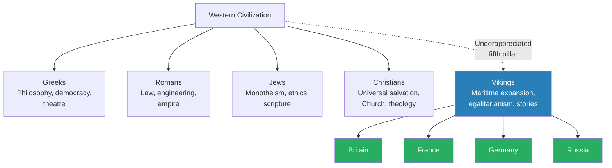
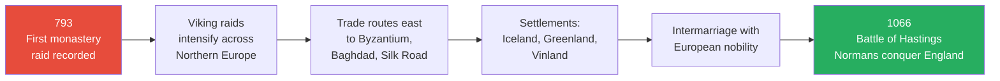
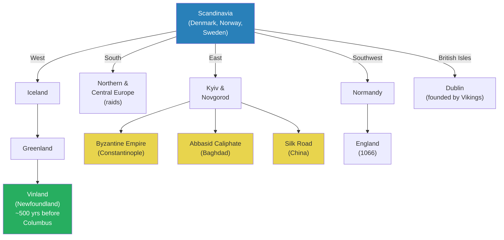
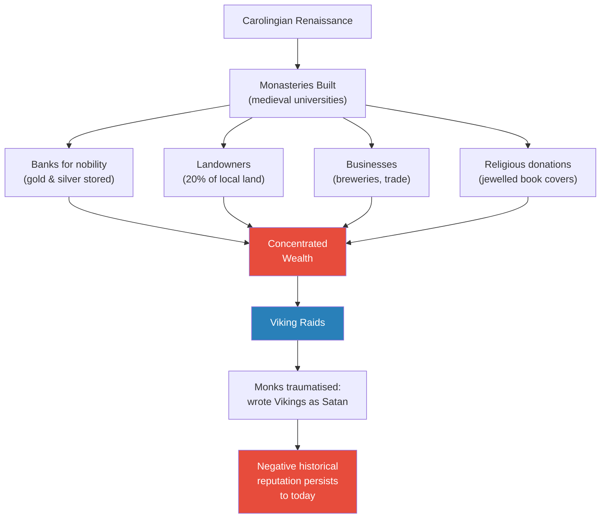
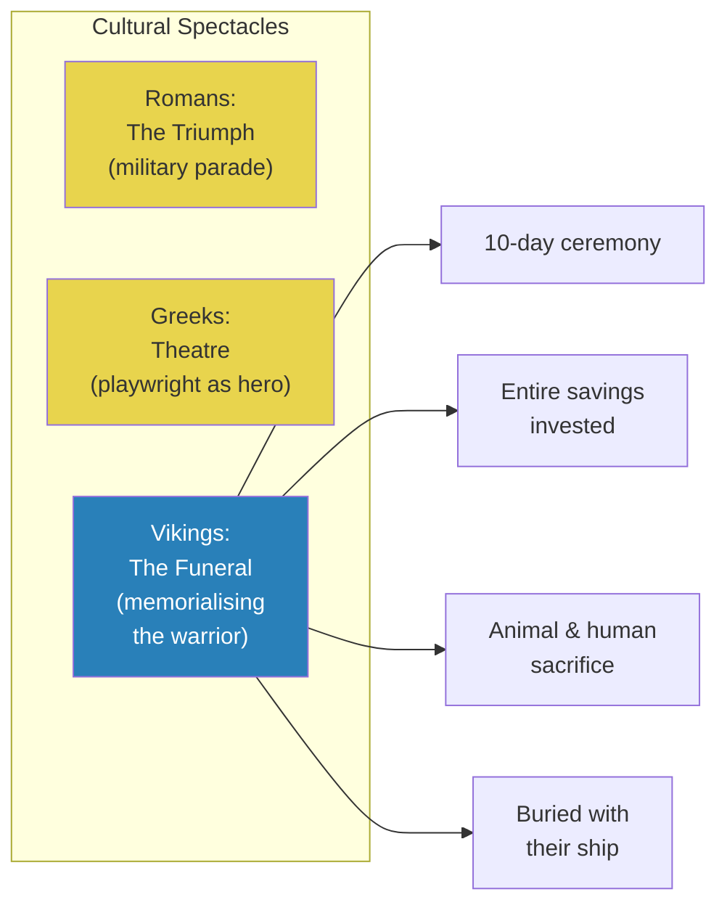
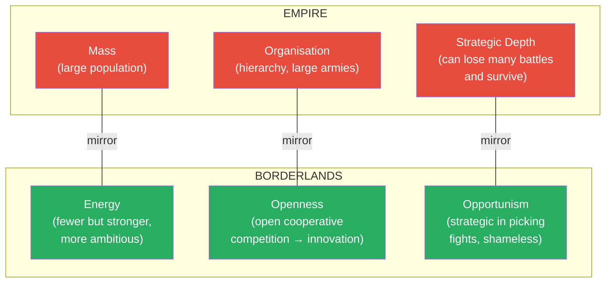
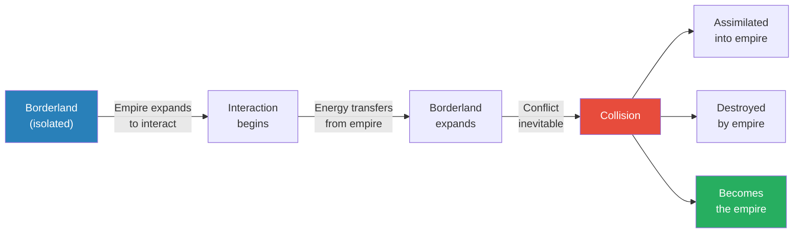
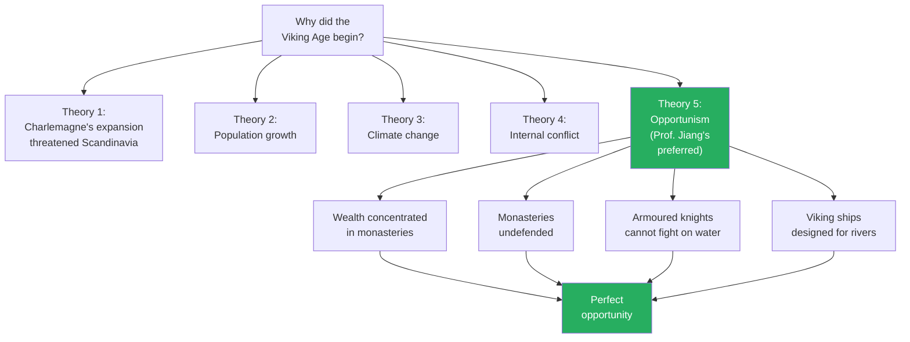
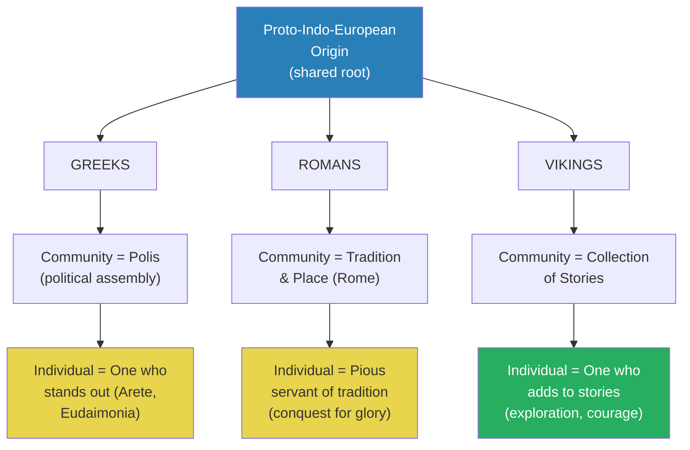

# The Viking Legacy

> Prof. Jiang argues that the Vikings are one of the most underappreciated pillars of Western civilization — not mere raiders but a borderland culture whose energy, openness, and opportunism allowed them to found or influence four of Europe's dominant civilizations: Britain, France, Germany, and Russia. He introduces the Vikings through their geography, expansion, and technology before locating them within his "oceanic currents of history" framework — the recurring pattern where an energetic borderland absorbs an empire's energy, expands, and either destroys, assimilates into, or becomes the empire. The lecture concludes with a striking comparison of how Greeks, Romans, and Vikings each conceived of community and the individual — for Vikings, community was a collection of stories, and individuality was earned through adventure and exploration.

---

## Overview: Key Highlights

- <b style="color: #27ae60">The Vikings should be Western civilization's fifth pillar</b> — alongside Greeks, Romans, Jews, and Christians, their influence on Europe has been systematically underappreciated
- <b style="color: #2980b9">Oceanic currents of history</b> — the recurring pattern where a borderland culture absorbs an empire's energy, expands, and eventually assimilates or replaces the empire
- <b style="color: #e74c3c">Monasteries were the real target</b> — not random violence but strategic opportunism targeting concentrated wealth that feudal Europe left undefended
- <b style="color: #27ae60">Vikings founded or shaped four dominant civilizations</b> — Britain, France, Germany, and Russia owe their cultural DNA partly to Norse influence
- <b style="color: #2980b9">Empire vs. Borderlands triad</b> — empires have mass, organisation, and strategic depth; borderlands have energy, openness, and opportunism
- <b style="color: #e74c3c">Europe deliberately refused to adapt</b> — feudal hierarchies could not change their military structure without changing their political system, so they absorbed Viking raids rather than counter them
- <b style="color: #2980b9">Open cooperative competition</b> — the same principle that drove Yamnaya and Greek innovation also drove Viking ship technology
- <b style="color: #27ae60">Viking community was a collection of stories</b> — individuality was earned by adding to those stories through exploration, adventure, and courage
- <b style="color: #e74c3c">The slave trade was central to Viking economics</b> — Vikings enslaved pagans and sold them to Christians and Muslims, who could not enslave co-religionists
- <b style="color: #2980b9">The Viking funeral as cultural spectacle</b> — equivalent to the Roman triumph or Greek theatre, the funeral was the supreme cultural event
- <b style="color: #27ae60">A Viking teenager at 16 was more worldly than a modern Chinese student</b> — Prof. Jiang's provocative comparison illustrating the difference between energetic and mass societies
- <b style="color: #e74c3c">Viking assimilation was co-optation by success</b> — the Vikings became so wealthy that intermarriage with European nobility and conversion to Christianity became the rational path

| Concept | One-line summary |
|---------|-----------------|
| **Oceanic currents of history** | Borderland cultures absorb imperial energy, expand, then assimilate into or replace the empire |
| **Mass vs. energy** | Empires have numbers and depth; borderlands have ambition, skill, and aggression |
| **Strategic depth** | An empire can lose many battles and survive; a borderland cannot afford to lose once |
| **Open cooperative competition** | No central authority + mutual learning + rivalry = innovation (Yamnaya, Greeks, Vikings) |
| **Opportunism** | Borderlands are shameless in exploiting weakness — attacking the vulnerable, befriending the powerful |
| **Viking Age (793-1066)** | From the first recorded monastery raid to the Norman conquest of England at Hastings |
| **Monasteries as wealth concentrators** | Medieval universities storing gold, silver, jewelled book covers, and noble wealth |
| **Long ships** | Small, flexible, river-capable vessels — the dominant maritime technology of the age |
| **The Ruse** | Eastern Vikings who founded Kyiv and Novgorod, giving Russia its name |
| **Community as stories** | Viking identity: the community is the collection of stories told; the individual adds to them through deeds |
| **Feudalism's structural rigidity** | Military structure determines political structure — changing one requires changing the other |

---

# The Lecture

## The Vikings as Western Civilization's Fifth Pillar [0:00-2:30]

*Prof. Jiang opens with a bold thesis: the Western tradition rests on four pillars — the Greeks, the Romans, the Jews, and the Christians — but the Vikings deserve to be the fifth. He argues that scholars will increasingly reveal Viking cultural influence over the coming decades.*

> [!tip] Core Insight
> The four "overstudied" pillars of Western civilization — Greeks, Romans, Jews, Christians — have obscured a fifth: the Vikings. Their cultural contribution to European civilization's development has been systematically underappreciated.

*The four established pillars are well-studied. Prof. Jiang's argument is that the Vikings — the dashed connection — are the missing fifth, and their influence flows directly into the four nations that dominated the past 500 years.*

> [!note]- Expand: Full Lecture Detail
> Prof. Jiang opens by telling the class that today they begin the Vikings, which will span two lectures. He states his thesis plainly: "The Vikings are extremely interesting, and I believe that they are one of the most underappreciated and misunderstood European cultures."
>
> He identifies the four traditional pillars of Western civilization — the <b style="color: #2980b9">Greco-Romans</b> and the <b style="color: #2980b9">Judeo-Christians</b> — and argues they have been "overstudied and overappreciated." His claim is that there should be five pillars, and that over the next few decades, scholars will reveal the importance of Viking culture to the development of Western civilization.
>
> He frames the two-lecture arc: today is an overview of Viking history and influence; next class will focus on the cultural system — what they believed and how they understood the world.

---

## The Viking Age: 793-1066 [2:30-5:00]

*Prof. Jiang defines the Viking Age through its bookend dates — the first recorded monastery raid in 793 and the Norman conquest of England in 1066 — and introduces the Scandinavian geography that shaped Viking culture: diverse, poor, and isolated.*

*The Viking Age arc: from isolated raiders to the founders of European civilization's dominant nations — a journey from violent opportunism to cultural integration.*

> [!note]- Expand: Full Lecture Detail
> Prof. Jiang defines the <b style="color: #2980b9">Viking Age</b> as the period from 793 to 1066. The year 793 marks the first recorded written incident of a Viking raid on a European monastery — "really one of the first written records of the Vikings." He clarifies that the Vikings existed before this — they served as mercenaries in the Roman Empire — but were "for the most part an isolated culture."
>
> The year 1066 marks the <b style="color: #2980b9">Battle of Hastings</b>, when the Normans — Vikings who had settled in France — crossed the English Channel and conquered England. "This is the last time that England would be conquered, and this would mark the end of the Viking Age, because it really marked the assimilation or integration of Viking culture into the broader European framework."
>
> He turns to geography. The Vikings come from Denmark, Norway, and Sweden — the <b style="color: #2980b9">Scandinavian countries</b>. He shows a topographical map: red is high altitude, blue is low, coastal land. The region is "extremely diverse," and as a result was "historically very poor, isolated and diverse." This geographic fragmentation produced tremendous cultural and political diversity — kings, tribal chieftains, and different political systems coexisting.
>
> He contextualises the Vikings within the broader pattern of European invasion during this period:
> - **Vikings** from the north — maritime invaders
> - **Magyars** (modern Hungarians) from the east — horseback warriors, "the most recent iteration of the proto-Indo-Europeans, the Yamnaya"
> - **Arabs** from the south
>
> The Magyars, like the Huns, Goths, and Germanic peoples before them, were pastoral nomads from the steppes. They were "eventually defeated and integrated into the main European culture, mainly by turning them into Christians." Some became Catholic, some Orthodox. The Vikings were distinctive because they attacked not by land with cavalry, but <b style="color: #e74c3c">by sea and rivers</b>.

---

## Viking Expansion: East, West, and Everywhere [5:00-9:57]

*Prof. Jiang traces the astonishing geographic reach of Viking expansion — eastward to Kyiv, Novgorod, and the trade routes of Byzantium, Baghdad, and the Silk Road; westward to Iceland, Greenland, and North America 500 years before Columbus. He argues this was not random violence but trade-driven, with raiding as a minority activity.*

> [!tip] Core Insight
> The Vikings encountered every major culture in the world through their trade routes — Byzantines, Arabs, Chinese via the Silk Road. Most Viking activity was trade, not raiding, but because the raids were so violent, they captured European imagination and defined the Viking image for posterity.

*Viking expansion radiated in every direction. The eastern routes connected to three major centres of global wealth; the western routes reached North America five centuries before Columbus.*

> [!note]- Expand: Full Lecture Detail
> Prof. Jiang maps the Viking expansion outward from Scandinavia:
>
> **Eastward:** The Vikings founded two major settlements — <b style="color: #2980b9">Kyiv</b> in modern Ukraine and <b style="color: #2980b9">Novgorod</b>. They travelled via the Dnieper and Volga rivers. The purpose was primarily trade, because these positions gave them access to three major centres of global wealth:
> - The <b style="color: #2980b9">Byzantine Empire</b> in Constantinople
> - The <b style="color: #2980b9">Abbasid Caliphate</b> in Baghdad
> - The <b style="color: #2980b9">Silk Road</b> to China
>
> "In other words, the Vikings encountered every major culture in the world at this time through their trade routes."
>
> **Westward:** Vikings settled Iceland, Greenland, and — in modern-day Newfoundland — a settlement called <b style="color: #2980b9">Vinland</b>. "This was actually the first European settlement in the New World, North America. And this is 500 years, at least, before Christopher Columbus."
>
> **Iceland** is significant for three reasons:
> - Near-genetic purity — about 330,000 people, all related, isolated from the world
> - Politically innovative — had the world's first concept of Parliament, called the <b style="color: #2980b9">Althing</b>, where every citizen gathered once a year to discuss political affairs. "They really built the cornerstone of modern European democracy."
> - Culturally foundational — the <b style="color: #2980b9">sagas</b> (Viking myths and stories) were written down in Iceland, becoming "the foundation of modern European literature"
>
> **British Isles:** Vikings had major encounters with the British and Irish. They founded <b style="color: #2980b9">Dublin</b>, now the capital of Ireland.
>
> **Normandy:** After repeated attacks on the Carolingian Empire, Charles the Simple defeated the Vikings and gave them land. "Normandy means Land of the Norse people." From there, the Normans crossed the English Channel and conquered England in 1066.
>
> Prof. Jiang then makes his key historical claim: <b style="color: #27ae60">"The Vikings either founded or influenced four major European civilizations: Germany, France, Britain, and Russia."</b> He notes that "for the past 500 years, these four nations were the dominant militaries in the world" and "the dominant civilizations in the world. We think of modern Western civilization, we really mean these four nations." He promises to show next class that this is "not just a historical coincidence."
>
> He also corrects the popular image: the vast majority of Viking activity was trade, followed by mercenary service. Raiding was a small minority, "but because it was so violent, they captured the imagination of the Europeans, and then formed how we today see the Vikings."

---

## Monasteries: Why the Vikings Raided [9:57-18:46]

*Prof. Jiang explains the monastery raids as targeted economic exploitation, not mindless barbarism. Monasteries were medieval universities — wealthy, undefended, and stuffed with gold — and the Vikings, a non-literate pagan people, stripped the jewelled book covers and discarded the pages, traumatising the monks who then wrote the historical record.*

*Monasteries concentrated wealth from four sources. The Vikings targeted this concentration. The monks who survived wrote the history — guaranteeing a negative reputation that persists to this day.*

> [!note]- Expand: Full Lecture Detail
> Prof. Jiang explains that the yellow markers on his map represent documented Viking raids, almost all near coasts or rivers, since Vikings raided using their long ships. The primary targets were <b style="color: #2980b9">monasteries</b> — "the medieval equivalent of universities."
>
> He describes the monasteries in detail:
> - Places where monks worshipped God by "celebrating his literary works, mainly the Bible"
> - Built during the <b style="color: #2980b9">Carolingian Renaissance</b>, marking the beginning of the Holy Roman Empire
> - Major cultural focus: producing books — "our modern conception of the book actually comes from this period"
> - Combined innovations in printing, bookmaking, fonts, and ink into a bookbinding system still used today
> - Individual monks spent 20-30 years creating a single illustrated book — "it was an artwork"
> - Experimented with different fonts — "if you go to your computer and ask Microsoft Word what kind of font you want to use, a lot of these fonts were actually invented during this time"
> - Book covers made of gold, jewels, diamonds, sapphires, and rubies
>
> > [!example] The Vikings and the Books
> > - Vikings knew through trade networks that monasteries had concentrated wealth
> > - They wanted the gold, silver, and jewellery — precious metals were status symbols in Viking culture
> > - But Vikings were "a pagan, non-literate people" who "didn't understand books, had no use for books"
> > - They would come in, take these Bibles, rip out the pages, keep the gold covers, and leave
> > - For the monks, "it's the equivalent of having your child killed before you — it was extremely traumatic"
> > - The monks were literate people who "had absolutely nothing nice to say about the Vikings"
> > - They wrote that the Vikings were "basically the equivalent of Satan"
> > - This is why we have such a negative understanding of the Vikings — the history was written by their traumatised victims
> > **The lesson:** History is written by the literate, not the victorious. The monks' trauma shaped a millennium of Viking reputation.
>
> Prof. Jiang describes the escalation cycle: as Vikings accumulated wealth from monastery raids, word spread back to Scandinavia, drawing more people into raiding. Over time, they developed the skills, systems, and technology to sack even heavily fortified cities like Paris — "multiple times during the Viking Age." <b style="color: #e74c3c">Raids drove population growth in Scandinavia, which drove further expansion — a self-reinforcing cycle.</b>

---

## Viking Culture: Egalitarianism, Long Ships, and Funerals [18:46-26:19]

*Prof. Jiang surveys three distinctive features of Viking culture — their radical egalitarianism, their innovative long ship technology, and the funeral as the supreme cultural spectacle — drawing contrasts with the Roman triumph and Greek theatre.*

*Every civilization has a supreme cultural event. For Romans it was the triumph, for Greeks it was theatre, for Vikings it was the funeral — the moment when a life was memorialised into the community's eternal story.*

> [!note]- Expand: Full Lecture Detail
> Prof. Jiang covers several cultural aspects of the Vikings:
>
> **Egalitarianism:** He shows pictures of high-status Vikings and makes several observations:
> - <b style="color: #e74c3c">Vikings did not have horned helmets</b> — "horns are extremely impractical. You might get stuck on your boat, or your enemy could yank it off you." These were "extremely practical and utilitarian people"
> - Western and Eastern Vikings developed major cultural differences as they intermarried and adopted local languages and customs — "history is a continuous process of cultural integration"
> - Even high-status Vikings were not very different from the majority, who were independent farmers
> - They lived in <b style="color: #2980b9">long houses</b> — social living spaces where people spent most of the cold year together, drinking and telling stories. "They're very much focused on the oral tradition"
>
> **Long Ships:** The dominant maritime technology of the age:
> - Purposely designed to be small for flexibility and manoeuvrability
> - No visible hierarchy on board — "we don't know who the captain is. There's a captain, but he's really not that different from the others"
> - Extremely egalitarian design, "which is important if you want cohesion on the battlefield"
> - Small enough to traverse rivers — "sometimes you might hit some rocks, then you have to move the ship out of those rocks"
> - Achieved efficiency through constant innovation — "Vikings are constantly always thinking about how to improve these ships"
> - Europeans "had absolutely no way to counter this"
>
> **The Slave Trade:** Prof. Jiang notes that Vikings traded with Arabs, Byzantines, and Chinese. Their primary trade goods were slaves, exchanged for silver. "These were slavers."
>
> **The Viking Funeral:** Prof. Jiang introduces the concept of each culture's supreme spectacle:
> - Romans had the <b style="color: #2980b9">triumph</b> — "the biggest event in the life of a Roman, the equivalent of the Nobel Prize"
> - Greeks had <b style="color: #2980b9">theatre</b> — "every Greek wanted to be a playwright"
> - Vikings had <b style="color: #2980b9">the funeral</b> — the supreme cultural event
>   - Only chieftains and great warriors received elaborate funerals
>   - The ceremony lasted 10 days
>   - The warrior's entire savings were invested
>   - Animals (mainly horses) and humans were sacrificed
>   - The warrior was buried with his ship
>   - He promises to explain the cultural significance next class

---

## Q&A: Ship Burials and the Slave Trade [26:19-32:15]

*Students ask about female Viking ship burials and the mechanics of the slave trade. Prof. Jiang explains the uniqueness of Viking graves, the religious significance of burial practices, and why Vikings dominated the slave trade — they were pagans in a world where Christians and Muslims could not enslave co-religionists.*

> [!note]- Expand: Full Lecture Detail
> **On Female Ship Burials:** A student mentions that Viking graves with female ship burials were discovered in Sweden 20 years ago and the government decided not to excavate them. Prof. Jiang responds that since then, many ship burials have been studied, revealing three interesting characteristics:
>
> 1. **Each grave is unique** — "there doesn't seem to be a system of burying someone." One woman is buried with a horse, another with a ship
> 2. **Graves record lineage** — "these people are buried on top of their ancestors. If a woman is buried here, then maybe her granddaughter would be buried on top of her." There seems to be a story going on in these burials
> 3. **Extreme care and attention** — "clearly someone put a lot of thought into how this person will be remembered"
>
> He previews next class: "What's important is not the burial. What's important is the funeral, the process of the burial." The funerals were about <b style="color: #27ae60">"memorising that person into the larger culture, making sure that everyone remembers the contributions of that person, and having that person contribute eternally into the overall culture."</b>
>
> **On the Slave Trade:** Prof. Jiang explains the economics:
> - Slavery was integral to European life at this time — "population was very limited, Europe was a poor place"
> - The primary buyers were the <b style="color: #2980b9">Byzantines</b> and the <b style="color: #2980b9">Arabs</b>
> - The key rule: <b style="color: #e74c3c">"You cannot enslave a fellow believer"</b> — Arabs could not enslave Muslims, Christians could not enslave Christians
> - This made Vikings uniquely profitable as slavers — "because the Vikings were pagans, they could be sold to anyone"
> - Vikings enslaved other pagans and sold them to both Byzantines and Arabs
> - Slavery has been integral to human trade "for most of civilization" — abolishment only came with the British Empire, and slavery "still happens, just secretly"

---

## The Oceanic Currents of History: Empire vs. Borderlands [32:15-43:21]

*Prof. Jiang introduces the semester's major thesis — the "oceanic currents of history" — a recurring pattern where an isolated borderland culture absorbs energy from an expanding empire, expands itself, and ultimately either assimilates into, is destroyed by, or becomes the empire. He defines the three advantages of empires (mass, organisation, strategic depth) and the three advantages of borderlands (energy, openness, opportunism), then applies the framework to the Vikings.*

> [!tip] Core Insight
> Empires and borderlands are mirror images — their advantages compensate for each other's weaknesses. Empires have mass, organisation, and the ability to absorb defeat. Borderlands have energy, openness to innovation, and the shamelessness to exploit weakness. This dynamic repeats throughout history: Greeks and Persians, Romans and Carthaginians, Vikings and Carolingian Europe.

*Empire and borderland advantages are perfect mirror images. Each side's strengths compensate for the other's weaknesses — which is why their collision is always transformative.*

*The oceanic currents pattern: isolation → interaction → expansion → collision → one of three outcomes. The Vikings followed this arc, ultimately choosing assimilation through intermarriage and conversion.*

> [!note]- Expand: Full Lecture Detail
> Prof. Jiang presents the semester's major thesis: the <b style="color: #2980b9">oceanic currents of history</b>. The pattern:
>
> 1. A borderland culture exists in isolation
> 2. A major empire expands until it starts to interact with the borderland
> 3. The empire's energy transfers to the borderland
> 4. The borderland expands until it comes into conflict with the empire
> 5. Three possible outcomes: assimilation, destruction, or the borderland becomes the new empire
>
> He lists historical examples: Greeks and Persians, Romans and Carthaginians, Arabs and Persians. "We see this pattern repeat itself throughout history."
>
> He then defines the advantages of each side:
>
> **Empire's Three Advantages:**
> - <b style="color: #2980b9">Mass</b> — "a lot of people, very simple idea"
> - <b style="color: #2980b9">Organisation</b> — "a hierarchy that allows the empire to organise its people in a way that most benefits the empire. The empire can field large armies."
> - <b style="color: #2980b9">Strategic depth</b> — "the empire can actually afford to lose a lot of battles and still continue to fight"
>
> > [!example] Strategic Depth: Three Case Studies
> > - **Alexander vs. Darius:** Alexander defeated Persia at the Battle of Issus, but Darius retreated deeper into his empire and assembled another army for the Battle of Gaugamela. He could have raised a third army, but was assassinated by his own generals. Alexander, by contrast, "could not have afforded to lose one battle"
> > - **Japan vs. China in WWII:** Japan conquered China's entire eastern seaboard, but Chiang Kai-shek refused to surrender. He retreated inland — first to Chongqing, then Chengdu. He could have gone to Kunming if necessary. The empire absorbs defeat through depth
> > - **Hannibal vs. Rome:** Hannibal "won every single battle on the Italian peninsula. He destroyed all Roman armies." But Rome did not surrender. Rome only won one battle — Zama, fought by Scipio Africanus — "but that battle was the only battle that really mattered"
> > **The lesson:** Strategic depth means the empire plays a different game. The borderland must win every time; the empire only needs to win once.
>
> **Borderland's Three Advantages:**
> - <b style="color: #2980b9">Energy</b> — "fewer people, but they're more energetic, more ambitious, stronger, more aggressive"
> - <b style="color: #2980b9">Openness</b> — driven by <b style="color: #27ae60">open cooperative competition</b>: "open means no central authority; cooperative means you're separate but learning from each other; competition means you want to be better than your neighbour." This is the same principle that drove Yamnaya and Greek innovation, and how Vikings developed their ship technology
> - <b style="color: #2980b9">Opportunism</b> — "shameless in taking advantage of those you can. If you're bigger than me, I'll be your friend. If you're weaker, I will steal from you"
>
> The borderlands have no strategic depth — they can be wiped out quickly. "That's why the borderlands are opportunistic — they have to be strategic in picking their fights."
>
> Prof. Jiang then illustrates the "energy" concept with a thought experiment:
>
> > [!example] Viking Teenager vs. Chinese Student
> > - Imagine you are 16 years old in Scandinavia around the year 800
> > - By 16, you can: work a farm, grow and cook food, care for animals, deliver a calf, save a horse's life
> > - You can cut wood, build a boat, read the stars, and sail across Europe
> > - You can wield an axe, use a sword, shoot a bow
> > - "If I dropped you anywhere in Scandinavia, you'd fight wolves, feed yourself, and find your way home"
> > - Now consider a modern Chinese student at 16
> > - "You've learned exactly two things: memorise useless facts and do stupid tests"
> > - Mass societies reduce individual energy to maintain control — "they want to control you, they want you to fit into larger society"
> > **The lesson:** The difference between an energetic society and a mass society is the difference between a 16-year-old who can navigate the world and one who can pass exams.
>
> Prof. Jiang adds, entirely seriously: "If I had a choice whether to send my child to Yale or to Viking school, I would send my kid to Viking school, because I want my child to be worldly, strong, and resilient."

---

## Why Did the Viking Age Begin? Opportunism and Monasteries [43:21-53:14]

*Prof. Jiang presents competing theories for the start of the Viking Age and argues for opportunism — the concentration of wealth in undefended monasteries created an irresistible target. He then explains why feudal Europe could not adapt: military structure determines political structure, and the armoured knight system that sustained feudalism could not counter river-borne raiders without dismantling the social order it protected.*

*Five theories for the start of the Viking Age. Prof. Jiang favours opportunism — the convergence of concentrated wealth, absent defences, and Viking river capability created an opportunity too perfect to resist.*

> [!note]- Expand: Full Lecture Detail
> Prof. Jiang outlines the scholarly debate. The most popular theory is that <b style="color: #2980b9">Charlemagne's Holy Roman Empire</b> expanded and threatened Scandinavia, forcing the Vikings to respond. Other theories include population growth, climate change, and internal Scandinavian conflict.
>
> He proposes a different explanation: <b style="color: #27ae60">pure opportunism</b>. "An opportunity arose that didn't exist before, and they took advantage of it."
>
> **Why monasteries were the perfect target:**
> - After the collapse of the Roman Empire, wealth was distributed — farmers kept their own surplus
> - As kingdoms arose under Charlemagne, wealth became concentrated again — in monasteries
> - Monasteries were wealthy for four reasons:
>   1. **Banks** — nobility stored surplus gold and silver there, believing monasteries were protected by divine power
>   2. **Landowners** — controlled up to 20% of local land, leased to farmers
>   3. **Businesses** — ran their own breweries, sold alcohol to locals
>   4. **Religious donations** — locals invested heavily in religious centres, giving them treasures
> - Monasteries were <b style="color: #e74c3c">completely undefended</b> — "considered protected by God"
>
> **Why Europe could not adapt:**
> - The dominant military technology was the <b style="color: #2980b9">armoured knight</b> — "tanks" that won Charlemagne his empire
> - "Armoured knights do not like water. They will drown in water" — rivers were completely unprotected
> - Armoured knights gave rise to <b style="color: #2980b9">feudalism</b>: kings gave knights land grants; knights rented land to farmers; farmers fell into debt and became virtual slaves
> - By the time Vikings attacked, Europe was "a very hierarchical society. The thing about hierarchies is they don't like to change"
> - <b style="color: #e74c3c">Changing military tactics to counter Vikings would require changing the political hierarchy</b>
> - Prof. Jiang recalls the Greek lesson: "Depending on your society, you had a different military. Navy like Athens = democracy. Cavalry like Macedonians = monarchy. Hoplites like Spartans = oligarchy."
> - "The Europeans purposely did not respond to the Viking threat because they wanted to maintain their feudal system"
>
> **How the Viking Age ended:**
> - Vikings amassed enough wealth to align with European nobility
> - "If you're a bandit and you steal a lot of money, what do you want to do? You want to become an aristocrat, because that's the best way to protect your wealth"
> - Europeans intermarried with wealthy Vikings
> - Vikings converted to Christianity as a condition of assimilation — "the best way to assimilate"
> - Conversion was top-down: "You first convert the elite, who then convert the people. It is not a bottom-up process"
> - Vikings also provided military protection to European powers
> - <b style="color: #27ae60">"The Vikings were so successful that they were eventually co-opted into the European nobility"</b>

---

## Community and the Individual: Greeks, Romans, Vikings [53:14-1:01:49]

*Prof. Jiang introduces a fundamental comparison of how three Indo-European cultures — Greeks, Romans, and Vikings — conceptualised the relationship between community and individual. For Greeks, community was the polis and individuality meant standing out through speech. For Romans, community was tradition and place, and individuality meant piety through conquest. For Vikings, community was a collection of stories, and individuality meant adding to those stories through exploration and courage.*

> [!tip] Core Insight
> All three cultures — Greeks, Romans, Vikings — shared the same proto-Indo-European origin but developed radically different conceptions of community and individuality based on where they settled and who they encountered. The Viking version — community as stories, individuality as adventure — is what drove their relentless expansion.

*Three branches from one root. The Viking conception — community as stories, individuality through adventure — is the most outward-facing, explaining why they expanded further than any other European culture of the era.*

> [!note]- Expand: Full Lecture Detail
> Prof. Jiang begins by distinguishing the <b style="color: #2980b9">modern</b> from the <b style="color: #2980b9">pre-modern</b> understanding of community and the individual:
>
> **Modern view:** The individual is distinct from and can exist outside the community. Often, community and individual are in conflict — women oppressed by their community, homosexuals persecuted, minorities marginalised. "That's what justifies the idea of a nation state — the entity that protects the rights of all individuals against the community."
>
> **Pre-modern view:** The individual can only exist within the community. "The community gives you history, tradition, a worldview, a religion, a mythology." The worst punishment was not execution but <b style="color: #e74c3c">banishment</b> — "you cease to be alive if you're removed from the community."
>
> Within the pre-modern framework, Prof. Jiang identifies three distinct conceptions:
>
> **The Greeks:**
> - Community = the <b style="color: #2980b9">polis</b> — "where people gather to discuss the political affairs of the community"
> - Individual = one who stands out through speech and argument
> - Purpose: achieve <b style="color: #2980b9">eudaimonia</b> (human flourishing) and <b style="color: #2980b9">arete</b> (human excellence)
> - "You are the best individual if you can speak the best, argue the best, stand out"
>
> **The Romans:**
> - Community = tradition, history, and place — "as long as you are in Rome and believe in Roman history and practice Roman tradition, you are a Roman citizen"
> - Individual = the pious person, loyal to tradition, who extends Rome through conquest
> - "Everyone wanted to be a general like Julius Caesar, doing glory for Rome. That's how you show piety"
>
> **The Vikings:**
> - Community = <b style="color: #27ae60">"a collection of stories told over and over by the people inside the community"</b>
> - Individual = one who adds to the story "through exploration, through adventure, through personal courage"
> - This explains the expansion: settling Iceland and Greenland, raiding monasteries, founding eastern settlements — all were acts of adding to the community's story
> - "What's important for them is to be remembered by the community through adventure and exploration"
>
> Prof. Jiang closes with a striking observation: all three cultures share the same proto-Indo-European cultural origin. "As they came into Europe, and they settled down in different geographic locations, and they interacted with different people, they adapted their culture accordingly. So the story of human history is always one of innovation, change, and resilience."

---

## Q&A: Intermarriage, Tolerance, and Banishment [1:01:49-1:11:26]

*Students ask about Viking intermarriage, pre-modern tolerance of homosexuality and minorities, and the practice of banishment. Prof. Jiang explains that identity was fluid, intermarriage was strategic alliance-building, and pre-modern pagan cultures were far more tolerant than the modern world — concepts like race and homosexuality-as-category simply did not exist.*

> [!note]- Expand: Full Lecture Detail
> **On Intermarriage:** A student asks about the mechanics of Viking intermarriage with European nobility. Prof. Jiang explains:
> - For most of history, "we didn't have a concept of race, culture, ethnicity and borders and states — these are all modern concepts"
> - Vikings' main political unit was the village or tribe; tribes joined temporary, fluid confederations
> - "The very idea of identity was extremely fluid"
> - Intermarriage was strategic: "in order to survive the world, you have to build alliances"
>
> > [!example] The Kyiv-Byzantine Alliance
> > - The Byzantine Empire was a walled empire — "impossible to invade and conquer"
> > - But the Byzantines could not project military power externally — they relied on diplomacy and bribery
> > - The Byzantines offered the Viking ruler in Kyiv a deal: marry a Byzantine princess, convert to Orthodox Christianity, and serve the Empire
> > - The Viking prince gained legitimacy against rival Vikings; the Byzantines gained proven warriors with their own territory
> > - "It makes sense for everyone" — a classic strategic intermarriage
> > **The lesson:** Intermarriage was not romance but geopolitics — each side trading what they had (military strength, legitimacy) for what they needed.
>
> **On Pre-Modern Tolerance:** A student asks about how pagan cultures treated homosexuals and minorities. Prof. Jiang's answer is blunt:
> - "This is propaganda from the nation state" — the idea that modern civilization is more tolerant
> - In pagan culture, "there just isn't the idea of homosexuality. Men had sex with each other all the time, and no one cared"
> - Women had fewer formal rights but had status — "in the Viking culture, women practised magic. Men weren't allowed to. That gave women tremendous status"
> - "The pre-modern world was much more tolerant than the world we live in today, mainly because we did not categorise people"
> - <b style="color: #e74c3c">Race and racism are modern concepts</b> — "we only have this because of imperialism. When you go and conquer other people, you need to justify it somehow"
>
> **On Banishment:** Another student asks about Viking punishment. Prof. Jiang explains:
> - The worst punishment was banishment, not execution — same as Athens
> - In Athens, maximum banishment was 10 years for the most grievous crimes
> - "The understanding was that the worst thing that could happen to you is banishment, because the individual is part of the community. Without the community, you were basically a ghost or a zombie"
> - Banished people always tried to return — "there was no idea of the individual existing outside the community"
> - In the ancient world, "the first question they would always ask you is not what is your name, but where are you from" — your community defined you, not your individual identity

---

## Connections

**Builds on:** [[34 - The Useful Fiction of the Holy Roman Empire]] (Charlemagne, the Carolingian Renaissance, monasteries, feudalism — the European system the Vikings exploited), [[05 - The Yamnaya Conquest of Europe]] (proto-Indo-European origins, open cooperative competition, pastoral nomad energy vs. settled agricultural mass), [[07 - Homer's Iliad and the Birth of Greek Civilization]] (Greek conception of arete and eudaimonia), [[14 - Hannibal Barca, Lucius Brutus, and the Triumph of Rome]] (strategic depth — Rome's ability to lose every battle but win the war; the Roman triumph as cultural spectacle), [[33 - The Rise and Fall of the Byzantine Empire]] (Byzantine diplomacy, walled empire strategy, intermarriage as foreign policy)

**Sets up:** [[36 - Memory of the Norse]] (the Viking cultural worldview — community as stories, funeral rituals, Norse mythology in detail; why Viking culture was so influential on Britain, France, Germany, and Russia), [[37 - The Golden Age of Islam]] (the Arab invaders from the south, the third major threat to medieval Europe alongside Vikings and Magyars)

**Recurring themes extended:**
- **Open cooperative competition** (Lecture 5) — the same principle that drove Yamnaya innovation now explains Viking ship technology
- **Military structure determines political structure** (Lecture 7) — feudal Europe's armoured knight system locked them into a hierarchy that could not adapt to naval threats
- **Poor-conquers-rich dynamic** (Lecture 11) — the energetic, egalitarian Vikings vs. wealthy, hierarchical, rigid feudal Europe
- **Myth and story as cultural force** (Lecture 16) — for Vikings, community itself is defined as a collection of stories

**Related books in vault:**
- [[Sapiens - Yuval Noah Harari]] — Harari's analysis of how agricultural societies reduce individual freedom while expanding collective power mirrors Prof. Jiang's mass vs. energy framework
