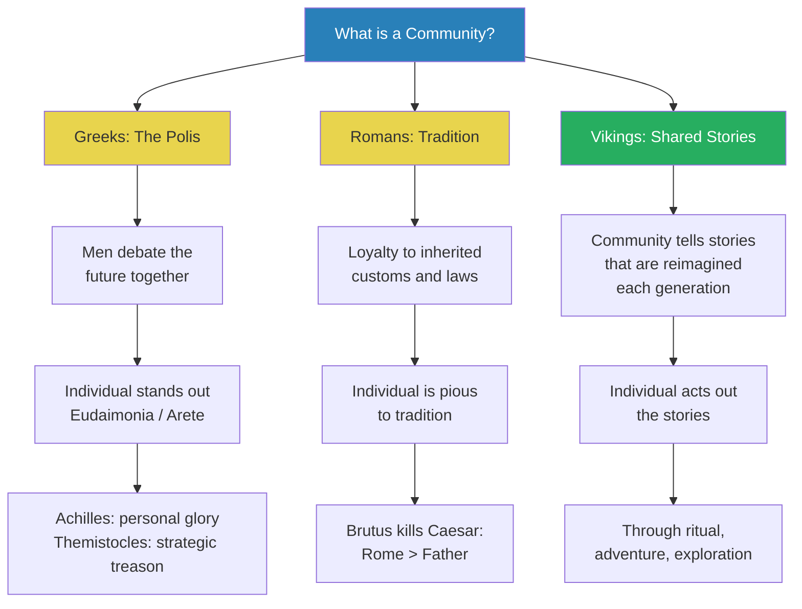
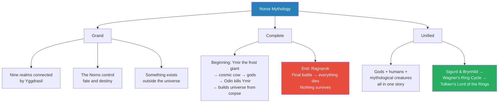
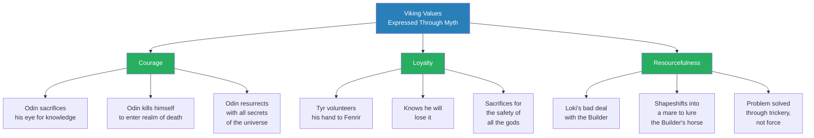
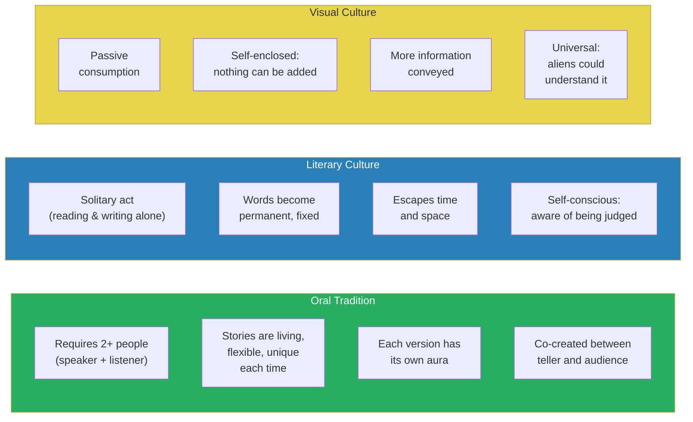
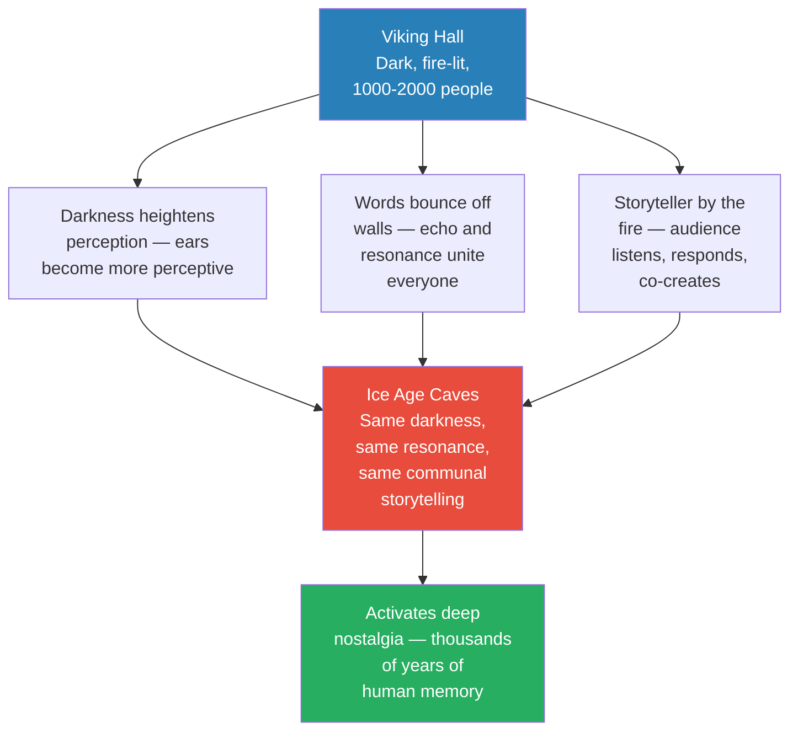
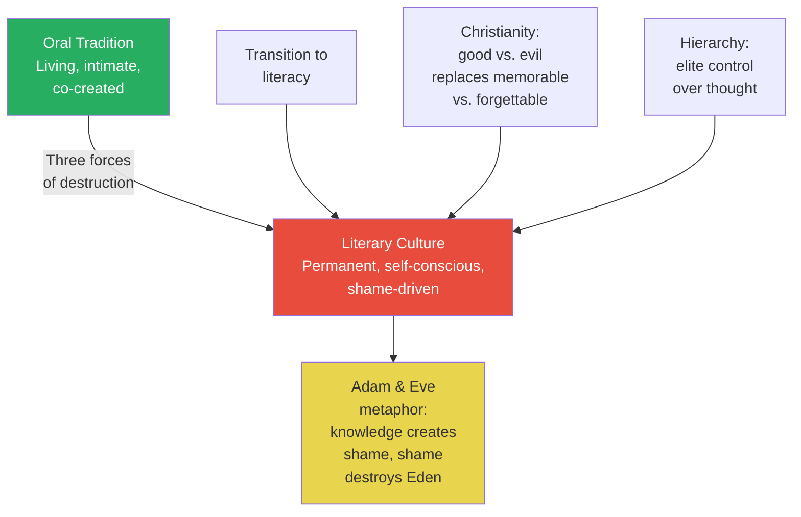

# Memory of the Norse

> Prof. Jiang reconstructs the Viking worldview by examining their mythology, funeral practices, and oral tradition — arguing that Norse culture was far more sophisticated than its "barbarian" reputation suggests. Where the Greeks built community through the polis and debate, and the Romans through tradition and piety, the Vikings built community through shared stories — living, flexible memories that bound people together. The lecture's most provocative claim: the transition from oral tradition to literary culture was not progress but loss — a fall from creative intimacy into self-conscious shame, mirroring the expulsion from Eden.

---

## Overview: Key Highlights

- <b style="color: #27ae60">Viking community was built on shared stories, not tradition or debate</b> — stories are living memories that can be reimagined, unlike fixed traditions that must be obeyed
- <b style="color: #2980b9">Three Viking values: courage, loyalty, resourcefulness</b> — Norse mythology exists to express and instil these values in the community
- <b style="color: #e74c3c">We know very little about Viking culture</b> — oral tradition by choice, Christian conversion erased memory, and our surviving sources are filtered through Christian and Muslim lenses
- <b style="color: #27ae60">Norse mythology is the greatest cosmological system in human history</b> — grand (nine realms), complete (beginning and end), and unified (gods, humans, and stories interconnected)
- <b style="color: #2980b9">Ragnarok — the end of everything</b> — unlike Christian adaptation, the Norse version has no rebirth; this makes every moment precious, not meaningless
- <b style="color: #e74c3c">The oral tradition cannot be captured in writing</b> — writing introduces shame and self-consciousness that kills creative intimacy
- <b style="color: #2980b9">Four forces shape the Viking individual</b> — hamr (shell), hamingja (luck), hugr (essence/soul), and fylgja (ancestral guardian spirit)
- <b style="color: #27ae60">Funerals were the most important Viking institution</b> — they implanted individual memory into the collective consciousness of the community
- <b style="color: #2980b9">Ibn Fadlan's account (10th century)</b> — the only written record of a Viking funeral, observed by a Muslim diplomat among the Volga Rus
- <b style="color: #e74c3c">Literary culture introduced shame</b> — like Adam and Eve eating from the Tree of Knowledge, writing made us aware of being watched
- <b style="color: #27ae60">The oral tradition is movie immersion plus conversational intimacy</b> — two experiences we know separately, but the Vikings lived them fused together
- <b style="color: #2980b9">The oral tradition traces back to Ice Age caves</b> — the same darkness, resonance, and communal storytelling that defined human culture for millennia

| Concept | One-line summary |
|---------|-----------------|
| **Oral tradition** | Living stories told communally — flexible, intimate, and co-created between speaker and audience |
| **Literary culture** | Written words that escape time and space but introduce self-consciousness and shame |
| **Ragnarok** | The final battle where everything dies — no rebirth in the original Norse version |
| **Yggdrasil** | The World Tree connecting nine realms — the structural spine of Norse cosmology |
| **The Norns** | Three gods within Yggdrasil who control fate and destiny |
| **Hamingja** | Luck personified as a pet — nurtured by courage, abandoned by cowardice |
| **Fylgja** | Ancestral guardian spirit — the collection of ancestors who whisper advice in dreams |
| **Angel of Death** | The funeral director — an old woman who choreographs and orchestrates Viking funerals |
| **Eudaimonia / Arete** | Greek ideals of flourishing and excellence — standing out among men |
| **Pietas** | Roman loyalty to tradition — not obedience to a father, but devotion to Rome's customs |
| **Aura** | In cultural theory, the unique essence or soul of each individual story performance |
| **Visual culture** | Modern passive consumption — universal and information-rich, but impossible to add to or relive |

---

# The Lecture

## Greeks, Romans, Vikings — Three Models of Community [0:00 - 10:00]

*Prof. Jiang opens by contrasting three civilisational models of community and individuality — the Greek polis built on debate, the Roman tradition built on piety, and the Viking community built on shared stories — arguing that the Viking model is the most creative and flexible of the three.*

> [!tip] Core Insight
> For the Vikings, community is not a set of rules or a debating chamber — it is a set of living stories. The individual earns status not by winning arguments or obeying tradition, but by doing what is memorable.

*Three civilisations, three definitions of what binds people together. The Viking model is uniquely flexible — stories can be reimagined, whereas traditions are fixed and debates produce winners and losers.*

> [!note]- Expand: Full Lecture Detail
> Prof. Jiang begins the lecture by telling the class they will examine the Viking worldview and cultural system. He opens with a caveat: <b style="color: #e74c3c">we know very little about Viking culture</b>, for two reasons. First, the Vikings were purposefully an oral tradition — they had the capacity to read and write but chose not to, because preserving the oral tradition mattered more to them. Second, the Vikings eventually converted to Christianity, and in that process — which took generations — they had to abandon their mythologies and historical memory. The Christians perceived the Vikings as barbarians, and there was a deliberate effort to eradicate Viking memory.
>
> What we do know comes from two sources:
> - **Archaeology** — graves that have been excavated, allowing partial cultural reconstruction
> - **Norse mythology** — but only a fraction of the original survives, and much of it has been "cleaned up" by Christian intellectuals who sanitised its violence and sexuality
>
> Prof. Jiang warns the class: "Please take what I say with a grain of salt. Be sceptical, be suspicious, ask questions, challenge me."
>
> He then introduces three contrasting models of community:
>
> **The Greek model — the Polis:**
> - Community is a group of men who debate and argue about the future
> - The individual stands out through <b style="color: #2980b9">eudaimonia</b> (flourishing) and <b style="color: #2980b9">arete</b> (proving excellence)
> - Achilles in the Iliad: "I am in Troy to seek personal glory. I don't care about the Greeks."
> - Themistocles at Salamis: sends a spy to the Persian king, tricking him into attacking — what we would call treason, but in the Greek worldview, it is individual excellence
>
> > [!example] Themistocles at the Battle of Salamis (480 BCE)
> > - The Persians are invading Greece; Sparta and Athens have united against them
> > - The Persians burn Athens; the Athenian people are on their ships
> > - The Spartans want to use the navy to protect the Peloponnese; the Athenians want to fight at sea
> > - They cannot agree — the alliance is paralysed
> > - Themistocles sends a spy to the Persian king: "The Greek navy is at Salamis and about to flee — crush them now"
> > - The Persian king sends his entire navy, and the Greeks destroy it at the Battle of Salamis
> > - This turns the war — and Western history; a Persian victory would have meant a Persian-influenced world
> > **The lesson:** In the Greek worldview, what looks like treason is individual genius. The community is a stage for personal excellence.
>
> **The Roman model — Tradition:**
> - Community is fundamentally about inherited customs and laws
> - The individual must be <b style="color: #2980b9">pious</b> — loyal to tradition
> - Prof. Jiang draws a sharp distinction: Chinese filial piety means obedience to your father; Roman pietas means loyalty to the traditions of Rome
> - Julius Caesar wanted to be king and was about to break Roman traditions, so his friends — including his biological son Marcus Brutus — killed him
> - For Brutus, loyalty to Rome's traditions outweighed loyalty to his own father
>
> **The Viking model — Shared Stories:**
> - Community is a set of stories — not traditions (which are fixed and written) but memories that are living and flexible
> - The basic structure stays the same, but the community constantly relives and reimagines these stories
> - The individual acts out the stories through ritual, adventure, or exploration
> - <b style="color: #27ae60">It is not about winning glory (Greek) or protecting tradition (Roman) — it is about doing what is shocking, new, and memorable</b>
>
> > [!example] The Georgetown Pissing Contest (1990s)
> > - Prof. Jiang's friend attended Georgetown University in Washington, DC
> > - Georgetown had a tradition: an unofficial competition to see who could go the furthest to do the most useless thing
> > - His friend and a companion drove 12 hours to the Canadian border, crossed into Canada, walked into the forest to urinate, then drove 12 hours back — 24 hours of driving to pee in Canada
> > - The point: no one will remember who got the best grades that year, or who made the most money
> > - But 50 years after graduation, people will still remember the two guys who drove to Canada to take a piss — and they will tell their friends, colleagues, and children
> > **The lesson:** In a Viking-style culture, what matters is not achievement or obedience but memorability. The story persists; the grade does not.

---

## Norse Mythology as Cosmological System [10:00 - 19:59]

*Prof. Jiang argues that Norse mythology is the greatest cosmological system in human history — grand in scope, complete with a beginning and end, and unified in that every character and event contributes to a single interconnected whole. He identifies three core values the mythology exists to express: courage, loyalty, and resourcefulness.*

*Norse mythology is not a collection of disconnected tales — it is an integrated cosmological system with a creation story, an apocalypse, and a unified cast of characters whose actions all drive toward Ragnarok.*

> [!note]- Expand: Full Lecture Detail
> Prof. Jiang frames Norse mythology with Paul Gauguin's painting and its three questions: <b style="color: #2980b9">Where do we come from? What are we? Where are we going?</b> Every culture grapples with these questions, and Norse mythology is the Viking answer.
>
> He explains why he considers it the greatest cosmological system:
>
> **1. It is grand:**
> - Nine realms, all connected by the World Tree <b style="color: #2980b9">Yggdrasil</b> — the structural equivalent of God in this system
> - Within Yggdrasil live <b style="color: #2980b9">the Norns</b>, three gods who control the fate and destiny of everything
> - There is something outside this universe — the mythology acknowledges a beyond
>
> **2. It is complete — it has a beginning and an end:**
> - **The beginning:** A rift opens, and from it steps a frost giant named Ymir. A cosmic cow appears, licks the ice, and releases another god. Eventually three gods are born, including Odin. These three gods kill Ymir and build the universe from his carcass
> - **The end:** <b style="color: #e74c3c">Ragnarok</b> — a final cosmic battle between the Aesir (Odin's children, the gods) and their enemies. In this battle, everything dies. Nothing is left
> - The Christian tradition adapted this — adding that after Ragnarok, two humans (a man and a woman) emerge from the destruction and reconstitute the world. But in the original Norse version, <b style="color: #e74c3c">the end is the end</b>
> - Prof. Jiang reframes what sounds like pessimism: from the Viking perspective, the end of everything means you must cherish every single day — "Live with honour, live with glory, live with courage, cherish every moment"
>
> **3. It is unified:**
> - Every character and event is contained within one mythology and contributes to its development
> - The mythology includes both gods and humans — human champions of the gods
> - The love story of the human Sigurd and the Valkyrie Brynhild became Wagner's Ring Cycle (the most famous opera in German history) and inspired Tolkien's Lord of the Rings
> - <b style="color: #27ae60">Norse mythology still shapes modern culture today</b> — Marvel's Thor films, Viking TV shows, and the foundations of German and British literary traditions
>
> Prof. Jiang then identifies the three values Norse mythology exists to instil:
>
> | Value | Meaning | How it manifests |
> |-------|---------|-----------------|
> | **Courage** | Exploring the unknown, venturing forth regardless of cost | Vikings are primarily explorers and adventurers — raiding is only a small part |
> | **Loyalty** | Willingness to die for your brothers — love, not obedience | Band-of-brothers bond; very egalitarian, no hierarchy based on birth |
> | **Resourcefulness** | Responding to danger as it arises — street smarts, quick wits | Cannot plan ahead in the unknown; must improvise |
>
> He emphasises: the Viking world is <b style="color: #27ae60">very egalitarian</b>. High-status individuals earn their position by being braver, stronger, or cleverer — not by birth or wealth.

---

## Viking Funerals and the Archaeology of Memory [19:59 - 32:55]

*Prof. Jiang turns to the archaeological evidence — Viking graves and the only written account of a Viking funeral, by the Muslim diplomat Ahmad ibn Fadlan. He argues that funerals were the most important Viking institution because they implanted individual memory into the collective consciousness of the community.*

> [!tip] Core Insight
> Viking funerals were not about sending the dead to the afterlife. They were about transforming one person's life into a permanent story within the community's collective memory. The dead become the stories that bind the living.

```mermaid
flowchart LR
    D["Death of a<br/>Chieftain"] --> F1["10-day funeral<br/>ceremony"]
    F1 --> F2["Wealth distribution:<br/>⅓ funeral expenses<br/>⅓ funeral clothes<br/>⅓ to wife"]
    F2 --> F3["Animal sacrifice:<br/>dog, horses, cows,<br/>hen, cock"]
    F3 --> F4["Human sacrifice:<br/>slave girl volunteers"]
    F4 --> F5["Ritual sex:<br/>'Out of love for him'"]
    F5 --> F6["Doorframe vision:<br/>slave girl sees<br/>ancestors + master<br/>in paradise"]
    F6 --> F7["Sacrifice by<br/>Angel of Death"]
    F7 --> F8["Ship burial<br/>set aflame"]
    F8 --> M["Individual memory<br/>becomes community<br/>story — remembered<br/>forever"]
    style D fill:#e74c3c,color:#fff
    style M fill:#27ae60,color:#fff
    style F4 fill:#e8d44d,color:#333
```

*The funeral is a narrative machine — it converts a person's life into a communal memory through ritual, sacrifice, and spectacle. Everyone participates, and so the dead chieftain's story becomes part of the collective consciousness.*

> [!note]- Expand: Full Lecture Detail
> Prof. Jiang moves from mythology to archaeology. Every culture asks Gauguin's three questions, and the Viking answer is embedded in their graves.
>
> **The uniqueness of Viking graves:**
> - Each grave is unique — telling a story about who the person was
> - One woman buried with tools, an arrow, and a dead horse
> - One man buried with his entire ship — the Vikings are the only society to bury people in ships
> - The grave was meant not just to send the individual to the afterworld, but to remember their achievements and life
>
> **Funerals as the heart of Viking society:**
> - <b style="color: #27ae60">Funerals were the most important aspect of Viking society</b> — they brought the community together and were what they remembered most
> - Funerals contributed to historical memory in the Viking world
> - They were extremely elaborate, involving animal and human sacrifice, lasting up to 10 days
>
> **Ibn Fadlan's account — the only written record:**
> - <b style="color: #2980b9">Ahmad ibn Fadlan</b>, a Muslim diplomat from the Abbasid Caliphate, witnessed a funeral among the Viking Rus near the Volga
> - He was there to negotiate a trade treaty — the Abbasids and Vikings traded extensively
> - Prof. Jiang issues three caveats about Ibn Fadlan:
>   - He did not speak the language or understand the culture
>   - He was a Muslim with his own worldview that conflicted with the Viking worldview
>   - He wrote his account after the fact, and memory distorts
>
> **The funeral in detail:**
> - The chieftain's wealth was divided into thirds: one-third on funeral expenses (feast for everyone), one-third on tailor-made funeral clothes, one-third to his wife
> - This tells us the Vikings were egalitarian — even high-status individuals did not accumulate vast wealth
> - They did not care much about wealth — they burned a third of it in the funeral
> - A woman Ibn Fadlan calls <b style="color: #2980b9">the Angel of Death</b> orchestrated the entire funeral
> - Animals were sacrificed: a dog was cut in two, horses were run until sweaty then butchered, two cows, a hen, and a cock — all placed in the ship as supplies for the afterworld voyage
>
> **The slave girl's sacrifice:**
> - A slave girl "volunteers" for sacrifice
> - Prof. Jiang argues she must have been the chieftain's lover, drawing a parallel to the Iliad:
>
> > [!example] Agamemnon's Slave Girl in the Iliad
> > - Agamemnon kidnaps a girl who is the daughter of a high priest of Apollo
> > - The priest offers all his gold to ransom her back
> > - Agamemnon refuses: "I love her more than my wife"
> > - Apollo unleashes a plague on the Greeks; Achilles demands Agamemnon return the girl
> > - Agamemnon does so but demands Achilles's slave girl in return — triggering Achilles's refusal to fight
> > **The lesson:** In this warrior world, men far from home fall in love with captured women, and these relationships confer genuine status and power on the women.
>
> - Without the chieftain, the slave girl has no status — she would return to being a slave, possibly ostracised
> - By volunteering for sacrifice, she wins status, power, and honour for her children and relatives — she makes her family part of the community
>
> **The ritual sex:**
> - The slave girl has intercourse with the master of each tent; each man says: "Tell your master I have done this purely out of love for him"
> - Prof. Jiang interprets this as the chieftain's final gift to his community — sharing his most treasured possession
> - In this world, homosexuality does not carry stigma; sex between men and sex shared with women is how warriors create intimacy and bonding
> - The sexual ritual re-enacts the shared experiences of raiding and warfare
>
> **The doorframe vision:**
> - The slave girl is lifted on men's palms three times at a structure resembling a door frame (representing access to the afterworld)
> - First time: she sees her father and mother
> - Second time: she sees all her deceased relatives
> - Third time: she sees her master in paradise — "It was green and beautiful"
> - <b style="color: #27ae60">She is implanting her personal memory into the community</b> — by naming her family before everyone, she ensures they will be honoured after her death
>
> **The sacrifice:**
> - She removes her bracelets and gives them to the Angel of Death (payment, gratitude, a bribe for the honour of being sacrificed)
> - She removes her anklets and gives them to the old woman's two daughters
> - She drinks intoxicating drinks (psychedelics to enhance her visions) and sings
> - Six men enter the tent; the Angel of Death loops a rope around her neck while two men pull and the old woman stabs her between the ribs
> - The closest male relative walks backwards, naked, covering his anus — a detail that must come from a specific mythology Prof. Jiang cannot identify
> - The ship is set aflame
>
> Prof. Jiang concludes: "What they're doing is celebrating the man and implanting his memory into the community, because everyone participates in his funeral. The man, his memory, is now part of the community's collective consciousness. He has become a story."

---

## Three Values in Mythology: Odin, Tyr, and Loki [32:55 - 52:10]

*Prof. Jiang illustrates the three Viking values — courage, loyalty, and resourcefulness — through three mythological stories: Odin's quest for cosmic knowledge, Tyr's sacrifice of his hand to bind Fenrir, and Loki's shapeshifting trick to outwit the Builder. He then introduces Neil Price's four-part model of the Viking self.*

*Each value gets its own mythological champion: Odin for courage, Tyr for loyalty, Loki for resourcefulness. The stories are not just entertainment — they are the curriculum of Viking civilisation.*

> [!note]- Expand: Full Lecture Detail
> Prof. Jiang now provides the mythological evidence for his three-values framework.
>
> **Courage — Odin and the Well of Cosmic Knowledge:**
>
> > [!example] Odin Sacrifices His Eye — and Then His Life
> > - Odin, the god of knowledge, flies around Yggdrasil exploring different realms
> > - He discovers the Well of Cosmic Knowledge — drink from it and gain all knowledge
> > - The price: he must sacrifice what is most valuable to him
> > - Odin plucks out his own eye and drinks from the well
> > - But cosmic knowledge only makes him more curious — he ventures into deeper unknowns
> > - He reaches the realm of death but cannot penetrate it — too many barriers
> > - Solution: he kills himself, because that is how you enter the realm of death
> > - Dead for a long time, he sees all the secrets of the universe
> > - Then he resurrects himself
> > **The lesson:** Courage in the Viking world means relentless pursuit of the unknown — even at the cost of your body and your life.
>
> **Loyalty — Tyr and the Binding of Fenrir:**
>
> > [!example] Tyr Sacrifices His Hand to Bind the Wolf Fenrir
> > - Fenrir, a wolf who foreshadows Ragnarok, is adopted by the gods as a harmless pup
> > - He grows enormous and the gods see him as a menace
> > - They try to bind him but no rope can hold him — it becomes a game Fenrir finds funny
> > - The gods commission the dwarves to create a magic rope
> > - Fenrir is suspicious: "How do I know you'll release me? Put your hand in my mouth as a guarantee"
> > - The gods discuss who will do it — Tyr, the god of war, volunteers
> > - He knows he will lose his hand — there is no intention of releasing Fenrir
> > - Fenrir is bound; when the gods refuse to release him, he bites off Tyr's hand
> > **The lesson:** Loyalty means volunteering for certain sacrifice to protect your community — not obedience, but love.
>
> **Resourcefulness — Loki and the Builder:**
>
> > [!example] Loki Outwits the Builder of Asgard's Wall
> > - A man called the Builder offers to build a wall protecting Asgard from the Frost Giants in 18 months
> > - His price: the sun, the moon, and the goddess Freyja in marriage
> > - Odin refuses, but Loki says: take the deal, but make it six months — he will fail and we get a partial wall for free
> > - The Builder agrees on one condition: he can use his horse to carry materials
> > - The horse is magical and moves at the speed of light — the Builder is about to finish
> > - Odin tells Loki: "You got us into this mess. Get us out or we kill you"
> > - Loki shapeshifts into a beautiful mare; the Builder's horse chases her and abandons the work
> > - The Builder fails, and Loki gives birth to a foal that becomes Odin's horse Sleipnir
> > **The lesson:** Resourcefulness solves problems that courage and brute force cannot. The trickster is as essential as the warrior.
>
> Prof. Jiang then tells one of Norse mythology's funniest stories:
>
> > [!example] Thor in a Wedding Dress
> > - Thor's magic hammer Mjolnir goes missing — he sleeps with it under his pillow, and one morning it is gone
> > - Loki investigates and discovers the Frost Giant king stole it — he will only return it in exchange for Freyja as his wife
> > - Freyja refuses outright
> > - Loki's plan: dress Thor up as Freyja in a wedding dress and veil; Loki disguises himself as a bridesmaid
> > - At the feast, Thor devours an entire ox and drinks enormous quantities of beer, burping loudly
> > - The Frost Giant king is confused but excited
> > - At the wedding ceremony, the king presents Mjolnir to his "bride" and lifts the veil to kiss her
> > - He sees it is a man — Thor grabs the hammer and beats the Frost Giant king senseless
> > **The lesson:** These stories are not just moral lessons — they are funny, imaginative, and memorable. That memorability is the point.
>
> **Neil Price's Four-Part Viking Self:**
>
> Prof. Jiang introduces the archaeologist <b style="color: #2980b9">Neil Price</b>'s model of how Vikings understood individual identity:
>
> | Component | Meaning | Modern parallel |
> |-----------|---------|-----------------|
> | **Hamr** | The shell or shape of the person — the outer being (not necessarily the body) | Physical appearance, persona |
> | **Hamingja** | Luck, personified as a pet that follows you — nurtured by courage, lost by cowardice | Fortune, momentum |
> | **Hugr** | Your essence, your soul — who you really are | Character, identity |
> | **Fylgja** | What you inherit from your family — the guardian spirit of your ancestors who whisper advice in dreams | Intuition |
>
> - <b style="color: #27ae60">Hamingja is the most important</b> — in the Viking world, you win because you are lucky, not because you are stronger. Luck is earned through courageous action
> - This four-part model shows that the Vikings — far from being barbarians — had a "very complicated and nuanced understanding of themselves and the world"

---

## The Power and Loss of the Oral Tradition [52:10 - 1:02:13]

*Prof. Jiang delivers the lecture's central argument: the oral tradition is not a primitive precursor to literacy but a fundamentally different — and in some ways superior — mode of cultural creation. He contrasts oral, literary, and visual cultures, arguing that the transition from oral to literary culture was a profound loss.*

> [!tip] Core Insight
> The oral tradition combines the immersion of cinema with the intimacy of a conversation with your closest friend. We separated these experiences; the Vikings lived them fused together. Writing cannot capture what was lost.

*Three modes of cultural transmission, each with trade-offs. The oral tradition sacrifices permanence and universality for intimacy, flexibility, and creative power that neither writing nor images can replicate.*

*The Viking hall recreates the conditions of Ice Age caves — darkness, resonance, communal gathering. This is not coincidence; it activates ancestral memory stretching back millennia.*

> [!note]- Expand: Full Lecture Detail
> Prof. Jiang asks: how were the Vikings able to create such a rich mythology? His answer: <b style="color: #27ae60">because of the oral tradition</b>. "We are simply not as creative as people who tell stories every day and who make stories the heart and centre of the community."
>
> He walks through the three modes of culture:
>
> **Oral tradition:**
> - Requires at least two people — a speaker and a listener; you cannot tell a story to yourself
> - Often involved the whole community
> - Stories are living things — flexible, like clay, reshaped each time
> - Each person tells the story differently; there are millions of versions of Norse stories
> - Each performance has its own <b style="color: #2980b9">aura</b> — its own unique essence or soul
>
> **Literary culture:**
> - Reading and writing are solitary acts — "you cannot write with a friend"
> - The benefit: words leave you and become permanent; they escape time and space
> - We have Homer because his words were written down, even though Homer was probably illiterate
>
> **Visual culture:**
> - Passive — in oral and literary culture you must participate and use your imagination; with photographs and video, everything is provided
> - Self-enclosed — impossible to add anything to it
> - More information — a map tells you more than someone trying to explain it in words
> - Universal — an alien species could look at our pictures and understand; they could not read our books or understand our stories
>
> **The Viking hall as storytelling environment:**
> - Stories were told in huge halls — as large as a Greek amphitheatre, holding 1000-2000 people
> - It was cold and dark outside; a big fire inside the hall provided the only light
> - The bard recited stories beside the fire
> - <b style="color: #27ae60">Three factors made this powerful:</b>
>   - The halls were enormous — communal scale
>   - Darkness heightens hearing — "when it's dark and you can't see, your ears become much more perceptive"
>   - Words bouncing off walls create echo and resonance — "bonds that unite everyone in the telling of the story"
>
> Prof. Jiang connects this directly to Lecture 2:
> - This experience mirrors the <b style="color: #2980b9">Ice Age cave paintings</b> — people converged in dark, wet caves not to paint but to tell stories about where they came from, who they are, and where they're going
> - Every human ancestor for thousands of years participated in this process
> - The Viking hall activates the same ancestral nostalgia — "that's why the oral tradition is so powerful"
>
> **Storytelling as co-creation:**
> - Like Prof. Jiang's own class: no tests, no attendance — the material has to be interesting
> - He does not script his lectures; he thinks of the narrative structure, then adapts based on student reactions and questions
> - In the oral tradition, it is a co-creation, a collaborative process — "and that's what makes it so powerful"
> - He offers an experiment: try watching the lecture on YouTube afterward — you cannot recapture the experience, because you have switched from oral culture to visual culture
> - Similarly: take a photo on your 18th birthday — the picture cannot bring back the feeling
>
> <b style="color: #e74c3c">That is why the Vikings insisted on maintaining their oral tradition</b> — it gave the community purpose and meaning. To abandon it would be to lose communal cohesion.
>
> Prof. Jiang offers his formula: the oral tradition is the immersion of a great movie combined with the intimacy of a five-hour conversation with your best friend. "The oral tradition combines these two things, and that's why it's so powerful. That's why it cannot be remembered, it cannot be written down."

---

## Why We Lost the Oral Tradition [1:02:13 - 1:11:38]

*Prof. Jiang explains why humanity abandoned the oral tradition — literacy, Christianity, and hierarchy — then demonstrates the difference between oral and literary culture through a story he tells his young sons, showing how writing introduces shame and self-consciousness that kills creative freedom.*

*Three forces killed the oral tradition: literacy replaced communal storytelling with solitary reading, Christianity replaced "Is it memorable?" with "Is it moral?", and hierarchy replaced communal co-creation with elite indoctrination.*

> [!note]- Expand: Full Lecture Detail
> Prof. Jiang identifies three reasons we lost the oral tradition:
>
> 1. **We transitioned to literary culture** — schools teach reading and writing, not storytelling; we read books but do not tell stories to each other
> 2. **We went from paganism to Christianity** — Christianity is "extremely sanctimonious," focused on good and evil; pagan culture asked whether something was interesting or memorable. "Live a memorable, interesting, adventurous life." Christianity responded: "No, that's not good, because you'll create evil. Live a good life. Avoid committing evil."
> 3. **We went from an egalitarian world to a hierarchical one** — in the oral tradition, everyone contributes to the story; in a hierarchical world, the elite insist on indoctrinating and controlling how people think
>
> He then demonstrates the difference with a personal story:
>
> > [!example] The Strawberry Wish — Prof. Jiang's Story for His Son Mao Mao
> > - Prof. Jiang tells his young sons bedtime stories where they are the heroes
> > - In this story: on Mao Mao's fourth birthday, he can pray to God for one wish
> > - Mao Mao wishes for a room full of strawberries every single day
> > - God grants it immediately — room fills with strawberries, Mao Mao eats them happily
> > - By day four, he is sick of strawberries; they overflow the house, the street, the city
> > - Beijing is filled with strawberries — a national emergency; the military and scientists cannot fix it
> > - China is buried, then all of Asia; humanity evacuates to the moon, but strawberries follow
> > - The entire world begs Mao Mao: on your fifth birthday, tell God no more strawberries — we will make you president, king, give you all the chocolate in the world
> > - Mao Mao agrees. On his fifth birthday, he closes his eyes and prays: "Dear God, I wish for a room full of chocolate every day"
> > **The lesson:** The story is "strange" but memorable — and it will inspire Mao Mao to change the details and tell his own version. That is the oral tradition at work.
>
> Prof. Jiang then rewrites the story as it would appear in literary culture:
> - "For his fourth birthday, Mama prayed to God for a room full of strawberries every day. Immediately, his room filled with strawberries, he ate them happily..."
> - The written version is shorter, more compact, sanitised
> - Why? Because <b style="color: #e74c3c">the writer knows the words leave him and go out into the wider world</b> — people will judge, so he changes the story to be less offensive, more palatable
>
> The contrast:
> - **Oral culture:** you can be intimate, play, experiment, be curious, be adventurous — that leads to imagination
> - **Literary culture:** everyone is watching you; 100 years from now, people are still watching you — you develop a sense of shame and become conscious of your effect on others
>
> Prof. Jiang concludes with a metaphor: <b style="color: #27ae60">the transition from oral to literary culture is the story of Adam and Eve</b>. They ate from the Tree of Knowledge, developed shame, understood they were naked and being watched, and were expelled from the Garden of Eden. The oral tradition was our Eden — and we think leaving it was progress, but we forget the power and beauty of what we lost.
>
> He leaves the class with three questions:
> 1. **What is the imagination?** In the oral tradition, imagination is an extension of memory — making stories memorable excites the imagination and enables creation
> 2. **Could we have Homer, Dante, and Shakespeare without the oral tradition?** Prof. Jiang says no — the greatest poetry in history depended on the oral tradition. In the past 50-60 years, with 8 billion people and more technology than ever, he cannot name a literary masterpiece
> 3. **Does civilisation make us less creative?** Does being civilised make us ashamed of exploring, curious, playing? Are we less creative because of civilisation?

---

## Connections

**Builds on:** [[35 - The Viking Legacy]] (Viking expansion and historical impact), [[07 - Homer's Iliad and the Birth of Greek Civilization]] (Achilles, Agamemnon, the Iliad's opening conflict), [[14 - Hannibal Barca, Lucius Brutus, and the Triumph of Rome]] (Roman pietas, Brutus killing Caesar for tradition), [[15 - The Myth-Making Genius of Julius Caesar]] (Caesar's assassination by Brutus)
**Sets up:** [[37 - The Golden Age of Islam]] (the Abbasid Caliphate and trade with the Vikings)
**Connects to:** [[02 - Religion and the Dawn of Society]] (Ice Age cave paintings and communal storytelling as the origin of culture), [[17 - Homer, Vergil, and the War for the Soul of Rome]] (Homer's oral origins, literary culture as political tool), [[29 - Dante's Divine Comedy and the Liberation of the Human Imagination]] (literary masterpiece born from oral tradition)
**Related books in vault:** [[Sapiens - Yuval Noah Harari]] (oral vs literate societies, Cognitive Revolution)

---

## The Takeaway

This lecture reframes the Vikings from violent raiders to cultural innovators. Prof. Jiang's central claim is not about Norse mythology per se — though he argues it is the greatest cosmological system in human history — but about the mode of transmission. The oral tradition is not a primitive stage on the way to literacy. It is a fundamentally different technology of meaning-making: communal, intimate, co-created, and alive in a way that writing can never be. The Viking hall, with its darkness and fire and echoing words, recreated the conditions of Ice Age caves — the oldest human institution for collective meaning.

The most counterintuitive insight is Prof. Jiang's claim that literacy introduced shame. We think of writing as liberation — words escaping time and space — but he argues it also created self-consciousness. The writer knows she is being watched, now and a hundred years from now, and so she sanitises, compresses, and kills the creative freedom that oral performance permitted. His strawberry story — wild and absurd and memorable in the telling — becomes flat and cautious on the page. The transition from oral to literary culture, in his metaphor, is the Fall from Eden.

The lecture leaves open a provocative question: if the oral tradition produced Homer, and Homer produced Dante, and Dante produced Shakespeare, what has the visual culture of the past 50 years produced that will endure? Prof. Jiang cannot name a literary masterpiece from the last half-century. Whether this is nostalgia or genuine diagnosis, the question stands.
