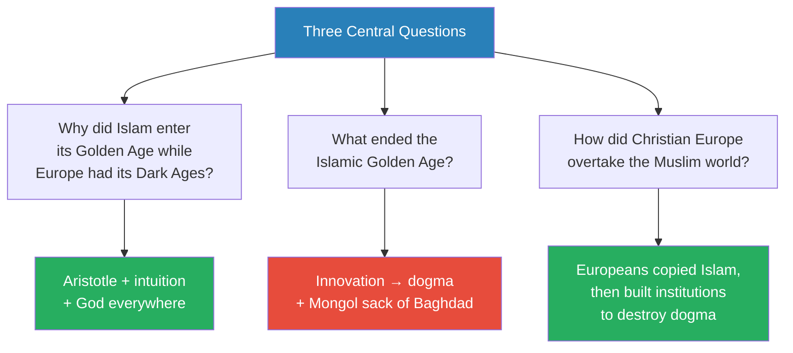
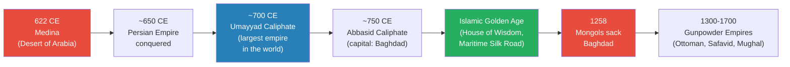
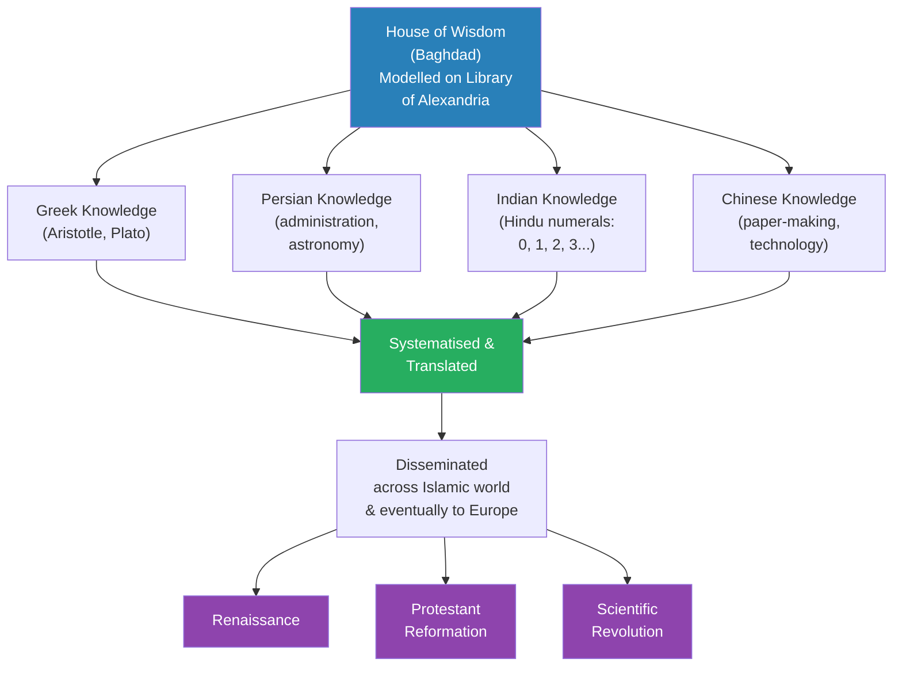
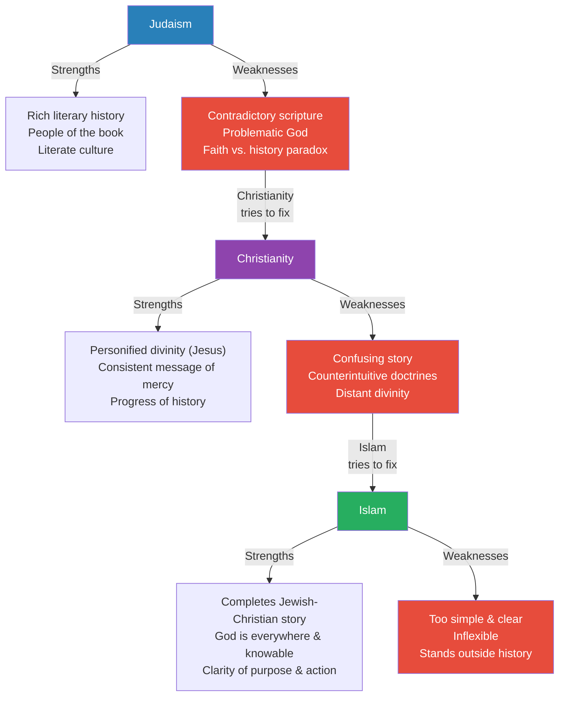
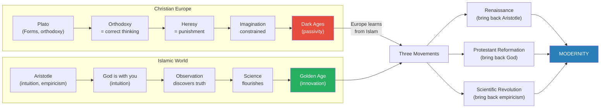
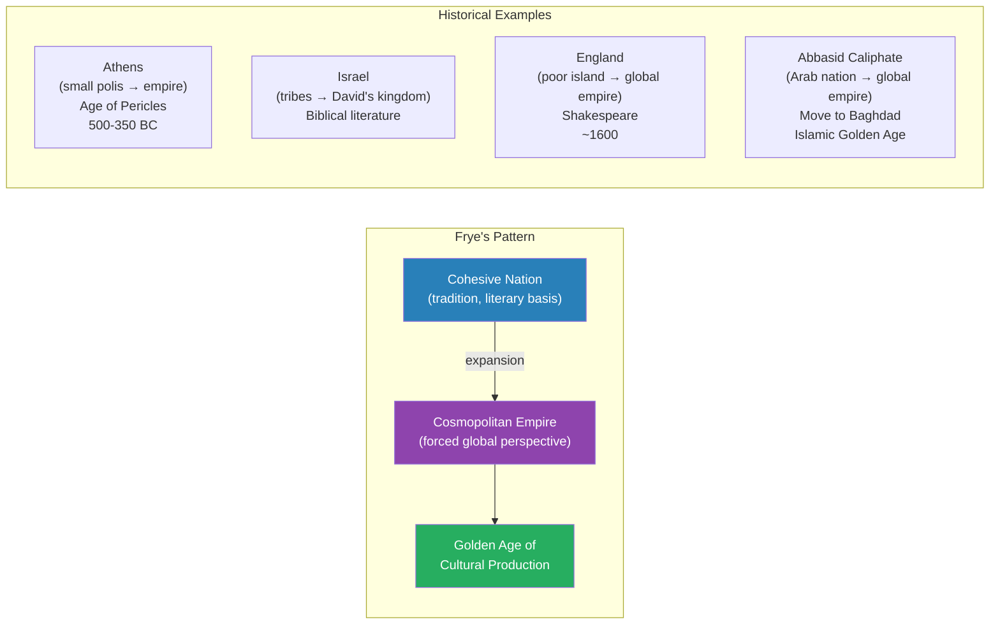

# The Golden Age of Islam

> Prof. Jiang argues that the Islamic Golden Age is not merely a chapter in Middle Eastern history but the hidden prologue to modernity itself. While Europe languished under Platonic orthodoxy and Augustine's enforced passivity, the Muslim world chose Aristotle — empirical observation, intuition, and the conviction that God is everywhere and knowable. This philosophical choice unleashed centuries of innovation in mathematics, science, medicine, and philosophy. But the same clarity and simplicity that made Islam revolutionary also made it inflexible: the Quran's eternal perfection left no room for the creative destruction that contradiction and heresy would later give Christian Europe. The Renaissance, the Protestant Reformation, and the Scientific Revolution — the three pillars of Western modernity — were all, Prof. Jiang insists, Europeans emulating what Islam had already achieved, then improving on it by building institutions to destroy dogma.

---

## Overview: Key Highlights

- <b style="color: #27ae60">Islam is the true pool of modernity</b> — the Renaissance, Reformation, and Scientific Revolution were Europeans emulating and then improving on Islamic achievements
- <b style="color: #2980b9">Aristotle vs. Plato</b> — the Islamic world chose Aristotle (empiricism, intuition, motion) while Christian Europe chose Plato (orthodoxy, forms, passivity), and this philosophical choice explains their divergent trajectories
- <b style="color: #e74c3c">Islam's strength became its weakness</b> — the Quran's clarity and simplicity prevented the creative destruction that contradiction enabled in Christianity and Judaism
- <b style="color: #27ae60">Islam united paganism and monotheism</b> — by making God concrete and everywhere, Islam merged the intimacy of paganism with the clarity of monotheism, creating a major intellectual revolution
- <b style="color: #2980b9">The House of Wisdom</b> — modelled on the Library of Alexandria, Baghdad's intellectual centre systematised and disseminated knowledge from Greek, Persian, Indian, and Chinese traditions
- <b style="color: #e74c3c">The first 100 years were deliberately obscured</b> — early companions were purged, history was rewritten, and civil wars were disguised to consolidate power
- <b style="color: #27ae60">Muhammad as theological revolutionary</b> — his message confirmed what persecuted Christians and Jews already believed, offering liberation from Byzantine orthodoxy
- <b style="color: #2980b9">Ibn Khaldun's asabiyyah</b> — the first systematic theory of civilisational rise and fall: cohesive borderlands conquer decadent empires
- <b style="color: #e74c3c">The Mongol sack of Baghdad (1258)</b> — officially ended the Golden Age by destroying the book culture and intellectual infrastructure
- <b style="color: #27ae60">Algebra, algorithm, optics, surgery all originated in the Islamic Golden Age</b> — the math and science taught in schools today traces directly to Muslim scholars
- <b style="color: #2980b9">Northrop Frye's literary theory</b> — great cultural production happens when a nation becomes an empire and is forced outward into cosmopolitan perspective
- <b style="color: #e74c3c">Dogma is the enemy of innovation</b> — Europe eventually surpassed Islam by creating institutions to destroy dogma, which Islam's eternal scripture could not accommodate

| Concept | One-line summary |
|---------|-----------------|
| **Aristotle vs. Plato** | The philosophical choice that explains why Islam innovated while Europe stagnated |
| **House of Wisdom** | Baghdad's centre for translating, systematising, and disseminating world knowledge |
| **Five Pillars of Islam** | Belief, prayer, charity, fasting, pilgrimage — radical simplicity compared to Christianity |
| **Asabiyyah** | Ibn Khaldun's concept of social cohesion that explains why borderlands conquer empires |
| **Dogma** | Innovation ossified into rigid orthodoxy — the fate of every great intellectual tradition |
| **Kalos (purpose)** | Aristotle's idea that everything has a natural purpose, discoverable through observation |
| **Form of the Good** | Plato's perfect, eternal, unchanging God — the basis of Christian orthodoxy |
| **Prime Mover** | Aristotle's God who creates motion and purpose — the basis of Islamic empiricism |
| **Constitution of Medina** | Muhammad's covenant uniting Jews, Christians, and Muslims as one people of God |
| **Monophysite monotheism** | Islam as the first modern monotheism — God is one, everywhere, knowable, indivisible |
| **Gunpowder Empires** | Ottomans, Safavids, Mughals — three Islamic empires dominating 1300-1700 |

---

# The Lecture

## Quick Facts and the Three Central Questions [0:00 - 4:39]

*Prof. Jiang opens with the three questions that will drive the entire lecture: why did Islam enter its Golden Age while Europe entered its Dark Ages? What ended the Islamic Golden Age? And how did Christian Europe eventually overtake the Muslim world? He then lays out essential facts about Islam — its size, its sects, and its founding.*

*The three questions form a single narrative arc: what made Islam great, what killed its greatness, and how its pupils eventually surpassed their teacher.*

> [!note]- Expand: Full Lecture Detail
> Prof. Jiang opens briskly: "Today we do Islam." He frames the lecture around three questions that he writes on the board:
>
> - <b style="color: #2980b9">Question 1:</b> While Europe was in its Dark Ages, Islam embarked on its Golden Age — how did this divergence happen?
> - <b style="color: #2980b9">Question 2:</b> What ended the Islamic Golden Age? Why did this period of creativity come to an end?
> - <b style="color: #2980b9">Question 3:</b> Eventually, how did Christian Europe overtake the Muslim world?
>
> He then delivers quick facts about Islam:
> - Islam is the world's second largest religion — Christianity has 2 billion adherents, Islam has 1 billion
> - The two major sects are <b style="color: #2980b9">Shia</b> (based primarily in Iran) and <b style="color: #2980b9">Sunni</b> (everywhere else)
>   - The only major doctrinal difference: Shia believe only a direct descendant of Muhammad's grandson Ali can lead the faith; Sunni do not
>   - Prof. Jiang notes: "This is a religion of 1 billion people. So there are many different belief systems, many different sects within this cosmology"
> - Islam extends across Africa, the Middle East, Central Asia, and into India — the most populous Muslim country is Indonesia
> - "Muslim" means to submit yourself to God wholeheartedly
> - Muhammad, a merchant and trader, received his revelation at age 40 in a cave — the Archangel Gabriel visited him and revealed the Quran
> - Muslims consider Muhammad the final prophet — Jesus was the penultimate prophet

---

## The Lightning Expansion of Islam [4:39 - 14:31]

*Prof. Jiang traces Islam's astonishing territorial spread — from the Arabian desert to the largest empire in the world in under a century — and introduces the three mysteries of early Islamic history that scholars have never satisfactorily resolved.*

> [!tip] Core Insight
> The spread of Islam was not primarily military conquest. Prof. Jiang argues it was revolution — ordinary people so disgusted with their current leadership that they opted for a new belief system. The enemies may have surrendered rather than fought.

*From the poorest place in the region to the largest and wealthiest empire in the world — in less than 100 years. The speed alone demands explanation beyond simple military conquest.*

> [!note]- Expand: Full Lecture Detail
> Prof. Jiang shows the class a map. Islam spread from the Arabian Desert across the entire Middle East:
> - They conquered the Persian Empire entirely
> - They took at least half of the Byzantine Empire, including its richest provinces — Syria and Egypt
> - They took Jerusalem, where they built the <b style="color: #2980b9">Al-Aqsa Mosque</b> on top of the Temple Mount
>   - "Legend has it that Mohammed ascended to heaven from this place"
>   - This is built on the site where the Romans burned down the Second Temple in 70 CE
>   - Prof. Jiang flags this as deeply strange: "If the Muslim tradition is open, inclusive and tolerant, and Jews are welcome, why would you build a mosque on top of the Jewish holy site?"
>
> - The spread took less than 100 years — "which is remarkable"
> - The Umayyad Caliphate (~700 CE) was the largest empire in the world at the time, larger even than the Tang dynasty
> - They tried twice to besiege Constantinople but failed because of the city's walls and Greek fire
>
> He introduces the <b style="color: #2980b9">Five Pillars of Islam</b>:
> 1. Believe that Allah is the only God
> 2. Pray five times a day facing Mecca
> 3. Give money to the poor
> 4. Fast during holy days
> 5. Make the <b style="color: #2980b9">Hajj</b> — a pilgrimage to Mecca
>
> Prof. Jiang adds a personal touch: "I was actually in Saudi Arabia, and I tried to go there. Then I was told, only Muslims can go." He describes the Hajj as "one of the most beautiful rituals in the world today."
>
> He then introduces <b style="color: #e74c3c">three major mysteries</b> of early Islamic history:
> 1. **No early written records:** Jews and Christians who were literate were part of the early movement — so why do we have no records for the first 100 years?
> 2. **No named successor:** Why didn't Muhammad name a successor, given the civil wars that would erupt after his death?
> 3. **Al-Aqsa on the Temple Mount:** Why build a mosque on the holiest site in Judaism when Jews were part of the early coalition?
>
> He then describes the <b style="color: #2980b9">Abbasid Caliphate</b> as the successor to the Umayyads and the dynasty that initiated the Islamic Golden Age:
> - Capital moved to Baghdad — a round city between the Tigris and Euphrates
> - Created global trade networks connecting the entire known world
> - Initiated the <b style="color: #2980b9">Maritime Silk Road</b> — the overland Silk Road existed already, but the Abbasids created the sea route and "brought China into the world to a greater extent than ever before"

---

## The House of Wisdom and the Intellectual Giants [14:31 - 28:00]

*Prof. Jiang walks through the cultural engine of the Islamic Golden Age — the House of Wisdom in Baghdad — and introduces the extraordinary roster of Muslim scholars whose work in mathematics, philosophy, medicine, and science laid the foundations for what Europe would later claim as its own achievements.*

*The House of Wisdom did not merely preserve knowledge — it synthesised four independent intellectual traditions and created something new, which Europe would later import through figures like Fibonacci.*

> [!note]- Expand: Full Lecture Detail
> Prof. Jiang describes the <b style="color: #2980b9">House of Wisdom</b> as the intellectual engine of the Golden Age:
> - Modelled on the Library of Alexandria — "its mission was to take all knowledge and culture within the Islamic world and outside the Islamic world, and systematise it for mass dissemination"
> - It brought together three major creative civilisations: Greeks, Jews, and Persians
> - Also drew on Indian and Chinese traditions
>
> Key contributions:
> - Took <b style="color: #2980b9">Hindu numerals</b> (0, 1, 2, 3) from India, standardised and disseminated them — "we still use them today"
> - Translated Aristotle and Plato into Arabic and Persian
> - "The main contribution of Islamic Golden Age to world culture is actually mathematics" — they took Greek, Persian, and Hindu mathematics, systematised it, and built on top of it
>
> Prof. Jiang notes that the <b style="color: #2980b9">Arabian Nights</b> — the most famous literary work from the period — was actually not highly regarded in its own time: "Poetry, philosophy, mathematics, science were considered the high arts. This was considered low arts." Europeans discovered it centuries later and fell in love with it.
>
> He then introduces the major intellectual figures:
>
> - **Rumi** — Persian poet, mystic, philosopher
> - <b style="color: #2980b9">**Ibn Sina (Avicenna)**</b> — "probably the most famous intellectual of the Islamic Golden Age"; his works were admired across Europe
> - **Leonardo Fibonacci** — went to Baghdad to study under Muslim mathematicians and imported their ideas back to Europe
> - <b style="color: #2980b9">**Ibn Rushd (Averroes)**</b> — major philosopher; Prof. Jiang uses Dante's *Divine Comedy* to prove Islamic intellectual influence on Europe
>
> > [!example] Dante's Acknowledgement of Islamic Intellectual Debt
> > - In the *Divine Comedy*, Dante descends into Hell and reaches Limbo
> > - There he meets the greatest philosophers in human history who influenced European civilisation
> > - Dante names Socrates and Plato, as expected
> > - But he also names Averroes (Ibn Rushd) and Avicenna (Ibn Sina)
> > - This is a medieval European poet acknowledging that Islamic thinkers belong alongside the Greek founders of Western thought
> > - Prof. Jiang warns: "The Muslim intellectual influence on Europe has been whitewashed from history. This is something you do not learn in school usually"
> > **The lesson:** Even at the height of medieval Christendom, the debt to Islamic scholarship was openly acknowledged — it was later generations who erased it.
>
> More figures:
> - **Omar Khayyam** — poet, philosopher, mathematician
> - <b style="color: #2980b9">**Al-Khwarizmi**</b> — "considered the father of modern day algebra"; his Latin name, *Algorithmi*, gives us the English word **algorithm**; "Both algebra and algorithm were originally Arabic words"
> - **Al-Haytham (Alhazen)** — "invented physics, basically optics"
> - **Al-Zahrawi** — "the father of surgery"; the best hospitals in the world at this time were in Baghdad
>   - The first 24-hour hospital in the world was in Baghdad
>   - "If you are poor and cannot pay, you could receive medical treatment for free — that was just part of the faith"
> - <b style="color: #2980b9">**Al-Qarawiyyin University**</b> — founded in 859 CE in Fez, Morocco — "the first degree-granting university in the whole world. It's still there, guys"
>   - Founded by a woman who inherited a fortune from her father and spent it all on building the university
>
> Prof. Jiang marks 1258 as the official end of the Golden Age — the Mongols sacked Baghdad and "burned all the books." Baghdad had a thriving bookstore culture, unique in the world; elites spent heavily on books, using paper technology imported from China.
>
> But intellectual production did not stop entirely. He introduces:
> - <b style="color: #2980b9">**Ibn Khaldun**</b> — "considered the father of social science, economics, quantitative history, politics"
>   - Most famous for his concept of <b style="color: #2980b9">asabiyyah</b> — social cohesion
>   - "He was the first to systematically think about grand history. Why do civilisations rise, and why do they decline?"
>   - His conclusion: borderlands conquer empires because their people are more egalitarian, free, and cohesive, while empires lose cohesion as they grow
>   - "Ibn Khaldun is a major inspiration for the history that I try as well"
>
> Prof. Jiang closes this section by noting the <b style="color: #2980b9">Gunpowder Empires</b> — the Ottomans, Safavids, and Mughals — dominated from 1300 to 1700: "Since its inception, about 622, up until the year 1700, the Islamic religion dominated the world"

---

## Solving the Three Mysteries [28:00 - 42:25]

*Prof. Jiang returns to the apocalyptic context of 622 CE to solve the three mysteries he posed at the start. His answers are speculative but grounded in the political dynamics of revolution: history is erased when victors consolidate power, successors are unnecessary when you believe God is coming, and the Al-Aqsa Mosque may have begun as the Third Temple promised to Jewish allies.*

> [!tip] Core Insight
> Muhammad was not preaching a new religion — he was confirming what persecuted Christians, Jews, and Zoroastrians already believed. The relief of being told "you were right all along" by a figure of authority was psychologically overwhelming and explains Islam's explosive appeal.

> [!note]- Expand: Full Lecture Detail
> Prof. Jiang takes the class back to Jerusalem in 622 CE, where a devastating war between Persia and Byzantium was engulfing the Middle East:
>
> - The Jews allied with Persia against Byzantium — the Romans had burned their temple in 70 CE and expelled them from Jerusalem in 135 CE
> - The Jews helped the Persians take Jerusalem
> - But Christians in Jerusalem revolted, the Byzantines under Emperor Heraclius returned, and they massacred and expelled the Jews
> - These displaced Jews had nowhere to go — except to Arabia, where Muhammad's <b style="color: #2980b9">Constitution of Medina</b> promised religious tolerance for all
>
> Prof. Jiang emphasises the apocalyptic atmosphere:
> - Jews believed in Armageddon — a final battle between the Messiah and enemies called Gog and Magog; the Persians and Romans fighting could be interpreted as exactly this
> - Christians believed in a final battle between the Antichrist (Heraclius, who persecuted Christians for refusing the Holy Trinity) and the Messiah
> - Zoroastrians believed in a final battle between good and evil
> - "This is an apocalyptic age where everyone believes this is it, the final battle"
>
> Muhammad's message in this context: "Guys, we're all one people, united by God, and we are here to fight for him"
>
> Prof. Jiang reads from the Quran to demonstrate Muhammad's theological strategy:
>
> > [!quote] Muhammad (via the Quran)
> > "Abraham was neither a Jew nor a Christian, but he was a monotheist, a Muslim."
>
> - Muhammad's argument: Abraham came before the Torah and the Gospel — why are we arguing about scripture when we all acknowledge Abraham as our forefather?
> - A Muslim is simply anyone who believes in God as the only true God — that includes Jews and Christians
> - On the Holy Trinity: "The idea of Jesus makes no sense. Jesus cannot be God. Jesus, at best, can only be a messenger of God, just like me."
>
> > [!example] The Sky is Blue — Prof. Jiang's Analogy for Muhammad's Liberation
> > - Imagine a world government declares the sky is red
> > - You know the sky is blue — you can see it — but saying so will get you jailed
> > - Teachers explain that your eyes are defective, that you cannot trust what you see
> > - You go through life believing the sky is red, even though you know in your heart it is blue
> > - Then one day, a teacher says: "Actually, the sky is blue. We've been lying to you all along"
> > - The sense of relief, empowerment, and liberation is overwhelming
> > - That is what Muhammad did — he confirmed to persecuted Christians and Jews that what they had always believed about God was right all along
> > **The lesson:** Muhammad's power was not in introducing new ideas but in validating suppressed ones. The most powerful revolutionary message is not "follow me" but "you were right."
>
> Prof. Jiang articulates the intellectual revolution:
> - <b style="color: #27ae60">Islam united two major intellectual traditions</b> — paganism (intimacy, concreteness, interconnectedness with the world) and monotheism (simplicity, clarity, absoluteness)
> - "By making God concrete — you can feel God, God is everywhere, he knows everything — Islam achieves what paganism achieved"
> - But unlike paganism's million gods, monotheism gives clarity of purpose: "There's one God, therefore I just have to follow him"
> - "Islam is a major intellectual revolution in human history, and we have forgotten this because Islam, the idea, has embedded itself into modernity itself"
>
> He then solves the three mysteries:
>
> **Mystery 1 — No written records:**
> - Islam was a revolution that overturned the social order — once Islam became the social order, celebrating its revolutionary origins was dangerous
> - Muhammad's early companions — including Jews and Christians — were purged: "Those early companions were probably purged"
>   - St John of Damascus was a legal official in the Umayyad Caliphate — "we know that as a fact"
>   - But eventually Jews and Christians were removed from the hierarchy
> - "If they're purged, what happens is they also purge the history — because if these are the companions of Muhammad, Christians and Jews, then they're legitimate. They're more legitimate than you are"
> - Continuous civil wars among Arabs to determine the Caliph also needed to be disguised
> - Doug (a class participant) adds that not every culture had a tradition of recording history — the idea of historiography comes from the Greeks and Romans, and many cultures did not have institutions for writing history
>
> **Mystery 2 — No named successor:**
> - "If it's the end of days, if it's the end of the world, you don't need to name a successor, because God's coming"
> - Naming a successor would be admitting defeat — it would mean the end of days is not actually coming
> - Muhammad's message was: "I'm the last prophet, man"
>
> **Mystery 3 — Al-Aqsa on the Temple Mount:**
> - Prof. Jiang warns: "This explanation is going to be very controversial"
> - The Jews supported the Persians against Byzantium on the condition that the Persians would allow them to rebuild their temple — just as Cyrus the Great had done
> - <b style="color: #e74c3c">Prof. Jiang's theory: Al-Aqsa was originally the Third Temple</b> — what the Arabs promised the Jews for their support
> - But as purges and civil conflicts unfolded over about 200 years, Arab leaders changed their minds: giving Jews their temple would make them a powerful political entity within the Muslim world
> - "Originally, it was meant to be the Third Temple, but then over time, the Arab leaders changed their minds"
> - He adds the caveat: "These are my explanations. It's my interpretation. This is not historical fact"

---

## Comparing Judaism, Christianity, and Islam [42:25 - 58:01]

*Prof. Jiang steps back to compare the three Abrahamic religions as intellectual systems — identifying the strengths and weaknesses of each to explain why Islam thrived when it did and why Christianity eventually overtook it. The comparison reveals Islam as the intuition and perfection of the Jewish-Christian tradition, but also exposes the structural flaw that would limit its future growth.*

*Each religion was born to fix the failures of its predecessor — but each fix created new vulnerabilities. Judaism's contradictions bred Christianity's clarity; Christianity's confusion bred Islam's simplicity; Islam's simplicity bred its inflexibility.*

> [!note]- Expand: Full Lecture Detail
> Prof. Jiang tells the class that to answer all three questions, "all we have to do is compare and contrast these three major religions." He walks through each systematically:
>
> ### Judaism
>
> **Strengths:**
> - The Bible is a wonderful piece of literature with a rich history going back 1,000 years — "the Jews were the first to have a complete history of themselves"
> - Beautiful stories that still inspire today — Adam and Eve, the patriarchs, Moses
> - A literary culture: Jews were expected to be <b style="color: #2980b9">people of the book</b>, literate in order to practise their religion
>   - "This helps us understand why Jews are so dominant in academia, universities, in the media and in culture and in the legal profession — because these are people of the book"
>
> **Weaknesses:**
> - <b style="color: #e74c3c">The Bible is contradictory</b> — "almost schizophrenic. It's very hard to pick out a definite message"
>   - The oral tradition (Torah) is more important; Jews must go to the synagogue where a rabbi explains the meaning, "because if you read it by yourself, it's almost impossible to understand"
> - <b style="color: #e74c3c">Yahweh is extremely problematic</b> — "He doesn't seem to know what he's doing, and he's very, very violent. He often commands the Israelites to go kill all their enemies"
> - The <b style="color: #e74c3c">faith versus history paradox</b> — if you are the chosen people and Yahweh is the only true God, why are you being persecuted all the time? Why were the Romans able to burn your temple? Why are you homeless? "This has been going on for 1,000 years, and there are no easy explanations"
>
> ### Christianity
>
> **Strengths (designed to fix Judaism's problems):**
> - <b style="color: #27ae60">Personification of divinity</b> — "Now we have Jesus who we can understand, and Jesus made the ultimate sacrifice, therefore we know him to be the ultimate good"
> - Consistent message — Jesus delivers a clear message of kindness, mercy, and love
> - <b style="color: #27ae60">Progress of history</b> — everything leads to the Second Coming; suffering now has purpose because Jesus is returning
>
> **Weaknesses (new problems created):**
> - <b style="color: #e74c3c">Confusing story</b> — "Why would God come down to earth, manifest himself as a human and then sacrifice himself? That's really, really confusing"
> - <b style="color: #e74c3c">Counterintuitive doctrines</b> — "The Holy Trinity must be the strangest idea in religion, where God, the Holy Spirit, and Jesus are separate but equal. It makes no intuitive sense to anyone"
> - <b style="color: #e74c3c">Distant divinity</b> — "God is out there somewhere. You don't know where. You can't talk to him. You can't see him"
>
> ### Islam
>
> **Strengths (designed to fix Christianity's problems):**
> - Takes the Jewish and Christian traditions and makes them part of itself — "it is really the intuition and the perfection of the Jewish-Christian tradition"
> - <b style="color: #27ae60">God is everywhere and knowable</b> — "true monotheism, where God is everywhere and you can see him"
>   - "God can come inside you through your faith, your devotion and your practice"
>   - This gives clarity of purpose and action: follow the Five Pillars and your life will be good
> - These ideas are "what will start the Islamic Golden Age and allow Islam to propel itself past everyone"
>
> **Weaknesses (the seeds of future decline):**
> - <b style="color: #e74c3c">Too simple and clear</b> — "The advantage of being contradictory is you allow for different belief systems which come into conflict with each other. And with this contradiction and conflict, it allows for innovation"
>   - Judaism's contradictions eventually enabled Protestantism — "but it's because the Bible is so contradictory that this innovation is able to happen"
>   - The Quran is extremely clear — "but if that's the case, then you cannot allow for a radical rejection of the past and embrace of the future"
> - <b style="color: #e74c3c">Inflexible</b> — cannot be as innovative as Christianity and Judaism
> - <b style="color: #e74c3c">Stands outside of history</b> — "Judaism is inside of history. Christianity is inside of history as well. But Islam is eternal. When you read the Quran, it's meant to be the eternal words"
>   - Problem: "How do you go about and interpret your actions through the lens of history, and how do you improve society based on this interpretation?"
>
> Prof. Jiang summarises: "In the beginning, the very strengths of Islam will give rise to a tremendous period of creativity, but over time these innovations will become <b style="color: #e74c3c">dogma</b>, and they will ossify and they will prevent further growth in your society"

---

## Plato vs. Aristotle — The Philosophical Fork [58:01 - 1:11:58]

*Prof. Jiang delivers the lecture's central argument: the divergence between Islam and Christianity was not primarily about theology but about philosophy. Christianity adopted Plato — orthodoxy, passivity, the shadow world. Islam adopted Aristotle — empiricism, intuition, purpose through action. This philosophical choice explains everything that follows: the Islamic Golden Age, the European Dark Ages, and the three movements through which Europe eventually caught up.*

> [!tip] Core Insight
> The Islamic Golden Age happened not because Muslims had better books or more wealth — the Byzantines had both — but because they had a different philosophical orientation. They chose Aristotle over Plato, intuition over orthodoxy, action over passivity.

*The same God, two opposite conclusions. Plato's God demands you escape the world; Aristotle's God demands you engage with it. The Islamic world chose engagement — and science followed.*

*Europe's path to modernity was not independent invention — it was conscious imitation of Islamic achievements, followed by institutional improvement. The three movements that created the modern world all have Islamic roots.*

> [!note]- Expand: Full Lecture Detail
> Prof. Jiang frames the comparison between Christianity and Islam in philosophical terms:
>
> - Christianity was "developed by the Roman Empire in order to co-opt, first the Jews and eventually these barbarian invaders — therefore the religion is one of <b style="color: #e74c3c">empire and power</b>. It's really about how to control people"
> - Islam "is a revolutionary religion that must be open and inclusive and tolerant in order to attract as many followers as possible"
>
> The mechanism of control:
> - Christianity uses <b style="color: #2980b9">orthodoxy</b> — "correct thinking"
>   - "If you have orthodoxy, then you have the idea of heresy. Orthodoxy is with God. Heresy is against God"
>   - "If you agree that the sky is red, because I say the sky is red, then you are Orthodox, but if you insist the sky is blue, then you are a heretical. And that constrains or limits the imagination"
> - The philosopher behind this system is **Plato** — "the idea of the bishop, the idea of the Pope, it's really the idea of Plato's philosopher king"
>
> Islam operates differently:
> - "It's a revolutionary religion, and therefore you must activate the energy of all your followers"
> - "It's a religion based on intuition. God is with you. You know God. God is inside you"
> - "The idea of intuition is what allows for science — you can discover the truth by just observing, through empirical observation, through your own analysis, through your own belief"
> - The philosopher behind this system is **Aristotle**
>
> Prof. Jiang then makes his core argument explicit: "A lot of scholars believe the Islamic Golden Age happened because they had books, they had wealth, but <b style="color: #27ae60">the Byzantines also had access to all these major thinkers — Plato and Aristotle. The Byzantines also had a lot of wealth. What I'm arguing is that a culture needs to have an attitude, a perspective, a worldview and orientation</b>. For the Byzantines and the Europeans, they chose Plato, but the Muslims chose Aristotle, and that is the major difference."
>
> He summarises each philosophy:
>
> **Plato:**
> - The true God is called the <b style="color: #2980b9">Form of the Good</b> — immutable, perfect, eternal
> - The Form of the Good emanates ideals — justice, reason, beauty, power
> - These ideals manifest as perfect forms — a perfect horse, a perfect woman
> - We live in a <b style="color: #e74c3c">shadow world</b> — "just an imitation of heaven. It's a bad imitation. So everything sucks"
> - The goal: return to the Form of the Good through mathematics and geometry, because "mathematics is what is most like the Form of the Good. It is immutable, perfect and eternal"
> - Augustine adapted Plato to Christianity: "How do you leave this world? By not sinning, by having faith. If you do that, then you are allowed to go to heaven"
> - The practical implication: <b style="color: #e74c3c">"Do nothing, and you'll be good"</b>
>
> **Aristotle:**
> - God is the <b style="color: #2980b9">Prime Mover</b> — the first thing that acts and creates motion
> - When God creates motion, other things start to happen
> - We are constantly moving toward <b style="color: #2980b9">kalos</b> — purpose
>   - "If you're a soldier, your purpose is to be the best warrior. If you're a mathematician, your purpose is to be the best mathematician"
> - Truth = fulfilling your purpose; therefore you must be constantly acting
> - "The beauty of this idea of motion is you can now study it through empirical observation. You can observe things and start to understand their nature. And this gives rise to the idea of <b style="color: #27ae60">science</b>"
>
> Prof. Jiang then traces how Europe caught up:
> - "What will happen is the Europeans will learn from the Muslims. They'll copy the Muslims"
> - Three major events that created modernity:
>   1. <b style="color: #2980b9">The Renaissance</b> — "where they bring back Aristotle"
>   2. <b style="color: #2980b9">The Protestant Reformation</b> — "where they bring back God. Remember, the Catholic religion — God is aloof, God can only be understood through the Pope or the priest. But the Protestant religion is: No. God is with us. God is in us"
>   3. <b style="color: #2980b9">The Scientific Revolution</b> — empirical observation and inquiry
> - "These are the three major events that will give us modernity — but guess what? <b style="color: #27ae60">The Europeans are just emulating the Muslims</b>"
>
> But — and this is critical — "they will improve on the Muslims":
> - "The problem with science is, yes, in the beginning you will have this tremendous discovery, but this innovation will eventually lead to something called <b style="color: #e74c3c">dogma</b>"
> - "What you need to do is create institutions to destroy dogma"
> - "That's what the Europeans will do, and this idea that dogma can be destroyed through discussion and debate and analysis is what will become the basis of the Scientific Revolution, which will create the modern world that we live in today"

---

## Northrop Frye and the Nation-to-Empire Theory [1:11:58 - 1:17:40]

*A student's observation about the Abbasid Caliphate's cultural openness prompts Prof. Jiang to introduce Northrop Frye's theory of literary creativity: great culture is produced at the precise moment when a coherent nation becomes a cosmopolitan empire and is forced to look outward.*

*Frye's pattern matches all four cases: a people with internal coherence is forced outward into cosmopolitan perspective, and the creative tension between tradition and vastness produces a cultural explosion.*

> [!note]- Expand: Full Lecture Detail
> Doug (a regular class participant) makes an observation that prompts Prof. Jiang to expand:
>
> - Doug notes that the Umayyad Caliphate was very Arab — rapid expansion driven by Arab people
> - But the Abbasid Caliphate moved its capital to Baghdad — which was Persian at the time
> - "By moving there, it represents partly a change in culture, and moving away from an Arab homeland"
> - The Abbasids had contact with India, Central Asia, China — "there's a real cultural dynamicism going on there"
> - "In some ways, it's not just the religion that's the deciding factor for what makes it a golden age, but just being able to draw on so many different ancient and rich traditions in a way that the Byzantines couldn't, or Western Europe"
>
> Prof. Jiang picks up on this with <b style="color: #2980b9">Northrop Frye</b>, the Canadian literary critic:
> - Frye observed that great literature emerges at a specific moment in history: "when a nation becomes an empire"
> - "With a nation, you have tradition, you have cohesion, a certain literary basis. And then when it becomes an empire, it's forced to have a vista — a global perspective"
> - "This change from a nation or coherent people into a cosmic empire — at this stage in history, it's possible for them to produce great literature"
>
> Three examples:
> - **Athens** — a small polis that suddenly became an empire during the Age of Pericles (~500-350 BC); "it was this transition that forced it to look outwards"
> - **King David and the Israelites** — "after Bronze Age collapse, David was able to create an Israelite nation and then conquer territory. These people now were a small empire"
> - **England** — "Think of Shakespeare. When was Shakespeare? Around 1600. And that was when England, which for the longest time was this poor island, was now emerging as a global empire, and with it, a cosmopolitan perspective"
>
> The Abbasid Caliphate fits the same pattern: "when they shifted their capital to Baghdad and they now became a global empire, they absorbed all these different traditions and cultures and became a multicultural, universal empire"
>
> Prof. Jiang adds a caveat: "It sounds convincing. I haven't done enough research to fully buy into this theory, but he has made this argument with these examples"
>
> He closes by previewing upcoming lectures: the next class will cover Middle Kingdom China, followed by the Mongols, then the Crusades, then the Renaissance, the Protestant Reformation, and the Scientific Revolution.

---

## Connections

**Builds on:** [[28 - Muhammad's Revolution of God]] (Muhammad as revolutionary leader uniting Arabs, Jews, and Christians — this lecture picks up where Lecture 28 ended, tracing what the revolution produced once it succeeded), [[27 - Augustine's Empire of God]] (Augustine's orthodoxy and the Dark Ages as the backdrop against which Islam's Golden Age becomes comprehensible), [[26 - Constantine's Monotheistic Revolution]] (the creation of the monotheistic framework that Islam would perfect), [[13 - Aristotle and the Greek Legacy]] (Aristotle's philosophy as the intellectual engine that Islam adopted while Europe chose Plato)

**Sets up:** [[38 - Twilight of the Middle Kingdom]] (China entering world history through the Mongols), [[39 - Genghis Khan, World Shatterer]] (the Mongol destruction of Baghdad that ended the Golden Age), [[42 - The Protestant Reformation and the Birth of Capitalism]] (Europeans emulating Islam's insight that God is accessible), [[43 - The Structure of Scientific Revolutions]] (the Scientific Revolution as the third Islamic-inspired European movement)

**Recurring themes:**
- Religion as engine of civilisation — Islam's theological clarity propelled its Golden Age, just as religion drove the agricultural transition
- Strength becoming weakness — the same simplicity that made Islam revolutionary made it inflexible, mirroring the pattern of every empire that reaches its peak
- Dogma as civilisational killer — innovation ossifies into orthodoxy, just as elite overproduction destroys the societies that created the elite
- Philosophy determining history — Plato vs. Aristotle as the fork that explains five centuries of divergence
- Charismatic leaders — Muhammad as the latest in the series that began with the shamans of Gobekli Tepe

**Related books in vault:**
- [[Sapiens - Yuval Noah Harari]] — the agricultural revolution and religion's role in human organisation, now extended to Islam's role in creating modernity
- [[Antifragile - Nassim Nicholas Taleb]] — contradiction and stressors enabling innovation (Christianity's contradictions enabling the Reformation), versus fragility of too-simple systems (Islam's clarity becoming rigidity)

---

## The Takeaway

This lecture completes the trilogy that began with Augustine and continued with Muhammad. Where Lecture 27 explained how Augustine's Catholic orthodoxy froze European thought for five centuries, and Lecture 28 showed how Muhammad's revolution broke the old order, Lecture 37 reveals what that revolution actually produced — and why it eventually stalled. The Islamic Golden Age was not a regional phenomenon. It was the hidden engine of modernity: the mathematics, science, medicine, and philosophy that Europe would later claim as its own were developed, systematised, and disseminated by Muslim scholars working in Baghdad, Fez, Bukhara, and across the Islamic world. When Prof. Jiang says "Islam is the pool of modernity," he is not being generous — he is being literal.

The most surprising insight is not about Islam at all but about Europe. The Renaissance, the Protestant Reformation, and the Scientific Revolution — the three pillars of Western civilisation's self-mythology — were, in Prof. Jiang's telling, acts of conscious imitation. Europeans went to Baghdad to study mathematics. They read Averroes and Avicenna. They brought back Aristotle. The claim that modernity is a European invention requires erasing this intellectual genealogy, which is exactly what happened. Dante acknowledged the debt; later generations whitewashed it.

The question left open is whether Islam's structural limitation — its eternal, uncontradictable scripture — is truly as fatal as Prof. Jiang suggests, or whether he is himself applying a Eurocentric framework (innovation through creative destruction) to judge a civilisation that operated on different principles. The Gunpowder Empires dominated from 1300 to 1700 — long after the "end" of the Golden Age. Whether Islam declined because of inherent theological inflexibility or because of external shocks (the Mongol destruction, European colonialism) remains one of the most contested questions in world history, and Prof. Jiang, characteristically, does not pretend to have the final answer.
