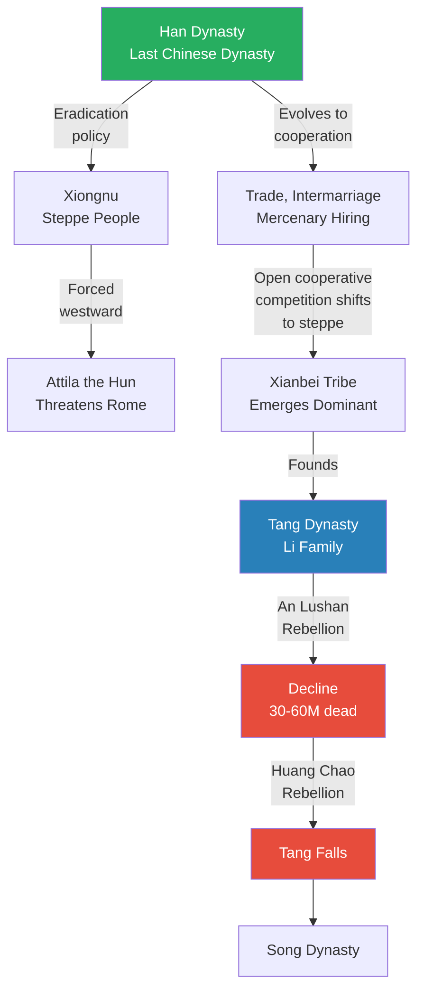
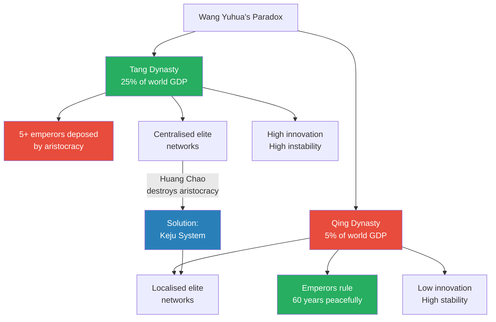
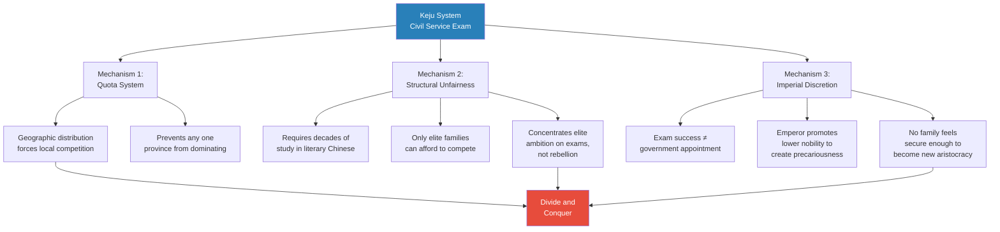
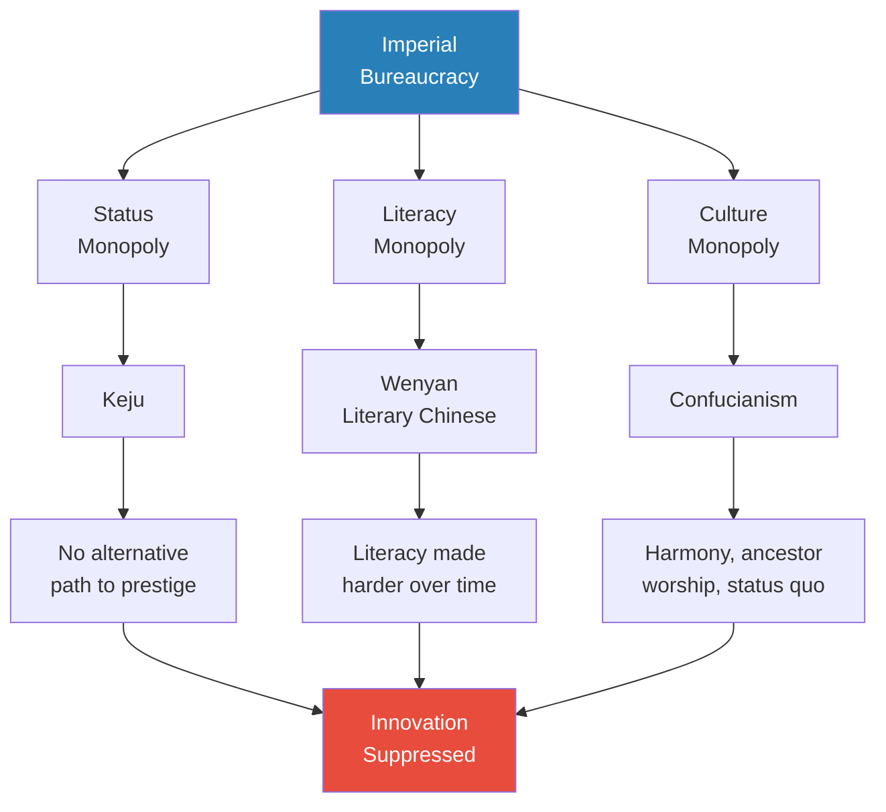
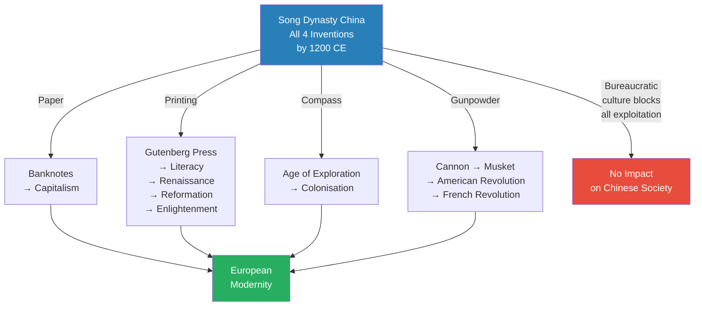

# Twilight of the Middle Kingdom

> Prof. Jiang turns the Civilization series inward — to China itself. The central question: why did China, the world's most inventive civilisation through the Song Dynasty (c. 1200 CE), stop innovating? The answer lies in the death of open cooperative competition. After the Song, successive dynasties achieved national unity by localising elites and implementing a divide-and-conquer strategy through the civil service examination (keju). Drawing on Professor Wang Yuhua's research from Harvard, Prof. Jiang reveals the keju was never a meritocracy — it was a control mechanism that traded innovation for imperial stability, leaving China insular, poor, and unable to exploit its own inventions.

---

## Overview: Key Highlights

- <b style="color: #27ae60">Open cooperative competition died after the Song Dynasty</b> — and with it died Chinese innovation for the next 800 years
- <b style="color: #2980b9">Open cooperative competition</b> — the combination of openness, cooperation, and competition that drives all civilisational innovation
- <b style="color: #e74c3c">The keju was never a meritocracy</b> — it was a quota-based, discretionary system designed to localise elites and prevent rebellion
- <b style="color: #2980b9">Divide and conquer</b> — the imperial strategy of fragmenting elite networks so no coalition could challenge the centre
- <b style="color: #27ae60">Technology does not matter — culture matters</b> — China had paper, printing, the compass, and gunpowder by 1200 CE but did nothing with any of them
- <b style="color: #e74c3c">The Tang Dynasty is the last ethnically Chinese dynasty</b> — the Li family were of the Xianbei tribe, making the Tang a multicultural empire, not a Chinese one
- <b style="color: #2980b9">Wang Yuhua's paradox</b> — when China was wealthy, emperors were weak; when emperors were strong, China was poor
- <b style="color: #27ae60">The Huang Chao rebellion eliminated the aristocracy</b> — destroying 200 noble families and giving the Song room to build a bureaucratic state
- <b style="color: #e74c3c">Confucianism is bureaucratism</b> — a philosophy engineered to make everyone believe bureaucratic rule is the highest form of civilisation
- <b style="color: #2980b9">The bureaucracy's triple monopoly</b> — status (keju), literacy (literary Chinese), and culture (Confucianism) locked China into stagnation
- <b style="color: #e74c3c">Maritime trade ban made China insular</b> — the Ming shut down coastal commerce to prevent wealth inequality from threatening the centre
- <b style="color: #27ae60">Rome's patrician system parallels China's aristocracy</b> — both gave societies the will to fight, unity, and culture, but both threatened the ruler

| Concept | One-line summary |
|---------|-----------------|
| **Open cooperative competition** | Openness + cooperation + competition between states — the engine of innovation |
| **Warring States period** | China's creative peak — 100 Schools of Thought, Confucianism, Taoism, legalism |
| **Total war (Qin)** | The Qin state engineered its entire society for military conquest, overturning gentlemanly warfare |
| **Legalism** | Draconian laws with collective punishment — the Qin's mechanism for social control |
| **Keju (civil service examination)** | Imperial exam system — designed to localise elites and prevent rebellion, not to select talent |
| **Divide and conquer** | Fragmenting elite networks into local factions so they fight each other, not the emperor |
| **Wang Yuhua's paradox** | Wealthy China = weak emperor; strong emperor = poor China |
| **Huang Chao rebellion** | The uprising that destroyed the Tang aristocracy, enabling the Song's bureaucratic state |
| **Literary Chinese (wenyan)** | A deliberately complex written language that only bureaucrats could master — rent-seeking through literacy |
| **Bureaucratism** | Confucianism reframed as a philosophy designed to legitimise bureaucratic dominance |
| **The four inventions** | Paper, printing, compass, gunpowder — all invented by Song-era China, all exploited only by Europe |
| **Patrician-client system** | Rome's aristocratic network model — gave coherence but threatened rulers, paralleling China's elite problem |

---

# The Lecture

## Why Did China Stop Innovating? [0:00 - 8:12]

*Prof. Jiang frames the central question of the lecture: China produced the four great inventions that made modernity possible — compass, paper, printmaking, gunpowder — yet after the Song Dynasty (c. 1200 CE), it stopped being creative. He races through Chinese history from the Yellow River to the People's Republic, applying the theory of open cooperative competition to explain the arc.*

> [!tip] Core Insight
> China's innovation died when open cooperative competition died. Before the Song, China was too large and diverse for any dynasty to control completely — competition between states continued to generate new ideas. After the Song, national unity was finally achieved, and the engine of innovation was permanently shut down.

*The green nodes mark China's creative peak — the Warring States period of open cooperative competition. The red nodes mark the turning point: once the Song achieved national unity, the conditions for innovation disappeared permanently.*

> [!note]- Expand: Full Lecture Detail
> Prof. Jiang opens by telling the class that today is an opportunity to apply the theories developed across the course to the Chinese context — "a chance to see if our models work." If they hold in both Western and Chinese history, they are genuinely universal.
>
> He frames the central question immediately: China gave the world the compass, paper, printmaking, and gunpowder — "all the great inventions that would make modernity possible" — but after the Song Dynasty, around 1200 CE, <b style="color: #e74c3c">China stopped being creative</b>. Why?
>
> He then races through Chinese history, applying established theories:
>
> - Chinese civilisation developed along the <b style="color: #2980b9">Yellow River</b> — perfect for agriculture, which drove population expansion
> - Population expansion led to conflict and war, which drove the development of states, fortified cities, and technology
> - The hallmark period is the <b style="color: #2980b9">Warring States (Chunqiu)</b> — when all the foundations of Chinese civilisation were laid
> - During this era, the <b style="color: #2980b9">100 Schools of Thought</b> emerged: Confucianism, Taoism, legalism
> - These developed because of <b style="color: #27ae60">open cooperative competition</b>:
>   - **Openness:** no centralised authority
>   - **Cooperation:** states traded, communicated, and intermarried
>   - **Competition:** states warred for regional dominance
> - Key figures: Confucius, Lao Tzu, Zhuang Zi, Mo Zi, Sun Tzu (who wrote *The Art of War*)
>
> Prof. Jiang then explains why the Qin state eventually conquered all of China despite being the poorest and most peripheral:
>
> - The Qin was situated in the mountains — poor, underdeveloped, smaller population
> - "In the year 500 BCE, we could not possibly predict that the Qin would conquer and unite China"
> - He draws the parallel: just as we could not predict Rome would unite the Mediterranean, or Macedonia would unite Greece
> - The Qin succeeded because of three qualities: <b style="color: #27ae60">energy, openness, and opportunism</b>
>
> He explains that warfare during the Warring States was heavily regulated — almost an aristocratic game:
>
> > [!example] Gentlemanly Warfare in the Warring States
> > - A general was laying siege to a city, starving the population
> > - He felt such guilt that he withdrew his army to let the population recover
> > - This was considered chivalrous and civilised
> > - In another case, an army was crossing a river — the perfect moment to attack
> > - The opposing army let them cross because attacking during a crossing was ungentlemanly
> > - Warfare was regulated because the states benefited from the status quo — war maintained, rather than overturned, the social order
> > **The lesson:** The Qin's revolution was not military technology but total war — they rejected the gentleman's code and committed their entire society to conquest.
>
> Prof. Jiang draws the parallel to the Peloponnesian War:
>
> - Athens could have freed the helots (Spartan slaves who outnumbered Spartans 10 to 1)
> - Athens never did — because freeing slaves would "disrupt the social order from which Athens benefited"
> - Both the Greek world and the Chinese Warring States operated under the same constraint: elites were united by intermarriage, culture, and shared interest in maintaining the status quo
>
> The Qin exploited this constraint through three innovations:
>
> - <b style="color: #2980b9">Legalism</b> — draconian laws with collective punishment (your family suffers for your crimes)
> - <b style="color: #2980b9">Centralisation</b> — a bureaucracy that could govern conquered territories immediately
> - <b style="color: #2980b9">Total war</b> — the entire society engineered for military conquest
> - Plus radical openness to talent — anyone who could contribute was welcomed
>
> The Qin united China but could not sustain its draconian system — rebellion led to the Han Dynasty. Prof. Jiang notes: "The Han Dynasty is really the last Chinese dynasty — the last ethnically Chinese dynasty committed to the protection and propagation of Chinese culture."

---

## The Tang and the Steppe — China's Recurring Nemesis [8:12 - 15:07]

*Prof. Jiang traces the critical transition from the Han through the Tang, showing how China's relationship with the northern steppe peoples shifted from eradication to dependency — and how the Tang Dynasty, despite being remembered as the height of Chinese power, was actually a non-Chinese dynasty that would collapse through its own military overreach.*

*The steppe peoples were China's permanent external pressure. The Han tried eradication, then cooperation — which shifted open cooperative competition to the steppe tribes. The Xianbei emerged dominant and founded the Tang, but the Tang's reliance on powerful generals created the conditions for its own destruction.*

> [!note]- Expand: Full Lecture Detail
> Prof. Jiang explains the recurring challenge of the northern steppe peoples:
>
> - "Throughout history, the steppe people have proven to be the most daunting challenge for civilisations — ferocious warriors" who would eventually produce the Mongols
> - The Han's main adversary was the <b style="color: #2980b9">Xiongnu</b>
> - The Han initially pursued a policy of eradication — which forced the Xiongnu westward
> - The Xiongnu eventually threatened Rome itself — "Attila the Hun — the Hun people are descendants of the Xiongnu"
>
> Over time, the Han's policy evolved from eradication to cooperation and dependency:
>
> - Trade and intermarriage with steppe peoples
> - Steppe people hired as mercenaries for internal Chinese conflicts
> - Open cooperative competition now shifted to the steppe tribes themselves
> - One tribe — the <b style="color: #2980b9">Xianbei</b> — emerged triumphant and founded the Tang Dynasty
>
> Prof. Jiang delivers a revelation: "The Tang Dynasty — the founders, the Li family, they're actually of the Xianbei tribe." This is widely misunderstood:
>
> - The Tang was not an ethnically Chinese dynasty
> - It was a "universal, multicultural empire" — famous for being "extremely open, tolerant, and inclusive"
> - Buddhism entered China during this period and became, at times, a state religion
> - The Tang expanded westwards into Central Asia and established the Silk Road
>
> But the Tang had fatal structural problems:
>
> - Heavy reliance on generals to fight wars
> - The <b style="color: #e74c3c">An Lushan rebellion</b>: the empire's top general, given too much power and trust, rebelled
>   - Lasted nearly 10 years
>   - Killed between one-third and one-half of the Tang population — 30 to 60 million people
>   - "Devastating and traumatic" — the Tang recovered but was permanently weakened
> - The <b style="color: #e74c3c">Huang Chao rebellion</b> finished off the Tang entirely

---

## Wang Yuhua's Paradox — Wealth vs. Imperial Stability [15:07 - 25:05]

*Prof. Jiang introduces the work of Professor Wang Yuhua of Harvard, whose book "The Rise and Fall of Imperial China" frames a paradox: during the Tang, when China had a quarter of the world's GDP, emperors were routinely deposed and killed. During the Qing, with only 5% of world GDP, emperors ruled for sixty years in peace. The answer — localising elites through divide and conquer — explains why China chose stability over prosperity.*

> [!tip] Core Insight
> When China was wealthy, the emperor was weak. When the emperor was strong, China was poor. This is not a coincidence — it is the direct consequence of the divide-and-conquer strategy that traded innovation and economic growth for imperial survival.

*The paradox is structural, not accidental. Centralised elite networks made China wealthy but gave the aristocracy the power to kill emperors. Localising those networks through the keju made emperors safe but strangled the economy.*

> [!note]- Expand: Full Lecture Detail
> Prof. Jiang introduces Professor Wang Yuhua, a professor of Chinese history at Harvard, and his book *The Rise and Fall of Imperial China*. He strongly recommends it to the class.
>
> Wang Yuhua's central question:
>
> - The Tang Dynasty had about 25% of the world's GDP
> - It influenced the cultures of Korea and Japan
> - It was "an extremely diverse, inclusive, multicultural empire"
> - But at least five Tang emperors were deposed by the elite — "the aristocracy got together and threw the Emperor, usually by killing him"
>
> Compare the Qing Dynasty:
>
> - Only 5% of the world's GDP
> - "Wracked by internal rebellions like the Taiping Rebellion"
> - "Far behind in science and technology to Europe"
> - But emperors like Qianlong "could rule for 60 years peacefully — they transitioned into the throne peacefully and died peacefully"
>
> <b style="color: #2980b9">The paradox</b>: why is the emperor weak when China is wealthy, but strong when China is poor?
>
> Wang Yuhua's findings from social science analysis:
>
> - The probability of being deposed by elites was highest during the Tang, then dropped significantly from the Song onward
> - But at the same time, the state's ability to collect taxes decreased steadily over time
> - New dynasties temporarily reverse the decline — strong founders like Zhu Yuanzhang (Ming) collect more taxes
> - But the long-term trend from the Song onward is a steep decline in state fiscal capacity
>
> The mechanism: starting around the Song, <b style="color: #27ae60">the emperor figured out how to divide and conquer the elite</b>
>
> - During the Tang, elite families were connected nationally — about 200 aristocratic families
> - If you were a wealthy provincial family, you sought to intermarry with the central aristocracy
> - These national networks gave elites the power to coordinate and depose emperors
>
> > [!example] The Huang Chao Rebellion — Death of the Aristocracy
> > - Huang Chao was a salt merchant who led a peasant uprising lasting 10 years
> > - Climate change triggered the rebellion — bad weather meant peasants could not eat while nobles continued rent-seeking
> > - Huang Chao's forces marched all the way to Chang'an, the capital
> > - Chang'an was home to all 200 aristocratic families of the Tang Dynasty
> > - They were all killed in the rebellion
> > - The elimination of the aristocracy gave the Song Dynasty room to build a completely new system
> > - The Song ensured that a nobility "cannot arise again"
> > **The lesson:** The Huang Chao rebellion was not just a dynastic transition — it was the permanent destruction of aristocracy in China, creating the political vacuum the keju was designed to fill.
>
> Starting with the Song, elite networks were deliberately localised:
>
> - Prof. Jiang shows network diagrams from Wang Yuhua's research
> - Tang-era networks: centres connected to provinces, families interconnected nationally
> - Song-era networks: fragmented, localised, no national connections
> - "The networks become more and more localised over time — it is the deliberate policy of the imperial bureaucracy"
> - When elites are busy fighting each other locally, they cannot unite to challenge the centre

---

## The Keju — A System of Control, Not Merit [25:05 - 49:52]

*Prof. Jiang demolishes the common belief that the keju (civil service examination) was a meritocracy. He presents three mechanisms — quotas, unfairness, and imperial discretion — that reveal the keju as a tool designed to concentrate elite ambition, localise competition, and ensure the emperor's power remained unchallenged. He then compares China's trajectory to Rome's transition from Republic to Byzantine bureaucracy.*

*The keju's three mechanisms all converge on the same goal: divide and conquer. Quotas localise competition, unfairness absorbs elite energy, and discretion prevents anyone from feeling secure.*

> [!note]- Expand: Full Lecture Detail
> Prof. Jiang draws an explicit parallel between China and Rome before dissecting the keju.
>
> **The Roman Parallel:**
>
> - Rome became a republic in 500 BCE — governed by "laws, tradition, and history" manifested in the nobility (patricians)
> - Patricians exercised power through the Senate
> - The <b style="color: #2980b9">patron-client system</b> gave Rome coherence across the Mediterranean — "the emperor is just one among equals"
> - "The British will copy this model when they build their empire, as will the Americans"
> - But when patricians disliked the emperor, they killed him — Julius Caesar, Caligula, Nero, and many others
> - Diocletian, a military general who won the civil war, began developing an imperial bureaucracy to counter the nobility
>
> However, the nobility solved three problems the bureaucracy could not:
>
> - <b style="color: #27ae60">The will to fight</b> — nobles had the most to lose and therefore fought hardest (Prof. Jiang cites Hannibal's invasion: the nobility refused to surrender because Carthaginian victory would destroy their power)
> - <b style="color: #27ae60">Unity</b> — national coherence through interconnected elite families
> - <b style="color: #27ae60">Culture</b> — "the people who wrote the history of Rome were the nobility — the senators, the aristocrats"
>
> "When you get rid of nobility, you lose these three things — national unity, culture, the will to fight."
>
> Constantine solved the problem by moving the capital to Byzantium and creating the Byzantine Empire — "a rejection of the Roman Republic" built on imperial bureaucracy.
>
> Prof. Jiang draws the parallel: "The same thing will happen in China. After the Tang Dynasty, the Song Dynasty will start to implement the keju system and create an imperial bureaucracy that will rule China for the next 1,000 years."
>
> **Why the Keju Is Not a Meritocracy:**
>
> Prof. Jiang is emphatic: "There is a great misconception in China that the keju is a meritocracy, but it is not. It was never designed to be a meritocracy."
>
> **Mechanism 1 — The Quota System:**
>
> - If it were pure meritocracy, the best candidates would win regardless of geography
> - He draws the modern parallel: "Think about the Gaokao — if it was just meritocracy, 90% of all top students would come from Beijing and Shanghai"
> - Instead, there is geographic distribution — each province sends a fixed number
> - He diagrams it: provinces A, B, C, D each send 2 candidates, regardless of talent distribution
> - <b style="color: #e74c3c">This creates competition among local elites within each province</b> — exactly the point
> - Without quotas, one province would eventually innovate a way for their children to always win, and that province would accumulate dangerous power
>
> **Mechanism 2 — Structural Unfairness:**
>
> - The keju tested knowledge of <b style="color: #2980b9">wenyan (literary Chinese)</b> — "a very hard skill to learn"
> - "It will take you decades. You will need private tutoring. Your family needs to have a lot of money. You need decades of leisure time"
> - "Only the elite families of China can compete in this system — and that's the point"
> - The goal: <b style="color: #e74c3c">concentrate the ambition and energy of elite families into the keju — otherwise they might come up with ideas like rebellion</b>
> - "They also might come up with new inventions and amazing literature, but they'll also probably think of ways to rebel"
>
> **Mechanism 3 — Imperial Discretion:**
>
> - "Just because you finished first on the keju does not mean you become a government official"
> - Success on the exam does not translate into political appointment — only the emperor decides who gets promoted
> - The emperor deliberately promotes people from lower-status families
> - This creates "a precarious situation in the provinces where no family feels secure enough to feel as though they're the nobility"
> - <b style="color: #e74c3c">"You want to create conflict and precariousness in the provinces — divide and conquer"</b>
>
> Prof. Jiang then compares the keju directly to the modern Gaokao: "The dream of every Chinese family is for you guys to get into an Ivy League school or to do the Gaokao and go to Peking or Tsinghua. The idea of status is still associated with the keju — even though success on the keju and success on the Gaokao does not necessarily translate into success in school or in life."

---

## The Bureaucracy's Triple Monopoly [49:52 - 55:27]

*Prof. Jiang identifies three monopolies the imperial bureaucracy used to maintain its dominance: status (through the keju), literacy (through literary Chinese), and culture (through Confucianism). Together, these three mechanisms suppressed every alternative path to power and locked China into stagnation.*

*Every path to status, knowledge, and meaning ran through the bureaucracy. China is the only civilisation in history that made literacy harder over time — a deliberate choice to protect the bureaucratic monopoly.*

> [!note]- Expand: Full Lecture Detail
> Prof. Jiang lists the ways people can seek status in any society: bureaucracy, military, nobility, church/religion, merchants, and artistic endeavours. In most societies, multiple pathways coexist. China is unique in the <b style="color: #e74c3c">total dominance of the bureaucracy</b>:
>
> - **Nobility** — wiped out by the Huang Chao rebellion, prevented from returning by the keju
> - **Religion** — "outlawed for most of Chinese history"
> - **Merchants and artists** — placed at the very bottom of the Confucian hierarchy (scholar → farmer → merchant → artist)
>   - Merchants are especially dangerous: "they trade, they can accumulate wealth, and that wealth can challenge the authority of the empire"
> - **Military** — "heavily suppressed throughout Chinese history"
>   - The Song Dynasty saw massive conflicts between the military (who wanted to fight and defend territory) and the bureaucracy (who wanted to "just bribe everyone")
>
> **The Literacy Monopoly — China's Unique Reversal:**
>
> Prof. Jiang traces the evolution of writing across cultures using Egypt as the case study:
>
> - Stage 1: Pictograms — symbols representing ideas (sun, moon)
> - Stage 2: Simplified symbols — easier to remember
> - Stage 3: Phonological symbols — representing sounds, not ideas
> - Stage 4: Single consonants — leading eventually to the alphabet
> - "The Greeks stole it through the Phoenicians"
>
> Every culture in history followed this pattern — making literacy easier to spread, driving economic growth.
>
> <b style="color: #e74c3c">China is the only culture in human history that made literacy more difficult over time.</b>
>
> - Instead of simplifying pictograms, China added complexity and elaborate grammatical rules
> - Created <b style="color: #2980b9">wenyan (literary Chinese)</b> — "a nice way of saying it, really what it is is bureaucratese"
> - "Think of legal contracts — you can't read them because the language is designed so that only a specialised lawyer can understand"
> - This is <b style="color: #e74c3c">rent-seeking behaviour</b> — "you create something that only you can use, and people have to pay rent to access your knowledge"
>
> **The Culture Monopoly — Confucianism as Control:**
>
> - Confucianism emphasises balance, harmony, and ancestor worship
> - Ancestor worship ties people to their villages — "you can't leave because you can no longer worship your ancestors, clean their graves"
> - This limits trade, migration, and innovation
> - Prof. Jiang redefines Confucianism: "What it really is is <b style="color: #e74c3c">bureaucratism</b> — designed to make everyone believe that a bureaucratic society is the best society"
> - "If you read Chinese history, the most virtuous people are always bureaucrats, scholar-officials"
> - The propaganda was so effective that Europeans adopted it — "Voltaire says the Chinese have the best system because they allow only the educated to rule, not soldiers, not priests, but scholar-officials, mandarins"

---

## The Four Inventions — Technology Without Culture [55:27 - 1:02:17]

*Prof. Jiang delivers the lecture's most devastating illustration: China possessed all four inventions that would create the modern world — paper, printing, compass, and gunpowder — but the bureaucratic culture ensured that none of them had any impact on Chinese society. Every one of them was exploited only by Europe.*

> [!tip] Core Insight
> Technology does not matter. You can steal technology. What matters is the culture that determines whether technology is used, suppressed, or ignored. China had every invention Europe needed to build the modern world — and did nothing with any of them.

*China invented everything Europe needed — paper enabled capitalism, printing enabled democracy, the compass enabled empire, gunpowder enabled revolution. But China's bureaucratic culture ensured none of these transformations occurred at home.*

> [!note]- Expand: Full Lecture Detail
> Prof. Jiang walks through each invention and what it produced — but only in European hands:
>
> - **Paper** → banknotes (the Song had banknotes) → capitalism in the West
> - **Printmaking** → Gutenberg's printing press (15th century) → mass-produced books → mass literacy → Renaissance → Protestant Reformation → Enlightenment → French Revolution
>   - "The printing press made available all this knowledge that wasn't available before, and now people could just learn how to read and write"
> - **Compass** → Age of Exploration → colonisation of North and South America
> - **Gunpowder** → cannon → musket → revolution in warfare AND human affairs
>   - "When you have the musket, individual soldiers do matter"
>   - Before muskets, the knight was the main weapon of war
>   - Muskets equalised the battlefield — "these farmers with muskets were able to overthrow the British Empire"
>   - Enabled both the American and French Revolutions
>
> The key lesson: <b style="color: #27ae60">"China, by the Song Dynasty, 1200 CE, had all four inventions, but because of the bureaucratic culture in place, not any of these inventions had an impact on Chinese society. They did nothing whatsoever with all four inventions."</b>
>
> He reinforces the principle: "Technology does not matter. You can steal the technology. <b style="color: #27ae60">What matters is the culture.</b>"
>
> He adds the Yuan Dynasty example:
>
> - During Mongol rule, China imported foreign experts — Christians, Muslims, Jews — and foreign technology
> - When the Ming came to power, they expelled all foreigners and abandoned the technology
> - "China became much more insular and backward"
>
> > [!example] The Ming Maritime Trade Ban
> > - By the Song Dynasty, maritime trade (initiated by the Abbasid Caliphate) was pulling China's major cities toward the coast
> > - The top 30 cities by population shifted from the Yellow River basin to the coastline
> > - Zhu Yuanzhang, the Ming founder, saw this as an existential threat
> > - If coastal cities accumulated too much wealth and power, they could depose the emperor
> > - He shut down maritime trade — making China "much more insular, weak, and poor"
> > - The Qing continued this policy: "For China, the priority is internal stability rather than wealth and prosperity"
> > - Massive Chinese emigration to Southeast Asia followed — merchants seeking to maintain trade networks outside the ban
> > **The lesson:** The Ming did not close China because they feared foreigners. They closed China because maritime wealth would have created a coastal elite powerful enough to challenge the centre.

---

## Confucianism as Bureaucratism [1:02:17 - 1:05:07]

*A student asks whether Confucianism is a religion or a culture. Prof. Jiang answers with a reframing: it is neither — it is bureaucratism, a system designed to make everyone believe that bureaucratic rule is the pinnacle of civilisation.*

> [!note]- Expand: Full Lecture Detail
> The student question prompts Prof. Jiang to crystallise his argument:
>
> - Most people consider Confucianism a "civic religion" or a philosophy
> - Prof. Jiang rejects both labels: "What it really is is bureaucratism"
> - "It is something designed to make everyone believe that a bureaucratic society is the best society — the most sophisticated"
> - "It is designed to maintain a status quo where bureaucrats are at the top"
>
> His evidence:
>
> - "If you read Chinese history, the most virtuous people are always bureaucrats, scholar-officials"
> - The propaganda became so successful that it influenced Europe
>
> > [!quote] Voltaire, cited by Prof. Jiang
> > "The Chinese have the best system because they allow only the educated to rule — not soldiers, not priests, but scholar-officials."
>
> Prof. Jiang frames this as proof of the propaganda's effectiveness: "So this is — the idea of Confucianism is bureaucratism. It is designed to legitimise and give authority to the bureaucratic elite."

---

## The Story of Zhu Yuanzhang and the Keju [1:05:07 - End]

*Prof. Jiang closes the lecture with a story that crystallises the entire argument: when the first Ming emperor restored the keju and the results were fair, he killed everyone involved — because the keju was never meant to be fair.*

> [!tip] Core Insight
> The emperor does not want a fair, open, and transparent system. He wants a system in which the provinces will not rebel against the centre. The keju was a tool of control, and anyone who treated it as meritocracy misunderstood its purpose — fatally.

> [!note]- Expand: Full Lecture Detail
>
> > [!example] Zhu Yuanzhang's Keju Purge
> > - Zhu Yuanzhang, founder of the Ming Dynasty, restored the keju after the Mongols had abolished it
> > - Everyone was excited — examinations resumed across the empire
> > - When results were announced, all top performers came from the south — no northerners passed
> > - Northern test-takers petitioned the emperor, claiming corruption
> > - The emperor agreed: how could no northerner possibly pass?
> > - He ordered his chief minister to investigate and "kill those responsible"
> > - The chief minister spent months conducting a rigorous, painstaking investigation
> > - Hundreds of staff, thousands of pages of report, personal examination of every test paper
> > - His conclusion: the process was fair, open, and transparent — southerners were simply more educated
> > - The emperor's response: he killed them all
> >   - The chief minister
> >   - The commissioners
> >   - The test makers
> >   - The top-scoring candidates
> > **The lesson:** The emperor did not want a fair system. He wanted a system that prevented any region from feeling dominant enough to rebel. A "fair" keju that produced only southern winners would have united the south and alienated the north — the opposite of divide and conquer.

---

## Connections

**Builds on:** [[08 - Rat Utopia and the Peloponnesian War]] (gentlemanly warfare and elite self-destruction), [[06 - Elite Overproduction and the Bronze Age Collapse]] (elite rent-seeking as civilisational collapse mechanism), [[37 - The Golden Age of Islam]] (Abbasid maritime trade networks pulling Chinese cities to the coast)
**Sets up:** [[39 - Genghis Khan, World Shatterer]] (the Mongol conquest that briefly interrupted China's bureaucratic trajectory)
**Related books in vault:** [[The Art of War - Sun Tzu]] (produced during the Warring States period Prof. Jiang describes), [[Sapiens - Yuval Noah Harari]] (agricultural revolution framework applied here to Chinese context)

---

## The Takeaway

This lecture is Prof. Jiang's most direct application of the open cooperative competition theory to a single civilisation's entire arc. The argument is clean: the Warring States generated China's greatest ideas because no single authority could suppress competition. When the Song Dynasty finally achieved national unity through the keju and divide-and-conquer, it killed the very mechanism that had made China the world's most inventive civilisation. The trade-off — stability for creativity — was deliberate and permanent.

The most counterintuitive insight is the reframing of the keju. Generations of Chinese students have been taught it was a meritocracy that elevated the best and brightest. Prof. Jiang, drawing on Wang Yuhua's research, inverts this completely: the quota system, the structural unfairness, and the imperial discretion all point to a control mechanism. The keju did not select talent — it absorbed elite ambition so that talent never threatened the throne. The Zhu Yuanzhang story is the perfect crystallisation: when the system produced genuinely meritocratic results, the emperor destroyed everyone involved.

The lecture leaves one question hanging: if the keju is really the Gaokao's ancestor — and the Gaokao still channels elite ambition into a single, centrally controlled pipeline — has the fundamental pattern Prof. Jiang describes actually changed? He does not answer, but the parallel is unmistakable.
