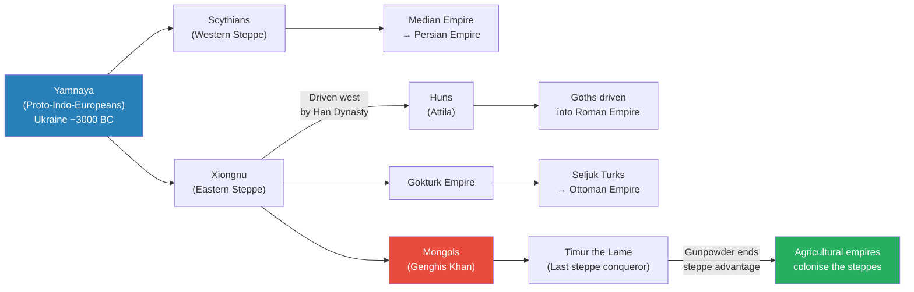
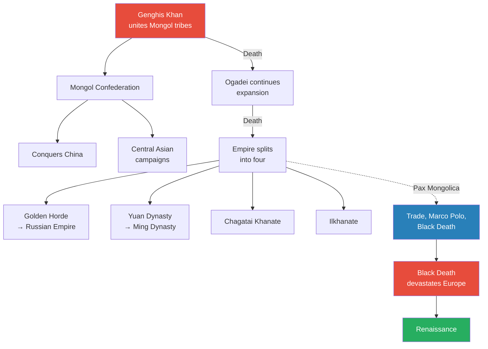
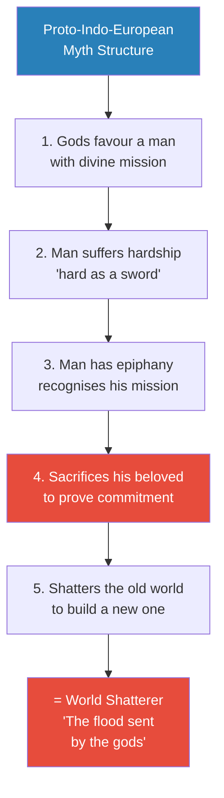
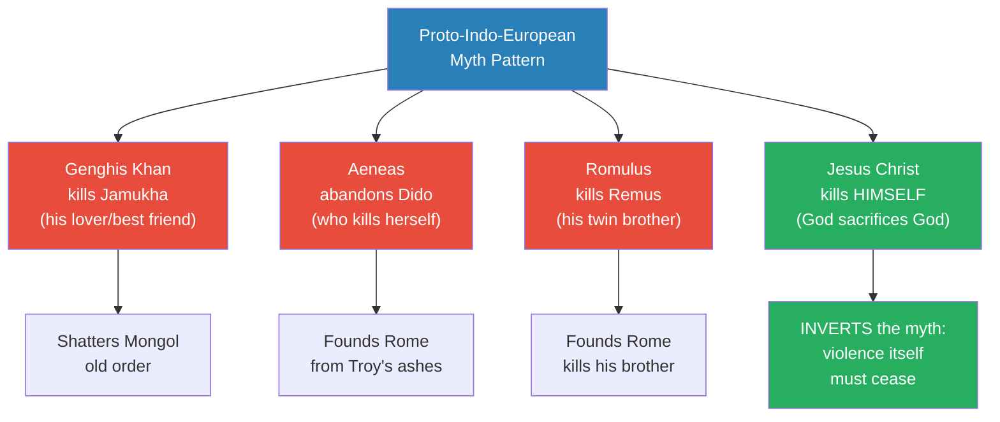
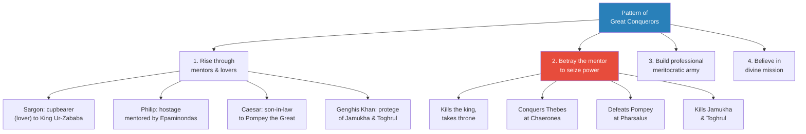
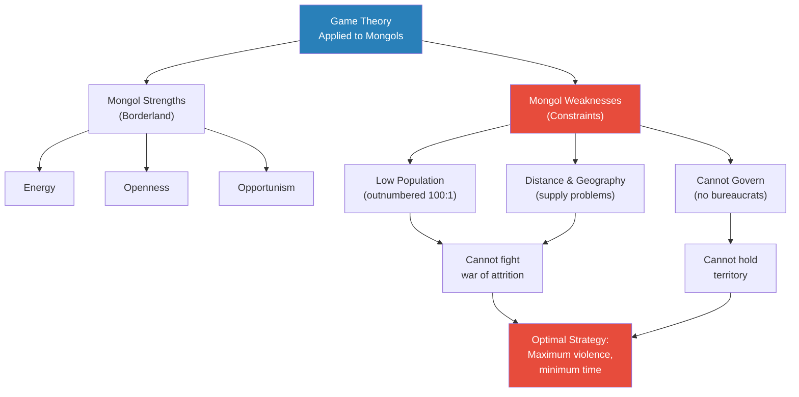
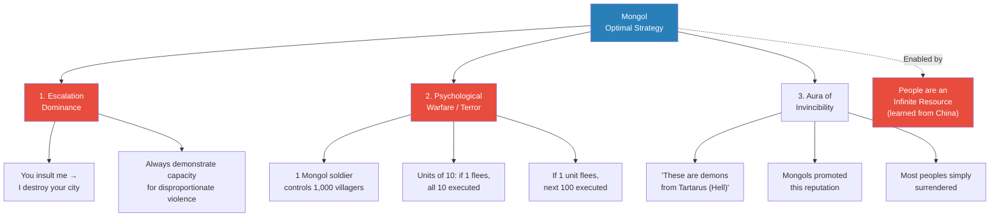
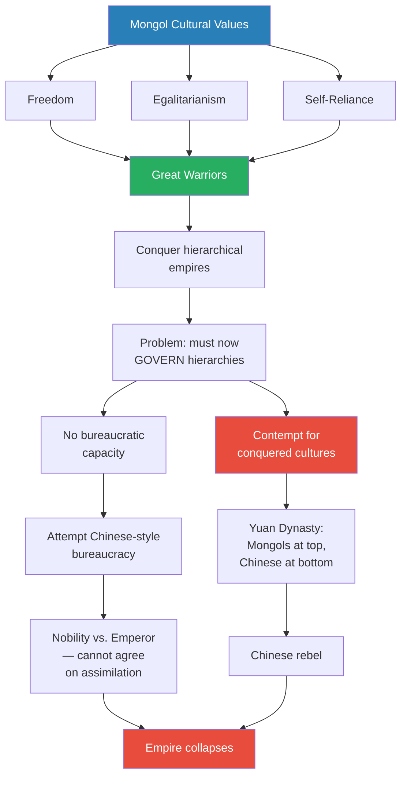
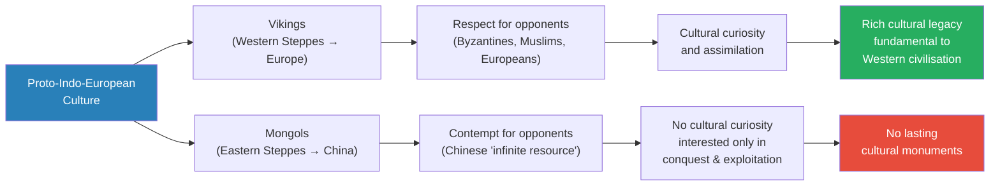

# Genghis Khan, World Shatterer

> Prof. Jiang argues that Mongol brutality was not mindless savagery but an optimal strategy dictated by three fundamental constraints: tiny population, vast distances, and zero governing capacity. Using game theory, he demonstrates that escalation dominance, psychological warfare, and cultivating an aura of invincibility were the logical responses to being outnumbered a hundred to one. The lecture places Genghis Khan within a recurring pattern of great conquerors — Sargon of Akkad, Philip of Macedon, Julius Caesar — all of whom followed the proto-Indo-European mythological structure: divine mission, sacrifice of the beloved, and shattering the old world. The same cultural values that made the Mongols unstoppable conquerors — freedom, egalitarianism, self-reliance — made their empire ungovernable and guaranteed its collapse.

---

## Overview: Key Highlights

- <b style="color: #27ae60">Mongol brutality was an optimal strategy</b> — game theory shows that given their constraints, everything they did was logical and rational
- <b style="color: #2980b9">Game theory</b> — introduced as an analytical model: every player has a distinctive optimal strategy given their constraints
- <b style="color: #e74c3c">People as infinite resource</b> — a concept the Mongols adopted from Chinese warfare that never existed before in human history and enabled unprecedented mass killing
- <b style="color: #2980b9">Escalation dominance</b> — if you insult me, I destroy your city; always demonstrating capacity to inflict more damage than you can inflict on me
- <b style="color: #27ae60">Proto-Indo-European myth structure</b> — divine mission, suffering, sacrifice of the beloved, shattering the old world; Genghis Khan, Sargon, Philip, Caesar all follow it
- <b style="color: #e74c3c">The Mongols' strengths caused their collapse</b> — freedom, egalitarianism, and self-reliance create great warriors but cannot govern hierarchical empires
- <b style="color: #2980b9">Pax Mongolica</b> — Mongol peace enabled globalisation and trade across Eurasia, but also spread the Black Death
- <b style="color: #27ae60">Great conquerors share four traits</b> — divine mission, betrayal of mentor/beloved, professional meritocratic armies, and exceptional judgement of people
- <b style="color: #e74c3c">Contempt for conquered cultures</b> — the Mongols had no curiosity about the civilisations they ruled, unlike the Vikings, guaranteeing cultural sterility
- <b style="color: #2980b9">The Secret History of the Mongols</b> — the oral history of Genghis Khan follows the mythological pattern so closely it is "suspicious"
- <b style="color: #27ae60">Christianity inverted the myth</b> — instead of killing the beloved, God kills himself, ending the cycle of redemptive violence
- <b style="color: #e74c3c">Three Mongol weaknesses</b> — low population, distance/supply problems, and inability to govern; all three made wars of attrition fatal

| Concept | One-line summary |
|---------|-----------------|
| **Game theory** | All human interaction as a strategic game where each player has an optimal strategy given constraints |
| **Optimal strategy** | The best approach to winning given the specific circumstances and constraints you face |
| **Escalation dominance** | Always demonstrating the capacity to inflict disproportionately greater violence than your opponent |
| **Psychological warfare** | Using terror and reputation to make opponents surrender without fighting |
| **Aura of invincibility** | Cultivating a reputation as unstoppable demons to prevent resistance before it begins |
| **People as infinite resource** | The revolutionary concept that human life has no individual value — enabling mass killing and human wave tactics |
| **Pax Mongolica** | The Mongol Peace — trade, travel, and exchange across the largest contiguous empire in history |
| **Proto-Indo-European myth** | Divine mission → suffering → sacrifice of beloved → shattering the old world |
| **World Shatterer** | The mythological role: the Messiah sent by the gods to destroy the old world so it can be rebuilt |
| **Borderland vs. Empire** | Borderland strengths (energy, openness, opportunism) vs. empire strengths (mass, organisation, depth) |
| **Human wave tactics** | Throwing disposable armies at opponents — pioneered in Chinese warfare, adopted by the Mongols |
| **Nomadic pastoral economy** | Raising cattle and following grassland — the economic foundation of steppe culture |

---

# The Lecture

## The Steppe People and Their Place in History [0:00 - 9:40]

*Prof. Jiang opens by placing the Mongols within the vast lineage of steppe conquerors — from the Yamnaya through the Scythians, Xiongnu, Huns, Gokturks, and Ottomans — arguing that the Mongols were not unique but the most successful iteration of a recurring pattern of nomadic pastoral peoples in conflict with agricultural empires.*

> [!tip] Core Insight
> The Mongols are not an anomaly. They are the culmination of a millennia-long conflict between steppe culture and agricultural empires. Their brutality, far from being irrational, was the logical strategy of a borderland people fighting forces that vastly outnumbered them.

*The Mongols sit at the apex of a chain stretching back to the Yamnaya. After Timur the Lame, gunpowder technology shifted the balance permanently in favour of agricultural empires — Russia would colonise the very steppes that once produced the world's greatest conquerors.*

> [!note]- Expand: Full Lecture Detail
> Prof. Jiang opens: "Today, we will do Genghis Khan and the Mongolian conquest." He immediately frames his argument: the Mongols have a terrible reputation for brutality and atrocities, but "what they did, given the circumstances, given the constraints they were under, was actually logical and understandable."
>
> He begins by locating the Mongols culturally:
>
> - The steppes stretch from Hungary to modern-day Mongolia, divided into western and eastern halves
> - Steppe economy is <b style="color: #2980b9">nomadic pastoral</b> — raising cattle and following grassland
> - Their culture is built around violence and intense competition between groups
> - "Rather than think of these people as a nation or race of people, it's better to think of them as a culture"
> - Throughout history, nomadic pastoral people have been in conflict with agricultural empires
> - Agricultural empires responded with walls and fortifications — the Great Wall of China, Central Asian fortified cities
>
> He then demolishes common myths about the Mongols:
>
> - <b style="color: #e74c3c">Cannibalism</b> — "they had a reputation for cannibalism. They ate their opponents... we know that's not true today"
> - <b style="color: #e74c3c">Deviousness</b> — they would approach Christian enemies holding the cross, tricking them into thinking they were allies, "and only when they discovered that these are actually Mongols... it was much too late"
> - <b style="color: #e74c3c">The death toll</b> — "Previously, historians believe they killed about 65 million people. Today, that figure is disputed, but if that was the case, then the Mongols killed more people than any other regime in human history before the 20th century"
>
> A stunning statistic: one out of every 200 males alive today — roughly 60 million men — is a direct descendant of Genghis Khan.
>
> Prof. Jiang then traces the steppe lineage:
>
> - The <b style="color: #2980b9">Yamnaya</b> (proto-Indo-Europeans/Aryans) spread from Ukraine across Europe, Iran, India, and the eastern steppes
> - "The Mongol people, they are culturally more similar to the Yamnaya than they are to the Chinese, even though genetically, the Mongols may be more similar to the Chinese"
> - The western steppes gradually assimilated into neighbouring agricultural empires — Scythians → Median Empire → Persian Empire
> - In the east, the <b style="color: #2980b9">Xiongnu</b> clashed with the Han Dynasty, which pursued "a policy of eradication against the steppe people"
> - Driven west, the Xiongnu splintered: the <b style="color: #2980b9">Huns</b> reached Europe (Attila the Hun), driving the Goths into the Roman Empire
> - The <b style="color: #2980b9">Gokturk Empire</b> became the Seljuk Turks and eventually the Ottoman Empire
> - "The Mongols are just the most successful iteration of the steppe people and their conflicts with the agricultural empires"

---

## The Mongol Empire — Rise, Reach, and Aftermath [9:40 - 14:45]

*Prof. Jiang surveys the Mongol Empire at its peak — the second-largest empire in history, the Pax Mongolica that connected the world, Marco Polo's travels, and the Black Death that spread along Mongol trade routes and devastated Europe far worse than China or the Islamic world.*

*The Mongol Empire's greatest paradox: its integration of the world through the Pax Mongolica also transmitted the Black Death, which killed a third to half of Europe's population — but that devastation enabled the Renaissance.*

> [!note]- Expand: Full Lecture Detail
> Prof. Jiang establishes the scale:
>
> - The Mongol Empire was the <b style="color: #2980b9">second-largest empire in human history</b> — only the British Empire had more land
> - The largest <b style="color: #2980b9">contiguous</b> empire — "it was all interconnected together"
> - Extended from modern-day Russia to China
> - After the deaths of Genghis Khan and his son Ogadei, the empire splintered into four: the Golden Horde, the Yuan Dynasty, the Chagatai Khanate, and the Ilkhanate
> - Each fragment assimilated into local culture — the Golden Horde gave rise to the Russian Empire; the Yuan Dynasty fell and was replaced by the Ming
>
> The <b style="color: #2980b9">Pax Mongolica</b> (Mongol Peace):
>
> - "They believed in globalisation. They wanted their conquered nations to trade with each other, because they could collect taxes on the trade"
> - Merchants were encouraged to travel across the empire
> - <b style="color: #2980b9">Marco Polo</b> travelled the Pax Mongolica and his accounts of China "capture the imagination of Europeans. This is really the first time that China figured into the European imagination"
>
> The <b style="color: #e74c3c">Black Death</b>:
>
> - Originated in Central Asia (modern-day Kazakhstan)
> - Spread along Mongol trade routes across the entire empire
> - "It killed anywhere between a third to half of the entire population of Europe"
> - It was far less devastating for China and the Islamic world — the reason was <b style="color: #27ae60">sanitation and hygiene</b>
> - "In China and in the former Islamic empire, their cities were pretty well organised, pretty wealthy, pretty civilised"
> - In Europe: "their streets were literally filled with manure... people just threw shit onto the streets"
> - But the Black Death enabled the Renaissance: "historians believe the Renaissance could not have happened without the Black Death — it basically meant a reset of European society, and it allowed massive innovation"
>
> The limits of conquest:
>
> - After conquering the Song Empire (1279), the Mongols tried and failed to take Japan, Vietnam, and India
> - In Japan: "even though the legend is that Japan was saved by the Kamikaze, the Great Divine Wind, I will show you that's actually not true"
> - In Europe: "even though they win every single battle against the Poles and Hungarians, they will ultimately turn back" — thick European forests defeated horsemen built for flat plains
>
> > [!example] The Mamluks Shatter the Aura (c. 1260)
> > - The Mongols attempted to conquer Egypt, the wealthiest region of the western world
> > - They encountered the Mamluks, a military caste originally from the steppes themselves
> > - The Mamluks fought using tactics similar to the Mongols' own
> > - For the first time, the Mongols were defeated militarily on the battlefield
> > - This destroyed "the aura of inevitability and invincibility that the Mongols had for the longest time"
> > - The defeat marked the western limit of Mongol expansion
> > **The lesson:** The Mongols' greatest weapon was psychological — and once that aura was broken, the limits of their physical power were exposed.

---

## The Secret History and Proto-Indo-European Myth [14:45 - 24:30]

*Prof. Jiang turns to The Secret History of the Mongols and demonstrates that Genghis Khan's life story follows the exact mythological structure shared by Sargon of Akkad, Romulus, Aeneas, and Jesus — divine mission, hardship as forging, sacrifice of the beloved, and shattering the old world to build anew.*

> [!tip] Core Insight
> Mythology is the collective subconscious of a culture. The proto-Indo-European myth — from the Mongol steppes to Rome to Christianity — encodes the same values: violence, individualism, and divine mission as the mechanism for remaking the world. Christianity's genius was inverting the structure: God kills himself instead of his beloved, ending the cycle of redemptive violence.

*The five-step mythological structure that Prof. Jiang identifies across Mongol, Roman, and Christian founding narratives. Step 4 — sacrificing the beloved — is the hinge that separates the hero from ordinary men.*

*Four instances of the same mythological structure — but Christianity reverses the direction of sacrifice. Instead of killing the beloved to prove commitment, God kills himself to prove that violence must end.*

> [!note]- Expand: Full Lecture Detail
> Prof. Jiang introduces <b style="color: #2980b9">The Secret History of the Mongols</b> — an oral history of the life of Genghis Khan and his son Ogadei. He notes immediately: "the story in The Secret History is suspicious. And it's suspicious because it fits very well into the structure of proto-Indo-European myth."
>
> **Genghis Khan's story from The Secret History:**
>
> - His mother is being transported to her husband's tribe when she is ambushed and kidnapped — "a very common thing in that culture. The way that you obtain a wife is by stealing someone else's wife"
> - She is forced to marry a stranger — Genghis Khan's eventual father
> - The father dies when Genghis Khan is eight years old
> - The tribe abandons the mother and her young children — "they're forced to fend for themselves"
> - The mother finds a supporting tribe; young Genghis Khan finds mentors for protection
> - He finds a best friend and mentor named <b style="color: #2980b9">Jamukha</b> — "the two together are great warriors, and they conquer a lot of territory together"
> - When Genghis Khan's wife is stolen by another tribe, Jamukha and Genghis Khan ride to rescue her
> - By the time they recover her, she is pregnant with another man's son — Genghis Khan raises the son as his own and makes him heir, "which shows you the generosity of this man"
> - Eventually Genghis Khan and Jamukha compete for control of the Mongol world
> - Genghis Khan kills Jamukha — his best friend, his lover
> - He overthrows the existing social order, killing top chieftains and shamans to unite the Mongol people
>
> Prof. Jiang then shows the identical structure in Roman founding myths:
>
> > [!example] Aeneas — The Trojan Founder of Rome
> > - Aeneas is a prince of Troy who survives its destruction
> > - He escapes the sacking where everyone else is killed
> > - He gets lost at sea and arrives in Carthage
> > - He falls in love with Queen Dido — they marry
> > - The gods demand he leave Dido to fulfil his divine mission
> > - He betrays her and departs; Dido kills herself
> > - He reaches Italy and fights a war to establish the Trojan people
> > - They eventually give rise to the Roman people
> > **The lesson:** The hero's divine mission requires the destruction of the person he loves most.
>
> > [!example] Romulus and Remus — The Twin Founders
> > - King Numitor is overthrown by his brother Amelius
> > - Amelius forces Numitor's daughter into a temple as a virgin
> > - Mars the war god visits her and impregnates her with twins
> > - Amelius demands the twins be killed — they are left by the Tiber River
> > - A she-wolf nourishes them; a shepherd adopts them
> > - They discover their true heritage and help Numitor kill Amelius
> > - The twins go to found their own city — Rome
> > - There can be only one king — Romulus kills his twin brother Remus
> > **The lesson:** The same pattern: the founder must sacrifice his closest bond — even his own brother — to fulfil the divine mission.
>
> **The mythological structure decoded:**
>
> - Step 1: The gods favour a man with a <b style="color: #2980b9">divine mission</b> — but the man does not understand it
> - Step 2: He suffers hardship to become "hard as a sword" — asking "why am I being persecuted?"
> - Step 3: He has an epiphany — "the gods have a mission for me. That's why I'm suffering. It's to make me strong and committed"
> - Step 4: <b style="color: #e74c3c">He sacrifices his beloved to prove his commitment</b>
> - Step 5: He shatters the old world to build a new one — "He is the world shatterer. He's the flood sent by the gods"
>
> On Genghis Khan and Jamukha: "In that culture, when two are best friends, they're not just friends. They're basically lovers. They have sex with each other, and that's why they're such great warriors together." Prof. Jiang draws the parallel to Achilles and Patroclus in the Iliad — "when Genghis Khan killed Jamukha, he was basically killing the man he loved the most in this world."
>
> **Christianity's inversion of the myth:**
>
> - Jesus has a secret divine mission — sent by God to redeem the world
> - He suffers persecution and doubt — mocked, laughed at, no one knows who he is
> - <b style="color: #27ae60">But instead of killing his beloved, God kills himself</b>
> - "Once God has killed himself, once God has sacrificed himself, it means that all violence now must cease"
> - "Proto-Indo-European mythology celebrates violence. Christianity says violence is the worst thing"
> - Christianity implants a new idea in the collective subconscious — "almost like a virus, until people recognise that violence is bad"
>
> > [!quote] Gospel of Mark
> > "Truly, this man was God's Son."
>
> Prof. Jiang notes that the first person to recognise Jesus's divinity was a Roman centurion — "a soldier who's always been taught that violence is the answer to everything, and once he's converted, he recognises that violence is wrong and evil."

---

## The Pattern of Great Conquerors [24:30 - 37:00]

*Prof. Jiang demonstrates that Genghis Khan is not unique but follows a pattern shared by the four greatest conquerors in human history — Sargon of Akkad, Philip of Macedon, Julius Caesar, and Genghis Khan — all of whom rose through mentors they later betrayed, built professional meritocratic armies, and were driven by a belief in divine mission.*

*The four greatest conquerors in human history all followed the same four-step pattern — mentor, betrayal, military innovation, and divine purpose. The pattern is too consistent to be coincidence; it reflects deep structural forces in how power is seized.*

> [!note]- Expand: Full Lecture Detail
> Prof. Jiang shifts from mythology to "real history" and demonstrates that Genghis Khan fits a pattern visible across four great conquerors:
>
> **Sargon of Akkad:**
>
> - Before him, Mesopotamia was divided into warring Sumerian city-states behind walls
> - Sargon was probably a mercenary — common in an era of constant warfare
> - He was <b style="color: #2980b9">cupbearer</b> to King Ur-Zababa of Kish — "the man you trust the most... it probably means that they were lovers"
> - "That doesn't prevent Sargon from killing the king and taking the throne"
> - He built the first empire in world history — the Akkadian Empire
> - Innovation: <b style="color: #27ae60">siege warfare</b> — unheard of before, allowing him to breach walled cities
>
> **Philip of Macedon:**
>
> - A prince of Macedon sent as a hostage to Thebes after Macedon's defeat
> - Mentored by <b style="color: #2980b9">Epaminondas</b>, "the greatest military strategist of this time"
> - "Philip the Second is learning how to win battles... all the major military innovations of this time from the greatest general"
> - Returns to Macedon, reorganises the army, then conquers Thebes and all of Greece at the Battle of Chaeronea
> - Talented subordinate: <b style="color: #2980b9">Parmenion</b> — "really the person in charge of the Macedon army... most responsible for Alexander the Great's conquest of Persia"
>
> **Julius Caesar:**
>
> - Pompey the Great is the most powerful man in Rome around 50 BCE
> - Caesar marries his daughter to Pompey, forming a political alliance
> - Pompey grants him generalship of Gaul, where Caesar wins military glory
> - This starts a civil war — Caesar defeats Pompey at the Battle of Pharsalus
> - Talented subordinate: <b style="color: #2980b9">Titus Labienus</b>, "responsible for his victories in Gaul"
>
> **Genghis Khan:**
>
> - Mentored by two chieftains — Jamukha and Toghrul
> - Defeats both to gain leadership of the Mongol world
> - Talented subordinate: <b style="color: #2980b9">Subutai</b>, "considered one of the greatest military strategists ever"
>
> Prof. Jiang identifies four shared traits:
>
> - <b style="color: #27ae60">Exceptional judgement of people</b> — "They know who to trust. They know who not to trust. They know who is talented... They know how to win the loyalty of their subordinates"
> - Ruthless ambition combined with effective delegation
> - Belief in <b style="color: #2980b9">divine mission</b> — "Their goal is not to conquer the world. Their goal is to change the world for the better, as demanded by the gods"
> - Professional, meritocratic, innovative armies:
>   - <b style="color: #27ae60">Professional</b>: Sargon was the first to create full-time soldiers paid by taxes, replacing seasonal farmer-warriors
>   - <b style="color: #27ae60">Meritocratic</b>: talent and bravery determined rank, not noble birth
>   - <b style="color: #27ae60">Innovative</b>: constant adaptation — Sargon's siege warfare, Philip's reformed phalanx, Caesar's engineering, Genghis Khan's combined-arms cavalry

---

## Game Theory and the Mongol Optimal Strategy [37:00 - 46:19]

*Prof. Jiang introduces game theory as an analytical framework and applies it to the Mongol situation, showing that their three fundamental constraints — tiny population, vast distances, and inability to govern — dictated an optimal strategy of maximum violence and terror.*

> [!tip] Core Insight
> The Mongols' atrocities were not evidence of irrationality but of a rigorously logical optimal strategy. When you are outnumbered 100 to 1, cannot fight wars of attrition, and cannot govern conquered peoples, your only viable strategy is to make resistance so costly that no one dares try it.

*The game-theory logic is airtight: every Mongol constraint points toward the same optimal strategy — overwhelming, disproportionate violence applied as quickly as possible.*

> [!note]- Expand: Full Lecture Detail
> Prof. Jiang introduces <b style="color: #2980b9">game theory</b>: "All human interaction can be perceived as a game in which at least two people are playing, and they're trying to defeat each other." Each player has a distinctive <b style="color: #2980b9">optimal strategy</b> — "given the constraints of your circumstance, what is the best way for you to win?"
>
> He illustrates with a vivid example:
>
> - If you are the big guy fighting, you want a fair, arranged fight — because you will win
> - If you are the small guy, "you figure a time when he is most vulnerable, maybe when he's asleep or eating, and you attack him then. You basically have to cheat in order to win"
> - With multiple players (A, B, C, D), alliances shift constantly — A and D attack B, forcing B and C to ally; once D is killed, A and C turn on B
> - External constraints (weather, weapons) add further complexity
> - "Game theory sounds easy, but it's extremely complicated because you always have to switch perspective"
>
> **Applying game theory to the Mongols:**
>
> Borderland advantages vs. empire advantages:
>
> | Borderland (Mongols) | Empire (China, Persia) |
> |---------------------|----------------------|
> | Energy | Mass (population) |
> | Openness | Organisation |
> | Opportunism | Depth (resources) |
>
> Three fundamental Mongol weaknesses:
>
> - <b style="color: #e74c3c">Low population</b> — "often outnumbered 100 to one." At Genghis Khan's height: 100,000 to 200,000 troops
> - <b style="color: #e74c3c">Distance and geography</b> — Central Asia is vast, creating supply problems. "The thing that you cannot ever fight is a war of attrition. If the siege is too long, or the war lasts too long... eventually you'll run out of soldiers"
> - <b style="color: #e74c3c">Governance</b> — "nomadic people who do not know how to govern other people." No personnel for holding territory. They recruited Chinese and Indian engineers for siege warfare, "but bureaucrats are very hard to compensate for"
>
> Prof. Jiang states the conclusion clearly: "If we look at what the strengths are, and we look at what their fundamental constraints are, then we can figure out what their optimal strategy is."

---

## The Three Pillars of Mongol Strategy [46:19 - 56:19]

*Prof. Jiang reveals the three elements of the Mongol optimal strategy — escalation dominance, psychological warfare, and cultivating an aura of invincibility — and explains why each was a logical necessity, not senseless cruelty. He then introduces the concept that made unprecedented mass killing possible: the revolutionary idea, learned from China, that people are an infinite resource.*

*The three pillars of Mongol strategy are mutually reinforcing: escalation dominance feeds terror, terror feeds the aura of invincibility, and the aura reduces the need for actual fighting — conserving the tiny population that made the whole strategy necessary in the first place.*

> [!note]- Expand: Full Lecture Detail
> **Pillar 1: Escalation Dominance**
>
> - Prof. Jiang introduces the <b style="color: #2980b9">escalation ladder</b> — "violence always escalates. An argument becomes pushing, pushing becomes punching, punching becomes a knife, a knife becomes a gun"
> - <b style="color: #2980b9">Escalation dominance</b> means always having the capacity to inflict more damage: "If you insult me, I'll put a gun on you and I'll shoot you"
> - "I always have the capacity to inflict more damage on you than you could ever possibly inflict on me"
>
> > [!example] The Trade Delegation Massacre
> > - The Mongols would send a trade delegation to a Central Asian nation to negotiate a deal
> > - The nation would kill the entire delegation to insult Genghis Khan
> > - In response, Genghis Khan would send his army to destroy the entire city, burn it down, and kill every inhabitant
> > - Then refugees would be sent across the world to spread word of the Mongols' ferocity
> > **The lesson:** Escalation dominance is not revenge — it is a calculated investment in deterrence. The cost of one destroyed city prevents a dozen future insults.
>
> **Pillar 2: Psychological Warfare**
>
> - "If you are badly outnumbered in warfare, then you have to make people afraid to fight you"
> - "If you cannot govern people... you have to make people afraid to rebel"
> - The method was chilling in its simplicity:
>   - Conquer territory, send a single Mongol soldier into a village of 1,000
>   - The soldier randomly selects and kills villagers — "Hey, you guys, come over here. Line up" — and starts killing people randomly
>   - If the villagers rebel and kill him, the Mongols return and kill everyone
> - <b style="color: #e74c3c">The Mongols applied terror to themselves too</b>:
>   - The army was organised in units of 10
>   - If one soldier fled battle, all 10 were executed
>   - If one unit of 10 fled, the next unit of 100 was executed
>   - "This gives everyone an incentive to make sure your fellow soldier does not run away"
>
> **Pillar 3: Aura of Invincibility**
>
> - "People were literally telling people: these Mongols are not human. They are demons. They have come from Tartarus [Hell]"
> - "That's where we get the name Tartars"
> - <b style="color: #27ae60">"The Mongols wanted this reputation"</b> — they actively promoted it
> - The result: "most people just gave up. They just paid tribute"
> - The aura was the most efficient weapon — it won without fighting
>
> Prof. Jiang's conclusion: "According to game theory, everything the Mongols did made complete sense. In fact, it's their optimal strategy. Given the circumstances, given the constraints, what they did was completely logical and reasonable, even though it resulted in the deaths of tens of millions of people."
>
> **The Concept That Made It Possible: People as Infinite Resource**
>
> - "Throughout most of human history, people were the most valuable resource. There were not many people around. Therefore, you have to treat people nicely"
> - Julius Caesar sold the Gauls as slaves — "that was the main way he made his fortune"
> - <b style="color: #e74c3c">But the Mongols adopted from Chinese warfare the idea that people are an infinite resource</b>
> - "In China, because of the empire, people were treated like an infinite resource. You could massacre them. You could send them in human wave attacks. It didn't matter"
> - "This idea never existed before in human history, and in the western world, this concept is radically revolutionary. It was unimaginable"
> - <b style="color: #2980b9">Human wave tactics</b> — "I organise this peasant army, I throw it at my opponent. If my entire army dies, I'll just raise another peasant army"
> - "If you believe that people are an infinite resource, then you don't want them as slaves. You want to kill as many people as possible in order to inflict terror"

---

## Why the Mongol Empire Collapsed [56:19 - 58:34]

*Prof. Jiang reveals the fatal irony at the heart of the Mongol Empire: the very cultural values that made them unstoppable conquerors — freedom, egalitarianism, and self-reliance — made it impossible for them to govern the hierarchical civilisations they conquered.*

> [!tip] Core Insight
> The reasons that gave rise to the Mongol Empire are the same reasons it collapsed. A culture of freedom, egalitarianism, and self-reliance produces the world's greatest warriors — but warriors cannot administer bureaucracies, and contempt for conquered peoples guarantees rebellion.

*The Mongol paradox visualised: the green node (great warriors) feeds directly into the red nodes (contempt and collapse). There is no path from steppe values to sustainable empire.*

> [!note]- Expand: Full Lecture Detail
> Prof. Jiang identifies two fatal problems:
>
> **Problem 1: Cultural incompatibility with hierarchy**
>
> - Mongol culture values freedom, egalitarianism, and self-reliance
> - "Rather than think of the Mongol army as an empire or organisation, it's more like a confederation. People choose to join because of the immense rewards that can be achieved through conquest"
> - The cultures they conquered were "extreme hierarchies — Emperor at the top, bureaucracy, and then peasantry at the very bottom"
> - <b style="color: #e74c3c">"The reason the Mongols were able to conquer these empires was almost a contempt for these empires"</b> — they thought them weak, corrupt, and decadent
>
> **Problem 2: Contempt for conquered peoples**
>
> - In the Yuan Dynasty (China), the Mongols imposed a class system: "The Mongols were at the top, and the Chinese at the very bottom. The foreigners were sort of in between"
> - "That just shows you the Mongol contempt for Chinese people. And that's why, ultimately, the Chinese people rebelled"
>
> **The irreconcilable conflict:**
>
> - Mongol leadership eventually recognised they needed to adopt Chinese-style bureaucracy
> - But the <b style="color: #e74c3c">Mongol nobility refused to assimilate</b> — they wanted to maintain Mongolian culture
> - "The Emperor recognised you have to assimilate if you are to have this empire"
> - The nobility and the Emperor could not agree
> - "Ultimately it led to the collapse of the Mongol Empire"

---

## Q&A: Vikings vs. Mongols — Curiosity vs. Contempt [58:34 - 1:09:09]

*In a revealing Q&A, Prof. Jiang draws a sharp distinction between Viking and Mongol civilisations — both descend from the same proto-Indo-European culture, but the Vikings retained curiosity and respect for other cultures while the Mongols developed contempt, explaining why the Vikings left a lasting cultural legacy and the Mongols did not.*

*Same ancestral culture, opposite outcomes. The variable that separates Viking cultural fertility from Mongol cultural sterility is curiosity — which requires respect, which the Mongol adoption of "people as infinite resource" destroyed.*

> [!note]- Expand: Full Lecture Detail
> A student asks whether Prof. Jiang would prefer to attend a Viking or Mongol university:
>
> - "The Vikings and the Mongols all come from a proto-Indo-European culture. What we know about culture is that it's very fluid, and it will change over time, and it will adapt itself to the local cultures"
> - The Vikings were in Europe; the Mongols near China — different environments shaped different evolutions of the same root culture
>
> Prof. Jiang's preference: <b style="color: #27ae60">"I would much prefer to be a Viking. I would much prefer to be enslaved by a Viking than a Mongol."</b>
>
> **Why the Vikings were different:**
>
> - "Europe was very poor, and the Vikings... started with respect for their opponents. They never developed a contempt for their opponents"
> - They were surrounded by great civilisations — Byzantines, Muslims, Europeans — "and these were great warriors, so the Vikings felt they had a lot to learn"
> - "Ultimately, the Vikings will assimilate themselves into these cultures"
> - If you were a slave to a Viking: "they'd be like, Hey, tell me about your culture. Tell me your stories. If you're a great storyteller, they would treat you very, very nicely"
> - "The Vikings were fundamental to the development of Western civilisation"
>
> **Why the Mongols were different:**
>
> - <b style="color: #e74c3c">"The Mongols adopted a belief that people are an infinite resource, and they had tremendous contempt for Chinese culture"</b>
> - "That changes you as a person, when you believe that people are an infinite resource and you are contemptuous of other cultures. It also, in a way, makes you contemptuous of yourself"
> - "The Mongols were not able to, even though they had tremendous wealth, produce cultural monuments. They didn't leave a rich cultural legacy"
> - "The Mongols were not curious about the world. They were intent on conquest and enslaving other people and exploiting other people. They were predators"
>
> **Where did the Mongols learn "people as infinite resource"?**
>
> - A student asks: the Mongols themselves had a low population — why would they believe people are infinite?
> - "Because they are always in contact with China... the entire idea of warfare in China is: I organise this peasant army, I throw it at my opponent. If my entire army dies, I'll just raise another peasant army"
> - <b style="color: #2980b9">Human wave tactics</b> — "This was pioneered in China, and the Mongols just took it and used it everywhere else"
>
> **On proto-Indo-European mythology across cultures:**
>
> - "If you actually study mythology, what you recognise is there's a structure that's very similar across many different cultures — Greek, Roman, Norse, Mongolian"
> - "Mythology celebrates violence and individualism as a way to remake the world. It's about strength, individualism, violence"
> - "Cultural values are the most persistent part of who you are. Why? Because it's part of your subconscious"
> - "They might have changed clothes, they might have changed their hair colour, but their soul was still proto-Indo-European"
> - The same shared subconscious explains why so many words repeat across languages
>
> Prof. Jiang acknowledges his own potential bias: "I could be wrong, right? And I'm probably making these crash generalisations, but... based on my readings so far, that would be my belief, but please change my mind."

---

## Connections

**Builds on:** [[05 - The Yamnaya Conquest of Europe]] (the Yamnaya as the original proto-Indo-European steppe conquerors whose cultural values — violence, individualism, divine mission — persist in the Mongols), [[35 - The Viking Legacy]] (Viking culture as the western steppe evolution, contrasted directly with the Mongols in Q&A), [[38 - Twilight of the Middle Kingdom]] (Chinese civilisation that the Mongols conquered and were shaped by), [[11 - The Greatness of Philip II of Macedon]] (Philip as one of the four great conquerors sharing the same pattern), [[15 - The Myth-Making Genius of Julius Caesar]] (Caesar as another instance of the conqueror pattern — mentor betrayal, divine mission, meritocratic army)

**Sets up:** [[40 - Church and Empire]] (the tension between secular and religious power that the Mongol disruption of Eurasia intensified), the Renaissance (Prof. Jiang explicitly links the Black Death — spread via Pax Mongolica — to enabling the Renaissance in the next lecture)

**Recurring themes:**
- Proto-Indo-European cultural persistence — the steppe cultural DNA visible from Yamnaya to Mongols to Vikings
- Borderland vs. empire dynamics — the structural advantages and disadvantages of each
- The conqueror archetype — divine mission, mentor betrayal, meritocratic innovation
- Cultural values as subconscious — mythology as the expression of collective identity
- Hubris of empires — contempt for conquered peoples as the seed of collapse

**Related books in vault:**
- [[The 33 Strategies of War - Robert Greene]] — game theory, optimal strategy, escalation dominance as military concepts
- [[Sapiens - Yuval Noah Harari]] — the Mongol Empire and Pax Mongolica as globalisation; the concept of imagined orders enabling large-scale cooperation
- [[Antifragile - Nassim Nicholas Taleb]] — the Mongol system as fragile: optimised for conquest but unable to absorb the shock of governing

---

## The Takeaway

This lecture reframes Mongol brutality from moral outrage to strategic analysis. Prof. Jiang does not excuse the atrocities — tens of millions dead — but he insists on understanding the logic that produced them. Game theory reveals that escalation dominance, psychological warfare, and cultivating an aura of invincibility were not symptoms of irrationality but the only viable strategy for a people outnumbered a hundred to one, fighting across vast distances they could not supply, against civilisations they could not administer. The cruelty was the strategy. Remove it, and the Mongols are just another tribe of horsemen.

The most surprising insight is the depth of the mythological connection. Prof. Jiang demonstrates that Genghis Khan's story — as told in The Secret History of the Mongols — follows the exact same narrative structure as the founding myths of Rome and the Gospel of Mark. The divine mission, the suffering, the sacrifice of the beloved, the shattering of the old world: these are not historical coincidences but expressions of a shared proto-Indo-European subconscious that survived for millennia across radically different environments. Christianity's genius was to invert this structure — replacing "kill your beloved" with "God kills himself" — thereby implanting a virus in the subconscious that gradually delegitimised redemptive violence.

The question Prof. Jiang leaves hanging is whether the concept of "people as infinite resource" — learned from Chinese warfare and exported worldwide by the Mongols — represents a permanent shift in human consciousness or a temporary aberration. The Vikings, shaped by scarcity and surrounded by civilisations they respected, retained curiosity and left cultural monuments. The Mongols, shaped by Chinese abundance and contempt, left only conquest. The same ancestral culture, the same mythological DNA, but one variable — whether you see other humans as valuable or disposable — determined everything.
