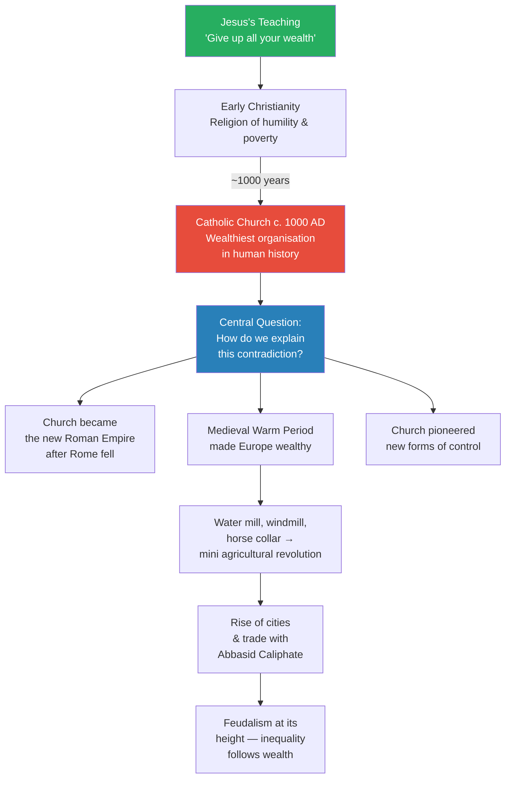
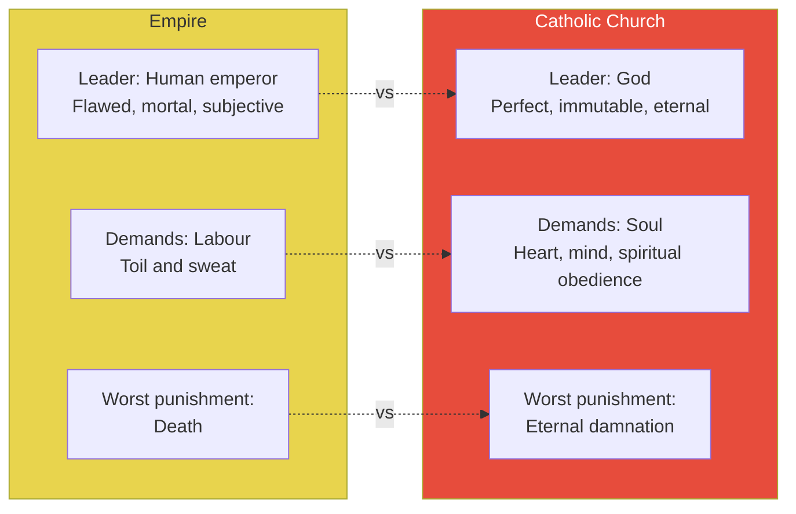
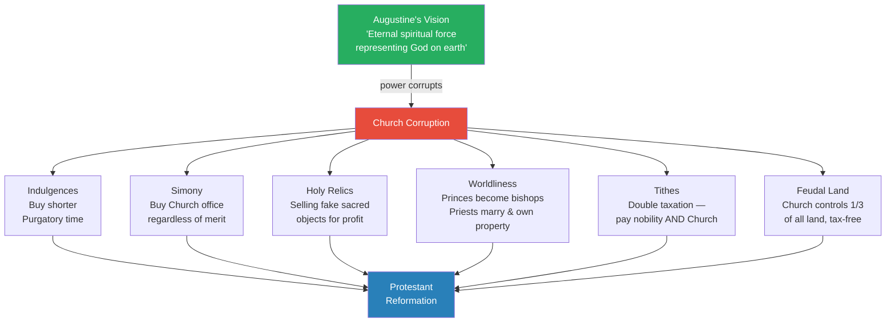
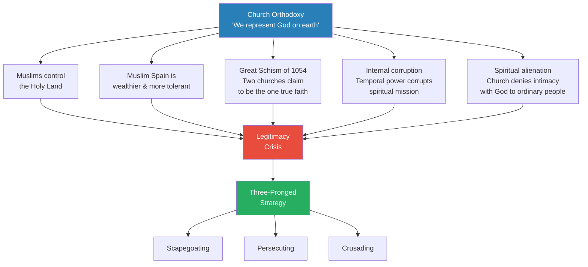
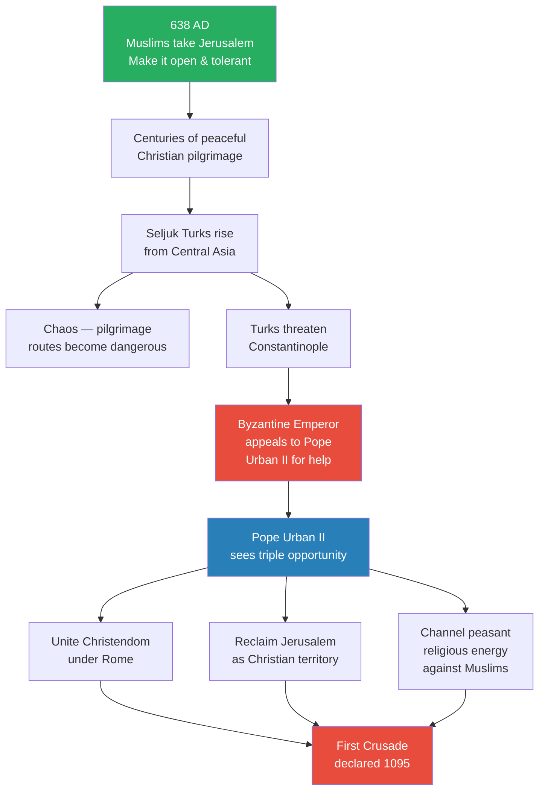
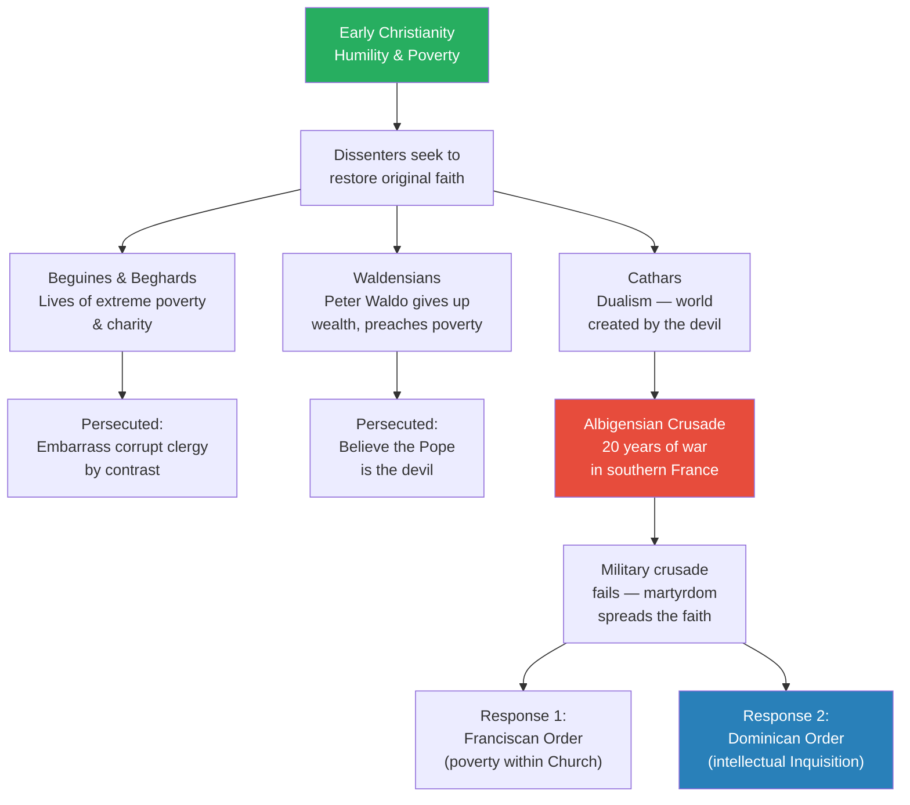
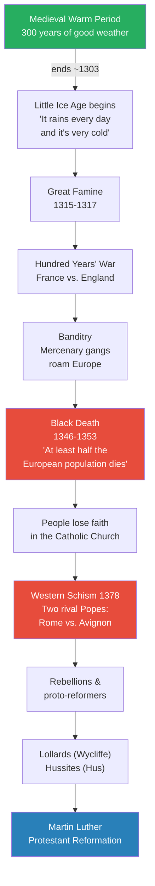

# Church and Empire

> Prof. Jiang asks three questions about the Crusades — what were they, why did they happen, and why did they stop — but the real subject is the Catholic Church's transformation from a religion of humility and poverty into the wealthiest and most powerful organisation in European history. He traces how the Church amassed power through a faith monopoly backed by eternal damnation, how that power bred corruption, and how the Church developed a three-pronged strategy — scapegoating, persecuting, and crusading — to maintain orthodoxy against five simultaneous threats to its legitimacy. The lecture covers the Crusades themselves, the internal crusades against heretical movements like the Cathars, the rise and fall of the Knights Templar, and the 14th-century crises that finally shattered the Church's authority and set the stage for the Protestant Reformation.

---

## Overview: Key Highlights

- <b style="color: #27ae60">The Church's power derived from its faith monopoly</b> — as the only religion, it could sentence souls to eternal damnation, a punishment worse than any emperor could inflict
- <b style="color: #e74c3c">Christianity began as a religion of humility and poverty but became the wealthiest organisation in history</b> — the central contradiction that drives the entire lecture
- <b style="color: #2980b9">Three-pronged strategy: scapegoating, persecuting, crusading</b> — the Church's toolkit for maintaining orthodoxy, recurring throughout European history
- <b style="color: #27ae60">The Crusades were a Christian jihad</b> — Pope Urban II promised immediate remission of sins to anyone who died fighting for Jerusalem, regardless of their past crimes
- <b style="color: #e74c3c">Jews were systematically scapegoated</b> — used as middlemen by the nobility, then sacrificed to channel peasant anger away from the feudal order
- <b style="color: #2980b9">Knights Templar</b> — Europe's first multinational organisation, became bankers and free thinkers, then burned as heretics for threatening Church orthodoxy
- <b style="color: #2980b9">Catharism</b> — dualist heresy in southern France that believed the material world was created by the devil; the community's neighbours converted and died to protect them
- <b style="color: #27ae60">The Dominican Inquisition used the pen, not the sword</b> — systematic interrogation proved far more effective than military crusades at identifying heretics
- <b style="color: #e74c3c">The 14th century destroyed Church legitimacy</b> — the Little Ice Age, Great Famine, Hundred Years' War, and Black Death killed half of Europe
- <b style="color: #2980b9">The Western Schism of 1378</b> — the Catholic Church split into two rival papacies, fatally undermining its claim to represent the one true God
- <b style="color: #27ae60">Crusading mentality survived the Crusades</b> — it manifested in the Age of Exploration, the conquest of the New World, and arguably continues today
- <b style="color: #e74c3c">John Wycliffe and Jan Hus</b> — proto-reformers who translated the Bible and challenged priestly authority, directly paving the way for Martin Luther

| Concept | One-line summary |
|---------|-----------------|
| **Faith monopoly** | The Church's exclusive claim to mediate between God and humanity — the source of all its power |
| **Eternal damnation** | The Church's ultimate weapon — far worse than physical death, it kept even kings obedient |
| **Orthodoxy** | "Right thinking" — the Church's power depends entirely on enforcing correct belief on everyone |
| **Indulgences** | Paying money to shorten time in Purgatory — spiritual bribery that later triggers the Reformation |
| **Simony** | Buying your way into Church office regardless of education or piety |
| **Scapegoating** | Channelling social anger onto a sacrificial group (Jews) to protect the feudal hierarchy |
| **Crusader States** | Christian kingdoms carved out of Muslim territory after 1099, sustained for 200 years by religious fanaticism |
| **Catharism** | Dualist belief that the material world is the devil's creation — souls are pure, bodies are prisons |
| **The Inquisition** | Systematic interrogation by educated Dominicans — more precise and effective than military crusades |
| **Western Schism** | The Catholic Church splitting into two rival papacies (Rome vs. Avignon) in 1378 |
| **Reconquista** | The 200-year process of reclaiming Muslim Spain (Al-Andalus) for Christianity |

---

# The Lecture

## The Contradiction at the Heart of Christianity [0:00 - 4:00]

*Prof. Jiang opens with a story from the Bible — Jesus telling a rich young man to give away everything — and then asks: how did a religion founded on humility and poverty become the wealthiest organisation in human history?*

> [!tip] Core Insight
> Jesus negated wealth — "it is easier for a camel to go through the eye of a needle than for a rich man to enter the kingdom of God." Yet the Catholic Church amassed more wealth than any empire. This contradiction is the engine of the entire lecture.

*The green node represents Jesus's original teaching; the red node represents what the Church became. The gap between them is the lecture's central puzzle.*

> [!note]- Expand: Full Lecture Detail
> Prof. Jiang tells a story from the Bible. One day, Jesus and his disciples are out preaching, and a young man approaches Jesus and says he loved the sermon and wants to know how to be a better person. Jesus tells him to follow the Ten Commandments and the laws of the prophets. The young man says he already does this — he wants to do more. Jesus says: give up all your wealth, give it to the poor, and follow me, and you will have treasure in the kingdom of heaven. The young man walks away distraught because he is very wealthy.
>
> Jesus turns to his disciples and says: <b style="color: #e74c3c">"It is easier for a camel to go through the eye of a needle than for a rich man to enter the kingdom of God."</b>
>
> Prof. Jiang explains that this was revolutionary — in the ancient world, the entire point of believing in God was to become wealthy. Wealth was proof of divine favour. Jesus inverts this: you should live a pious life so that you may enjoy a good life in heaven, not on earth.
>
> He then delivers the punch line: the Catholic Church is probably the wealthiest and most powerful religious organisation in human history. "We have absolutely no idea how wealthy the Catholic Church is. Their wealth is immeasurable." He shows St Peter's Basilica — "inside this church is a lot of gold."
>
> After the fall of Rome, the Catholic Church essentially became the new Roman Empire. For the longest time Europe was poor, but starting around the year 1000, Europe became increasingly wealthy due to:
> - The <b style="color: #2980b9">Medieval Warm Period</b> — it was simply easier to grow crops
> - The invention of the water mill, windmill, and horse collar — what Prof. Jiang calls the "mini agricultural revolution"
> - The rise of urban centres and trade with the Abbasid Caliphate
>
> But with wealth comes inequality. This also marks the high point of <b style="color: #2980b9">feudalism</b> — too many people, too little land, nobility controlling everything, peasants poor, dependent, and indebted.
>
> The wealthiest city in Europe is still Constantinople. But Rome, London, and Paris are emerging as major centres. Importantly, one of the wealthiest parts of Europe is Spain — and Spain is Muslim, not Christian. This will create conflict.

---

## Empire vs. Church — A New Kind of Power [4:00 - 9:00]

*Prof. Jiang compares imperial power with Church power across three dimensions — leadership, demands, and punishment — to explain why the Church could control people in ways no empire ever could.*

*On every dimension, the Church holds the stronger card. An emperor dies; God is eternal. Labour can be survived; your soul is your entire being. Death ends; damnation is forever.*

> [!note]- Expand: Full Lecture Detail
> Prof. Jiang walks through the comparison systematically:
>
> **Who's in charge?**
> - In an empire, the emperor is in charge — but he is a human being who is flawed and mortal. He will eventually die. He is subjective, he makes mistakes, and people must appeal to him and try to convince him
> - In the Catholic Church, the person in charge is God — who is perfect, immutable, and eternal. He can never make a mistake, and he will always be there
>
> **What does it demand?**
> - An empire demands labour — toil and sweat
> - The Church demands your soul — your eternal spiritual obedience, your heart and your mind
>
> **What is the worst punishment?**
> - An empire can only put you to death
> - The Church can sentence you to <b style="color: #e74c3c">eternal damnation</b> — burn in hell for eternity
>
> This concept of eternal damnation is the source of the Church's power. Even kings were afraid. The Church had a <b style="color: #2980b9">faith monopoly</b> — it was the only religion, the one true religion.
>
> Prof. Jiang then walks through the institutional structure that expressed this power:
> - <b style="color: #2980b9">Imperial bureaucracy</b> — the Pope as emperor, bishops controlling each region, a top-down hierarchy mirroring Constantinople and China
> - <b style="color: #2980b9">Latin as the official language</b> — sermons in Latin, Bible in Latin, telling people that theology was not for them. They had to listen and obey
> - Only ordained priests could preach the Bible — you needed Church authorisation to say what Christianity meant
> - The <b style="color: #2980b9">Nicene Creed</b> and the Holy Trinity as the dominant belief system
> - <b style="color: #2980b9">Seven Holy Sacraments</b> — rituals you had to pay for, performed by priests to channel divine energy
> - The <b style="color: #2980b9">Eucharist</b> — the principle of transmutation, where bread becomes the body of Jesus and wine becomes his blood. "You eat Jesus, you drink Jesus, and Jesus comes into you." Prof. Jiang notes: "If it sounds weird, it is weird — and that's why Protestants will rebel against this"
> - The Church determined who goes to Hell, Heaven, and Purgatory — and for how long
> - <b style="color: #2980b9">Canonisation of saints</b> — the Church deciding who is worthy (Protestants will later say only Jesus can decide this)
> - The authority of the clerics was absolute. <b style="color: #e74c3c">Heretics</b> were those who denied the absolute authority of the Church — not simply those who disagreed. Ignorance is not heresy; the Church has a responsibility to educate. But once educated, if you still refuse to submit, you become a heretic, excommunicated, and potentially burned at the stake

---

## Corruption — When Spiritual Power Meets Temporal Ambition [9:35 - 15:00]

*Prof. Jiang catalogues six forms of legal corruption that transformed Augustine's spiritual vision into a worldly empire — each one a betrayal of early Christianity that will later fuel the Protestant Reformation.*

*Every form of corruption Prof. Jiang lists here will reappear as a specific grievance in the Protestant Reformation — he is laying the groundwork for future lectures.*

> [!note]- Expand: Full Lecture Detail
> Prof. Jiang notes that Augustine, in *The City of God*, imagined the intellectual blueprint for the Catholic Church as an eternal spiritual force representing God on earth. The priority was spirituality. But with power, the Church slowly became corrupted. He catalogues six "legal practices" that constituted corruption:
>
> 1. <b style="color: #e74c3c">Indulgences</b> — if you committed sins but had money, you could bribe the Church to shorten your stay in Purgatory. "This is basically bribery — spiritual bribery"
> 2. <b style="color: #e74c3c">Simony</b> — if you are rich, you can buy yourself into the Church regardless of education or theological understanding
> 3. <b style="color: #e74c3c">Selling of holy relics</b> — the Church sold relics claiming to channel divine power; many were fake. Christians found the very idea of the Church engaging in commerce offensive
> 4. <b style="color: #e74c3c">Worldliness</b> — the conflation of nobility with the Church. Princes became bishops. Kings picked who became bishops. Priests were supposed to be celibate and devote their lives to God, but many got married, had children, owned property, and became wealthy. "A conflation of temporal power with spiritual power"
> 5. **Tithes** — parishioners had to pay taxes to both the nobility and the Church
> 6. **Feudal landholding** — the Church controlled, at its height, one-third of all land in Christian Europe, and did not have to pay taxes to the nobility
>
> The result: the Church became the most powerful organisation in all of Europe. Its power came from fear — "people were afraid of burning in hell for eternity. Even kings were afraid."
>
> But Prof. Jiang delivers a crucial caveat: <b style="color: #27ae60">"Ultimately, if you're a church, your power, your legitimacy, your authority comes from your ability to enforce your belief system on everyone."</b> He calls this <b style="color: #2980b9">orthodoxy</b> — the Church must enforce right thinking. If an increasing number of people disagree, the Church's authority decreases.

---

## Five Threats to Church Legitimacy [15:00 - 19:40]

*Around the year 1000, five simultaneous problems threaten the Church's ability to maintain orthodoxy — each one questioning whether the Catholic Church is truly God's representative on earth.*

*Five threats converge on a single vulnerability — the Church's claim to represent the one true God. The three-pronged response will recur throughout European history.*

> [!note]- Expand: Full Lecture Detail
> Prof. Jiang identifies five sources of conflict for the Church around the year 1000:
>
> **1. Muslims occupy the Holy Land**
> - Jerusalem is controlled by the Fatimid Caliphate
> - "This is embarrassing — if you are the true representative of God on earth, why is Jerusalem being controlled by the Muslims?"
>
> **2. Muslim Spain (Al-Andalus) outperforms Christian Europe**
> - More wealthy, more cosmopolitan, more innovative
> - More open, inclusive, and tolerant than the Catholic Church
> - Trades with the rest of the Muslim world during the Islamic Golden Age
> - Jews, Christians, and Muslims all live together in relative harmony
> - "It's just right next door. Everyone can see that Muslim Spain is much more wealthy"
>
> **3. The Great Schism of 1054**
> - The Greek Orthodox Byzantine church in Constantinople splits from the Roman Catholic Church in Rome
> - "Now you have two different churches all claiming to be the one true Church of Jesus — that's a huge problem"
>
> **4. Internal corruption**
> - The conflation of spiritual power with temporal ambition, as just discussed
>
> **5. Spiritual alienation of ordinary people**
> - Prof. Jiang returns to a theme from earlier in the series: humans are first and foremost religious. They have a fundamental need for community, intimacy, and truth
> - But the Catholic Church acts as middleman — "you have to go through us in order to celebrate God"
> - <b style="color: #e74c3c">The Church is denying intimacy with God to the very people it claims to serve</b>
> - "There's a lot of discontent at this point in Christian Europe against the Catholic Church"
>
> The Church's response is a <b style="color: #2980b9">three-pronged strategy</b> that will recur throughout European history: scapegoating, persecuting, and crusading.

---

## Scapegoating the Jews [19:40 - 24:00]

*Prof. Jiang explains the structural logic behind European antisemitism — how the nobility used Jews as middlemen and then sacrificed them to channel peasant anger, a pattern that persisted from the medieval period to the Holocaust.*

> [!tip] Core Insight
> European antisemitism was not random hatred — it was a structural mechanism. The nobility needed Jews as middlemen but made them expendable scapegoats to absorb the anger that feudalism generated. The pattern ran unbroken for a thousand years.

> [!note]- Expand: Full Lecture Detail
> Prof. Jiang explains the mechanism of scapegoating step by step:
>
> **Why were Jews still in Europe?**
> - A lot of them worked for the nobility — managing land, running businesses, collecting taxes, operating banks
> - Jews were clever and hard-working, but most importantly, they were <b style="color: #e74c3c">completely dependent on the protection of the nobility</b>
> - The Catholic Church taught that Jews were responsible for persecuting Jesus, so Christians deeply disliked Jews
> - If Jews wanted to stay together as a community, they had no choice but to serve the nobility — "they essentially become slaves to the nobility"
>
> **How the scapegoating mechanism works:**
> - Peasants resent the nobility — feudalism makes them poor and indebted
> - But in daily life, who do they interact with? Jews — the tax collectors, merchants, and land managers
> - Over time, resentment against the nobility gets channelled toward the Jews
> - "Whenever there's a major conflict, guess who gets killed? It's the Jews"
>
> **The long pattern:**
> - This is consistent across basically all of European history, up to the Holocaust
> - "If you want to understand why the Holocaust happened, this is why it happened — there's a long-term enmity, hatred of the European people against the Jews, created by the nobility"
> - When conflict becomes too intense, the nobility protects itself by expelling the Jews entirely:
>   - Germany expelled the Jews in 1100
>   - France expelled them in 1306
>   - Spain expelled them in 1492
>
> > [!example] The Scapegoat Ritual — Origin of the Term
> > - In Judaism, there is a ritual where the sins of the community are placed on a goat
> > - The goat is then released into the wilderness or sacrificed to cleanse the community
> > - The nobility applied this logic to Jews — periodically allowing peasants to kill Jews functioned as a "ritual sacrifice"
> > - Once the peasants had satisfied their anger on the Jews, they went back to work
> > - The feudal order survived intact
> > **The lesson:** Scapegoating is not irrational hatred — it is a calculated political tool to preserve hierarchy by redirecting anger onto an expendable group.

---

## The Crusades — Background and Pope Urban II's Speech [24:00 - 33:00]

*Prof. Jiang provides the geopolitical context for the Crusades — the Seljuk Turks disrupting pilgrimage routes and threatening Constantinople — then analyses Pope Urban II's 1095 speech line by line, revealing the Crusades as a calculated political move dressed in religious fervour.*

*The Crusades begin not as a purely religious movement but as a political calculation by a pope who sees three opportunities in a single crisis.*

> [!note]- Expand: Full Lecture Detail
> **Historical background:**
> - In 638, Muslims took Jerusalem from the Byzantine Empire and made it an open, inclusive, and tolerant religious community where Christians, Jews, and Muslims could worship freely
> - For centuries, Christian pilgrimages to Jerusalem proceeded without issues
> - As the Byzantine Empire and Abbasid Caliphate weakened, chaos spread — bandits made the pilgrimage routes dangerous
> - The <b style="color: #2980b9">Seljuk Turks</b>, steppe people from Central Asia (like the Mongols discussed last class), gradually conquered the Abbasid Caliphate
> - In 1071, the Turks occupied Jerusalem — they left the city alone, but the routes remained dangerous
> - The Turks also threatened Constantinople, taking territory around it
> - The Byzantine emperor appealed to Pope Urban II for help
>
> **Pope Urban II's calculation:**
> - "Remember — popes are politicians." He saw three opportunities:
>   1. Unite Christendom under the authority of Rome
>   2. Reclaim Jerusalem as Christian territory
>   3. Channel the religious energies of the peasantry against the Muslims
>
> **Line-by-line analysis of the speech (1095):**
>
> > [!quote] Pope Urban II
> > "All who die, whether by land or by sea or in battle against the pagans, shall have immediate remission of sins."
>
> - Prof. Jiang is blunt: <b style="color: #27ae60">"This is a jihad. He's calling for jihad."</b> The concept people think comes from Islam is very much a Christian concept — die on crusade, go straight to heaven regardless of your sins
>
> > [!quote] Pope Urban II
> > "Oh, what a disgrace, if such a despised and base race which worships demons..."
>
> - Prof. Jiang corrects the propaganda: "Muslims don't worship demons. Muslims worship the same God as the Jews and the Christians." Much of their religious practice is similar. When Muhammad conquered the Holy Land, he tried to reduce bloodshed. The Pope is "spreading racism against the Muslims" — rumours that Christian women are being enslaved and Christians massacred are "all fake, not true"
>
> - "Let those who have been robbers now become knights" — even the lowest criminal, if they go on crusade, becomes a nobleman, a hero of Christianity
> - "Let those who have been serving as mercenaries for small pay now obtain the eternal reward" — regardless of who you are or what you did, the crusade will save you
>
> **Why people went on the Crusades** — Prof. Jiang lists the diverse motivations:
> - **Penance** — violent people seeking forgiveness for sins (alternative: join a monastery)
> - **Clerical immunity** — criminals absolved of their crimes by going on crusade. "A lot of psychopaths go on this crusade"
> - **Vengeance** — rumours of Muslim atrocities against Christian women
> - **Elite overproduction** — younger sons who cannot inherit land seeking to win their own territory and nobility
> - **Second Coming** — the most powerful idea in Christianity; many believed the crusade was the final battle, and Jesus would return to Jerusalem to usher in a New World Order. "People actually believe this"
> - **Adventurism and romanticism**
> - **Chivalry** — the code of honour among knights; loyalty to your lord meant following him on crusade
> - **Piety, fanaticism, and glory**
>
> Prof. Jiang flags why this matters beyond the medieval period: "These reasons are also what drives the Europeans into the New World... the Age of Exploration, where the Spaniards, the Portuguese, the French, the British go into the New World for these reasons, with religious fever and religious energy."

---

## The Crusader States and the Fall of Jerusalem [33:00 - 38:36]

*Prof. Jiang covers the First Crusade's success, the massacre of 1099, Saladin's peaceful reconquest in 1187, and the five military orders — with special attention to the Knights Templar and the Teutonic Knights who founded Prussia.*

> [!note]- Expand: Full Lecture Detail
> **The First Crusade (1095-1099):**
> - Extremely successful, because at this point in history "the Muslims don't really care about Jerusalem — it's not that important to them"
> - The Crusaders established the <b style="color: #2980b9">Crusader States</b> — Christian kingdoms completely surrounded by Muslim territory, sustained for 200 years by religious fanaticism
>
> > [!example] The Massacre of Jerusalem (1099) vs. Saladin's Reconquest (1187)
> > - When the Crusaders took Jerusalem in 1099, they killed all the Muslims, all the Jews — "they basically kill as many people as possible"
> > - The Fatimids had expelled Christians from the city before the siege to prevent them helping the Crusaders from inside — so no Christians were killed
> > - "The Christians celebrate this — for them, killing the enemy for the glory of God is righteous killing"
> > - In 1187, the Muslim leader <b style="color: #2980b9">Saladin</b> — "considered one of the greatest warriors in human history, celebrated by both Christians and Muslims" — retook Jerusalem without killing any Jews, Christians, or Muslims
> > - He did so peacefully
> > **The lesson:** Historically, Christianity was often the more violent religion. Islam, while not without violence, "tends to be much more peaceful, open, inclusive" — Prof. Jiang specifies this is about the historical record, not today.
>
> **The five military orders:**
> - The <b style="color: #2980b9">Knights Templar</b> — the most famous
> - The <b style="color: #2980b9">Teutonic Knights</b> — who will go on to found Prussia, which will unite Germany. "I want you to remember the Teutonic Knights — they will form the basis of Prussian society"
> - Three other orders from different parts of Europe
>
> **Three directions of the Crusades simultaneously:**
> 1. Recapture Jerusalem
> 2. Reclaim Spain from the Muslims (<b style="color: #2980b9">Reconquista</b> — Al-Andalus, a 200-year process)
> 3. Internal crusades against heretical dissenters

---

## The Knights Templar — Bankers, Free Thinkers, Heretics [38:36 - 43:00]

*Prof. Jiang traces how the Knights Templar evolved from pilgrim protectors into Europe's first multinational banking organisation and eventually into free thinkers who absorbed religious diversity — making them a direct threat to Church orthodoxy.*

> [!tip] Core Insight
> The Knights Templar became free thinkers not through rebellion but through practical necessity — governing Jerusalem required working with Jews, Muslims, and Christian heretics, and managing pilgrim wealth required banking sophistication. Contact with diversity produced reason and tolerance, which the Church could not tolerate.

> [!note]- Expand: Full Lecture Detail
> **From protectors to bankers:**
> - The Templars were meant to protect pilgrims on the way to Jerusalem
> - What they really did: pilgrims gave their money to the Templars for safekeeping, then collected it in Jerusalem — "they were a bank"
> - As bankers, they made investments and traded, becoming far more sophisticated, educated, and cosmopolitan than the Catholic Church
> - "The Catholic Church is an imperial bureaucracy. It only cares about maintaining orthodoxy. But the Knights Templar are bankers, traders"
>
> **From bankers to free thinkers:**
> - Governing Jerusalem required working with Jews and Muslims — they had business connections throughout the Muslim world
> - The Templars welcomed Jews and Muslims back into Jerusalem
> - Over time, they learned from Muslims and Jews, picking up better practices
> - They also encountered Christians considered heretics by Rome — those who disagreed with the Holy Trinity and had fled to Muslim lands
> - The Templars absorbed all this diverse religious belief and "became essentially free thinkers"
> - "A lot of religion now is based on reason and logic, because that's really the only way you can manage this religious diversity"
>
> **The destruction of the Templars:**
> - In 1307, the Catholic Church began persecuting the Knights Templar
> - Their leader, <b style="color: #2980b9">Jacques de Molay</b>, was burned at the stake
> - The Church accused them of being Satan worshippers — "there's no evidence they were Satan worshippers, but they were definitely free thinkers, definitely religiously tolerant, and that went against the orthodoxy of the Catholic Church"
> - But disbanding the organisation drove it underground — their beliefs spread throughout Europe
> - These beliefs would incubate the Protestant Reformation and even influence the American Revolution

---

## The Internal Crusade — Beguines, Waldensians, and Cathars [43:00 - 52:00]

*Prof. Jiang surveys three heretical movements that all sought to restore early Christianity's values of poverty and humility — and the increasingly sophisticated methods the Church used to destroy them.*

*The Church's response to heresy evolved — from brute force (Crusade) to co-option (Franciscans) to sophisticated interrogation (Dominicans). Each failure taught the Church a more effective method.*

> [!note]- Expand: Full Lecture Detail
> **The Beguines and Beghards:**
> - Beguines (women) and Beghards (men) wanted to restore early Christianity as a religion of humility and poverty
> - They lived lives of extreme poverty and charity, giving everything they had to others — "think of the story of the young man who approaches Jesus"
> - Many were wealthy people who gave up everything to celebrate Christianity
> - Two problems: they defied the authority of the Church, and their simple lives embarrassed the "fat, wealthy, and corrupt" clerics
> - They were persecuted
>
> **The Waldensians:**
> - Founded by <b style="color: #2980b9">Peter Waldo</b>, son of a wealthy merchant who gave everything up to live in poverty
> - They also preached poverty and true faith
> - Their problem: they believed the Pope was the devil — "the Catholic Church is evil because it's corrupting true Christianity"
> - Many were burned at the stake, but they survived — "they're still around even today"
>
> **The Cathars and the Albigensian Crusade:**
> - Based in Albi in southern France
> - Practised <b style="color: #2980b9">Catharism</b>, a dualist belief: this world was created by the devil because it is full of pain and suffering
> - The devil stole pure souls from heaven and imprisoned them in corrupt bodies
> - The goal of life: recognise that we are in prison and escape our bodies through good works, beliefs, and <b style="color: #2980b9">Gnosis</b> (full knowledge) — "these people are also considered Gnostics"
> - Their church structure was extremely open, tolerant, and inclusive — women and Jews within the hierarchy
> - They called themselves "good Christians," lived lives of simplicity and poverty, and were deeply admired by their neighbours
>
> > [!example] The Community That Chose to Die (Albigensian Crusade, c. 1209-1229)
> > - When the Pope declared a crusade against the Cathars, the entire community rallied to protect them
> > - The Crusaders only wanted to kill the Cathars, not the Catholics
> > - But Catholic neighbours were willing to sacrifice their lives to protect the Cathars
> > - Many neighbours converted to Catharism knowing they would die — "so disgusted by the Crusades, so disgusted by the Catholic Church"
> > - The Cathars themselves went willingly to be burned at the stake — "remember, we are inside corrupt bodies, so when we are martyred, we will go straight to heaven"
> > - They went happily, which stunned their neighbours and frightened the Catholic Church
> > - "They know you can't beat people like this — if you keep persecuting them, their religion will spread"
> > **The lesson:** Martyrdom is the ultimate weapon against persecution — killing people who welcome death only strengthens their cause.
>
> **The Church's two-pronged response:**
>
> 1. The <b style="color: #2980b9">Franciscan Order</b> — a brotherhood focused on humility and poverty (like the Cathars), but within the Church hierarchy, obeying the Pope
>
> 2. The <b style="color: #2980b9">Dominican Order</b> — created specifically to deal with the Cathar heresy. "Just as the Jesuits were created for the Protestant Reformation." Extremely well-educated people who used "the power of the pen rather than the power of the sword"
>    - They believed they were doing God's work — saving souls from eternal damnation
>    - They acted "out of the pureness, the goodness of their own heart" with "compassion, generosity, mercy"
>    - They were fanatical — "absolutely convinced the Cathars have been misled by the devil"

---

## The Inquisition — The Power of the Pen [52:00 - 59:30]

*Prof. Jiang explains the mechanics of the medieval Inquisition as a precise, methodical system of interrogation — far more effective than military crusades because it could identify individual heretics without destroying entire communities.*

```mermaid
flowchart LR
    CR["Military Crusade<br/>'Kill everyone —<br/>God will know his own'"] -->|"Problem: unites<br/>community against Church"| FAIL["Community rallies<br/>to protect Cathars"]
    FAIL -->|"Evolution"| INQ["Dominican Inquisition<br/>'Power of the pen'"]
    INQ --> S1["Deploy informants<br/>to identify suspects"]
    S1 --> S2["Interrogate<br/>individuals separately"]
    S2 --> S3["Write everything down<br/>— compare testimonies"]
    S3 --> S4["Stay for months<br/>— stories eventually<br/>fall apart"]
    S4 --> S5["Isolate the heretics<br/>from the community"]
    S5 --> S6["Burn heretics<br/>at the stake to<br/>send a message"]
    S6 --> S7["Community learns<br/>resistance is futile"]
    style CR fill:#e74c3c,color:#fff
    style INQ fill:#2980b9,color:#fff
    style S7 fill:#27ae60,color:#fff
```

*The evolution from crusade to inquisition represents a shift from blunt force to precision — and a recognition that killing indiscriminately creates more enemies than it eliminates.*

> [!note]- Expand: Full Lecture Detail
> Prof. Jiang explains the institutional context first:
> - In medieval Europe, there are two types of authority: <b style="color: #2980b9">clerical authority</b> (the Church, responsible for spiritual life) and <b style="color: #2980b9">secular authority</b> (the nobility/prince, responsible for physical life)
> - The secular authority has the power to kill. The clerical authority has the power to declare someone a heretic
> - The Church's own doctrine forbids it from spilling blood — so the Inquisition involved very little violence, contrary to stereotype
>
> **The problem the Inquisition solved:**
> - Cathars could lie about their beliefs — "this world is fake, who cares. I'm fake, you're fake. As long as your soul is pure, that's what matters"
> - The community protected Cathars — neighbours would get together and fabricate coordinated lies before the inquisitors arrived
> - Perhaps only "one in three" or "one in ten" people in a community were actually Cathars
>
> **The Dominican method:**
> - Use informants to identify likely suspects
> - Interrogate individuals separately — because the Dominicans were well-educated, they could write everything down
> - They were tenacious and persistent — "they might stay in a community for a year, interviewing you once a week"
> - If you are lying, eventually your story falls apart when compared with others' testimony
> - The key is to separate the suspected heretics from those protecting them
> - Then burn the identified heretics at the stake "to send a message to the community"
> - Over time, people recognised that "resistance is futile — these people are so persistent they will figure out the truth"
>
> **Why this was an improvement over the Crusade:**
> - During the Albigensian Crusade, the Crusaders killed everyone indiscriminately
> - The Pope reportedly said: "Kill them all — God will know his own"
> - This felt unjust and united all of southern France against the Catholic Church
> - The Inquisition was "a much more precise, methodical way" — only the actual heretics were targeted
> - This method would be reused in the Spanish Inquisition and during the Protestant Reformation

---

## The 14th-Century Collapse — Why the Crusades Stopped [52:00 - 57:42]

*Prof. Jiang traces how a cascade of catastrophes in the 14th century — climate change, famine, war, plague, and institutional schism — destroyed the Catholic Church's claim to represent God and prepared the ground for the Protestant Reformation.*

*A chain reaction of catastrophes — each one weakening the Church's ability to maintain orthodoxy — culminates in the conditions for the Protestant Reformation.*

> [!note]- Expand: Full Lecture Detail
> Prof. Jiang traces a cascade of crises that shattered Church legitimacy:
>
> **The Little Ice Age (from c. 1303):**
> - For 300 years, Europe had enjoyed the Medieval Warm Period — good weather for crops
> - Starting around 1303, "it rains every day and it's very cold"
> - Good Christians read the Bible and recognised this as Noah's flood — God is angry
> - Who had they sinned against? "Probably the Cathars, probably the Waldensians, probably those who led good lives — and you killed them anyway"
>
> **The Great Famine (1315-1317):**
> - Direct consequence of the Little Ice Age
>
> **The Hundred Years' War:**
> - War between France and England — "all Europe right now is either starving or at war"
>
> **Banditry:**
> - Mercenary groups — "packs of young men who go around killing people"
>
> **The Black Death (1346-1353):**
> - Started in Central Asia and spread via the <b style="color: #2980b9">Pax Mongolica</b> (discussed in the previous lecture on Genghis Khan)
> - Europe was especially vulnerable: people were at war, starving, immune systems weak
> - <b style="color: #e74c3c">"At least half of the European population" died</b>
> - People lost faith in the Catholic Church
>
> **The Western Schism of 1378:**
> - The Catholic Church itself split into two rival papacies
> - Pope in Rome, supported by Sweden, Denmark, England, Poland, Hungary, Italy
> - Pope in Avignon, supported by France (a rising power)
> - "This causes people to lose more faith in the Catholic Church"
>
> **Proto-reformers and rebellions:**
> - The <b style="color: #2980b9">Lollards / Dosinians</b> — "basically a revolutionary party" arguing for the fall of the Church and feudalism, wanting to create an egalitarian society. "These are proto-communists"
>
> > [!example] John Wycliffe — The Man They Burned After He Was Already Dead
> > - English theologian, widely respected, critical of the Church
> > - Believed priests had too much power and God should be returned to the people
> > - Translated the Bible from Latin into English so ordinary people could read it
> > - The Church declared him a heretic — but he was already dead
> > - "What they did was this — they dug up his body and then burned him at the stake, because that's what you do to heretics"
> > **The lesson:** The Church's willingness to desecrate a corpse reveals how threatening Bible translation was to its monopoly on religious truth.
>
> > [!example] Jan Hus — The Czech Martyr
> > - Czech theologian in Bohemia, preaching the same ideas as Wycliffe
> > - Declared a heretic and burned at the stake while alive
> > - His execution triggered the <b style="color: #2980b9">Hussite Wars</b> — Bohemians challenging the authority of the Catholic Church
> > - The rebellion was eventually crushed, but it gave way to another reformer: Martin Luther
> > **The lesson:** Killing reformers does not kill reform — it creates martyrs and inspires successors.

---

## Conclusion — The Three Questions Answered [57:42 - 59:30]

*Prof. Jiang returns to the three questions he posed at the start and delivers concise answers — then extends the Crusades forward into the Age of Exploration and the present day.*

> [!note]- Expand: Full Lecture Detail
> Prof. Jiang concludes by answering his three framing questions:
>
> **What are the Crusades?**
> - "In the Western imagination, it's no different from the jihad in the Muslim imagination — it is a religious war"
> - The Crusades channel religious energy against an opponent
> - Even though they technically end in 1290, they manifest in the Age of Exploration and the conquest of the New World
>
> **Why did they happen?**
> - The Catholic Church had a legitimacy problem
> - The Church was divided between East and West
> - Muslims in Spain were more open and cosmopolitan
> - Jerusalem was controlled by Muslims
> - Internal dissent threatened orthodoxy
> - <b style="color: #27ae60">The Church was trying to unite Christendom, channel religious energy and fanaticism, and consolidate its power and authority over Europe</b>
>
> **Why did they stop?**
> - Europe fell into internal turmoil in the 14th century — famine, plague, war, schism
> - But Prof. Jiang adds: "You can also argue they never really stopped. It's still going on today — the wars in the Middle East that you're seeing on the news, it's really still part of the crusading mentality"

---

## Q&A — Scapegoating and the Logic of the Inquisition [59:30 - 1:07:33]

*Students ask about the mechanics of the Inquisition, the concept of scapegoating, and how Church punishment worked in a world where spiritual consequences mattered more than physical ones.*

> [!note]- Expand: Full Lecture Detail
> **On the Inquisition's precision:**
> - A student asks for more detail on how the Inquisition worked
> - Prof. Jiang elaborates: the Dominicans used informants, individual interrogation, and written records to systematically identify heretics
> - Unlike the Crusade, which killed everyone indiscriminately, the Inquisition separated Cathars from Catholics through patient, persistent interrogation
> - "The trick is to make sure that you separate one and three from two, four, five, six" — isolate the actual heretics from the community that protects them
>
> **On scapegoating:**
> - Prof. Jiang explains the Jewish origin of the term — the ritual goat that absorbs the community's sins
> - "The idea of scapegoating is to blame someone else for your troubles, or to divert people's attention"
> - In feudalism, the conflict is between a small nobility and a large peasantry
> - Jews functioned as middlemen — tax collectors, merchants, land managers
> - "What you would do is, now and then, let the peasants kill the Jews" — a ritual sacrifice to cleanse the peasants of their anger
> - Once satisfied, the peasants go back to work and the feudal order survives
> - "I know this is disgusting and wrong, but it is a very powerful political tool"
>
> **On Church punishment:**
> - A student asks how the Church could punish if burning at the stake was a secular power
> - Prof. Jiang clarifies: "In this religion, this world doesn't matter. What matters is once you die"
> - Everyone alive was thinking about how to ensure a peaceful, happy afterlife
> - The Catholic Church controlled access to eternal salvation
> - "If you piss off the Catholic Church, the Catholic Church can tell you that you're going to burn in hell"
> - "It's a religion, it's a belief system, it's a worldview — and this is what people believe, and that's what drives your actions"

---

## Connections

**Builds on:** [[27 - Augustine's Empire of God]] (Augustine's vision of the Church as eternal spiritual force — the blueprint that became corrupted), [[28 - Muhammad's Revolution of God]] (Islam as open, tolerant alternative to Catholic rigidity), [[39 - Genghis Khan, World Shatterer]] (Pax Mongolica spreading the Black Death, Seljuk Turks as steppe invaders)

**Sets up:** Lecture 41 on the Renaissance, the Protestant Reformation, and Martin Luther (every form of corruption catalogued here becomes a Reformation grievance)

**Related books in vault:** [[Sapiens - Yuval Noah Harari]] (institutional religion as cooperation mechanism), [[The Prince - Niccolo Machiavelli]] (political calculation behind religious rhetoric)

**Recurring themes:** Elite overproduction (younger sons driving crusading), scapegoating (pattern from medieval Jews to the Holocaust), orthodoxy vs. dissent (Church's perpetual struggle), the dialectic between spiritual mission and temporal power

---

## The Takeaway

This lecture reveals the Catholic Church as a case study in how institutions betray their founding principles. Jesus preached poverty and humility; within a thousand years, his Church controlled one-third of Europe's land, sold forgiveness, and burned dissenters alive. Prof. Jiang does not present this as hypocrisy for its own sake — he traces the structural logic. Once a faith monopoly exists and its ultimate sanction is eternal damnation, the incentives all point toward accumulation of power, not spiritual purity. Augustine's vision of an eternal spiritual force representing God on earth was always going to collide with the temporal reality of governing a continent.

The most counterintuitive insight is that the Church's greatest enemies were not the Muslims outside its borders but the Christians within them — the Beguines, Waldensians, and Cathars who actually lived the lives of poverty and humility that Jesus preached. By doing what Jesus said, they exposed the gap between the Church's teaching and its practice. The Church's response — from military crusade to intellectual inquisition — evolved not because the Church became more merciful, but because it learned that killing martyrs only creates more believers. The Dominican interrogation method, which Prof. Jiang compares to modern police work, was the medieval precursor to every systematic identification and persecution programme that followed.

The lecture leaves a major question unresolved: if the 14th-century catastrophes destroyed the Church's claim to represent God, and proto-reformers like Wycliffe and Hus laid the intellectual groundwork, what finally tipped the balance? The answer is Martin Luther and the Protestant Reformation — next week's lecture — but Prof. Jiang has already shown us that Luther was not an aberration. He was the culmination of centuries of accumulated grievance, each item on the corruption list waiting to become a thesis nailed to a church door.
