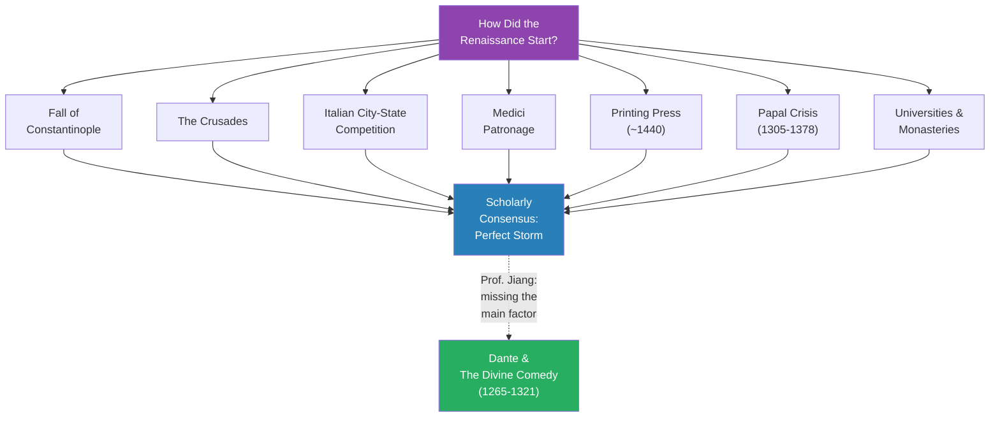
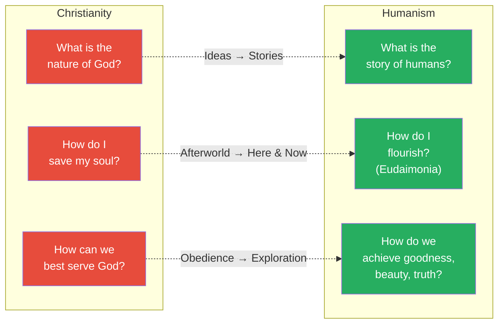
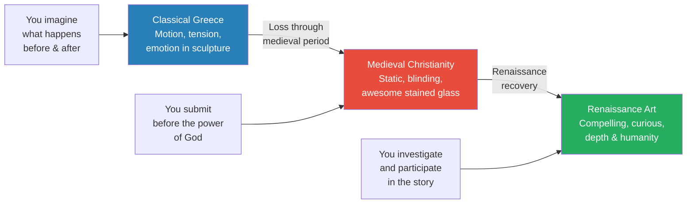
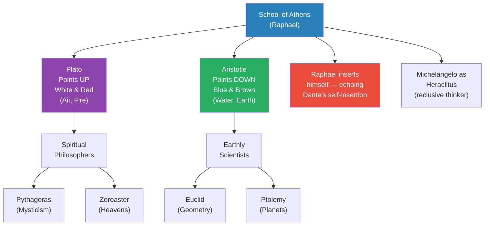
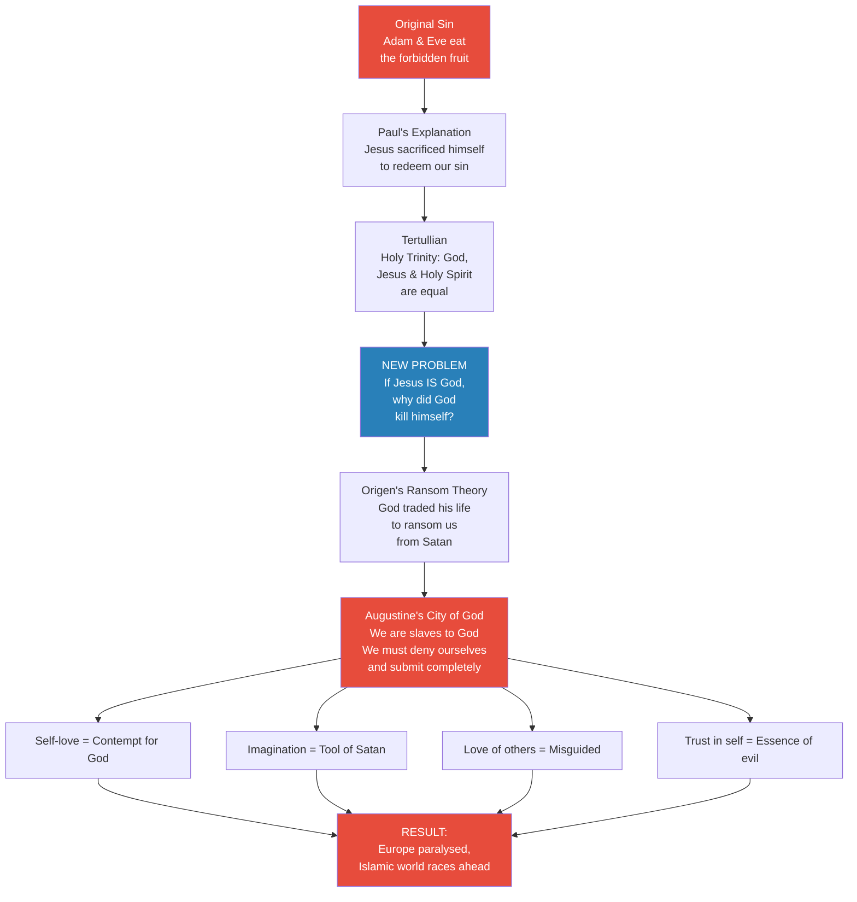
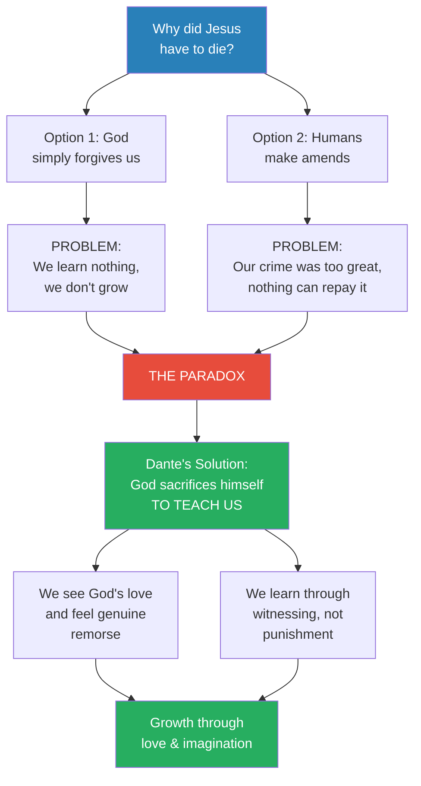
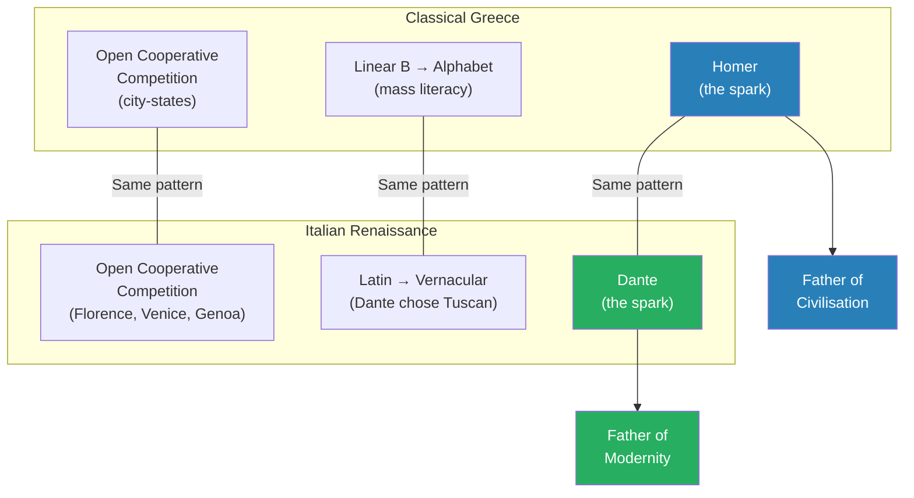

# Dante's Quiet Revolution

> Prof. Jiang asks a deceptively loaded question: how did the Renaissance start? The scholarly mainstream points to a perfect storm of factors — the fall of Constantinople, the Crusades, Italian city-state competition, Medici patronage, and the printing press. Prof. Jiang agrees these all mattered, but argues they are insufficient without a catalyst. His thesis: Dante Alighieri, through the Divine Comedy, reimagined the human relationship with God and thereby freed European civilisation from the paralysing theology of Augustine. By replacing self-denial with self-celebration, submission with love, and obedience with imagination, Dante planted the philosophical seed that Michelangelo, Da Vinci, and Raphael would cultivate in the heart of the Catholic Church itself — a peaceful revolution from within.

---

## Overview: Key Highlights

- <b style="color: #27ae60">Dante is the secret catalyst of the Renaissance</b> — born in 1265, earlier than every other major Renaissance figure, he provided the philosophical spark that made everything else possible
- <b style="color: #2980b9">Humanism</b> — the Renaissance philosophy that shifted focus from the nature of God to the story of humans, from saving the soul to flourishing on Earth, from serving God to achieving goodness
- <b style="color: #e74c3c">Augustine's theology paralysed Europe</b> — self-denial, self-negation, and submission to God left European civilisation unable to innovate, falling behind the Islamic world
- <b style="color: #27ae60">"The greatest gift God gave was freedom of the will"</b> — Dante's radical assertion in the Divine Comedy, directly overturning Augustine's insistence on obedience
- <b style="color: #2980b9">The Medici family</b> — merchant elite who lacked battlefield or divine legitimacy, so they patronised art to become the cultural capital of Europe
- <b style="color: #e74c3c">Love as the enemy in Augustinian theology</b> — Augustine argued love misguides, imagination leads to Satan, and trusting yourself is the essence of evil
- <b style="color: #27ae60">Love is the unifying force of the universe</b> — Dante's counter-argument: loving others activates imagination, grows wisdom, and celebrates the God within us
- <b style="color: #2980b9">From blinding and awesome to compelling and curious</b> — the transition from medieval Christian art (submission before God) to Renaissance art (participation in the human story)
- <b style="color: #27ae60">Michelangelo's Creation of Adam hides a human brain behind God</b> — suggesting God is an emanation of human imagination, planted at the very heart of the Vatican
- <b style="color: #2980b9">Vernacular revolution</b> — Dante chose to write in Tuscan rather than Latin, democratising knowledge just as the Greek alphabet had done for classical Greece
- <b style="color: #e74c3c">The ransom theory trapped humanity as slaves to God</b> — Origen's theology, expanded by Augustine, made humans property of God rather than free agents
- <b style="color: #27ae60">The dual nature of humanity</b> — bodies mortal (made from dust), souls immortal (breathed by God), and this imperfection is what enables imagination and growth

| Concept | One-line summary |
|---------|-----------------|
| **Humanism** | Renaissance philosophy: focus on human flourishing, not divine obedience |
| **Freedom of the will** | Dante's central claim — God's greatest gift is our liberty to choose |
| **Ransom theory** | Origen's idea that God ransomed us from Satan by sacrificing himself, making us God's property |
| **Augustinian self-denial** | The theological framework that demanded submission, distrust of self, and contempt for earthly love |
| **Eudaimonia** | Greek concept of flourishing — living the best possible life on Earth |
| **Polymath** | A person interested in and accomplished across every field of knowledge — Da Vinci as archetype |
| **Gold Florin** | Florence's gold currency that became the standard for European trade |
| **Vernacular** | The spoken language of ordinary people — Dante's deliberate choice over Latin |
| **Open cooperative competition** | Innovation driven by rival city-states competing and learning from each other |
| **Dual nature** | Humans are part matter (mortal body) and part divine (immortal soul breathed by God) |
| **Blinding and awesome** | Medieval Christian art designed to induce submission before God's mystery |
| **Compelling and curious** | Renaissance art designed to draw the viewer in as a participant in a human story |

---

# The Lecture

## The Scholarly Case for the Renaissance — A Perfect Storm [0:00 - 9:47]

*Prof. Jiang opens by presenting the mainstream scholarly explanation for the Renaissance: a convergence of factors including the decline of Constantinople, the Crusades, Italian city-state competition, the rise of a merchant elite, and the printing press. He accepts all of these — then announces he believes the scholars are missing the main factor.*

> [!tip] Core Insight
> Every major Renaissance figure — Raphael, Galileo, Boccaccio, Michelangelo — was born after Dante (1265). If you are looking for the spark that ignited the Renaissance, the chronology points to one man.

*The scholarly mainstream identifies seven converging factors. Prof. Jiang accepts them all but argues they are necessary conditions, not sufficient ones — the catalyst was Dante.*

> [!note]- Expand: Full Lecture Detail
> Prof. Jiang begins by framing the Renaissance as an intellectual revolution that changed the fate of Europe. He defines it precisely: <b style="color: #2980b9">the Renaissance was a reimagining of classical Greece in a Christian European context</b>. It combined Greek thought with Christian Europe, and from that fusion, modernity was born — "the ideas, the values that underpin modernity, the world we live in today, starts with the Renaissance."
>
> He then walks through the mainstream scholarly factors one by one:
>
> - **The decline of Constantinople** — for centuries, Constantinople was the epicentre of European culture, heir to the Greco-Roman legacy. As the Ottoman Turks encroached on Byzantine territory, scholars fled back to Europe, bringing Plato and Aristotle with them
> - **The Crusades** — Europeans encountered the Muslim world at scale and absorbed the culture and politics of the <b style="color: #2980b9">Islamic Golden Age</b>
> - **Italian city-state competition** — Florence, Venice, and Genoa competed with each other, creating <b style="color: #2980b9">open cooperative competition</b> that drove innovation. Because these city-states were always at war, "everyone was a participant in history" — no one could stand outside and merely observe
>   - Venice and Genoa prospered through slave trade with the Muslim world, and through this trade, imported books, ideas, and values from the Islamic world
>   - Florence prospered through the wool trade
> - **The Medici family** — a merchant elite that pooled resources to create a bank, set up branches across Europe to facilitate trade, and became tremendously wealthy. Four popes eventually emerged from the family
>   - The Medicis had a <b style="color: #e74c3c">legitimacy problem</b>: they had not won their title on the battlefield (warrior class) and did not represent God (priest class) — all they had was money
>   - To legitimise themselves, they went on "a massive spending spree" to make Florence the cultural capital of Europe
>   - They funded the Santa Maria del Fiore (the fourth largest church in the world), and patronised Michelangelo, Da Vinci, Raphael, Botticelli, and Donatello
> - **The printing press** — invented by Gutenberg around 1440 in Germany, arrived in Venice in 1469. Thirty years later, Venice had 417 printing presses. In the first 50 years, 20 million volumes of books were printed. "The printing press is a revolution of literacy and knowledge in Europe that democratises knowledge"
> - **The papal crisis** — from 1305 to 1378, there were two popes in Europe, creating a crisis of legitimacy and authority in the Catholic Church. The pope moved to Avignon and lost authority over Italy
> - **Universities and monasteries** — places of theological debate where the classics were stored and new ideas emerged
>
> Prof. Jiang then names the major Renaissance thinkers: the three great poets (Dante, Petrarch, Boccaccio), Niccolo Machiavelli ("the prince is really one of the first political treatises in the world"), and Galileo ("the father of science"). He pauses on Machiavelli to correct the common misconception: Machiavelli was not an amoral strategist but "a startled Democrat" who believed everyone needs to understand how politics works for a well-functioning republic. The Medicis tortured him for his democratic beliefs.
>
> After presenting the mainstream case, Prof. Jiang makes his counterclaim: "I disagree with scholarship. I think there's one factor that they're missing out, and it's the main factor in the creation of the Renaissance. I believe... that Dante, The Divine Comedy, is what ultimately sparked the Renaissance."

---

## Humanism vs. Christianity — The Three Great Differences [9:47 - 19:47]

*Prof. Jiang defines humanism as the philosophy underpinning the Renaissance and contrasts it with Christianity across three dimensions: the nature of inquiry, the goal of life, and the standard of goodness. He presents this as a radical reorientation from the afterworld to the here and now.*

*Three parallel transitions, each moving from divine submission to human agency. The Renaissance is not a rejection of God but a redirection of focus — from heaven to Earth, from ideas to stories, from obedience to flourishing.*

> [!note]- Expand: Full Lecture Detail
> Prof. Jiang presents the three differences between Christianity and humanism as the philosophical core of the Renaissance:
>
> - **Difference 1 — From the idea of God to the story of humans:** Christians asked "What is the nature, what is the idea of God?" Humanists asked "What is the story of humans?" Prof. Jiang emphasises this as "the major revolution in the intellect brought on by the Renaissance" — <b style="color: #27ae60">a transition from a focus on ideas to a focus on stories</b>
> - **Difference 2 — From saving the soul to flourishing:** Christians asked "How do I save my soul? How do I ensure that I go to heaven?" Humanists asked "How do I flourish? How do I make the most out of my talents? How do I have the best possible life on Earth?" The Greek word for this is <b style="color: #2980b9">eudaimonia</b> — "humanism is actually a return to the values and belief systems of classical Greece"
> - **Difference 3 — From serving God to achieving goodness:** Christians asked "How can we best serve God? How can we best obey God?" Humanists asked "How do we achieve goodness? How do we make the world we live in today beautiful and truthful?"
>
> The net effect: <b style="color: #27ae60">"a radical reorientation of focus from the afterworld into the here and now."</b> Christians care about what happens in heaven. Humanists care about what happens today.

---

## The Revolution in Art — From Submission to Participation [19:47 - 29:23]

*Prof. Jiang traces the intellectual revolution concretely through art, showing how classical Greek sculpture, medieval Christian stained glass, and Da Vinci's The Last Supper represent three fundamentally different relationships between the observer and the work. The transition is from "blinding and awesome" (submit before God) to "compelling and curious" (investigate and participate).*

> [!tip] Core Insight
> Medieval Christian art was designed to blind you into submission. Renaissance art was designed to draw you in as a participant. The shift from spectator to investigator is the entire Renaissance in miniature.

*Three eras of art, three relationships with the viewer. The Renaissance does not invent something new — it recovers the Greek emphasis on story and emotion, but now filters it through Christian subject matter.*

> [!note]- Expand: Full Lecture Detail
> Prof. Jiang begins with classical Greek sculpture, pointing to the motion, tension, and emotion visible in the figures:
>
> - "You can almost feel that this person is alive and thinking"
> - "Within the sculpture, there's a story taking place — it's almost like you're watching a movie"
> - The viewer's mind imagines what happens before and after — <b style="color: #27ae60">"You are making the sculpture alive with your imagination"</b>
>
> He contrasts this with medieval Christian art:
>
> - The primary art form was stained glass windows — visual aids for illiterate congregations, used by priests to illustrate Bible stories
> - The effect was <b style="color: #2980b9">"blinding and awesome"</b> — windows placed high in churches let light pour through illuminated images, creating an overwhelming sensory experience
> - The purpose was submission: "You're not here to participate. You're here to submit" before the power, eternity, and mystery of God
> - There was no space for the viewer's imagination — the art conveyed an idea, not a story
>
> Then he turns to Da Vinci's The Last Supper as the exemplar of Renaissance art:
>
> - The effect shifts from "blinding and awesome" to <b style="color: #2980b9">"compelling and curious"</b>
> - **Compelling:** the painting uses depth and perspective to draw the viewer in physically — "the table is expanding outwards, and so you are part of this picture"
> - **Curious:** within the picture, there is immense tension — groups of figures in heated discussion, all focused on Jesus, each reacting to the revelation of betrayal
> - Da Vinci removes the halos that marked figures as divine in earlier depictions — "What's left is the humanity. These are first and foremost humans, not divine figures"
> - The painting forces investigation: "It forces you the observer to observe the details in order to figure out who is who"
>
> > [!example] Da Vinci's Subtle Portrayal of Judas
> > - In earlier medieval depictions of The Last Supper, Judas Iscariot is visually separated from the group — immediately identifiable as the betrayer
> > - In Da Vinci's version, everyone looks anxious — "Is it me? Am I the betrayer?" — and the viewer must investigate
> > - Da Vinci uses subtle visual cues: Judas is slightly darker, turning away from the light (betraying God)
> > - Judas clutches coins in his hand — the payment for betrayal
> > - All the tension in the painting concentrates in Judas's neck — "He can't breathe. Everyone else is anxious, talking, but he cannot bring himself to talk"
> > - Da Vinci believed hand gestures were "a window into the soul" — each figure's hands tell a different psychological story
> > **The lesson:** Renaissance art trusts the viewer to investigate and discover meaning, rather than presenting it bluntly. The revolution is in the relationship between artwork and observer.
>
> Prof. Jiang adds two scholarly details about the painting:
>
> - The configuration of figures follows a 3-3-1-3-3 pattern. Looking up Bible passage 33:1:33 in Lamentations yields: "For no one is cast off by the Lord forever, though he brings grief, he will show compassion." This is the Divine Comedy's central idea — God is incapable of hating, and will always find a way to forgive
> - If you map the positions of hands and bread onto a musical staff, you can play the resulting music — the painting is designed to be musical
> - Prof. Jiang notes that Da Vinci is getting these ideas from Dante — <b style="color: #27ae60">"Leonardo da Vinci is getting this idea from Dante, and this idea is the backbone of the Last Supper"</b>
>
> He also mentions The Da Vinci Code's speculation about Mary Magdalene (scholars disagree, but it is entertaining), and the Mona Lisa's secret liveliness — how peripheral vision picks up a smile that vanishes when you look directly. The message: "art is alive if you engage with it. Art is not meant to be blinding and awesome. It's meant to be here and now."

---

## Raphael's School of Athens — Dante's Fingerprints [29:23 - 38:51]

*Prof. Jiang analyses Raphael's School of Athens as a visual representation of the Divine Comedy's structure, showing how Dante's influence permeated the greatest Renaissance art. Raphael inserts himself into the painting — a direct echo of Dante making himself the hero of his own poem.*

*The School of Athens splits the world along the same axis as Western philosophy itself — spiritual vs. material, Plato vs. Aristotle — while Raphael's self-insertion mirrors Dante's revolutionary act of making himself the protagonist of the Divine Comedy.*

> [!note]- Expand: Full Lecture Detail
> Prof. Jiang reveals that the painting's actual name is not "School of Athens" but <b style="color: #2980b9">Philosophy</b>. It was commissioned by Pope Julius II to decorate his papal apartments in the Vatican. Four frescoes face each other: Philosophy, Religion, Poetry, and Law — "the very ideal of the Renaissance: open-mindedness, exploration, and holistic learning."
>
> He analyses the painting layer by layer:
>
> - **The centre: Plato and Aristotle** — each holding a book: Plato holds the *Timaeus* (the realm of the forms), Aristotle holds the *Ethics* (how to lead a good life)
>   - Plato points upward — "the real world, what matters, is heaven"
>   - Aristotle gestures downward — "what matters is down here on Earth"
>   - Plato wears white and red (air and fire — spiritual colours)
>   - Aristotle wears blue and brown (water and earth — material colours)
>   - Their debate "is what underpins the debate within Western philosophy, even today"
> - **The split world** — as the two walk together, they divide all the other philosophers into two camps: those focused on spiritual matters (Plato's side) and those focused on earthly science (Aristotle's side)
> - **Pythagoras** — on Plato's side, "first and foremost a spiritualist, concerned about mysticism, concerned about God"
> - **Euclid** — on Aristotle's side, using science, logic, and deduction to teach students
> - **Zoroaster** (founder of Zoroastrianism) — concerned with the heavens
> - **Ptolemy** — concerned with the Earth and planetary motion
>
> Then Prof. Jiang makes his key argument about Dante's influence:
>
> - <b style="color: #27ae60">Raphael inserts himself into the painting</b> — a self-portrait, listening in on the philosophical conversation
>   - "Christianity focuses on humility, on self-negation, on removing yourself from the world, but Raphael is reinserting himself into the world and celebrating his curiosity, celebrating his humanity"
>   - "And where does he get this idea from? From Dante. Because Dante makes himself the hero of Divine Comedy"
> - Raphael also inserts his friend Michelangelo, pairing him with the philosopher Heraclitus — both known for being reclusive and not enjoying the company of others
> - <b style="color: #27ae60">The painting's structure mirrors the Divine Comedy</b> — Plato and Aristotle engaged in vigorous debate as they walk, talking to historical figures along the way, exactly as Virgil and Dante do in the poem
>   - "This is a visual representation of the Divine Comedy... The structure is the same as Divine Comedy"

---

## Augustine's Paralysing Theology — The Prison Dante Had to Break [38:51 - 48:50]

*Prof. Jiang traces the theological chain from Paul to Origen to Augustine to show exactly what Dante was fighting against. Augustine's City of God created the intellectual blueprint for the Catholic Church: self-denial, distrust of love, contempt for imagination, and total submission to God. This theology, Prof. Jiang argues, is what paralysed Europe and let the Islamic world race ahead.*

> [!tip] Core Insight
> Augustine's theology made love the enemy, imagination the tool of Satan, and self-trust the essence of evil. To free Europe, someone had to reimagine God's relationship with humanity — and that someone was Dante.

*A chain of theological reasoning, each link forged to solve a problem created by the previous one, until Augustine's conclusion trapped Europe in intellectual paralysis for centuries.*

> [!note]- Expand: Full Lecture Detail
> Prof. Jiang frames the theological background by asking three questions that dominated European intellectual life:
>
> - What is God?
> - What is the relationship between God and humans?
> - How can we best worship God — and ensure we rise to heaven?
>
> He collapses these into one question: <b style="color: #2980b9">"Why did Jesus have to die?"</b>
>
> He then traces the theological chain:
>
> **Paul's answer:**
> - God created us and gave us paradise (the Garden of Eden)
> - Because of pride and arrogance, we wanted to become God — we ate from the tree of knowledge
> - God banished us from the Garden
> - Without God, humans can only commit more sin
> - Jesus came to Earth, sacrificed himself, and his sacrifice made God relent and forgive us
>
> **The Trinity problem (Tertullian, 2nd century):**
> - As Christianity grew, Christ's divinity expanded — from a human favoured by God, to the Son of God, to co-equal with God
> - The Holy Trinity doctrine (God, Jesus, and Holy Spirit are separate but equal) creates a new paradox: if Jesus IS God, why did God have to kill himself?
>
> **Origen's ransom theory:**
> - When we were cast out of Eden, we became slaves to Satan (it was Satan who tempted Eve)
> - God had to ransom us by offering something so valuable Satan would trade — God offered his own life
> - The trick: God cannot actually be killed, because God is eternal and perfect — so God tricked Satan
> - <b style="color: #e74c3c">But now we are God's property</b>: "Before we were slaves to Satan, but because God made this trade, we are now slaves to God"
>
> **Augustine's City of God — the intellectual blueprint for the Catholic Church:**
>
> Prof. Jiang reads key passages from Augustine with visible intensity:
>
> - "When man lives by the standard of man" — when we trust ourselves, use imagination, use intuition — "he is like the devil"
> - "Could anything but pride have been the start of the evil will?" — our arrogance, our desire to become God, is the essence of Satan. "Satan fell from heaven because of his pride. We, if we just trust our nature, we will also fall like Satan"
> - On Adam and Eve: "His was a video transgression when he refused to desert his life's companion" — Adam ate the fruit because of his love for Eve, therefore <b style="color: #e74c3c">"love can only misguide you, love can only trick you, love can only lead you to an evil path"</b>
> - "The will derives its existence as a nature from its creation by God. Its falling away from its true being is due to its creation out of nothing" — because we are created from dust, we are inherently flawed, so "we must not trust ourselves, we must refuse who we are, we must deny who we are, and submit ourselves to the glory that is God"
> - "The earthly city was created by self-love, reaching the point of contempt for God" — when we love ourselves, we disobey God, and that explains the evil in the world
> - "The heavenly city, by the love of God, carried as far as contempt of self" — only when we deny ourselves completely can we create a perfect world
>
> Prof. Jiang draws the implication explicitly: <b style="color: #e74c3c">"Now you can think about this and understand now why the Islamic world raced ahead of Europe. Because in Europe, people were paralysed. People were afraid to do anything because they couldn't really trust themselves."</b>
>
> He notes that the Catholic Church eventually recognised the problem — Augustine's theology led to "corruption, stagnation, and inequality." The Church responded with reforms, including the creation of the university system (the University of Paris, chartered 1200, today the Sorbonne). Thomas Aquinas, the most famous theology professor there, tried to combine Augustine's Platonic worldview with Aristotelian science and reason — "he's trying to combine faith and reason." But Aquinas failed: "People don't really understand what he's trying to do. Also, Augustine has been in power for like centuries, and so he's really become part of the culture, the milieu of Europe. He's in the air you breathe."
>
> The man who would actually free Europe from Augustine's grasp was Dante — "and Dante will do so through his poetry."

---

## Dante's New Theology — Freedom, Love, and the Dual Nature of Humanity [48:50 - 1:08:26]

*Prof. Jiang walks the class through Canto VII of Paradise from the Divine Comedy, where Beatrice and Dante arrive at a radically new answer to why Jesus had to die. This canto reimagines God as love itself, humans as free agents with divine souls, and the purpose of life as the growth of wisdom through loving others. It is the philosophical demolition of Augustine and the foundation of Renaissance humanism.*

> [!tip] Core Insight
> Dante's God does not demand obedience — he gives freedom. The purpose of life is not self-denial but the growth of love, imagination, and wisdom. This single theological move unlocked the Renaissance.

*The paradox: God cannot simply forgive (we learn nothing) and we cannot make amends (our crime is too great). Dante's resolution — God sacrifices himself not to punish but to teach — transforms the entire relationship from master-slave to parent-child.*

> [!note]- Expand: Full Lecture Detail
> Prof. Jiang focuses on Canto VII of Paradise, where Beatrice and Dante discuss why Jesus had to die. He reads directly from the text, pausing to explain each passage.
>
> **Dante's first assertion — Freedom of the will:**
>
> > [!quote] Dante, Paradise VII
> > "The greatest gift to the magnanimity of God, as he created, gave the gift most suited to his goodness, gift that he most prizes — was the freedom of the will."
>
> - <b style="color: #27ae60">God's greatest gift is our freedom from him</b> — "You are of God, but now you are free of God. You can do whatever you want."
> - This directly contradicts Augustine's insistence on submission and obedience
>
> **God as love itself:**
> - "The godly goodness that has banished every envy from its own self burns in itself and sparkling so it shows eternal beauties" — there is no hate, no envy, no blemish within God's nature. God is pure love
> - "God is the light that burns in us and allows us to love others" — when we love, the brightness burns brighter
> - When we sin, we are "turning away from God and therefore dampening the brightness in us — purposely snuffing out the flame"
>
> **The paradox of redemption:**
> - Two options for forgiveness after the original sin:
>   - **Option 1:** God simply pardons us through mercy — but "the problem is, we've learned nothing. We haven't grown"
>   - **Option 2:** Humans make amends — but "because our crime was so great, because we denied the love of God, nothing we do could redeem us." We wanted to kill God and become God ourselves — how do you make amends for that?
>
> > [!example] The Parable of Eve and the Dog
> > - Prof. Jiang creates a metaphor: "Let's say I have a daughter named Eve and a favourite dog named Johnny. I love both"
> > - Eve, young and selfish, wants her father's love exclusively — so she kills Johnny
> > - The father faces a paradox: if he simply forgives, Eve will hurt someone else. But if he punishes her, it suggests he does not truly love her
> > - After weeks of thinking, the father chooses to punish himself — he takes a whip and beats himself while Eve watches
> > - Eve has to cry — she feels genuine remorse for what she did, AND she knows her father truly loves her
> > - This is Dante's explanation of why God sacrificed himself: not to ransom, not to punish, but to teach through an act of love so profound it transforms the witness
> > **The lesson:** God's sacrifice is not a transaction (ransom) or a punishment (justice) — it is pedagogy through love. The parent suffers so the child grows.
>
> **The dual nature of humanity:**
>
> Prof. Jiang walks through Beatrice's explanation of why the world contains suffering and death:
>
> - God did not create animals and plants directly — <b style="color: #2980b9">God created the laws of the universe</b>, and from those laws, animals and plants emerge
> - The laws are perfect; the creations from them are not — they are meant to die so new forms can emerge
> - Angels, by contrast, were created directly by God, and are therefore perfect
> - <b style="color: #27ae60">Humans have a dual nature</b>: God created Adam from dust (mortal body), then breathed life into him (immortal soul)
>   - Our bodies are mortal — subject to death, pain, and suffering
>   - Our souls are immortal — carrying the essence of God, which is love
>   - "The more we love, the more the light burns in us"
>
> **The purpose of life:**
>
> - "The best way to celebrate God is by loving others. When you love others, you're activating your imagination, you are learning wisdom, you are gaining experience, and that will only cause the light to grow"
> - God created imperfect beings precisely because <b style="color: #27ae60">imperfection enables imagination</b>: "If you're perfect, you are incapable of imagination by definition, because you can make no mistakes"
> - Our dual nature — body and soul, mortal and immortal — allows us to err, and in erring, to develop experience, wisdom, and love
>
> > [!example] Two Teachers — Prof. Jiang's Everyday Illustration
> > - A teacher who loves students asks: "Are my students learning? Are they growing as people?" A teacher who does not asks: "Are my students getting good grades?"
> > - A teacher who loves asks: "Are my students working hard?" A teacher who does not asks: "Do students like me?" — caring only about evaluations and rewards
> > - Most importantly: a teacher who loves asks: "Am I growing personally and professionally?" — because "if you're growing, then I'm growing, and if I'm growing, then you're growing. That's the power of love"
> > - The teacher who does not love measures success by money: "If I'm making millions of dollars a year, then that means I'm the best teacher in China"
> > **The lesson:** Love is not self-sacrifice — it is mutual growth. When you love others, you are actually loving yourself, "and that's how God designed it."

---

## Greece and Italy — The Pattern of Creative Civilisation [1:08:26 - 1:14:53]

*Prof. Jiang pulls back to the civilisational scale, comparing the Italian Renaissance with classical Greece to identify the structural conditions for creative revolution. Three factors recur: open competition, democratised literacy, and one great poet who provides the spark.*

*The same three-factor pattern produces the two greatest bursts of creativity in Western civilisation. The structural conditions (competition, literacy) are necessary, but without the great poet, nothing ignites.*

> [!note]- Expand: Full Lecture Detail
> Prof. Jiang argues that "the Italian Renaissance was really just another reimagining of Greek civilisation," and identifies three structural parallels:
>
> - **Open cooperative competition:** Classical Greece had rival city-states where ideas could flow freely. The Italian Renaissance had Florence, Venice, and Genoa in constant competition — driving commercial and cultural innovation
> - **Democratised literacy:** In Greece, the transition from Linear B (a complicated ideographic system) to the alphabet allowed massive literacy and the spread of knowledge. "If you're truly to be a creative society, you must be egalitarian. You must allow anyone to learn, everyone to express his or her ideas." In the Renaissance, the equivalent was <b style="color: #27ae60">the transition from Latin to the vernacular</b> — and it was Dante who made this happen
>   - Dante deliberately chose not to write in Latin, even though Latin was the official language of the educated class
>   - He wrote in Tuscan, the local spoken language, making the Divine Comedy accessible to common people
>   - This made Tuscan the official language of Italy — "they still speak it today"
> - **The great poet as spark:** The structural factors are necessary but not sufficient. "The perfect storm of factors don't really matter unless you have a great poet, a great thinker, a great intellectual, to create the spark to ignite your civilisation." In Greece, it was Homer — "the father of civilisation." In Italy, it was Dante — <b style="color: #27ae60">"the father of modernity"</b>
>
> Prof. Jiang states the core values Dante expressed in the Divine Comedy — individuality, humanism, the celebration of self, the pursuit of curiosity, the creation of goodness, truth, and beauty — "will become the basis for modernity" and "still underpins Western modernity today."
>
> **The ultimate message:**
>
> - <b style="color: #27ae60">"Love is the unifying force of the universe. Love is God. God is love."</b> By loving someone else, you can become that person; that person can become you
> - <b style="color: #27ae60">"The imagination is the animating force."</b> What gives life to the world is not God directly, but our imagination. "By imagining the world, the world becomes alive"
>
> > [!example] Michelangelo's Creation of Adam — The Hidden Brain
> > - The painting shows God reaching out to touch Adam, their fingers nearly meeting — the most famous image in Western art
> > - Two readings of the title "The Creation of Adam": God created Adam (the conventional reading), or God is Adam's creation (the subversive reading)
> > - God is surrounded by angels — but remove the angels, and the shape behind God is a human brain
> > - The stem, the folds, the contours all map onto neuroanatomy — "which means that God is an emanation from our imagination"
> > - Prof. Jiang clarifies: "Not the true God. The true God is like light itself, love itself. But this God has given us a capacity to imagine. So we've imagined another God"
> > - This painting is on the ceiling of the Sistine Chapel — "at the very heart of the Catholic Church"
> > - "What Dante has been able to do is destroy an empire peacefully, through the power of poetry, through subtlety, through the power of love"
> > - Dante influenced Michelangelo, who planted these ideas within the Vatican itself, "and thus reinvented the Catholic Church. That is the power of love, that is the power of the imagination"
> > **The lesson:** The greatest revolutions are not fought with armies but planted with ideas — Dante's philosophy, painted by Michelangelo, now hangs at the very centre of the institution it overthrew.

---

## Connections

**Builds on:** [[40 - Church and Empire]] (the medieval tension between religious and secular power that created the crisis Dante resolved), [[27 - Augustine's Empire of God]] (Augustine's theology of self-denial and submission that Dante directly overturned), [[10 - The Trial of Socrates and Plato's Allegory of the Cave]] (Plato's realm of the forms, directly referenced in the School of Athens analysis), [[07 - Homer's Iliad and the Birth of Greek Civilization]] (Homer as the parallel figure — the great poet who ignited Greek civilisation, just as Dante ignited modernity)

**Sets up:** [[42 - The Protestant Reformation and the Birth of Capitalism]] (the Reformation as the next stage of the theological revolution Dante began — Prof. Jiang previews this explicitly as "next class"), [[43 - The Structure of Scientific Revolutions]] (Galileo, "the father of science," whom Prof. Jiang promises to discuss)

**Recurring themes:**
- The great individual as catalyst — Homer, Dante, and later figures who create the "spark" that ignites civilisations
- Open cooperative competition — the structural condition for innovation, recurring from Greek city-states to Italian city-states
- Paradigm destruction — Prof. Jiang's method of presenting the mainstream view and then offering a deeper or alternative reading
- Poetry as the engine of civilisation — not a luxury but the foundation of intellectual revolution
- The tension between submission and agency — Augustine vs. Dante as the defining debate of European civilisation

**Related books in vault:**
- [[The Prince - Niccolo Machiavelli]] — directly referenced; Machiavelli as a "startled Democrat" writing about politics to educate citizens, not as the amoral strategist of popular reputation
- [[Sapiens - Yuval Noah Harari]] — the humanist philosophical framework Dante pioneered is central to Harari's account of modernity's intellectual foundations

---

## The Takeaway

This lecture reframes the Renaissance not as a spontaneous combustion of trade, patronage, and rediscovered texts, but as a philosophical revolution with a single author. Prof. Jiang's argument is bold: remove Dante, and the structural conditions of the Renaissance produce prosperity, maybe beautiful architecture, but not the intellectual revolution that created modernity. The Divine Comedy reimagined the human relationship with God from the ground up — replacing Augustine's theology of submission, self-denial, and fear with a theology of freedom, love, and imagination. That reimagining gave Michelangelo, Da Vinci, and Raphael not just subjects to paint but a philosophy to express.

The most striking element is Prof. Jiang's reading of the Creation of Adam — the hidden brain behind God, planted on the ceiling of the Sistine Chapel by a Dante-influenced Michelangelo. It captures the entire argument in a single image: the institution that imprisoned European thought for centuries now displays, at its very heart, a painting arguing that God is a product of human imagination. Dante's revolution succeeded not through force but through poetry — quietly, gradually, and from within. That, for Prof. Jiang, is the deepest lesson about how civilisations change: not through armies or institutions, but through a great mind that reimagines the foundational story a society tells itself about what it means to be human.

The lecture leaves one question conspicuously open: if Dante freed Europe from Augustine, what freed Europe from the Church itself? Prof. Jiang's preview — "next class we will do the Protestant Reformation" — promises the next chapter in this story.
