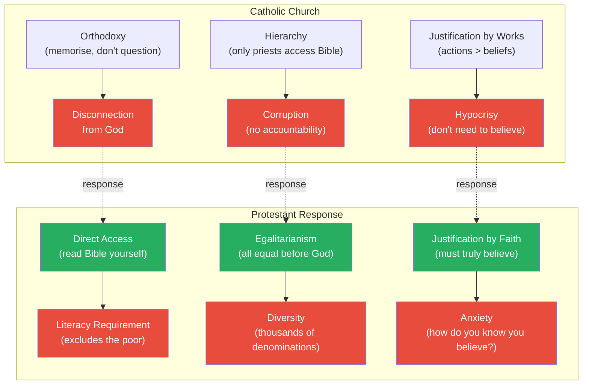
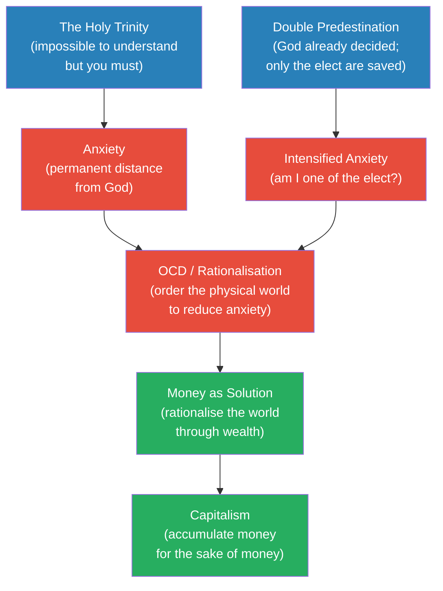
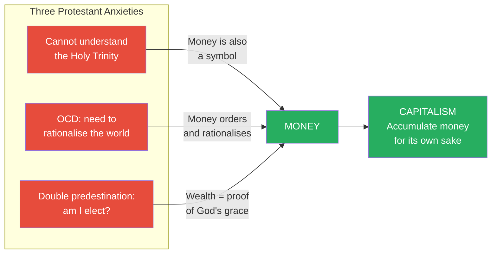
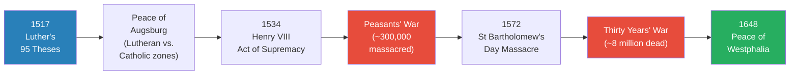
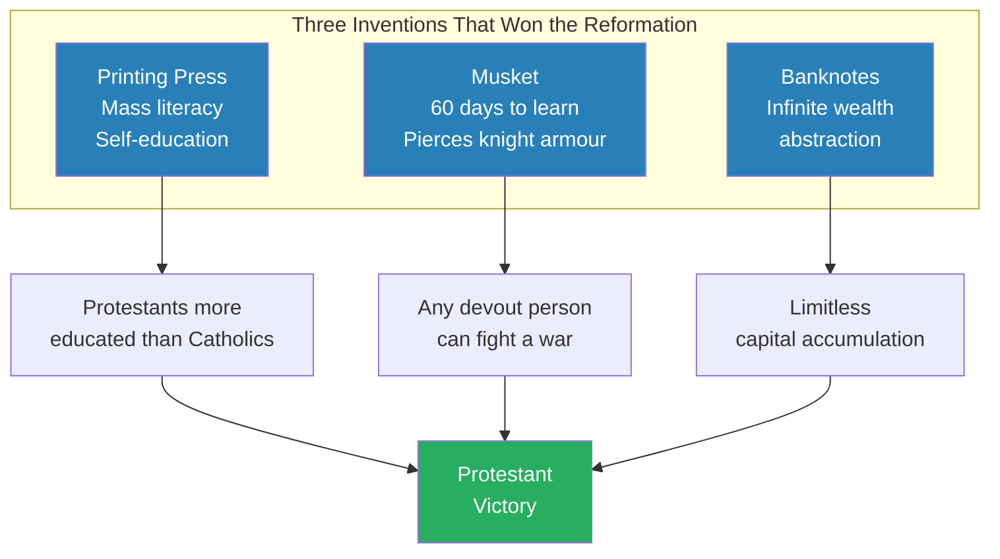
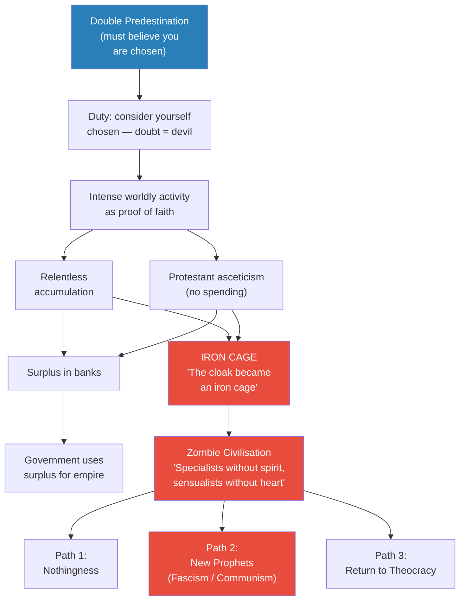
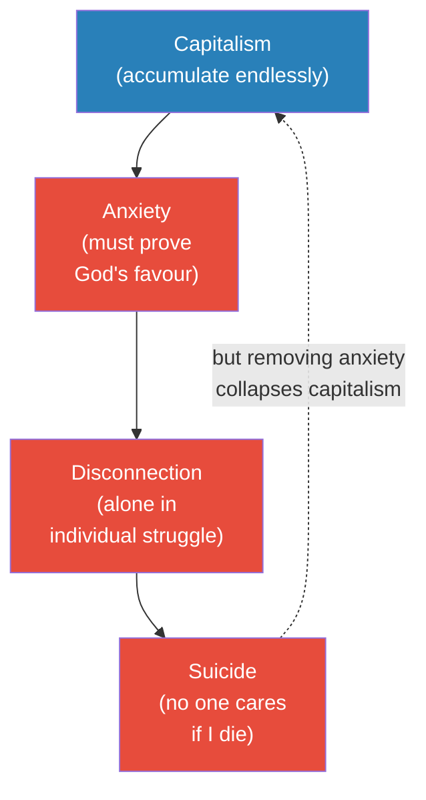
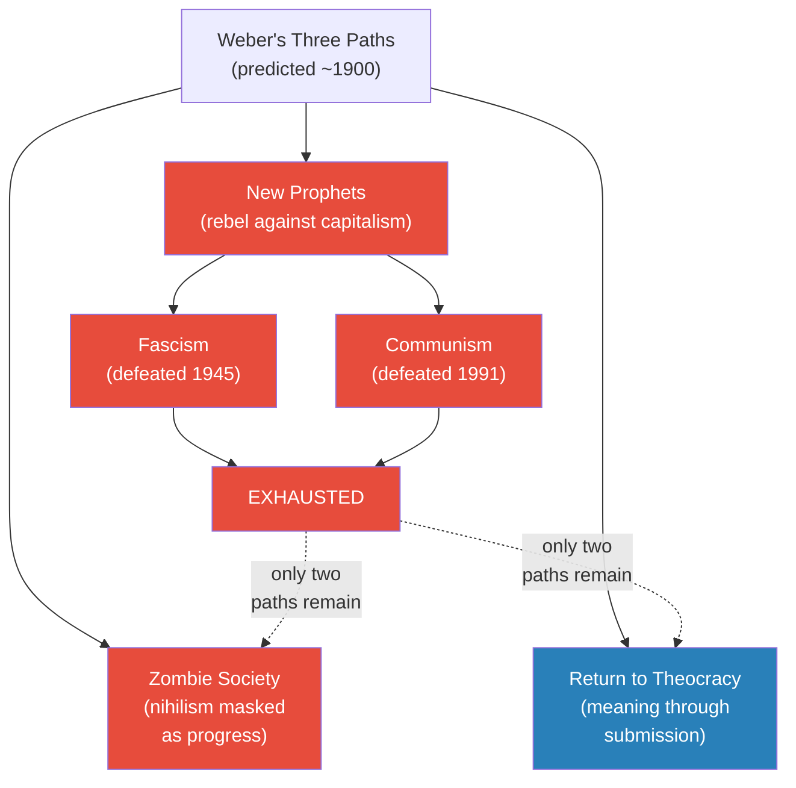

# The Protestant Reformation and the Birth of Capitalism

> Prof. Jiang argues that capitalism is not an economic invention but a psychological consequence of Protestant theology. The Reformation solved Catholicism's problems of hypocrisy, corruption, and disconnection — but replaced them with anxiety, diversity, and the compulsion to rationalise the world. Three theological innovations — direct access to God, egalitarianism, and justification by faith — combined with the incomprehensibility of the Holy Trinity and Calvin's double predestination to produce a civilisation that equated money with God and wealth accumulation with divine favour. Prof. Jiang then uses Weber, Simmel, and Durkheim to diagnose capitalism as a zombie civilisation on the path to either theocracy or self-destruction.

---

## Overview: Key Highlights

- <b style="color: #27ae60">Money became the solution to Protestant anxiety</b> — the faithful resolved the incomprehensible Holy Trinity, OCD-like rationalisation, and predestination terror by equating wealth with divine favour
- <b style="color: #e74c3c">Capitalism is a psychological disease, not an economic system</b> — Weber's "iron cage" describes a civilisation imprisoned by a mechanism originally meant to connect humans with God
- <b style="color: #2980b9">Double predestination</b> — Calvin's doctrine that God has already decided who is saved, and only the elect who truly believe will go to heaven, creating unbearable anxiety
- <b style="color: #27ae60">The Protestant ethic inverted the moral meaning of wealth</b> — historically, excessive wealth was shameful; after the Reformation, it became proof of God's grace
- <b style="color: #e74c3c">"Specialists without spirit, sensualists without heart"</b> — Weber's prophecy of a zombie civilisation that believes it has reached perfection while being spiritually empty
- <b style="color: #2980b9">The Holy Trinity as unresolvable symbol</b> — the human mind cannot hold contradictions, so the Trinity can only be grasped as a symbol, which creates permanent distance from God
- <b style="color: #27ae60">Three inventions won the Reformation</b> — the printing press (mass literacy), the musket (democratic warfare), and banknotes (infinite wealth abstraction)
- <b style="color: #e74c3c">Durkheim's diagnosis: capitalism creates suicide</b> — disconnection leads to suicide, anxiety feeds disconnection, and anxiety is what fuels capitalism
- <b style="color: #2980b9">Cultural persistence</b> — Roman values (liberty, republica, piety) mapped onto Catholicism; Viking values (courage, loyalty, resourcefulness) mapped onto Protestantism
- <b style="color: #27ae60">Simmel: money is God's replacement</b> — money standardises all perspectives into one symbol, then reshapes reality through that lens
- <b style="color: #e74c3c">Weber's three futures: zombie society, theocracy, or new prophets</b> — communism and fascism were the "new prophets" path, both defeated in the 20th century, leaving only the first two options
- <b style="color: #2980b9">Wealth hoarding as socially sanctioned OCD</b> — Prof. Jiang's thought experiment: collecting newspapers is diagnosed as disease, but collecting billions in a bank account is celebrated

| Concept | One-line summary |
|---------|-----------------|
| **Orthodoxy / Dogma** | Catholic requirement to memorise beliefs without questioning — maintained by hierarchy |
| **Justification by works** | Catholic doctrine: actions and rituals matter more than personal belief |
| **Justification by faith** | Protestant doctrine: you must truly believe in God — creating anxiety about whether your faith is genuine |
| **Double predestination** | Calvin's doctrine that God has already decided who is saved, and the decision is final |
| **The Holy Trinity** | Father, Son, and Holy Spirit as a symbol impossible for the human mind to grasp directly |
| **OCD / Rationalisation** | Anxiety about faith drives compulsive ordering of the physical world — channelled into wealth accumulation |
| **Iron cage** | Weber's metaphor: money was meant to be a light cloak but became an inescapable prison |
| **Money as symbol** | Money standardises all human perspectives into one system, then reshapes reality through that lens |
| **Cultural persistence** | Roman cultural values embedded in Southern European Catholicism; Viking values in Northern European Protestantism |
| **Zombie civilisation** | A society without soul, spirit, or purpose — going through motions without knowing why |
| **Indulgences** | Papal letters reducing punishment in purgatory — the corruption that triggered Luther's 95 Theses |
| **Banknotes** | Abstraction of wealth from finite gold to infinite paper — enabling unlimited accumulation |

---

# The Lecture

## Catholic Problems and Protestant Solutions [0:00 - 9:39]

*Prof. Jiang opens by mapping the three core pillars of Catholicism — orthodoxy, hierarchy, and justification by works — and showing how each generates a specific problem: disconnection, corruption, and hypocrisy. The Protestant Reformation is framed not as a theological improvement but as a response that trades one set of problems for another.*

> [!tip] Core Insight
> The Protestant Reformation solved Catholicism's external problems (corruption, hypocrisy, disconnection from God) but created internal ones (anxiety, diversity, compulsive rationalisation). The cure was psychologically worse than the disease.

*Each Catholic problem (red, left) generates a Protestant solution (green, centre) that creates a new problem (red, right). The Reformation is not progress — it is a trade of pathologies.*

> [!note]- Expand: Full Lecture Detail
> Prof. Jiang warns the class that this lecture will be "hard conceptually" because they will combine ideas from previous lectures to explain the modern world. He encourages them to interrupt if anything is unclear.
>
> He begins with the three pillars of Catholicism:
>
> - <b style="color: #2980b9">Orthodoxy / Dogma</b> — a set of beliefs you must memorise without questioning or interpreting
>   - Only priests and the ordained can access and interpret the Bible
>   - The Pope is God's official representative on earth
> - <b style="color: #2980b9">Hierarchy</b> — the ordained are favoured by God, creating a chain of authority from Pope down to believer
>   - No mechanism exists to prevent priests from abusing their power
> - <b style="color: #2980b9">Justification by works</b> — your actions matter more than your beliefs
>   - "It'd be nice if you believed in God. It'd be nice if you believed in what you were doing, but you don't have to — as long as you do what you're told, you can still go to heaven"
>
> Each pillar creates a corresponding problem:
>
> - Orthodoxy creates <b style="color: #e74c3c">disconnection</b> — since the dawn of human history, humans need to connect with God directly, but the Church blocks that connection
> - Hierarchy creates <b style="color: #e74c3c">corruption</b> — as discussed in the previous lecture, priests engaged in extensive abuses of power
> - Justification by works creates <b style="color: #e74c3c">hypocrisy</b> — you can go to heaven without genuine faith, just by performing rituals
>
> Prof. Jiang reminds the class of the Cathars and the Waldensians from the previous week — dissent against the Catholic Church has been ongoing throughout European history. The Protestant Reformation was the dissent that finally succeeded.
>
> The three Protestant responses:
>
> - <b style="color: #27ae60">Direct access</b> — you can read the Bible yourself; God wills that you talk to him directly
>   - But this requires literacy, which excludes the poor
>   - The first Protestants were "the aspirational middle class, people of some means"
> - <b style="color: #27ae60">Egalitarianism</b> — if everyone can access God, everyone is equal in His eyes
>   - But if everyone is equal, everyone can start their own denomination
>   - "There's only one Catholic church, but there's like tens of thousands of Protestant denominations"
> - <b style="color: #27ae60">Justification by faith</b> — you must truly believe in God and develop your life around this faith
>   - But how do you know you truly believe? "You have to constantly prove to yourself that you truly believe in God through actions, through works"
>   - This creates anxiety — the defining psychological condition of the Protestant mind

---

## The Holy Trinity, OCD, and Double Predestination [9:39 - 15:34]

*Prof. Jiang goes deeper into Protestant psychology, identifying three compounding problems: the impossibility of understanding the Holy Trinity, the OCD-like behaviour that anxiety produces, and Calvin's doctrine of double predestination — which intensifies the anxiety to near-unbearable levels. Together, these three problems create the psychological preconditions for capitalism.*

*Three theological problems (blue) produce two layers of anxiety (red), which drive rationalisation behaviour (red), which finds its resolution in money (green) and ultimately births capitalism (green). The causal chain runs entirely through psychology, not economics.*

> [!note]- Expand: Full Lecture Detail
> Prof. Jiang explains three compounding problems that the Protestant believer faces:
>
> **Problem 1 — The Holy Trinity is impossible to understand:**
>
> - The Trinity states that Jesus, God, and the Holy Spirit are independent, equal, and yet part of the same thing
> - "For the human mind, the way that our human minds are designed, it's impossible for us to understand this concept"
> - He uses a vivid analogy: "It's like saying this pen is here and not here. Your mind has to believe that this thing is here and not here, and your mind can't do that"
> - The only way the mind can process this is by treating the Trinity as a <b style="color: #2980b9">symbol</b> — "nothing that represents everything, depending on how you perceive it"
> - But a symbol creates permanent distance — "We can never be intimate with God. It's either away from us or through us, but we can never touch it"
> - Before Protestantism, this was not a problem because the Church stood between believer and Trinity — "All you had to do was believe in the church, and you were fine"
> - Now the individual must grapple directly with the incomprehensible
>
> **Problem 2 — Anxiety produces OCD:**
>
> - <b style="color: #e74c3c">Anxiety comes from confusion</b> — the inability to understand the Trinity creates chronic unresolved confusion
> - The response is to order the physical world — "rationalise" it — in order to reduce the internal chaos
> - Prof. Jiang draws on clinical psychology: "People with obsessive compulsive behaviour, what do they do? They like to clean houses. They like to buy things. They like to lose weight. They're trying to rationalise the world around them in order to reduce anxiety"
>
> **Problem 3 — Double predestination:**
>
> - <b style="color: #2980b9">John Calvin</b> proposed that God, at the beginning of time, has already decided who will be saved
>   - This decision is final — "You cannot persuade him that he is wrong, because he is perfect, eternal and immutable"
>   - Only a few — the <b style="color: #2980b9">elect</b> — will go to heaven
>   - Everyone else is condemned to hell
>   - The elect are "those who truly believe that they have been saved"
> - This creates even more anxiety: "How do you know if you're one that's saved? You have to work hard now to solve this problem"
>
> Prof. Jiang then summarises the three compounding problems:
> 1. The believer cannot understand the Holy Trinity but must
> 2. The resulting anxiety causes OCD — a compulsion to rationalise and order the world
> 3. Double predestination says that without true faith, you are damned — but how do you prove true faith?
>
> "And so over time — and this is a process that will take decades, centuries — they figure out a solution. And the solution is money."

---

## Money as the Solution to Protestant Anxiety [15:34 - 22:46]

*Prof. Jiang explains what money actually is — a system that standardises all perspectives into one coherent framework — and shows how it resolves all three Protestant anxieties simultaneously. Money rationalises the world (solving OCD), replaces the incomprehensible Holy Trinity with a graspable symbol (solving disconnection), and provides proof of election (solving predestination). The result is capitalism: wealth accumulation for its own sake, unprecedented in human history.*

> [!tip] Core Insight
> Capitalism was born not from economics but from theology. Money resolved three impossible theological paradoxes at once — it rationalised chaos, replaced an incomprehensible God, and proved divine favour. For the first time in history, accumulating wealth became a moral imperative rather than a social embarrassment.

*Money is the single mechanism that resolves all three theological anxieties. Each anxiety feeds into money from a different angle, and money produces capitalism as its logical endpoint.*

> [!note]- Expand: Full Lecture Detail
> Prof. Jiang pauses to explain what money actually is before showing how it resolves the paradoxes:
>
> - Every individual is unique, sees the world differently — "this creates confusion, this creates problems"
> - Money <b style="color: #27ae60">standardises, systemises, clarifies and simplifies</b> everyone's understanding into one concept
>
> > [!example] The Wine Experiment
> > - Experimenters placed three bottles of wine in front of each participant
> > - Asked them to taste and identify the best one
> > - Most people could not tell the difference between the wines
> > - Then the experimenters added price tags: $10, $20, $50
> > - Immediately, everyone "knew" the $50 bottle was best
> > - Money did not change the wine — it changed perception
> > - Money allows us to simplify the world in order to understand it
> > **The lesson:** Money is not a measure of value — it is a system that creates value by standardising perception. Once installed, it reshapes reality to match its own logic.
>
> Now Prof. Jiang shows how money solves all three Protestant anxieties:
>
> - **Solving OCD:** You're anxious — "what do you do to reduce this anxiety? Make money. Make more money. Don't stop until you make the most money"
> - **Solving the Holy Trinity:** Money is also a symbol — so the mind can <b style="color: #27ae60">conflate God with money</b>
>   - "Money is God. God is money. That makes sense to people"
> - **Solving predestination:** "How do I know I have faith in God? Because I have a lot of money. Because I spend my entire life accumulating money. And how do I know I'm going to heaven? Because I'm rich — my wealth shows that I have true faith in God"
>
> Prof. Jiang emphasises the historical novelty: <b style="color: #27ae60">"Never before in human history have people believed that this was a good thing — that you should go accumulate money for the sake of accumulating money"</b>
>
> Before Protestantism, wealthy people were expected to redistribute:
>
> > [!example] Julius Caesar's Will — The Pre-Capitalist Ethic
> > - When Caesar died, he was the wealthiest man in the world
> > - He gave a third of his money to the poor people of Rome
> > - He gave a third to building parks for Rome
> > - Only the final third went to his adopted heir, Octavian
> > - This was the norm — wealth carried an obligation to the community
> > - Hoarding wealth was seen as selfish and anti-social
> > **The lesson:** Before Protestantism, too much money was a sign of moral failure. After Protestantism, too much money became a sign of divine favour. The moral valence of wealth was completely inverted.
>
> - <b style="color: #e74c3c">Now the imperative is to accumulate and not spend</b> — "if you waste it, it's corruption, it shows lack of faith in God"
> - "That's why we worship people like Jack Ma, Elon Musk, Jeff Bezos — even though if we think about it, they've just accumulated a symbol. The money is actually nothing"
> - <b style="color: #2980b9">Capitalism</b> defined: "a belief that money is reality in itself"
>
> Prof. Jiang pauses: "I know conceptually this is hard. Now what I will do is explain the historical context and the evidence for this argument."

---

## Martin Luther, Calvin, and the Historical Reformation [22:46 - 32:09]

*Prof. Jiang narrates the historical arc of the Reformation — from Luther's 95 Theses in 1517 to the Peace of Westphalia in 1648 — covering indulgences, the political protection that saved Luther, Calvin's flight to Geneva, Zwingli in Zurich, and the Peasants' War that foreshadowed communism.*

*131 years from thesis to peace treaty. The Reformation was not a theological debate — it was a century of massacres, wars, and political realignment that redrew the map of Europe.*

> [!note]- Expand: Full Lecture Detail
> Prof. Jiang sets the historical frame: the Reformation ran from 1517 (Luther's 95 Theses) to 1648 (Peace of Westphalia).
>
> **Martin Luther and the 95 Theses:**
>
> - The Catholic Church wanted to build <b style="color: #2980b9">St Peter's Basilica</b> in the Vatican
> - To finance it, the Church sold <b style="color: #2980b9">indulgences</b> — "basically like tickets or special letters that will reduce the punishment of your relatives in Purgatory"
> - "It's basically bribing God to reduce your penalty"
> - Luther's 95 Theses were a direct attack on this corruption
>
> > [!quote] Martin Luther — Thesis 36
> > "Every truly repentant Christian has a right to full remission of penalty and guilt, even without letters of pardon."
>
> - Luther argues for <b style="color: #27ae60">salvation by faith</b> — you don't need to buy indulgences if you truly believe
> - He insults the Pope directly: the Pope offends God by suggesting He can be bribed; the Pope is the richest man in Europe — why not build the church himself rather than exploiting the poor?
> - The Church declared Luther a heretic and wanted to burn him at the stake
> - But he was <b style="color: #27ae60">protected by powerful political patrons</b> — German princes who wanted autonomy from Rome
> - "Martin Luther gives them a proper pretext in order to financially divorce themselves from the Catholic Church"
> - The conflict ended with the <b style="color: #2980b9">Peace of Augsburg</b> — dividing the Holy Roman Empire into Lutheran and Catholic zones
>
> **John Calvin:**
>
> - A Frenchman educated at the Sorbonne
> - Introduced <b style="color: #2980b9">double predestination</b> — "Because God has already decided who will go to heaven at the beginning of time, then the church is lying to you"
> - Deemed a heretic, he fled to <b style="color: #2980b9">Geneva</b> — one of the birthplaces of the Reformation
> - Switzerland's independent towns were fertile ground for the new religion
>
> **Huldrych Zwingli:**
>
> - Based in Zurich, considered the most extreme of the three founders
> - "Probably the most extreme of the three" — Prof. Jiang does not elaborate further
>
> **The Peasants' War:**
>
> > [!example] The Peasants' War — Proto-Communism
> > - Peasants interpreted Protestant egalitarianism as God's mandate for total equality
> > - "A total communist movement — people who wanted total equality and democracy and freedom"
> > - Approximately 300,000 joined the rebellion against feudal lords
> > - But they were uneducated, unorganised, weaponless, and leaderless
> > - The aristocracy united against them and massacred them all
> > - "The deadliest massacre of peasants before the French Revolution"
> > - This event will later feed directly into the development of communism
> > **The lesson:** The Reformation opened Pandora's box — once you tell people they are equal before God, some will conclude they should be equal before men. The ruling class's response was extermination.
>
> **Henry VIII and the Church of England (1534):**
>
> - The <b style="color: #2980b9">Act of Supremacy</b> declared the King, not the Pope, as head of the Church
> - Because of England's strong Catholic contingent, Henry maintained Catholic practices
> - "Rather than have the Pope be at the head of the church, he himself is now head of the church"
> - The religion is called <b style="color: #2980b9">Anglicanism</b>

---

## The Diversity of Protestant Denominations [32:09 - 35:21]

*Prof. Jiang surveys the explosion of Protestant denominations — Lutherans, Calvinists, Anglicans, Hussites, Unitarians, Anabaptists — and maps the geographic divide between Protestant North and Catholic South, noting the anomaly of southern France where Protestantism and Catharism may have merged.*

> [!note]- Expand: Full Lecture Detail
> Prof. Jiang catalogues the diversity:
>
> - <b style="color: #2980b9">Lutherans</b> — followers of Martin Luther
> - <b style="color: #2980b9">Calvinists</b> — believers in double predestination
> - <b style="color: #2980b9">Anglicans</b> — English Catholics who follow the King instead of the Pope
> - <b style="color: #2980b9">Hussites</b> — followers of Jan Hus in Bohemia
> - <b style="color: #2980b9">Unitarians</b> — deny the divinity of Jesus and the Holy Trinity; "God is God, and Jesus is just the Messiah, just a prophet of God"
> - <b style="color: #2980b9">Anabaptists</b> — "to truly believe in God, you must choose to do so, therefore you must not baptise infants" — only adults can join voluntarily
>
> The geographic divide:
>
> - **Protestant North:** England, Germany, Nordic countries, Switzerland
> - **Catholic South:** France, Spain, Italy
> - **Anomaly:** Southern France turned Protestant — the same region as the Cathars
>   - Some historians believe Protestantism and Catharism "mingled together"
>   - Others argue the south of France was always culturally independent — surrounded by mountains, speaking Provencal rather than French
>   - "Every day you have new denominations opening up because people are interpreting the Bible differently"

---

## The Huguenots and the Thirty Years' War [35:21 - 44:37]

*Prof. Jiang traces how the St Bartholomew's Day Massacre drove France's most educated and wealthy citizens — the Huguenots — into Protestant countries, jumpstarting the Industrial Revolution in England, the Netherlands, and Germany. He then covers the Thirty Years' War, the cultural roots of the Catholic-Protestant divide, and the three technological inventions that allowed the outnumbered Protestants to prevail.*

> [!tip] Core Insight
> The three inventions that won the Reformation — the printing press, the musket, and banknotes — each democratised something that had been monopolised: knowledge, violence, and wealth. Together they made the individual Protestant believer more powerful than the Catholic institutional apparatus.

*Each invention broke a Catholic monopoly — the Church's monopoly on knowledge, the knight's monopoly on violence, and gold's monopoly on wealth. The Reformation was won by technology, not theology.*

> [!note]- Expand: Full Lecture Detail
> **The Huguenots — France's catastrophic loss:**
>
> - French Protestants (Huguenots) were concentrated in the south — "mainly the middle class, extremely well educated, extremely prosperous"
> - They were joined by the nobility, which the King of France saw as a threat
> - In 1572, the King killed some nobles, triggering the <b style="color: #e74c3c">St Bartholomew's Day Massacre</b> — "tens of thousands of French Protestants called Huguenots were killed"
> - The surviving Huguenots fled to England, the Netherlands, and Germany
> - "They will bring their expertise, and they will help these countries jumpstart the Industrial Revolution"
> - <b style="color: #e74c3c">"A tremendous loss for France, tremendous gain for the other Protestant nations"</b>
>
> **The Thirty Years' War (1618-1648):**
>
> - Europe divided into Catholic and Protestant factions
> - The Habsburgs (Holy Roman Empire, backed by the Pope) versus independent German states
> - Lasted exactly 30 years; killed up to 8 million people — "the deadliest war in European history up until World War One"
> - In parts of Germany, half the population was killed
> - Ironically, Catholic France joined the Protestant side — "they see the Holy Roman Empire as an imperial threat"
> - "It was a religious war, but it was also a geopolitical and imperial war"
> - Ended with the <b style="color: #2980b9">Treaty of Westphalia</b> — guaranteeing religious freedom in Europe
>
> **Why did the North go Protestant?**
>
> Prof. Jiang presents a speculative but illuminating cultural mapping:
>
> > [!abstract] Cultural Persistence: Romans vs. Vikings
> > | Value System | Roman / Catholic | Viking / Protestant |
> > |-------------|-----------------|-------------------|
> > | **Core value 1** | Liberty (obedience to law) | Courage (self-exploration) |
> > | **Core value 2** | Republica (serve public good / obey Senate) | Loyalty (mutual love) |
> > | **Core value 3** | Piety (respect tradition) | Resourcefulness (individual struggle) |
> > | **Maps to** | Orthodoxy, Hierarchy, Justification by works | Direct access, Egalitarianism, Justification by faith |
>
> - "Roman culture had a tremendous influence on the development of the Catholic Church"
> - Viking courage maps to reading the Bible yourself — "self-exploration, to go out in the unknown and figure out things for yourself"
> - Viking loyalty maps to egalitarianism — "mutual love: I'm loyal to you, and you're loyal back to me"
> - Viking resourcefulness maps to justification by faith — "the idea of individual struggle; you can figure it out by yourself if you work hard enough"
> - Prof. Jiang stresses this is "a possibility, a thought experiment" — not historical fact
>
> **Three inventions that won the Reformation:**
>
> - <b style="color: #2980b9">The printing press</b> (Gutenberg) — "now everyone could read the Bible. But not only that — everyone can now become self-educated"
>   - Protestants compelled to be literate — "as a whole, Protestants were more well educated than the Catholics"
> - <b style="color: #2980b9">The musket</b> — "it takes about 60 days for anyone to learn how to use the musket. And the musket is able to pierce the armour of the knight, which makes the knight useless in war"
>   - Before: warfare was monopolised by the professional knight class (nobility)
>   - After: "anyone who has courage and devotion — meaning the Protestants — they're able to fight a war"
>   - Will be crucial for both the American and French Revolutions
> - <b style="color: #2980b9">Banknotes</b> — before, trade used gold coins; now you can use paper money
>   - "There's only a finite number of gold and coins. There's an infinite source of banknotes, so you can work infinitely hard"
>   - Under the old system, paying workers more made them work less — "if I work two hours to make $100, why work eight?"
>   - <b style="color: #27ae60">Slavery made sense in the old system</b> because the only way to extract labour was through debt bondage
>   - In the Protestant system, slavery is evil — "you're denying people the capacity to be with God"
>   - "After the Protestant Reformation, one of the main things they did was eventually outlaw slavery"
>
> > [!quote] John Wesley, founder of the Methodist Church
> > "We must exhort all Christians to gain all they can and to save all they can — that is, in effect, to grow rich."

---

## Max Weber and the Iron Cage [44:37 - 54:36]

*Prof. Jiang introduces the three founders of modern sociology — Weber, Simmel, and Durkheim — all writing around 1900, when Protestant capitalism was at its zenith. He begins with Weber's Protestant Ethic and the Spirit of Capitalism, tracing how predestination theology drove relentless wealth accumulation and how the system that was supposed to connect humans with God became an inescapable prison.*

*Weber's causal chain: predestination creates the duty to prove election through worldly success, which creates both relentless accumulation and compulsive frugality, which feeds surplus into banks and empire, which hardens into an inescapable system — the iron cage. The cage produces a zombie civilisation with three possible exits, all grim.*

> [!note]- Expand: Full Lecture Detail
> Prof. Jiang contextualises the three sociologists: writing around 1900, when "the Protestant work ethic, the belief system, has conquered the world. Germany, Britain, United States are the three most powerful countries in the world at this time. They're all Protestant nations."
>
> "At this time, everyone thinks that this is the greatest thing in the world. And what Max Weber, Georg Simmel, and Emile Durkheim are trying to do is figure out what's really going on."
>
> **Weber's Protestant Ethic (1904-1905):**
>
> Prof. Jiang reads directly from Weber, explaining each passage:
>
> - **The duty to consider yourself chosen:** "It is held to be an absolute duty to consider oneself chosen" — you must believe you are elect, even though the odds are against it
>   - "If you doubt yourself, then you'll be condemned to hell, then you become a servant of the devil"
>   - "You need to prove that you are one of the elect by focusing on this world"
> - **Intense worldly activity as proof:** "Intense world activity is recommended as the most suitable means" to disperse religious doubt
>   - "You have anxiety. How do you deal with anxiety? Work, work, work"
>   - "What kind of work do you do? Make money — because money is proof of God's grace"
>
> - **Protestant asceticism — no spending:**
>   - Not only must you make money, but you must not spend it — "not to enjoy it, because that leads to corruption, that leads to decadence"
>   - "It restricted consumption, especially of luxuries"
>   - Where does all this unspent wealth go? "It's going to the bank. And who's using this money in the bank? The government. And what are they doing? They're using it to fight wars"
>   - <b style="color: #27ae60">"That's how England and the Netherlands became empires — they had access to all this surplus wealth that Protestants weren't spending"</b>
>
> - **The moral inversion of wealth:**
>   - Before: "If you had too much money, it showed that you were selfish, that you were against the community"
>   - After: "If you're wealthy, it means God favours you. The more wealth you have, the more people respect you"
>   - <b style="color: #e74c3c">"Historically, we believe that those who have too much money are evil. Now we believe that those who have too much money are inherently good. It's complete reverse"</b>
>   - "What's evil is not to make a lot of money. What's evil is to use that money to enjoy yourself"
>
> - **The iron cage:**
>   - The Puritans created capitalism to rationalise the world — "but we're stuck. We are imprisoned in their world"
>   - "The Puritans made the entire world into a monastery"
>   - Industrial production "has made us all into slaves, and the soul of this industrial production system is capitalism — wealth for the sake of wealth"
>   - It has "permeated into all aspects of life — into the family, into the school. Why do you have grades? Why do we have tests? Because of this industrial economy. Grades, tests are another form of money"
>   - "This system will keep on going until we destroy the planet and until we run out of resources, because that's what capitalism is — it's the exploitation of the environment"
>   - Weber's metaphor: "Money was supposed to be a tool, a mechanism for us to connect with God. But now money, capitalism, industrial production — it's become our prison. There's no denying it. No one can now escape this"

---

## Weber's Three Futures [54:36 - 1:04:21]

*Prof. Jiang delivers Weber's prophecy: capitalism will produce either a zombie civilisation, new prophets (fascism and communism), or a return to theocracy. He then introduces Simmel on money as God's replacement and Durkheim on capitalism's link to suicide.*

> [!tip] Core Insight
> Weber, writing in 1900, predicted the entire 20th and 21st centuries: fascism and communism as "new prophets" rebelling against capitalism, and — once those were defeated — a zombie civilisation sleepwalking toward theocracy. "He wrote this in about 1900. He predicted this would happen, and he's right."

> [!note]- Expand: Full Lecture Detail
> **Weber's prophecy:**
>
> - "No one knows who will live in this cage in the future"
> - Three possible paths:
>   1. <b style="color: #2980b9">New prophets</b> — people who channel discontent against capitalism into new movements, "just like Martin Luther rebelled against the Catholic religion"
>      - These turned out to be <b style="color: #e74c3c">fascism and communism</b>
>      - "The 20th century was really about defeating these two critics of capitalism. First World War Two defeated Nazism, then the Cold War defeated communism"
>   2. <b style="color: #e74c3c">Zombie society</b> — "mechanised petrification embellished with a sort of convulsive self importance"
>      - "Specialists without spirit, sensualists without heart — this nullity imagines that it has achieved a level of civilisation never before achieved"
>      - "Our civilisation is a zombie civilisation. It is without soul, without spirituality, without heart. It's all machine, it's all money, it's all obsession, nothing else"
>   3. <b style="color: #2980b9">Return to theocracy</b> — a return to the tyranny of the Catholic Church model
>
> - With the new prophets path exhausted, Prof. Jiang sees two remaining options:
>   - Zombie society — spiritual emptiness masked by material abundance
>   - Theocracy — which provides meaning, purpose, and spirituality, at the cost of freedom
>
> > [!example] North Korea as Modern Theocracy
> > - North Korea functions as a theocracy: people worship the Supreme Leader, cannot think for themselves
> > - "People in North Korea, even though they're poorer, even though they have less freedom, they are on average happier and more fulfilled and more energetic than most societies"
> > - Compare with South Korea: "No one's having kids — that's a sign of complete hopelessness in their society"
> > - North Korea: "They're having a lot of kids — that's a sign of faith in their society"
> > - The theocracy provides the meaning and connection that capitalism strips away
> > **The lesson:** Freedom and meaning may be inversely correlated in mass society. The system that maximises individual liberty (capitalism) produces the most spiritual emptiness; the system that eliminates it (theocracy) produces the most purpose.
>
> **Georg Simmel — Money as God's replacement:**
>
> - Simmel explains how money functions as a universal symbol:
>   - "The projection of mere relations into particular objects is one of the great accomplishments of the mind"
>   - We take the idea of God and transpose it onto money — "When we do this, we turn God into money, our understanding of reality becomes much more vibrant"
>   - <b style="color: #27ae60">"Money represents pure interaction, its purest form"</b> — it standardises everything
>   - "Money is the adequate expression of the relationship of man to the world"
>   - Money takes all different perspectives, converges them into one system, and then "redesigns reality through this lens"
>
> **Emile Durkheim — Suicide and capitalism:**
>
> - Durkheim's most famous book is *On Suicide*
> - Core question: "Why is it that Protestants are much more likely to kill themselves than Catholics?"
> - Answer: Protestants must struggle individually with faith — "they feel that they're alone and abandoned in this world"
> - Catholics just follow community rituals — "you just follow community rituals and you're good"
> - Protestant isolation leads to "tremendous energy" — but also to "self-defeat, hopelessness, and that's why they kill themselves"

---

## Durkheim's Diagnosis: Capitalism Creates Suicide [1:04:21 - 1:11:02]

*Prof. Jiang reads Durkheim's argument about unlimited ambition and its self-destructive logic — the impossibility of satisfaction when there is no natural stopping point — and delivers his own thought experiment comparing wealth hoarding to newspaper hoarding.*

*Durkheim's vicious circle: capitalism requires anxiety, anxiety produces disconnection, disconnection produces suicide — but you cannot remove the anxiety without collapsing the entire system. The four concepts are locked together.*

> [!note]- Expand: Full Lecture Detail
> Prof. Jiang reads Durkheim directly:
>
> - "Over-excited ambitions always exceed the results that they achieve — because they have not been aware that they should not go any further"
>   - He illustrates: "Let's say you want to lose weight. Your obsession is to lose weight. It's possible that you may die in the process, because you don't know how much weight you should lose"
>   - "That's the problem with accumulating money. You try to get more and more money to prove your worth to God, but you can't stop. You don't know when to stop"
>
> - "Consequently, nothing satisfies them, and all this agitation perpetually sustains itself, reaching no form of satiety — you cannot stop"
>   - <b style="color: #e74c3c">"Jack Ma, the richest man in China — he has all this money, $50 billion. What is he doing with it? Nothing. All he wants is to make more and more money. Why? Because only the acquisition of money brings him happiness. Nothing else does. It's a disease"</b>
>
> - "The struggle becomes more violent and more painful, both because it is less regulated and because competition is fiercer. All classes are caught up in it, because there's no longer any established classification"
>   - "No matter how rich you are, you're still playing this game. You can never escape it"
>
> Prof. Jiang then delivers four interconnected concepts:
>
> - <b style="color: #e74c3c">Disconnection leads to suicide</b> — "we do not think we are valuable in the world"
> - Disconnection comes from <b style="color: #e74c3c">anxiety</b> — "a belief that if I don't work hard, God will not favour me"
> - Anxiety is what <b style="color: #e74c3c">feeds capitalism</b> — "if people weren't anxious, they wouldn't go out and work so hard to make money"
> - Therefore: <b style="color: #e74c3c">capitalism creates suicide</b>
>
> "Never before in human history have we been as wealthy, as technologically advanced. But again — never before in human history have there been more depression, anxiety, more suicides, more feeling of disconnection."
>
> > [!example] The Newspaper Hoarding Thought Experiment
> > - Imagine you have anxiety and deal with it by collecting newspapers
> > - You fill one room, then the next, then the next
> > - Everyone would diagnose you with hoarding — a disease requiring treatment
> > - Now imagine you have anxiety and deal with it by collecting money
> > - You make a million, put it in the bank, then make two million, then three million — never spending any of it
> > - "How is that different from hoarding? How is that different from me collecting newspapers?"
> > - There is no difference — but "everyone would think I'm a great person"
> > - "It's a contradiction in our society that exists because our civilisation is incapable of recognising that we are a zombie civilisation on the path to suicide"
> > **The lesson:** The only difference between hoarding newspapers and hoarding billions is that one is socially stigmatised and the other is socially worshipped. The underlying pathology is identical.

---

## Q&A: Suicide, Sociologists, and Weber's Predictions [1:11:02 - 1:23:38]

*Students challenge Prof. Jiang on whether suicide contradicts Christian teaching, whether the sociologists offered solutions, and what happens after the defeat of communism and fascism. Prof. Jiang delivers Weber's full prediction: zombie society or theocracy — and argues that theocracy may be the more likely outcome.*

*The 20th century tested and exhausted the "new prophets" path. Weber's remaining two options — zombie society and theocracy — are the only futures left. Prof. Jiang bets on theocracy.*

> [!note]- Expand: Full Lecture Detail
> **Student question — Doesn't Christianity forbid suicide?**
>
> - In Catholicism, suicide is the worst sin you can commit
> - But in Protestantism and double predestination: "If you follow logic, you commit suicide, you're doing God's will. Because you commit suicide because you don't believe in God, or you don't have enough faith in God, which means you were condemned anyway"
> - Suicide becomes "not a sin — it's a sign of weakness"
> - Beyond theology: "Suicide is also a feeling of disconnection — a belief that no one cares if you die or not"
> - "Protestants are more likely to kill themselves because Protestantism is a much more individualistic religion than Catholicism"
>
> **Student question — Do the sociologists offer solutions?**
>
> - Prof. Jiang clarifies: "These are social scientists, not philosophers. They feel their responsibility is to diagnose problems, and once they diagnose problems, it's up to us to figure out the solution"
>
> **Weber's extended prediction:**
>
> - Anxiety → capitalism → civilisational decline
> - Three responses: nothingness (zombie society), new prophets (fascism/communism), or return to theocracy
> - "We tried new prophets — path didn't work. We don't want to become a zombie society. So the only path ahead of us is to become a theocracy"
> - But Weber misses one thing: "All these problems we're talking about is a problem of mass society"
>   - "When you have mass society, your options are much more limited — you need to feed millions and millions of people, organise them, give them something to do"
>   - Two solutions: become a theocracy, or solve the problem of mass society
>   - Prof. Jiang says bluntly: "If most people in the world died, then we would have more freedom. But if we choose to continue the system with 8 billion people, then you're stuck moving towards a theocracy"
>
> **Durkheim's logic chain:**
>
> - Why suicide? Because of disconnection
> - Why disconnection? Because of anxiety
> - Why anxiety? Because it feeds capitalism
> - <b style="color: #e74c3c">"Capitalism creates suicide. That's why we have the highest suicide rate in the whole entirety of human history"</b>
> - "Can you defeat capitalism? The answer is no. We tried in the 20th century. It led to the death of tens of millions of people"
> - The direct response to capitalism is theocracy — "Let us all obey the church and we're good. But the price: women stay at home, homosexuals killed"
> - "It's a terrible world we're going to, but what Durkheim is saying is, if we continue on the path of capitalism, people are going to choose the path of theocracy"

---

## Connections

**Builds on:** [[41 - Dante's Quiet Revolution]] (medieval Church corruption), [[26 - Constantine's Monotheistic Revolution]] (the Godhead as equation — monotheism creating capitalism's preconditions), [[27 - Augustine's Empire of God]] (the Church's intellectual architecture that Protestantism dismantled)
**Sets up:** [[43 - The Structure of Scientific Revolutions]] (rationalisation as paradigm), [[46 - The Revolution of Reason]] (Enlightenment as capitalism's intellectual partner), [[56 - What Marx Got Wrong]] (communism as the "new prophets" response Weber predicted)
**Related books in vault:** [[Sapiens - Yuval Noah Harari]] (agricultural revolution, money as shared fiction), [[The 48 Laws of Power - Robert Greene]] (power through institutional religion)
**Recurring themes:** Religion as civilisation driver (Lecture 1), cultural persistence (Lectures 5, 35), rise-and-fall paradox (Lecture 8), elite overproduction (Lecture 6), poor-conquers-rich dynamic (Lecture 11)

---

## The Takeaway

This lecture is the hinge of the entire Civilization series. Everything before it — religion driving settlement, empires built on shared myth, the Church as political architecture — leads to this moment where religion's internal contradictions accidentally produce a new economic system. And everything after it — revolutions, nation-states, world wars, modernity's spiritual crisis — flows from the iron cage Weber diagnosed. The Protestant Reformation is not one event among many; it is the mechanism by which the ancient world became the modern world.

The most counterintuitive insight is the causal chain itself. Capitalism did not arise from greed, trade, innovation, or material progress. It arose from anxiety about whether God loves you. The OCD-like compulsion to rationalise the world, the need for a symbol to replace an incomprehensible God, and the desperate search for proof of divine election — these three psychological needs, all rooted in Protestant theology, converged on money as their solution. Prof. Jiang's thought experiment about newspaper hoarding crystallises the absurdity: we have built an entire civilisation around a behaviour that, in any other form, we would diagnose as mental illness.

The question that remains open is Weber's: which future awaits? The 20th century eliminated the "new prophets" path. Prof. Jiang, forced to bet, leans toward theocracy — not because he endorses it, but because mass society demands coordination, and coordination demands shared belief. The alternative — a zombie civilisation of "specialists without spirit, sensualists without heart" — may simply be unstable enough that theocracy wins by default. Next lecture: the Age of Revolution.
