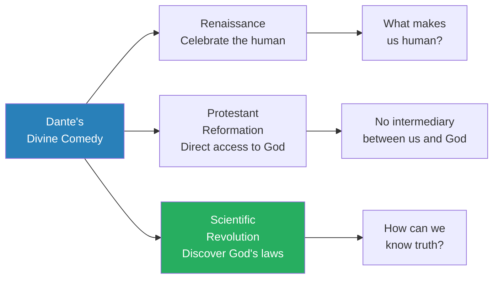
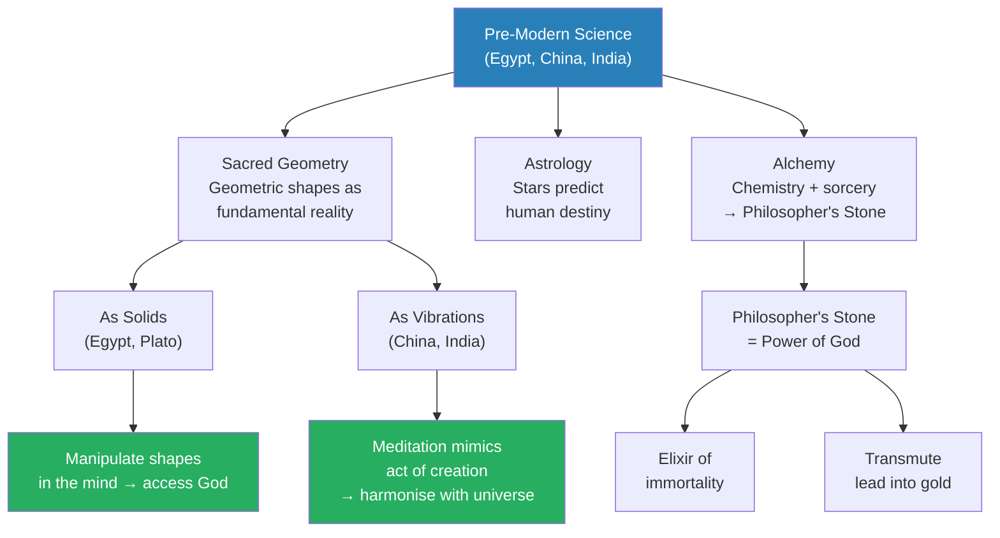
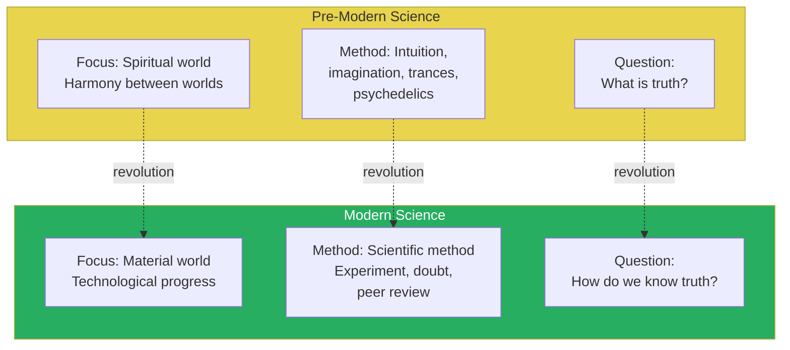
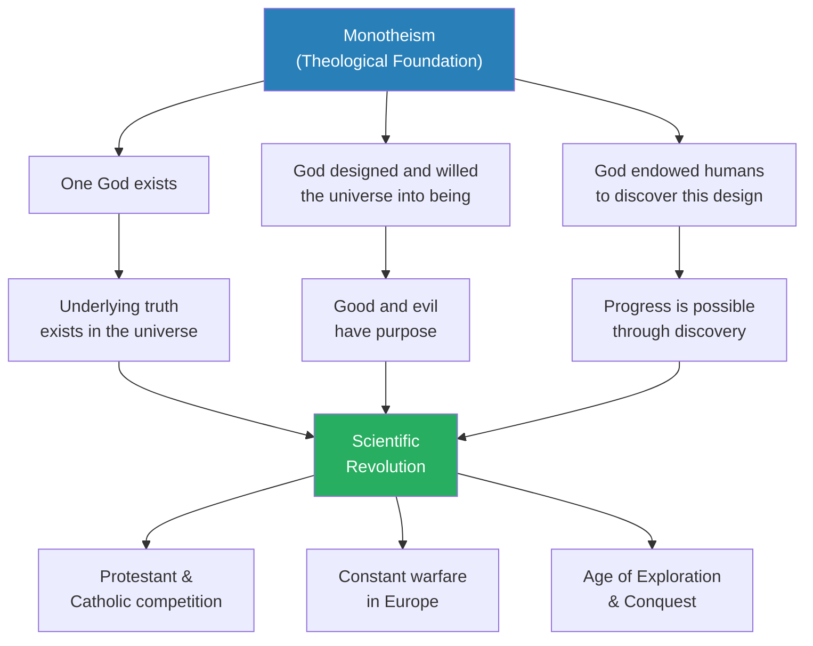
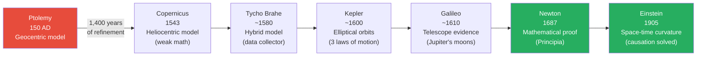
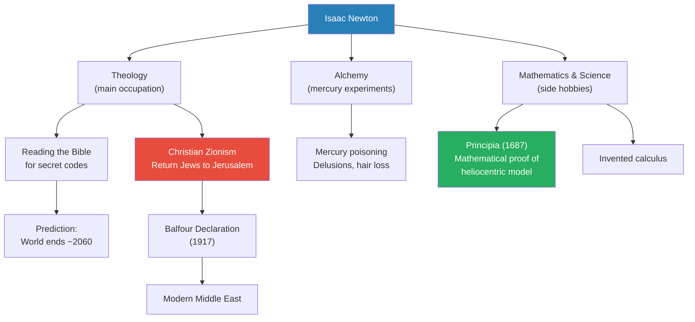
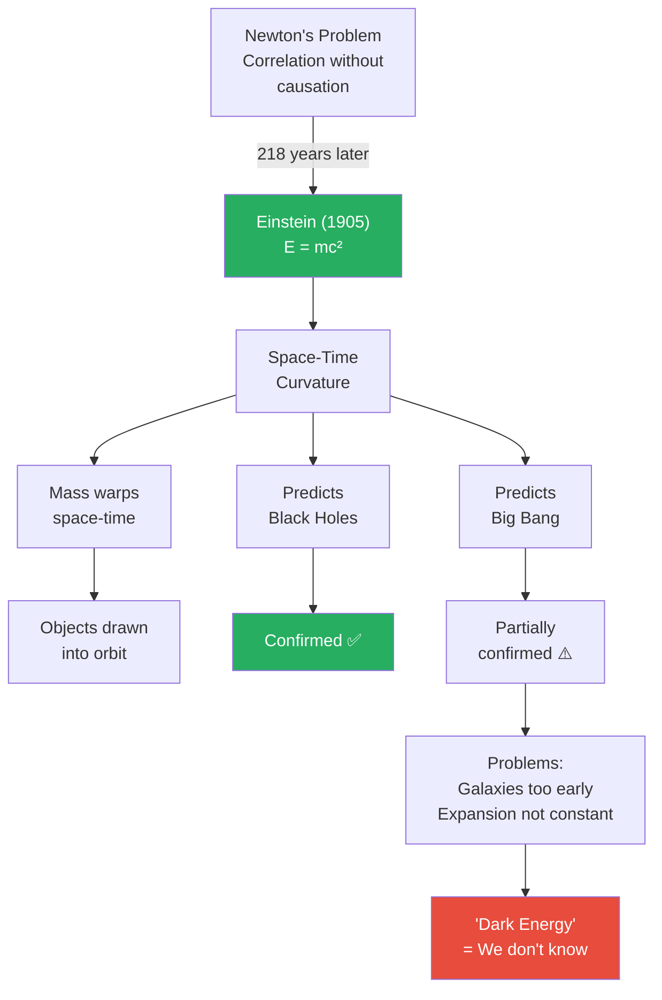
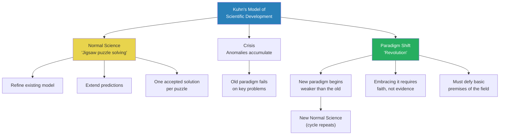
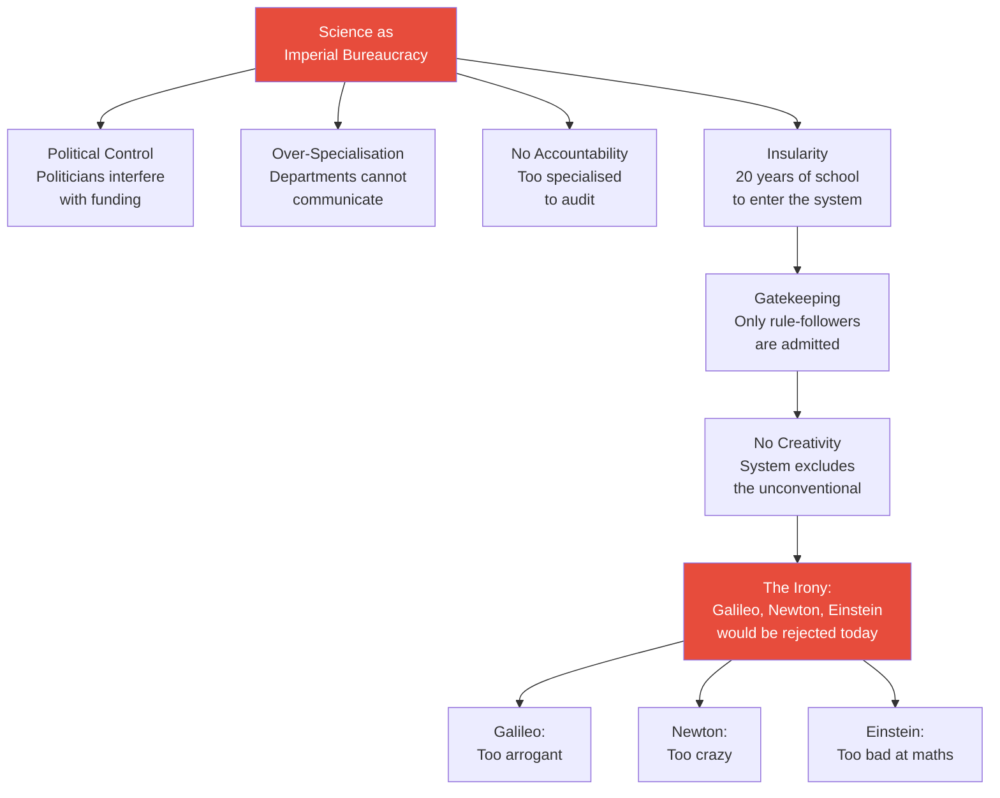

# The Structure of Scientific Revolutions

> Prof. Jiang traces the arc of science from its pre-modern origins in sacred geometry, astrology, and alchemy through the birth of the scientific method to the modern crisis of institutional science. He argues that three theological assumptions of monotheism — one God, intelligent design, and human capacity to discover that design — made the Scientific Revolution possible only in Western Europe. Through the stories of Copernicus, Galileo, Newton, and Einstein, he shows that scientific breakthroughs have always depended on faith, intuition, and imagination rather than method. Drawing on Thomas Kuhn's *The Structure of Scientific Revolutions*, he concludes that science today has become an imperial bureaucracy that systematically excludes the very kind of genius — arrogant, unconventional, faith-driven — that created it.

---

## Overview: Key Highlights

- <b style="color: #27ae60">Science was born from religion, not against it</b> — three theological assumptions of monotheism made the Scientific Revolution possible
- <b style="color: #2980b9">Sacred geometry, astrology, and alchemy</b> — the three sciences of pre-modern civilisation (Egypt, China, India) aimed at harmony with the spiritual world
- <b style="color: #e74c3c">The geocentric model was better argued than Copernicus's heliocentric model</b> — superior mathematics does not mean superior truth
- <b style="color: #27ae60">Genius comes from intuition, imagination, and faith — not method</b> — Einstein daydreamed relativity at a patent desk; Newton was an alchemist and theologian
- <b style="color: #2980b9">Kuhn's paradigm shift model</b> — science advances through revolutions, not incremental progress; new paradigms require faith in defiance of evidence
- <b style="color: #e74c3c">Galileo's downfall was hubris, not anti-science persecution</b> — he insulted the Pope who had been his friend and protector
- <b style="color: #2980b9">Francis Bacon's scientific bureaucracy</b> — specialised offices for hypothesis, experimentation, and theory, realised in the Royal Society of London (1660)
- <b style="color: #e74c3c">Science has become an imperial bureaucracy</b> — over-specialisation, insularity, gatekeeping, and lack of accountability make it incapable of welcoming another Galileo, Newton, or Einstein
- <b style="color: #27ae60">The shift from "What is truth?" to "How do we know truth?"</b> — the single question that separates modern science from pre-modern science
- <b style="color: #2980b9">Dunning-Kruger effect</b> — self-doubt is the mark of genius; the best students underestimate themselves, the worst overestimate
- <b style="color: #e74c3c">AI, nanotechnology, and genetic engineering are illusions within the current framework</b> — the real danger is not that scientists become God but that they become corrupt bureaucrats
- <b style="color: #27ae60">Newton as Christian Zionist</b> — his prediction of the world ending around 2060 and his plan to return Jews to Jerusalem connects directly to the Balfour Declaration and the modern Middle East

| Concept | One-line summary |
|---------|-----------------|
| **Paradigm** | A story or model for understanding the world — science advances by overthrowing paradigms, not refining them |
| **Sacred geometry** | Ancient science based on geometric shapes as the fundamental structure of reality — practised as solids (Egypt, Plato) or vibrations (China, India) |
| **Scientific method** | Hypothesis → experiment → data analysis → replication — Francis Bacon's bureaucratic system for knowing truth |
| **Confirmation bias** | The tendency to seek only evidence supporting existing beliefs — the fundamental problem that separated science from religion |
| **Dunning-Kruger effect** | The worst performers overestimate their ability; the best underestimate — self-doubt marks genuine intelligence |
| **Paradigm shift** | Kuhn's model: science does not progress incrementally but through revolutionary overthrows driven by faith, not evidence |
| **Normal science** | Kuhn's term for everyday science — solving jigsaw puzzles within an accepted framework, not seeking new frameworks |
| **Dark energy** | A placeholder concept meaning "we don't know" — invented to cover mathematical inconsistencies in the Big Bang model |
| **Heliocentric vs. geocentric** | The 1,400-year debate resolved by Newton's mathematics — but the "wrong" model was better argued for most of that period |
| **Christian Zionism** | Newton's theological project: returning Jews to Jerusalem to trigger the Second Coming — a plan, not a prophecy |

---

# The Lecture

## Dante's Three Revolutions — Setting the Stage [0:00 - 3:30]

*Prof. Jiang opens by connecting today's lecture to the previous two on Dante, showing how the Renaissance, the Protestant Reformation, and the Scientific Revolution are three consequences of Dante's radical ideas about human imagination, divine access, and the capacity to know universal laws.*

*The three movements are siblings, not sequence — all born from Dante's argument that God gave humans imagination precisely because we are imperfect, and that imperfection is our greatest advantage over God himself.*

> [!note]- Expand: Full Lecture Detail
> Prof. Jiang tells the class they are continuing the story of modernity that began with Dante. He reviews the argument from the previous two lectures: Dante launched three revolutions.
>
> - <b style="color: #2980b9">The Renaissance</b> — a celebration of what makes us human; before Dante, the focus was on the divine, on the idea of God
> - <b style="color: #2980b9">The Protestant Reformation</b> — the belief that we have direct access to God through the Bible, without the Pope or clergy as intermediaries
> - <b style="color: #2980b9">The Scientific Revolution</b> — the question of how we can know God's design
>
> He recaps the Beatrice-Dante dialogue from the previous week:
> - Beatrice says God is perfect — whatever God creates is perfect
> - So why is there decay, destruction, and death in this world?
> - Answer: God created divine laws (atoms, forces), not the specific forms — the laws necessitate death so new forms can emerge
> - Humans are special: we are both divinely created and created by the laws of the universe — a dual nature
> - This dual nature gives us <b style="color: #27ae60">imagination</b> — God, being perfect and eternal, lacks imagination because there are no boundaries; humans, being imperfect, are forced to imagine
> - Imagination gives us the capacity to know and perfect this world
>
> Prof. Jiang distils three hidden messages from the Divine Comedy:
> 1. God is within us — we know this because we can love; the more we love, the more this light grows
> 2. We have the imagination and responsibility to discover the universal laws underlying reality
> 3. We can master these laws to better our reality
>
> These three ideas, he argues, will drive the entire development of science in the Western world.

---

## Pre-Modern Science — Sacred Geometry, Astrology, and Alchemy [3:30 - 9:43]

*Prof. Jiang surveys the three major sciences of the ancient world — sacred geometry, astrology, and alchemy — practised across Egypt, China, and India. All three aimed to harmonise the human world with the spiritual world, relying on intuition and imagination rather than experiment and doubt.*

> [!tip] Core Insight
> Pre-modern science was not primitive — it was pursuing a different question. Where modern science asks "How do we know truth?", ancient science asked "What is truth?" — and answered through meditation, psychedelics, and divine inspiration rather than experiment and peer review.

*Sacred geometry could be understood as solid forms (Egyptian/Platonic tradition) or as vibrations and energy (Chinese Qi and Hindu traditions). Both paths led to the same goal: mimicking the act of divine creation to access the mind of God.*

> [!note]- Expand: Full Lecture Detail
> Prof. Jiang describes the three major sciences practised across ancient civilisations — China, Egypt, and India — noting the deep similarities between them.
>
> **Sacred geometry:**
> - The underlying fundamental structure of reality consists of geometric shapes
> - From these shapes, every possible reality can be generated
> - The <b style="color: #2980b9">Egg of Life</b> — keep expanding it and you get all of reality; these are 3D and 4D shapes
> - Two ways to understand sacred geometry:
>   - **As solids** (Egyptian and Platonic tradition): if you train yourself to understand and manipulate sacred geometry in your head, you can access God
>     - Plato's philosophy derives heavily from Egyptian sacred geometry
>   - **As vibrations/energy** (Chinese and Hindu tradition): understood as <b style="color: #2980b9">Qi</b> — life force
>     - A meditating monk breathes, focuses energy, chants "Om" — causing vibrations that mimic sacred geometry
>     - The logic: if God exists, God thinks not in words but in mathematics — in sacred geometry — and creates the universe by breathing: inhaling, exhaling
>     - If a monk can mimic this act of creation through meditation, he harmonises with the vibrations of the universe and accesses divine energy
>
> **Astrology:**
> - Created by the Egyptians
> - Linking the movement of stars and cosmos with events in the world
> - Every major king had an astrologer to divine the future through astronomy
>
> **Alchemy:**
> - Chemistry and sorcery combined
> - In a polytheistic world — a chaotic world — clever people could "hack" reality
> - Combine elements to create the <b style="color: #2980b9">Philosopher's Stone</b>: the power of God, granting the elixir of immortality and the ability to transmute lead into gold
> - Extremely popular in ancient societies; still practised today

---

## Three Differences Between Pre-Modern and Modern Science [9:43 - 13:00]

*Prof. Jiang identifies the three fault lines that separate the old science from the new: spiritual vs. material focus, intuition vs. method, and "What is truth?" vs. "How do we know truth?"*

*The shift from "What is truth?" to "How do we know truth?" is the single most consequential question change in human history — it launched a revolution in technological progress that explains the world we live in today.*

> [!note]- Expand: Full Lecture Detail
> Prof. Jiang presents the three key differences as a clear before-and-after:
>
> **Difference 1 — Focus:**
> - Pre-modern: focused on the spiritual world, the otherworldly
>   - Science aimed to create harmony between our world and the spiritual world — prosperity and peace through alignment
> - Modern: focused only on the material world — what we can see and know
>   - The spiritual world is abandoned; we manipulate the material world for technological progress
>   - "Quite honestly, we have been extremely successful at that. In fact, I will argue we've been too successful at that"
>
> **Difference 2 — Method:**
> - Pre-modern: relies entirely on intuition and imagination
>   - No experiments, no conferences, no debates — just meditation, dreams, trances
>   - Heavy use of psychedelics: magic mushrooms, a drink called <b style="color: #2980b9">Soma</b> (important in Hindu and Zoroastrian religion)
> - Modern: relies on the scientific method
>   - Today we consider intuition and imagination superstitious
>
> **Difference 3 — Central question:**
> - Pre-modern: "What is truth?" — divine inspiration reveals truth
> - Modern: "How do we know truth?" — the institution of doubt
>   - This emphasis change launched a revolution in technological progress

---

## Three Theological Assumptions — Why Science Arose in Western Europe [13:00 - 19:34]

*Prof. Jiang argues that three theological assumptions of monotheism were prerequisites for the Scientific Revolution — and that this is why it happened in Western Europe rather than China, the Islamic world, or India. He contrasts polytheistic and monotheistic worldviews and identifies three forces that drove the revolution forward.*

*Without monotheism's three assumptions — one truth, purposeful design, human capacity for discovery — the Scientific Revolution could not have occurred. The three driving forces (religious competition, war, exploration) explain why it accelerated when it did.*

> [!note]- Expand: Full Lecture Detail
> Prof. Jiang identifies three theological assumptions without which the Scientific Revolution would not have been possible:
>
> 1. <b style="color: #27ae60">Monotheism — there is one God</b>
> 2. God designed and willed the universe into being — intelligent design exists
> 3. God endowed us with the capacity to discover this design and will
>
> "That is why the Scientific Revolution happened in Western Europe and not in China or the Islamic world or India — because you need at least these three theological assumptions"
>
> He contrasts polytheistic and monotheistic worldviews:
>
> | Dimension | Polytheistic | Monotheistic |
> |-----------|-------------|--------------|
> | **Design** | No design — chaos and struggle | Underlying truth exists |
> | **Events** | Randomness — fate, destiny, no purpose | Good and evil — God orchestrates events |
> | **Direction** | Fate — cyclical, no progress | Progress — discovering truth and doing good |
>
> Three forces drove the Scientific Revolution:
> - <b style="color: #2980b9">Protestant Reformation and Counter-Reformation</b>:
>   - Both sides used science to promote their legitimacy
>   - The Protestants wanted to understand the will and mind of God
>   - The Catholics created the Jesuits, who founded universities worldwide and brought science to China
>   - "The Catholic Church is not anti-science" — a common prejudice Prof. Jiang wants to correct
> - **War**: Europe in constant conflict — Catholics vs. Protestants, Christians vs. Ottoman Empire
> - **Age of Exploration**: navigation tools, compasses, astrolabes — science solved practical problems of expansion

---

## The Geocentric-Heliocentric Debate — From Ptolemy to Galileo [19:34 - 38:47]

*Prof. Jiang narrates the 1,400-year debate between geocentric and heliocentric models, tracing it from Ptolemy through Copernicus, Tycho Brahe, Kepler, and Galileo. The central lesson is not about which model was right, but about the nature of scientific truth: new paradigms always begin weaker than the old ones they replace.*

> [!tip] Core Insight
> The heliocentric model was correct — but for most of its history, the geocentric model was better argued, better supported by mathematics, and better aligned with theology. Truth does not arrive fully formed. It arrives fragile and unconvincing, sustained only by the faith of those who believe in it.

*The heliocentric model took 1,400 years to win — not because truth was suppressed, but because the new idea needed centuries of accumulated evidence, mathematics, and genius before it could defeat a deeply refined incumbent.*

> [!note]- Expand: Full Lecture Detail
> Prof. Jiang walks through each figure in the heliocentric revolution:
>
> **Ptolemy (150 AD):**
> - Greek scientist working in Egypt
> - Wrote <b style="color: #2980b9">The Almagest</b> — the first comprehensive cosmological system
> - Core claims: the Earth stands still; all celestial bodies revolve around it in circular motion
> - The heavens are perfect — in space, air becomes <b style="color: #2980b9">ether</b>, the breath of the gods
> - Because Ptolemy's model aligned with theology (the Bible), it was accepted truth for over 1,000 years
> - The Islamic Golden Age relied heavily on Ptolemy's system
>
> **Copernicus (died 1543):**
> - A Polish polymath who proposed the heliocentric model
> - He was a devoted Catholic, and his friends in the Catholic Church were extremely supportive — they wanted him to publish
> - "It is the job of the church to tell you how to go to heaven, not how the heavens go" — at this point there was no conflict between science and religion
> - <b style="color: #e74c3c">The problem: the mathematics didn't make sense</b>
>   - If you put Copernicus's book (*On the Revolutions of Celestial Spheres*) next to Ptolemy's *Almagest*, most scientists would say Ptolemy's is better
>   - Copernicus's idea was new and unrefined; Ptolemy's had 1,000 years of refinement by generations of scholars
>
> **Tycho Brahe (~1580):**
> - Danish nobleman and polymath — spent enormous time making observations and collecting data
> - His conclusion: a hybrid model — Earth was the centre, but the planets revolved around the Sun, which revolved around the Earth
>
> **Johannes Kepler (~1600):**
> - Brahe's prodigy, a German Lutheran
> - Looked at Brahe's data and concluded it actually supported heliocentrism more than geocentrism
> - Being Lutheran, the Catholic Church couldn't do anything about him
> - Three revolutionary discoveries:
>   1. Everything revolves around the Sun (though he put the Sun orbiting something else at the true centre)
>   2. <b style="color: #27ae60">Orbits are elliptical, not circular</b> — this contradicts theology (the heavens should be perfect circles)
>   3. Correlation between orbit and planetary mass — this will give rise to Newton
>
> **Galileo (~1610-1632):**
> - Lived in Florence, under the purview of the Catholic Church
> - Wanted to be a monk; his father wanted him to be a doctor; compromised on mathematics, then did science
> - Used the newly invented telescope (3x magnification) to make revolutionary discoveries:
>   - Jupiter had moons — not everything revolves around Earth
>   - Venus spins — Earth was not assumed to be still
> - His book was a sensation; he became the court scientist to the Medici family
>
> > [!example] Galileo's Downfall — Hubris, Not Persecution
> > - Galileo was an arrogant man promoting the heliocentric model against well-established academics
> > - His arguments were limited — the idea was new, not well supported by data
> > - His logic was essentially: "I speak to God, I know the truth, and you're all idiots"
> > - His enemies pointed out that Scripture says the Earth is firm and immovable, and Genesis says God created Earth first
> > - Galileo's response: "It's my job to interpret Scripture" — this was heresy
> > - Disagreeing with the Church is ignorance; believing you are above the Church's authority is heresy
> > - Called before the Inquisition, told to shut up and stop promoting his views publicly
> > - In 1632, his friend Pope Urban VIII came to power — Galileo felt he now had permission
> > - He wrote *Dialogue Concerning the Two Chief World Systems*, making fun of his enemies
> > - He named the chief opponent "Simplicitus" (simpleton) and put the Pope's own arguments in that character's mouth
> > - The Pope was furious, banned the book — which made it a national bestseller
> > - Second Inquisition: Galileo's excuses were pathetic ("it was a satire, a thought experiment to show how wrong heliocentrism could be")
> > - Sentenced to house arrest for life; friends pleaded with the Pope to commute the sentence
> > **The lesson:** Galileo's trial was a classic Greek tragedy of hubris — but the Protestants used it as anti-Catholic propaganda, and history remembers Galileo as the "father of modern science" who put science above religion.
>
> Prof. Jiang adds the coda: despite Galileo's disgrace, the Florentines later dug up his grave and placed his body beside Michelangelo and Dante.

---

## Newton — Theologian, Alchemist, Genius [38:47 - 47:20]

*Prof. Jiang reveals the Newton nobody teaches in school — a theologian obsessed with Biblical prophecy, an alchemist poisoning himself with mercury, and a Christian Zionist whose plans to return Jews to Jerusalem connect directly to the Balfour Declaration and the modern Middle East.*

*Newton saw himself as a theologian on a divine mission — mathematics and science were side projects. His real legacy may not be calculus but the political theology of Christian Zionism that connects directly to the modern Middle East.*

> [!note]- Expand: Full Lecture Detail
> Prof. Jiang emphasises that even at the height of the Scientific Revolution, there was no separation between religion and science:
>
> - <b style="color: #27ae60">Newton didn't see himself as a mathematician or scientist — these were side hobbies</b>
> - He was primarily a theologian, spending most of his time reading the Bible
> - He was convinced the Bible contained secrets of the universe — specifically, when the world would end
> - He calculated the world would probably end around 2050-2060
>
> **Newton the alchemist:**
> - Spent enormous time trying to combine different elements
> - Chemistry was primitive — he was convinced mercury would lead to the answer
> - He was eating and tasting mercury, resulting in <b style="color: #e74c3c">severe mercury poisoning</b>: insomnia, delusions, hair loss
>
> **Newton the scientist:**
> - Published the <b style="color: #2980b9">Principia</b> (1687), using mathematics to prove the heliocentric model once and for all
> - Written in Latin — the universal language of scientists (who were still called "natural philosophers")
> - Key insight: the laws of gravity that govern Earth probably govern the heavens as well — the first unification
> - Created the mathematics to show the relationship between planetary size, mass, and orbit
> - Invented calculus — "the calculus you're learning in school"
> - <b style="color: #e74c3c">The problem he couldn't solve</b>: he had the correlation but not the causation — he knew HOW planets moved but not WHY
>
> "People understood faith as a very important cornerstone of science — without faith, how could you have the energy and inspiration to understand the mind of God?"

---

## Einstein — Daydreaming the Universe [47:20 - 50:00]

*Prof. Jiang shows how Einstein solved Newton's causation problem — not in a laboratory but while daydreaming at a patent office desk — and how the theory of relativity's predictions (black holes, the Big Bang) confirmed it, while also revealing the limits of current science through the placeholder concept of "dark energy."*

*Einstein solved the causation problem from a patent office desk through pure imagination. But his model also reveals the boundaries of current science — "dark energy" is not a thing we cannot see; it is an admission that we do not understand.*

> [!note]- Expand: Full Lecture Detail
> Prof. Jiang describes Einstein's contributions:
>
> - <b style="color: #2980b9">E = mc²</b> — mass and energy are correlated
>   - This was revolutionary: we assumed solids and vibrations were different
>   - Einstein showed that for a solid to exist, vibrations must come first
>   - Within all objects there is almost infinite energy (c = speed of light, squared)
>   - This formula enabled the nuclear bomb — splitting atoms releases enormous energy
>
> - <b style="color: #2980b9">Space-time curvature</b> — Einstein's solution to Newton's causation problem:
>   - In space there is a curvature of space-time
>   - A massive object warps this curvature
>   - Because it warps space-time, it draws things into its orbit
>   - This explains Kepler's laws of planetary motion and Newton's gravitational correlations
>
> - "This will blow your mind — he did all this while sitting at a desk at a patent office in Switzerland. He was not in a laboratory, he was not at a university. He was just thinking by himself. He was daydreaming"
>
> **Predictions and problems:**
> - The theory of relativity predicts <b style="color: #27ae60">black holes</b> — an infinitely massive object that attracts and sucks in everything, including light — confirmed by observation
> - It predicts the <b style="color: #2980b9">Big Bang</b> — if space is in motion, there must have been a starting point (Einstein himself was against this idea)
> - Problems with the Big Bang model:
>   - The Hubble telescope found galaxies that formed earlier than the model predicts
>   - The universal expansion is not constant — it sometimes speeds up, which makes no sense
> - To explain these inconsistencies, scientists created <b style="color: #e74c3c">"dark energy"</b>
>   - "Dark energy doesn't mean we can't see it. It doesn't mean we can't measure it. It means we don't know what it is"
>   - "We have no idea what it is. We just say it must be dark energy. Doesn't make sense, guys"

---

## Francis Bacon and the Scientific Bureaucracy [47:20 - 56:49]

*Prof. Jiang introduces Francis Bacon as the architect of institutional science — the man who turned the inspiration of individual geniuses into a bureaucratic system of specialised offices, creating the template that the Royal Society of London (1660) would realise and that governs science to this day.*

> [!note]- Expand: Full Lecture Detail
> Prof. Jiang credits Francis Bacon with the creation of the scientific method as a system:
>
> - Bacon's book <b style="color: #2980b9">The New Atlantis</b> describes an island with the world's most advanced science — the reason: they turned science into a specialised bureaucracy
> - Different offices for different functions:
>   - "Pioneers or miners" — an office specifically for conducting experiments
>   - An office to come up with hypotheses and questions
>   - A team to audit experiments and figure out how to improve them ("lamps")
>   - Theoreticians who take experimental data and combine it into theories ("interpreters of nature")
> - "Bacon is proposing a scientific bureaucracy — and guess what, we have basically achieved his vision today"
>
> **The Royal Society of London (1660):**
> - For the first time, scientists could present findings before a group of peers who would question and doubt them
> - Founding members included Christopher Wren (architect) and Robert Boyle (chemist)
> - Publications and magazines followed to showcase new discoveries
>
> **The scientific method as bureaucracy:**
> - Hypothesis → experiment → data analysis → replication
> - Each department inspects and audits the work of the previous department
> - "If you do it this way — well, it's revolutionary, and explains the world we live in today"

---

## Thomas Kuhn — How Science Really Develops [56:49 - 1:03:47]

*Prof. Jiang reads extended passages from Thomas Kuhn's The Structure of Scientific Revolutions, building the argument that science does not develop incrementally but through revolutions — and that embracing a new paradigm requires faith, not evidence.*

> [!tip] Core Insight
> Science today is jigsaw-puzzle solving within an accepted framework. There is exactly one solution; if you provide something different, you are wrong. True innovation requires defying the basic premises of bureaucratic science — and that can only be done on faith.

*Kuhn's model reveals a fundamental irony: the bureaucratic system that makes normal science so productive is the same system that makes revolutionary science nearly impossible.*

> [!note]- Expand: Full Lecture Detail
> Prof. Jiang reads three key passages from Kuhn and interprets each:
>
> **Passage 1 — Paradigms are promises, not proofs:**
> - "Paradigms gain their status because they are more successful than their competitors in solving a few problems"
> - Ptolemy was revolutionary because he provided a simple cosmology fitting theology — but it only solved a few problems
> - "The success of a paradigm is, at the start, largely a promise of success, discoverable in selected and still incomplete examples"
> - <b style="color: #27ae60">Science is not about discovery — it is about refinement</b>
>   - Science will not give us new ideas
>   - Science takes existing ideas and fine-tunes them into something usable for technological innovation
>
> **Passage 2 — Normal science as jigsaw puzzles:**
> - "A problem must be characterised by more than an assured solution — there must also be rules that limit both the nature of acceptable solutions and the steps by which they are to be obtained"
> - If you come up with a new picture for the jigsaw puzzle, you might be creative, interesting, imaginative — but you are wrong
> - Scientists cannot accept your solution
> - "All the pieces must be used, their plane sides must be turned down, and they must be interlocked without forcing until no holes remain"
> - <b style="color: #e74c3c">If you are a scientist working today, you are literally solving a jigsaw puzzle — everyone knows the solution, and if you provide something different, you will not be accepted</b>
>
> **Passage 3 — Paradigm shifts require faith:**
> - "The man who embraces a new paradigm at an early stage must often do so in defiance of the evidence"
> - He must have faith that the new paradigm will succeed, "knowing only that the older paradigm has failed with few"
> - "A decision of that kind can only be made on faith"
> - <b style="color: #27ae60">"This is why it's almost impossible to separate religion from science"</b>
>   - The innovator must believe he is sent by God to tell us the truth — that is Galileo
>   - "If you actually met the person, you would think this guy's a complete asshole — he's arrogant, he's obnoxious, all he does is make fun of you — but he's driven by a divine mission to spread the truth"
>
> > [!example] Einstein vs. Bohr — The Wrong Man Won
> > - In the 1930s and 1940s, Einstein argued against quantum mechanics, specifically against Niels Bohr
> > - Einstein's arguments were clear, logical, and scientifically sound
> > - Bohr's arguments were unclear, illogical, and very sloppy
> > - Einstein was wrong; Bohr was right
> > - Quantum mechanics — the "sloppy" theory — underlines all modern technology: computers, semiconductors, transistors
> > **The lesson:** At first, the right theory seems wrong. It wins not because it is better argued but because the people who believe in it have such conviction and faith that they eventually triumph.

---

## The Crisis of Modern Science — An Imperial Bureaucracy [1:03:47 - 1:10:40]

*Prof. Jiang delivers his most provocative argument: that science has become an imperial bureaucracy — over-specialised, insular, unaccountable, and structurally incapable of producing the next Galileo, Newton, or Einstein. The threats of AI, nanotechnology, and genetic engineering are illusions; the real danger is institutional corruption.*

*The system designed to harness genius has evolved to exclude it. The gatekeeping that ensures quality control also ensures that no one unconventional enough to overturn a paradigm can enter.*

> [!note]- Expand: Full Lecture Detail
> Prof. Jiang introduces the concept of <b style="color: #2980b9">confirmation bias</b>:
> - For most of history, science was part of religion — science validated religion
> - This creates confirmation bias: we only look at evidence that supports our claims
> - "We do this every single day — we all want to be right, we all want to feel good"
>
> > [!example] The Dunning-Kruger Experiment
> > - Two American psychologists, Dunning and Kruger, teaching 400 undergraduates
> > - Step 1: every student takes an IQ test
> > - Step 2: every student predicts their class ranking
> > - Result: not one student predicted correctly
> > - The top 5% found it easy, so they assumed it was easy for everyone — they underestimated their performance by about 10%
> > - The bottom 10% didn't understand what was being asked — they thought they were average
> > - Those who got the most questions wrong overestimated their performance the most
> > **The lesson:** Self-doubt is the mark of genius. If you can doubt yourself, question yourself, self-reflect — that is the sign of an excellent student.
>
> Prof. Jiang then turns to science's structural problems:
>
> - The solution to confirmation bias was separating science from religion and creating a bureaucracy of doubt — Francis Bacon's system
> - The system: hypothesis → experiment → data analysis → replication, with each department auditing the previous one
> - This system explains 300-400 years of remarkable progress
>
> **But embedded in the system are deep problems:**
> - <b style="color: #e74c3c">Political control</b>: running the system takes enormous resources, which allows politicians to interfere
> - <b style="color: #e74c3c">Over-specialisation</b>: departments use different assumptions, instruments, and languages — they can no longer communicate with each other
> - <b style="color: #e74c3c">No accountability</b>: because departments are over-specialised, no one can evaluate whether they are doing their job — they become "aloof"
> - <b style="color: #e74c3c">Insularity and gatekeeping</b>: you must spend 20 years in school before entering the system — only rule-followers are admitted, and creativity is extinguished
>
> "The great irony of science: it was initiated and inspired by the genius of Galileo, Newton, and Einstein — but today, science has developed to a point where it no longer welcomes Galileo, Newton, or Einstein"
> - Galileo is an asshole — he doesn't get along with people; they won't let him in
> - Newton is crazy — he's an alchemist who thinks the Bible reveals the end of the world; they won't let him in
> - Einstein is bad at mathematics — he would fail the entrance exams for graduate school today
>
> The three "threats" of modern science — AI, nanotechnology, genetic engineering — are not possible within the current framework:
> - "These are essentially illusions, hocus pocus magic — or you can even go as far as to say they are deliberate scams"
> - The real problem: "It's not that they will become God — it's more like they'll become corrupt bureaucrats"
> - "It's much easier for people to be lazy, greedy, and corrupt than it is for them to become God"

---

## Q&A — Newton's Prophecy and Christian Zionism [1:10:40 - 1:17:24]

*A student's question about Newton's prediction that the world ends around 2060 leads Prof. Jiang into an extended tangent connecting Newton's secret theological papers, his founding role in Christian Zionism, and the direct line from his prophecy to the Balfour Declaration and the modern Middle East.*

> [!note]- Expand: Full Lecture Detail
> A student asks: if Newton predicted the world ends around 2050-2060, what are the chances he was right?
>
> Prof. Jiang responds with the story of Newton's papers:
>
> > [!example] The Auction of Newton's Papers
> > - Newton had no family — no wife, no children — so his estate went to nephews and nieces
> > - He was the first commoner in English history to receive a state funeral, the first non-royal buried at Westminster Abbey
> > - Over time, his aristocratic relatives became poor and auctioned off Newton's papers (around the 1930s)
> > - The auction went badly — the papers were sold piecemeal, mostly unwanted
> > - The economist John Maynard Keynes bought some, expecting to find mathematical genius
> > - Keynes was "absolutely aghast" — the papers were alchemy and theology
> > - Newton had been searching for a secret code in the Bible to predict the future
> > - He was convinced of the <b style="color: #2980b9">Second Coming</b> — that Jesus would return — and wanted to know when and how
> > **The lesson:** The greatest scientist in history spent most of his time on what we would today call religious fanaticism — and this is the same mind that invented calculus.
>
> Prof. Jiang then connects Newton to Christian Zionism:
> - Newton became convinced that certain conditions had to be met for Jesus's return
> - One major condition: the return of Jews to Jerusalem (then controlled by the Ottomans)
> - "Only problem was, Jews didn't want to go back"
> - Newton was part of a secret society with John Locke and others who considered themselves the true Church
> - Newton rejected the Holy Trinity — believed in one God — and believed he was God's representative on earth with a divine mission
> - He heavily promoted <b style="color: #2980b9">Christian Zionism</b> in England
> - These Christian Zionists later went to America, believing it was a "new Jerusalem"
> - They eventually plotted to bring Jews back to Jerusalem, leading to the <b style="color: #e74c3c">Balfour Declaration</b> (after WWI, Britain gave permission for Jews to return to Jerusalem after defeating the Ottomans)
>
> Prof. Jiang's conclusion:
> - "Whether or not the world ends in 2060, I don't know — but the fact that there are really powerful people of the stature of Isaac Newton, with almost unlimited resources and power, who actually believe in this and want to make it come true — that should be the major concern"
> - "It's not really a prophecy — it's really a plan"

---

## Connections

**Builds on:** [[41 - Dante's Quiet Revolution]] (Dante's three hidden messages as foundation for the Scientific Revolution), [[42 - The Protestant Reformation and the Birth of Capitalism]] (Protestant-Catholic competition driving science)
**Sets up:** [[44 - The Spanish Conquest of the New World]] (Age of Exploration as one of three forces driving the Scientific Revolution), [[46 - The Revolution of Reason]] (Enlightenment as consequence of the scientific method)
**Related books in vault:** [[Sapiens - Yuval Noah Harari]] (Harari's "cognitive revolution" and "wheat domesticated us" argument), [[Antifragile - Nassim Nicholas Taleb]] (bureaucratic fragility suppressing innovation)
**Recurring themes:**
- *Debunking traditional narratives* (Lectures 1, 10, 15): the "Church vs. science" story is propaganda — the real story is Galileo's hubris
- *Hubris* (Lectures 9, 12): Galileo's arrogance as classic Greek tragedy — the same force that drives genius also destroys it
- *Confirmation bias and institutional decay*: science becomes the very thing it was designed to overcome
- *Religion as civilisation driver* (Lecture 1): the Scientific Revolution was born from monotheism, not against it

---

## The Takeaway

This lecture inverts the standard narrative of the Scientific Revolution. The conventional story — brave scientists fighting against a backwards Church — collapses under Prof. Jiang's evidence. Copernicus was encouraged by Catholic friends to publish. The Church did not care whether the Earth orbited the Sun. Galileo's trial was not about science versus religion but about a man whose arrogance led him to insult the Pope who had been his protector. Newton, the greatest scientist in history, spent most of his life reading the Bible for secret codes and eating mercury. The Scientific Revolution was not a rebellion against religion — it was religion's most ambitious project: using the human imagination God gave us to discover the divine laws God created.

The most counterintuitive insight is Kuhn's argument, which Prof. Jiang builds the entire lecture towards: scientific innovation cannot come from within the system. The bureaucracy that makes normal science so productive — the peer review, the specialisation, the replication protocols — is the same bureaucracy that makes revolutionary science impossible. Every paradigm shift in history was driven by someone who believed they were right before the evidence supported them, who defied the consensus on faith, and who was usually despised by the establishment. The system that now governs science would reject Galileo, Newton, and Einstein at the door.

The unresolved question — and it is a disturbing one — is whether civilisation has built a machine that can refine existing knowledge but can no longer generate new knowledge. If the next paradigm shift requires someone arrogant, unconventional, and faith-driven, and the system is designed to exclude exactly those people, then the system may have permanently foreclosed the possibility of another revolution. Prof. Jiang's answer — that AI, nanotechnology, and genetic engineering are "illusions" and "scams" within the current framework — is provocative, but it follows logically from Kuhn's model. The question is whether he is right, or whether he is the one suffering from confirmation bias.
