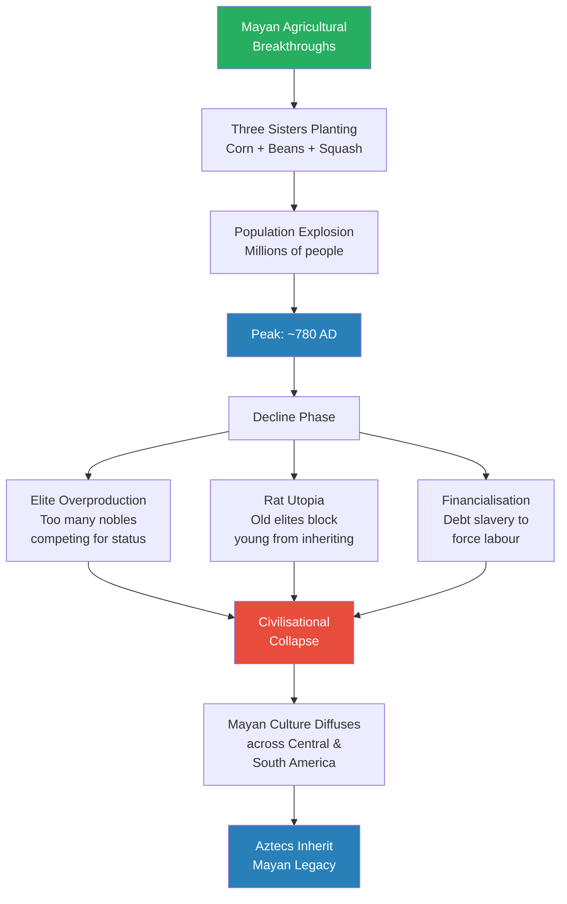
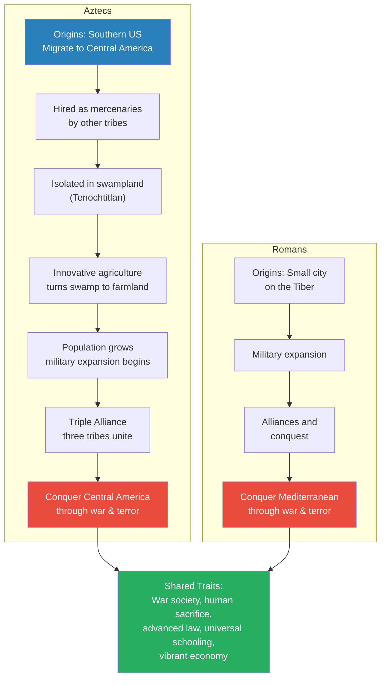
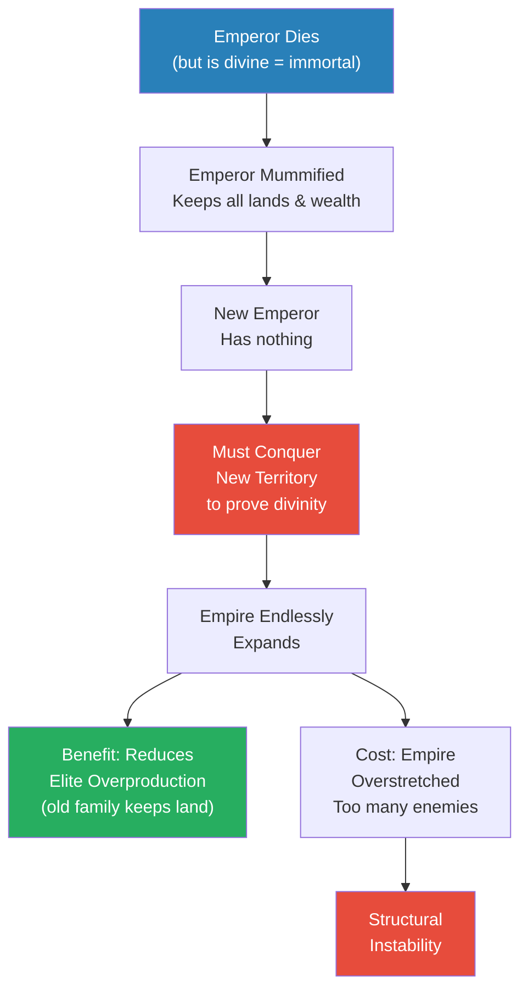
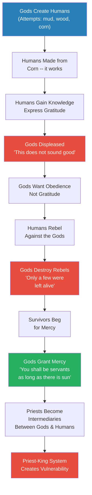
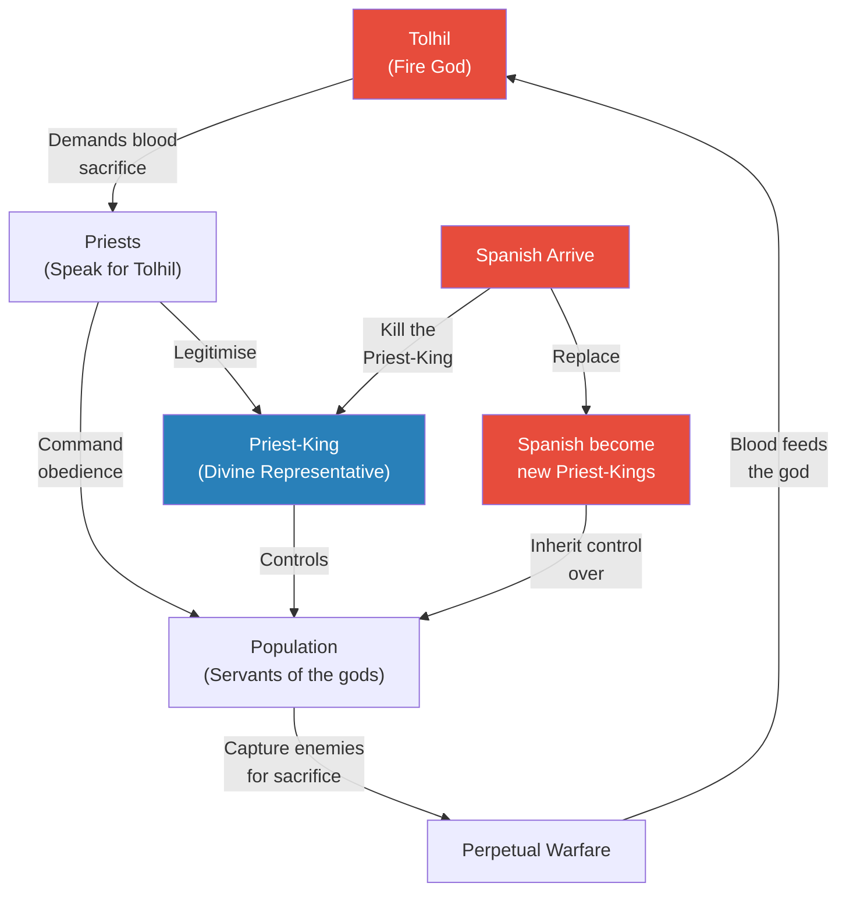
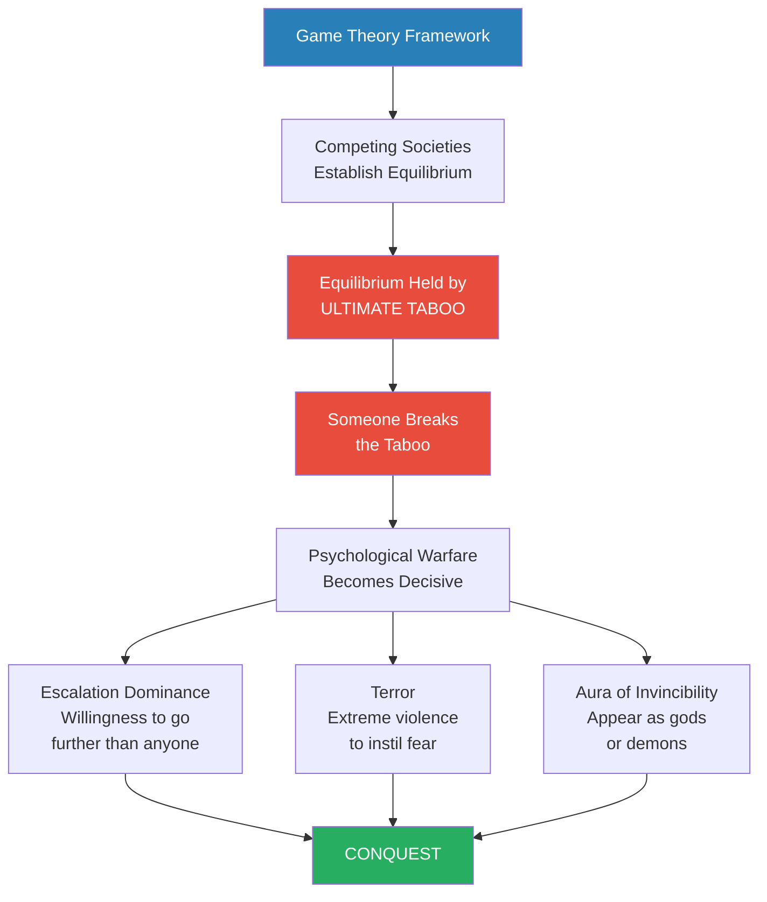
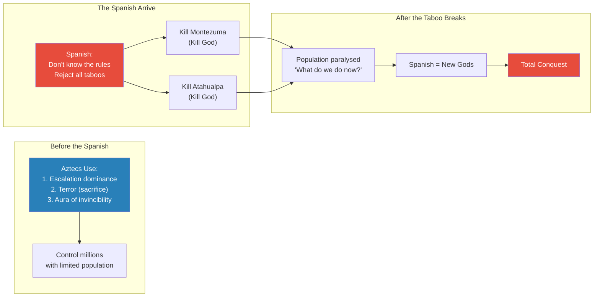

# The Spanish Conquest of the New World

> Prof. Jiang asks a question that standard history textbooks answer too quickly: how did a few hundred Spanish conquistadors conquer civilizations of millions in under thirty years? The conventional explanation -- disease, internal division, and superior weapons -- is acknowledged but set aside. Prof. Jiang argues that the real vulnerability was religious: the Aztec, Inca, and Mayan belief systems created strict hierarchies where the ruler was divine and untouchable, and this very structure became the fatal weakness the Spanish exploited. By killing the god-king -- breaking the ultimate taboo -- the Spanish collapsed entire civilizations from the inside. The lecture draws on game theory, the Popol Vuh creation myth, and parallels to Sumerian warfare and Mongol conquest to build a framework that explains not just this conquest but any conquest where a small force overwhelms a vast one.

---

## Overview: Key Highlights

- <b style="color: #27ae60">Religion was the ultimate vulnerability</b> -- the strict hierarchies of Aztec, Inca, and Mayan societies made them structurally vulnerable to anyone willing to kill their god-king
- <b style="color: #e74c3c">The conventional three-factor explanation is incomplete</b> -- disease, internal division, and superior weapons explain the mechanics but not the speed and totality of collapse
- <b style="color: #2980b9">Game theory and the ultimate taboo</b> -- societies establish equilibria governed by rules no one breaks; whoever breaks the ultimate taboo becomes godlike
- <b style="color: #27ae60">Breaking the taboo is how small forces conquer large ones</b> -- the Spanish, like the Akkadians and Mongols before them, won by violating the one rule everyone else obeyed
- <b style="color: #e74c3c">The Popol Vuh reveals a theology of servitude</b> -- the gods created humans to be slaves, and humans who rebelled were destroyed; obedience was the only option
- <b style="color: #2980b9">Escalation dominance, terror, and the aura of invincibility</b> -- the three pillars of psychological warfare used by Mongols, Akkadians, Aztecs, and then the Spanish
- <b style="color: #27ae60">The Columbian Exchange transformed Europe</b> -- corn, potatoes, and other New World crops triggered a population explosion in Europe while disease devastated the Americas
- <b style="color: #2980b9">Three Sisters planting</b> -- the Mayan agricultural innovation of growing corn, beans, and squash in symbiosis, still used today
- <b style="color: #e74c3c">Human sacrifice was universal among war societies</b> -- Romans, Vikings, and Aztecs all practised it, though the Romans disguised theirs
- <b style="color: #2980b9">Sargon of Akkad's precedent</b> -- the first ruler to break the taboo of attacking city-temples, opening the game for conquest through psychological warfare
- <b style="color: #27ae60">Religion is the operating system of civilisation</b> -- destroy the worldview and you turn people into "zombies and slaves," regardless of their numbers or weapons
- <b style="color: #e74c3c">Strict hierarchy is an existential weakness</b> -- any society where the majority are forced to worship a minority becomes vulnerable to outside invasion

| Concept | One-line summary |
|---------|-----------------|
| **Conquistadors** | Spanish mercenaries and adventurers who conquered Central and South America in under 30 years |
| **Ultimate taboo** | The one rule a society considers unbreakable -- breaking it collapses the entire social order |
| **Game theory equilibrium** | Competing societies establish stable rules of engagement; stability depends on no one violating the taboo |
| **Escalation dominance** | Willingness to do more than anyone else to win -- the first pillar of psychological warfare |
| **Terror** | Instilling fear through extreme violence -- the second pillar of psychological warfare |
| **Aura of invincibility** | Making opponents believe you are unstoppable or divine -- the third pillar of psychological warfare |
| **Popol Vuh** | The sacred book of the Maya, recording their creation myth and the theology of human servitude |
| **Three Sisters planting** | Corn, beans, and squash grown together in symbiosis -- a Mayan agricultural breakthrough |
| **Columbian Exchange** | The transfer of crops, animals, and diseases between Old and New Worlds after 1492 |
| **Mummified emperors (Inca)** | Dead emperors retained their lands and wealth because they were considered still alive -- forcing each new emperor to conquer fresh territory |
| **Heroic Twins** | Mayan mythological figures who tricked demons into killing themselves -- the origin of Aztec sacrificial ritual |
| **Tolhil** | The Mayan fire god who demands blood sacrifice and punishes all human rebellion |

---

# The Lecture

## The Old World Meets the New -- Setting the Stage [0:00 - 9:00]

*Prof. Jiang opens with the global context: the Islamic trade networks that enriched Spain, the Ottoman conquest of Constantinople that cut European trade routes, and the maritime exploration that followed. He explains how the Spanish ended up in the Americas, how the Columbian Exchange transformed European agriculture, and then poses the central question: how did a few thousand conquistadors conquer millions?*

> [!tip] Core Insight
> The New World crops -- corn, potatoes, tomatoes, peanuts, squash -- were far more nutritious than wheat. Their import triggered a population explosion in Europe. The natives got smallpox, measles, typhus, and cholera in return. The exchange was catastrophically one-sided.

*The chain from Islamic trade to Spanish conquest shows how geopolitical disruption -- particularly the Ottoman capture of Constantinople -- drove European expansion westward. Spain's loss of its Islamic trade routes was the proximate cause of the age of exploration.*

> [!note]- Expand: Full Lecture Detail
> Prof. Jiang begins by situating the conquest in global history. The Islamic empire had connected the world in globalised trade -- networks running from Central Asia to China, into Europe, and across Africa. There was a Maritime Silk Road for Chinese porcelain and an overland Silk Road for everything else.
>
> - Spain, then called <b style="color: #2980b9">Al-Andalus</b>, was part of the Islamic world -- wealthy and cosmopolitan because of this globalised trade
> - Trade accelerated during the Mongolian conquest -- the <b style="color: #2980b9">Pax Mongolica</b> transferred knowledge from east to west, including paper (invented in China) and gunpowder
> - The Vikings were historically considered the first Europeans to reach the New World -- they made it to present-day Newfoundland and founded a colony called Vinland, but it did not last
> - Prof. Jiang emphasises that the world has always been interconnected: "Just because we don't have written records or archaeological evidence does not mean that there was no contact" -- Egyptians, Harappans, or Chinese may have reached the Americas before the Vikings
>
> The turning point came in the 16th century:
>
> - Spain was reconquered by Christian Europeans, severing it from Islamic trade networks
> - The Ottoman Empire rose to power -- in 1453, they conquered Constantinople, seat of the Eastern Roman Empire
> - Europeans now had to pay heavy taxes to the Ottomans (and Italians) to trade with India and China
> - Their response: find their own routes. They hired experienced Italian seamen -- Christopher Columbus, from Genoa, was hired to find a route to China and ended up in the Americas
>
> The Pope divided the world between Spain and Portugal to prevent conflict:
>
> - Portugal got the Eastern hemisphere -- colonies in Africa, India, China, the East Indies
> - Spain got the New World -- Mexico, Central America, most of South America
> - Spain got the better deal: the Americas were rich in gold and silver
> - Britain and France arrived later, stuck with cold, poor North America inhabited by "very aggressive and violent natives" -- but this proved more beneficial in the long run
>
> The <b style="color: #2980b9">Columbian Exchange</b> transformed Europe:
>
> - <b style="color: #27ae60">Corn was invented by native peoples of Central America</b> -- it is not naturally produced; it required scientific cross-breeding over generations
> - The potato became the staple food of Europeans
> - Peanuts, squash, and tomatoes were all first domesticated in the Americas
> - These foods were far more nutritious than wheat, triggering a <b style="color: #27ae60">population explosion in Europe</b>
> - In return, the natives received smallpox, measles, typhus, and cholera
>
> Prof. Jiang then poses the central question: how did a few thousand conquistadors conquer millions of indigenous people across three major civilizations -- the Aztecs, the Mayans, and the Incas -- in less than 30 years?
>
> The conventional scholarly explanation has three factors:
>
> 1. **Disease** -- Europeans brought diseases the native people had no immunity against; smallpox, measles, typhus, and cholera wiped out roughly 80% of the population -- "basically a genocide"
> 2. **Internal conflict** -- the Spanish exploited tribal warfare through divide-and-conquer strategies, allying with tribes that hated the Aztecs, conquering together, then enslaving the allies
> 3. **Superior technology** -- armour, cannons, horses, steel swords versus wooden spears and no armour
>
> But the Spanish themselves had a different explanation: God willed it, and the natives saw them as gods. Scholars have rejected this as racist. Prof. Jiang's thesis: <b style="color: #e74c3c">the original Spanish argument actually has much more evidence and makes more logical sense than the current scholarly interpretation</b>. The religious beliefs and practices of the Aztecs, Incas, and Mayans made them structurally vulnerable to Spanish conquest.

---

## The Mayan Civilization -- Agricultural Genius and Inevitable Decline [9:00 - 18:55]

*Prof. Jiang traces the Mayan civilization from its agricultural breakthroughs to its decline, introducing the Three Sisters planting system and then applying the familiar framework of civilisational collapse: elite overproduction, rat utopia, and financialisation.*

*The Mayan arc follows the same pattern Prof. Jiang has demonstrated throughout the series: agricultural breakthrough leads to population growth, which leads to peak, which triggers the three forces of decline. The Mayans were masters of ecology -- their collapse was not simply environmental.*

> [!note]- Expand: Full Lecture Detail
> Prof. Jiang lists the five earliest civilizations -- China, India (Indus Valley), Mesopotamia, Egypt, and the Maya -- all developing around the Tropic of Cancer. He notes that when you analyse all five, you find striking similarities.
>
> The Mayan civilisation was extraordinary:
>
> - Millions of people spread across Central America
> - Developed science, astronomy, mathematics, and a written language
> - Built pyramids as temples to worship their gods
> - Created the <b style="color: #2980b9">Mayan calendar</b> -- independently from Egypt's solar calendar -- "a very sophisticated, very nuanced, extremely scientific instrument" used for agriculture
>
> Their most astonishing achievement was agricultural:
>
> - <b style="color: #27ae60">The Mayans invented corn</b> -- nature did not produce it; they created it through cross-breeding over a very long process
> - Corn allowed them to feed large populations with limited farmland
> - They developed <b style="color: #2980b9">Three Sisters planting</b> -- growing corn, beans, and squash together in a symbiotic relationship:
>   - Corn provides the structure for beans to climb toward sunlight
>   - Beans release nitrogen into the soil, fertilising the corn and squash
>   - Squash prevents weeds and insects from invading the ecosystem
> - "It's a perfect symbiotic relationship that we still use today"
>
> The Mayan civilisation reached its peak around 780 AD. Then came the decline:
>
> - Scientists point to ecological collapse -- deforestation and soil erosion from overpopulation
> - But Prof. Jiang questions whether this is <b style="color: #e74c3c">correlation or causation</b> -- the Mayans "are really famous for their ecological management. They're masters at being able to manage their environment"
> - He applies the three universal factors of civilisational decline:
>   1. **Elite overproduction** (the Peter Turchin argument) -- too many nobles competing for status
>   2. **Rat utopia** -- old elites live too long, blocking young people from inheriting status, leading to societal malfunction ("same thing happening in the world today -- in America there's quiet quitting, in China there's lying flat")
>   3. **Financialisation and debt slavery** -- prosperous societies struggle to motivate labour because people are content with enough; the only solution is to enslave them through debt
> - These three forces are symbiotic and "all spell the end of civilisation. This is true for Rome. This is true for the Mayans. This has been true also for China throughout its history."
>
> As the Mayan civilisation collapsed, people diffused across Central and South America, carrying Mayan culture with them. Different tribes competed to inherit the Mayan legacy. The nation that eventually won was the Aztecs.

---

## The Aztecs -- A War Society Built on Terror [18:55 - 28:55]

*Prof. Jiang draws an extended parallel between the Aztecs and the Romans: both were war societies that conquered through military dominance, practised human sacrifice, and built sophisticated civilisations on a foundation of terror. He traces the Aztec rise from mercenaries to empire-builders, and introduces Hernan Cortes's conquest.*

> [!tip] Core Insight
> All war societies -- Romans, Vikings, Aztecs -- practise human sacrifice. The Romans disguised theirs as triumphal executions at the Temple of Jupiter. The function is identical: terror to control subject peoples, and religious ritual to justify conquest.

*Prof. Jiang's Aztec-Roman parallel is structural, not superficial. Both societies rose from marginal origins to empire through military aggression, both used terror and human sacrifice as instruments of control, and both built sophisticated legal and educational institutions atop that violent foundation.*

> [!note]- Expand: Full Lecture Detail
> Prof. Jiang draws the Aztec-Roman parallel immediately: "If you think Aztec, think Romans as well." The core similarity is that both are societies based on war.
>
> The Aztec origin story:
>
> - Originally from the southern United States
> - Climate change forced migration to Central America for food
> - Central America was already overpopulated -- the Aztecs hired themselves out as mercenaries to other tribes
> - Eventually came into conflict with other tribes and were isolated in <b style="color: #2980b9">Tenochtitlan</b> -- swampland, hard to grow food
> - Tenochtitlan is modern-day Mexico City
> - Something miraculous happened: the Aztecs adapted, turning swampland into farmland through innovative agriculture
> - Swampland was bad for crops but good for defence -- populations grew quickly
>
> The Aztec war machine:
>
> - A heavily military society focused on conquest
> - Their religion demanded that enemies be defeated and sacrificed to their god, "who maintains his vitality through blood sacrifice"
> - <b style="color: #e74c3c">The Aztecs practised the most grotesque forms of human sacrifice</b> -- sacrificing thousands at once, cutting out hearts while victims were still alive
> - The purpose was terror -- terrorise enemies and unite their own people
>
> Prof. Jiang insists on a key point: <b style="color: #e74c3c">all war societies practise human sacrifice</b>:
>
> - The Vikings practised human sacrifice (discussed in earlier lectures)
> - The Romans also practised it but hid it from their history
>   - At the end of every major military campaign, they held a <b style="color: #2980b9">triumph</b> -- a parade of war captives through Rome
>   - The captives were taken to the Temple of Jupiter and strangled to death
>   - "That's human sacrifice... The Romans said, 'Oh no, no, no, we don't do this. We're much more civilised.' And they never explain why the strangulation is not human sacrifice."
>
> The Aztec civilisation was highly advanced:
>
> - Part of the <b style="color: #2980b9">Triple Alliance</b> -- three tribes united to conquer surrounding enemies
> - Had hierarchy, priests, universal schooling -- every child could learn to read and write
> - System of courts, judges, and a strict legal code
> - Vibrant economy
> - Tenochtitlan was so wealthy and large that when the Spanish first arrived, "they were amazed... it made them salivate"
>
> > [!example] Hernan Cortes and the Fall of the Aztecs
> > - Cortes was an adventurer and soldier of fortune -- he did not have permission from Spain to conquer the Aztecs
> > - He arrived with only a few hundred soldiers; the Aztecs had millions
> > - King Montezuma welcomed him with open arms, likely wanting to co-opt him as a tool against internal and external enemies
> > - Cortes only cared about gold -- "wherever he could find gold, he'd be happy to go"
> > - During a religious ceremony, Cortes's men saw the Aztec preparations as a threat and massacred the assembled soldiers
> > - The Spanish captured Montezuma and demanded ransom; when they could not collect, they killed him
> > - The Spanish were expelled from the city, but then smallpox struck the population
> > - While the Aztecs were devastated by disease, the Spanish recuperated, gathered allies, and eventually conquered the city
> > **The lesson:** The Christian missionaries who followed destroyed all written records of the Aztecs. "All we have are the stories that probably aren't true" -- history was written entirely by the conquerors.

---

## The Incas -- Divine Emperors and Eternal Expansion [28:55 - 38:48]

*Prof. Jiang introduces the Inca Empire's distinctive feature: mummified divine emperors who retained their lands after death, forcing each new emperor to conquer fresh territory. He then tells the story of Francisco Pizarro's capture of Emperor Atahualpa -- a story of divine invulnerability meeting ruthless pragmatism.*

*The Inca system of mummified emperors was an elegant solution to elite overproduction -- the old guard kept their lands, so the new emperor had to conquer rather than redistribute. But it made the empire permanently expansionist, permanently overstretched, and permanently unstable.*

> [!note]- Expand: Full Lecture Detail
> The Inca Empire stretched throughout the Andes mountains of South America -- modern-day Peru and beyond. Prof. Jiang identifies their distinctive religious practice:
>
> - <b style="color: #2980b9">The emperor was divine</b> -- if divine, then immortal
> - When an emperor died, he was mummified -- and because he was "still alive," he kept all his lands and wealth
> - The new emperor therefore inherited nothing and had to conquer new lands to establish his own divinity
> - This made the Incas <b style="color: #e74c3c">endlessly, eternally expansionist</b> -- "they have no choice in the matter"
> - The system cleverly resolved elite overproduction: "the old emperor's family and loyal soldiers keep their land, and now the new emperor has to go conquer new territory"
> - But it also made the society extremely unstable -- "too spread out and too many enemies"
>
> Like the Romans, the Incas were tolerant conquerors:
>
> - When they conquered other people, <b style="color: #27ae60">conquered gods were incorporated into a pantheon</b>
> - "You can worship any god you want, as long as you acknowledge the supremacy of my god"
> - Everyone was allowed to practise their own religion as long as they submitted and paid tribute
>
> Inca civilisation was bureaucratically advanced:
>
> - Census, tribute collection, taxes, legal code, court system
> - No writing system, but they had beads -- "with numerals, you can create basically a knowledge system... like a very primitive computer or calculator"
> - Machu Picchu survives as the most visible remnant
>
> > [!example] Francisco Pizarro and the Capture of Atahualpa
> > - Pizarro was another conquistador, like Cortes
> > - Emperor Atahualpa had just won a civil war and was the new divine emperor
> > - The legend says Pizarro fought a battle: Atahualpa had 40,000 soldiers, Pizarro had 200, and Pizarro won
> > - Prof. Jiang doubts this: "This story is probably not true. What probably happened was that the Emperor greeted the Spanish with open arms and said, let's negotiate"
> > - The Spanish captured him -- "in this society, the emperor is divine. He's untouchable, so it is beyond his imagination that the Spanish would capture him"
> > - Pizarro demanded ransom: fill this room with gold
> > - Atahualpa issued a command, and a few days later the entire room was filled with gold
> > - Pizarro was astonished -- "if I can just ask for gold and they'll give it to me, then why don't I just take this entire territory?"
> > - The Spanish killed Atahualpa and conquered the entire Inca Empire
> > **The lesson:** "You should not pay ransoms to pirates." The emperor's divinity -- the very thing that held the empire together -- made it inconceivable that anyone would dare touch him. That inconceivability was the vulnerability.

---

## The Popol Vuh -- A Theology of Servitude [28:55 - 40:32]

*Prof. Jiang turns to the Popol Vuh, the sacred book of the Maya, to explain the religious worldview that made these civilisations structurally vulnerable. Three passages reveal a theology where humans exist to serve the gods, rebellion is impossible, and obedience is enforced through priests who speak for the gods.*

> [!tip] Core Insight
> The Mayan creation myth establishes that gods created humans to be slaves. When humans gained knowledge and expressed gratitude, the gods were displeased -- they wanted obedience, not thanks. When humans rebelled, they were annihilated. This theology made entire civilisations psychologically incapable of resisting anyone who could kill their god-king.

*The Popol Vuh's three-act creation narrative -- creation, rebellion, submission -- produces a worldview where challenging authority is not merely dangerous but cosmically impossible. This theological structure is what the Spanish exploited.*

> [!note]- Expand: Full Lecture Detail
> Prof. Jiang explains that religion in these societies was spread through oral tradition from priests to people. Around 1700, a Dominican priest wrote down this oral tradition, producing the <b style="color: #2980b9">Popol Vuh</b> -- "the book of the community."
>
> **Passage 1 -- The Heroic Twins:**
>
> - The Mayans worshipped the Heroic Twins as saviours of humanity
> - The twins' fathers were captured and killed by demons in the underworld -- similar to the Egyptian myth of Osiris killed by Set
> - The twins befriended the demons and made themselves immortal
> - They tricked the demons: "Look at us. We can cut our heart and come back alive." The demons wanted to play too -- and killed themselves
> - Prof. Jiang reads directly from the Popol Vuh: "The first we sacrifice was the very head of all the Lords, One Death by name... they didn't revive them"
> - Crucially: "Their hearts were not taken from the chest" -- <b style="color: #e74c3c">this is exactly how the Aztecs practised their sacrifice</b>, trying to ritually re-enact this mythology
> - "Which is what the Vikings did as well" -- both enacted their myths through ritual
>
> **Passage 2 -- The Creation of Humans:**
>
> - The gods made three attempts to create humanity: mud (fell apart), wood (failed), corn (worked)
> - "That's why the Mayans consider themselves children of corn"
> - The gods created humans and asked: "Do you know your existence? Do you not look and listen?"
> - Humans responded with gratitude: "Truly, we thank you doubly, triply that we were created"
> - <b style="color: #e74c3c">"But this did not sound good to the Framer and the Shaper"</b> -- the gods did not want gratitude
> - The gods wanted subservience and obedience -- humans were created to serve
> - This is parallel to the <b style="color: #2980b9">Enuma Elish</b> (Babylonian creation myth), where the god Marduk creates humans so gods would not have to work
> - Also parallel to Catholic theology: humans are slaves to God because God freed them from the devil
>
> **Passage 3 -- The Failed Rebellion:**
>
> - The god <b style="color: #2980b9">Tolhil</b>, the Mayan fire god, demands constant blood sacrifice to rejuvenate himself -- "he's always hungry"
> - Humans tried multiple tricks to rebel against Tolhil -- all failed because "he's smarter than us"
> - Humans united to fight him militarily and were annihilated: "only a few were left alive"
> - The gods destroyed humanity's capacity to ever challenge them: "They were no longer able to wage war"
> - The survivors begged for mercy: "Pity us. Do not kill us"
> - The gods' verdict: <b style="color: #e74c3c">"You shall be servants as long as there is sun and light"</b>
>
> Prof. Jiang then connects the theology to political structure:
>
> - We obey the gods through priests who "understand them" and "could see the future"
> - The Popol Vuh is sacred because it was "written down by those who speak directly with the gods"
> - The priests fasted and sacrificed to win divine favour -- they are worthy, and "we must submit ourselves before them"
>
> The logic is clear: <b style="color: #27ae60">the Mayans created a civilization that was truly religious and hierarchical</b>. Everyone worshipped the priest-king as a direct representative of God. "But when you do that, you create the condition for the Spanish to come kill that priest-king and become the new priest-king."

---

## The Fire God Tolhil and the Priest-King System [40:32 - 47:52]

*Prof. Jiang explains how the Mayan theological system -- where the fire god demands perpetual sacrifice and priests serve as divine intermediaries -- created the structural conditions for conquest. He then introduces the game theory framework that explains how small forces conquer large ones.*

*The priest-king system was a closed loop: the god demanded sacrifice, the priests commanded obedience, the population fought wars to capture victims. The Spanish simply inserted themselves at the top of the loop by eliminating the priest-king.*

> [!note]- Expand: Full Lecture Detail
> Prof. Jiang summarises the structural logic:
>
> - The Mayans created a religion that enslaved everyone around them
> - This brought "the perfect opportunity for the Spanish to come and take over that role"
> - "In history class, you may have learned that the Spanish were extremely cruel to the natives -- not more so than the previous overlords"
> - The cruelty was not new; only the identity of the overlords changed
>
> He then introduces the theoretical framework through Sumerian history:
>
> - The <b style="color: #2980b9">Sumerians</b> developed different city-states along the Tigris and Euphrates
> - Each city-state had its own city god
> - Over time, these cities came into conflict over trade and land -- the situation became a game
> - The first rule of the game: <b style="color: #27ae60">you do not attack each other's cities</b>
>   - The city is the physical manifestation of God on earth
>   - You can kill the enemy's army on the field, but you do not touch the city
>   - City walls provided physical protection, but the divine taboo was the real shield
> - This rule established an equilibrium -- constant fighting, but no one could conquer the others because cities were protected by the gods
> - "This equilibrium is a form of peace and stability"
>
> > [!example] Lugal-Zage-Si -- The Man Who Broke the Taboo
> > - One Sumerian king, Lugal-Zage-Si, decided to ignore the rules
> > - He sacked a city and stole from its temple -- where all the gold and valuables were kept
> > - "Even his soldiers were afraid that the gods would come and smite him"
> > - Nothing happened to him
> > - He did it again and again, growing more powerful each time
> > - He had discovered the ultimate taboo and broken it: "You break it, you become God yourself"
> > - His success opened the game for the Akkadians -- the most warlike people -- to come in and conquer everyone
> > **The lesson:** The ultimate taboo is what humans must not violate -- only gods may break it. When a human breaks it and survives, the entire social order collapses.

---

## Game Theory and the Ultimate Taboo [47:52 - 57:42]

*Prof. Jiang assembles the full theoretical framework: game theory, the ultimate taboo, and the three pillars of psychological warfare. He applies it to the Aztecs, the Incas, the Mongols, and the Akkadians, then delivers the lecture's thesis: the Spanish won because they broke the taboo that held these societies together.*

> [!tip] Core Insight
> Any society with a strict hierarchy where the majority are forced to worship a minority becomes structurally vulnerable to outside invasion. It does not matter how many people you have or how many weapons. The hierarchy itself is the weakness.

*The framework is universal: Sumerians, Mongols, Akkadians, Aztecs, Incas all operated within the same game-theoretic logic. The variable is not military strength but willingness to violate the taboo.*

*The Aztecs themselves used escalation dominance, terror, and the aura of invincibility to control millions. The Spanish simply did the same thing -- but at a higher level, by killing the god the Aztecs claimed to represent.*

> [!note]- Expand: Full Lecture Detail
> Prof. Jiang assembles the framework step by step.
>
> First, the <b style="color: #2980b9">Akkadian precedent</b>:
>
> - After Lugal-Zage-Si broke the taboo, the Akkadians seized the opportunity
> - <b style="color: #2980b9">Sargon the Great</b> perfected siege warfare to break down city walls -- previously thought impossible
> - This created all three pillars of psychological warfare: escalation dominance, terror, and the aura of invincibility
>
> Prof. Jiang restates the universal pattern:
>
> - Whenever societies compete, they establish an equilibrium
> - The equilibrium is held together by an <b style="color: #e74c3c">ultimate taboo</b>
> - When someone breaks the taboo, the game opens up
> - Whoever masters psychological warfare -- escalation dominance, terror, and the aura of invincibility -- wins
>
> Applied to the Aztecs and Incas:
>
> - The Aztecs had escalation dominance (willing to go further than anyone), terror (human sacrifice), and the aura of invincibility
> - This is how they controlled millions with a limited population -- "they employed the same strategies as the Mongols"
> - The Incas used the same three strategies
> - "You can just say that it was really about God. The Aztecs proved that their god was superior to every other god"
>
> Then the Spanish arrived:
>
> - <b style="color: #e74c3c">The Spanish did not know how the game was played</b> -- they rejected all the rules
> - They rejected the idea that God cannot be killed
> - They killed Montezuma (god of the Aztecs) and the Inca Emperor
> - "When you break the taboo, you leave people completely helpless"
>
> Prof. Jiang uses a modern analogy to make the logic vivid:
>
> > [!example] The Nuclear Taboo Analogy
> > - Today's ultimate taboo: no one uses nuclear weapons -- "if anyone used nuclear weapons, the world would end tomorrow"
> > - During the Cuban Missile Crisis, the chain of command prevented launch -- "there's always one guy who's like, 'I don't want to be the guy who ends the world'"
> > - Now imagine 10 aliens arrive on a spaceship -- just 10, versus 8 billion humans
> > - The aliens are not inhibited by the nuclear taboo
> > - "All they do is use one nuclear weapon against us, and then what would happen? We would all surrender"
> > - "Same thing happened with the Aztecs and Incas"
> > **The lesson:** The taboo's power comes from universal compliance. An outsider who does not share the taboo can paralyse an entire civilisation with a single transgression.
>
> Prof. Jiang delivers the thesis:
>
> - "The Spanish were able to kill their god. Everyone was like, 'What do we do now? We exist to serve God. God is invincible, but the Spanish killed him.' Which means now the Spanish are gods."
> - <b style="color: #27ae60">"The worldview is basically religion. It is the basis of who we are. It is our operating system."</b>
> - "Your computer cannot run without an operating system. We cannot run without a worldview and a religion."
> - "If you destroy the worldview, it's like cutting off someone's brain. You turn this person into zombies and slaves."
>
> The implication: <b style="color: #e74c3c">whenever a society has an extremely strict hierarchy where the majority are forced to worship a minority, it makes that society extremely vulnerable to invasion and conquest</b>.
>
> - "Doesn't matter how many people. Doesn't matter how much weapons you have."
> - "As long as you have a strict hierarchy, it becomes the ultimate weakness of a society."

---

## Connections

**Builds on:** [[06 - Elite Overproduction and the Bronze Age Collapse]] (elite overproduction as a universal driver of decline), [[08 - Rat Utopia and the Peloponnesian War]] (rat utopia concept applied here to Mayan decline)
**Echoes:** The Mongol psychological warfare strategies discussed in earlier lectures; the Viking human sacrifice parallels; the Sumerian city-state warfare and Sargon of Akkad
**Sets up:** [[45 - The Gunpowder Revolution]] (next lecture -- gunpowder as a radical structural change)
**Related books in vault:** [[Sapiens - Yuval Noah Harari]] (agricultural revolution, domestication inversion), [[The 33 Strategies of War - Robert Greene]] (psychological warfare, escalation dominance)

---

## The Takeaway

This lecture reframes the Spanish conquest from a story of European technological superiority to a story of structural vulnerability. The conventional explanation -- disease, internal division, superior weapons -- describes the mechanics but not the deeper cause. Prof. Jiang's argument is that the Mayan, Aztec, and Inca civilisations built religious systems so effective at maintaining internal control that they became fatally brittle. The very hierarchy that allowed a small elite to govern millions created a single point of failure: the god-king. Kill the god-king, and the entire operating system crashes.

The most counterintuitive insight is that the Spanish did not need to understand the game they were disrupting. They were outsiders who simply did not share the taboo against killing a divine ruler. Like the hypothetical aliens who use a nuclear weapon because they have no concept of mutual assured destruction, the Spanish broke a rule they did not even know existed -- and the result was total civilisational collapse. The game theory framework Prof. Jiang introduces here -- equilibrium maintained by an ultimate taboo, psychological warfare as the decisive weapon -- is not limited to the 16th century. It is a universal pattern for how small forces overwhelm large ones, from Sargon of Akkad to the Mongol conquests to the present day.

The question the lecture leaves open is whether any civilisation can avoid this vulnerability. If strict hierarchy is inherently fragile, and if every prosperous society trends toward hierarchy through elite overproduction and financialisation, then the seeds of conquest are planted at the moment of a civilisation's greatest success. The gunpowder revolution, which Prof. Jiang previews for the next lecture, will introduce yet another way the rules of the game can be broken.
