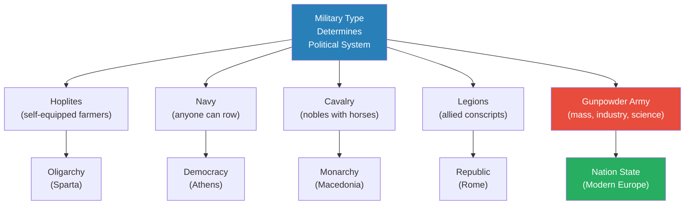
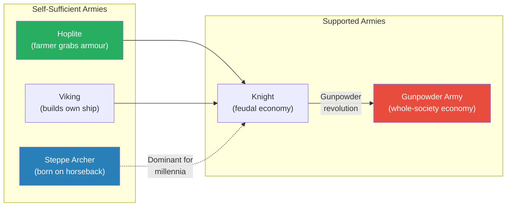
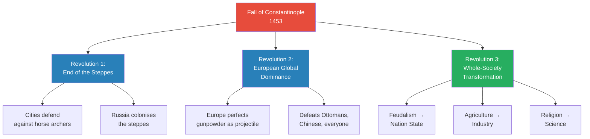
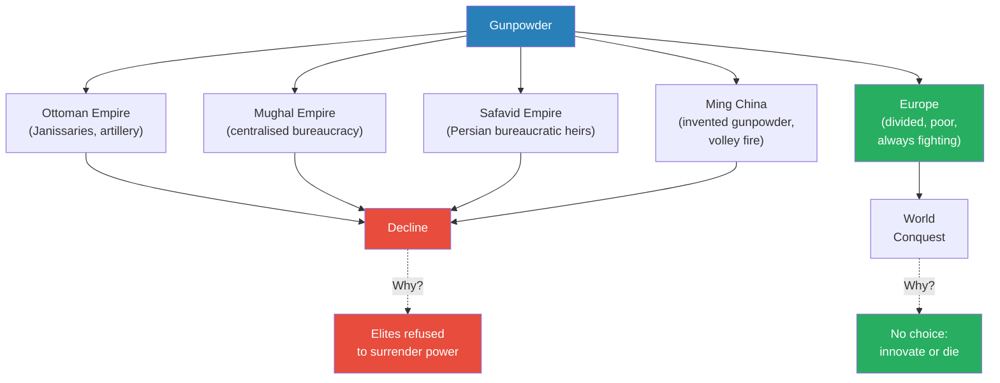
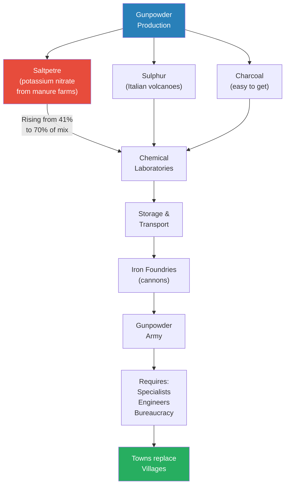
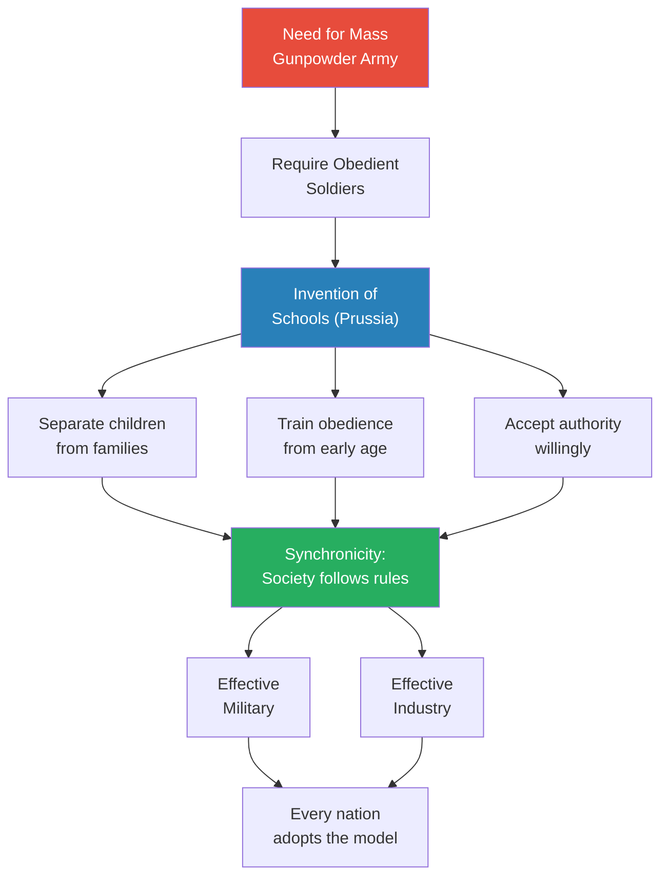
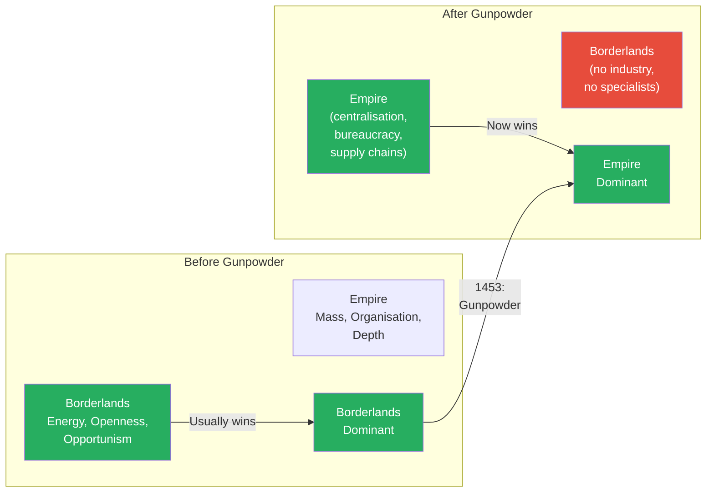
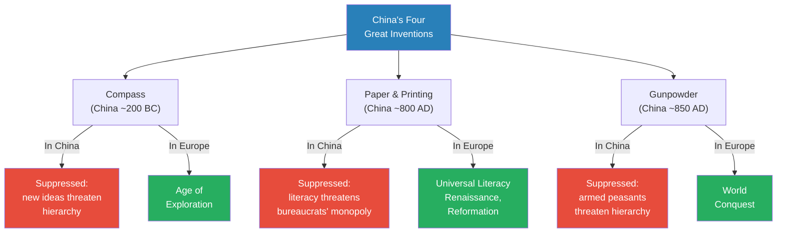

# The Gunpowder Revolution

> Prof. Jiang asks how Europe -- divided, poor, and weak after the fall of Rome -- conquered the entire world in roughly two hundred years starting around 1500. The answer is gunpowder, but not in the way most people assume. China invented gunpowder, and the four great gunpowder empires (Ottoman, Mughal, Safavid, Ming) all possessed it. Yet it was Europe that turned gunpowder into a world-conquering force, because gunpowder demanded a whole-society transformation that only Europe's relentless internal competition made inevitable. Feudalism gave way to the nation state, agriculture gave way to industry, religion gave way to science -- and any society whose elites refused to surrender power was left behind.

---

## Overview: Key Highlights

- <b style="color: #27ae60">The nature of the military determines the nature of the political system</b> -- the foundational principle connecting Sparta's oligarchy, Athens' democracy, Macedonia's monarchy, Rome's republic, and now the gunpowder nation state
- <b style="color: #2980b9">The Fall of Constantinople (1453)</b> -- Ottoman cannons destroyed walls that had stood for a thousand years, announcing the gunpowder era to Europe
- <b style="color: #e74c3c">China invented gunpowder but could not use it</b> -- the Confucian bureaucracy suppressed all four Great Inventions to protect the social hierarchy
- <b style="color: #27ae60">The whole-society approach</b> -- Europe surpassed the gunpowder empires because it restructured society around warfare: feudalism to nation state, agriculture to industry, religion to science
- <b style="color: #2980b9">Open, cooperative competition</b> -- Europe's permanent division and internal warfare was simultaneously its greatest weakness and the engine of all innovation
- <b style="color: #e74c3c">The steppe peoples ceased to be a threat</b> -- gunpowder ended thousands of years of Borderlands dominance over agricultural empires
- <b style="color: #2980b9">Synchronicity</b> -- structuring society so people follow rules, stand in line, obey authority -- the foundation of both effective militaries and effective industries
- <b style="color: #27ae60">Schools were invented to create soldiers</b> -- the Prussian model trains obedience, separates children from families, and produces both military and industrial workers
- <b style="color: #e74c3c">Elites never voluntarily surrender power</b> -- China, the Ottomans, and the Mughals all failed to transform because their ruling classes blocked change
- <b style="color: #2980b9">Balance of power</b> -- Europe's governing principle: whenever one nation rises, all others unite to tear it down, ensuring perpetual competition
- <b style="color: #27ae60">War creates social mobility</b> -- death clears the hierarchy, opening positions that peacetime keeps locked
- <b style="color: #e74c3c">The dual pressure that forces innovation</b> -- European nations faced external enemies and internal revolution simultaneously, making innovation a matter of survival

| Concept | One-line summary |
|---------|-----------------|
| **Military-political nexus** | The type of army a society fields determines the type of government it develops |
| **Whole-society approach** | Integrating gunpowder effectively requires transforming every aspect of society, not just the army |
| **Open, cooperative competition** | Fragmented societies that compete internally innovate faster than unified empires |
| **Synchronicity** | Social discipline where individuals follow rules and accept hierarchy -- the basis of military and industrial power |
| **Balance of power** | Europe's policy of all nations uniting against any rising hegemon, ensuring no one wins permanently |
| **Star fortress** | Defensive innovation against cannons: angled walls that allow overlapping fields of fire and resist piecemeal breach |
| **Volley fire** | Mass musket tactic where rows of soldiers fire sequentially, compensating for slow reload and poor accuracy |
| **Janissaries** | Christian slave-soldiers of the Ottoman Empire, loyal only to the Sultan, among the first professional gunpowder infantry |
| **Saltpetre** | Potassium nitrate -- the key ingredient in gunpowder (rising from 41% to 70% of composition), requiring industrial-scale farming |
| **Feudalism to absolute monarchy** | Gunpowder required centralised taxation and conscription, shifting power from local lords to the king |
| **Four Great Inventions** | Compass, paper, printing, and gunpowder -- all invented in China centuries before Europe, but only transformative in Europe |
| **Prussian schooling model** | Education system designed to produce obedient soldiers and factory workers, adopted globally |

---

# The Lecture

## The Military-Political Nexus -- A Running Theme [0:00--7:30]

*Prof. Jiang opens by recapping a principle the class has developed across many lectures: the nature of the military determines the nature of the political system. He walks through four examples already covered -- Sparta, Athens, Macedonia, and Rome -- before arguing that gunpowder will produce yet another political transformation.*

> [!tip] Core Insight
> Hoplites produced oligarchy, navies produced democracy, cavalry produced monarchy, allied legions produced a republic. Gunpowder will produce the nation state -- because only a centralised, industrialised, scientifically literate society can sustain a gunpowder army.

*Each military type selects for a specific political structure. The gunpowder node (red) marks the rupture point: unlike all previous military systems, gunpowder armies cannot be self-sufficient -- they demand an entire society reorganised around supporting them.*

> [!note]- Expand: Full Lecture Detail
> Prof. Jiang opens the class by connecting today's lecture to the course's overarching framework. He tells students to remember "a very important concept that we have been developing throughout this course": <b style="color: #2980b9">the nature of the military determines the nature of the political system</b>.
>
> He walks through the four examples already covered:
>
> - **Sparta** had a hoplite army -- farmers who could afford their own armour -- so it became an <b style="color: #2980b9">oligarchy</b> (rule by the few, specifically the military elite)
> - **Athens** had a navy, and "anyone and everyone can row a boat" -- if you can fight, you can vote, so it became a <b style="color: #2980b9">democracy</b>
> - **Macedonia** relied on cavalry, and "only the nobility could afford horses," so it became a <b style="color: #2980b9">monarchy</b>
> - **Rome** could "replenish its soldiers with allies from neighbouring nations in the Italian peninsula" -- it was a <b style="color: #2980b9">republic</b>, governed by laws and tradition rather than majority rule, which allowed rapid integration of immigrants
>
> He pauses to clarify a distinction he considers vital: "America is not a democracy. It is a republic -- a very important difference." In a democracy, decisions rest on majority rule. In a republic, they rest on laws, tradition, and constitutional norms, which is why Rome -- and later America -- could absorb immigrants quickly.
>
> He then previews the lecture's central argument: gunpowder will produce yet another political form, because it demands resources, specialisation, and coordination that no previous military system required.

---

## The Feudal World Before Gunpowder [0:00--7:30]

*Prof. Jiang walks through the military systems that preceded gunpowder -- from Greek hoplites and Viking longships to Mongol horse archers and medieval knights -- showing how each was largely self-sufficient. He then explains how the castle-based feudal system kept power decentralised and kings weak.*

*The transition from self-sufficient to supported armies is the hinge of the lecture. Steppe archers dominated for millennia precisely because they needed nothing from the economy -- gunpowder armies need everything from it.*

> [!note]- Expand: Full Lecture Detail
> Prof. Jiang surveys the military landscape before gunpowder:
>
> - **Greek hoplites** were "self-sufficient soldiers" -- farmers in peacetime who grabbed their own armour when war came. "You didn't need an economy to allow the hoplite to exist."
> - **Macedonian phalanx and Roman legions** evolved the hoplite formation but introduced standing armies -- "professional soldiers that must be supported by the economy"
> - **Vikings** were similarly self-sufficient: "able to build their own ships very quickly and repair them, and they are able to go off in small bands"
> - **Steppe peoples** (Mongols, Turks, Yamnaya) were the most formidable of all: "Ever since they were born, they could ride horses and shoot arrows" -- no training, no economy, no supply chain needed. <b style="color: #e74c3c">"For the longest time, the steppe people were the dominant military force in the world."</b>
> - **Medieval knights** changed the equation -- "very expensive," requiring armoured horses, weapons, and training from early childhood. This created <b style="color: #2980b9">feudalism</b>: "the entire economy revolves around maintaining knights for war purposes"
>
> He explains why feudalism decentralised power:
>
> - Each lord controlled local territory with his own knights and <b style="color: #2980b9">castles</b>
> - "If there's a fight between the Lords and the king, the Lords can just hide in their castle"
> - Castles had moats, high walls, and defensive perimeters -- "it's very hard to besiege and destroy a castle"
> - "Eventually the king has to give up"
> - Result: "The king is more like a figurehead who is appointed as maybe the chairman or the elected leader, but the king does not have that much power over the local areas"

---

## The Fall of Constantinople and the Three Revolutions of Gunpowder [7:39--16:47]

*Prof. Jiang centres the lecture's turning point on the Ottoman siege of Constantinople in 1453. Cannons destroyed walls that had been invincible for a thousand years, and Europe understood that gunpowder would remake the world. He identifies three fundamental changes: the end of steppe dominance, Europe's rise to global power, and a total restructuring of European society.*

> [!tip] Core Insight
> China invented gunpowder. The Ottomans used it to conquer Constantinople. But it was Europe -- divided, poor, and desperate -- that turned gunpowder into a civilisational engine, because Europe had no choice: innovate or be destroyed by your neighbour.

*The fall of Constantinople triggered three cascading revolutions. The third -- the whole-society transformation -- is the most important, because it explains why Europe overtook empires that had gunpowder first.*

> [!note]- Expand: Full Lecture Detail
> Prof. Jiang describes the significance of 1453:
>
> - Constantinople had been "the wealthiest, most powerful city in Europe" for nearly a thousand years
> - The Byzantines "consider themselves the Eastern Roman Empire, and they are invincible because of their high walls"
> - "In 1453, this changes, because the Ottoman Turks come in with cannons, and they laid siege to Constantinople, and they destroy the walls"
> - "This was unimaginable before" -- <b style="color: #e74c3c">the fortress that had defined power for a millennium fell to a new technology</b>
>
> He then identifies the three fundamental changes gunpowder would bring:
>
> **Revolution 1 -- The end of the steppes:**
> - "For thousands of years, the steppe people drove history because they could come in and conquer empires"
> - "Now, with gunpowder, the cities can defend themselves against the steppe people"
> - "Eventually, over time, the Russians will colonise the steppes, and they will cease to be a factor in the development of global history"
>
> **Revolution 2 -- Europe as global power:**
> - "It is China that invents gunpowder, but it is Europe that will perfect gunpowder as the ultimate military weapon"
> - The Chinese used gunpowder "mainly as bombs or as fireworks, as incendiaries, to blow things up"
> - "It was the Europeans who actually invented gunpowder as a projectile" -- cannons and muskets
> - This technology then "came back to China, and China would adapt this into their own army"
>
> **Revolution 3 -- Whole-society transformation:**
> - <b style="color: #27ae60">Feudalism to nation state</b> -- centralised bureaucracy replaces local lords
> - <b style="color: #27ae60">Agriculture to industry</b> -- towns and merchants replace villages and aristocrats. "With gunpowder, you need specialised workers, engineers, iron workers, and that happens in towns and not in villages"
> - <b style="color: #27ae60">Religion to science</b> -- "Religion is asking the question, What does God want from us? Science is asking, How can we win this war? How can we make gunpowder much more effective? How can we kill more people?"
>
> He introduces the course's key competitive concept: <b style="color: #2980b9">open, cooperative competition</b>. Europe's perpetual division was "the main driver of innovation in the world." He draws a direct parallel: "When was China most creative? During the Warring States period."

---

## The Four Gunpowder Empires -- and the Paradox [7:39--16:47]

*Prof. Jiang identifies the four civilisations best positioned to exploit gunpowder -- the Ottomans, Mughals, Safavids, and Ming Chinese -- and then poses the lecture's central paradox: if these empires had gunpowder first, why did Europe end up conquering them all?*

*The paradox of gunpowder: every great empire had it, but only Europe -- the weakest, poorest, most divided region -- turned it into world conquest. The answer lies at the bottom: elites who could block change versus a system that made change mandatory.*

> [!note]- Expand: Full Lecture Detail
> Prof. Jiang walks through each gunpowder empire:
>
> - **Ottomans** -- "the first and most important gunpowder empire." They destroyed Constantinople and became "the dominant power in Europe and the Middle East." Their secret weapon was the <b style="color: #2980b9">Janissaries</b>: "young boys who are Christian, and they became slaves to the Ottomans, and they were educated to become professional soldiers. Because they're basically slaves, they owe their entire loyalty to the Sultan."
> - **Mughals** -- "the height of Indian civilisation," also a centralised bureaucracy capable of exploiting gunpowder
> - **Safavids** -- in modern-day Iran, "the heirs to the Persian Empire. Remember, it was really the Persians who created bureaucracy in the world"
> - **Ming China** -- "China who invented gunpowder," but initially used it only as "bombs or fireworks, as incendiaries." The Ming were among the first to develop <b style="color: #2980b9">volley fire</b>: "soldiers were sent in line, they would come up, shoot it, then walk to the back, a new line would come up and shoot it again. They weren't aiming. They were just shooting it."
>
> He then states the paradox directly: "The four great gunpowder empires are the Ottomans, the Safavids, the Mughals and the Chinese, but at the end of the day, it is Europe that conquers the entire world."
>
> And the thesis: <b style="color: #27ae60">"European nations would surpass the gunpowder empires because they would adopt a whole-society approach to warfare."</b>

---

## Fortification vs Artillery -- The Arms Race [16:47--23:05]

*Prof. Jiang explains that gunpowder's dominance was not immediate. Early guns were heavy, inaccurate, and slow. Engineers responded to cannons with earthworks and the star fortress. The arms race between artillery and fortification drove centuries of innovation.*

> [!note]- Expand: Full Lecture Detail
> Prof. Jiang cautions the class that gunpowder was not an instant revolution:
>
> - "In the beginning, gunpowder was very unstable. It was hard to store, it was hard to make, and the guns that you used were too heavy"
> - "There's always been a battle between artillery and fortification"
> - The first defensive response was <b style="color: #2980b9">earthworks</b>: "You just dig trenches around your city, and therefore the cannons cannot come into range of your city"
> - The second was the <b style="color: #2980b9">star fortress</b>: "designed differently -- most fortresses before were rectangular because they were the most intuitive and the easiest to build." The star fortress had "different points so that even if one part gets destroyed, you can fill the gaps." An attacker "basically has to attack the entire fortress at once. And most armies don't have these resources."
> - He introduces the word <b style="color: #2980b9">ductile</b> -- "the resilience of materials" -- as a metaphor for the star fortress's flexibility
>
> On early firearms:
>
> - The <b style="color: #2980b9">arquebus</b> was "very heavy -- these are metal, so the soldier basically needs something to stabilise the gun"
> - "Even once a gun is stabilised, it's not very accurate. You're actually better off with a bow and arrow"
> - Reloading "could take maybe 10 minutes, half an hour"
> - Two fundamental problems: inaccuracy and slow reload
> - "The only solution is to have a mass army, to have a lot of soldiers firing at once, so you don't even care. You don't even want to aim."

---

## The Gunpowder Economy -- Saltpetre, Iron, and Industry [23:05--32:47]

*Prof. Jiang details the industrial infrastructure gunpowder demanded: sulphur from Italian volcanoes, saltpetre farmed from manure, iron foundries for cannons, and chemical laboratories to stabilise the volatile compound. He argues this is why towns displaced villages and merchants displaced aristocrats.*

> [!tip] Core Insight
> Gunpowder was not just a weapon -- it was an entire economy. You needed sulphur mines, saltpetre farms, iron foundries, chemical laboratories, and trained specialists. Only towns could provide this, which is why the gunpowder revolution was also an urban revolution.

*Saltpetre (red) was the bottleneck: it had to be farmed from manure, and its share of the gunpowder formula nearly doubled over time. This single ingredient drove the creation of an entirely new industry.*

> [!note]- Expand: Full Lecture Detail
> Prof. Jiang breaks down the chemistry and logistics of gunpowder production:
>
> **Three ingredients:**
> - <b style="color: #2980b9">Charcoal</b> -- "pretty easy to get"
> - <b style="color: #2980b9">Sulphur</b> -- "you get from volcanoes. In Europe, the place where they have the most volcanoes was Italy, on the Italian peninsula." This is why "the vast majority of wars were actually fought over the Italian peninsula" -- sulphur, trade routes, and the Papacy all converged there
> - <b style="color: #2980b9">Saltpetre</b> (potassium nitrate) -- "comes from manure. It doesn't really grow naturally, so they have to farm it." The process: take animal manure, plant it in the ground, and farm it. "This became an industry unto itself."
>
> The critical chemical evolution:
> - Saltpetre's share rose "from 41% to almost 70%" of the gunpowder composition
> - "The Europeans had to figure out ways to mass produce saltpetre, and that's why they came up with these saltpetre farms"
>
> Storage and refinement challenges:
> - "One huge issue of gunpowder is it's very hard to store. If it rains -- no more gunpowder"
> - "They constantly have to refine the chemical composition of gunpowder to make it resilient against rain, easier to store, easier to transport"
> - "There's also a good possibility that along the way, the gunpowder explodes on you"
>
> Prof. Jiang then connects the industrial requirements to social change:
>
> - "You need iron and metal to make cannons" -- hence iron foundries
> - "This helps us explain why towns became much more important than villages -- because it's towns where you have the specialisation going on"
> - The merchants who procured these resources became more important than the bureaucrats
> - <b style="color: #27ae60">The gunpowder economy was the proto-capitalist economy</b>

---

## Schools, Synchronicity, and the Remaking of Human Nature [23:05--32:47]

*Prof. Jiang makes his most provocative claim: gunpowder changed not just armies and economies but human nature itself. Mass armies required obedient soldiers, which required schools to train obedience from childhood. He introduces the concept of synchronicity -- the ability of a society to make its members follow rules -- and argues it underpins both military and industrial power.*

> [!tip] Core Insight
> If you want to know where schools come from, they come from the need to fight wars. The Prussian model -- separate children from families, train obedience from an early age, produce soldiers who will charge into gunfire -- was adopted for industry because companies want the same thing: anxious, obedient, hard-working employees.

*Schools are the mechanism that converts raw human beings into synchronised citizens. The same system that produces soldiers who charge into cannon fire produces workers who stand at assembly lines -- which is why every nation adopted it.*

> [!note]- Expand: Full Lecture Detail
> Prof. Jiang argues that gunpowder armies required a fundamental change in human behaviour:
>
> - "Not only do you need your soldiers to be obedient -- you're asking them to charge into gunpowder"
> - "You needed to change the nature of people from basically peace-loving, simple individuals who are used to freedom, to ones who were obedient, bloodthirsty, and who could kill other people"
> - "That's why you have now the invention of something called <b style="color: #2980b9">schools</b>"
>
> The Prussian schooling model:
>
> - "If you want soldiers to be obedient, you need to train them from an early age"
> - "You need to separate them from their families at an early age"
> - "If they are separated from their families, they feel more anxious, more stressed, they're less loved, therefore they're much more willing to accept authority, and they're much more willing to kill other people"
>
> He then introduces <b style="color: #2980b9">synchronicity</b>: "to structure your society so the people in society are able to follow the rules."
>
> - "The two societies that do synchronicity the best are Germany and Japan"
> - "Go to Germany, go to Japan, and go on a subway. Even though it's really, really crowded, everyone stands in line perfectly. Everyone knows his or her position in the line, and everyone's willing to wait in line."
> - <b style="color: #27ae60">"That's why in the 20th century, Japan and Germany had such effective militaries -- and also why they also have very effective industries"</b>
>
> The dual purpose of schooling:
>
> - "Schools are preparing people, not just for the military, but also for the assembly line, the workplace"
> - "Societies that are most able to stand in line orderly will be the most effective in terms of industry and military"
> - <b style="color: #e74c3c">"Gunpowder marks a whole-society revolution, changing not just the military and how wars are fought, but changing the very nature of what it means to be human"</b>

---

## The Borderlands vs Empire Dynamic -- Reversed [7:39--16:47]

*Prof. Jiang revisits a framework from earlier in the course: why the Borderlands (steppe peoples, Vikings, nomads) historically defeated empires despite having fewer resources. He shows how gunpowder reversed this dynamic permanently.*

*For most of history, the Borderlands' energy and opportunism trumped the Empire's mass. Gunpowder reversed the equation: you now needed exactly what empires had (centralisation, bureaucracy, industry) and what the Borderlands lacked.*

> [!note]- Expand: Full Lecture Detail
> Prof. Jiang presents a framework for why Borderlands historically dominated:
>
> - **Energy** -- "The people are much more courageous, much more hungry, much more determined"
> - **Openness** -- "The Borderlands people tend to be much more innovative. They don't invent things, but they take inventions and apply them"
> - **Opportunism** -- "They will only attack you if they think you're weak"
>
> The Empire's three advantages:
>
> - **Mass** -- "a lot of people"
> - **Organisation** -- "a centralised bureaucracy"
> - **Depth** -- "they can afford to lose a lot of battles"
>
> Why gunpowder changed everything:
>
> - "With gunpowder technology, you need organisation. You need centralisation"
> - "Before, armies were self-sufficient -- you told everyone, let's go to war, and the people who were soldiers would get their armour and rush to battle"
> - "With gunpowder, you need a professional army. You need engineers. You need the resources that allow you to make gunpowder"
> - "You need specialisation. With specialisation, you need centralisation, hierarchy, and bureaucracy, and that's what empires do very well. And the Borderlands don't do this."

---

## Europe's Escalating Wars and the Balance of Power [32:47--41:33]

*Prof. Jiang presents a rapid-fire overview of European wars from the Italian Wars to World War One, showing how casualty counts escalated exponentially. He argues this was driven by the balance-of-power principle: whenever one nation rose, all others united to destroy it, ensuring perpetual competition and innovation.*

> [!note]- Expand: Full Lecture Detail
> Prof. Jiang surveys the wars and their escalating death tolls:
>
> - **Hungarian-Ottoman Wars** (~300 years) -- "In the beginning, the Ottomans destroy the Europeans. The Ottomans are able to take over most of eastern Europe"
> - **Hundred Years War** -- between France and England
> - **Italian Wars** -- ~200,000 killed. "A lot of wars are being fought on the Italian peninsula" for sulphur, trade, and the Papacy
> - **English-Spanish War** -- 48,000 killed. <b style="color: #27ae60">"England will destroy the Spanish Armada, and England now will become the dominant Navy in Europe and around the world, and they will maintain this position until America and World War Two"</b>
> - **Thirty Years War** -- 4.5 to 8 million dead. "A religious war between Protestant Europe and the Catholics. This is the worst war in Europe before World War One"
> - **War of the Holy League** -- almost 400,000 killed. <b style="color: #27ae60">"This is when Europe is finally able to defeat the Ottoman Empire. This marks a radical turning point."</b>
> - **Seven Years War** -- almost 1 million killed. "Really the first World War, because it's a war fought between France and England for control of the entire world -- in North America and in Europe"
> - **French Revolutionary Wars** -- 663,000 killed. "A lot of people who fought in this war are not professional soldiers, they're just citizens who have revolutionary devotion"
> - **World War One** -- 20 million dead. "The climax"
>
> The <b style="color: #2980b9">balance of power</b> principle:
>
> - "Europe is divided among different kingdoms, and the main policy of all these kingdoms is balance of power"
> - "Whenever a new power arises, the other powers get together and try to take down that empire"
> - The sequence: Spain rises and falls, then France, then Russia, then Germany
> - "Casualty rates go up exponentially over the decades -- that just shows you how fast the Europeans are innovating"
>
> Population shifts across centuries:
>
> - 1448: Holy Roman Empire dominant (15 million)
> - 1554: Ottomans dominant (24 million)
> - 1660: France rises to dominance -- all nations turn against France
> - 1780: France most populous (27 million) -- right before the French Revolution
> - 1824: Russia surges to 49 million -- the Great Game with Britain begins
> - 1890: Germany rises -- all nations combine against it, leading to World War One
>
> Despite the carnage: "Even though these wars are deadly, they're continuous, and they become much more violent -- the population of every nation in Europe goes up over time."

---

## War, Social Mobility, and Why People Have Children [41:33--51:44]

*A student asks how societies can recover from such devastating wars. Prof. Jiang's answer is counterintuitive: war drives population growth because it creates social mobility, patriotic fervour, and a sense of purpose. He then contrasts this with the modern Pax Americana, where young people refuse to have children precisely because there is no war to clear the hierarchy.*

> [!note]- Expand: Full Lecture Detail
> A student asks: "These wars kill so many people -- how can they recover?"
>
> Prof. Jiang gives several reasons:
>
> - **The nation state replaces religion** as the source of meaning: "Before, you had to sacrifice your life to the will of God. Now with the French Revolution, you have to dedicate your life to the nation, the glory of the nation"
> - **Agricultural revolution** helped: "Because of the age of exploration, Europeans brought back the potato, corn, tomatoes, squash -- pretty easy to grow, and they provide nutrition"
> - **Government policies** actively promoted population growth
>
> His most provocative point:
>
> - "War gives people meaning and purpose. It's like rooting for a sports team -- you want your sports team to win no matter what"
> - <b style="color: #27ae60">"War gives people hope in the future. With war, a lot of people die. With death comes opportunities that didn't exist before. That creates social mobility."</b>
> - "It's probably possible that you're a peasant, but because of war, the nobility dies off, and your son can join the army, become a captain, come back and start his own business"
> - "In peacetime, the social hierarchy stays stagnant"
>
> He then draws a direct line to the present:
>
> - <b style="color: #e74c3c">"Because we live in a world of peace -- the Pax Americana -- a lot of young people refuse to have children"</b>
> - "They don't see a future. They're not going to rise up in the social hierarchy. Their kids won't rise up. There are fewer economic opportunities."
> - "Old people aren't dying. They're 80, 90 -- extremely healthy, very wealthy. All that wealth becomes monopolised by old people."
> - "So young people are like: why would I want to have children? Why would I want to work hard? Why would I even want to be ambitious? There's no point."

---

## The Whole-Society Approach -- Summarised [41:33--51:44]

*Prof. Jiang recaps and formalises the lecture's central argument: gunpowder required a shift from feudalism to absolute monarchy through centralised taxation and conscription. He maps out every element the gunpowder economy demanded -- materials, specialists, industry, research, bureaucracy, and military hierarchy -- and calls it the "whole-society approach."*

> [!note]- Expand: Full Lecture Detail
> Prof. Jiang summarises the feudal system:
>
> - "Each part of society is partitioned into different lands run by lords. The king was more of a figurehead."
> - When war came, "Lord A would come in with his army, Lord B with his army, then C, then D, and they would fight independently"
> - "What would often happen is that maybe C betrays the king. This happened a lot in European history."
>
> The gunpowder transformation:
>
> - "With gunpowder, you need centralisation. You need a huge army to effectively use this gunpowder."
> - "You need two things: <b style="color: #2980b9">taxation and conscription</b>. Therefore you need a bureaucracy."
> - "Feudalism transitioned into an <b style="color: #2980b9">absolute monarchy</b>, where the king now has absolute power, because the king can organise a centralised bureaucracy"
>
> The six elements of the gunpowder economy:
>
> - **Materials** -- sulphur and saltpetre, requiring trade and production
> - **Specialists** -- "people who are able to make gunpowder and use gunpowder in battle"
> - **Industry** -- "people who manufacture gunpowder and manufacture cannons"
> - **Research** -- "scientists who help you refine gunpowder over time"
> - **Bureaucracy** -- to coordinate all of the above
> - **Military hierarchy** -- "soldiers need to be trained on how to use the guns. You need a hierarchy to control the training and the deployment of soldiers in battle"
>
> He concludes: "You need a whole-society approach. You have to radically transform your society so that all resources are directed to the use of gunpowder in battle. And the society that is most able to do this will be the most effective in war."
>
> The best at this: "The Prussians (which will become Germany), the Japanese, and also the Americans."

---

## China's Four Great Inventions -- and Why They Didn't Matter [51:44--57:41]

*Prof. Jiang poses the sharpest version of the lecture's paradox: China invented the compass, paper, printing, and gunpowder centuries before Europe. All four were transformative in Europe but had virtually no impact in China. The answer is always the same: the Confucian bureaucracy suppressed every innovation that threatened the social hierarchy.*

> [!tip] Core Insight
> Given a choice, governments will always choose to maintain their social hierarchy rather than innovate. Europe didn't have a choice -- it was a matter of life and death. You either innovate or your neighbour destroys you.

*The same four inventions that languished in China for centuries -- suppressed by elites protecting their position -- became civilisation-altering forces the moment they reached Europe. The red nodes show the mechanism of suppression: every invention threatened the Confucian bureaucracy's monopoly on power.*

> [!note]- Expand: Full Lecture Detail
> Prof. Jiang presents the comparison starkly:
>
> - "China is one of the first societies to centralise, and when you centralise, you accumulate a lot of resources, and these resources allow you to make great inventions"
> - The Four Great Inventions: compass, paper, printing, and gunpowder
> - "China was the first to invent all four by hundreds of years. The printing press in China was maybe about the year 800 -- in Europe, it would be 1400"
> - <b style="color: #e74c3c">"But these four inventions did not really impact society in China. They had no impact on society."</b>
>
> In Europe:
>
> - The compass enabled the <b style="color: #27ae60">Age of Exploration</b> -- "it will allow Europe to conquer the entire world"
> - Paper and printing created <b style="color: #27ae60">universal literacy</b> -- "Everyone in Europe is now able to read and write. It radically transformed the entire fabric of European society, and because we are now able to read and write, it gives rise to the Renaissance, the Reformation, the revolution"
> - Gunpowder allowed <b style="color: #27ae60">military conquest</b> of the entire world
>
> Why China suppressed them:
>
> - **Paper and printing:** "The Confucian bureaucrats -- what is their source of power? It's the monopoly over literacy and knowledge production. They didn't want to make it possible for everyone to read and write, because that would reduce their power"
> - **Compass:** "Would allow Chinese to explore the world and bring in new ideas and new goods. The bureaucrats didn't want that -- they want to protect the social hierarchy"
> - **Gunpowder:** "If now everyone has a gun, they can revolt against you"
>
> He then makes the general principle explicit:
>
> - <b style="color: #e74c3c">"If you give governments a choice, they would always choose to maintain their social hierarchy rather than to innovate, because that's just the easiest thing to do"</b>
> - "But Europe didn't have a choice in the matter. It was a matter of life and death. You either innovate or you will get destroyed by your neighbour."

---

## Why Europe Innovated and China Did Not -- The Dual Pressure [57:41--1:06:08]

*In the Q&A, Prof. Jiang explains Europe's innovation engine through the concept of dual pressure: European nations faced external enemies (rival kingdoms) and internal revolution (rising social classes demanding power) simultaneously. China, protected by natural boundaries, only feared internal rebellion -- and managed it by co-opting local elites rather than innovating.*

> [!note]- Expand: Full Lecture Detail
> Prof. Jiang frames the contrast through pressure:
>
> **Europe's dual pressure:**
>
> - **External:** "Britain, Russia, Germany, Holy Roman Empire. You have a lot of enemies, and you're competing against them"
> - **Internal:** "You need people to join your army. The general rule is: if they will fight for you, they die for you, they also have a say in your society." Plus: "You need people to have children, to replenish your population. You need them to work hard. So you're always afraid of revolution, discontent, and indifference."
> - "These two pressures create contradictions in your society, and these contradictions force you to balance them, which leads to innovation"
> - <b style="color: #e74c3c">"If you don't innovate, your enemies will come and conquer you, or your people will rebel and overthrow you. Those are the two options you don't have."</b>
> - When innovation cannot keep pace with social change: revolution. "That's what happened in the French Revolution -- too many social classes, the merchant class, the educated middle class, lawyers -- all wanting a greater say, but the hierarchy of clergy, nobility, and bureaucrats want to maintain their privileges"
>
> **China's single pressure:**
>
> - "China, for the longest time, has been much more united, and there are natural boundaries that protect China -- the sea, the mountains, the desert to the north"
> - "Chinese bureaucrats are not afraid of external enemies, because Japan, Korea -- they're not really threats to China at this time"
> - "They're more afraid of internal revolution. So the focus is: how do we maintain internal coherence?"
> - "The best way is by co-opting the local elite, by bribing the local elite. The best way to bribe the local elite is by helping them stamp out local discontent"
>
> > [!example] Chiang Kai-shek and the Japanese Invasion
> > - Japan invaded China and conquered most of the country, controlling the industrial heartland
> > - The KMT (Kuomintang) under Chiang Kai-shek was the dominant power in China
> > - Did Chiang care about the Japanese? "Not at all. He cares about the Communist Party, these peasants in these caves in northwest China"
> > - "The Japanese are a much greater military threat, but they are not a threat to the social hierarchy. You can work with the Japanese"
> > - "The Communists represent an overturning of the social hierarchy, therefore they are a much greater threat"
> > **The lesson:** For the Chinese bureaucratic system, a foreign conqueror who preserves the hierarchy is preferable to a domestic movement that overturns it. The enemy is not who has the biggest army -- it is who threatens the social order.

---

## The Bureaucracy Is China -- Not the Emperor [1:04:09--1:06:08]

*A student asks why Chinese dynasties don't last long if they prioritise stability. Prof. Jiang's answer reframes the question entirely: the dynasties don't matter. The bureaucracy is China. Emperors are figureheads -- Mongols, Japanese, whoever -- the Confucian system endures because the bureaucrats control the information, and therefore control the emperor.*

> [!note]- Expand: Full Lecture Detail
> A student asks: if China prioritises social hierarchy, why don't dynasties last?
>
> Prof. Jiang reframes:
>
> - "What Chinese civilisation is -- it's a bureaucracy. The bureaucracy represents the social hierarchy, Confucianism."
> - "If the Confucian culture lives on, China lives on"
> - "You can have the Mongols, the Japanese, Zhu and Zhang -- who cares. <b style="color: #27ae60">The emperor doesn't matter.</b>"
> - "The strategy is to maintain a bureaucracy, even though you may need to put in a foreign leader"
> - "In fact, you put in a foreign leader because the foreign leader is much more dependent on the bureaucracy than maybe a local leader"
> - "The emperor is one person, but the information that he gets is all from bureaucrats, and therefore you can control and manipulate the emperor based on the information you provide him"
> - <b style="color: #e74c3c">"The bureaucracy has all the power, and that's why China doesn't innovate, because the bureaucracy is too powerful"</b>
>
> This is consistent for 2,000 years. The bureaucracy outlasts every dynasty, every invasion, every emperor.

---

## Game Theory, Status, and Why Brothers Kill Each Other [1:06:08--1:09:20]

*A student asks how European royal families -- who were all related -- could wage such devastating wars against each other. Prof. Jiang answers with game theory and the concept of status: even brothers will fight to the death because they represent different political factions, and only one can sit at the top.*

> [!note]- Expand: Full Lecture Detail
> Prof. Jiang explains that European royals were "basically one big family -- Germans, Russians, English -- they were cousins of each other, but they still went to war, and they still killed millions of people."
>
> He uses <b style="color: #2980b9">game theory</b>:
>
> - "You can be related to each other, but you're all participants in a game in which there'll be one winner"
> - "You can survive as long as you have authority and legitimacy among your people. If they think you're representing a foreign interest, your soldiers won't be loyal to you. They'll kill you."
>
> On civil wars between princes:
>
> - "A king dies, and the two sons start a civil war. They're brothers. But they represent different political factions who are all striving for power, and the sons are just figureheads for these political factions"
> - "What we really want is <b style="color: #2980b9">status</b>. Brothers hate each other the most because only one can have status, the other must obey."
> - "Throughout history, so much violence has been between princes who are striving for this top position"

---

## The Prussian Model of Schooling -- and Why China Adopted It [1:09:20--end]

*Prof. Jiang closes with the global spread of the Prussian schooling model. Originally designed to produce obedient soldiers by separating children from families and training them from an early age, the model was adopted worldwide because it serves industry just as well as it serves the military. China adopted it for the same reason: factory workers.*

> [!note]- Expand: Full Lecture Detail
> Prof. Jiang gives the history of modern schooling:
>
> - "The modern schooling model that we use today is from <b style="color: #2980b9">Prussia</b>"
> - The military discovered: "If you want soldiers to be obedient, you need to train them from an early age, and separate them from their families at an early age"
> - "If they are separated from their families, they feel more anxious, more stressed, they're less loved, therefore they're much more willing to accept authority, and they're much more willing to kill other people"
> - "Every country uses the system because it's not only good for the military, but it's also good for industry"
> - "Companies also want this system where you go in and you work hard because you're anxious, you want to make money, you want to prove yourself"
> - "Whereas, if you feel loved by your family, you don't care. You're like, I don't like this boss, I'm gonna go home and be with my mother"
>
> Why China adopted it:
>
> - "Because of industry. China needs factory workers, and the system gives you the best factory workers"
>
> Prof. Jiang previews next class: the Enlightenment, which will pave the way for the American and French Revolutions.

---

## Connections

**Builds on:** [[44 - The Spanish Conquest of the New World]] (gunpowder as one element of European conquest; the role of breaking taboos and psychological warfare), [[39 - Genghis Khan, World Shatterer]] (steppe peoples as the dominant military force for millennia -- this lecture explains how gunpowder ended that era), [[38 - Twilight of the Middle Kingdom]] (China's bureaucratic conservatism and resistance to innovation), [[33 - The Rise and Fall of the Byzantine Empire]] (Constantinople as the seat of power for a thousand years -- this lecture covers its fall), [[08 - Rat Utopia and the Peloponnesian War]] (the military-political nexus first established with Greek city-states)

**Sets up:** The Enlightenment (next lecture), which Prof. Jiang says "will pave the way for the American and the French Revolutions." The three social transformations described here (feudalism to nation state, agriculture to industry, religion to science) will each get dedicated treatment. The French Revolution is specifically previewed as what happens when innovation cannot keep pace with social change.

**Recurring themes:**
- Military-political nexus -- the type of army determines the type of government (established in lectures on Sparta, Athens, Macedonia, Rome; extended here to the nation state)
- Open, cooperative competition -- fragmentation drives innovation (Warring States, Greek poleis, European kingdoms)
- Elites suppressing innovation -- the Confucian bureaucracy's refusal to democratise inventions mirrors the resistance of aristocracies and priesthoods throughout the series
- The Borderlands vs Empire dynamic -- a running framework now shown to have an expiration date

**Related books in vault:**
- [[Sapiens - Yuval Noah Harari]] -- the agricultural revolution's consequences for human wellbeing, and the role of shared myths in organising large societies
- [[The Prince - Niccolo Machiavelli]] -- the centralisation of power and the transition from feudal lordship to the modern state
- [[Antifragile - Nassim Nicholas Taleb]] -- the concept of antifragility through stressors and competition, directly paralleling Prof. Jiang's argument that Europe's perpetual wars made it stronger

---

## The Takeaway

This lecture is a pivot point in the Civilization series. For forty-four lectures, Prof. Jiang has traced civilisations that rose and fell through religion, charismatic leadership, elite overproduction, and military innovation within relatively stable technological frameworks. Here, a single technology -- gunpowder -- breaks the framework itself. The steppe peoples who drove history for millennia are rendered obsolete. The castle-based feudal system that defined European power for centuries is made irrelevant. And the question shifts from "who has the best warriors" to "who has the best society" -- because gunpowder cannot be used effectively without industry, science, bureaucracy, and mass obedience.

The most counterintuitive insight is that Europe's chronic weakness was the source of its ultimate strength. Every other civilisation that possessed gunpowder -- the Ottomans, Mughals, Safavids, Ming Chinese -- had elites powerful enough to suppress the social transformations gunpowder demanded. Europe's elites could not suppress them because the next kingdom over would innovate instead and destroy you. Innovation was not a choice but a survival imperative. The same logic explains China's Four Great Inventions: the compass, paper, printing, and gunpowder all sat dormant for centuries because the Confucian bureaucracy correctly understood that each one threatened their monopoly on power. They were right to fear them -- in Europe, those same inventions destroyed the old social order entirely.

The lecture leaves open how exactly these transformations played out. Prof. Jiang previews the Enlightenment and the French and American Revolutions as the specific mechanisms by which the old hierarchies were torn down and replaced. The question he poses implicitly is whether the process of forced innovation ever ends -- or whether today's Pax Americana, by removing the external pressure that drove European innovation, has created a new form of stagnation where young people see no future and old elites monopolise wealth unchallenged.
