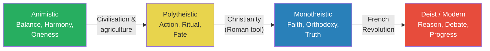
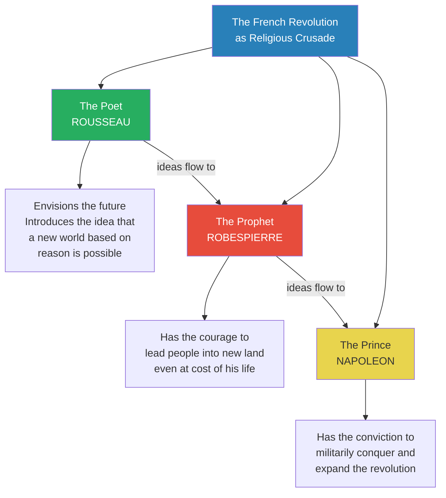
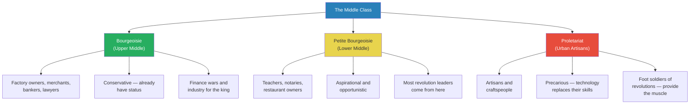
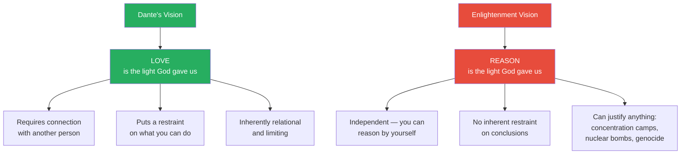
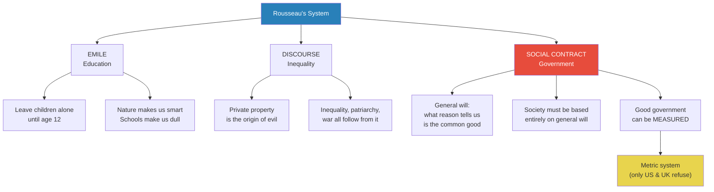
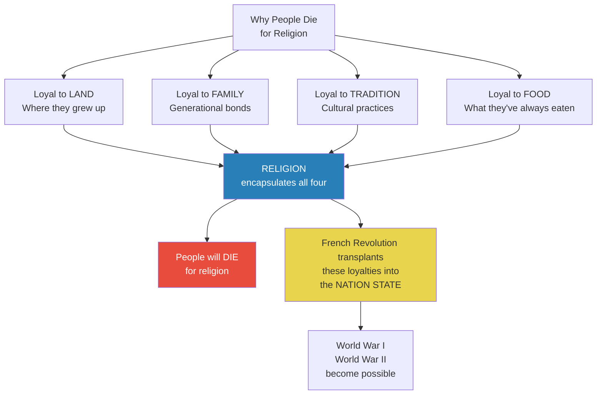

# The Revolution of Reason

> Prof. Jiang opens a three-part series on the French Revolution — which he calls the most significant event in human history — by tracing the intellectual foundations that made it possible. He maps four successive worldviews (animistic, polytheistic, monotheistic, deist) and argues that the Enlightenment was not an abstract philosophical movement but a new middle-class identity built on reason, debate, and progress. Through Descartes, Goethe, Kant, and Rousseau, he shows how European thinkers replaced faith with doubt, orthodoxy with open debate, and divine truth with measurable progress — ideas that would fuel the most radical revolution in history.

---

## Overview: Key Highlights

- <b style="color: #27ae60">The French Revolution is the most radical turning point in human history</b> — the moment humanity attempted to replace an entire religious worldview with one based on reason
- <b style="color: #2980b9">Four worldviews</b> — animistic (balance/harmony/oneness), polytheistic (action/ritual/fate), monotheistic (faith/orthodoxy/truth), deist (reason/debate/progress)
- <b style="color: #e74c3c">Each new worldview believes itself superior and tries to crush the previous one</b> — this pattern of displacement drives conflict throughout human history
- <b style="color: #2980b9">Poet, Prophet, Prince</b> — the French Revolution required three types of genius: Rousseau (the poet), Robespierre (the prophet), Napoleon (the prince)
- <b style="color: #27ae60">The Enlightenment was a middle-class identity project</b> — the bourgeoisie, petite bourgeoisie, and proletariat adopted reason, education, and morality to distinguish themselves from both nobility and peasantry
- <b style="color: #2980b9">Cogito ergo sum</b> — Descartes's "I doubt, therefore I am" made individual reason more powerful than church, dogma, or society
- <b style="color: #e74c3c">Reason vs. love</b> — the Enlightenment chose reason over Dante's love as the central organising principle, and Prof. Jiang warns this difference has enormous consequences
- <b style="color: #27ae60">Goethe's Faust reimagines the Book of Job</b> — God loves human curiosity and will always protect those who strive, even when they fail
- <b style="color: #2980b9">Kant's absolutist freedom</b> — enlightenment requires absolute freedom of expression; censorship of any kind denies reason
- <b style="color: #e74c3c">Rousseau's general will</b> — the idealistic belief that rational citizens will naturally converge on the common good, which becomes the basis for the French Revolution's most dangerous excesses
- <b style="color: #27ae60">Rousseau invented childhood</b> — the idea that children should play until age 12, not be sent to school, comes directly from Emile
- <b style="color: #2980b9">The social contract</b> — "Man is born free, and everywhere he is in chains" — the Bible of the French Revolution

| Concept | One-line summary |
|---------|-----------------|
| **Four worldviews** | Animistic → polytheistic → monotheistic → deist: each displaces the previous |
| **Deism** | God created the universe, left, and gave us reason to discover its perfect laws |
| **Poet, Prophet, Prince** | The three types of genius required for revolution: visionary, leader, conqueror |
| **Bourgeoisie** | Wealthy urban elite (merchants, bankers, lawyers) — conservative, already have status |
| **Petite bourgeoisie** | Aspirational middle class (teachers, notaries, provincial lawyers) — the thought leaders of revolutions |
| **Proletariat** | Urban artisans and craftspeople whose livelihoods are precarious — the muscle of revolutions |
| **Cogito ergo sum** | "I doubt, therefore I am" — the self as the foundation of knowledge |
| **General will** | What all citizens would agree on if they reasoned purely from common interest |
| **Particular will** | What individuals want based on group identity and self-interest |
| **The social contract** | Rousseau's framework for a society based entirely on general will and reason |
| **Salons** | Bourgeois gatherings organised by wealthy women where Enlightenment ideas spread |
| **Metric system** | Product of the French Revolution's belief that good government can be measured |

---

# The Lecture

## The Four Worldviews of Human History [0:00 - 9:41]

*Prof. Jiang opens by placing the French Revolution within the largest possible frame — the entire history of human belief systems. He maps four successive worldviews, each with three defining principles, and argues that the transition from monotheism to deism is the most radical shift of all.*

> [!tip] Core Insight
> The French Revolution was not a political event. It was a religious crusade — the attempt to replace an entire worldview (monotheism) with a new one (deism) built on reason, debate, and progress.

*Each transition replaces three core principles. The green node (animism) is the most natural — "if animals had a religion, it would be animistic." The red node (deism) is the most radical departure from everything that came before.*

> [!note]- Expand: Full Lecture Detail
> Prof. Jiang begins with a sweeping claim: the French Revolution is the most significant event in human history. He explains why by mapping the religious worldviews that underpin all of civilisation:
>
> - <b style="color: #2980b9">Animistic worldview</b> — the Ice Age hunter-gatherer belief system, built on three ideas:
>   - **Balance** — all things exist in equilibrium
>   - **Harmony** — humans are not separate from plants and animals
>   - **Oneness** — life and death are part of the same continuous cycle; death was not feared
>   - Prof. Jiang calls this "the most natural worldview — if animals had a religion, it would probably be animistic"
>
> - <b style="color: #2980b9">Polytheistic worldview</b> — emerged with civilisation and mass society, built on:
>   - **Action** — living with courage and purpose
>   - **Ritual** — behaving as the community expects
>   - **Fate** — no one, not even the gods, escapes their destiny
>   - Prof. Jiang invokes Hector facing Achilles: "He knows he is going to get killed. He shakes. But he still confronts his fate and dies. That's what's expected of you."
>
> - <b style="color: #2980b9">Monotheistic worldview</b> — Jews, Christians, Muslims, built on:
>   - **Faith** — belief in an eternal truth called God
>   - **Orthodoxy** — a set of beliefs you cannot question
>   - **Truth** — living according to unquestionable doctrine
>
> - <b style="color: #2980b9">Deist / Modern worldview</b> — God created the universe, then left:
>   - **Reason** — the gift God gave us before departing; through logic, intuition, and scepticism, we can understand how the world works
>   - **Debate** — reason alone is insufficient; the "marketplace of ideas" allows truth to emerge through public discourse
>   - **Progress** — if we exercise reason and engage in debate, society will continuously improve
>
> Prof. Jiang makes two critical observations:
>
> - <b style="color: #e74c3c">All four worldviews still exist today</b> — the monotheists remain dominant, competing with the modernist "educated elite"
> - <b style="color: #e74c3c">No worldview is inherently superior</b> — but each new one believes it is, and tries to crush the previous ones. "This has led to a lot of conflict throughout human history."
>
> The structural changes driving the transition to modernity:
>
> | Transition | From | To |
> |-----------|------|-----|
> | Political | Feudalism | Nation state (first absolute monarchy, then republic) |
> | Economic | Rural / Agriculture | Urban / Industry |
> | Intellectual | Religion | Science |

---

## The French Revolution as Religious Crusade [9:41 - 13:00]

*Prof. Jiang introduces the thesis for the three-lecture series: the French Revolution was a religious crusade requiring three types of genius — the poet, the prophet, and the prince — and without the cooperation of all three, it would have failed against impossible odds.*

*Without the active cooperation of all three — poet, prophet, prince — the revolution would have failed. Each built on the previous one's work.*

> [!note]- Expand: Full Lecture Detail
> Prof. Jiang frames the next three lectures as a single argument:
>
> - **Lecture 46 (today):** Rousseau, the poet — the one who introduces the idea that a new world based entirely on reason is possible
> - **Lecture 47:** Robespierre, the prophet — the one who has the courage to lead the people into the new world, even at the cost of his own life
> - **Lecture 48:** Napoleon, the prince — the one who militarily expands the revolution and conquers a new world
>
> He emphasises the impossible odds:
>
> - The revolutionaries were not just fighting the French aristocracy
> - They were fighting the entire world — Britain, Prussia, Russia, Austria
> - "Everyone wanted to destroy the revolution before it threatened their nations"
> - <b style="color: #27ae60">The revolution succeeded only because of the cooperation of these three types of genius</b>
>
> The chain of ideas he traces from the broader course:
>
> - Dante's Divine Comedy was a prophecy — a new understanding of the world
> - It unleashed three movements: the Renaissance, the Reformation, and the Scientific Revolution
> - Combined with the gunpowder revolution, these produced massive structural changes

---

## The Rise of the Middle Class [13:00 - 29:17]

*Prof. Jiang explains how structural changes in European society created an entirely new group of people — the middle class — who adopted Enlightenment principles of reason, debate, and progress as their group identity, distinguishing themselves from both the nobility above and the peasantry below.*

> [!tip] Core Insight
> The Enlightenment was not an abstract intellectual movement. It was a new group of people — the middle class — seeking a group identity. They adopted reason, education, and morality to differentiate themselves from everyone else.

*The middle class is not a monolith. The bourgeoisie are conservative, the petite bourgeoisie provide revolutionary thought leaders, and the proletariat provide the violence. Their loyalties shift depending on circumstances.*

> [!note]- Expand: Full Lecture Detail
> Prof. Jiang traces how structural changes — feudalism to nation, rural to urban, religion to science — created new groups of people:
>
> - Previously, European society had two major groups: the **nobility/clergy** (intermarried, same families) and the **peasants/slaves**
> - The gunpowder revolution, urbanisation, and trade created a third force: the middle class
>
> He divides the middle class into three categories:
>
> - <b style="color: #2980b9">Bourgeoisie</b> (from German "Burger" — leading citizens of a town):
>   - Factory owners, merchants, traders, bankers, lawyers
>   - "The elite" of the middle class
>   - Tend to be **conservative** — they already have status
>   - The king and nobility increasingly depend on them for financing wars, roads, industry
>   - Most heavily taxed, but "usually happy with the way things are"
>
> - <b style="color: #2980b9">Petite bourgeoisie</b>:
>   - School teachers, restaurant owners, notaries — "not rich, but slightly middle class"
>   - **Aspirational and opportunistic** — "they're not happy with their lives, they want more"
>   - "Most of the leaders of the French Revolution, the most radical members, were provincial lawyers — not part of the elite bourgeoisie, but the provincial elite"
>   - Mao Zedong was petite bourgeoisie — "a provincial elite, not a Beijing elite"
>
> - <b style="color: #2980b9">Proletariat</b>:
>   - Artisans, craftspeople, urban specialists
>   - <b style="color: #e74c3c">Their lives are precarious</b> — new technology (sewing machines) replaces their skills
>   - "Most likely tend towards violence — they are the foot soldiers of revolutions"
>   - "The petite bourgeoisie are the thought leaders, but the proletariat provide the muscle"
>
> Critical qualifications:
>
> - These categories are not strict — lots of interchange between groups
> - Loyalties change according to circumstance
>
> > [!example] The Counterintuitive Civil War Inside the French Revolution
> > - The French Revolution wanted to destroy the Catholic religion
> > - The peasants loved their religion and wanted to protect their priests
> > - Result: a massive civil war between peasants and proletariat
> > - "That would be counterintuitive — why would poor people be fighting against poor people? Because they have different religious interests."
> > **The lesson:** Class interest does not always override religious identity. People die for their religion because it encapsulates everything they know and love — land, family, tradition, food.
>
> The middle class identity project had three pillars:
>
> | Pillar | Meaning | Why it matters |
> |--------|---------|---------------|
> | **Education** | Reading books, newspapers, accessing information | Differentiates from illiterate nobility and peasantry |
> | **Achievement** | Striving for children to live better lives | Peasants don't believe in progress; nobility don't care |
> | **Morality** | Sexual purity, the invention of childhood | Having enough resources to "protect our bodies" — distinguishes from the desperate poor |
>
> - The concept of **childhood** — giving children a childhood instead of sending them to work at age 6 — comes from this period
> - <b style="color: #27ae60">"The Enlightenment was basically a movement in which a new group of people adopted the ideas of science in order to create a new middle class identity — and it still exists today"</b>

---

## Descartes and the Power of Doubt [29:17 - 39:10]

*Prof. Jiang introduces the first major Enlightenment thinker — Rene Descartes — whose Meditations on First Philosophy established that individual reason is more powerful than any church, dogma, or tradition. The key insight: it is not "I think, therefore I am" but "I doubt, therefore I am."*

> [!tip] Core Insight
> Descartes's revolution was not the discovery of reason. It was the declaration that one individual's capacity to doubt is more powerful than every institution in the world — more powerful than the Church, more powerful than society itself.

> [!note]- Expand: Full Lecture Detail
> Prof. Jiang reads passages from Descartes's *Meditations on First Philosophy* and unpacks their significance:
>
> - Descartes asks two questions: How do we know God exists? How do we know the soul exists?
>
> - **The process of self-examination:**
>   - "It is some years now since I realised how many false opinions I had accepted as true from childhood onwards"
>   - "The whole structure would have to be utterly demolished, and I would have to begin again from the bottom up"
>   - <b style="color: #e74c3c">This is a radical departure</b> — previously, you knew something was true because an authority said it. "That's the practice here we use in China — Confucius said this, so this must be true."
>   - Descartes says no: "I myself have the capacity to know if something is true, and I have a responsibility to reflect and question everything I know"
>
> - **The discovery of doubt as foundation:**
>   - Everything is potentially false — How do we know the sky is blue? How do we know the sky exists? We don't.
>   - But the process of doubting itself cannot be doubted
>   - <b style="color: #2980b9">"I doubt, therefore I am"</b> — the Latin is *cogito ergo sum*
>   - "The thing that I know to be absolutely true is my capacity to doubt, and that is who I am"
>   - The capacity to doubt **is** the soul
>
> - **From doubt to God:**
>   - If God didn't exist, we would not have the capacity to doubt — someone must have given it to us
>   - But God could be a trickster — so how do we know God is good?
>   - Descartes's answer: God is perfect, therefore incapable of fault — "obviously this is a tautology, but what's important is the process"
>
> - <b style="color: #27ae60">"The idea of reason is the most powerful force in the world — more powerful than a church, more powerful than dogma, more powerful than society itself"</b>
>
> Prof. Jiang pauses to note the critical difference between Enlightenment and Dante:
>
> - <b style="color: #e74c3c">Dante said love is the light God gave us. The Enlightenment says reason is the light.</b>
> - Love requires connection with another person — it "puts a restraint on your reason"
> - Reason is independent — "you can by yourself reason out things"
> - "If you're capable of reasoning by yourself, you can reason anything — including concentration camps, nuclear bombs, genocide"
> - <b style="color: #e74c3c">"There's a huge difference between love and reason, and it's really important that the Enlightenment thinkers see reason as the central organising principle — and not love"</b>

---

## Love vs. Reason: Dante and the Enlightenment [29:17 - 31:00]

*Prof. Jiang draws a sharp line between Dante's vision and the Enlightenment's — love requires connection and restraint, while reason is independent and unlimited. This distinction, he argues, will have catastrophic consequences.*

*This diagram is the intellectual hinge of the entire three-lecture series. Dante's love constrains; the Enlightenment's reason does not. Prof. Jiang will trace the consequences through Robespierre's Terror and Napoleon's conquests.*

---

## Goethe's Faust: God Loves the Curious [39:10 - 53:00]

*Prof. Jiang reads from Goethe's Faust — the greatest work of German literature — showing how it reimagines the Biblical Book of Job into an optimistic Enlightenment parable: God loves human curiosity, and those who strive will always be saved.*

> [!note]- Expand: Full Lecture Detail
> Prof. Jiang frames Faust as a rewriting of the Book of Job:
>
> - **The Book of Job** — God allows Satan to destroy a faithful man's life to prove a point:
>   - Job is wealthy, devout, generous — God is proud of him
>   - Satan bets God that Job is only faithful because he's rich
>   - God allows Satan to destroy everything except Job's life
>   - Job eventually curses God; God appears and says: "How dare you question me?"
>   - God restores Job's health and wealth — "a very strange story meant to inspire fear"
>
> - **Goethe's Faust reimagines this into something radically different:**
>   - Faust is a professor who loves learning but feels his book knowledge doesn't give him access to truth
>   - Mephistopheles (Satan) tells God: "The worst thing you ever did was allow humans the capacity to reason — they're stupid, and reason just confuses them"
>   - God responds: "Have you met Faust? He's my favourite person. He's curious. Eventually he will discover the truth."
>   - <b style="color: #27ae60">The bet reverses Job's: Mephistopheles bets he can make Faust complacent — stop striving, lose curiosity</b>
>   - If Faust ever says to a moment "Stay a while, you are so lovely" — his soul belongs to Mephistopheles
>
> - **Faust's journey:**
>   - He falls in love with Gretchen; tragedy follows — her mother dies, her brother dies, her baby dies, she dies in prison
>   - He becomes a civil servant, builds cities, serves the government
>   - He marries Helen of Troy, travels through time
>   - Through all of it, he keeps striving
>
> - **The climax:**
>   - Old and dying, Faust takes pride in his work building livable cities
>   - "Let me make room for many a million — not wholly secure, but free to work on green, fertile fields"
>   - He says the fatal words: "Stay a while — you are so lovely"
>   - <b style="color: #e74c3c">He has lost the bet — he found a moment of contentment</b>
>
> > [!quote] Faust's Final Speech
> > "He only earns his freedom and existence who is forced to win them freshly every day."
>
> - **But God saves him anyway:**
>   - Angels appear and steal Faust's soul from Mephistopheles
>   - Mephistopheles: "They've stolen a great and unique treasure — that noble soul mortgaged to my pleasure!"
>   - <b style="color: #27ae60">The message: God loves us, wants us to be curious, to challenge ourselves. "No matter how many stupid things we do, God will always protect us."</b>
>   - "God is ultimately about forgiveness and love and mercy and kindness and generosity"
>
> Prof. Jiang notes that Goethe is invoking Dante — "Remember, Dante says love is the light of heaven. Here Goethe says it's reason." Faust is, in many ways, a rewriting of the Divine Comedy.

---

## Kant's Absolute Freedom [53:00 - 1:01:20]

*Prof. Jiang introduces Immanuel Kant — "the greatest philosopher who ever lived" — through his essay "What Is Enlightenment?", which argues that laziness and cowardice, not lack of intelligence, prevent people from thinking for themselves, and that the solution is absolute freedom of expression.*

> [!note]- Expand: Full Lecture Detail
> Prof. Jiang reads and unpacks Kant's "What Is Enlightenment?":
>
> - <b style="color: #2980b9">"Enlightenment is man's emergence from his self-imposed nonage"</b>
>   - Nonage = the inability to use one's own reasoning without another's guidance
>   - It is **self-imposed** — not because people lack understanding, but because of "indecision and lack of courage"
>   - The motto of Enlightenment: *Sapere aude* — **"Dare to know"**
>
> - Prof. Jiang makes it personal:
>   - "I'm enlightened because I'm using my reason. You're not enlightened because you're relying on my reason."
>   - "It's not because you lack the capacity. It's because you're lazy — it's just easier to sit there and take notes"
>
> - Kant's diagnosis:
>   - "Laziness and cowardice are the reasons why such a large part of mankind gladly remain minors their lives long"
>   - People grow to **like** their dependence — "He has even grown to like it"
>
> - **The solution: free and open debate**
>   - "If the public is only given freedom, enlightenment is almost inevitable"
>   - "There will always be a few independent thinkers, even among the self-appointed guardians of the multitude"
>   - <b style="color: #27ae60">Kant argues for absolute freedom of expression — even hate speech — because "people have reason and therefore the capacity to judge for themselves what is true"</b>
>   - "Whenever you censor something, you are denying freedom to people"
>
> - **The teacher's dilemma:**
>   - Prof. Jiang uses himself as an example: "I can see myself as an employee of a school in China — I must be aware of censorship laws, my responsibility is to make you feel good about China"
>   - "Or I can see myself as a citizen of the world, dedicated to the progress of human civilisation"
>   - "That's your choice — employee making money in the service of others, or citizen dedicated to progress"
>
> - **Kant's most radical statement:**
>   - <b style="color: #e74c3c">"An epoch cannot conclude a pact that will commit succeeding ages, prevent them from increasing their significant insights, purging themselves of errors, and generally progressing in enlightenment. That would be a crime against human nature."</b>
>   - No generation has the right to tell the next generation what to think
>   - "Progress is determined by a new generation's capacity to question and negate previous generations' ideas"

---

## Rousseau: The Poet of the Revolution [1:01:20 - 1:21:26]

*Prof. Jiang moves to Jean-Jacques Rousseau — the most influential Enlightenment thinker in France — covering three works: Emile (the invention of childhood), Discourse on the Origin of Inequality (private property as the root of all evil), and The Social Contract (the Bible of the French Revolution).*

> [!tip] Core Insight
> Rousseau's three books form a single argument: nature made us free and good; civilisation enslaved and corrupted us; a social contract based on reason and the general will can restore our freedom. This argument — idealistic, radical, measurable — becomes the operating system of the French Revolution.

*Rousseau's three books map onto three domains: how to raise children, why society is corrupt, and how to rebuild it from first principles. The social contract's insistence on measurability gives us the metric system — and the French Revolution's most dangerous overconfidence.*

> [!note]- Expand: Full Lecture Detail
> **Emile — The Invention of Childhood:**
>
> - Rousseau's central claim: before age 12, the faculty of reason has not fully developed
>   - "It's like me asking you to fly even though you don't have wings"
>   - "If a child is crawling and you make a child walk, all that's going to do is make the bones deform"
> - <b style="color: #27ae60">The radical prescription: do not teach children anything before age 12</b>
>   - "Education of the earliest years should be merely negative" — keep them safe, but don't teach mathematics
>   - "If only you could bring your scholar to the age of 12 strong and healthy, but unable to tell his right hand from his left — the eyes of his understanding would be open to reason"
>   - "By doing nothing to begin with, you would end with a prodigy of education"
> - Prof. Jiang notes: "The very idea of childhood comes from Rousseau — I myself believe very heavily in this idea. I don't want to send my kids to school before age 12, possibly even age 16."
>
> - **The savage vs. the peasant:**
>   - Both are physically active; neither cultivates the mind — yet the savage is sharp and the peasant is dull
>   - The peasant does what he's told, following habit — "he is the creature of habit, almost an automaton"
>   - The savage is free: "He knows no law but his own will — he is therefore forced to reason at every step"
>   - <b style="color: #27ae60">"If you want to educate your child well, let the child be a savage and not a peasant"</b>
>
> > [!quote] Rousseau
> > "O Man, seek no further for the author of evil — thou art he."
>
> - Schools are not designed to educate children: "Schools are first and foremost designed to control children. They're meant for adults, so that parents don't have to deal with them."
>
> ---
>
> **Discourse on the Origin of Inequality — Private Property:**
>
> - <b style="color: #e74c3c">"The first man who, having enclosed a piece of ground, bethought himself of saying 'This is mine' — was the real founder of civil society"</b>
> - We should have rejected private property from the start: "Beware of listening to this impostor! You're undone if you forget that the fruits of the earth belong to us all, and the earth itself to nobody"
> - Because we didn't, we now have inequality, patriarchy, and war
>
> ---
>
> **The Social Contract — The Bible of the Revolution:**
>
> - Opens with the most famous sentence: <b style="color: #2980b9">"Man is born free, and everywhere he is in chains"</b>
> - The key distinction:
>   - **General will** — what all citizens would agree on if they reasoned purely from common interest
>   - **Particular will** — what individuals want based on group affiliation and self-interest
>
> > [!example] The Road-Building Analogy
> > - China's central government has $10 billion for new roads — where should it go?
> > - General will: invest where roads are most needed — perhaps Guizhou or Yunnan, the poorest parts
> > - Particular will: if you're in Beijing, you say "put the money in Beijing"
> > - A good society must be based entirely on the general will — negating particular will
> > **The lesson:** If laws are based on general will, they are acceptable to everyone because they express what reason tells us is the common good. The problem: "that's not how the world works."
>
> - Prof. Jiang flags the critical divergence:
>   - <b style="color: #e74c3c">The French Revolution is fundamentally idealistic</b> — it believes people are capable of considering the common interest
>   - <b style="color: #27ae60">The American Revolution denies this</b> — it assumes people will always act on particular will, and designs institutions accordingly
>
> - Rousseau's most dangerous idea: **good government can be measured**
>   - "Count, measure, compare" — the sign of good government is population growth
>   - This leads directly to the metric system — "used by every country in the world except two: America and Britain — the countries most against the French Revolution"
>
> - **Separation of church and state:**
>   - "Christianity preaches only servitude and dependence. Its spirit is so favourable to tyranny that it always profits by such a regime."
>   - Rousseau advocates a new state religion based on reason — few, simple dogmas
>   - <b style="color: #e74c3c">This new religion of reason must reject all other religions because they are intolerant of each other</b>
>   - Prof. Jiang connects this to modern France: "There's so much conflict with Islamic immigrants because the French state insists on secular religion, but the Islamists want to practise their own religion"

---

## Why Peasants Die for Religion [1:21:26 - 1:25:20]

*A student asks why peasants are so loyal to religion. Prof. Jiang's answer reveals the deep psychology beneath the intellectual history — religion is not a set of beliefs but an encapsulation of everything people love: land, family, tradition, and food.*

*Religion is not an abstraction. It is the container for everything concrete that people love. The French Revolution's genius — and its danger — was transplanting these same loyalties from religion into the nation state.*

> [!note]- Expand: Full Lecture Detail
> A student asks: why are peasants so loyal to religion?
>
> Prof. Jiang answers by working from first principles:
>
> - People are loyal to their **home** — "most people in the world don't want to move"
> - People are loyal to their **family**
> - People are loyal to their **tradition and culture**
> - People are loyal to their **food** — "if you grew up eating rice, you don't want potatoes"
>
> - The deeper reason: **people are creatures of habit**
>   - "When you do something out of habit, you feel good about yourself. When you break this habit, you feel bad."
>   - "The only way you know something is good or bad is how you feel about it"
>   - You eat rice and you're happy; someone tells you potatoes are more nutritious and cheaper — "you don't care"
>
> - <b style="color: #27ae60">Religion encapsulates all of these things</b> — culture, food, family practice, connection to land
>   - "That's why people will die for religion — because religion is really a metaphor or an encapsulation of all these things that people understand and know and love"
>
> - The French Revolution's transformation:
>   - <b style="color: #2980b9">The nation state becomes the new container for these loyalties</b>
>   - "What the French Revolution will do is a process where religion becomes part of the nation"
>   - "People also die for the nation — that's why you have World War One, World War Two"
>   - "It starts during the French Revolution"

---

## A Religion Based on Reason? [1:25:20 - end]

*A final student question challenges the lecture's central tension: how can a religion be based on reason? Prof. Jiang's answer reveals both the logic and the fragility of Rousseau's vision — a set of minimal beliefs deduced from first principles, universal precisely because they are rational.*

> [!note]- Expand: Full Lecture Detail
> The student asks: how can a religion be based on reason?
>
> Prof. Jiang explains the logic:
>
> - Traditional religion: God tells us what to believe through priests
> - Rousseau's alternative: "You have reason, and therefore you have the capacity to access God — you don't need priests"
> - "We can just think reasonably about what religion should be like, and from first principles deduce the religion"
>
> - What reason produces:
>   1. There is a God
>   2. There is heaven and hell — do good things, go to heaven; do bad things, go to hell
>   3. Good people go to heaven, therefore you should do good
>   4. If you believe these things, you are free to believe anything else that doesn't contradict them
>
> - <b style="color: #27ae60">"Just from general principles, just if you're able to exercise reason by yourself, you should be able to deduce the basic principles of an organised state religion"</b>
>
> - This becomes the basis for the French Revolution's attempt to create a new civic religion
>
> Prof. Jiang closes: "Next class we will do Robespierre" — the prophet who will attempt to put these ideas into practice.

---

## Connections

**Builds on:** [[29 - Dante's Divine Comedy and the Liberation of the Human Imagination]] (love as the light of heaven — directly contrasted with the Enlightenment's reason), [[42 - The Protestant Reformation and the Birth of Capitalism]] (Weber's anxiety, religion-to-science transition), [[43 - The Structure of Scientific Revolutions]] (Kuhn's paradigm shifts, monotheism's theological assumptions enabling science), [[44 - The Spanish Conquest of the New World]] (religion as operating system — destroying it crashes the civilisation)
**Sets up:** [[47 - The Passion of Robespierre]] (Robespierre as the prophet who attempts to implement Rousseau's vision), [[48 - Napoleon's Empire of Myth]] (Napoleon as the prince who militarily expands the revolution)
**Related books in vault:** [[Sapiens - Yuval Noah Harari]] (four worldview transitions, agricultural revolution), [[The 48 Laws of Power - Robert Greene]] (the dynamics of power among competing social groups)

---

## The Takeaway

This lecture reframes the Enlightenment from a story about great thinkers having brilliant ideas to a story about a new social class building a new identity. The bourgeoisie, petite bourgeoisie, and proletariat did not adopt reason, debate, and progress because those ideas were obviously correct. They adopted them because they needed something to distinguish themselves from both the nobility above and the peasantry below. Education, achievement, and morality were not universal values — they were competitive markers. The Enlightenment was, at its core, a branding exercise for the middle class, and it succeeded because it gave millions of people a way to feel superior to everyone else.

The most consequential insight is Prof. Jiang's distinction between Dante's love and the Enlightenment's reason as organising principles. Love requires connection — you cannot love in isolation. Reason is independent — you can reason your way to any conclusion, including genocide. This is not a throwaway observation. Prof. Jiang is setting up the entire arc of the next two lectures: Robespierre's Terror and Napoleon's wars are not betrayals of the Enlightenment but its logical consequences. When you build a civilisation on reason without the constraint of love, there is no internal brake on where reason takes you.

The question left open is whether the Enlightenment's replacement of love with reason was a choice or a necessity. The middle class needed reason because reason is democratic — anyone can reason, but not everyone can love in the transcendent way Dante describes. If reason is the only organising principle accessible to mass society, then the horrors that follow from it may be the unavoidable price of modernity itself. Prof. Jiang promises the next lecture on Robespierre will show what happens when a prophet tries to build a new world on pure reason — and the world resists.
