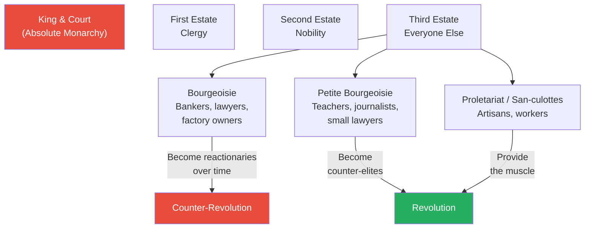
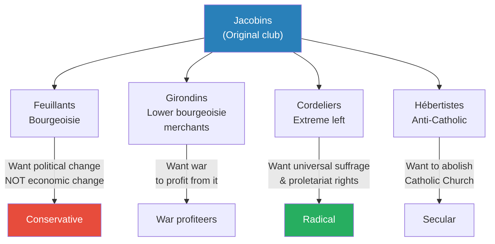
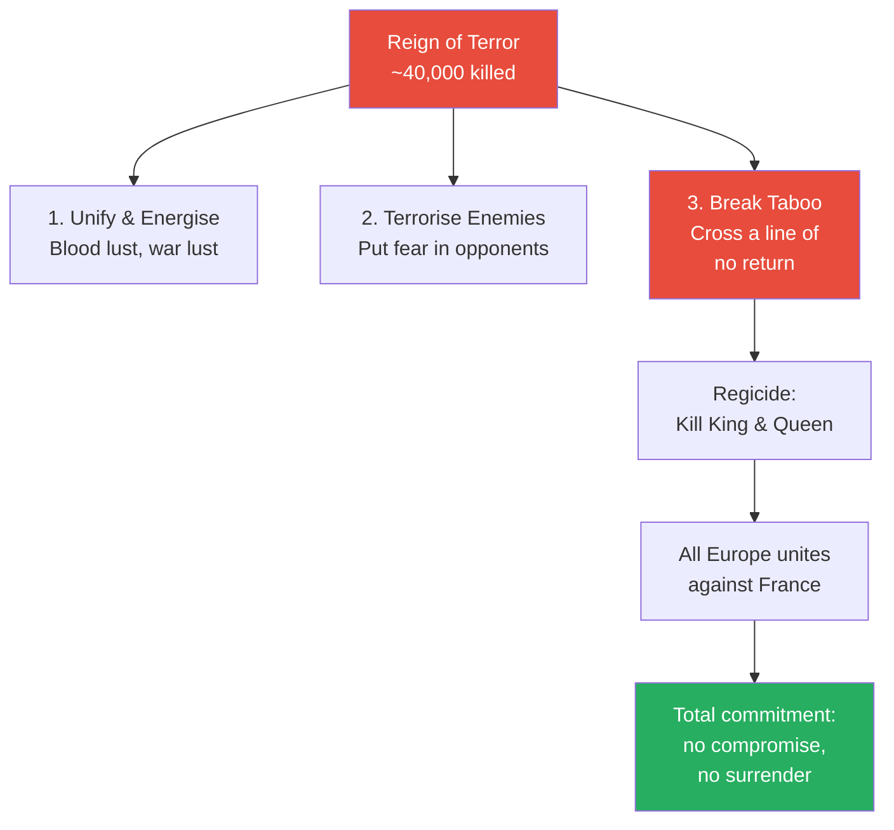
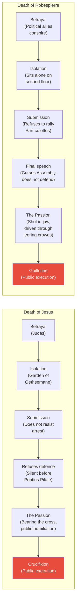
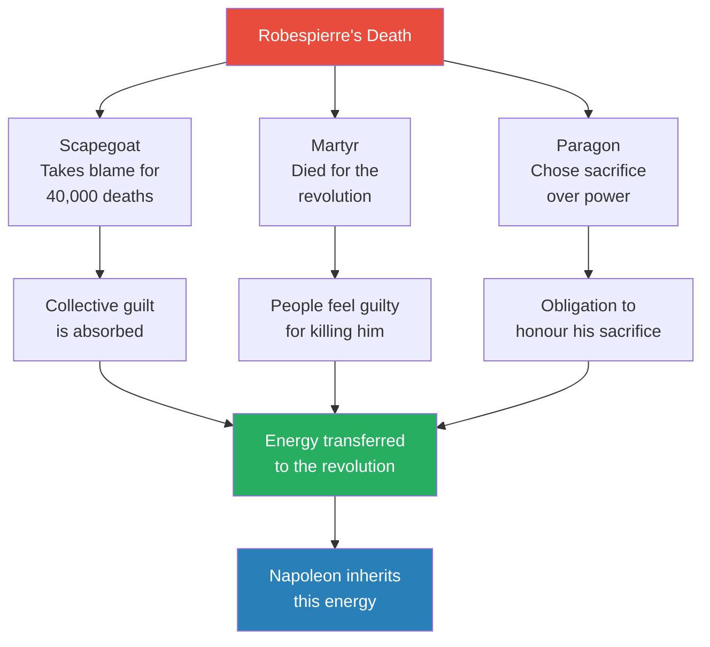
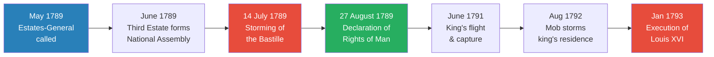
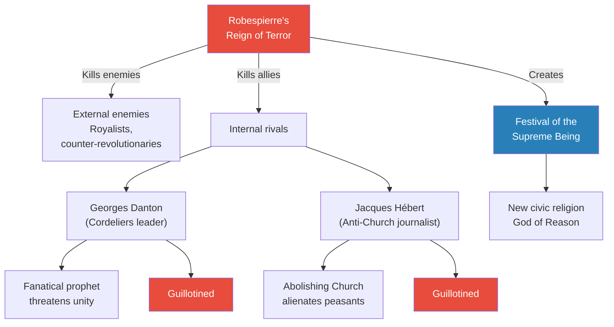
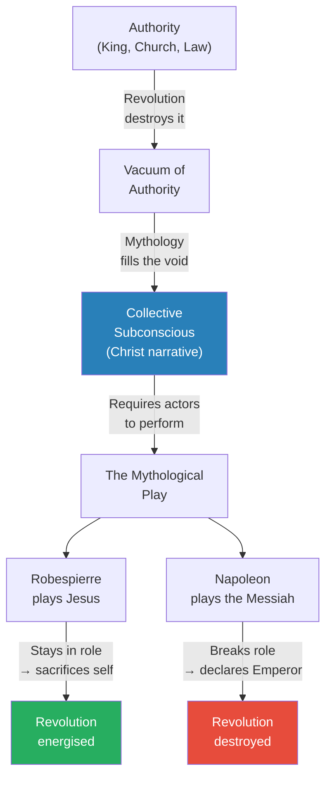

# The Passion of Robespierre

> Prof. Jiang presents a provocative original argument: Maximilien Robespierre deliberately modelled his death on the Passion of Christ. As the de facto leader of the French Revolution, Robespierre had the power to seize the crown — yet he chose seclusion, submission, and execution instead. Prof. Jiang argues that when a revolution destroys all authority, mythology becomes society's subconscious operating system. The Christ story — betrayal, isolation, submission, public execution — was the mythology every French person carried, and Robespierre enacted it to transform himself into scapegoat, martyr, and paragon of virtue, purifying the revolution's violent energy and creating the conditions for Napoleon's emergence.

---

## Overview: Key Highlights

- <b style="color: #27ae60">Robespierre modelled his death on the Passion of Christ</b> — betrayal, isolation, submission, and public execution mirror the Gospel narrative step by step
- <b style="color: #2980b9">Mythology as subconscious operating system</b> — when authority collapses, a society's deep mythological narratives take over and guide collective behaviour
- <b style="color: #e74c3c">The Reign of Terror killed at least 40,000 people</b> — including political allies, the king, and the queen, serving as revolutionary human sacrifice
- <b style="color: #27ae60">Robespierre's three transformations upon death</b> — he became scapegoat (absorbing collective guilt), martyr (dying for the revolution), and paragon (setting an example of virtue)
- <b style="color: #2980b9">Three purposes of human sacrifice</b> — unify and energise the people, terrorise the enemy, and break a taboo to make retreat impossible
- <b style="color: #e74c3c">Breaking the taboo of regicide</b> — killing the king united all five major European powers against France, making total commitment the only option
- <b style="color: #2980b9">The Declaration of the Rights of Man (1789)</b> — established popular sovereignty, freedom of expression, separation of church and state, and property rights
- <b style="color: #27ae60">Robespierre's critique of sacred property</b> — property requires oppression of others and therefore cannot be a God-given right
- <b style="color: #e74c3c">Napoleon broke the mythological play by declaring himself Emperor</b> — seizing the crown violated the role Robespierre had defined, and destroyed the revolution
- <b style="color: #2980b9">Petite bourgeoisie</b> — the social class between bourgeoisie and proletariat (teachers, journalists, small lawyers) from which Robespierre emerged
- <b style="color: #27ae60">The revolution's energy had to be purified</b> — the Reign of Terror unleashed polluted energy based on violence and hatred; Robespierre's self-sacrifice cleansed it
- <b style="color: #e74c3c">Every prophet is full of doubt</b> — Robespierre never explicitly declared himself a prophet; his leap of faith under uncertainty is what makes his act heroic

| Concept | One-line summary |
|---------|-----------------|
| **Mythology as operating system** | When authority is rejected, the collective subconscious — shaped by mythology — guides society's behaviour |
| **The Passion** | The suffering and death of a messianic figure, enacted publicly to redeem the community |
| **Scapegoat** | Someone who absorbs the collective guilt of a community's crimes, freeing others to move forward |
| **Reign of Terror** | Mass execution campaign (1793-1794) designed to purge enemies, energise supporters, and break the taboo of retreat |
| **Human sacrifice (revolutionary)** | Public killing that unifies the people, terrorises enemies, and breaks taboos — same function as Aztec or Roman sacrifice |
| **Breaking taboo** | Crossing an irreversible boundary (regicide) that eliminates compromise and forces total commitment |
| **Petite bourgeoisie** | The middle stratum between bourgeoisie and proletariat — schoolteachers, journalists, small lawyers, notaries |
| **San-culottes** | The urban working class ("without breeches") who provided the revolutionary muscle |
| **Jacobins** | The political club that became the revolution's ideological engine, later splintering into competing factions |
| **Declaration of Rights of Man** | The 1789 constitutional document establishing equality, liberty, popular sovereignty, and freedom of expression |
| **Festival of the Supreme Being** | Robespierre's new civic religion replacing Catholicism with a God of Reason |
| **The mythological play** | Revolution as drama requiring actors to play assigned roles — the play dies if anyone breaks character |

---

# The Lecture

## Review: The Social Structure of Revolutionary France [0:00 - 9:22]

*Prof. Jiang opens by connecting this lecture to the previous one on Rousseau, who provided the dream of the revolution — a promised land of reason. Robespierre, he tells the class, is the prophet who will take his people into that promised land. He then reviews the class structure of revolutionary France and the political dynamics that made revolution inevitable.*

*The three layers of the Third Estate have fundamentally different interests. The bourgeoisie initially support revolution for political power but become reactionaries when their economic interests are threatened. The petite bourgeoisie become the counter-elites — the ideological leaders. The proletariat provide the physical force.*

> [!note]- Expand: Full Lecture Detail
> - Prof. Jiang begins by situating the lecture within the French Revolution trilogy: Rousseau (the philosopher-poet who provided the dream), Robespierre (the prophet), and Napoleon (next class — the conqueror)
> - He previews his central argument: <b style="color: #27ae60">Robespierre saw himself as the Second Coming of Jesus, and sacrificed himself to save the French Revolution</b>
> - He acknowledges this is controversial and promises to work through it slowly with evidence
> - Prof. Jiang reviews the class structure of pre-revolutionary France:
>   - The traditional division: peasants/poor/slaves at the bottom, nobility and clergy at the top
>   - The gunpowder revolution drove industrialisation, expanding the middle class in numbers, influence, and power
>   - The middle class is extremely diverse, simplified into three categories:
>     - <b style="color: #2980b9">Bourgeoisie</b> — the elite of the town: bankers, lawyers, doctors, factory owners, merchants
>     - <b style="color: #2980b9">Proletariat</b> — the lower class of the town: artisans and workers, often the majority
>     - <b style="color: #2980b9">Petite bourgeoisie</b> — stuck in between: schoolteachers, journalists, small lawyers, notaries, small business owners
> - He explains the revolutionary pattern seen throughout history:
>   - The petite bourgeoisie become the <b style="color: #2980b9">counter-elites</b> — they need the people to revolt against the existing elites
>   - The proletariat become the muscle or army of the revolution
>   - <b style="color: #e74c3c">The bourgeoisie initially support revolution for political power, but become reactionaries once it threatens their economic interests</b>
> - France's crisis: the most populous, wealthiest nation in Europe, but an absolute monarchy
>   - The Seven Years War (the real "World War Zero") left France deeply in debt
>   - France then sponsored the American Revolution — and the Americans refused to repay their debts
>   - The treasury was empty, food prices soared, bread was unavailable, the economy was in tatters
>   - King Louis XVI called the Estates-General in 1789 — but his only goal was to get the estates to agree to pay more taxes
>   - The middle class responded: "We are the main economic engine for France, we pay the most taxes, we do the most work, but we have no political power — we should check the power of the king to declare war and raise taxes"
>   - At this stage, nobody was calling for a republic — they wanted a constitutional monarchy, a greater diffusion of power
>   - But Louis XVI was indecisive — he wanted to maintain absolute monarchy but lacked the ruthlessness to use military force
>   - Prof. Jiang notes bluntly: "He should have sent in the military to kill everyone, but he didn't want to do that. He goes back and forth."

## The Political Factions and Threats to the Revolution [9:22 - 15:06]

*Prof. Jiang maps the splintering of the Jacobin club into competing factions — each representing different class interests — while external threats from Austria, Prussia, and England close in on all sides. From this chaos, a provincial lawyer named Maximilien Robespierre emerges as the revolution's unlikely leader.*

*The Jacobin club fragments along class lines. Each faction's economic interests drive its political programme — the bourgeois Feuillants want stability, the merchant Girondins want war for profit, the Cordeliers want equality, and the Hébertistes want secularism. Robespierre navigates between all of them.*

> [!note]- Expand: Full Lecture Detail
> - The Third Estate breaks from the Estates-General and forms the <b style="color: #2980b9">National Assembly</b> — a mechanism to press for more rights
> - Within the National Assembly, political clubs form to consolidate ideology and devise strategy
> - The most famous is the Jacobins — a meeting place for revolutionaries to discuss ideology
> - As revolution develops, Jacobins splinter because different groups' interests diverge:
>   - <b style="color: #2980b9">Feuillants</b> — represent the bourgeoisie; want political change but no economic change; conservatives
>   - <b style="color: #2980b9">Girondins</b> — lower bourgeoisie: merchants, tradespeople, industrialists; want France to declare war against Austria and Prussia because war creates profit opportunities; they are speculators
>   - <b style="color: #2980b9">Cordeliers</b> — extreme faction wanting universal suffrage and proletariat rights; allied with the San-culottes
>   - <b style="color: #2980b9">Hébertistes</b> — want to overthrow the Catholic Church entirely
> - Simultaneous external threats:
>   - The king (a Bourbon) writes to relatives across Europe requesting military intervention
>   - Austria and Prussia prepare invasions
>   - England fears its own middle class will rise up if the French revolution succeeds
> - Internal threats: counter-revolutionary nobles raising armies; ongoing economic collapse
> - From this chaos, <b style="color: #27ae60">Maximilien Robespierre</b> emerges — a provincial lawyer from Arras, part of the petite bourgeoisie
>   - Not imposing, not powerful, no faction behind him, not especially charismatic — "almost like a nerd"
>   - But completely convinced the revolution must win, and works 18 hours a day
>   - Gives over 500 speeches in the National Assembly across his career
>   - Arrives in Paris with no money and leaves with no money — entirely incorruptible
>   - His entire legal career was spent defending the poor and weak against the powerful
>   - Sees himself as a disciple of Jean-Jacques Rousseau

## The Reign of Terror as Human Sacrifice [15:06 - 24:57]

*Prof. Jiang reframes the Reign of Terror not as a modern political purge but as an ancient practice of human sacrifice — serving three purposes that every pre-modern society understood. He then introduces the lecture's central theoretical idea: when authority collapses, mythology becomes society's operating system.*

> [!tip] Core Insight
> The Reign of Terror was human sacrifice. It served the same three functions as Aztec, Viking, and Roman sacrifice: unify the people through blood lust, terrorise enemies, and break a taboo that makes retreat impossible.

*By killing the king and queen, the revolutionaries broke the ultimate taboo. Every monarch in Europe now had a personal stake in crushing France. This was not a mistake — it was the point. Total commitment was the only path forward.*

> [!note]- Expand: Full Lecture Detail
> - Robespierre becomes head of the <b style="color: #2980b9">Committee for Public Safety</b> — not a dictator, but the de facto leader whose ideas usually prevail
> - His most radical policy: the <b style="color: #e74c3c">Reign of Terror</b> — mass execution by guillotine to solidify the revolution
>   - Enemies of the state to be investigated and executed: those plotting with the king, conspiring with foreign powers, engaged in economic speculation, hoarding food
>   - At least 40,000 killed in Paris alone; provincial numbers unknown
>   - The king and queen are also executed
> - Prof. Jiang connects the Reign of Terror to human sacrifice studied earlier in the series:
>   - Romans, Vikings, Aztecs all practised human sacrifice — this is the same phenomenon
>   - <b style="color: #2980b9">Three purposes of human sacrifice:</b>
>     - **Unify and energise:** spectacle creates blood lust and war lust — people become excited to fight
>     - **Terrorise enemies:** instil fear in opponents
>     - **Break taboo:** signal that a boundary has been crossed and there is no going back
> - <b style="color: #e74c3c">The taboo broken in the French Revolution was regicide</b> — killing the king and queen
>   - This united England, the Netherlands, Prussia, Austria, and Russia — the five most powerful nations in Europe — against France
>   - The monarchs could not allow the French to get away with this, because it would encourage revolution at home
>   - By breaking this taboo, everyone was now "all in" — fully committed, no compromise, no surrender
> - The mystery of Robespierre's fall: he had all the power, was only in his mid-30s, could have seized the crown
>   - Instead he goes into seclusion, gives his enemies time to conspire against him
>   - The National Assembly votes for his death — and he does not resist
>   - He gives one final speech cursing them, but submits to arrest and execution
>   - <b style="color: #27ae60">Why did Robespierre refuse to fight? This is the central question of the lecture</b>
> - Prof. Jiang introduces the theoretical framework:
>   - In revolution, when people reject all authority — God, priest, king — what guides society?
>   - The answer: <b style="color: #2980b9">mythologies — the subconscious operating system of society</b>
>   - The mythology every person in France knew was the story of Jesus

## Robespierre as the Second Coming of Jesus [24:57 - 38:48]

*Prof. Jiang lays out the core argument of the lecture: Robespierre's death mirrors the Passion of Christ in every detail — betrayal, isolation, submission, the crowd, and public execution. Upon his death, Robespierre was transformed into three things: scapegoat, martyr, and paragon. This is exactly what Christ's death achieved for Christianity.*

> [!tip] Core Insight
> The moment Robespierre died, he became Jesus in the minds of the French people. Scapegoat (absorbing collective guilt for the Terror), martyr (dying for the revolution), and paragon (proving virtue through self-sacrifice). This energised France into a hurricane that Napoleon would unleash on the world.

*The parallel is almost exact. Each stage of Christ's Passion finds its mirror in Robespierre's final hours — from betrayal by trusted allies through public humiliation to execution before a watching crowd. Prof. Jiang argues this alignment is too precise to be coincidental.*

*Robespierre's death performed triple duty. As scapegoat, he cleansed the nation of its guilt for the Terror. As martyr, he made people ashamed of having killed him. As paragon, he set an impossible standard of virtue. All three channels funnelled energy into the revolution — energy Napoleon would weaponise.*

> [!note]- Expand: Full Lecture Detail
> - Prof. Jiang tells the Christ story as the mythology every French person carried:
>   - Jesus is persecuted for preaching truth and trying to build a more just, equal world
>   - He is crucified — and upon death, people discover he truly was the Son of God
>   - He ascends to heaven, awaiting the <b style="color: #2980b9">Second Coming</b> — when he returns as the God of War (the Messiah)
>   - He defeats all enemies, builds a thousand-year kingdom of peace, then the Final Judgement
> - Even though the French Revolution was a revolution of reason rejecting Christianity, <b style="color: #27ae60">the mythology was still implanted in their brains and became the revolution's operating system</b>
> - Three things happened when Robespierre died:
>   - **Scapegoat:** he took the blame for the Reign of Terror's 40,000 deaths — the Assembly called him a tyrant, and he accepted it
>   - **Martyr:** he died to save the revolution — "if you need me to die to cleanse you of your sins, I will do so"
>   - **Paragon:** he could have become king but chose sacrifice — creating an obligation in others to honour that sacrifice
> - The parallel between Jesus's death and Robespierre's death:
>
> > [!example] The Passion of Jesus
> > - Jesus spends his life preaching truth and building a more just world
> > - At the Last Supper, he tells his disciples one of them will betray him — Judas Iscariot does so
> > - After dinner, Jesus isolates himself, knowing soldiers are coming
> > - When arrested, he submits — his disciple Peter cuts off a servant's ear, but Jesus tells him to stop
> > - Before Pontius Pilate, Jesus is accused of crimes — he says nothing in his own defence
> > - He bears the cross through jeering crowds who curse, spit, and throw stones
> > - He is crucified publicly before a thousand witnesses
> > **The lesson:** The Passion narrative — betrayal, isolation, submission, silence, humiliation, execution — is the template burned into every French person's subconscious.
>
> > [!example] The Passion of Robespierre
> > - Robespierre is betrayed by political allies he helped amass power — once he eliminated their mutual enemies, they turned on him
> > - He goes to the second floor of a town hall and sits alone, knowing his fate
> > - His most loyal followers beg him to rally the San-culottes — tens of thousands are loyal and willing to fight
> > - The Paris Commune sends a delegation; a huge crowd gathers, chanting "Save Robespierre! Save the revolution!"
> > - Robespierre refuses to say a single word — he stares off into space
> > - Soldiers arrive, fighting breaks out, a pistol shot shatters his jaw — he is covered in blood
> > - He is driven on a horse cart with a hundred followers to the guillotine, through streets lined with people shouting "Down with the tyrant!"
> > - He and his followers are guillotined en masse
> > **The lesson:** Robespierre enacted the Christ narrative step by step. His silence, his refusal to fight, his submission — all signal that this was deliberate mythological performance, not political defeat.
>
> - Prof. Jiang argues this was intentional: "It is almost as if Robespierre is trying to act out the story of Jesus for the French people"
> - A student asks: did Robespierre know people would recognise what he was doing?
>   - Prof. Jiang responds: he could not know — and in the Bible, Jesus himself was full of doubt
>   - <b style="color: #27ae60">"No prophet ever truly believes he's the Prophet. There's always doubt. He persists nonetheless, and that is what makes him heroic."</b>
>   - If Robespierre had simply seized the crown like Napoleon, the revolution would have failed and been forgotten
>   - Because he sacrificed himself, it allowed Napoleon to defeat all of Europe — "without Robespierre's sacrifice, Napoleon could not have become Napoleon"
> - After Robespierre's death, people believed in a <b style="color: #2980b9">Second Coming</b> — someone would come to lead them to final victory
> - That person was Napoleon, who took advantage of the mythology — but the French Revolution trilogy continues next class

## Robespierre's Life: From Provincial Lawyer to Revolutionary Prophet [38:48 - 50:13]

*Prof. Jiang fills in Robespierre's biography — orphaned young, raised by Jesuits, dreaming of becoming a philosopher like Rousseau — then traces the key events of 1789: the Estates-General, the storming of the Bastille, and the Declaration of the Rights of Man, which Prof. Jiang reads aloud to show students the birth of the modern liberal order.*

*The revolution accelerated from constitutional reform to regicide in under four years. Each event — from the Estates-General through the storming of the Bastille to the king's execution — was a ratchet that could not be reversed.*

> [!note]- Expand: Full Lecture Detail
> - Robespierre's biographical details:
>   - Born in <b style="color: #2980b9">Arras</b>, a province in France; family had been bourgeoisie for generations — all lawyers
>   - His mother died giving birth to a younger sibling (both died); his father abandoned the family and died in Belgium
>   - Robespierre went from bourgeoisie to petite bourgeoisie — still wealthy but diminished
>   - At age seven or eight, he became the man of the family, caring for younger brother and sister
>   - Grandparents sent him to a Jesuit school where he excelled academically
>   - His ambition was to be like Rousseau — a philosopher-poet; he wrote extensively and dreamed of a better world
>   - Became a lawyer who spent his entire career defending the poor and weak
> - The Abbé Sieyès writes the influential pamphlet <b style="color: #2980b9">"What Is the Third Estate?"</b>:
>   - "What is the Third Estate? Everything. What has it been until now? Nothing. What does it demand? To be something."
>   - Pamphlets were the internet of the day — how most people got their news
> - Key events of 1789:
>   - May 5: the three estates meet; Louis XVI refuses to acknowledge the Third Estate
>   - The Third Estate forms its own National Assembly
>   - People's mood becomes increasingly radical and violent — decades of economic stagnation, poverty, military defeat
>   - <b style="color: #e74c3c">July 14, 1789 — the storming of the Bastille</b>: a crowd storms the fortress for gunpowder; they kill the governor and parade his head through the streets
>   - This is why July 14 is France's national day
>   - August 27, 1789 — the National Assembly declares the <b style="color: #2980b9">Declaration of the Rights of Man and of the Citizen</b>
> - Prof. Jiang reads key articles from the Declaration:
>   - Article 1: "Men are born and always continue free and equal" — civil distinctions only for public utility
>   - Article 2: Natural rights are liberty, property, security, and resistance of oppression
>   - Article 3: The nation is the source of all sovereignty — no individual can claim authority not derived from it
>   - Article 4: Liberty means doing whatever does not injure another
>   - Article 5: Only actions harmful to society should be prohibited
>   - Article 6: The law is the will of the community; all citizens are equally eligible for public office
>   - Article 10: No one should be persecuted for opinions, including religious ones — separation of church and state
>   - Article 11: Freedom of expression — citizens may speak, write, and publish freely
>   - Article 17: Property is sacred and inviolable
> - Prof. Jiang frames this as the beginning of modernity: the nation-state replaces God; the hierarchy becomes nation → people → government

## Robespierre's Critique of Property [50:13 - 1:00:18]

*Prof. Jiang reads Robespierre's speech proposing amendments to the Declaration of Rights — a fierce attack on the idea that property is sacred, arguing that wealth is built on theft and exploitation. This section reveals Robespierre's proto-communist vision and his contempt for the bourgeoisie who wrote the constitution for their own benefit.*

> [!tip] Core Insight
> Robespierre saw that the bourgeoisie had written the Declaration of Rights for their own benefit, not the people's. His proposed amendments — property is granted by society not God, property must not harm others, property must serve the national interest — foreshadow Marx by half a century.

> [!note]- Expand: Full Lecture Detail
> - Robespierre gives a speech before the National Assembly proposing amendments to the property article:
>   - Opens with contempt: "Let the word property threaten no one, filthy souls who value only your money — I will not violate your treasures, even though I know how unclean the source from which they come"
>   - He references the slave trade: "Ask any one of these traders in human flesh, what is property? He will show you the long coffin called a ship"
>   - He challenges the nobility: they believe their "most sacred property" is the inherited right to oppress 25 million French people
>   - <b style="color: #e74c3c">His core argument: property cannot be a sacred right because property requires the oppression of others</b>
>   - If God gave people the right to property, God would not give them the power to oppress — the contradiction is obvious
>   - He accuses the Assembly: "You have not added a word in limitation of this right — the declaration might make the impression of having been created not for the poor, but for the rich, the speculators, the stock exchange jobbers"
> - Robespierre's three proposed amendments:
>   - **First:** Property is a right granted by society (through laws), not by God — society defines its limits
>   - **Second:** <b style="color: #27ae60">The right to property is limited by the obligation to respect the rights of others</b> — just as free speech cannot harm others, property ownership cannot exploit others
>   - **Third:** Property must not cause detriment to national security, liberty, or others' property
> - Meanwhile, Joseph-Ignace Guillotin (a doctor) creates the guillotine as a "more humane" method of execution — it becomes the instrument of the Terror
> - The king continues conspiring against the revolution:
>   - June 20-21, 1791: Louis XVI and Marie Antoinette attempt to flee France but are recognised, captured, and returned to Paris
>   - August 10, 1792: the people storm the king's residence and massacre his Swiss Guard
>   - Finally, the decision is made to execute him — <b style="color: #e74c3c">Robespierre's justification is simple: "Louis may die in order the revolution may live"</b>
> - In the Vendée (western France), peasants rebel against the revolution because it calls for secularism — and the peasants love their religion
>   - A brutal war of genocide follows, with massacres on both sides

## The Reign of Terror and the War of Good vs Evil [1:00:18 - 1:09:55]

*Prof. Jiang reads from Robespierre's speeches justifying the Terror — revealing a man who sees himself waging an apocalyptic war between good and evil, dreaming of a communist utopia, and willing to kill allies and enemies alike in pursuit of total virtue.*

*Robespierre killed not only enemies of the revolution but close political allies — Danton for being a rival prophet, Hébert for alienating the peasantry. No one was safe. He simultaneously created a replacement religion (the Festival of the Supreme Being) to fill the spiritual vacuum.*

> [!note]- Expand: Full Lecture Detail
> - May 31, 1793: Robespierre takes command of the National Assembly via the <b style="color: #2980b9">Montagnard coup</b> (his faction is called "the Mountain")
> - He begins the Reign of Terror — killing enemies but also political allies:
>
> > [!example] The Death of Georges Danton
> > - Danton is one of the leaders of the Cordeliers — a left-wing group calling for universal suffrage and San-culotte rights
> > - He is seen as a threat because, like Robespierre, he is a fanatical prophet who could split the revolution
> > - The National Assembly votes to condemn him to death
> > - Danton's final words: "I have said, and I shall repeat, my home will soon be in oblivion and my name in a Pantheon. Here is my head. It will answer for everything."
> > - He is guillotined
> > **The lesson:** Robespierre understood that rival prophets fracture the mythological narrative. Only one messiah can lead the people.
>
> > [!example] The Death of Jacques Hébert
> > - Hébert is a journalist calling for the complete abolition of the Catholic Church
> > - The peasants — who love their religion — would unite against the revolution if the Church were destroyed
> > - Despite being a close ally, Robespierre has him killed to protect the revolution's base
> > **The lesson:** Even ideological allies become enemies when their programme threatens the revolution's survival.
>
> - Prof. Jiang reads Robespierre's speech justifying the Terror:
>   - "Our true enemies are not the English, the Austrians, the Prussians — our true enemies are those traitors within us"
>   - His vision of the revolution's goal — essentially communism:
>     - "The peaceful enjoyment of liberty and equality"
>     - A world where "ambition becomes the desire to merit glory and to serve our country"
>     - Where "commerce is the source of public wealth, rather than solely the monstrous opulence of a few families"
>   - <b style="color: #27ae60">"Our idealism is what gives us power"</b> — but also the weakness, because it "rallies against us all men who are vicious"
>   - He frames it as a cosmic battle: "the two contrary geniuses competing for control of nature are fighting in this great epoch to shape the destiny of the world — and France is the theatre of this mighty struggle"
>   - <b style="color: #e74c3c">"We must smother the internal and external enemies of the Republic or perish"</b>
>   - The policy formula: "lead the people by reason and the people's enemies by terror"
>   - "Terror is nothing but prompt, severe, inflexible justice — it is therefore an emanation of virtue"
> - He also creates the <b style="color: #2980b9">Festival of the Supreme Being</b> — a new civic religion where God is the God of Reason
> - Eventually Robespierre has a nervous breakdown — exhausted by the impossibility of making everyone virtuous
>   - He sees enemies everywhere, suspects everyone of exploiting the revolution for personal gain

## Robespierre's Last Speech and Execution [1:09:55 - 1:18:49]

*Prof. Jiang reads Robespierre's final speech to the National Assembly — delivered two days before his execution on July 26, 1794. The speech is a prophet's testament: Robespierre rejects the accusation of tyranny, claims prophetic vision, abandons his life willingly, and closes with a declaration that death is the commencement of immortality.*

> [!tip] Core Insight
> "I have seen the past. I foresee the future." In his last speech, Robespierre explicitly claims the prophet's mantle. He does not defend himself — he condemns his accusers and willingly surrenders his life, transforming his execution into a consecration.

> [!quote] Prof. Jiang (reading Robespierre)
> "Death is the commencement of immortality."

> [!note]- Expand: Full Lecture Detail
> - July 26, 1794 — two days before execution — Robespierre's final speech to the National Assembly:
>   - "The enemies of the Republic called me tyrant — were I such, they would grovel at my feet. I would gorge them with gold. I should grant them impunity for their crimes, and they would be grateful."
>   - His logic: a true tyrant makes alliances, bribes people, rewards loyalty — "I am incorruptible. I am virtuous."
>   - If he had simply become king, the monarchs of Europe would have married their daughters to him — no threat
>   - "What tyranny is my protector? To what faction do I belong? Yourselves."
>   - <b style="color: #27ae60">"I have seen the past. I foresee the future."</b> — Prof. Jiang emphasises: "I am the Prophet."
>   - "My life — oh, my life — I abandon without regret"
>   - "What friend of his country would wish to survive the moment when he could no longer serve it?"
>   - He tells the Assembly: you were elected to serve the people, you have only served yourselves
>   - "I am happy to be condemned to death because it will liberate me from this evil world that you have created"
>   - <b style="color: #e74c3c">"But upon my death, there shall come vengeance"</b>
>   - His closing words: "Death is not an eternal sleep. Inscribe rather these words: <b style="color: #27ae60">death is the commencement of immortality</b>"
>   - "I go to God in full conscience"
> - Prof. Jiang's interpretation:
>   - Robespierre recognised the Reign of Terror had become corrupted — political intrigue, not genuine purification
>   - He understood that if the revolution was to truly triumph, he must make the ultimate sacrifice
>   - Rather than seize the crown, he gave his life to set an example for the oppressed and weak
>   - After his death, France was energised — the revolution became "a hurricane"
>   - <b style="color: #27ae60">Napoleon would take this hurricane and unleash it on the entire world</b>

## Mythology, Subconscious, and the Play That Must Be Performed [1:18:49 - 1:26:38]

*In the Q&A, Prof. Jiang elaborates his theoretical framework: mythology is the collective subconscious; when authority breaks down, mythology takes over; revolution is a play requiring actors who must not break character. He then delivers the punchline — Napoleon broke character by declaring himself Emperor, and that destroyed the revolution.*

*The theoretical framework in full: authority collapses, mythology fills the vacuum, revolution becomes a play requiring actors. Robespierre played his role faithfully and the revolution was energised. Napoleon initially played the Messiah but broke character by seizing the crown — and the revolution died.*

> [!note]- Expand: Full Lecture Detail
> - A student asks: were people conscious of what Robespierre was doing?
> - Prof. Jiang responds with a three-part theoretical argument:
>   - **First:** Mythology is the collective subconscious — the deep stories a society carries without awareness
>   - **Second:** When authority breaks down, mythology takes over — it tells people what to do when no one else can
>   - **Third:** Mythology is essentially a play that requires actors — "whoever volunteers must play that role, and people will follow"
> - <b style="color: #27ae60">The play only works if actors play their assigned roles and speak their assigned lines</b>
>   - If anyone breaks character and says "I was just acting," the entire play dies
>   - This is critical for understanding Napoleon:
>     - Initially, Napoleon plays the role of the Messiah — the Second Coming who leads France to victory
>     - But then he declares himself Emperor — "You're not supposed to do that"
>     - You can be First Citizen, Consul, Dictator — but not Emperor, because that makes you like every other king
>     - <b style="color: #e74c3c">When Napoleon broke the role, he destroyed the French Revolution</b>
>     - After that, France was defeated by its enemies and Napoleon fell
> - The reason Napoleon could initially defeat all of Europe: his soldiers were not afraid to die
>   - They believed in the mythological narrative — if they died, they would go to heaven
>   - "That's what Robespierre did" — he made death meaningful
> - A student asks whether the Reign of Terror was connected to the Jesus story
>   - Prof. Jiang clarifies: the Reign of Terror was human sacrifice — same as Aztecs, Vikings, Romans
>   - The Christ story actually says we no longer need human sacrifice because Jesus made the ultimate sacrifice
>   - But the Terror unleashed "polluted energy" — based on violence, vengeance, hatred
>   - <b style="color: #27ae60">Robespierre's genius was to purify this energy by becoming the scapegoat</b>
>   - By sacrificing himself, he told the French: "The Terror was not your fault — it was mine. Blame me. Sacrifice me. I will take the guilt of the nation and cleanse you of your sins, so you may move forward."
> - Prof. Jiang closes: next class (Tuesday) is Napoleon, completing the French Revolution trilogy

---

## Connections

**Builds on:** [[46 - The Revolution of Reason]] (Rousseau's ideas that provided the revolution's dream), [[44 - The Spanish Conquest of the New World]] (breaking taboos in conquest)
**Sets up:** [[48 - Napoleon's Empire of Myth]] (Napoleon inherits the mythological energy Robespierre created, but destroys it by breaking character)
**Related lectures:** [[01 - Explaining Humanity's Transition to Agriculture]] (charismatic shamans and religion as society's operating system), [[10 - The Trial of Socrates and Plato's Allegory of the Cave]] (Socrates's deliberate martyrdom as a parallel to Robespierre's), [[15 - The Myth-Making Genius of Julius Caesar]] (myth-making as political power), [[06 - Elite Overproduction and the Bronze Age Collapse]] (elite overproduction and factional collapse)
**Related books in vault:** [[The 48 Laws of Power - Robert Greene]] (Law 1: Never Outshine the Master — Napoleon violated this by making himself Emperor), [[Sapiens - Yuval Noah Harari]] (mythology as the foundation of large-scale human cooperation)

---

## The Takeaway

This lecture reframes the French Revolution as a religious event disguised as a secular one. Prof. Jiang's central argument — that Robespierre deliberately enacted the Passion of Christ — challenges the standard interpretation that views his fall as the result of political miscalculation or exhaustion. Instead, Robespierre's refusal to fight, his silence before the Assembly, his acceptance of death when he had the power to live — all point to a man who understood that the revolution needed a sacrifice more than it needed a leader.

The most counterintuitive insight is that mythology operates even when — especially when — people believe they have rejected it. The French revolutionaries explicitly rejected Christianity, yet the Christ narrative shaped their collective behaviour more powerfully than any conscious ideology. Robespierre's genius was to recognise this and act within it. Napoleon's fatal error, which the next lecture will explore, was to break out of it.

The lecture leaves one question tantalisingly open: did Robespierre consciously know what he was doing? Prof. Jiang's answer — that no prophet ever fully believes, that doubt is inherent to the act of faith — is itself the most human and most compelling part of the argument. The heroism is not in certainty but in acting despite uncertainty, trusting that the mythological structure will do its work even if the actor cannot see the audience's response.
