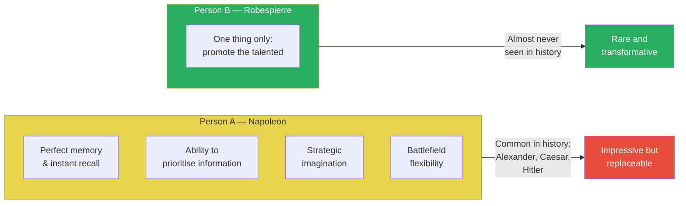
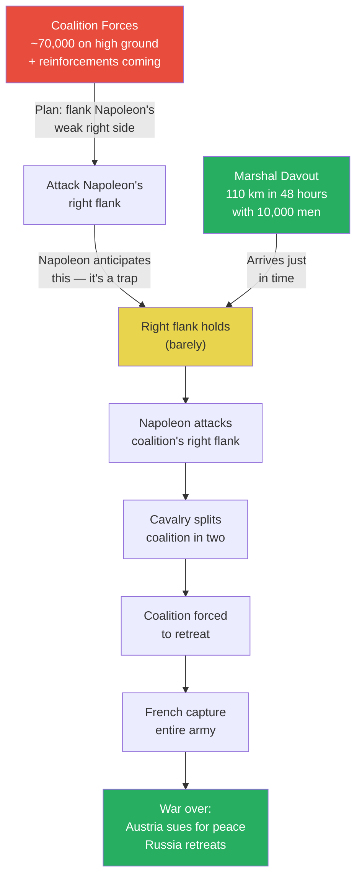
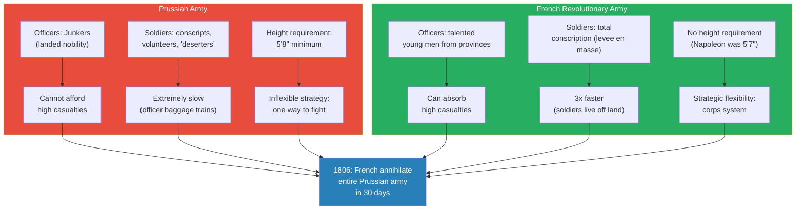
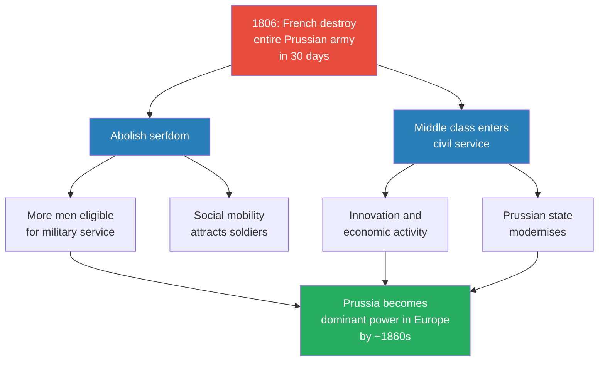
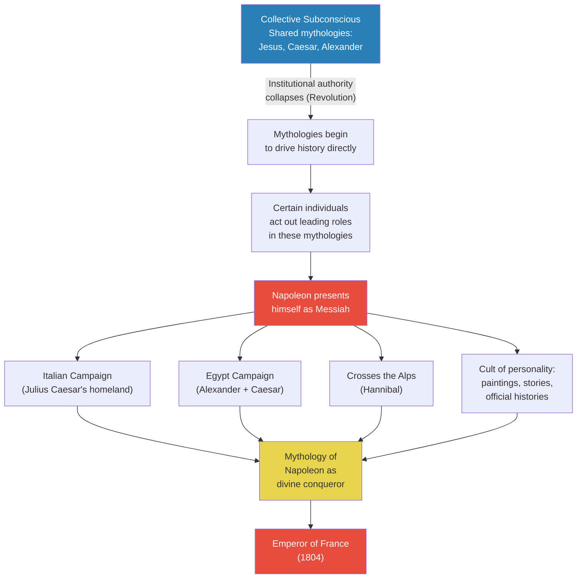
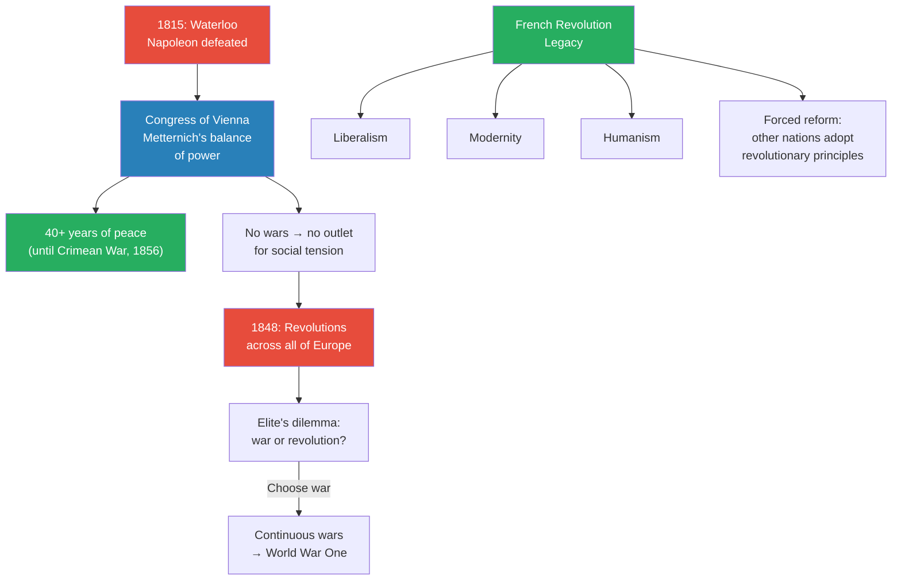
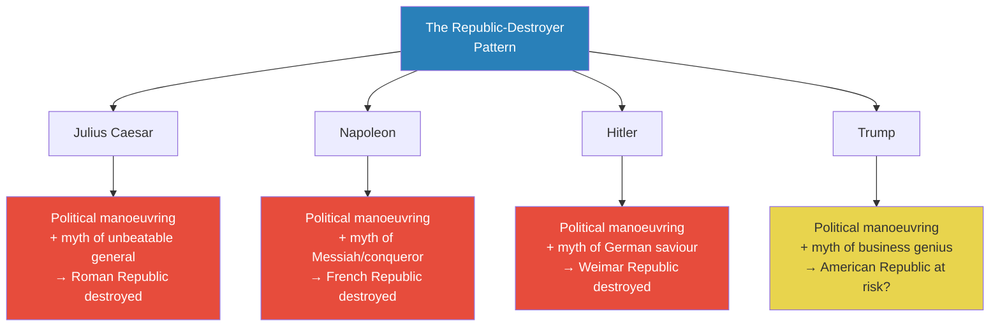

# Napoleon's Empire of Myth

> Prof. Jiang concludes the French Revolution trilogy with a provocative argument: Napoleon was not a great general — he was a great myth-maker. The lecture opens with a thought experiment comparing two types of genius — Person A, who has perfect memory, strategic imagination, and battlefield awareness (Napoleon), versus Person B, who does only one thing: promote the talented (Robespierre). Prof. Jiang argues that B is the rarer, greater figure, because Robespierre's meritocratic military system is what made Napoleon's victories possible. The lecture traces Napoleon's rise from Corsican nobody to Emperor through political manoeuvring and deliberate myth-construction, identifies the same pattern in Julius Caesar, Hitler, and Trump, and warns that republics are destroyed not by enemies but by charismatic narcissists who understand that people want mythology, not reason.

---

## Overview: Key Highlights

- <b style="color: #27ae60">Robespierre, not Napoleon, was the greater genius</b> — the meritocratic system that created Europe's greatest army was Robespierre's design, not Napoleon's
- <b style="color: #2980b9">The A vs B thought experiment</b> — military genius (A) appears everywhere in history, but selfless system-builders (B) are vanishingly rare
- <b style="color: #e74c3c">Napoleon was not a great general</b> — his victories depended on officers like Davout and a system he inherited, not personal military brilliance
- <b style="color: #27ae60">Three revolutionary advantages</b> — high casualties, speed, and flexibility gave the French army structural superiority over every army in Europe
- <b style="color: #2980b9">Mythologies are prophecies, and prophecies are plans of action</b> — Napoleon understood that controlling a society's mythology means controlling its people
- <b style="color: #e74c3c">Napoleon deliberately modelled himself on Alexander the Great and Julius Caesar</b> — crossing the Alps (Hannibal), invading Egypt (Alexander/Caesar), crowning himself Emperor (Caesar)
- <b style="color: #2980b9">The Junkers</b> — Prussian landed nobility who commanded Europe's most disciplined army but could not adapt to revolutionary warfare
- <b style="color: #e74c3c">1806: total annihilation of Prussia in 30 days</b> — forced Prussia to abolish serfdom and empower the middle class, reforms that would make them dominant by World War One
- <b style="color: #27ae60">"I would found a religion"</b> — Napoleon's own confession from St. Helena reveals his entire strategy: not generalship, but religious myth-making
- <b style="color: #2980b9">The republic-destroyer pattern</b> — Caesar, Napoleon, Hitler, and Trump all follow the same sequence: political manoeuvring, myth-making genius, destruction of the republic
- <b style="color: #e74c3c">People are not attracted to logic or reason — they are attracted to confidence and charisma</b> — this is why Robespierre failed and Napoleon succeeded
- <b style="color: #27ae60">The Congress of Vienna (1815)</b> — Metternich's balance-of-power system brought 40 years of peace but suppressed social tension that erupted in the revolutions of 1848

| Concept | One-line summary |
|---------|-----------------|
| **Person A vs Person B** | Military genius (Napoleon) vs system-builder (Robespierre) — B is rarer and more transformative |
| **Meritocracy** | Robespierre replaced 85% noble officers with talented young men from the provinces |
| **Levee en masse** | Universal conscription designed by Carnot that gave France an inexhaustible supply of soldiers |
| **Corps system** | Dividing armies into independent units that could move fast and converge — the Roman legion reborn |
| **Junkers** | Prussian landed nobility — Europe's finest officers, but trapped by inflexibility |
| **Collective subconscious** | Society's shared mythologies that drive behaviour when institutional authority breaks down |
| **Myth-making genius** | The ability to present oneself as a messianic figure by acting out a society's deep mythologies |
| **Cult of personality** | Napoleon's systematic creation of paintings, stories, and official histories to control his image |
| **Congress of Vienna** | Metternich's 1815 peace settlement — balance of power, proto-United Nations, 40 years without war |
| **The republic-destroyer pattern** | Caesar → Napoleon → Hitler → Trump: political manoeuvring + myth-making = republic killed |

---

# The Lecture

## The A vs B Thought Experiment — Why Robespierre Was Greater Than Napoleon [0:00 - 3:00]

*Prof. Jiang opens with a deceptively simple thought experiment. He presents two individuals and asks the class to judge who is the greater genius — then reveals that the obvious answer is wrong.*

> [!tip] Core Insight
> Military genius appears repeatedly throughout history — Alexander, Caesar, Napoleon, dozens of others. But the selfless system-builder who promotes the talented regardless of birth, ignoring every social pressure to do otherwise, is almost unheard of. That is why Robespierre was the greater man.

*Person A has four extraordinary qualities; Person B has only one. Yet B is the rarer figure because B requires a selflessness that defies every social pressure — including the pressure to pass power to your own family.*

> [!note]- Expand: Full Lecture Detail
> Prof. Jiang presents two individuals to the class. Person A has four characteristics:
>
> - <b style="color: #2980b9">Perfect memory</b> — able to absorb all information and retain it with instant recall
> - <b style="color: #2980b9">Ability to prioritise</b> — can filter important from unimportant information, which is rare even among brilliant people
> - <b style="color: #2980b9">Strategic imagination</b> — can take relevant information and imagine an entire battlefield across multiple nations, foreseeing how a battle will progress
> - <b style="color: #2980b9">Flexibility</b> — even with a plan, can make real-time adjustments because of total battlefield awareness
>
> Person B does only one thing: promote the talented. That is all B cares about.
>
> Prof. Jiang asks: who is the greater genius? He pauses. "Obviously it's a trick question. It's obviously B."
>
> He reveals: A is Napoleon. B is Robespierre. And he will argue today that Robespierre is the greater man.
>
> > [!example] The Jack Ma Thought Experiment
> > - Imagine you are extremely wealthy — like Jack Ma — running a company with thousands of employees
> > - You have an 18-year-old son expecting to inherit the company at 40 or 50
> > - You sit down and tell him: "Son, it takes a particular type of person to run a great company. You're a great person, I love you, but you're not qualified. I have a team of experts who will replace me"
> > - Prof. Jiang asks: would anyone in China — with 1 billion people — consider this man a good father?
> > - No one. Because social values demand you pass power to your family
> > **The lesson:** B is harder than A because it requires not just selflessness but the capacity to ignore social values and focus on what is good by itself.
>
> Prof. Jiang drives the point home: history is full of individuals like A — Caesar, Napoleon, Hitler, plenty of others even today. But B is "weird." B is the anomaly. And Robespierre was fundamental to the birth of Napoleon.

---

## The Battle of Austerlitz — Napoleon's Masterpiece and Its Hidden Dependency [3:00 - 9:54]

*Prof. Jiang walks the class through the 1805 Battle of Austerlitz in tactical detail — the trap Napoleon set, the desperate gamble on Davout's forced march, and the perfect execution that annihilated the Third Coalition. But the point is not Napoleon's genius. It is that 10,000 things could have gone wrong, and the plan only worked because of the officers and soldiers Robespierre's system had produced.*

> [!tip] Core Insight
> Austerlitz was not a triumph of individual genius — it was a triumph of system. Napoleon had the vision and the audacity, but it was his officers who executed the plan perfectly, and those officers existed only because Robespierre's meritocracy promoted talent over birth.

*The entire plan hinged on Davout's 110-kilometre forced march in 48 hours — a feat considered impossible. The best army in Europe (Prussia) could manage 20 kilometres per day. Davout's men arrived fresh and immediately pushed the coalition back.*

> [!note]- Expand: Full Lecture Detail
> Prof. Jiang sets up the strategic context:
>
> - This is 1805, the <b style="color: #2980b9">War of the Third Coalition</b>
> - Napoleon faces three major nations: Austria, Russia, and Britain, with Prussia about to join
> - He needs to knock out Russia and Austria before Prussia enters the war, because Prussia has the greatest military in the world at this time
>
> The battlefield disposition:
> - Coalition forces: ~70,000 troops stationed on high ground, with more reinforcements coming from behind
> - Napoleon: ~70,000 troops, but scattered — forces on the right flank, main forces in the centre
> - The coalition sees Napoleon's weak right flank and plans to sweep around it, envelop him, and destroy his army
> - "This is the most logical, most reasonable strategy given the circumstances"
>
> The trap:
> - Napoleon anticipates exactly this move — the weak right flank is deliberate bait
> - As the coalition commits to attacking the right, Napoleon will strike the coalition's now-weakened right flank
> - Cavalry will then split the coalition army in two, forcing retreat
>
> The critical dependency — <b style="color: #2980b9">Marshal Davout</b>:
> - Davout is 100+ kilometres away with 10,000 men
> - He must reach the right flank in time, or the coalition will simply sweep through and the plan collapses
> - <b style="color: #e74c3c">Davout completes 110 kilometres in 48 hours</b> — the best army in Europe (Prussia) does 20 kilometres per day
> - His men arrive not just in time but fresh enough to fight immediately, pushing the coalition back
>
> Prof. Jiang delivers the crucial qualifier:
> - "The problem with this plan is that it should not have worked. It is a reckless and stupid way to fight a battle"
> - There are 10,000 ways it could have gone wrong: rain, Davout getting lost, an enemy force blocking his march
> - Napoleon was lucky these things did not happen
> - Many military historians argue <b style="color: #27ae60">Davout was the far superior general to Napoleon</b>
>
> The defining characteristics of Napoleon's warfare:
>
> | Characteristic | What it means |
> |---------------|---------------|
> | **Total battlefield awareness** | Imagining the entire battlefield before the battle begins — knowing where every unit will be |
> | **Speed** | Everything happens extremely fast — European battles at this time were fought slowly, two forces grinding against each other |
> | **Manoeuvrability** | Dividing forces into smaller, independent armies operating as part of a larger vision — unlike the standard one-unit approach |
>
> "Yes, his strategic genius is one thing, but what really matters is the officers under him. He had a really talented bench of officers who are committed to the battle, and they knew exactly what they had to do."

---

## The Prussian Army vs the French Revolutionary Army [9:54 - 19:05]

*Prof. Jiang contrasts the two greatest militaries in Europe — Prussia's professional aristocratic army and France's revolutionary citizen army — to show why Robespierre's system produced a force that was structurally superior in every dimension that mattered.*

*Every Prussian weakness maps to a French strength. The Prussians were the greatest army in Europe right up until the moment they met an army built on fundamentally different principles — then they were annihilated in a month.*

> [!note]- Expand: Full Lecture Detail
> **The Prussian army:**
>
> Prof. Jiang presents the Prussians as Europe's greatest military — the benchmark everyone feared:
>
> - Officers are the <b style="color: #2980b9">Junkers</b> — landed nobility, the elite of Prussian society
>   - "I want you to remember the term Junkers. They are the force behind Hitler, and they are considered the greatest warriors in European history"
>   - Because they have land, they can focus entirely on warfare
>   - Over time, they become the finest generals and officers in Europe
>
> - Soldiers come from three sources:
>   - <b style="color: #2980b9">Conscription</b> — drafting people from the nation
>   - Volunteers — because soldiers are treated better than peasants ("If you're a soldier, the nobility can't beat the crap out of you for no reason. If you're a peasant, they can")
>   - "Deserters" — people from neighbouring nations that the Prussians essentially kidnap into service
>
> - Strict physical requirements: must be at least 5'8" tall (average height in Europe was 5'6", Napoleon himself was 5'7")
>   - "Napoleon would not have been able to join the Prussian army"
>   - King Frederick the Great takes tremendous pride in how tall his warriors are
>
> - Three fundamental weaknesses:
>   1. <b style="color: #e74c3c">Cannot afford casualties</b> — these men are too expensive to train and replace
>   2. <b style="color: #e74c3c">Extremely slow</b> — officers travel with three or four baggage wagons carrying food, clothing, servants
>   3. <b style="color: #e74c3c">Inflexible</b> — one way to fight: move up front, overwhelm through discipline
>
> - "But it's not a problem, because every army in Europe suffers from the same problems"
>
> **Robespierre's revolution in military affairs:**
>
> - <b style="color: #27ae60">Meritocracy</b>: Robespierre replaced noble officers with young men from the provinces who believed in revolution
>   - Before: 85% of French officers were nobility
>   - Five years later: 3%
>   - "That's a huge, huge change"
>   - Napoleon, a Corsican foreigner, becomes a general at age 25 — "unheard of in Europe at this time"
>   - Not just Napoleon: "dozens and dozens of really talented young men who are given opportunities they would not have been given anywhere else"
>
> - <b style="color: #27ae60">Total war / levee en masse</b>: complete conscription — no volunteers, no deserters, everyone must join
>   - Designed by <b style="color: #2980b9">Carnot</b>, Robespierre's friend from Arras, a mathematician and scientist
>   - Purpose: dilute the influence of nobility while creating an inexhaustible supply of soldiers
>
> - Three advantages this created:
>
> | Advantage | Mechanism | Impact |
> |-----------|-----------|--------|
> | **High casualties** | Near-infinite supply of soldiers via conscription | French willing to take gambles other armies cannot — like Austerlitz |
> | **Speed** | No officer baggage trains; soldiers live off the land | Travel at least 3x faster than enemies; surround armies before they set up camp |
> | **Flexibility** | Dedicated soldiers can be divided into independent corps | Rapid encirclement — the deadliest tactical position; cuts off supply routes |
>
> Prof. Jiang connects the corps system to Rome: "This is no different from the Roman legion. You take a huge army, divide them into small armies, and if they travel really fast, they can quickly surround the enemy."
>
> "And who created this system? Robespierre created this system."

---

## The Destruction of Prussia and the Revolution It Forced [19:05 - 25:20]

*Prof. Jiang describes the 1806 French annihilation of Prussia — the moment when the old European order collapsed — and the reforms that defeat forced on Prussian society. The French Revolution's greatest legacy was not what it built in France, but what it forced other nations to become.*

*The Prussians lost the battle in 1806 but won the century. Defeat forced them to adopt the revolution's principles — abolishing serfdom and empowering the middle class — which built the state that would dominate Europe before World War One.*

> [!note]- Expand: Full Lecture Detail
> Prof. Jiang sets the scene for 1806:
>
> - The French have already destroyed the Austrians and sent the Russians into retreat
> - Prussia finally enters the war, and all of Europe expects them to crush the French
>   - "The Prussians are tall, they're strong, they're fearless. They're gonna destroy the French"
>   - The French are seen as mere peasant recruits against Europe's finest professional soldiers
>
> The result:
> - <b style="color: #e74c3c">"Total and utter annihilation. Never before has Europe seen this. The French in 30 days wipes out the entire Prussian army"</b>
>
> > [!example] Davout vs the Entire Prussian Army (1806)
> > - During the campaign, Marshal Davout — a corps leader — gets lost and accidentally encounters the main Prussian army
> > - He is outnumbered two to one
> > - The Prussian army is led by the king himself
> > - Davout wins the battle
> > **The lesson:** A single French corps commander, operating independently with revolutionary soldiers, could defeat the full weight of Europe's most feared army. The system was more powerful than any individual.
>
> The forced reforms — what Prussia learned:
>
> - <b style="color: #27ae60">Abolition of serfdom</b>:
>   - Serfs were tied to the land — essentially slaves — and constituted the majority of the population
>   - As serfs, they were not eligible for military service
>   - Abolishing serfdom opened the army to vastly more recruits
>   - Many men chose the military willingly: "As a soldier, you can't be pushed around by anyone. As a serf, you're like an animal"
>
> - <b style="color: #27ae60">Middle class enters the civil service</b>:
>   - Before the French Revolution, all of Europe had rigidly stratified societies — nobility at the top, everyone else locked out
>   - After 1806, the Prussians allowed the middle class into government service
>   - This "activated the energy of the middle class" — enabling innovation and economic growth
>   - Within 50-60 years, Prussia would become the dominant power in Europe and the world before World War One
>
> "And this is all possible because the Prussians lost to the French, and they learned lessons from the French Revolution. That's why I keep saying the French Revolution was a turning point in human civilization."

---

## Q&A: Serfdom, Ideology, and the Military Cabal [25:20 - 30:18]

*Students ask about serfdom and whether revolutionary idealism survived into the Napoleonic era. Prof. Jiang explains that after 1804, when Napoleon crowned himself Emperor, France stopped being a revolutionary army and became a military cabal — generals who loved war and benefited from it.*

> [!note]- Expand: Full Lecture Detail
> **On serfdom:**
> - A student asks about serfs joining the army
> - Prof. Jiang explains the institution in detail: peasants tied to the land, unable to leave, essentially property of landowners
> - Eliminating serfdom made every man eligible for military service
> - "A lot of men want to join the military, because it's a lot better to be a soldier than a serf. As a soldier, you are given rights. As a serf, you're like an animal"
> - The military offered social mobility and social respect — impossible as a serf
>
> **On ideology vs esprit de corps:**
> - A student asks a sharp question: in 1792, the French fought with revolutionary fever. By 1805 (15 years later), is the ideology still driving the army, or is it just military identity?
> - Prof. Jiang's answer: <b style="color: #e74c3c">"In 1804, Napoleon becomes Emperor, and everything changes"</b>
>   - At the revolution's start, soldiers were "compelled by a religious fever to die for the nation"
>   - Robespierre was the role model — he sacrificed himself for France
>   - After 1804, soldiers knew they were fighting for their emperor, not their nation
>   - Many French people felt betrayed by Napoleon
>   - France became "a military cabal — a group of generals who love war, who benefit from war"
>   - Napoleon was just the head of this cabal
>   - France became "a military nation where everyone's supporting French military adventurism"
>
> **On why Robespierre created the meritocracy:**
> - The main threats to the revolution: foreign armies wanting to restore the Bourbon monarchy, Catholic peasant rebels, and — most dangerously — the army itself
> - 85% of the army was nobility, and several times the army nearly marched against the revolution to restore the monarchy
> - The generals did not act only because they feared their own soldiers would mutiny
> - "That's why Robespierre spearheaded the movement to replace nobles with ordinary men like Napoleon"

---

## Napoleon as Myth-Maker — The Collective Subconscious [30:18 - 39:51]

*Prof. Jiang shifts from military history to psychology. Napoleon's true genius was not generalship — it was understanding that mythologies are the operating system of society. When institutional authority collapses (as in the French Revolution), these mythologies drive history directly, and whoever acts out the leading role captures everyone else.*

> [!tip] Core Insight
> Napoleon understood something Robespierre refused to accept: people do not want to think for themselves. They want to believe. They want a Messiah. By deliberately acting out the mythologies already embedded in the French collective subconscious — Caesar, Alexander, Jesus — Napoleon made himself Emperor.

*Napoleon did not stumble into mythology — he engineered it. Every campaign was chosen not for military logic but for mythological resonance: Italy (Caesar), Egypt (Alexander), the Alps (Hannibal).*

> [!note]- Expand: Full Lecture Detail
> Prof. Jiang opens this section with the central question: "How did a nobody become Emperor of France?"
>
> - Napoleon was from Corsica — not even properly French, part of the French Empire but culturally separate
> - He spoke French with a bad accent; people made fun of him at school
> - His family was local Corsican nobility, but poor
> - "This guy was literally a nobody, and in only about a decade, he became Emperor of France"
>
> The answer lies in three ideas about mythology:
>
> 1. <b style="color: #2980b9">Mythologies are part of a collective subconscious</b> — everyone in a society is governed by shared mythological frameworks (in France: Jesus, Alexander the Great, Julius Caesar)
>
> 2. <b style="color: #2980b9">When institutional authority breaks down, mythologies drive history</b> — removing authority figures does not create a vacuum; it means the subconscious takes charge
>    - "Think of the Cultural Revolution in China. You remove authority figures, but then your subconscious takes charge"
>
> 3. <b style="color: #2980b9">Certain individuals act out the leading roles in these mythologies</b> — they capture the imagination of everyone else
>
> Prof. Jiang's verdict on Napoleon:
> - "He was not a great general. That is one of the major misconceptions"
> - "He was not as good as Davout was"
> - "But he understood that the underlying framework for society are mythologies. If you can control its mythologies, you can control people, you can become the Emperor"
>
> > [!quote] Napoleon (from his memoirs on St. Helena)
> > "I saw the way to achieve all my dreams. I would found a religion."
>
> Prof. Jiang unpacks the full quote: "I saw myself marching into Asia, mounting on an elephant, a turban on my head, and in my hand a new Quran that I would have composed to suit my needs." Napoleon saw himself not as a general but as a religious leader — a new Muhammad, a new Caesar, a new Alexander.
>
> **Napoleon's deliberate myth-construction:**
>
> - From the very beginning of his career, he was focused on creating mythology of himself
> - During the Italian campaign, he commissioned paintings of himself leading warriors into battle — "This didn't really happen. Doesn't matter, because he understood that what matters is how people perceive you"
> - As Emperor, he focused on a <b style="color: #2980b9">cult of personality</b>: paintings, stories, official histories
> - "A lot of stuff that we know about Napoleon — his victories — we have to be suspicious about, because he was so focused on creating a myth of himself"
>
> **The French army under Louis XVI (before the revolution):**
>
> | Problem | Detail |
> |---------|--------|
> | **Top-heavy** | 506-78 generals for 480,000 men — friends of the king, incompetent but loyal |
> | **Noble-dominated** | 85% of officers were nobility |
> | **Harsh discipline** | Soldiers forced to fight, not motivated |
> | **Mass desertion** | One-third of soldiers deserted every year |
>
> **Carnot — the architect of conscription:**
> - Robespierre's friend from his provincial town of Arras — they had known each other for years
> - A mathematician and scientist who designed the <b style="color: #2980b9">levee en masse</b> (universal conscription)
> - Purpose: dilute noble influence by flooding the military with ordinary citizens
> - "It works spectacularly well"
> - Carnot would later become one of the main conspirators against Robespierre — he "recognised that he couldn't really benefit from his power. Robespierre was too virtuous"
> - Carnot also made Napoleon a general
>
> **Napoleon's political skill:**
> - "The thing about Napoleon that makes him distinctive is he's very good at getting close with political patrons"
> - He cultivated Carnot, Paul Barras, and others — always identifying who could advance his career
> - The other revolutionary generals were just as talented militarily ("dozens of them, some even better than Napoleon"), but Napoleon understood politics

---

## The Coup d'Etat and the Emperor's Overreach [39:51 - 49:21]

*Prof. Jiang traces Napoleon's path from general to dictator to Emperor — the political manoeuvring, the deliberate modelling on ancient conquerors, the betrayal of the revolution, and the fatal overextension that destroyed his empire.*

*Napoleon's rise follows a precise pattern: cultivate patrons, do them favours, seize the moment, then betray everyone. Each step was chosen for mythological resonance, not strategic logic.*

> [!note]- Expand: Full Lecture Detail
> **The path to the coup:**
>
> - After Robespierre's death, the Directory (five-man dictatorship) takes over France
>   - Includes Carnot and <b style="color: #2980b9">Paul Barras</b> — another patron of Napoleon and former friend of Robespierre
>   - Both Napoleon and Barras are initially investigated as associates of Robespierre
>   - But both are "extremely politically flexible — the opposite of Robespierre. Robespierre was virtuous; these men are cynical, perfect political operators"
>
> - Napoleon's favour to the Directory: when a Paris mob threatens them, Napoleon fires cannon directly at the crowd
>   - "As a general, you're not supposed to do that. You're not supposed to kill your own people"
>   - But Napoleon is "ambitious, merciless" — the Directory now owes him
>   - He asks for the generalship of the Italian peninsula — "Why? Because that's where Julius Caesar is from"
>
> - Italian campaign: mixed results, "not as great as people make it out to be"
> - Then Egypt: "Why? Because Alexander the Great went to Egypt and Julius Caesar went to Egypt"
> - Even at this early stage, every career move is about mythological construction
>
> **The coup d'etat (1799):**
> - Barras and Emmanuel Sieyes grow sick of the corrupt, ineffectual Republic
> - They need a general to back their coup
>   - First choice: General Moreau — "considered the best general in France, the most respected"
>   - Moreau refuses: "This goes against the revolution. This goes against the legacy of Robespierre"
>   - They ask MacDonald, who declines but suggests Napoleon
>   - Napoleon: "Of course he wants to do this. He's been dreaming about this. He wants to be the new Caesar who crosses the Rubicon and ends the Roman Republic"
> - The coup succeeds because Napoleon has created such a powerful mythology of himself as Messiah that the Paris mob — the revolution's enforcement arm — does not rise against him
>
> **From dictator to Emperor:**
> - Immediately after seizing power, Napoleon goes to Italy again — "Crosses the Alps. Why? Because Hannibal crossed the Alps"
>
> > [!example] The Battle of Marengo — Lucky, Not Brilliant
> > - Napoleon had the Austrian army encircled but feared they would escape
> > - The Austrians recognised the French were divided and launched a massive attack
> > - The French were being overwhelmed — Napoleon's elite soldiers held but lost 50% killed
> > - Another French army arrived just in time to save Napoleon
> > - "Napoleon is taking all these stupid risks for no particular reason — it's all to create a mythology of himself as a great conqueror"
> > - His key insight: "I don't have to win this battle, because I control the government. When I go back to France, I just tell everyone I won, and everyone will believe me. But what's important is action"
> > **The lesson:** Napoleon understood that perception matters more than reality. He did not need to win — he needed to act, and then control the narrative.
>
> **Emperor (1804) — the revolution dies:**
> - Napoleon crowns himself Emperor of France
> - "This destroys the revolution, because the Messiah is not supposed to do this. The Messiah is supposed to be selfless, like Robespierre"
> - He makes his brothers rulers across Europe:
>   - Joseph: Emperor of Italy and later Spain
>   - Louis: King of Holland
> - "If you are a French revolutionary who dedicated your entire life to promoting liberty around the world, you don't see this as a good thing"
>
> **Napoleon's character — the letters to Josephine:**
> - Prof. Jiang reads excerpts from Napoleon's letters to his wife Empress Josephine:
>   - "Since I left you, I have been constantly depressed. My happiness is to be near you"
>   - "I don't love you anymore. On the contrary, I detest you. You are a vow, mean, BC, slut"
>   - "My mistresses do not in the least engage my feelings. Power is my mistress"
> - "This is a megalomaniac. He's narcissistic. He's obsessed with obtaining as much power as possible"
>
> **Overextension and decline:**
> - France becomes the largest empire in Europe — controlling Spain, Italy, parts of Prussia and Germany
> - But European geography makes total control impossible: Britain has the greatest navy (can never be invaded), Russia is too vast
> - People lose their revolutionary fever — they no longer want to die for Napoleon
> - Replacements are common people who do not care about fighting
> - <b style="color: #e74c3c">1812: the invasion of Russia</b> — a catastrophic failure
>   - Napoleon escapes but loses his cavalry permanently
>   - Meanwhile, nationalism rises across Europe: Spain and Germany fight guerrilla warfare against France
>   - People now fight Napoleon not to restore the monarchy but to secure national independence

---

## The Congress of Vienna and the Legacy of the French Revolution [49:21 - 58:59]

*Prof. Jiang closes the Napoleon narrative with the Congress of Vienna and its paradox: Metternich's balance-of-power system brought unprecedented peace but created the pressure that would eventually explode in the revolutions of 1848 and the wars of the 20th century. The French Revolution's legacy was not Napoleon — it was liberalism, modernity, and the permanent transformation of European society.*

*The Congress of Vienna created peace, but peace without reform created revolution. Europe's elites discovered they had only two options: send their people to war, or face revolution at home. They chose war — and that choice leads directly to 1914.*

> [!note]- Expand: Full Lecture Detail
> **Napoleon's defeat:**
> - Napoleon is finally defeated at the <b style="color: #2980b9">Battle of Waterloo</b> (1815)
> - The settlement is called the <b style="color: #2980b9">Congress of Vienna</b>, masterminded by <b style="color: #2980b9">Metternich</b>
>
> **Metternich's system:**
> - Argues for balance of power — maintain borders, no more wars
> - "Napoleon's wars killed millions of people. We are sick and tired of war. The people are sick and tired of war"
> - The Concert of Europe functions as "a proto-United Nations — an organisation dedicated to maintaining balance of power in Europe"
> - It works remarkably well: no major wars in Europe from 1815 until the Crimean War in 1856 — 40+ years of peace
>
> **The paradox of peace:**
> - "If you don't let people fight wars, what are they going to do? They're going to revolt against you"
> - Massive inequality and social tension build up with no outlet
> - <b style="color: #e74c3c">1848: revolutions engulf all of Europe</b>, threatening and destroying many monarchies
> - After 1848, the elite discovers the fundamental trade-off: "Either you take people to war and kill off a lot of people, or these people will rise up against you"
> - This logic leads directly into continuous wars and ultimately World War One
>
> **The French Revolution's lasting legacy:**
> - Even though Napoleon killed the revolution and was himself defeated, the revolution permanently changed Europe
> - Some nations adopted revolutionary principles voluntarily
> - Others (like Prussia) were forced to adopt them in order to survive militarily
> - The French Revolution marks the beginning of:
>   - Liberalism
>   - Modernity
>   - Humanism
>
> > [!quote] Prof. Jiang
> > "We would not be living in the world we live in today without the French Revolution. It is probably the most significant event in human history."

---

## The Republic-Destroyer Pattern: Caesar, Napoleon, Hitler, Trump [58:59 - end]

*Prof. Jiang closes the lecture with the most provocative argument of the series so far: Napoleon, Julius Caesar, Hitler, and Trump are the same archetype — political operators with myth-making genius who rise by manoeuvring, capture power by controlling mythology, and destroy republics. If the pattern holds, the American Republic may be next.*

> [!tip] Core Insight
> People are not attracted to logic or reason. They are attracted to confidence and charisma. Robespierre believed everyone was capable of reasoning for themselves. Napoleon understood they wanted to believe, to obey, to follow a Messiah. That is why Robespierre failed and Napoleon succeeded — and why the pattern keeps repeating.

*Four figures across two thousand years — same personality, same method, same result. If the pattern is consistent, Prof. Jiang argues, then history becomes predictable.*

> [!note]- Expand: Full Lecture Detail
> Prof. Jiang presents a comparison table of the two archetypes:
>
> | Dimension | Robespierre | Napoleon |
> |-----------|------------|----------|
> | **How he obtained power** | Virtue and dedication — worked 18 hours a day, no money, no girlfriend, unpaid | Political manoeuvring — cultivating patrons, doing favours, launching a coup |
> | **Core belief** | Prophet of reason — believed everyone could reason for themselves | Myth-making genius — understood people want mythology, not reason |
> | **Legacy** | Saved the French Revolution | Destroyed the French Republic |
>
> The pattern across history:
>
> - <b style="color: #2980b9">Julius Caesar</b>: identified political patrons early, outmanoeuvred them, amassed power, created myth of himself as unbeatable general, destroyed the Roman Republic
> - <b style="color: #2980b9">Napoleon</b>: identified political patrons (Carnot, Barras), outmanoeuvred them, created myth of himself as Messiah, destroyed the French Republic
> - <b style="color: #2980b9">Hitler</b>: same pattern — "the Nazis did not come out of nowhere. The Nazis were a force incubated by the German army in order to destroy the communist movement. Hitler took advantage of this." Presented himself as saviour of the German people, destroyed the Weimar Republic
> - <b style="color: #2980b9">Trump</b>: political manoeuvring, myth-making genius — "Everyone says Trump is a terrible business person. He doesn't understand tariffs, doesn't understand economics. He doesn't care. He understands mythology"
>
> **Why myth-making works — the psychology:**
>
> - Robespierre believed in reason: "If I present the logical argument, people will understand it." This was both the source of his virtue and his downfall — he could not imagine his friends would conspire against him
> - Napoleon understood the opposite: "People don't want to think. People want to believe. People want to obey"
> - "People are attracted to confidence and charisma, not logic or reason"
>
> **Trump as myth-maker:**
>
> - "Objectively speaking, Trump is a failed business person. His father Fred Trump built a real estate empire. Trump almost bankrupted it"
> - Fred Trump focused on running the business. Trump focused on presenting an image of success: "sleeping with beautiful women, the press reporting it, people thinking he's a God"
> - The TV show *The Apprentice* presented Trump as a wise business leader — "he's the opposite in reality, but people don't care about reality"
> - "If I turn politics into a TV show and everyone's watching all the time, they will always want me to be President"
> - <b style="color: #2980b9">MAGA as religion</b>: "Don't think of Make America Great Again as a political movement. Think of it as a new religion"
>   - Napoleon: "I would found a religion... a new Quran that I would have composed to suit my needs"
>   - MAGA is Napoleon's plan executed in the 21st century
>
> **On perception vs reality:**
> - "Is perception more important than reality? The answer is yes"
> - "Reality is very hard. People prefer simple ideas, simple myths that allow them to better navigate reality. That's why religion is important"
> - "Trump doesn't want to make America wealthy again. He needs to make America a myth again"
> - Prof. Jiang's economic logic: "I don't have to make you rich. I just have to make everyone else poor, and then you're happy. Being great is just a perception — I'm better than everyone else"
> - "People want to live in a dream, because that's what makes life bearable"
>
> **The prediction:**
> - "If, in the next 10 years, Trump actually destroys the American Republic, then a pattern emerges in history"
> - "And if this pattern is consistent, now we're able to control history, because we're able to foresee and predict history"

---

## Connections

**Builds on:** [[15 - The Myth-Making Genius of Julius Caesar]] (Caesar as the original republic-destroyer through myth-making), [[16 - Julius Caesar's Will and Octavian's Birth of Empire]] (how Caesar's myth outlived him and propelled Octavian)
**Sets up:** [[49 - The Dutch Golden Age and the Rise of the Middle Class]] (the middle class forces unleashed by these reforms), [[50 - Rule, Britannia!]] (Britain as the power Napoleon could never conquer)
**Related themes:** [[06 - Elite Overproduction and the Bronze Age Collapse]] (elite overproduction as collapse mechanism), [[08 - Rat Utopia and the Peloponnesian War]] (wealthy societies self-destructing), [[12 - The Tyranny of Alexander the Great]] (military genius as narcissistic overextension), [[32 - Rome's Rise, Fall, and Legacy]] (republic-empire paradox)
**Related books in vault:** [[The 48 Laws of Power - Robert Greene]] (myth-making, cult of personality), [[The 33 Strategies of War - Robert Greene]] (Austerlitz, speed, flexibility)

---

## The Takeaway

This lecture reframes Napoleon entirely. The conventional story casts him as one of history's great military geniuses whose victories reshaped Europe. Prof. Jiang inverts this: Napoleon was a mediocre general riding an extraordinary system built by someone else. Robespierre's meritocracy created the officers, Carnot's conscription created the soldiers, and revolutionary idealism created the willingness to die. Napoleon's actual genius was mythological — he understood that people want a Messiah, and he knew how to play the role. Every campaign was chosen not for military logic but for symbolic resonance: Italy because Caesar came from there, Egypt because Alexander went there, the Alps because Hannibal crossed them. The battles themselves were reckless gambles that succeeded because the system's officers — men like Davout — were extraordinary.

The most unsettling insight is the pattern. Julius Caesar destroyed the Roman Republic using exactly the same method: political manoeuvring, cultivation of patrons, myth-making genius. Hitler did it to the Weimar Republic. And Prof. Jiang draws the line directly to Trump — not as partisan commentary, but as historical pattern recognition. The republic-destroyer is always the same personality type: not a builder, not a thinker, but someone who understands that confidence and charisma matter more than competence, and that when institutional authority breaks down, whoever controls the mythology controls the people. The open question — whether the American Republic will follow the pattern of Rome and France — is one this lecture cannot answer but forces the audience to confront.
