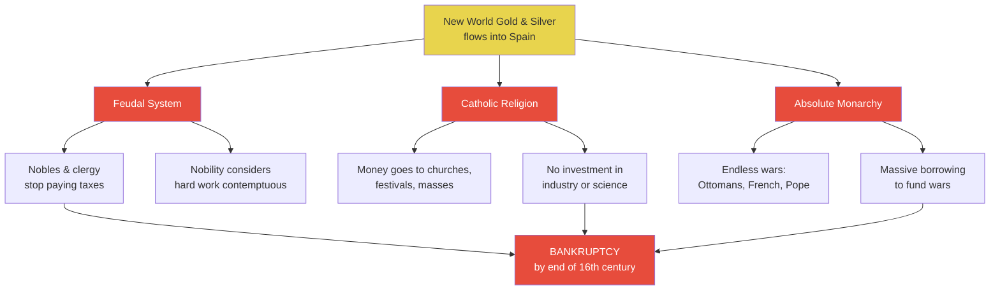
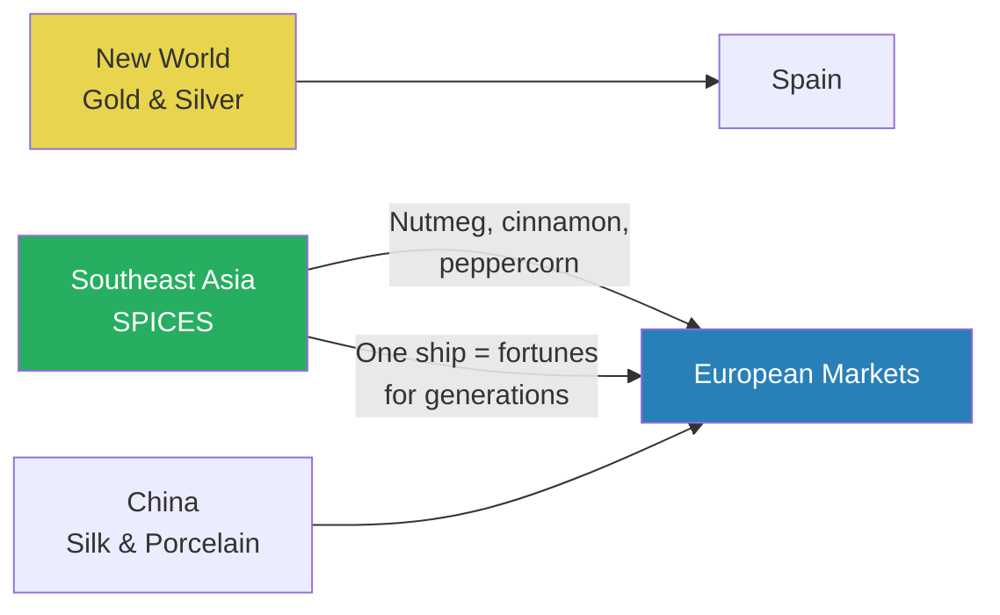
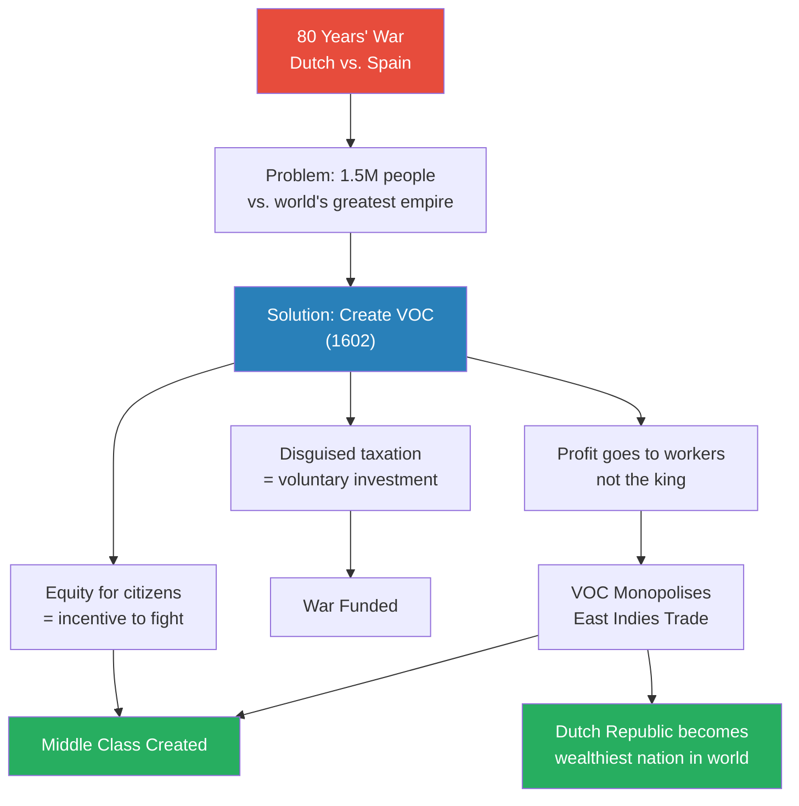
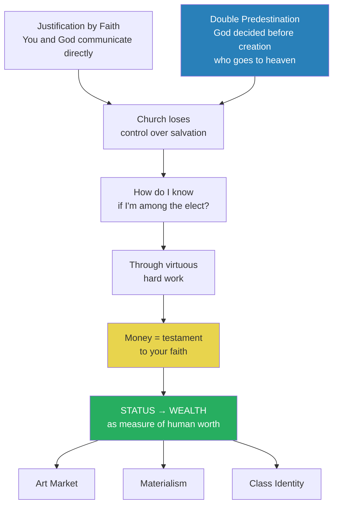
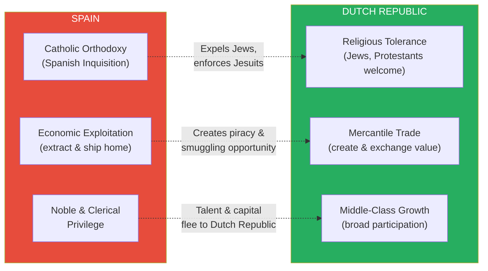
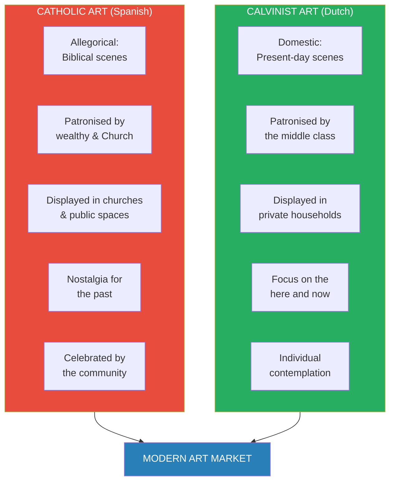
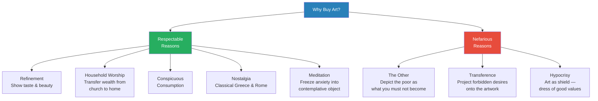
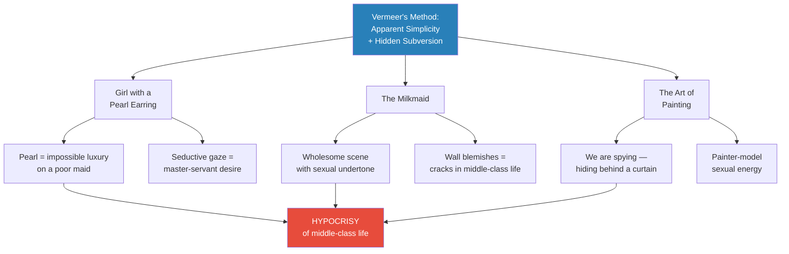
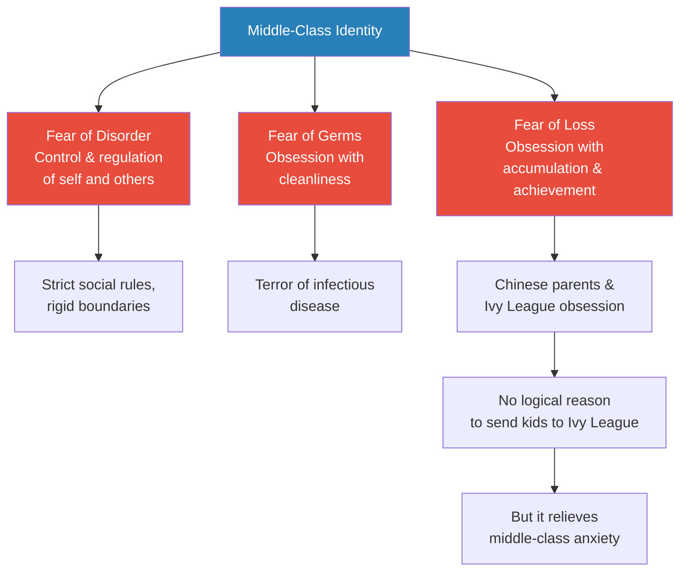

# The Dutch Golden Age and the Rise of the Middle Class

> Prof. Jiang traces the birth of the modern middle class to the Dutch Republic of the 17th century. Spain's feudal Catholic monarchy squandered New World gold on wars and religion, creating opportunities for three Protestant nations — France, England, and Holland. The Dutch invented the world's first multinational corporation, the VOC, to fund their war of independence from Spain, and in doing so created something unprecedented: a middle class whose identity was built on wealth rather than status. Calvinism's doctrine of double predestination turned money-making into a measure of faith, and the resulting anxiety, uncertainty, and competition produced the first art market, materialism, and a class psychology that still defines middle-class life worldwide.

---

## Overview: Key Highlights

- <b style="color: #27ae60">The Dutch East India Company (VOC) was the first multinational corporation in history</b> — created in 1602 to unite the Dutch population by giving them equity in the war against Spain
- <b style="color: #e74c3c">Spain's New World gold was a disaster, not a blessing</b> — feudalism, Catholicism, and monarchy ensured the wealth was wasted on wars, churches, and parasitic elites
- <b style="color: #2980b9">Double predestination</b> — the Calvinist doctrine that God decided who goes to heaven before the world was created, stripping the Catholic Church of its power over the afterlife
- <b style="color: #27ae60">Money replaced status as the measure of human worth</b> — Calvinism made wealth a testament to faith, creating a radical shift in human identity
- <b style="color: #e74c3c">Middle-class life is fundamentally hypocritical</b> — Vermeer's paintings expose the sexual, material, and moral contradictions beneath the veneer of Calvinist simplicity
- <b style="color: #2980b9">Three drivers of middle-class culture: anxiety, uncertainty, and competition</b> — these produced the art market, materialism, and the obsession with money that persists globally today
- <b style="color: #27ae60">Dutch tolerance was strategic, not ideological</b> — expelled Jews brought trade networks, financial systems, and intellectual talent that powered the Republic's rise
- <b style="color: #2980b9">Conspicuous consumption</b> — wealth transferred from churches to households, making the home the new temple of worship
- <b style="color: #e74c3c">The Habsburg inbreeding catastrophe</b> — generations of marrying within the family produced Charles II, ending the Spanish dynasty
- <b style="color: #27ae60">Art as psychological therapy</b> — the Dutch middle class bought 5-10 million paintings in a century, using art to freeze and meditate on their anxiety
- <b style="color: #2980b9">Johan Vermeer</b> — the greatest Dutch Golden Age artist, who subverted middle-class values by embedding sexual and moral contradictions in seemingly wholesome domestic scenes
- <b style="color: #e74c3c">Middle-class pathologies endure</b> — fear of disorder, obsession with cleanliness, and compulsive accumulation still drive behaviour from the Netherlands to China

| Concept | One-line summary |
|---------|-----------------|
| **VOC (Dutch East India Company)** | First multinational corporation — could raise armies, issue currency, and make laws independently of government |
| **Double predestination** | God chose who goes to heaven before creation — only the "elect" are saved, and no church can change it |
| **Justification by faith** | Calvinist doctrine: your relationship with God is personal, not mediated by church rituals or donations |
| **Status vs. wealth** | The shift from impressing your community (Viking feasts) to accumulating money as proof of faith |
| **Feudal Catholic monarchy** | Spain's triple curse: rigid hierarchy, otherworldly religion, and a warmongering king |
| **The 80 Years' War** | Dutch war of independence from Spain — religious fanatics persisted against the world's greatest empire |
| **Conspicuous consumption** | Transferring wealth from church to household — silk, porcelain, spices as markers of faith |
| **Art as meditation** | Paintings freeze anxiety into a contemplative object, allowing the viewer to process inner conflict |
| **The other** | Middle-class identity defined by differentiation — depicting the poor as lazy and immoral to define what you are not |
| **Transference** | Projecting forbidden desires (sex, excess) onto artwork so they can be experienced without being acted upon |
| **Pantheism** | Spinoza's philosophy: God exists within every living being — trees, animals, humans are all connected |
| **Vermeer's subversion** | Embedding hypocrisy and sexual desire in apparently wholesome domestic paintings |

---

# The Lecture

## Spain's Golden Curse — How Wealth Destroyed an Empire [0:00-9:47]

*Prof. Jiang opens the final section of the course — the Anglo-American Empire — by going back to Spain, where the discovery of New World gold and silver created the wealthiest empire on earth and simultaneously destroyed it from within. Three structural flaws turned fortune into catastrophe.*

> [!tip] Core Insight
> Starting with $100 million and ending with a billion dollars in debt is not bad luck — it is what happens when a feudal Catholic monarchy encounters unlimited wealth with no institutions capable of investing it productively.

*Three structural flaws — feudalism, Catholicism, monarchy — acted as force multipliers on each other. Every peseta of New World gold flowed through these filters and came out as waste.*

> [!note]- Expand: Full Lecture Detail
> Prof. Jiang opens by setting the frame: this is the very last section of the course, covering the Anglo-American Empire that rules the world today. But to understand the British Empire, you first need to understand why Spain — the first empire to colonise the New World — collapsed despite having more gold and silver than any nation in history.
>
> He walks the class through the three structural flaws of the Spanish system:
>
> - <b style="color: #2980b9">Feudalism</b> — a rigid hierarchy of status with nobles and clergy at the top
>   - All the gold and silver meant the clergy and nobility no longer had to pay taxes or contribute anything to society
>   - Prof. Jiang calls them "a group of parasites sucking up a lot of wealth and energy within Spain"
>   - The Spanish nobility believed it was "beneath them to work hard" — exertion was contemptuous, and being noble meant sitting back and enjoying life
>
> - <b style="color: #2980b9">Catholicism</b> — an otherworldly religion focused on the afterlife
>   - People did not care about what happens today — they cared about securing a place in heaven
>   - None of the New World wealth went into industry, innovation, technology, or science
>   - All of it was wasted on religious festivals, churches, and masses
>
> - <b style="color: #2980b9">Monarchy</b> — a king with infinite money and a vast empire to defend
>   - Through marriage, the Spanish king also became king of the Holy Roman Empire — most of Europe
>   - He fought the Ottomans, the French, the Catholic Church itself (wanting more authority than the Pope)
>   - He paid for these wars with gold and massive borrowing
>   - By the end of the 16th century, the most powerful and wealthiest empire on earth went bankrupt
>
> > [!example] The $100 Million Analogy
> > - Prof. Jiang asks the class to imagine each student receives $100 million today
> > - First reaction: waste it on ski trips, a Maserati, a private plane
> > - Eventually you realise you need to invest — so you borrow a billion dollars from banks who trust your $100 million collateral
> > - But you have no business experience and no judgement
> > - Within ten years, every business fails — you are now a billion dollars in debt
> > - You started with $100 million and ended with negative $1 billion
> > **The lesson:** That is exactly what happened to Spain — reckless expansionism turned the world's greatest fortune into the world's greatest debt.
>
> But Spain's collapse created opportunities for those who did work hard: <b style="color: #27ae60">France, England, and Holland</b>. These three Protestant nations benefited in three ways:
>
> - **Industry** — Spain had no industry, still an agricultural nation, but wanted textiles and finished goods. The French, English, and Dutch were Protestants who believed in hard work, so they industrialised to meet Spanish demand. This created a middle class.
>
> - **Piracy** — ships transporting gold and silver from the New World back to Spain were easy targets. Piracy became the "official policy" of England. <b style="color: #2980b9">Francis Drake</b> was simultaneously the most famous pirate and an admiral in the British Navy, sponsored by Queen Elizabeth I. He was a national hero for stealing Spanish gold.
>   - Piracy also drove naval innovation: the old system was ramming, boarding, and hand-to-hand combat
>   - The English pioneered artillery and long-range fighting — cannons that could pound ships from a distance
>   - This innovation eventually made England the greatest naval power in the world
>
> - **Smuggling and the slave trade** — Spanish territory in the New World was officially controlled by the crown, so everyone smuggled to avoid taxes
>   - The most profitable product in human history was slaves
>   - Plantations in the New World needed labour, so slaves were transported from Africa
>   - Prof. Jiang corrects a common misconception: Europeans did not go into Africa to kidnap people. They set up coastal trading centres, and African tribes sold their war captives to Europeans. "Not only were the Europeans getting rich off this trade, but so were many African clans and tribes"
>   - Europeans avoided going inland because of malaria

---

## The Spice Trade and the East Indies — Where the Real Money Was [9:47-11:30]

*Prof. Jiang reveals that the centre of global wealth was not the New World at all — it was Southeast Asia. Whoever controlled the trade routes to the East Indies controlled the world.*

*Gold and silver get the headlines, but spices were the real fortune. A single ship of nutmeg could make a family wealthy for generations.*

> [!note]- Expand: Full Lecture Detail
> Prof. Jiang delivers a counterintuitive point: most of the profit at this time was not in gold and silver at all. The most valuable commodities were spices — nutmeg, cinnamon, peppercorn. "One ship of these things was enough to make fortunes for entire families, for generations."
>
> The geography of wealth:
> - From China: silk and porcelain
> - From Southeast Asian islands (Indonesia): spices
> - This region became known as the <b style="color: #2980b9">East Indies</b>
>
> <b style="color: #27ae60">The key to world conquest was who could control the trade routes into the East Indies</b>. The Portuguese were there first, but like Spain, they were a Catholic nation with the same structural problems. It was the Dutch who figured out how to extract real wealth from the East Indies — and their method would change the world.

---

## The Birth of the VOC — The World's First Multinational Corporation [11:30-20:08]

*Prof. Jiang explains how 1.5 million Dutch people, trapped in a war against the world's greatest empire, invented the corporation as a weapon of war. The VOC was not just a business — it was a system for uniting a fractured population, raising taxes without rebellion, and funding independence through shared ownership.*

> [!tip] Core Insight
> The VOC was not created to make money. It was created to win a war. Giving ordinary people equity in a company was the most effective way to turn indifferent citizens into motivated fighters — and it worked so well it accidentally created the modern middle class.

*The VOC solved three problems simultaneously: motivation, funding, and trade monopoly. The unintended consequence was a new social class.*

> [!note]- Expand: Full Lecture Detail
> Prof. Jiang sets the context: the Dutch are part of the <b style="color: #2980b9">Low Countries</b> — today's Belgium and the Netherlands. For most of history, they were part of the Holy Roman Empire, but they were left alone because they were poor and had few resources. They had a lot of local autonomy and were "a very independent and very egalitarian nation." People worked hard because it was cold and poor, and the Low Countries became one of the first places to develop textiles.
>
> But as Spain grew more powerful through the Habsburg marriage, it wanted to exert authority over the Low Countries and maintain Catholicism against the spread of Protestantism. This triggered the <b style="color: #2980b9">80 Years' War</b> — a war of independence between Dutch cities wanting freedom and Spain wanting control.
>
> The odds were absurd:
> - Spain: the most powerful nation in the world
> - The Low Countries: about 1.5 million people
> - "They can't possibly fight Spain, but they persist because they're led by religious fanatics"
>
> The Dutch recognised that while they could not beat Spain on land, they could beat them at sea. If they could control trade in the East Indies, they would have the wealth and resources to sustain the war. But they were small and poor — so in <b style="color: #27ae60">1602, they created the Dutch East India Company (VOC)</b>.
>
> Prof. Jiang emphasises the VOC's extraordinary nature:
> - It is considered the first multinational corporation in the world
> - Not controlled by the government, but with the powers of government:
>   - Could raise its own military
>   - Could create its own laws
>   - Could issue its own currency
> - "If you take Apple, Microsoft, and Google — these three companies combined — they would still not be as wealthy as the Dutch East India Company"
> - Its power came from its <b style="color: #2980b9">monopoly over the spice trade</b> in the East Indies
>
> Why the VOC was created — Prof. Jiang identifies the strategic genius:
>
> - **Incentive alignment:** Most Dutch people were indifferent to the war — "we don't really care, the Spanish are far away." Some were fanatics wanting independence, others were heavily Catholic. By giving people shares (equity) in a company, they now had a personal financial incentive to fight Spain. "If the Dutch East India Company makes money, they get rich"
>
> - **Disguised taxation:** "If you try to get taxes from people, they will rebel. But if you say, invest in this company and you might get rich — that's the equivalent of selling war bonds"
>
> - **Worker-driven profit:** If the VOC workers work hard, they profit — not the king. This created fundamentally different incentives from the Spanish extraction model.
>
> The result: the VOC pushed out the Portuguese and monopolised the entire East Indies. "What's important to remember, and this is why the Dutch don't really talk about this history, is a lot of brutality and horror happened." The VOC committed ethnic cleansing, enslaved populations for plantations, and engaged in constant warfare to maintain its monopoly.
>
> Over time, the Dutch recognised they lacked the population to maintain the empire, so they retreated and became subcontractors to the English and French — "and that's why the Netherlands remains one of the wealthiest countries in the world today. A lot of their wealth is hidden."
>
> The political split: those wanting independence moved north (the Netherlands — Protestant), while those wanting to remain Catholic moved south (Belgium). "If you go to Belgium today, it's heavily Catholic. If you go to the Netherlands, it's Protestant."
>
> The Dutch Republic was a <b style="color: #2980b9">federation of seven city-states</b>, not a monarchy — decision-making required consultation and diplomacy. This is also why they created the VOC: without a single monopoly company, different city-states would compete against each other for East Indies trade, and they did not have the resources for that.

---

## Calvinism and the Birth of Wealth-Based Identity [20:08-28:51]

*Prof. Jiang explains the two Calvinist doctrines — justification by faith and double predestination — that destroyed the Catholic Church's power over the afterlife and accidentally created the psychology of modern capitalism. Money became the measure of faith, status was replaced by wealth, and an entirely new class identity was born.*

> [!tip] Core Insight
> Before Calvinism, you proved your worth by impressing your community — Viking feasts, funeral displays, village celebrations. After Calvinism, you proved your worth by accumulating money. That single shift — from status to wealth — created the middle class, the art market, and materialism. It is still the dominant psychology in the world today.

*Two theological doctrines cascaded into a civilisational transformation. The arrow from "Money = testament to your faith" to the status-wealth shift is the hinge point of the entire lecture.*

> [!note]- Expand: Full Lecture Detail
> Prof. Jiang reviews the two key doctrines that differentiate Calvinism from Catholicism:
>
> **Doctrine 1 — Justification by Faith:**
> - In Catholicism, you show faith by doing good works — giving money to the church, performing rituals
> - In the Calvinist covenant religion adopted by the Dutch Republic, <b style="color: #2980b9">justification by faith</b> means your relationship with God is personal and direct
> - "God knows if you're faithful, and you yourself know if you're faithful"
> - Building churches and donating money does not matter — what matters is true inner faith
>
> **Doctrine 2 — Double Predestination:**
> - The Catholic Church derived its power from controlling the afterlife — it decided whether you go to heaven, and if not, how long you spend in purgatory
> - Calvinists believed God had already decided who goes to heaven and who goes to hell <b style="color: #e74c3c">before the world was even created</b>
> - Only a minority called "the elect" would go to heaven — everyone else is damned
> - These doctrines were created specifically to "destroy the influence and power of the Catholic Church, so that people can be liberated from the church"
>
> But double predestination created a new problem: <b style="color: #e74c3c">How do you know if you are part of the elect?</b>
> - "I believe, so I believe — but how do you really know?"
> - The answer: through virtuous, simple hard work
> - And how do you know you are working hard enough? Because you are accumulating money
> - "Money is now a testament to your faith"
>
> > [!example] The Vikings and the Chinese Village — Status vs. Wealth
> > - The Vikings went on crazy adventures not for profit but to come home and tell stories that would impress their peers
> > - A third of Viking wealth went to funeral feasts for the community, a third to funeral clothes, a third to family
> > - In China today, a villager who opens a restaurant in Beijing and makes money goes back to the village to hold a huge feast for the villagers
> > - This is the status economy: you work to win approval from your community, and any money you make is immediately shared
> > - After Calvinism, money is no longer shared — it is a private measure of your relationship with God
> > **The lesson:** The shift from status to wealth was not natural or inevitable — it required a specific theological revolution to override hundreds of thousands of years of communal human behaviour.
>
> <b style="color: #27ae60">This marks a radical change in human identity</b>. Before: people cared about status — how they were perceived in their community. Now: people care about wealth — how much money they have accumulated as proof of divine favour. This creates the concept of <b style="color: #2980b9">class</b> and the <b style="color: #2980b9">market</b>.
>
> Prof. Jiang connects this directly to modern China: "Even though we are in China and we are not a Christian nation and we never went through this history, the middle class in China still has the values and ideas that the Dutch had 500 years ago. The Chinese middle class is obsessed with money-making, obsessed with materialism, and obsessed with the accumulation of artistic objects."
>
> The Dutch were making enormous wealth through trade, but Calvinism forbade them from spending it ostentatiously — they had to exemplify simple hard work. So how did they enjoy their wealth?
>
> Three outlets emerged, driven by three psychological forces:
>
> | Psychological Force | Source | What It Drove |
> |---|---|---|
> | **Anxiety** | Not knowing if you are faithful to God | Compulsive proof through work and accumulation |
> | **Uncertainty** | War with Spain, precariousness of trade | Hoarding wealth, hedging against loss |
> | **Competition** | Only a few go to heaven, but many are wealthy | Proving you are more simple and faithful than your neighbours |
>
> These three forces produced three developments:
> - The creation of <b style="color: #2980b9">money</b> as the central measure of human worth
> - The creation of the <b style="color: #2980b9">art market</b> (including literature)
> - The rise of <b style="color: #2980b9">materialism</b> — accumulation of goods within the household
>
> Materialism meant spending money on the house: silk and porcelain from China, spices from the East Indies — markers of wealth within the household rather than displays for the community.

---

## Spain vs. the Dutch Republic — A Structural Comparison [28:51-37:44]

*Prof. Jiang provides the historical evidence for the framework he has established. He contrasts Spain's extractive empire with the Dutch mercantile republic across three dimensions — religion, economics, and social structure — showing why the smaller nation defeated the larger one.*

*Spain's weaknesses were not just internal failures — they directly fed Dutch strengths. Every Spanish expulsion sent talent, capital, and trading networks straight into the Republic.*

> [!note]- Expand: Full Lecture Detail
> Prof. Jiang returns to the historical narrative after establishing the theoretical framework.
>
> **The Spanish Golden Age and its waste:**
> - Spain's wealth funded its own golden age — Cervantes wrote <b style="color: #2980b9">Don Quixote de la Mancha</b>, considered the first great novel in human history. "It's about 1000 pages, but it's easy to read. I highly recommend it."
> - The money was wasted on buildings like El Escorial near Madrid — it took an entire year of New World gold to build, and for the longest time was the largest building complex in the world
> - Spanish fashion became the trendsetter for all of Europe, especially England
>
> **The Habsburg disaster:**
> - The Spanish royal family married into the Habsburgs, who controlled the Holy Roman Empire
> - Charles inherited both Spain and the Holy Roman Empire — most of Europe
> - But having this territory meant defending it, leading to conflicts with France, the Protestants under Martin Luther, the Ottomans, and the Pope
> - <b style="color: #e74c3c">The Habsburgs had a terrible reputation for inbreeding</b> — they only married within the family
> - After three or four generations, this produced <b style="color: #e74c3c">Charles II</b> — physically and mentally incapacitated, and without an heir, causing the end of the Spanish dynasty
>
> **The Dutch Republic's advantages — three structural differences:**
>
> 1. **Tolerance vs. Orthodoxy:**
>    - Spain enforced Catholic orthodoxy through the Spanish Inquisition and the Jesuits
>    - The Dutch Republic, being small and needing every advantage, was forced to be tolerant
>    - Jews expelled from Spain ended up in the Dutch Republic, bringing three critical assets:
>      - <b style="color: #27ae60">Trade networks</b> — the Jewish Diaspora had trading connections across the world, especially within the Ottoman Empire
>      - <b style="color: #27ae60">Financial networks</b> — Jewish financiers had networks across Europe; if you needed money for a war, you went to Jewish financiers
>      - <b style="color: #27ae60">Intellectual talent</b> — "the Jewish people are extremely open-minded, extremely intellectual, they bring in new ideas." Baruch Spinoza, one of the most famous intellectuals of the age, was Jewish.
>    - Religious freedom was "one of the main drawing points about the Dutch Republic" — and it would become the model for the American republic
>
> 2. **Trade vs. Exploitation:**
>    - Spain focused entirely on extracting resources — "only interested in extracting resources, specifically gold and silver"
>    - This led to mismanagement and wealth inequality
>    - The Dutch focused on mercantile trade, which created a middle class rather than enriching only an elite
>
> 3. **Middle class vs. Elite privilege:**
>    - Only the elite benefited from the Spanish Empire
>    - The Dutch Republic had to focus on middle-class growth because it was small and needed broad participation
>    - Trade and commerce made the Dutch Republic wealthy, and because the land was poor, they invested in canals and land reclamation from the sea
>
> **The intellectual tradition:**
> - The Low Countries had a long history of egalitarianism and independent thinking
> - <b style="color: #2980b9">Erasmus</b> — contemporary of Martin Luther, one of the great philosophers and theologians, responsible for the Northern Renaissance
> - Erasmus's tradition enabled the rise of <b style="color: #2980b9">Spinoza</b>, who created <b style="color: #2980b9">pantheism</b> — "the idea that God is within every living being, including trees, including animals, including us, and therefore we're all connected through the essence of God"
>
> **The Dutch trade empire:**
> - Controlled Baltic trade (textiles), Atlantic trade (slaves), and monopolised the East Indies (spices)
> - In the 17th century, the Dutch Republic became the wealthiest nation in the world
> - Eventually came into conflict with England in the Anglo-Dutch Wars
> - The Dutch won most naval battles — they were superior at sea — "but the British are much more persistent. The British are like the Romans. They didn't win that many battles, but they just never gave up. They were relentless."

---

## Spanish Art vs. Dutch Art — Catholic Allegory vs. Calvinist Anxiety [37:44-47:24]

*Prof. Jiang turns to art as a portal into the psychology of the Dutch people. Catholic art worships the divine and the allegorical; Calvinist art obsesses over the domestic, the material, and the boundaries between respectability and temptation.*

> [!tip] Core Insight
> The Catholic paints the afterlife. The Calvinist paints the here and now. In Catholic churches, art celebrates God. In Calvinist households, art becomes a mirror for private anxiety — and the very first art market is born from that anxiety.

*Two fundamentally different purposes for art. The Catholic model creates communal worship; the Calvinist model creates a private market. The modern art world descends from the Dutch, not the Italians.*

> [!note]- Expand: Full Lecture Detail
> Prof. Jiang transitions to art as evidence for the psychological framework he has built. He begins with Spanish art to establish the contrast.
>
> **Spanish Golden Age Art:**
> - Heavily Catholic and allegorical — images drawn from the Bible and Catholic tradition
> - Madonna and baby Jesus with worshippers — communal celebration of the divine
> - <b style="color: #2980b9">Diego Velazquez</b> — "probably the most famous painter of the Spanish Golden Age"
>   - His masterpiece *Las Meninas* (The Handmaids) is revolutionary: "As we are observing this painting, this painting is actually observing us as well." The painter looks at us while we look at him, with the royal couple visible only in a mirror. "We are also within the universe of this painting."
> - Landscape paintings embedded with spirituality, allegory, and divinity — the Catholic mentality permeates everything
>
> **Dutch Calvinist Art — The Radical Shift:**
> - Calvinists are <b style="color: #2980b9">iconoclasts</b> — they do not allow depictions of God in imagery
> - Instead of Biblical scenes, Dutch paintings depict ordinary middle-class life
> - A key image: a middle-class woman at a doorway with street musicians outside
>   - The inner world is full of light; the outer world is dark
>   - The door is a portal — "within the house, there's divinity, but in the outside world, there's only darkness and mystery"
>   - God is within the household, not in a church
>
> **Still life as material worship:**
> - <b style="color: #2980b9">Still life</b> captures the material world as it is — a celebration of the here and now
> - Catholics celebrate the afterlife; Protestants celebrate the present
> - After independence from Spain, Dutch wealth exploded — "the Dutch will become the wealthiest nation in the world, and arguably even today, the Dutch are still the wealthiest middle class in the world, but a lot of their wealth is hidden"
>
> **The struggle between urges and faith:**
> - A painting depicts a fat man (Festival — giving into urges, eating, drinking) versus a figure of Lent (Christian virtue of fasting, restraint, temperance)
> - "The Dutch see life as a constant struggle between your urges and your faith, between your emotions and reason"
> - Paintings transpose this internal anxiety onto a visual form — "projected onto the painting in order to create a visual depiction of anxiety as to relieve your anxiety"
>
> **The art market's scale:**
> - The Dutch Republic had between 1 and 2 million people
> - In about 100 years (1600-1700), <b style="color: #27ae60">5 to 10 million paintings were sold</b>
> - That is roughly 3-5 paintings per person over a century — an extraordinary appetite for visual contemplation
>
> **Depictions of the poor as "the other":**
> - The middle class is anxious and uncertain, so they define themselves by differentiating from other groups — the poor and the nobility
> - Paintings of the poor show them as lazy, drunk, sexually uncontrolled, and giving into temptation
> - "By depicting the poor in this way, it's almost like a talisman to protect themselves from being poor"
> - "The worst thing that can happen to us is if we become people like these people"
>
> **Prostitution as a source of anxiety:**
> - Prostitution was popular in the Dutch Republic — and still is in Amsterdam today
> - Middle-class women were responsible for negotiating with prostitutes to satisfy their husbands
> - The <b style="color: #2980b9">procuress</b> (go-between) is depicted with demonic qualities — "evil eyes and laughter"
> - Prostitution was simultaneously necessary, taboo, and endlessly fascinating to the middle class
>
> **The viewing strategy — art as diet analogy:**
> - Prof. Jiang offers a vivid analogy: if you are trying to lose weight, one strategy is to watch videos of fat people bingeing on food — "just by watching these people, your desire decreases"
> - That is the strategy of these paintings: "by putting these paintings in your household, they become signals to you that you should not engage in any excessive activity"
> - But the paintings are also seductive — "they're trying to show you, oh, it's actually pretty nice and a lot of fun to be poor as well"
> - <b style="color: #e74c3c">The middle class enjoys this anxiety between wanting something forbidden and knowing it is bad for them</b>

---

## Why the Dutch Bought Paintings — Seven Reasons for the Art Market [47:24-53:31]

*Prof. Jiang catalogues the seven reasons the Dutch middle class bought art, moving from the respectable (refinement, religion, consumption) to the nefarious (othering, transference, hypocrisy). These seven reasons, he argues, still drive culture today.*

*Four respectable reasons sit alongside three nefarious ones. Prof. Jiang argues the nefarious reasons are more important — and still drive culture today, including literature, movies, and art.*

> [!note]- Expand: Full Lecture Detail
> Prof. Jiang now systematises the reasons for the Dutch art market:
>
> **Four respectable reasons:**
>
> 1. **Refinement** — to show you are refined, that you engage in beauty and have taste
>
> 2. **Household worship** — because of Calvinism, money no longer goes to churches (which must be simple). "If you go into a Catholic church, it's luxurious, golden. If you go into a Calvinist church, it's very simple." Wealth is transferred from the temple to the household. Many paintings are religious in nature — "you're trying to turn the house into a church"
>
> 3. **Conspicuous consumption** — to enjoy and display your wealth to neighbours at dinner parties
>
> 4. **Nostalgia** — thinking about classical Greece and Rome
>
> 5. **Meditation** — "the middle class are always afraid of becoming poor." They freeze their anxiety, competition, and uncertainty "in a contemplative whole" — projecting anxiety onto the painting to meditate on what it means to be middle class
>
> **Three nefarious reasons (more important):**
>
> 6. **The other — representation of taboos and boundaries:**
>    - Paintings of the poor depict them as "lazy, excessive, and violent, always giving into their sexual urges"
>    - This creates "the idea of the other — the poor are the other that we must at all times avoid"
>
> 7. **Transference:**
>    - "You have all these desires to eat good food, to engage in sex that you cannot do because of your religion"
>    - These desires are transferred onto the artwork itself — "the artwork itself becomes the subject of your desire"
>
> 8. **Hypocrisy:**
>    - "The artwork is a shield, an armour, a dress for you to show that you have good values"
>
> Prof. Jiang concludes: "These are the three more nefarious reasons why art becomes popular. And guess what — they're still true today. These are still the reasons that drive culture today, including literature, movies, artwork."
>
> **The Italian Renaissance vs. the Dutch Golden Age — three key differences:**
>
> | Dimension | Italian Renaissance | Dutch Golden Age |
> |---|---|---|
> | **Patron** | The wealthy (Medici, Church) | The middle class |
> | **Subject** | Nostalgia — classical Greek and Roman figures | The present — the here and now |
> | **Purpose** | Celebrated by the community (churches, public places, the Vatican) | Individual contemplation and dialogue with the art |
>
> <b style="color: #27ae60">The Dutch model gives rise to the modern art market</b> — art as a private transaction between individual and object, not a communal experience.
>
> He summarises: "Art is a response to the anxiety, uncertainty, and competitiveness of middle-class life. It's still true today. Art encapsulates the alienation of the individual. That's still true today."

---

## Vermeer — The Greatest Subversive of the Golden Age [53:31-1:10:35]

*Prof. Jiang concludes with Johan Vermeer, whom he considers the greatest artist of the Dutch Golden Age. Where other painters reinforced middle-class values, Vermeer exposed their hypocrisy — embedding sexual desire, moral contradiction, and existential anxiety in paintings that appear to celebrate domestic simplicity.*

> [!tip] Core Insight
> In every age, the greatest artist is the one who subverts the movement — who shows you the pathologies, problems, ironies, and paradoxes within the system everyone else celebrates. Vermeer is that artist for the Dutch Golden Age.

*Every Vermeer painting presents a wholesome surface and a subversive interior. The viewer is forced to confront the gap between what the middle class claims to be and what it actually is.*

> [!note]- Expand: Full Lecture Detail
> Prof. Jiang introduces <b style="color: #2980b9">Johan Vermeer</b> as the greatest artist of the Dutch Golden Age — and specifically as a subversive figure. "In every age, in every movement, there will emerge a great artist who subverts the movement — who shows you the pathologies, the problems, the ironies, the paradoxes within this movement."
>
> **View of Delft (c. 1650):**
> - "I have no idea how he did this. No one has any idea how he did this."
> - The lighting is perfect — "it's like he had an iPhone and stopped a picture of his city"
> - Prof. Jiang offers his personal theory: "What makes great artists different is they're able to dissolve their ego. They're able to dissolve their body and their soul becomes part of the moment. What Vermeer did is he became the painting itself. The painting became him, and then he became the painting. And what he's doing right now, he is just expressing his soul."
>
> **Girl with a Pearl Earring:**
> - The most famous Vermeer painting — a young woman, possibly a maid, wearing an extremely precious pearl earring
> - <b style="color: #e74c3c">The paradox:</b> why would a poor, ordinary person have something so expensive?
> - She looks at us "seductively, with desire, with yearning"
> - Prof. Jiang unpacks the implication: she probably has a master, a patron, and there is likely "a relationship of sorts between the maid and the husband"
> - "It's a story, a novel that draws in your imagination — but more importantly, it shows you the hypocrisy within middle-class life"
> - The entire system of prostitutes exists so the husband will not seduce servants at home — "because it's important to maintain the sanctity of the middle-class household, your temple of worship"
> - "This is an extremely subversive painting. At the same time it seduces us. It almost begs us to do the same thing. It's trying to demonstrate our own sexual depravity and our own sexual desires. It shows us the relationship between sex and power."
>
> **The Milkmaid:**
> - Again, the lighting is perfect — "and I have no idea how he does it"
> - The lighting highlights the blemishes of the wall — cracks and imperfections that Vermeer chose not to paint over
> - <b style="color: #e74c3c">"The blemishes and cracks within the wall are a metaphor for the blemishes and cracks within middle-class life"</b>
> - First impression: a picture of middle-class simplicity and hard work — "a virtuous, faithful young woman who's hearty, dedicated to her work"
> - But the centre of the painting has sexual qualities — the pouring milk, the physical positioning
> - "Within this wholesome picture is embedded a picture of sexual possibilities"
> - "It's meant to be subversive. It's meant to make you uncomfortable."
>
> **The Art of Painting:**
> - "We are sneaking in. We are looking in. We're spying into the scene."
> - Prof. Jiang reads this as Vermeer's statement about the middle class: "The middle class are afraid of participating, but they love spying. They love peering, they love peeking into the taboo and the forbidden. That's why we have art — to peer into the forbidden."
> - The painter and the model have sexual energy between them — "and that's what excites us. That's why we are peeking into the scene. We're hiding ourselves behind the curtain."
>
> > [!example] From Vermeer to Tolstoy — Middle-Class Hypocrisy in Literature
> > - The themes Vermeer painted — hidden desire, moral contradiction, the gap between surface respectability and inner chaos — were later captured in literature
> > - Gustave Flaubert's *Madame Bovary* was the first great novel about middle-class hypocrisy
> > - But the most famous is Leo Tolstoy's *Anna Karenina* — about 1,000 pages
> > - On the surface: Anna married a faithful, loving husband, then betrayed him with an affair that destroys entire families — a warning about maintaining the sanctity of middle-class life
> > - On closer reading: it reveals how Anna herself has been oppressed by the taboos and boundaries imposed on her by middle-class society
> > - "This is what's going to drive literature from now on"
> > **The lesson:** The middle class requires hypocrisy to function — rigid public morality concealing private transgression — and art's greatest purpose is to expose that gap.

---

## Middle-Class Pathologies — From 17th-Century Holland to 21st-Century China [53:31-1:10:35]

*Prof. Jiang concludes by identifying three pathologies inherent to middle-class life that have persisted unchanged for 500 years — from the Dutch Republic through Tolstoy's Russia to modern China.*

*Three pathologies, identical across centuries and continents. The Ivy League example brings the Dutch Golden Age directly into the lives of Prof. Jiang's Chinese students.*

> [!note]- Expand: Full Lecture Detail
> Prof. Jiang draws the lecture's arguments together into a diagnosis of middle-class psychology that he claims is universal and timeless:
>
> "Art is a response to the anxiety, uncertainty, and competitiveness of middle-class life. Art encapsulates the alienation of the individual."
>
> These dynamics produce three specific pathologies:
>
> 1. <b style="color: #e74c3c">Fear of disorder</b> — middle-class identity demands the control and regulation of yourself and other people
>    - Middle-class life is competitive, anxious, and uncertain — this creates a deep fear of anything that disrupts order
>
> 2. <b style="color: #e74c3c">Fear of germs / obsession with cleanliness</b> — "the middle class is obsessed with cleanliness. If you just mention infectious diseases, germs, they just run away."
>
> 3. <b style="color: #e74c3c">Fear of loss / obsession with accumulation and achievement</b> — the compulsive drive to accumulate and achieve, not because it logically benefits you, but because it relieves anxiety
>
> Prof. Jiang brings this home to his students with the Ivy League analogy:
> - "This explains why Chinese parents are so obsessed with getting their kids into good universities"
> - "There's no logical reason why your kid must get into the Ivy League. You can't explain through pure reason why it's important."
> - "I personally believe that getting into the Ivy League will actually hurt and hamper your life chances"
> - But if you understand middle-class pathology — uncertainty, anxiety, OCD — "then it makes sense"
> - The Ivy League is not about education — it is about relieving the same anxiety that the Dutch felt 500 years ago

---

## Connections

**Builds on:** [[42 - The Protestant Reformation and the Birth of Capitalism]] (Calvinism, Weber's iron cage, money as God's replacement), [[44 - The Spanish Conquest of the New World]] (Spain's colonial model and its structural weaknesses)
**Sets up:** [[50 - Rule, Britannia!]] (British Empire inherits Dutch ideas — multinational corporations, capitalism, middle-class values, art and literature)
**Related books in vault:** [[Sapiens - Yuval Noah Harari]] (agricultural revolution parallel — wheat domesticating humans), [[The 48 Laws of Power - Robert Greene]] (power dynamics, the role of appearances)

---

## The Takeaway

This lecture is the origin story of the world most of us live in. Prof. Jiang traces a direct line from 17th-century Dutch Calvinism to 21st-century Chinese parents agonising over Ivy League admissions — and the line runs through anxiety, not logic. The Dutch did not invent the middle class through some rational economic process. They invented it accidentally, by creating a corporation to fight a war, and then having their theology transform money from a neutral tool into a spiritual barometer. Once wealth became proof of God's favour, the entire psychology of modern life — accumulation, competition, status anxiety, materialism — followed inevitably.

The most surprising insight is that art — which we tend to think of as a luxury or a mark of civilisation — was born from pathology. The Dutch middle class did not buy paintings because they loved beauty. They bought paintings to manage their anxiety, to project their forbidden desires onto safe objects, and to construct a shield of respectability over their hypocrisies. Vermeer saw through all of it, and his paintings remain uncomfortable precisely because the pathologies he diagnosed have not changed in 500 years.

What remains unresolved is the question Prof. Jiang raises but does not fully answer: if middle-class identity is fundamentally built on anxiety, hypocrisy, and the fear of loss, is there any version of middle-class life that escapes these pathologies? Or is the iron cage permanent — and the best we can do is, like Vermeer, learn to see the cracks in the wall?
