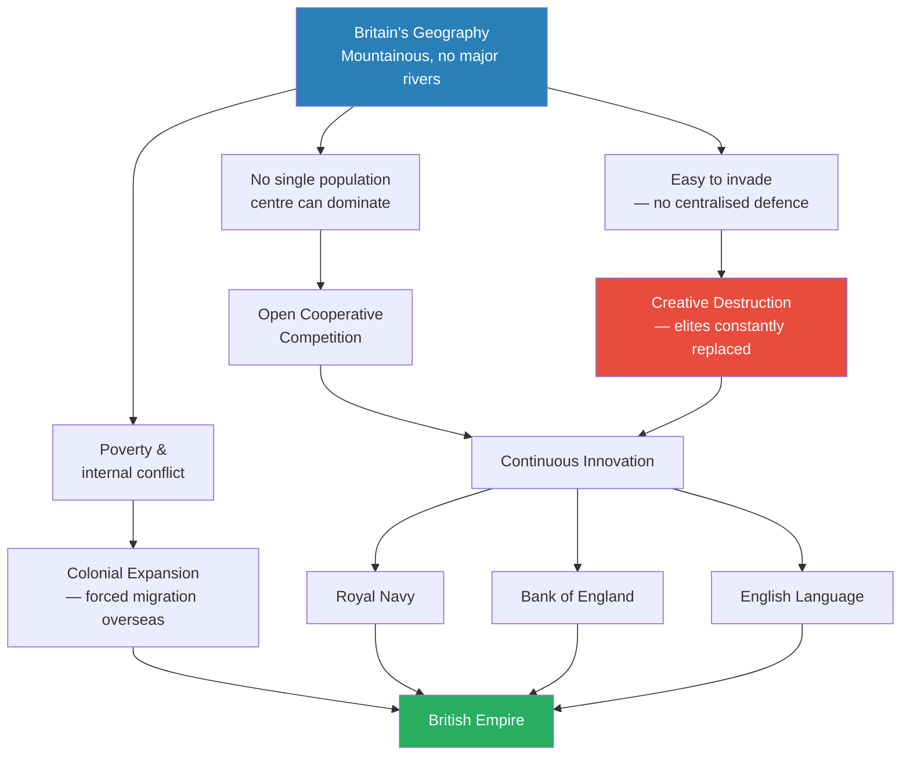
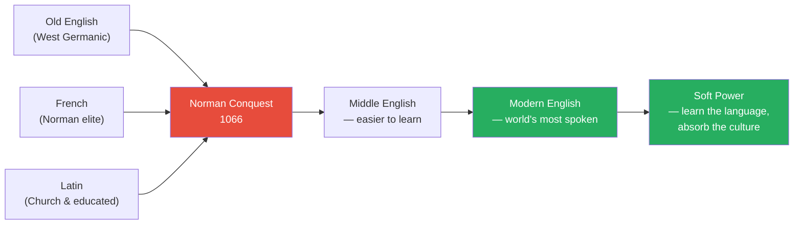
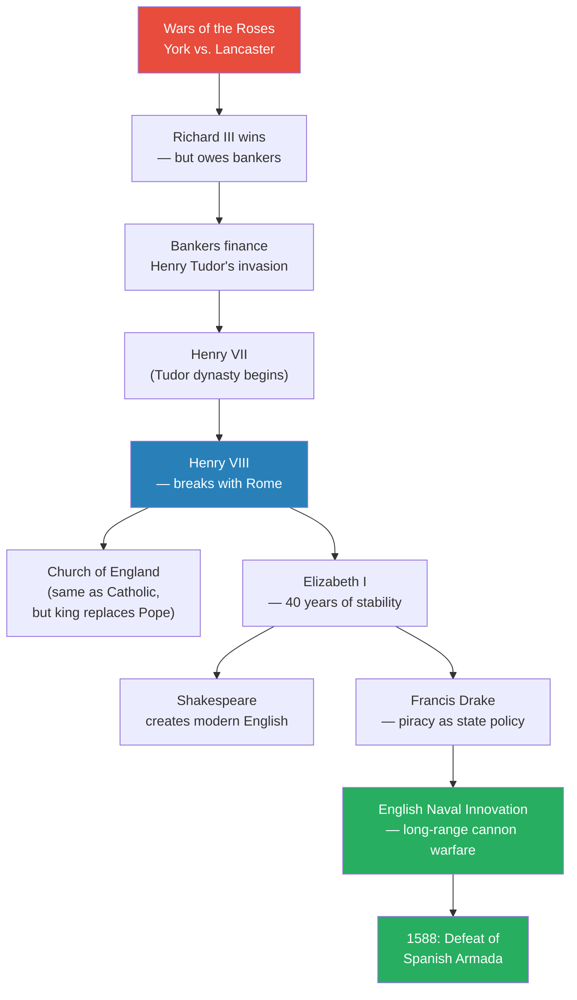
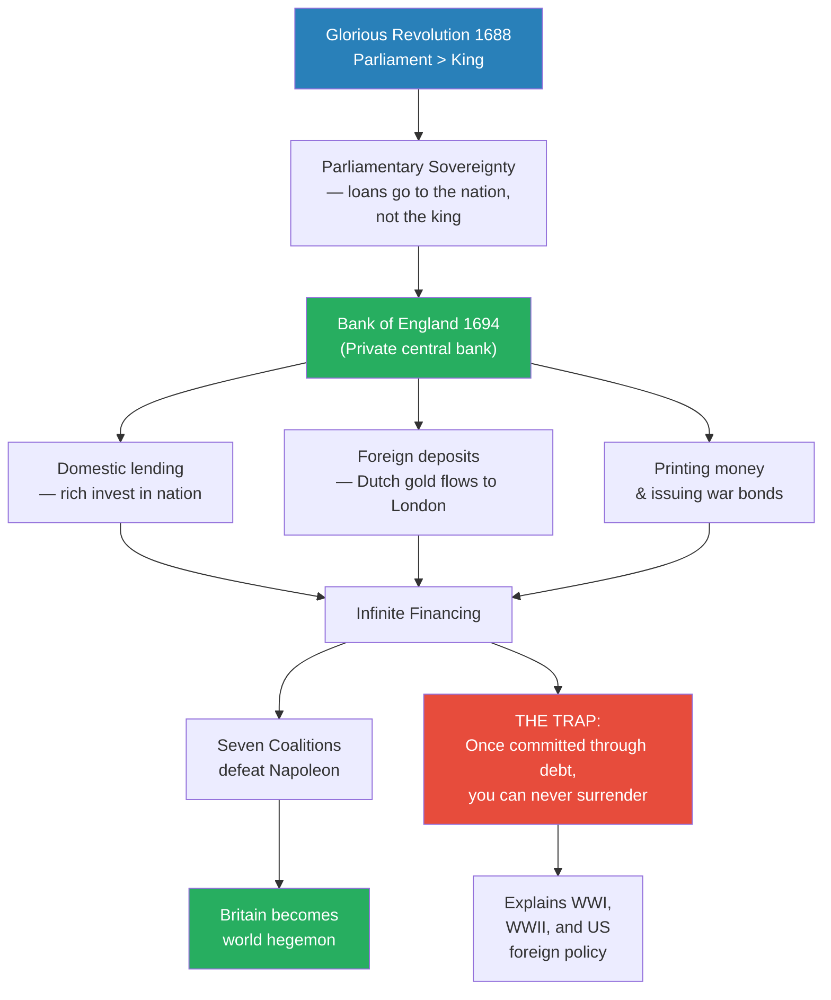
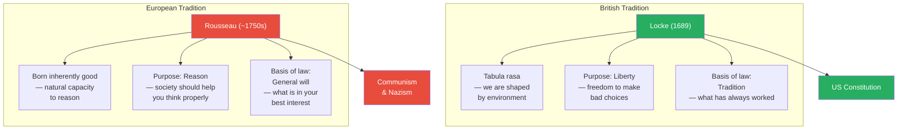
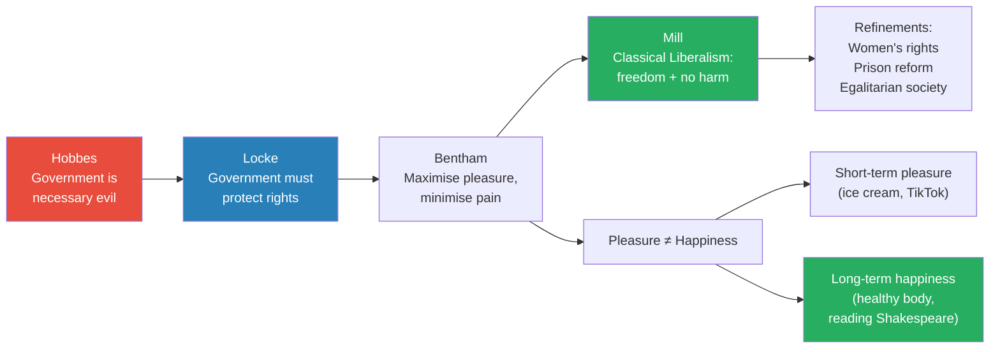
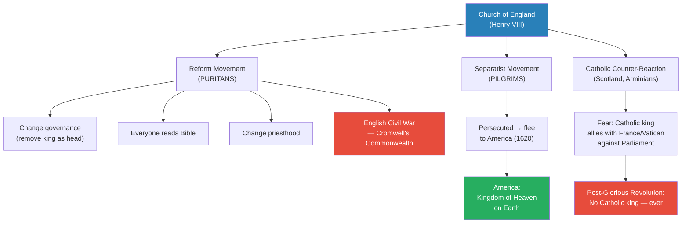

# Rule, Britannia!

> Prof. Jiang asks how a small, mountainous, poor island became the greatest empire in human history. His answer is geographic determinism filtered through centuries of creative destruction: Britain's lack of a major river prevented any single population centre from dominating, which kept power fragmented, competition alive, and elites constantly replaced by invaders bringing new ideas. This relentless cycle of invasion, rebellion, and adaptation produced three innovations that no rival could match — the Royal Navy for global trade, the Bank of England for infinite war financing, and the English language for soft power. Along the way, Prof. Jiang traces the political philosophy that emerged from this crucible, contrasting the British tradition of practical liberty (Locke, Bentham, Mill) with the European tradition of idealistic reason (Rousseau, Kant), and argues that this philosophical divide explains everything from the American Constitution to the rise of Communism and Nazism.

---

## Overview: Key Highlights

- <b style="color: #27ae60">Geography forced innovation</b> — Britain's mountainous terrain and lack of major rivers prevented centralisation, creating perpetual open competitive cooperation
- <b style="color: #e74c3c">Creative destruction drove progress</b> — Britain's elites were constantly replaced by invaders (Yamnaya, Romans, Anglo-Saxons, Vikings, Normans), each wave importing new ideas
- <b style="color: #2980b9">The Bank of England (1694)</b> — the single most consequential innovation, allowing Britain to mortgage its future and finance unlimited warfare through sovereign debt
- <b style="color: #27ae60">Once committed to war through debt, Britain could never surrender</b> — this explains seven coalitions against Napoleon and the logic of both World Wars
- <b style="color: #2980b9">The Magna Carta (1215)</b> — established due process and the rule of law, becoming the foundation of British constitutionalism and later the American Constitution
- <b style="color: #e74c3c">The Glorious Revolution (1688) ended royal sovereignty</b> — Parliament became the supreme authority, energising the middle class and enabling the Industrial Revolution
- <b style="color: #2980b9">English as a weapon of soft power</b> — the merger of Germanic, French, and Latin created the world's easiest language to learn, spreading British culture globally
- <b style="color: #27ae60">The British ask "what works" — the Europeans ask "what is right"</b> — this fundamental divide separates Locke's liberalism from Rousseau's idealism
- <b style="color: #2980b9">Classical liberalism (John Stuart Mill)</b> — the philosophy that people should be free to do whatever they want as long as it does not harm others
- <b style="color: #e74c3c">Rousseau's ideas produced Communism and Nazism</b> — while Locke's ideas produced the US Constitution
- <b style="color: #27ae60">The British Empire was founded by accident</b> — poverty and internal conflict forced colonial expansion, not imperial ambition
- <b style="color: #2980b9">Open cooperative competition</b> — the mechanism by which fragmented, river-less societies generate more innovation than centralised empires built on major rivers

| Concept | One-line summary |
|---------|-----------------|
| **Open cooperative competition** | Fragmented power centres competing and cooperating simultaneously, driven by geography |
| **Creative destruction** | Old elites constantly replaced by new ones bringing fresh ideas — the engine of British innovation |
| **Bank of England** | Private central bank (1694) that allowed Britain to finance wars through sovereign debt and foreign deposits |
| **Magna Carta** | 1215 charter establishing due process and rule of law — the beginning of the British Constitution |
| **Glorious Revolution** | 1688 transfer of sovereignty from king to Parliament — precondition for the Industrial Revolution |
| **Soft power** | Cultural influence through language — learning English means absorbing British culture and values |
| **Tabula rasa** | Locke's blank slate — we are shaped by environment, not born with innate knowledge |
| **General will** | Rousseau's concept — what is in people's best interest, not necessarily what they vote for |
| **Utilitarianism** | Bentham's philosophy — maximise pleasure, minimise pain as the basis for law and governance |
| **Classical liberalism** | Mill's refinement — freedom to act without harming others, plus the distinction between short-term pleasure and long-term happiness |

---

# The Lecture

## How Did a Poor Island Conquer the World? [0:00 - 9:47]

*Prof. Jiang opens with the central question of the lecture: how did England, a small, mountainous, poor island, surpass Spain, France, Germany, and Russia to become the greatest empire in human history? His answer begins with geography and ends with a pattern of creative destruction stretching across millennia.*

> [!tip] Core Insight
> The British Empire was founded by accident. Britain's poverty, internal division, and geographic fragmentation forced its people overseas to seek opportunity — colonial expansion was an escape valve, not a grand strategy.

*Britain's geographic handicap — mountainous, river-less, fragmented — became its greatest advantage. The same conditions that prevented centralisation also prevented stagnation, generating a relentless cycle of innovation that eventually produced three world-changing institutions.*

> [!note]- Expand: Full Lecture Detail
> Prof. Jiang opens by projecting a map of the British Empire at its 19th-century peak — red covering most of the globe — and asks: how did this happen?
>
> His argument has three layers:
>
> - <b style="color: #2980b9">Geography as destiny</b> — Britain is extremely mountainous with many rivers but no major rivers. Unlike China (Yangtze), Egypt (Nile), or Mesopotamia (Tigris-Euphrates), where a single river allowed one population to grow until it overwhelmed the region, Britain's terrain kept populations small, scattered, and competitive
>   - No centralised authority could hold the island together for long
>   - This meant foreign invaders could establish settlements relatively easily — "they have no centralised authority, so it's possible for other groups of people to come and create settlements"
> - <b style="color: #2980b9">Creative destruction</b> — throughout its history, Britain underwent repeated elite replacement:
>   - The original agricultural people (Stonehenge builders, linked to Gobekli Tepe's astronomical-religious tradition) were conquered and genetically replaced by the Yamnaya
>   - The Romans brought technology (aqueducts, irrigation, urbanisation) and law, founding Londinium on the Thames
>   - The Anglo-Saxons (Angles, Saxons, Jutes) arrived from Denmark and northern Germany, establishing West Germanic / Old English culture
>   - The Vikings carved out the Danelaw, merging Norse culture with Anglo-Saxon
>   - The Normans conquered in 1066, drawing Britain into French politics and transforming the language
> - <b style="color: #27ae60">Forced expansion</b> — because Britain was poor and divided, people migrated overseas to seek better opportunities. "There was no intention to create this empire, but because of these historical, geographic, demographic forces, Britain became the world's largest empire"
>
> Prof. Jiang then traces Britain's demographic history:
> - Population stayed flat until ~1000 AD due to poverty and division
> - Europe's proto-industrial and agricultural revolution caused population growth after 1000
> - The Black Death collapsed the population across all of Europe
> - The gunpowder revolution and subsequent industrialisation caused recovery
> - Between the 16th century and ~1800, population stayed flat again — this is the Industrial Revolution period
>   - Cities were deadly: disease, malnutrition, no sanitation caused early death
>   - Massive inequality forced emigration to America, Australia, and New Zealand
>   - "Even though the Dutch were the first to discover and settle Australia and New Zealand, it is the British who, because of pressure back home, will settle" there — creating British rather than Dutch culture
> - After 1800, improvements in nutrition and sanitation caused the population to explode — "and this is really why Europe will eventually conquer the world"
>
> > [!example] Stonehenge and Gobekli Tepe — Connected by the Stars
> > - The original settlers of the British Isles were an agricultural people who built Stonehenge
> > - Prof. Jiang connects this directly to Lecture 1: both Gobekli Tepe (Anatolia) and Stonehenge are astronomical calendars
> > - Both were designed to measure the stars, track time, and channel divine energy onto the earth to feed agriculture
> > - The Gobekli Tepe culture spread throughout Europe and into the British Isles
> > - These people were eventually conquered and genetically replaced by the Yamnaya — the first of many cycles of creative destruction
> > **The lesson:** Britain's history of elite replacement began at the very dawn of settlement — the pattern that would define the island was already running before written records began.

---

## The Norman Conquest and the Birth of English [9:47 - 19:08]

*Prof. Jiang explains why 1066 was a turning point on two axes: it drew Britain into continental European politics (triggering the Hundred Years' War), and it fused Germanic, French, and Latin into Middle English — creating the easiest language in the world to learn and the foundation of British soft power.*

*The Norman Conquest was a linguistic accident that became a strategic weapon. By blending three language families, it created a language that anyone could learn — and learning a language means absorbing its culture, history, and values.*

> [!note]- Expand: Full Lecture Detail
> Prof. Jiang marks 1066 as the year everything changed, for two reasons:
>
> - <b style="color: #2980b9">Geopolitical realignment</b> — the Normans were Vikings who had settled in Normandy, France. Before the conquest, the Anglo-Saxons were Germanic, focused on Northern Europe. Now Britain was drawn into French politics, leading to the disastrous Hundred Years' War as England tried to maintain territory in France
> - <b style="color: #27ae60">Language revolution</b> — the merger of Old English (Germanic) with French and Latin created Middle English. The key insight: "What makes Middle English different from Old English is Middle English is a lot easier to learn, because now you have a very cosmopolitan nature to Britain — Vikings, Anglo-Saxons, French, Normans. They all need to speak one language. So the best elements of these different languages are blended into Middle English"
>
> Prof. Jiang then makes his soft power argument:
> - English is the most widely spoken language in the world not just because of Anglo-American hegemony, but because <b style="color: #27ae60">it is the easiest language to learn</b>
> - "When you learn a language, you're not just learning a language, you're also learning a culture, you're learning a history — and that's what we call soft power"
> - "The British did this better than anyone else. Now, the Americans do this better than everyone else"
> - He previews the next lecture (Shakespeare): "Because of Shakespeare, there will be no English language... you can also argue there'll be no British Empire"
>
> He then turns to the Magna Carta (1215):
> - King John tried to impose taxes on the nobles to finance wars in France
> - The nobles rebelled and forced John to sign the Magna Carta — "the great charter"
> - This was not unique in history — nobles had forced compromises before — but it was the first time such a compromise was <b style="color: #2980b9">written down and became part of tradition</b>
> - It became the beginning of the British Constitution — which is unique because it is unwritten, "a set of traditions and norms"
>
> Prof. Jiang highlights three key clauses:
>
> - **Clause 10 (Jewish debt):** "If anyone who has borrowed a sum of money from Jews dies before the debt has been repaid, his heir shall pay no interest." He explains that the Catholic Church forbade usury, so kings used Jews as financial intermediaries — lending money, collecting taxes, running businesses. Jews became scapegoats for the elite. "If you want to understand World War Two, you understand the Holocaust — it starts way back here"
> - **Clause 39 (Due process):** "No free man shall be seized or imprisoned except by the lawful judgement of his equals or by the law of the land" — this established <b style="color: #2980b9">due process</b>
> - **Clause 40 (Rule of law):** "To no one will we sell, to no one deny or delay right or justice" — this established that <b style="color: #2980b9">no one is above the law</b>, not even the king
>
> These principles became the basis of British common law and later the American Constitution.
>
> > [!example] Joan of Arc and the Hundred Years' War
> > - The Norman Conquest drew Britain into French territorial disputes
> > - The resulting Hundred Years' War was a series of disastrous campaigns to maintain English territory in France
> > - The most famous figure to emerge was Joan of Arc — a French teenage mystic who led French armies to victory against the English and their allies
> > - The war demonstrated that continental ambition was a dead end for England — its future lay on the seas, not on European soil
> > **The lesson:** The Hundred Years' War taught England that it could not hold land in Europe — a lesson that redirected English ambition toward naval power and overseas expansion.

---

## The Magna Carta's Jewish Clause and the Roots of Anti-Semitism [14:00 - 16:30]

*Prof. Jiang pauses on a detail most histories skip: why were Jews in England in 1215, and why does a debt clause about them appear in the founding document of British constitutionalism? His answer connects medieval finance to the Holocaust.*

> [!note]- Expand: Full Lecture Detail
> Prof. Jiang unpacks the economics behind Clause 10:
>
> - Europe was entirely Catholic, and the Catholic Church explicitly forbade <b style="color: #2980b9">usury</b> — charging interest on debt — because it was socially destructive: "you fall into debt, you're basically stuck there for all of eternity"
> - But debt was extremely profitable. The king and nobility circumvented the taboo by using Jews as financial intermediaries
>   - Jews lent money and charged interest
>   - The king took a cut of the profits
>   - Jews also collected taxes and ran businesses subcontracted from nobles
>   - In return, the king and nobles provided protection
> - <b style="color: #e74c3c">Jews became the scapegoats for the elite</b> — they were the visible face of debt collection, taxation, and lending, while the real beneficiaries remained hidden
> - Over time, even nobles fell into debt to Jews, creating massive social tension
> - The Magna Carta's solution: you still owe the principal, but if you die, your heir does not inherit the interest
> - Prof. Jiang draws the long line: "If you want to understand World War Two, you understand the Holocaust — it starts way back here." The structural role of Jews as financial intermediaries and scapegoats was established centuries before modern anti-Semitism

---

## Tudor England, the Reformation, and Naval Innovation [19:08 - 27:08]

*Prof. Jiang traces the chain from the Wars of the Roses through the Tudors, the break with Rome, the Elizabethan era, and the rise of English naval power — showing how each crisis forced the next innovation.*

*Every node in this chain is a crisis that produced an innovation. Richard III's debt to bankers gave England the Tudors; Henry VIII's marital crisis gave England its own church; Elizabeth's poverty gave England state-sponsored piracy; and piracy gave England long-range naval warfare.*

> [!note]- Expand: Full Lecture Detail
> Prof. Jiang narrates a chain of crises and responses:
>
> **The Wars of the Roses:**
> - A devastating civil war between the House of York and the House of Lancaster — "this is a Game of Thrones television series... actually based on the civil war between the House of York and the House of Lancaster"
> - Richard III of York emerged victorious but had borrowed heavily from the Florentine Medicis to finance the war
> - Once king, Richard refused to repay — "I'm king, and I don't have to pay you back"
> - <b style="color: #e74c3c">Lesson: if bankers are angry at you, you have a problem</b> — the Medicis financed Henry Tudor to invade England and depose Richard, establishing the Tudor dynasty
>
> **Henry VIII and the Break with Rome:**
> - Henry VIII wanted to divorce Catherine of Aragon; the Pope refused
> - Henry established the Church of England and declared himself its head
> - Prof. Jiang emphasises: "There's only one difference between the Church of England and the Catholic Church. The Catholic Church swears loyalty to the Pope. The Church of England swears loyalty to the King of England. That's it, guys. There's no other difference — the customs, the doctrine, the rituals, are all the same"
>
> **Elizabeth I:**
> - Reigned for 40+ years, bringing stability by sympathising with Protestants while working with Catholics
> - Resisted Catholic conspiracies and rebellions
> - Shakespeare wrote during her reign — Prof. Jiang previews the next lecture: without Shakespeare, "there's no English language... you can also argue there'll be no British Empire"
>
> **Francis Drake and Naval Innovation:**
> - Elizabeth pursued a policy of piracy: "England is poor, Spain is rich, so what do you do? You steal from the rich and give to the poor"
> - The English pioneered <b style="color: #2980b9">long-range cannon warfare at sea</b>, replacing the ancient method of ramming and boarding
>   - Problems were enormous: cannons could sink your own ship, blow it up, and were inaccurate
>   - "But the thing about the British that made them very similar to the Romans is they were relentless. They were willing to suffer heavy casualties, major setbacks, major failures, and still persist until they eventually won"
>
> > [!example] The Spanish Armada — Victory, Defeat, and Persistence (1588-1589)
> > - 1588: the English defeated the Spanish Armada — celebrated in England as the moment the Royal Navy became supreme
> > - 1589: one year later, the Spanish defeated the English, inflicting tens of thousands of casualties
> > - Prof. Jiang's point is not the individual battles but the pattern: "These wars go back and forth. There's no one time when the British are dominant. What matters is persistence. What matters is resilience"
> > - In this respect, "the English are far superior to their European adversaries"
> > **The lesson:** Military supremacy is not about winning every battle — it is about being willing to lose more battles than your enemy can win.
>
> **King James and the Bible:**
> - After Elizabeth, King James of Scotland inherited the English throne, uniting Scotland and England
> - He produced the King James Bible — the first mass-produced English Bible, answering the Protestant demand that everyone read scripture directly
> - <b style="color: #27ae60">The Bible standardised the language</b> — enabling the transition from Middle English to modern English

---

## The Glorious Revolution and the Bank of England [27:08 - 36:50]

*Prof. Jiang explains how the Glorious Revolution of 1688 transferred sovereignty from king to Parliament, and how this single constitutional change made the Bank of England possible — creating the innovation that defeated Napoleon and built the British Empire. He then reveals the trap: once you finance war through debt, you can never surrender.*

> [!tip] Core Insight
> Central banking allows you to mortgage your nation's future in the pursuit of total war. It allows you to weaponise the trust and confidence of your people. But once committed, you fight to the bitter end — because defeat means national bankruptcy.

*The Bank of England solved one problem (how to finance unlimited war) and created another (once financed, you cannot stop fighting). This single mechanism explains British stubbornness from Napoleon through both World Wars and, Prof. Jiang argues, American foreign policy today.*

> [!note]- Expand: Full Lecture Detail
> Prof. Jiang traces the path from the Pilgrims to the Glorious Revolution:
>
> **The Pilgrims (1620):**
> - The Puritans wanted to purge the Church of England of Catholic elements; the Pilgrims (separatists) wanted to abolish it entirely
> - The Pilgrims were persecuted and allowed to emigrate to America "to build a new civilization based on their beliefs — and the civilization, of course, is what we call America"
> - <b style="color: #27ae60">"America was founded by pilgrims who want to build a kingdom of heaven on earth"</b>
>
> **The English Civil War:**
> - The king again tried to impose too much authority over the nobles, with a religious dimension — the Puritans wanted a centralised theocracy
> - Oliver Cromwell and the Puritans won, establishing the Commonwealth of England
> - "This is a disaster. It doesn't really work out well, because it goes against British tradition" — England had always been decentralised and autonomous
> - After Cromwell died, the nobles reinstated a king (Charles II)
>
> **The Glorious Revolution (1688):**
> - James II, a Catholic king, raised fears he would ally with France, Spain, and the Vatican against Parliament
> - The nobles invited William of Orange (Dutch, but of British blood) to invade with 10,000 soldiers
> - James II was indecisive, his army deserted him, and he fled to France
> - <b style="color: #2980b9">This officially established the sovereignty of Parliament over the king</b>
> - "Now it's official — Parliament is the ultimate authority, ultimate sovereignty in Britain, and the king is a figurehead"
> - Consequence: the middle class now had incentive to work hard — patents, trademarks, property rights — leading to the Industrial Revolution
>
> **The Bank of England (1694):**
> - Before: kings borrowed from cartels of rich people. Charles II borrowed from London goldsmiths and Jews, then refused to pay — creating a credit crisis
> - Parliament solved this: "Now you are not lending money to the king. You are lending money to the nation"
>   - A king can die or be deposed — your money is gone
>   - A nation (backed by Parliament and the Navy) persists — your money is safe
> - Three sources of capital flowed in:
>   - Domestic: the rich invested in a stable nation
>   - Foreign: especially the Dutch, who needed a safe haven — "If you are in the Netherlands, you can be conquered by the French or the Germans. But if your money goes to London, no one's gonna touch that"
>   - Future: printing money and issuing war bonds
> - Result: <b style="color: #27ae60">Britain had infinite financing</b>
> - "It took seven wars, seven coalitions, to defeat Napoleon. Each of these coalitions was financed by Britain. And once Napoleon was defeated, Britain became the hegemon of the world"
>
> Prof. Jiang then delivers the trap:
>
> - <b style="color: #e74c3c">"Once you commit to a war, once you raise debt and commit to a war, you're forced to fight the war until the very bitter end — because if you lose, your nation goes bankrupt"</b>
> - Napoleon offered peace: "I control all of Europe. Let's talk peace. Let's just trade peacefully"
> - Britain refused: "We lent a lot of money to the Austrians, the Prussians, the Germans, and the Russians in order to defeat you. If we sign a deal of peace, all this money is now gone, and the Bank of England — we the British nation — is completely wiped out"
> - "This explains what happened in World War One, World War Two, and this also explains American foreign policy"

---

## British vs. European Political Philosophy [36:50 - 45:27]

*Prof. Jiang draws the sharpest contrast of the lecture: British thinkers ask "what works?" while European thinkers ask "what is right?" He compares Locke and Rousseau across three dimensions — human nature, purpose of society, and basis of law — and argues this divide produced the American Constitution on one side and Communism and Nazism on the other.*

*Two philosophical traditions, two outcomes. Prof. Jiang argues that the difference between British pragmatism and European idealism is not merely academic — it produced the defining political systems of the modern world.*

> [!note]- Expand: Full Lecture Detail
> Prof. Jiang begins with Hobbes, then Locke, then contrasts Locke with Rousseau across three dimensions:
>
> **Thomas Hobbes — Leviathan:**
> - Lived through the English Civil War, saw chaos and destruction firsthand
> - Wrote *Leviathan* to justify the return to monarchy after the Commonwealth failed
> - His argument: we are born in a state of nature where we can do anything — kill, steal, love. Why give up this freedom for government?
> - "Because state of nature sucks" — without government, life is "solitary, poor, nasty, brutish, and short"
> - Conclusion: no matter how bad government is, it is absolutely necessary. You can never challenge it because the alternative is always worse
>
> **John Locke — Second Treatise on Government (1689):**
> - Writing during the Glorious Revolution, a supporter of Parliament
> - Agrees with Hobbes that government is necessary, but adds a crucial condition:
> - "When we were born in a state of nature, we are born with certain inalienable rights — the right to life, liberty, and the pursuit of property"
> - <b style="color: #27ae60">Government is only legitimate if it protects these rights. If it fails, the people may rebel</b>
> - Locke is considered the founder of liberalism; his ideas became the basis for the US Constitution
>
> **Three differences between British and European philosophy:**
>
> | Dimension | Locke (British) | Rousseau (European) |
> |-----------|----------------|-------------------|
> | **Human nature** | <b style="color: #2980b9">Tabula rasa</b> — blank slate, shaped by environment | Born inherently good, with natural capacity to reason |
> | **Purpose of society** | Liberty — freedom to make your own choices, even bad ones | Reason — society should help you reason properly |
> | **Basis of law** | Tradition — "what we've been doing all this time" (common law) | <b style="color: #2980b9">General will</b> — what is in people's best interest, not what they vote for |
>
> Prof. Jiang illustrates with ice cream:
> - Locke: if the whole school votes for free ice cream, give them free ice cream — they have the liberty to choose
> - Rousseau: no — if you reason independently about your best interest, you would know ice cream is bad for you. The general will is not what you want; it is what you need
>
> The summary line: <b style="color: #27ae60">"The Europeans are always asking, what is good, what is right. The British and the Americans only ask: what works. What is the least worst world we can live in?"</b>
>
> - "The British are practical. You can also say the British are utilitarian. The Europeans are romantic and idealistic"
> - <b style="color: #e74c3c">Rousseau's thinking produced Communism and Nazism. Locke's ideas produced the US Constitution</b>

---

## Utilitarianism and Classical Liberalism [45:27 - 55:30]

*Prof. Jiang completes the British philosophical arc: Bentham formalises the pleasure-pain calculus, and Mill refines it into classical liberalism — the philosophy that people should be free to do whatever they want as long as it does not harm others, with the crucial distinction between short-term pleasure and long-term happiness.*

*The British philosophical tradition moves in one direction: from Hobbes's pessimism through Locke's rights-based liberalism to Mill's refined classical liberalism. Each thinker builds on and corrects the last.*

> [!note]- Expand: Full Lecture Detail
> **Jeremy Bentham — Utilitarianism:**
> - Agrees with Locke that society should be liberal and progressive
> - His innovation: a mathematical framework for getting there
> - Two principles govern the universe: <b style="color: #2980b9">the pleasure principle and the pain principle</b>
> - "If something makes us happy, it's inherently good. If something makes us feel pain, it's inherently bad"
> - Society should mathematically calculate the total pain and pleasure it produces, then maximise pleasure and reduce pain
> - Result: people should be guaranteed liberty — allowed to do whatever they want as long as it does not harm others
> - "You want to eat ice cream? Go eat ice cream. You're not harming anyone"
>
> **John Stuart Mill — Classical Liberalism:**
> - "Considered the most significant political philosopher of the past 200 years"
> - Founder of <b style="color: #2980b9">classical liberalism</b>: people should be free to do whatever they want as long as it does not hurt anyone, plus free debate is essential for societal progress
> - His key refinement of Bentham: <b style="color: #27ae60">not all pleasures are equal</b>
>   - Short-term pleasure: eating ice cream every day, watching TikTok videos
>   - Long-term happiness: having a healthy body that can climb mountains, being able to read Shakespeare and Dante
> - "Just because you enjoy something today doesn't mean it's good for you"
> - The purpose of life is happiness (long-term), not pleasure (short-term)
> - Classical liberalism's practical reforms: women's rights, prison reform, a more egalitarian society
>
> Prof. Jiang then summarises why the British Empire conquered the world — the three innovations driven by continuous creative destruction:
>
> 1. **The Royal Navy** — "its main purpose is actually not to engage in war and conquest. Its main purpose is to maintain global trade." Britain was the first to industrialise, producing finished goods that needed markets. The Navy opened and protected trade routes
> 2. **The Bank of England** — private, controlled by rich stockholders, with the powers of a central bank (print money, issue currency, sell bonds). "If you're a rich person, where are you gonna put your money? You're gonna put it into a central bank that's supported by government"
> 3. **The English language** — "the world's easiest language to learn. Most languages, in order to speak it well, you actually have to grow up in a place. But English is different — you can learn at any age and still have a pretty good command"
>
> These three innovations were driven by three factors:
> - <b style="color: #2980b9">Open cooperative competition</b> — fragmented power, no dominant centre
> - <b style="color: #2980b9">Creative destruction</b> — constant elite replacement bringing new ideas
> - <b style="color: #2980b9">Colonial expansion</b> — forced migration overseas (Canada, USA, Australia, New Zealand)

---

## The Problem of Religion in England [56:00 - 1:04:02]

*In the Q&A, Prof. Jiang unpacks the difference between Puritans and Pilgrims, traces how religious factionalism in England exported fanaticism to America, and explains why the British Constitution prohibits Catholic monarchs.*

*Religious factionalism in England produced two American founding strands: the Pilgrim theocratic tradition and the Enlightenment deist tradition. Prof. Jiang argues these two strands explain American politics from the Founding Fathers to Donald Trump.*

> [!note]- Expand: Full Lecture Detail
> A student asks about the difference between Puritans and Pilgrims. Prof. Jiang explains:
>
> - England's feudal, decentralised structure created enormous religious diversity — "if you cross from one village to the next, the culture can be very different"
> - As England industrialised, the rising middle class preferred <b style="color: #2980b9">Calvinism</b> over Catholicism — "in a Calvinist religion, you have to keep your money for yourself" vs. Catholicism where "you have to give all your money to the church"
> - Two responses emerged to the Church of England:
>   - **Puritans (Reform):** the Church of England is fine but needs purging of Catholic elements. Different factions wanted different things — new governance, universal Bible reading, reformed priesthood
>   - **Pilgrims/Separatists (Dissolution):** the Church of England is too corrupt — "there should be no earthly authority before God." These were the fanatics, persecuted and eventually executed
> - The Pilgrims fled to America to found a new civilisation based on their beliefs
> - The Puritans stayed and fought the Civil War, overthrowing the king under Cromwell
>
> Meanwhile, a counter-reaction:
> - Catholics (especially in Scotland) wanted to return England to Rome
> - Arminians wanted to maintain the Church of England as it was
> - The fear: a Catholic king could ally with France, Spain, and the Vatican to destroy Parliament
> - After the Glorious Revolution: <b style="color: #e74c3c">"a major reform is the king cannot be Catholic. And in fact, if you adhere to the throne, but if Parliament suspects you have Catholic sympathies, they will replace you with someone else"</b>
>
> Prof. Jiang connects to modern America:
> - America has two founding strands: the Pilgrim/Puritan theocratic strand and the Enlightenment deist strand (Jefferson, Hamilton, Washington)
> - "If you understand what's happening in America today — Donald Trump — you need to understand that it's these two strands that have always been present in America"
> - Left (Obama): America is great because it welcomes immigrants
> - Right (JD Vance): America is great because of Christianity, and multiculturalism threatens it
> - <b style="color: #e74c3c">"Because of this conflict, America is probably headed towards a civil war"</b>

---

## The Flexibility of the British Constitution [1:04:02 - 1:05:50]

*A student asks how much power the king actually has. Prof. Jiang explains that the unwritten constitution's genius lies in its flexibility — power depends on personality, longevity, alliances, and charisma, not on fixed rules.*

> [!note]- Expand: Full Lecture Detail
> - The British system is based on tradition, which builds in enormous flexibility
> - A king's power depends on his personality — Henry VIII was one of the most powerful kings in the world because:
>   - He was physically imposing and extremely charismatic
>   - He was excellent at building alliances with nobles
>   - He reigned for over 50 years, slowly inserting loyalists into positions of authority
>   - He was popular for breaking with the Catholic Church
> - "The English are extremely proud of their constitution" because it is unwritten and therefore living — "not constrained by words" but governed by traditions that allow the constitution to be "flexible and pertinent to the present"

---

## Two Strands of America [1:05:50 - end]

*Prof. Jiang previews the next lecture on the American Revolution by framing America as "a coalition of conflicts" — a melting pot held together by the tension between its Puritan theocratic strand and its Enlightenment deist strand.*

> [!note]- Expand: Full Lecture Detail
> A student asks: if the Pilgrims were puritanical and intolerant, how did America become multicultural?
>
> Prof. Jiang answers: America is "a coalition of conflicts" with two dominant strands:
> - <b style="color: #2980b9">The Pilgrim strand</b> — puritanical, theocratic, "let's create a theocracy"
> - <b style="color: #2980b9">The Enlightenment strand</b> — deist, rationalist, "founding a new empire based on reason"
> - Most Founding Fathers (Jefferson, Hamilton, Washington) were deists who wanted "a tolerant, multicultural empire"
> - These two strands have coexisted in tension throughout American history
> - Today: the left (multiculturalists) vs. the right (Christian nationalists) — "and right now they're coming into conflict with each other"
> - Prof. Jiang's prediction: "Because of this conflict, America is probably headed towards a civil war"
> - Next lecture: Shakespeare and the creation of modern English. Then: the American Revolution

---

## Connections

**Builds on:** [[01 - Explaining Humanity's Transition to Agriculture]] (Gobekli Tepe's astronomical-religious culture spreading to Stonehenge), [[05 - The Yamnaya Conquest of Europe]] (Yamnaya replacing Britain's original settlers — the first creative destruction), [[14 - Hannibal Barca, Lucius Brutus, and the Triumph of Rome]] (Roman conquest of Britain, Roman law tradition, and Roman military resilience mirrored in the British)

**Sets up:** The next lecture on Shakespeare and the creation of the English language, and the subsequent lecture on the American Revolution — which Prof. Jiang frames as the continuation of British ideas (Locke's liberalism, central banking, and the two-strand Puritan/deist tension)

**Recurring themes:**
- Creative destruction — the same pattern seen throughout the series (Bronze Age Collapse, Rome's rise, Yamnaya conquests) now applied to Britain's entire history
- Geography as destiny — revisiting the river-civilisation model from early lectures to explain why Europe (and Britain in particular) developed differently
- Religion as political engine — from Gobekli Tepe to the Reformation, religion drives civilisational change
- The trap of innovation — every solution creates a new problem (central banking enables total war but makes surrender impossible)
- Debt as weapon — the financial dynamics that will reappear in the American lectures

**Related books in vault:**
- [[Sapiens - Yuval Noah Harari]] — the agricultural revolution and Gobekli Tepe connections referenced at the lecture's opening
- [[The Prince - Niccolo Machiavelli]] — the pragmatic "what works" tradition that Prof. Jiang identifies as distinctively British/Anglo-American

---

## The Takeaway

This lecture is a structural argument, not a chronological survey. Prof. Jiang is not merely recounting British history — he is identifying a mechanism (geographic fragmentation leading to open competitive cooperation leading to creative destruction leading to innovation) and testing it against a thousand years of evidence. Every invasion, every rebellion, every constitutional crisis follows the same pattern: the old elite falls, the new elite brings fresh ideas, and Britain emerges stronger. The mechanism is the same one that drove the Bronze Age Collapse, the rise of Rome, and the Yamnaya conquests — creative destruction, applied relentlessly to one small island.

The most counterintuitive insight is the Bank of England trap. Central banking sounds like pure advantage — infinite financing, foreign capital flowing in, the ability to mortgage the future. But Prof. Jiang reveals the hidden cost: once you finance a war through sovereign debt, surrender becomes national suicide. This single mechanism explains why Britain fought seven coalitions against Napoleon without compromise, why it fought both World Wars to exhaustion, and — as Prof. Jiang promises to show — why American foreign policy follows the same logic today. The innovation that built the empire also made the empire unable to stop fighting.

The lecture ends by looking forward: America inherited all three British innovations (naval power, central banking, and English as soft power) plus the unresolved tension between Puritan theocracy and Enlightenment liberalism. Prof. Jiang promises that this tension — two founding strands pulling in opposite directions — explains American politics from the Founding Fathers to Donald Trump, and may be driving the country toward civil war. The British Empire may have dissolved, but its ideas, its language, and its contradictions are still running the world.
