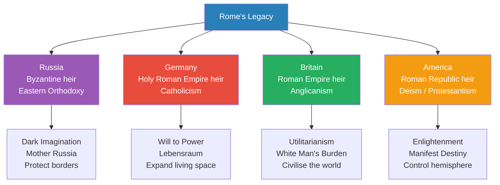
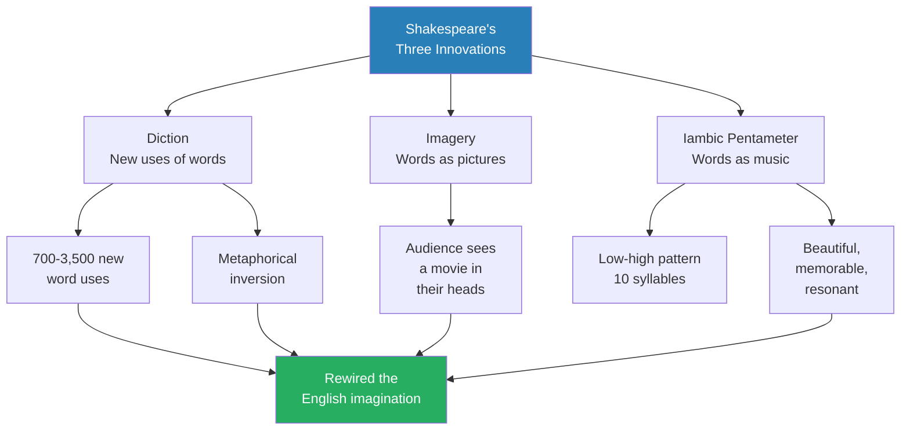
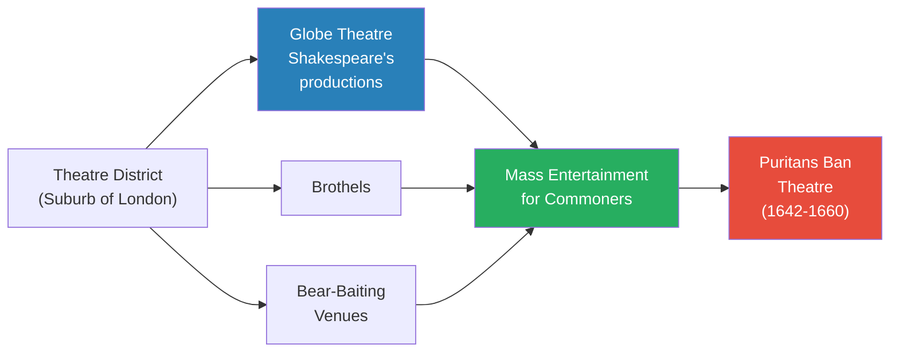
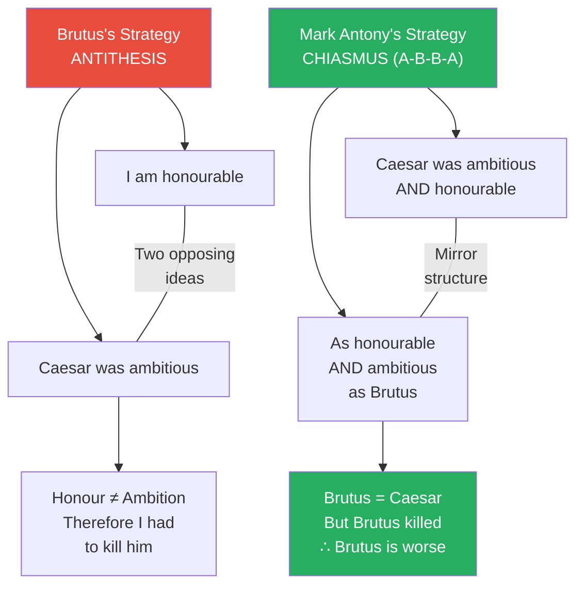
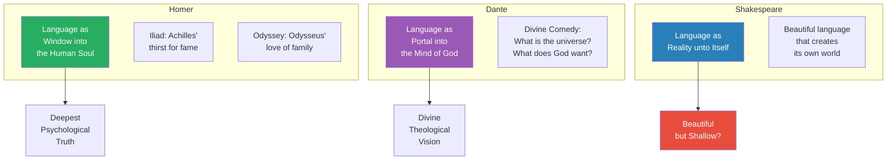
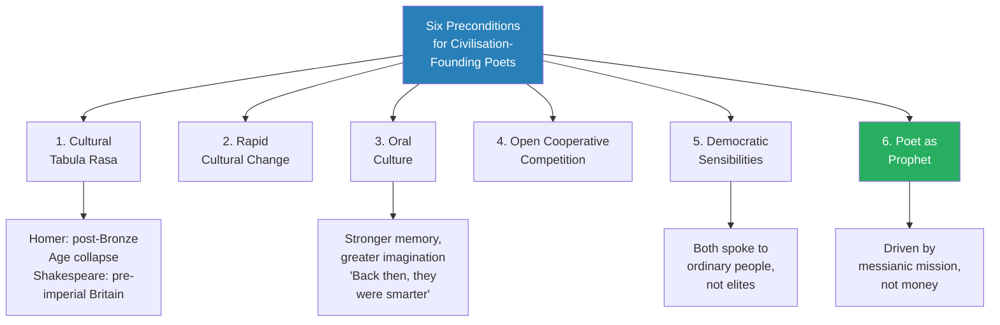
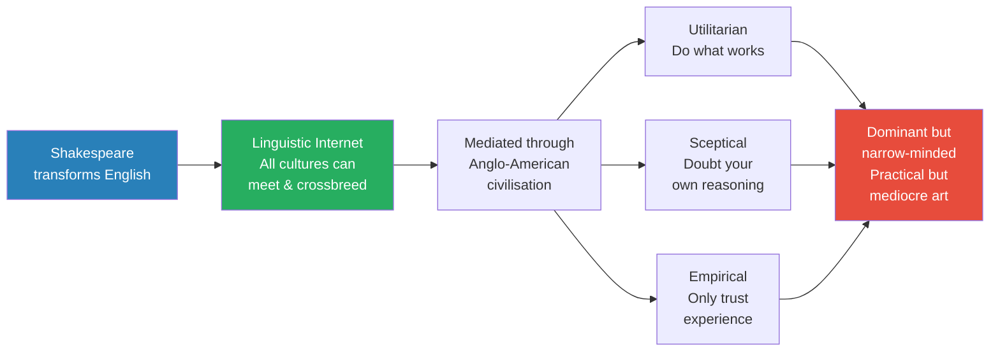
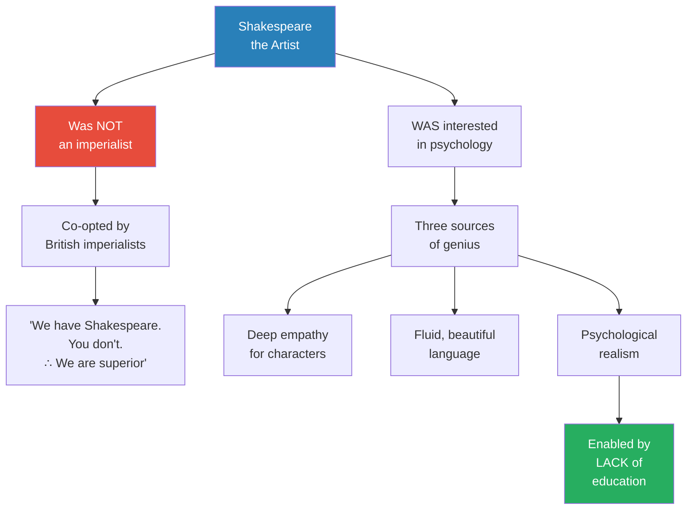

# Shakespeare's Language of Empire

> Prof. Jiang argues that William Shakespeare did not merely write great plays — he performed neurological surgery on the English-speaking world. By innovating in diction, imagery, and iambic pentameter, Shakespeare transformed English from a provincial island language into a flexible, beautiful, and memorable medium capable of absorbing all cultures and ideas. This made English the world's "linguistic internet" — but one mediated through Anglo-American values of utilitarianism, scepticism, and empiricism. The lecture situates Shakespeare alongside Homer and Dante as the third of three civilisation-founding poets, each of whom rewired their society's collective consciousness through language.

---

## Overview: Key Highlights

- <b style="color: #27ae60">Shakespeare transformed English into the world's "linguistic internet"</b> — a platform where all cultures, ideas, and worldviews can meet and crossbreed
- <b style="color: #2980b9">Diction</b> — Shakespeare's signature innovation: using existing words in radically new ways to force the audience to reimagine reality
- <b style="color: #e74c3c">English dominance carries Anglo-American cultural baggage</b> — utilitarianism, scepticism, and empiricism travel invisibly with the language
- <b style="color: #2980b9">Iambic pentameter</b> — the musical rhythm (low-high, low-high, five beats) that made Shakespeare's language beautiful, memorable, and capable of performing "surgery on the brain"
- <b style="color: #27ae60">Shakespeare's plays contain multiple simultaneous layers of meaning</b> — "To be or not to be" supports at least four valid interpretations at once
- <b style="color: #2980b9">Antithesis vs. chiasmus</b> — two rhetorical devices from Julius Caesar that demonstrate how language restructures the neurological pathways of an audience
- <b style="color: #e74c3c">Shakespeare is beautiful but not deep</b> — Prof. Jiang argues that compared with Homer (psychology) and Dante (theology), Shakespeare offers "a pretty nothingness"
- <b style="color: #27ae60">Shakespeare's lack of formal education was his greatest asset</b> — it freed him from elite prejudice and gave him unfiltered empathy for ordinary people
- <b style="color: #2980b9">Four modern civilisations</b> — Russia, Germany, Britain, and America each claim Roman heritage but express it through radically different cultural identities
- <b style="color: #e74c3c">Shakespeare was co-opted by imperialism</b> — he was not an imperialist himself, but his legacy became the cultural justification for the British Empire
- <b style="color: #27ae60">Language as reality unto itself</b> — Shakespeare invented the idea that language can create a self-contained world that activates all the senses
- <b style="color: #2980b9">Poet as prophet</b> — Homer, Dante, and Shakespeare were all driven by messianic mission, not money or fame

| Concept | One-line summary |
|---------|-----------------|
| **Diction** | Using existing words in new, imaginative ways to rewire how people think |
| **Iambic pentameter** | Ten-syllable musical rhythm (low-high pattern) that makes language memorable and beautiful |
| **Antithesis** | Rhetorical device that creates two opposing, mutually exclusive ideas — Brutus's strategy |
| **Chiasmus** | A-B-B-A rhetorical structure that collapses oppositions — Mark Antony's counter-strategy |
| **Linguistic internet** | English as a universal platform where all cultures can meet — but mediated by Anglo-American values |
| **Language as reality unto itself** | Shakespeare's idea that language creates a self-contained world, not just a window into truth |
| **Tabula rasa** | Cultural blank slate — the condition that allows civilisation-founding poets to emerge |
| **White Man's Burden** | The ideology that British culture is inherently superior and must civilise the world — Shakespeare co-opted to justify it |
| **Lebensraum** | German concept of "living space" — expansion to protect the nation from surrounding threats |
| **Manifest Destiny** | American belief that God wills their control of the entire Western Hemisphere |
| **Poet as prophet** | Great artists driven by messianic mission to transform the world, not by money or fame |

---

# The Lecture

## The Four Modern Civilisations — A Framework for the Rest of the Course [0:00 - 9:21]

*Prof. Jiang opens by stepping back from Shakespeare to set the stage for the final arc of the Civilization series. He introduces four modern civilisations — Russia, Germany, Britain, and America — that have fought for global dominance, each claiming to be the true heir of Rome but interpreting that inheritance through radically different geographies, religions, and philosophies.*

> [!tip] Core Insight
> Geography determines cultural identity. Russia's vast, cold darkness produces a dark imagination and brilliant geopolitical leaders. Germany's lack of natural boundaries produces the will to power. Britain's island fortress produces practical utilitarianism. America's continental fortress produces the belief that it can ignore the world.

*Each civilisation claims Roman heritage but expresses it through the lens of its geography. The conflict between these four drives all modern innovation, philosophy, and warfare from 1800 to the present.*

> [!note]- Expand: Full Lecture Detail
> Prof. Jiang tells the class that the course will end by examining the four great modern civilisations that have fought for global dominance: <b style="color: #2980b9">Russia, Germany, Britain, and America</b>. All four claim to be the ultimate Christian civilisation and the true heir of Rome — but their differences in geography produce radically different interpretations of Christianity and "Romanness."
>
> He walks through each civilisation's geography and character:
>
> - **Russia** — the largest landmass in the world, huge, cold, and dark
>   - Geography transformed the Russian character into something brooding and profound
>   - Russia sees itself as heir to the <b style="color: #2980b9">Byzantine Empire</b> and protector of <b style="color: #2980b9">Eastern Orthodoxy</b> — think Augustine's *City of God*: mystical, metaphorical, collectivist
>   - Russia has a "dark imagination" that produces the greatest literature (Tolstoy, Dostoevsky), music (Tchaikovsky, Stravinsky), and geopolitical leaders in history
>   - The greatest geopolitical leader of the 20th century was Joseph Stalin; today it is Vladimir Putin
>   - Cultural identity: <b style="color: #27ae60">Mother Russia</b> — the land, the nation, the people are divine; all strategy aims to protect borders from enemies
>
> - **Germany** — sits within Europe without natural boundaries, always attacked and threatened
>   - Sees itself as heir to the <b style="color: #2980b9">Holy Roman Empire</b>, initiated by Charlemagne — more Catholic than Russia
>   - Defines itself through Nietzsche's <b style="color: #2980b9">will to power</b> — the belief that great men can impose their will on reality
>   - Cultural identity: <b style="color: #e74c3c">Lebensraum</b> (living space) — to survive, Germany must expand outward and colonise surrounding territories (Poland, Russia, Austria)
>   - This concept drives German military strategy in both World Wars
>
> - **Britain** — an island fortress
>   - Sees itself as heir to the real Roman Empire
>   - Religion is <b style="color: #2980b9">Anglicanism</b> — almost identical to Catholicism except allegiance goes to the King of England, not the Pope
>   - Philosophy: <b style="color: #27ae60">utilitarianism and empiricism</b> — not what is right, but what works
>   - Cultural identity: <b style="color: #e74c3c">White Man's Burden</b> — British culture is inherently superior; the British have a responsibility to civilise and educate everyone else
>
> - **America** — a continental fortress, invincible and resource-rich
>   - Sees itself as heir to the <b style="color: #2980b9">Roman Republic</b> (before Caesar) — the best form of government ever devised
>   - Religion is diffuse: elite deism plus many Protestant sects
>   - Cultural identity: <b style="color: #2980b9">Manifest Destiny</b> — God's will that America control the entire Western Hemisphere
>   - Prof. Jiang connects this directly to Trump's rhetoric about taking over Canada and Greenland: "That's always been part of the American understanding of the world"
>
> Prof. Jiang concludes by previewing that the conflict between these four civilisations drove the tremendous flowering of ideas and culture from roughly 1800 to 2000 — and that today's lecture focuses on Britain, whose civilisation was founded by William Shakespeare.

---

## How Did Shakespeare Transform English into the Language of Empire? [9:21 - 18:56]

*Prof. Jiang poses the lecture's central question — how did a provincial island language become the global medium of thought? — and answers it through three mechanisms: diction (new uses of words), imagery (language as visual experience), and iambic pentameter (language as music). He demonstrates each with examples, showing how Shakespeare performed "surgery on the brain" of an entire civilisation.*

*Shakespeare's genius was not one innovation but three working together — each targeting a different neurological pathway (conceptual, visual, auditory) to maximise the transformation of his audience's imagination.*

> [!note]- Expand: Full Lecture Detail
> Prof. Jiang opens with the central question: for the longest time, English was merely what people spoke on the British Isles. <b style="color: #27ae60">How did Shakespeare transform it into the language of empire?</b>
>
> He makes a striking claim: "When you learn English, you're not just learning grammar and vocabulary — you are really learning a culture, a philosophy, an identity." English has convinced everyone through soft power that Anglo-American culture is the best in the world "when objectively speaking, it is not."
>
> **Principle 1 — Great art rewires civilisation:**
> - Great art — Homer, Dante, Vermeer, Shakespeare — "lifts the soul of civilization and changes the neurological structure of societies, creating a new way of being and seeing"
> - Civilisation has a collective consciousness; great art seeps into it and rewires the brain
> - This is not metaphorical — Prof. Jiang means it literally as neurological transformation
>
> **Principle 2 — Poets transform civilisation through innovation in imagery, grammar, and vocabulary:**
> - When poets do this, they expand a civilisation's capacity to "imagine, feel and think"
> - Shakespeare died at 52, but in his brief life wrote 38-41 plays, established the English cultural identity, and created the English historical memory
> - His vocabulary range was 20,000-30,000 words
> - He introduced <b style="color: #2980b9">700 to 3,500 new uses of words</b> — what Prof. Jiang calls <b style="color: #2980b9">diction</b>
> - Context: between 1500 and 1650, around 10,000 new words entered English due to revolutions in agriculture, trade, and technology — Shakespeare's diction helped the British imagination absorb these new ideas
>
> **How diction works — the "dagger" example:**
> - "Dagger" traditionally means a short sword — simple, concrete
> - Shakespeare takes this and uses it in radically new ways:
>   - "He is a dagger, fat and short" — forces you to reimagine dagger as metaphor: on the surface fat and stupid, but actually lean and precise
>   - "I daggered him with questions" — turns the noun into a verb meaning to stab with intensity
>   - "His voice is daggerly" — invents an adjective that does not exist but is immediately understood: a high, stabbing voice
> - <b style="color: #27ae60">The genius: taking everyday words and finding new uses that force the audience to reimagine the world</b>
> - What Shakespeare understood: "language can be a portal into the neurological framework of our minds" — by manipulating language, you perform surgery on the synapses
>
> **Iambic pentameter — Shakespeare as music:**
> - Shakespeare's plays were performed as musicals — no one read them; you experienced them
> - <b style="color: #2980b9">Iambic pentameter</b>: arrangement of syllables — low, high, low, high, low, high, low, high, low, high — ten syllables per line
> - Example: "To BE or NOT to BE, that IS the QUES-tion"
> - Because it is musical, it is easy to remember — "it becomes like a song"
> - Through iambic pentameter, Shakespeare's plays are "memorable, beautiful, and resonant — meaning they touch our souls"
> - These are ordinary people in the audience — commoners, not elites — and through this musical language, Shakespeare is "performing surgery on the imagination of civilisation"

---

## Shakespeare in Context — Theatre, Bear-Baiting, and the Globe [18:56 - 26:47]

*Prof. Jiang grounds Shakespeare in his social reality — a world of brothels, bear-baiting, and drunken commoners — to demolish the modern image of Shakespeare as high culture. He then walks through Hamlet's "To be or not to be" soliloquy to demonstrate how Shakespeare embeds multiple simultaneous meanings in a single speech.*

> [!tip] Core Insight
> Shakespeare was mass entertainment for the lowest classes — performed beside bear-baiting pits and brothels. The modern elevation of Shakespeare to elite culture obscures the democratic genius that made him a civilisation founder: he spoke to ordinary people.

*Shakespeare's theatre existed in the same district as brothels and bear-baiting — the lowest forms of entertainment. The Puritans eventually banned it all, showing just how controversial and democratic Shakespeare's art was.*

> [!note]- Expand: Full Lecture Detail
> Prof. Jiang provides historical context for Shakespeare's world:
>
> - Theatre was extremely popular and served as both mass entertainment and mass education
>   - "If you want to know about history, if you want to know about culture, you go to the theatre"
> - Queen Elizabeth was concerned about theatre as a vehicle for dissent during the Protestant-Catholic conflict
>   - She forced all theatre productions into a suburb of London — this is where Shakespeare worked
>   - By concentrating theatre in one district, Shakespeare was exposed to all the major plays of his time
>
> - <b style="color: #e74c3c">Shakespeare never wrote anything unique</b> — Hamlet, Julius Caesar, Othello, King Lear were all pre-existing stories in the British theatrical imagination
>   - What he did differently: reimagined the characters and introduced new diction to make them beautiful
>
> - The Globe Theatre context:
>   - Theatre was low class — in the district were "lots of brothels"
>   - People went to theatre and got drunk, spat, ate, and gambled on <b style="color: #2980b9">bear-baiting</b> (chaining and blinding a bear, then setting dogs on it and betting on the outcome)
>   - "We think of Shakespeare as very high class... but at this time, Shakespeare is very, very low class"
>   - From 1642 to 1660, the <b style="color: #e74c3c">Puritans banned theatre entirely</b> — they "hate alcohol, they hate fun, they hate theatre, especially theatre"
>
> **Hamlet's "To be or not to be" — four layers of meaning:**
>
> Prof. Jiang reads the full soliloquy aloud, then translates it into plain English: "Against the misfortune in our lives, is it more brave to bear it or to step against it? I no longer want to bear this pain. Let me sleep... But that is a danger — when we are dead, we cannot control what we dream, and that is what frightens me."
>
> He then reveals the real power: Shakespeare's language deliberately supports multiple simultaneous interpretations:
>
> | Interpretation | Meaning |
> |---------------|---------|
> | **To die or to live** | Hamlet is overwhelmed by his moral dilemma and wants to escape through death |
> | **To kill or not to kill** | Should he avenge his father by killing Claudius? |
> | **To follow fate or defy it** | Do we have free will, or are we controlled by forces beyond us? |
> | **What is the point of existence?** | The deepest layer — what is existence itself? Why are we here? |
>
> - "They're all correct. You can interpret them any way you want."
> - <b style="color: #27ae60">This is the first power of Shakespeare — forcing the audience to interpret speech in multiple ways simultaneously</b>
>
> **The second power — visual language:**
> - In an oral culture where most people cannot read, "words are images"
> - "Suffer the slings and arrows of outrageous fortune" — the audience sees pictures, a movie in their heads
> - "In that sleep of death, what dreams may come when we have shuffled off this mortal coil" — an image of the soul ascending to an unknown heaven
> - "The native hue of resolution is sicklied over with a pale cast of thought" — something clear becomes dark and confused once you think about it
> - "Enterprises of great pith and moment, their currents turn awry" — a ship set on course that collapses the moment you think too deeply about where you are going
> - <b style="color: #27ae60">"When you talk to an English person, it's amazing how much Shakespeare that person knows subconsciously"</b>

---

## The Rhetoric of Julius Caesar — Antithesis vs. Chiasmus [26:47 - 43:52]

*Prof. Jiang uses the funeral speeches of Brutus and Mark Antony in Julius Caesar to demonstrate how Shakespeare understood language as a tool for restructuring the neurological pathways of an audience. Brutus deploys antithesis to separate himself from Caesar; Mark Antony deploys chiasmus to collapse that separation and turn the crowd against the conspirators.*

*Brutus creates a wall between two ideas (antithesis). Mark Antony uses the mirror structure of chiasmus to collapse that wall — and in doing so, restructures the audience's entire neurological framework. The crowd turns against Brutus not because Antony argues better, but because he performs surgery on how they think.*

> [!note]- Expand: Full Lecture Detail
> Prof. Jiang introduces Julius Caesar as containing "some of the greatest speeches in the English language" and demonstrates how Shakespeare understood language as neurological surgery.
>
> **The plot of Julius Caesar:**
> - Caesar has defeated all enemies in the Roman Civil War
> - Brutus and Cassius fear he will become dictator — they plot and kill him
> - Mark Antony, Caesar's lieutenant, swears vengeance
> - Antony and Octavian combine forces to destroy Brutus and Cassius
>
> **Brutus's speech — the strategy of <b style="color: #2980b9">antithesis</b>:**
> - Antithesis = two opposing, mutually exclusive ideas
> - Brutus's logic:
>   - I am Brutus — you know me as honourable (my name is that of Lucius Brutus, founder of the Republic)
>   - Caesar was ambitious
>   - Honour and ambition cannot coexist
>   - "Not that I loved Caesar less, but that I loved Rome more"
>   - "Had you rather Caesar were living and die all slaves, than that Caesar were dead, to live all free men?"
> - <b style="color: #e74c3c">The antithesis creates a binary in the audience's mind</b> — if Brutus is honourable, Caesar must be ambitious; if Caesar lives, they are slaves; if Caesar dies, they are free
>
> **Mark Antony's counter-speech — the strategy of <b style="color: #2980b9">chiasmus</b>:**
> - Chiasmus = A-B-B-A mirror structure that collapses the antithesis
> - Antony's key lines:
>   - "Yet Brutus says he was ambitious, and sure he is an honourable man"
>   - "You all did love him once, not without cause — what cause withholds you then to mourn for him?"
>   - "But yesterday the word of Caesar might have stood against the world. Now lies he there, and none so poor to do him reverence"
>   - "I rather choose to wrong the dead, to wrong myself and you, than I will wrong such honourable men"
> - The chiasmus mirrors "honourable" and "ambitious" back onto each other
>   - If Caesar was "ambitious AND honourable" just like Brutus, then they are the same
>   - But if they are the same, and Brutus killed Caesar, then <b style="color: #27ae60">Brutus is the less honourable one</b>
> - Prof. Jiang colour-codes the chiasmus patterns: matched words, matched reversals, A-B-B-A structures throughout
> - <b style="color: #27ae60">"When you do a chiasmus, you collapse the antithesis... you then collapse the economy between Brutus and Caesar, and you see them as one and the same"</b>
>
> The deeper point: Shakespeare did not merely write clever rhetoric — he understood that speech-making could "change the neurological structure" and "change the synapses" within the audience's brain. Language is not just communication; it is surgery.

---

## Homer, Dante, and Shakespeare — Three Civilisation-Founding Poets Compared [43:52 - 48:47]

*Prof. Jiang compares the three great poets of Western civilisation — Homer, Dante, and Shakespeare — as civilisation founders, showing that they share six preconditions for their emergence but differ fundamentally in what they used language to accomplish.*

*Prof. Jiang ranks the three poets: Homer and Dante access deep truths — psychological and theological respectively. Shakespeare creates breathtaking beauty, but Prof. Jiang questions whether it contains deep truth at all. "Shakespeare compared with Dante — I mean, I don't know... is it a pretty nothingness?"*

> [!note]- Expand: Full Lecture Detail
> Prof. Jiang draws a direct comparison between the three great civilisation-founding poets:
>
> - All three were <b style="color: #27ae60">democrats at heart</b>:
>   - Homer was a bard who travelled to entertain the masses
>   - Dante wrote the *Divine Comedy* not in Latin (language of elites) but in Tuscan vernacular — "so that ordinary people could access it" — and by doing so transformed Tuscan into the Italian language spoken today
>   - Shakespeare was a playwright who wrote to entertain the masses — "that's why in Shakespeare, you have such... it's very offensive some of his language"
>
> - But they had <b style="color: #2980b9">fundamentally different conceptions of language</b>:
>   - **Homer**: language as a window into the human soul — the *Iliad* and *Odyssey* are "tremendous psychological studies of what it means to be human"
>   - **Dante**: language as a portal into the mind of God — "What is the universe? How did God create the universe? What does God want from us?"
>   - **Shakespeare**: language as <b style="color: #2980b9">a reality unto itself</b> — "with Shakespeare, it's not really deep meaning. It's very hard to find deep truths in Shakespeare, but the language is beautiful"
>
> - Prof. Jiang is provocative about Shakespeare's limitations:
>   - <b style="color: #e74c3c">"This is the culture we live in today, where... people write novels, they use beautiful language, beautiful description, great imagery, but there's really not great truths, deep truths, grand truths"</b>
>   - He compares *Paradise Lost* by John Milton — considered the greatest English epic — unfavourably to Homer, Virgil, and Dante: "As an epic, as a grand vision of the world, it doesn't really work... it's a very limited and narrow-minded epic"
>   - He admits: "It's been a long time since I actually read Shakespeare... so what I want to do later on, maybe a few years from now, is actually teach Shakespeare and see if I'm wrong"
>   - His current verdict: "Homer and Dante are the two greatest poets who ever lived"
>
> **Keats's "To Autumn" — language as reality unto itself:**
>
> Prof. Jiang reads Keats's poem aloud to demonstrate what "language as reality unto itself" means in practice:
>
> > [!quote] John Keats, "To Autumn"
> > "While barred clouds bloom the soft dying day, and touch the stubble plains with rosy hue..."
>
> - "It's a painting, guys. This one sentence, it's a painting of a new world that you can see in your heart"
> - The poetry is not describing an existing reality — it is creating a new world that "activates all your emotions, all your senses — there's the visual, there's a sound, there's a smell, there's a touch"
> - "Poetry is the expression of a new world that you can access... and when you enter it, it transforms your soul and your imagination, your capacity to think, feel and imagine"

---

## Six Preconditions for Civilisation-Founding Poets [43:52 - 48:47]

*Prof. Jiang identifies six shared conditions that enabled Homer, Dante, and Shakespeare to emerge as civilisation founders — from cultural blank slates to free-market feedback loops to messianic self-belief.*

*The six conditions explain why civilisation-founding poets are so rare — all six must converge simultaneously. The most important is the last: the poet must believe they have a divine mission to transform the world.*

> [!note]- Expand: Full Lecture Detail
> Prof. Jiang identifies why both Homer and Shakespeare were able to found civilisations through poetry:
>
> 1. <b style="color: #2980b9">Cultural tabula rasa</b> (blank slate):
>    - Homer emerged after the Bronze Age collapse — the Mycenaean civilisation had collapsed, creating a void
>    - Shakespeare emerged when Britain was "not an advanced culture as much as the French and the Spanish"
>
> 2. <b style="color: #2980b9">Rapid cultural change</b>:
>    - Britain was undergoing revolutions in agriculture, trade, and technology
>    - People were anxious and "looking for new ideas"
>
> 3. <b style="color: #2980b9">Oral culture</b>:
>    - "If you have an oral culture, people have a stronger memory and have a greater imagination"
>    - This is why ordinary commoners could sit through three hours of Shakespeare and visualise his language
>    - <b style="color: #e74c3c">"I hate to say this, but back then, they were smarter than we are today. We have Google and ChatGPT, but all these things are just making us stupid"</b>
>
> 4. <b style="color: #2980b9">Open cooperative competition</b>:
>    - Homer was one of thousands of bards singing Trojan War legends — they stole from each other
>    - Shakespeare was stealing from everyone else — "that allows for rapid innovation"
>
> 5. <b style="color: #2980b9">Democratic sensibilities</b>:
>    - Both spoke to ordinary people, not to university professors or elites
>    - "The problem with today's culture is there's a lot of market differentiation, where if you feel that you are high class... you don't want to talk to common people. That leads to stagnation and segmentation"
>
> 6. <b style="color: #27ae60">Poet as prophet</b>:
>    - Shakespeare came from a common background, was not wealthy, never went to university
>    - Some scholars believe he could not have written his plays because he did not attend Oxford or Cambridge
>    - But what drove both Shakespeare and Homer was "the idea that you have a divine mission to spread the truth"
>    - "Great artists are driven by a messianic mission to change the world for the better. They're not driven by money or power or fame"

---

## English as the Linguistic Internet — and Its Problem [49:18 - 55:34]

*Prof. Jiang delivers his verdict on Shakespeare's legacy: English became the world's linguistic internet — a universal platform for cultural exchange — but this exchange is mediated through Anglo-American values of utilitarianism, scepticism, and empiricism. The result: a dominant but "pretty lacklustre" civilisation that has never produced art to rival Russia or Germany.*

> [!tip] Core Insight
> Shakespeare turned English into a universal platform — but every culture that adopts English also absorbs British philosophy. The medium is not neutral. When you speak English, you are also experiencing "British culture, history and philosophy."

*The linguistic internet metaphor captures both Shakespeare's achievement and its cost. English is the platform where all cultures meet — but the platform itself is not neutral. It filters everything through utilitarian, sceptical, and empirical values.*

> [!note]- Expand: Full Lecture Detail
> Prof. Jiang summarises Shakespeare's civilisational achievement:
>
> - <b style="color: #27ae60">"Shakespeare turns English into the world's linguistic internet — a platform on which all cultures, ideas and worldviews can meet and crossbreed"</b>
> - Shakespeare made English "extremely flexible, beautiful, memorable" — "If you want to learn English, just read Shakespeare. That's all you have to do, and you can master English"
> - For the first time, all cultures can communicate within a single language
>
> But there is a problem:
>
> - "This exchange is mediated through Anglo-American civilisation, which is at its heart <b style="color: #e74c3c">utilitarian, sceptical and empirical</b>"
> - When you embrace English, "you're also experiencing British culture, history and philosophy"
> - The three Anglo-American philosophies:
>   - **Utilitarian**: do things that work, as opposed to what is right
>   - **Sceptical**: be sceptical of your capacity to reason — "if you think you know something, you probably don't"
>   - **Empirical**: the only thing you know is things you experience
>
> - Prof. Jiang's blunt assessment: "Anglo-American culture, even though it dominates the world, it's pretty lacklustre, it's very narrow-minded, it's very practical, it's pretty mediocre"
>   - "What was the last great American novel you read?"
>   - Russian novels: *Anna Karenina*, *War and Peace*, *Crime and Punishment*
>   - German philosophy: Kant, Nietzsche, Hegel
>   - "I struggle to think about what great art the Americans have produced, even though they are the most wealthy, most powerful country that has ever existed in human history"
>
> - He even qualifies his admiration for Shakespeare:
>   - "King Lear is one of the greatest plays ever written. But Shakespeare compared with Dante — I mean, I don't know"
>   - <b style="color: #e74c3c">"Dante is like, you are in the mind of God. You can feel this is divine. But with Shakespeare, you're like, this is beautiful, but is it a pretty nothingness?"</b>

---

## Shakespeare, Imperialism, and the Q&A [55:34 - end]

*In the Q&A, students push Prof. Jiang on the White Man's Burden, Shakespeare's creative process, the First Folio problem, and how Shakespeare achieved psychological depth without formal education. Prof. Jiang delivers some of his sharpest insights in response — particularly on why lack of education enabled rather than limited Shakespeare's genius.*

*Shakespeare himself was a provincial Londoner with no interest in empire. But his cultural legacy was weaponised: "We have Shakespeare. You don't. Therefore we will civilise you." The irony is that his psychological depth — the very quality that made his work universal — came precisely from his lack of elite education.*

> [!note]- Expand: Full Lecture Detail
> **On the White Man's Burden and Shakespeare's co-option:**
>
> - A student asks about the connection between Shakespeare and the White Man's Burden
> - Prof. Jiang is precise: Shakespeare himself "was not an imperialist. He was not a globalist. He didn't really care about the world. He was very provincial — he was interested in London, and that was about it"
>   - There is debate over whether Shakespeare even spoke French; he knew some Latin but was not worldly
> - But within Shakespeare is the encapsulation of British culture — 38 to 41 plays covering histories, tragedies, and comedies
> - <b style="color: #e74c3c">As Britain went out conquering and colonising, "they need to explain why this was happening... why are you going and killing people for no particular reason"</b>
> - Shakespeare became the answer: "We have Shakespeare. Do you have a Shakespeare? Do you have 38 to 41 plays that are beautifully written? Well, if you don't, then that means you're not civilised... we will teach you Shakespeare. We will educate you in Shakespeare. We will civilise you"
> - Shakespeare's legacy was "co-opted by British imperialists in order to justify and explain going out and killing so many people around the world and stealing their resources"
>
> **On how Shakespeare wrote his plays:**
>
> - He produced around 40 plays before dying at 52 — roughly 1-2 plays per year
> - "He was stealing it from everyone" — dozens of talented playwrights were producing wonderful works in London; Shakespeare borrowed their plots
> - What made Shakespeare unique:
>   1. <b style="color: #27ae60">Deep empathy for characters</b> — "He goes into the mind of his characters and says, if I'm this person, how would I behave?"
>   2. <b style="color: #27ae60">Fluid, beautiful language</b> — the diction and iambic pentameter
>   3. <b style="color: #27ae60">Psychological realism</b> — removing supernatural elements and focusing on why people actually behave as they do
>
> **On Othello and modern readings:**
>
> - Prof. Jiang pushes back against racial readings of Othello:
>   - Shakespeare "doesn't see Othello as a black person in a foreign culture. He just sees: I want to ask myself a question — if you truly love a person, what would drive him to kill her?"
>   - At this time in history "there's no such thing as race or identity — we differentiate ourselves according to community, not race"
>   - Focusing on race "degrades the play" and "reinforces certain racial stereotypes about black people as very violent and emotional"
>   - The play is a Greek tragedy about hubris and fate — Shakespeare saw himself as continuing the Greek legacy
>
> **On the First Folio:**
>
> - Shakespeare never published his plays during his lifetime — no copyright protection, no literate market
> - He wrote plays primarily for actors to memorise — iambic pentameter made this easier
> - After his death, friends compiled the <b style="color: #2980b9">First Folio</b> from surviving manuscripts and actors' memories
> - Today thousands of scholars argue over individual words — "Did Shakespeare really have this word, or was it a later addition?"
> - Prof. Jiang dismisses this: "Does it really matter?... A lot of Shakespeare is just wordplay. There's really no deep truth in Shakespeare. These words are not going to change the deeper meaning"
> - <b style="color: #e74c3c">"It's something that I think overpaid English professors do... just because they have nothing better to do"</b>
>
> **On how lack of education enabled genius:**
>
> > [!example] Prof. Jiang on Elite Education vs. Empathy
> > - A student asks how Shakespeare could achieve such psychological depth without formal education
> > - Prof. Jiang argues it is precisely BECAUSE he was uneducated that he understood people
> > - "When you are educated, you are educated into cultural attitudes, norms and values of the elite"
> > - "If you're not educated, then what you do is you observe humans as they are, without prejudice"
> > - "Because Shakespeare never went to school, he's able to see himself as equal to other people, and therefore he's able to have tremendous empathy"
> > - He draws a parallel with Homer — also uneducated, also driven by direct observation of humanity
> > - He confesses: "I did go to Yale University. I studied English literature there. I spent a year studying Shakespeare, and I was not impressed with the education I got at Yale"
> > - "The problem with elite universities is you're taught to think in a very rigid way that inhibits your empathy, your curiosity and your own psychological understanding"
> > - "You're much better off talking to an individual who has a passion for history and spent his entire life asking himself 'what is history' but never got a formal education, as opposed to a Harvard PhD"
> > **The lesson:** Formal education produces analytical rigidity. What Shakespeare possessed — and what elite institutions systematically destroy — is the capacity to see other people as reflections of yourself.
>
> **On Shakespeare's creative process:**
>
> - Shakespeare took well-known legends (Hamlet, King Lear, Othello) and combined them with his own observations of real people
> - "He takes these characters — King Lear, Hamlet — and turns them into people he's observed"
> - Working in theatre gave him constant exposure to human psychology — "your customers are people, your actors are people"
> - "He discovered over time that people are very complicated. People are very emotional. People have their own psychology"

---

## Connections

**Builds on:** [[07 - Homer's Iliad and the Birth of Greek Civilization]] (Homer as civilisation founder, oral culture, democratic sensibilities), [[29 - Dante's Divine Comedy and the Liberation of the Human Imagination]] (Dante as founder of modernity, language as portal to God), [[41 - Dante's Quiet Revolution]] (Dante's use of vernacular Tuscan), [[42 - The Protestant Reformation and the Birth of Capitalism]] (Anglicanism, Protestant-Catholic conflict)

**Sets up:** Lecture 52 on the American Revolution, later lectures on German and Russian civilisations, the Age of Imperialism and the World Wars

**Related books in vault:** [[Sapiens - Yuval Noah Harari]] (soft power and cultural dominance), [[The 33 Strategies of War - Robert Greene]] (rhetoric as psychological warfare)

---

## The Takeaway

This lecture reframes Shakespeare not as a literary genius to be studied in English class but as a civilisational engineer who rewired the collective consciousness of an entire people. Prof. Jiang's central argument is neurological: through innovations in diction, imagery, and iambic pentameter, Shakespeare expanded the English-speaking world's capacity to imagine, feel, and think. This is the same mechanism by which Homer founded Greek civilisation and Dante founded modernity — but with a crucial difference in what the language was for. Homer used language to understand the human soul. Dante used it to enter the mind of God. Shakespeare used it to create beauty — "a reality unto itself" — and Prof. Jiang is not entirely sure that is enough.

The most counterintuitive claim in the lecture is that English dominance is a double-edged sword. Shakespeare turned English into a "linguistic internet" where all cultures can meet — but every exchange on that platform is filtered through utilitarian, sceptical, and empirical values. The medium is not neutral. When the world learns English, it also absorbs a philosophy that is "pretty lacklustre" and "very narrow-minded" compared with the Russian dark imagination or German will to power. This is a striking claim from a Yale-educated English literature graduate who is essentially arguing that his own field's foundational figure, while brilliant, may represent beautiful emptiness.

The question Prof. Jiang leaves open is whether he is being unfair to Shakespeare. He admits he has not read the plays in a long time and wants to revisit them. The deeper question — whether language that creates its own reality is as valuable as language that reveals existing truth — is one the course will continue to explore as it moves through American, German, and Russian civilisations in the lectures ahead.
