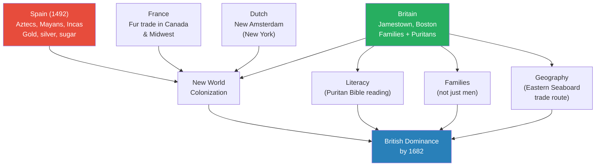
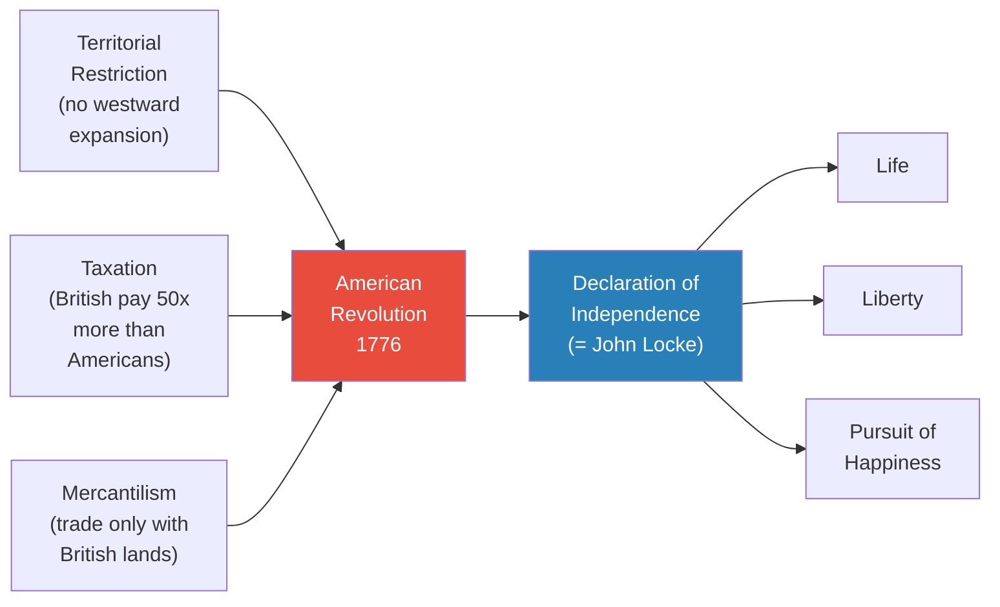
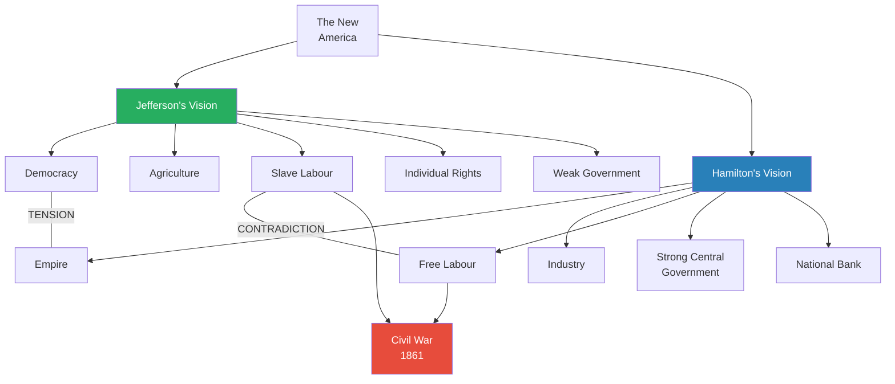
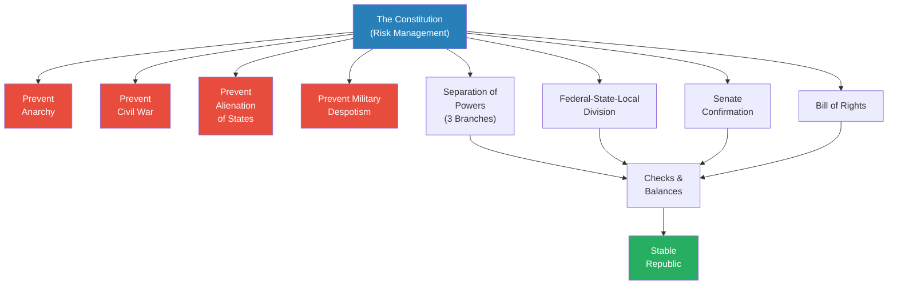
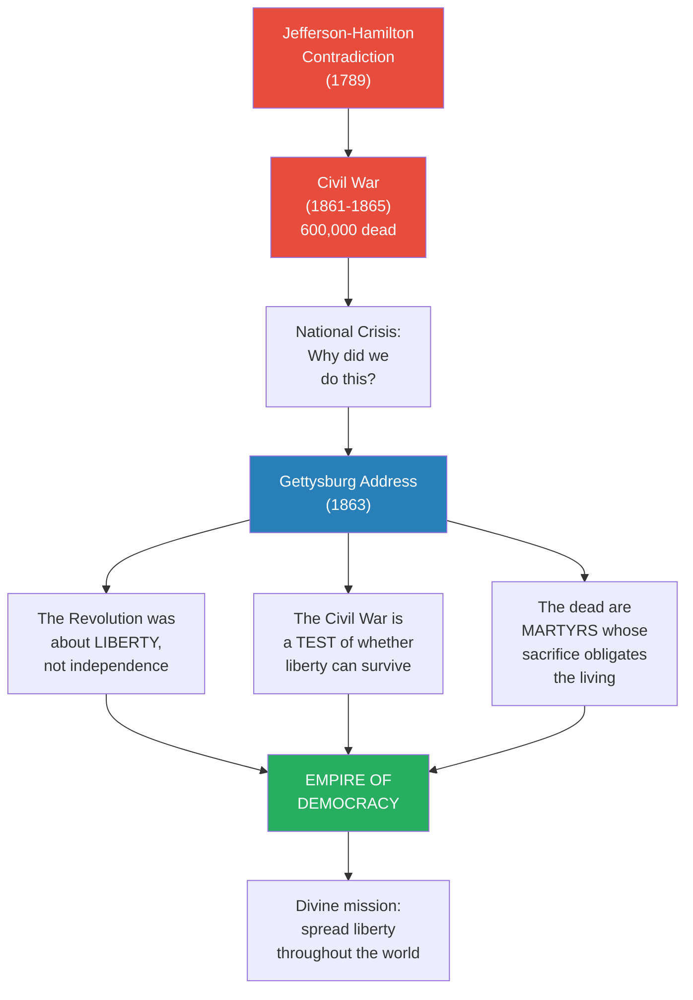
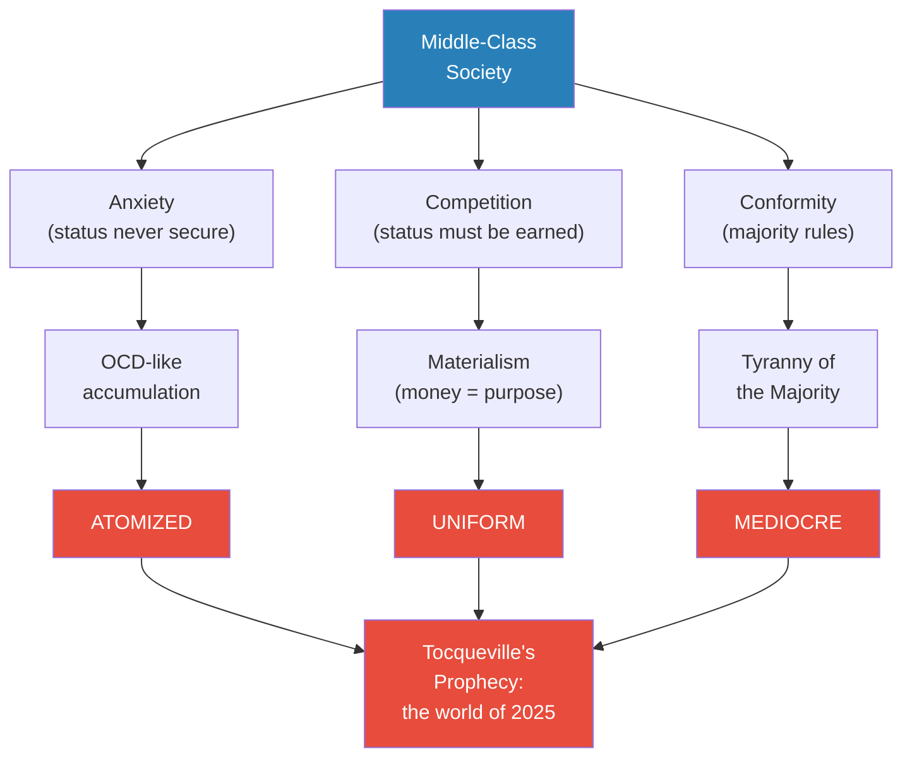
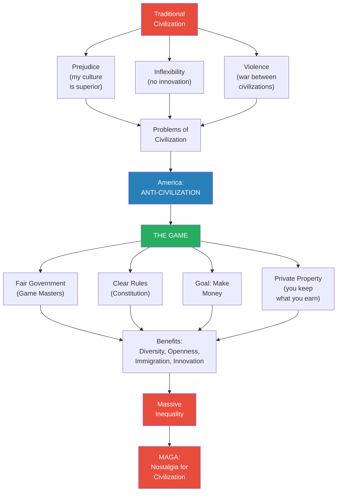

# Empire of Democracy

> Prof. Jiang traces America from colonial backwater to global hegemon, arguing that the United States is not a civilization at all but an anti-civilization -- a game designed to bypass the prejudice, inflexibility, and violence inherent in traditional civilizations. Beginning with Oscar Wilde's quip that America "went from barbarism to decadence without civilization in between," he shows how Enlightenment-intoxicated Founding Fathers built a constitutional system of checks and balances, how Lincoln fused Jefferson's democracy with Hamilton's empire into the concept of an "Empire of Democracy," and how Alexis de Tocqueville prophesied that this system would produce a world that is atomized, uniform, and mediocre. The lecture ends with MAGA as a nostalgic attempt to restore the civilization America was designed to replace.

---

## Overview: Key Highlights

- <b style="color: #27ae60">America is an anti-civilization</b> -- the Founding Fathers deliberately designed a game to replace the prejudice, inflexibility, and violence of traditional civilizations
- <b style="color: #2980b9">Empire of Democracy</b> -- Lincoln's fusion of Jefferson's liberty with Hamilton's empire into a single divine mission to spread democracy worldwide
- <b style="color: #e74c3c">Tocqueville's prophecy: atomized, uniform, and mediocre</b> -- the world America creates will destroy greatness in exchange for comfort
- <b style="color: #2980b9">Benjamin Franklin's self-help ethic</b> -- the Autobiography as the template for American optimism: born poor, work hard, become rich
- <b style="color: #27ae60">The Constitution as risk management</b> -- Hamilton designed the system not to achieve greatness but to prevent anarchy, civil war, and despotism
- <b style="color: #2980b9">Montesquieu's separation of powers</b> -- three branches of government plus federal-state-local division as checks and balances
- <b style="color: #e74c3c">The Jefferson-Hamilton contradiction</b> -- democracy vs. empire, agriculture vs. industry, slave labour vs. free labour -- a conflict ignored from 1789 until 1861
- <b style="color: #2980b9">Manifest Destiny</b> -- the belief that God willed America to conquer the entire Western Hemisphere
- <b style="color: #27ae60">The Gettysburg Address as theology</b> -- Lincoln transforms a battlefield into sacred ground and redefines the Civil War as a divine mission
- <b style="color: #e74c3c">Middle-class anxiety drives American psychology</b> -- status earned, never secure, producing OCD-like accumulation and Benjamin Franklin's compulsive self-improvement
- <b style="color: #2980b9">The Monroe Doctrine (1823)</b> -- America declares the entire Western Hemisphere off-limits to European colonization
- <b style="color: #e74c3c">MAGA as civilizational nostalgia</b> -- a desire to restore the certainty of traditional civilization that America was designed to destroy

| Concept | One-line summary |
|---------|-----------------|
| **Anti-civilization** | America as a game rather than a culture -- rules, competition, and material acquisition replacing tradition, hierarchy, and sacrifice |
| **Empire of Democracy** | Lincoln's synthesis: America is both an empire and a democracy, with a divine mission to spread liberty globally |
| **Manifest Destiny** | The theological belief that God willed American expansion across the entire Western Hemisphere |
| **Separation of powers** | Montesquieu's framework adopted by the Constitution -- president, Congress, Supreme Court as mutual checks |
| **Mercantilism** | State-directed trade within imperial zones -- the economic policy America revolted against |
| **Deism** | The Founding Fathers' religion: God created the universe but left humans responsible for perfecting it |
| **Articles of Confederation** | The weak pre-Constitution framework that limited government power and nearly destroyed the new nation |
| **Federalist Papers** | Hamilton, Madison, and Jay's pamphlets arguing for ratification of the Constitution |
| **Middle-class anxiety** | The psychological consequence of earned (not inherited) status -- driving compulsive accumulation and conformity |
| **Tocqueville's atomization** | The democratic condition where individuals retreat into private pleasures, losing connection to larger purpose |
| **Tyranny of the majority** | Tocqueville's concept: in democracy, conformity suppresses great individuals more effectively than any king |

---

# The Lecture

## The European Scramble for North America [0:00--10:00]

*Prof. Jiang opens by placing the American story within the post-Napoleonic competition among four civilizations -- British, American, Russian, and German. He traces the colonial history of North America from the Spanish arrival in 1492 through the French, Dutch, and British settlements, showing how Boston's unique combination of literacy, Puritanism, and geography made the British colonies dominant.*

*Britain's colonial advantage was not military but cultural -- Puritan literacy, family immigration, and a perfect Atlantic trade position made Boston the engine of North American growth.*

> [!note]- Expand: Full Lecture Detail
> Prof. Jiang opens by reviewing the post-1815 landscape: four major civilizations competing for world domination. Last class covered Britain; today covers America. He introduces the lecture with Oscar Wilde's quip: <b style="color: #2980b9">"America is the only country that went from barbarism to decadence without civilization in between."</b> He frames the central argument: America was designed as an anti-civilization -- the Founding Fathers recognised the failings of civilization and designed a new form of government based on Enlightenment principles to "redeem humanity from the prejudices and atrocities of civilization."
>
> He traces the history of European colonization in North America:
>
> - **Spanish first (1492):** Conquered the Aztecs, Mayans, and Incas, establishing plantation economies extracting gold, silver, and sugar, manned by African slaves
> - **English, French, Dutch follow:** Initially smuggling and piracy; after the English navy defeats the Spanish Armada in 1588, the New World opens for colonization
> - **The problem:** Spain controls the best parts of the New World -- everyone else is "stuck with North America," which has cold weather, violent Native Americans ("the tallest, strongest people in the world"), and European diseases
>
> Three nations attempt North American colonization:
>
> - <b style="color: #2980b9">The French</b> establish the fur trade in Canada and the midwestern United States -- "a great deal for both the natives and the French"
> - <b style="color: #2980b9">The Dutch</b> establish New Amsterdam (today's New York City)
> - <b style="color: #2980b9">The British</b> prove most successful because their colonization is "very grassroots, very bottom up"
>
> Prof. Jiang identifies what made the British colonies -- especially Boston -- distinctive:
>
> - **Jamestown** (named after James I) was "not a very successful colony at first, but they persist"
> - **Boston** was founded by the Massachusetts Bay Company with a charter from the English crown
> - Three factors made Boston unique:
>   - A chartered company structure providing institutional backing
>   - Families, not just individual men, emigrated -- creating stable communities
>   - Puritans who believed in universal literacy ("everyone has responsibility to read the Bible")
> - Result: "From the very beginning, it's a literate society. It has schools, it has newspapers. It is very political, and it grows very, very fast"
> - Boston's geographic position -- perfectly situated between North America and industrializing England -- accelerated trade
>
> **Colonial diversity:** Prof. Jiang emphasizes that even at this early stage, the colonies were remarkably diverse:
>
> - **Economic diversity:** Northern colonies focused on mercantile trade; southern colonies on agriculture with slave labour from Africa
> - **Religious diversity:** William Penn, a Quaker, founded Pennsylvania as a colony of "religious and national tolerance" -- attracting German immigrants and practising non-violence for decades
> - Lord Baltimore founded Maryland as a Catholic haven in a predominantly Protestant/Puritan/Anglican England
> - <b style="color: #27ae60">"Even at this early stage in American history, there's tremendous diversity, openness and religious tolerance in America"</b>
>
> By 1750, a million British colonists occupied the Eastern Seaboard versus only 40,000 French across most of North America's interior. The population explosion forced westward expansion, bringing colonists into conflict with Native Americans. King George III proclaimed that colonists could not move west of the Appalachian Mountains, trying to maintain peace with the natives. "Obviously the Americans don't like that."

---

## Three Grievances and the Road to Revolution [10:00--19:46]

*Prof. Jiang identifies three specific conflicts driving the American colonies toward revolution -- territorial restrictions, taxation without representation, and mercantilist trade policy -- then introduces Benjamin Franklin's Autobiography as the window into the American psychology of self-improvement, optimism, and material ambition that made revolution inevitable.*

> [!tip] Core Insight
> The American Revolution was not driven by oppression. Americans were per capita wealthier than the British. It was driven by a mentality -- the self-help ethic of Benjamin Franklin -- that could not tolerate any limit on individual ambition, expansion, or self-determination.

*Three practical grievances converged into a single philosophical document -- but Jefferson's Declaration was, as Prof. Jiang bluntly notes, "just copying word for word" from John Locke's Second Treatise of Government.*

> [!note]- Expand: Full Lecture Detail
> Prof. Jiang identifies three major issues bringing the colonies into conflict with the British Crown by 1774:
>
> - **Territorial restriction:** King George III limited westward expansion past the Appalachian Mountains to maintain peace with Native Americans -- colonists resented the constraint on their growth
> - **Taxation:** <b style="color: #e74c3c">"The British people pay 50 times more in taxes than the Americans"</b> -- the British wanted the colonists to share the cost of their own defence. Due to the English Civil War and other factors, the Crown had long been unable to interfere in North American affairs, and colonists "were used to a high level of autonomy"
> - **Mercantilist trade restrictions:** Under mercantilism, all trade was directed by the state -- British subjects could only trade with other British lands, not with French, Dutch, or Spanish colonies. "The Americans don't really like this either"
>
> **A crucial anomaly:** Despite being a colony, <b style="color: #27ae60">Americans were per capita far wealthier than the British</b>. Prof. Jiang asks: how is this possible when England is industrializing faster, has more citizens, and is an empire? The answer lies in the American work ethic and attitude toward life.
>
> **Benjamin Franklin's Autobiography:** Prof. Jiang introduces Franklin as the embodiment of the American character -- born poor, through hard work and tenacity became "a merchant, a very wealthy merchant and an inventor, a philosopher, an ambassador, a politician." His memoir launched <b style="color: #2980b9">the self-help movement</b> in America -- "these are the books that sell the most in America" -- from Dale Carnegie's *How to Win Friends and Influence People* to Napoleon Hill's *Think and Grow Rich*.
>
> Prof. Jiang reads key passages from the Autobiography:
>
> - **The American Dream articulated:** "From the bosom of poverty and obscurity... I have raised myself to a state of opulence and to some degree of celebrity in the world" -- the promise that anyone born poor can become rich through hard work
> - **Writing improvement through imitation:** Franklin takes a magazine, summarizes articles, rewrites them from memory, then compares his version with the original. Prof. Jiang notes drily: "If you actually know how to write, and if you actually met good writers, writers don't write like this. This is not how you learn how to read and write." Real writing requires genius, not imitation. But this illustrates "the optimism of the American character, that through just pure hard work and tenacity and persistence, you can learn anything"
> - **How to get rich:** Franklin paid his debts, maintained his reputation ("his reputation mattered above all"), dressed simply, came across as "a good Christian, a good Calvinist, someone who enjoyed making money, and someone who saved all his money in pursuit of the praise of God"
> - **The Junto:** After becoming rich, Franklin formed a philosophy club with other wealthy men to "debate and discuss the political issues of the day" -- reading John Locke, Thomas Hobbes, and the classics. <b style="color: #27ae60">"These book clubs will become the foundation of the American Revolution"</b>
>
> > [!example] The Junto -- Book Club to Revolution
> > - Franklin and other wealthy men formed a weekly discussion group called the Junto
> > - They read Locke, Hobbes, and Enlightenment philosophy
> > - They studied Rome, Athens, Sparta, Carthage, the Dutch Republic, and the British Constitution
> > - These clubs became the meeting grounds where Founding Fathers "conspired to seek independence from Britain"
> > - Their religion was <b>deism</b> -- God created the universe but then "went away," leaving humans responsible for making the world perfect
> > - "They know that Providence has tasked them with creating a great nation called America"
> > **The lesson:** The American Revolution was not born in battle but in a book club -- wealthy men reading philosophy and concluding that God had given them a divine mission to build a new nation.
>
> **The Declaration of Independence (1776):** Prof. Jiang reads Jefferson's famous lines -- "We hold these truths to be self-evident, that all men are created equal" -- and then delivers the verdict: "Thomas Jefferson, in writing the Declaration of Independence, is just copying word for word, basically, John Locke's Second Treatise of Government." Locke's three natural rights (life, liberty, property) become Jefferson's "life, liberty, and the pursuit of happiness." The right to abolish a government that fails to protect these rights comes directly from Locke.
>
> **George Washington's retirement:** Americans revere Washington not because of military brilliance -- "without the French, the Americans could not possibly have defeated the British" -- but because after the war, "he retired. He just went back to his farm." He could have become king but chose to grant Americans their freedom. That act of voluntary restraint is what Americans worship.

---

## Hamilton vs. Jefferson -- The Founding Contradiction [19:46--29:39]

*Prof. Jiang reveals the structural contradiction at the heart of the new nation: Hamilton's vision of a centralized industrial empire versus Jefferson's vision of a decentralized agrarian democracy. The Constitution is Hamilton's attempt to resolve this tension -- but the deeper conflict between slave labour and free labour is deliberately ignored, setting the stage for the Civil War seventy years later.*

*The Jefferson-Hamilton split is not merely political disagreement but an unresolvable structural contradiction -- you cannot have slave labour and free labour in the same economy. The Constitution of 1789 papers over this fault line; the Civil War of 1861 tears it open.*

> [!note]- Expand: Full Lecture Detail
> Prof. Jiang introduces <b style="color: #2980b9">Alexander Hamilton</b> as "the genius of the American Revolution... really the one who has the vision of what America could be." Hamilton clashes with Jefferson, and these two men represent "two competing strands of America" after independence:
>
> - **Jefferson:** Individual rights, democracy, agricultural economy (he is from the South)
> - **Hamilton:** Strong central government, empire, industrial economy (he is from New York)
>
> Prof. Jiang explains the economic logic behind the contradiction:
>
> - <b style="color: #e74c3c">Agriculture requires slave labour</b> -- "you need people to man the fields and grow the crops"
> - <b style="color: #27ae60">Industry requires free labour</b> -- "you want the market to decide who does what job and how much they get paid"
> - Free labour is more efficient for industrialization because "you need specialised labour... differentiation of skills, and the market is the best mechanism for skills to be differentiated and to be rewarded"
> - Prof. Jiang's vivid illustration: "If you got really sick, you need heart surgery. Would you rather go to a doctor who's a slave or a doctor who's going to charge a million dollars?"
>
> **The Articles of Confederation:** The wartime framework deliberately limited government power -- no ability to impose taxes or raise troops -- because the colonists were fighting Britain precisely over those issues. But after the British left, this created a crisis: soldiers who had been promised pay received nothing because the government had no money. Farmers who left their land fell into debt and lost their farms to creditors. This led to <b style="color: #2980b9">Shays' Rebellion</b> -- farmers trying to overthrow the government.
>
> **The Constitution as solution:** Hamilton and his allies proposed a Constitution granting more power to central government -- especially to collect revenue, control foreign trade, and maintain an army. Jefferson insisted on adding the <b style="color: #2980b9">Bill of Rights</b> to protect individual liberties. "The Constitution is a framework for how to build a strong central government. The Bill of Rights is actually not in the Constitution" -- it was Jefferson's addition to limit that government.
>
> **Montesquieu's separation of powers:** Prof. Jiang explains the Constitutional structure:
>
> - Three branches: President (military and foreign policy), Congress (financing), Supreme Court (interpreting the Constitution)
> - Three levels: federal, state, and local -- with clearly defined responsibilities
> - "They're each meant to inhibit the over extension of the other"
> - He contrasts this with China's top-down system: "one person in charge, and he has something called the Politburo underneath him"
>
> > [!example] Hamilton on Senate Confirmation -- The Power of Embarrassment
> > - Hamilton argues in the Federalist Papers that the Senate must approve presidential appointments
> > - His reasoning is not legalistic but psychological: public vetting creates fear of embarrassment
> > - If the President wants to appoint his son as Secretary of State, the son must appear before the Senate "like a job interview"
> > - If the son is incompetent -- "he doesn't know anything" -- the son embarrasses the President
> > - "It is fear of being embarrassed that inhibits the president from abusing his powers"
> > - Prof. Jiang notes: "Over the course of American history, it's worked very, very well"
> > - But he adds the caveat: "All this is based on the idea of convention, on norms, on values. If it's like Donald Trump, who does not buy into these norms and values, it may be a problem"
> > **The lesson:** The Constitution works not through force but through shame -- a mechanism that depends entirely on leaders caring about public opinion.

---

## The Constitution as Risk Management [29:39--39:40]

*Prof. Jiang reframes the entire constitutional project: Hamilton was not designing a great government but preventing catastrophe. The Federalist Papers reveal a man obsessed with four specific risks -- anarchy, civil war, alienation of states, and military despotism -- and the Constitution is his insurance policy against all four.*

> [!tip] Core Insight
> The American Constitution is not about aspiring to greatness. It is about preventing collapse. Hamilton's genius was risk management -- building a system designed to survive the worst impulses of the people governing it.

*Every structural element of the Constitution exists to block a specific failure mode. The four red nodes are the nightmares Hamilton designed the system to prevent.*

> [!note]- Expand: Full Lecture Detail
> Prof. Jiang reads Hamilton's key passage from the Federalist Papers: "These judicious reflections contain a lesson of moderation to all the sincere lovers of the Union, and ought to put them upon their guard against hazarding anarchy, Civil War, a perpetual alienation of the states from each other, and perhaps the military despotism of Victorious demagogue."
>
> He unpacks Hamilton's reasoning:
>
> - "What he's saying is this: in building government, we're not trying to aspire to greatness. We're trying to prevent collapse. This is risk management"
> - The four risks Hamilton identified: anarchy (people reject the government), civil war (states go to war against each other), perpetual alienation (division within the government), and military despotism (a tyrant arises)
> - <b style="color: #27ae60">"That's the point of the Constitution. It's risk management. It's to prevent America from failing"</b>
>
> **The Federalist Papers on mixed government:** Hamilton explains that the American system is "a mixed, balanced government, where you are trying to take advantage of all political systems" -- at the local level, democracy; at the national level, an executive who represents the nation like a monarch in negotiations with other great powers.
>
> **Manifest Destiny and expansion:** With the Constitution ratified, America embarks on aggressive territorial expansion:
>
> - **1803 -- Louisiana Purchase:** America buys the entire Midwest from Napoleon
> - **Native American genocide:** "What the Americans do, of course, is eradicate the natives"
> - **War of 1812:** America and Canada come into conflict -- ends in stalemate; British and Americans agree Canada stays a British colony
> - **Monroe Doctrine (1823):** President Monroe declares the entire Western Hemisphere off-limits to European colonization -- <b style="color: #e74c3c">"Russia, France, Germany, Britain, Spain. Forget the Western Hemisphere. It's our territory. You come over here and we'll beat the crap out of you"</b>
> - **1846 -- Mexican-American War:** America takes Texas and California
>
> > [!example] The Monroe Doctrine -- America Claims a Hemisphere (1823)
> > - President Monroe announces before Congress that the Western Hemisphere is exclusively American territory
> > - "The Western Hemisphere is henceforth not to be considered as subjects for future colonisation by any European powers"
> > - This is an extraordinary claim from a nation barely fifty years old
> > - It declares that the entire New World -- North and South America -- belongs to the United States' sphere of influence
> > - Prof. Jiang connects this directly to the present: Trump's desire to annex Canada and Greenland is "part of manifest destiny. It's not new"
> > **The lesson:** Manifest Destiny is not a historical curiosity but a living ideology -- the belief that American expansion is divinely ordained has driven foreign policy from 1823 to the present day.

---

## The Civil War and Lincoln's Gettysburg Address [39:40--49:14]

*Prof. Jiang arrives at the lecture's centrepiece: the Civil War as the inevitable eruption of the Jefferson-Hamilton contradiction, and Lincoln's Gettysburg Address as the revolutionary synthesis that fused democracy and empire into a single sacred mission. Lincoln does not merely justify the war -- he transforms it into a theological event.*

> [!tip] Core Insight
> Lincoln's genius at Gettysburg was not political but theological. He reframed the Civil War as a test of whether God's experiment in human liberty could survive -- and the dead as martyrs whose sacrifice obligated the living to spread democracy across the world. In one speech, he united Jefferson's democracy with Hamilton's empire into a single concept: the Empire of Democracy.

*Lincoln's three rhetorical moves at Gettysburg -- reframing the revolution, redefining the war, and sanctifying the dead -- produce the concept that defines America to this day: an empire whose purpose is to spread democracy.*

> [!note]- Expand: Full Lecture Detail
> Prof. Jiang explains the causes of the Civil War clearly: <b style="color: #e74c3c">"You may have learned that the American Civil War was about slavery. It was not about slavery. It was mainly about state rights."</b> The deeper issue was democracy versus empire -- whether states could do whatever they wanted (Jefferson's vision) or the central government could dictate policy (Hamilton's vision). The North wins because it is "far more industrial, far more wealthier and powerful than the South" -- vindicating Hamilton's industrial vision.
>
> **The deadliest war in American history:** Prof. Jiang provides devastating numbers:
>
> - Over 600,000 dead in the Civil War (four years)
> - Only 400,000 died in World War Two
> - In 1861, American population was 30 million; in World War Two, 130 million
> - "Brothers were killing brothers. It was such a bloody conflict"
>
> After the war, the nation faced an existential question: why did we do this? "There was shock, there was anger, there was frustration." Lincoln had to create a new vision that would bind the nation together.
>
> **The Gettysburg Address (1863):** Prof. Jiang reads the entire speech and unpacks each passage:
>
> - **"Four score and seven years ago, our fathers brought forth on this continent a new nation, conceived in liberty and dedicated to the proposition that all men are created equal"** -- Lincoln reframes the War of Independence: it was not about seeking independence from Britain but about "bringing liberty to the world... creating a new civilization"
> - **"Now we're engaged in a great civil war testing whether that nation, or any nation so conceived and so dedicated can long endure"** -- the Civil War is a test of whether liberty itself can survive
> - **"The brave men living and dead who struggled here have consecrated it far above our poor power to add or detract"** -- the sacrifice of the dead, not Lincoln's words, has made the ground sacred
> - **"It is for us, the living rather, to be dedicated here to the unfinished work"** -- the living owe a debt to the dead, payable only by continuing their mission
> - **"This nation under God shall have a new birth of freedom, and that government of the people, by the people, for the people, shall not perish from the earth"** -- <b style="color: #27ae60">the fusion of Jefferson and Hamilton: America is an empire of democracy, born in liberty, fighting for liberty, destined to spread liberty</b>
>
> Prof. Jiang synthesizes: "With Hamilton, it's about empire. For Jefferson, it's about democracy. What Lincoln does, which is revolutionary, is say, No, this is not a conflict, because we are an <b style="color: #2980b9">Empire of Democracy</b>. We are born in liberty. We fight for liberty, and we will spread liberty."
>
> > [!example] The Gettysburg Address -- From Battlefield to Theology (1863)
> > - The Battle of Gettysburg was one of the bloodiest in the Civil War
> > - Over 600,000 Americans died in the war -- more than in World War Two, from a population one-quarter the size
> > - Lincoln stands before the dead and reframes the entire American project
> > - The War of Independence was not about independence but about liberty
> > - The Civil War is a test of whether liberty can survive
> > - The dead are martyrs -- their sacrifice obligates the living to continue the mission
> > - America is not confined to the Western Hemisphere: it has a responsibility to spread democracy "throughout the world"
> > - In one speech, Lincoln heals the Jefferson-Hamilton split by declaring America an Empire of Democracy
> > **The lesson:** Lincoln transformed a political crisis into a theological event -- the dead were not casualties of a civil dispute but martyrs for a divine mission, and their sacrifice made the mission unchallengeable.
>
> **Post-Civil War expansion:** Prof. Jiang traces the rapid fulfilment of Lincoln's vision:
>
> - 1867: America buys Alaska from Russia
> - 1898: America fights Spain and takes the Philippines and Cuba -- becoming an imperial power
> - World War One: America defeats Germany
> - World War Two: America becomes the global hegemon
> - After the Soviet Union falls: <b style="color: #2980b9">Pax Americana</b> -- America has "complete Lincoln's vision of becoming an empire of democracy"

---

## Tocqueville's Prophecy -- The Atomized, Uniform, and Mediocre World [49:14--57:46]

*Prof. Jiang turns to Alexis de Tocqueville's Democracy in America to explain what the Empire of Democracy actually produces. Tocqueville -- a Frenchman who visited America in 1835 -- saw not a glorious future but a terrifying one: a world of anxious, conformist, materialistic individuals stripped of greatness, virtue, and meaning.*

*Tocqueville's three-word diagnosis of American democracy -- atomized, uniform, mediocre -- traces back to the psychological conditions of middle-class existence: anxiety, competition, and conformity. Prof. Jiang argues we live in this world today.*

> [!note]- Expand: Full Lecture Detail
> Prof. Jiang returns to Oscar Wilde's joke -- "America is not a civilization" -- and asks: what does that actually mean? To answer, he introduces <b style="color: #2980b9">Alexis de Tocqueville's *Democracy in America*</b>, published in 1835 after an eight-month visit. He calls it "the most famous book ever written about America, not by an American but by a Frenchman" -- "a fantastic book, really one of the best books ever written, and it's 1,000 pages."
>
> Prof. Jiang's thesis: Tocqueville is not celebrating American democracy. He is afraid of it. His argument: <b style="color: #e74c3c">"America is really the first mass democratic middle class country, but because of that, the people there are selfish, conformist and unimaginative, and he fears that as America conquers the world, the world will become atomized, uniform and mediocre."</b>
>
> **Middle-class psychology:** Prof. Jiang connects this back to the Dutch Republic lecture:
>
> - <b style="color: #2980b9">Anxiety:</b> "Your situation is never stable. You can be rich tomorrow, but you can be poor the next day" -- unlike aristocratic or peasant societies where status was fixed
> - **Competition:** "Because status is not given, but it must be earned, there's competition among middle class members to strive for status"
> - **OCD-like behaviour:** "An obsessive control of yourself, a focus on cleanliness and a desire to accumulate and achieve"
> - Franklin exemplifies this perfectly: "Why is he focused on such a simple living? Why does he constantly want to achieve? It's because of anxiety of being middle class"
>
> Prof. Jiang reads key passages from *Democracy in America*:
>
> - **The flattening:** "Such a democratic society would be less brilliant than aristocracy but also less plagued by misery. Pleasures would be less extreme. Prosperity more general, knowledge would be less exalted, but ignorance more rare." Tocqueville's verdict: democracy does not lift everyone up -- it pulls the top down and the bottom up, creating a vast, comfortable, unremarkable middle
> - **The failure to replace:** "What have we done in rejecting the social state of our ancestors and casting aside institutions, ideas and more? What have we put in their place?" -- America destroyed tradition and civilization but <b style="color: #e74c3c">failed to build new traditions and new civilization</b>
>
> > [!example] The Prestige of Royalty vs. The Majesty of Law
> > - Tocqueville observes: "The prestige of royal power has evaporated, but the majesty of the law has failed to take its place"
> > - In the old system, people revered the king -- and through the king, obeyed the law
> > - America removed the king but kept the law
> > - The problem: "People respect and revere those who are superior to them. They do not respect and revere ideas and things and laws"
> > - In theory, America is a rule-of-law nation
> > - In practice, people don't understand or revere the law as they would a Superior Man
> > **The lesson:** Replacing a person with a principle sounds like progress -- until you discover that humans are wired to follow people, not abstractions.
>
> - **Tyranny of the majority:** "We have destroyed those individuals who once had the ability to battle tyranny on their own." In aristocratic societies, great individuals could challenge the system because others recognised injustice. <b style="color: #e74c3c">In democracy, "great individuals are oppressed by the conformity, the tyranny of majority"</b> -- if everyone is comfortable, anyone who says "this system is wrong" gets shut down. "In American history, there aren't that many great individuals"
> - **Who Americans worship:** Prof. Jiang notes the telling pattern: "The people they worship are not generals, not leaders, but business people. Henry Ford, Elon Musk, Thomas Edison"
> - **Loss of meaning:** "The poor man clings to his forebears' prejudices without their faith, and to their ignorance without their virtues" -- the old system was flawed, but at least people knew how to live a good life. In democracy, "you're expected to discover your own purpose in life. But if you don't, then you're alienated"
> - **Materialism as purpose:** "I see men who, in the name of progress, seek to reduce man to material being... they seek science removed from faith and prosperity apart from virtue" -- the entire purpose of life has been reduced to buying things

---

## America as the Anti-Civilization -- A Game [57:46--End]

*Prof. Jiang delivers his grand synthesis: America is not a civilization but a game -- a system designed to bypass the failings of civilization (prejudice, inflexibility, violence) by replacing culture with competition, identity with material acquisition, and belonging with individual ambition. The game works brilliantly -- until the winners take everything and the losers want civilization back.*

*The full arc of the lecture in one diagram: civilization's failures produced the anti-civilization, the anti-civilization produced a game, the game produced inequality, and inequality produced nostalgia for the very civilization the game was designed to replace.*

> [!note]- Expand: Full Lecture Detail
> Prof. Jiang summarizes the lecture's grand argument. In traditional civilization, the purpose of life was clear: "maintain, protect and defend your civilization." But civilization creates three structural problems:
>
> - <b style="color: #e74c3c">Prejudice:</b> "You just believe that your civilization is superior to that of other civilizations" -- leading to war, violence, lack of innovation, stubbornness, and limits on immigration
> - **Inflexibility:** Civilization resists change and new ideas
> - **Violence:** Civilizational pride leads to perpetual conflict
>
> America's problem: it was founded by immigrants, diverse, open -- characteristics that civilization cannot accommodate. So instead of building a civilization, the Founders built <b style="color: #2980b9">a game</b>.
>
> Prof. Jiang explains the game's structure:
>
> - **Game Masters:** The government -- but "for the game to work, it has to be fair, clean, winnable, transparent, therefore our government must be fair, transparent and democratic"
> - **Rules:** The Constitution and laws -- fair, just, and winnable
> - **Objective:** "Make as much money as possible" -- material acquisition
> - **Reward:** Private property -- "whatever you have earned is yours forever. It's yours, but it's also your children's"
>
> The game solves civilization's problems:
>
> - <b style="color: #27ae60">"You can bring in as many immigrants as you want, because all they do is play this game"</b>
> - It allows openness because it "allows for rapid innovation"
> - It allows diversity "because everyone's striving to make as much money as possible"
>
> **The game's fatal flaw:** "Eventually, the few will win everything." Massive inequality emerges. "People are like, this game sucks. What do we do now?" And then nostalgia for civilization returns: "I miss when it was clear what my identity was, when it was clear what I had to do in life, when I was asked to make sacrifices for the greater good."
>
> <b style="color: #e74c3c">"This is what gives us MAGA. Ultimately, MAGA is about trying to restore the idea of civilization in America. Make America Great Again. Make America into a white Christian democratic nation again. Let us restore the vision of Thomas Jefferson."</b>
>
> **Tocqueville's ultimate prophecy:** Prof. Jiang reads the darkest passage from *Democracy in America*: "It is impossible to believe that a liberal, energetic and wise government can ever emerge from the ballots of a nation of servants." If all you care about is buying things, "you are just a slave." The Constitution may look Republican on the surface, but it is "ultra-monarchical in all its other parts" -- an imperial bureaucracy that is the real power. Tocqueville's prophecy: <b style="color: #e74c3c">"Either it will break apart in a civil war or a tyrant will emerge and it will become a monarchy."</b>
>
> Prof. Jiang closes by previewing next week: the German and Russian civilizations, which "in many ways are far superior to the Anglo-American Empire."

---

## Connections

**Builds on:** [[44 - The Spanish Conquest of the New World]] (European colonization and exploitation of the Americas), [[42 - The Protestant Reformation and the Birth of Capitalism]] (Protestant work ethic, Calvinist anxiety, and the iron cage of capitalism -- directly connected to Franklin's self-help psychology and middle-class OCD), [[43 - The Structure of Scientific Revolutions]] (Enlightenment principles that the Founding Fathers adopted), the Dutch Republic lecture (middle-class anxiety and its consequences, explicitly referenced by Prof. Jiang)

**Sets up:** [[53 - Dostoevsky and the Soul of Russia]] and [[54 - The German Will to Power]] -- Prof. Jiang promises that Russian and German civilizations are "in many ways far superior to the Anglo-American Empire." [[60 - The Decline and Fall of the American Empire]] will presumably explore where Tocqueville's prophecy ends.

**Recurring themes:**
- Civilization vs. anti-civilization -- the central tension of the modern era
- Charismatic leaders (Washington, Lincoln, Hamilton) as pivotal figures who shape history through vision and restraint
- The Constitution as risk management -- echoes Prof. Jiang's consistent argument that institutions exist to prevent failure, not guarantee greatness
- Elite overproduction and inequality as drivers of collapse -- the game's "fatal flaw" echoes the Bronze Age collapse model from [[06 - Elite Overproduction and the Bronze Age Collapse]]
- Tyranny of the majority as a new form of the conformity and hubris that destroyed previous civilizations

**Related books in vault:**
- [[Democracy in America - Alexis de Tocqueville]] -- the primary text Tocqueville's passages are drawn from; Prof. Jiang calls it "one of the best books ever written"
- [[The 48 Laws of Power - Robert Greene]] -- the Federalist Papers' discussion of power, embarrassment, and norms as control mechanisms resonates with Greene's laws
- [[Sapiens - Yuval Noah Harari]] -- Harari's discussion of imagined orders and the American creed as a shared fiction connects to Prof. Jiang's "game" framework

---

## The Takeaway

This lecture achieves something remarkable in its compact running time: it tells the entire story of America -- from colonial backwater to global hegemon -- through a single interpretive lens. America is not a civilization. It is a game designed to solve the problems that civilizations inevitably create. The Founding Fathers studied every great civilization in history and concluded that the very thing that makes a civilization powerful -- shared identity, hierarchy, tradition -- is also what makes it prejudiced, inflexible, and violent. Their solution was radical: replace culture with competition, identity with individual ambition, and belonging with material accumulation. The Constitution is the rulebook; the government is the referee; the goal is to get rich.

The most counterintuitive insight is Prof. Jiang's reading of Lincoln's Gettysburg Address not as a political speech but as a theological act. Lincoln does not merely justify the Civil War -- he transforms it into a sacred event that fuses two incompatible visions (Jefferson's democracy and Hamilton's empire) into a single divine mission. The dead are not casualties but martyrs. The living are not citizens but believers. America is not a country but a church. This synthesis -- the Empire of Democracy -- is the idea that conquered the world in the twentieth century and now structures the lives of people from Shanghai to Sao Paulo.

What remains open is whether the game can survive its own success. Tocqueville's prophecy -- that democracy produces not greatness but comfortable mediocrity, not freedom but conformist servitude -- was written in 1835 and reads like a description of 2025. Prof. Jiang's closing reference to MAGA as civilizational nostalgia raises the question he will explore in the remaining lectures: when the game stops being winnable for most people, do they reform the rules or burn down the game and demand a civilization instead?
