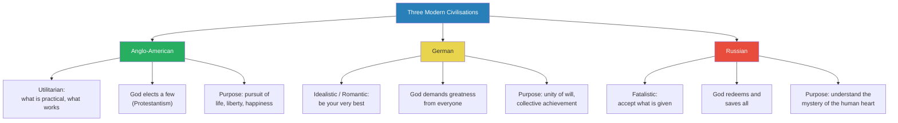
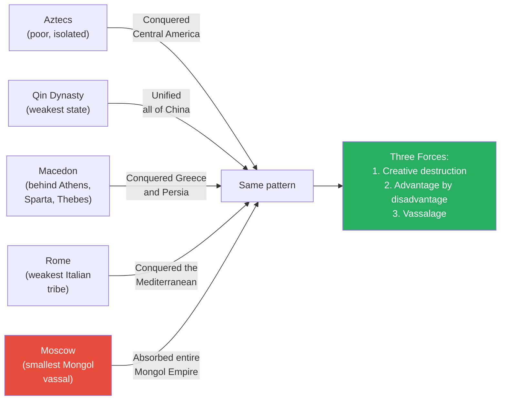
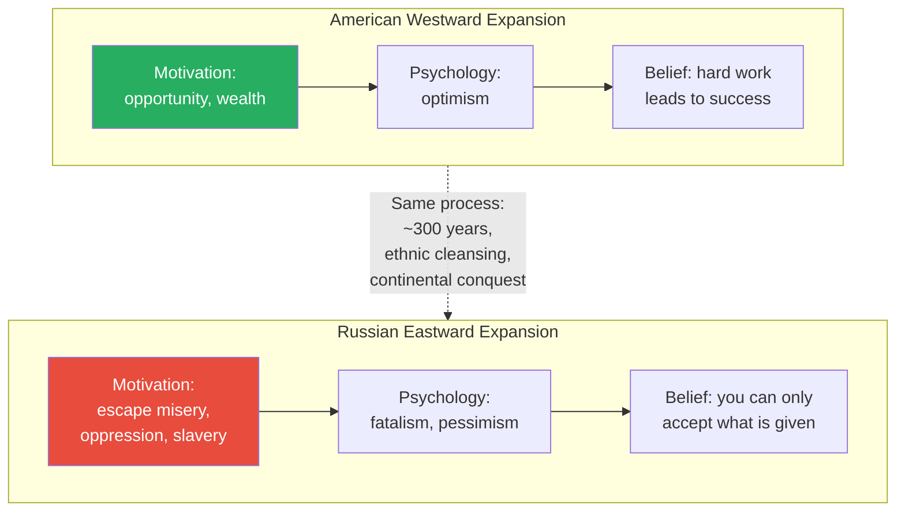
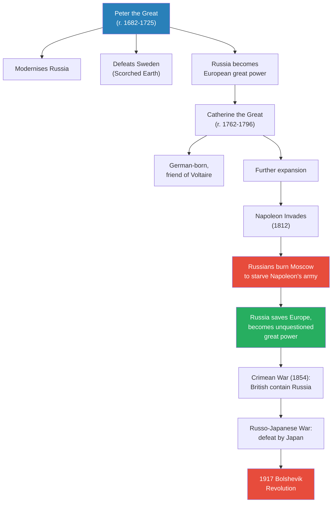
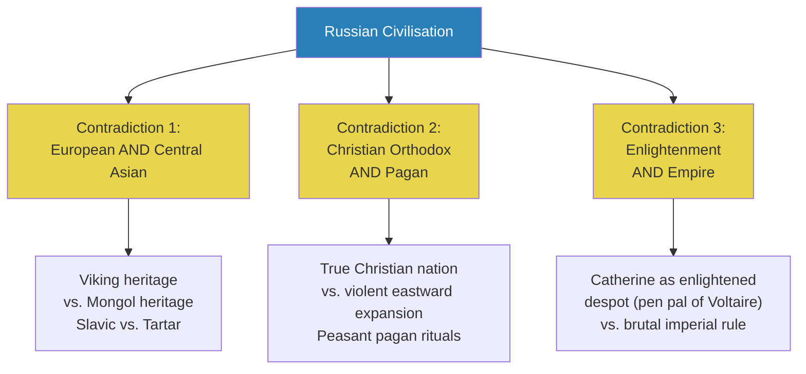
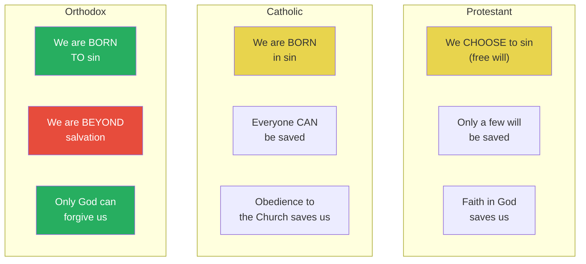
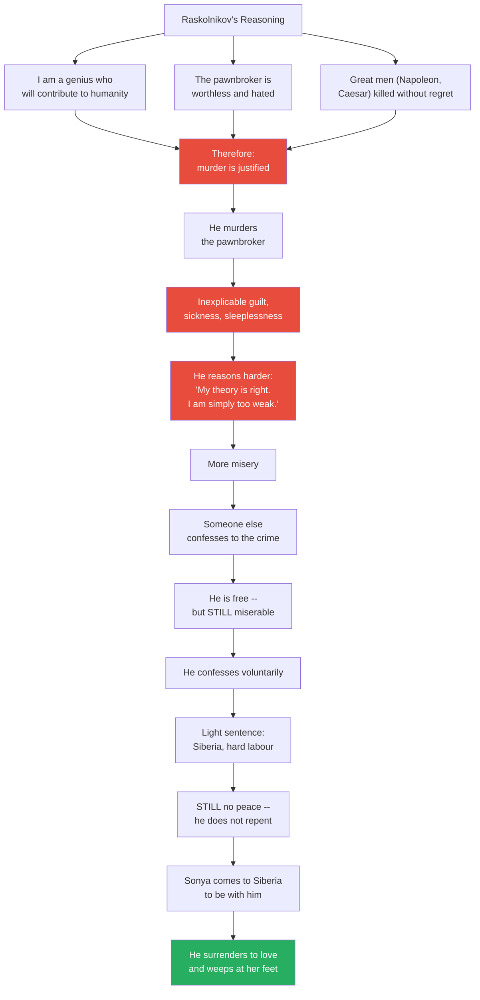
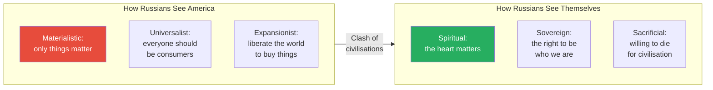

# Dostoevsky and the Soul of Russia

> Prof. Jiang traces Russian civilization from its Viking-Mongol origins through its brutal eastward expansion to the literary prophets who defined its soul -- Tolstoy and Dostoevsky. Placing Russia alongside America and Britain in the series' comparative framework, he argues that Russia is built on three unresolvable contradictions: European and Asian, Christian and pagan, Enlightenment and Empire. These contradictions produce a civilization that is fatalistic yet resilient, spiritual yet violent, and utterly distinct from the utilitarian Anglo-American worldview. Through close readings of *Anna Karenina*, *Crime and Punishment*, and *The Brothers Karamazov*, he shows that Russian civilization locates truth not in reason but in the mystery of the human heart -- and that this conviction is what drives Putin's war in Ukraine.

---

## Overview: Key Highlights

- <b style="color: #27ae60">The truth lies in the heart, not in reason</b> -- Dostoevsky's central argument: rational calculation leads to misery; only surrender to love and forgiveness can save us
- <b style="color: #2980b9">Three contradictions of Russian civilization</b> -- European and Asian, Christian and pagan, Enlightenment and Empire -- these tensions created Russian culture
- <b style="color: #e74c3c">Raskolnikov's rational murder</b> -- he reasons that killing an old woman is justified, then discovers reason cannot save him from his own heart
- <b style="color: #2980b9">Orthodox Christianity</b> -- God is a force that redeems and saves all, unlike the Protestant God who elects a few or the Catholic God who demands obedience
- <b style="color: #27ae60">The Grand Inquisitor's kiss</b> -- Jesus does not argue with the Inquisitor; he kisses him, because the heart can be changed even when reason cannot
- <b style="color: #e74c3c">Russia's eastward expansion was driven by misery</b> -- peasants fled oppression, unlike American westward expansion driven by opportunity
- <b style="color: #2980b9">The marginal power pattern</b> -- Moscow, like Rome, Macedon, and the Aztecs, rose from weakness because disadvantage forced unity, innovation, and resilience
- <b style="color: #27ae60">Russian fatalism is not despair but meaning</b> -- knowing the world is doomed compels you to live your best life regardless; that is faith
- <b style="color: #2980b9">Third Rome doctrine</b> -- Moscow as heir to Rome and Constantinople, the true custodian of Christian civilisation
- <b style="color: #e74c3c">The Ukraine war as a clash of civilizations</b> -- Russia sees America as materialist and expansionist; Putin frames the invasion as defence of a spiritual civilisation
- <b style="color: #2980b9">Scorched earth as civilisational strategy</b> -- burning Moscow to defeat Napoleon in 1812 was not barbarism but the ultimate act of self-sacrifice
- <b style="color: #27ae60">Love requires giving, not possessing</b> -- Anna Karenina's tragedy proves that trying to possess another person destroys love; trust is its foundation

| Concept | One-line summary |
|---------|-----------------|
| **Three contradictions** | European/Asian, Christian/pagan, Enlightenment/Empire -- the tensions that define Russian civilisation |
| **Orthodox Christianity** | God redeems all because humans are born to sin and cannot save themselves -- only divine mercy can |
| **Third Rome** | Moscow as successor to Rome and Constantinople, custodian of true Christianity |
| **Creative destruction** | Marginal powers rise by being forced to innovate through adversity and humiliation |
| **Scorched earth** | Burning your own land to deny resources to invaders -- used against Sweden, Napoleon, and Germany |
| **Fatalism** | Not despair but meaning: knowing the world is doomed yet choosing to live fully regardless |
| **Raskolnikov's error** | Reasoning that murder is justified if the murderer is great enough -- reason without heart leads to misery |
| **The Grand Inquisitor** | Dostoevsky's parable: people do not want freedom; the Church built an empire to relieve them of free choice |
| **Anna Karenina's unsatisfaction** | Trying to possess love destroys it; trust is the precondition for love |
| **Clash of civilisations** | Russia sees the Ukraine war as spiritual civilisation vs. American materialism |
| **Vassalage** | Historical humiliation forces reflection and resilience -- the Mongol subjection shaped Russia |

---

# The Lecture

## Three Civilisations Compared: Anglo-American, German, Russian [0:00--3:00]

*Prof. Jiang opens by placing Russia within the series' comparative framework -- alongside the Anglo-American and German civilisations already covered -- establishing that each has a fundamentally different relationship to God, to life's purpose, and to human agency.*

> [!tip] Core Insight
> The Anglo-Americans are utilitarian (pursue wealth), the Germans are idealistic (pursue the unity of will), and the Russians are fatalistic (accept what is given and seek the mystery of the human heart). These are not minor differences -- they produce incompatible civilisations.

*The three civilisations are not variations on a shared theme -- they are fundamentally incompatible worldviews about God, agency, and the meaning of life.*

> [!note]- Expand: Full Lecture Detail
> Prof. Jiang reviews what the class has covered so far: America and Britain. He previews that today is Russia, and Thursday will be Germany. He lays out the defining characteristics of each:
>
> - <b style="color: #2980b9">Anglo-American civilisation</b>:
>   - Belief in utilitarianism -- what is practical, what works
>   - God is a force that elects -- only a minority go to heaven, those who prove themselves most worthy
>   - The meaning of life is the pursuit of life, liberty, and happiness -- essentially the pursuit of wealth
>
> - <b style="color: #2980b9">German civilisation</b> (to be covered next class):
>   - Very idealistic, very romantic -- not utilitarian
>   - God demands you to be your very best -- not just a few, but everyone
>   - Belief in the unity of will -- everyone must work together to promote German civilisation
>
> - <b style="color: #2980b9">Russian civilisation</b>:
>   - Much more fatalistic -- they do not believe you have control over your life
>   - You can only accept what is given to you and make the most of it
>   - God is a force that redeems and saves all -- merciful, forgiving, fundamentally different from both the German and Anglo-American conceptions
>   - The essence of life is to understand the mystery, miracle, and authority of the human heart
>
> Prof. Jiang frames the lecture's leading question: <b style="color: #e74c3c">Why did Putin invade Ukraine?</b> He acknowledges there are many easy explanations but promises to show the answer is "actually extremely complicated." Putin himself has said in multiple interviews that there are "historical, sociological, philosophical issues at work" and that Westerners do not really understand what he means. Today's lecture will explain what Putin really means.

---

## Moscow: The Marginal Power That Conquered an Empire [3:00--9:54]

*Prof. Jiang traces Moscow's rise from a minor vassal state within the Mongol Empire to the largest landmass in the world, arguing that this follows the same pattern as Rome, Macedon, the Aztecs, and the Franks -- marginal powers rise precisely because their weakness forces unity, resilience, and innovation.*

*The pattern recurs across every civilisation the series has studied: it is the marginal power, not the dominant one, that rises to supremacy -- because weakness is the mother of adaptation.*

> [!note]- Expand: Full Lecture Detail
> Prof. Jiang begins with the year 1300: at this point, Moscow is an insignificant principality within the Mongol Empire, paying taxes, tribute, and providing troops. No one would predict it would become a great empire. But this follows a pattern the class has seen repeatedly:
>
> - The <b style="color: #2980b9">Aztecs</b> -- poor, isolated, backward, yet through innovation and tenacity they conquered Central America
> - The <b style="color: #2980b9">Qin Dynasty</b> -- the weakest of the Warring States, yet it unified all of China
> - <b style="color: #2980b9">Macedon</b> -- overshadowed by Athens, Sparta, and Thebes, yet Alexander conquered the Persian Empire
> - <b style="color: #2980b9">Rome</b> -- the weakest Italian tribe, dominated by the Etruscans, yet it conquered the known world
> - The <b style="color: #2980b9">Franks</b> -- slowly expanded from Central Europe to create the Holy Roman Empire
> - The <b style="color: #2980b9">Prussians</b> -- landlocked and isolated, yet they unified Germany
>
> Three forces drive this pattern:
>
> 1. **Open cooperative competition** -- surrounded by adversaries without natural defences (no mountains, no rivers), Moscow was forced to be tough and unified
> 2. **Advantage by disadvantage** -- weakness forces innovation and openness; "necessity is the mother of invention"
> 3. <b style="color: #2980b9">Vassalage</b> -- historical humiliation under the Mongols forced deep reflection, honesty about weaknesses, and resilience
>
> Prof. Jiang then traces Russia's origins to the Viking Age (c. 900--1000 CE):
>
> - Vikings from Sweden, Denmark, and Norway expanded east towards the wealth of the Byzantine Empire and the Abbasid Caliphate
> - They established trading posts, intermarried with local Slavic and steppe populations, and became vassals to the Byzantines
> - Trading posts grew into cities; the feudal custom of nobles conquering new lands and enslaving populations drove constant expansion
> - This became the <b style="color: #2980b9">Kievan Rus</b>, which expanded rapidly until overwhelmed by the Mongols
> - After the Mongol withdrawal, a power vacuum emerged: the Grand Duchy of Lithuania was strongest, Novgorod a rival, and Moscow the weakest
> - Over time, Moscow -- united and resilient from its Mongol subjection -- overwhelmed Novgorod and absorbed the entire Mongol Empire
>
> The result: Russia became the largest landmass in the world, yet most of it could not be cultivated, with most wealth concentrated in Ukraine.

---

## Eastward Expansion and the Birth of Russian Pessimism [9:54--19:50]

*Prof. Jiang contrasts Russian eastward expansion with American westward expansion, arguing that the fundamental difference -- Russians fled misery while Americans pursued opportunity -- produced two incompatible civilisational psychologies: Russian fatalism and American optimism.*

> [!tip] Core Insight
> Americans expanded westward for opportunity and wealth. Russians expanded eastward to escape misery, oppression, and slavery. This single difference explains why Americans are fundamentally optimistic and Russians are fundamentally fatalistic.

*The two empires followed strikingly similar paths -- rapid continental expansion over three centuries, built on ethnic cleansing and violence -- but their opposing motivations produced opposite civilisational psychologies.*

> [!note]- Expand: Full Lecture Detail
> Prof. Jiang explains why Russia expanded eastward despite the lack of resources: <b style="color: #2980b9">fur</b>. Fur was an extremely valuable commodity, and the fur trade drove settlement.
>
> But the deeper driver was not state policy -- it was oppression:
>
> - Russia was essentially a feudal state
> - The only way for a peasant to build a better life was to flee eastward, ethnically cleanse new territory, and build a new settlement
> - The state followed these settlers to collect taxes and sometimes to protect them from local adversaries
> - The process took roughly 300 years and was "extremely brutal" -- involving ethnic cleansing, enslavement, and forced displacement
> - The conquered peoples were either killed, forced to migrate, or enslaved
>
> Prof. Jiang draws the parallel with America:
>
> - Both empires expanded across continents over roughly the same period
> - Both involved the displacement and destruction of indigenous peoples
> - But the <b style="color: #e74c3c">motivation was opposite</b>: Americans went west for better opportunities, to get wealthy, to build a better life; Russians went east to escape misery, oppression, and slavery
> - This difference is why Americans are fundamentally optimistic and Russians fundamentally fatalistic
>
> He then summarises the key differences between the Slavic East and the Germanic West:
>
> - The word <b style="color: #2980b9">"Slav" gives us the word "slave"</b>: for the longest time, Slavs were pagans (neither Muslim nor Christian), and the custom was that only non-believers could be enslaved. Vikings, Muslims, and Christians all came to enslave Slavic people and sell them to the Byzantines and Abbasids
> - **Political heritage**: Russians see themselves as heirs to the Byzantine Empire (top-down centralised bureaucracy); Germans see themselves as heirs to the Holy Roman Empire (confederation, consensus, diplomacy)
> - **Religious heritage**: Russians have the Eastern Orthodox Church; Germans have the Catholic Church -- these seem similar but are "extremely different"
> - **Cultural coherence**: Germans are culturally coherent (same language, same culture); the Russian Empire is culturally incoherent, encompassing a vast array of cultures, languages, and belief systems

---

## Peter the Great, Catherine, and the Westernisation of Russia [19:50--25:19]

*Prof. Jiang traces how Peter the Great and Catherine the Great forcibly Westernised Russia, creating a European-facing nobility that spoke French and had German ancestry while the peasantry remained Slavic -- a divide that became one of Russia's defining contradictions.*

*From Peter the Great to the Bolshevik Revolution -- two centuries of Westernisation, military triumph, and imperial overreach ending in revolution.*

> [!note]- Expand: Full Lecture Detail
> Prof. Jiang explains that the Russian Empire formally begins with <b style="color: #2980b9">Peter the Great</b>, who modernised Russia and proved it a European power by defeating Sweden -- then Europe's greatest military power.
>
> Peter's motivations:
>
> - **Empire needs ideology**: Russia needed a unifying philosophy, and Peter embraced the <b style="color: #2980b9">Third Rome doctrine</b> -- Moscow as successor to Rome and Constantinople, custodian of true Christianity. All other Christian denominations (Catholic, Protestant) were considered corrupt. Putin still shares this philosophy
> - **Military supremacy**: all the great militaries were in Europe, so Russia imported German soldiers and mercenaries to learn European military technique
> - **Centralising power**: Peter wanted to remove the feudal system and centralise authority in his own hands, diluting the power of church and nobility
> - **Ottoman rivalry**: the Ottoman Empire was Russia's great rival
> - **Contempt for Asia**: even though the Mongols influenced Russia more than the Vikings, Russians claimed Viking ancestry and tried to erase the Mongol period from their history
>
> > [!example] Charles XII's Disastrous Invasion of Russia
> > - Charles XII of Sweden, aged 27, fancied himself another Alexander the Great
> > - He invaded Russia with Europe's finest army
> > - Peter the Great deployed <b style="color: #2980b9">scorched earth</b> -- retreating and burning all fields so the invading army could not feed itself
> > - Charles's invasion collapsed, and Russia won
> > - The same strategy would defeat Napoleon in 1812 and the Germans in World War Two
> > **The lesson:** Russia's greatest military strategy is sacrifice -- destroying your own land to destroy your enemy.
>
> Prof. Jiang then covers <b style="color: #2980b9">Catherine the Great</b>:
>
> - Actually German (Prussian-born), married into the Russian noble family
> - Much of the Russian nobility had German blood and spoke French at home
> - This created a massive divide: Europeanised, French-speaking nobility vs. Slavic peasantry
>
> > [!example] The Burning of Moscow (1812)
> > - Napoleon invaded Russia and defeated the Russian army in the field
> > - The Russians did what no one could have imagined: they burned down Moscow, their cultural capital and the heart and soul of the empire
> > - Europeans considered this an act of incredible barbarism
> > - Russians considered it an incredible act of self-sacrifice that saved civilisation
> > - Tchaikovsky composed the *1812 Overture* to celebrate the victory
> > **The lesson:** The willingness to destroy what you love most in order to save your civilisation is the defining act of Russian identity.
>
> After Napoleon's defeat, Russia became an unquestioned great power. But Britain -- dedicated to its divide-and-conquer policy -- encouraged the Ottomans and French to unite against Russia, leading to the <b style="color: #2980b9">Crimean War (1854)</b> and the <b style="color: #2980b9">Great Game</b> for Central Asia. The Russo-Japanese War (1905) brought a devastating defeat that sparked revolutionary sentiment, and the First World War completed the destruction: the 1917 Bolshevik Revolution destroyed the Russian Empire and created the Soviet state.

---

## The Three Contradictions of Russian Civilisation [25:19--28:00]

*Prof. Jiang identifies three unresolvable contradictions at the heart of Russian civilisation -- contradictions that Tolstoy and Dostoevsky will attempt to reconcile through their novels.*

*These three contradictions are not problems to be solved -- they are the generative tensions from which Russian art, literature, and philosophy emerge.*

> [!note]- Expand: Full Lecture Detail
> Prof. Jiang identifies the three contradictions created by Westernisation:
>
> 1. <b style="color: #2980b9">European and Central Asian</b>:
>    - Russia is both Viking and Mongol, both Slavic and Tartar
>    - It encompasses a vast array of different cultures, languages, and belief systems
>    - This is a permanent tension within the empire
>
> 2. <b style="color: #2980b9">Christian and pagan</b>:
>    - Russia fancies itself the true Christian nation -- in fact, the only true Christian nation
>    - Yet the massive eastward expansion involved enormous violence and war
>    - The peasantry, even to this day, maintain pagan rituals and beliefs
>    - The Rite of Spring ballet by Stravinsky captures this tension between pagan and Christian
>
> 3. <b style="color: #2980b9">Enlightenment and Empire</b>:
>    - Catherine the Great, a Prussian, saw herself as an enlightened monarch -- she was Voltaire's pen pal
>    - She positioned herself as bringing reason, justice, and goodness to Russia
>    - But Russia was simultaneously a brutal empire engaged in barbarism
>
> Prof. Jiang argues that these contradictions are what make Russian civilisation unique -- and that they will drive its greatest cultural achievements.

---

## Russian Cultural Giants: Pushkin, Chekhov, and the Music of the Soul [28:00--33:51]

*Prof. Jiang surveys Russian cultural achievements -- from Pushkin's modernisation of the Russian language to Tchaikovsky's soul-haunting music and Stravinsky's revolutionary fusion of pagan and modern -- arguing that this beauty could only emerge from a civilisation built on suffering.*

> [!note]- Expand: Full Lecture Detail
> Prof. Jiang introduces the major Russian cultural figures:
>
> - <b style="color: #2980b9">Alexander Pushkin</b> -- the Shakespeare of Russia, the national poet who modernised the Russian language
>   - His grandfather was an African general who became a Russian noble -- Pushkin was roughly one-eighth Black and very proud of it
>   - Prof. Jiang notes: "For most of human history, race was not a concept. People didn't really care what race you were"
>
> - <b style="color: #2980b9">Anton Chekhov</b> -- considered the greatest short story writer in human history
>
> - <b style="color: #2980b9">Glinka</b> -- a famous early Russian composer
>
> - <b style="color: #2980b9">Tchaikovsky</b> -- the most famous Russian composer, creator of *The Nutcracker*, *Sleeping Beauty*, and *Swan Lake*
>   - Prof. Jiang plays an excerpt from *Swan Lake* and tells the class: "This music can flow into your essence, your soul. This music comes from the soul, and to create music this beautiful, your soul must suffer"
>
> - <b style="color: #2980b9">Igor Stravinsky</b> -- the first great modern composer, who composed *The Rite of Spring* (1913)
>   - First performed in Paris, it was so revolutionary it caused a riot in the music hall
>   - The ballet fuses the pagan tradition into modernity
>   - It depicts a Slavic spring festival celebrating the mother goddess, ending with a maiden dancing until her heart explodes -- her sacrifice enables life to continue
>   - Prof. Jiang plays excerpts and tells the class to notice "the rawness, the energy, the violence, the aggression, the sensuality"
>   - The interconnected world of the ballet requires balance: if the mother goddess sacrifices herself for life, then the maiden must sacrifice herself in return
>
> > [!quote] Prof. Jiang
> > "To create music this beautiful, your soul must suffer."

---

## Tolstoy and Anna Karenina: The Heart Cannot Be Mastered [33:51--43:25]

*Prof. Jiang introduces the two great prophets of Russian civilisation -- Tolstoy and Dostoevsky -- and reads from Anna Karenina to show that Westernisation corrupts the Russian soul, and that the heart operates by its own logic which reason cannot control.*

> [!tip] Core Insight
> If you want to love, you must give and not receive. If you want to love, base your love on trust. Anna Karenina's tragedy is that she tries to possess love rather than surrender to it -- and the betrayal of trust makes genuine love impossible.

> [!note]- Expand: Full Lecture Detail
> Prof. Jiang introduces the two prophets:
>
> - <b style="color: #2980b9">Leo Tolstoy</b> and <b style="color: #2980b9">Fyodor Dostoevsky</b> together created modern Russian civilisation -- its sensibilities, beliefs, and philosophies
> - Both were trying to reconcile the contradictions within Russia through their novels
> - They are "the great novelists in the human tradition"
>
> He then reads the famous opening of *Anna Karenina*:
>
> > [!quote] Tolstoy
> > "Happy families are all alike. Every unhappy family is unhappy in its own way."
>
> Prof. Jiang interprets: the novel opens with a husband having an affair with a French girl. This is Tolstoy showing that <b style="color: #e74c3c">Westernisation and Europeanisation corrupt the Russian soul</b>. Anna Karenina comes from St Petersburg to reconcile the couple, but she herself falls into adultery with Vronsky.
>
> The affair follows a devastating arc:
>
> - Anna has a husband and child in St Petersburg
> - She begins a passionate affair with Vronsky
> - She asks for divorce; her husband grants it
> - She slowly falls into depression
> - She commits suicide
>
> Prof. Jiang reads Anna's interior monologue before her death:
>
> - "My love keeps growing more passionate and egoistic, while his is waning" -- she is becoming more possessive while Vronsky withdraws
> - She says she is "not jealous, but unsatisfied" -- Prof. Jiang identifies this as the critical word
> - <b style="color: #e74c3c">She is a selfish person using love to fill the void in her heart</b>
> - She believes the relationship will give her life meaning, but she does not understand that when you try to possess someone, you cannot love them
> - Love is about giving yourself entirely to another person -- think of Dante, who never received anything from Beatrice but loved her regardless
> - Because Anna betrayed her husband, she now fears Vronsky will betray her -- she has broken <b style="color: #27ae60">trust</b>, the fundamental condition for love
>
> Prof. Jiang draws the broader lesson:
>
> - The heart is a mystery -- something you cannot reason out, something you can never fully understand
> - Western civilisation says: pursue your own happiness, and if someone better comes along, go to them
> - Tolstoy says: <b style="color: #27ae60">the heart works by its own logic, and you must respect it</b>
> - You can master reason. You can master logic. But the human heart operates by rules you cannot control
> - If you want to love: give, do not receive. Base love on trust. Do not betray yourself. Do not betray others.

---

## Dostoevsky's Life: From Firing Squad to Enlightenment [43:25--44:30]

*Prof. Jiang provides biographical context for Dostoevsky -- born to lower nobility, arrested as a young revolutionary, sentenced to death, spared at the last instant, and sent to hard labour in Siberia -- experiences that forced him to think deeply about the meaning of life.*

> [!note]- Expand: Full Lecture Detail
> Prof. Jiang contrasts the two prophets:
>
> - **Tolstoy** was born very wealthy, of nobility, inherited a fortune
>   - He was so distraught by the suffering around him -- his wealth was based on peasant oppression -- that he wanted to give up all his money and become a beggar
>   - Only his family's insistence prevented him from doing so
>
> - **Dostoevsky** came from the lower nobility (his father was a doctor)
>   - As a young man, he was a revolutionary participating in literary circles -- not violent, but subversive
>   - He was arrested, condemned to death, and placed before a firing squad
>   - At the last minute, his sentence was commuted by the Tsar
>   - He was sent to hard labour in Siberia for several years
>   - This was traumatic but also "an extremely enlightened experience" -- it made him think very deeply about the meaning of life
>
> Both were extremely passionate Christians with deep empathy for the people around them.

---

## Crime and Punishment: The Orthodox Understanding of God [43:25--51:04]

*Prof. Jiang reads the bar scene where the drunkard Marmeladov explains the Orthodox conception of God to Raskolnikov -- a God who forgives all, redeems all, because humans cannot be trusted to be wise about their own hearts -- then maps the fundamental differences between Protestant, Catholic, and Orthodox theology.*

*The three branches of Christianity look similar but are fundamentally different. The Orthodox position -- we are beyond salvation, therefore only God's mercy can save us -- is the most fatalistic and, paradoxically, the most merciful.*

> [!note]- Expand: Full Lecture Detail
> Prof. Jiang introduces *Crime and Punishment*: Raskolnikov is a young, brilliant, poor university student who decides to murder an old pawnbroker. No one likes her, no one will miss her, and her money will fund his rise to greatness. He reasons that as a genius who will contribute enormously to humanity, killing one worthless old woman is justified.
>
> But first, Prof. Jiang pauses to explain the Orthodox understanding of God through Marmeladov -- a middle-aged alcoholic Raskolnikov meets in a bar.
>
> > [!example] Marmeladov's Descent
> > - Marmeladov is a pitiful middle-aged bureaucrat, poor and married to a poor widow
> > - They have four children to feed
> > - The widow forces Marmeladov's daughter Sonya into prostitution to earn money
> > - Marmeladov finds a job, and it seems the family might be saved
> > - Instead, he steals all the household money, quits his job, and gets drunk every day
> > - His behaviour seems senseless -- but it is driven by unbearable guilt over his daughter's prostitution
> > - He cannot allow himself and his family to be happy now that Sonya is a prostitute
> > **The lesson:** The heart has reasons that reason does not know. Marmeladov's self-destruction is irrational but psychologically inevitable.
>
> Marmeladov then delivers the key theological speech to Raskolnikov:
>
> > [!quote] Marmeladov (Dostoevsky)
> > "He will pity us who has had pity on all men, who has understood all men."
>
> - God will ask: "Where is the daughter who gave herself for her stepmother and the little children? Where is the daughter who had pity upon the filthy drunkard, her earthly father?"
> - And God will say: "Come to me. I have already forgiven thee. Thy sins, which are many, are forgiven thee, for thou hast loved much"
> - This God is forgiving, merciful, all-knowing -- because humans cannot be trusted to be wise
> - We suffer the mysteries of the heart; we do not know ourselves; therefore we are bound to suffer
> - <b style="color: #27ae60">God understands this and will ultimately redeem us all</b>
>
> Prof. Jiang then maps the three Christian branches:
>
> | | Protestant | Catholic | Orthodox |
> |---|---|---|---|
> | **Nature of sin** | We choose to sin (free will) | We are born in sin | We are born to sin |
> | **Salvation** | Only a few will be saved | Everyone can be saved | We are beyond salvation and redemption |
> | **Path to redemption** | Faith in God | Obedience to the Church | Only God can forgive us |
>
> The Orthodox position is the most radical: <b style="color: #e74c3c">humans are beyond salvation and redemption</b>. Our hearts are so dark, so mysterious, that we cannot save ourselves. And that is precisely why God is great -- because only God can save and redeem us, even though we are beyond saving.

---

## Raskolnikov's Rational Murder and Its Collapse [44:30--56:00]

*Prof. Jiang traces Raskolnikov's arc through Crime and Punishment -- from his Napoleonic reasoning that great men have the right to kill, through his discovery that reason cannot silence the heart, to his final surrender to Sonya's love -- connecting it back to Achilles in the Iliad.*

> [!tip] Core Insight
> Raskolnikov's crime is not the murder. His crime is believing that reason can override the heart. When he tries to reason his way out of guilt, it only makes him more miserable -- because the truth is not within reason. The truth is within the human heart.

*Raskolnikov's journey is a spiral of reason failing to contain the heart -- each rational explanation makes him more miserable, until he abandons reason entirely and surrenders to love.*

> [!note]- Expand: Full Lecture Detail
> Prof. Jiang reads the key passage where Raskolnikov explains his reasoning to Sonya:
>
> - "If one waits for everyone to get wiser, it will take too long" -- he has given up on humanity
> - "Whoever is strong in mind and spirit will have power over them"
> - "He who despises most things will be a law-giver among them"
> - "He who dares most of all will be most in the right"
>
> Prof. Jiang connects this to the French Revolution:
>
> - <b style="color: #2980b9">Robespierre</b> believed everyone could be reasoned with -- if we appeal to reason, people will be good
> - <b style="color: #2980b9">Napoleon</b> believed he must lead -- people are weak, he must be strong
> - Raskolnikov is trying to prove he is Napoleon, not Robespierre -- that great men change history through decisive action
>
> But <b style="color: #e74c3c">Dostoevsky wants to show that this reasoning, though it sounds right, goes against the human heart</b>. When reason and heart come into conflict, the heart always triumphs -- and this can only lead Raskolnikov into misery.
>
> Prof. Jiang notes that Nietzsche and Freud would later read this passage and interpret it differently -- Nietzsche would argue Raskolnikov was not wrong but simply did not believe strongly enough. This will be discussed next class.
>
> The novel then takes a stunning turn:
>
> - Someone else confesses to the crime -- Raskolnikov is free
> - Instead of feeling liberated, he is more tormented
> - He voluntarily confesses; the law gives him the lightest possible sentence (hard labour in Siberia)
> - Even in prison, he does not repent -- he still believes his theory was correct
> - He concludes his problem is not that he killed, but that he felt regret -- proving he is weak, not great
> - Napoleon would not have felt regret; Caesar would have laughed; Alexander would have bragged
>
> > [!quote] Dostoevsky (Raskolnikov)
> > "My conscience is at rest... it was only in that he recognised his criminality, only in the fact that he had been unsuccessful."
>
> Prof. Jiang connects this directly to Homer's *Iliad*:
>
> - Achilles killed Hector and mutilated his body to avenge Patroclus
> - Instead of finding relief, he became more depressed and miserable
> - Both Homer and Dostoevsky deliver the same message: <b style="color: #e74c3c">do not try to reason things out -- the truth is not within reason; it is within the human heart</b>
>
> Raskolnikov's salvation comes through Sonya:
>
> - Sonya travels all the way to Siberia to be with him
> - "Something seemed to seize him and fling him at her feet. He wept and threw his arms around her knees"
> - He surrenders himself to his love for Sonya -- and that is what saves him
> - Just as Priam's kiss saved Achilles -- not through argument but through an act of love and forgiveness

---

## The Grand Inquisitor: Freedom as Burden [56:00--1:07:15]

*Prof. Jiang reads Dostoevsky's parable of the Grand Inquisitor from The Brothers Karamazov -- where Jesus returns to earth during the Spanish Inquisition and is condemned by the Church for giving humanity the unbearable gift of free will -- and connects it to the lecture's central argument about reason versus the heart.*

> [!tip] Core Insight
> You cannot change someone's reason through debate -- people are stubborn about their ideas. But the heart, even though it is a mystery, is still loving and still open. If you touch it, you change people forever. That is why Jesus kisses the Inquisitor instead of arguing with him.

> [!note]- Expand: Full Lecture Detail
> Prof. Jiang introduces *The Brothers Karamazov* (roughly 1,000 pages) and focuses on the parable of the Grand Inquisitor.
>
> The setup:
>
> - The Spanish Inquisition (1492) is at its height -- Christians with independent ideas are being persecuted and slaughtered
> - Jesus in heaven sees this suffering and descends to earth
> - People immediately recognise and worship him
> - He is dragged before the Grand Inquisitor and becomes a prisoner
>
> The Inquisitor's accusation against Jesus:
>
> - "Thou didst not love them at all" -- Jesus came to give his life for humanity but actually made things worse
> - Instead of taking possession of human freedom, Jesus increased it and "burdened the spiritual kingdom of mankind with suffering forever"
> - Jesus wanted humans to follow him freely -- but did he not know they would reject even his image and his truth?
> - Free choice is a "fearful burden" that leaves humanity in "greater confusion and suffering"
>
> The Inquisitor's defence of the Church's tyranny:
>
> - People do not want free choice -- they want to be told what to do
> - Jesus refused to be their king, refused to be their emperor
> - He demanded that people reason and love him freely
> - The Church had no choice but to build an oppressive empire to liberate people from the burden of free choice
>
> The Inquisitor also challenges Jesus on mercy:
>
> - "You tell us only by believing freely can we be redeemed -- but that takes strength. What about the weak? What about the lost? Will you condemn them to hell? That's not very merciful."
>
> The story's ending:
>
> - The Inquisitor finishes his speech and waits for Jesus to respond
> - Jesus has listened intently, looking gently at the old man, "evidently not wishing to reply"
> - Jesus approaches the old man in silence and softly kisses him on his "bloodless, aged lips"
> - The Inquisitor shudders, opens the door, and says: "Go, and come no more. Come not at all. Never, never."
> - Jesus leaves. <b style="color: #27ae60">"The kiss glows in his heart. The old man adheres to his idea."</b>
>
> Prof. Jiang's interpretation:
>
> - The Inquisitor's philosophy -- why Jesus is wrong, why we need empire, why we need oppression -- all makes rational sense
> - Jesus responds not with argument but with an act of forgiveness and charity -- a kiss
> - This is exactly like Priam kissing Achilles' hand -- not reasoning with him, but touching his heart
> - <b style="color: #27ae60">We can never change someone's reason. But we can change their heart with an act of mercy, forgiveness, and love</b>
> - "Debate gets you nowhere, because people are stubborn about their ideas. But the heart, even though it's a mystery, it's still loving, it's still open. So if you touch it, you change people forever."

---

## Why Putin Invaded Ukraine: A Clash of Civilisations [1:07:15--1:08:47]

*Prof. Jiang returns to the lecture's opening question -- why did Putin invade Ukraine? -- and answers it through the civilisational framework built throughout the lecture: Russia sees itself as a unique, spiritual civilisation worth dying for, and the war is a defence against American materialism.*

*The Ukraine war, in Prof. Jiang's framing, is not a border dispute -- it is a civilisational collision in which there can be no compromise, only a winner.*

> [!note]- Expand: Full Lecture Detail
> Prof. Jiang returns to the opening question. Putin has said repeatedly: "We invaded Ukraine to save Russian civilisation."
>
> The Russian view of America (as Russians see it):
>
> - Extremely materialistic -- the only thing that matters is buying things, consuming things, obtaining things
> - Americans believe this is universal -- everyone wants to buy things, so everyone should be allowed to
> - <b style="color: #e74c3c">If you prevent people from buying things, you are a dictator and must be liberated</b>
> - North Korea, Iran -- they should be liberated so their people can "buy things from us"
>
> The Russian self-conception:
>
> - "We are a spiritual people. We are unique"
> - "We demand sovereignty -- the right to live the lives we choose to live"
> - "If it means fighting America, if it means our deaths, if it means sacrifice, we will do so"
> - "Our civilisation is the greatest in the world. Our conception of God is the correct conception. Our truth is the real truth."
>
> Prof. Jiang concludes: <b style="color: #e74c3c">this is a clash of civilisations, and in a clash of civilisations, there can only be one winner. There can be no compromise.</b> The war in Ukraine signals "something much more devastating, much more cataclysmic."

---

## Q&A: Fatalism, Resilience, and the Meaning of Life [1:08:47--end]

*Students ask how fatalism produces resilience rather than passivity, and why Russians are so pessimistic. Prof. Jiang's answers reveal the deepest layer of the lecture: fatalism is not despair but the purest form of faith -- knowing the world is doomed yet choosing to live your best life regardless.*

> [!note]- Expand: Full Lecture Detail
> **Q: If Russians are fatalistic, how are they so resilient?**
>
> Prof. Jiang admits he finds this confusing himself, then explains:
>
> - "You can't logically figure it out" -- the feeling defies reason
> - Knowing that the world is doomed compels you to live your best life
> - <b style="color: #27ae60">Meaning is: with the knowledge that the world is ultimately headed towards doom, you are compelled to live your best life nonetheless</b>
> - This is a very pagan, very Viking mentality -- before Christianity, people believed the world would end, but what mattered was the life you led today
> - American civilisation thinks in utilitarian terms: do something because it gets you somewhere
> - Russian civilisation says: do something precisely because you know it doesn't get you anywhere -- and that is what truth is, what life is about, what meaning is
> - "If you do something and God rewards you, that's not really faith" -- true faith is doing the right thing knowing there is no reward
>
> Prof. Jiang connects this to the heart:
>
> - "Sometimes you have to listen to your heart"
> - "My heart knows the world is doomed, but I have a responsibility to my children, to my neighbours, to the people I love, to try my best regardless"
> - <b style="color: #27ae60">That is what faith in God, faith in each other, and true love really are</b>
>
> **Q: Why are Russians so pessimistic?**
>
> Prof. Jiang gives three reasons:
>
> 1. "It's really cold in Russia" -- climate affects outlook
> 2. Russian civilisation is built on tremendous violence -- constant wars with Mongols, Swedes, Germans, French, and internal conflicts
> 3. Russia is huge but has limited resources; people must fight constantly for them
>
> He then inverts the question: "The question really isn't why Russians are fatalistic, because most people are fatalistic. The question really is, why are Americans so optimistic?" America is huge with abundant resources -- if you work hard, you can obtain a lot. That is what produces optimism, not the natural state.
>
> Prof. Jiang closes by recommending Tolstoy and Dostoevsky as "really the best novelists ever" and previewing the next class on German civilisation.

---

## Connections

**Builds on:** [[52 - Empire of Democracy]] (American civilisation as anti-civilisation), [[51 - Shakespeare's Language of Empire]] (British civilisation), [[50 - Rule, Britannia!]] (British imperial model)
**Echoes:** [[07 - Homer's Iliad and the Birth of Greek Civilization]] (Achilles and Priam -- the kiss that saves through love, not reason), [[12 - The Tyranny of Alexander the Great]] (Charles XII as failed Alexander)
**Sets up:** [[54 - The German Will to Power]] (German idealism and Nietzsche's interpretation of Raskolnikov)
**Related books in vault:** [[Sapiens - Yuval Noah Harari]] (civilisational frameworks), [[The 48 Laws of Power - Robert Greene]] (scorched earth strategy)

---

## The Takeaway

This lecture reframes the Russia-Ukraine conflict as something far larger than a territorial dispute. Prof. Jiang shows that Russian civilisation has a fundamentally different answer to the deepest questions: what is God, what is the purpose of life, and where does truth reside. For the Anglo-Americans, truth is in utility and material success. For the Russians, truth is in the human heart -- mysterious, ungovernable, and accessible only through love, suffering, and surrender. Dostoevsky's Crime and Punishment is not merely a novel about murder; it is a civilisational argument that reason without heart leads to madness.

The most surprising insight is the lecture's inversion of the usual framing of fatalism. We tend to see fatalism as passivity or despair, but Prof. Jiang presents Russian fatalism as the purest form of faith: doing the right thing precisely because you know it will not be rewarded. This is the Viking mentality before Christianity, and it survives in Russian Orthodoxy as a conviction that God's mercy exists precisely because humans are beyond saving themselves. The paradox -- that being beyond salvation is what makes divine mercy necessary and beautiful -- is difficult for utilitarian minds to grasp, and Prof. Jiang freely admits he finds it confusing himself.

The open question is whether this civilisational framework can explain the war's trajectory. Prof. Jiang frames the conflict as one in which "there can only be one winner" and "no compromise" is possible -- but he does not yet address how civilisational clashes resolve themselves. The Nietzsche connection -- that Raskolnikov was not wrong, just not strong enough in his belief -- will be picked up in the next lecture on German civilisation, where the will to power becomes the defining philosophy. The question of what happens when Russian fatalism collides with German idealism and American pragmatism remains open.
