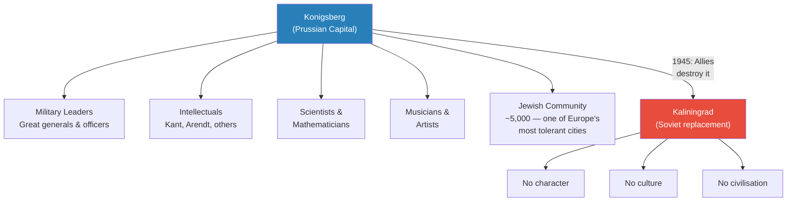
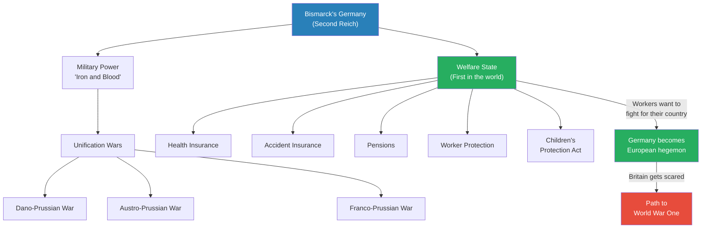
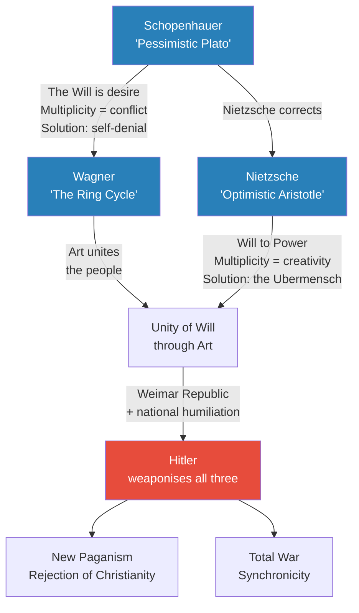
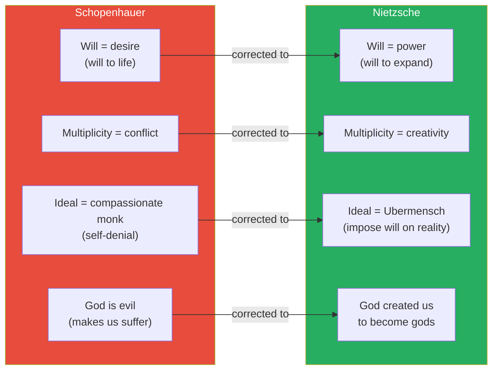
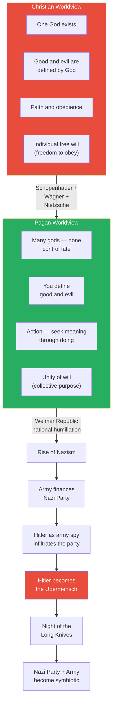
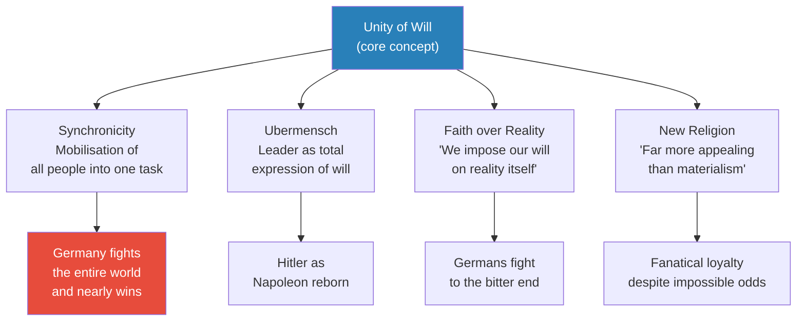
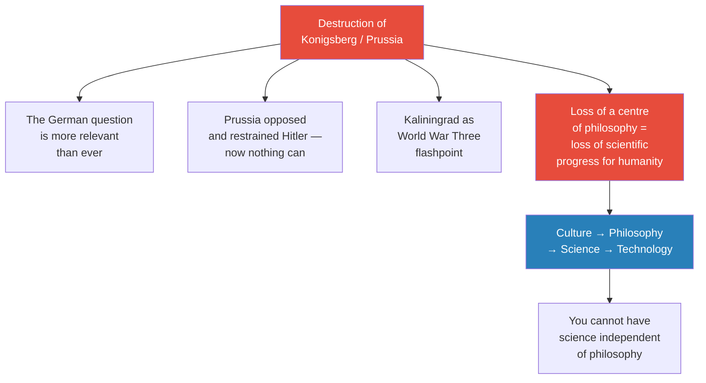

# The German Will to Power

> Prof. Jiang concludes the four-quadrant analysis of civilisations competing for global dominance by turning to Germany. He begins with a provocation: the most advanced civilisation humans ever created was not Anglo-American but German — and the West destroyed it. Through the rise and fall of Prussia, the philosophy of Schopenhauer and Nietzsche, Wagner's Ring Cycle, Bismarck's welfare state, and Hitler's weaponisation of the "unity of will," Prof. Jiang traces a civilisation that fused military power with humanistic culture, and asks what was truly lost when the Allies razed Konigsberg to the ground.

---

## Overview: Key Highlights

- <b style="color: #27ae60">The most advanced civilisation in human history was German, not Anglo-American</b> — Prussia fused military power with humanistic culture, producing more Nobel laureates and philosophers per capita than any rival
- <b style="color: #2980b9">Konigsberg</b> — the heart of Prussian civilisation, birthplace of Kant and centre of the Enlightenment, deliberately destroyed after World War Two and replaced by Soviet Kaliningrad
- <b style="color: #e74c3c">The Western prejudice against Prussia is wrong</b> — they were not a militaristic nation bent on world domination, but a creative society forced into military confrontation by geography
- <b style="color: #2980b9">Open cooperative competition, advantaged by disadvantage, vassalage</b> — the same three conditions that built Moscow also built Prussia
- <b style="color: #27ae60">Frederick the Great established the first public school system in 1763</b> — over a century before Britain and France; Japan and America copied the Prussian model
- <b style="color: #2980b9">Schopenhauer's Will</b> — the underlying force of the universe is desire, which manifests in physical bodies, creating multiplicity and suffering
- <b style="color: #27ae60">Nietzsche's Will to Power</b> — corrects Schopenhauer: the purpose of life is not to deny desire but to impose our will on reality and become the Ubermensch
- <b style="color: #2980b9">Wagner's Ring Cycle</b> — the national epic of Germany: desire (the ring) is the source of both creation and destruction; destroying it ends the world but allows rebirth
- <b style="color: #e74c3c">Bismarck created the world's first welfare state</b> — health insurance, accident insurance, pensions, and child labour laws, decades before any other nation
- <b style="color: #27ae60">Hitler was a German army spy</b> — the army financed the Nazi Party to counter the socialist left; Hitler auditioned for the role of Ubermensch and got it
- <b style="color: #e74c3c">The destruction of Konigsberg cursed the world</b> — destroying a centre of philosophy and science reduced the innovative potential of all humanity
- <b style="color: #2980b9">Unity of will</b> — the central concept binding Schopenhauer, Nietzsche, Wagner, and Hitler: the desire to return from alienation to collective purpose

| Concept | One-line summary |
|---------|-----------------|
| **Konigsberg / Kaliningrad** | The destroyed Prussian capital — once the cradle of the Enlightenment, now a characterless Soviet city |
| **Prussia** | An extinct nation that was the strongest military and most advanced civilisation in the world for centuries |
| **Open cooperative competition** | Surrounded by enemies, forced to be innovative, tolerant, and unified to survive |
| **Advantaged by disadvantage** | Limited resources forced focus on human capital and education |
| **Vassalage** | Subordination to foreign powers (Mongols for Moscow, Swedes/Poles for Prussia) that forged resilience |
| **Will (Schopenhauer)** | The underlying force of the universe — desire that manifests in bodies, creating multiplicity and suffering |
| **Will to Power (Nietzsche)** | The drive not merely to survive but to impose oneself on reality — the true purpose of existence |
| **Ubermensch** | The individual who steps outside history to control it — Napoleon, Caesar, Hitler, Trump |
| **Ring Cycle** | Wagner's 15-hour national epic — desire as both the engine and the destroyer of civilisation |
| **Unity of will** | The aspiration to transcend individual alienation and act as one people — the core of German civilisation |
| **Synchronicity** | The organisation and mobilisation of a people into one task — the secret to modern warfare |
| **Paganism vs. Christianity** | The rejection of Christian obedience in favour of pagan action, self-defined meaning, and collective will |

---

# The Lecture

## The Destruction of Konigsberg [0:00 - 9:58]

*Prof. Jiang opens with a map of modern Europe and a startling fact: the Russian exclave of Kaliningrad was once Konigsberg, the intellectual capital of Western civilisation, birthplace of Immanuel Kant — and it was deliberately destroyed after World War Two to eliminate Prussian culture forever.*

> [!tip] Core Insight
> The Western narrative that Prussia was merely a militaristic state bent on world domination is a lie told by the victors. Prussia produced more scientists, philosophers, and musicians per capita than any civilisation in history — and the Allies destroyed it anyway.

*Konigsberg was not a military outpost but a complete civilisation — military, intellectual, scientific, artistic, and religiously tolerant. Its deliberate destruction was cultural annihilation.*

> [!note]- Expand: Full Lecture Detail
> Prof. Jiang begins by telling the class that today's lecture on Germany concludes the four-quadrant analysis of civilisations fighting for global dominance — Britain, America, Russia, and now Germany. He immediately establishes the thesis: <b style="color: #27ae60">"In many respects, the most advanced civilisation that humans have ever created is actually the German civilisation."</b>
>
> He shows a map of modern Europe and points to a small territory on the Baltic called Kaliningrad — a Russian exclave separated from the Russian mainland. "How did this come to pass?" he asks. The answer: this was historically <b style="color: #2980b9">Konigsberg</b>, the capital of a nation that no longer exists — Prussia. For centuries, Prussia was the strongest military power and most advanced civilisation in the world. After World War Two, the Allies — the Soviet Union, Britain, and America — decided to destroy Prussia entirely. The rationale: Prussia was a militaristic society hell-bent on world domination, and eliminating it would bring peace.
>
> Prof. Jiang shows photographs of Konigsberg before the war — a beautiful Baltic port city, "the apex of human civilisation" — and then after: rubble, followed by the modern Kaliningrad, "a very Soviet, stale city with no character, with no culture, with no civilisation."
>
> He then walks through Konigsberg's contributions to human knowledge:
> - Military leaders — many great generals came from the city (not just the nation)
> - Intellectuals — most famously <b style="color: #2980b9">Immanuel Kant</b>, who "basically changed the course of Western history with his philosophy"
> - <b style="color: #2980b9">Hannah Arendt</b> — a Jewish philosopher from Konigsberg, considered one of the greatest political philosophers of the 20th century
> - Scientists and mathematicians — "an amazing group"
> - Musicians and artists
> - A significant Jewish community — Konigsberg was for the longest time one of the most tolerant cities in Germany for Jews
>
> He then presents data on Nobel Prize winners in the sciences (physics, chemistry, medicine):
> - 1925: Germany had the majority
> - 1933: Still dominant
> - 1950: Still dominant
> - 1975: Still dominant, with the US catching up
> - Only by 2000 did the United States overtake Germany
>
> Prof. Jiang poses the central paradox: "How is it possible for a militaristic nation, hell-bent on world domination, to produce so many great scientists, so many great philosophers?"
>
> He cites Voltaire's famous insult: <b style="color: #e74c3c">"Where some states have an army, the Prussian army has a state."</b> He acknowledges that many militaristic civilisations — Rome, Sparta, the Aztecs, Macedon, the Qin — were successful militarily but not creative. "So how is it possible for the Prussians to be both creative and militaristic?"
>
> His answer: <b style="color: #27ae60">"Because the Western prejudice against Prussia is wrong. They were not a militaristic nation bent on world domination. They were first and foremost a creative, humanistic society that was forced into military confrontation with neighbours because of its geographic location."</b>

---

## The Rise of Prussia: From Vassal State to Great Power [9:58 - 19:05]

*Prof. Jiang traces Prussia's transformation from a vassal state of Poland, Lithuania, and Sweden into the dominant force that unified all of Germany — through the same three mechanisms that built Moscow: open cooperative competition, advantaged by disadvantage, and vassalage.*

```mermaid
flowchart LR
    V["Vassal State<br/>(under Poland,<br/>Lithuania, Sweden)"] -->|"~1700"| E["Emerging Power<br/>(military victories<br/>+ high culture)"]
    E -->|"Frederick the Great<br/>Enlightenment reforms"| G["Great Power<br/>(rule of law,<br/>religious tolerance,<br/>public education 1763)"]
    G -->|"1806: Defeated<br/>by Napoleon"| R["Reflection &<br/>Reform<br/>(copy French Revolution)"]
    R -->|"Humboldt creates<br/>research university"| DP["Dominant Power<br/>(defeats Napoleon,<br/>unifies Germany)"]
    DP -->|"Dano-Prussian War<br/>Austro-Prussian War<br/>Franco-Prussian War"| UG["Unified Germany<br/>(Second Reich<br/>under Bismarck)"]
    style V fill:#e74c3c,color:#fff
    style G fill:#2980b9,color:#fff
    style UG fill:#27ae60,color:#fff
```

*Prussia's rise follows a repeating cycle: defeat, deep reflection, reform, and resurgence — each time emerging stronger than before. The pattern is identical to Moscow's.*

> [!note]- Expand: Full Lecture Detail
> Prof. Jiang connects the history to the Holy Roman Empire, which he discussed in a previous class — a confederation of thousands of German city-states in competition with each other. Over time, pressure from more powerful neighbours (France, Poland, Lithuania, Russia, Sweden) forced these city-states to consolidate. The most successful was Prussia.
>
> For the longest time, Prussia was a vassal state of the Polish-Lithuanian Commonwealth or the Swedes. But by around 1700, it began to come into its own through great military leadership and — crucially — "high culture."
>
> **The three mechanisms shared with Moscow:**
> - <b style="color: #2980b9">Open cooperative competition</b> — surrounded by enemies, forced to be innovative, open, and tolerant to survive
> - <b style="color: #2980b9">Advantaged by disadvantage</b> — limited resources forced focus on human capital and education
> - <b style="color: #2980b9">Vassalage</b> — subordination to foreign powers created a habit of reflection and resilience
>
> **The crucial difference from Moscow:** Because Prussia was situated within Europe, it had a fundamentally different attitude towards its people. "The Muscovites, because of their Mongolian heritage, tend to oppress their subjects, whereas the Prussians are much more democratic, more progressive, more open."
>
> **Frederick the Great's reforms:**
> - Radically reformed the Prussian judicial system — rule of law, recourse to justice even for the poor
> - <b style="color: #27ae60">Abolished torture in the military</b> — revolutionary at a time when fear was the default instrument of discipline
> - Established religious tolerance — towards Catholics, Protestants, and "even to a certain extent, the Jews"
> - Granted basic freedom of speech
> - <b style="color: #27ae60">In 1763, established the first public school system in Europe</b> — "over 100 years later when Britain and France does this. Japan and America will copy — basically steal — the Prussian education system"
>
> **The Napoleon crisis and Humboldt's reforms:**
> - In 1806, Prussia was defeated by Napoleon and became a vassal state
> - The Prussians responded as they always had: deep reflection
> - They decided to copy the French Revolution's most important reforms:
>   - Abolition of serfdom — peasants could now become landowners
>   - Destruction of monopolies to encourage free market competition
>   - Opening the civil service to the middle class (previously restricted to nobility)
> - <b style="color: #2980b9">Wilhelm von Humboldt</b> created the modern research university at Berlin — "before, you sat in class and listened to lectures and memorised what the professor told you. Now you're encouraged to do your own research, to write a thesis"
> - Humboldt's key insight: public education as meritocracy — an engine for growing the middle class and giving them a greater economic role
>
> Prof. Jiang notes that these reforms, "in only a few years," allowed Prussia to defeat Napoleon and establish itself as a great power.
>
> He then introduces <b style="color: #2980b9">Carl von Clausewitz</b>, "considered the greatest military strategist of all time." Clausewitz studied Napoleon's wars and concluded that Napoleon's strength was his ability to mobilise all of society for total war. The future of warfare: nations must engage their citizens, increase morale, and make them willing to sacrifice for the nation.
>
> > [!example] The 1848 Revolutions and the Prussian Response
> > - In 1848, revolutions erupted in 17 locations across Europe — middle-class and workers rebelling against the feudal order
> > - Britain had no revolution because its overseas colonies (Canada, New Zealand, Australia) served as a "pressure valve" for social discontent
> > - The expectation was that Prussia, as a "military dictatorship," would suppress the demonstrators violently
> > - Instead, King Frederick William went to the public and promised negotiations
> > - He approved arming the citizens so they would feel safe negotiating with the army
> > - He agreed to all their demands: parliamentary elections, a constitution, freedom of press
> > - He promised Prussia would merge into a unified Germany
> > - He attended the funeral of citizens killed during the rebellion, wearing the revolutionary tricolour (black, red, and gold — today's German flag)
> > **The lesson:** The Prussian attitude was not tyranny but pragmatic respect for the people — they understood that surrounded by enemies, national unity required consent, not coercion.

---

## Bismarck and the Second Reich [19:05 - 28:38]

*Prof. Jiang introduces Otto von Bismarck, founder of modern Germany, who combined "iron and blood" rhetoric with the world's first welfare state — creating a nation where workers had rights decades before Britain, France, or America, and where that social contract made Germany the most powerful nation on Earth.*

> [!tip] Core Insight
> Bismarck's genius was understanding that military power and social welfare are not opposites — they are mutually reinforcing. Workers who are protected by the state will fight and die for it. This made Germany the most powerful nation in the world.

*Bismarck's two faces — iron chancellor and welfare pioneer — were not contradictions but a unified strategy. The welfare state made workers loyal, and loyal workers made the army invincible.*

> [!note]- Expand: Full Lecture Detail
> Prof. Jiang introduces <b style="color: #2980b9">Otto von Bismarck</b> as "the most famous Prussian in world history" and founder of the <b style="color: #2980b9">Second Reich</b> (the Holy Roman Empire was the First Reich; unified Germany is the Second). He earned the title "Iron Chancellor" from his famous speech:
>
> > [!quote] Otto von Bismarck
> > "Not by speeches and majority decisions will the great questions of the day be decided — that was the great mistake of 1848 and 1849 — but by iron and blood."
>
> Prof. Jiang explains that this speech repudiated King Frederick William's liberal approach to the 1848 revolutions — Bismarck was saying the army should have crushed the demonstrators. But Prof. Jiang insists Bismarck was "extremely pragmatic," and his true ambition was "a unified Germany in which people were content."
>
> He presents Bismarck's other voice — a completely different tone:
>
> > [!quote] Otto von Bismarck
> > "The real grievance of the worker is the insecurity of his existence. He is not sure that he will always have work. He is not sure that he will always be healthy, and he perceives that he will one day be old and unfit to work."
>
> Bismarck understood it was wrong for workers to lose a hand at work without compensation, for families to fall into poverty from illness, for six-year-olds to work in factories, for managers to abuse workers. So Germany instituted <b style="color: #27ae60">the first welfare state in the world</b>:
> - Health insurance
> - Accident insurance (injury at work = state compensation)
> - Pensions
> - Worker protection from abuse
> - Children's Protection Act (children banned from factory work)
>
> Prof. Jiang drives the point home: "In the year 1800 to 1900, if you could be a citizen of anywhere in the world, you would definitely want to be a citizen of Germany. At this point in Britain, in France, in America, workers are being spat on everywhere. But in Germany, workers are being given rights, and because they're being given rights, they want to fight for their country."
>
> <b style="color: #e74c3c">This made Germany the most powerful nation in the world — and that triggered Britain's response.</b> When a European power becomes hegemon, Britain plots to destroy it. Britain did it to Napoleon. Now it would do it to Germany.
>
> **The threats to German unity — Bismarck's failures:**
> - <b style="color: #e74c3c">Catholics</b> — a third of unified Germany was Catholic (from the old Holy Roman Empire). Bismarck tried to suppress them, cutting funding and imprisoning priests who swore loyalty to the Pope. This was "a disaster" and he ultimately had to compromise
> - **Liberals** — the middle class wanting political rights to match their economic power
> - **Socialists** — demanding democracy for all, worker protection, unions, class consciousness
> - **Communists** — wanting wealth redistribution and abolition of private property; an international movement
> - **Polish nationalists** — Slavic people with their own language and identity within Germany
> - **Anarchists** — believing government is inherently bad and people are self-organising
>
> Prof. Jiang emphasises that these political divisions will prove decisive: "At the end of World War One, when Germany has surrendered, they will reflect on why they lost, and one conclusion was because of all these political divisions. Too many divisions within society, therefore we need to suppress this division and create one political entity. And this is what allows for the rise of Hitler and the Nazis."
>
> **World War One:**
> - Britain could not allow a hegemon in Europe — just as it went to war against Napoleon, it now allied against Germany
> - The war was effectively Germany versus the world (the Ottoman and Austro-Hungarian allies were "not effective")
> - Amazingly, Germany created a stalemate — and was sometimes about to win
> - America entered because: (1) Americans share Britain's strategic logic — no European power should unite the heartland; (2) America had lent huge sums to Britain through the lend-lease policy — if Britain lost, the money was gone
> - Even with America's entry, Germany had not clearly lost — but then the 1917 Russian Revolution changed the calculus
> - The German generals saw Tsar Nicholas overthrown because he neglected political divisions at home — and Germany had the strongest working class (proletariat) in Europe
> - Fear of a domestic revolution led the generals to surrender

---

## The Weimar Republic and the German Philosophers of Will [28:38 - 41:11]

*Prof. Jiang traces the intellectual roots of Nazism through three German thinkers — Schopenhauer, Wagner, and Nietzsche — who together built a philosophical system that rejected Christian passivity in favour of the unity of will, and whose ideas were weaponised during the chaos of the Weimar Republic.*

*Three thinkers build one system. Schopenhauer identifies the will; Wagner encodes it in art; Nietzsche redirects it from denial to power. Hitler inherits all three.*

> [!note]- Expand: Full Lecture Detail
> Prof. Jiang explains that after World War One, the <b style="color: #2980b9">Weimar Republic</b> brought "10 years of hyperinflation, social discontent, complete chaos." When a nation suffers, it engages in deep reflection — going back into the past to find a way forward.
>
> **Schopenhauer — the Will as desire:**
> - <b style="color: #2980b9">Arthur Schopenhauer</b> argued that the underlying force of the universe is the <b style="color: #2980b9">Will</b> — desire
> - The Will manifests itself physically in bodies — our bodies seek what the Will wants: procreation, food, survival
> - Before manifestation, the Will was one — undifferentiated unity
> - Once manifested in bodies, there is multiplicity — and multiplicity creates conflict
> - We see the world from our own selfish perspective because we have forgotten we are one
> - His solution: <b style="color: #27ae60">compassion</b> — reminding ourselves of our unity
> - Art is the great unifier — through art we can contemplate the wholeness of the world
> - Some should engage in self-denial like monks — refuse to procreate, refuse to struggle — and achieve enlightenment
> - Prof. Jiang notes this is essentially Buddhism and Hinduism made secular — "he's trying to remove the religious aspects and make it into a logical system"
>
> > [!quote] Arthur Schopenhauer
> > "Life has no intrinsic worth, but is kept in motion merely by desire and illusion."
>
> **Schopenhauer on music:**
> - Music is not a copy of ideas but a copy of the Will itself
> - "This is why the effect of music is so much more powerful and penetrating than that of the other arts, for they speak only of shadows, but it speaks of the thing itself"
> - Through music, we can rediscover the unity of the world
>
> **Wagner — the Ring Cycle as national epic:**
> - <b style="color: #2980b9">Richard Wagner</b>, "the most famous musician in Germany, really the national poet of Germany," was inspired by Schopenhauer
> - Wagner's great insight: all art forms can be combined into one — music, paintings, theatre, poetry, philosophy — creating a <b style="color: #2980b9">total artwork (Gesamtkunstwerk)</b> that inspires and unites the people
> - He spent 30 years creating the <b style="color: #2980b9">Ring Cycle</b> — four operas, 15 hours total, performed annually at the Bayreuth Festival in a purpose-built opera house
> - The Ring Cycle is the inspiration for Tolkien's Lord of the Rings
>
> > [!example] The Plot of the Ring Cycle
> > - The Rhine Maidens (river goddesses) guard a hoard of gold in the River Rhine
> > - An evil dwarf steals the gold and forges a ring to control the world — the ring is a metaphor for desire
> > - The god Wotan (Odin) and the gods want to build Valhalla and hire a giant, paying him with the stolen ring
> > - The dwarf curses the ring: the gods will see their end, Gotterdammerung (twilight of the gods)
> > - Wotan fathers a hero, Siegfried, who is half-human, half-god, to kill the giant and retrieve the ring
> > - But having the ring makes Siegfried a target — everyone conspires to kill him for it
> > - Siegfried is killed; Brunnhilde (a Valkyrie) sacrifices herself in flames and throws the ring back to the Rhine Maidens
> > - The Rhine Maidens destroy the ring — but destroying desire destroys everything: Valhalla, the gods, the entire world
> > - Yet this destruction allows for a new beginning
> > **The lesson:** Desire is both the engine and the destroyer of civilisation. You cannot eliminate desire without eliminating the world — but from that annihilation, rebirth becomes possible. This is Schopenhauer set to music.
>
> Prof. Jiang plays the Ride of the Valkyries and describes its effect: "It represents the unity of the will. As people are watching this, they become united as one — time, space collapse; past, present collapse. This is meant to depict the will, the unity of the will."

---

## Nietzsche and the Will to Power [41:38 - 49:53]

*Prof. Jiang presents Nietzsche's three corrections to Schopenhauer — replacing pessimism with optimism, self-denial with self-assertion, and the compassionate monk with the Ubermensch — and shows how these ideas, filtered through Wagner, created the intellectual framework for Nazism.*

*Nietzsche keeps Schopenhauer's foundation (the Will as the source of everything) but reverses the moral direction — from denial to affirmation, from compassion to power, from monks to Napoleons.*

> [!note]- Expand: Full Lecture Detail
> Prof. Jiang characterises the difference in one line: <b style="color: #2980b9">"Schopenhauer is a pessimistic Plato; Nietzsche is an optimistic Aristotle."</b>
>
> **The three key corrections:**
>
> **1. The nature of the Will:**
> - Schopenhauer: the Will manifests in bodies to procreate — a <b style="color: #e74c3c">will to life</b>
> - Nietzsche: this makes no logical sense. If the Will manifests in bodies, the purpose must be greater than mere survival — it must be the <b style="color: #27ae60">will to power</b>, "the will to expand ourselves, to impose our will on reality itself. That's the true purpose of life. That's why God created us — to become gods ourselves"
>
> **2. The meaning of multiplicity:**
> - Schopenhauer: multiplicity (many bodies) leads only to conflict over scarce resources
> - Nietzsche: multiplicity is creativity — "it's because there's conflict that you have action, and action leads to innovation, and innovation by itself is progress"
>
> **3. The ideal human:**
> - Schopenhauer: the <b style="color: #e74c3c">compassionate monk</b> — feels sympathy for the world, engages in self-denial, refuses to procreate or struggle
> - Nietzsche: the <b style="color: #27ae60">Ubermensch</b> — "the person above humanity, the person above history." The exemplar is Napoleon: an individual who steps outside history to control it, who ignores public opinion and community consensus to pursue what is right for himself alone
>
> Prof. Jiang connects this directly to the Weimar Republic: "These ideas, in the context of the Weimar Republic, will lead to the rise of the Nazis and Hitler. Because Hitler is promising to be the next Napoleon."
>
> **Nietzsche's Genealogy of Morals — the passage on desire:**
> - Nietzsche argues that the ascetic ideal (denying desire) expresses "hatred of anything human, animal, or material"
> - When we negate desire, we negate what desire could lead us to: truth, beauty, creativity, progress
> - "Men will desire oblivion rather than not desire at all" — we are desire, and the question is how we manifest it
> - Christianity's problem: it turns people into slaves by demanding they deny their nature
>
> **Nietzsche's zoo metaphor:**
> - Society is a zoo — we are caged animals
> - "Think about it. Before, you were allowed to run around and explore the world and learn things for yourself. You could hunt, farm, kill people, build alliances, write plays. But in school, we ask you to come to class on time, take notes, take tests, and then give you a piece of paper. We turn you into caged animals, so you lose the capacity to think for yourself"
> - Society, education, modernity — all are designed to degrade independent thought and make people obedient to power
> - Prof. Jiang notes: "There's nothing wrong with what Nietzsche is saying. This is a good metaphor to capture the essence of modernity"

---

## Paganism vs. Christianity and the Rise of Hitler [49:53 - 1:07:42]

*Prof. Jiang shows how combining Schopenhauer, Wagner, and Nietzsche produces a coherent rejection of Christianity and a return to paganism — and how this philosophical system, weaponised during the Weimar Republic, created the conditions for Adolf Hitler's rise as the army's chosen Ubermensch.*

> [!tip] Core Insight
> Hitler was not a spontaneous phenomenon. He was auditioned and selected by the German army to play the role of the Ubermensch — a charismatic leader who could unify the German people and neutralise the socialist left. The army financed the Nazi Party as a counterweight to communism.

*The intellectual journey from Schopenhauer to Hitler follows a clear chain: philosophy rejects Christianity, paganism fills the void, national humiliation demands an Ubermensch, and the army manufactures one.*

> [!note]- Expand: Full Lecture Detail
> Prof. Jiang synthesises the three thinkers. "If you take Schopenhauer, Wagner, and Nietzsche together, what you get is <b style="color: #27ae60">a rejection of Christianity and a return to paganism</b>."
>
> **The three differences between Christianity and paganism:**
>
> | | Christianity | Paganism |
> |--|-------------|----------|
> | **Metaphysics** | One God exists, with a framework of good and evil | Many gods, but none control fate — you define good and evil |
> | **Ethic** | Faith and obedience to God | Action — seek meaning through doing |
> | **Agency** | Individual free will (freedom to obey the powerful) | Unity of will — collective action led by a chosen leader |
>
> Prof. Jiang uses the school metaphor again: "Today we have grades, so you focus on getting grades. But if we had no grades, no teachers, you'd have to figure out your own education. And Nietzsche says you would want to, because we are first and foremost desire — we desire to grow."
>
> **The Treaty of Versailles and its consequences:**
> - <b style="color: #2980b9">Paul von Hindenburg</b> — head of the German military — forced the government to surrender
> - The <b style="color: #e74c3c">Treaty of Versailles</b> was deliberately punitive: massive debt, disarmament, territorial losses to France
> - The worst provision: Germany was forced to admit complete guilt for starting the war — "completely unfair. Everyone had a certain blame, but Germany had to take all the blame"
> - The army's thinking: "We've been here before. We lost to Napoleon, paid off the debt, rebuilt, and became stronger. We'll do the same — surrender now, rebuild, then take revenge"
>
> **Hitler as army creation:**
> - Prof. Jiang reveals, citing Wikipedia: <b style="color: #e74c3c">"Hitler was a spy for the German army"</b>
> - "As an intelligence agent of the army, Hitler was to influence other soldiers and infiltrate the German Workers' Party" — the Nazi Party
> - The army's logic: the most powerful domestic group was the socialist left. The army needed to support the nationalist right to counter them. The Nazi Party was one of many right-wing groups the army financed
> - Hitler was "just one of many" — but because he was an extraordinarily charismatic speaker, he rose to lead the party
> - "The army needed someone to play the part of the Ubermensch. Hitler auditioned for this role, and he got the role"
>
> **Carroll Quigley and the twin threats:**
> - Prof. Jiang cites <b style="color: #2980b9">Carroll Quigley</b> (Georgetown professor, Bill Clinton's teacher) and his book *Tragedy and Hope*
> - Germany faced two existential threats: communism (Soviet Union) and international capitalism
> - Quigley wrote: "The powers of financial capitalism had another far-reaching aim, nothing less than to create a world system of financial control in private hands, able to dominate the political system of each country and the economy of the world as a whole"
> - Prof. Jiang adds: "You don't know this, but they succeeded. The system we have today is the one they created"
>
> **The Night of the Long Knives:**
> - The Nazi Party contained its own extreme right-wing faction — the SA (brownshirts)
> - The army ordered Hitler to eliminate the SA leadership
> - After the Night of the Long Knives, the Nazi Party and the army became symbiotic: "The Nazi Party will ensure total unity of will at home through suppression, and the army will march and conquer the world"

---

## Hitler's Speeches and the Unity of Will [57:38 - 1:07:42]

*Prof. Jiang reads six Hitler speeches chronologically — from pre-war confidence to wartime desperation — to demonstrate how the concept of unity of will functioned as Germany's operating system, and why its appeal was more powerful than materialism.*

*Unity of will is not just rhetoric but a complete operating system — it generates synchronicity, creates an Ubermensch, substitutes faith for reality, and functions as a replacement religion.*

> [!note]- Expand: Full Lecture Detail
> Prof. Jiang explains that Hitler's speeches are not about dictatorship but about creating <b style="color: #2980b9">unity of will</b> — the idea of <b style="color: #2980b9">synchronicity</b>, which he defines as "the organisation and mobilisation of your people into one task." He illustrates: "If you get people to stand in line for a long time, you can fight a war. Go to Germany, go on the subway. Go to Japan, go on the subway. No one is struggling against each other — everyone standing perfectly. That is synchronicity."
>
> He reads key passages from Hitler's speeches chronologically:
>
> **Speech 1 — The Hammer or the Anvil:**
> - "If men wish to live, then they are forced to kill others... We confess that it is our purpose to prepare the German people again for the role of the hammer"
> - The message: we must unite or be destroyed
>
> **Speech 2 — The Authoritarian State:**
> - "Nothing is possible unless one will commands — a will which has to be obeyed by others, beginning at the top and ending only at the very bottom"
> - Prof. Jiang's interpretation: "Hitler is not being a dictator. He is trying to create unity of will. He is the Ubermensch, but only because God demanded him to be so"
>
> **Speech 3 — The Jewish Question:**
> - Hitler prophesies the "annihilation of the Jewish race in Europe" if "international Jewish financiers" plunge nations into another world war
> - Prof. Jiang provides context: <b style="color: #e74c3c">"We don't actually have any concrete evidence for the Holocaust"</b> — he means documentary evidence of a direct written order. He interprets the speech as Hitler framing Jews as a metaphor for "international individuals conspiring to undermine the vitality of the German nation" — both capitalist and communist
>
> **Speech 4 — September 1, 1939 (Start of World War Two):**
> - "My whole life has been nothing but one struggle for my people... One word I never learned — that is surrender"
> - The lesson of WWI inverted: "Why did we lose? Because we lost faith. If we had fought to the bitter end, we would have prevailed"
>
> **Speech 5 — 1942 (The War Is Being Lost):**
> - By this point, America has entered, the Soviet invasion has failed, Germany is overstretched
> - Hitler's response: pure faith. "If anyone pursues a just aim with unchanging and undisturbed loyalty... others will be found who are determined to be his followers"
> - Prof. Jiang: "We reject reality. Reality does not matter because we impose our will on reality. As long as we have unity of will, we will triumph"
>
> **The power of unity of will as religion:**
> - Prof. Jiang argues Hitler was creating a new religion — "far more appealing to people than the idea of materialism"
> - "The fact that the Germans were able to fight for so long against the entire world — America, Britain, France, Soviet Union — and fought to the very bitter end. It just shows you the power of unity of will"
> - Compared to the alternative: "Come to school. Do your homework. Get good grades. Do the SAT. Get into a top 50 American school. Become an accountant. For 50 years, do something meaningless, but make a lot of money. Like, seriously — there's no competition"
> - Trump comparison: "Look at Donald Trump. The guy's almost 80. He doesn't sleep. He's flying around the world all the time... He has tremendous energy that comes from the perfect expression of the will. Donald Trump is all will, all desire, all ego — and no sympathy, no empathy, no compassion. That's Hitler and Napoleon"

---

## The Curse of Konigsberg [1:07:42 - 1:14:51]

*Prof. Jiang returns to where the lecture began — the destruction of Konigsberg — and argues that by destroying Prussia, the Allies did not eliminate the desire for unity of will but removed the one institution (Prussian culture) that could have restrained a future Hitler. He closes with a warning: Kaliningrad could be the flashpoint for World War Three.*

*The destruction of Konigsberg was not justice but civilisational vandalism — destroying the philosophical tradition that produced modern science, and removing the cultural restraint that could prevent a future Hitler.*

> [!note]- Expand: Full Lecture Detail
> Prof. Jiang returns to the opening images and delivers the lecture's final argument in three parts:
>
> **1. The German question has not been answered:**
> - "You've destroyed Konigsberg, but you have not destroyed the desire for unity among the German people"
> - The memory will not fade — will the Germans seek vengeance? Will another Hitler arise?
> - Crucially, <b style="color: #e74c3c">the Prussians were one of the main forces opposing and restraining Hitler</b>, because Prussia had a proud, independent culture and was the strongest part of Germany
> - "Now that they destroyed Prussia, if another Hitler arises, there's really nothing to stop him"
>
> **2. Kaliningrad as geopolitical flashpoint:**
> - Europe and Russia are heading toward confrontation
> - Kaliningrad is Russian territory with 500,000 Russians, surrounded by NATO
> - "The Europeans blockade Kaliningrad, and they start to try to starve the people — Putin has no choice but to intervene. This could be the start of World War Three"
>
> **3. The civilisational cost — the chain from culture to science:**
> - <b style="color: #27ae60">"Science comes from philosophy. Culture leads to philosophy, which leads to science, which leads to technology. You cannot have science independent of philosophy"</b>
> - "When you destroy a centre of philosophy and innovation, you destroy a centre for scientific progress"
> - The loss of Konigsberg reduced the innovative potential of all humanity — not just Germany
>
> **Q&A — Where did Hitler come from?**
> - A student asks how Hitler became so charismatic
> - Prof. Jiang: "There's a lot of randomness to life." The army financed many right-wing parties; the Nazi Party was just one. Hitler became a spy, absorbed the party's ideology (from Nietzsche, Wagner, and others), and "over time, came to believe he was the Messiah dedicated to restoring German unity"
> - "The army needed someone to play the part of the Ubermensch. Different people auditioned. Hitler got the role"
> - He draws the parallel directly: "This is exactly what happened with Donald Trump. The American military needs an Ubermensch to lead America to war against Putin. Biden auditioned — terrible. Different people auditioned. They picked Donald Trump"
> - What makes these figures different: "Napoleon, Hitler, Julius Caesar, Trump — they are the total expression of the will. No compassion, no sympathy. They believe they are here on a divine mission. They are the will itself"
>
> **Why does this appeal work?**
> - "Schopenhauer and Nietzsche say what we want first and foremost is a return to unity of will. In the beginning, the will was God — the Big Bang — and then the will expanded itself. We find ourselves alone in an ocean of alienation, and what our hearts really aspire to is a return to unity of will"
> - "When someone says, 'You can be part of a movement to transform the world,' that's much more appealing psychologically than 'Come to school, do your homework, become an accountant'"
> - "Hitler is creating a new religion, and it's intoxicating"
> - <b style="color: #27ae60">"You can kill a civilisation, you can destroy a city, you can massacre a people, but you cannot destroy the desire for unity of will, because that's what fundamentally makes us human"</b>

---

## Connections

**Builds on:** [[53 - Dostoevsky and the Soul of Russia]] (Moscow's three mechanisms: open cooperative competition, advantaged by disadvantage, vassalage — identical to Prussia's), [[52 - Empire of Democracy]] (America as competitor civilisation), [[50 - Rule, Britannia!]] (Britain's balance-of-power strategy against European hegemons), [[48 - Napoleon's Empire of Myth]] (Napoleon as the original Ubermensch archetype, the republic-destroyer pattern)
**Sets up:** [[55 - Kant, Hegel, and the Theory of Everything]] (Kant as product of Konigsberg — the lecture's argument that philosophy produces science), [[56 - What Marx Got Wrong]] (Marx as product of the German intellectual tradition)
**Related books in vault:** [[The 33 Strategies of War - Robert Greene]] (Clausewitz's total war concept), [[The 48 Laws of Power - Robert Greene]] (Law 1: Never Outshine the Master — Bismarck's pragmatism)

---

## The Takeaway

This lecture inverts the conventional narrative of German history. The standard Western story — Prussia was a militaristic bully that got what it deserved — collapses under the weight of evidence Prof. Jiang presents. The first public school system, the first welfare state, the research university, religious tolerance for Jews and Catholics, the judicial reform that gave even the poor recourse to justice — these are not the achievements of a mindless military dictatorship. They are the achievements of a civilisation that happened to need a strong military because of where it sat on the map. The destruction of that civilisation was not justice. It was cultural annihilation driven by the victors' self-interest and historical ignorance.

The most counterintuitive insight is the chain from Schopenhauer to Hitler. It is not that bad philosophy produced a monster — it is that profound philosophy, misapplied in conditions of national humiliation, became a weapon. Schopenhauer's insight (we are all one will, fragmented into bodies, and our task is to rediscover unity through compassion and art) is not evil. Nietzsche's insight (the purpose of life is not to deny desire but to become the fullest expression of yourself) is not evil. Wagner's insight (total art can unite a civilisation) is not evil. But feed these ideas into a starving, humiliated nation looking for a messiah, and you get Hitler. The ideas did not fail — the conditions corrupted them.

The question Prof. Jiang leaves open is whether the pattern will repeat. The desire for unity of will, he insists, cannot be destroyed — "that's what fundamentally makes us human." If that is true, then the relevant question is not whether another Ubermensch will arise, but whether the civilisational structures that could restrain one still exist. By destroying Prussia, the Allies may have removed the very culture that knew how to channel the will to power into philosophy, science, and art rather than war.
