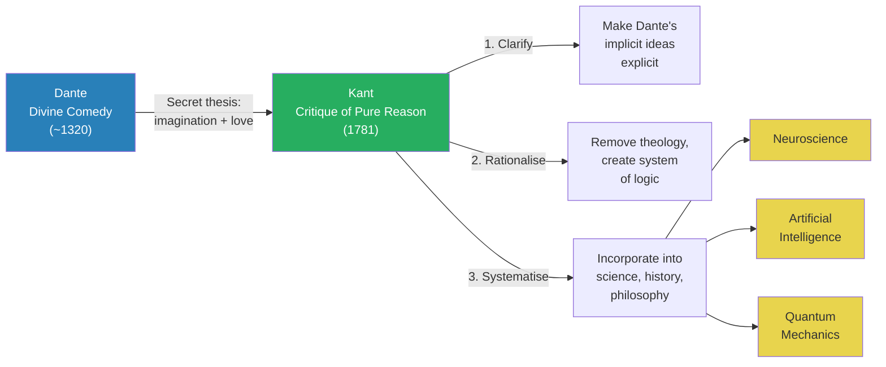
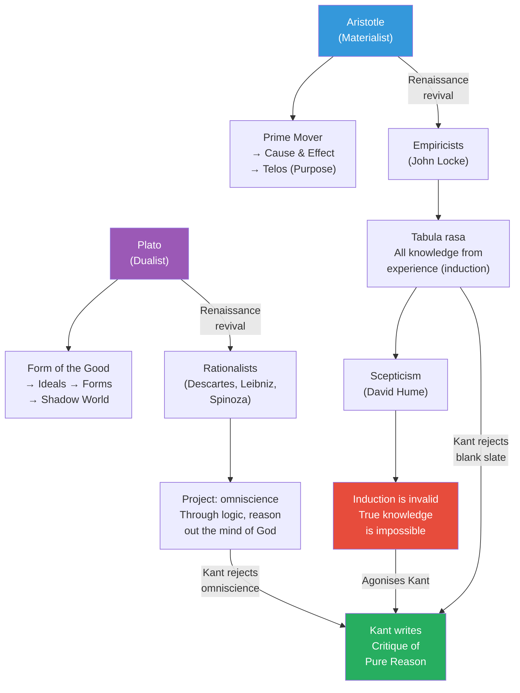
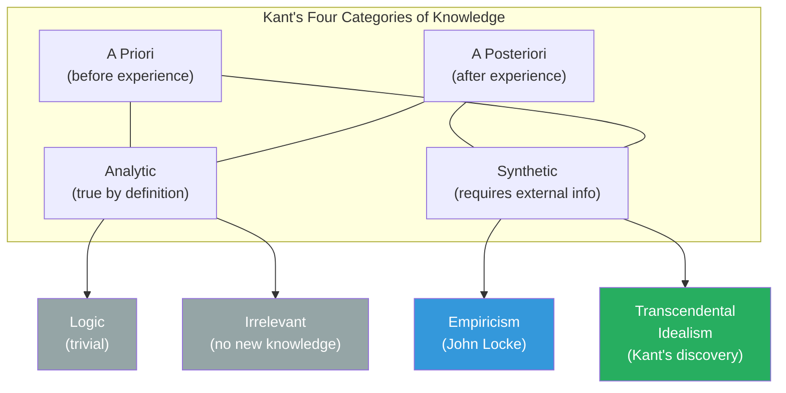
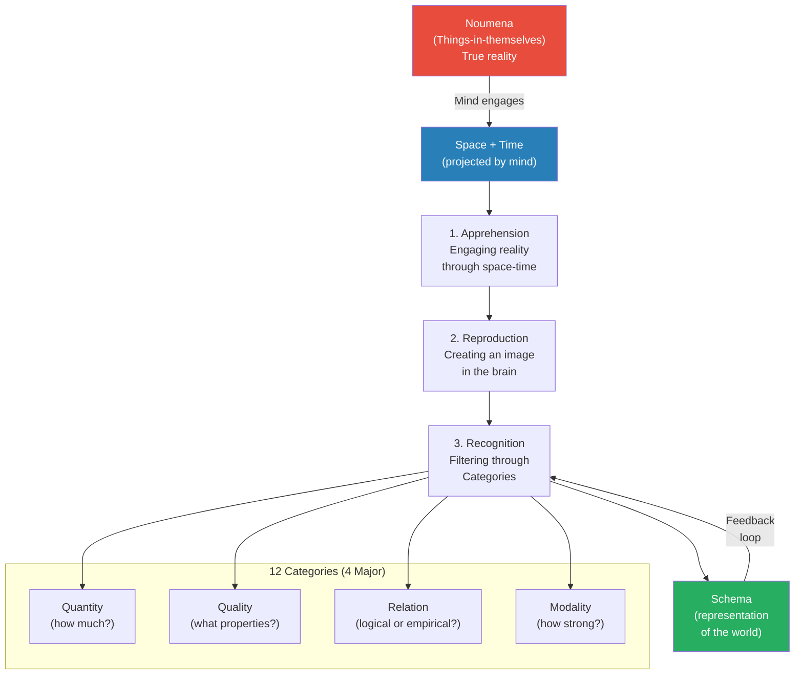
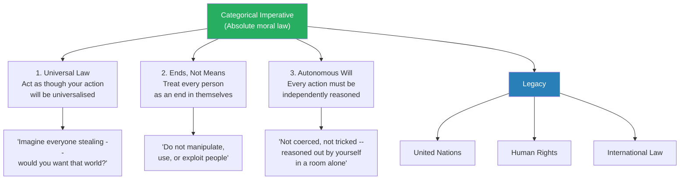
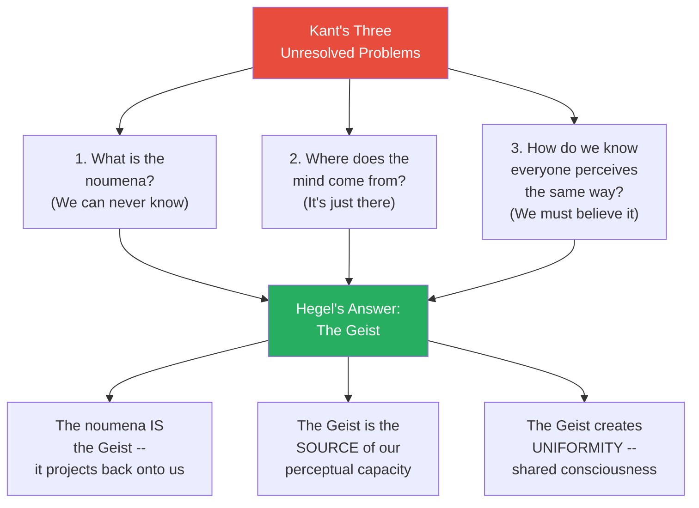
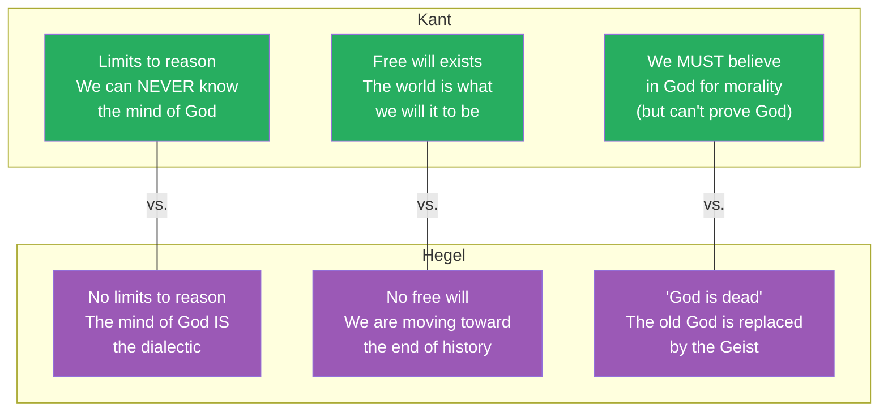
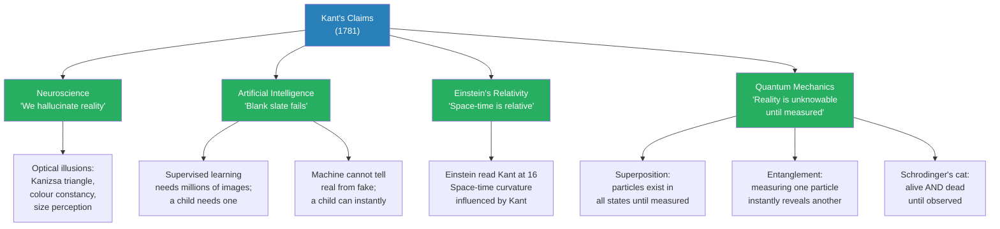

# Kant, Hegel, and the Theory of Everything

> Prof. Jiang devotes this lecture to two of the most consequential philosophers in human history: Immanuel Kant and Georg Wilhelm Friedrich Hegel. He argues that Kant took Dante's secret thesis -- the imagination is the animating force of the universe, love is its unifying force -- and did three things to it: clarified it, rationalised it (removed theology), and systematised it into a framework of logic that underpins modern neuroscience, artificial intelligence, and quantum mechanics. Hegel then resolved Kant's three unresolved problems by proposing the Geist -- a collective spirit that is the source, the substance, and the destination of all human history. Together, Dante, Kant, and Hegel created the intellectual reality we inhabit today.

---

## Overview: Key Highlights

- <b style="color: #27ae60">Kant proved that imagination is the animating force of the universe</b> -- he showed that space and time are not features of reality but projections of the human mind, making us active creators of the world we experience
- <b style="color: #2980b9">Transcendental idealism</b> -- Kant's radical claim that a priori synthetic knowledge exists in the mind before any experience, providing the categories through which we perceive reality
- <b style="color: #e74c3c">The blank slate (tabula rasa) is impossible</b> -- Kant demolished the empiricist position by showing that without innate mental structures, no knowledge of any kind could form
- <b style="color: #2980b9">Noumena vs. phenomena</b> -- things-in-themselves (reality) versus things-for-us (appearances) -- we can only ever know the latter
- <b style="color: #27ae60">The categorical imperative</b> -- Kant's universal moral law: act as though your action will be universalised; treat every person as an end, never a means; reason independently
- <b style="color: #2980b9">The Geist</b> -- Hegel's central concept: a collective mind/spirit that is the source, substance, and destination of all reality, understood through three English derivatives -- ghost, geyser, gist
- <b style="color: #e74c3c">Hegel eliminates free will</b> -- if history is a teleological movement toward the Absolute Spirit, then every conflict, every war, every decision was always part of the plan
- <b style="color: #27ae60">The dialectic</b> -- thesis, antithesis, synthesis: the engine of all historical progress, later inverted by Marx into dialectical materialism
- <b style="color: #2980b9">Quantum mechanics confirms Kant</b> -- superposition, wave-function collapse, and quantum entanglement all validate Kant's claim that reality is unknowable until the mind engages it
- <b style="color: #e74c3c">Without philosophy, science stalls</b> -- Prof. Jiang's radical claim: since Konigsberg fell, no major advances in fundamental science have occurred because culture and the Geist have been abandoned
- <b style="color: #27ae60">Neuroscience proves we hallucinate reality</b> -- optical illusions and perceptual experiments confirm Kant's thesis that the mind actively constructs what we see
- <b style="color: #2980b9">The Copernican revolution in philosophy</b> -- before Kant, philosophers thought we passively observe objective reality; Kant proved we actively project onto it

| Concept | One-line summary |
|---------|-----------------|
| **Transcendental idealism** | A priori synthetic knowledge exists in the mind and structures all experience |
| **Noumena (things-in-themselves)** | Reality as it truly is -- unknowable, beyond space and time |
| **Phenomena (things-for-us)** | Appearances created when the mind projects space-time onto reality |
| **A priori / a posteriori** | Knowledge independent of experience vs. knowledge gained through experience |
| **Analytic / synthetic** | Statements true by definition vs. statements requiring external information |
| **Categories (heuristics)** | Twelve mental filters (quantity, quality, relation, modality) that organise raw perception into knowledge |
| **Categorical imperative** | Universal moral law: universalise your actions, respect persons as ends, reason autonomously |
| **The Geist** | Hegel's collective mind/spirit -- the source, engine, and destination of all history |
| **The dialectic** | Thesis + antithesis = synthesis -- the mechanism by which history and knowledge progress |
| **Absolute Spirit** | The endpoint of history: full reconciliation between humanity and God |
| **God is dead** | Hegel's claim (later adopted by Nietzsche): the old conception of God must be replaced by the Geist |
| **Copernican revolution** | Kant's reframing: we do not passively observe reality -- we actively create it |

---

# The Lecture

## The Mission of Kant: Clarify, Rationalise, Systematise Dante [0:00 - 2:00]

*Prof. Jiang opens by framing Kant's entire project as a continuation of Dante's secret thesis from the Divine Comedy. Kant's mission was threefold: make Dante's implicit ideas explicit, remove theology, and build a system of logic that could incorporate itself into science, history, and philosophy.*

> [!tip] Core Insight
> Dante and Kant together created the world we live in today. Dante discovered the secret -- imagination is the animating force of the universe, love is its unifying force -- and Kant built the logical system that allowed it to enter science.

*The intellectual lineage runs from Dante's poetry through Kant's philosophy to the three pillars of modern science. Prof. Jiang's argument is that without this chain, none of these scientific fields could have emerged.*

> [!note]- Expand: Full Lecture Detail
> - Prof. Jiang opens by stating the lecture will cover Immanuel Kant and Georg Wilhelm Friedrich Hegel
> - His main argument: Kant took the central thesis of Dante -- <b style="color: #27ae60">the imagination is the animating force of the universe, and love is the unifying force</b> -- and used his epistemology (theory of knowledge: how do we know what we know?) to do three things
>   - **Clarify:** Dante was not explicit about what he was saying -- you have to interpret him properly. Kant made Dante's ideas explicit to the world
>   - **Rationalise:** Kant removed divinity and theology, creating a pure system of logic
>   - **Systematise:** He built a framework that could incorporate itself into science, history, and philosophy
> - Prof. Jiang's sweeping claim: "Together, Dante and Kant really did create the world that we live in today"

---

## The Background: Plato, Aristotle, and Three Schools of Thought [2:00 - 8:47]

*Prof. Jiang sets the stage by mapping the entire history of Western philosophy into two camps -- Plato and Aristotle -- and then showing how these camps re-emerged after the Renaissance into three competing schools: rationalism, empiricism, and scepticism. Kant will respond to all three.*

*All roads lead to Kant. The rationalists aimed too high (omniscience), the empiricists assumed too little (blank slate), and Hume threw out the entire project. Kant was so agonised by Hume's conclusions that he wrote the greatest treatise in the history of philosophy.*

> [!note]- Expand: Full Lecture Detail
> - For most of Western history, two major philosophers dominated: <b style="color: #2980b9">Plato</b> and <b style="color: #2980b9">Aristotle</b>
> - **Plato's system:**
>   - God is the <b style="color: #2980b9">Form of the Good</b> -- perfect, immaculate, eternal
>   - The Form of the Good emanates the **Ideals** (perfect conceptions of beauty, reason, justice)
>   - The Ideals give rise to the **Forms** (the perfect horse, the perfect chair, the perfect square)
>   - We live in the **Shadow World** -- everything here is only an imitation of the Forms (the Allegory of the Cave)
>   - Good = moving toward the Form of the Good; evil = moving away
>   - Art and poetry are evil (imitating imitation); mathematics and philosophy are good (returning to truth)
>   - Plato's ideas become the basis for Christianity: life on Earth doesn't matter, only the return to heaven
>   - Plato is a **dualist** -- both matter and ideas matter
> - **Aristotle's system:**
>   - God is the <b style="color: #2980b9">Prime Mover</b> -- the first thing that moves, causing everything else to move through cause and effect
>   - Everything moves toward its <b style="color: #2980b9">telos</b> (Greek for purpose)
>   - Prof. Jiang illustrates: "As a teacher, my telos is to teach as well as I can, and my mission is to constantly learn and improve"
>   - Observation and experience reveal each thing's telos, which allows categorisation
>   - Aristotle's ideas become the basis for science
>   - Aristotle is a **materialist** -- only the here and now matters
> - Three conceptions of the universe: materialistic (Aristotle), idealistic (Hegel), dualistic (Plato)
> - After the Catholic Church suppressed philosophy, these schools re-emerged post-Renaissance into three camps:
>
> - **Rationalists** (taking up Plato):
>   - Descartes, Leibniz, Spinoza
>   - Project: through mathematics and logic, reason out the mind of God from first principles
>   - Goal: <b style="color: #e74c3c">omniscience</b>
>   - Also called "Continental philosophy" -- based on the continent of Europe
>   - Becomes the basis for the Enlightenment
> - **Empiricists** (taking up Aristotle):
>   - John Locke is the most famous
>   - Our minds are born <b style="color: #2980b9">tabula rasa</b> (blank slate) -- knowledge comes only through experience
>   - Method: **induction** (specific observations generalised into abstract principles)
>   - Prof. Jiang illustrates: "If I see five boys wearing white shirts, I generalise that all boys wear white shirts"
>   - Becomes the basis for the scientific method
> - **Sceptics** (negating the empiricists):
>   - <b style="color: #2980b9">David Hume</b> -- pioneered scepticism
>   - Hume's attack: you cannot generalise from observation. "Just because you meet one million white swans does not mean all swans are white"
>   - Hume's conclusion: knowledge is based on **custom** (consensus) -- "we agree this is right, therefore it is right"
>   - <b style="color: #e74c3c">True knowledge is impossible, and philosophy is pointless</b>
> - Kant reads Hume and is so agonised that he writes the *Critique of Pure Reason* -- "the greatest treatise of philosophy ever in human history"
> - Prof. Jiang's honest admission: "It's extremely dense, extremely complicated, and quite honestly, I have not been able to complete it"

---

## Kant's Critique of Pure Reason: A Radical New Theory of the World [8:47 - 22:00]

*Prof. Jiang walks through the architecture of the Critique of Pure Reason -- Kant's dismantling of all three schools, his proof that a priori synthetic knowledge must exist, the discovery that space and time are mental projections, and the three-stage process by which the mind transforms raw reality into comprehensible experience.*

> [!tip] Core Insight
> Space and time do not exist in reality. They are projections of our minds that turn the world into a story -- and stories require causality, which requires sequence, which requires time. We are not observers of reality. We are its authors.

*The 2x2 grid of knowledge types. Three cells are uncontroversial. The fourth -- a priori synthetic -- is the battlefield. Hume said it cannot exist. Kant spent 1,000 pages proving it must.*

*Kant's three-stage perceptual process. Reality (red) is unknowable. The mind projects space and time (blue) onto it, then filters through categories to produce a schema (green) -- a workable representation we call "the world." The feedback loop between schema and categories means we are constantly refining our picture.*

> [!note]- Expand: Full Lecture Detail
> - In the *Critique of Pure Reason*, Kant shows all three schools are problematic:
>   - **Rationalism:** <b style="color: #e74c3c">Omniscience is not possible</b> -- there are limitations to our capacity to reason and pursue knowledge
>   - **Empiricism:** Tabula rasa cannot be true -- certain mechanisms of thought must already be in place for us to engage with the world at all
>   - **Scepticism:** Knowledge is real, inherent, and true -- philosophy is not pointless but "the most important pursuit in human history"
> - By responding to all three, Kant creates a radical new epistemology based on the thinking of Dante
>
> - **Kant's terminology:**
>   - <b style="color: #2980b9">Noumena</b> (Greek): things-in-themselves -- the world that is true and real
>   - <b style="color: #2980b9">Phenomena</b> (Greek): things-for-us -- appearances, which may not be true
>   - Kant's thesis: within us, there is a mechanism that is always perceiving reality in a way that allows us to understand, interpret, and manipulate it
>
> - **The four categories of knowledge:**
>   - A priori + analytic = logic (trivial)
>   - A posteriori + synthetic = empiricism (John Locke's project)
>   - A posteriori + analytic = irrelevant (e.g. "a square has four sides" is true whether or not you see a square)
>   - A priori + synthetic = <b style="color: #27ae60">transcendental idealism</b> -- the contested territory
>   - Hume explicitly says a priori synthetic knowledge is impossible
>   - Kant devotes the entire 1,000-page *Critique* to proving it must exist
>
> - **Space and time as mental projections:**
>   - Space = sensation (interaction with the world around us)
>   - Time = sequence (an ordering: 1, 2, 3, 4, 5)
>   - <b style="color: #27ae60">Space and time do not exist in reality</b> -- they are projected by our minds to subsidise reality into something we can understand and manipulate
>   - With space and time, you get **causality** (cause and effect)
>   - Causality is a story -- so what Kant is saying is "we are just imagining reality into a story, and that allows us to understand it"
>
> - **Kant's three-stage perceptual process:**
>   1. <b style="color: #2980b9">Apprehension</b> -- engaging with things-in-themselves through the projection of space-time
>   2. <b style="color: #2980b9">Reproduction</b> -- creating an image of reality in the brain
>   3. <b style="color: #2980b9">Recognition</b> -- filtering this image through **categories** (heuristics, algorithms of the mind)
>   - Prof. Jiang: "Computers use algorithms, we use heuristics"
>   - Twelve categories, four major groups: **quantity** (how much?), **quality** (what properties?), **relation** (logical or empirical?), **modality** (how strong is the relation?)
>   - The result: a **schema** -- a representation of the world that allows understanding
>   - Prof. Jiang illustrates: "We see a lot of triangles, but we don't actually have an image of a triangle in our head -- we have a concept"
>   - The schema feeds back into the categories in a feedback loop, allowing us to filter the world more precisely over time
>
> - Prof. Jiang summarises: "All this is saying is, this is reaffirming the Dante belief that the imagination is the animating force of the world. Without us, reality cannot be alive. It is our imagination that makes reality alive to us."

---

## The Categorical Imperative: Kant's Theory of Morality [22:00 - 30:00]

*Prof. Jiang moves from the Critique of Pure Reason to the Critique of Practical Reason -- Kant's moral philosophy. He presents the categorical imperative as the individualised version of Rousseau's general will, and then reveals the deeper connection: it is simply Dante's commandment to love, stripped of theology and expressed as logic.*

*The three pillars of the categorical imperative and their concrete legacy. Kant believed that because we are capable of reason and imagination, we are capable of imagining a moral world -- and therefore obligated to build one.*

> [!note]- Expand: Full Lecture Detail
> - From the *Critique of Practical Reason*, Kant presents his theory of morality
> - The <b style="color: #2980b9">categorical imperative</b> is distinguished from the **hypothetical imperative**:
>   - Hypothetical: circumstantial rules (how should a child in school behave?)
>   - Categorical: absolute rules (how should you always behave?)
> - **Three principles of the categorical imperative:**
>   1. <b style="color: #27ae60">Universal law:</b> imagine your action universalised -- everyone will behave as you do. "You can choose to steal, but imagine everyone stealing. You certainly would not want to live in that world"
>   2. <b style="color: #27ae60">Humanity as an end:</b> see every human as an end in themselves, never as a means. "Do not manipulate people, do not use people. Treat people with respect"
>   3. <b style="color: #27ae60">Autonomous will:</b> everything you do must be something you reason out independently -- "not coerced, not manipulated, not tricked -- something you sitting by yourself in a room are able to reason out"
> - This becomes the basis for the United Nations, human rights, and international law
>
> - **Connection to Rousseau's general will:**
>   - Prof. Jiang recalls Rousseau: the general will is not democracy (not "everyone votes for ice cream")
>   - The general will is "the best interest of people that you can derive by reasoning out yourself" -- if everyone sat alone and asked what to eat, it would be salad, not ice cream
>   - The categorical imperative is "the individualised general will" -- you internalise the general will and behave as though you are it
>
> - **Connection to Dante:**
>   - Dante's categorical imperative was simple: **love someone**
>   - "Doesn't matter who -- your wife, your mother, your child, your best friend -- love that person"
>   - When you love someone, all three Kantian principles become true automatically:
>     - You strive to be your best (universal law)
>     - You treat them with respect (ends, not means)
>     - You choose freely to love them (autonomous will)
>   - <b style="color: #27ae60">Love is the unifying force of the universe</b> -- Kant is simply systematising what Dante said in the Divine Comedy
>
> - **Three thought experiments to understand Kant:**
>
> > [!example] The Diary Experiment
> > - Write a diary for a whole year -- 365 separate entries, one each night
> > - At the end of the year, write one long diary entry summarising the year
> > - In theory, the 365 entries should add up to equal the long entry
> > - In practice, the long entry has almost no relation to the separate entries
> > - We are constantly reimagining the world in a new way, building on previous reimaginings
> > **The lesson:** We do not accumulate discrete data points -- we constantly synthesise them into new stories, confirming Kant's claim that the imagination actively constructs reality.
>
> > [!example] The Park Memory Experiment
> > - Organise 100 classmates to spend a whole day in a park, all doing the same activities
> > - Next day, ask all 100 to write down their experience of that one day
> > - Every person's account will be different -- each experience unique
> > **The lesson:** If 100 people sharing identical circumstances produce 100 different realities, then the imagination -- not the external world -- is the animating force.
>
> > [!example] The Desert Island Thought Experiment
> > - You arrive on a fertile island -- plenty of fruits, fish, no danger of starving
> > - One night, your mind is wiped clean: tabula rasa, as Locke proposed
> > - You cannot speak, reason, or remember anything -- total blank slate
> > - **Locke's prediction:** you starve, because you don't know what to eat -- you put stones in your mouth
> > - **Kant's prediction:** because you have a priori synthetic knowledge, your mind quickly categorises -- stones and wood are inedible, fruits and water are edible
> > - Prof. Jiang: "Through pure intuition, we can figure out that Kant makes more sense than John Locke"
> > **The lesson:** The speed with which a mind can rebuild functional knowledge from scratch proves that innate cognitive structures exist before experience.

---

## The Student's Question: Did Kant Think He Was Doing Science? [32:37 - 34:00]

*A student asks whether Kant saw himself as a natural philosopher (like Newton) and how science views him today. Prof. Jiang's answer connects Kant to Einstein and quantum mechanics.*

> [!note]- Expand: Full Lecture Detail
> - Student asks two questions: (1) Did Kant see himself as a scientist? (2) How does science perceive him today?
> - **Kant's self-perception:**
>   - Kant saw himself as a revolutionary thinker -- he compared himself to **Copernicus**
>   - He called the *Critique of Pure Reason* a <b style="color: #2980b9">Copernican revolution</b> in philosophy
>   - Before Kant: philosophers believed in objective reality, and we were passive observers who could eventually access it through logic and experience
>   - After Kant: <b style="color: #27ae60">the world is entirely subjective -- we project our imagination onto the universe, and we are active participants in creating reality</b>
> - **Kant's influence on science:**
>   - Einstein read Kant at age 16 and was "heavily influenced" -- Kant's theories of space, time, and a priori knowledge contributed to the theory of relativity
>   - Quantum mechanics contains many ideas heavily influenced by Kant
>   - Prof. Jiang promises to explore this legacy further later in the lecture

---

## Hegel and the Geist: A Theory of Everything [34:00 - 47:50]

*Prof. Jiang transitions to Hegel by presenting the three unresolved problems in Kant's system, then shows how Hegel resolves all three with a single concept: the Geist. He explains the dialectic, walks through a vivid island thought experiment, and traces Hegel's three greatest legacies -- Marxism, "God is dead," and the nation state.*

> [!tip] Core Insight
> Hegel's radical move: what if, as we perceive the noumena, the noumena is projecting back onto us? The Geist is both the source that creates our ability to perceive and the destination toward which all history moves.

*Hegel's single concept resolves all three of Kant's open problems. The Geist is not a patch on Kant's system -- it is a total reframe that transforms philosophy from a theory of individual perception into a theory of collective historical destiny.*

```mermaid
flowchart LR
    T["Thesis<br/>'I am the universe'"] -->|"Encounter<br/>the Other"| AT["Antithesis<br/>'You are NOT me'"]
    AT -->|"Conflict &<br/>reconciliation"| S["Synthesis<br/>'WE are the universe'"]
    S -->|"Encounter<br/>another Other"| AT2["New Antithesis"]
    AT2 -->|"Conflict &<br/>reconciliation"| S2["New Synthesis"]
    S2 -->|"Repeating<br/>through history"| AS["Absolute Spirit<br/>(End of History)"]
    style T fill:#3498db,color:#fff
    style AT fill:#e74c3c,color:#fff
    style S fill:#27ae60,color:#fff
    style AS fill:#9b59b6,color:#fff
```

*The dialectic is not just a logical mechanism -- it is the engine of all human history. Every conflict, every encounter with the Other, every war and reconciliation moves humanity closer to the Absolute Spirit: the full reunification of God and humanity.*

> [!note]- Expand: Full Lecture Detail
> - **Kant's three unresolved problems:**
>   1. <b style="color: #e74c3c">What is the noumena?</b> -- things-in-themselves. Kant says: we can never know, because we cannot imagine ourselves outside of space and time
>   2. <b style="color: #e74c3c">What is the source of the mind's capacity?</b> -- if our brains have a priori synthetic knowledge, where does it come from? Kant says: it's just there
>   3. <b style="color: #e74c3c">How do we know there is uniformity?</b> -- if everyone projects onto reality, how do we know everyone projects the same way? How could mathematics and science exist without uniformity? Kant says: we have to believe it, otherwise the world makes no sense
>   - Prof. Jiang: "The problem with Kant is this is not satisfying"
>
> - **Hegel's resolution -- the Geist:**
>   - Hegel's major insight: what if, as we perceive the noumena, <b style="color: #27ae60">the noumena is projecting back onto us?</b>
>   - The noumena becomes the source for our ability to perceive it -- and it creates uniformity
>   - Hegel calls this the <b style="color: #2980b9">Geist</b> (German for mind/spirit)
>   - Major work: *Phenomenology of Spirit* (also translated as *Phenomenology of Mind*)
>   - Prof. Jiang offers a metaphor: "Imagine the Geist as the internet, and we are individual computers always interacting with it" -- imperfect but functional
>
> - **Three English words derived from Geist reveal its nature:**
>   1. <b style="color: #2980b9">Ghost</b> -- the Geist is coexisting with us, here and now, not separate
>   2. <b style="color: #2980b9">Geyser</b> -- the Geist is always growing, expanding, spawning upward
>   3. <b style="color: #2980b9">Gist</b> -- the Geist is the essence of reality, the core of all life
>   - "Hegel is an idealist -- he doesn't care about the material world. What matters is the Geist itself, the ideas, because that's what drives human history"
>
> - **The dialectic:**
>   - What matters is not the things, not the ideas, but the **movement** of things
>   - <b style="color: #2980b9">Thesis → antithesis → synthesis</b> -- this is the movement of human history
>   - "We all seek self-knowledge, but the way to seek self-knowledge is by asking who we are NOT, which creates the antithesis. When the antithesis conflicts with who we are, it creates new knowledge"
>
> > [!example] The Island of 100 People -- Hegel's Thought Experiment
> > - 100 people on an island, each sleeping in a different corner
> > - During the night, all minds are wiped clean -- complete tabula rasa
> > - Each person wakes up seeing only the universe and thinks: "I am the universe, I am God"
> > - Walking along the beach, you encounter someone else -- they look like you but are not you
> > - This Other destroys your conception of yourself as the universe -- thesis meets antithesis
> > - Conflict erupts -- physical fighting, arguing
> > - Over time, a synthesis forms: "The two of us are now the universe"
> > - But then you meet another person, and another -- the process repeats endlessly
> > - Eventually, all 100 rediscover who they are through conflict and differentiation
> > - They form a collective consciousness -- what Hegel calls the <b style="color: #2980b9">Absolute Spirit</b>
> > **The lesson:** Conflict is not a failure of history -- it is the mechanism of enlightenment. Every encounter with the Other, even violent ones, moves humanity toward the Absolute Spirit.
>
> - **Hegel's theology of history:**
>   - God has two forms: God is the Geist, and God is the universe
>   - Why? Because God is trying to create **reconciliation** between itself and all things in the universe
>   - The Geist, through the dialectic, is growing until it becomes the universe itself -- that is the <b style="color: #2980b9">end of history</b>
>   - This is a **teleological** movement -- everything moves toward its purpose
>   - "The world is not being but **becoming** -- constantly in a process of transformation, growth, expansion"
>   - Being = when we are completely reconciled to God (the end of history)
>
> - **Evidence for the Geist -- three domains of progress:**
>   - **Art:** the Romantic period is the highest because it synthesises all previous periods
>   - **Religion:** Christianity is the highest because Jesus freed God from the priests -- "the great democratic force"
>   - **Philosophy:** Hegel's own theory is the highest because it is the endpoint of all accumulated knowledge from the Geist
>
> - **Hegel's three major legacies:**
>   1. <b style="color: #2980b9">Marxism:</b> Karl Marx inverted Hegel -- if Hegel says only ideas matter, Marx says only material things matter. But Marx adopted the dialectic, creating **dialectical materialism**
>   2. <b style="color: #2980b9">"God is dead":</b> this phrase originated with Hegel, not Nietzsche. Meaning: we need to change our conception of God from aloof and distant to a God that is moving in us toward itself
>   3. <b style="color: #2980b9">The nation state:</b> the theory of Geist allows a nation state to have a soul -- which leads to imperialism, World War One, "and other really fun things"

---

## Kant vs. Hegel: Three Fundamental Differences [47:50 - 52:00]

*A student probes whether Hegel truly believed his own system or was constructing an elegant abstraction. Prof. Jiang uses this to draw out the three sharpest contrasts between Kant and Hegel -- on the limits of reason, free will, and God.*

*Kant is the humble empiricist of philosophy -- he draws firm lines around what can be known. Hegel is the mystic systematiser -- he claims to have solved everything. The student's instinct that Hegel is "more abstract by almost by scale" is exactly right.*

> [!note]- Expand: Full Lecture Detail
> - Student observes that both Kant and Hegel make great intellectual edifices, but he "can picture Kant living within this" -- Kant is saying something concrete about the world. Hegel seems far more abstract
> - Prof. Jiang agrees: "Kant is very logical, Hegel is very abstract"
>   - "If you spend enough time on the *Critique of Pure Reason*, you will get through it -- you will be able to master it"
>   - "Whereas if you try to read Hegel, especially the *Phenomenology of Spirit*, it's just impossible -- everyone who reads it will have a different interpretation"
>   - Why? Because Hegel is trying to synthesise all human knowledge into a single system -- "which Kant basically said we can't really do"
>   - Prof. Jiang's honest admission: "I'm not an expert on Hegel, and I don't want to be, because I think I will go crazy"
>
> - **Three key differences between Kant and Hegel:**
>
> | | Kant | Hegel |
> |---|---|---|
> | **Limits of reason** | There are limits -- we can never know the mind of God | The mind of God is the dialectic -- therefore we CAN know it |
> | **Free will** | The world is what we will it to be -- we have free will | We are moving toward the end of history -- no free will, everything is planned |
> | **God** | We must believe in God for morality to exist (but cannot prove God) | "God is dead" -- the old God is replaced by the teleological Geist |
>
> - Kant's honesty is striking: "There is nothing I can do to prove God exists, but we must believe God exists, otherwise we have no morality. We must believe free will exists, even though there's no logical proof, otherwise what's the point of existence?"

---

## The Legacy of Kant: Neuroscience, AI, and Quantum Mechanics [52:00 - 1:08:04]

*Prof. Jiang presents the most provocative section of the lecture: the more science progresses, the more it confirms Kant. He walks through optical illusions, supervised machine learning, Einstein's relativity, quantum superposition, wave-function collapse, quantum entanglement, and Schrodinger's cat -- all as evidence that Kant's epistemology is the foundation of modern science. He closes with a radical question: did Kant describe reality, or did he create it?*

> [!tip] Core Insight
> Is Kant describing the world we live in, or did he create this reality? Philosophy creates the boundaries of the human imagination -- science can only play within those boundaries. Without culture and the Geist, fundamental science stalls.

*Four domains of modern science, all confirming what a philosopher argued in 1781. Prof. Jiang's point is not merely historical -- he is arguing that philosophy precedes and enables science, not the other way around.*

> [!note]- Expand: Full Lecture Detail
> - **Neuroscience -- "We hallucinate reality":**
>   - Prof. Jiang shows multiple optical illusions to the class:
>     - The <b style="color: #2980b9">Kanizsa triangle</b>: we see a triangle that does not exist -- just lines exist, but the first thing we perceive is the non-existent triangle
>     - A static image that appears to move -- "our mind is playing tricks on us"
>     - Lines that appear slanted but are parallel when placed side by side
>     - Two circles that appear different sizes because of surrounding context circles
>     - Two squares (A and B) that appear to be different colours but are identical
>   - "Neuroscientists have done all these experiments and proven that we constantly participate in reality -- we hallucinate reality, which is what Kant originally proposed"
>
> - **Artificial intelligence -- the failure of the blank slate:**
>   - <b style="color: #2980b9">Supervised learning:</b> to teach a machine to recognise a picture, you must feed it millions of training images and label them -- the machine turns each picture into a mathematical concept
>   - This is extremely expensive and time-consuming
>   - Compare with a human: "If I just give you a picture of a sheep, you're able to know what a sheep is" -- instantly, with one example
>   - Critical difference: a machine cannot tell you if a sheep is real or fake. "Real and fake are categories of a mind" -- without a priori knowledge, this distinction is impossible
>   - A machine cannot recognise a schematic drawing of a sheep as a sheep -- but any child can, because we have schemas (concepts) built into our minds
>   - <b style="color: #27ae60">Artificial intelligence confirms that Kant was correct: the blank slate cannot work</b>
>
> - **Einstein and the theory of relativity:**
>   - Einstein read Kant at age 16 -- "had a huge influence"
>   - Space-time curvature is influenced by Kant's argument that space and time are projections of the mind
>   - The theory of relativity illustrated: two train platforms moving simultaneously at the same speed -- from the passengers' perspective, neither is moving. "The laws of physics are relative to where we are at the moment"
>
> - **Quantum mechanics -- confirmation of noumena:**
>   - Quantum mechanics confirms that things-in-themselves are not knowable to us
>   - <b style="color: #2980b9">Wave-particle duality:</b> photons are simultaneously wave-like and particle-like -- you cannot determine which until you measure
>   - <b style="color: #2980b9">Superposition:</b> before measurement, particles simultaneously occupy many different possibilities
>   - <b style="color: #2980b9">Wave function:</b> all the probabilities of a particle's position in space -- measurement collapses it into one data point
>   - The Bohr model of the atom is a simplification -- in reality, "it's a cloud, meaning we don't know where the electrons are, only the probability of where they could be"
>
> > [!example] Einstein vs. Quantum Mechanics -- The Battle Over Entanglement
> > - Einstein hated quantum mechanics -- "too much randomness, it's ugly"
> > - He believed God, as an architect, had an elegant mind -- quantum mechanics was "insulting God"
> > - To disprove quantum mechanics, Einstein wrote a paper on <b style="color: #2980b9">quantum entanglement</b>
> > - The concept: two atoms are aligned together, their states mirror images of each other
> > - Split them and send them to different corners of the universe
> > - According to quantum mechanics: measuring the first atom instantly reveals the state of the second -- simultaneously, across any distance
> > - Einstein said this was impossible -- "spooky action at a distance"
> > - Experiments have since proven quantum entanglement actually works
> > - Quantum mechanics is "the most successful theory in physics of all time" -- it gave us the transistor, which gave us the computer, which gave us the internet
> > **The lesson:** Einstein tried to disprove quantum mechanics and instead provided its most dramatic confirmation. Even geniuses cannot escape the boundaries that philosophy sets for science.
>
> > [!example] Schrodinger's Cat and Wigner's Friend
> > - Schrodinger's thought experiment: a cat in a box with radioactive material
> > - You cannot know if the cat is dead or alive -- it is simultaneously both (superposition)
> > - Wigner extends the problem: a scientist opens the box and sees the cat is dead
> > - But a friend in the laboratory who has not opened the box -- what is reality for him?
> > - Has his reality changed because the scientist knows? Or does he still inhabit the superposition?
> > - The question quantum mechanics cannot answer: is reality subjective or objective?
> > - "Is it possible that we all live within our own universe that is unique to us?"
> > **The lesson:** Quantum mechanics cannot resolve whether reality is shared or individual -- but Kant already answered: we do create our own individual reality, and the noumena is something we can never see.
>
> - **Prof. Jiang's radical question:**
>   - "Is Kant describing the world we live in, or did he create this reality that we live in?"
>   - Rather than neuroscience, AI, and quantum mechanics confirming Kant, perhaps <b style="color: #27ae60">Kant gave these scientists the intellectual capacity to come up with these theories in the first place</b>
>   - "Philosophy creates the boundaries of the human imagination, and all science is doing is playing within these boundaries to confirm what is known"
>   - The chain: Dante talks to God → writes the Divine Comedy → inspires Kant → Kant writes the Critique of Pure Reason → inspires Hegel → together they inspire neuroscience, AI, and quantum mechanics
>   - <b style="color: #e74c3c">Without culture and the Geist, fundamental science stalls</b>: "Ever since Konigsberg fell, ever since the Germans lost World War Two, we have not made major advances in science"
>   - Prof. Jiang distinguishes: the transistor is not a major advance -- "it's just technology, just taking a science and expressing it in the world"
>   - "Without culture, without the Geist, is it possible to contribute to advanced science? I think the answer is no. I think we're stuck where we are because we've abandoned culture"

---

## The Konigsberg Clock [1:08:04 - end]

*Prof. Jiang closes with a biographical detail that perfectly embodies the Hegel-Kant relationship: Kant was so regimented that the residents of Konigsberg set their clocks by his daily walks. Konigsberg then became the intellectual and scientific centre of Europe -- did Kant create Konigsberg, or did Konigsberg create Kant?*

> [!note]- Expand: Full Lecture Detail
> - Kant was a citizen of Konigsberg (modern-day Kaliningrad)
> - He was called "the Konigsberg Clock" because his daily routine was so precise that residents could tell the time by observing where he was on his walk
> - After Kant, Konigsberg became the intellectual and scientific centre of Europe
> - Prof. Jiang poses the Hegelian question: "You can make the argument that Kant created Konigsberg -- but Konigsberg also created him, which would be very familiar to Hegel"
> - This reciprocal creation -- the individual shaping the place, the place shaping the individual -- is a perfect microcosm of the Geist
> - Preview: next class will cover Karl Marx

---

## Connections

**Builds on:** [[29 - Dante's Divine Comedy and the Liberation of the Human Imagination]] (Dante's thesis that imagination is the animating force of the universe and love is its unifying force -- Kant systematises this), [[46 - The Revolution of Reason]] (Descartes's cogito, Rousseau's general will, Kant's absolutist freedom -- all directly referenced and extended here), [[10 - The Trial of Socrates and Plato's Allegory of the Cave]] (Plato's Form of the Good and the Shadow World, reviewed as one of two philosophical traditions Kant inherits)

**Sets up:** [[56 - What Marx Got Wrong]] (Marx inverts Hegel's dialectic into dialectical materialism -- Prof. Jiang previews this as next class)

**Related books in vault:** [[Sapiens - Yuval Noah Harari]] (Harari's "wheat domesticated us" is echoed in Kant's inversion of the observer-reality relationship), [[Antifragile - Nassim Nicholas Taleb]] (the idea that systems benefit from disorder maps onto Hegel's claim that conflict drives enlightenment)

---

## The Takeaway

This lecture reveals the hidden architecture beneath modern science. Prof. Jiang's argument is not merely that Kant and Hegel were important philosophers -- it is that they created the intellectual space in which neuroscience, artificial intelligence, and quantum mechanics could be conceived. The chain runs from Dante's Divine Comedy through Kant's Critique of Pure Reason to Hegel's Phenomenology of Spirit, and from there into every laboratory and research university in the world. Without the philosophical framework, the data would have no interpretation.

The most counterintuitive insight is Prof. Jiang's claim that science has stalled since the fall of Konigsberg -- not because we lack data or technology, but because we have abandoned the culture and the Geist that gave scientists the imaginative boundaries within which to think. The transistor is not a breakthrough; it is an application. The real breakthroughs -- relativity, quantum mechanics, the theory of computation -- all emerged from minds steeped in philosophy. Prof. Jiang is warning that a civilisation that funds only STEM and starves the humanities is cutting off the root while expecting the tree to keep bearing fruit.

The question left unresolved is the deepest one the lecture poses: did Kant describe reality, or did he create it? If philosophy truly sets the boundaries of the human imagination, and science merely plays within those boundaries, then the next revolution in science will not come from a laboratory but from a philosopher -- someone who reimagines the boundaries themselves. Who will be the next Kant?
