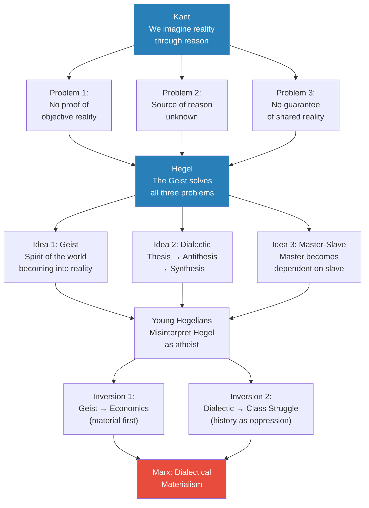
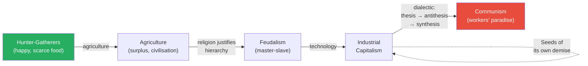
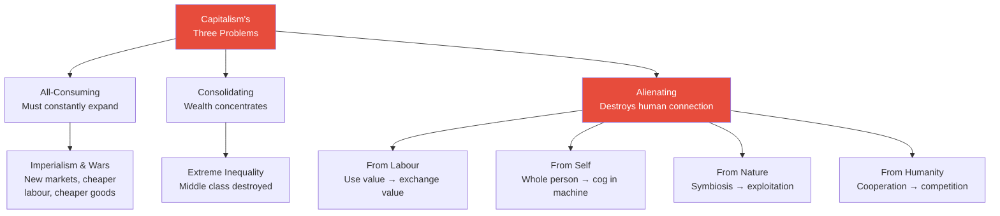
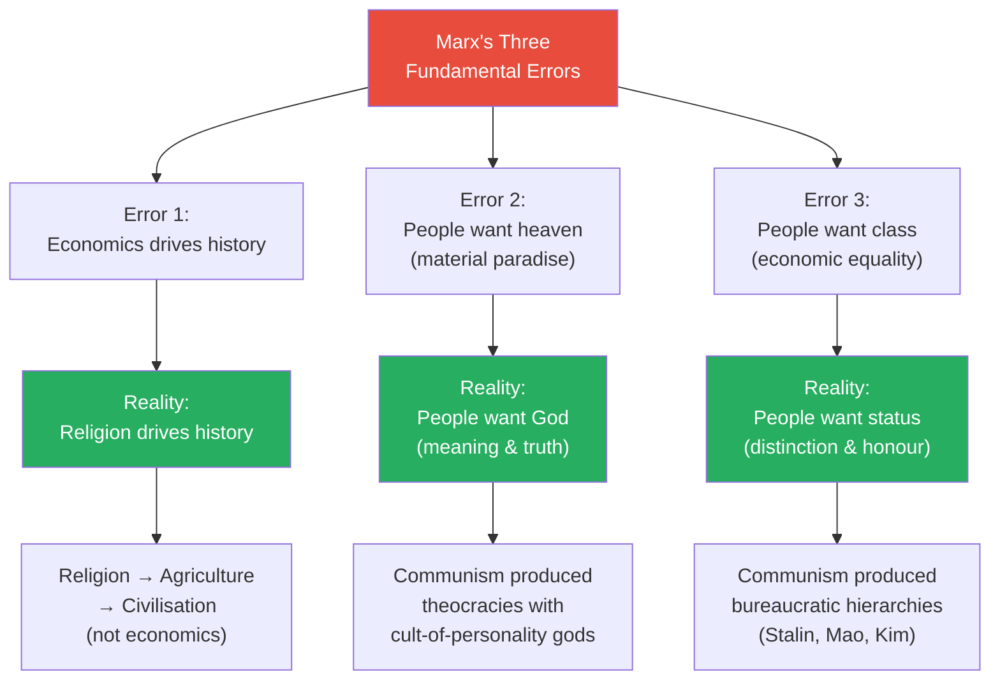
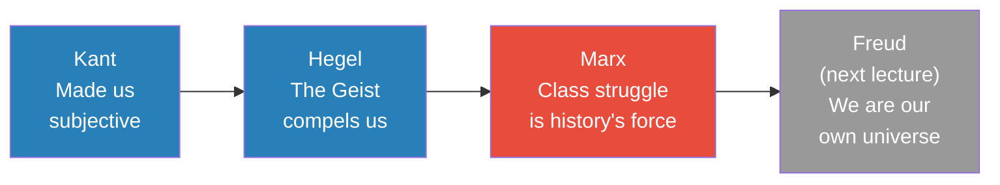
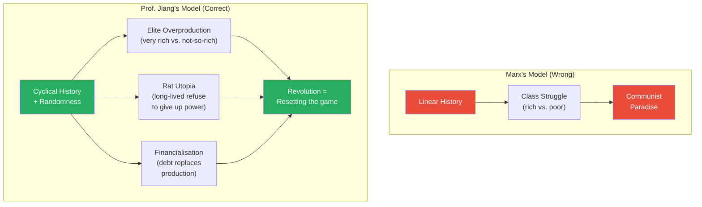
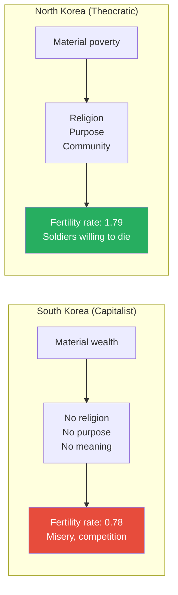

# What Marx Got Wrong

> Prof. Jiang delivers a comprehensive evaluation of Karl Marx — one of history's most influential thinkers. He begins by reconstructing Marx's intellectual lineage through Kant and Hegel, then presents Marx's theory of dialectical materialism and his diagnosis of capitalism's four alienations. The diagnosis, Prof. Jiang argues, is brilliant and still accurate today. But Marx's theory of history is fatally flawed: he got the causal order backwards. Religion, not economics, drives human history. People seek status, not class. People want God, not heaven. Because Marx misunderstood these fundamentals, his prophecy of communist paradise produced theocratic dictatorships with cult-of-personality leaders — exactly what he failed to predict. The lecture closes with Mikhail Bakunin's prophetic warning that a technocratic vanguard would brutalise mankind, a warning Prof. Jiang connects directly to modern China's education crisis and the rise of AI.

---

## Overview: Key Highlights

- <b style="color: #27ae60">Marx's diagnosis of capitalism is brilliant — his theory of history is wrong</b> — the four alienations remain perfectly accurate; the prophecy of inevitable communism does not
- <b style="color: #e74c3c">Religion drives human history, not economics</b> — Marx inverted the causal chain; religion preceded agriculture, and Protestantism (not technology) birthed capitalism
- <b style="color: #2980b9">Dialectical materialism</b> — Marx's inversion of Hegel: material reality creates ideas, and history is a linear class struggle toward communism
- <b style="color: #27ae60">People want status, not class; God, not heaven</b> — the three psychological errors that made Marx's predictions impossible
- <b style="color: #e74c3c">Communism and capitalism are the same religion</b> — both treat economics as the underlying reality and reinforce each other as they spread
- <b style="color: #2980b9">Four alienations of capitalism</b> — alienation from labour, from self, from nature, and from humanity
- <b style="color: #e74c3c">The Vanguard problem</b> — Bakunin predicted that a technocratic elite would never surrender power, and history proved him right
- <b style="color: #2980b9">Use value vs. exchange value</b> — the distinction between creating for human connection and creating for wages
- <b style="color: #27ae60">Communist revolutions were peasant rebellions with a veneer of communism</b> — they happened in Russia and China, not Germany, because they were about resetting the game, not class consciousness
- <b style="color: #2980b9">Financialisation</b> — Piketty and Quigley's argument that capitalism's financial economy outgrows its manufacturing economy, making collapse inevitable
- <b style="color: #e74c3c">China's education system as capitalism-communism hybrid</b> — producing the worst of both: depression, suicide, and the brutalisation Bakunin warned against
- <b style="color: #27ae60">North Korea vs. South Korea as the test case</b> — the theocratic society has higher fertility and arguably more purpose than the capitalist one

| Concept | One-line summary |
|---------|-----------------|
| **Dialectical materialism** | Marx's inversion of Hegel — material reality (economics) creates ideas, not the other way around |
| **Class struggle** | The Marxist claim that all history is conflict between the rich and the poor |
| **Four alienations** | Capitalism alienates humans from their labour, themselves, nature, and each other |
| **Use value vs. exchange value** | Creating something for human connection vs. creating something for money |
| **Teleological history** | Marx's belief that history has a purpose and inevitably progresses toward communism |
| **The Vanguard** | Marx's idea that an intellectual elite must lead the proletariat into paradise |
| **Financialisation** | The process by which the financial economy grows faster than the real economy |
| **Cult of personality** | When a political leader becomes the living god of a theocratic state — Stalin, Mao, Kim |
| **Predestination** | Protestant doctrine that God has already decided who is saved — the anxiety engine of capitalism |
| **Surplus value** | Value produced by workers beyond what they are paid — extracted by capitalists |
| **Overproduction** | Marx's prediction that capitalism produces goods no one can afford to buy |
| **Elite overproduction** | History is conflict between the very rich and the not-so-rich, not between rich and poor |

---

# The Lecture

## The Thought Experiment — Lawyer vs. Shipwreck [0:00–2:00]

*Prof. Jiang opens with a deceptively simple thought experiment that sets up Marx's entire thesis: would you be happier as a wealthy lawyer or as a castaway struggling to survive with strangers on a deserted island?*

> [!tip] Core Insight
> The obvious answer is the lawyer. But Marx's underlying thesis is that many people would actually be happier on the island — because humans need purpose, community, and a larger mission more than they need comfort.

> [!note]- Expand: Full Lecture Detail
> Prof. Jiang presents two scenarios to the class:
>
> - **Scenario 1:** You get into a great college, become a lawyer, make a lot of money — big house, holidays in Bali, a BMW
> - **Scenario 2:** You crash on an island with 100 strangers — scarce resources, daily struggle, no certainty of survival
>
> He asks which would make them happier. The students assume the answer is obvious — the lawyer. But Prof. Jiang challenges this:
>
> - For many people, the answer is actually Scenario 2
> - As humans, we want to feel we have a <b style="color: #27ae60">purpose in life</b> and are part of a larger mission to change the world for the better
> - This is the underlying thesis of Karl Marx
> - Material comfort does not equal human fulfilment — a point that will structure the entire lecture

---

## From Kant to Hegel to Marx — The Intellectual Lineage [2:00–9:56]

*Prof. Jiang traces Marx's intellectual genealogy through Kant and Hegel, showing how Marx built his theory by systematically inverting his predecessors — and how those inversions introduced the errors that would doom his project.*

*Marx's theory is built on a double inversion — first Hegel inverts Kant, then the Young Hegelians invert Hegel. Each layer adds power but also introduces distortion.*

> [!note]- Expand: Full Lecture Detail
> Prof. Jiang begins by reviewing the intellectual chain that produced Marx:
>
> **Immanuel Kant's theory:**
> - We are all endowed with the capacity to reason — it is born in us, not learned
> - This reason interacts with reality ("things in themselves") to produce what we see — appearances
> - <b style="color: #2980b9">The crucial argument:</b> we do not see reality objectively — we create our own universe with our minds, bringing space and time to reality
> - This has been confirmed by neuroscience, AI, and quantum mechanics — it remains the dominant understanding of human psychology
>
> **Kant's three unsolved problems:**
> - If we cannot know reality, how do we know what is real and what is fake? We do not know — perhaps we live in a computer simulation
> - What is the source of our reason? Where does the capacity to imagine space and time come from? Kant does not answer
> - The uniformity problem: how do we know that everyone sees the world the same way? Kant says we do not know
>
> **Hegel's solution — the Geist:**
> - The <b style="color: #2980b9">Geist</b> is the spirit of the world — a god becoming into reality, a collective consciousness that is growing
> - The Geist gives us the capacity to reason and to see itself — solving all three problems at once
> - For Hegel, ideas come first, then material reality follows — he is an <b style="color: #2980b9">idealist</b>
>
> **Hegel's three big ideas:**
> - The <b style="color: #2980b9">Geist</b> — the underlying superstructure of reality
> - The <b style="color: #2980b9">dialectic</b> — thesis, antithesis, synthesis — how the Geist learns and thinks, and the underlying logic of history
> - The <b style="color: #2980b9">master-slave dialectic</b> — the master becomes dependent on the slave, inverting the power relationship over time
>
> **The Young Hegelians' fatal misreading:**
> - Marx was part of the Young Hegelians at university — a group that worshipped Hegel but misinterpreted him
> - They thought Hegel was an atheist because he said "God is dead" — but Hegel meant he was reinterpreting God as part of us, in the form of the Geist
> - <b style="color: #e74c3c">Inversion 1:</b> They turned the Geist into a material thing — economics. Where Hegel said ideas create material reality, they said material reality creates ideas
> - <b style="color: #e74c3c">Inversion 2:</b> If material reality is primary, then the dialectic and master-slave relationship mean history is a history of oppression and struggle for liberation
> - This produces <b style="color: #2980b9">dialectical materialism</b> — class struggle — Marx's central contribution

---

## Marx's Teleological History — From Hunter-Gatherers to Communist Paradise [9:56–14:50]

*Prof. Jiang walks through Marx's complete theory of history — a linear progression driven by technological advancement from hunter-gatherers through agriculture, feudalism, and industrial capitalism to the inevitable triumph of communism.*

*Marx's linear teleology — history marches inevitably from primitive communism to industrial capitalism to communist paradise. Prof. Jiang will systematically demolish this chain.*

> [!note]- Expand: Full Lecture Detail
> Prof. Jiang explains Marx's complete historical narrative:
>
> - Humans start as hunter-gatherers — small tribes, happy but lacking food
> - Agriculture creates <b style="color: #2980b9">surplus value</b> — excess wealth that allows specialisation
> - Surplus gives rise to civilisation, and religion is created to justify the hierarchy (a few elites as "parasites")
> - Growing societies go to war for resources → the master-slave relationship → feudalism → industrial capitalism
> - For Marx, this is all <b style="color: #2980b9">linear progress driven by technological advancement</b> — agriculture, tools, weapons, castles, steamships
> - Marx finds himself at the industrial capitalism stage in 1848
>
> **Why capitalism must inevitably produce communism:**
> - Marx uses the Hegelian dialectic: feudalism (thesis) + industrial capitalism (antithesis) = communism (synthesis)
> - <b style="color: #2980b9">Embedded in capitalism are the seeds of its own demise</b> — three reasons:
>   - **Imperial expansion** creates a global proletariat — 99% oppressed, who will achieve class consciousness and rebel
>   - **Technology** creates surplus value and surplus labour — making human work easier and less necessary (e.g. AI)
>   - **Crisis** — capitalism is fundamentally unsustainable
>
> **Three theories of capitalist crisis:**
> - <b style="color: #e74c3c">Marx's overproduction:</b> goods are produced but workers are too impoverished to buy them — markets collapse
> - <b style="color: #2980b9">Piketty's financialisation:</b> financial economy grows at 5% while manufacturing grows at 2% — so nobody wants to work, everyone wants to invest; capitalism stagnates
> - <b style="color: #2980b9">Quigley's three phases:</b> consumer capitalism → financial capitalism → monopoly capitalism (a few companies control everything, products get worse, demand dies)
>
> For Marx, Piketty, and Quigley, capitalism can only lead to crisis. The proletariat will organise, rebel, and create a workers' paradise. That is the logic of Marx.

---

## Why Marxism Was So Popular — The Four Alienations of Capitalism [14:50–24:30]

*Prof. Jiang presents what he considers the most brilliant part of Marx's work — his diagnosis of how capitalism makes people miserable through three systemic problems and four types of alienation. This analysis, Prof. Jiang argues, remains perfectly accurate today.*

*Marx's three structural problems of capitalism — expansion, consolidation, and alienation — converge to create a system that grows by destroying everything that makes humans human.*

> [!note]- Expand: Full Lecture Detail
> **Three systemic problems of capitalism:**
>
> **1. All-consuming:**
> - Capitalism must constantly grow to create value — this drives imperialism
> - Factory owners want new markets, cheaper goods, cheaper labour
> - They force their governments to invade other countries — China, India, Africa
> - <b style="color: #e74c3c">Capitalism creates wars and human misery around the world</b>
>
> **2. Consolidating:**
> - Capitalism can only lead to extreme inequality
> - Ten people with a million dollars each are better off pooling their money and investing together
> - Over time, this destroys the middle class — unless you are super wealthy, you will have nothing
> - Small property owners are bought out by large corporations — this is happening today with housing
> - <b style="color: #27ae60">This is why Marx is seeing a massive resurgence in our world today</b>
>
> **3. Alienating — four types:**
>
> > [!example] The Apple Pie — Use Value vs. Exchange Value
> > - You cook an apple pie and give it to someone directly
> > - They eat it, love it, thank you — you feel affirmed as a creative human being
> > - That is <b style="color: #2980b9">use value</b> — creating something that connects you to another person
> > - Now imagine you cook the same pie and give it to someone who sells it to a stranger
> > - You never meet the person who eats it — you receive $5
> > - That is <b style="color: #2980b9">exchange value</b> — the human connection is severed by money
> > **The lesson:** When exchange value replaces use value, creative work stops affirming our individuality and becomes meaningless wage labour.
>
> - **Alienation from labour:** We want to create things that express our individuality and serve our community — capitalism replaces this with wage labour where we never see the impact of our work
> - **Alienation from self:** Humans are complex, multifaceted, always evolving — capitalism demands division of labour, reducing us to "a hand or a finger or an eye" — just a cog in the machine
> - **Alienation from nature:** Capitalism grows by exploiting nature — cutting down trees, destroying the environment, polluting water — where historically we had a symbiotic relationship with nature
> - **Alienation from humanity:** For most of history we cooperated — capitalism forces us to compete against each other
>
> > [!example] The Injured Worker
> > - Five people are carrying goods to a store
> > - One falls down, breaks his leg, and cries out for help
> > - The natural human response is to help
> > - But the logic of capitalism says you cannot — the manager will fine you for being late
> > **The lesson:** Capitalism's incentive structure overrides our natural impulse toward solidarity and mutual aid.
>
> Prof. Jiang emphasises: this part of Marx — the diagnosis of capitalism's problems — is considered brilliant. It was true in the 1850s and it remains true today.

---

## Where Marx Got the History Wrong [24:30–34:31]

*Prof. Jiang pivots from Marx's accurate diagnosis to his flawed prescriptions. The prophecy of inevitable communism has not materialised — communism caused its own miseries. Prof. Jiang identifies three fundamental errors in Marx's understanding of human psychology.*

*Marx's three errors are all variations of the same mistake: treating humans as economic animals when they are fundamentally religious, meaning-seeking creatures.*

> [!note]- Expand: Full Lecture Detail
> Prof. Jiang now shows why Marx's beautiful theory is also wrong:
>
> **Error 1 — Religion, not economics, drives history:**
> - The hunter-gatherer to agriculture transition (covered in [[01 - Explaining Humanity's Transition to Agriculture|Lecture 1]]) proves this
> - Hunter-gatherers ate better, worked less, and were taller than farmers — the economic argument makes no sense
> - <b style="color: #27ae60">It was religion that drove settlement</b> — a cult, a sacred place considered divine
> - Marx's formulation that religion comes last is exactly backwards: religion → agriculture → civilisation
>
> **Error 2 — Protestantism, not technology, birthed capitalism:**
> - The transition from feudalism to capitalism was driven by religion, not technology
> - Technology existed everywhere — but only Europe produced industrial capitalism
> - The Catholic Church operated through <b style="color: #2980b9">justification by works</b> — do good things, give money to the church
> - Protestants replaced this with <b style="color: #2980b9">justification by faith</b> — what matters is whether you truly believe
> - To reduce the Church's power further, Protestants introduced <b style="color: #2980b9">predestination</b> — God has already decided who goes to heaven
> - This creates anxiety: How do I know I am one of the elect?
> - Anxiety leads to OCD-like behaviour: make money, do not spend it — the wealth becomes proof of God's favour
> - <b style="color: #27ae60">That is the birth of capitalism</b> — not technology, but Protestant anxiety (as covered in [[42 - The Protestant Reformation and the Birth of Capitalism|Lecture 42]])
>
> **Error 3 — People want status, not class:**
> - For most of history, there was no concept of money as we know it
>
> > [!example] The Vikings and the Feast
> > - Vikings raided and stole enormous quantities of gold
> > - When they returned to the village, they held a great feast and gave it all away
> > - There was no point in hoarding money — you could not spend it, and you could not keep it after death
> > - The gold was a means to raise your status within the community — the feast demonstrated generosity and power
> > **The lesson:** Wealth has historically been a tool for status signalling, not an end in itself. The concept of "class" is a product of industrial capitalism and the free market.
>
> **Why Marx could not predict communism's actual outcome:**
> - Because he misunderstood these three factors, he could not anticipate that communist states would become theocratic bureaucracies with cult-of-personality leaders
> - Stalin, Mao, and Kim all understood that people want religion — so they made themselves God
> - People want status — so they built bureaucratic hierarchies
> - Communism became what it became because of human psychology, not because of any betrayal of Marxist principles

---

## Q&A — Why Did People Believe Marx Despite the Obvious? [34:31–37:10]

*A student asks why communism gained followers when the importance of religion should have been obvious. Prof. Jiang's answer reveals what he considers one of the lecture's deepest insights: capitalism and communism are the same religion.*

> [!tip] Core Insight
> Capitalism and communism were mortal enemies in the 20th century, but their underlying religion is identical: both treat economics as the ultimate reality. As each spreads, it reinforces the other — which is why the world has been "brainwashed into thinking that only economics matters."

> [!note]- Expand: Full Lecture Detail
> A student asks: if the importance of religion is so obvious, why did people believe Marx's economic theory?
>
> Prof. Jiang's answer:
> - <b style="color: #e74c3c">Capitalism and communism are the same religion</b> — both believe materialism and economics are the underlying reality
> - As capitalism spreads, it reinforces communism; as communism spreads, it reinforces capitalism
> - Capitalism spreads by turning everyone into an economic animal — "we don't ask you to believe in God, we ask you to go buy things"
> - Communism believes that equality and the abolition of property will make everyone happy — still an economic argument
> - These two ideas, mortal enemies in the 20th century, share the same foundation
> - Together they have conquered the world and brainwashed us into thinking only economics matters
> - The newspaper only reports GDP, unemployment, inflation, egg prices — never spiritual health, never psychology, never religious fulfilment
>
> A second student asks why communism took root in China and Russia rather than Germany:
> - Marx himself believed revolution would happen in Germany first — the most advanced proletariat
> - He would have been appalled that it happened in Russia and China — peasant nations with no proletariat
> - <b style="color: #27ae60">The communist revolutions were not communist revolutions — they were peasant revolutions with a veneer of communism</b>
> - No different from previous peasant rebellions in Chinese history — same structure, different ideology

---

## Marx as Prophet — Building on Christianity [37:10–47:00]

*Prof. Jiang situates Marx within the broader intellectual history of the series — Kant, Hegel, Marx, and (next lecture) Freud — each creating an intellectual revolution that changed how we see ourselves. He then reveals Marx as an unwitting prophet extending Christianity's logic.*

*Four intellectual revolutions that changed how humanity understands itself — each building on the last. Marx's contribution will be tested by Freud's in the next lecture.*

> [!note]- Expand: Full Lecture Detail
> **Marx's background:**
> - From a long line of Jewish rabbis — the equivalent of saying he came from ten generations of Harvard professors
> - A genius from a family of geniuses — "the Jews are very intellectual people, they are the people of the book"
> - He was essentially an aristocrat — a poet-prophet preaching a new world with certainty, clarity, and optimism
> - His appeal was also his downfall: he was too simple in his understanding of human history
>
> **The context — industrial misery:**
> - Industrial capitalism was destroying European society — people dragged from villages to city slums
> - No adequate housing, health care, or work safety — children forced to work from age five or six
> - Pollution, disease, filth — absolute misery, especially for children
>
> > [!example] The Great Potato Famine (1840s)
> > - In the 16th century, the Spanish brought the potato from the New World to Europe
> > - The potato allowed Europe's population to grow rapidly to feed its economic needs
> > - But relying on a single crop made Europe vulnerable to disease
> > - In the 1840s, a massive potato blight caused famine across Europe — tens of millions died
> > - Ireland was worst hit: every region outside Dublin saw population declines of 30% or more between 1841 and 1851
> > - Mass emigration to America and South America followed
> > - This trauma inspired Marx and Engels to write the Communist Manifesto in 1848
> > **The lesson:** The potato famine demonstrated capitalism's fragility — monoculture for profit creates catastrophic vulnerability.
>
> **Marx as unwitting Christian prophet:**
> - Marx is really extending Christianity's logic, even though he does not realise it:
>
> | | Christianity | Marxism |
> |--|-------------|---------|
> | **Agency** | Passive — avoid sin, go to heaven | Active — participate in the revolution |
> | **Salvation** | Only a few go to heaven | Workers' paradise for everyone |
> | **Destination** | Heaven with God | Utopia without God |
>
> - <b style="color: #e74c3c">The fatal problem:</b> no one wants a utopia without God — people go to heaven to be with God, not for the five-star hotel
> - This is why Marx could not anticipate the rise of Stalin and Mao — they filled the God-shaped hole he refused to acknowledge
>
> **The Communist Manifesto (1848):**
> - "A spectre is haunting Europe — the spectre of communism" — the spectre is the Geist, the force of history
> - Published in anticipation of the 1848 revolutions across Europe, which demanded nationalism, liberalism, and socialism
> - Prof. Jiang calls it "beautifully written — they don't get enough credit for how wonderful this is written"
> - The authorities cracked down, but Marx and Engels remained convinced paradise was imminent
>
> **Marx's letter on human creativity:**
> - Prof. Jiang reads what he considers Marx's best piece of writing — a letter on producing "in a human manner"
> - When you create something and share it, the other person's enjoyment affirms your individuality and your connection to all humanity
> - But private property destroys this: "my individuality is so far externalised that I hate my activity — it is a torment to me"
>
> > [!example] The $1,000 Meal
> > - You spend days preparing a meal as a labour of love — the finest food you can create
> > - You give it to someone who is blown away — they are in love with the food
> > - Then they hand you $1,000
> > - The moment money enters the equation, it destroys the human connection
> > - A simple "thank you" would have affirmed your humanity — the money turns you into a service provider
> > **The lesson:** Extrinsic motivation (wages) destroys intrinsic motivation (creative fulfilment). Capitalism makes us slaves by depriving us of our humanity.
>
> **What capitalism actually learned from Marx:**
> - Capitalism adopted many of Marx's policy proposals: universal child education, the right to work, abolition of child factory labour
> - In many ways, communism has won — but through reform, not revolution
> - After World War Two, most countries became socialist in practice, even if capitalist in name
> - Marx did not predict this, because he believed capitalists were idiots — "servants to capital" with no empathy

---

## The Four Things Marx Got Wrong — Summary [47:00–56:39]

*Prof. Jiang consolidates his critique into four fundamental errors, then explains what actually causes societal destabilisation — not class struggle, but elite overproduction, rat utopia, and financialisation.*

*Marx saw a single cause (class struggle) leading to a single destination (communism). Prof. Jiang sees three interacting forces (elite overproduction, rat utopia, financialisation) creating periodic resets with no predetermined endpoint.*

> [!note]- Expand: Full Lecture Detail
> **The four errors:**
>
> 1. <b style="color: #e74c3c">History is not linear progress</b> — history repeats itself; there is no inevitable march forward
> 2. <b style="color: #e74c3c">History contains randomness</b> — unexpected events derail any deterministic theory
> 3. <b style="color: #e74c3c">People care more about religion than economics</b> — this explains Trump's America, where Democrats cannot understand why voters support a leader who does not lower egg prices. Trump gives people what they really want: emotional solidarity and belief in a better world
> 4. <b style="color: #e74c3c">The Vanguard will never surrender power</b> — an elite of intellectuals and technocrats tasked with creating paradise will keep power for themselves. This is why communism fails in the Soviet Union and China
>
> **What actually causes destabilisation — three forces from previous lectures:**
>
> - <b style="color: #2980b9">Elite overproduction</b> (from [[06 - Elite Overproduction and the Bronze Age Collapse|Lecture 6]]): history is not a fight between the poor and the rich — it is a fight between the very rich and the not-so-rich. Marx himself was Jewish aristocracy; Engels's father was a wealthy capitalist. Too many people seeking too much wealth and status creates conflict
> - <b style="color: #2980b9">Rat utopia</b> (from [[08 - Rat Utopia and the Peloponnesian War|Lecture 8]]): people live too long, refuse to give up power, refuse to innovate, refuse to cede status to the young
> - <b style="color: #2980b9">Financialisation</b>: as Piketty and Quigley show, capitalists eventually force everyone into more debt rather than creating real value
>
> **Three examples of revolution as "resetting the game":**
>
> > [!example] Soviet Union, China, and Napoleonic France
> > - How did the Soviet Union defeat Germany — the most advanced military in the world?
> > - How did China's economy boom after the Cultural Revolution?
> > - How did Napoleonic France defeat all of Europe?
> > - These were not communist revolutions — they were resets that destroyed the old elite
> > - People play a game in society; over time, a few winners monopolise the game; revolution resets it
> > - The reset creates enormous energy — people work hard to win the new game
> > - The Cultural Revolution removed old bureaucrats, so in the 1980s young entrepreneurs could build without obstruction
> > **The lesson:** Revolutions succeed not because of ideology but because they release pent-up energy by clearing the existing hierarchy.
>
> **What actually gave rise to industrial capitalism — four factors, not one:**
>
> | Factor | What it contributed |
> |--------|-------------------|
> | **Monotheistic revolution** ([[26 - Constantine's Monotheistic Revolution\|Lecture 26]]) | The Holy Trinity forced abstract thinking → money, nation state, science |
> | **Gunpowder revolution** ([[45 - The Gunpowder Revolution\|Lecture 45]]) | Nation states forced to compete → industry, population growth, centralisation |
> | **Protestant Reformation** ([[42 - The Protestant Reformation and the Birth of Capitalism\|Lecture 42]]) | Anxiety about predestination → compulsive wealth accumulation |
> | **Age of Exploration** ([[44 - The Spanish Conquest of the New World\|Lecture 44]]) | New markets, gold, and the potato/corn/tomato → European population growth |
>
> History is a complicated process with randomness built in — Marx's single-cause model could never capture this.

---

## The Proof — Status, Religion, and God [56:39–1:06:38]

*Prof. Jiang presents evidence for his three corrections to Marx: people want status not class, religion not economics, and God not heaven. North Korea vs. South Korea serves as his most provocative test case.*

*South Korea has the wealth; North Korea has the fertility rate, the purpose, and soldiers willing to die for their beliefs. Prof. Jiang argues North Korea may have the better long-term future.*

> [!note]- Expand: Full Lecture Detail
> **Status, not class:**
> - For most of human history, and still today, people seek status — feeling distinguished, superior, achieving something great
> - Money is just a symbol of status — not an end in itself
>
> **Religion, not economics:**
> - Both the Soviet Union and China became theocracies with cults of personality — not communist societies
> - They were no different from Catholic Europe during the Middle Ages
> - The Soviet Union fell apart when the elite stopped believing in the system and chose to monetise their status and power
>
> **God, not heaven — the Korea test case:**
> - North Korea (theocratic, poor): fertility rate of 1.79
> - South Korea (capitalist, wealthy): fertility rate of 0.78
> - South Koreans have money but no religion, no purpose, no meaning — all competition
> - North Koreans worship Kim Il-sung as the "Forever President" — he is dead but remains president because he is divine
> - North Korean soldiers are fighting in Ukraine — willing to die for what they believe in
> - Prof. Jiang's provocation: "If I had to bet which nation had the best future, I would bet North Korea over South Korea"
>
> **The Vanguard — Bakunin's prophecy:**
> - <b style="color: #2980b9">Mikhail Bakunin</b> — an anarchist, not a communist, but he shared Marx's goals
> - Both believed in liberation, but Marx said you need a Vanguard (intellectual elite) to lead the revolution
> - Bakunin said a Vanguard would destroy everything — it must be spontaneous, from the people
> - Bakunin was also lower nobility — his father was a Russian aristocrat
> - Bakunin on freedom: "The freedom of every other individual does not limit my own — on the contrary, it is confirmation"
>
> > [!quote] Mikhail Bakunin
> > "If science alone were in charge of all social administration, life would wither — human society would turn into a voiceless and servile herd."
>
> - Bakunin's warning: before we were intellectuals curious about the world; now we are technocrats taught a specific skill and trained to see the world in a specific way
> - We are run by technocrats — this has led to the brutalisation of mankind
> - <b style="color: #e74c3c">The domination of life by science can have no other result than the brutalisation of mankind</b>

---

## Capitalism + Communism = Modern China's Crisis [1:06:38–1:13:35]

*Prof. Jiang brings the lecture's theoretical arguments home by connecting them to modern China's education crisis — a system that combines the worst features of both capitalism and communism to produce what he calls an unconscionable evil against children.*

> [!tip] Core Insight
> China has combined communism and capitalism to create the worst possible society. The belief that education leads to money has become an evil religion — forcing children into depression and suicide while producing no genuine human flourishing.

> [!note]- Expand: Full Lecture Detail
> **AI as Bakunin's nightmare realised:**
> - The people in charge now want to make AI the dominant religion of the world — to make humans slaves to AI
> - This is exactly what Bakunin warned: a bureaucratic elite will use technology to reinforce their power
> - China exemplifies this: bureaucrats with no imagination and no empathy, checking boxes — "Do you have food? Do you have a job? Why are you complaining?"
>
> **Why China is so similar to America:**
> - A student asks: America is capitalist, China is communist — but Chinese people all want to go to America
> - Answer: communism and capitalism reinforce each other because they share the same ideology
> - Both are branches of Christianity — belief in progress, belief in class struggle, belief that a technocratic elite should run the world
> - <b style="color: #e74c3c">Communism in China paved the way for American capitalism</b>
>
> **The education crisis:**
> - What China is doing to children is unconscionable — 10 hours a day in school, no childhood, no freedom, no happiness
> - Most children develop depression by age 14
> - A nine-year-old in Beijing recently killed himself — jumped off a building
> - Even if a child succeeds and gets into Beida or Tsinghua, they will develop depression because they will never achieve what they want in life
> - Education has become an evil religion: the belief that education leads to money, and that you will somehow be the exception to the depression and suicide surrounding you
>
> **Q&A — Is North Korea really powerful if it is poor?**
> - A student challenges: if North Korea has such unity, why are they still poor?
> - Prof. Jiang: "That's part of the capitalist brainwashing — measuring success by wealth"
> - Wealth is just the willingness to exploit resources and engage in global trade
> - North Korea is heavily sanctioned — not allowed to trade
> - Their religion is <b style="color: #2980b9">juche</b> (self-reliance) — they purposely choose independence over engagement
> - Prof. Jiang argues that during the Cultural Revolution, despite poverty, ordinary Chinese were happier — life was simple, clear, certain
> - Evidence: young people today refuse to have children; during the Cultural Revolution they did — because they had guaranteed jobs, health care, community, and solidarity
> - <b style="color: #e74c3c">The trick of capitalism is to make everyone think money is everything</b>

---

## Was Marx Too Idealistic? — Final Q&A [1:13:35–end]

*A student asks whether Marx was simply too idealistic. Prof. Jiang's answer reframes the entire lecture: Marx would be disgusted by the world his ideas helped create. The lecture closes by previewing Freud's contribution — the psychological revolution that shifted our focus from the collective to the self.*

> [!note]- Expand: Full Lecture Detail
> - Marx did not think he was idealistic — he saw himself as a scientist unveiling the truth
> - For him, communism was certain — it had to happen because of the logic of history
> - But if Marx could see today's world, he would be utterly disgusted — not proud of his fame
> - "What have we done to humanity? This is far worse than the Industrial Revolution"
> - Everyone is now a slave as a consumer — all that matters is school, money, buying things
> - This would have been unimaginable to Marx or anyone 100 years ago — humanity has chosen to enslave itself for no good reason
>
> **Preview of next lecture — Freud:**
> - Before Freud, we focused on collective consciousness — the world, the community
> - With Freud and psychology, we shift focus to ourselves — our own internal struggle as the path to happiness
> - Others cease to matter — only our own happiness counts
> - <b style="color: #27ae60">But Bakunin and Marx taught us: if everyone is unhappy, you must be unhappy as well. Only if people are free and happy together can they be free and happy by themselves</b>
> - This is what we have forgotten — and it explains the world we live in today

---

## Connections

**Builds on:** [[55 - Kant, Hegel, and the Theory of Everything]] (Kant's subjectivity, Hegel's Geist and dialectic — the direct intellectual predecessors Marx inverts), [[42 - The Protestant Reformation and the Birth of Capitalism]] (Protestantism, not technology, as the engine of capitalism — directly reprised here), [[01 - Explaining Humanity's Transition to Agriculture]] (religion, not economics, drove settlement — the first domino of Marx's error)

**Sets up:** Lecture 57 on Freud — psychology as the next intellectual revolution; collective consciousness gives way to individual psychology

**Recurring series themes:** [[06 - Elite Overproduction and the Bronze Age Collapse]] (elite overproduction as destabilising force), [[08 - Rat Utopia and the Peloponnesian War]] (rat utopia and societal decay), [[26 - Constantine's Monotheistic Revolution]] (monotheism enabling abstract thought, money, and the nation state), [[45 - The Gunpowder Revolution]] (military competition driving industrialisation)

**Related books in vault:** [[Sapiens - Yuval Noah Harari]] (agricultural revolution, wheat domestication argument reprised), [[Antifragile - Nassim Nicholas Taleb]] (randomness vs. linear prediction)

---

## The Takeaway

This lecture is a masterclass in distinguishing diagnosis from prescription. Marx's analysis of how capitalism alienates humans — from their labour, from themselves, from nature, and from each other — remains one of the most accurate descriptions of modern life ever written. Prof. Jiang does not dispute this. What he disputes is Marx's theory of history: the claim that economics is the fundamental driver and that communism is the inevitable destination. By tracing the actual causal chains — religion preceding agriculture, Protestantism preceding capitalism, status preceding class — Prof. Jiang shows that Marx's errors are not incidental but structural. He built his entire system on a misunderstanding of human psychology.

The most counterintuitive insight is Prof. Jiang's argument that capitalism and communism are the same religion. Both reduce human beings to economic animals; both dismiss religion, spirituality, and psychology as secondary; both promise that material conditions — whether wealth or equality — will produce human happiness. Together, they have conquered the world and trained us to measure everything in GDP, employment, and inflation — never in purpose, meaning, or spiritual health. The North Korea vs. South Korea comparison is deliberately provocative, but it crystallises the point: the society with money has a fertility rate of 0.78; the society with religion has 1.79.

The unresolved question is what comes next. If Marx's solution (communism) produces theocratic dictatorships, and capitalism produces alienated consumers, what alternative exists? Prof. Jiang hints that Freud's contribution — the turn inward, toward individual psychology — is part of the answer, but also part of the problem. The preview suggests the next lecture will explore how the shift from collective consciousness to individual consciousness completed the trap: we now believe that only our own happiness matters, when in fact happiness is only possible collectively. Bakunin's warning — that a technocratic elite will brutalise mankind through the domination of science — may be the lecture's most prescient moment, as AI accelerates exactly the process he described.
