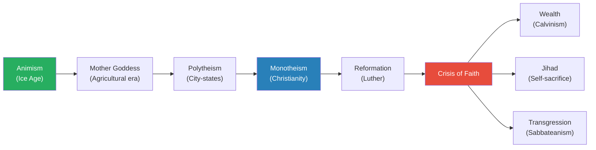
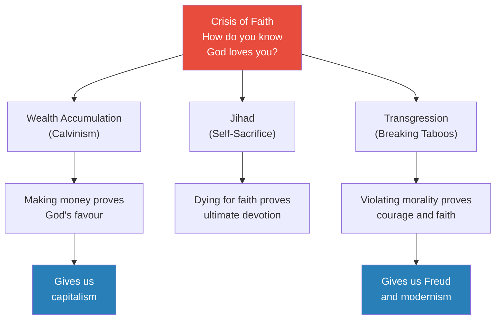
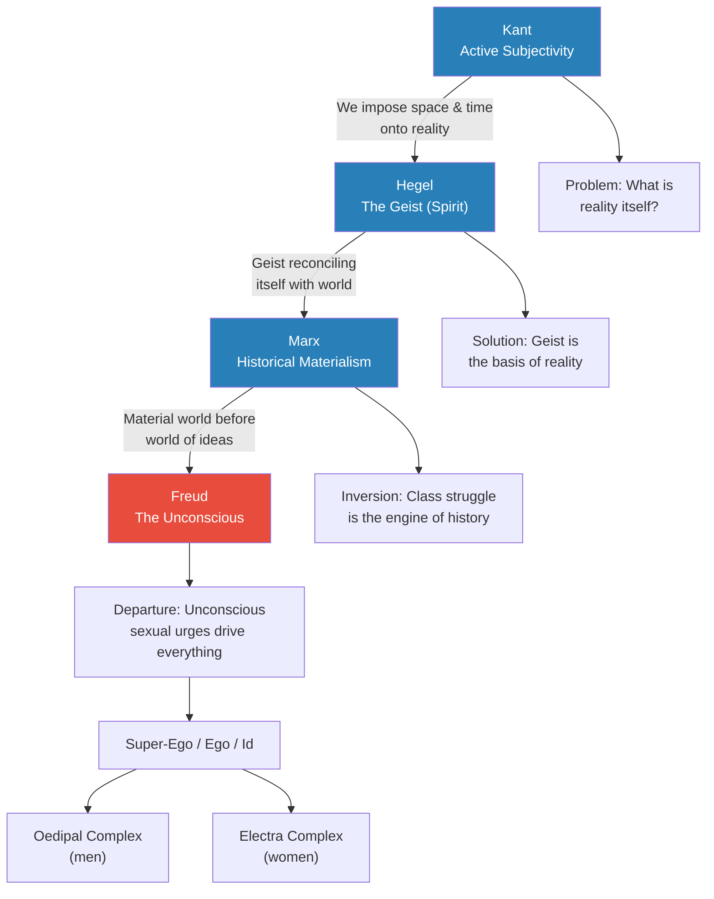
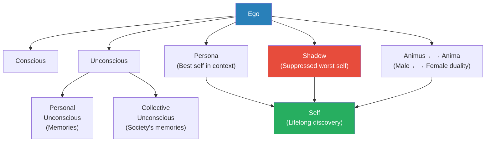
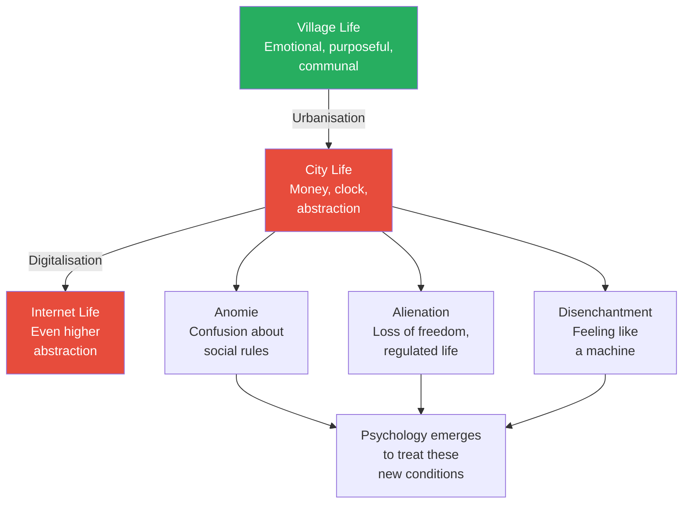
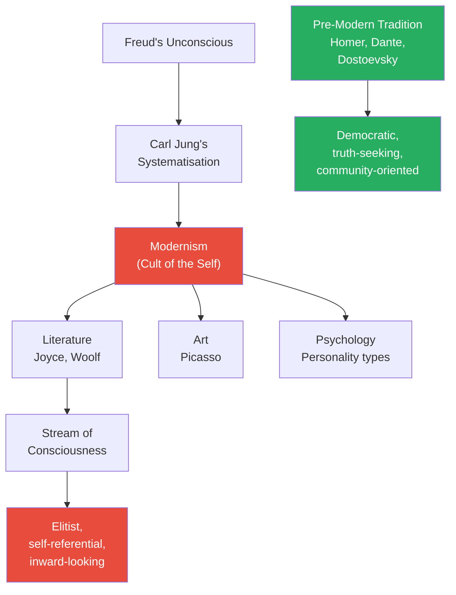
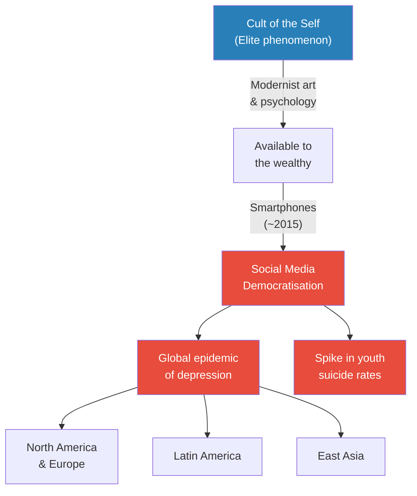

# How Modernism Ruined Everything

> Prof. Jiang traces the origins of modernism back through Freud, Carl Jung, and the Western religious-intellectual tradition to argue that the "cult of the self" — the defining cultural movement of the modern age — was never designed to liberate us. It was designed to control us. Beginning with the crisis of faith that Protestantism created, he shows how Freud's psychoanalytic theory shifted from genuinely advocating for abused women to protecting the powerful men who paid his bills. Carl Jung then systematised these ideas, modernist artists like James Joyce and Virginia Woolf made them prestigious, and the CIA spread them globally as a weapon against communism. The result: a world of atomised individuals incapable of collective action, now democratised through social media into a global epidemic of depression and suicide.

---

## Overview: Key Highlights

- <b style="color: #e74c3c">Freud betrayed his patients to protect powerful men</b> — he abandoned the seduction theory (real abuse) and replaced it with the fantasy theory (women imagining abuse) to keep his wealthy clientele
- <b style="color: #2980b9">Crisis of faith</b> — the central problem created by Protestantism: without the Church as mediator, how do you truly know you love God and God loves you?
- <b style="color: #27ae60">Three solutions to the crisis of faith</b> — wealth accumulation (Calvinism/capitalism), jihad (self-sacrifice), and transgression (breaking taboos to prove devotion)
- <b style="color: #2980b9">Transgression</b> — the idea that violating moral boundaries demonstrates true faith in God, with roots in the Sabbatean-Frankist movement
- <b style="color: #e74c3c">The fate of Ignaz Semmelweis</b> — the doctor who proved handwashing saved lives was institutionalised and beaten to death for threatening Vienna's medical establishment
- <b style="color: #2980b9">Carl Jung's model of the self</b> — ego, persona, shadow, conscious/unconscious, animus/anima — replaced Freud's crude sexual framework but was rejected by Freud
- <b style="color: #27ae60">Modernism is the cult of the self</b> — a cultural movement that replaced community, truth-seeking, and collective action with self-obsession and inward-looking elitism
- <b style="color: #e74c3c">Modern art was a CIA weapon</b> — the capitalist West promoted individualist art and psychology to prevent the collective consciousness that communism required
- <b style="color: #2980b9">Stream of consciousness</b> — the literary technique pioneered by Joyce and Woolf that captures the mind's inner workings, replacing accessible storytelling with elite self-referentiality
- <b style="color: #27ae60">Bakunin's counter-argument</b> — freedom is only real when surrounded by free people; individualism without community is "the freedom of nothingness — slavery"
- <b style="color: #e74c3c">Social media is the democratisation of the cult of the self</b> — since 2015, smartphone access has caused a global spike in depression and suicide among young people
- <b style="color: #27ae60">The only solution is to kill the cult of the self</b> — rediscover the courage to care about others and put collective interests above individual ones

| Concept | One-line summary |
|---------|-----------------|
| **Crisis of faith** | The Protestant problem: without the Church, how do you know God loves you? |
| **Transgression** | Breaking moral taboos to demonstrate absolute faith in God |
| **Sabbatean-Frankism** | Jewish messianic movement practising transgression as religious devotion, with ~50,000 followers |
| **Seduction theory (early Freud)** | Hysteria is caused by real childhood sexual abuse — Freud's original, evidence-based position |
| **Fantasy theory (late Freud)** | Hysteria is caused by women's sexual fantasies — Freud's revised, self-serving position |
| **Interpretation of dreams** | Freud's method for implanting new memories and gaslighting patients into accepting the fantasy theory |
| **Carl Jung's self model** | Ego, persona, shadow, conscious, personal/collective unconscious, animus/anima |
| **Anomie / Alienation / Disenchantment** | Three psychological consequences of moving from village to city life (Simmel, Weber, Durkheim) |
| **Stream of consciousness** | Literary technique capturing the mind's inner workings — used by Joyce and Woolf |
| **Cult of the self** | The defining feature of modernism: obsession with self-discovery, self-mastery, self-empowerment |
| **Bakunin's critique** | Freedom without community is slavery; individualism serves the powerful, not the individual |

---

# The Lecture

## The Western Religious Tradition: From Animism to Crisis [0:00 - 5:30]

*Prof. Jiang opens by placing Freud within the entire arc of Western religious history — from animism through the mother goddess, polytheism, monotheism, and the Reformation — to show that the crisis Freud exploited was thousands of years in the making.*

*The crisis of faith is not a modern invention — it is the logical endpoint of a religious trajectory that began when Christianity introduced the individual's direct relationship with God, and the Reformation removed the Church as mediator.*

> [!note]- Expand: Full Lecture Detail
> Prof. Jiang begins by stating today's lecture is about Freud, but first he needs to place Freud in the context of the Western religious, intellectual, and literary tradition.
>
> He traces the full arc of Western religion in rapid sequence:
>
> - <b style="color: #2980b9">Animism</b> (Ice Age) — the belief that humans are no different from any other living being: "We are like the trees, we are like the animals. We're all interconnected together." Life is a cycle of birth, death, and rebirth. This religion survives today in societies like those in the Amazon
> - <b style="color: #2980b9">Mother Goddess</b> — as agriculture made fertility critical (more children, more crops), worship shifted to a female fertility deity. Women held high status in this era
> - <b style="color: #2980b9">Polytheism</b> — as towns competed and warred, each had its own patron god. When one town conquered another, the loser's god became servant to the winner's god — creating the pantheon systems of Greek, Roman, and Norse mythology
> - <b style="color: #2980b9">Monotheism</b> — the radical break. Prof. Jiang argues that Christians were the first true monotheists because of the Holy Trinity: God, Jesus, and the Holy Spirit are "separate but unified, different but equal." The only way to reconcile this logically is if God is both nothing and everything — which excludes all other gods
>   - This creates a revolutionary consequence: <b style="color: #27ae60">the idea of the individual</b>. When God is everything, each person has a direct connection to God, removing them from the community
>   - Initially this was not a problem because the Catholic Church mediated the relationship between individual and God, maintaining community
> - <b style="color: #2980b9">The Reformation</b> — Martin Luther and other reformers argued you do not need the Church to access God. You must read the Bible yourself and interpret it directly
>   - By removing the Church as mediator, the Reformation created <b style="color: #e74c3c">the crisis of faith</b>: how do you truly know, as an individual, whether you love God? And how do you know God loves you?
>   - Prof. Jiang uses a domestic analogy: "Think about your mother. You know your mother loves you, and you know you love your mother, but there are many days when you really hate your mother and you fight with your mother"
>   - In Protestantism, doubt is fatal — "If you doubt, if you hesitate, you will be condemned to hell"

---

## Three Solutions to the Crisis of Faith [5:30 - 7:53]

*Prof. Jiang introduces three historical solutions to the crisis of faith, each with enormous consequences for civilisation. The third — transgression — is the one that matters most for understanding Freud and modernism.*

> [!tip] Core Insight
> The crisis of faith — Protestantism's central problem — generated three solutions that shaped the modern world: capitalism (wealth accumulation), holy war (jihad), and the breaking of moral taboos (transgression). All three are still active forces today.

*Each solution has a different logic, but all three attempt to resolve the same unbearable uncertainty. Transgression — the least intuitive of the three — is the thread Prof. Jiang will follow through the rest of the lecture.*

> [!note]- Expand: Full Lecture Detail
> Prof. Jiang presents three historically significant solutions:
>
> - **Solution 1: Wealth Accumulation (Calvinism)** — to prove God loves you, make a lot of money. Material success is a testament to the power of your faith. "It's a very popular solution. It's what gives us capitalism today"
> - **Solution 2: Jihad** — you die for your faith, sacrificing yourself to promote God's truth. The ultimate demonstration of devotion
> - **Solution 3: Transgression** — the most counterintuitive and the most important for today's lecture. Prof. Jiang takes time to explain it carefully:
>   - To demonstrate complete and abstract faith in God, you must show courage and fanaticism
>   - <b style="color: #e74c3c">The best way is to reject the laws of man — reject human morality, reject social taboos, break them</b>
>   - Prof. Jiang offers a vivid classroom analogy: imagine he started a class called "individual empowerment" and assigned students to shoplift. They would be appalled. But he tells them: "Have faith. Trust me. When you break the social taboo, you will feel an extreme sense of exaggeration, liberation, excitement"
>   - And when they do it and get away with it: "You feel excited. You feel exhilarated. You feel energised." That is transgression
>   - This idea has been around for hundreds of years as a way to resolve the crisis of faith

---

## From Kant to Freud: The Epistemological Chain [7:53 - 14:00]

*Prof. Jiang traces the philosophical lineage from Kant through Hegel and Marx to Freud, showing how each thinker tried to resolve the crisis of faith through epistemology — the theory of knowledge — and how Freud's contribution was a radical departure from the logical chain that preceded him.*

*Kant, Hegel, and Marx form a logical chain — each building on the previous thinker's insight. Freud breaks from this chain entirely, grounding everything in unconscious sexual urges rather than reason, spirit, or material conditions.*

> [!note]- Expand: Full Lecture Detail
> Prof. Jiang frames the crisis of faith as fundamentally an epistemological question: how do we know what we know?
>
> - <b style="color: #2980b9">Kant's Active Subjectivity</b> — we are not passive consumers of information. We actively participate in reality by imposing space and time onto it, creating a "world of appearance" we can understand
>   - The problem: Kant admits we cannot know what reality actually is beneath our perceptions. "It is entirely possible that we are in a computer simulation"
> - <b style="color: #2980b9">Hegel's Geist</b> — resolves Kant's problem by introducing the Geist (Spirit/Mind) as the manifestation of God and the underlying basis of all reality. The Geist is in a process of reconciling itself with the world, bringing humanity toward full enlightenment
> - <b style="color: #2980b9">Marx's Inversion</b> — inverts Hegel by putting the material world before the world of ideas. History is class struggle, and its endpoint is when the proletariat develops class consciousness, overthrows the capitalist class, and achieves equality in a workers' paradise
> - <b style="color: #e74c3c">Freud's Departure</b> — comes along and presents "a completely different conception of the movement of history and of the individual." The individual is really just unconscious forces: the Super-Ego (social forces), the Ego (who we think we are), and the Id (hidden sexual urges)
>   - He names two foundational complexes drawn from Greek mythology:
>     - The <b style="color: #2980b9">Oedipal Complex</b> — from Oedipus, who killed his father and married his mother (applies to men)
>     - The <b style="color: #2980b9">Electra Complex</b> — from Electra, who wanted to kill her mother and marry her father (applies to women)
>   - Prof. Jiang notes the strangeness: "Kant makes sense, Hegel makes sense, Marx makes sense. They all seem to flow from each other, and then you have Freud"

---

## Carl Jung's Improvement — and Freud's Rage [14:00 - 20:00]

*Prof. Jiang introduces Carl Jung's systematic improvement on Freud's theory of the unconscious, then reveals that Freud excommunicated his best student for daring to question him — a reaction that raises the lecture's second question: why was Freud so afraid of criticism?*

*Jung's model replaces Freud's crude sexual framework with a richer architecture of the psyche — one that has become "the standard model for modern day psychology."*

> [!note]- Expand: Full Lecture Detail
> Prof. Jiang explains that Carl Jung was Freud's best student, "his heir apparent," who saw Freud as a father and worshipped him. Jung wanted to improve Freud's theory of the unconscious, and over time he systematised it into a more sophisticated framework:
>
> - The <b style="color: #2980b9">Ego</b> is made up of the conscious and the unconscious
> - The <b style="color: #2980b9">Unconscious</b> divides into the personal unconscious (our own memories and experiences) and the <b style="color: #2980b9">Collective Unconscious</b> — "the collection of all society's memories and experiences, captured and expressed whenever we engage in society, when we eat food, talk to people, watch movies, read books. You breathe it like you would breathe air"
> - We are made up of opposing forces: the <b style="color: #2980b9">Animus and Anima</b> — male and female duality within each person
> - The Ego projects a <b style="color: #2980b9">Persona</b> — "your best self in a certain social context." In school you are a student, at home a daughter, at McDonald's a friend — different personas for different contexts
> - The Ego also suppresses the worst aspects of us into a <b style="color: #2980b9">Shadow</b> — the alter ego
> - Together, persona and shadow constitute the <b style="color: #27ae60">Self</b>, and "life is a constant process of self discovery. If you truly want to master yourself, you must discover who you are, and that will take a lifetime of self exploration guided by a psychotherapist"
> - Jung also popularised personality types — introvert and extrovert — which are still used today
>
> Prof. Jiang notes this sounds "much more logical" than Freud. But Freud's reaction was explosive:
>
> - <b style="color: #e74c3c">Freud was infuriated</b> that Jung questioned his theory
> - Freud was "notorious for being a control freak"
> - He excommunicated Jung, refused to have anything to do with him
> - Everyone in Freud's community was forced to distance themselves from Jung
> - There was never any reconciliation between them
>
> Prof. Jiang frames this as the lecture's second question: why was Freud so afraid of criticism? "All Carl Jung is trying to do is improve Freud"
>
> He then states the lecture's three driving questions:
> 1. Where did Freud get the idea for the Oedipal complex?
> 2. Why was Freud so secretive and hostile to criticism?
> 3. Why did Freud's ideas become so popular and spread so quickly?
>
> His thesis: <b style="color: #e74c3c">"Freud became so influential and so famous, not because his psychoanalyst system was designed to help his patients. Ultimately, his system was designed to protect the interests of powerful men."</b>

---

## The City and Its Discontents: Simmel, Anomie, and the Birth of Psychology [20:00 - 27:44]

*Prof. Jiang places Freud in his historical context — late 19th century Vienna, during the massive social upheaval of urbanisation — and introduces three psychological consequences of city life that created the demand for psychology as a profession.*

> [!tip] Core Insight
> The transition from village to city created three psychological crises — anomie, alienation, and disenchantment — which are identical to the crises created by the transition from city to internet. Every layer of abstraction distances us further from reality and from each other.

*Each transition — village to city, city to internet — increases abstraction and psychological distress. Psychology was born to treat the symptoms, but Prof. Jiang will argue it became part of the disease.*

> [!note]- Expand: Full Lecture Detail
> Prof. Jiang explains that Freud lived and worked in late 19th century Vienna, a period of fundamental transformation from pre-modern to modern life:
>
> - In villages, people dealt with each other emotionally and had a sense of purpose within their community
> - In cities, "it is money and the clock that regulates our life — and it's still true today." He draws a direct parallel to his students: "When you come to school, what controls your behaviour? It's your grades as well as the clock"
>
> Two new academic fields emerged to understand these changes: sociology and psychology. Prof. Jiang highlights three pioneering sociologists — Max Weber, Emile Durkheim, and George Simmel — and reads from Simmel's essay "The Metropolis and Mental Life":
>
> > [!quote] George Simmel
> > "Instead of reacting emotionally, the metropolitan type reacts primarily in a rational manner."
>
> Prof. Jiang translates Simmel's insight using a food metaphor:
> - In the village, you grow food, make it, eat it — you know exactly where it comes from
> - In the city, you encounter all different cuisines that excite your imagination — "but it's all an abstraction. You have absolutely no idea where the food comes from"
> - The internet is "even a higher abstraction"
>
> The three psychological consequences of urbanisation:
> - <b style="color: #2980b9">Anomie</b> — confusion about social rules. "In the village, if someone punches you, you punch back, and then afterwards you become friends. In a city, if someone punches you and you punch back, you both go to jail"
> - <b style="color: #2980b9">Alienation</b> — loss of freedom. "In the city, you work from nine to five. You get up at six, get on the bus by seven, get to work at nine, leave at five, get home at ten. Everybody has the same regulated life"
> - <b style="color: #2980b9">Disenchantment</b> — "you feel as though you are just a machine and you have lost human agency"

---

## Early Freud: The Advocate for Abused Women [27:44 - 33:00]

*Prof. Jiang reveals what Freud actually discovered when he began treating hysterical women in Vienna — that they had been sexually abused as children — and presents the early Freud as a genuine, nuanced scientist advocating for his patients.*

> [!note]- Expand: Full Lecture Detail
> Prof. Jiang introduces Freud as "a very ambitious medical student who became a psychologist." His patients were often young women diagnosed as "hysterical" — a term no longer used, but at the time meaning they could not control their emotions:
>
> - They were prone to outbursts and crying
> - When touched by a man, they screamed
> - They could not form healthy relationships
>
> Freud did something novel: he won their trust and simply asked them directly why they were like this. After many sessions, the women confided the truth:
>
> - <b style="color: #e74c3c">"I'm afraid of men touching me, because when I was young, my father abused me"</b>
> - Freud heard the same story from so many different patients with the same symptoms that he concluded they must be telling the truth
>
> In 1896, he published "The Aetiology of Hysteria," in which he wrote:
>
> > [!quote] Sigmund Freud (1896)
> > "Even children of respected, high-minded parental families fall victim to real rape, much more frequently than one had dared to suspect."
>
> Prof. Jiang emphasises: "What he's doing is becoming an advocate for these women. He's telling the world they're not crazy, they're not being hysterical. They were traumatised."
>
> He uses a physical analogy: "If you got hit by a car, you wouldn't be able to walk. Well, these women are the same way. They were traumatised physically when they were young"
>
> Prof. Jiang then introduces Jeffrey Masson, who wrote *The Assault on Truth*. Masson went to Harvard, became friends with Anna Freud (Sigmund's daughter), and was trusted with Freud's private letters. What he discovered was that <b style="color: #e74c3c">the early Freud and the later Freud are two different people with two different theories about trauma and abuse</b>.
>
> From the early letters:
> - "At the bottom of every case of hysteria, there are one or more occurrences of premature sexual experience"
> - Freud notes the uniformity of accounts across unconnected patients: "either there's this giant conspiracy or they're telling the truth"
> - He acknowledges the possibility that he might be implanting false memories — "It is less easy to refute the idea that the doctor forces reminiscences" — but says he has never succeeded in doing so
>
> Prof. Jiang highlights Freud's intellectual honesty at this stage: "When you read Freud, you see him as a very clear, very nuanced, very balanced thinker"
>
> He also introduces Sandor Ferenczi, Freud's longtime colleague and best friend, who continued to advocate for patients even after Freud changed direction — until Freud cut him off entirely.

---

## Late Freud: The Betrayal [33:00 - 40:00]

*Prof. Jiang presents the dramatic reversal — later Freud abandoning his patients and blaming women's hysteria on their own sexual fantasies rather than real abuse — and explains why he did it: the fathers were paying the bills.*

> [!tip] Core Insight
> Freud's shift from the seduction theory to the fantasy theory was not a scientific correction. It was an economic decision. The fathers who abused their daughters were the same men paying Freud's fees. The moment truth threatened his livelihood, he chose the lie.

> [!note]- Expand: Full Lecture Detail
> Prof. Jiang reads from the later Freud to show the reversal:
>
> - Freud now claims that "child masturbation is such a general occurrence" and that the seduction narrative is "fantasy" — "the later reworking which is designed to cover up the recollection of infantile sexual activity"
> - He blames the father's "innocent caresses" for awakening the girl's sexuality, and blames the girl's resentment when the father tries to stop her masturbation
> - <b style="color: #e74c3c">The new Freud says: "It's not the father. The father did nothing. He's innocent. The girl is the one who, because of these sexual urges, has all these sexual fantasies that she is no longer able to differentiate between fantasy and reality"</b>
>
> From Freud's "Fragments of Analysis of Hysteria":
>
> > [!quote] Sigmund Freud (later period)
> > "The love-hungry little girl... realises that all that tenderness comes flowing back when her parents are made anxious by her illness."
>
> Prof. Jiang translates bluntly: "He's saying women are desperate for attention. It's that simple. They have no issues. They just want attention, and that's why they are hysterical"
>
> Freud's contempt for women becomes explicit in *Civilization and Its Discontents*:
> - Women "laid the foundations of civilization" through giving birth and raising families
> - But men are smarter — "The working civilization has become increasingly the business of men. It confronts them with ever more difficult tasks and compels them to carry out instinctual sublimations of which women are little capable"
> - Women hate civilisation because they cannot contribute to it and because it takes men away from them
>
> Prof. Jiang contrasts the two Freuds:
> - Early Freud: a scientist — "very clear, very nuanced, very subtle in his thinking"
> - Late Freud: "a myth maker. He's almost like a priest"
>
> The explanation: <b style="color: #e74c3c">"Who's paying the bills? The father. If Freud went to the father and said, 'It's your fault that she's like this,' they won't be very happy"</b>

---

## The Sabbatean-Frankist Evidence [40:00 - 44:00]

*Prof. Jiang presents historical evidence that sexual abuse was indeed widespread in Vienna's cultural milieu — the Sabbatean and Frankist movements, rooted in the doctrine of transgression — confirming that Freud's early patients were likely telling the truth.*

> [!note]- Expand: Full Lecture Detail
> Prof. Jiang asks: is there evidence that sexual trauma was actually common in late 19th century Vienna? The answer is yes.
>
> - Vienna was part of the Austro-Hungarian Empire, and there were many secret societies and religious cults at this time
> - <b style="color: #2980b9">Frankism</b> — a movement that "rejected Jewish norms and believed they were obligated to transgress moral boundaries"
>   - The Frankists engaged in sexually promiscuous rites, including the "infamous 1756 incident, where they were allegedly caught dancing around a half-naked woman"
>   - At its height, Frankism claimed approximately 50,000 followers — "a lot of them were powerful people, primarily Jews, living in the Polish-Lithuanian Commonwealth, as well as Central and Eastern Europe"
>   - Later, followers were encouraged to convert en masse to Catholicism
>
> > [!example] Sabbatai Zevi and the Religion of Transgression
> > - Sabbatai Zevi was a Jewish rabbi in the 17th century Ottoman Empire
> > - He was extremely charismatic and considered by many to be the Jewish Messiah
> > - He preached a religion of transgression: breaking taboos meant courage, empowerment, and true faith
> > - The Ottoman Sultan gave him a choice: stop or die, or convert to Islam
> > - He converted, but told his followers: "God doesn't care about what you do. God cares about what's in your heart"
> > - The movement he started persists to this day
> > **The lesson:** The doctrine of transgression — that violating moral boundaries demonstrates faith — was not a fringe idea. It had tens of thousands of followers among powerful people in the very region where Freud practised.
>
> Prof. Jiang concludes: "Sexual abuse was actually pretty common. We have evidence that suggests these women were probably telling the truth, and Freud knew so. But Freud ultimately had to change the story to protect his livelihood"

---

## The Fate of Semmelweis: What Happens When You Defy the Powerful [44:00 - 46:36]

*Prof. Jiang introduces a parallel story that explains not just why Freud changed his theory, but why he was terrified of the consequences of not changing it — the story of Ignaz Semmelweis, who proved handwashing saved lives and was killed for it.*

> [!example] Ignaz Semmelweis and the Price of Truth (1840s Vienna)
> - Semmelweis was a doctor at Vienna General Hospital, overseeing two maternity clinics
> - The mortality rate in the second clinic (a teaching hospital) was 10% — three times higher than the first clinic at 3%
> - He spent seven months investigating every possibility: weather, treatment, personnel
> - His breakthrough: in the teaching clinic, doctors dissected cadavers in the morning and delivered babies in the afternoon — without washing their hands
> - He created a protocol: water, chlorine, and lime — "the exact same formula we use today"
> - After implementing handwashing, "no one died in childbirth anymore"
> - He collected rigorous data and presented his findings to the hospital's doctors
> - Instead of praise, the doctors told him to keep it quiet — if the findings went public, "people would know that they were responsible for the deaths of these women, and their reputation would be in tatters"
> - Semmelweis insisted: "If we don't publish, more women are going to die"
> - He was blacklisted, never allowed to work in a hospital again
> - He was confined to an insane asylum, where he was beaten by the guards
> - He died 14 days later, leaving a young family
> **The lesson:** This is what happened in 19th century Vienna when you defied powerful people. Freud had a young family too. He knew the cost of truth.

---

## The Interpretation of Dreams: Freud's Gaslighting Tool [46:36 - 48:00]

*Prof. Jiang explains the mechanism by which Freud convinced his patients to accept the new theory — dream interpretation as a tool for implanting false memories.*

> [!note]- Expand: Full Lecture Detail
> Prof. Jiang addresses the practical problem Freud faced: he had previously told his patients "I believe you" and they trusted him. Now he was changing his story. How could he convince them their abuse was fantasy?
>
> - The solution was <b style="color: #e74c3c">the interpretation of dreams</b>
> - Freud pioneered a method of hypnotising patients and analysing their dreams together
> - Prof. Jiang explains the logic: "If you talk about their memories and their past, they're going to fight back and say, 'I remember clearly.' If you talk about their dreams, that allows you to suggest subtly new ideas and new memories — to basically implant new memories and gaslight that person"
> - Dream analysis became the vehicle for replacing real traumatic memories with Freud's new narrative of sexual fantasy

---

## Modernism: The Cult of the Self as Art [48:00 - 56:33]

*Prof. Jiang traces how Carl Jung's systematisation of Freud's unconscious became the intellectual foundation for modernism — a cultural movement spanning literature (Joyce, Woolf), visual art (Picasso), and psychology, all united by the "cult of the self." He contrasts this sharply with the tradition it replaced.*

*Modernism inverts the entire literary and artistic tradition: from accessible truth-seeking to elite self-indulgence, from democratic empowerment to the cult of the individual.*

> [!note]- Expand: Full Lecture Detail
> Prof. Jiang explains that Jung's systematisation of the unconscious made Freud's ideas accessible for popular consumption. Jung popularised concepts like introvert and extrovert that we still use today.
>
> The main cultural impact was <b style="color: #2980b9">modernism</b> — "a transformative art movement beginning around the early 20th century." Prof. Jiang defines it simply: "the cult of the self. We live in a world, in a society, in a culture that's obsessed with ourselves, with self-improvement, with self-empowerment"
>
> **James Joyce and Ulysses (1922)**
>
> - Joyce was Irish, studied Dante at university, and wrote Ulysses to "imitate, almost surpass Dante"
> - Prof. Jiang reads a passage aloud and says flatly: "What does this mean? I have no idea"
> - He identifies two reasons Joyce is difficult:
>   1. Joyce was a singer — his writing is musical, meant to be read aloud. "He's more focusing on the style rather than the substance"
>   2. Every sentence contains "multiple allusions and references to other books. You must have read what he read in order to understand him"
> - Ulysses regularly appears as number one or two on lists of the greatest books ever written
> - But Prof. Jiang challenges the implication: "What they're really saying is that James Joyce believes that he is God. He has the mind of God. And if you spend the time to understand what he writes — and it might take you years, decades — you will access the mind of God"
> - <b style="color: #e74c3c">This is fundamentally different from Dante</b>, who used poetry to bring people into truth. "Dante is a lot more accessible than James Joyce"
>
> **Virginia Woolf and To the Lighthouse (1927)**
>
> - Woolf was friends with Joyce and published his work
> - *To the Lighthouse* uses stream of consciousness to capture how the mind works — reading a book while simultaneously thinking about life's problems and mundane tasks like a greenhouse bill
> - "She's heavily influenced by Freud — trying to go into the unconscious and figure out how it works"
> - Prof. Jiang's verdict: "Again, it's extremely self-indulgent, and it's inward-looking, and it's a radical departure from traditional literature"
>
> **The contrast with Dostoevsky**
>
> | Dimension | Pre-Modern (Dostoevsky) | Modern (Joyce, Woolf) |
> |-----------|------------------------|----------------------|
> | **The heart** | Deep, impenetrable ocean | Discoverable through self-analysis |
> | **Psychology responds to** | External events — the world | Suppressed memories — the self |
> | **Salvation** | Surrender to others, seek community | Self-discovery leads to self-mastery |
> | **Worldview** | We cannot rely on ourselves alone | "If you think happy thoughts, you'll be good" |
> | **Tone** | Tragic, realistic, communal | Optimistic, individualist, self-indulgent |
>
> Prof. Jiang's core objection: modernism promotes the idea that "if you're poor, don't worry about it — as long as you think happy thoughts, you'll be good. This idea of positive psychology"
>
> **Picasso's Head of a Woman**
>
> - Picasso's cubist portrait visually represents Jung's theory of the self — it appears to be one person but also two, showing the duality of persona and shadow
> - "What this is doing is visually representing the theory of the self as presented by Jung"

---

## Modern Art as CIA Weapon [56:33 - 59:00]

*Prof. Jiang reveals the political function of modernism — it was promoted by the CIA during the Cold War as a weapon against communism, because individualism prevents collective action.*

> [!tip] Core Insight
> Modernism was not just an art movement. It was a political project. The CIA promoted Freud, Joyce, Woolf, and Picasso because the cult of the self prevents the collective consciousness that communism requires. If you believe you are the source of everything, you are incapable of collective action.

> [!note]- Expand: Full Lecture Detail
> Prof. Jiang references an article from JSTOR asking "Was modern art really a CIA startup?" and reads from it:
>
> > [!quote] JSTOR article
> > "In the mid-20th century, modern art and design represented the liberalism, individualism, dynamic activity and creative risk possible in a free society."
>
> He explains the logic:
> - In the 1920s-40s, communism was spreading worldwide and calling for collective action
> - <b style="color: #e74c3c">The capitalist West responded by spreading Freud, Joyce, Woolf, and Picasso — all this modernist art — to create the cult of the self</b>
> - "If you believe in the cult of the self, if you believe that you are the source of everything, then you're not capable of collective action"
> - This became most obvious during the Cold War
>
> He then introduces <b style="color: #2980b9">Mikhail Bakunin</b>, the 19th century anarchist philosopher, who articulated why the cult of the self is slavery, not freedom:
>
> > [!quote] Mikhail Bakunin
> > "To be free in absolute isolation is absurdity... freedom in isolation is the freedom of nothingness, or indeed, the nothingness of freedom — slavery."
>
> Bakunin's argument:
> - The radical turning point in human history was Christianity, because it introduced individualism
> - We are taught that individuality means freedom and free choice
> - But <b style="color: #27ae60">"We only have freedom from our community. We only have freedom if others are free around us. If we are free but no one else is free, then we are slaves as well"</b>
> - Individuality prevents us from working with others and loving others, making us "slaves to ourselves" — which allows the powerful to control us more easily
> - Christianity, and by extension Freud's cult of psychoanalysis, is "a slave religion — designed to make us all into slaves"
>
> Prof. Jiang translates Bakunin into practical terms:
> - "If you're by yourself, will you be happy? Probably not"
> - "If you have a family, you have kids, you don't have any freedom, but you're a happier person — in many ways, you're a more free person because you have better control of your emotions. You have more purpose in life"
>
> Bakunin's alternative vision:
>
> > [!quote] Mikhail Bakunin
> > "I am free only when my individuality, reflected in the mirror of the equally free consciousness of every individual around me, comes back to me, strengthened by everyone's recognition."
>
> Prof. Jiang's summary: "If you want to be happy, if you want to be free — care about others, be kind to others, work with other people, sacrifice your own self-interest for the greater good"

---

## Social Media: The Cult of the Self Goes Global [59:00 - 1:02:00]

*Prof. Jiang brings the argument to the present day, showing that social media has democratised the cult of the self — previously a luxury of the wealthy — into a global epidemic of depression and suicide.*

*The cult of the self was once confined to wealthy elites who could afford psychoanalysis and modernist art. Social media made every smartphone user a participant — and the psychological consequences are measurable and global.*

> [!note]- Expand: Full Lecture Detail
> Prof. Jiang delivers his final argument:
>
> - <b style="color: #e74c3c">"Social media is the democratisation of the cult of the self. Before, only the wealthy could enjoy the cult of the self — only the wealthy could take the time to self-indulge. But now with social media, everyone can participate"</b>
> - The data shows a massive spike in depressive symptoms around 2015 — "the year when we had access to smartphones"
> - Young people report: "Life is not useful" and "I do not enjoy life"
> - This has led to a corresponding spike in suicide rates
> - The crisis is global — "not only in North America and Europe, but also in Latin America and East Asia as well"
> - "The cult of the self, which originated in Europe, has now conquered the world through technology"
>
> Prof. Jiang returns to his three questions and delivers his verdict:
> 1. Where did Freud get the Oedipal complex? — From changing his story to protect abusive fathers
> 2. Why was Freud so secretive? — Because his theory was built on a lie, and he feared the fate of Semmelweis
> 3. Why are Freud's ideas so popular? — Because they serve the interests of the powerful by preventing collective action
>
> His conclusion: <b style="color: #27ae60">"The only solution moving forward is if we rediscover our humanity, if we are able to find the courage to care about others and put the interests of others before our own interests. We ourselves must choose to kill the cult of the self"</b>
>
> He closes by previewing the next lecture: nationalism.

---

## Connections

**Builds on:** [[56 - What Marx Got Wrong]] (Marx's historical materialism as precursor), [[42 - The Protestant Reformation and the Birth of Capitalism]] (crisis of faith origins, Calvinism and wealth accumulation), [[02 - Religion and the Dawn of Society]] (animism and mother goddess traditions)
**Sets up:** [[58 - Birth of the Nation-State]] (nationalism as next topic)
**Related books in vault:** [[The Body Keeps the Score - Bessel van der Kolk]] (trauma and its physical manifestation — vindicates early Freud), [[The Laws of Human Nature - Robert Greene]] (persona, shadow, and unconscious drives), [[Mastery - Robert Greene]] (individuation and self-discovery)

---

## The Takeaway

This lecture reframes modernism not as cultural progress but as a centuries-long project of atomisation — the systematic destruction of collective identity in service of powerful interests. Prof. Jiang's argument is not that Freud was stupid or that Jung was wrong about the structure of the psyche. It is that the ideas themselves, however intellectually interesting, were weaponised. Freud abandoned his patients to protect abusive fathers. The CIA promoted modernist art to prevent collective action against capitalism. Social media companies democratised narcissism to keep users engaged. At every stage, the cult of the self served the powerful at the expense of everyone else.

The most disturbing element is the Semmelweis parallel. When a doctor proved that washing hands could save women's lives, the medical establishment killed him rather than admit they had been killing patients. Freud watched this happen in his own city, to his own profession, within his own lifetime. The lesson he drew was not "fight for the truth." The lesson was "protect yourself." That single decision — to prioritise survival over honesty — cascaded through Jung, through modernist literature and art, through Cold War propaganda, and into the smartphones of every teenager on Earth.

Bakunin's counter-vision remains the lecture's most powerful idea: freedom is not the absence of community but its presence. You are only free when surrounded by free people who recognise your freedom. The cult of the self, by turning each person inward, does not liberate — it imprisons. Prof. Jiang's challenge to his students is simple and radical: kill the cult of the self. Care about others. Put collective interests above individual ones. Whether his students — or any of us — have the courage to do so remains the open question.
