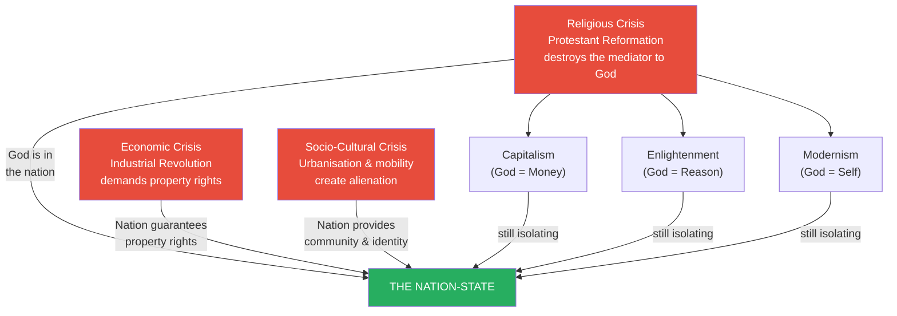
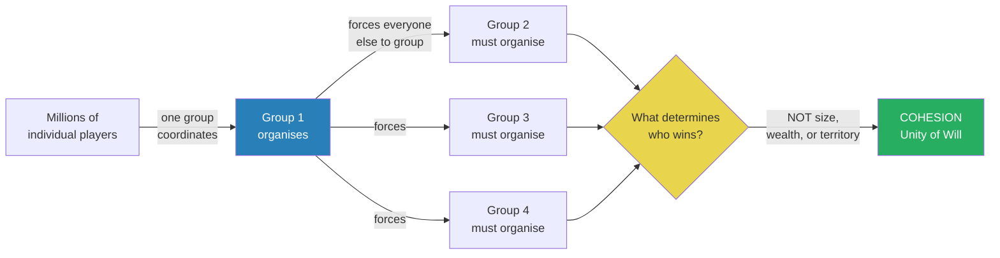
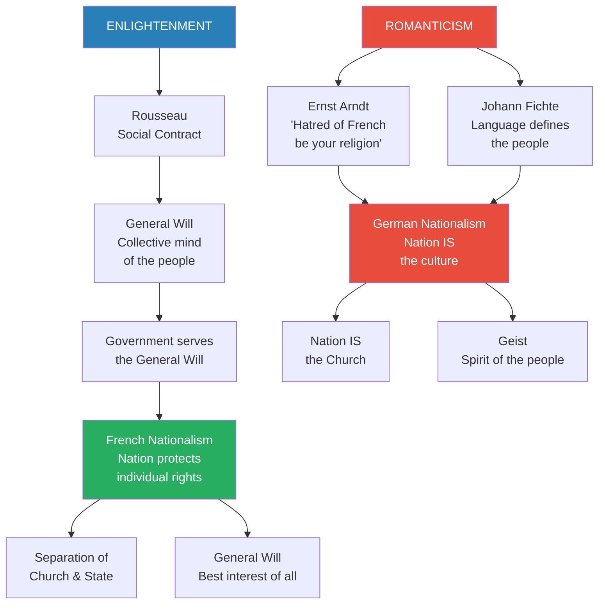
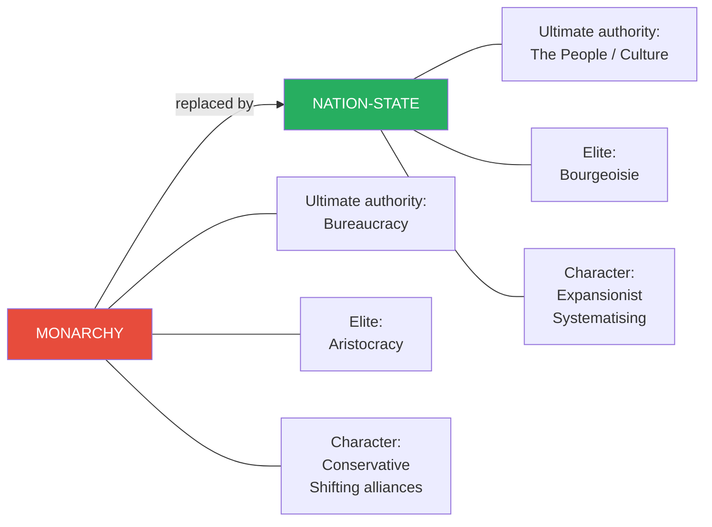
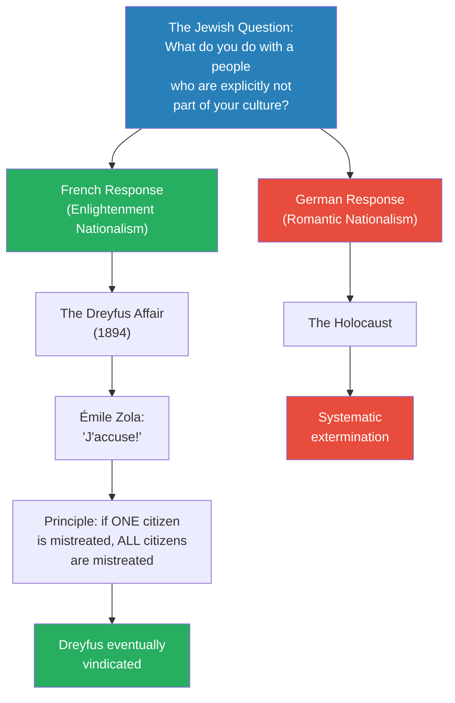
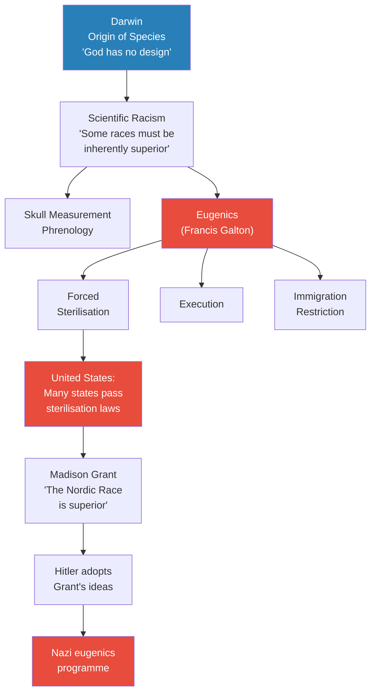
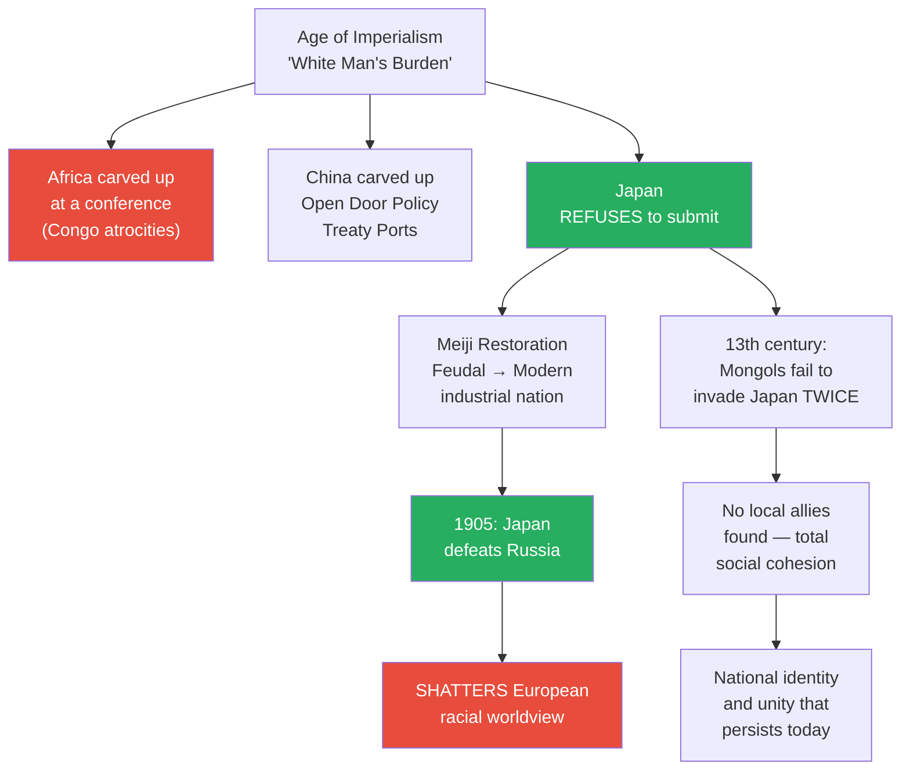
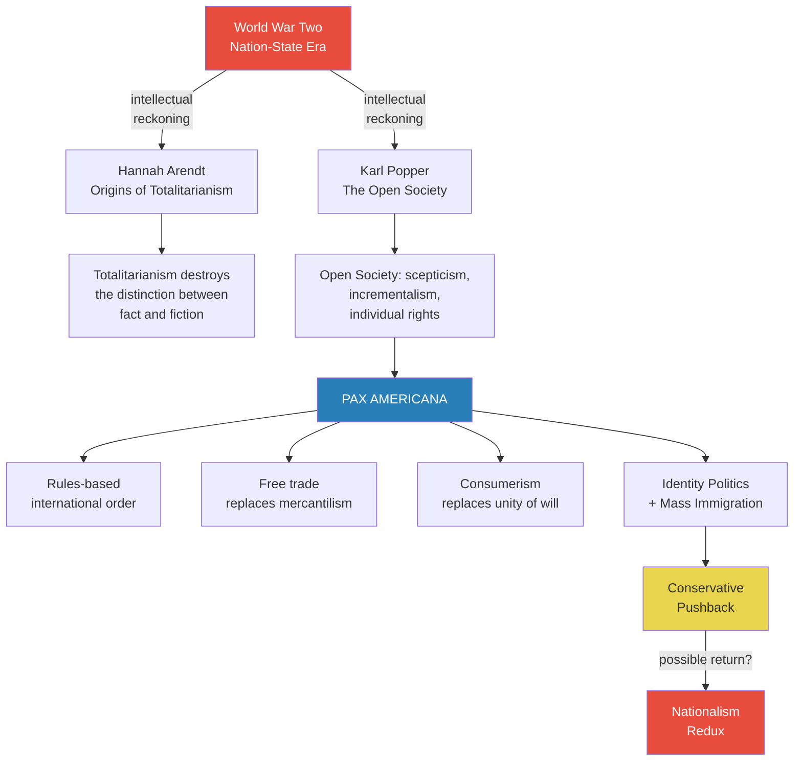

# Birth of the Nation-State

> Prof. Jiang traces the nation-state from its origins in three converging crises — religious, economic, and socio-cultural — to its catastrophic apotheosis in two world wars. The Protestant Reformation left individuals stranded without a mediator to God; capitalism demanded property rights no monarch could guarantee; industrialisation created alienation no philosophy could cure. The nation-state solved all three problems simultaneously, which is why it became the most powerful ideology in human history. But it came in two rival versions: the French Enlightenment model (the nation protects individual rights) and the German Romantic model (the nation IS the culture), and the collision between these two conceptions drove the bloodiest century in human history.

---

## Overview: Key Highlights

- <b style="color: #27ae60">The nation-state solved three crises at once</b> — religious (faith after the Reformation), economic (property rights for the bourgeoisie), and socio-cultural (alienation from industrialisation)
- <b style="color: #2980b9">Game theory explains the nation-state's spread</b> — the moment one group organises as a nation, every other group must do the same or lose; cohesion, not size, determines strength
- <b style="color: #e74c3c">Two rival nationalisms collided</b> — French Enlightenment nationalism (protecting individual rights) versus German Romantic nationalism (protecting a culture), driving two world wars
- <b style="color: #2980b9">Rousseau's General Will</b> — the collective mind of the people, from which government derives its legitimacy; the intellectual foundation of the French Revolution
- <b style="color: #27ae60">Napoleon proved the nation-state's military superiority</b> — citizen-soldiers fighting for themselves generated infinite manpower and unmatched motivation, conquering most of Europe
- <b style="color: #e74c3c">German nationalism was born in reaction to French conquest</b> — Ernst Arndt and Johann Fichte forged a national identity from language and resentment, seeding the catastrophes ahead
- <b style="color: #2980b9">The Dreyfus Affair versus the Holocaust</b> — two responses to "the Jewish question" that reveal the fundamental difference between the two nationalisms
- <b style="color: #e74c3c">Scientific racism and eugenics</b> — Darwin's evolution theory was weaponised to justify racial hierarchy; eugenics was mainstream in America before Hitler adopted it
- <b style="color: #27ae60">Japan's cohesion defeated European assumptions</b> — the Meiji Restoration and the defeat of Russia in 1905 shattered the myth of European racial superiority
- <b style="color: #2980b9">Hannah Arendt's diagnosis of totalitarianism</b> — these regimes destroyed the individual's capacity to distinguish fact from fiction, not merely their political freedom
- <b style="color: #27ae60">Karl Popper's Open Society</b> — the Anglo-American answer: scepticism, incrementalism, and individual rights over grand historical narratives
- <b style="color: #e74c3c">The Pax Americana is generating its own backlash</b> — identity politics and mass immigration are creating a conservative pushback that may allow nationalism to return

| Concept | One-line summary |
|---------|-----------------|
| **Nation-state** | A people with shared identity (nation) united under a sovereign authority (state) |
| **General Will** | Rousseau's concept: the collective mind of the people, which government exists to serve |
| **Geist** | The spirit of a people — the German Romantic claim that culture is in the blood, not chosen |
| **Game theory of nations** | Once one group organises as a nation, all others must follow or be destroyed |
| **Cohesion over size** | A nation's strength comes from unity of will, not territory or wealth |
| **Anomie** | Loss of cultural rootedness caused by rapid social change |
| **Alienation** | A sense of powerlessness — changes happen too fast for individuals to control |
| **Disenchantment** | Dehumanisation — becoming a cog in the machine of industrial modernity |
| **Eugenics** | The pseudo-science of eliminating "bad genes" through sterilisation, execution, or immigration restriction |
| **Fascism** | Extreme nationalism — the belief that the nation is in an eternal struggle for survival |
| **Open Society** | Popper's ideal: scepticism of grand theories, incremental reform, celebration of the individual |
| **Pax Americana** | The post-WWII order: rules-based international system, free trade, consumerism over nationalism |

---

# The Lecture

## Three Roots of the Nation-State [0:00 - 4:29]

*Prof. Jiang opens the penultimate trio of lectures by defining the nation-state — nation (a people with shared identity) plus state (sovereign authority over territory) — and traces its birth to three converging transformations: religious, economic, and socio-cultural. Each crisis independently demanded a solution, and the nation-state solved all three simultaneously.*

> [!tip] Core Insight
> The nation-state became the most powerful ideology in human history because it solved the problem of faith, the problem of property, and the problem of community all at once. No rival ideology — capitalism, liberalism, communism — could match that triple appeal.

*Three independent crises converge on one solution. The competing alternatives — capitalism, Enlightenment reason, modernist self-discovery — each solved the religious crisis but left the individual isolated. Only the nation-state solved isolation by definition, because a nation is inherently a community.*

> [!note]- Expand: Full Lecture Detail
> Prof. Jiang announces three classes remain: the nation-state today, the Soviet Union next Tuesday, and the American empire on Thursday — 60 lectures covering the entire span of human history. He begins with vocabulary: a <b style="color: #2980b9">nation-state</b> is composed of two words. **State** is simple — the supreme executive authority sovereign to a territory. **Nation** is the new idea — a people with shared identity, whether language, culture, history, or ethnicity.
>
> He offers two clarifying examples:
> - The Jews were for the longest time a nation without a state — only the founding of Israel gave them a nation-state
> - The Kurds today are a nation living in the Middle East without a state of their own
>
> He then turns to the three root causes that made the nation-state inevitable.
>
> **Root 1 — The Religious Crisis:**
> - The Protestant Reformation, discussed last class, created a <b style="color: #e74c3c">crisis of faith</b>
> - Before the Reformation, the Catholic Church mediated your relationship with God — do what the Church said, and heaven was promised
> - The Reformation removed the Church from the equation: now you are in direct communion with God and must show absolute faith
> - This creates unbearable anxiety — "You know you love your mother, but do you love your mother every single day, all the time? Probably not. But in religion, you cannot doubt God ever."
> - Four competing solutions emerged to fill the void left by the Church:
>   - **Capitalism:** God is money — accumulate wealth to prove God's love (as discussed in [[42 - The Protestant Reformation and the Birth of Capitalism]])
>   - **Enlightenment:** God is reason — pursue science and rational inquiry
>   - **Modernism:** God is the individual — self-discovery and self-growth (Freud and Jung)
>   - **Nationalism:** God is in the nation — celebrating your nation IS celebrating your faith
> - Of all four, nationalism proved the most powerful because the others still left the individual isolated
> - <b style="color: #27ae60">The nation solves both religion and politics simultaneously</b> — it is the conflation of faith and community, which is why it became the most emotionally powerful idea in history
>
> **Root 2 — The Economic Crisis:**
> - The Industrial Revolution created two problems: the need for constant expansion (imperialism) and the rise of the <b style="color: #2980b9">bourgeoisie</b>
> - Historically, priests and warriors were the elite; now industrialists and capitalists are the new elite
> - The bourgeoisie wanted property rights — assurance that their wealth could be protected and inherited
> - The monarchy could not guarantee this because a king can be overthrown, an aristocracy can be replaced
> - <b style="color: #27ae60">The nation-state cannot be overthrown</b> — it is a permanent structure that secures property rights
> - Monarchies are conservative — they form alliances to maintain the status quo
> - The nation-state is aggressive, expansionist, and imperialist — it has both the resources and the desire for expansion
>
> **Root 3 — The Socio-Cultural Crisis:**
> - The Industrial Revolution drives massive urbanisation — people move from villages to cities
> - Increased trade creates systemisation and standardisation across entire countries
> - New technologies — steamships, factories, and especially print — spread literacy and information
> - Prof. Jiang describes this as "just the beginning of globalisation"
> - This rapid change produces three psychological crises:
>   - <b style="color: #2980b9">Anomie</b> — loss of cultural rootedness; your values are based on the past, and you are not sure they can confront the future
>   - <b style="color: #2980b9">Alienation</b> — a sense of powerlessness; changes happen too fast and too quickly for you to control
>   - <b style="color: #2980b9">Disenchantment</b> — dehumanisation; you become a cog in a machine ("In today's world, AI could possibly replace us")
> - Three ideologies compete to address this: communism, liberalism, and nationalism
> - Communism preaches international solidarity — which can be even more confusing for people
> - Liberalism preaches individual rights — but if you are poor, the right to speak or organise does not really apply to you
> - <b style="color: #27ae60">Nationalism is the only ideology that can absorb all others</b> — you can be both a nationalist and a liberal (most people were), or a nationalist and a communist (Stalin, Mao)

---

## Game Theory and the Spread of Nations [13:30 - 16:17]

*Prof. Jiang uses game theory to explain why the nation-state spread so rapidly once it appeared. The logic is simple and devastating: the moment one group organises as a nation, every other group must do the same or be destroyed. And what determines victory is not size or wealth but cohesion.*

*Game theory explains why the nation-state became universal: it is a forced coordination game. France organises first; Germany, Russia, and Italy must follow or be conquered. And the winner is not the largest but the most united.*

> [!note]- Expand: Full Lecture Detail
> Prof. Jiang proposes a thought experiment: imagine millions of people playing a game — checkers, chess, monopoly, tag, it does not matter. Everyone is an individual player. Now suppose three or four people decide to play as a group — maybe they are family, maybe friends, the reason does not matter.
>
> - <b style="color: #27ae60">The moment they coordinate, everyone else is forced to group together too</b> — otherwise they will lose
> - This is the logic of the nation-state: the moment France declares itself a nation-state, it forces Germany, Russia, and Italy to become nation-states as well
> - But the crucial insight is what determines strength: <b style="color: #e74c3c">it is not size, wealth, or territory — it is cohesion</b>
> - Prof. Jiang offers a vivid analogy: "Maybe there's a bar fight between four brothers and ten strangers. I would bet the four brothers are more likely to win."
>   - The ten strangers do not know each other, do not really care, have nothing at stake — if they feel they are going to lose, they run
>   - The four brothers need to protect each other, love each other, will fight to the death
> - This principle — <b style="color: #2980b9">unity of will</b> over material advantage — will recur when Prof. Jiang discusses Japan later in the lecture

---

## Two Sources: Enlightenment vs. Romanticism [16:17 - 25:33]

*Prof. Jiang traces the two intellectual traditions that produced two fundamentally different versions of nationalism. From the Enlightenment comes Rousseau's General Will and the French model: the nation exists to protect individual rights. From Romanticism comes the German response: the nation IS the culture, and culture is in the blood. Napoleon's conquest of Europe triggers the German reaction, and the collision between these two nationalisms will drive European history for the next 150 years.*

> [!tip] Core Insight
> The French say: the nation exists to protect your rights. The Germans say: the nation IS your identity. This is not a semantic difference — it is the difference between the Dreyfus Affair and the Holocaust.

*Two intellectual traditions produce two incompatible nationalisms. The Enlightenment stream flows through Rousseau into the French Revolution; the Romantic stream flows through Arndt and Fichte into German nationalism. Their collision shapes 150 years of European catastrophe.*

> [!note]- Expand: Full Lecture Detail
> Prof. Jiang explains that the nation-state draws from two intellectual sources: the <b style="color: #2980b9">Enlightenment</b> and <b style="color: #2980b9">Romanticism</b>.
>
> **The Enlightenment stream:**
> - The spread of reason, science, literacy, free thinking, and debate in 17th-19th century Europe
> - Rousseau's *Social Contract* provides the intellectual foundation:
>   - Individuals are born free with inalienable rights — life, liberty
>   - They choose to surrender some rights in exchange for safety, security, and wealth
>   - This creates the <b style="color: #2980b9">General Will</b> — the collective mind of the people
>   - Government exists to serve the General Will, which serves the people
>   - This is where Lincoln's "of the people, by the people, for the people" originates — "He is just reiterating the idea of Rousseau"
> - Rousseau also argues for the <b style="color: #27ae60">separation of church and state</b> — Christianity preaches servitude, and genuine citizens cannot be slaves
> - The French Revolution implements Rousseau's ideas and produces the first iteration of the nation-state
>
> **Why the French model was militarily revolutionary:**
> - The nation-state conceives of the country as a unified whole — almost as a body
> - Under monarchy, the monarch, the people, and the military were separate; monarchs commonly hired foreign mercenaries
> - <b style="color: #27ae60">The nation-state draws on the people themselves as soldiers — creating an almost infinite supply</b>
> - Because citizens believe they are fighting for themselves, they are more motivated, more energetic, more willing to sacrifice than mercenaries "who are just in it for the money"
> - This is why the French Revolution was able to conquer most of Europe, including Spain, Italy, and Germany
>
> **The Romantic reaction:**
> - Romanticism is a direct response to the Enlightenment's problems — its deism ("God has set the rules and left us"), its materialism, its anxiety
> - Romantics focus on nature over science, individual will over social forces, spirituality over materialism
> - Once Napoleon conquers most of Europe, the conquered peoples resent French cultural imposition — French troops enforcing a new political, economic, and social regime
> - Their response: create their own nationalism, but shaped by Romanticism rather than Enlightenment
> - The Romantic formula: there is a culture → it gives us a people → the people must protect and spread that culture → the nation-state is the vehicle
>
> **The German founders:**
> - <b style="color: #2980b9">Ernst Arndt</b> — poet, considered the father of German nationalism:
>
> > [!quote] Ernst Arndt
> > "Let hatred of the French be your religion. Let freedom and fatherland be your saints to whom you pray."
>
> - This idea — that German identity exists in opposition to the French — will drive European catastrophes for the next century
> - <b style="color: #2980b9">Johann Fichte</b> — student of Kant, founder of German Idealism:
>   - Asks: what unites us as a people? Not history, because Germans have different histories
>   - His answer: <b style="color: #27ae60">language</b> — the German language will define culture and identity
>   - "Our cultural identity, our Geist, will be manifested in our language"
>   - This triggers an explosion of German literature to spread the idea
>   - Fichte insists the nation is not a collection of individuals but individuals who are <b style="color: #e74c3c">transformed together</b> — "the animating breath of the spiritual world... will take hold of our natural bodies and join them together"
>
> **The fundamental split:**
>
> | Dimension | French (Enlightenment) | German (Romantic) |
> |-----------|----------------------|-------------------|
> | Religion & state | Separation of church and state | The nation IS the church |
> | Driving force | General Will — best interest of all | Geist — spirit of the people |
> | Basis | Science, reason, liberty | Nature, emotion, will and struggle |
> | Who belongs | Anyone who accepts citizenship | Those born into the culture — "in your blood" |

---

## The Nation-State Replaces the Monarchy [25:33 - 28:00]

*Prof. Jiang summarises three fundamental differences between monarchy and nation-state, then introduces James Scott's Seeing Like a State and Benedict Anderson's Imagined Communities to show how systematisation and print technology made the nation-state possible.*

*The nation-state is not merely a reformed monarchy — it is a fundamentally different political structure with different elites, different sources of authority, and different instincts. Monarchies preserve; nation-states expand.*

> [!note]- Expand: Full Lecture Detail
> Prof. Jiang identifies three structural differences:
>
> | Feature | Monarchy | Nation-State |
> |---------|----------|-------------|
> | **Ultimate authority** | Bureaucracy (represents the monarch) | The people or the culture |
> | **Elite** | Aristocracy (rewarded by the monarch) | Bourgeoisie (industrialists, capitalists) |
> | **Disposition** | Conservative — shifting alliances to maintain peace | Expansionist — systematising, either outward or inward |
>
> - The Congress of Vienna in 1815 was the monarchs' attempt to prevent further conflict — and it worked until 1848, when popular rebellions overwhelmed them
> - The nation-state, by contrast, is "almost like a new religion" — it demands that everyone buy in, leading to relentless systematisation
>
> He then brings in two scholars:
>
> - <b style="color: #2980b9">James Scott, *Seeing Like a State*</b> (Yale University Press): explains how the nation-state arose through systematisation — the metric revolution, uniform measures, standardised law. Three factors conspired: market exchange encouraged uniformity, Enlightenment philosophy favoured a single standard, and Napoleon's state-building enforced it
> - <b style="color: #2980b9">Benedict Anderson, *Imagined Communities*</b>: the nation was made possible by "an explosive interaction between capitalism, print technology, and the fatality of human linguistic diversity." Print created national languages, which allowed people to imagine a shared history and culture
>   - Before print, European elites communicated through intermarriage — no real national identity existed
>   - Print and a shared language prevented the bourgeoisie from freely moving capital across borders — it locked them into national economies
>   - "Culture — it's all just made up. History — it's all just made up. There's something real in it, okay?"

---

## Napoleon and the Birth of German Nationalism [28:00 - 35:30]

*Prof. Jiang traces how Napoleon's conquest of Europe — the triumph of French Enlightenment nationalism — inadvertently created its opposite: German Romantic nationalism. The dissolution of the Holy Roman Empire humiliates German intellectuals, and they forge a new identity from language, resentment, and the Romantic conviction that culture is in the blood.*

> [!note]- Expand: Full Lecture Detail
> - Napoleon spreads French Enlightenment principles throughout Europe
> - In 1805, he defeats both Russia and Austria at the <b style="color: #2980b9">Battle of Austerlitz</b>
> - The Holy Roman Emperor, rather than surrender the throne to Napoleon, dissolves the entire confederation — an institution that had existed in German minds for 1,000 years since Charlemagne
> - Napoleon replaces it with the <b style="color: #2980b9">Confederation of the Rhine</b> — essentially a vassal state to France
> - This is profoundly humiliating for German intellectuals: their culture, their history, is being eroded
> - But critically, <b style="color: #e74c3c">the Germans at this point do not have a sense of "Germanness"</b> — no national identity exists yet
> - German intellectuals must create one from scratch, and they do so in opposition to French culture
>
> > [!example] Rousseau and the Separation of Church and State
> > - Rousseau writes in the *Social Contract*: "I am wrong to speak of a Christian Republic — those two terms are mutually exclusive"
> > - Christianity preaches servitude and dependence — "its spirit is so favourable to tyranny"
> > - Genuine Christians "are made to be slaves, and they know it, and don't mind much — this short life counts for too little in their eyes"
> > - This becomes a foundational principle of the French Republic
> > - It explains modern France's antagonism toward public religious expression — the hijab controversy, restrictions in schools and public places
> > **The lesson:** The secular state is not neutral — it is a deliberate theological position, rooted in Rousseau's argument that religion and republican citizenship are incompatible.
>
> **Summary of the two nationalisms:**
>
> | Dimension | French Nationalism | German Nationalism |
> |-----------|-------------------|-------------------|
> | Intellectual basis | Enlightenment | Romanticism |
> | Core values | Science, reason, liberty | Nature, emotion, will and struggle |
> | Church and state | Separated | The nation IS the church |
> | Collective identity | General Will | Geist (spirit of the people) |
> | Who belongs | Citizens with rights | Those born into the culture |

---

## The Jewish Question: Dreyfus vs. the Holocaust [35:30 - 40:00]

*Prof. Jiang uses the treatment of Jews to dramatise the fundamental difference between French and German nationalism. The Dreyfus Affair and the Holocaust are not merely two events — they are the logical consequences of two incompatible conceptions of what a nation is for.*

> [!tip] Core Insight
> In the French conception, if one citizen loses his rights, all citizens lose theirs — even if that citizen is Jewish. In the German conception, if your culture is not German, you are not part of the nation. The first produces the Dreyfus Affair. The second produces the Holocaust.

*The same question — what do you do with a minority that maintains a separate identity? — produces two diametrically opposite answers depending on whether you define the nation as a protector of rights or as a protector of culture.*

> [!note]- Expand: Full Lecture Detail
> Prof. Jiang frames the problem: Jews throughout Europe are minorities. They consider themselves a nation — with the Bible giving them shared language, culture, and history — but they have no state. They are "very adamant about not being part of your culture." So what does a nation-state do with them?
>
> **The French answer — the Dreyfus Affair (1894):**
> - Alfred Dreyfus was a Jewish officer in the French military
> - He was arrested and accused of being a German spy
> - French counterintelligence quickly discovered he was not the spy
> - But the military refused to lose face, and anti-Semitic elements within it pushed to maintain the conviction
> - They put the real spy on trial and acquitted him, then sent Dreyfus to a penal colony for life
> - When news leaked, it became a national controversy
> - <b style="color: #2980b9">Emile Zola</b>, probably the most famous writer in France, published "J'accuse" — accusing the French military and state of corruption, incompetence, and negligence
> - The deeper issue was about French identity: liberals (heirs of the Revolution) versus monarchists
> - For the liberals, <b style="color: #27ae60">the Republic exists to protect the rights of ALL citizens — if one citizen is mistreated by the justice system, then all citizens are at risk</b>
> - Even though Dreyfus was Jewish, the French saw him first and foremost as a French citizen
> - The affair lasted about ten years and became a defining moment of French national identity
>
> **The German answer — the Holocaust:**
> - Prof. Jiang states it flatly: "And of course, the German response to the Jewish question — what's the Holocaust?"
> - <b style="color: #e74c3c">These are two different conceptions of nationalism — and they produce two radically different outcomes</b>

---

## Darwin, Scientific Racism, and Eugenics [40:00 - 47:00]

*Prof. Jiang traces how Darwin's theory of evolution was weaponised into scientific racism and eugenics — not as a fringe movement but as mainstream elite ideology in America, Britain, and Germany. The eugenics movement was centred in the United States, and its ideas were adopted by Hitler, not the other way around.*

*The arrow of influence runs from America to Germany, not the other way around. Eugenics was mainstream in the United States decades before the Nazis adopted it. Madison Grant's racial hierarchy was Hitler's intellectual foundation.*

> [!note]- Expand: Full Lecture Detail
> Prof. Jiang explains that once the nation-state came into being, it needed a philosophy about culture, and Charles Darwin provided one:
>
> - *On the Origin of Species* contradicts all Christian teaching with the idea of <b style="color: #2980b9">evolution</b> — God has no design; we are who we are by random chance
> - This was extrapolated into <b style="color: #e74c3c">scientific racism</b>: if development is by chance, then some peoples must have evolved to be more intellectual, scientific, and brave
> - Since Europe was the wealthiest and most advanced part of the world, Europeans reasoned that they must be racially superior
> - Skull measurement (phrenology) became a popular method to "prove" European superiority
>
> - <b style="color: #2980b9">Francis Galton</b>, Darwin's cousin, proposed <b style="color: #e74c3c">eugenics</b>:
>   - Evolution eliminated bad genes naturally, but improved sanitation and medicine meant people "who shouldn't have died are living"
>   - This would "dilute the quality of your gene pool"
>   - Three solutions: forced sterilisation (of the handicapped, criminals), execution, and immigration restriction
>
> - <b style="color: #e74c3c">The eugenics movement was centred in the United States</b>, not Germany:
>   - "Low genetic stock" immigrants — Polish, Irish, Italian, Eastern European — were flooding into America, threatening the WASP elite
>   - Many states passed forced sterilisation laws
>   - <b style="color: #2980b9">Madison Grant</b> wrote a popular book arguing the Nordic race (Germans, Scandinavians, British) was the dominant race, but its numbers were being diluted
>
> > [!quote] Madison Grant
> > "A rigid system of selection through the elimination of those who are weak or unfit... would enable us to get rid of the undesirables who crowded our jails, hospitals and insane asylums."
>
> - Hitler was a fan of Madison Grant — the Nazis translated and distributed his book, and his ideas became the basis for Nazi eugenics policy
> - Prof. Jiang makes a startling counterfactual: <b style="color: #e74c3c">"In 1935, if you ask me what was most likely to happen, I would tell you that America, Britain and Germany would ally themselves because they saw themselves as one people, and they would attack the Soviet Union"</b>
>   - The Slavs were seen as inferior; the Communists were a threat to Nordic capitalist civilisation
>   - Why America and Britain instead allied with the Soviet Union to destroy Germany is "a huge mystery" — to be discussed in the next class

---

## Japan: The Exception That Shattered European Assumptions [47:00 - 55:00]

*Prof. Jiang turns to the age of imperialism and Japan's dramatic refusal to fit the European racial narrative. The Meiji Restoration, the defeat of Russia in 1905, and Japan's extraordinary social cohesion — traceable back to the failed Mongol invasions of the 13th century — proved that the game theory principle of cohesion over size applies to civilisations, not just bar fights.*

*Every other non-European civilisation submitted — Africa was carved up, China was partitioned. Japan alone transformed itself fast enough and cohered tightly enough to defeat a European power, demolishing the racial hierarchy the Europeans had built to justify their dominance.*

> [!note]- Expand: Full Lecture Detail
> Prof. Jiang explains the age of imperialism: Europeans needed resources and believed they had "the white man's burden" to civilise the world. Advances in malaria medicine allowed them to penetrate Africa, where they carved up the continent at a conference. The Congo under King Leopold of Belgium was "one of the worst atrocities in human history" — a mercenary army enslaving the population and extracting resources as the king's personal property. China was similarly carved up through treaty ports and the Open Door Policy.
>
> But Japan was different:
> - The <b style="color: #2980b9">Meiji Restoration</b> transformed Japan from a feudal society into a modern industrial nation at extraordinary speed
> - "It was as though everyone decided that we as a people needed to change, and we're going to change today"
> - By 1898, Japan had a parliament; by 1928, universal male suffrage
> - In 1905, Japan defeated Russia — <b style="color: #e74c3c">a shocking event that contradicted the entire European worldview</b>
>
> Prof. Jiang explains the deep roots of Japan's cohesion:
> - In the 13th century, the Mongols launched two invasions of Japan — both failed
> - The myth attributes this to the <b style="color: #2980b9">Kamikaze</b> (divine wind) — but that is mythology
> - The real reason: the Mongols could land forces both times, but <b style="color: #27ae60">they could not find any local allies</b>
>   - Standard invasion strategy is to find local collaborators, establish a beachhead, and expand
>   - In Japan, the people were completely united against the invaders
>   - It became too expensive for the Mongols to continue
>
> > [!example] Japanese Social Cohesion — The Reverse Parking Phenomenon
> > - If you go to Japan today, almost everyone reverse parks
> > - There is no law requiring reverse parking — everyone just does it
> > - One photograph shows an entire car park with every car reverse-parked except one
> > - This illustrates a level of social cohesion that has no equivalent in most nations
> > **The lesson:** Japan's strength was never military or economic — it was social. A civilisation where people voluntarily coordinate without coercion is almost impossible to defeat.
>
> - Prof. Jiang concludes: <b style="color: #27ae60">"The strongest nation in East Asia is not China, it's Japan. You have to look at social cohesion — how willing people are to fight and die for the nation. Historically, the nation with the most patriotism has always been Japan, not China."</b>

---

## World Wars and the Rise of Fascism [55:00 - 1:02:00]

*Prof. Jiang traces the path from the unification of Germany in 1871 through World War One and Two, explaining how nationalism in the Ottoman and Austro-Hungarian empires triggered the conflicts, and how extreme nationalism — fascism — emerged from the wreckage of the first war to produce the second.*

> [!note]- Expand: Full Lecture Detail
> - In 1871, the Prussians unite all Germany into one political entity — the German Empire
> - This threatens Britain, whose foreign policy is to maintain a balance of power in Europe: "If one power arises, we must fight it"
>   - Britain spent vast resources to defeat Napoleon; now it will do the same against Germany
> - Simultaneously, nationalism spreads through the Ottoman and Austro-Hungarian empires — multi-ethnic empires with "no reason to exist anymore in an age of the nation-state"
>   - Greeks rebel and win independence from the Ottomans
>   - Italians rebel against Austria-Hungary
>   - Slavic peoples within Austria-Hungary call to Russia for aid
> - <b style="color: #e74c3c">A Serbian nationalist assassinates the heir to the Austro-Hungarian Empire in Sarajevo</b> — drawing in Austria-Hungary, Russia, Britain, and Germany into World War One
> - After WWI, extreme nationalism — <b style="color: #2980b9">fascism</b> — emerges
>
> > [!quote] Benito Mussolini
> > "We have created our myth. The myth is a faith, a passion. It is not necessary for it to be reality."
>
> - Fascism is the belief that the nation is in an eternal struggle of the fittest — it must defeat other nations to survive
> - <b style="color: #e74c3c">War is celebrated as a positive good</b>: it unites people and forges them into extreme nationalists
>
> > [!quote] Filippo Marinetti (Fascist)
> > "We want to glorify war, the only cure for the world."
>
> - This romantic nationalism drives both Italian fascism and German Nazism, leading to the rise of Hitler and World War Two

---

## After the Catastrophe: Arendt, Popper, and the Pax Americana [1:02:00 - 1:05:12]

*Prof. Jiang closes with the intellectual reckoning after World War Two — Hannah Arendt's diagnosis of totalitarianism, Karl Popper's prescription of the Open Society — and the Pax Americana that replaced the nation-state era. But he warns that the American order is generating its own contradictions, and nationalism may return.*

*The Pax Americana was built to prevent nationalism from recurring. But its emphasis on individual rights has generated identity politics and mass immigration — which are now producing the conservative backlash that may bring nationalism back. The cycle may not be over.*

> [!note]- Expand: Full Lecture Detail
> Prof. Jiang introduces two thinkers who emerged from the Holocaust:
>
> - <b style="color: #2980b9">Hannah Arendt</b>, *The Origins of Totalitarianism* — "considered the greatest work of political philosophy in the 20th century":
>   - Her key argument: totalitarian regimes did not merely impose obedience — they <b style="color: #e74c3c">destroyed people's capacity to distinguish fact from fiction</b>
>   - "The ideal subject of totalitarian rule is not the convinced Nazi or the dedicated communist, but people for whom the distinction between fact and fiction, true and false, no longer exists"
>   - The regimes destroyed the idea of the individual — and that is what allowed totalitarianism to arise
>
> - <b style="color: #2980b9">Karl Popper</b>, *The Open Society and Its Enemies*:
>   - For peace to thrive, we must celebrate the individual over the nation
>   - We must be sceptical of grand theories of history — avoid Plato, Hegel, and Marx (the "three baddies of the Western tradition")
>   - These thinkers are anti-democratic, anti-individual, and possess a teleological view of history — "a megalomaniacal view"
>   - We need incremental change, not revolution
>   - What Popper is really arguing: <b style="color: #27ae60">Anglo-American civilisation is superior to both Russian and German civilisation</b>
>   - His *Open Society* has become "an integral basis for the American empire"
>
> **The Pax Americana versus WWII:**
>
> | Feature | World War Two Era | Pax Americana |
> |---------|------------------|---------------|
> | Organising principle | Nation-state | International rules-based order |
> | Economic model | Mercantilism — separate trading zones | Global free trade |
> | Source of cohesion | Unity of will (fascism) | Consumerism — "just go buy things" |
>
> But the Pax Americana creates new problems:
> - <b style="color: #2980b9">Identity politics</b> — "really the celebration of individual helplessness" — the state exists to protect the vulnerable: minorities, women, immigrants
> - Mass immigration — now celebrated, historically not so
> - Together, these create a <b style="color: #e74c3c">conservative pushback</b> — Trump-era deportations, possible exclusion of certain groups
> - "Even though the nation-state created a lot of problems that the Pax Americana is trying to resolve by focusing on individual rights, the focus on individual rights is going to create more problems that may also allow for the return of nationalism"
>
> Prof. Jiang promises to address this in Thursday's final lecture on the American empire.

---

## Q&A: Is Nationalism a Cult? [1:05:12 - 1:05:52]

> [!note]- Expand: Full Lecture Detail
> A student asks: what is the difference between nationalism and a cult?
>
> - Prof. Jiang responds that there is "really little difference between nationalism and religion"
> - A cult is more limited, more small, and requires specific rituals
> - But the student's instinct is correct: "You can make the argument that nationalism is a form of religion — definitely"
> - This echoes the lecture's central theme: the nation-state succeeded precisely because it functioned as a replacement religion, solving the crisis of faith that the Protestant Reformation created

---

## Connections

**Builds on:** [[42 - The Protestant Reformation and the Birth of Capitalism]] (crisis of faith, capitalism as replacement for God), [[46 - The Revolution of Reason]] (Enlightenment principles), [[47 - The Passion of Robespierre]] (French Revolution), [[48 - Napoleon's Empire of Myth]] (Napoleon's conquest of Europe), [[50 - Rule, Britannia!]] (British balance-of-power foreign policy)
**Sets up:** [[59 - The Man of Steel]] (Soviet Union, Stalin), [[60 - The Decline and Fall of the American Empire]] (Pax Americana and its contradictions)
**Related books in vault:** [[Sapiens - Yuval Noah Harari]] (imagined communities, agricultural revolution), [[The 48 Laws of Power - Robert Greene]] (power dynamics and elite competition)

---

## The Takeaway

This lecture reveals the nation-state not as a natural or inevitable institution but as an emergency solution to three simultaneous crises. The Protestant Reformation left individuals stranded before God with no mediator. The Industrial Revolution created a bourgeoisie that needed property rights no monarch could guarantee. And urbanisation produced alienation that no philosophy of individual rights could cure. The nation-state solved all three at once — faith, property, and belonging — which is why it became the most powerful ideology in human history, more resilient than capitalism, liberalism, or communism alone.

The most unsettling insight is the game theory logic: the nation-state spreads not because it is good but because it is obligatory. The moment one group organises, every other group must follow or be destroyed. And what determines victory is not wealth, territory, or military technology but cohesion — unity of will. Japan's defeat of Russia in 1905, the four brothers versus ten strangers, the Mongols failing to find a single Japanese collaborator — all point to the same principle. This is why Prof. Jiang insists Japan, not China, is the strongest nation in East Asia.

But the lecture's deepest current is a warning about cycles. The Pax Americana was designed to prevent the return of nationalism by replacing it with individual rights, free trade, and consumerism. Yet the focus on individual rights has produced identity politics and mass immigration, which are generating exactly the conservative backlash — the Trump era, deportations, closing borders — that could bring nationalism back. The nation-state may be the problem that created the solution that is recreating the problem. Prof. Jiang promises to address whether this cycle can be broken in Thursday's final lecture on the American empire.
