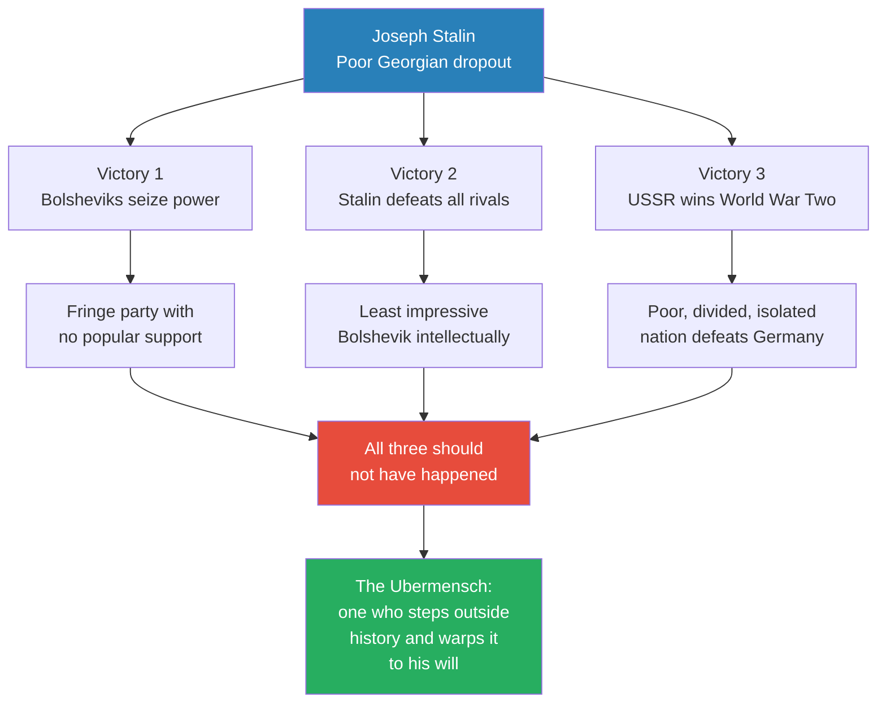
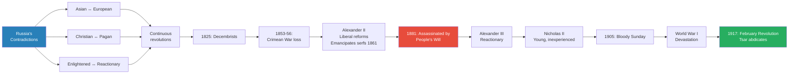
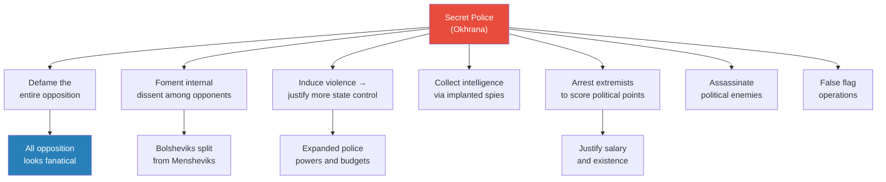
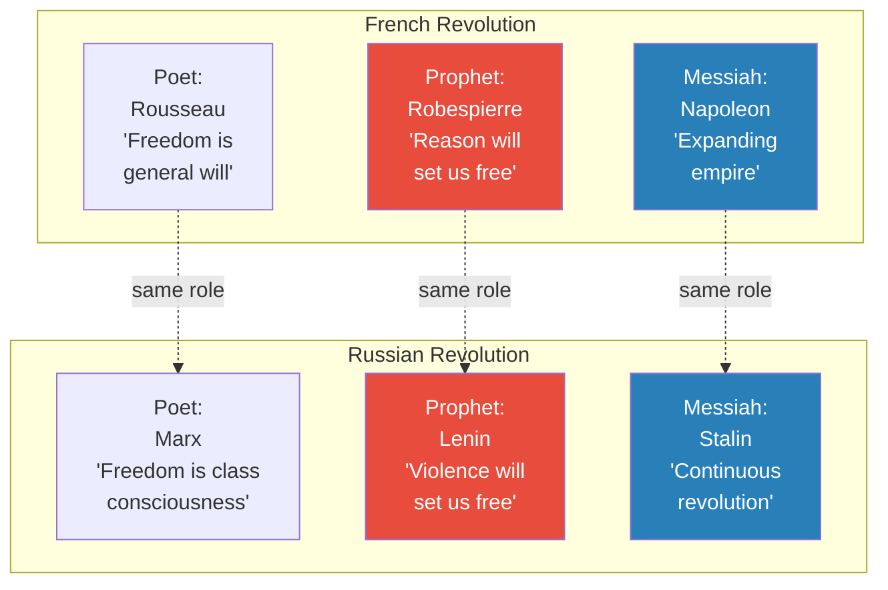
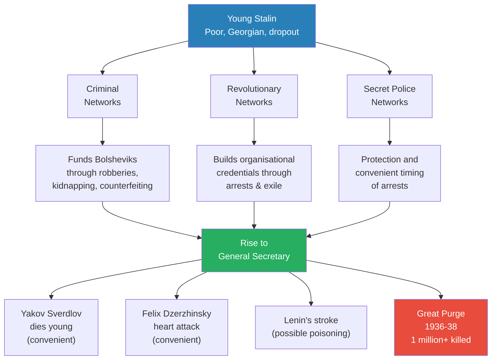
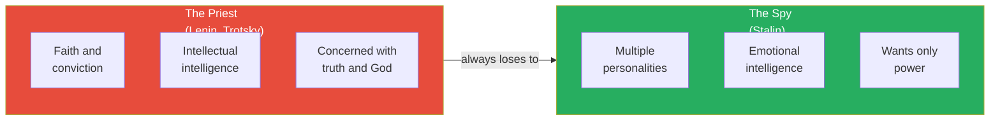
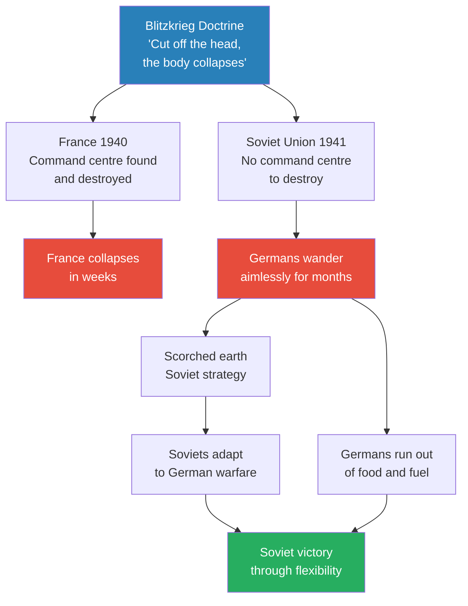
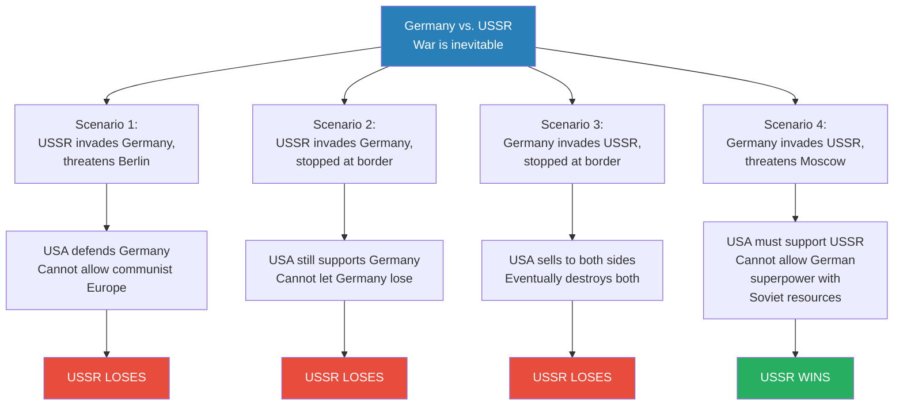
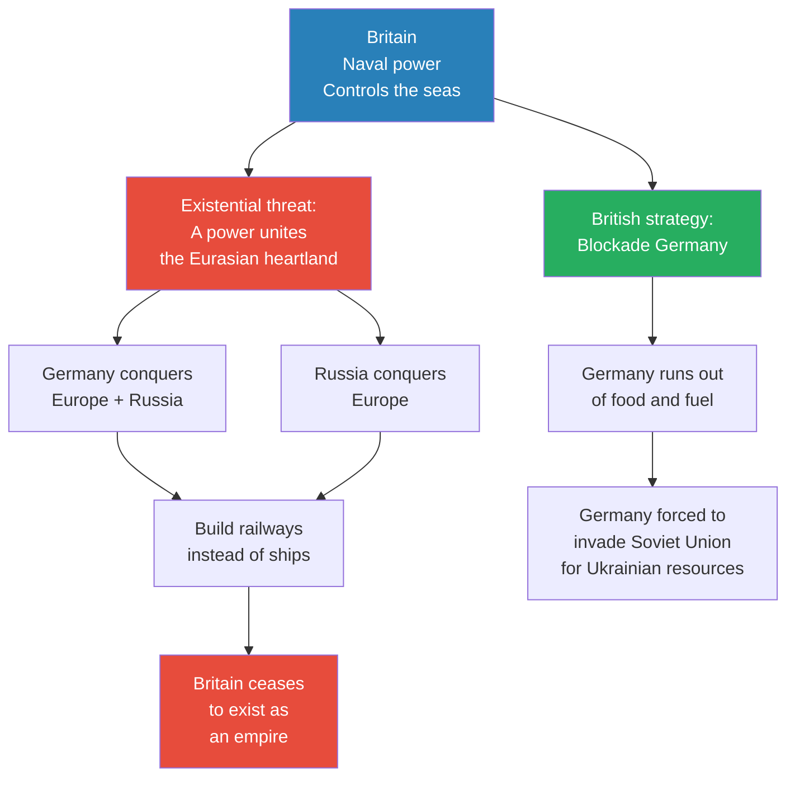

# The Man of Steel

> Prof. Jiang makes a provocative case for Joseph Stalin as "the greatest man who ever lived" — not morally, but strategically. A poor Georgian dropout with no intellectual credentials outmanoeuvred every Bolshevik rival, survived every geopolitical trap, and engineered the one scenario in which the Soviet Union could win World War Two. The lecture traces three improbable victories: the Bolsheviks seizing power despite being a fringe party, Stalin defeating far more impressive rivals to become sole ruler, and the Soviet Union surviving a war that every rational calculation said it should lose. At the centre of each victory is the same insight: Stalin was not a priest seeking truth but a spy seeking power — and in a world of idealists, the realist always wins.

---

## Overview: Key Highlights

- <b style="color: #27ae60">Stalin was a spy, not a priest</b> — while Lenin and Trotsky sought ideological truth, Stalin sought only power, which gave him absolute flexibility
- <b style="color: #2980b9">The Ubermensch thesis</b> — Prof. Jiang frames Stalin through Nietzsche's concept of a man who steps outside history and warps it to his will
- <b style="color: #e74c3c">The secret police incubated extremism</b> — the Okhrana funded and protected the Bolsheviks because political extremism served the state's interests
- <b style="color: #27ae60">Stalin found the one winning scenario in World War Two</b> — game theory analysis shows only a German invasion threatening Moscow could bring American aid without American hostility
- <b style="color: #2980b9">Blitzkrieg's fatal flaw</b> — Germany's doctrine required a command centre to destroy, but the Soviet Union had none
- <b style="color: #e74c3c">The Great Purge paradoxically strengthened the military</b> — removing conservative generals made the Red Army more innovative and adaptable
- <b style="color: #2980b9">The Mackinder Thesis</b> — Britain's geopolitical imperative was to prevent any power from uniting the Eurasian heartland
- <b style="color: #27ae60">Nationalism, not ideology, wins wars</b> — Stalin understood that people die for each other, not for ideas, and used Mother Russia to galvanise the population
- <b style="color: #e74c3c">American industrialists funded Nazi Germany</b> — General Motors, ITT, Kodak, and Standard Oil had substantial investments in German subsidiaries
- <b style="color: #2980b9">The priest vs. spy framework</b> — priests have intellectual intelligence and faith; spies have emotional intelligence and multiple personalities
- <b style="color: #27ae60">Stalin tricked every major player</b> — he manipulated Hitler into invading, Roosevelt into supporting, and Churchill into fighting Germany
- <b style="color: #e74c3c">27 million Soviet deaths were the price of survival</b> — the deadliest war in human history was, in Stalin's calculus, the only path to Soviet survival

| Concept | One-line summary |
|---------|-----------------|
| **Ubermensch** | Nietzsche's concept of a man who steps outside history and bends it to his will — Prof. Jiang's framing of Stalin |
| **Okhrana** | The Russian Imperial secret police who funded and manipulated revolutionary groups including the Bolsheviks |
| **Bolsheviks vs. Mensheviks** | Lenin's extremist faction vs. the orthodox Marxists who believed revolution must follow industrialisation |
| **Vanguard party** | Lenin's theory that a small revolutionary elite could lead peasants to communism without waiting for industrial capitalism |
| **The Great Purge (1936-38)** | Stalin's elimination of over one million party members and military leaders to consolidate absolute power |
| **Blitzkrieg** | German doctrine of rapid warfare aimed at destroying command centres — effective in France, useless in Russia |
| **Scorched earth** | Soviet defensive strategy of retreating and destroying resources — used against Sweden, Napoleon, and Germany |
| **Lend-Lease** | American military aid programme that shipped 17.5 million tonnes of equipment to the Soviet Union |
| **Mackinder Thesis** | The geopolitical theory that whoever controls the Eurasian heartland controls the world — drove British policy |
| **Game theory counterfactual** | Prof. Jiang's four-scenario analysis proving only one outcome allowed Soviet survival |
| **Priest vs. spy** | The framework explaining why Stalin defeated intellectually superior rivals — emotional intelligence beats ideology |

---

# The Lecture

## Stalin's Three Improbable Victories [0:00 - 3:00]

*Prof. Jiang opens with a deliberate provocation: Joseph Stalin may be the greatest man who ever lived. He frames the lecture around three things that should not have happened — and happened only because one man willed them into being.*

> [!tip] Core Insight
> The Bolsheviks should not have triumphed. Stalin should not have become Soviet leader. The Soviets should not have won World War Two. All three happened because Stalin willed this reality into being — making him, in Nietzsche's term, the Ubermensch.

*Each of Stalin's three victories defied rational prediction. Prof. Jiang's argument is not moral approval but analytical recognition: Stalin saw possibilities where everyone else saw impossibilities.*

> [!note]- Expand: Full Lecture Detail
> Prof. Jiang tells the class he wants to make the argument that Stalin is "probably the greatest man who ever lived" — and he frames it around three reasons:
>
> - **First:** Stalin was a poor high school dropout from Georgia, on the fringes of the Russian Empire, who led "an extreme fringe and despised political party called the Bolsheviks" into absolute power
> - **Second:** Among the Bolsheviks, Stalin was the least impressive — "Everyone else is intellectual, with many books, many speeches, many achievements to his resume. But Stalin defeats them all"
> - **Third:** During World War Two, Stalin "took a poor, divided, isolated nation and defeated Germany and turned it into a global hegemon"
>
> He reframes: "The Bolsheviks should not have triumphed. Stalin should not become Soviet leader. The Soviets should not have won World War Two." All three happened because Stalin willed them into existence.
>
> Prof. Jiang introduces Nietzsche's concept: the <b style="color: #2980b9">Ubermensch</b> — "someone who steps outside of history and warps it to his will. That is Joseph Stalin."

---

## Russia's Split Personality and the Road to Revolution [3:00 - 9:00]

*Prof. Jiang traces the contradictions that made Russia a permanent breeding ground for revolution — Asian and European, Christian and pagan, enlightened and reactionary — and introduces the secret police as the hidden engine of political extremism.*

*Russia's revolutions were not accidents but consequences of irreconcilable contradictions built into the nation's identity. Each crisis deepened the next.*

> [!note]- Expand: Full Lecture Detail
> Prof. Jiang recaps Russian history from previous lectures. Russia is "a nation with a split personality" — both Asian and European, Christian and pagan, enlightened and reactionary. These contradictions produce rebellions throughout Russian history.
>
> **The Decembrists (1825):**
> - A group of military officers tried to overthrow the Tsar and install a military dictatorship
> - After this, "revolutionary discussion becomes sort of like a national pastime in Russia"
> - Even Dostoevsky and Tolstoy were sympathetic to revolution
>
> **The Crimean War (1853-56):**
> - Russia loses to the Ottoman Empire backed by France and Britain
> - This marks "a limit to the expansion of Russia"
> - Russia had previously resolved internal conflicts by expanding eastward, giving nobles more land and serfs
> - The loss forced Russia to confront its backwardness relative to Europe
>
> **Alexander II's reforms:**
> - Embarked on radical liberal reforms, most importantly emancipating the serfs in 1861
> - He hoped to industrialise Russia and create a modern market economy
> - Created massive pushback from nobles who lost wealth and property
>
> > [!example] Alexander II and Abraham Lincoln
> > - Alexander II was a "huge admirer of the American republic" and close friends with Lincoln
> > - During the American Civil War (1861), Alexander feared France and Britain would support the Confederacy
> > - The Confederacy supplied cotton to British and French textile industries
> > - France and Britain saw America as a growing threat and wanted to divide it
> > - Alexander publicly stated that if France and Britain allied with the Confederacy, Russia would intervene for the Union
> > - He sent warships to New York and San Francisco to demonstrate his commitment
> > - The two leaders exchanged letters, and Alexander "did much to save the American Union"
> > **The lesson:** Geopolitical alliances follow interests, not ideologies — a Russian autocrat helped preserve an American democracy because their strategic interests aligned.
>
> **The People's Will (1881):**
> - Alexander II was assassinated on the very day he returned from a meeting to promote constitutional monarchy
> - The terrorist group "The People's Will" had at most 2,000 members, founded in 1879
> - Their ideology: the peasants loved the Tsar, so the idea of the Tsar enslaved them — killing the Tsar would "liberate" their minds
> - After the assassination, all major members were "quickly arrested by the secret police and executed"
>
> **The curious question:**
> - If the secret police were so effective at capturing assassins after the fact, why were they unable to prevent the assassination?
> - Where did a small underground terrorist organisation get its funding?
> - How did a group of religious fanatics maintain organisational discipline?

---

## The Secret Police as Incubators of Extremism [9:00 - 19:00]

*Prof. Jiang presents his most provocative claim of the first half: that the Russian secret police deliberately funded and protected political extremists — including the Bolsheviks — because extremism served the state's interests. He extends this pattern to modern Islamic extremism.*

> [!tip] Core Insight
> The secret police throughout history have supported political extremists to achieve short-term political objectives. The Bolsheviks were incubated by the very system they claimed to oppose.

*The secret police's incentive structure makes extremism rational. The very institution tasked with preventing terrorism benefits most from its existence.*

> [!note]- Expand: Full Lecture Detail
> Prof. Jiang poses a thought experiment: "Let's say you're secret police, and you're tasked with monitoring and capturing these terrorists. Is it to your benefit to capture them, or is it to your benefit to assist them?"
>
> He lists the benefits of supporting extremists:
> - <b style="color: #e74c3c">Defame all opposition</b> — by supporting the most violent, you make everyone who opposes the Tsar look bad
> - **Foment internal dissent** — supporting Bolsheviks against Mensheviks splits the socialist movement
> - **Induce violence** to justify more state control and bigger budgets
> - **Collect intelligence** by planting spies within extremist groups
> - **Arrest extremists to score political points** — "The secret police is getting paid a lot of money. How do they justify their salaries? Well, they arrest extremists that they support"
> - **Assassinate political enemies** through proxies
> - **False flag operations** to justify wars
> - "The best reason, of course, is because it's fun and exciting. The people in the secret police, they're all psychopaths"
>
> **Evidence — the Okhrana and Lenin:**
> - Lenin was a factional, alienating figure — "this guy was an asshole" — who would normally be ostracised
> - But the Okhrana sent a spy, Roman Malinovsky, to act as "a vocal Lenin supporter within the party"
> - "Various Bolsheviks expressed their suspicions about Malinovsky to Lenin"
> - The secret police were also likely sending money to Lenin, "which is really important — Lenin can support his faction within the larger socialist movement. They probably have more money than the other groups"
> - <b style="color: #e74c3c">"The secret police is incubating the Bolsheviks"</b>
>
> **The Bolsheviks vs. Mensheviks split:**
> - The Mensheviks followed orthodox Marxism: autocracy must become bourgeois democracy, then industrialise, then capitalism creates class consciousness, then revolution
> - Lenin rejected this: "We don't wait for the proletariat to become 80% of the population. We create a <b style="color: #2980b9">Vanguard party</b> and lead the peasants into communist paradise"
> - The Mensheviks warned this would create nothing more than "a dictatorship of a peasantry — you'll be no different from the Tsar"
>
> > [!example] Islamic Extremism — The Same Pattern
> > - Prof. Jiang extends the argument: "Where does Islamic extremism come from?"
> > - After World War Two, Americans and British sponsored Islamic extremism for three reasons:
> > - **Destabilise the Soviet Union** — roughly a third of the Soviet population was Muslim, and they hated communist atheism
> > - **Undermine Middle Eastern nationalism and socialism** — ideologies that threatened Western access to oil
> > - **Support the Saudi regime** — the Saudis had a pact with Wahhabism, so supporting Islamic extremism propped up a Western ally
> > **The lesson:** The pattern repeats across centuries — state security services incubate the very extremism they claim to fight.
>
> **Nicholas II and the collapse:**
> - After Alexander III's reactionary reign, young, inexperienced Nicholas II took the throne
> - Russia lost to Japan in 1904, leading to famine and Bloody Sunday in 1905
> - The royal family allied with Rasputin, a mystic who could calm the haemophiliac heir Alexei
> - Rasputin's reputation — "rumours that he was a sex maniac" and "satanic rituals" — devastated the monarchy's prestige
> - World War One proved devastating; in 1917, generals told Nicholas to abdicate
> - The Duma became the Provisional Government, but remained in the war
> - Germany smuggled Lenin back into Russia: "Lenin was not just a useful idiot to the Russian secret police, but he was also a useful idiot to the Germans"

---

## The Bolshevik Seizure of Power [19:00 - 26:00]

*Prof. Jiang traces Lenin's coup, the Russian Civil War, and the parallel between the French and Russian Revolutions — poet, prophet, messiah — to set up Stalin's rise as the messiah figure who consolidates through continuous revolution.*

*The French and Russian Revolutions followed the same three-act structure: a poet imagines the ideal, a prophet tries to build it through faith, and a messiah conquers the world to ensure the revolution survives. Napoleon expanded outward; Stalin purged inward.*

> [!note]- Expand: Full Lecture Detail
> **Lenin's return and the October coup:**
> - Lenin called for three things: "Land, peace and bread" — enormously popular with the war-weary people
> - The Provisional Government tried to arrest Lenin; he escaped
> - When the military attempted to overthrow the Provisional Government, it ironically needed Lenin's help to defend the republic
> - Lenin was "not in any way a politician. He's a theoretician, and he's fanatical"
>
> > [!quote] Vladimir Lenin
> > "The petty bourgeoisie Democrats, those sham socialists... even picture the socialist transformation in a dreamy fashion, not as the overthrow of the rule of exploiting class, but as the peaceful submission of the minority to the majority."
>
> - In October 1917, Lenin ordered a coup against the Provisional Government
> - This triggered the Russian Civil War
>
> **The Civil War — three reasons the Bolsheviks won:**
> - The Whites (former aristocrats and military) "don't actually have a policy for reform — they want things to stay the way they are, and peasants are hungry, landless. They want peace"
> - The Bolsheviks enacted a reign of terror through the Cheka secret police, "which goes around and kills all enemies of the revolution"
> - <b style="color: #2980b9">Leon Trotsky</b> organised the Red Army — "an incredible orator as well as organiser"
>   - Created "blocking divisions" — soldiers who retreated were shot by blockers behind them
>   - Reorganised the Red Army as a meritocracy regardless of political affiliation
>   - "He turns the Red Army into a very effective fighting force"
>
> **The French-Russian parallel:**
> - Both had a poet (Rousseau/Marx), a prophet (Robespierre/Lenin), and a messiah (Napoleon/Stalin)
> - Napoleon ensured the revolution survived by expanding the empire outward
> - Stalin ensured the revolution survived through continuous internal purging
>
> **Lenin and Robespierre parallels:**
> - Both from the lower nobility
> - Both poets in many ways, with families facing downward mobility
> - Both idealists seeking to "create justice in a world of injustice"
>
> **Napoleon and Stalin parallels:**
> - Both from marginalised minorities — Napoleon was Corsican, Stalin was Georgian
> - Both "felt persecution, inadequacy" and "became obsessed with obtaining power to escape their insecurities"

---

## Stalin's Rise — The Spy Who Became God [26:00 - 38:00]

*Prof. Jiang reveals Stalin's background — an abusive father, racial discrimination, poverty — and argues that the nexus of three networks (criminal, revolutionary, and secret police) made him unstoppable. He traces Stalin's systematic elimination of rivals through suspicious deaths and the Great Purge.*

> [!tip] Core Insight
> Lenin and Trotsky were priests — brilliant, principled, and predictable. Stalin was a spy — adaptable, loyal to no idea, and invisible until it was too late. In a world of ideologues, the man without ideology always wins.

*Stalin sat at the nexus of three networks that no other Bolshevik could access. His criminal connections funded the party, his revolutionary credentials gave him legitimacy, and the secret police gave him protection — and possibly, intelligence on everyone.*

> [!note]- Expand: Full Lecture Detail
> **Stalin's background:**
> - His father owned a small shoe factory, lost it, and became an abusive alcoholic
> - Stalin was born poor, did well in school, had a loving Christian mother
> - In high school he encountered Marxism and dropped out
> - "The fact that Stalin was a young man who suffered racial discrimination, downward mobility and an alcoholic father made him the perfect recruit for three types of organisations: criminal networks, revolutionaries and secret police. And guess what? He was part of all three networks"
>
> **Evidence of secret police connections:**
> - In Batumi, "his rhetoric proved divisive among the city's Marxists, some of whom suspected he was an agent provocateur"
> - His mission was "to promote violence and organisation within locality so the secret police can swoop in and arrest everyone"
> - He co-organised worker strikes — "The moment he organised the strikes, all these leaders were arrested"
> - He was arrested and exiled to Siberia but escaped after only one month — "the benefit of being arrested by secret police is he has credentials now. You can only be a revolutionary if you've been sent to Siberia"
> - He assembled criminal gangs that "attacked Black Hundreds and raised money through racketeering, counterfeiting, robberies and kidnapping children of wealthy families for ransom"
> - "He's the main financier of the Bolshevik Party. Without him, there'll be no Bolsheviks"
> - "Why would you do this? If you're stealing money, why not keep it for yourself? Why are you taking all this money and giving it to Lenin?" — implying the secret police directed the funds
>
> **The elimination of rivals:**
> - <b style="color: #2980b9">Yakov Sverdlov</b> — Lenin's right hand man, General Secretary before Stalin — dies in his 30s of a sudden illness, "really convenient for Stalin"
> - <b style="color: #2980b9">Felix Dzerzhinsky</b> — head of the Cheka (secret police) — dies of a heart attack, "also really young, under mysterious circumstances"
> - After both deaths, Stalin installed his cronies in the party organisation and the secret police
> - "Either he's the luckiest man ever in the world or he killed everyone in order to amass power"
>
> **Lenin's warning:**
>
> > [!quote] Vladimir Lenin
> > "Comrade Stalin, having become Secretary General, has unlimited authority concentrated in his hands. And I'm not sure whether he will always be capable of using authority with sufficient caution. Stalin is too coarse."
>
> - Lenin wrote this secret memo to party leaders before his death
> - Lenin planned to remove Stalin from the General Secretary position
> - Then Lenin suffered strokes, convulsions, and died — "medical practitioners who've looked at this case say these convulsions are more indicative of poisoning than of a stroke"
>
> **The Great Purge (1936-38):**
> - Stalin killed at least 1 million party members
> - "He destroys the old guard by having secret police purge the army and the bureaucracy, then secret units within the secret police purge those guys, and then new units purge those secret units"
> - The military purge removed: 3 of 5 marshals, 13 of 15 army commanders, 8 of 9 admirals, 50 of 57 army corps commanders, 154 of 186 division commanders
> - "This is what convinced the Germans to invade in 1941 — they thought Stalin had killed off all the experienced officers"
>
> > [!example] The Desert Island Thought Experiment
> > - Prof. Jiang asks the class to imagine 100 students shipped to a desert island
> > - Without teachers, they would struggle initially but eventually learn to cooperate and survive
> > - Now add 20 teachers — "I'm pretty sure you're worse off, because those 20 teachers would be more intent on maintaining a hierarchy than actually solving a problem"
> > - By purging the army's conservative generals, Stalin made the Red Army more innovative and better prepared for German invasion
> > **The lesson:** Sometimes removing experienced leadership creates space for innovation — the old guard's expertise becomes dead weight when the challenge is entirely new.
>
> **The show trials — why did innocent Bolsheviks confess?**
> - Prof. Jiang references Arthur Koestler's *Darkness at Noon* — "one of the best books ever written"
> - The old Bolsheviks had spent their lives killing, betraying, and sacrificing for the revolution
> - "If you spend your entire life doing bad things, you're not going to admit this is all for nothing"
> - They confessed to save the revolution — "like Jesus, who is sacrificed, he will cleanse the people of their sins and allow for the revolution to continue"
> - Stalin knew they would confess, "and this cemented his power"
>
> **Five reasons Stalin won:**
> - From an early age, he cultivated powerful patrons (mafia bosses, secret police heads, revolutionaries) and was "absolutely loyal to them, until it was all expedient"
> - He identified capable subordinates and "promoted them selflessly"
> - <b style="color: #27ae60">"Silence can be more powerful than great speech-making"</b> — by refusing to give speeches, no one knew where Stalin stood, and no one took him seriously as an intellectual threat
> - He used arrests strategically: "The secret police always arrested Stalin at a time of tremendous conflict within the socialist movement — the split between Bolsheviks and Mensheviks? Stalin wasn't there. He was arrested"
> - "Let your enemies destroy themselves. Accept who they are and help them become their worst selves" — Trotsky's ego alienated everyone, and Stalin encouraged it

---

## The Priest vs. The Spy [38:00 - 40:00]

*Prof. Jiang distils the entire rivalry into a single framework: priests seek truth, spies seek power — and in a contest between the two, the spy always wins.*

*The priest-spy dichotomy explains not just Stalin's victory over the Bolsheviks but a recurring pattern in history: the idealist builds the movement, the pragmatist captures it.*

> [!note]- Expand: Full Lecture Detail
> Prof. Jiang offers a "very simple formulation":
>
> - **Priests** have faith and conviction — "you're trying to bring God to the world"
> - **Spies** have multiple personalities — "Stalin could be a different person to different people. No one really thought Stalin was a serious threat"
> - **Priests** have intellectual intelligence — "that's why they're able to write books, give great speeches"
> - **Spies** have emotional intelligence — "a spy is able to make you trust him"
> - **Priests** are concerned with "the pursuit of truth in God"
> - **Spies** "only want power"
>
> "If you think about it this way, then the Bolsheviks didn't have a chance against Stalin."

---

## World War Two — Blitzkrieg's Fatal Flaw [40:00 - 44:00]

*Prof. Jiang turns to the war and explains why Germany's doctrine of warfare — devastating in France — collapsed in Russia. The Soviet Union had no head to cut off, and the Germans had no plan for what happened next.*

*Blitzkrieg was a doctrine, not a strategy. It worked perfectly when conditions matched — and failed catastrophically when they did not. The Germans were organisationally supreme but inflexible; the Soviets were chaotic but adaptive.*

> [!note]- Expand: Full Lecture Detail
> Prof. Jiang frames the war as "a colossal struggle between the Soviet Union and the Germans — tens of millions of people died."
>
> **The German doctrine:**
> - <b style="color: #2980b9">Blitzkrieg</b> — "you very quickly cut off the head and the body collapses. You destroy the command and control centre of the military"
> - This worked throughout Europe: France fell in weeks because Germany destroyed the French military's command centre
> - "But the problem with the Soviet Union is that it's huge, and there's really no command and control centre"
> - "Even as the Germans were destroying the Soviets, they were wandering around Russia pointlessly for many, many months. They really didn't have a plan"
>
> **The Soviet advantage:**
> - The Soviets excelled at <b style="color: #2980b9">scorched earth</b> warfare — "how they defeated Charles the Second of Sweden, as well as Napoleon of France"
> - "The Germans are known for their organisational supremacy, but they're not known for battlefield flexibility"
> - The Soviets, "even though they were losing many battles in the beginning, eventually adapted themselves to German warfare"
> - Prof. Jiang connects this directly to the purges: "A lot of this flexibility had to do with the fact that they lost a lot of their major leadership in the purges"
> - "Hitler did not purge his military. Stalin did purge his military, and that's why the Soviets were much more innovative"
>
> **Motivation:**
> - Germans fought for <b style="color: #2980b9">Lebensraum</b> — "living space" — needing Ukraine's resources, especially oil
> - Soviets fought for "their motherland, Mother Russia — so they were much more motivated to fight"
>
> **Scale:**
> - The Germans sent almost 4 million personnel — "and they overwhelm the Soviets in the beginning, but it was not enough"
> - "You needed 40 million, and the Germans didn't have that"
> - The Germans at most reached the outskirts of Moscow, but the Soviet Union was vast beyond comprehension

---

## The Game Theory of World War Two [44:00 - 58:00]

*Prof. Jiang presents the lecture's most audacious argument: Stalin deliberately allowed Hitler to invade and deliberately sacrificed millions of soldiers because game theory analysis shows this was the only scenario in which the Soviet Union could survive. Every other combination led to American intervention against the Soviets.*

> [!tip] Core Insight
> There were 10,000 possible scenarios for the German-Soviet confrontation. In only one does the Soviet Union survive: Germany invades, threatens Moscow, and forces America to intervene on behalf of the Soviets. Stalin found that scenario and implemented it — at the cost of 27 million lives.

*Of four possible scenarios, three end in Soviet destruction. Only when Germany threatens to absorb Soviet manpower, oil, and food — becoming invincible — do the Americans switch sides. Stalin's genius was recognising this logic and accepting its horrifying price.*

> [!note]- Expand: Full Lecture Detail
> **The geopolitical context of the 1930s — why the Soviet Union should have been destroyed:**
> - In 1935, the Soviet Union appeared doomed:
>   - Stalin's purges were creating internal chaos and discontent
>   - Most of the world was capitalist — Japan, Germany, Britain, America all feared communism
>   - Communist subversion was considered a major threat in all four nations
>   - "These four nations — Japan, the Americans, the English, the Germans — they all see communism as a major threat. We could imagine they would unite against the Soviet Union"
> - Race science was popular: "The Americans, the British, and the Germans all saw themselves as one people, the Nordic people, the Aryan race"
> - <b style="color: #e74c3c">American industrialists were funding Nazi Germany</b> — "General Motors, ITT, Eastman Kodak, Standard Oil and others had substantial assets and investments in German subsidiaries"
> - "Given all this, you could imagine that America would eventually come to support Germany in a conflict with the Soviet Union"
>
> **Operation Barbarossa — the great mystery:**
> - Hitler organised 4 million soldiers for a multinational invasion
> - Spies from America and Britain warned Stalin, but he refused to believe them
> - Stalin's reasoning:
>   - "I have a non-aggression pact with Hitler. We're friends"
>   - "We're providing all these resources — oil, food — to the Germans. Why would they invade us? It's suicidal"
>   - "Germany doesn't have the resources to invade us"
> - Stalin believed the warnings were "a British plot to undermine the friendship between Germany and the Soviet Union"
> - German soldiers sympathetic to communism defected and warned the Soviets — "they shot them to death for being spies"
>
> **Stalin's sabotage of his own army:**
> - As Germans advanced, Stalin ordered armies to stay in position rather than retreat
> - Millions of Soviet soldiers were encircled and captured in the first months
> - "Everyone's like, Stalin has gone out of his mind"
>
> **Prof. Jiang's argument — Stalin did this deliberately:**
> - <b style="color: #27ae60">"Stalin purposely let Hitler invade and Stalin purposely let millions of soldiers be captured by the Nazis"</b>
> - Why? "Because the Nazis are about to destroy the Soviet Union, the Americans come in on behalf of the Soviet Union"
> - "If Germany destroys the Soviet Union, Germany's science, technology, and organisation would have access to Soviet manpower, oil, and food. Germany would be invincible, so the Americans stepped in"
>
> **The American contribution — Lend-Lease:**
> - Total US deliveries to the USSR: $11 billion (equivalent to $250 billion)
> - 400,000 jeeps and trucks, 12,000 armoured vehicles, 11,400 aircraft, 1.75 million tonnes of food
> - 17.5 million tonnes of military equipment, vehicles, and industrial supplies
> - "The Americans basically industrialised the Soviet Union, giving them unlimited resources, unlimited technology"
> - When the Americans entered the war directly, they used 22 million tonnes — "the American army used the same amount of supplies that they gave to the Soviets. That's incredible"
>
> **The prisoner-of-war problem:**
> - Millions of captured Soviet soldiers starved to death — "not because the Nazis are barbarians, but because the Nazis had a doctrine of war that expected collapse within three months"
> - The Nazis were stuck with more prisoners than they could manage — "these prisoners of war are a huge problem for the Nazi war machine"
> - The deaths of prisoners motivated remaining Russians "to fight to the bitter end"
>
> **The four-scenario game theory:**
> - **Scenario 1:** USSR invades Germany, threatens Berlin → Americans defend Germany (cannot allow communist Europe) → USSR loses
> - **Scenario 2:** USSR invades Germany, stopped at border → Americans still support Germany → USSR loses
> - **Scenario 3:** Germany invades USSR, stopped at border → Americans sell to both sides, eventually destroy both → USSR loses
> - **Scenario 4:** Germany invades USSR, threatens Moscow → Americans must support USSR to prevent an invincible German superpower → USSR wins
> - "There are 10,000 different scenarios. There's only one scenario in which Stalin wins the war, and he found it and he implemented it"
> - <b style="color: #e74c3c">"But it requires sacrifice of 27 million Soviet people, soldiers and civilians"</b>
>
> **The consequences for world history:**
> - "Without Stalin winning, there'd be no Mao Zedong, there'd be no Communist China, there'd be no today's China"
> - "Communism was not inevitable. It did not have to happen. You can make the argument that in the 1940s it was going to get destroyed by the capitalists"
> - "It was only that Stalin won World War Two that China was able to turn communist"

---

## The Mackinder Thesis and Britain's Real War [58:00 - 1:04:00]

*Prof. Jiang demolishes the popular narrative of World War Two as a fight between Britain and Germany for democracy, replacing it with a geopolitical analysis rooted in the Mackinder Thesis — Britain's existential fear of a united Eurasian heartland.*

*The Mackinder Thesis reframes World War Two entirely. Britain's goal was never to defeat Germany for democracy — it was to prevent any power from uniting the Eurasian heartland and rendering naval supremacy irrelevant.*

> [!note]- Expand: Full Lecture Detail
> **Student question: Why did the British hate the Germans so much?**
>
> Prof. Jiang explains that Hitler made "numerous peace overtures to the British, especially to Churchill" — and the Germans had "tremendous respect for the British — it's basically the same people."
>
> He offers three explanations:
> - Churchill personally despised Hitler
> - The Germans humiliated the British army, forcing retreat at Dunkirk
> - But "the best reason is just geopolitical" — the <b style="color: #2980b9">Mackinder Thesis</b>
>
> **The Mackinder Thesis:**
> - Britain is a naval power — as long as it dominates the seas, it controls the world
> - The threat: "a power arises within the heartland — Germany or Russia — and if they're able to unite or conquer each other, they unite the entire Eurasian continent"
> - "All they do is build railways, and then Britain ceases to exist as an empire"
> - Both the British and the Americans (who would "eventually inherit the British Empire") believed this
>
> **The real war:**
> - "In the history books, you're taught that World War Two was a great conflict between Britain and Germany for democracy and human freedom. That's nonsense"
> - "World War Two was primarily between Germany and Russia. Three-fourths of German forces were directed at Russia. Most casualties were happening between Germany and Russia"
> - Britain's vital contribution was blockading Germany — "as Germany was running out of food and fuel, it had no choice but to invade the Soviet Union, especially Ukraine"
> - <b style="color: #e74c3c">"This idea that the British and the Germans always had to fight — it's something that became mythology after World War Two"</b>
>
> **American attitudes in the 1930s:**
> - American elites "were heavy Nazi sympathisers"
> - Charles Lindbergh founded the America First party and was very popular — "there's a very good chance he would have won the elections"
> - "It was only when the Japanese attacked Pearl Harbour that the Americans entered World War Two"
> - "The Americans were either neutral — isolationists — or pro-Nazi"

---

## Stalin's Grand Strategy — Tricking Everyone [1:04:00 - 1:10:00]

*Prof. Jiang reveals Stalin's ultimate strategic advantage: while Churchill thought in terms of Europe and Hitler thought in terms of Europe, Stalin thought globally. His intelligence network — built on communism's international movement — gave him the information to manipulate every player in the game.*

> [!note]- Expand: Full Lecture Detail
> **Why Stalin saw what others could not:**
> - "If you're Churchill, you're thinking in terms of Europe. If you're Hitler, you're thinking in terms of Europe. They're all Eurocentric"
> - "What Stalin was able to do that made him different was he was able to see the world as it is"
> - Communism was an international movement, so "he had spies everywhere — he basically had the best intelligence in the world"
> - "He's able to figure out exactly how these pieces were going to move about"
>
> **Stalin's strategy for the Americans:**
> - "The main problem were the Americans, because whoever the Americans support would win the war"
> - Stalin's solution: "Let's be friends. Because America's a democracy — if Roosevelt is saying 'Uncle Joe is our friend' and he has all these photos of Stalin and Roosevelt shaking hands, then the Americans cannot go around and backstab the Soviet Union"
> - After the war, many Americans recognised the mistake — "especially General Patton, who said the real enemies are not the Germans, the real enemy are the Russians"
> - "This would eventually give us the Cold War. After World War Two, the Americans realised we were duped"
>
> **Stalin as the Ubermensch:**
> - <b style="color: #27ae60">"Stalin was able to trick Hitler — he convinced Hitler to invade him. He tricked Roosevelt — Roosevelt became his supporter. He even tricked Churchill"</b>
> - "Using game theory analysis, you have to conclude that Stalin was the only one who saw the world globally and was able to manipulate people to his benefit"
> - Prof. Jiang draws a parallel to the present: "This is what's happening today with Putin. Putin is the only one who's able to think globally and strategically. Everyone else, like Trump, is only responding to domestic issues"

---

## Nationalism as Stalin's Secret Weapon [1:10:00 - 1:13:00]

*A student raises the point that Stalin reopened churches during the war, and Prof. Jiang uses this to explain Stalin's most important contribution to communist theory: nationalism. People die for each other, not for ideas.*

> [!note]- Expand: Full Lecture Detail
> **Student contribution:**
> - A student points out that during the war, "for the first time since he had power, Stalin turned on the tap of Russian patriotism"
> - Soviet ideology had no space for old Russian identity — "you close all the churches, you get rid of traditional culture"
> - During the war, "the churches opened up again, and it was able to create a certain amount of unity amongst the population"
>
> **Prof. Jiang's response:**
> - Stalin's "major contribution to communist theory is the idea of nationalism"
> - Lenin and Trotsky were internationalists — "they saw the Soviet Union as the little brother in the movement. Germany would be the big brother because Germany had the most proletariat"
> - "Stalin understood — people don't want that crap. People want to feel part of a community, part of a place"
> - <b style="color: #27ae60">"People die not for ideas. People die for each other — and that's what Stalin understood fundamentally"</b>
> - "Mother Russia was his promise to the people"
>
> **Stalin's absolute power:**
> - "He was God. He could do what he did because he was God"
> - "Any other leader who pulled this crap would have been arrested and executed for incompetence"
> - "He had spies spying on spies, and other spies spying on those spies — a divide-and-conquer system that made his power absolute"
> - "You can make the argument that he was the most powerful person ever in human history, because no one could question his authority"
>
> > [!quote] Attributed to Stalin (apocryphal)
> > "One million people die in the gulags — that's a statistic. One man gets run over by a tractor — that's a national tragedy."
>
> - "He understands intimately how people think. He understands the psychology of both individuals and of nations, and that's how he's able to manipulate people, control people, to his will"

---

## Connections

**Builds on:** [[53 - Dostoevsky and the Soul of Russia]] (Russia's split personality), [[56 - What Marx Got Wrong]] (Marxist theory and its limits), [[47 - The Passion of Robespierre]] (the prophet-messiah revolutionary pattern), [[48 - Napoleon's Empire of Myth]] (the parallel with Napoleon's consolidation of revolutionary power)
**Sets up:** Lecture 60 — the grand finale on the American Empire and Trump
**Related books in vault:** [[The 48 Laws of Power - Robert Greene]] (Laws 1, 3, 4, 6, 7, 17 — concealing intentions, letting others do the work, using selective honesty), [[The 33 Strategies of War - Robert Greene]] (grand strategy, the controlled retreat)

---

## The Takeaway

This lecture reframes the entire twentieth century through a single analytical lens: the man who sees the chessboard most clearly wins, regardless of material advantages. Prof. Jiang's argument is not that Stalin was morally admirable — it is that he was strategically unparalleled. While every other leader operated within their ideological framework (Marxism for Lenin and Trotsky, racial supremacy for Hitler, democratic liberalism for Roosevelt and Churchill), Stalin operated without ideology entirely. This made him invisible to ideologues who could only conceive of rivals who shared their frame of reference.

The most counterintuitive claim in the lecture is that the Great Purge — universally condemned as madness — may have been strategically rational. By removing conservative military leadership, Stalin created space for the kind of adaptive innovation that Blitzkrieg could not handle. The desert island thought experiment captures this perfectly: expertise becomes dead weight when the old experts cannot conceive of new problems. Whether or not Stalin intended this outcome, the correlation between the purge and Soviet military flexibility is striking.

The game theory analysis of World War Two is the lecture's centrepiece, and it is genuinely disturbing. If Stalin's calculus was correct — and the four-scenario analysis is logically sound — then the 27 million Soviet deaths were not the result of incompetence but of a deliberate trade: survival at any price. This raises a question that Prof. Jiang leaves for the class to wrestle with: is the Ubermensch a figure to admire, to fear, or simply to understand? The answer may depend on whether you see history as a story of moral progress or a recurring game of power — a question the grand finale on the American Empire will address directly.
