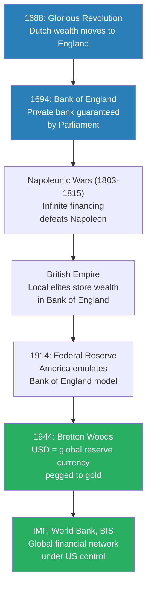
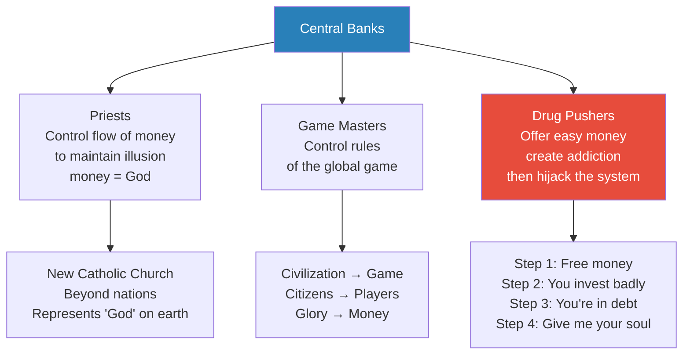
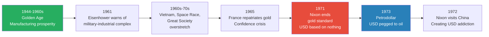
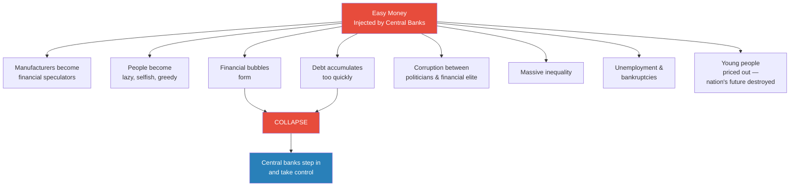
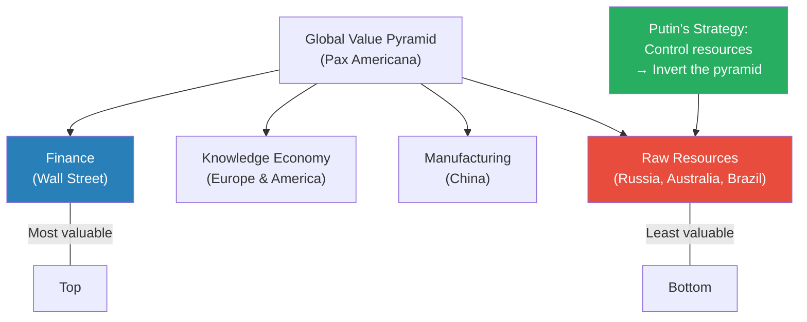
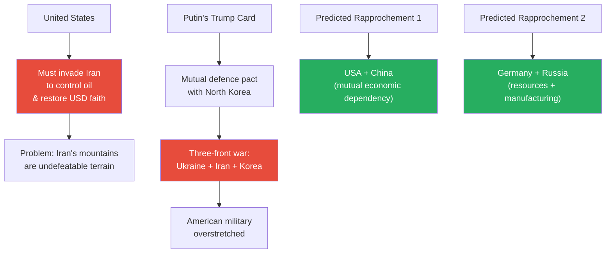
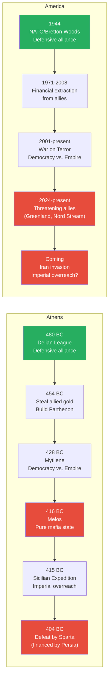
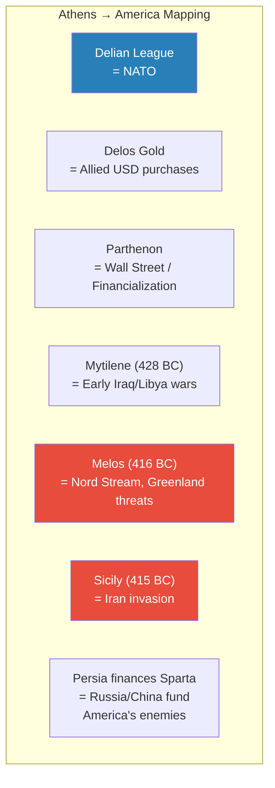

# The Decline and Fall of the American Empire

> In the grand finale of the Civilization series, Prof. Jiang traces the entire architecture of American imperial power — from the Bank of England in 1694 through Bretton Woods, the petrodollar, and financialization — to argue that the United States is not a civilization but a game: a financial system that enriches insiders while enslaving nations through debt addiction. He draws a devastating parallel between Athens's descent from democratic alliance to mafia state during the Peloponnesian War and America's current trajectory, concluding that the logic of empire now makes a catastrophic war with Iran all but inevitable. The lecture ends not with despair but with the series' final message: imagination and love are the only forces that can redeem humanity in its darkest hour.

---

## Overview: Key Highlights

- <b style="color: #2980b9">Bretton Woods System (1944)</b> — America made the US dollar the world's reserve currency, giving itself the "power of God" to turn paper into gold
- <b style="color: #27ae60">Central banks rule the world</b> — private institutions that coordinate across borders, feeding off nation states like parasites while controlling money supply, interest rates, and political systems
- <b style="color: #e74c3c">Easy money destroys nations</b> — Japan (1985 Plaza Accord), the Asian Financial Crisis (1997), and China (2008-2015) all followed the same playbook of debt addiction leading to economic collapse
- <b style="color: #2980b9">Exorbitant privilege</b> — the power to print the world's reserve currency is the foundation of American empire, not military strength
- <b style="color: #e74c3c">Nixon's 1971 default</b> — when the US dollar was unpegged from gold, its value became based on nothing but faith — and faith requires military intimidation
- <b style="color: #2980b9">The Petrodollar (1973)</b> — Saudi Arabia's agreement to price oil exclusively in US dollars replaced gold as the currency's anchor
- <b style="color: #27ae60">From civilization to game</b> — Pax Americana replaced citizens who sacrifice for glory with individual players trying to make as much money as possible
- <b style="color: #e74c3c">The military-industrial complex</b> — Eisenhower's 1961 warning proved prophetic: endless wars bankrupted America while enriching weapons manufacturers
- <b style="color: #2980b9">The Peloponnesian War parallel</b> — Athens's Delian League mirrors NATO; Athens's descent from democracy to mafia state mirrors America's current trajectory
- <b style="color: #27ae60">Putin's grand strategy</b> — by invading Ukraine and allying with North Korea, Putin proved America is a paper tiger and forced a three-front crisis
- <b style="color: #e74c3c">America must invade Iran</b> — controlling Middle East oil is the only way to maintain dollar hegemony and force Japan, China, and South Korea to keep buying US dollars
- <b style="color: #27ae60">Imagination and love</b> — the series' final message: in the darkest times, any individual can rise up and be the light to lead humanity forward

| Concept | One-line summary |
|---------|-----------------|
| **Exorbitant privilege** | The power to print the world's reserve currency — alchemy that turns paper into gold |
| **Central banking** | Private banks guaranteed by nation states that control money supply, interest rates, and political systems |
| **Bretton Woods** | The 1944 system that made the US dollar the global reserve currency, pegged to gold |
| **Petrodollar** | The 1973 Nixon-Saudi agreement tying USD value to oil instead of gold |
| **Financialization** | The shift from manufacturing real goods to gambling on financial instruments |
| **Easy money** | Free or cheap credit from central banks that creates bubbles, inequality, and eventual collapse |
| **Military-industrial complex** | The permanent war economy Eisenhower warned would hijack American democracy |
| **Pax Americana** | The post-WWII American-led global order based on free trade, consumerism, and dollar hegemony |
| **Civilization vs. Game** | Citizens who sacrifice for glory vs. individual players maximising personal wealth |
| **Delian League / NATO parallel** | Defensive alliances that became instruments of imperial extraction and coercion |
| **Putin's pyramid inversion** | The strategy of controlling resources (base of global value pyramid) to strangle the financial elite at the top |

---

# The Lecture

## The Architecture of Global Finance: From the Bank of England to Bretton Woods [0:00 - 9:47]

*Prof. Jiang opens the final lecture by tracing the origins of the entire global financial system — not from 1944, but from 1688, when Dutch Calvinist wealth crossed the English Channel. He argues that the Bretton Woods system, the Federal Reserve, and every central bank on Earth are descendants of a single innovation: a private bank guaranteed by Parliament.*

> [!tip] Core Insight
> The secret of both the British and American empires was never military power alone — it was a financial system that made local elites complicit in their own exploitation by giving them a safe place to store their corrupt earnings.

*The through-line from 1688 to 1944 is a single idea: private banks, guaranteed by the state, that offer infinite financing for wars and a safe harbour for elite wealth. Every subsequent innovation — the Fed, Bretton Woods, the IMF — is a variation on this theme.*

> [!note]- Expand: Full Lecture Detail
> Prof. Jiang opens the grand finale with a photograph: July 1944, the Bretton Woods Hotel in New Hampshire. Forty nations gathering to design the post-war peace. Everyone knows Nazi Germany and Japan will be defeated. The question is how to build peace and prosperity after such a devastating war.
>
> The American proposal: make the US dollar the global reserve currency. Everyone can use it to trade. The term Prof. Jiang introduces is <b style="color: #2980b9">exorbitant privilege</b> — "This is like the power of God, because you're basically taking paper and turning it to gold."
>
> The safeguard against abuse: America agrees to peg the dollar to gold. At any point, any nation can exchange US dollars for physical gold. America transports the world's gold to Fort Knox.
>
> Prof. Jiang then introduces the institutions that make the system work:
> - <b style="color: #2980b9">The Bank of International Settlements (BIS)</b> in Basel, Switzerland — "the central bank of central banks," facilitating risk mitigation across the global economy
> - <b style="color: #2980b9">The World Bank</b> in Washington, DC — issuing loans to developing nations like China
> - <b style="color: #2980b9">The IMF</b> (International Monetary Fund) — coordinating global financial policy
>
> But then he rewinds — where did this system really come from?
>
> He traces it to 1688 and William of Orange's Glorious Revolution. When William crossed from the Netherlands to England, he brought Dutch wealth with him. The Netherlands was the world's most prosperous nation thanks to the Dutch East India Company's monopoly on the spice trade. As Calvinists, the Dutch believed wealth was a religious obligation — proof of God's favour. But the Netherlands was at war with France and Spain. The money was not safe there.
>
> In 1694, this wealth became the foundation of the <b style="color: #2980b9">Bank of England</b> — a private bank guaranteed by Parliament. Prof. Jiang explains why this was revolutionary:
> - Throughout history, kings borrowed from wealthy citizens to finance wars
> - <b style="color: #e74c3c">The problem: kings might refuse to repay, or die in battle</b> — lending to a monarch was always high-risk
> - The Bank of England solved this by making lenders creditors of the nation, not the king
> - "Maybe they won't pay you back today, but they'll have to pay you back sooner or later — because it's guaranteed by Parliament"
>
> This system gave England <b style="color: #27ae60">infinite financing</b>. Napoleon was a military genius who conquered most of Europe and defeated England many times. But because of the Bank of England, "the English have infinite financing. So the British are always financing wars against Napoleon until he is finally defeated."
>
> After 1815, the Bank of England became an imperial instrument. Before, conquerors always feared rebellion from local elites. The Bank solved this:
> - Local elites could deposit their corrupt earnings in the Bank of England
> - This gave them an incentive to maintain British rule
> - <b style="color: #27ae60">"That's how Britain was able to build the world's first truly global empire, and able to maintain such harmony and stability"</b>
>
> Prof. Jiang summarises the chain:
> 1. Dutch Calvinists have a religious obsession with storing wealth
> 2. Parliament guarantees this wealth, giving England infinite war financing
> 3. Infinite financing defeats Napoleon
> 4. The Bank stores corrupt local elite wealth, ensuring imperial stability
>
> In 1914, America emulated this model with the <b style="color: #2980b9">Federal Reserve</b> — private banks that convinced Congress to give them the power to print money by issuing loans. After World War Two, America exported this system globally by creating independent central banks in each nation.
>
> Prof. Jiang delivers a key insight: "Nation states compete against each other, but independent central banks in all these nation states work together, because that way it's easier for them to generate wealth for their investors."
>
> He is blunt about the implication: <b style="color: #e74c3c">"Private central banks coordinate rather than compete. They are parasites that feed off the nation state."</b>

---

## Central Bankers as Priests, Game Masters, and Drug Pushers [9:47 - 18:42]

*Prof. Jiang introduces Carroll Quigley's description of the global financial system, then offers three metaphors for understanding central bankers — priests maintaining the illusion that money is God, game masters controlling the rules, and drug pushers creating addiction through easy money. He uses a vivid thought experiment to show exactly how the debt trap works.*

*The three metaphors are not contradictory — they describe the same system at different scales. At the macro level, central banks are a new religion. At the system level, they set the rules. At the individual level, they create addiction.*

> [!note]- Expand: Full Lecture Detail
> Prof. Jiang introduces <b style="color: #2980b9">Carroll Quigley</b>, a Georgetown professor who was Bill Clinton's favourite teacher. His book *Tragedy and Hope* explains how the financial system works. Prof. Jiang reads a key passage from the 1920s:
>
> > [!quote] Carroll Quigley
> > "The powers of financial capitalism had another far-reaching aim, nothing less than to create a world system of financial control in private hands, able to dominate the political system of each country and the economy of the world as a whole."
>
> The system was to be controlled "in a feudalist fashion by the central banks of the world acting in concert, by secret agreements arrived at in frequent private meetings." The apex: the Bank of International Settlements in Basel — "a private bank owned and controlled by the world's central banks, which were themselves private corporations."
>
> Prof. Jiang explains how central banks operate:
> - They control the <b style="color: #2980b9">money supply</b> — "money is just a concept, something we made up"
> - They control scarcity to create the illusion of value
> - They control <b style="color: #2980b9">interest rates</b> — the cost of borrowing money
>   - Lower rates = cheaper to borrow = people spend more
>   - Higher rates = more expensive = people spend less
>
> Then he offers three metaphors:
>
> **Metaphor 1 — Priests:** "Central bankers are the ultimate priests. They must control the flow of money to maintain the illusion that money is God. In this way, they are the new Catholic Church." Just as the medieval Church was the dominant power beyond nations, representing God on earth, central bankers occupy that position today.
>
> **Metaphor 2 — Game Masters:** "They must control the flow of money to motivate people to play the game." As Prof. Jiang discussed in [[52 - Empire of Democracy]], we live not in a civilization but in a game where all individual players are trying to make as much money as possible. Central bankers control the rules.
>
> **Metaphor 3 — Drug Pushers:** "To expand their dominance, they offer easy money, and once a country is addicted or bankrupt, they hijack the financial system."
>
> > [!example] The Easy Money Thought Experiment
> > - A central bank gives you $10,000 and asks for nothing in return
> > - You go to Hawaii, stay in a five-star hotel, enjoy yourself
> > - You come back and ask for more — the bank gives you $1 million, again for free
> > - This time you are smarter: you invest in restaurants, ski resorts, businesses
> > - But you do not really know what you are doing, and you make bad investments
> > - You are now $10 million in debt
> > - You go back to the bank — "Fine, but now you have to give me your soul"
> > **The lesson:** The central banking playbook is seduction through free money, followed by enslavement through debt. The generosity was never generosity — it was bait.
>
> Prof. Jiang notes that while no nation state can currently challenge central banks, technology companies are trying to displace them:
> - <b style="color: #2980b9">Bitcoin</b> — which he describes as "the American military's fail-safe system" in case the government defaults and the dollar loses reserve status
> - <b style="color: #2980b9">Artificial intelligence</b> — invested in because "it can trick people into believing it is God, that it is omniscient"
> - Social media, video games, and porn — "the drug of the 21st century," creating a matrix simulation
>
> He then shifts to the Cold War. After 1945, the world split between capitalist West and communist East. "We don't know which system is better for humanity, but we do know the elite prefer capitalism because capitalism gives them more power." In 1991, the Soviet Union "unconditionally surrenders," creating complete American dominance.
>
> Prof. Jiang introduces <b style="color: #2980b9">Karl Popper</b> and his book *The Open Society*, which argued that grand ideologies (communism, fascism) destroyed the world. Popper "hates Plato, hates Marx, hates Hegel" — the three "totalitarian philosophers." He proposed that Anglo-American civilization — practical, utilitarian, evolutionary — is the height of human achievement.

---

## The Pax Americana: From Prosperity to Debt Addiction [18:42 - 28:20]

*Prof. Jiang maps the transformation from post-war prosperity to imperial overreach — the golden age of the American middle class, Eisenhower's prophetic warning about the military-industrial complex, the Vietnam War's bankruptcy, Nixon's default on the gold standard, and the petrodollar deal that replaced gold with oil as the dollar's anchor.*

> [!tip] Core Insight
> The Pax Americana replaced civilization with a game. In a civilization, citizens sacrifice themselves for glory. In the game, individual players try to make as much money as possible — and the best way to make money is not hard work but monopoly.

*The timeline shows a steady deterioration: from genuine manufacturing prosperity to overstretch, then default, then increasingly desperate measures to prop up a currency that was no longer backed by anything real.*

> [!note]- Expand: Full Lecture Detail
> Prof. Jiang explains that the Pax Americana represents a fundamental shift from World War Two:
>
> | World War Two Era | Pax Americana |
> |-------------------|--------------|
> | Nation state as main body | International rules-based order (central banks, UN) |
> | Mercantilism (trade within sovereignty) | Global free trade |
> | Unit of will (collective sacrifice) | Consumerism (individual spending) |
> | Civilization (citizens sacrifice for glory) | Game (players maximise personal wealth) |
>
> He illustrates the golden age vividly: "If you were a white high school graduate male in America in the 1950s, 60s, 70s, you had the best life — you lived better than the nobility of Rome." A factory worker or clerk could own two cars, a house, send three kids to college, take annual European vacations, while his wife stayed home.
>
> But the system contained seeds of its own destruction. Germany and Japan, destroyed in WWII, were incentivised to rebuild — and their manufacturing quality surpassed America's. The US transitioned from <b style="color: #27ae60">creditor nation</b> (everyone owed it money) to <b style="color: #e74c3c">debtor nation</b> (its consumers bought more than they could afford from overseas). Only the reserve currency status made this possible.
>
> In 1961, Eisenhower delivered his farewell address warning about the <b style="color: #e74c3c">military-industrial complex</b>: "They employ millions of people. They manufacture weapons, and they're intent on war. They are our true enemy."
>
> > [!quote] Dwight Eisenhower (1961)
> > "The potential for the disastrous rise of misplaced power exists and will persist."
>
> This proved prophetic. America engaged in wars it could neither afford nor win:
> - The <b style="color: #e74c3c">Vietnam War</b> — 50,000 American soldiers dead, millions of Vietnamese civilians killed, "a pointless, brutal war that almost bankrupted America and almost caused civil war"
> - The Space Race — culminating in the 1969 moon landing
> - The <b style="color: #2980b9">Great Society</b> — Lyndon Johnson's social programmes (free healthcare for elderly, Head Start) — "fantastic but really, really expensive"
>
> France, under Charles de Gaulle, saw the contradiction clearly: America was fighting wars, going to the moon, AND building massive social programmes. Could it actually pay for all this? In the mid-1960s, France sent warships to America to repatriate its gold.
>
> This triggered a crisis. If every nation demanded gold for their dollars, America would go bankrupt. In 1971, Richard Nixon announced the dollar would no longer be convertible to gold: <b style="color: #e74c3c">"The US dollar is based on nothing. Its value is now based primarily on people's faith in its value."</b>
>
> Nixon then executed two brilliant manoeuvres:
> - **1973 — The Petrodollar:** An agreement with Saudi Arabia that all oil would be priced exclusively in US dollars, and Saudi savings would be invested in US Treasuries. This replaced gold with oil as the dollar's anchor.
> - **1972 — Opening China:** Nixon visited Mao Zedong. "The answer is very simple — he needed more consumers to buy US dollars. He needed to create a US dollar addiction."
>
> America gave China everything — factories, expertise, technology, even military secrets. "China didn't have to steal this technology because America gave it to China for free." The intention was always to create dependence: once China needed dollars, it would have to keep buying them.

---

## The Easy Money Playbook: Japan, Asia, and the 2008 Crisis [28:20 - 38:16]

*Prof. Jiang demonstrates how easy money destroys nations through three case studies — Japan's Plaza Accord bubble, the 1997 Asian Financial Crisis, and the 2008 Great Financial Crisis — showing the same pattern repeated each time: cheap credit, speculation, bubble, collapse, and central bank takeover.*

*Prof. Jiang's eight consequences of easy money form a diagnostic checklist — and every item applies to Japan in the 1980s, Southeast Asia in the 1990s, America in the 2000s, and China in the 2010s.*

> [!note]- Expand: Full Lecture Detail
> Prof. Jiang presents the case studies in sequence:
>
> > [!example] The Plaza Accord and Japan's Destruction (1985)
> > - By 1985, Japan was the world's second-largest economy — an export powerhouse with high savings
> > - Americans loved Japanese goods, but Japanese consumers did not buy American products, creating a trade imbalance
> > - America told Japan to restructure: "We will revalue the Japanese currency — appreciate it against the US dollar"
> > - Japanese economists thought this was terrible, but America had military bases in Japan — "Japan didn't have a choice"
> > - The appreciated yen flooded Japan with cheap money — speculation in real estate and stocks exploded
> > - By 1990, the Imperial grounds of Kyoto alone were worth more than the entire nation of Canada
> > - The bubble burst and destroyed the Japanese economy — decades of stagnation followed
> > - Japan's birth rate collapsed to approximately 1.0 — "Japanese young people do not see a future for themselves"
> > **The lesson:** If you want to destroy a nation's economy, give it easy money. The gift is the weapon.
>
> Prof. Jiang distils the mechanics: <b style="color: #e74c3c">"If I want to destroy you as a person, I'm going to give you a million dollars, because you're going to take that million dollars and do stupid things with it."</b>
>
> He lists eight consequences of easy money:
> 1. Manufacturers become financial speculators (why make cars when the stock market returns more?)
> 2. People become lazy, selfish, and greedy
> 3. Debt accumulates too quickly
> 4. Financial bubbles form
> 5. Corruption between politicians and financial elite
> 6. Massive inequality
> 7. Unemployment and bankruptcies
> 8. <b style="color: #e74c3c">Young people are priced out, destroying the nation's future</b>
>
> The same pattern played out in the <b style="color: #2980b9">1997 Asian Financial Crisis</b>. South Korea, Thailand, and Indonesia had access to easy money from central banks. When their currencies were attacked and devalued, they went bankrupt. The IMF stepped in and "prioritised the central banks" — the playbook completed.
>
> After the Berlin Wall fell in 1989 and the Soviet Union collapsed, the Pax Americana was uncontested. America shipped its manufacturing overseas and pivoted to <b style="color: #e74c3c">financialization</b> — "Wall Street would take all its money, all this wealth being generated overseas, and then take it back to America and use it to invest in America, to basically engage in financial games."
>
> The 2001 attacks and the War on Terror followed. America "for no particular reason, went to Iraq, Syria, Libya, and destroyed these countries." Prof. Jiang notes — without endorsing — the conspiracy theory that these countries were targeted because they lacked central banks.
>
> The <b style="color: #e74c3c">2008 Great Financial Crisis</b> was the inevitable result. Too much money flowing in, not enough good investments. Wall Street encouraged people with no money to buy multiple houses. When defaults cascaded, the global economy collapsed. America's solution: print more money.
>
> Prof. Jiang shows the numbers:
> - From 1776 to 1980: approximately $1 trillion in national debt
> - By 2000: $2 trillion
> - Today: $37 trillion
> - The stock market is worth twice the real economy — "America is living in a fantasy. It's a make-believe economy."

---

## China's Trap and Putin's Grand Strategy [38:16 - 47:53]

*Prof. Jiang argues that America deployed the same easy-money weapon against China that it used against Japan, then shows how Putin's invasion of Ukraine was not reckless aggression but a calculated strategy to invert the global value pyramid by controlling resources — and how this forces America toward a catastrophic war with Iran.*

> [!tip] Core Insight
> The greatest trick America played was convincing China it could be rich. Just as the Plaza Accord destroyed Japan by appreciating the yen, America encouraged China to print money after 2008 — creating conditions for China's economic collapse.

*In the Pax Americana, raw resources sit at the bottom and finance at the top. Putin's genius is recognising that if you control the food and oil everyone else depends on, you can flip the entire hierarchy.*

> [!note]- Expand: Full Lecture Detail
> Prof. Jiang reveals the staggering inequality the system has produced. Since Reagan in 1980, the wealth of the top 0.01% has shot up while average Americans have seen only their debt increase. "The system is designed to exploit the middle class by forcing it into debt so as to enrich the wealthiest investors."
>
> He then turns to China. After 2008, central banks encouraged China's central bank to start printing money. The infrastructure boom — the big buildings, fancy railways — required resources from Australia and Brazil, and "this is what saves the global economy." But behind the veneer:
> - Massive debt (someone has to pay it off — "you guys, or your grandchildren")
> - Massive inequality
> - Political corruption
>
> > [!quote] Prof. Jiang (paraphrasing Charles Baudelaire)
> > "The greatest trick America played was convincing China it could be rich."
>
> He draws the explicit parallel to Japan's Plaza Accord. Just as America encouraged Japan to inflate the yen, America encouraged China to print money from 2008 to 2015, "basically creating conditions for China's economic collapse."
>
> This explains the rise of Xi Jinping: "I believe his intentions are good. He wants to save China from this global financial capitalist system. He needs to maintain China's independence and sovereignty." Prof. Jiang compares the current situation to the Opium Wars — Britain created opium addiction to enslave China's economy, and America has created dollar addiction to do the same. "What's the Chinese dream? Work hard, get into a good school, get rich, move your money and your children to the United States. If that's the dream, then eventually the civilization won't last very long."
>
> He then turns to <b style="color: #27ae60">Vladimir Putin</b>, whom he compares to Stalin in his understanding of grand strategy. Putin recognised a fundamental weakness in the American system: the global value hierarchy places resources at the bottom and finance at the top. But <b style="color: #27ae60">"if I can control the world's resources — the oil, the food — then I can invert this pyramid."</b>
>
> > [!example] Putin's Ukraine Gambit
> > - Russia and Ukraine together control roughly one-third of the world's grain supply
> > - Without Russian food, Africa and the Middle East would starve
> > - By invading Ukraine, Putin demonstrated that America is a paper tiger
> > - Faith in the USD rests on the aura of American military invincibility
> > - If America cannot protect Ukraine, why should Saudi Arabia, Japan, or Germany keep buying dollars?
> > - This forces America to prove its military strength — which means it must invade Iran
> > **The lesson:** Putin did not invade Ukraine out of recklessness. He invaded to force America into an unwinnable confrontation that would expose the hollowness of dollar hegemony.
>
> Prof. Jiang explains the logic of the Iran war:
> - Saudi Arabia, Japan, and Germany buy US dollars because they fear American military invasion if they stop
> - Putin showed the American military is weaker than believed
> - <b style="color: #e74c3c">America must now demonstrate military strength to restore faith in the dollar</b>
> - Iran controls the strategic centre of Middle East oil and global trade routes
> - If America controls Iran, it controls the oil supply to Japan (89% from the Middle East), China, and South Korea
> - Japan is the largest buyer of US dollars — controlling its oil supply controls its economy
>
> The Israel-Palestine conflict is the pretext: "Americans can't just go invade Iran for no reason. It needs a pretext. The perfect pretext is Israel comes into conflict with Iran."

---

## The Iran Problem and the New Geopolitics [47:53 - 57:53]

*Prof. Jiang explains why Iran cannot be defeated militarily, reveals Putin's trump card — the mutual defence pact with North Korea — and predicts two geopolitical surprises: a US-China rapprochement and a Germany-Russia rapprochement. He then connects the US-China trade war and Trump's third-term ambitions to the underlying logic of dollar hegemony.*

*Putin's genius is forcing America into a three-front war it cannot win. His alliance with North Korea is not about ideology — it is about creating a diversionary theatre that splits American military attention at exactly the moment America needs to concentrate everything on Iran.*

> [!note]- Expand: Full Lecture Detail
> Prof. Jiang shows a map of Iran surrounded by American military bases — 14,000 troops in Afghanistan, thousands more scattered around the region. "It seems to me that America has been preparing to invade Iran for the past 20 years. It's just looking for the perfect opportunity."
>
> But there is a critical problem: <b style="color: #e74c3c">geography</b>. "In 2003 America went to Iraq and destroyed Iraq. Why? Iraq's a desert. It's flat plains. America has bombs, fighter planes — it's pretty easy to destroy a desert. But Iran is all mountains. You can't bomb a mountain into submission." If America invades Iran, "there's very little chance that America would win this war. In fact, it may be the end of the American empire."
>
> Putin has prepared for this. His mutual defence pact with Kim Jong Un is strategic:
> - If America attacks Iran, Putin needs to throw America off balance
> - The ideal diversionary theatre is East Asia
> - China is too dependent on the American economy to invade Taiwan — "I do not believe this will happen"
> - <b style="color: #27ae60">Kim Jong Un menacing South Korea would create a three-front war: Ukraine, Iran, and Korea</b>
> - "That's the grand strategy of Putin. This is his trump card."
>
> Prof. Jiang then makes two predictions:
>
> **Prediction 1 — US-China rapprochement:** Despite the current trade war, "both economies are dependent on each other." The conflict will pass. China and Russia's friendship will not last — they share borders, compete for Central Asian influence, and have fundamental geopolitical conflicts.
>
> **Prediction 2 — Germany-Russia rapprochement:** With China moving toward America, Putin's natural partner becomes Germany (resources + manufacturing synergy).
>
> On Trump, Prof. Jiang is direct: "He wants a third term. Everything he's doing right now is because he wants to be king of the United States." The $37 trillion national debt cannot be repaid — "but the theory is, as long as you are the greatest military in the world, as long as you can go invade everyone, you don't have to pay this off."
>
> The trade war with China serves multiple purposes:
> - Trump needs to be on good terms with China before invading Iran
> - He needs China to open its financial system to American investors
> - He needs to create more US-China interdependency to prop up the dollar
>
> Prof. Jiang explains the leverage of Chinese students: "Why is it that your visas are being threatened? It's all part of the negotiation. There's no way America will shut off Chinese students because America needs that money." Without Chinese demand for US dollars, "the American economy will collapse."

---

## The Peloponnesian War Parallel: Athens's Descent from Democracy to Mafia State [57:53 - end]

*In the lecture's climactic section, Prof. Jiang draws a devastating historical parallel between Athens and America — showing how a democratic alliance leader became a mafia extortionist, how virtue collapsed under economic pressure, and how imperial overreach led to catastrophic defeat. He then maps every element onto the present day.*

> [!tip] Core Insight
> Athenians wanted the trappings of empire while also feeling virtuous. Over time, as Athens became poorer and more desperate, the virtue fell away and raw power expressed itself. America is following the same trajectory — and the war with Iran is its Sicilian Expedition.

*The parallel is structural, not merely decorative. Both Athens and America started as leaders of defensive alliances, both stole from their allies to finance domestic spending, both lost their democratic character under economic pressure, and both overreached into distant theatres they could not sustain.*

*Every element of the Athenian collapse has a modern American equivalent. Prof. Jiang has spent the entire series building toward this final mapping.*

> [!note]- Expand: Full Lecture Detail
> Prof. Jiang pivots to Thucydides and the *History of the Peloponnesian War*, which the class discussed in a previous semester. He sets the scene:
>
> In 480 BC, Athens and Sparta fought together against Persia. After victory at the Battle of Salamis, Athens created the <b style="color: #2980b9">Delian League</b> — a defensive alliance like NATO. The other Greek islands contributed gold, stored on the island of Delos, as a mutual defence fund against Persian return.
>
> "This worked out well, until the Athenians stole the money." They built the Parthenon — "one of the most beautiful buildings in the world" — with a pure gold statue of Athena inside. The wealthy enriched themselves during construction. "It's easy money — and remember, easy money destroys a society."
>
> Athens then forced its allies to continue paying tribute. It became a protection racket: "If you don't give us money, we'll come invade you."
>
> Prof. Jiang walks through three critical incidents:
>
> > [!example] Mytilene — The Conscience of Athens (428 BC)
> > - Mytilene, an island ally, refused to pay tribute
> > - Athens invaded and conquered it
> > - One faction demanded: kill all the men, enslave the women and children
> > - They voted yes and sent a warship with the order
> > - But that night, many Athenians could not sleep — "This is wrong. We're Athenians. We're a democracy. We fight for freedom."
> > - The next morning they held another debate, reversed the decision, and sent a second ship racing to catch the first
> > - At the very last minute, the second ship arrived and stopped the massacre
> > **The lesson:** At Mytilene, Athens still had a conscience. The tension between democracy and empire was real and painful.
>
> > [!example] Melos — The Death of Athenian Virtue (416 BC)
> > - Twelve years later, Athens was losing the war and running out of money
> > - They had melted down the golden statue of Athena to pay for the war
> > - They invaded Melos — a neutral island, allied with neither side
> > - The Melians protested: "We're neutral. Respect our neutrality."
> > - The Athenian response: "Right, as the world goes, is only in question between equals in power, while the strong do what they can and the weak suffer what they must."
> > **The lesson:** In twelve years, Athens went from agonising over killing rebels to casually crushing neutrals. Poverty killed virtue.
>
> > [!example] The Sicilian Expedition — Athens's Fatal Overreach (415 BC)
> > - Alcibiades — "basically the Trump of Athens" — convinced the Athenians to invade Sicily for its wealth
> > - Sicily was far away; the expedition was poorly planned with no resupply strategy
> > - The Athenian army was destroyed at Syracuse
> > - The disaster turned the war in Sparta's favour
> > - Persia — Athens's original enemy — financed Sparta, and together they laid siege to Athens and won
> > **The lesson:** When an empire overreaches into a distant theatre it cannot sustain, it creates the opening for its own destruction.
>
> Prof. Jiang now maps every element to the present:
>
> - <b style="color: #2980b9">NATO = Delian League</b> — a defensive alliance being weaponised for extraction
> - The Nord Stream pipeline destruction — "The Americans are attacking their own allies"
> - Trump threatening to take Greenland and Canada — "he's like a mafia godfather"
> - Forcing Europe to rearm — <b style="color: #e74c3c">"This is not really about fighting the Russians. It's about getting their allies to buy expensive and crappy American weapons. It's really a shakedown."</b>
> - Global protests against Gaza — "ultimately, it won't matter. America's an empire. It's a mafia state."
>
> He delivers the trajectory: "Americans want the trappings of empire. They also want to feel virtuous. Over time, as America becomes poorer and more desperate, this virtue will go away, and the raw, brutal power of America will express itself throughout the world."
>
> The final conflict — war between Iran and the United States — "is World War Three. I cannot overstate how brutal this conflict will be. It will lead to fundamental changes in the world. Our lives will never be the same again."

---

## The Series' Final Message [end]

*Prof. Jiang closes the 60-lecture series not with despair but with the message that has run through the entire course — from Homer to Dante to Kant: imagination and love are the animating and unifying forces of the universe.*

> [!note]- Expand: Full Lecture Detail
> Prof. Jiang acknowledges the darkness: "I know that this class has been depressing. You've been with me for a year now. We've gone into the heart of darkness of humanity, and the world looks more and more terrible."
>
> But he offers the series' final message — the thread connecting Homer, Dante, and Kant:
>
> <b style="color: #27ae60">"The imagination is the animating force of the universe. Love is the unifying force of the universe."</b>
>
> "In the darkest times, when all hope has been lost, when there's only despair, any of us — you, me, anyone — can rise up, stand up, and be the light to lead humanity forward."
>
> "We all have the capacity to imagine. We all have the capacity to love. That's what makes us human. In the worst times, we must defend our own humanity."

---

## Connections

**Builds on:** [[58 - Birth of the Nation-State]] (the Pax Americana's contradictions), [[52 - Empire of Democracy]] (America as game not civilization), [[08 - Rat Utopia and the Peloponnesian War]] (elite overproduction, Peloponnesian War), [[50 - Rule, Britannia!]] (Bank of England, British imperial finance), [[42 - The Protestant Reformation and the Birth of Capitalism]] (Calvinist wealth obsession), [[49 - The Dutch Golden Age and the Rise of the Middle Class]] (Dutch Calvinist wealth, VOC)
**Completes the arc from:** [[06 - Elite Overproduction and the Bronze Age Collapse]] (elite overproduction as universal mechanism of collapse), [[31 - The Oceanic Currents of History]] (financialism as boundary condition for civilisational death)
**Related books in vault:** [[Sapiens - Yuval Noah Harari]] (money as shared fiction), [[The Prince - Niccolo Machiavelli]] (power politics), [[The 48 Laws of Power - Robert Greene]] (empire and strategy)
**Series finale:** This lecture completes the 60-lecture journey from [[01 - Explaining Humanity's Transition to Agriculture]] to the present day — from Gobekli Tepe to the decline of American hegemony.

---

## The Takeaway

This final lecture reveals that Prof. Jiang has been building toward this argument for the entire series. The Bank of England, the Federal Reserve, Bretton Woods, the petrodollar — these are not footnotes in financial history. They are the latest incarnation of the same force that has driven every civilization in the course: the elite's need to extract wealth from the population while maintaining the illusion of legitimacy. The Catholic Church did it through theology. Central banks do it through monetary policy. The mechanism is identical.

The Peloponnesian War parallel is the lecture's most devastating contribution. It transforms the current geopolitical situation from a confusing tangle of trade wars, military threats, and diplomatic posturing into a recognisable pattern with a known ending. Athens was not destroyed by Sparta. Athens was destroyed by its own transformation from democratic alliance leader to mafia extortionist — a transformation driven by debt, overreach, and the loss of virtue under economic pressure. If the pattern holds, America's Sicilian Expedition is the coming war with Iran: a distant campaign against mountainous terrain, poorly planned, that will unite the world against it.

The most counterintuitive insight is Prof. Jiang's claim that the US-China trade war is temporary theatre, and that the real geopolitical realignment will be US-China rapprochement paired with Germany-Russia rapprochement. If correct, this inverts the conventional wisdom of permanent US-China rivalry. But the series' ultimate message is not geopolitical prophecy — it is the same message Prof. Jiang has traced from Homer through Dante through Kant: that imagination and love, not power and wealth, are what makes civilization worth having. After sixty lectures cataloguing humanity's darkest impulses, he ends by insisting that any single person can choose to be the light. The question the series leaves open is whether enough people will make that choice before the pattern completes itself.
