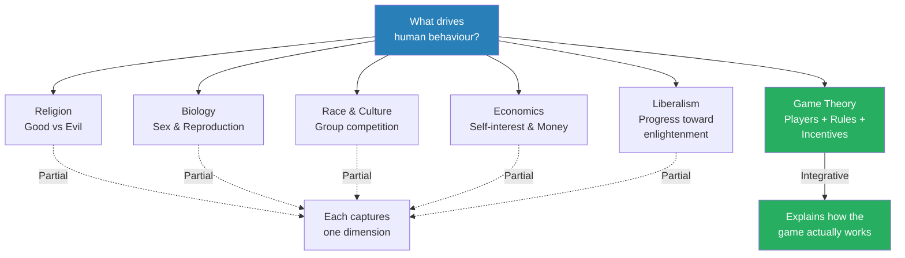
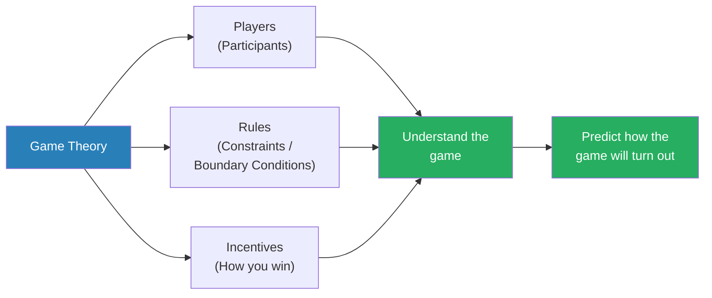
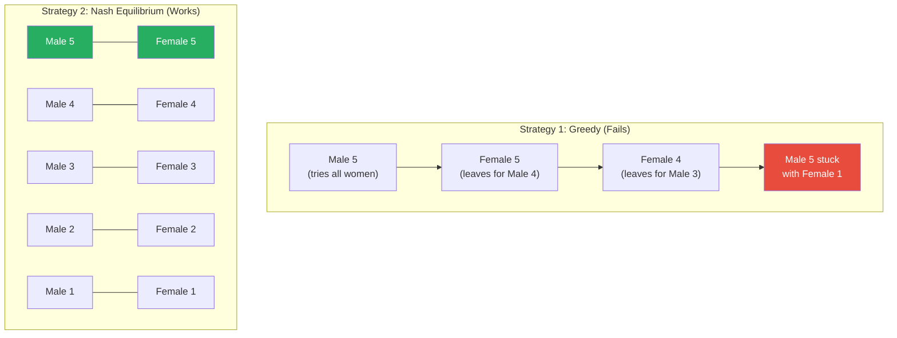
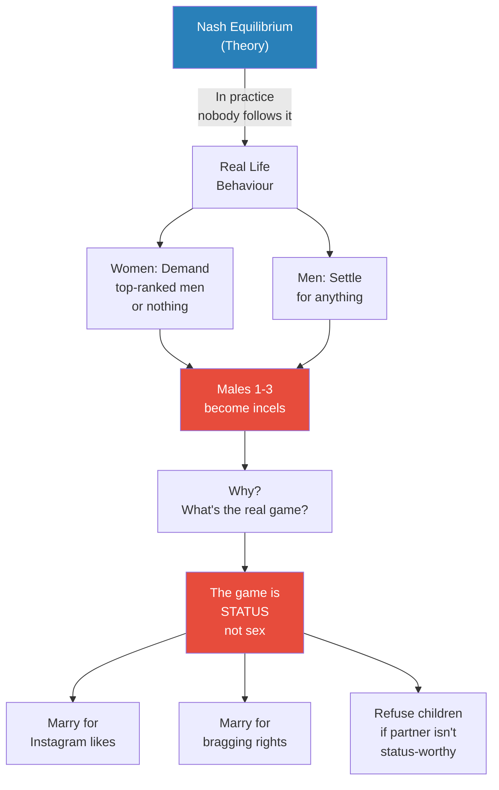
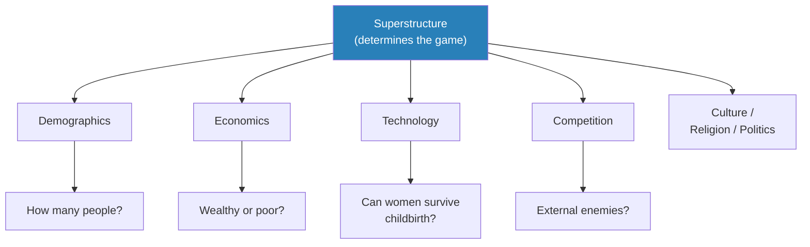
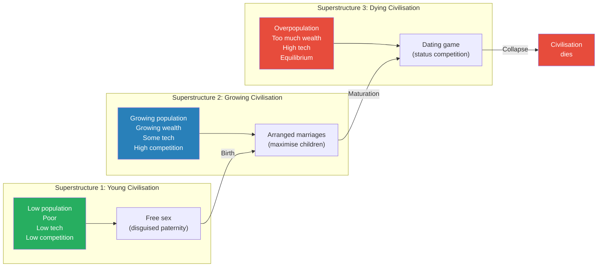
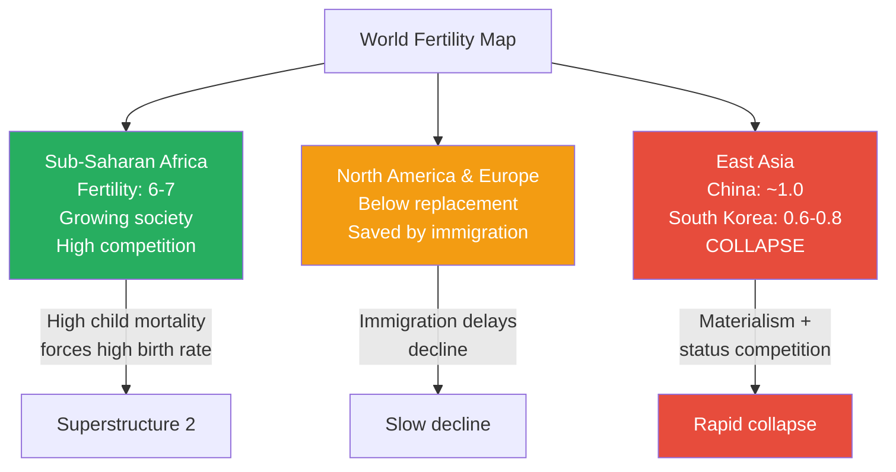
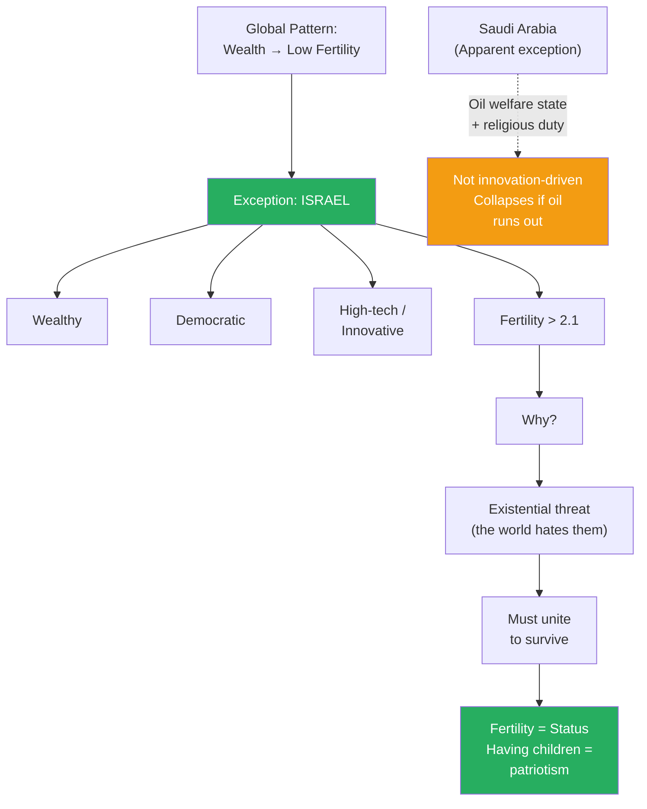

# The Dating Game

> Prof. Jiang opens his Game Theory series by asking what drives human behaviour. He introduces game theory as a framework with three components — players, rules, and incentives — then demonstrates its power through the dating game: a thought experiment in which five men and five women try to pair off. In theory, they should follow Nash equilibrium and match rank-for-rank. In practice, all women chase the top-ranked men while the rest opt out of life. The reason is that the real game is not about sex or procreation — it is about status. Prof. Jiang then shows how the superstructure of society (demographics, wealth, technology, competition) determines which dating game a civilisation plays, and why wealthy, high-technology societies are on a path to demographic collapse. The lecture ends with a striking prediction: Israel, not China or America, is the society best positioned for the next fifty years — because it is the only wealthy nation where educated women choose to have children.

---

## Overview: Key Highlights

- <b style="color: #27ae60">Game theory has three components: players, rules, and incentives</b> — understand all three and you can predict how any game will turn out
- <b style="color: #2980b9">Nash equilibrium</b> — the theoretical state where all players maximise their outcomes by cooperating (five matches five, four matches four)
- <b style="color: #e74c3c">Nobody follows Nash equilibrium in real life</b> — people are "suicidal," chasing status rather than rational pairing
- <b style="color: #27ae60">The real game is status, not sex</b> — people marry for Instagram likes and bragging rights, not procreation
- <b style="color: #2980b9">Superstructure</b> — the big-picture conditions (demographics, economics, technology, competition) that determine the nature of the game
- <b style="color: #e74c3c">Wealthy societies collapse demographically</b> — when women have choice and the game is status, fertility rates plummet below replacement
- <b style="color: #2980b9">Three superstructures, three dating games</b> — low-population societies have free sex for social cohesion, growing societies have arranged marriages, overpopulated societies have the dating game
- <b style="color: #e74c3c">South Korea is the worst-case scenario</b> — fertility rate of 0.6-0.8, projected zombie society by 2060, possible state collapse by 2040
- <b style="color: #27ae60">Israel is the only wealthy nation with above-replacement fertility</b> — because existential threat makes childbearing a form of patriotism
- <b style="color: #2980b9">Involuntary celibates (incels)</b> — men ranked 1-3 who have given up on life because the status game excludes them
- <b style="color: #e74c3c">The fertility crisis is the best predictor of civilisational collapse</b> — Rome, historical empires, and modern East Asia all follow the same pattern
- <b style="color: #27ae60">Game theory does not give answers — it gives you the right questions</b> — a framework for analysis and prediction, not a formula

| Concept | One-line summary |
|---------|-----------------|
| **Game theory** | A framework for understanding behaviour through players, rules, and incentives |
| **Nash equilibrium** | The optimal state where no player benefits from changing strategy unilaterally |
| **Status game** | The real incentive behind dating — social prestige, not reproduction |
| **Superstructure** | The macro conditions (demographics, wealth, technology, competition) that shape the game |
| **Replacement rate (2.1)** | The fertility rate needed to maintain a stable population |
| **Involuntary celibates (incels)** | Men at the bottom of the status hierarchy who opt out of competition entirely |
| **Arranged marriage** | The dating strategy of growing societies — maximise children, ignore individual preference |
| **Disguised paternity** | The strategy of low-population societies — women sleep with multiple men so all protect the child |
| **Welfare state model** | Saudi Arabia's outlier strategy — oil wealth funds childbearing, masking underlying structural weakness |
| **Demographic zombie society** | A population structure with mostly retirees and almost no children — economically and militarily dead |
| **Civilisation life cycle** | Birth → maturation → collapse — all civilisations follow this arc, and fertility decline signals the final stage |

---

# The Lecture

## Five Theories of Human Behaviour [0:00 - 4:30]

*Prof. Jiang opens the semester by surveying five existing theories of what drives human civilisation — religion, biology, race, economics, and liberalism — and explains why none of them is sufficient. He then introduces game theory as a sixth and superior framework.*

*Five traditional theories each capture one dimension of behaviour. Game theory, Prof. Jiang argues, subsumes them all by focusing on the structure of the game itself.*

> [!note]- Expand: Full Lecture Detail
> Prof. Jiang begins the semester with a question: "How do societies behave? Why do we do what we do? What motivates us, what drives us?" He walks through five theories that have attempted to answer this:
>
> - <b style="color: #2980b9">Religion</b> — the idea that we are driven by a war between good and evil, between Satan and God. Religion exists to show us the path toward goodness
> - <b style="color: #2980b9">Biology</b> — the idea that the point of existence is to pass on our genes. He is blunt about the implications: "As a man, you have a penis, and all you have to do is stick your penis into a woman and you're good." Men's strategy is to mate with as many women as possible. Women's strategy is to be cautious — childbirth takes nine months, is extraordinarily painful, and child-rearing takes sixteen to eighteen years. The asymmetry between male and female reproductive investment shapes everything
> - <b style="color: #2980b9">Race and culture</b> — the idea that the world is a struggle between different races and cultures for dominance, each with their own characteristics. Prof. Jiang presents this without endorsing it: "I'm not saying it's correct. I'm just saying it's a theory that people believe"
> - <b style="color: #2980b9">Economics</b> — the idea that we are driven by self-interest and money. "We want to make as much money as possible, and that's what drives us"
> - <b style="color: #2980b9">Liberalism</b> — the Enlightenment idea that history is a progress toward rationality, truth, and justice. The inevitability of human development is toward paradise. "Maybe we go off track now and then, but inevitably we move towards God"
>
> Prof. Jiang tells the class these five are not exhaustive, but they show the diversity of ideas. He then announces his project for the semester: "What I will do this semester is present to you another theory, which I call game theory. And my argument to you is that game theory is the best way to understand how humans behave."

---

## What Is Game Theory? [4:30 - 7:00]

*Prof. Jiang defines game theory through its three components — players, rules, and incentives — and makes three promises about what learning it will do for his students: make them better people, help them understand the world, and give them predictive power.*

> [!tip] Core Insight
> Game theory reduces any situation to three questions: who are the players, what are the rules (constraints), and what are the incentives (how do you win)? Master all three and you can predict outcomes.

*The three pillars of game theory. If you know who is playing, what limits them, and what they are competing for, you can predict the outcome.*

> [!note]- Expand: Full Lecture Detail
> Prof. Jiang defines game theory simply: "There are three components to a game. Just three aspects to a game."
>
> - **Players** — the participants in the game
> - **Rules** — the constraints or boundary conditions. "In mathematics, we would call this the boundary conditions — the limits to the game"
> - **Incentives** — how you win, what you get from the game
>
> He then makes three promises about the benefits of learning game theory:
>
> 1. **You become a better person** — "The point of education, guys, it's not to get good grades or get in university or get a good job." Education makes you more thoughtful, more curious, more moral, and more imaginative. It allows you to make better decisions
> 2. **You understand the world** — the world "is kind of stupid." He cites Trump's military intervention in Venezuela — kidnapping a president, violating international law — as an example. "Our class is not meant to say this is stupid or this is wrong, because we all know it's stupid and wrong. We're trying to figure out why this happened and what this will lead to." The class will study Ukraine, Israel-Iran, South America, China-Japan, and US-China
> 3. **You gain predictive power** — "Once you understand the game, you will have predictive powers. You'll be able to understand how the world will develop." This gives you sovereignty over your own destiny
>
> He frames this as a lifelong pursuit: "This is a lifelong struggle to learn game theory. I'm a lot older than you are. I'm a lot more experienced than you. But I want to show you how to look at the world through game theory."

---

## The Dating Game — Nash Equilibrium [7:00 - 17:00]

*Prof. Jiang introduces the dating game: five men and five women ranked one through five on attractiveness (genes, wealth, status). He walks through the logic of Nash equilibrium — the optimal pairing strategy — and shows why individually maximising players inevitably get the worst outcome.*

> [!tip] Core Insight
> If every player tries to individually maximise their outcome, they all get screwed. The only rational strategy is cooperation — each person pairs with their equivalent. This is Nash equilibrium: the state where no player benefits from changing their strategy.

*The greedy strategy backfires: when Male 5 pursues all women, Female 5 defects to Male 4, triggering a cascade that leaves Male 5 with the worst option. Nash equilibrium — each rank pairs with its equivalent — is the only strategy that maximises outcomes for all.*

> [!note]- Expand: Full Lecture Detail
> Prof. Jiang sets up the game: "Let's imagine there are five boys and five girls and they want to get married." He ranks them from five (best) to one (worst) using three criteria:
>
> - <b style="color: #2980b9">Genes</b> — good looking, tall, healthy, will live a long time
> - <b style="color: #2980b9">Wealth</b> — you and your family have a lot of money
> - <b style="color: #2980b9">Status</b> — many friends, high-status job, powerful family
>
> He explains the biological strategies: according to evolutionary psychology, Male 5 should try to have sex with all five women — that maximises gene propagation. But Female 5 should try to secure only Male 5 — because childbearing costs are enormous. If all five women try to marry Male 5, "your society would collapse."
>
> He then walks through the rational (economic) analysis step by step:
>
> - Male 5 tries to sleep with all five women
> - All five women recognise he is playing them
> - Female 5 calculates: "There's not much difference between four and five. So I'll just go marry this guy"
> - Female 4 follows: "Five is probably making a good decision, so I'll just go marry number three"
> - The cascade continues until Male 5 is stuck with Female 1 — the worst possible outcome
> - The same cascade punishes any male who tries the greedy strategy
>
> The conclusion: "If they try to individually maximize their outcome, they all get screwed in the end." The only escape is cooperation:
>
> - Male 5 pairs with Female 5
> - Male 4 pairs with Female 4
> - Male 3 pairs with Female 3
> - Male 2 pairs with Female 2
> - Male 1 pairs with Female 1
>
> He emphasises that this same logic applies to any player, not just Male 5. If Male 4 tries the greedy approach — pursuing both Female 5 and Female 4 — the same cascade triggers. Female 5 defects, Female 4 defects, and Male 4 ends up alone or stuck with the lowest-ranked partner. The game punishes individual maximisation regardless of starting position.
>
> "The world now is perfect. Everyone has a husband and a wife, and they can now just have children." Prof. Jiang introduces the term: <b style="color: #2980b9">Nash equilibrium</b> — "just means that you always reach a state in which all the players maximize their outcome." The key property of Nash equilibrium is that no player benefits from unilaterally changing their strategy — if Male 3 tries to leave Female 3 for Female 4, Female 4 already has Male 4 and Male 3 ends up worse off.
>
> Then the pivot: "There's a problem with this, though. The problem is, in real life, no one does this. Nash equilibrium is just a theory we made up. But in real life, that's not what happens. What happens in real life is we choose to be suicidal."

---

## Why Real Life Breaks Nash Equilibrium [17:00 - 23:30]

*Prof. Jiang reveals the results of an experiment he ran with last year's class — asking students their minimum marriage requirements at age thirty. The boys' answers and the girls' answers diverge catastrophically, revealing that the real game is not about procreation but about status. This explains the incel phenomenon, the fertility crisis, and why societies choose self-destruction.*

*Nash equilibrium predicts rational cooperation. Real life produces incels, status competition, and demographic collapse — because the actual incentive is not reproduction but social prestige.*

> [!note]- Expand: Full Lecture Detail
> Prof. Jiang describes the experiment he ran with last year's class. He told the students: "Pretend you are now 30 years old. Your parents are pestering you to get married. You've been on the dating market for 10 years. There's really no one that you think is perfect for you. You've basically given up on love. What is the minimum requirement you need in order to agree to marry someone?"
>
> The results:
>
> - **Boys:** "As long as she likes me and as long as I can put my penis into her, I'm good. Guys are like, yeah, I'll settle for anything"
> - **Girls:** "If I don't love him, if I'm not even attracted to him, I need about a million dollars a month"
>
> He connects this to the real world: "Just look at these billionaires. Like Elon Musk — how many wives does he have? How many children does he have? All the women in the world, many, not all, but many just want to marry actors like Brad Pitt, billionaires like Elon Musk."
>
> Males ranked 1-3 become <b style="color: #2980b9">involuntary celibates (incels)</b>: "They watch Netflix, they watch porn, they play video games. They've given up on life. Life has given up on them." The entire competition collapses into a fight between Males 4 and 5 for all the women — "and this is suicidal. This will lead to the death of humanity."
>
> Prof. Jiang then asks the key analytical question: "Why are we suicidal?" He returns to the game theory framework:
>
> - Players — doing stupid things
> - Rules — known
> - Incentives — <b style="color: #27ae60">this is where the answer lies</b>
>
> "The answer is, because they're not interested in sex or procreation. What they're interested in is status." He elaborates:
>
> - "I don't want to marry someone to have children. I want to marry someone so I can take a picture of her and post it on Instagram, so I can get a lot of likes"
> - "I want to marry someone so I can walk over in the mall and all the guys are jealous"
> - "I want to marry someone who I can brag about"
>
> The women's logic is equally rational once you understand the game: "She may be the ugliest woman in the world, but she's still like, you know what, it's still my choice. If I'm gonna make the sacrifice, this guy better be good looking or this guy better be rich. Otherwise, why would I want to have kids?"
>
> <b style="color: #27ae60">The key insight: people ARE rational — but to understand why they're rational, you have to figure out what game they're actually playing.</b> They are not playing the reproduction game. They are playing the status game. And status is a zero-sum game — "money is infinite, but status power is a zero-sum game."
>
> The divergence between Nash equilibrium and real-world behaviour reveals the central lesson of game theory:
>
> > [!abstract] Nash Equilibrium vs Real Life
> >
> > | Dimension | Nash Equilibrium (Theory) | Real Life (Status Game) |
> > |-----------|---------------------------|------------------------|
> > | **Goal** | Maximise reproductive success | Maximise social status |
> > | **Male strategy** | Pair with equivalent rank | Chase the top or give up entirely |
> > | **Female strategy** | Pair with equivalent rank | Hold out for the best or refuse to settle |
> > | **Outcome** | Everyone paired, stable society | Top males monopolise, bottom males become incels |
> > | **Fertility** | Replacement rate maintained | Below replacement, declining |
> > | **Societal trajectory** | Stable | Collapse |
>
> Prof. Jiang does not condemn this behaviour as irrational. He insists it IS rational — once you understand the incentive. The analytical error people make is assuming the game is about reproduction. It is not. It is about status. And once you recognise that, the behaviour of every player makes perfect sense.

---

## Superstructure — How the Game Changes Over Time [23:30 - 33:00]

*Prof. Jiang introduces the concept of superstructure — the macro conditions that determine the nature of the dating game. He walks through three superstructures (low population, growing, overpopulation) and shows that each produces a different dating strategy. The dating game as we know it only exists in the third — and it is the one that kills civilisations.*

> [!tip] Core Insight
> The dating game is not universal or inevitable. It is the product of a specific superstructure: overpopulation, high technology, excess wealth, and equilibrium. When the superstructure changes, the game changes. Every civilisation that enters this superstructure follows the same trajectory toward collapse.

*Superstructure is the big picture that shapes which game gets played. It encompasses demographics, economics, technology, competition, culture, religion, and politics.*

*Three superstructures, three dating games. The progression from free sex to arranged marriages to the dating game maps directly onto the life cycle of civilisation — birth, maturation, collapse.*

> [!note]- Expand: Full Lecture Detail
> Prof. Jiang introduces <b style="color: #2980b9">superstructure</b>: "The superstructure is what determines the nature of the game." He defines it as the big picture — demographics, economics, culture, politics, religion — and walks through three examples:
>
> **Superstructure 1 — Young civilisation:**
> - Low population (20-200 people), poor, low technology, low competition
> - Low technology means women frequently die in childbirth, hygiene is unknown, germs are not understood
> - The dating strategy: <b style="color: #27ae60">no dating — just lots and lots of sex</b>
> - Why: "As a woman, the only way to ensure that your child survives is if all the men in the village want to protect and nurture the child. They will do that if they believe that the child could be theirs"
> - Women may have a husband but also sleep with other men to <b style="color: #2980b9">disguise paternity</b> — ensuring maximum male investment in every child
> - Purpose: social cohesion and child survival
>
> **Superstructure 2 — Growing civilisation:**
> - Growing population (10,000-20,000), growing wealth, some technology, high competition against other societies
> - The dating strategy: <b style="color: #27ae60">arranged marriages</b>
> - "Who cares who you marry. Just have lots and lots of kids." The society is competing against others and needs maximum population
> - "You marry who your parents tell you to marry. You marry your childhood best friend. Who cares?"
> - Purpose: population growth for survival in competition
>
> **Superstructure 3 — Dying civilisation (today):**
> - Overpopulation, too much wealth (but with inequality), high technology (every birth is safe, every child survives), equilibrium (competition exists but no existential wars)
> - The dating strategy: <b style="color: #e74c3c">the dating game</b>
> - "The odds of you attaining status is really, really low. And the only way that you can change your status is by marrying up"
> - The dating game is an opportunity to find someone better than your social demographic circumstances would suggest
> - High technology is critical here: it means that every woman who gives birth will not die, and every child born will survive. This eliminates the biological urgency that drove Superstructures 1 and 2
> - Equilibrium means that while competition between societies exists, it does not rise to existential warfare — there is no external threat forcing cooperation
> - The combination of surplus, safety, and peace allows individual status-seeking to replace collective survival as the dominant incentive
> - Result: decreasing fertility rate and eventual societal collapse
>
> Prof. Jiang addresses a natural objection: "Clearly this is wrong, because if we behave like this throughout human history, we wouldn't be here today." The answer is that the dating game is not eternal — it only appears in Superstructure 3. For most of human history, the game was different because the superstructure was different. "The game changes over time, according to the superstructure of society."
>
> Prof. Jiang draws the connection to the civilisation life cycle:
>
> - Superstructure 1 = birth of civilisation
> - Superstructure 2 = maturation and growth
> - Superstructure 3 = collapse
>
> "If you look at history, all civilisations go through this process of birth, maturation, and then collapse, and there's no way around it."
>
> He summarises the power of the framework: "Just by studying one aspect — if I just study this game, figure out who the players are, the rules and incentives, figure out what the superstructure of this civilisation is — then once I have these two, I can now figure out where it came from and where it's going."

---

## The Global Fertility Crisis [33:00 - 43:00]

*Prof. Jiang presents global fertility data to show that the dating game's consequences are not theoretical — they are already happening. Africa is still in Superstructure 2. North America and Europe are declining but sustained by immigration. East Asia is in free fall. South Korea is the worst-case scenario, with a projected zombie society by 2060.*

*Three regions, three trajectories. Africa's high fertility reflects Superstructure 2. The West delays decline through immigration. East Asia, with no immigration safety valve, faces the fastest collapse.*

> [!note]- Expand: Full Lecture Detail
> Prof. Jiang presents a world map colour-coded by fertility rate:
>
> - **Red (above replacement):** Sub-Saharan Africa — "dark red, like here in the middle of Africa, it's six to seven." Why? Because "Africa is in a situation where it's a growing society with middling tech, so a lot of people die, lots of competition. To survive, families have to give birth to a lot of kids. They have no choice in the matter"
> - **Below replacement:** North America, Europe, and East Asia — "the three wealthiest parts of the world. And guess what? The fertility rate is collapsing"
>
> He explains the divergence:
>
> - North America and Europe are "kind of okay" because of immigration — "even though their women are not having children, they can choose to import people for their labor force"
> - <b style="color: #e74c3c">East Asia is "really, really screwed"</b> — no immigration safety valve
>
> He gives the numbers for China:
>
> - Current fertility rate: about 1.0 (replacement is 2.1)
> - Trend: five years ago it was maybe 1.7, now it is 1.0 — "the trend is very, very negative"
> - By 2100, China's population will be about 600 million — "that's still a lot of people"
> - "But the problem is..." — he turns to South Korea
>
> <b style="color: #e74c3c">South Korea is the worst-case scenario:</b>
>
> - Fertility rate: between 0.6 and 0.8 — the lowest in the world
> - "They're probably gone in 50 years' time"
> - "It's so bad that when you go to South Korea, there are signs outside restaurants that say 'No dogs and no kids.' They think that kids are a problem"
>
> He shows the South Korean population pyramid projections:
>
> > [!example] South Korea's Demographic Collapse
> > - **2020:** Still a viable working-age population pyramid — not yet catastrophic
> > - **2040:** Massive dependent elderly population, shrinking working base — "Look at this. You have absolutely no kids, and then you have lots and lots of retirees"
> > - **2060:** Working population decreased by 50% — "Oh my God"
> > - **2080+:** A zombie society — "no one works, and everyone just walks around the park every day. The economy has collapsed"
> > - South Korea cannot fight a war because most of its adult population would be elderly
> > - If North Korea ever threatened South Korea past this point, "most of your adult population would be dead"
> > **The lesson:** Demographic collapse is not a slow decline — it is a cascading failure where economic weakness, military vulnerability, and social breakdown reinforce each other.
>
> Prof. Jiang explains why governments cannot solve this:
>
> - "We can pay you more money, like they do in South Korea. Guess what? It doesn't work because people don't want money. They want status"
> - <b style="color: #e74c3c">"Status is a zero-sum game. Money is infinite, but status power is a zero-sum game"</b>
> - "The moment you give women choice, they choose to improve their lives by marrying someone better"
> - The only solution governments are pursuing is importing immigrants — "and people don't like outsiders, people don't like immigrants, but they have no choice in the matter"
>
> He delivers the historical punchline: "If you look at history, the best indicator that a society is about to collapse is if the women who are wealthy and more educated refuse to have children. This is what happened to the Romans. This is what happened to many empires. This is what's happening around the world today."
>
> The distinction between money and status is critical to understanding why government interventions fail:
>
> - Money can be created — governments can print it, economies can grow it, individuals can earn more of it
> - Status is fixed-supply — for one person to gain status, another must lose it. There are only so many positions at the top
> - Cash incentives for childbearing fail because they address money, not status. A government subsidy does not make a woman's partner more impressive to her social circle
> - "Too many people competing for too few status positions" — this is the structural trap of Superstructure 3
>
> The South Korean predicament illustrates the trap perfectly: "South Korea is an extremely materialistic society, where the only way to get ahead is by making a lot of money. If you're a middle-class person in South Korea, it makes no sense for you to have three kids. It makes sense for you to have one kid and put all your resources into this one kid in the hopes that he passes the college examination, gets into a good university, and then gets a good job at Samsung, which is the only company in South Korea."
>
> The immigration solution creates its own problems: along with the fertility crisis comes the aging crisis, where the population grows older and older. Immigrants are needed to maintain the labour force, but "people don't like outsiders, people don't like immigrants." This tension — between demographic necessity and social resistance — is itself driving political disruption across the West.

---

## Israel — The Exception That Proves the Rule [37:00 - 43:00]

*Prof. Jiang presents a GDP-per-capita versus fertility-rate chart and identifies the one outlier: Israel. It is the only wealthy, high-technology, democratic society with above-replacement fertility. He argues this is because existential threat transforms the incentive structure — in Israel, having children IS status.*

*Israel breaks the global pattern because existential threat rewrites the incentive structure. Saudi Arabia appears similar but relies on oil welfare rather than genuine societal dynamism.*

> [!note]- Expand: Full Lecture Detail
> Prof. Jiang presents a scatter plot of GDP per capita (x-axis) versus fertility rate (y-axis):
>
> - Replacement rate of 2.1 is the critical line
> - The United States is below replacement but "doesn't really care because they can import immigrants"
> - Angola is above replacement but poor
> - <b style="color: #27ae60">Israel is the only country that is both wealthy and above replacement</b>
>
> "If you want to know who will rule the world in your time, just figure out in which society wealthy, educated women choose to have children. And then that society will rule the world." He acknowledges the objections: "I know Israel has 9 million people, and it's in the middle of a desert, and everyone hates Israel. I understand that. But if you just analyse how the game works — if you look at it objectively from a game theory perspective — you are forced to conclude that Israel right now has the major advantage over everyone else."
>
> He explains why Israel is different:
>
> - "Because the world hates them. Because they think they are different from everyone else, and they must unite together to survive"
> - <b style="color: #27ae60">"In Israel, fertility is status. If you are a woman and you give birth to a lot of kids, that means that you love Israel. It means you're a patriot"</b>
> - The combination of religion and existential threat transforms the incentive: having children is not a sacrifice of status but an expression of it
>
> He contrasts this with the West: "The Western world has given up on religion and embraced materialism. What is valued? It's how many Instagram followers you have, it's how many YouTube subscribers you have, it's how much money you have."
>
> **The Saudi Arabia question (Q&A):**
>
> A student asks about Saudi Arabia, which also has high GDP and high fertility. Prof. Jiang answers:
>
> > [!example] Saudi Arabia — The Oil-Funded Outlier
> > - Saudi Arabia funds a welfare state from oil revenues — free schooling, free healthcare, free housing, and guaranteed jobs
> > - It is also a Muslim country with a religious imperative to have many children
> > - But the underlying structure is weak: "It's not really a moral society in which people are well educated and contributing to the economy"
> > - Saudi Arabia lacks the fundamentals that make a society strong long-term: democracy, innovation, openness, technology, social mobility
> > - "What happens if it runs out of oil?"
> > **The lesson:** A welfare state can temporarily mask structural weakness, but without innovation and genuine human capital development, it is building on sand.
>
> Prof. Jiang closes with a crucial methodological point: "Game theory doesn't give us the answers. Game theory just gives us a guide to ask questions and do research." It is an analytical framework, not a crystal ball.

---

## Connections

**Builds on:** This is Lecture 1 — the foundational lecture of the entire Game Theory series. It introduces the three-part framework (players, rules, incentives) and the concept of superstructure that will be applied to every subsequent topic. The dating game is chosen deliberately as the opening example because it is immediately relatable and demonstrates how game theory reveals hidden incentive structures.

**Sets up:** [[02 - Why Schools Suck]] applies the same framework to education — another institution where the stated purpose (learning) diverges from the actual game being played (status signalling). The fertility crisis and civilisational collapse themes introduced here will recur throughout the series, particularly in [[05 - The World Game]], [[07 - America's Game]], and [[16 - Pax Judaica Rising]].

**Recurring themes established:**
- Game theory as universal analytical framework — players, rules, incentives
- The gap between stated incentives and actual incentives — what people say they want versus what they actually compete for
- Status as the hidden driver of behaviour — a zero-sum game that distorts rational cooperation
- Superstructure determines the game — macro conditions shape individual behaviour
- Civilisational life cycle — birth, maturation, collapse, with fertility as the key indicator
- Existential threat as a unifying force — societies under pressure cooperate; comfortable societies fragment

**Related books in vault:**
- [[Sapiens - Yuval Noah Harari]] — Harari's analysis of the agricultural revolution as a "trap" resonates with Prof. Jiang's argument that the dating game is a trap civilisations fall into during their terminal phase. Both argue that what looks like progress (farming/romantic choice) can be a catastrophic trade-off
- [[The 48 Laws of Power - Robert Greene]] — status games, zero-sum competition, and the gap between appearances and reality are central themes in Greene's work. Law 10 (avoid the unhappy and unlucky) maps onto the incel phenomenon Prof. Jiang describes

---

## The Takeaway

This lecture accomplishes something remarkable in forty-five minutes: it takes a topic every student finds immediately engaging — dating and relationships — and uses it to introduce a complete analytical framework for understanding civilisation. The dating game is not really about dating. It is about the hidden incentive structures that drive societies toward self-destruction when the superstructure shifts from scarcity to abundance. The most counterintuitive insight is that choice itself — the hallmark of modern liberal society — is the mechanism of collapse. The moment women gain the freedom to choose, they optimise for status rather than reproduction, and the demographic clock starts ticking.

The most provocative claim is the Israel prediction. Prof. Jiang acknowledges every objection — tiny population, hostile geography, dependence on American support — and still arrives at the same conclusion through the game theory lens. What makes this compelling is not the specific prediction but the method: instead of asking who has the biggest military or the largest economy, he asks where the incentive structure still aligns with civilisational survival. That question produces a radically different answer than conventional geopolitical analysis.

The lecture leaves open a critical question: is there a way to change the game? Prof. Jiang shows that governments have tried — South Korea's cash incentives, immigration policies across the West — and all have failed because they target money when the game is about status. If status is truly zero-sum and fertility decline is the inevitable consequence of wealth and technology, then every civilisation is on a one-way path. Whether game theory offers an escape from this trap, or merely the clarity to see it coming, is a question the semester will have to answer.
