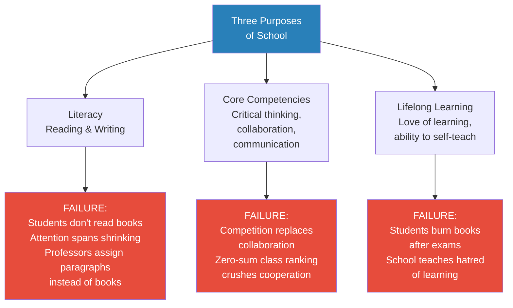
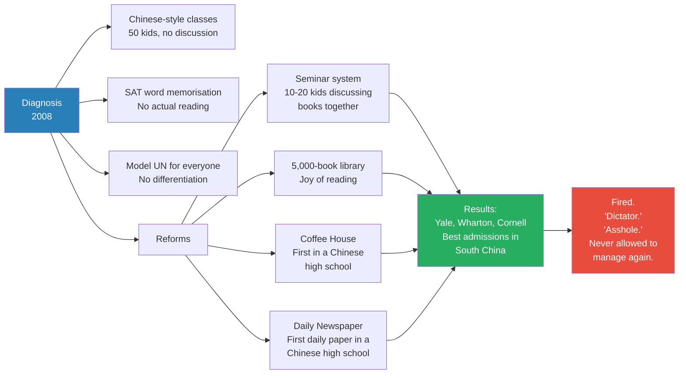
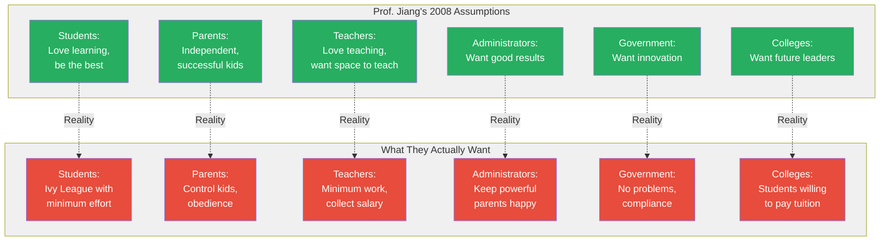
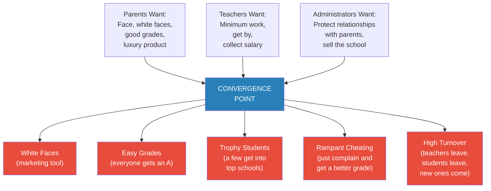
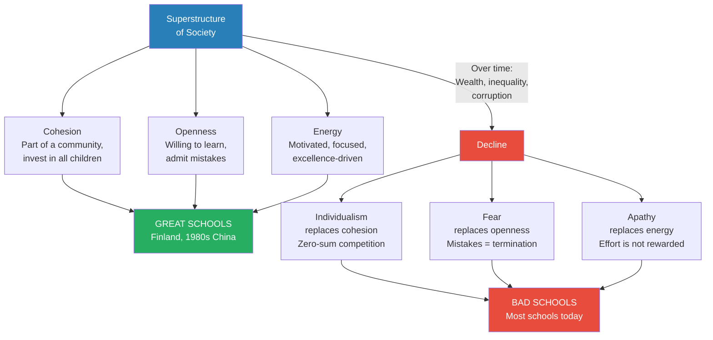
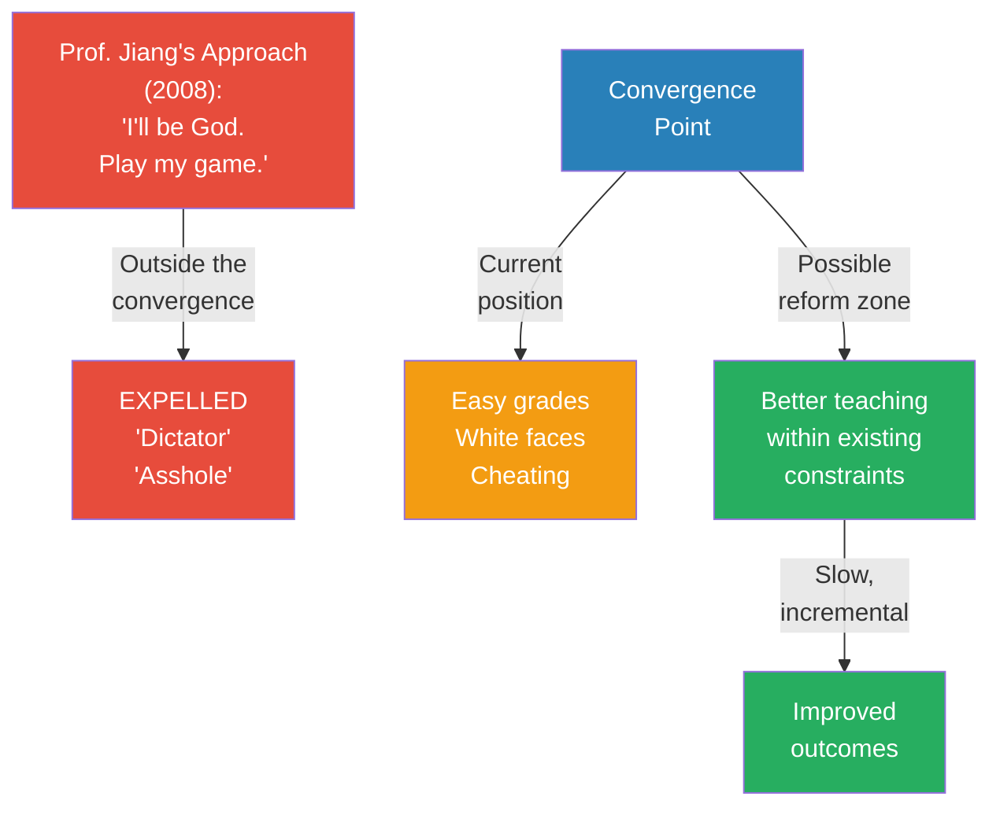
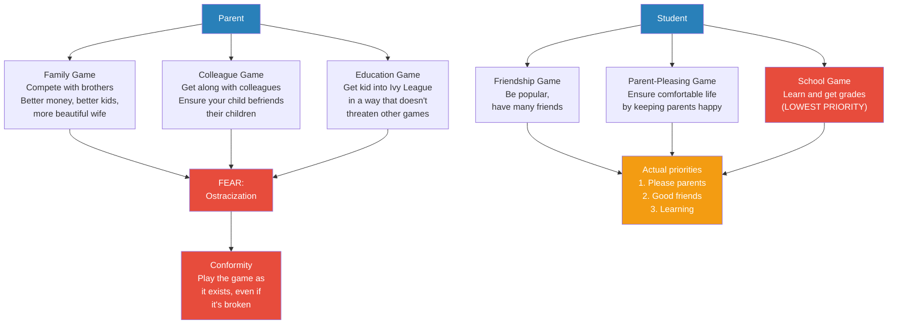

# Why Schools Suck

> Prof. Jiang applies the game theory framework from Lecture 1 to a question his students know intimately: why do most schools fail at their stated mission? Schools exist to build literacy, core competencies, and lifelong learning — yet most schools actively destroy all three. Rather than blaming bad teachers or lazy students, Prof. Jiang uses his own experience building China's first elite study-abroad program to show that schools are the product of converging player interests. When you map out what students, parents, teachers, administrators, government, and colleges actually want — not what they say they want — you discover that the resulting game produces easy grades, white faces, cheating, and high turnover. Reform is possible, but only within the convergence point of all stakeholders — step outside it, and they will call you a dictator and fire you.

---

## Overview: Key Highlights

- <b style="color: #27ae60">Schools are games constructed where player interests converge</b> — the curriculum, culture, and outcomes are not designed by anyone; they emerge from what stakeholders actually want
- <b style="color: #e74c3c">Most schools fail at all three of their purposes</b> — literacy, core competencies, and lifelong learning are undermined, not developed
- <b style="color: #2980b9">Convergence point</b> — the zone where different players' interests overlap, which determines the rules and incentives of the game
- <b style="color: #27ae60">Everyone wants the best results with the least work possible</b> — the master principle of game theory applied to education: players are lazy and greedy
- <b style="color: #e74c3c">Successful reform gets you fired</b> — Prof. Jiang built China's best study-abroad program and was labeled a "dictator" and an "asshole" because he insisted on fairness
- <b style="color: #2980b9">Stakeholder power ranking</b> — not all players are equal; parents and teachers matter most, students and government matter least
- <b style="color: #27ae60">Reform must stay within the convergence point</b> — you can move players from one part of the overlap to another, but you cannot create a new game from scratch
- <b style="color: #e74c3c">China's book-burning ceremony captures the failure</b> — students rip pages from textbooks after the national exam, signalling that school taught them to hate learning
- <b style="color: #2980b9">Nested games</b> — every player is simultaneously playing multiple games (family, colleagues, friends), and those games shape how they behave in the education game
- <b style="color: #e74c3c">Ostracization is the ultimate fear</b> — players conform to the game not because they believe in it but because deviating risks being expelled from the group entirely
- <b style="color: #2980b9">Superstructure determines motivations</b> — the macro conditions of society (wealth, inequality, corruption) explain why schools in the 1980s worked and schools today don't
- <b style="color: #27ae60">Three societal metrics predict school quality: cohesion, openness, and energy</b> — when all three are high (like 1980s China or modern Finland), schools thrive; when they decline, schools decay

| Concept | One-line summary |
|---------|-----------------|
| **Convergence point** | The overlap zone where all stakeholders' interests meet — this defines the game |
| **Stakeholder power ranking** | Not all players are equal — parents and teachers have far more power than students or government |
| **Nested games** | Every player is simultaneously playing multiple games across different identities (family, work, social) |
| **Ostracization** | Being expelled from the group — the deepest fear that keeps players conforming to the game |
| **Superstructure** | The macro conditions of society (demographics, wealth, corruption) that shape all players' motivations |
| **Cohesion** | Seeing yourself as part of a community whose success matters — declines as inequality rises |
| **Openness** | Willingness to admit mistakes and improve — killed by fear of punishment |
| **Energy** | Motivation and drive to do excellent work — collapses when effort is no longer rewarded |
| **Three purposes of school** | Literacy, core competencies (critical thinking, collaboration, communication), and lifelong learning |
| **White faces** | Prof. Jiang's term for the primary marketing tool of international schools — appearance over substance |
| **Face** | The real motivation behind parents' education decisions — bragging rights, not genuine learning |
| **Slow incremental reform** | The only viable strategy — moving stakeholders within the convergence point, not imposing a new game |

---

# The Lecture

## The Three Purposes of School — and How Schools Fail All Three [0:00 - 3:30]

*Prof. Jiang opens with a straightforward claim: school has three stated purposes — literacy, core competencies, and lifelong learning. Then he shows how most schools not only fail to deliver on these purposes but actively produce the opposite outcomes.*

> [!tip] Core Insight
> Schools do not merely fail to teach — they actively teach students to hate learning. The book-burning ceremony after China's national examination is the clearest symbol: eighteen years of schooling produces people who never want to read again.

*Every stated purpose of school is inverted by how schools actually operate. The gap between mission and reality is the puzzle Prof. Jiang sets up for the rest of the lecture.*

> [!note]- Expand: Full Lecture Detail
> Prof. Jiang connects this lecture to the previous class on dating: "Last class, we discussed the example of the dating game, of why men and women are motivated to behave the way they do when they look for a mate. Today, I want to discuss the issue of school." He frames the first few lectures as training exercises — using examples from students' own lives to develop the game theory mindset before applying it to global events.
>
> He lays out the three purposes of school:
>
> - <b style="color: #2980b9">Literacy</b> — "reading and writing. This is the primary purpose of school, because in order to function in our society, you need to be able to absorb information and convey information"
> - <b style="color: #2980b9">Core competencies</b> — "skills that you need to be successful in life, including the ability to think critically, to cooperate with others, to collaborate, to communicate"
> - <b style="color: #2980b9">Lifelong learning</b> — "in the age of AI, in the age of globalisation, school is just a start of the learning process. Because every five years, the whole world changes. So you need to be in a constant state of learning"
>
> Then he pivots to the failure. "Most schools are pretty bad at these three things. In fact, you can make the argument that most schools not only do not teach you these skills, but they have the opposite effect."
>
> The evidence of failure in each area:
>
> - **Literacy collapse:** "In most schools, you're not required to read books. When you go to university, the professors are so shocked that you don't read books that instead, they make you read paragraphs or watch videos." Attention spans have decreased — "it's very hard for a professor to give you an hour lecture, people lose focus after about five minutes"
> - **Collaboration becomes competition:** "The collaboration in school — it's a competition where you believe that it's a zero-sum game, so for you to get ahead, you need to screw over your classmate. So class ranking is very important"
> - **Lifelong learning becomes lifelong hatred:** "School teaches you to hate school, and therefore teaches you to hate learning, especially in China." He describes the ceremony after the national examination at age eighteen: "You take your books, you rip out the pages, and you throw them in the sky to signal your liberation. And you're like, I never ever want to read a book again. I never ever want to take a test again."
>
> The question is now set: "Why is this the case?" And the method: "We're going to use game theory to analyse why."

---

## Prof. Jiang's Shenzhen Experiment [3:30 - 12:00]

*Prof. Jiang tells his personal story: arriving at Shenzhen Middle School in 2008, diagnosing the problems with the study-abroad program, implementing radical reforms (seminars, reading libraries, a coffee house, a daily newspaper), and achieving extraordinary results — only to be fired and banned from management forever. The story becomes the case study for the lecture's central argument about convergence.*

> [!tip] Core Insight
> You can build the best system in the world, but if you ignore the convergence point of stakeholder interests, they will destroy it and you. The word they used was not "reformer" or "visionary" — it was "dictator."

*The paradox of Prof. Jiang's reform: the results were the best in South China, but the process violated the convergence point. Success in outcomes did not compensate for disruption of the game.*

> [!note]- Expand: Full Lecture Detail
> Prof. Jiang sets the scene: "The year is 2008. I went to Yale College. I was an English major. I did very well in school. I was hired in 2008 to go to Shenzhen in South China and help Shenzhen Middle School build an international program to send kids abroad."
>
> He diagnoses three problems with the existing approach:
>
> - Students were taking regular Chinese classes — "all you do is sit in a room of 50 kids and you take tests, you don't communicate, you don't ask questions, you don't debate"
> - They were spending all their time memorising SAT word lists — "they were not reading, they were not writing, they were just memorising words"
> - Their main extracurricular was Model United Nations — "that's a good activity, but everyone was doing it. There was absolutely no differentiation"
>
> His goal was different from most administrators: "You might be able to get into a good American university, because these kids are very smart, but I wanted them to do well at the university and to do well in life."
>
> He describes four reforms:
>
> - **Seminar system:** "Rather than Chinese classes, I invited American teachers to come and teach seminars where 10-20 kids are in a room and they discuss books that they read together"
> - **Reading program:** "Rather than SAT word memorisation, I had them read books. I established a 5,000-book English library at the school"
> - **The Coffee House:** "The first coffee house in a Chinese high school. Students had to run a business. They had to work as waiters and provide good service to customers." A student asks if it's similar to their school's existing coffee shop — Prof. Jiang notes dryly: "2008, I was the first person to do anything. It's still there today."
> - **The Daily Newspaper:** "The first daily newspaper in China, in a high school, and probably even around the world. Students every day had to report, collect information, write articles, edit it and publish it. They worked until midnight, sometimes until 2am, and then at 7am they had to get up and deliver the newspaper to all the students"
>
> He also established cultural principles: <b style="color: #2980b9">transparency, innovation, and openness</b>. "Rather than set up a curriculum that was perfect, it would be a curriculum that would evolve over time. We would learn from mistakes together, we would admit these mistakes, and then we would correct them together."
>
> The results were extraordinary: "The students went to Yale, Wharton, Cornell. This program became the most famous program in South China. Our students had the best record of college admissions in South China."
>
> Then the twist:
>
> > [!example] The Shenzhen Experiment — Success and Exile (2008-2012)
> > - Prof. Jiang was hired in 2008 to build an international study-abroad program at Shenzhen Middle School
> > - He replaced Chinese-style lecture classes with Western-style seminars of 10-20 students
> > - He established a 5,000-book English library, a student-run coffee house, and a daily newspaper
> > - His guiding principles were transparency, innovation, and openness
> > - The results were the best college admissions record in South China — Yale, Wharton, Cornell
> > - He was fired. Teachers, parents, and students were happy to see him go
> > - He moved to another school and replicated the model for four years
> > - After that, no school ever allowed him to manage a program again
> > - The word everyone used was not "reformer" — it was "dictator" and "asshole"
> > - His crime: insisting on fairness regardless of who your parents were
> > **The lesson:** Achieving the best results does not protect you if you violate the convergence point of stakeholder interests. The game is not about outcomes — it is about who controls the rules.

---

## Stakeholder Analysis — Naive vs. Real Motivations [12:00 - 20:00]

*Prof. Jiang walks through every player in the education game — students, parents, teachers, administrators, government, and colleges — first showing what he naively assumed their motivations were in 2008, then revealing what they actually want. The gap between the two explains why his reforms failed despite succeeding.*

*The green column is what Prof. Jiang believed in 2008. The red column is reality. Every single assumption was wrong — not because the players are bad people, but because the master principle of game theory applies: everyone wants the best results with the least work possible.*

> [!note]- Expand: Full Lecture Detail
> Prof. Jiang identifies six players (stakeholders) in the education game: students, parents, teachers, administrators, government, and colleges. "If you want to understand game theory, you need to understand the motivations and interests of all the different players. That tells you why or how they will behave the way they do."
>
> **His naive assumptions in 2008:**
>
> - **Students** wanted to love learning, get into the Ivy League, and be the best possible person
> - **Parents** wanted successful, independent kids and face
> - **Teachers** wanted to do a good job, loved teaching and students, and just wanted space and opportunity
> - **Administrators** wanted good results — "I didn't really like administrators, so I just thought they wanted good results"
> - **Government** wanted innovation, good workers, technology, a strong China
> - **Colleges** wanted "the best possible potential — students who will be the leaders of the future"
>
> "Clearly, I was wrong about who they were."
>
> He delivers the master principle: <b style="color: #27ae60">"In game theory, all the players are motivated by achieving the best possible results by doing the least amount of work possible. People are lazy and people are greedy. It's that simple."</b>
>
> **What each player actually wants:**
>
> - **Students:** "They want to get into the Ivy League, but they didn't want to work hard. They wanted to do as little work as possible, and if it meant they had to work hard to get Ivy League, they were like, I don't want to get an Ivy League. I'll just get into another school. Because who cares?"
> - **Parents:** "What's important is for me to control my kid. I don't want my kids to think critically or be independent. I want my kids to obey me"
> - **Teachers:** "This is a job, man. I have kids. I don't want to work hard. I just want to come to school, do what is minimally required, collect my salary, and go home. I don't want to teach my passion, because I don't have any passion"
> - **Administrators:** "What's important is for me to make sure the powerful parents are happy. I don't care about poor parents, middle class parents. As long as the parents who are powerful are happy, I can keep my job"
> - **Government:** "I don't want innovation, even though I say I want it. I just want things to stay the way they are and everyone's happy"
> - **Colleges:** "Just want the money. If you're willing to go to an American college and pay 50,000 to 100,000 a year, they'll take you. You don't speak English — they'll take you"
>
> He is particularly sharp about Ivy League admissions: "Who do the Ivy League want? Not the best students — these are people from powerful families. They have all this talk about wanting the best motivated students, curious, passionate. It's all nonsense."

---

## The Convergence — What Schools Actually Look Like [20:00 - 27:00]

*Prof. Jiang introduces the concept of the convergence point: the game emerges where stakeholder interests overlap. He ranks the players by power, then shows what the education game looks like when you combine what parents, teachers, and administrators actually want. The result: white faces, easy grades, trophy students, rampant cheating, and constant turnover.*

> [!tip] Core Insight
> A game is constructed when all the different players agree on the rules and incentives of the game. The convergence point is not designed — it emerges. If you try to build something outside the convergence point, you are an outsider, and the players will destroy you.

*The convergence point produces the school that exists, not the school anyone would design. Parents want face, teachers want ease, administrators want peace — and the intersection is a school with glossy marketing, inflated grades, and no genuine learning.*

> [!note]- Expand: Full Lecture Detail
> Prof. Jiang introduces a critical game theory concept: <b style="color: #2980b9">not all players are equal</b>. You must rank the power of each player.
>
> **Power ranking:**
>
> - **Most important — Parents:** "The parents pay to play this game, and parents can cause a lot of problems if they don't get what they want"
> - **Second — Teachers:** "The teachers are the ones implementing the rules of the game. The way teachers behave determines how this game is played"
> - **Third — Administrators:** important but less so than parents and teachers
> - **Irrelevant — Students:** "Even though there are students, and students are the majority, students actually don't matter. What students think doesn't actually matter"
> - **Irrelevant — Government:** "They don't really care. It's one school among thousands. Who cares what the school does, as long as it doesn't cause me any problems"
> - **Irrelevant — Colleges:** "They'll take anyone who's willing to pay"
>
> With the three major players identified (parents, teachers, administrators), he analyses their motivations more deeply:
>
> **Parents:**
> - Want <b style="color: #2980b9">face</b> — "They want their kid to go to the Ivy League not because a good education or their kid will be happy. They just want to brag to relatives and friends and colleagues. My kid is at Brown or Cornell or Dartmouth"
> - Treat education as a luxury product — "Why do parents send kids to international schools? Not because international schools provide a better education. It's because international schools are more expensive, and most importantly, international schools have white faces"
> - <b style="color: #e74c3c">"This is the main marketing tool of international schools. They have all these white faces, white teachers, and you're like, oh my god, this is a real international school. You don't care if the teacher is actually good. You don't care if the kids are actually learning. You understand: ten white faces, therefore this is a good school"</b>
> - Want good outcomes — "You don't care if your kid is actually learning in school. What you want is your kid to get good grades, to get into a good college. These are not the same thing"
>
> **Teachers:**
> - "For them, the priority is to do as little work as possible to get by"
> - "They have families, they have other responsibilities, so they don't have time to focus entirely on school"
> - "You may not believe this, but when you actually grow up and get a job, you'll do the same thing"
>
> **Administrators:**
> - "Their job is to sell the school. Whatever parents want, you just give it to them"
> - "They also have families. This is a job for them. They also just want to get by"
>
> The convergence of these interests produces what international schools in China actually look like:
>
> - **White faces** — "lots of really nice buildings, lots of fancy activities, great marketing, beautiful website, really motivated admissions officers"
> - **Easy grades** — "everyone gets an A no matter what you do"
> - **Trophy students** — "some top students who will get into good schools so that the school can brag about them"
> - **Cheating** — "if you don't get a good grade, just complain and you get a good grade"
> - **High turnover** — "teachers feel stressed out, parents are never happy, students don't care"
>
> > [!example] Prof. Jiang's Grading Battle
> > - In his first year, Prof. Jiang tried to give fair grades
> > - A "fair grade" was not 20 out of 100 — it was something like 80
> > - Students complained to parents, parents complained to administrators
> > - He was forced to switch to pass/fail grading
> > - The lesson was clear: fair assessment threatens the convergence point
> > - If a student doesn't like a teacher, "just complain, and then the teacher has to change"
> > **The lesson:** The game punishes honest evaluation. Grading fairly is an act of rebellion against the convergence point.

---

## Superstructure and the Three Metrics [29:00 - 35:00]

*A student asks what caused the transformation from schools that worked to schools that don't. Prof. Jiang answers by introducing three societal metrics — cohesion, openness, and energy — and explaining how wealth generation causes all three to decline. He uses 1980s China and modern Finland as positive examples, showing that when societies are young and cohesive, schools flourish.*

*The same superstructure concept from Lecture 1 drives school quality. When cohesion, openness, and energy are high, schools are transformative. Wealth and inequality corrode all three.*

> [!note]- Expand: Full Lecture Detail
> A student asks the key question: "You mentioned earlier that the three purposes of education are those three things, but now schools don't do that. So what caused the transformation?"
>
> Prof. Jiang connects to the superstructure concept from Lecture 1: "Superstructure is just the macro picture of society. It's demographics, economy, politics, religion. And we discussed how societies are born, they mature, and then they die."
>
> He introduces three metrics for understanding how societies develop:
>
> - <b style="color: #2980b9">Energy</b> — "You want to work hard. You're motivated, you're driven, you're focused, you're attentive. If you're working at a restaurant as a cook, you want to make a really good meal"
> - <b style="color: #2980b9">Openness</b> — "You want to learn, you want to grow. You're willing to admit you made a mistake and improve on yourself"
> - <b style="color: #2980b9">Cohesion</b> — "You see yourself as part of your society, part of a community of people, and you want your community to grow as well"
>
> "When you have all three things together, schools are great."
>
> > [!example] Finland — What Great Schools Look Like
> > - Finland is a small country of about 5 million people
> > - It scores at the top of global education rankings
> > - The reason: Finnish society has high energy, openness, and cohesion
> > - When a society has all three, it invests in the future — ensuring every child, not just your own, gets a good education
> > - Finland recruits its best and brightest to become teachers
> > - Teachers are paid well, given high status, and given autonomy and freedom
> > - Because teachers feel respected, they do excellent work
> > **The lesson:** School quality is not about curriculum or policy — it is a direct reflection of the superstructure of society.
>
> Prof. Jiang then reveals a surprise: "In China in the 1980s, the schools were amazing. If you went to an average school, teachers felt respected. They believed in their responsibility to train the young. They took pride and joy in their work. And students enjoyed learning. Back in the 1980s, kids did less work, there were fewer tests, there was less pressure, and they learned a lot more."
>
> What happened? Wealth generation, inequality, and corruption caused all three metrics to decline:
>
> - **Cohesion → Individualism:** "Everyone's like, I don't care if other kids are doing well. What's important is that my kid does well, because it's a zero-sum game. I'd rather my kid do okay and every other kid gets screwed over"
> - **Openness → Fear:** "If I'm an administrator and I say to parents, I'm sorry I made a mistake — the parents will be like, you're fired, you're incompetent. You can be the best person in the world, but if you make one mistake, the parents will come and kill you. But if you can be the worst person in the world and just hide in your office, you're okay"
> - **Energy → Apathy:** "If I do a good job, parents will want me to do a better job. I can't please all the parents, so I'll just hide in my office, do as little work as possible. Today, parents have money. It doesn't matter if you don't do well in school, because your parents can just give you an apartment, buy you a car. So you're not motivated. And if you're not motivated, as a teacher, why am I going to want to teach well?"
>
> <b style="color: #27ae60">"Superstructure determines the motivations of the players, and where the interests of the players converge is the game that you have."</b>

---

## The Convergence Point and the Limits of Reform [35:00 - 41:00]

*Prof. Jiang returns to the convergence concept and draws its practical implication: reform is possible, but only within the convergence point. His mistake in 2008 was trying to create a new universe outside the convergence — which is why they called him a dictator. Real reform means moving stakeholders from one part of the overlap to another, slowly and incrementally.*

*The convergence point has internal room for movement. Prof. Jiang's error was trying to operate outside it entirely. Effective reform moves stakeholders within the existing overlap, not to a new game.*

> [!note]- Expand: Full Lecture Detail
> Prof. Jiang brings the analysis full circle: "There is actually a lot of room within this convergence point. So it's possible to do reform, but only within a subset of this convergence point."
>
> He reflects on his own failure: "My problem, back in 2008, was I was like: I must have a new universe, my own world, I'll make up the rules. I'll be God, and you just have to play the game I tell you to play. That's why everyone was like, you're an asshole."
>
> The rule is universal: <b style="color: #27ae60">"Whatever game you set up has to be within this convergence point in order for players to accept it."</b>
>
> He extends the principle beyond education: "This is true for everything. If you want to implement political reform anywhere, you have to figure out where the different stakeholders converge and figure out how to move the stakeholders from one part of the convergence point to another part of the convergence point."
>
> The only viable approach: <b style="color: #2980b9">slow, incremental reform</b>.

---

## Nested Games — Why Players Behave the Way They Do [41:00 - 45:00]

*A student asks where the interests of different players come from. Prof. Jiang's answer introduces the concept of nested games: every player is simultaneously playing multiple games across different identities, and the education game is just one of them. Parents compete with brothers, cultivate colleagues, and manage face — all at the same time. Students balance friendship, parental approval, and learning. The deepest fear driving all behaviour is ostracization.*

*Every player is playing multiple games simultaneously. The education game is rarely the highest-priority game for any player — which is why reform efforts that treat education as the only game always fail.*

> [!note]- Expand: Full Lecture Detail
> A student asks: "In the future, will we learn more about how we find out what causes different stakeholders to have different interests?"
>
> Prof. Jiang responds: "The easy answer is the superstructure of society. But in game theory, what I want to teach you is that it's because they themselves are playing different games."
>
> **Parents' nested games:**
>
> - <b style="color: #2980b9">Family game</b> — "You might have brothers. What do brothers do? They compete against each other. You want to prove that you're better than your brother. How? By having more money, by having better kids, by having a more beautiful wife"
> - <b style="color: #2980b9">Colleague game</b> — "You need to make sure that your child, no matter how he or she is educated, is able to become friends with the sons and daughters of your colleagues. Because this is what ensures success"
> - If your kid becomes very successful but in a way that threatens your other games, "you can be thrown out of the game"
>
> The deepest fear: <b style="color: #e74c3c">ostracization</b>. "The thing that people fear the most is the idea of ostracization — or basically just exile, where you are no longer part of the group, they kick you out as a player. That's what people are afraid of, and that's why people are motivated by what they do, because they're trying as hard as possible to play the game and get along with the other players while at the same time competing against them."
>
> This creates a "weird psychology" — "trying to beat them while at the same time not wanting to piss them off and get thrown out of the game."
>
> He connects this back to his own reform: "A lot of the rebellion against what I was doing as a reformer is I was subversive. I was threatening traditional Chinese values. I was arguing against the norms, the values, the conventions of this country. And so if people believed in me, then they risk themselves being ostracised by the larger community."
>
> **Students' nested games:**
>
> - <b style="color: #2980b9">Friendship game</b> — "trying to have as many friends as possible, trying to be popular in school"
> - <b style="color: #2980b9">Parent-pleasing game</b> — "by pleasing your parents, that ensures you have an easy, comfortable life"
> - <b style="color: #2980b9">School game</b> — "the game that you care the least about, that matters the least, is actually learning in school"
>
> The priority order is revealing: "Pleasing your parents is most important. Then comes having good friends. And the game that matters least is actually learning."
>
> > [!example] How the Game Shapes Who You Are
> > - A student enters school wanting to learn and be creative
> > - Over time, they recognise that creativity is not rewarded
> > - Getting along, having friends, and helping others cheat — that is rewarded
> > - The student adapts to the game and begins behaving accordingly
> > - Their identity changes: "who we are is often determined by the nature of the game"
> > - If you go back and think about everything you did in school, "the answer is you're responding to a certain incentive or rule of the game"
> > **The lesson:** People are not fundamentally lazy or disengaged. The game makes them that way. Change the incentives and you change the behaviour.
>
> Prof. Jiang closes: "Game theory — it's not about ideas, it's not about ideals. It's not the way things should be. It's the way things are. And the way things are is determined by who players are and the way players behave in response to the game they believe they're playing."

---

## Connections

**Builds on:** [[01 - The Dating Game]] — directly extends the game theory framework (players, rules, incentives) from dating to education. The superstructure concept introduced in Lecture 1 becomes the explanation for why schools decline. The master principle — "best results, least work" — is applied to a new domain.

**Sets up:** [[03 - Rich Dad, Poor Dad]] — the nested-games concept introduced here (parents playing family games, colleague games, and education games simultaneously) likely extends into wealth and class dynamics. The convergence-point framework provides the analytical tool for understanding why economic systems resist reform.

**Recurring themes established:**
- Convergence point — the game is defined by where stakeholder interests overlap, not by anyone's design
- Naive idealism vs. reality — the reformer who doesn't understand the game will be destroyed
- Superstructure → motivations → convergence — the causal chain from macro conditions to micro behaviour
- Players are simultaneously playing multiple games — identity is not fixed; it shifts with context
- Ostracization as the ultimate enforcement mechanism — the threat of exile keeps players in line

**Related books in vault:**
- [[Sapiens - Yuval Noah Harari]] — the education system as a form of "imagined order" that persists because enough people believe in it
- [[The 48 Laws of Power - Robert Greene]] — Law 1 (Never Outshine the Master) maps directly onto Prof. Jiang's experience: his success at Shenzhen threatened the administrators' sense of control, and they destroyed him for it
- [[The Prince - Niccolò Machiavelli]] — the distinction between the reformer's intentions and the political reality of stakeholder management

---

## The Takeaway

This lecture achieves something rare in education commentary: rather than blaming individuals (bad teachers, lazy students, indifferent parents), Prof. Jiang shows that the dysfunction is structural and emergent. No one designed the broken system — it arose naturally from the convergence of rational self-interest. Every player is behaving logically given their incentives. The tragedy is that the sum of individually rational choices produces a collectively irrational outcome: schools that destroy the very capacities they claim to build.

The most powerful moment is the personal confession. Prof. Jiang does not present himself as a martyr — he presents himself as a case study in naive idealism. He built something objectively excellent, achieved the best results in South China, and was destroyed not despite his success but because of it. His reforms required players to work harder, accept transparency, and tolerate fairness — all of which violated the convergence point. The lesson is not "don't try to reform" but "understand the game before you try to change it." Reform that ignores the convergence point is not brave — it is strategically illiterate.

The concept of nested games is the lecture's deepest contribution. It explains why education reform is so much harder than it appears: you are not changing one game but disrupting the equilibrium of multiple simultaneous games (family status, colleague relationships, social conformity). A parent who sends their child to a progressive school risks not just an unconventional education but ostracization from their social network. The fear of exile — not the fear of bad grades — is what keeps the broken system intact.
