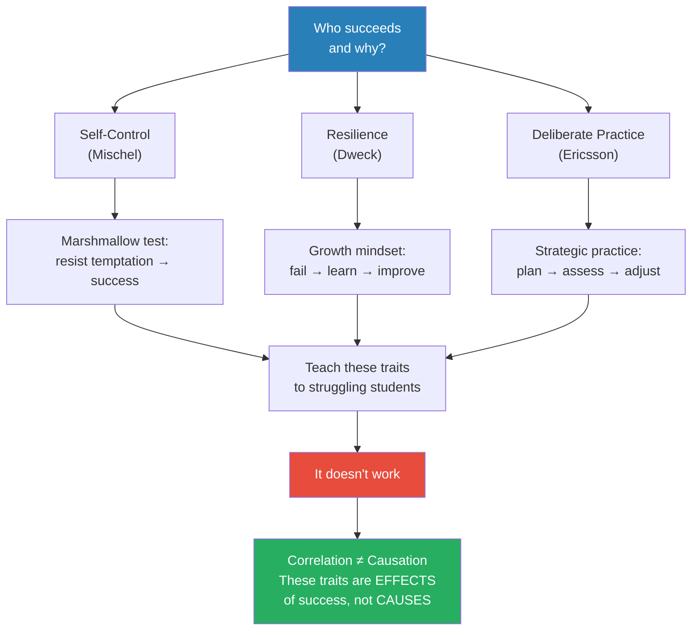
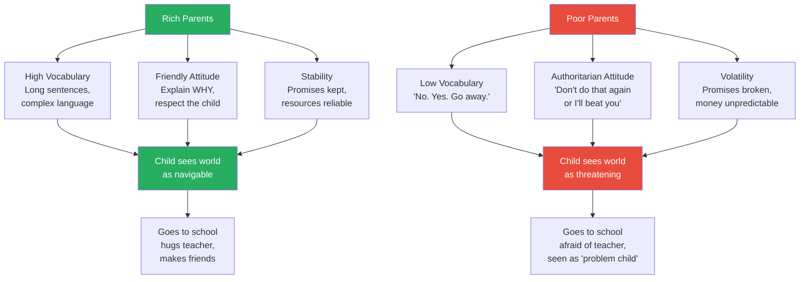
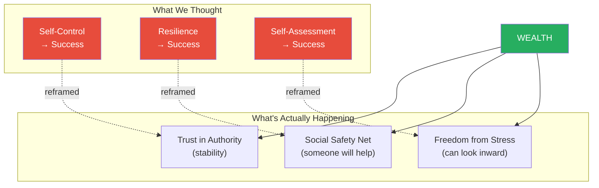
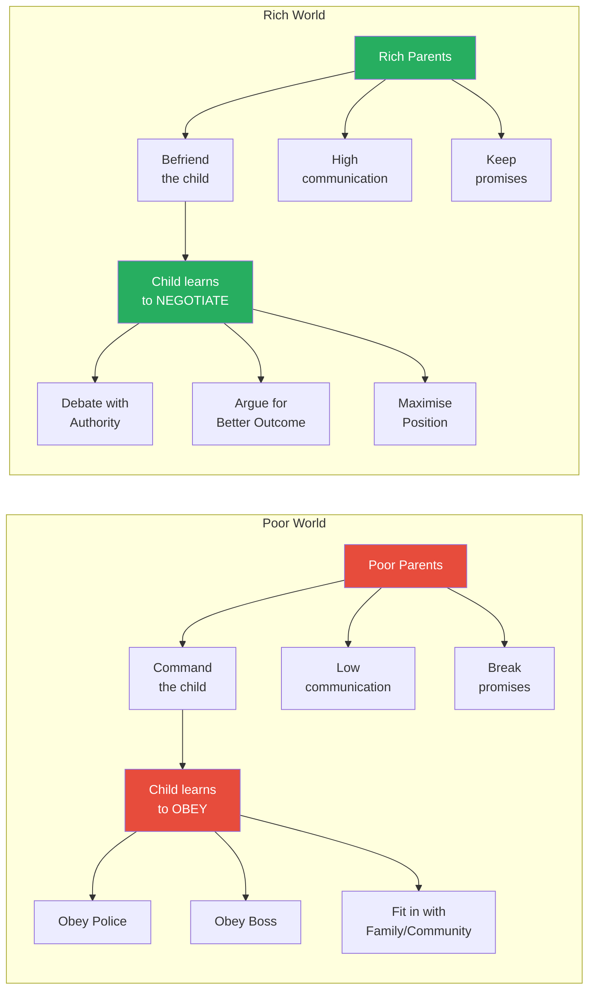
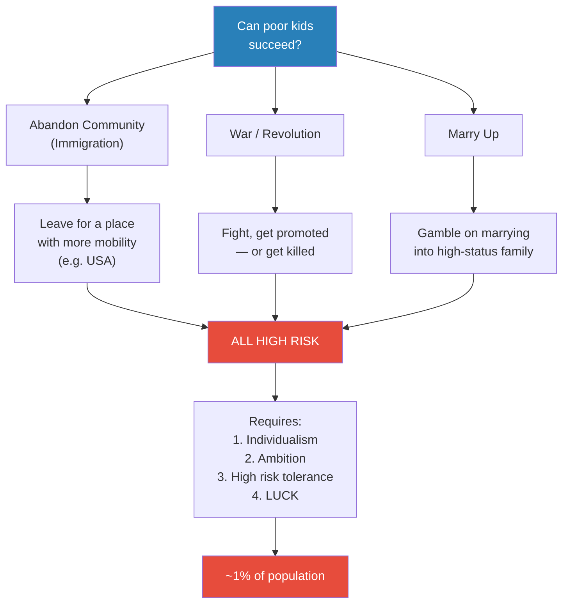
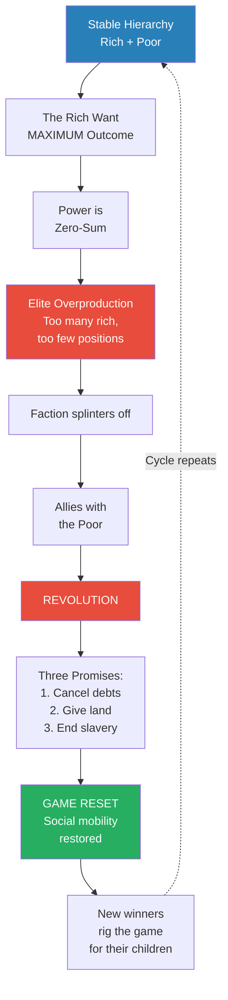
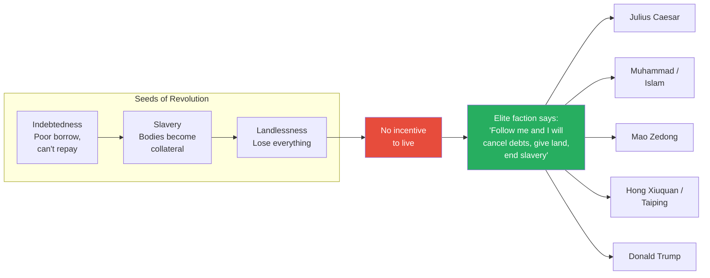

# Rich Dad, Poor Dad

> Prof. Jiang asks who succeeds and why — then dismantles the three dominant theories of success (self-control, resilience, and deliberate practice) by showing that they are correlated with success but do not cause it. The real cause is wealth. Rich and poor parents raise their children differently — not because they read different parenting books, but because they are playing entirely different games. Rich parents teach negotiation because their children will negotiate with authority; poor parents teach obedience because their children must obey authority. This class structure is stable — until elite overproduction forces a faction of the rich to ally with the poor and trigger revolution. Every revolution in history, from Julius Caesar to Mao Zedong to Donald Trump, follows the same pattern: cancel debts, redistribute land, end slavery. The game resets. Then the cycle begins again.

---

## Overview: Key Highlights

- <b style="color: #27ae60">Correlation does not equal causation</b> — self-control, resilience, and self-assessment are symptoms of success, not causes of it
- <b style="color: #2980b9">The marshmallow test</b> — not a test of self-control, but a test of trust in authority: rich kids trust that promises will be kept, poor kids know better
- <b style="color: #e74c3c">Teaching self-control to poor kids does not work</b> — because the traits are products of environment, not drivers of outcome
- <b style="color: #27ae60">Rich and poor parents play different games</b> — the incentive is not to raise a successful child, but to raise a child who fits into your social world
- <b style="color: #2980b9">Three parenting differences</b> — vocabulary (high vs low), attitude (friendly vs authoritarian), stability (promises kept vs promises broken)
- <b style="color: #e74c3c">Poor kids are rational, not stupid</b> — eating the marshmallow immediately is the optimal strategy when adults cannot be trusted
- <b style="color: #2980b9">Two worlds: obey vs negotiate</b> — the poor survive by obeying authority; the rich advance by negotiating with authority
- <b style="color: #27ae60">Social mobility is the best form of governance</b> — it does not require democracy; any system with upward mobility will be stable and creative
- <b style="color: #e74c3c">Elite overproduction</b> — when too many rich people compete for too few positions of power, the system becomes unstable
- <b style="color: #2980b9">Revolution follows a universal pattern</b> — cancel debts, redistribute land, end slavery — from Julius Caesar to Mao Zedong to Islam
- <b style="color: #e74c3c">Revolutions are always "have a lot" vs "have some" — never rich vs poor</b> — the poor lack the resources to organise; a splinter faction of the elite leads every revolution
- <b style="color: #27ae60">Game reset</b> — revolution is just resetting the game so social mobility can restart, until the new winners rig the game for their children

| Concept | One-line summary |
|---------|-----------------|
| **Delayed gratification** | Walter Mischel's idea that self-control predicts success — debunked as correlation, not causation |
| **Growth mindset** | Carol Dweck's idea that resilience drives success — debunked for the same reason |
| **Deliberate practice** | K. Anders Ericsson's idea that strategic practice drives mastery — debunked as an effect of success, not a cause |
| **Dunning-Kruger effect** | The least competent people are the most confident because they lack the capacity to know they are wrong |
| **Correlation vs causation** | The critical distinction: things that appear together need not cause each other |
| **Authoritarian vs friendly parenting** | Poor parents command because obedience keeps children safe; rich parents explain because negotiation keeps children competitive |
| **Trust in authority** | The marshmallow test measures whether a child believes adults will keep their promises |
| **Elite overproduction** | When too many elites compete for too few positions of power, the system becomes unstable |
| **Game reset** | Revolution as the mechanism by which a rigged game is destroyed and social mobility restored |
| **The three seeds of revolution** | Indebtedness, slavery, and landlessness — the conditions that leave the poor with nothing to lose |

---

# The Lecture

## Three Theories of Success — and Their Destruction [0:00 - 8:30]

*Prof. Jiang opens with a simple question — who succeeds and why? — then presents three dominant theories from psychology, each backed by decades of research. He gives each theory its full weight before revealing that all three fail the same test: teaching these traits to struggling students does not make them succeed.*

> [!tip] Core Insight
> Self-control, resilience, and self-assessment are not causes of success — they are consequences of it. Rich people have these traits because they are rich. Teaching them to poor people does not make them rich. The arrow of causation runs the opposite direction from what every self-help book claims.

*Three theories, each compelling on its own terms, all collapse under the same critique. The traits they identify are real — but the causal arrow points the wrong way.*

> [!note]- Expand: Full Lecture Detail
> Prof. Jiang opens with the question: "Who succeeds and why?" He tells the class that extensive research has identified three theories, each from a major psychologist.
>
> **Theory 1 — Self-Control (Walter Mischel, Columbia):**
>
> - Mischel devised the <b style="color: #2980b9">marshmallow test</b> — a deceptively simple experiment
> - A four- or five-year-old is brought into a room and chatted with warmly
> - The experimenter then says he must leave for another meeting but offers a deal: here is one marshmallow. Eat it now, or wait, and when I come back you get two
> - Behind a one-way mirror, Mischel watches children struggle with temptation
> - He then tracked these children for fifty years
> - The children who resisted and waited for the second marshmallow performed better on every life metric:
>   - Higher test scores
>   - Better careers, more stable careers, more promotions
>   - More stable relationships
>   - Lower rates of jail, drugs, alcohol
>   - Leaner, more fit, longer-lived, better teeth
> - Children who ate the first marshmallow immediately showed the opposite pattern
> - Mischel's conclusion: success means <b style="color: #2980b9">delayed gratification</b> — the ability to sacrifice now for a better future
>
> **Theory 2 — Resilience (Carol Dweck, Stanford):**
>
> - Dweck wrote *Mindset* and introduced the concept of <b style="color: #2980b9">growth mindset</b> vs <b style="color: #e74c3c">fixed mindset</b>
> - Growth mindset: when you fail, you say "this is an opportunity to learn" — you think about what went wrong and try harder
> - Fixed mindset: when you fail, you believe you are incapable of improving and give up
> - Those with growth mindset try harder after failure; those with fixed mindset just quit
>
> **Theory 3 — Deliberate Practice (K. Anders Ericsson, Swedish):**
>
> - Ericsson studied why some musicians and athletes reach the top while others plateau
> - Everyone works hard, but the successful ones practise strategically
> - The cycle: set goals → create a plan → follow the plan → assess weaknesses → improve the plan → repeat
> - This is the idea of <b style="color: #2980b9">self-reflection or self-assessment</b> — constantly examining your own learning strategies
> - Ericsson's claim: do this and you will succeed at anything
>
> Prof. Jiang then introduces the <b style="color: #2980b9">Dunning-Kruger effect</b> to illustrate why self-assessment is so hard:
>
> > [!example] The Dunning-Kruger Experiment
> > - 500 first-year psychology students at an American university took an IQ test
> > - After the test, each student was asked: where do you think you ranked?
> > - Nobody got their ranking correct
> > - Those in the top 5% thought they were merely in the top 20% — because the test was easy for them, they assumed it was easy for everyone
> > - Those in the bottom 5% thought they were average — in the top 50%
> > - "People who are stupid lack the capacity to know they're stupid"
> > - Prof. Jiang adds with a grin: "This helps explain why the world is why it is — because often the people in power are stupid. They don't know they're stupid. They were confident, and they do stupid things. Like Donald Trump"
> > **The lesson:** The hardest part of self-assessment is that the people who need it most are the least equipped to do it.
>
> Prof. Jiang then delivers the critical blow: "As educators, as schools, we can devise strategies and curriculum to help students succeed using self-control, resilience, and self-assessment. The problem is that when we actually try this, it doesn't work."
>
> He pauses and introduces the key distinction: <b style="color: #27ae60">correlation does not equal causation</b>.
>
> - "We know that successful people get up early in the morning — about four o'clock. But just because you get up at four o'clock, does that mean you'll succeed?"
> - <b style="color: #e74c3c">If you are successful, you WILL have self-control, resilience, and deliberate practice — because success gives you those traits</b>
> - But having those traits does not make you successful
> - "If you're rich, guess what happens? You become successful, and therefore you will have growth mindset, self-control, deliberate practice"
> - The arrow runs from wealth to traits, not from traits to wealth

---

## Rich Parents, Poor Parents — Three Differences [8:30 - 15:43]

*Prof. Jiang turns from psychology to sociology. If individual traits do not explain success, what does? The answer: parenting. He identifies three specific differences between rich and poor parenting — vocabulary, attitude, and stability — and shows that each one creates a cascading chain of advantages or disadvantages that compound through childhood.*

*The same child, born into two different homes, arrives at school as two entirely different people — one confident and trusting, the other fearful and defensive. The teacher responds to what they see, and the gap widens.*

> [!note]- Expand: Full Lecture Detail
> Prof. Jiang states bluntly: "We know for a fact that rich people are much more likely to succeed than poor people. And in fact, what we know from macroeconomic studies is that school doesn't really matter. It doesn't matter how well you do in school. If your parents are rich, you'll be successful in life. If your parents are poor, you will not be successful in life."
>
> He then identifies three specific differences in how rich and poor parents raise their children:
>
> **Difference 1 — Vocabulary:**
>
> - Rich parents speak to their children more, using <b style="color: #2980b9">high vocabulary and longer sentences</b>
> - Poor parents use minimal language: "No. Yes. Go away."
> - The gap in words heard per day is enormous and compounds over years
>
> **Difference 2 — Attitude:**
>
> - Rich parents use a <b style="color: #27ae60">friendly, explanatory attitude</b>
> - Poor parents use an <b style="color: #e74c3c">authoritarian, command attitude</b>
>
> > [!example] The Hot Stove — Two Parenting Responses
> > - A child touches a hot stove and burns their hand
> > - The rich parent sits down and explains: "Listen, you made a mistake. Don't worry about it. Let me explain why touching a fire is bad — you'll burn yourself, you might have to go to a doctor, and we will feel pain if you hurt yourself"
> > - The rich parent spends time explaining WHY this is wrong and HOW not to do it again
> > - The poor parent says: "Don't you ever do that again, or I'll beat the crap out of you"
> > - Both approaches "work" — neither child touches the stove again
> > - But the rich child now understands that the world is safe and that adults respect him
> > - The poor child now understands that the world is scary and that adults are dangerous
> > **The lesson:** The same lesson is learned, but the worldview it creates is completely different — and that worldview determines everything that follows.
>
> Prof. Jiang traces the cascade into school:
>
> - The rich child arrives at school thinking "my teacher is my friend" — smiles, hugs the teacher, gets warmth back
> - The poor child arrives afraid — does not make eye contact, does not smile, radiates stress
> - The teacher reads the poor child as a potential "problem child"
> - <b style="color: #e74c3c">The parenting style has already determined the child's relationship with every authority figure they will ever meet</b>
>
> **Difference 3 — Stability:**
>
> - Rich parents have money, which means they can <b style="color: #27ae60">afford to keep promises</b>
> - "I'm a rich parent, I say to my child, next week we'll go to Thailand for vacation. Guess what? Next week you go to Thailand."
> - Poor parents cannot keep promises because money is always uncertain
> - "Next week we'll go to McDonald's for lunch, but your paycheck isn't enough, so — sorry, we can't go anymore"
> - This is not about bad parenting — it is about structural constraint
> - The rich child learns that the world is predictable; the poor child learns that promises are unreliable

---

## Reframing the Three Theories Through Class [15:43 - 19:59]

*Prof. Jiang returns to the three success theories and reinterprets each one through the lens of class. Self-control becomes trust. Resilience becomes social safety net. Self-assessment becomes freedom from stress. The theories are not wrong — they are just describing the symptoms of wealth, not the cause of success.*

> [!tip] Core Insight
> The marshmallow test does not measure self-control. It measures whether a child trusts that adults will keep their promises. Rich kids wait because promises have always been kept. Poor kids eat immediately because that is the rational response to a world where adults lie.

*Each theory is not wrong about WHAT it observes — it is wrong about WHY. The common cause behind all three traits is wealth, not character.*

> [!note]- Expand: Full Lecture Detail
> Prof. Jiang now returns to the three theories and demolishes each one through the class lens:
>
> **Self-Control reframed as Trust:**
>
> - "The marshmallow test is not a test of self-control. It's a test of your trust in others"
> - If you believe the teacher will come back and keep the promise, you wait
> - If you believe the teacher is lying, you eat the marshmallow now
> - <b style="color: #27ae60">"Poor kids are not stupid. Poor kids are rational and they're responding to the circumstances that they live in"</b>
> - In a world where promises are routinely broken, eating the marshmallow immediately is the optimal strategy
> - "You're actually better off eating that marshmallow rather than waiting for the second one, because guess what — most of the time, you will not get that second marshmallow"
>
> **Resilience reframed as Social Safety Net:**
>
> - Resilience means "you believe that the world will help you"
> - Rich kids can be resilient because if they fail, someone will help them get back up
> - Poor kids who fail receive a signal: you probably should not be doing this
> - <b style="color: #e74c3c">Without a safety net, failure is not a learning opportunity — it is a catastrophe</b>
>
> **Self-Assessment reframed as Freedom from Stress:**
>
> - Self-assessment requires looking inward — reflecting on your own performance
> - "If you're a poor child who lives under large stress, it's hard for you to be self-reflective, because if you look back at yourself, all you think about is your pain and your stress"
> - Rich children can afford introspection because their baseline is security, not survival
>
> Prof. Jiang then addresses the obvious next step: "Okay, well then rather than construct our schools around self-control, resilience, and self-reflection, we should construct our schools around better parenting skills." He lists three strategies:
>
> - Expose children to a lot of vocabulary
> - Make teachers friendly rather than authoritarian
> - Create stability and predictability
>
> "We've tried this, and it's more effective, but it doesn't really work either. Why? Because the kids come in too late — a lot of their worldview is already established."
>
> The next attempt: change how parents behave. "When you do that, what you recognise is that you can't change how they behave either." No matter what intervention is tried, the gap persists: <b style="color: #e74c3c">the rich stay rich and the poor stay poor</b>.

---

## Two Worlds — Obey vs Negotiate [19:59 - 28:37]

*Prof. Jiang reveals the structural reason why parenting cannot be changed: rich and poor parents are not failing at the same game — they are playing different games entirely. The poor must obey authority to survive. The rich must negotiate with authority to advance. Each parenting style is the optimal strategy for the world the child will actually inhabit.*

*Two entirely different games, each with its own optimal parenting strategy. The poor parent who teaches obedience is not failing — they are preparing their child for the world that child will actually face.*

> [!note]- Expand: Full Lecture Detail
> Prof. Jiang introduces the structural explanation: "Society is a hierarchy, and the hierarchy is usually divided between the rich and the poor. These two worlds are night and day."
>
> He defines the two games:
>
> - <b style="color: #e74c3c">The poor world</b>: to survive, you must obey authority. If the police know you are poor, they will bully you. If you fight back, you go to jail. Your boss will command you. The optimal strategy is to follow orders and keep your mouth shut.
> - <b style="color: #27ae60">The rich world</b>: to advance, you must negotiate with authority. "Who should be the boss? Let's have a debate and present different evidence." Negotiation means debate, argument, persuasion.
>
> This explains why parents parent the way they do:
>
> - Poor parents command because their child must learn to obey — police, boss, family expectations
> - Rich parents explain and discuss because their child must learn to negotiate — debate, argue, persuade
> - <b style="color: #27ae60">"From day one, rich kids know that they're playing a different game from poor kids"</b>
>
> Prof. Jiang then explains why poor parenting cannot be changed — it is not about knowledge, it is about social pressure:
>
> - A poor parent's three audiences: police, boss, and family
> - If you parent differently from your community, your friends and family will not think you are enlightened — they will think something is wrong with you
> - "They won't think, 'Oh my God, you are an enlightened parent who's read a lot of parenting books.' They're going to think there's something wrong with you"
> - <b style="color: #e74c3c">The incentive of parenting is not for your child to succeed — it is for your child to fit into the social environment you are in</b>
>
> > [!example] Prof. Jiang's Own Parenting — The Cost of Playing the Wrong Game
> > - Prof. Jiang and his wife have three children and parent in a radically different way from typical Chinese families
> > - They give their children freedom — no math class, no swimming class, no piano class; instead, the children run around and play
> > - They believe in democracy within the family — decisions are made through communication, not commands
> > - They tell stories instead of drilling math
> > - Prof. Jiang has spent decades researching education and has read extensively on parenting
> > - "Guess what? Because we do this, we have no friends in China. We have family, but they all think we're crazy"
> > - He does it anyway because he believes this approach makes children creative and successful
> > - But he acknowledges the trade-off: "If you do it the other way, your child will fit into China better"
> > **The lesson:** Parenting is a game played not for your child's absolute potential but for your child's fit within your social world. Breaking the pattern means losing your community.
>
> Prof. Jiang crystallises: "The goal, the incentive, is not for your child to succeed. The incentive is for your child to fit into China or the larger social environment that you are in. And that's why it's very hard to change the way people behave, and that's why social structures are extremely rigid."

---

## Social Mobility — The Exception, Not the Rule [28:37 - 35:00]

*A student asks whether poor kids can ever break through. Prof. Jiang answers yes — but only through high-risk strategies that most people cannot or will not take. He identifies three historical mechanisms of upward mobility: abandoning your community, war, and marrying up. All require luck, and all require a personality type that is extremely rare.*

*Three paths out of poverty — all of them gambles, all of them requiring a personality type that only about 1% of the population possesses.*

> [!note]- Expand: Full Lecture Detail
> A student asks: "For poor families, is there any way for the poor kids to succeed — to become the rich parent you describe?"
>
> Prof. Jiang answers: "Yeah, that's a really good question." He identifies three mechanisms:
>
> **Mechanism 1 — Abandon your community (immigration):**
>
> - Prof. Jiang uses his own life as an example: "I'm a poor kid who succeeded. We immigrated to Toronto when I was about six years old. My father was a dishwasher. We were a very poor family"
> - He succeeded because he left Canada for the United States: "Canada is a very rigid place where poor people move up a bit, but not too far"
> - He obtained a scholarship to study in the US, which offered more social mobility
> - <b style="color: #e74c3c">The cost: "It means leaving your community"</b>
> - "You have to be extremely individualistic to take such a risk. The safest option is to stay within your community"
>
> **Mechanism 2 — War and revolution:**
>
> - "Traditionally, historically, war has been the best mechanism of social mobility"
> - Fight a war, do well, get promoted — but "chances are you get killed"
> - Revolution works the same way: overthrow the system, claim a new position
>
> **Mechanism 3 — Marry up:**
>
> - Prof. Jiang connects back to [[01 - The Dating Game]]: "Remember, in our very first class, we talked about the dating game, where women only want five and four"
> - Women chase high-status men because marrying into a low-status family means their children will be disadvantaged
> - "Your best option is to take a risk, gamble, and try to marry into a high-status family"
>
> He then delivers the uncomfortable conclusion:
>
> - "You have to get really lucky, guys"
> - "There are lots of poor people who think, 'I succeeded because I worked hard, I'm really talented.' It's luck"
> - "You can work as hard as you want, but the chances are against you"
> - The personality required: highly individualistic, very ambitious, high risk tolerance — "most people don't have that"
> - "These people are a minority — 1% of the population — and they still depend on luck"
>
> **Q&A — Is luck a form of ability?**
>
> A second student asks whether luck can be considered a kind of ability. Prof. Jiang responds:
>
> - <b style="color: #27ae60">"Luck is a form of strategy"</b> — you position yourself where luck can find you
> - "I left Canada for the United States because I knew that in Canada, doesn't matter how hard you work, no one cares. But in the United States, if you work really hard, you might get lucky"
> - "You can strategise and increase your luck, but it's still luck"
> - Successful people "think strategically and far ahead and position themselves in a way that allows them to get lucky"
> - They also tend to have the traits discussed earlier — self-control, resilience, self-assessment — but these are effects, not causes

---

## Equilibrium, Elite Overproduction, and Revolution [35:00 - End]

*Prof. Jiang zooms out to the system level. The rich-poor hierarchy looks stable — each class has its own game, its own parenting, its own equilibrium. But the system contains a built-in flaw: the rich are taught to maximise outcomes, and power is zero-sum. When there are too many rich people and too few positions, elite overproduction triggers revolution. Every revolution in history follows the same three-step promise: cancel debts, redistribute land, end slavery. The game resets — and the cycle begins again.*

> [!tip] Core Insight
> Revolutions are never between rich and poor. They are between "have a lot" and "have some" — a faction of the elite that has been locked out of power recruits the desperate poor by promising to cancel their debts, give them land, and free their children from slavery. This pattern has repeated in every revolution in recorded history.

*The cycle of civilisation: stability → elite overproduction → revolution → game reset → new stability → new elite overproduction. The dotted arrow is the inevitability — every new winner eventually rigs the game for their children, restarting the clock.*

*The three seeds — debt, slavery, landlessness — produce a population with nothing to lose. Every revolutionary leader in history has made the same three promises, wrapped in different ideological packaging.*

> [!note]- Expand: Full Lecture Detail
> Prof. Jiang explains why the system, despite its apparent stability, always breaks down:
>
> **The system looks stable:**
>
> - Rich and poor live in separate worlds with separate games and separate parenting strategies
> - Each class knows its place and knows how to optimise within its position
> - This looks like equilibrium — a self-sustaining system
>
> **The flaw — rich people want maximum outcomes:**
>
> - The poor accept minimum outcomes: "If I'm alive, if I have a decent job, I'm okay"
> - The rich have high expectations: "I need to be the top dog. I need to improve my lot in society"
> - <b style="color: #e74c3c">But power is a zero-sum game</b> — only a few people can be at the top
> - Over time, too many rich people compete for too few powerful positions
> - This is <b style="color: #2980b9">elite overproduction</b>
>
> **How revolution works:**
>
> - A faction of the rich, locked out of power, allies with the poor against the ruling elite
> - <b style="color: #e74c3c">"All revolutions are always between 'have a lot' versus 'have some.' It's never between rich and poor"</b>
> - "The people who led the Chinese revolution — Mao Zedong, Zhou Enlai, Deng Xiaoping — they were not poor people. They didn't come from poor families. But they weren't rich enough"
> - The Chinese Revolution was "really between the urban elite versus the rural elite"
>
> A student asks how the elite recruits the poor. Prof. Jiang identifies the three universal conditions that create revolution:
>
> - <b style="color: #e74c3c">Indebtedness</b> — the rich monopolise wealth; the poor must borrow; interest rates compound; eventually the poor cannot repay
> - <b style="color: #e74c3c">Slavery</b> — when you cannot repay, your body becomes collateral; you become a slave, and your children and grandchildren become slaves
> - <b style="color: #e74c3c">Landlessness</b> — the poor lose their land and have nothing left
>
> "Now you have a majority of people who have absolutely no incentive to live."
>
> The elite faction then says: "Follow me into revolution, and I will clear your debts, I will give you land, and I will end slavery." Every revolution uses this formula:
>
> > [!example] The Universal Formula of Revolution
> > - Communism: "We'll create a communist paradise" — what is it? A place where debt is cancelled, people have land, and no one is a slave
> > - Islam: Muhammad's revolution was initially about this — "Create the kingdom of heaven" where people are free of debt, have land, and cannot be enslaved. "If you are a Muslim, you can never be a slave"
> > - Julius Caesar: popular because he promised the Roman people the same three things — cancel debts, free slaves, redistribute land. "And that's why they had to kill him"
> > - Donald Trump: "Why is Donald Trump so popular in America right now? Same thing. Americans are in debt — credit cards, student loans, houses — and they believe that Donald Trump, if he becomes king, will cancel all debts"
> > - The Taiping Rebellion: Hong Xiuquan failed the civil service examination because all positions were already filled. He believed he was the brother of Jesus and started a revolution that killed tens of millions
> > - Mao Zedong: by the time Mao became a university student, the keju had been eliminated — there was no path upward. So he created a new path through revolution
> > **The lesson:** Strip away the ideology — communism, Islam, Caesarism, Trumpism — and every revolution is the same game reset: cancel debts, give land, end slavery.
>
> **Why social mobility is the best form of governance:**
>
> A student asks whether the elite deliberately maintains limited social mobility to preserve power while preventing revolution. Prof. Jiang confirms:
>
> - <b style="color: #27ae60">"Social mobility is really the best form of governance"</b>
> - "It doesn't matter what system you have" — democracy, communism, monarchy
> - America in the 1950s: democracy with high social mobility — people worked hard and America became wealthy
> - China in the 1950s: communist system, not democratic — but also high social mobility after decades of war. "People worked really hard because they thought that by working hard, they could improve their lives"
> - "You don't need democracy. You don't need any system. As long as you have social mobility, people will be happy"
>
> **Why social mobility always dies:**
>
> - "The problem is that, over time — less than a generation — all the positions of power are filled"
> - The talented people who made the country great "don't want people like them to replace them. They want their children to replace them"
> - They rig the system: in Chinese history, the keju (civil service examination) starts fair, then children of officials learn to pass it, then corruption sets in, then positions are simply bought
> - "Schools for the rich are very different from schools for the poor. Schools for the rich, there's a lot of freedom, creativity. Poor schools — the complete opposite. The system is set up to make sure certain people succeed and everyone else fails"
>
> He closes with the game theory framing: <b style="color: #27ae60">"According to game theory, individuals don't really matter. You have to look at large groups, large social trends. You cannot change the outcome for certain groups of people unless you look at the overall structure in which they live."</b>

---

## Connections

**Builds on:** [[01 - The Dating Game]] — the dating game introduced superstructure and the idea that macro conditions determine individual behaviour. This lecture applies the same logic to parenting: parents are not choosing strategies in a vacuum, they are responding to the structural position their class occupies. The dating game's status hierarchy (fives, fours, ones) maps directly onto the rich-poor hierarchy here — and the mechanism of "marrying up" is explicitly referenced.

**Sets up:** [[04 - The Immigration Trap]] — Prof. Jiang identified immigration as one of three mechanisms of social mobility. The next lecture will examine what happens when immigrants arrive in a new society: do they escape the hierarchy, or do they find themselves in a new version of the same game? The elite overproduction and revolution framework introduced here will recur throughout the series, particularly in [[07 - America's Game]], [[08 - Communist Specter]], and [[15 - The Return of History]].

**Recurring themes deepened:**
- Game theory as structural analysis — individuals do not matter; the structure of the game determines outcomes
- The gap between stated and actual incentives — parenting is "for the child's success" in theory, but "for fitting into the community" in practice
- Status and hierarchy as the hidden drivers — the two-world model (obey vs negotiate) is the class version of the status game from Lecture 1
- Civilisational cycles — elite overproduction → revolution → game reset → new hierarchy → repeat

**Related books in vault:**
- [[Sapiens - Yuval Noah Harari]] — Harari's argument that the agricultural revolution was "history's biggest fraud" resonates with Prof. Jiang's argument that the success narrative is a fraud: what looks like individual achievement is structural advantage
- [[The 48 Laws of Power - Robert Greene]] — Law 1 (Never Outshine the Master) maps onto the poor person's survival strategy: obey authority, do not challenge, keep your head down. Law 25 (Re-Create Yourself) maps onto the 1% who escape by abandoning their community
- [[Outliers - Malcolm Gladwell]] — Gladwell's argument about opportunity and structural advantage aligns directly with Prof. Jiang's demolition of the "hard work leads to success" narrative; both argue that context, not character, determines outcomes

---

## The Takeaway

This lecture is a systematic demolition of meritocracy. Prof. Jiang takes three of the most beloved ideas in modern psychology — delayed gratification, growth mindset, and deliberate practice — and shows that they describe the symptoms of wealth, not the causes of success. The marshmallow test reframing is particularly devastating: what psychologists interpreted as a child's self-control was actually a child's rational assessment of whether adults can be trusted. Poor children who ate the marshmallow immediately were not failing a character test — they were passing an intelligence test about their own environment.

The most structurally important idea is the two-world model. Rich and poor parents are not doing the same job with different skill levels — they are playing entirely different games. The poor parent who commands and punishes is not ignorant; they are preparing their child for a world where obedience is survival. The rich parent who explains and negotiates is preparing their child for a world where persuasion is power. Neither is wrong. Both are optimal for their context. And that is precisely why the system cannot be changed from within.

The lecture leaves one question hanging with unsettling force: if every revolution is just a game reset that eventually produces a new elite who rig the game for their children, is there any escape from the cycle? Prof. Jiang's answer — social mobility is the best form of governance — is immediately undercut by his own evidence that social mobility always dies within a generation. The cycle of stability, elite overproduction, revolution, and reset appears to be the permanent condition of human civilisation. Game theory does not offer hope. It offers clarity about why hope is so expensive.
