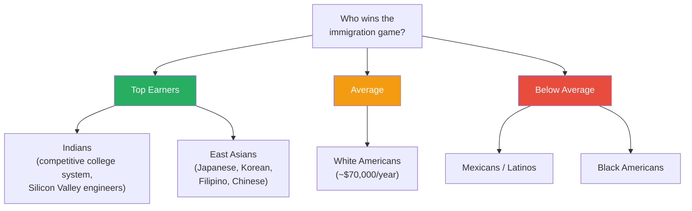
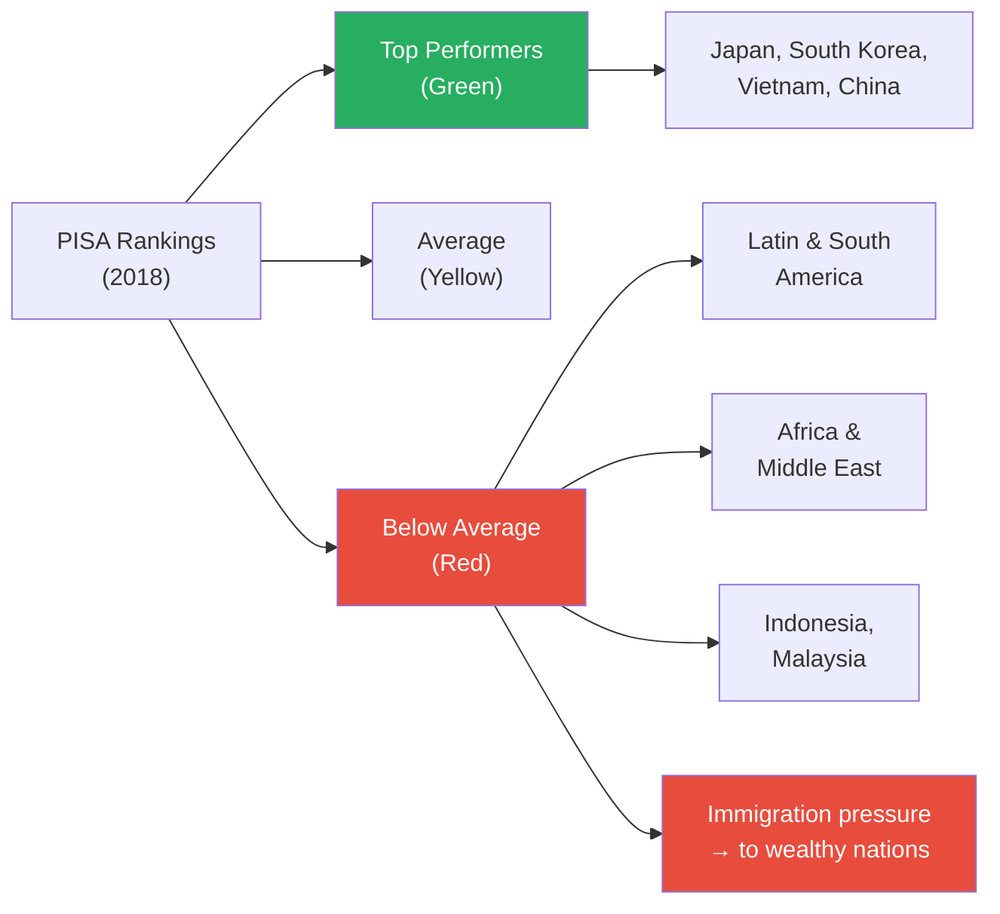
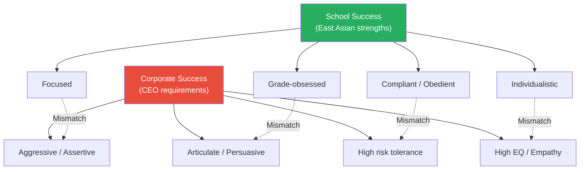
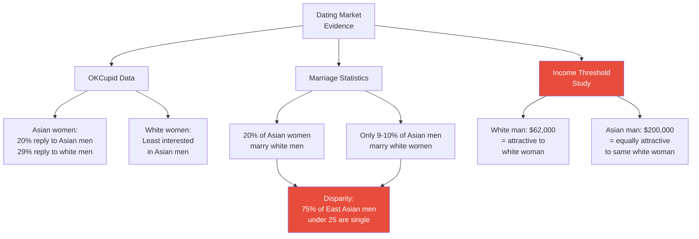
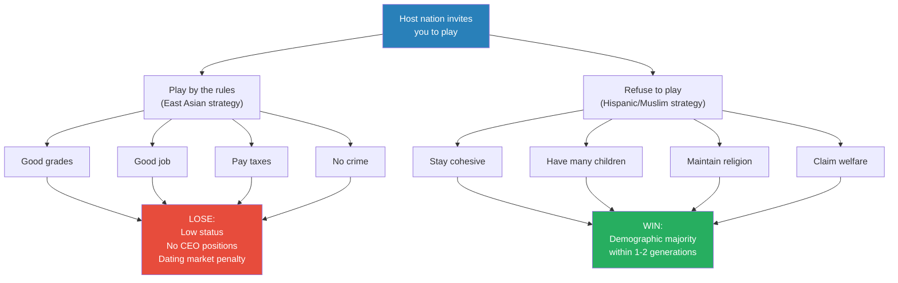
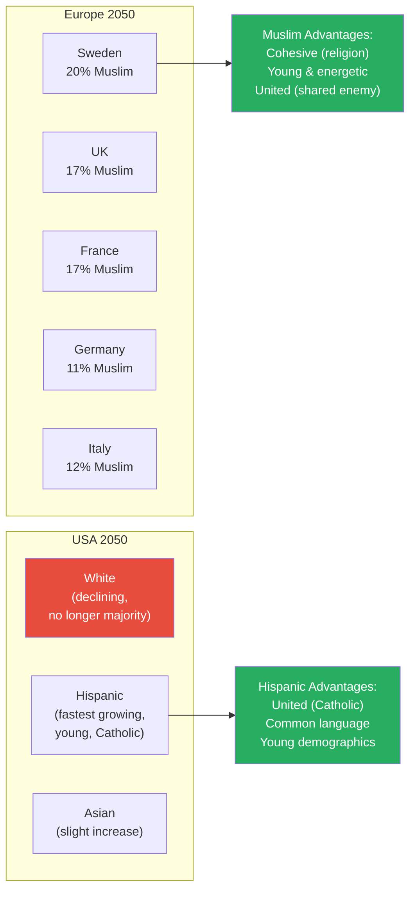
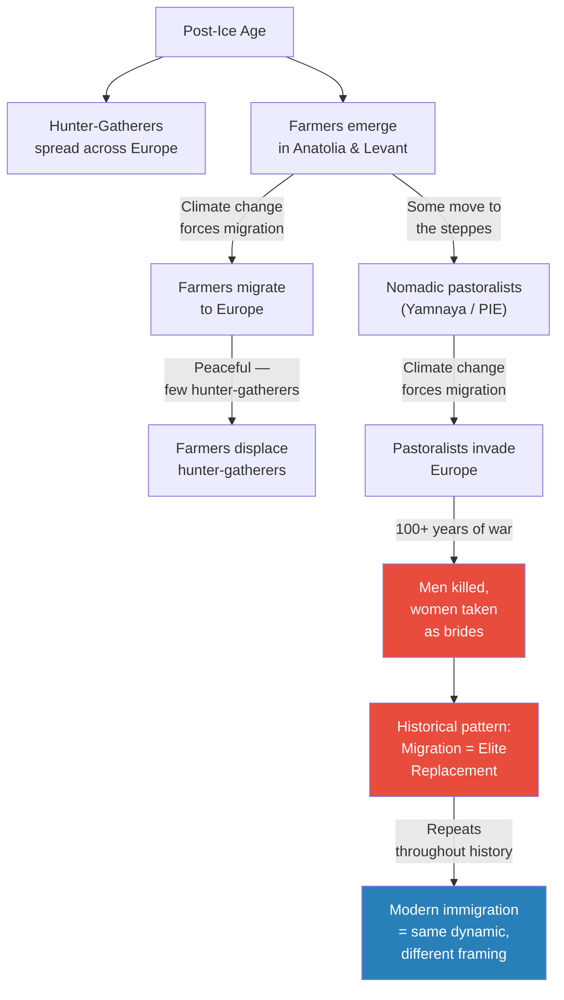
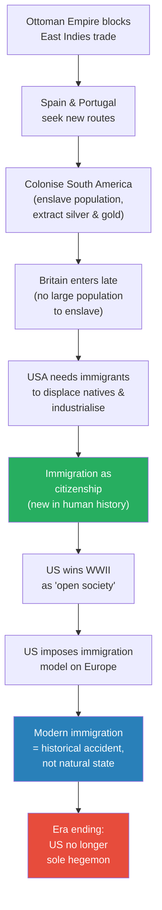
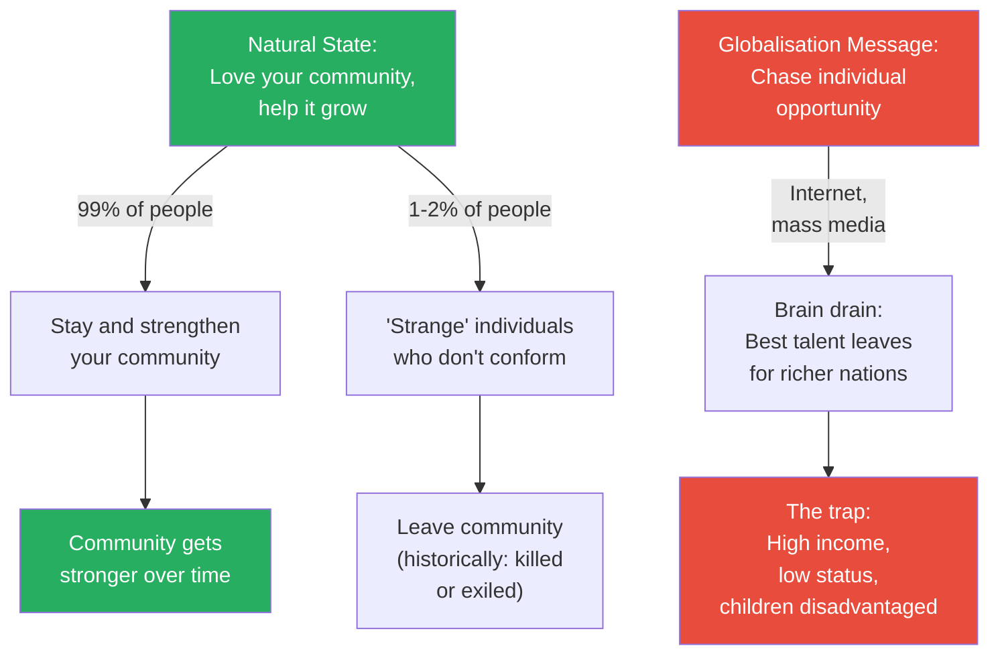

# The Immigration Trap

> Prof. Jiang applies game theory to immigration, asking who wins and who loses when people move to wealthy nations. He presents a paradox: East Asian men do everything right — top grades, top jobs, no welfare, no crime — yet remain low-status in America, losing both the corporate ladder and the dating market. Meanwhile, groups that refuse to play by the rules — maintaining cohesion, having many children, rejecting assimilation — are positioned to win through demographics alone. The game theory explanation is stark: if someone invites you to play his game, the rules are designed so you lose. The only winning strategy is to refuse to play. Prof. Jiang then traces why immigration exists at all — a historical accident born from America's specific need to displace Native populations — and warns that demographic replacement will trigger violent conflict, just as it has throughout human history from the proto-Indo-European invasions onward.

---

## Overview: Key Highlights

- <b style="color: #27ae60">If someone invites you to play his game, the rules are designed so you lose</b> — the casino analogy: casinos go bankrupt if the game is fair, and so do nations that invite immigrants under "fair" rules
- <b style="color: #e74c3c">East Asian men do everything right and still lose</b> — top grades, top jobs, no welfare, no crime, yet low status and discriminated against in dating and corporate leadership
- <b style="color: #2980b9">PISA rankings</b> — the international test that predicts economic dominance, showing East Asia at the top and Latin America, Africa, and Muslim nations at the bottom
- <b style="color: #27ae60">The winning immigration strategy is to refuse to assimilate</b> — stick together, maintain religion, have lots of babies, and let demographics do the work
- <b style="color: #e74c3c">The $200,000 threshold</b> — an Asian man must earn $200,000/year to be as attractive to a white woman as a white man earning $62,000, revealing the status penalty of race
- <b style="color: #2980b9">Population replacement</b> — the historical pattern where one demographic group displaces another's elite, from the proto-Indo-Europeans to modern immigration
- <b style="color: #e74c3c">75% of East Asian men under 25 in America are single</b> — the dating market discriminates against them more harshly than any other group
- <b style="color: #27ae60">Immigration is a historical accident</b> — America needed immigrants to displace natives and industrialise a continent, then imposed the model on post-war Europe
- <b style="color: #2980b9">DEI (Diversity, Equity, Inclusion)</b> — the framework meant to redress historical wrongs, which Prof. Jiang argues inadvertently discriminates against East Asians
- <b style="color: #e74c3c">By 2050, whites will no longer be the majority in America</b> — Hispanics are the fastest-growing group, united by religion, language, and culture
- <b style="color: #27ae60">The natural state is loyalty to your community, not individual migration</b> — globalisation and mass media have convinced young people that individual opportunity matters more than collective strength
- <b style="color: #2980b9">Whoever writes the rules of the game always wins</b> — America as hegemon set rules that extracted talent and resources from the world

| Concept | One-line summary |
|---------|-----------------|
| **The Immigration Trap** | Playing by the host nation's rules guarantees you lose — the rules exist to extract your energy |
| **PISA rankings** | International test predicting economic futures — East Asia dominates, Latin America and Muslim nations lag |
| **Status vs income** | East Asians earn well but remain low-status — income alone cannot buy position in the social hierarchy |
| **The casino analogy** | A casino invites you to play because the odds ensure you lose — immigration works the same way |
| **Population replacement** | The historical cycle where one group's elite displaces another's through migration and demographics |
| **DEI** | Diversity, Equity, Inclusion — policy framework that inadvertently penalises East Asians who were never considered historically disadvantaged |
| **The $200,000 threshold** | The income an Asian man needs to match the dating attractiveness of an average white man |
| **Demographic strategy** | Cohesion + high fertility + refusal to assimilate = long-term demographic victory |
| **Proto-Indo-European invasion** | Historical precedent: nomadic pastoralists displaced European farmers, killed the men, took the women |
| **Post-war open society** | America imposed immigration on Europe after WWII, arguing closed societies caused fascism and war |
| **Natural community loyalty** | The default human instinct is to strengthen your own community, not abandon it for individual gain |

---

# The Lecture

## Who Wins and Who Loses? — The Ethnic Income Hierarchy [0:00 - 3:00]

*Prof. Jiang opens with a deceptively simple question — who wins the immigration game and who loses? — then presents income data from the United States that ranks ethnic groups by economic success, setting up the central paradox of the lecture.*

> [!tip] Core Insight
> The ethnic groups that do best academically and economically in America are not the ones positioned to win the long-term game. Doing everything right by the host nation's rules is precisely the trap.

*The income hierarchy seems to reward the groups that work hardest in school. But as the lecture will reveal, income and status are entirely different games — and the groups at the bottom may be playing the smarter long-term strategy.*

> [!note]- Expand: Full Lecture Detail
> Prof. Jiang opens by framing the lecture around the United States, "which is where most immigrants go." He puts up a chart showing average income by ethnic group:
>
> - <b style="color: #2980b9">Indians</b> make the most money in America — "this makes sense, because India has a very competitive college system, where only the best and brightest get into their technical institutes." After college, they go to the US for graduate work, then on to Silicon Valley or medicine
> - <b style="color: #2980b9">East Asians</b> (Japanese, Korean, Filipino, Chinese) also do very well — "East Asians do very well in school, and East Asians are known for being very hard workers"
> - **White Americans** are the majority and the average, earning about $70,000 a year
> - **Mexicans and Latinos** are below average
> - **Black Americans** — "who traditionally have been slaves in America" — also underperform economically
>
> He poses the central question: "Why is it that there are certain ethnic groups, specifically East Asian groups, that do well economically, and then you have other ethnic groups, specifically Latinos and blacks, who do not do well economically?"
>
> He acknowledges the traditional explanation: "some cultures prize education more than other cultures." And the extreme version: "genetically, East Asians are just smarter than everyone else."

---

## The PISA Rankings — Predicting Economic Futures [3:00 - 7:00]

*Prof. Jiang introduces the PISA test as the global scoreboard for national competitiveness, shows East Asia's dominance, and maps which regions are projected to fall behind — setting up the immigration pressure that drives conflict.*

*The PISA map is a forecast: nations in green will dominate, nations in red will struggle and send their people to wealthier countries — creating the immigration conflicts that drive the rest of the lecture.*

> [!note]- Expand: Full Lecture Detail
> Prof. Jiang shows the 2018 PISA rankings — the <b style="color: #2980b9">Program for International Student Assessment</b>, run by the OECD every three years. It tests 14-year-olds in math, science, and reading across dozens of countries.
>
> - The OECD uses these results to forecast "a nation's ability to do well economically in the next 10, 20, 30 years"
> - Nations in green (top performers) are "primarily based in East Asia" — Japan, South Korea, Vietnam, China
> - "That's why a lot of people believe that in the future, East Asia will come to dominate the world economically"
> - Nations in red include Latin and South America, Africa, the Middle East, Indonesia, and Malaysia
> - He groups the underperformers by two patterns:
>   - **Region:** Latin and South America as a block
>   - **Religion:** "Muslims don't do well on the PISA, and that's why there's great fear that Islamic countries will fall behind economically"
>
> He then connects the PISA map to immigration flows:
>
> - Immigrants from Latin and South America have been moving to the United States
> - Muslims have been moving to Europe — "a lot of this immigration is driven by war"
> - "Nations like Libya, Syria, Afghanistan, Iraq have seen themselves destroyed because America's War on Terror, forcing millions of refugees to seek better opportunities in Europe"
> - <b style="color: #e74c3c">The conflict emerges because these immigrants don't do well economically, yet they're moving to very wealthy nations</b>

---

## The East Asian Paradox — High Income, Low Status [7:00 - 10:00]

*Prof. Jiang pivots from the classroom to the boardroom, showing that East Asian academic dominance does not translate into corporate leadership. White women have been the biggest beneficiaries of diversity initiatives, while East Asian men are the most underrepresented group in CEO positions.*

> [!tip] Core Insight
> East Asian men are the best students, the highest earners, and the most law-abiding immigrants — and they are the least likely to become CEOs or climb to status positions. The skills that win in school (compliance, focus, obedience) are precisely the skills that lose in the boardroom.

*The skills that make East Asian men the best students are the opposite of the skills that make successful CEOs. The education system rewards compliance; the corporate system rewards aggression.*

> [!note]- Expand: Full Lecture Detail
> Prof. Jiang challenges the assumption that PISA dominance means real-world dominance: "The problem is that if we actually look at American society and you look at who succeeds, it turns out East Asians don't do as well as you think."
>
> He presents data on new CEO appointments since 2000:
>
> - American corporations "tried their best to bring in more diversity into the corporate boardroom"
> - Traditionally, CEOs have been "white, middle-aged and men"
> - <b style="color: #27ae60">White women have been the most successful in climbing the corporate ladder</b>
> - Latino and African men "do okay, not great, but they do okay"
> - <b style="color: #e74c3c">East Asian men are underperforming</b> — their growth in CEO positions is "pretty steady" (i.e. flat)
>
> He offers two explanations:
>
> - **DEI (Diversity, Equity, Inclusion):** The idea of redressing historical wrongs — "women, minorities have been discriminated against American society, and therefore they should be given better opportunities." Because people believe East Asian men "have not been discriminated against, even though that's not correct," DEI inadvertently works against them
> - **Skill mismatch:** The qualities of successful CEOs do not align with East Asian male stereotypes:
>   - CEOs tend to be **aggressive or assertive**
>   - They have **high risk tolerance** — "they take chances"
>   - They need **high EQ, emotional intelligence, empathy or collaboration skills**
>   - East Asian men "tend to be much more individualistic, they tend to be more cautious, and they tend not to speak a lot"
>   - East Asian men "are not known for being articulate, which is something that you need in order to do well in a corporate boardroom where there's a lot of debate, a lot of argumentation"
>
> Prof. Jiang frames this as a trade-off: "East Asian men don't have these skills. They have other skills that allows them to do well in school — they're more focused, more Unitarian, grade obsessed, more compliant, more obedient. They like listening to authority."
>
> The conclusion is blunt: <b style="color: #e74c3c">"Even though East Asian men do well economically and academically, their status in America is not as great as their income would suggest. In fact, you could make the argument that East Asian men are among the groups that have the lowest status in America."</b>

---

## The Dating Market — Where Status Becomes Visible [10:00 - 18:00]

*Prof. Jiang turns to OKCupid data and marriage statistics to prove that East Asian men face the harshest discrimination in the one market where status matters most — dating. The $200,000 threshold crystallises the racial status penalty into a single, devastating number.*

*Three independent data sources — dating app behaviour, marriage records, and income-attractiveness studies — all converge on the same conclusion: the dating market penalises East Asian men more severely than any other group.*

> [!note]- Expand: Full Lecture Detail
> Prof. Jiang brings the status discussion to its most visceral arena: "Remember, what is it that men want to do? Well, they want to obtain status so that they can find the most attractive mate."
>
> He presents OKCupid statistics:
>
> - **Asian women receiving messages:**
>   - 20% respond if the man is Asian
>   - 29% respond if the man is white — "that's a pretty significant difference"
> - **White women's interest by ethnicity:**
>   - Most interested in white men
>   - Less interested in black men
>   - Even less interested in Hispanic men
>   - <b style="color: #e74c3c">Least interested in Asian men</b>
> - **Asian women's preferences:**
>   - Most interested in Asian men
>   - "Pretty interested in white guys"
>   - Similarly interested in black and Hispanic men
>
> He turns to marriage patterns:
>
> - 20% of East Asian women marry white men
> - Only 9-10% of East Asian men marry white women
> - This creates a structural disparity: "For East Asian men under 25 years old, 75% are single — meaning they cannot find a date or a partner"
>
> Then the devastating number:
>
> > [!quote] Prof. Jiang
> > "A white woman is more attracted to a white man than an Asian man. How do we know this statistically? If a white man makes $62,000 a year, for the Asian man to be as attractive to her, the Asian man needs to make $200,000 a year."
>
> Prof. Jiang unpacks what $200,000 means in America: "You have to be a surgeon, you have to be a top lawyer, you have to be an entrepreneur in order to be attractive to just the average white woman — not even the most attractive white woman."
>
> > [!example] The East Asian Man's Perfect Record — and Its Futility
> > - East Asian men went to school and worked hard — got the best grades
> > - They got good jobs and worked hard at those too — earned high incomes
> > - They followed every rule — didn't commit crimes, didn't go on welfare, paid taxes, contributed to their communities
> > - They did "exactly what they were supposed to do"
> > - Result 1: They cannot climb into status positions — they are not CEOs
> > - Result 2: They struggle to find attractive mates — 75% of young East Asian men are single
> > - "It's easy for them to find someone of their status or below, but it's very hard for East Asian men to actually marry up"
> > **The lesson:** Following the rules of a game you did not design guarantees maximum effort for minimum reward. The rules were never written for your benefit.

---

## The Game Theory Explanation — The Casino Analogy [18:00 - 22:00]

*Prof. Jiang delivers the lecture's central argument: immigration is a rigged game. Like a casino, the host nation invites you to play because the rules guarantee your loss. The only rational strategy — according to game theory — is to refuse to play.*

> [!tip] Core Insight
> "If someone invites you to play his game, don't agree to play by the rules — because the game is set up so that you will lose. Otherwise, why would he invite you?" The casino does not exist for you to win. Immigration does not exist for you to thrive.

*Two immigration strategies, two outcomes. Playing by the rules means your energy is extracted. Refusing to play means your demographics eventually overwhelm the host. Game theory predicts the second strategy wins — but it also predicts violent backlash.*

> [!note]- Expand: Full Lecture Detail
> Prof. Jiang lays out the scorecard:
>
> | Dimension | East Asian Men | Hispanic / Black / Muslim |
> |-----------|---------------|--------------------------|
> | **School** | Top performers | Below average |
> | **Employment** | High income | Lower income |
> | **Welfare** | Rarely claim | More likely to claim |
> | **Crime** | Rarely commit | More likely to be incarcerated |
>
> "You would think that East Asian men will ultimately triumph in the end. But what is really disconcerting is that, according to game theory, East Asian men are playing the game wrong, whereas these other groups — these Hispanics, these blacks, these Muslim groups — they are much more likely to win the game."
>
> He introduces the casino analogy:
>
> - "If someone invites you to play his game, don't agree to play by the rules — because the game is about so that you will lose. Otherwise, why would he invite you?"
> - "Think of a casino. A casino is like, please come in and play our game. Do you think the casino is fair? If the casinos were fair, the casino would go bankrupt"
> - "That's the same with immigration. If a nation like the United States is inviting you into their nation and you play by their rules, you will always lose"
>
> The logical conclusion from game theory: <b style="color: #27ae60">"The only logical strategy is to break the game. Cheat."</b>
>
> How do the "winning" groups do it?
>
> - They don't go to school and obey the teacher
> - They stick together as a cohesive group
> - They have lots of babies
> - Over time, demographics give them the power to rewrite the rules
>
> "It doesn't make sense at first. You're much better off not going to school, being poor, but staying together, being cohesive and having lots of babies — rather than going to school, getting your job, doing everything you've been told to do, because ultimately, your energy will be stolen from you because of the rules of the game."

---

## The Demographic Projections — Europe and America in 2050 [22:00 - 28:00]

*Prof. Jiang presents demographic projections showing Muslim population growth in Europe and Hispanic growth in America, arguing that the groups who refuse to assimilate will control these nations within a generation.*

*By 2050, Muslims are projected to be 11-20% of major European nations, and Hispanics will be the largest-growing group in America. Both have the three demographic advantages: cohesion, youth, and high fertility.*

> [!note]- Expand: Full Lecture Detail
> Prof. Jiang presents the European projections for 2050:
>
> - Sweden: 1/5 of the population will be Muslim
> - UK: 17% Muslim
> - France: 17% Muslim
> - Germany: 11% Muslim
> - Italy: 12% Muslim
>
> He identifies three advantages the Muslim population holds:
>
> - <b style="color: #27ae60">Cohesive</b> — "because of their religion"
> - <b style="color: #27ae60">Energetic</b> — "because they're young"
> - <b style="color: #27ae60">United</b> — "because, quite honestly, the Europeans don't really like them. They are an outcast. They're considered an enemy by the Europeans"
>
> "Not only that, but because Muslims are much more likely to have more children than Europeans, the populations that are Muslim will be younger, more energetic, whereas the Europeans will be much more old, they will likely be retired."
>
> He turns to America and shows 2050 projections:
>
> - The white population is declining — "by 2050 it will no longer be the majority"
> - Asians are increasing "by a bit, but not that much"
> - "The real growth is in Hispanics"
> - Hispanics are "a much more young, much more energetic group who are more likely to have children"
> - They are united by three things: "they are Catholics — they have a common religion, a common language, and very similar, common cultural traits"
>
> He summarises the game theory conclusion: "If you're an immigrant, your best strategy is not to do well in school, make a lot of money — that will get you nowhere. You're just playing by the rules of the game. Your best strategy is to stick together with your group, have lots of babies, maintain your religion, and over time, your children, your grandchildren, will come to dominate the nation."
>
> > [!abstract] Two Immigration Strategies Compared
> >
> > | Dimension | East Asian Strategy | Hispanic / Muslim Strategy |
> > |-----------|--------------------|-----------------------------|
> > | **School** | Excel | Don't prioritise |
> > | **Income** | High | Below average |
> > | **Cohesion** | Low (individualistic) | High (religion, language, culture) |
> > | **Fertility** | Low | High |
> > | **Assimilation** | Full compliance | Partial or none |
> > | **Short-term outcome** | Financial comfort, low status | Financial struggle, group solidarity |
> > | **Long-term outcome** | Demographic irrelevance | Demographic dominance |

---

## The Historical Precedent — Population Replacement Is Not New [28:00 - 33:00]

*Prof. Jiang warns that the white majority will not accept demographic replacement passively, then reaches back to the proto-Indo-European invasions to show that population replacement through migration has been the norm throughout human history — and it has always been violent.*

> [!tip] Core Insight
> There are "very few instances of situations where groups come together and they are peaceful." Throughout human history, one elite replaces another. Immigration as a peaceful process is a modern invention — and game theory predicts it cannot last.

*The proto-Indo-European invasion is not ancient history — it is the template. Genetic studies confirm the men were killed and the women taken. Prof. Jiang argues modern immigration follows the same underlying dynamic, just with a different surface story.*

> [!note]- Expand: Full Lecture Detail
> Prof. Jiang anticipates the objection: "The problem with this is that there is no way that the majority — the white people — will just sit back and let this happen. You're gonna have a lot of violence, a lot of conflict."
>
> He frames it from the white perspective: "This is population replacement. If we just let demographic trends continue, if these outsiders just have a lot of kids and we don't have the kids, then eventually our culture will be destroyed. And they're right. Historically, they're right."
>
> He then reaches back to the Civilization series — the proto-Indo-European invasions:
>
> - After the Ice Age, **hunter-gatherers** spread across Europe and Asia
> - As the Earth warmed, **agriculture** emerged in Anatolia and the Levant
> - Climate change forced farmers to migrate to Europe, where they displaced the hunter-gatherers — "it was not violent, because hunter-gatherers have very few people, and they can move about"
> - Some farmers moved to the steppes, but grassland is hard to farm — "so they developed a new economy called <b style="color: #2980b9">nomadic pastoralism</b>: they raised sheep, goats, and cows and migrated from one area of grassland to the next"
> - These people became "very strong, very aggressive" — the Yamnaya or proto-Indo-Europeans
> - Climate change again forced migration — this time, the pastoralists invaded Europe
> - "What happened was a war that lasted 100 years, maybe 200 years, in which the nomadic pastoralists displaced or eliminated the farmers"
> - Genetic studies reveal the pattern: <b style="color: #e74c3c">"The men, the European farmers, were killed and the women were taken as basically brides — slaves, basically"</b>
>
> He draws the universal pattern:
>
> - "This historically is what happens — one group comes in and replaces the other"
> - "Throughout most of human history, this is a constant cycle, because the steppes were extremely violent and chaotic, and this forces groups to constantly migrate in search of safety"
> - "In each time there is population replacement, primarily in the elite"
> - <b style="color: #e74c3c">"There are very few instances of situations where groups come together and they are peaceful — because you only have one elite, and one elite must replace the other elite"</b>

---

## Why Immigration Exists — The Historical Accident [33:00 - 40:00]

*Prof. Jiang traces the origin of modern immigration to a specific historical circumstance: America's need to displace Native populations and industrialise a vast continent. He argues that immigration is not a natural human behaviour but a product of British colonial logic, later imposed on Europe after World War II — and that the era is now ending.*

*Immigration as we know it — moving to a new country and becoming a citizen — is a 250-year-old experiment born from specific colonial needs. It is not the natural state of human societies, and game theory predicts it will not survive the end of American hegemony.*

> [!note]- Expand: Full Lecture Detail
> Prof. Jiang asks the pivotal question: "If historically the situation was that you had to stay together as part of your group otherwise you'd be eliminated, how did we get into a situation where immigration has become the norm in today's world?"
>
> He traces the chain of causation:
>
> - **Spain and Portugal** needed access to East Asian spice trade, but the Ottoman Empire blocked the overland route
> - They charted new routes and discovered South America — "in South America you had a huge population, and there was a lot of mineral wealth, silver and gold"
> - Spain's colonial strategy: "Go over there and enslave the population, then convert them to Catholic religion"
> - **Britain entered late** — "the easiest areas to colonise, Spain and Portugal took right away"
> - America's problem: "There was no large population to enslave. Also, there are a lot of aggressive Indians — natives"
> - The American solution: "After winning independence from Britain, it welcomed immigrants from Europe — specifically Ireland, Germany, Poland — because they needed to displace the natives"
> - Immigrants were then "encouraged to go to Canada and Australia to build their economies as well"
>
> He marks the historical novelty: <b style="color: #27ae60">"This is new in human history — where you could go to a new place and become a citizen. Usually you went to a new place because you were a slave, you were conquered in war, and you went as cheap labour"</b>
>
> The post-WWII imposition:
>
> - America becomes an empire, wins World War II
> - America tells Europe: "You guys fought wars, you guys had fascism, because you are a closed society — you don't want immigrants, you're all very nationalistic, and therefore you are violent"
> - "America won the war because America is an open society which welcomes immigrants, which is a multicultural society that encourages people to get rich and be happy"
> - "Europe, if you want to be like us, if we want to prevent World War Three, then you have to become an open society as well and welcome immigrants"
>
> His assessment: "What we need to recognise is that immigration is a new game developed because of certain historical circumstances, but it's not sustainable in the long term."
>
> He draws the connection to game theory: <b style="color: #2980b9">"Whoever writes the rules of the game will always win. America could write the rules of the game — globalisation — to extract from the world resources, and these resources include talent."</b>
>
> But the world is changing: "America is no longer the global hegemon. Russia, China — these countries are rising. Nations now are much more interested in being able to maintain their best and brightest, their talent, their human capital."

---

## Q&A — What Can We Do About It? [40:00 - end]

*A student asks whether anything can be done about the immigration trap. Prof. Jiang responds with his most personal argument of the lecture — that immigration is unnatural, that community loyalty is the default human instinct, and that he himself left America for China because he recognised the status ceiling. He closes with a stark assessment: according to game theory, East Asians in America are stuck.*

*Prof. Jiang's final diagram: the natural human instinct (green) is community loyalty. Globalisation (red) hijacks that instinct by convincing the best and brightest that individual opportunity abroad matters more than collective strength at home.*

> [!note]- Expand: Full Lecture Detail
> A student asks: "Can we really do something about the current immigration, or we don't have any ability to change it?"
>
> Prof. Jiang responds with unusual candour:
>
> - "Immigration is not natural. What I mean by that is that we are born into a community"
> - "What is natural is for you to want to help this community grow and develop. You want to contribute to this community"
> - "What is NOT natural is for you to say, 'You know what, this community sucks. I'm gonna go find a new community.' Because if everyone did that, then no communities could ever exist"
> - "99% of people — their natural inclination is to want to work hard and make the community a better place"
> - The 1-2% who don't conform "historically have been killed by the communities — so it's natural for them to get up and leave"
>
> He blames globalisation for distorting this instinct:
>
> - "Because of globalisation, because of mass media, because of the internet, young people believe that what's important is their own individual happiness, their own academic opportunity"
> - "Chinese students, the very best, are like, 'I'm probably gonna make more money in the United States. So I'm gonna work hard, then immigrate to the United States and then start my own company, get rich'"
> - "If you think about it, this is not good for China. Why would you encourage your best and brightest to take their skills, move somewhere else and contribute to that economy rather than your own?"
>
> He shares his own experience:
>
> > [!example] Prof. Jiang's Personal Choice — Yale to China
> > - Prof. Jiang worked hard in school and went to Yale
> > - He could have made a lot of money as a lawyer or doctor in America
> > - He recognised that staying would mean a ceiling: "I'm not gonna ever achieve my potential"
> > - "I may be wealthy, but I'm not going to achieve high status"
> > - He chose to come to China "because I thought there were more opportunities to obtain higher status in China than in the United States, where I'm not white, I'm East Asian, and there's gonna be a lot of stereotypes and prejudice against me"
> > - "Quite honestly, I was right in my assessment"
> > **The lesson:** Recognising that a game is rigged is the first step. The second step is finding a game where the rules work in your favour.
>
> His final assessment for East Asians in America:
>
> - "According to game theory, they're stuck where they are"
> - "I'm sure there are thousands of very happy East Asians who've married very well and have very good lives"
> - "But for the majority, you can have decent lives, but you will always be low status"
> - "A lot of East Asians are just happy getting by, making good money, and they really don't worry about status"
> - <b style="color: #e74c3c">"But the problem is that the children and grandchildren are kind of screwed over — very hard for them to marry"</b>
> - "There's a lot of East Asian men who are single, and they have problems on the dating market"

---

## Connections

**Builds on:** [[01 - The Dating Game]] (the status game, Nash equilibrium, incels, and demographic collapse — this lecture applies those frameworks to immigration specifically). The dating market data here is a direct extension of the Lecture 1 argument that the real game is status, not income or reproduction.

**Sets up:** [[05 - The World Game]] (the global competition between nations for resources and talent, which Prof. Jiang previews when discussing America's declining hegemony and the rise of Russia and China).

**Recurring themes continued:**
- **Status vs income** — established in Lecture 1 (incels, dating market) and now applied to immigration: high earners with low status
- **Whoever writes the rules wins** — the foundational game theory principle, now applied to immigration policy
- **Demographic collapse** — from Lecture 1's fertility crisis to Lecture 4's population replacement predictions
- **The casino analogy** — a new formulation of the principle that the game designer always wins

**Related books in vault:** [[Sapiens - Yuval Noah Harari]] (the agricultural revolution, proto-Indo-European migrations, and the argument that immigration patterns reflect deep evolutionary dynamics)

---

## The Takeaway

This lecture inverts everything conventional wisdom teaches about immigration. The standard advice — work hard, get educated, follow the rules, integrate — is precisely the strategy that game theory identifies as losing. Prof. Jiang's casino analogy is devastating in its simplicity: a casino that lets you win goes bankrupt, and a host nation that lets immigrants reach the top of the status hierarchy loses control of its own game. The rules exist to extract your energy, not to reward it.

The most counterintuitive insight is that the groups conventional wisdom pities — those who don't assimilate, don't excel academically, and rely on welfare — are playing the superior long-term strategy. Cohesion, fertility, and refusal to play by someone else's rules are the winning moves. The PISA rankings, which seem to predict East Asian global dominance, are measuring the wrong game entirely. They measure who is best at following rules designed by others.

What remains unresolved is whether the violent backlash Prof. Jiang predicts is inevitable. He presents population replacement as a historical constant — from the proto-Indo-European invasions to modern Europe — but leaves open whether modern institutions (democracy, international law, economic interdependence) can absorb demographic shifts peacefully, or whether they are simply delaying the same cycle that has repeated for ten thousand years. His own solution — leave for a game where the rules favour you — is available only to the exceptional few. For the majority, the trap remains.
