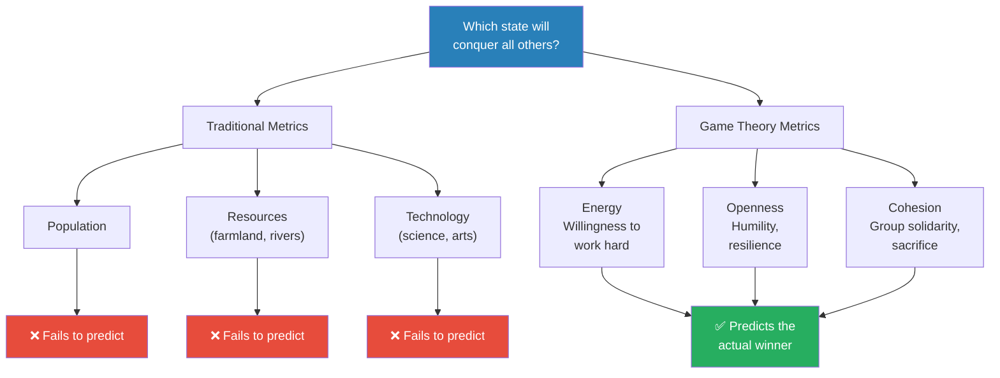
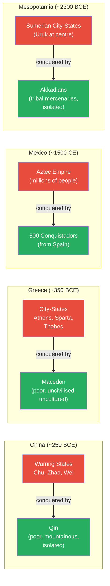
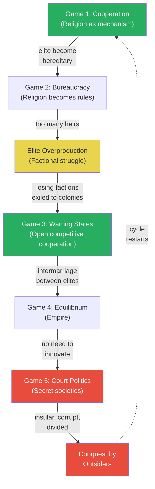
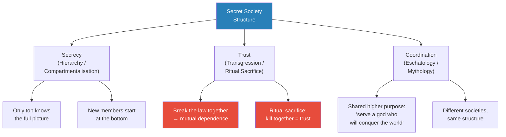
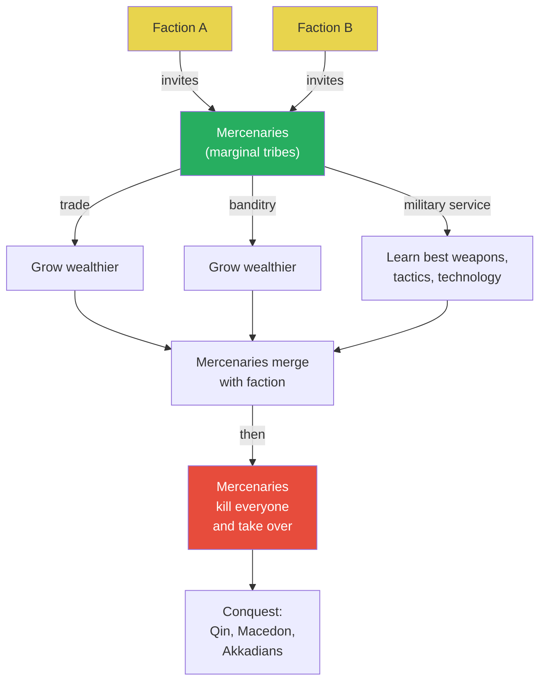
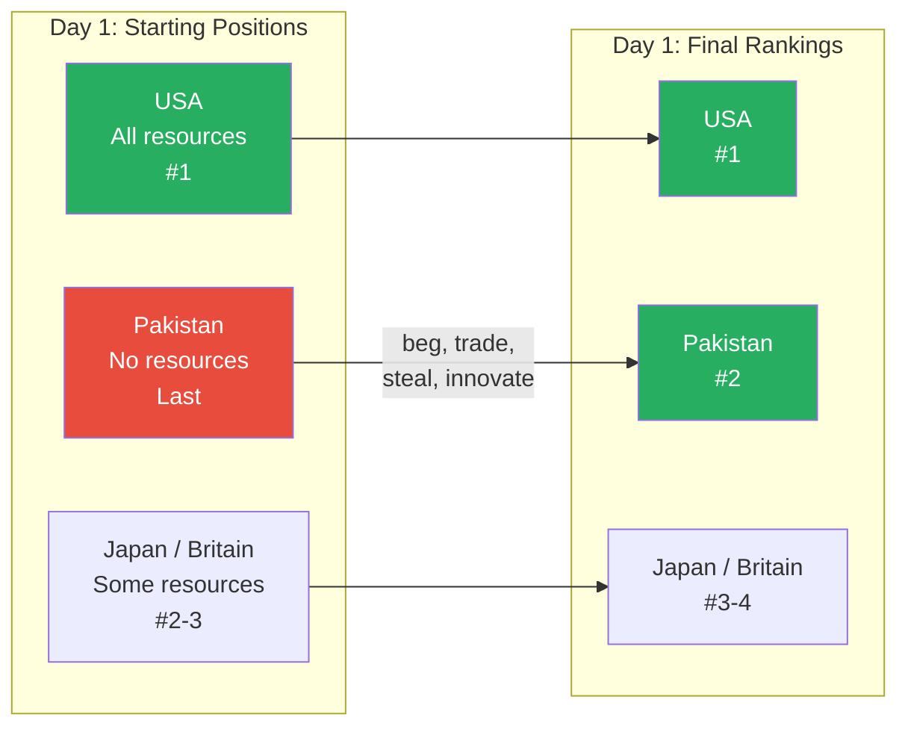
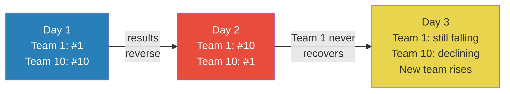
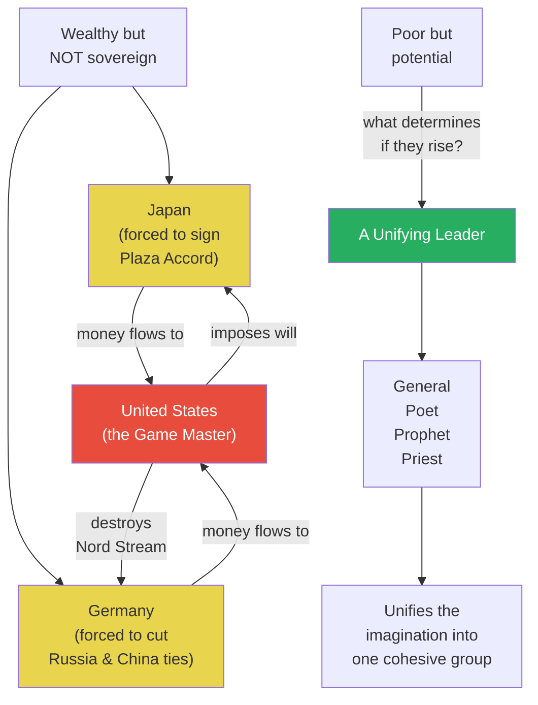

# The World Game

> Prof. Jiang asks the oldest question in history: why do empires rise and fall? Using examples from China's Warring States, the Greek city-states, the Aztecs, and ancient Sumer, he shows that the strongest, wealthiest power almost never wins. Instead, it is the poorest, most marginal group that conquers everyone. Drawing on the 14th-century Muslim scholar Ibn Khaldun's concept of asabiyyah (group solidarity), Prof. Jiang proposes three metrics -- energy, openness, and cohesion -- that predict which societies will triumph and which will collapse. He then maps the full lifecycle of civilisations through a game-theory lens: from cooperative religion, to elite overproduction, to warring states, to equilibrium, to court politics and secret societies, to corruption and conquest by outsiders. A classroom simulation called "The World Game" -- where the team that starts with nothing routinely finishes second -- drives the point home.

---

## Overview: Key Highlights

- <b style="color: #27ae60">The poorest, most marginal group conquers the strongest</b> -- this pattern repeats across every civilisation in human history, from China to Greece to Mesoamerica
- <b style="color: #2980b9">Asabiyyah (Ibn Khaldun)</b> -- group solidarity or cohesion: the 14th-century theory that explains why peripheral tribes defeat wealthy empires
- <b style="color: #2980b9">Energy, openness, and cohesion</b> -- the three metrics that measure how dynamic a society is and whether it will rise or fall
- <b style="color: #e74c3c">Wealth breeds corruption, insularity, and division</b> -- the rich become lazy, arrogant, and atomised, which is precisely what allows outsiders to conquer them
- <b style="color: #2980b9">Elite overproduction</b> -- too many heirs competing for too few positions of power, causing societies to fracture into factions
- <b style="color: #27ae60">The Warring States period is the peak of every civilisation</b> -- open, competitive cooperation produces maximum innovation
- <b style="color: #e74c3c">Secret societies solve secrecy, trust, and coordination</b> -- but they also make empires insular, corrupt, and divided from within
- <b style="color: #2980b9">The World Game</b> -- a classroom simulation where the team with no resources routinely finishes second, behind only the team with everything
- <b style="color: #e74c3c">Empires that fall never come back</b> -- the same people never recover; only new groups can restart the cycle
- <b style="color: #27ae60">Poverty forces creativity</b> -- the team that starts with nothing is forced to beg, lie, steal, and innovate, which is exactly what makes them succeed
- <b style="color: #2980b9">Mercenaries as the mechanism of conquest</b> -- declining factions invite outsiders to fight their internal battles, and the outsiders eventually take over
- <b style="color: #27ae60">A great leader unifies the imagination</b> -- whether a general, poet, priest, or prophet, one person catalyses a marginal group into a cohesive force

| Concept | One-line summary |
|---------|-----------------|
| **Asabiyyah** | Ibn Khaldun's term for group solidarity -- the force that lets poor, marginal peoples conquer wealthy empires |
| **Energy** | Willingness to work hard, focus, and pursue a clear goal with total commitment |
| **Openness** | Willingness to adapt, admit mistakes, learn from failure -- humility and resilience |
| **Cohesion** | Sense of being one team, willing to sacrifice for each other -- the opposite of atomisation |
| **Elite overproduction** | Too many heirs competing for too few elite positions, causing factional fracture |
| **Warring States period** | The phase of open competitive cooperation -- maximum innovation, maximum creativity |
| **Equilibrium** | When warring city-states merge through intermarriage and create a stable empire -- innovation stops |
| **Secret societies** | Factions within empires that solve secrecy (hierarchy), trust (transgression), and coordination (eschatology) |
| **Mercenaries** | Outsiders invited in by factions to fight internal battles -- they learn, grow wealthy, and eventually conquer |
| **The World Game** | A classroom simulation proving that starting with nothing forces the creativity needed to succeed |
| **Court politics** | The game that replaces innovation once equilibrium is reached -- who controls the hierarchy |
| **Eschatology** | The mythology a secret society uses to coordinate action -- "we serve a higher purpose" |

---

# The Lecture

## Why Does the Weakest State Always Win? [0:00 - 6:57]

*Prof. Jiang opens with a puzzle: in every civilisation, the strongest power does not come out on top. Whether it is China's Warring States, the Greek city-states, the Aztecs, or ancient Sumer, it is always the poorest, most marginal group that conquers everyone. He introduces Ibn Khaldun's theory of asabiyyah and proposes three metrics -- energy, openness, and cohesion -- that explain why.*

> [!tip] Core Insight
> Just because you have the most resources, the most people, and the most territory does not mean you will win the game. What matters is how energetic, open, and cohesive your people are -- and poverty is what forces those qualities into existence.

*Traditional metrics -- population, resources, technology -- fail to predict which state will dominate. The three game-theory metrics -- energy, openness, cohesion -- succeed every time.*

> [!note]- Expand: Full Lecture Detail
> Prof. Jiang opens with China's Warring States period, around 250 BCE. He asks the class: using game theory, which state would unite China and become the first great empire? He walks through the logical metrics:
>
> - **Population:** which state has the largest?
> - **Resources:** which has the most rivers and farmland?
> - **Technology:** which has the most scientists, the most advanced literature and arts?
>
> Using these metrics, you might predict Chu, Zhao, or Wei. At no point would you predict <b style="color: #2980b9">Qin</b>. And there are good reasons why not:
>   - Qin is in the mountains -- poor territory
>   - Far from the rivers and trade routes
>   - Geographically isolated
>
> Yet it is Qin that conquers all of China. And this is not an anomaly -- it is a pattern. Prof. Jiang states it bluntly: "If you look at most of human history, the strongest nation does not come out on top. It's usually the weakest, most marginalised area that will eventually come and conquer the entire territory and create an empire."
>
> He introduces <b style="color: #2980b9">Ibn Khaldun</b>, a 14th-century Muslim scholar and historian, who proposed the concept of <b style="color: #2980b9">asabiyyah</b> -- group solidarity or cohesion. Ibn Khaldun's theory: the people on the margins are poorer, but because they are poorer, they are more unified. They focus on solidarity, on working together. Meanwhile, in the rich areas, people become too individualistic, too decadent, too corrupt. This is why it is always the marginal tribes that conquer the wealthy civilised centres.
>
> Prof. Jiang then formalises this into three measurable metrics:
>
> - <b style="color: #2980b9">Energy</b> -- willingness to work hard, focus on a clear goal, motivated to achieve it
> - <b style="color: #2980b9">Openness</b> -- willingness to adapt, accept limitations, be resilient; "you can think of openness as humility, as resilience"
> - <b style="color: #2980b9">Cohesion</b> -- seeing yourselves as a team, willing to sacrifice for each other, functioning as a family
>
> He then explains why wealth destroys all three:
>   - <b style="color: #e74c3c">Low energy:</b> the elite do not want to work anymore -- they exploit others instead. The people, enslaved and indebted, also have low energy -- they are just trying to survive, not build something great
>   - <b style="color: #e74c3c">Low openness:</b> the elite become corrupt, insulated, and arrogant. They refuse to admit they are wrong. Society stagnates
>   - <b style="color: #e74c3c">Low cohesion:</b> wealth inequality and corruption atomise the population. People become individualised, fragmented
>
> This creates the opening for a new group to come in and conquer everyone.

---

## The Pattern Across Civilisations [6:57 - 15:18]

*Prof. Jiang demonstrates that the Qin conquest is not an isolated case but an iron law of history, walking through four civilisations -- the Greek city-states and Macedon, the Aztecs and the Conquistadors, and the Sumerians and the Akkadians -- each following the identical pattern.*

*Four civilisations, four continents, four millennia -- the same pattern every time. The wealthy, established power (red) falls to the poor, marginal outsider (green).*

> [!note]- Expand: Full Lecture Detail
> **The Greek City-States and Macedon**
>
> Prof. Jiang turns to the Greeks -- "really the height of human civilisation." He notes:
> - The Greek city-states were small, averaging about 1,000 people each, with thousands of them scattered across the Aegean
> - Athens at its height had about 50,000 people
> - The major powers -- Athens, Thebes, Sparta, Corinth, Argos -- were always competing
>
> By every metric, <b style="color: #2980b9">Athens</b> should have unified Greece:
>   - Greatest navy -- and the Aegean is about controlling the seas
>   - Controlled the trade routes, making it the wealthiest city-state
>   - Largest population, most innovation, most strategic location
>
> Instead, Athens became an empire, was attacked by the other city-states, and declined. The actual conqueror was the <b style="color: #27ae60">Macedonians</b> -- "poor, isolated, not all cultured, uncivilised." But they had energy, openness, and cohesion.
>
> What is most remarkable: after unifying the Greek world, Macedon under Alexander the Great went on to conquer the Persian Empire -- "the first great empire in human history" covering Egypt, Anatolia, Mesopotamia, and Persia -- in about ten years.
>
> **The Aztecs and the Conquistadors**
>
> The Mexican peninsula in the 15th-16th century was divided into warring city-states. The Aztecs arrived from the north -- "a poor tribe that's starving," looking for food, hired as warriors by other city-states. When they became too powerful, they were exiled to a marsh that everyone assumed would kill them. Instead:
>   - They turned the marsh into farmland through extraordinary creativity
>   - Over time, they conquered everyone and established an empire ruling millions
>
> Then the impossible happened: 500 Conquistadors under Hernando Cortes arrived in 1519 and conquered the entire Aztec Empire. Prof. Jiang acknowledges the standard explanations -- disease, the belief that Conquistadors were gods, local allies angry at the Aztecs -- but says they do not give "the full picture of what really happened." Game theory asks: what were the actual incentives and strategies at play?
>
> **The Sumerians and the Akkadians**
>
> Prof. Jiang pulls up a world map. Mesopotamia sits at the centre of global trade. <b style="color: #2980b9">Uruk</b> -- at the meeting point of the Euphrates and Tigris -- became the first great world city because it provided access to the Persian Gulf (and India), Egypt, and Anatolia. It grew wealthy as a trading post, set up colonies, and those colonies eventually became warring city-states.
>
> Again, you would expect one of these city-states to conquer the rest. Instead, it was the <b style="color: #27ae60">Akkadians</b> -- "tribal mercenaries from an isolated region" -- who built the first empire. Then the Persians, from the Zagros Mountains, came in and unified the entire area.
>
> Prof. Jiang steps back: "This is a pattern that emerges throughout human history. It's a pretty consistent pattern."

---

## The Lifecycle of Civilisations [15:18 - 26:53]

*Prof. Jiang now explains the mechanism -- not just that empires rise and fall, but exactly how the game changes at each stage. He maps the full lifecycle from cooperative religion to elite overproduction to warring states to equilibrium to court politics and secret societies, showing how each phase creates the conditions for the next.*

> [!tip] Core Insight
> As nations rise and fall, the game they are playing changes. Their motivations, incentives, and strategies transform at each stage. Understanding which game a society is currently playing tells you what will happen next.

*The full lifecycle of civilisations as a sequence of games. Green marks the creative phases; yellow marks the fracture point; red marks the terminal phases. The cycle then restarts with outsiders.*

*Every faction within a declining empire must form its own secret society. All secret societies solve the same three problems using the same mechanisms -- only the mythology differs.*

> [!note]- Expand: Full Lecture Detail
> Prof. Jiang now shifts from pattern to mechanism. He announces: "As nations rise and fall, the games they play changes. The game changes, and therefore, their motivations, their incentives, their strategies, change over time."
>
> **Game 1 -- Cooperation (the startup phase)**
>
> - In the beginning, a people need to come together and build a land where they can prosper or at least eat
> - The game is <b style="color: #27ae60">cooperation</b>, and the mechanism of cooperation is <b style="color: #2980b9">religion</b>
> - A dynamic religion motivates people to be energetic, gives them a reason to work hard
> - The people best able to articulate this religion become the elite -- poets and priests
> - "At this point in history, it's basically a startup -- everyone's enthusiastic, everyone's working hard, everyone feels as though they're making a positive contribution"
>
> **Game 2 -- Bureaucracy (the hereditary turn)**
>
> - Over time, the elite become hereditary: the game shifts to "how do I pass my privileges to my children?"
> - The religion transforms from creative energy into <b style="color: #e74c3c">bureaucracy</b>
>   - Before: religion was about energy, creativity, working together
>   - After: religion becomes rules -- "you must follow the rules of the game, there's a hierarchy, you must obey this hierarchy"
>
> **Elite Overproduction (the fracture)**
>
> - <b style="color: #2980b9">Elite overproduction</b>: privileges are passed to children, but over time there are too many children for too few positions
> - Society fractures into factions, usually organised around princes -- "there are four princes about to inherit the throne, four different factions that support them"
> - The prince is the symbol of a faction, not necessarily its leader
> - The losing factions are exiled and forced to set up colonies
> - This colonisation process continues until there is no more place to colonise
>
> **Game 3 -- The Warring States (the golden age)**
>
> - Now the colonies compete with each other, and you enter the <b style="color: #27ae60">Warring States period</b>
> - This is a time of <b style="color: #27ae60">maximum creativity</b> because of "open cooperative competition"
>   - Different colonies competing forces innovation
>   - At the same time, they trade with each other, sharing best practices and innovations
> - Prof. Jiang makes a striking point: China has been around for 5,000 years, but most inventions happened in the Warring States period -- "this 100 years, when we had Confucius, Mengzi, Laozi, Zhuangzi -- basically everyone"
> - The same applies to the Greeks during the classical period: "they basically created everything that becomes a foundation for Western civilisation"
>
> **Game 4 -- Equilibrium (the empire)**
>
> - Eventually, city-states discover they can cooperate through <b style="color: #2980b9">intermarriage</b> of their elites
> - Intermarriage creates an over-equilibrium: the elites are now above any single state
> - Warfare shifts purpose: it becomes organised and its real function is <b style="color: #e74c3c">population control</b> -- a way to resolve the overproduction problem
>   - "We have too many people struggling for too many status positions, and the way you do that is population control"
> - The city-states have now reached equilibrium, which is essentially the empire
>
> **Game 5 -- Court Politics (the decline)**
>
> - Once equilibrium is reached, there is no need to innovate -- "all you can do is maintain the status quo"
> - A rigid hierarchy forms, and the game becomes <b style="color: #e74c3c">court politics</b> -- who controls the top of the hierarchy
> - This creates factional struggle between different factions within the empire
>
> **Secret Societies**
>
> - The faction that triumphs must solve three problems: <b style="color: #2980b9">secrecy, trust, and coordination</b>
> - In theory everyone obeys the bureaucracy, but "if you just play by the rules of the game, you're going to lose. So what you want to do is cheat -- but if you cheat, you have to do so secretly"
> - Secret cheating creates trust problems (how do you trust co-conspirators?) and coordination problems (you cannot take notes in meetings because discovery means execution)
> - The historical solution: <b style="color: #2980b9">secret societies</b>
>
> Prof. Jiang explains how secret societies work -- and emphasises this is true for China, Greece, the Aztecs, and every other civilisation:
>
> - **Secrecy** through hierarchy and compartmentalisation: only people at the very top know the full picture. You enter at the bottom and slowly climb
> - **Trust** through <b style="color: #e74c3c">transgression</b>: "if we cheat or steal together, we are much more likely to trust each other -- because if you're caught, you all get punished." The most basic transgression is ritual sacrifice -- the group captures and kills someone together
> - **Coordination** through <b style="color: #2980b9">eschatology</b> (mythology): "why are you guys doing what you're doing? Because we're trying to serve a higher God that wants to conquer the world, and we are His servants"
>
> Every faction forms its own secret society. The game of empire becomes a struggle between competing secret societies. The consequences:
>   - <b style="color: #e74c3c">Insular</b> -- "you don't care what happens to the Empire, you don't care about the enemies of the Empire -- all you care about is that your team emerges on top"
>   - <b style="color: #e74c3c">Corrupt</b> -- "you need resources to play this game, so you steal from the people"
>   - <b style="color: #e74c3c">Divided</b> -- different factions tear the empire apart from within
>
> Prof. Jiang connects this directly to the three metrics:
>   - Insular is the opposite of **open**
>   - Corrupt is the opposite of **energetic**
>   - Divided is the opposite of **cohesive**
>
> "That's why the borderland tribes are able to conquer the empire."

---

## Mercenaries and the Mechanism of Conquest [31:40 - 37:08]

*Prof. Jiang reveals the precise mechanism by which marginal peoples gain the skills and opportunity to conquer empires: the declining factions invite them in as mercenaries, and through trade, banditry, and military service, the outsiders learn the empire's best technology and grow wealthy enough to take over.*

*The factions within a dying empire do the work of their own destruction. By inviting mercenaries to fight internal battles, they hand outsiders the skills, wealth, and access needed to conquer everyone.*

> [!note]- Expand: Full Lecture Detail
> Prof. Jiang explains that the different factions, desperate to win against each other, invite <b style="color: #2980b9">mercenaries</b> from the borderlands. There is always contact between empire and periphery through three channels:
>
> - **Trade** -- the peripheral peoples trade with the empire and grow wealthier
> - **Banditry** -- they steal from the empire and grow wealthier still
> - **Mercenary service** -- they fight for the empire and learn its best technology, fighting skills, and weapons
>
> "These people in the borderlands, they're so poor they'll do anything to survive -- so they'll trade with you, but also steal from you, and also come and fight for you."
>
> The endgame:
> - At first the mercenaries merge with the faction that hired them
> - Then the mercenaries kill everyone and take over
>
> He applies this specifically:
> - **The Qin:** "They don't teach you this in history class, but according to game theory, what happened was that different factions of these different states actually invited Qin to help them in their political struggle. And then the Qin basically conquered one by one by one"
> - **The Macedonians:** "The Macedonians came in and helped one city-state, then they conquered one city-state and moved on to the next. But there's always a certain faction of that city-state which invited Macedon in the first place"
>
> Prof. Jiang draws the practical lesson: "You want to know what's going to happen today, what's going to happen tomorrow? Figure out which areas of the world are the most energetic, most open, and most cohesive, and then figure out which empires are the most corrupt, most insular, and the most divided -- and then you'll figure out who will conquer who."

---

## The World Game Simulation [37:08 - 42:00]

*Prof. Jiang describes a classroom simulation he played in high school in Canada -- the World Game -- where teams are assigned countries and given envelopes with different resources. The team assigned Pakistan, which starts with nothing, routinely finishes second. He then describes running the same dynamic with teams of teachers in STEM workshops, where the last-place team on day one becomes the first-place team on day two.*

> [!tip] Core Insight
> Poverty forces creativity. The team that starts with nothing is forced to beg, lie, steal, and innovate -- and those are exactly the qualities that make you succeed. The team that starts with everything never has to reflect, never has to adapt, and becomes complacent.

*Pakistan starts with nothing and finishes second. The team forced into desperation develops exactly the energy, openness, and cohesion that the theory predicts.*

> [!note]- Expand: Full Lecture Detail
> Prof. Jiang describes the World Game he played in high school in Canada:
>
> - Teams of four or five players, each assigned a country (USA, Britain, India, Pakistan, Japan)
> - Each team receives an envelope with resources -- paper, scissors, rulers, glue
> - A "World Bank" buys commodities (triangles, circles, squares) from teams
> - To create commodities, you need specific resources -- but different countries have different amounts
> - **United States has everything**
> - **Pakistan gets nothing** -- literally no resources at all
> - Teams are allowed to trade with each other
>
> What happens at the end of the day:
>   - USA finishes #1 -- "because United States just has everything in the world"
>   - **Pakistan finishes #2** -- not Japan, not Britain
>   - Why? "Because you're forced to be the most energetic, the most open, and most cohesive. Team members have to go and beg to work for free. Other team members go and lie and cheat and steal. They're forced to be resourceful and creative"
>
> Prof. Jiang then explains the same dynamic from his experience teaching STEM to teachers:
> - He divides faculty into teams of four or five, with about ten teams total
> - Day one: teams compete on assignments (build the fastest car, the best airplane, a catapult)
> - Teams are ranked 1-10 at the end of day one
> - Day two: new assignments, same teams
> - **The results reverse.** Team 10 (last place on day one) shoots up to first place. Team 1 falls
>
> He explains:
> - "If you're the best student in the school, you never have to reflect. You become arrogant, complacent"
> - "If you're the worst student, you're used to being laughed at, used to constantly adapting"
>
> > [!example] The Chinese Joke About Best and Worst Students
> > - In China, there are two students everyone hates -- the best student and the worst student
> > - You hate the best student because he will graduate and come back as your principal
> > - You hate the worst student because he will graduate and come back to give you a lecture on how to become rich
> > - Both will be the most successful -- especially the worst student
> > - The worst student is open-minded, willing to work hard, and willing to help build teams and make sacrifices so others become his friend
> > **The lesson:** The qualities that make you succeed in life -- adaptability, humility, team-building -- are the opposite of what makes you succeed in school.
>
> Prof. Jiang then makes a provocative application: "If I were to surmise the future, I would say right now in East Asia, I would think that North Korea has a better future than China." He acknowledges this sounds impossible -- "North Korea can't even feed its own people" -- but argues that game theory forces this conclusion, because what matters is how open, energetic, and cohesive the people are, not how rich and powerful they are.

---

## Empires Never Come Back [42:00 - 44:37]

*A student asks the critical question: if Team 10 rises to first on day two, does Team 1 reflect and return to first on day three? Prof. Jiang's answer is stark: no. Empires that fall never come back. The same people never recover.*

*The reversal is not a pendulum that swings back. Team 1 screws up on day two and continues to screw up on day three and four -- because they do not know what they did wrong and refuse to reflect.*

> [!note]- Expand: Full Lecture Detail
> A student asks: after Team 10 becomes first on day two, will Team 1 be forced to become open and energetic and rise again on day three?
>
> Prof. Jiang's answer is definitive:
> - "What happens is that Team 1 really screws up on day two. Day three and day four, they continue to screw up. Why? <b style="color: #e74c3c">Because they don't know what they did wrong, and they refuse to reflect</b>"
> - "We see this in history, where an empire, once it rises, it falls, it never comes back. It never comes back"
> - It is possible that new people come in and use the name of the old empire -- "but it's not the same people anymore. It's a different team"
> - "When societies fall, they just die off. It's possible a new group comes and pretends to be them, but they're actually a different people"
>
> A second student follows up: does Team 10 then fall on day three and Team 9 rises? Prof. Jiang says he has never run a day three, but "that's what should happen" -- Team 10 will fall off and a new team will take its place.
>
> > [!quote] Prof. Jiang
> > "When you're number one, you become so arrogant that it becomes impossible for you to be humble again."

---

## Three Future Empires [44:37 - 47:00]

*Prof. Jiang applies his theory to predict the future, naming three nations -- Germany, Japan, and Israel -- that he believes will emerge as great empires because they were destroyed but never held true imperial power.*

> [!note]- Expand: Full Lecture Detail
> Prof. Jiang applies the theory forward. If the pattern holds, three countries should emerge as great empires:
>
> - <b style="color: #2980b9">Germany</b> -- "Lost World War One and Lost World War Two. They were never a world empire." According to theory, Germany will one day come to dominate at least Europe and Asia. "I'm pretty sure of it, actually"
> - <b style="color: #2980b9">Japan</b> -- destroyed in World War Two, hit with two nuclear bombs and devastating firebombing. "Now you go to Japan, you can see how energetic people are, how open they are, how cohesive they are. Because Japan was destroyed in World War Two, it forced them to reflect as a people, and now they want vengeance, basically"
> - <b style="color: #2980b9">Israel</b> -- "the people in Israel believed that for thousands of years they were persecuted by other people"
>
> And the corollary: "The Americans are done."
>
> A student calls out: "China, done." Prof. Jiang acknowledges this follows from the theory.

---

## Q&A: Wealth Without Power, and What Makes a Leader Emerge [47:00 - end]

*In the Q&A, students push Prof. Jiang on two important objections: how can Japan and Germany still have energy if they became wealthy after World War Two? And what determines whether a poor society develops the energy to rise? Prof. Jiang's answers introduce two critical nuances -- the difference between wealth and sovereignty, and the role of a unifying leader.*

*Wealth without sovereignty is not real power. Japan and Germany got rich but remained vassal states. Meanwhile, the key variable that determines whether a poor group rises is whether a leader emerges to unify them.*

> [!note]- Expand: Full Lecture Detail
> **Objection 1: Japan and Germany became wealthy -- shouldn't they now be corrupt?**
>
> A student raises a sharp objection: after World War Two, Japan and Germany became very wealthy. According to the theory, they should have become corrupt, insular, and arrogant. Why haven't they?
>
> Prof. Jiang's answer introduces a crucial distinction: <b style="color: #27ae60">wealth is not the same as power</b>. Power means "you're able to impose your game on other people, able to make other people play your game, and therefore able to extract rent from other people."
>
> Japan and Germany became wealthy, but <b style="color: #e74c3c">the Game Master was America</b>:
>   - **The Plaza Accord:** Japan was becoming too wealthy. America told Japan to destroy its own economy -- to stop saving money and start spending. "In theory, it seemed as though Japan got rich, but Japan never had any power. It could not be a sovereign nation"
>   - **US Treasury bonds:** all the money from Japan and Germany flowed to America through forced purchase of US Treasury bonds
>   - **Nord Stream:** America destroyed Germany's pipeline to Russia "and there's nothing Germany can do about it"
>   - **Trade restrictions:** America told Germany it can no longer do business with Russia (its energy source) or China (its export market). "The German economy has been destroyed right now because Germany is a vassal state to America"
>
> The conclusion: Japan and Germany appear wealthy but have never been sovereign. They are vassal states.
>
> **Objection 2: What makes a poor society develop energy rather than staying poor?**
>
> Another student asks the critical question: many societies are poor, but not all develop energy, openness, and cohesion. What determines which ones do?
>
> Prof. Jiang clarifies first: "Just because you're poor does not mean you're open, energetic, and cohesive. But if you want to go from being poor to becoming rich, you have to be open, energetic, and cohesive." He gives the example of Africa -- "they're poor, but doesn't mean they're open, energetic, cohesive."
>
> The answer to what makes the difference: <b style="color: #27ae60">a leader</b>.
>
> > [!example] Genghis Khan and the Mongols
> > - Before Genghis Khan, the Mongols were almost a vassal state -- divided, poor, willing to do anything to survive
> > - They worked as mercenaries for other groups
> > - Then Genghis Khan emerged and unified everyone
> > - Once unified, the Mongols very quickly destroyed everyone else
> > **The lesson:** A single leader can transform a marginal, divided people into a cohesive force capable of conquering the world.
>
> The leader does not have to be a general. Prof. Jiang lists the types:
>   - A poet (like Homer)
>   - A great thinker who gives you a new religion
>   - A prophet (like Zoroaster, or Jesus)
>   - A priest
>
> "That one person then unifies the imagination of everyone into one cohesive group."
>
> Prof. Jiang then makes a provocative final point about international development:
> - "Why do we have organisations like the United Nations? Why do we have international development aid?"
> - "The goal is to identify the possibility of a leader emerging and make sure he does not emerge"
> - "If you left Africa alone, Africa will be a lot better. But because you have all these schools, all these NGOs, all these organisations in Africa, what they're really doing is ensuring that Africa is in a continuous state of development"
> - If left alone, "they might starve, but at the same time, a great leader might emerge to unite all of them"
>
> He promises: "We'll talk about this next class -- how the American empire controls the world."

---

## Connections

**Builds on:** [[01 - The Dating Game]] (game theory fundamentals: players, rules, incentives, superstructure)
**Sets up:** Lecture 06 ("The World's Bank") and Lecture 07 ("America's Game") -- how the American empire maintains control
**Related books in vault:** [[Sapiens - Yuval Noah Harari]] (agricultural revolution, the wheat domestication inversion), [[The 48 Laws of Power - Robert Greene]] (court politics, factional struggle), [[The 33 Strategies of War - Robert Greene]] (asymmetric warfare, marginal forces defeating dominant ones)

---

## The Takeaway

This lecture reframes how to think about power. The intuitive view -- that the strongest, wealthiest, most technologically advanced society wins -- turns out to be historically wrong. Across China, Greece, Mesoamerica, and Mesopotamia, it is the poorest, most marginal group that conquers the dominant power. Ibn Khaldun saw this pattern in the 14th century and named it asabiyyah. Prof. Jiang formalises it as three metrics -- energy, openness, and cohesion -- and shows that wealth systematically destroys all three.

The most counterintuitive insight is that the mechanism of conquest is self-inflicted. Declining empires do not fall to external invasion -- they fall because their own factions invite outsiders in to fight internal battles. The Qin did not storm the Warring States from outside; they were invited in by factions who needed mercenaries. The Macedonians did not assault the Greek city-states; they were drawn in one city-state at a time. The empire does the work of its own destruction.

The question Prof. Jiang leaves hanging is the one he promises to answer next: how does the American empire -- the current Game Master -- maintain its dominance? If the theory is correct, America is already insular, corrupt, and divided. The next lectures will examine who the mercenaries are, and which marginal group is learning America's best technology while fighting America's battles.
