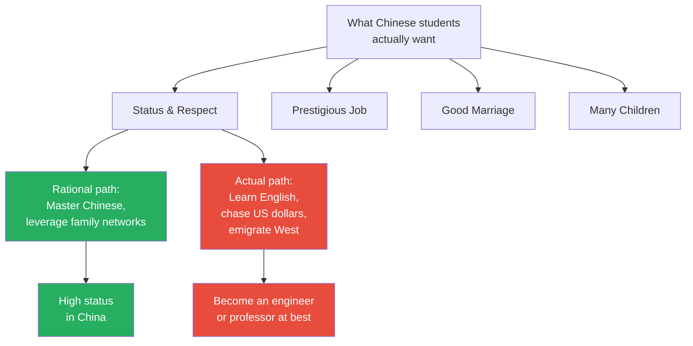
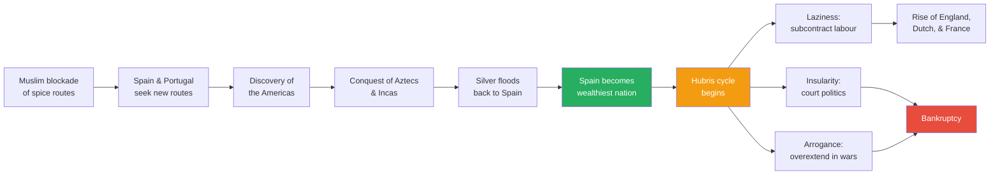
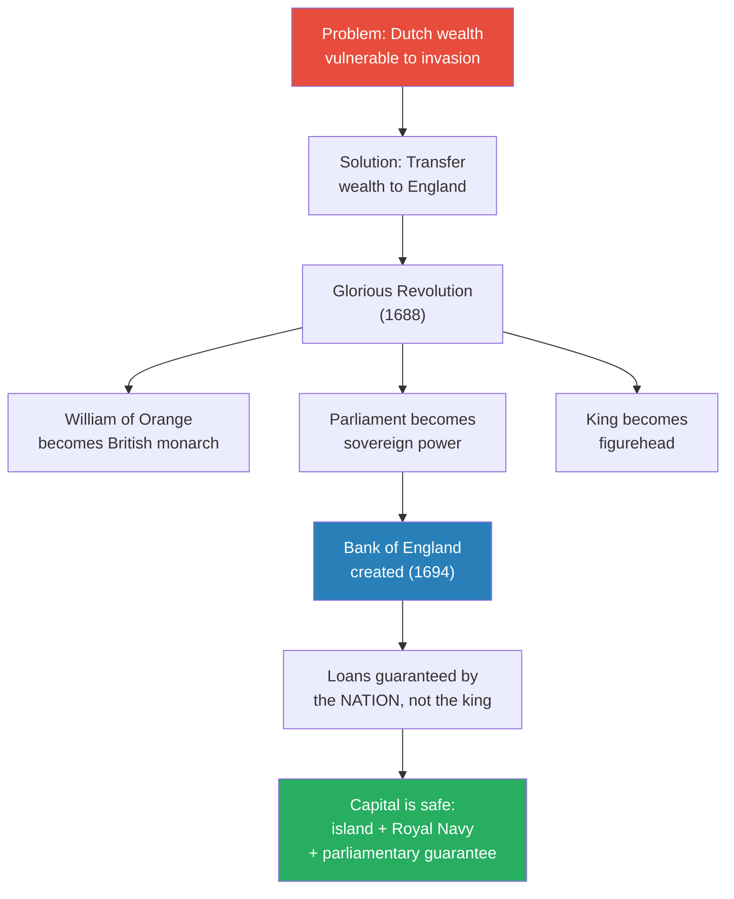
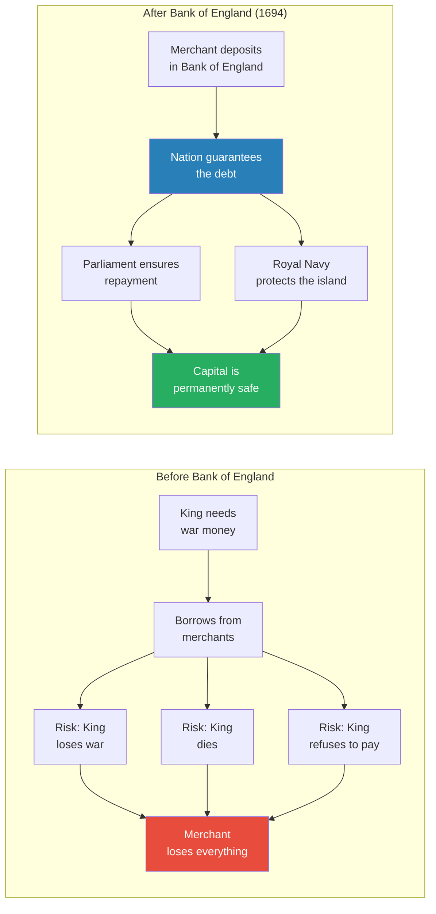
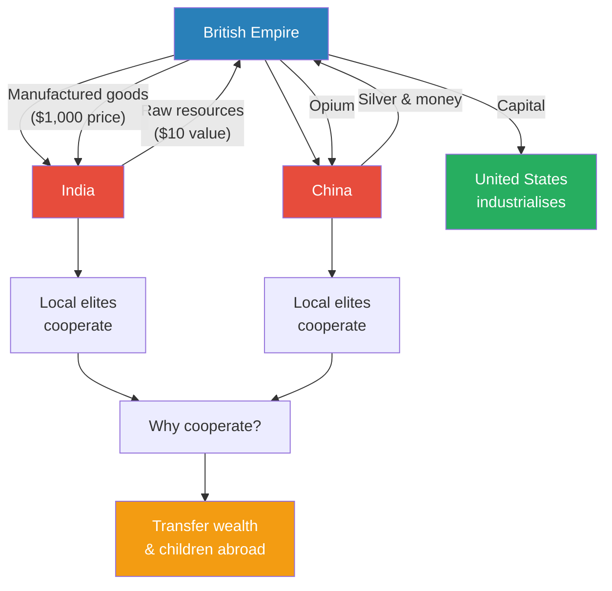
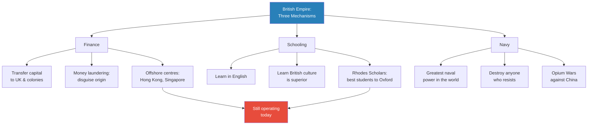
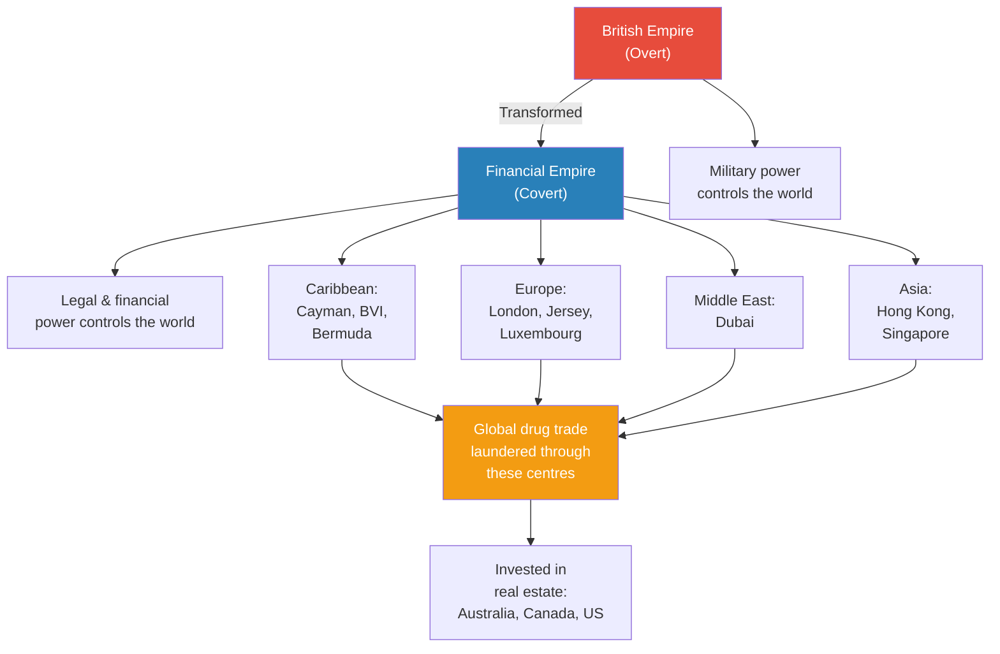
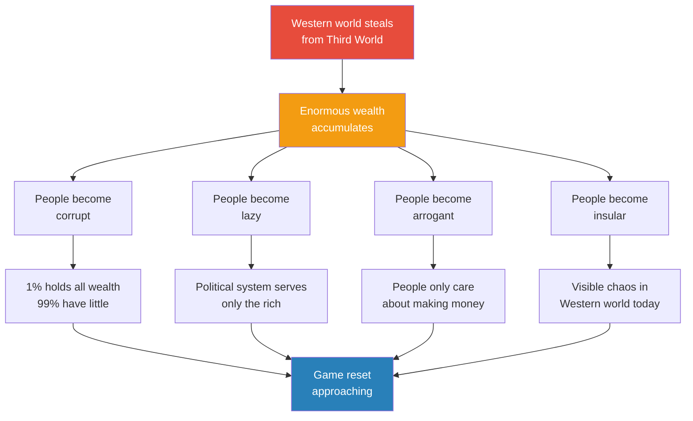

# The World's Bank

> Prof. Jiang opens by asking his Chinese students a discomforting question: why do you spend your lives learning English, chasing US dollars, and dreaming of emigrating to countries where you will be second-class citizens? The answer, he argues, is that they are playing a game the British Empire designed three centuries ago — and that the Americans inherited. Through the rise and fall of Spain, the Glorious Revolution, the creation of the Bank of England, and the East India Company's plunder of India and China, Prof. Jiang traces how Britain built the world's first global financial empire: a system designed to attract, launder, and protect the wealth of corrupt elites worldwide. That system — offshore financial centres, English-language schooling, naval supremacy — is still running today, long after the empire that created it has formally dissolved. The lecture ends with a warning: the game's own success has corrupted the societies that run it, producing the inequality, immorality, and instability tearing the Western world apart.

---

## Overview: Key Highlights

- <b style="color: #27ae60">The game Chinese students are playing was designed by the British Empire</b> — learning English, chasing dollars, and dreaming of emigration are all rational responses to a system that rewards obedience to Western institutions
- <b style="color: #2980b9">The Bank of England (1694)</b> — the world's first institution that guaranteed capital not to a king but to a nation, making investment safe from royal default
- <b style="color: #e74c3c">Spain's wealth made it lazy, insular, and arrogant</b> — the classic hubris cycle: energy and cohesion replaced by corruption, court politics, and overextension
- <b style="color: #27ae60">The Glorious Revolution was really about protecting capital</b> — not about religion or liberty, but about transferring Dutch wealth to an island fortress protected by the Royal Navy
- <b style="color: #2980b9">Offshore Financial Centres (OFCs)</b> — the modern descendants of the Bank of England: Hong Kong, Singapore, Dubai, Panama, the Caribbean — all former British Empire territories
- <b style="color: #e74c3c">Money laundering is the system's core function</b> — Britain's legal and financial infrastructure exists to clean stolen wealth and make it legitimate
- <b style="color: #2980b9">John Locke's contract law</b> — life, liberty, and property as inalienable rights, with no questions asked about how the property was obtained
- <b style="color: #27ae60">Three mechanisms of empire: finance, schooling, and navy</b> — the Bank of England attracts capital, English-language education indoctrinates elites, and naval power enforces compliance
- <b style="color: #e74c3c">The British Empire still exists</b> — it transformed from overt military control to covert financial and legal control, operating through the same offshore centres
- <b style="color: #2980b9">Over-financialisation</b> — too much money corrupts a society, producing the inequality, political dysfunction, and moral collapse visible across the Western world today
- <b style="color: #e74c3c">The system is self-defeating</b> — the game that made the West powerful is now destroying it from within, because cheating produces short-term advantage but long-term corruption
- <b style="color: #27ae60">We are at a game reset</b> — the current system is unsustainable, and a new game is about to emerge

| Concept | One-line summary |
|---------|-----------------|
| **Bank of England** | First institution to guarantee capital to a nation rather than a king — making investment safe from royal default |
| **Glorious Revolution (1688)** | British nobility replaced their own king with a Dutch ruler to create parliamentary sovereignty and attract Dutch capital |
| **Offshore Financial Centre (OFC)** | Jurisdictions that accept wealth without asking its origin — the modern form of the British financial empire |
| **Money laundering** | The process of disguising stolen or criminal wealth as legitimate investment — the empire's core service |
| **Contract law (Locke)** | Government exists to protect life, liberty, and property — with private property treated as God-given and origin-irrelevant |
| **Hubris cycle** | Success produces wealth, wealth produces laziness, arrogance, and insularity, which produces collapse |
| **State-sponsored piracy** | Britain's early wealth strategy — Sir Francis Drake stealing Spanish silver under royal commission from Elizabeth I |
| **Over-financialisation** | Too much money flowing into a society, corrupting its institutions, its politics, and its people |
| **East India Company** | Britain's private vehicle for colonising India and China — extracting resources and destroying local industry |
| **Soft power through schooling** | English-language education as an indoctrination system that makes colonial elites believe British culture is superior |
| **Protestant work ethic (Calvinism)** | The religious differentiation that gave Britain and the Dutch energy and work ethic while Catholic Spain grew complacent |

---

# The Lecture

## The Strange Game Chinese Students Play [0:00 - 3:30]

*Prof. Jiang opens by confronting his Chinese students with an uncomfortable mirror: three things they do that make no rational sense — learning English instead of mastering Chinese, obsessing over US dollars instead of pursuing local status, and dreaming of emigrating to countries where the game is rigged against them.*

> [!tip] Core Insight
> What Chinese students actually want — status, respect, a prestigious job, a good marriage — is far more achievable in China given their family wealth and connections. The fact that they pursue these goals through English, dollars, and emigration instead reveals that they are playing a game someone else designed.

*The rational path (green) leads to high status at home. The path students actually follow (red) leads to mediocrity abroad. The gap between the two reveals a game designed to extract talent from the developing world.*

> [!note]- Expand: Full Lecture Detail
> Prof. Jiang opens with a direct challenge: "I want to examine why you Chinese students behave the way you do. Believe it or not, the game that you're playing — it's strange. It's weird."
>
> He identifies three irrational behaviours:
>
> - **Learning English over Chinese** — students spend more time on English than their native language, citing reasons like "I want to learn knowledge" or "I want to go abroad." Prof. Jiang dismisses these as inadequate explanations
> - **Obsession with US dollars** — the fixation on earning in American currency rather than building wealth in yuan
> - **Immigration as the life goal** — wanting to go to the United States for college, get a degree, and stay. "But as we discussed before, that's strange because you are much higher status in China, much more likely to get a good job, much more likely to marry a beautiful woman than in the United States, where the game is rigged against you"
>
> He points out the ceiling: "The most that you can hope to obtain is maybe become an engineer or professor if you're really, really smart, but you're not going to achieve political power. You're not going to become a CEO of a major company."
>
> The punchline: "The best and brightest in China — they just want to be common people in the United States or Britain or Canada. So it's a really weird game."
>
> <b style="color: #27ae60">The question for the lecture: how was this game constructed? And the answer is — the British.</b> The British Empire created this game, the Americans inherited it, and the entire world plays it today.

---

## The Spanish Empire — Rise Through Conquest [3:30 - 9:00]

*Prof. Jiang traces the origins of the global game back to Spain's accidental empire. Blocked from the spice trade by Muslim middlemen, Spain and Portugal sailed west, discovered the Americas, conquered the Aztecs and Incas, and flooded Europe with silver. But wealth triggered the hubris cycle: energy became laziness, openness became insularity, and cohesion became arrogance.*

*Spain's trajectory from the Muslim blockade to bankruptcy follows the hubris cycle precisely. The green node marks peak power; orange marks the inflection point; red marks the inevitable result of laziness, insularity, and overextension.*

> [!note]- Expand: Full Lecture Detail
> Prof. Jiang begins with the spice trade. For most of history, Europe was a poor place that depended on trade with the East Indies (Southeast Asia) for spices — cinnamon, nutmeg, peppercorn. "Spices are actually worth more than gold. One ship — if you bring one ship of these spices back to Europe — you had intergenerational wealth."
>
> The problem: the Muslim world controlled the trade routes. After the Christians reconquered Spain from Muslim rule (the Reconquista), the Muslims blockaded them or charged heavy levies. Spain and Portugal were forced to find new routes.
>
> - Portuguese explorers went south around Africa — "Africa is not really hospitable, lots of viruses and diseases"
> - Spanish explorers went west and discovered the Americas
> - They found the Aztecs and Incas — "empires they could easily conquer"
> - Silver was transported back to Spain in enormous quantities
>
> "And so overnight, Spain became extremely wealthy."
>
> Then came the hubris cycle, exactly as predicted by the framework from previous lectures:
>
> - <b style="color: #e74c3c">Lazy</b> — "They had all this wealth, and they decided they really don't want to work anymore." Spain subcontracted labour to England, the Dutch Republic, and France
> - <b style="color: #e74c3c">Insular</b> — "The Spanish aren't concerned about other nations. They think they're invincible, so they engage in court politics — all infighting for the throne"
> - <b style="color: #e74c3c">Arrogant (hubris)</b> — "You believe you are invincible, you can do whatever you want, and therefore you start all these wars against everyone, everywhere. You overextend yourself"
>
> The result: "Even though Spain becomes very wealthy very fast, they also go bankrupt very fast."
>
> Meanwhile, England, the Dutch, and France were growing "much more energetic, open, and cohesive" — the inverse of Spain's decline. This differentiation also expressed itself through religion: Spain remained Catholic, while Britain and the Dutch became <b style="color: #2980b9">Protestant Calvinist</b>. "Catholic is really about obeying authority, but the Protestant, the Calvinist religion, insists on hard work, on energy, on obtaining wealth."
>
> > [!example] Sir Francis Drake and State-Sponsored Piracy
> > - All the silver being transported from the New World back to Spain created an irresistible target
> > - The English realised they could engage in piracy and steal this silver for themselves
> > - The most famous pirate was Sir Francis Drake, who worked directly under Elizabeth I
> > - This was state-sponsored piracy — not a criminal enterprise but a national strategy
> > - It made Britain very wealthy very quickly
> > **The lesson:** Britain's wealth did not come from honest industry — it came from stealing Spanish loot under royal commission. The empire was built on piracy before it was built on banking.

---

## The Three Rising Powers — England, the Dutch, and France [9:44 - 15:15]

*As Spain declines, three nations fill the vacuum. The Dutch become the wealthiest per capita through trade. The English grow wealthy through piracy. The French remain divided between Catholic and Calvinist. The 30 Years War — the deadliest conflict in Europe before World War One — creates a problem that will reshape the world: how do you keep your wealth safe when armies can take everything?*

> [!note]- Expand: Full Lecture Detail
> Prof. Jiang shows a map of trade routes. The Spanish are extracting silver from the New World. The French want fur from North America. But the nations truly engaged in trade, shipping, and piracy are the British and the Dutch.
>
> "And the reason why is that they're poor. And so through this hard work, they become very wealthy, very quickly. In fact, the Dutch become the wealthiest nation in the world per capita."
>
> But wealth creates conflict. The Dutch were technically a colony of the Spanish Empire, and Spain wanted to tax them more heavily. The Dutch wanted independence. This escalates into the <b style="color: #2980b9">30 Years War</b> (1618-1648) — "ostensibly a religious conflict between Protestants and Catholics, but there are lots of underlying factors."
>
> The critical fact: "Millions and millions of people die. It is the deadliest war in Europe up until World War One."
>
> This creates a problem for the merchant class:
>
> - You became wealthy through trade — going to the East Indies, getting spices, selling them in Europe
> - But if the Spanish or the French send an army and steal everything, how do you keep your gold safe?
> - <b style="color: #27ae60">This anxiety about the security of capital is what drives the next move</b>
>
> The solution: "The British and the Dutch are going to decide to get married."

---

## The Glorious Revolution — A Marriage of Money [15:15 - 17:41]

*Prof. Jiang reframes the Glorious Revolution of 1688 not as a triumph of liberty or Protestantism, but as a financial merger. The British nobility invited William of Orange — leader of the Dutch Republic — to become their king, not out of principle but to create a safe harbour for capital. Parliament became sovereign, the monarch became a figurehead, and Dutch wealth crossed the English Channel to the safety of an island fortress.*

> [!tip] Core Insight
> The Glorious Revolution was not about religion or liberty. It was about protecting capital. The entire restructuring of the British state — parliamentary sovereignty, contract law, the Bank of England — was designed to make England the safest place in the world for wealthy people to park their money.

*The Glorious Revolution solved the fundamental problem of early modern capitalism: how do you stop a king from stealing your money? Answer: make the nation — not the king — the guarantor of debt, then protect that nation with an unbreachable navy.*

> [!note]- Expand: Full Lecture Detail
> Prof. Jiang explains the background: "Throughout British history, what makes Britain unique is that the monarch has always been in conflict with the nobility. The king has always been in conflict with the oligarchs."
>
> The surface reason for the revolution was religious — James II was Catholic and Britain was Protestant. "But the real reason is the nobility want to exert authority over the country."
>
> The deal:
>
> - Parliament becomes the de facto sovereign power in England
> - William of Orange agrees to be "the puppet or the figurehead"
> - "But the real power is in Parliament, and so this creates the idea of <b style="color: #2980b9">national sovereignty</b>"
>
> But Prof. Jiang insists the deeper motive was financial: "What people don't appreciate is that the real reason why they want to do that is they want to protect capital." Not just English capital — <b style="color: #27ae60">transnational capital</b>.
>
> - The Dutch had a huge problem: they were constantly being invaded by Spain
> - "What you do is, you take all the gold in the Dutch Republic and you transfer it over to England"
> - England was safe because it was an island, protected by the Royal Navy
> - "It's impossible for the French, the Habsburg Empire, or the Spanish to invade England"

---

## The Bank of England — Lending to a Nation [17:41 - 22:00]

*In 1694, the Bank of England is created. Prof. Jiang explains why this single institution changed the world: for the first time, investors were lending money not to a mortal, defeatable, or dishonest king, but to a nation — a permanent entity guaranteed by Parliament and protected by geography. This, combined with John Locke's philosophy of property rights, made England the world's first offshore financial centre.*

*Before the Bank of England, lending to a king was a gamble — he could lose, die, or simply refuse to repay. After 1694, lending to a nation eliminated all three risks. This single innovation made England the magnet for European capital.*

> [!note]- Expand: Full Lecture Detail
> Prof. Jiang walks through the three risks of lending to a king:
>
> - "One, you could lose the war — in which case, oops"
> - "Second, you could die — in which case, oops"
> - "And the third problem is that you could just say, I'm king, I'm not gonna give you back your money"
>
> The merchant's only recourse was revolution — "but as a merchant, as a capitalist, you don't want to go through this process."
>
> The Bank of England solved all three problems: "Now you are lending money not to the king, but to the nation. The nation has to pay you back. So even though the king dies, <b style="color: #27ae60">the people are liable for the debt</b>."
>
> But why would the Dutch trust this new arrangement? "Because remember, at this time, they can still screw you over." Prof. Jiang identifies three trust mechanisms:
>
> - **Intermarriage** — aristocratic families married across the Channel
> - **Religion / secret societies** — both nations were Calvinist; the <b style="color: #2980b9">Freemasons</b> facilitated trade between them
> - **Contract law** — the philosopher <b style="color: #2980b9">John Locke</b> articulated a new idea of government: "Government provides the inalienable right to life, liberty, and the pursuit of property"
>
> Prof. Jiang dwells on Locke's property doctrine: "The entire purpose of Parliament and the courts — the judicial system — is to ensure that your private property is protected <b style="color: #e74c3c">no matter where your private property came from</b>."
>
> He makes the implication explicit: "If you're French, you kill a million people to steal a million gold — they don't care. It's yours. It's private." The philosophical justification: "They believe that this private property comes from God. This is yours because God willed it to be yours, and England must protect it."
>
> This creates the concept of the <b style="color: #2980b9">Offshore Financial Centre (OFC)</b>: "Think of Dubai or Hong Kong, where they don't care where the money comes from. Their legal system, the financial system, will help protect this money."
>
> > [!example] The Seven Wars Against Napoleon
> > - Napoleon was about to conquer all of Europe
> > - If he succeeded, he could blockade England and control all European wealth
> > - Britain financed seven separate wars against Napoleon
> > - They lost the first six
> > - They won the seventh — and that victory created the British Empire as a global financial power
> > **The lesson:** Britain did not defeat Napoleon through military superiority. It defeated him through financial endurance — the ability to keep funding wars long after any other nation would have gone bankrupt. The Bank of England made this possible.

---

## The East India Company — Plundering India and China [22:00 - 27:43]

*Prof. Jiang shows how the financial system was weaponised through the East India Company. Britain colonised India by deliberately destroying its textile industry, then forced a trade structure where India exported raw resources cheaply and imported expensive British manufactured goods. The same pattern was applied to China through the opium trade. The critical question: why did local elites cooperate with their own countries' plunder?*

> [!tip] Core Insight
> The British Empire did not conquer the world through military force alone. It constructed a game that incentivised local elites to betray their own people — by offering them something no domestic system could: the ability to transfer their stolen wealth and their children to safety abroad.

*The trade flows were grotesquely one-sided: India and China exported cheap resources and received expensive goods and opium in return. But the system only worked because local elites chose to participate — and they participated because Britain offered them an escape route for their stolen wealth.*

> [!note]- Expand: Full Lecture Detail
> Prof. Jiang explains the mechanics of colonial extraction:
>
> - The East India Company was private, based in Britain, and modelled on the Bank of England
> - It colonised India primarily by <b style="color: #e74c3c">deindustrialising India</b> — "India had textile factories, but England through a lot of policies bankrupted the Indian textile industry and transferred it over to England"
> - The deal was structurally exploitative: "We, Britain, give you India $10 and India, you give us $1,000"
> - The same pattern was applied to China through the opium trade — opium went in, silver came out
> - The extracted wealth then flowed to the United States, enabling American industrialisation
>
> The critical question: "How was England able to create a system in which India and China basically voluntarily gave up their wealth?"
>
> The answer: "England simply created a game that incentivised the local elites to cooperate."
>
> - Local elites were already in conflict with each other
> - They were looking for more power over domestic rivals
> - <b style="color: #27ae60">"If you help us, we will help you steal the gold from this country"</b>
> - Before the British, if an elite lost a power struggle, they could be killed
> - Now, if they cooperated with the British, they could transfer their wealth and children abroad
>
> "Does that make sense? So now what's gonna happen is that the elite are going to be able to send their children and their wealth to the British Empire."

---

## The Three Mechanisms of Empire [27:43 - 35:00]

*Prof. Jiang identifies the three mechanisms that sustained the British Empire and continue to operate today: financial infrastructure (money laundering through offshore centres), educational soft power (English-language schooling that indoctrinates colonial elites), and military supremacy (the Royal Navy). He argues these mechanisms did not disappear with the empire — they simply went covert.*

*The three mechanisms of empire — finance, schooling, and navy — were the British trifecta. Two of the three (finance and schooling) survived the formal end of empire and still operate through offshore centres and English-language institutions worldwide.*

> [!note]- Expand: Full Lecture Detail
> **Mechanism 1 — Finance (Money Laundering):**
>
> - Local elites could transfer their capital to the United Kingdom and its colonies
> - Britain would disguise the origin — "This is what we call <b style="color: #2980b9">money laundering</b>"
> - "When you steal from your people, not only will Britain allow you to do this, but they will disguise it for you"
> - "Their lawyers will pretend that this money came not from drugs, not from gambling, not from prostitution, but from restaurants, from real estate"
> - Then they help you "settle overseas where it becomes legitimate — now you have real estate investments in Australia or Canada"
> - <b style="color: #e74c3c">"This is a global money laundering system that encourages the local elites to be corrupt. It protects them in their corruption"</b>
>
> **Mechanism 2 — Schooling (Soft Power):**
>
> - "The British, when they conquered India and China, what they were trying to do is brainwash and indoctrinate the elites"
> - They set up English-language schools where students learned Shakespeare, British philosophy, British history
> - "As a result, you surely come to believe that the British are superior to us, and therefore I should try my best to be British"
> - The schooling system also offered mobility: "If you are a really smart person in China, there's really little mobility for you in China, but if you go through the British system, you might win a scholarship to go sit at Oxford or Cambridge"
>
> > [!example] The Rhodes Scholarship as Imperial Indoctrination
> > - The Rhodes Scholarship is described as "basically a secret society"
> > - The best students from all over the British Empire are selected to go to Oxford
> > - At Oxford, they become best friends across national boundaries
> > - Their mission: to spread the power of the British Empire around the world
> > - The system works because it offers genuinely superior opportunities to talented individuals from hierarchical, static societies
> > - "If you're really smart and you obey the British and you believe that British culture is the very best in the world, you might become a Rhodes Scholar and become part of the British Empire"
> > **The lesson:** The most effective form of conquest is not military but educational. When the conquered population's brightest minds voluntarily adopt the conqueror's values, military occupation becomes unnecessary.
>
> **Mechanism 3 — Navy:**
>
> - "The Navy ensured that Britain was the greatest military power in the world"
> - "If they didn't like you, they would come and destroy you — that's what happened to China during the Opium Wars"
> - "There was nothing that could destroy the Navy"

---

## The Empire That Never Died [35:00 - 37:27]

*Prof. Jiang makes his most provocative claim: the British Empire did not end — it transformed. The overt military empire became a covert financial and legal empire. The proof: a map of global offshore financial centres maps almost perfectly onto a map of the former British Empire. The same system that laundered colonial plunder now launders drug money, corruption proceeds, and the wealth of authoritarian kleptocrats.*

*The British Empire's transformation from overt to covert control. Every major offshore financial centre (green ring on the globe) corresponds to a former British territory. The global drug trade — and all illicit wealth — flows through these same channels.*

> [!note]- Expand: Full Lecture Detail
> Prof. Jiang shows a map of the global cocaine trade: "As you can see, it's a global network. A lot of cocaine is produced in Colombia and South America, and then it just travels all around the world. It's a very sophisticated system of trade."
>
> His key point: "Nothing would be possible without the British financial and legal system."
>
> - People only take the risk of selling drugs because the profits are enormous
> - But profits only matter if you can protect and legitimise them
> - <b style="color: #e74c3c">"People only participate in this trade — it's dangerous — but they only participate if they can be guaranteed that they can make a lot of money and then they can use this money and protect this money"</b>
>
> He shows a map of offshore financial centres: "Where are the major global offshore financial centres? They're in the Caribbean. They're in Panama. They are in Northern Europe. They are in the Middle East. They are in Southeast Asia — Hong Kong, Singapore, Japan."
>
> The punchline: <b style="color: #27ae60">"Guess what, guys? This used to be the former British Empire."</b>
>
> "The British Empire is still around today. They transformed from one that is overt — that uses military power to control the world — to one that is covert, that is secret, and that uses financial and legal means to control the world."
>
> **Why doesn't everyone do it?**
>
> A student asks: if offshore financial centres are so profitable and it's such easy money, why doesn't every country do it?
>
> Prof. Jiang's answer: "Because it's immoral."
>
> - A society needs morality to generate energy, openness, and cohesion
> - "If you're all about slavery or prostitution or gambling or money laundering, people won't feel good about themselves. In fact, their souls will become corrupted"
>
> > [!example] Hong Kong — Wealth Without Soul
> > - One of the wealthiest cities in the world, filled with skyscrapers
> > - But "the people there are disgusting. They're depraved, they're unethical"
> > - "There's actually no culture to the place. There's no morality to the place"
> > - Prof. Jiang describes it as a "demonic system" — not just evil itself, but one that facilitates evil
> > - The system underpins the modern world: corrupt money from China, India, Malaysia flows to these centres, then moves to Australia and Canada as real estate investment
> > **The lesson:** You can build a wealthy city on money laundering, but you cannot build a moral society. The wealth corrodes everything it touches — and the corruption radiates outward to every country where the laundered money is invested.

---

## Over-Financialisation and the Coming Collapse [37:27 - 40:10]

*Prof. Jiang zooms out to the system-level consequence: over-financialisation. Too much stolen money flowing into the Western world has made its people corrupt, lazy, arrogant, and insular — the same hubris cycle that destroyed Spain. The West is now a victim of its own success, and we are approaching a game reset.*

> [!tip] Core Insight
> The Western world stole wealth from the rest of the world for centuries. But that stolen wealth has now destroyed the West from within — producing inequality, corruption, and moral collapse. The empire's greatest weapon became its own poison.

*Over-financialisation follows the same hubris cycle as Spain: wealth produces corruption, laziness, arrogance, and insularity, which produces inequality, political dysfunction, immorality, and chaos — leading inevitably to a game reset.*

> [!note]- Expand: Full Lecture Detail
> Prof. Jiang identifies over-financialisation in specific countries:
>
> - "Do you guys know what the biggest industry in Australia is? It's banking. Which means that Australia also engages in money laundering, but they clean it up so people aren't aware of this"
> - "The same thing happens in Canada as well. Canada, United States as well"
> - <b style="color: #e74c3c">"This entire world — it's based on stealing from the Third World and transferring this money to the First World. That's all it is"</b>
>
> The consequences of too much money:
>
> - **Inequality** — "Maybe 1% of all the money, 99% have very little to get by on"
> - **Corruption** — "The political system no longer serves the interest of the people. They only serve the interest of the rich"
> - **Immorality** — "Nowadays people are only concerned about making money. They don't want to contribute to the community"
>
> His conclusion: "Yes, we can say that the Western world is evil because they've stolen all this money, but really what's happened is that they've corrupted and destroyed themselves because this model has been too successful for them."
>
> <b style="color: #27ae60">"We are really at a game reset, or a game's end, and a new game is about to emerge, because this game right now is not sustainable."</b>

---

## Q&A — The Tragedy of Success [40:10 - End]

*A student asks the lecture's deepest question: if success always leads to corruption and collapse, what is the meaning of success? Prof. Jiang answers with an analogy to Olympic doping — cheating wins in the short term but destroys in the long term, and once one player cheats, everyone is forced to follow.*

> [!note]- Expand: Full Lecture Detail
> **Student's question:** "If the success of the Western world leads to corruption and the fall of the Western world, can we generalise that after success, people will fall? Then what's the meaning of success?"
>
> Prof. Jiang calls it a great question and answers in layers:
>
> **Layer 1 — What actually makes people happy:**
>
> - "What leads to happiness is family, love, community, meaning, purpose, generosity"
> - "The happiest people in the world tend to be religious. They tend to have families, and they tend to be very kind-hearted people"
>
> **Layer 2 — Why we play the wealth game anyway:**
>
> - "Because the game is structured so that everyone is forced to play"
> - "We only care about people like Elon Musk or Jeff Bezos or Mark Zuckerberg. We worship the rich"
> - "If you're homeless, we think it's because you deserve it, because you're lazy, because you refused to work"
>
> **Layer 3 — Why the game exists (the doping analogy):**
>
> > [!example] The Olympic Doping Analogy
> > - Imagine an Olympic 100-metre sprint where everyone knows drugs will destroy your body
> > - You might have a heart attack at 40
> > - But one competitor uses drugs — and wins
> > - Now every other competitor is forced to use the same tactic or lose
> > - The game forces everyone to cheat, even though everyone knows the long-term consequences
> > **The lesson:** The wealth game works the same way. Nations that "cheat" — exploiting, stealing, over-financialising — gain short-term advantages that force all other nations to follow the same strategy. The result is universal corruption.
>
> - <b style="color: #27ae60">"In the short term, this game gives you huge advantages"</b> — it makes your people energetic, open, and cohesive, and most likely to win against other nation states
> - <b style="color: #e74c3c">"Long term, you get destroyed. Your people are destroyed. You're corrupted by this game"</b>
> - "But in the short term, it allows you to defeat other players"
>
> He draws an analogy to wealthy families: "Rich people, to get rich, will sacrifice their children's happiness, will sacrifice their own happiness, but they think that this will lead to happiness in the future. It won't — but they believe it. That's the great tragedy of this game."
>
> Prof. Jiang previews the next lecture: "What I'll discuss next class is the American empire and how the American empire changed this game. The American empire will add US dollars to this game — and it's important because it makes the game universal and easy to play. And then we'll look at how capitalism conquered the world."

---

## Connections

**Builds on:** [[05 - The World Game]] introduced the global game and the question of which nations dominate and why. [[01 - The Dating Game]] established the hubris cycle — success producing laziness, insularity, and arrogance — which this lecture applies to Spain, the British Empire, and now the Western world. The concept of superstructure (demographics, wealth, technology, competition) from Lecture 1 returns as the framework for understanding why the British system worked and why it is now failing.

**Sets up:** [[07 - America's Game]] will explain how the American empire inherited the British system and transformed it by adding US dollars — making the game universal and easy to play. The over-financialisation theme established here will intensify as the series examines how capitalism conquered the world and why the current system is approaching a reset.

**Recurring themes developed:**
- Hubris cycle — energy → openness → cohesion → success → laziness → insularity → arrogance → collapse (Spain, now the West)
- The gap between stated incentives and actual incentives — the Glorious Revolution was "about liberty" but actually about capital protection
- Game construction — the British didn't just play the game, they designed it so everyone else had to play on their terms
- Over-financialisation — the series' emerging thesis that too much money is more dangerous than too little
- Elite cooperation with empire — local elites betray their own societies when offered personal escape routes

**Related books in vault:**
- [[Sapiens - Yuval Noah Harari]] — Harari's analysis of how empires co-opt local elites resonates directly with Prof. Jiang's argument about British imperial strategy. The "imagined order" of money and law that Harari describes is precisely the system Prof. Jiang traces from the Bank of England to modern offshore centres
- [[The 48 Laws of Power - Robert Greene]] — Law 11 (learn to keep people dependent on you) describes exactly how Britain structured its relationship with colonial elites. The empire did not conquer through force alone but through creating dependency — financial, educational, and cultural

---

## The Takeaway

This lecture accomplishes something unusual: it takes a story students think they know — the rise of the British Empire — and reframes it as an ongoing system that still determines their own behaviour. The most powerful moment is the opening, when Prof. Jiang holds up a mirror and asks his Chinese students why they spend their lives learning English and chasing dollars. The answer he provides over the next forty minutes is not flattering to anyone: the British designed a game that rewards obedience to Western institutions, local elites cooperate because the system protects their corruption, and the students themselves are products of an educational infrastructure built to serve imperial interests. The game was not imposed by force — it was designed to make participation feel voluntary.

The most counterintuitive insight is that the system's success is its own destruction. Spain was destroyed by its silver. The British Empire was destroyed by its financial supremacy. And now the Western world is being destroyed by over-financialisation — the logical endpoint of a system designed to attract and protect unlimited wealth. Prof. Jiang does not present this as a moral judgement so much as a structural inevitability: the hubris cycle applies to nations just as it applies to individuals, and no amount of awareness prevents it.

The lecture leaves open a critical question: what replaces the current game? Prof. Jiang says we are at a "game reset" but does not yet describe the new game. The next lecture on the American empire promises to show how the US added the dollar as a universal game currency — but whether that innovation extended the game or accelerated its collapse remains to be seen. The deeper unresolved question is whether any system can avoid the hubris cycle, or whether success always contains the seeds of its own destruction.
