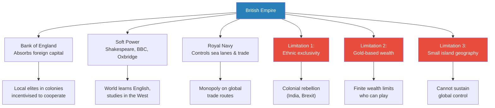
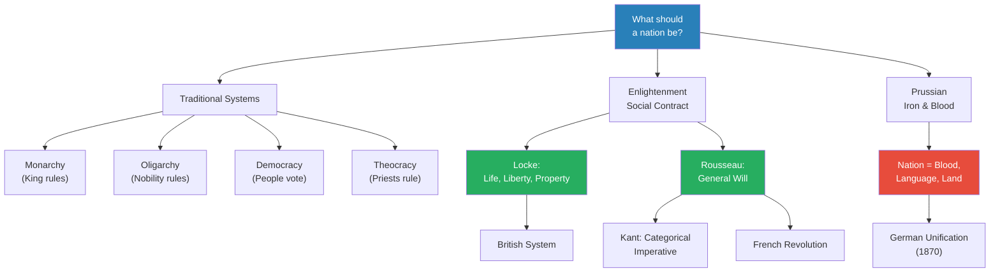
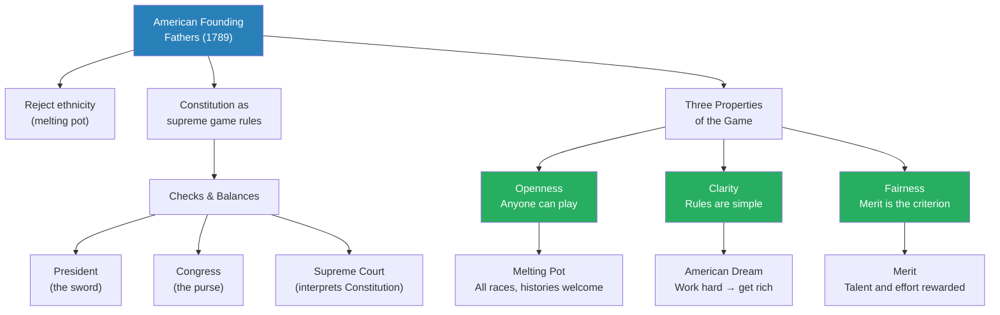
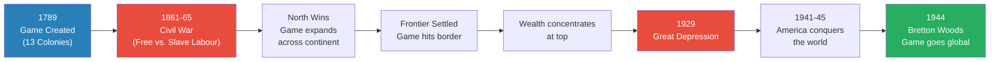
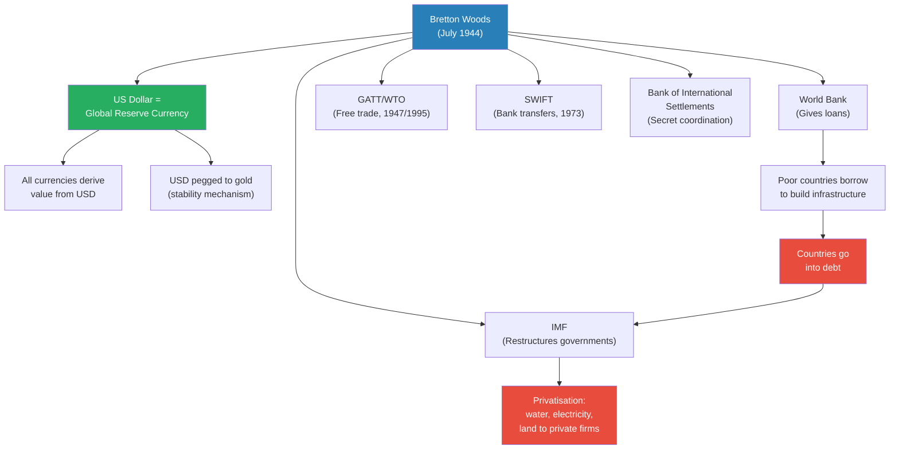
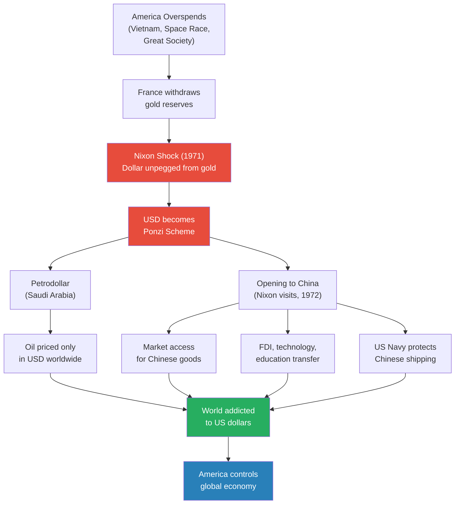
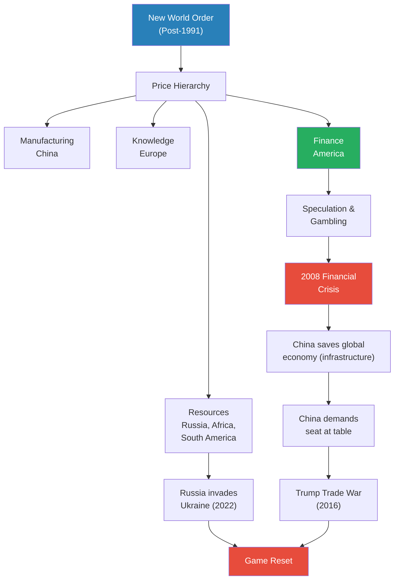

# America's Game

> Prof. Jiang traces how the United States inherited the British Empire's global game and solved its three fatal limitations — racial exclusivity, finite gold-based wealth, and small island geography — to build a world-spanning system that every nation now plays. Britain birthed the modern game of global power through the Bank of England, soft power, and naval dominance, but its provincial ethnic identity, gold standard, and tiny landmass capped its reach. America broke all three ceilings: it redefined the nation as an open game rather than an ethnicity, replaced gold with the US dollar as infinite wealth, and commanded a continental fortress with unlimited resources. The lecture maps the institutional architecture — Bretton Woods, the petrodollar, SWIFT, the World Bank, the IMF — that spread this game worldwide, and ends with the cracks now threatening to shatter it: China's rise, Russia's resource war, and the current game reset.

---

## Overview: Key Highlights

- <b style="color: #27ae60">America solved the three limitations of the British Empire</b> — ethnic exclusivity, finite gold wealth, and small island geography were all transcended
- <b style="color: #2980b9">The nation as a game</b> — America's revolutionary concept: the nation is not blood, land, or contract, but an open game where citizens are players maximising wealth
- <b style="color: #e74c3c">The US dollar is a Ponzi scheme</b> — after Nixon severed the gold peg in 1971, the dollar's value rests entirely on global demand, not intrinsic worth
- <b style="color: #2980b9">Bretton Woods (1944)</b> — the conference that established the US dollar as global reserve currency, the World Bank, and the IMF
- <b style="color: #27ae60">Three properties of America's game: openness, clarity, fairness</b> — anyone can play, the rules are simple, and merit is the criterion
- <b style="color: #2980b9">The petrodollar</b> — Nixon's deal with Saudi Arabia: oil is priced exclusively in US dollars, forcing every oil-importing nation into the dollar system
- <b style="color: #e74c3c">The price hierarchy divides the world into a labour caste system</b> — resources (Russia/Africa), manufacturing (China), knowledge (Europe), finance (America)
- <b style="color: #2980b9">Social contract theory</b> — Locke's property rights vs. Rousseau's general will, the two Enlightenment frameworks that preceded America's innovation
- <b style="color: #27ae60">America gave China everything to make China use US dollars</b> — market access, FDI, technology, education, and military protection, all to hook China on the dollar
- <b style="color: #e74c3c">The 2008 crisis exposed the system's fragility</b> — China saved the global economy through massive infrastructure spending, then demanded a seat at the table
- <b style="color: #2980b9">BRICS</b> — China's attempt to build an alternative system not dominated by American rules
- <b style="color: #e74c3c">We are in a game reset</b> — Russia's invasion of Ukraine and China's challenge to US hegemony threaten to collapse the entire American-built order

| Concept | One-line summary |
|---------|-----------------|
| **The British Empire's three pillars** | Bank of England (capital absorption), soft power (cultural dominance), Royal Navy (trade control) |
| **Three limitations of Britain** | Ethnic exclusivity, gold-based finite wealth, small island with limited resources |
| **Social contract theory (Locke)** | Government exists to protect life, liberty, and private property — God-given, inalienable rights |
| **General will (Rousseau)** | Citizens create a collective moral consciousness that substitutes for God and legitimises government |
| **Categorical imperative (Kant)** | Universality, free will, and humans as ends — the philosophical basis of the general will |
| **Iron and blood (Prussia)** | A nation is blood, language, and land — you fight because it is your duty, not your choice |
| **The nation as a game** | America's innovation: a nation defined by openness, clarity, and fairness rather than ethnicity or contract |
| **Bretton Woods system** | US dollar as reserve currency pegged to gold, plus World Bank and IMF to spread the game globally |
| **Petrodollar** | Saudi Arabia prices oil exclusively in US dollars, creating artificial global demand for the currency |
| **Price hierarchy** | Resources → manufacturing → knowledge → finance, with America at the top controlling pricing |
| **Game reset** | The current period where Russia and China challenge America's control of the global game |

---

# The Lecture

## The British Empire's Three Pillars — and Three Limitations [0:00 - 5:30]

*Prof. Jiang opens with a rapid review of the previous lecture on the British Empire, establishing the three sources of British power and then identifying the three structural limitations that would eventually doom Britain's game — and open the door for America to build a better one.*

> [!tip] Core Insight
> Britain birthed the modern global game but could not scale it. Its three limitations — ethnic exclusivity, finite gold, and small geography — were not flaws to fix but ceilings that required a fundamentally different kind of nation to break through.

*The three pillars (top) made Britain's empire possible. The three limitations (bottom) made it unsustainable. America's genius was solving all three simultaneously.*

> [!note]- Expand: Full Lecture Detail
> Prof. Jiang begins with a structured review of the previous class. The British Empire triumphed over its rivals — France, Spain, and the Dutch — through three sources of power.
>
> **Pillar 1 — The Bank of England:**
> - Could absorb foreign capital from around the world
> - First absorbed Dutch capital, then capital from French aristocrats, the Catholic Church, and the Hapsburgs
> - Key mechanism: property rights — wealth deposited in England was protected by law
> - In the colonies, local elites in China, India, and Southeast Asia helped the British because they were <b style="color: #27ae60">incentivised to cooperate</b> — they could move their stolen wealth to England for safekeeping
>
> **Pillar 2 — Soft power:**
> - Prof. Jiang gestures at the class: "We are in school learning English because we want to go and study in the West. That's soft power."
> - Shakespeare, the BBC, and Oxbridge are all components of British soft power "which still rules the world today"
>
> **Pillar 3 — The Royal Navy:**
> - Controlled sea lanes and therefore controlled all trade
> - For 100 years, Britain maintained the first truly global empire — spanning the entire world
>
> Prof. Jiang then identifies three fatal limitations:
>
> - <b style="color: #e74c3c">Limitation 1 — Ethnicity:</b> Britain was the white Anglo-Saxons. Despite ruling a vast empire, the British were "very much racist" and saw themselves as superior to everyone else. This limited their capacity to work with local elites long-term. India eventually rebelled. Brexit in 2016 was a modern expression of the same provincial instinct — "English people decided that we never wanted to be part of Europe." Prof. Jiang adds a memorable anecdote: English people told him their brains are "hardwired to speak English really well, and that's it" — they literally could not learn a foreign language.
>
> - <b style="color: #e74c3c">Limitation 2 — Gold standard:</b> Wealth was understood as gold. There is a finite amount of gold in the world, which means there is a limit to how many people can participate and how much they can win. "It's really a game only for the elite."
>
> - <b style="color: #e74c3c">Limitation 3 — Geography:</b> Britain is a small island with few people and limited resources. It was "really not sustainable for Britain to control the entire world." Other European powers — Russia, Germany — would inevitably arise to challenge British hegemony.
>
> He concludes: "Ultimately, the power that would overflow the British Empire to create its own empire is, of course, America, and what America would do that's very important is resolve all three of these limitations."

---

## Enlightenment Theories of the Nation State [5:30 - 14:00]

*Prof. Jiang detours through political philosophy to show how the world struggled to define what a nation should be after God lost authority. He presents four traditional systems of rule, then two Enlightenment theories — Locke's property rights and Rousseau's general will — before introducing the Prussian blood-and-iron alternative. All three become the backdrop against which America's radical innovation makes sense.*

*Three competing answers to the question of nationhood emerged before America. Locke's property rights powered Britain. Rousseau's general will powered France. Prussian blood-and-iron created Germany. America would reject all three.*

> [!note]- Expand: Full Lecture Detail
> Prof. Jiang sets up the philosophical context. "For the longest time, we had problems deciding what a game or a nation ought to be." He introduces four traditional political systems:
>
> - <b style="color: #2980b9">Monarchy</b> — a king is in charge, everyone obeys
> - <b style="color: #2980b9">Oligarchy</b> (also called aristocracy) — the nobility are in charge; classic example is Rome
> - <b style="color: #2980b9">Democracy</b> — the people make all decisions; whoever gives the best speech gets the most votes; classic example is Athens
> - <b style="color: #2980b9">Theocracy</b> — the priests represent the will of God; classic example is medieval Catholic Europe
>
> Then the Enlightenment arrives: "When God was no longer considered that important, philosophers debated amongst themselves what a nation ought to be."
>
> **John Locke — Social Contract via Property Rights:**
> - Humans have three fundamental, God-given, inalienable rights: life, liberty, and the pursuit of property
> - Government exists to protect the wealth people generate through hard work
> - "If we kill a lot of people in India, China and France to get it, that's okay too, because it happened elsewhere"
> - If you have wealth, you love this system — and you are incentivised to work hard
> - <b style="color: #27ae60">This is what allowed England to overtake France, the Dutch, and Spain</b>
>
> **Jean-Jacques Rousseau — Social Contract via the General Will:**
> - We are born in a state of nature with complete freedom
> - We choose to give up freedom and enter society because doing so creates something greater: <b style="color: #2980b9">the general will</b>
> - The general will is "a substitute for God — the expression of the best of who we are"
> - Prof. Jiang brings in Immanuel Kant's <b style="color: #2980b9">categorical imperative</b> — the highest moral law, with three components:
>   - **Universality:** Whatever you do, imagine everyone else immediately does the same. "Do you want to live inside of cheaters?"
>   - **Free will:** You cannot coerce people to do what they do not want to do, even if it is objectively better for them
>   - **Humans as ends:** You cannot sacrifice anyone's life to achieve a higher purpose, "because the ultimate end is the human life"
> - The general will gives rise to government, government gives rise to laws
> - The general will is NOT democracy — "If people vote to kill someone, that's not the general will"
> - This became the basis of the French Revolution
>
> > [!example] The French Revolution's Power
> > - France was poor, had no monarchy, and faced the combined armies of Britain, Prussia, Austria, and Russia
> > - Every major European power attacked France simultaneously
> > - Yet France defeated them all — for years, France was unbeatable on the battlefield
> > - The reason: citizens believed they had equity in the nation, that they were part of a greater good
> > - They were willing to sacrifice their lives because the nation represented the general will
> > - This energy ultimately produced the French Empire under Napoleon
> > **The lesson:** A nation built on shared conviction can defeat militarily superior opponents because its citizens fight with purpose, not just obedience.
>
> **Prussia — Iron and Blood:**
> - A nation is NOT something you choose to join — "it's in your blood"
> - Nation = language, heritage, land — you prove your worth by sacrificing yourself in battle
> - In 1870, the Franco-Prussian War tested the French social contract against Prussian blood loyalty
> - <b style="color: #e74c3c">Prussia won</b>, creating the modern nation of Germany
> - The clash proved that blood-and-soil nationalism could overwhelm contractual nationalism on the battlefield

---

## America's Revolutionary Concept — The Nation as a Game [14:00 - 22:00]

*Prof. Jiang arrives at the lecture's central argument: the American founding fathers looked at every existing model of nationhood — British property rights, French general will, Prussian blood loyalty — and rejected them all. Instead, they invented something unprecedented: the nation as an open game, where citizenship means playing, and the rules reward energy and ambition above all else.*

> [!tip] Core Insight
> America is not a land, not a race, not a contract. It is a game. The citizen is a player trying to maximise wealth, and the entire structure of government exists to keep the game open, clear, and fair. This is what made America grow faster than any nation in history.

*The American system is designed around a single insight: people work hardest when they believe the game is open, clear, and fair. The Constitution exists not to govern but to protect these three properties.*

> [!note]- Expand: Full Lecture Detail
> Prof. Jiang sets the scene. America in the 1700s is just 13 colonies, surrounded by indigenous peoples, the Spanish, and the French. But the Americans are "very, very ambitious" and expanding fast. Britain — the home country — becomes afraid because America has more people, more wealth, and is welcoming immigrants from all of Europe. Britain tries to limit expansion beyond the Appalachian Mountains. America revolts.
>
> In 1789, the founding fathers create the Constitution. They have looked at every model:
> - The British system (property rights, rule of law)
> - The French system (social contract, general will)
> - They need to grow the country as fast as possible
> - They need to fight the Spanish, French, British, and indigenous people simultaneously
> - They need to welcome as many people as possible
>
> Their solution: <b style="color: #27ae60">the nation as a game</b>. The citizen is a player trying to maximise wealth. Through the process of maximising personal wealth, each player contributes energy that grows the overall wealth of the nation.
>
> **Three properties of the game:**
>
> - **Openness:** Anyone can come and play regardless of race, history, or wealth — as long as they assimilate into the <b style="color: #2980b9">melting pot</b>
> - **Clarity:** The rules are simple — "You go to America, you follow the law, you work really hard, you get rich." This is called the American Dream.
> - **Fairness:** The only criterion for generating wealth is how hard you work, how much talent you have — <b style="color: #2980b9">the idea of merit</b>
>
> Prof. Jiang validates this from personal experience: "When you go to America, you will discover this. If you work really hard, if you're really talented, you're really smart, they will respect that." He contrasts America with other countries:
>
> > [!example] Merit in America vs. Elsewhere
> > - In Canada (where Prof. Jiang grew up): "They don't really care if you're ambitious... They expect you to follow the rules and conform."
> > - In China: "No one cares if you work hard. No one cares if you're smart. It's all about your guanxi, about your family."
> > - In America: "I've been to meetings where, at first Americans are like, this guy is Chinese speaking in English. He's not that smart. But the moment I speak, the moment I make my case, they are won over by my logic, by my arguments, by my creativity, and they welcome me into the club."
> > - In England: "Maybe they're racist, but if you can make a good argument in front of them, they will accept your argument."
> > - "Nowhere else is this true."
> > **The lesson:** America's game works because it genuinely rewards merit — imperfectly, with discrimination as a starting condition, but with a real mechanism for talent to override prejudice.
>
> **The Constitutional architecture:**
> - The Constitution creates a system of government that checks and balances itself so no single power can corrupt the game
> - <b style="color: #2980b9">The President</b> holds the sword (military power)
> - <b style="color: #2980b9">Congress</b> holds the purse (spending and laws) — the President cannot start a war without Congress funding it
> - <b style="color: #2980b9">The Supreme Court</b> interprets the Constitution, which is the highest law
> - Parallel to this: the judiciary and court system protect property rights, just as they do in Britain
> - The government exists not to rule but to maintain the openness, clarity, and fairness of the game

---

## The Game's Expansionist Nature — Civil War to World War II [22:00 - 29:00]

*Prof. Jiang shows that America's game is inherently expansionist: it must always grow or it collapses. He traces the game through its first two existential crises — the Civil War, which decided whether slave labour or free labour would define the game, and the Great Depression, which revealed what happens when the game runs out of room to expand. The solution to both crises was the same: make the game bigger.*

*Every crisis in the game's history was resolved by expansion. The Civil War expanded the game across the continent. World War II expanded it across the world. The pattern reveals the game's deepest vulnerability: it cannot survive stasis.*

> [!note]- Expand: Full Lecture Detail
> Prof. Jiang identifies a structural feature of America's game: <b style="color: #e74c3c">it is inherently expansionist</b>. At every crisis point, the game won — but only by growing.
>
> **Crisis 1 — The Civil War (1861-1865):**
> - A clash of economic systems: the North played the game with free labour; the South used slave labour
> - Slavery corrupted the game because it violated all three properties — if you are born a slave, the game is not open, not fair, and you can never participate
> - The North won because free labour produced more people, more wealth, more manufacturing, and more energy
> - "The game spread across America"
>
> **Crisis 2 — The Great Depression:**
> - America conquers the West and the frontier is settled
> - The game hits a wall: there is nowhere left to expand
> - <b style="color: #e74c3c">The fundamental problem of capitalism</b> emerges: "The longer you play this game, at the end of the game, one person controls all the money"
> - Without a frontier to absorb new players and new energy, wealth concentrates at the top
> - The result: the Great Depression
>
> **The solution — World War II:**
> - "America has to go and conquer the world, which it does"
> - Having won the war, America now needs to spread the game throughout the world
> - This is the genesis of the Bretton Woods system

---

## The Bretton Woods System — Scaling the Game to the World [29:00 - 35:00]

*Prof. Jiang walks the class through the institutional architecture that America built to globalise its game: the US dollar as reserve currency, the World Bank and IMF as enforcement mechanisms, GATT for free trade, SWIFT for dollar-based banking, and the Bank of International Settlements for secret central bank coordination. Together, these institutions turned America's domestic game into the only game on Earth.*

> [!tip] Core Insight
> The World Bank lends you money to start playing the game. When you inevitably cannot pay it back, the IMF restructures your government to conform to the game's rules. The system is designed so that entry is voluntary but exit is impossible.

*The Bretton Woods architecture is elegant and ruthless. The left branch (World Bank → debt → IMF → privatisation) is the enforcement loop: countries enter voluntarily but are restructured involuntarily when they cannot repay.*

> [!note]- Expand: Full Lecture Detail
> Prof. Jiang explains that in July 1944, a year before America won the war, it organised the <b style="color: #2980b9">Bretton Woods Conference</b> in New Hampshire. The purpose: "to establish the world game. Before, America's game was limited to America. Now America wants to scale its game to the entire world."
>
> **Component 1 — US Dollar as Reserve Currency:**
> - Every other currency must derive its value from the US dollar
> - "If you have Canadian dollars, you can now change it for US dollars, which is what's valuable. The Canadian dollar is just not valuable."
> - Countries agreed on exchange rates
> - To prevent America from printing unlimited money, the US dollar was pegged to gold — you could always redeem dollars for gold
> - "Because there's a limit to gold, there has to be a limit to US dollars, which keeps the system stable"
>
> **Component 2 — World Bank and IMF:**
> - The <b style="color: #2980b9">World Bank</b> gives loans to poor countries so they can build infrastructure and start playing the game
> - "Let's say you are China and you are poor. You need to build dams. The World Bank gives you money."
> - Inevitably, countries borrow too much and go into debt
> - Then the <b style="color: #2980b9">IMF</b> comes in and changes the country's government and economic policies to conform to the game
> - The main mechanism: <b style="color: #e74c3c">privatisation</b> — "The public should not control water, electricity, or land. Private companies should be in charge."
> - "The goal of the World Bank and IMF is to spread the game throughout the world"
>
> **Component 3 — GATT/WTO (1947/1995):**
> - General Agreement on Tariffs and Trade — an agreement on free trade
> - Changed into the WTO in 1995
>
> **Component 4 — SWIFT (1973):**
> - Agreement among banks worldwide on how to transfer money
> - "If you want to transfer money from China to America to go to university, it goes through SWIFT"
> - Allows more cooperation among banks using US dollars
>
> **Component 5 — Bank of International Settlements (BIS):**
> - Central banks of different countries coordinate economic policies
> - "All done privately, in secret, no one knows about them"

---

## The Dollar Unshackled — Nixon, the Petrodollar, and China [35:00 - 40:00]

*Prof. Jiang reveals the moment the game became truly dangerous: when Nixon severed the dollar from gold in 1971, turning the world's reserve currency into what Prof. Jiang bluntly calls "a Ponzi scheme." He then traces the two moves Nixon made to create artificial demand for a now-valueless dollar — the petrodollar deal with Saudi Arabia and the opening to China — both of which reshaped the entire global order.*

*After 1971, the dollar has no intrinsic value. Everything below the red "Ponzi Scheme" node is demand engineering — artificial mechanisms to make the world need dollars regardless.*

> [!note]- Expand: Full Lecture Detail
> Prof. Jiang explains that the Bretton Woods system worked well at first, but America began abusing it — spending on the Vietnam War, the space race, and the Great Society programme. Other countries noticed.
>
> - France withdrew all its gold from the United States
> - In 1971, Nixon made a historic announcement: "We actually don't have enough gold to pay off everyone. We're not going to peg the dollar to gold anymore."
> - <b style="color: #e74c3c">"The US dollar becomes a Ponzi scheme"</b> — it is valuable only because people want to use it, with no intrinsic value whatsoever
>
> Nixon now had to create demand for a fundamentally worthless currency. He made two moves:
>
> **Move 1 — The Petrodollar:**
> - Nixon went to Saudi Arabia, the world's largest oil exporter
> - Created a deal: Saudi Arabia would only accept payment for oil in US dollars
> - "If you want oil, you have to have US dollars" — every oil-importing nation in the world now needed dollars
>
> **Move 2 — Opening to China:**
> - Nixon visited China and established a framework where America gave China everything:
>   - **Market access** — US consumers could buy Chinese goods
>   - **FDI, technology, education** — foreign investment, military technology shared freely, Chinese students educated at American universities
>   - **Military protection** — the US Navy protected Chinese shipping routes worldwide
> - "You're like, oh my God, America gave China everything. America made China rich. Why would America do that?"
> - <b style="color: #27ae60">"There's one answer, and only one answer: to make China use US dollars"</b>
> - When China trades with the world, it gets US dollars in return
> - "The entire idea is to make the world addicted to US dollars"
>
> > [!example] America's Gift to China
> > - America opened its consumer market to Chinese exports — the largest market in the world
> > - America transferred foreign direct investment, capital, and technology to China
> > - Military secrets were shared freely with China
> > - Chinese students were educated at American universities, learning American technology
> > - The US Navy began protecting Chinese commercial shipping worldwide
> > - All of this — market access, capital, technology, education, military protection — given to China
> > - The price: China would conduct all its trade in US dollars
> > - This single condition was worth more than everything America gave away
> > **The lesson:** The most powerful transaction in modern history was not a trade deal but an addiction strategy — America made China rich so China would make the dollar indispensable.

---

## The New World Order and Its Price Hierarchy [40:00 - 44:00]

*Prof. Jiang maps the post-Soviet global system: America at the top controlling finance and pricing, Europe providing knowledge, China manufacturing, and Russia/Africa extracting resources. He shows how this hierarchy created the 2008 financial crisis, how China saved the system and then demanded equality, and why we are now living through a game reset.*

*The price hierarchy looks stable until you realise that every layer resents its position. Russia attacks the foundation (resources). China challenges the middle (manufacturing wants to become finance). The entire structure is now in jeopardy.*

> [!note]- Expand: Full Lecture Detail
> In 1991, the Soviet Union collapses and America is "the only game in town." America creates the <b style="color: #2980b9">New World Order</b> based on global trade, with America controlling pricing — "the Americans can decide the value of everything."
>
> **The price hierarchy:**
>
> | Level | Function | Countries |
> |-------|----------|-----------|
> | **Bottom** | Resources | Russia, Africa, South America |
> | **Middle-low** | Manufacturing | China |
> | **Middle-high** | Knowledge | Europe |
> | **Top** | Finance | America |
>
> - America transfers its manufacturing to China because it is cheaper
> - America focuses exclusively on finance — "the creation of money for the purpose of creating more money"
> - At first, everyone makes money and the system appears stable
>
> **The 2008 crisis:**
> - When you focus on finance, you become a speculative economy — "basically gambling"
> - This led to the 2008 Great Financial Crisis, when the American economy collapsed
> - <b style="color: #e74c3c">The entire world economy should have collapsed</b>
> - Central banks gathered at the Bank of International Settlements in Basel, Switzerland
> - They decided the only way to save the world was for China to spend money
> - China invested massively in infrastructure — skyscrapers, airports, high-speed railways, Belt and Road Initiative
> - This saved the global economy
>
> **China demands equality:**
> - After saving the world, China developed enormous debt
> - China said: "We saved the global economy. We deserve a seat at the table. We deserve to be equals to America."
> - China began selling Huawei phones worldwide, competing with America for global dominance
> - America's response: "Screw you" — leading to Donald Trump in 2016 and the US-China trade war
> - America sanctioned China, tried to block Huawei
>
> **Russia's challenge:**
> - In 2022, Russia invaded Ukraine
> - Russia's message: "This price hierarchy — screw this"
> - Russia controls resources — and without resources, nothing else works
> - "Try manufacturing without resources. Try having knowledge without resources. Try having finance without resources."
> - Russia and Ukraine together control one-third of the world's grain — "Africa, the Middle East starves to death without Russian and Ukrainian grain"
>
> <b style="color: #e74c3c">"We are in a time of game reset."</b> America is fighting to save its game, its system, its dollar, its hegemony. Russia and China are trying to break free.

---

## Q&A — China's Counter-Strategy [45:00 - End]

*A student asks why China does not simply create its own version of America's game. Prof. Jiang explains that China is not trying to replace the game but to restructure it — diversifying markets and resources away from American control through BRICS, while America tries to prevent exactly that.*

> [!note]- Expand: Full Lecture Detail
> **Student question:** "America gave China everything to make them use US dollars. But why doesn't China create the same game?"
>
> Prof. Jiang's response:
> - America could not openly say "we're doing this because we're greedy and want China to be subservient"
> - Instead, America claimed the game would make China's middle class rise and make China more democratic — "but that was just BS, just a fraud, a lot of hypocrisy"
> - Now that China is in the game, it is trying to restructure it for independence
>
> **China's problem within the game:**
> - China's role: take resources, create manufactured exports
> - <b style="color: #e74c3c">America controls the entire game</b> — it can say "we don't like you, so you can't trade anymore"
> - America can limit both China's resource access and its market access
>
> **China's counter-strategy:**
> - <b style="color: #2980b9">Diversify</b> — create markets outside the United States, create resource supply chains not dependent on the US
> - This is the idea behind <b style="color: #2980b9">BRICS</b>
> - BRICS is not China trying to impose its own game on everyone — "China is just trying to create a system that is not so dominated by the Americans"
> - "That's the Chinese mentality"
>
> Prof. Jiang promises to continue this discussion on Thursday and throughout the semester.

---

## Connections

**Builds on:** [[06 - The World's Bank]] (British Empire's three pillars of power — Bank of England, soft power, Royal Navy — and how financial systems enabled imperial control). [[05 - The World Game]] (the concept of the global game and how nations compete within it). [[01 - The Dating Game]] (game theory fundamentals: players, rules, incentives, and Nash equilibrium as the framework for understanding America's system design).

**Sets up:** [[08 - Communist Specter]] (the Soviet alternative to America's game — the ideological competitor that shaped and constrained America's system from 1945 to 1991). The US-China trade war, BRICS, and the current game reset will be developed throughout the remainder of the semester.

**Recurring themes developed:**
- The game as a living system — America's game, like all games, must expand or collapse; stasis is death
- Institutional architecture as power — Bretton Woods, SWIFT, the IMF are not neutral institutions but enforcement mechanisms for America's game
- The Ponzi structure of modern finance — the US dollar has no intrinsic value; its power is purely systemic
- Merit vs. privilege — America's genuine (if imperfect) commitment to merit is what makes its game attractive enough to draw voluntary participants

**Related books in vault:** [[Sapiens - Yuval Noah Harari]] (the agricultural revolution as a species-level game change), [[The Prince - Niccolò Machiavelli]] (power as a system to be designed, not inherited)

---

## The Takeaway

This lecture is the pivot point of the Game Theory series. Everything before it — the dating game, schools, wealth, immigration, the global game, the British Empire — was scaffolding. Here, Prof. Jiang reveals the actual architecture of the world we live in: a game designed by America in 1944, scaled through the dollar system, and now cracking under the weight of its own contradictions. The single most important insight is that America solved the three limitations of the British Empire not through military superiority but through conceptual innovation — redefining nationhood itself as an open game rather than an ethnic or contractual identity. This is why America grew faster than any nation in history and why its game attracted voluntary participation from billions of people who were not American.

The most counterintuitive claim is Prof. Jiang's framing of the US-China relationship. The conventional narrative treats America's generosity toward China — market access, technology transfer, military protection — as a strategic miscalculation or naive idealism. Prof. Jiang inverts this entirely: America gave China everything deliberately, and the price was not gratitude but addiction. Every dollar of trade China conducted was a dollar of demand for the US currency. The gift was the trap. This reframing transforms the current US-China trade war from a story about American decline into a story about a dealer trying to maintain control over a client who has grown strong enough to seek independence.

What remains unresolved is the endgame. Prof. Jiang names the current moment a "game reset" but does not predict the outcome. Can America's game survive without expansion? Can BRICS create a viable alternative, or will it fragment under the weight of its members' competing interests? And the deepest question: if the US dollar truly is a Ponzi scheme sustained only by demand, what happens when enough players decide to stop playing?
