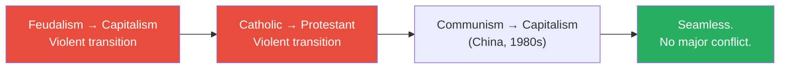
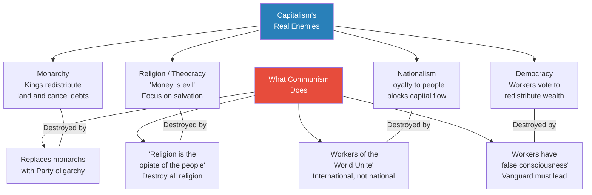
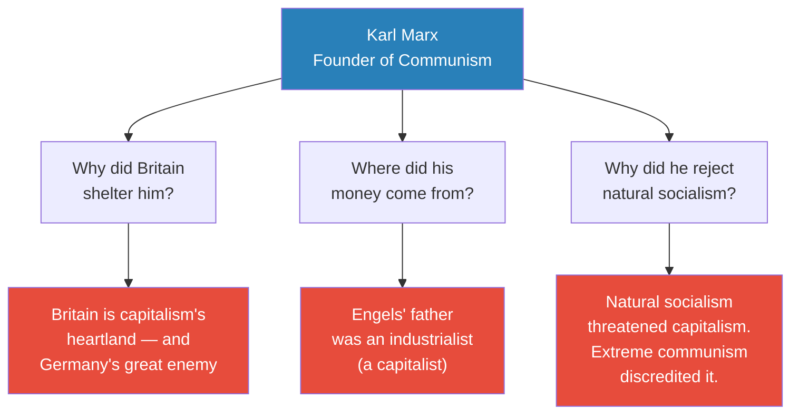
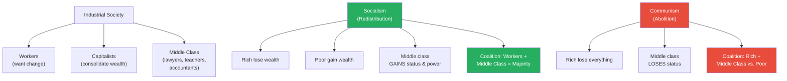
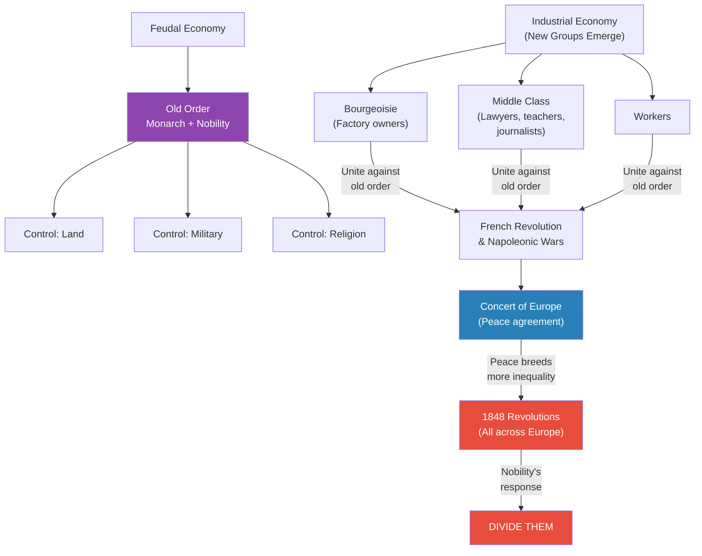
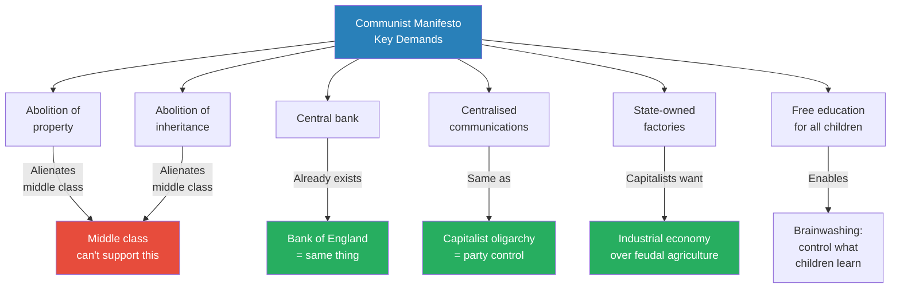
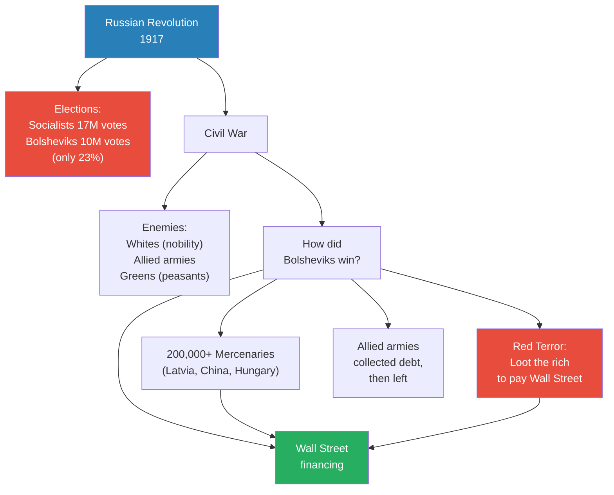
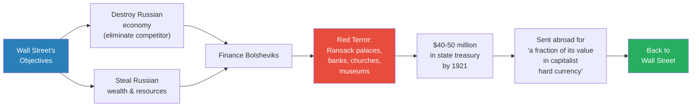
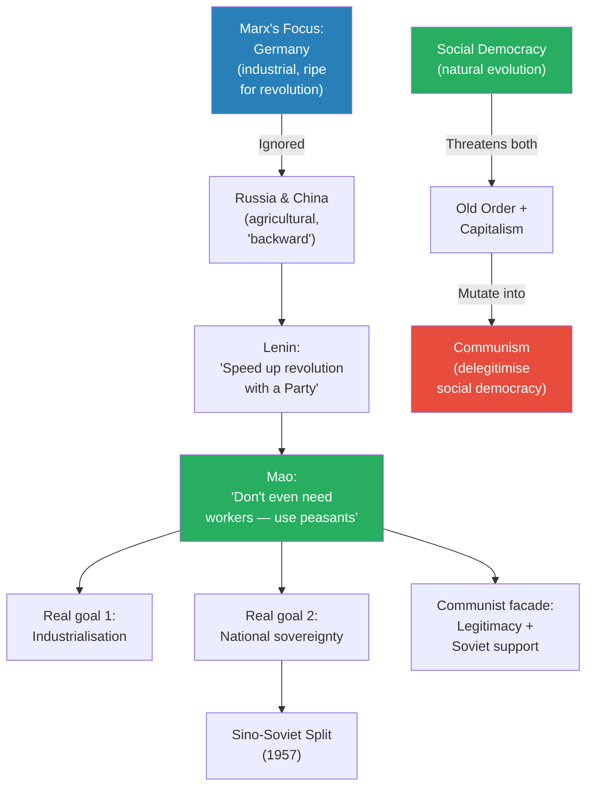

# Communist Specter

> Prof. Jiang poses a question that sounds heretical: what if communism and capitalism are not enemies but partners? He opens with China's seamless transition from communism to capitalism — a transition that should have been violent if the two ideologies were genuine opposites — and works backward through Marx, the 1848 revolutions, the Bolshevik Revolution, and Wall Street financing to argue that communism was never capitalism's antithesis. It was capitalism's weapon, manufactured to destroy the real threats: monarchy, religion, nationalism, and democracy. The lecture is a masterclass in game-theory thinking — asking not what actors say, but what outcomes their actions actually produce.

---

## Overview: Key Highlights

- <b style="color: #27ae60">Communism and capitalism are partners, not enemies</b> — they share the same enemies and produce the same outcomes: destruction of monarchy, religion, nationalism, and democracy
- <b style="color: #e74c3c">The real enemies of capitalism are monarchy, religion, nationalism, and democracy</b> — not communism, which conveniently destroys all four
- <b style="color: #2980b9">False dialectic</b> — the idea that capitalism vs. communism is a black-and-white opposition is a constructed narrative, not reality
- <b style="color: #27ae60">China's seamless transition proves the point</b> — a genuinely communist country became hyper-capitalist without significant conflict, something impossible if the ideologies were true opposites
- <b style="color: #2980b9">Socialism vs. communism</b> — socialism redistributes property (natural evolution); communism destroys property (engineered extremism that alienates the middle class)
- <b style="color: #e74c3c">Marx's funding came from capitalists</b> — Engels' industrialist father funded Marx, Britain sheltered him, and his agenda conveniently served British interests against Germany
- <b style="color: #2980b9">The 1848 revolutions</b> — a Europe-wide uprising by bourgeoisie, middle class, and workers that terrified the nobility into creating communism as a divide-and-conquer weapon
- <b style="color: #e74c3c">The Communist Manifesto as psyop</b> — by framing legitimate reform movements as a fanatical international conspiracy, it delegitimised socialism in the eyes of the middle class
- <b style="color: #27ae60">Wall Street financed the Bolsheviks</b> — mercenaries, debt collection, and the Romanov fortune all trace back to capitalist interests
- <b style="color: #2980b9">The Red Terror as asset stripping</b> — Bolsheviks looted Russia's wealth and sent it abroad in "capitalist hard currency"
- <b style="color: #e74c3c">The Romanov assassination served foreign banks</b> — billions in overseas accounts defaulted to Western banks when the entire family was killed
- <b style="color: #27ae60">Communism is a virus created by capitalism to conquer the world</b> — it destroys traditional societies so capitalism can move in afterward, as China demonstrates

| Concept | One-line summary |
|---------|-----------------|
| **False dialectic** | The manufactured illusion that capitalism and communism are polar opposites |
| **Social democracy** | Natural outgrowth of capitalism — redistribution through democratic voting |
| **Socialism** | Redistribution of wealth from rich to poor, empowering the middle class |
| **Communism** | Abolition of all property — an engineered extreme that alienates the middle class from workers |
| **False consciousness** | Marx's claim that workers are brainwashed by capitalists through schools, media, and religion |
| **Vanguard party** | An elite group that claims to lead workers to freedom but never voluntarily surrenders power |
| **Concert of Europe** | Post-Napoleonic agreement among monarchies to resolve disputes without war |
| **1848 revolutions** | Europe-wide uprisings by bourgeoisie, middle class, and workers demanding political reform |
| **Asset stripping** | Bolshevik looting of Russian wealth — palaces, banks, churches, museums — to pay Wall Street |
| **Psyop** | Communism as a psychological operation: making legitimate reform look fanatical and dangerous |
| **Bourgeoisie** | The industrial capitalist class — factory owners who emerged with industrialisation |
| **Proletariat** | The industrial working class — Marx's chosen vehicle for revolution |

---

# The Lecture

## The China Paradox — Why the Transition Was Seamless [0:00 - 3:30]

*Prof. Jiang opens with a puzzle that the standard Cold War narrative cannot explain: China transitioned from communism to capitalism without violence, without upheaval, and with extraordinary success. If these ideologies are genuine opposites, this should have been impossible.*

> [!tip] Core Insight
> If capitalism and communism were true opposites — a genuine dialectic — then China's seamless transition from one to the other would be inexplicable. The fact that it happened smoothly suggests they are not opposites at all.

*Historical transitions between genuinely opposing systems are violent. China's was not — suggesting communism and capitalism are more similar than different.*

> [!note]- Expand: Full Lecture Detail
> Prof. Jiang opens by framing the 20th century's great ideological struggle — capitalism vs. communism, the Cold War dialectic — and immediately problematises it:
>
> - The 20th century was defined by the Cold War — "an ideological struggle between capitalism and communism"
> - "For the longest time, we believed that capitalism and communism were polar opposites, a dialectic, a black and white"
> - But China defies this: "For the longest time, China was a communist country, and then in the 1980s it started to reform, and now China is very much a capitalist country"
> - <b style="color: #27ae60">The transition was "seamless" — "there hasn't been much conflict because of this transition"</b>
> - Prof. Jiang contrasts this with genuinely violent transitions:
>   - Feudalism to capitalism — "a very violent process"
>   - Catholic Europe to Protestant Europe — "also a very violent process"
> - China went from communism to capitalism "pretty easily, pretty quickly, and extremely successfully"
> - "Today, China is very much a capitalist country with some communist elements, but it's very much capitalistic"
> - The question that drives the entire lecture: "If these two ideologies are such polar opposites, if it's a dialectic, then how did this happen in China?"
> - His thesis: <b style="color: #27ae60">"This is a false dialectic — communism and capitalism are actually more similar than they are different"</b>

---

## The Four Real Enemies of Capitalism [3:30 - 7:30]

*Prof. Jiang identifies the four genuine threats to capitalism — monarchy, religion, nationalism, and democracy — and shows that communism conveniently destroys all four. The alignment is too precise to be accidental.*

*Every real threat to capitalism has a communist solution. Prof. Jiang's point: this is not coincidence — communism was engineered to neutralise exactly these threats.*

> [!note]- Expand: Full Lecture Detail
> Prof. Jiang lays out capitalism's four genuine enemies one by one:
>
> - <b style="color: #2980b9">Monarchy</b> — "The idea of monarchy is that rather than power in the hands of a capitalist, power is in the hands of the king"
>   - Kings redistribute wealth: "When a king first comes into power, what a king often does is cancel all debts and redistribute the land, and that's why he's so popular"
>   - "Capitalists are afraid of kings. They don't like kings because a king will often redistribute property"
>
> - <b style="color: #2980b9">Religion / Theocracy</b> — "All religions teach you that money is evil"
>   - "God doesn't want you to make money. God wants you to be kind to others, to love your children, to be a nice person"
>   - "That's why in Catholic Europe, they were so poor, because people were more focused on redemption and salvation than they were on making money"
>
> - <b style="color: #2980b9">Nationalism</b> — "Loyalty to your people, loyalty to your nation"
>   - Capitalism wants capital to flow freely across borders: "I see investment opportunity in China. I want to take my money from America and put it into China. I don't want to worry about, oh, China's my enemy"
>
> - <b style="color: #2980b9">Democracy</b> — "Believe it or not, capitalists hate democracy"
>   - "If people had power, the workers had power, they would all get together and vote to redistribute wealth"
>   - "We call this socialism"
>
> Then Prof. Jiang shows how communism destroys all four:
>
> - Monarchy → Party oligarchy: "Communism does not allow for monarchs to rise. It allows for a party to arise. What is a party? Party is an oligarchy — which is a capitalist system"
> - Religion → Atheism: "Marx says religion is the opiate of the people... we must destroy all religion. And if religion is destroyed, what is left? The only thing that is left is money"
> - Nationalism → Internationalism: "Workers of the World Unite. Nationalism is also bad. Class consciousness is more important than national identity"
> - Democracy → Vanguard rule: "Workers have false consciousness. Workers have been brainwashed by capitalists in school, in the media... therefore a Vanguard, the party, must lead the people into socialism"
>
> He delivers the thesis with deliberate provocation: <b style="color: #e74c3c">"Maybe communism was a weapon or a virus created by capitalism in order to conquer the world, to destroy the world so that capitalism can spread throughout"</b>
>
> > [!example] China's Cultural Revolution as Capitalist Preparation
> > - The Cultural Revolution destroyed religion, tradition, and cultural identity in China
> > - These are precisely the barriers that prevent capitalism from taking root
> > - After the Cultural Revolution, China became "hyper-capitalistic" — pursuing the fastest growth rate in the world
> > - The Communist Party's most destructive policies cleared the ground for the capitalism that followed
> > **The lesson:** If communism's primary achievement was destroying the obstacles to capitalism, it may have been capitalism's tool all along.

---

## The Suspicious History of Karl Marx [7:30 - 12:00]

*Prof. Jiang examines three suspicious facts about Marx's biography that suggest he was, wittingly or not, serving capitalist interests: Britain sheltered him, capitalists funded him, and he chose revolution over the natural evolution of socialism.*

> [!tip] Core Insight
> Marx lived in the most capitalist country in the world, was funded by an industrialist's fortune, and spent his career making socialism more extreme and less achievable. Game theory asks: who benefits from this arrangement?

*Three biographical facts that are inexplicable under the standard narrative but perfectly logical if Marx was, consciously or not, a tool of capitalist interests.*

> [!note]- Expand: Full Lecture Detail
> Prof. Jiang presents three "really strange" facts about Marx:
>
> - **Suspicious fact 1 — British shelter:** Marx was a German citizen exiled for advocating world revolution — "but he spent all his time in Britain"
>   - "Britain is the most capitalist country in the world at this time, 19th century, and Britain basically allowed Marx to live there and do whatever he wants"
>   - He wrote most of his works in the British Library and the British Museum
>   - "Why did the British authorities allow him to do that?" — Britain's great enemy was Germany, and Marx was trying to foment revolution in Germany
>
> - **Suspicious fact 2 — Capitalist funding:** "Karl Marx never made any money in his life"
>   - His wife was a German aristocrat "used to luxury"
>   - His works — the Communist Manifesto, Das Kapital — "no one's gonna read them. They don't sell"
>   - Yet "he actually lived a very good life... his kids went to private school. They had a nice house in Britain"
>   - The money came from Frederick Engels, whose father "was a capitalist, an industrialist"
>   - <b style="color: #e74c3c">"Why would his father, who is a very wealthy person, give Engels money to give to Marx, and Marx is calling for a world revolution to destroy the capitalists?"</b>
>
> - **Suspicious fact 3 — Rejecting natural socialism:** At this time, socialism was the dominant ideology and "the idea of socialism is that it will evolve naturally"
>   - Marx rejected this: "No, no, no, we cannot allow it to evolve naturally. It will not evolve naturally. We need a revolution, a world revolution"
>   - Prof. Jiang's question: "Why would he say this?" — when the natural path was already working

---

## Socialism vs. Communism — The Critical Difference [12:00 - 18:00]

*Prof. Jiang breaks down the crucial difference between socialism (redistribution, empowering the middle class) and communism (abolition of property, alienating the middle class). By making socialism extreme, Marx turned a popular majority coalition into an impossible one.*

*Socialism builds a winning coalition (workers + middle class). Communism breaks it by turning the middle class into losers. This is the mechanism by which communism serves the elite — it splits the opposition.*

> [!note]- Expand: Full Lecture Detail
> Prof. Jiang walks through the mechanics of socialism step by step:
>
> - Industrial society creates three classes: rich, middle class, poor
> - Capitalism naturally consolidates: "Maybe you have 1000 capitalists to start, but then maybe 10 will take over all the money... then maybe one"
> - <b style="color: #2980b9">Socialism</b> is simple redistribution: "Taking the money from the rich and giving it to the poor"
>   - The middle class benefits because "over time, they have more power and status than the rich"
>   - This creates a powerful coalition: "The poor want this system... but also the people who really want the system are the middle class"
>   - "That's why socialists believe that over time, this is just a natural evolution"
>   - Historical proof: "After World War Two, Europe didn't become communist, it didn't become capitalist, it became socialist. It had a very strong welfare system"
>
> Then he explains Marx's deviation:
>
> - Marx introduces <b style="color: #2980b9">false consciousness</b>: capitalists use schools, media, and religion to brainwash workers
>   - "You need to destroy religion. You need to revamp the education system. You need to control the media"
>   - Workers must unite internationally: "The real struggle is one of class"
>
> - <b style="color: #e74c3c">The critical shift from socialism to communism:</b>
>   - Socialism = redistribution of property → middle class gains
>   - Communism = destruction of property → middle class loses
>   - "It sounds similar, socialism and communism, but it's night and day"
>   - Under communism, "both the rich and middle class suffer... therefore they will probably unite together against the poor"
>
> - The Vanguard party problem:
>   - Marx says a party must "destroy the false consciousness, unite the workers and create a common society"
>   - "When the system is completely communist, then the party will give up power"
>   - Prof. Jiang's retort: "Why would the party give up power? If the party is capable of creating consciousness, why don't they just switch to a different false consciousness?"
>   - "This has never happened in history before, but trust us on this one"
>
> - <b style="color: #27ae60">Prof. Jiang's game-theory argument:</b> "When an idea becomes more extreme, the intention is to discredit it, to make it illegitimate, to destroy the idea"
>   - "The people responsible for communism are the capitalists, the ruling elite, because they want to destroy the idea of socialism"
>   - "They don't want this unity between the middle class and the workers. They want the middle class to remain with the nobility and the oligarchy"

---

## The 1848 Revolutions and the Birth of Communism [18:00 - 27:00]

*Prof. Jiang traces the origin of communism to the 1848 revolutions — Europe-wide uprisings by the bourgeoisie, middle class, and workers against the old order. Terrified, the nobility needed a weapon to divide the new order coalition. That weapon was communism.*

> [!tip] Core Insight
> The 1848 revolutions united bourgeoisie, middle class, and workers against the old order. The nobility's survival depended on splitting this coalition. Communism — by redefining the conflict as class war between bourgeoisie and workers — accomplished exactly this.

*The historical sequence: industrialisation created new social groups, those groups united against the old order, the old order responded by engineering a tool to split them apart.*

> [!note]- Expand: Full Lecture Detail
> Prof. Jiang walks through the historical sequence:
>
> - **The feudal economy:** Monarch and nobility controlled land, military, and religion — peasants worked the land
> - **Industrialisation creates new groups:**
>   - <b style="color: #2980b9">Bourgeoisie</b> — "just the capitalists, the factory owners"
>   - Workers — created by the industrial economy
>   - Middle class — "lawyers, teachers, accountants, journalists, people who support the industrial economy"
>
> - **The French Revolution:** These new groups "worked together to try to overthrow the old order"
>   - Led to the Napoleonic wars — "seven wars... that led to the deaths of millions, tens of millions of people"
>   - After Napoleon's defeat, European nobility created the <b style="color: #2980b9">Concert of Europe</b>
>   - "Basically these different monarchies agreeing to resolve their differences over negotiations, rather than on the battlefield — think of it as the United Nations"
>
> - **The 1848 revolutions:**
>   - Peace brought overpopulation, economic growth, inequality, and corruption
>   - "A combination of these people — the bourgeoisie, middle class, and workers — who called for changes in government"
>   - Happened throughout the entirety of Europe simultaneously
>   - "Some places were violent, some places were peaceful. Some places focused more on democracy. Some places focused more on liberalism. Some places focused more on socialism"
>
> > [!example] England — The Exception That Proves the Rule
> > - The only place in Europe spared the 1848 revolutions was England
> > - The reason: England had colonies — "if you're not happy, you can go somewhere else, like Canada or United States or Australia, New Zealand"
> > - "You can leave. But everyone else is stuck where they are, and they are fighting for more rights"
> > **The lesson:** The safety valve of emigration prevented revolution. Without an exit, pressure builds until it explodes.
>
> - **The nobility's three-part strategy to divide the new order:**
>
>   1. <b style="color: #e74c3c">Redefine the conflict as class war:</b> "The real enemy is not between nobility and the bourgeoisie — the real enemy is between the bourgeoisie and the workers"
>
>   2. <b style="color: #e74c3c">Make the movement look extreme:</b> "What we want is not a more fair society. What we want is a completely equal society where no one has any money, no one has any rights, no one has any freedom. Communism."
>
>   3. <b style="color: #e74c3c">Frame it as an international conspiracy:</b> "These communists are in a secret society who want to take over the entire world. They are funded by Jews, by capitalists, by the British. They're not Germans, they're not French, they're not us."
>
> - Prof. Jiang's verdict: "Communism was a psyop — a tool used by the elite, by the nobility, to make the movement of democracy, socialism, and liberalism illegitimate"

---

## The Communist Manifesto as Controlled Opposition [27:00 - 32:00]

*Prof. Jiang reads the Communist Manifesto not as a revolutionary document but as a strategic weapon — one that served capitalist interests while claiming to oppose them. Its demands align suspiciously well with what capitalists wanted all along.*

*The Manifesto's demands split into two categories: those that alienate the middle class (serving the elite) and those that already exist under capitalism (serving capitalists). Neither category serves workers.*

> [!note]- Expand: Full Lecture Detail
> Prof. Jiang walks through the Communist Manifesto's key demands:
>
> - **Abolition of property:** "Pretty extreme — the middle class wants to support socialism, but it cannot support communism. Socialism is reduction of wealth. Communism is the abolition of wealth. Two different things."
> - **Abolition of inheritance:** "You're middle class. You worked really hard to make this money. You want to give it to your children. Now you can't anymore. This is pretty awful."
> - **Central bank:** "This sounds pretty extreme, but we already do this in capitalism. It's called the Bank of England. The Bank of England is where all wealth around the world is stored. A centralised bank in a communist system — it's the same thing."
> - **Centralised communications:** "A party. Well, this is just the capitalist class, an oligarchy. Does it really matter if it's an oligarchy or a party? It's the same thing, really."
> - **State-owned factories:** "This is the idea of creating a proletariat, manufacturing. This is what capitalists want — most of the world is agricultural, feudal, and this calls for the creation of a manufacturing, industrial economy."
> - **Free education:** "You're like, oh, well, that's great. No, it's not, because now you can brainwash them. This is brainwashing."
>
> - Prof. Jiang's conclusion: <b style="color: #27ae60">"This agenda is communist. Well, if I'm a capitalist, I'm okay with this agenda. I'm happy with this agenda. What's wrong with this agenda?"</b>
>
> - The Manifesto also features a critical self-incriminating passage:
>   - "In Switzerland, we support the radicals. In Poland, we support the revolution. In Germany, we support the bourgeoisie — sorry, the proletariat."
>   - The real people in these movements "are saying we're not part of an actual conspiracy. All we want is a more fair, just society."
>   - But the Manifesto says: "Yes, you are. We're all part of this great conspiracy to conquer the world and establish communism"
>   - <b style="color: #e74c3c">"Why would they admit we are an international conspiracy? This is a secret document that we read amongst ourselves. But it's also possible for you to steal and show that, yes, there is a secret society."</b>
>   - The point: the Manifesto was designed to be "leaked" to discredit legitimate reform movements

---

## The Bolshevik Revolution — Capitalism's Greatest Heist [32:00 - 42:00]

*Prof. Jiang turns to the 1917 revolution and demonstrates that every major event — the Romanov assassination, the use of mercenaries, the Allied intervention — served capitalist interests rather than communist ones. The Bolsheviks were the mechanism; Wall Street was the beneficiary.*

> [!tip] Core Insight
> The Bolsheviks won the Russian Civil War not through popular support — they had only 23% of the vote — but through Wall Street financing, foreign mercenaries, and a campaign of asset stripping that transferred Russia's wealth to Western banks.

*The Bolsheviks were unpopular (23% of the vote), surrounded by enemies, and broke. Wall Street solved all three problems — financing mercenaries, collecting debts through the Red Terror, and using the Allies to attack the Bolsheviks' rivals.*

> [!note]- Expand: Full Lecture Detail
> Prof. Jiang walks through the evidence for capitalist-Bolshevik collaboration:
>
> - **The Bolsheviks' minority status:**
>   - After seizing power in the October Revolution, the Bolsheviks held elections
>   - Socialists received 17 million votes; Bolsheviks received only 10 million
>   - "They only got 23% of the popular vote. They are not a popular faction. They're a minority."
>   - They controlled major cities but "don't really control most of Russia"
>   - "At this time in history, you cannot possibly expect that the Bolsheviks would win this battle"
>
> > [!example] The Romanov Assassination — Who Really Benefited?
> > - The Romanov dynasty had ruled Russia for 100 years and were beloved by the peasants
> > - After the revolution, they stayed in Russia rather than fleeing to their European relatives — "they never believed they were in danger"
> > - The Bolsheviks killed between 17 and 18 members of the family
> > - This made no strategic sense: it enraged peasants, angered European royalty, and confirmed the "fanatical" label
> > - But the Romanovs had "billions and billions of dollars in foreign banks — in the City of London, on Wall Street"
> > - When they all died, "these billions now belong to the foreign banks"
> > - The Russian government has been trying to recover this money ever since, and "the foreign banks say, well, you don't own this money. It's the Romanovs who own this money"
> > **The lesson:** The assassination that made the Bolsheviks look like fanatics made Western banks billions. Follow the money.
>
> - **The mercenary question:**
>   - The Bolsheviks "aren't many workers. So how can they fight this war?"
>   - They used over 200,000 mercenaries from Latvia, China, and Hungary
>   - "How did these guys get paid? The Bolsheviks don't have any money"
>   - <b style="color: #e74c3c">"Wall Street. Wall Street and the City of London gave the Bolsheviks money to pay these mercenaries"</b>
>
> - **The Red Terror as debt repayment:**
>   - To pay Wall Street back, the Bolsheviks created the <b style="color: #2980b9">Red Terror</b>
>   - "They went to all the rich people in Russia, the nobility, and said: you either give me all your money or I will rape your daughter, I will kill your wife, I will kill you"
>   - "That money went to pay Wall Street for the foreign mercenaries"
>
> - **The Allied armies:**
>   - Britain, America, France, and Japan sent huge armies to Russia
>   - "Everyone thought they would destroy communism, because these are capitalists"
>   - "In fact, they went to collect debt. Russia owed these countries money. The Bolsheviks paid off this debt. So then the Allies left and attacked the whites."
>   - <b style="color: #27ae60">"The Allies helped the Bolsheviks, and Wall Street gave money to the Bolsheviks for mercenaries — and that's how the Bolsheviks won the war"</b>

---

## Wall Street and the Russian Revolution — The Evidence [42:00 - 44:00]

*Prof. Jiang cites Richard Spence's historical research documenting Wall Street's financing of the Bolsheviks, and the systematic asset stripping that transferred Russian wealth to Western banks.*

*The money trail: Wall Street finances the Bolsheviks, the Bolsheviks loot Russia, the loot flows back to Wall Street. The Bolsheviks were the mechanism; capitalism was the beneficiary.*

> [!note]- Expand: Full Lecture Detail
> Prof. Jiang cites Richard Spence's book *Wall Street and the Russian Revolution*:
>
> - Spence is a historian who "had lots of documentation where Wall Street is actually financing the Bolsheviks"
> - Wall Street's two objectives: "destroy the Russian economy, because Russia is a threat" and "steal the riches and the resources from the Russians"
>
> - The scale of destruction:
>   - "From 1918 until 1921, the Bolsheviks reduced Russia to an economy based on barter and robbery"
>   - "The red regime embarked on a massive looting campaign, ransacking palaces, bank vaults, churches, and museums"
>   - Prof. Jiang names this: <b style="color: #2980b9">asset stripping</b> — "the Bolsheviks destroyed their own society in order to get the money to finance this war, in order to pay off Wall Street"
>
> - The financial accounting:
>   - "By the close of 1921, an estimated $40-50 million in valuables had been sequestered" in a state treasury
>   - This was "sent abroad for a fraction of its value in capitalist hard currency"
>
> - The long-term consequence:
>   - "By destroying their tradition, by destroying their wealth, by destroying their religion, by destroying the nobility — it made the Soviet Union now much more amenable to capitalism"
>   - "That's what happened when the Soviet Union fell. It became capitalist."
>
> - <b style="color: #27ae60">"Capitalism and communism are not enemies — they're partners in world conquest. That's what the 20th century is about."</b>

---

## Q&A: China, Mao, and the Facade of Communism [44:00 - 52:00]

*A student asks about China's "socialism with Chinese characteristics." Prof. Jiang explains that Marx never considered China or Russia relevant, that Mao was a military commander using communism as a facade, and that the real goal was always industrialisation and national sovereignty — not communist theory.*

*Marx's theory did not apply to China or Russia — both were agricultural. Mao adapted communism as a facade for what was really a peasant uprising aimed at industrialisation and sovereignty.*

> [!note]- Expand: Full Lecture Detail
> A student asks whether "capitalism equals communism" or whether communism is "a weapon of capitalism."
>
> - **Marx didn't care about China or Russia:**
>   - "The two places he didn't really consider are Russia and China... both are agricultural, agrarian, or what he calls feudal"
>   - "For him, the focus is on Germany — and this makes sense, because Marx is being supported by Britain, and Britain is the great enemy of Germany"
>   - Britain supported Marx because "he wants to create a revolution in Germany, which is a great enemy of Britain"
>
> - **The evolution from Marx to Lenin to Mao:**
>   - Lenin said "you can speed up the revolution... even though peasants — peasants become workers — if you have a party to help the process"
>   - Mao went further: "You don't even need workers. You can have a movement entirely on peasants"
>   - "Mao wasn't really leading a communist revolution. It had the facade of communism, but it's really a peasant uprising"
>   - "Mao was not a great communist theoretician like Marx or Lenin. Mao was a military commander — no different from other peasant leaders in the past, people like Zhu Yuanzhang of the Ming Dynasty"
>
> - **The facade served two purposes:**
>   - Legitimacy and support from the Soviet Union
>   - "Communism provided a framework in order to industrialize very quickly"
>
> - **The US forced Mao's hand:**
>   - "Mao was trying to actually work with the United States as well. He started working with both the Soviet Union and the United States"
>   - "The United States wanted to support Chiang Kai-shek, so when Mao won, the United States shut off China, embargoed China, which forced Mao to fully embrace communism"
>   - "For Mao, communism was not that important. What's important is to industrialize very quickly"
>
> - **National sovereignty over ideology:**
>   - "If China was fully communist, then the Soviet Union would say, well, you're our little brother"
>   - "For Mao, what was important is national sovereignty, and that's what ultimately led to the Sino-Soviet split in 1957"
>
> - **Prof. Jiang's summary of the full system:**
>   - <b style="color: #2980b9">Capitalism</b> is "a natural outgrowth of history" that conflicts with the old order
>   - Capitalism gives birth to <b style="color: #2980b9">social democracy</b> — "a natural response to capitalism"
>   - Social democracy threatens both the old order and capitalism
>   - "They conspire to create communism" — supported by both nobility and capitalists, for different reasons
>   - Communism becomes more extreme → <b style="color: #e74c3c">Bolshevism</b>
>   - "The October Revolution — it was a wild gamble, and it worked because of the greed of capitalists"
>   - Once communism was established in the Soviet Union, "it changed the way people saw the world, and they thought that now communism is possible anywhere, including in China"

---

## Connections

**Builds on:** [[01 - The Dating Game]] (game theory framework — players, rules, incentives) and [[07 - America's Game]] (American capitalist interests and geopolitical strategy). The game-theory lens introduced in Lecture 1 is applied here to reinterpret the entire capitalism-communism dialectic: who are the real players, what are the real rules, and who actually benefits?

**Sets up:** [[09 - The US-Iran War]] and [[10 - The Law of Asymmetry]] — Prof. Jiang previews that the next lectures will apply game theory to current events, including the US-Iran conflict, Greenland, Canada, and Trump's China visit. The framework established here — that stated ideological conflicts may mask deeper alignments of interest — will be essential for analysing modern geopolitics.

**Recurring themes:**
- False dialectics — surface-level oppositions that mask deeper partnerships (capitalism vs. communism parallels other constructed conflicts in the series)
- Follow the money — Prof. Jiang's method of reading history through financial flows rather than stated ideologies
- The gap between stated and actual objectives — game theory's core insight applied to political movements
- Psyops and manufactured narratives — ideas as weapons, not as genuine philosophies
- Industrialisation as the real driver — behind both capitalism and communism lies the same material objective

**Related books in vault:**
- [[Sapiens - Yuval Noah Harari]] — Harari's account of capitalism's rise and its relationship with empire and science. Prof. Jiang's argument that communism serves capitalism extends Harari's insight that capitalism co-opts everything it encounters.
- [[The 48 Laws of Power - Robert Greene]] — Law 11 (Learn to Keep People Dependent on You) and Law 15 (Crush Your Enemy Totally) resonate with the Romanov assassination and the nobility's strategy of controlled opposition.

---

## The Takeaway

This lecture reframes the 20th century's defining ideological conflict as a partnership rather than a war. Prof. Jiang's most provocative claim is not that communism failed — everyone agrees on that — but that it succeeded at its actual purpose: destroying monarchy, religion, nationalism, and democratic socialism so that capitalism could operate without opposition. China is the proof of concept: the Cultural Revolution annihilated every traditional barrier to capitalism, and the transition that followed was, as Prof. Jiang notes, "seamless." The game-theory insight is to stop asking what actors say and start asking what their actions produce.

The most surprising element is the financial evidence. Marx funded by an industrialist's son, sheltered by the most capitalist nation on earth, writing manifestos that served British strategic interests against Germany — each fact is individually explainable, but their convergence is hard to dismiss. The Romanov assassination, the Wall Street-financed mercenaries, the Allied armies that collected debts and attacked the Bolsheviks' enemies — Prof. Jiang builds a circumstantial case that is, at minimum, worthy of the question he asks: "Why would they do that?"

Prof. Jiang is careful to note that this is "all just speculation on my part" — he is not asserting a conspiracy but applying game theory's core method: ignore what actors say about their motivations and examine what outcomes their actions produce. Whether communism was deliberately engineered or merely co-opted by capitalism, the result is the same: every society that went through communism emerged with its traditional institutions destroyed and its economy ready for capitalist integration. The question left open — and it is the question that will haunt the rest of the series — is whether this pattern is coincidence, convergent evolution, or design.
