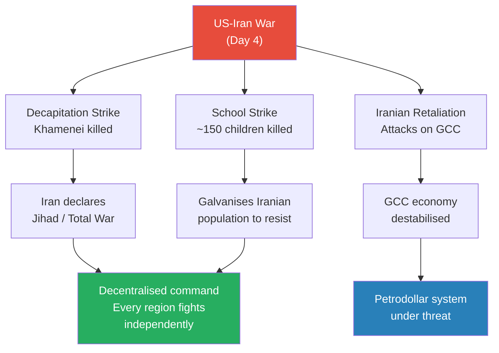
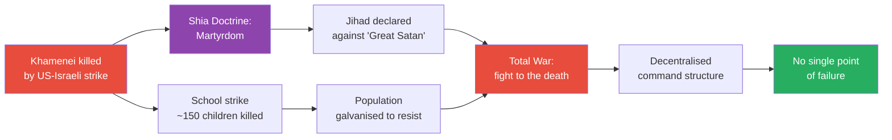
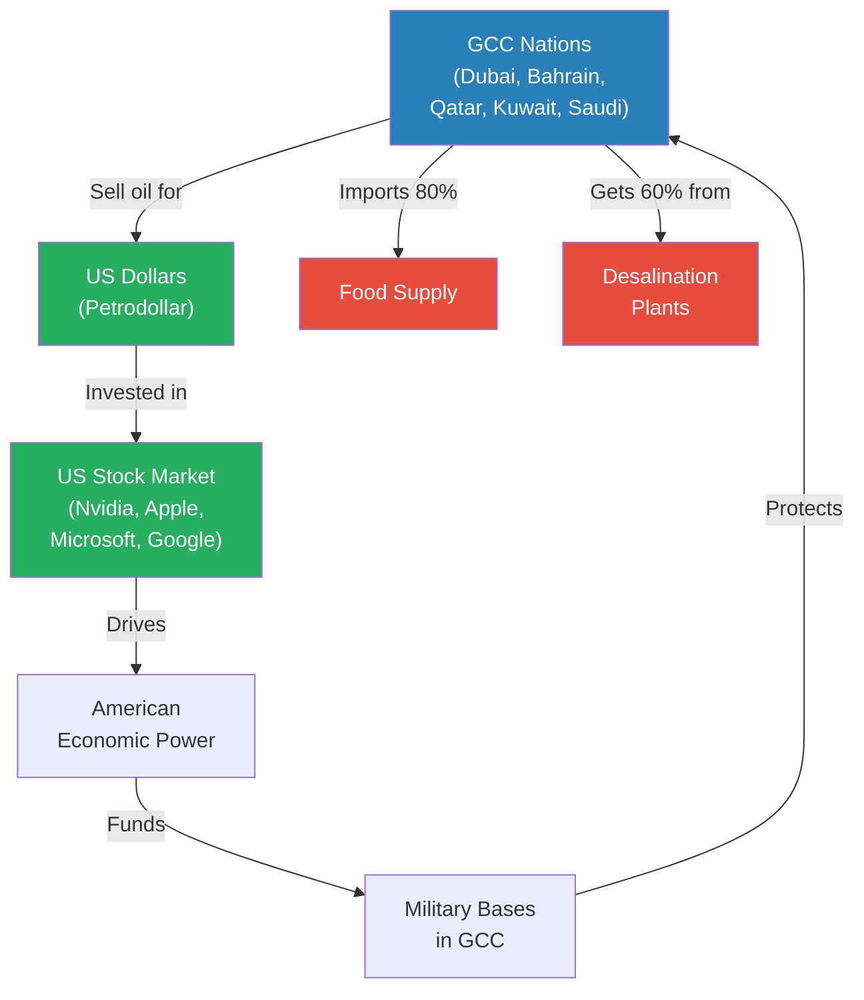
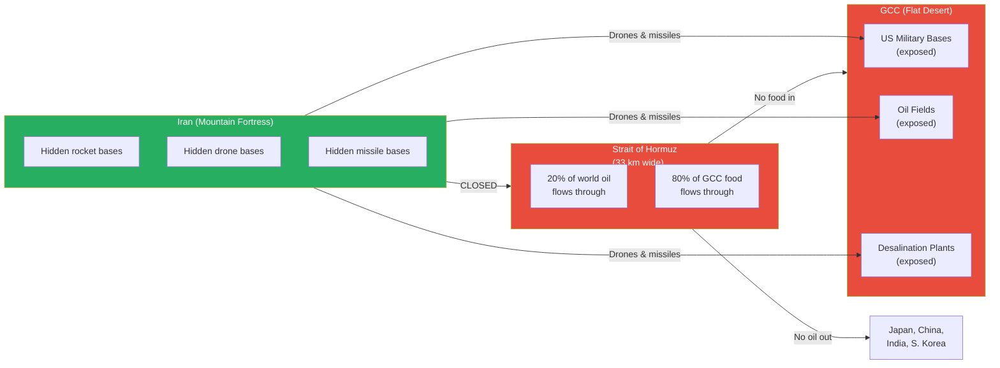
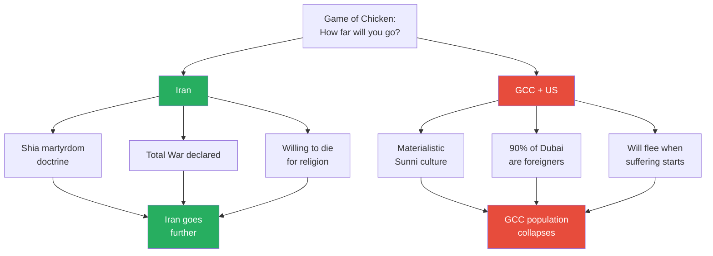
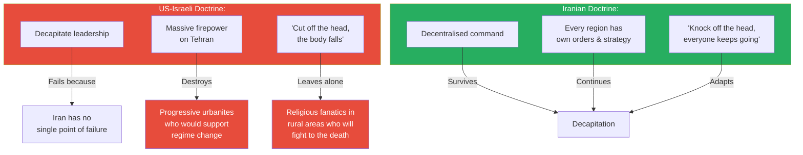
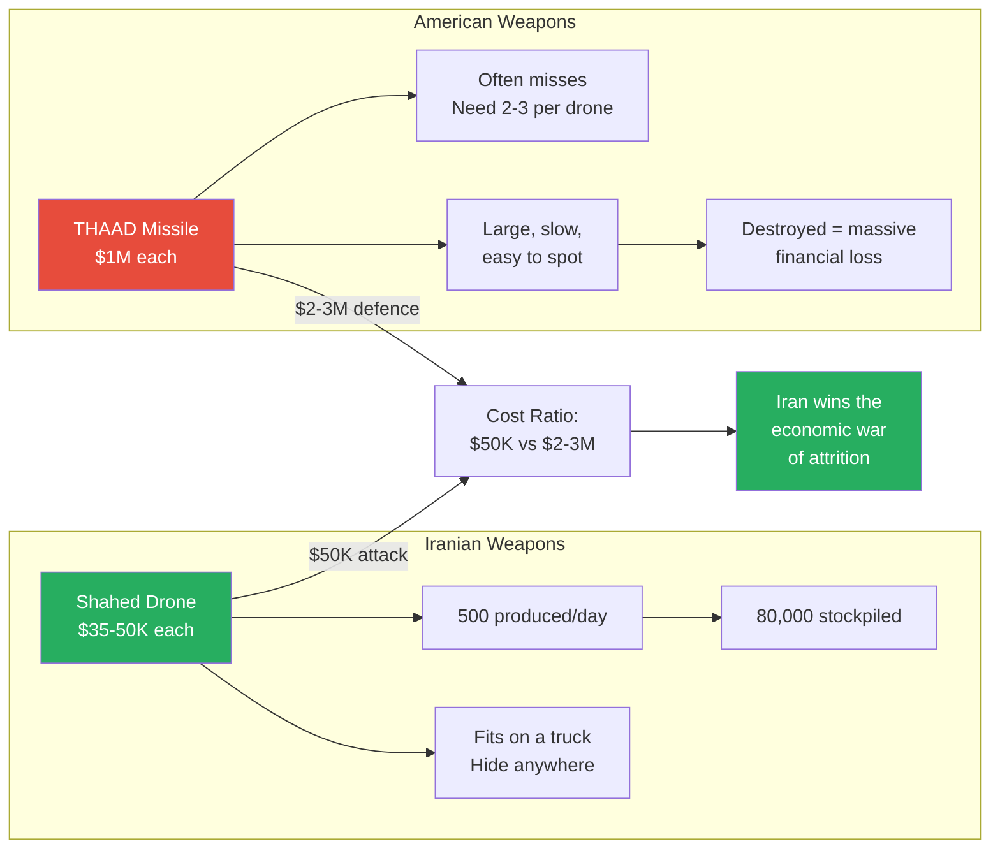
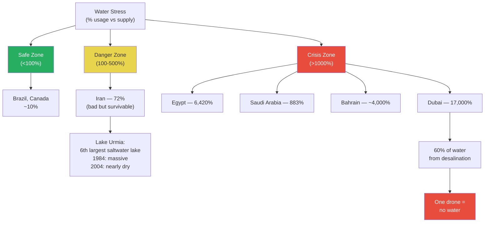
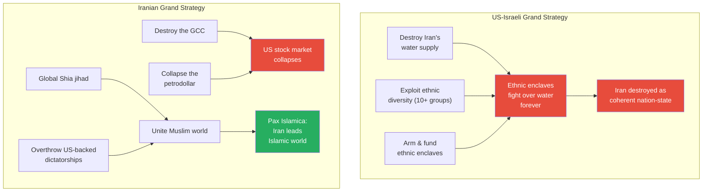

# The US-Iran War

> Prof. Jiang returns from break to announce that World War Three has started. The United States and Israel have launched a decapitation strike against Iran, killing Supreme Leader Ayatollah Khamenei and striking civilian targets including a school. Rather than demoralising Iran, the assassination has triggered a jihad — the Shia doctrine of martyrdom transforms military defeat into spiritual fuel. Prof. Jiang uses game theory to analyse both sides' strategies: the US-Israeli plan to fracture Iran along ethnic lines and deny it water, and Iran's plan to destroy the GCC (Gulf Cooperation Council), collapse the petrodollar, and ignite a pan-Islamic uprising. Geography, not ideology, determines how this war unfolds — and the Strait of Hormuz is the pivot on which the world economy turns.

---

## Overview: Key Highlights

- <b style="color: #27ae60">For Iran, this is a jihad, not a geopolitical war</b> — the killing of Khamenei triggered a religious obligation of martyrdom and vengeance that ensures total commitment
- <b style="color: #e74c3c">The GCC is the linchpin of the American empire</b> — if Dubai, Bahrain, Qatar, and Saudi Arabia collapse, the petrodollar collapses with them
- <b style="color: #2980b9">Strait of Hormuz</b> — 33 kilometres wide, carries 20% of the world's oil, and Iran has closed it, strangling global energy supply
- <b style="color: #e74c3c">Dubai is dead in the long term</b> — no wealthy Westerner will move money to a city that can be attacked by Iranian drones at any time
- <b style="color: #2980b9">Asymmetry</b> — a $50,000 Iranian drone versus a $1 million American THAAD missile, and the missile often misses
- <b style="color: #27ae60">Iran is a mountain fortress</b> — its geography allows it to hide offensive capacity while the GCC is flat, exposed desert with no natural defence
- <b style="color: #e74c3c">Water is the decisive weapon</b> — the GCC imports 80% of its food and gets 60% of its water from desalination plants, all of which are vulnerable to drones
- <b style="color: #2980b9">US-Israeli grand strategy</b> — fracture Iran into ethnic enclaves and have them fight over water permanently
- <b style="color: #27ae60">Iranian grand strategy</b> — destroy the GCC, collapse the petrodollar, unite the Muslim world under a Pax Islamica
- <b style="color: #e74c3c">American military doctrine is built for the Cold War, not the 21st century</b> — designed to impress, not to fight drones and religious insurgents
- <b style="color: #2980b9">Bahrain</b> — 50%+ Shia population ruled by Sunnis, housing the US Fifth Fleet, likely the first domino to fall
- <b style="color: #27ae60">The global economy is at stake</b> — Japan collapses in 8-9 months without Gulf oil; India, China, and South Korea are all dependent on the Strait of Hormuz

| Concept | One-line summary |
|---------|-----------------|
| **Shia martyrdom** | The core doctrine binding Iran's war effort — self-sacrifice for religion as the highest purpose |
| **Decapitation strike** | The US-Israeli doctrine of killing leadership to collapse an organisation — failed against decentralised Iran |
| **Petrodollar** | The system where GCC oil is sold exclusively in US dollars, underpinning the value of American currency |
| **Strait of Hormuz** | The 33km-wide chokepoint carrying 20% of global oil — the single most important waterway on Earth |
| **Asymmetry** | Fighting different wars with different weapons because one side is vastly stronger — Iran's $50K drones vs America's $1M missiles |
| **GCC (Gulf Cooperation Council)** | The Gulf states (UAE, Bahrain, Qatar, Kuwait, Saudi Arabia) that house US military bases and sell oil for dollars |
| **Shock and awe** | American military doctrine — overwhelm with firepower to break the enemy's will. Fails against religious fanatics |
| **Shahed drones** | Iran's cheap ($35-50K each), mass-produced (500/day) offensive weapon — easily hidden, easily transported |
| **Water scarcity** | The existential vulnerability of both sides — GCC depends on desalination, Iran suffers drought and lake depletion |
| **Pax Islamica** | Iran's end goal — unite the Muslim world under Iranian leadership by overthrowing American-backed dictatorships |
| **Ethnic fracturing** | The US-Israeli long-term plan to divide Iran into competing ethnic enclaves fighting over water |
| **Total War / Decentralised command** | Iran's response to decapitation — every region operates independently, removing single points of failure |

---

# The Lecture

## The Opening: World War Three Has Started [0:00 - 3:00]

*Prof. Jiang welcomes the class back from break with a blunt declaration: World War Three has started. The US and Israel have attacked Iran, and they are now in the fourth day of the war. He promises to use game theory to analyse the conflict in real time — and test their analysis against reality as events unfold.*

> [!tip] Core Insight
> This war is not abstract. Prof. Jiang is teaching game theory as a live analytical tool — every prediction they make can be verified against events happening that same week.

*The opening moves of the war have produced the opposite of their intended effect: rather than decapitating Iranian resistance, they have triggered total war and decentralised command, making Iran harder to defeat, not easier.*

> [!note]- Expand: Full Lecture Detail
> Prof. Jiang opens with characteristic directness: "I hope everyone have a nice break and welcome back to the end of the world." He tells the class that the United States and Israel have attacked Iran, they are on day four, and the war could last weeks or years. "After this war is done, the world will never be the same again."
>
> He frames the course's approach: they will use game theory to understand and analyse the geopolitical situation in real time. "I'm going to teach you the ideas, the theories, the techniques to understand the water around you and make predictions, and we can know if our analysis is correct, because all this is happening in real time."
>
> He then lays out the opening facts:
>
> - In the early morning of Saturday in Tehran, the Israelis and Americans launched a <b style="color: #2980b9">decapitation strike</b> against Ayatollah Khamenei, the 86-year-old Supreme Leader of Iran
> - The Americans claimed intelligence on his location and "sent airplanes to just bomb the crap out of a place"
> - A spy recorded the body of the dead Ayatollah, which was then announced publicly
> - Iran initially denied the death, then admitted it — but framed it as martyrdom: "He chose to stay in Tehran and die for his people"
> - Khamenei died along with his daughter, son-in-law, and grandchildren
> - He also reportedly had prostate cancer — "he's gonna die fairly soon as well"
>
> The critical framing: "Even though the Americans and Israelis claim great success in decapitating the leadership of the Iranians, from the Iranian perspective, this is a martyrdom."

---

## Martyrdom and Jihad: Why This War is Religious [3:00 - 7:00]

*Prof. Jiang explains the Shia doctrine of martyrdom that transforms the killing of Khamenei from a military victory into a spiritual catalyst. For Iran, this is not a geopolitical conflict — it is a jihad against the great Satan, and the population will fight to the death.*

> [!tip] Core Insight
> The Americans killed a leader and expected the body to fall. Instead, they created a martyr — and martyrdom is the single most powerful mobilising force in Shia Islam. The decapitation strategy worked tactically but failed catastrophically at the strategic level.

*The causal chain from assassination to total war runs through Shia theology, not military logic. Each step strengthens rather than weakens Iranian resolve.*

> [!note]- Expand: Full Lecture Detail
> Prof. Jiang explains the theological foundation:
>
> - <b style="color: #2980b9">Shia Islam</b> is different from Sunni Islam — Sunnis are the majority (~90% of all Muslims), and the Shia have always been the persecuted minority
> - Because of this history of persecution, "the core value, the force that binds everyone together and gives them purpose and meaning in life, that galvanizes them into action, is the idea of <b style="color: #2980b9">martyrdom</b>"
> - Martyrdom drives <b style="color: #2980b9">jihad</b> — "sacrifice yourself for your religion, sacrifice yourself for the common good"
> - "Think of the death of Khamenei as a sacrifice, a self-sacrifice, in order to motivate their radiance in this war"
> - <b style="color: #e74c3c">"For the Iranians, this is not a geopolitical war. This is not an economic war. This is not a war of resistance. This is a jihad."</b>
>
> He then addresses the school strike:
>
> - The same morning Khamenei was killed, a strike hit a school in southern Tehran, killing approximately 150 primary school girls
> - Israel's position: the school was next to a military base, they were targeting the base, and the school was hit by an air defence missile that went off course
> - Iran's position: Israel deliberately attacked the school
> - Prof. Jiang notes: "Given past actions from the Israelis, this is fairly consistent with what they've done"
> - The purpose, from a game theory perspective: "It's meant to show to themselves and the world that we are now all in"
>
> > [!example] The Analogy of Killing the Pope
> > - Prof. Jiang draws a cross-religious parallel to make the point concrete
> > - "If you want to kill the Pope, the Catholics will be really angry at you, and they would want to kill you"
> > - The Shia response to Khamenei's death is the same emotional and theological response — amplified by the doctrine of martyrdom
> > - Unlike Catholicism, Shia Islam has martyrdom as its founding narrative — the death of Hussein at Karbala in 680 AD established self-sacrifice as the faith's central act
> > **The lesson:** Killing a religious leader in a faith built on martyrdom does not demoralise — it radicalises.

---

## The GCC: The Linchpin of American Empire [7:00 - 12:00]

*Prof. Jiang turns to Dubai, Bahrain, and the Gulf states to explain why Iran is attacking them. The GCC is not a neutral bystander — it is the economic foundation of American empire, and its destruction is Iran's primary strategic objective.*

*The petrodollar cycle is a closed loop — GCC sells oil for dollars, invests dollars in American markets, America uses military power to protect the GCC. Break any link and the entire system collapses. The red nodes show where Iran is attacking.*

> [!note]- Expand: Full Lecture Detail
> Prof. Jiang begins with Dubai as a case study:
>
> - Dubai is "considered one of the wealthiest, safest cities in the world" — tens of thousands of Westerners live there for the tax-free income, restaurants, and safety
> - Its economic model depends on aviation (Emirates, the busiest airport in the world), logistics, finance, and tourism
> - "For the longest time, Dubai was flourishing under American protection" and claimed neutrality: "We're like Switzerland. We're neutral. We don't want any involvement in any wars"
> - <b style="color: #e74c3c">Then the Iranians attacked the GCC — Dubai, Abu Dhabi, Bahrain, Qatar, Kuwait</b>
> - The Dubai airport was shut down; wealthy residents were willing to pay $20,000-$50,000 just to get on a plane and leave
> - Prof. Jiang's verdict: <b style="color: #e74c3c">"After what the Iranians did, it's dead. Dubai is a city — in the long term, it is dead"</b>
> - No wealthy Westerner will move to a place that "can be attacked anytime by the Iranians" — they will choose Singapore, Hong Kong, Japan, or South America instead
>
> Why Iran targets the "neutral" GCC:
>
> - "Even though they pretend to be neutral, they house the American military, they allow the Israelis and Americans to use their airspace to attack Iran"
> - The pretence of neutrality is exactly that — a pretence
>
> He then turns to <b style="color: #2980b9">Bahrain</b>:
>
> - Bahrain houses the American Fifth Fleet — the US naval base in the Middle East
> - The Iranians are attacking it with missiles and "it's being blown up"
> - Critically, Bahrain has 50% or more Shia population, but the ruling class is Sunni
> - Iran is "trying to ignite a religious war" — the Shia in Bahrain owe religious loyalty to the dead Ayatollah and now have a jihad obligation
> - Prof. Jiang predicts: <b style="color: #e74c3c">"Bahrain will be the first to fall. Dubai will probably go bankrupt. In the long term, we can expect the entire GCC area, including Saudi Arabia, to eventually collapse"</b>
>
> > [!example] The Dubai Exodus
> > - Dubai built its entire brand on safety, wealth, and neutrality — "Switzerland of the Middle East"
> > - 90% of Dubai's population are foreign expatriates — they have no loyalty to the nation
> > - When Iranian drones and missiles struck, residents scrambled to leave — paying up to $50,000 for flights
> > - The airport, the busiest in the world, was shut down
> > - The wealthy will relocate permanently to Singapore, Hong Kong, or other safe havens
> > - Dubai's reputation — its only real asset — is destroyed in a single week
> > **The lesson:** A city built on the perception of safety dies the moment that perception is shattered. Reputation, once lost, does not return.

---

## The Strait of Hormuz: The Pivot of the World [12:00 - 17:00]

*Prof. Jiang pulls up a map and makes a claim that geography alone will tell you how this war unfolds. The Strait of Hormuz — 33 kilometres wide — is the centre of the world. Through it flows 20% of global oil. Behind it sits Iran's mountain fortress. In front of it sits the exposed, flat desert of the GCC. The asymmetry is devastating.*

> [!tip] Core Insight
> You do not need to know the participants, the weapons, or the politics. The map tells you everything: Iran is a mountain fortress with hidden offensive capacity; the GCC is a flat desert with no natural defence, no food, and no water. Geography is destiny.

*The geographic asymmetry is absolute. Iran can hide its weapons in mountains and strike exposed GCC targets at will. The closure of the Strait cuts oil to Asia and food to the GCC simultaneously.*

> [!note]- Expand: Full Lecture Detail
> Prof. Jiang presents the map and walks through its implications methodically:
>
> **The Strait of Hormuz:**
> - Only 33 kilometres wide — "people can swim across it"
> - 20% of all the world's oil flows through this narrow passage
> - It goes to Asia: India (60% of oil from this region), China (40%), Japan (75%)
> - Japanese Prime Minister has said that if the Strait closes, "the entire Japanese economy would collapse in eight, nine months"
> - <b style="color: #e74c3c">The Iranians have closed the Strait of Hormuz</b> — the global economy will suffer greatly
>
> **The GCC's fatal dependencies:**
> - The GCC sends oil out through the Strait and receives food back — <b style="color: #e74c3c">80% of all the food it consumes is imported</b>
> - These cities grew to millions of people because of petrodollars flowing in
> - Close the Strait: no food comes in, "they're all gonna starve"
> - 60% of GCC water supply comes from desalination plants
> - "Is it hard to blow up a desalination plant using a drone? The answer is, it's very easy"
>
> **The petrodollar system:**
> - "The US dollar is worth nothing. It's only valuable people want it"
> - The GCC sells oil exclusively for US dollars — "that is the basis of the value of the US dollar"
> - "If the GCC collapses, the American economy and the American empire both collapse at the same time"
> - The GCC is "an artificial construct of Empire. It does not exist naturally" — no food, no water, no natural sustainability
>
> **Iran's geographic advantage:**
> - Iran is a mountain fortress: "You can hide rocket bases. You can hide drone bases. You can hide missiles"
> - The GCC is "this flat desert, and it is exposed to attack, and there's nothing it can do about it"
> - Iran targets three things: American military bases, oil and energy infrastructure, and water supply (desalination plants)
> - "At any point in this war, the Iranians can choose to destroy the entire GCC, and there's nothing that anyone can do about it"
>
> **Iran's weakness:**
> - Iran also has a water problem — climate change has caused severe drought
> - The US-Israeli plan is to "destroy the water supply of the Iranians"
> - "The fortress can also be a mountain prison — where people are trapped inside with no access to water"
> - Attacks on civilian infrastructure, hospitals, dams, reservoirs, and power plants are the US-Israeli strategy
>
> > [!example] Japan's Nine-Month Clock
> > - Japan depends on the Strait of Hormuz for 75% of its oil supply
> > - The Japanese Prime Minister has publicly stated: if the Strait closes, Japan has eight to nine months before total economic collapse
> > - Japan has no domestic oil production and limited strategic reserves
> > - The closure forces every oil-dependent nation into the conflict — not by choice, but by necessity
> > **The lesson:** The Strait of Hormuz is not a Middle Eastern issue — it is a global chokepoint that connects every major economy to this war.

---

## The Game of Chicken: Mutual Destruction [17:00 - 20:00]

*Prof. Jiang frames the war as a game of chicken — both sides have the capacity to destroy each other, and the question is who is willing to go further. The answer, he argues, is clearly Iran: the Shia believe in martyrdom, while the GCC believes in money.*

*In a game of chicken, the player who is willing to die always wins. Iran's Shia martyrdom doctrine gives it an asymmetric advantage in resolve that no amount of American firepower can offset.*

> [!note]- Expand: Full Lecture Detail
> Prof. Jiang synthesises the geographic analysis into a game-theoretic framework:
>
> - "Both sides have the potential to destroy each other. It's really a question of how far do they want to go"
> - This is "almost a game of chicken — we can blow each other up. How far do you want to go?"
> - <b style="color: #27ae60">The Iranians are Shia, which believes in martyrdom, and you've killed the religious leader — so they're willing to go very, very far</b>
> - The GCC nations "are Muslim, but they're materialistic. They love money"
> - Most of the GCC population are expatriates — "90% of Dubai are foreigners"
> - "If they suffer, they're gonna run away"
> - <b style="color: #e74c3c">"This is not a fair matchup"</b>
>
> He raises three escalation questions that will define the coming weeks:
>
> 1. **Ground troops:** "The only way that you can defeat Iran is by using ground troops" — will America send one to two million soldiers?
> 2. **Nuclear weapons:** "If you lose a war, would you choose to use nuclear weapons?"
> 3. **Global expansion:** France, Germany, and Britain are discussing entry — "if that happens, it is possible that Russia and China will also enter on the side of the Iranians"

---

## Shock and Awe vs. Decentralised Command [20:00 - 25:00]

*Prof. Jiang examines the military doctrines of both sides: the US-Israeli "shock and awe" approach of decapitating leadership versus Iran's decentralised Total War doctrine. He shows why American military doctrine — built for Cold War intimidation — is fundamentally unsuited to 21st-century warfare against drones and religious fanatics.*

*The great irony: shock and awe destroys the people most likely to support the US (urban progressives) and leaves untouched the people most likely to fight to the death (rural Shia militants).*

> [!note]- Expand: Full Lecture Detail
> Prof. Jiang explains why the American military operates as it does:
>
> - American bases across the Middle East were "established to protect [the monarchies] from basically their own people" — these are monarchies imposed by the Anglo-American Empire
> - The bases "aren't really meant to defend these nations from other enemies. They're really meant to impose American authority in the Middle East"
> - <b style="color: #2980b9">Empire is "an image. It is a hallucination. It's just an idea"</b> — "an aura of invincibility. If you fear it, then you obey it. But it's not really designed to fight a war"
> - The American military was built during the Cold War, defined by <b style="color: #2980b9">MAD (Mutually Assured Destruction)</b> — both sides had nuclear weapons, so they never actually fought
>
> The doctrine mismatch:
>
> - <b style="color: #2980b9">Shock and awe</b>: "you decapitate the enemy, you cut off the head, the body will fall down"
> - Problem: the Iranians see this as a religious war and have announced Total War
> - "Command and control in Iran is decentralised. There's no one person telling them what to do. Every region has its own orders, has its own strategy"
> - "You knock off the head. It doesn't change anything"
>
> The cruel irony:
>
> - "The Iranians who will be most supportive of regime change are actually in the cities — because they are educated, they're progressive"
> - "The people who are most fundamentally against you, will fight you to the death, are religious fanatics, the Shia militants living in the rural areas"
> - <b style="color: #e74c3c">"You are actually destroying those who will most likely support you, and you're leaving alone those who are most likely to commit jihad against you"</b>

---

## Asymmetry: Shahed Drones vs. THAAD Missiles [25:00 - 30:00]

*Prof. Jiang introduces the concept of asymmetry — the two sides are fighting fundamentally different wars because of the vast gap in resources. Iran's cheap, mass-produced drones exploit a structural weakness in American military spending that no amount of money can fix.*

> [!tip] Core Insight
> The American military is not built to fight wars. It is built to spend money. The weapon systems are designed to scare and to generate profits for defence contractors — not to stop $50,000 drones. This is not a bug; it is the system working as intended.

*The cost asymmetry is devastating: for every $50,000 Iran spends on a drone, the US spends $2-3 million trying to stop it. At that ratio, the wealthiest military in history bleeds itself dry.*

> [!note]- Expand: Full Lecture Detail
> Prof. Jiang defines <b style="color: #2980b9">asymmetry</b>: "the two sides are choosing to fight different wars using different techniques because one is much stronger than the other."
>
> **Iran's offensive weapon — the Shahed drone:**
> - Each drone costs "$50,000 at most — it can go as cheap as $35,000"
> - "You can fit a lot of these drones to a truck that can go anywhere in Iran, and you can hide anywhere"
> - Iran produces about 500 per day and has approximately 80,000 stockpiled
> - A single drone "can knock out a desalination plant, it can knock out an oil field, it can knock out a hotel"
> - Easily transportable, easily hidden, easily deployed from anywhere
>
> **America's defensive weapon — THAAD:**
> - Each THAAD missile costs $1 million
> - "There's this $50,000 drone coming your way, and you throw a million dollar missile at it"
> - "Often these missiles miss. You have to throw two or three missiles at it"
> - Spending $2-3 million to stop each $50,000 drone
> - The system is "really big and really slow, and therefore you can't really move it around"
> - "Pretty easy for the Iranians to spot where this is and attack it"
>
> **Why the Americans are in this position:**
> - "The Americans have drones. They've had drones for like 10 years. You've also seen drones used in the Russia-Ukraine war to devastating effect. Why didn't the Americans know this? Why didn't they prepare?"
> - <b style="color: #2980b9">Military doctrine</b> — "determines how you fight a war, determines your bureaucracy, and determines how you spend your resources"
> - The Cold War was about "flexing" — the weapons are "designed to scare the crap out of you. They are designed to impress you, and as a result, they cost a lot of money, and they don't do anything"
> - <b style="color: #e74c3c">"The entire American military — it costs a lot, and it doesn't really do anything, and it's not resilient, it's not innovative, it's not open"</b>
> - The military-industrial complex: "The Americans don't really care about winning a war. What they care about is spending as much money as possible because then they get a cut"
>
> Prof. Jiang connects this to the series' earlier lessons: nations that are poor "actually have more energy, they're more open and they're more cohesive" — a direct callback to the superstructure analysis from earlier lectures.

---

## Water as a Weapon: The Existential Vulnerability [30:00 - 35:00]

*Prof. Jiang turns to water scarcity data to show that water, not military power, is the decisive factor. He presents water stress statistics that reveal the GCC's impossible position — and Iran's vulnerability too.*

*The water stress numbers are staggering — Dubai at 17,000% means it uses 170 times more water than its environment naturally produces. A single drone striking a desalination plant turns a wealthy city into an uninhabitable desert.*

> [!note]- Expand: Full Lecture Detail
> Prof. Jiang presents a world map of water stress:
>
> - 100% water stress means "you drink as much water as the environment produces" — ideally you want to be at 10%
> - Above 100% means "you are drinking more water, using more water than the environment actually produces"
> - Light blue countries (Brazil, Canada) "have nothing to worry about"
>
> The Middle East numbers:
>
> | Country | Water Stress |
> |---------|-------------|
> | Egypt | 6,420% |
> | Saudi Arabia | 883% |
> | Bahrain | ~4,000% |
> | Dubai/UAE | 17,000% |
> | Iran | 72% |
>
> - "It doesn't matter if Iran kills American soldiers, destroys American military. All it has to do is destroy the desalination plants, and then the GCC is destroyed"
> - But Iran also has water issues — 72% "is pretty bad"
>
> He shows satellite images of <b style="color: #2980b9">Lake Urmia</b> in northern Iran:
>
> - The sixth largest saltwater lake in the world — "or it used to be"
> - 1984 image: massive, deep lake
> - 20 years later: "There's no more water here. You can walk from here over to there"
> - <b style="color: #e74c3c">"That's how serious the water issue is in Iran, and that's the weak point that the Americans and Israelis will attack"</b>
> - The US-Israeli strategy: "make sure that Iran has no access to fresh water, which will cause devastation in their nation"
> - "We're already seeing attacks on civilian infrastructure, hospitals. In the future, you'll see attacks on water supply, on dams, on reservoirs, on power plants"

---

## The Grand Strategies: Fracture vs. Crusade [35:00 - 42:00]

*Prof. Jiang reveals the end-game strategies of both sides. The US-Israeli plan: fracture Iran into ethnic enclaves fighting over water forever. Iran's plan: destroy the GCC, collapse the petrodollar, ignite a global jihad, and establish a Pax Islamica. Both plans are rational within game theory — and both aim for the permanent destruction of the other.*

> [!tip] Core Insight
> Both grand strategies are logically coherent within game theory. The US-Israeli strategy exploits Iran's ethnic diversity and water crisis. Iran's strategy exploits the GCC's artificial existence and the petrodollar's fragility. The question is not which plan is smarter — it is which side has the will to execute.

*Two mirror-image strategies of permanent destruction. The US wants to fracture Iran internally; Iran wants to fracture the American empire externally. Both are playing for civilisational stakes.*

> [!note]- Expand: Full Lecture Detail
> **The US-Israeli Grand Strategy:**
>
> Prof. Jiang shows a map of Iran's ethnic minorities:
>
> - Iran is "a very diverse place" — Persians in the centre, but "10 other groups as well"
> - "In the Borderlands, it's basically a different country" — these groups "have more in common with their neighbours than they do with Iran"
> - <b style="color: #2980b9">Strategy: "Destroy Iran as a coherent nation state, divide it into ethnic enclaves, and have them fight over water"</b>
> - He shows a map of the vision: "Persia is limited, and then all these other places are sponsored by the Americans and the Israelis — they're giving money, they're giving them weapons, they're giving political support"
> - "This war will wage over water forever. And this is how you destroy Iran and make sure Iran is not a rival threat"
> - He notes: <b style="color: #e74c3c">"As you can see, it's a pretty evil plan, and that's why they have not announced it"</b>
> - "If you announce it, you're like, why are you doing this? What did the Persians ever do to you to warrant you coming destroying their civilisation? And the answer is nothing"
> - "But if you look at the map of water supply, of ethnic tensions, this is the optimal game theory strategy"
>
> **Iran's Grand Strategy:**
>
> Prof. Jiang shows a map of the Muslim world:
>
> - Light green = Sunni (90% of all Muslims, ~2 billion people)
> - Dark green = Shia (concentrated in Iran, with populations scattered worldwide)
>
> Iran's four-step plan:
>
> 1. <b style="color: #2980b9">Global Shia jihad</b> — unite all Shia against the American empire. "It's already happening — the Shia in Pakistan stormed the American Embassy, the Shia have attacked the American Embassy in Iraq"
> 2. <b style="color: #2980b9">Pan-Islamic unification</b> — "most of the Muslim world is actually run by dictatorships that are not popular at all" — overthrow the American-backed regimes
> 3. **Destroy the GCC** — the linchpin of the American empire
> 4. **Establish Pax Islamica** — "Iran becomes the leader of the Islamic world, not just the Shia world, but the Islamic world"
>
> **The economic destruction pathway:**
>
> - GCC nations invest massively in US financial markets — investment from UAE, Saudi Arabia, and Kuwait has been "exploding" since 2012
> - Seven companies (Nvidia, Microsoft, Google, Apple, etc.) account for about a quarter of stock market growth
> - These companies are "heavily invested in by the GCC nations"
> - If GCC nations can no longer invest: "these companies will collapse in value, and with that, that would lead to economic depression in America"
>
> > [!example] The Shia Embassies Under Attack
> > - The Shia in Pakistan stormed the American Embassy — Americans killed many people in response
> > - American Embassies are under attack in Iraq and across the region
> > - This is not spontaneous — it is the first stage of Iran's global jihad strategy
> > - The killing of Khamenei created a religious obligation of vengeance that extends to every Shia community worldwide
> > - Each embassy attack is both a military action and a religious act of martyrdom
> > **The lesson:** Iran's strategy does not require a conventional military victory. It requires making every Shia person in the world feel personally obligated to act against America — and the assassination of the Ayatollah has done exactly that.

---

## Q&A: Who Gets Involved and Why? [42:44 - end]

*A student asks what brings other nations into the conflict. Prof. Jiang provides a brief answer — energy access is the primary driver — and previews how this war connects to the Ukraine conflict, promising to explore each nation's strategic calculus in coming weeks.*

> [!note]- Expand: Full Lecture Detail
> A student asks: "If other countries, such as Italy, France, China or Russia, have also joined this war — what's the cause? Because of oil or those resources?"
>
> Prof. Jiang's response:
>
> - The "easy answer is energy access" — every major nation needs to protect its energy supply
> - <b style="color: #2980b9">Europe's predicament:</b> Europe is already fighting Russia and has stopped buying Russian energy — it now depends heavily on the GCC
>   - "If the GCC is not providing them energy, then Europe will go bankrupt"
>   - "Europe needs to enter this war on behalf of Americans"
> - <b style="color: #2980b9">Russia's position:</b> "Russia cannot allow Iran to fall, because if Iran falls, then they'll come after Russia next"
> - <b style="color: #2980b9">China's position:</b> "China is actually neutral. China's okay with either scenario" — structural neutrality
> - He previews: "this war in the Middle East is actually connected to the Ukraine war" and promises to show how the two connect
>
> Prof. Jiang closes: "We'll continue this discussion on Thursday."

---

## Connections

**Builds on:** [[01 - The Dating Game]] (game theory fundamentals — players, rules, incentives), [[07 - America's Game]] (American empire structure), [[08 - Communist Specter]] (ideological conflict as a driver of geopolitics). The superstructure concept from Lecture 1 applies directly here: the GCC's superstructure (oil wealth, American protection, foreign labour) has created a society structurally incapable of withstanding the game Iran is now playing.

**Sets up:** [[10 - The Law of Asymmetry]] (the concept introduced here — cheap weapons vs expensive defences — becomes a formal principle), [[11 - The Law of Escalation]] (the escalation dynamics between ground troops, nuclear weapons, and global involvement), [[12 - The Law of Eschatological Convergence]] (religious end-times thinking as a strategic variable — directly relevant to Shia martyrdom doctrine).

**Recurring themes:**
- Asymmetry as strategic advantage — the weaker power wins by fighting a different war
- Empire as hallucination — American power depends on perception, not substance
- Religion as the most powerful motivator — echoes the Civilization series thesis that religion drives civilisation
- Geography as destiny — mountains vs. desert determines military outcomes before a shot is fired
- Corruption as structural weakness — the military-industrial complex optimises for profit, not victory
- Water as the 21st-century weapon — more decisive than oil, drones, or nuclear warheads

**Related books in vault:**
- [[The 33 Strategies of War - Robert Greene]] — asymmetrical warfare, the guerrilla advantage, and the danger of fighting the last war are central themes. Greene's analysis of how weaker powers defeat stronger ones by refusing to play the enemy's game maps directly onto Iran's drone strategy
- [[Sapiens - Yuval Noah Harari]] — the power of shared myths (religion, money, empire) to organise human behaviour. The petrodollar is a shared myth; Shia martyrdom is a shared myth. Both are real because people act on them

---

## The Takeaway

This lecture accomplishes something unusual: it takes a war that started four days ago and makes it comprehensible through the same game theory framework the class has been learning all semester. The most striking insight is not any individual fact — it is the way geography, religion, economics, and military doctrine interlock into a system where both sides have the capacity to destroy each other, and the outcome depends not on who has more weapons but on who has more will. The Shia doctrine of martyrdom is not a curiosity of comparative religion — it is a strategic variable that fundamentally changes the game-theoretic calculus. A player who is willing to die always wins a game of chicken.

The most counterintuitive claim is that the American military — the most expensive in human history — is structurally incapable of winning this war. Not because it lacks firepower, but because its doctrine, its procurement, and its institutional incentives are all optimised for a war that ended in 1991. The $50,000 drone versus $1 million missile comparison is not just a cost ratio — it is a symbol of an empire that has confused spending with strength. Prof. Jiang's observation that the military-industrial complex does not care about winning, only about spending, reframes the entire conflict: America is not losing because Iran is strong, but because America's own institutions are designed to enrich themselves rather than achieve strategic objectives.

The lecture leaves several critical questions open for the coming weeks: will the US commit ground troops (the only way to defeat Iran militarily)? Will nuclear weapons enter the equation? Will Europe's entry drag Russia and China in, making this formally World War Three? And behind all of these: can the petrodollar survive the destruction of the GCC? Prof. Jiang has framed the semester's remaining lectures as a real-time test of game theory against reality — every prediction they make will be validated or falsified by events. That is either the most exciting or the most terrifying way to teach a course.
