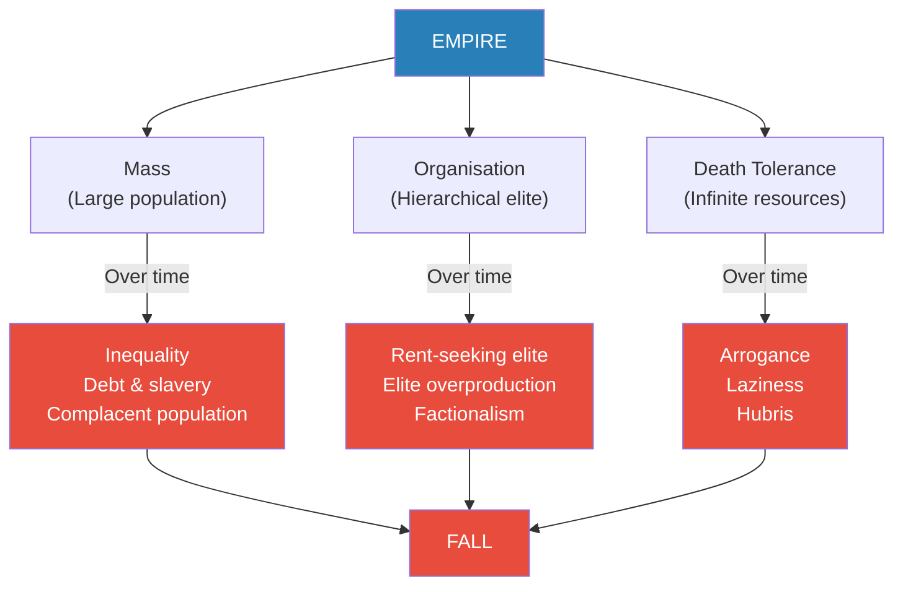
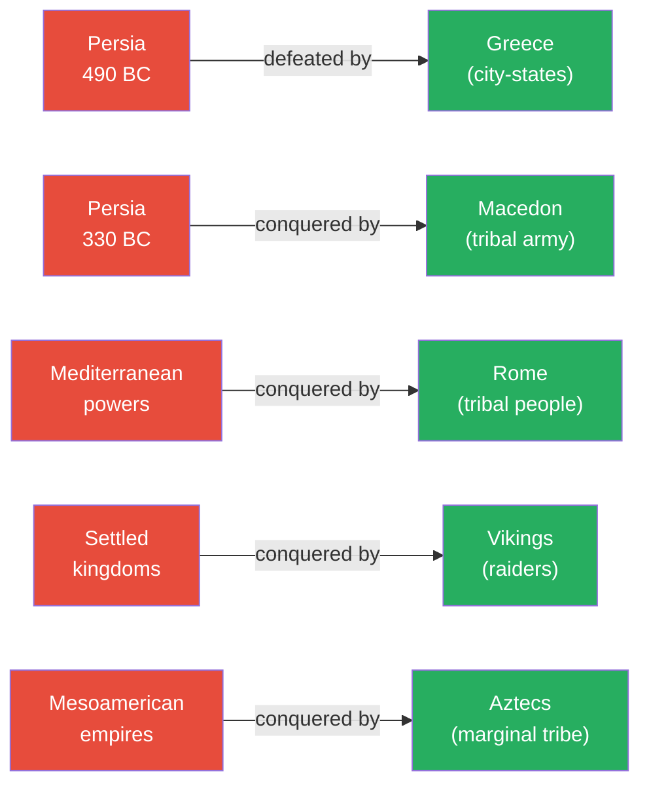
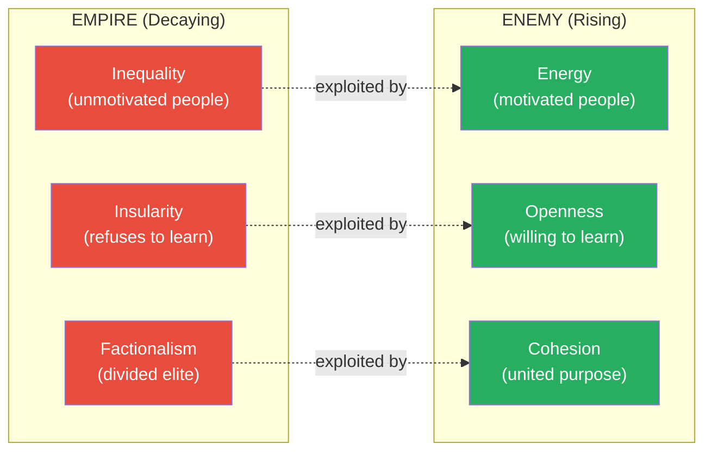
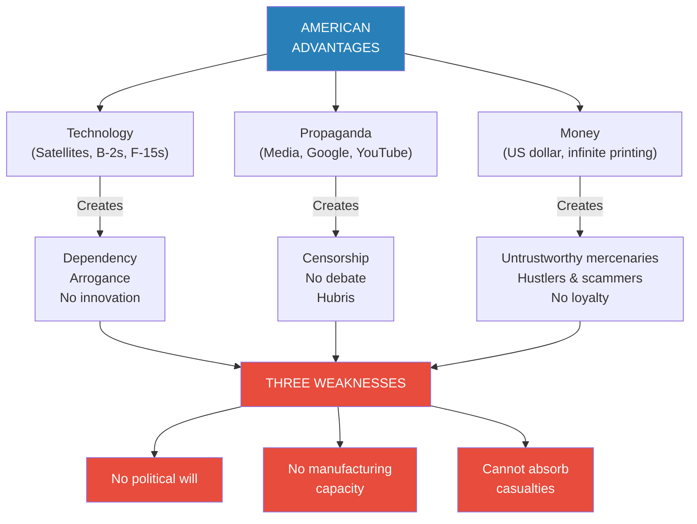
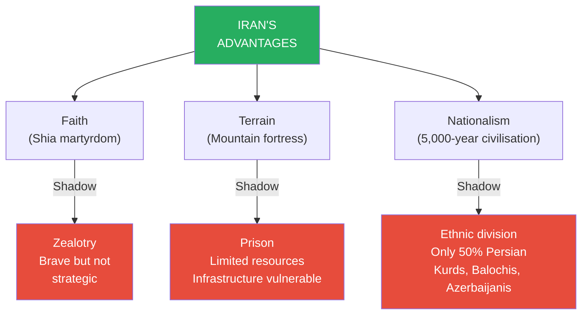
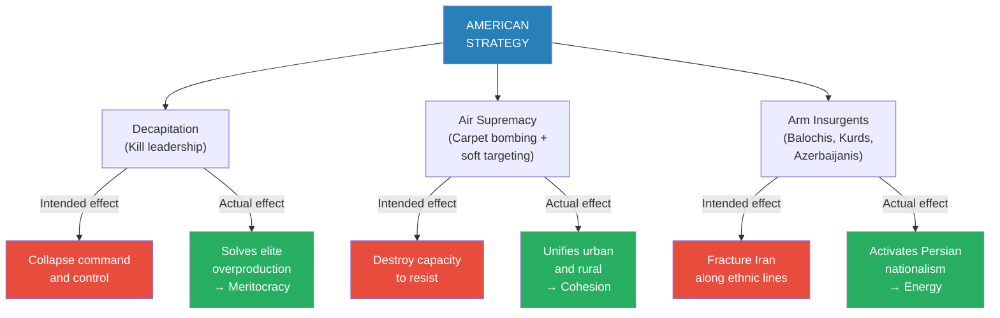
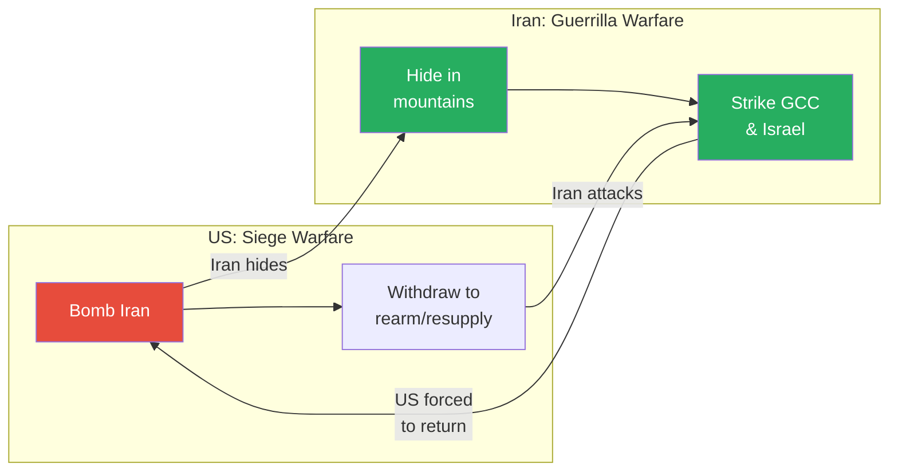
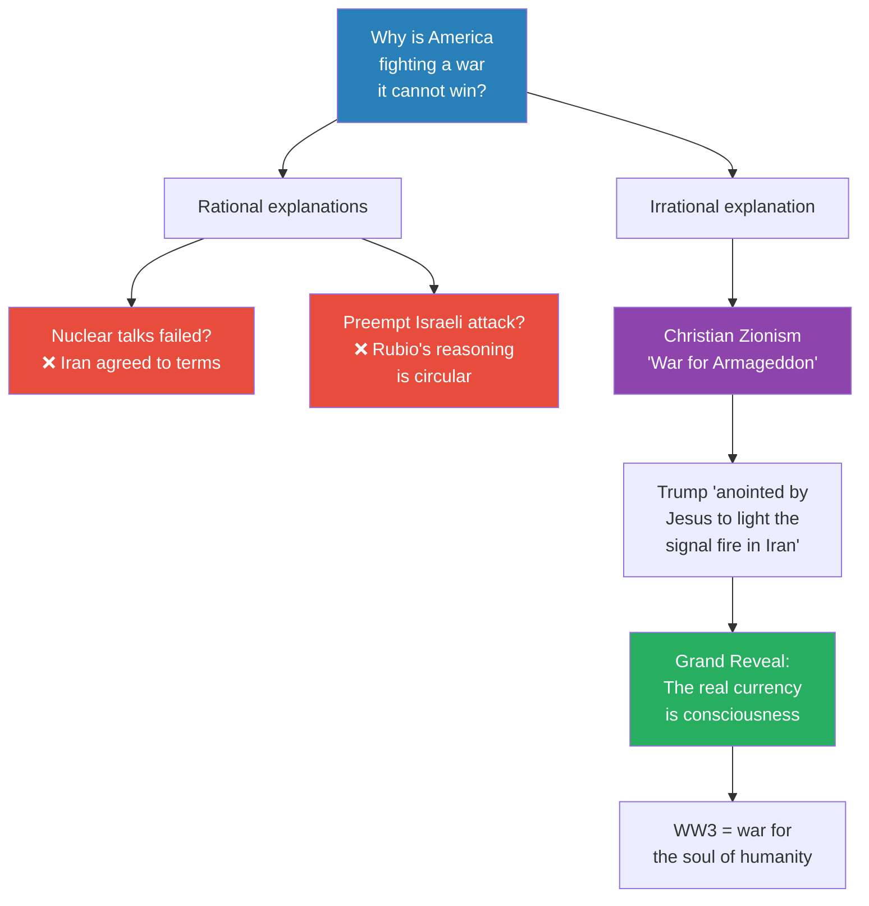

# The Law of Asymmetry

> Prof. Jiang formalises the theoretical framework behind the US-Iran war introduced in Lecture 9. The Law of Asymmetry states that an empire's advantages -- mass, organisation, and the capacity to absorb death -- inevitably become disadvantages over time, creating openings for a weaker enemy that possesses energy, openness, and cohesion. He applies the framework to the specific American advantages of technology, propaganda, and money, showing how each breeds dependency, censorship, and untrustworthy mercenaries. The American strategy -- decapitation, air supremacy, and arming insurgents -- will paradoxically make Iran stronger by solving its elite overproduction problem, unifying its urban-rural divide, and activating Persian nationalism. The lecture concludes with a disturbing revelation: American soldiers are being told this is a war for Armageddon and the return of Jesus, raising the possibility that the real game is not geopolitical at all but eschatological -- a war for human consciousness itself.

---

## Overview: Key Highlights

- <b style="color: #27ae60">The Law of Asymmetry: empire advantages become disadvantages over time</b> -- mass breeds inequality, organisation breeds factionalism, and the ability to survive death breeds hubris
- <b style="color: #2980b9">Energy, openness, and cohesion</b> -- the three qualities that allow a weaker power to defeat an empire, formalised from Lecture 5's asabiyyah framework
- <b style="color: #e74c3c">Hubris is blindness to your own arrogance</b> -- the empire repeats the same mistakes because it cannot recognise them
- <b style="color: #2980b9">Elite overproduction (Peter Turchin)</b> -- too many elites competing for zero-sum power causes factionalism, political polarisation, and internal war
- <b style="color: #e74c3c">American technology creates dependency, not strength</b> -- the ChatGPT analogy: access to the best tools makes you lazier, not smarter
- <b style="color: #27ae60">American strategy will make Iran stronger</b> -- decapitation solves elite overproduction, carpet bombing unifies urban and rural, arming insurgents activates Persian nationalism
- <b style="color: #2980b9">Three American weaknesses</b> -- lack of political will, lack of manufacturing capacity, and inability to absorb casualties
- <b style="color: #e74c3c">Iran's three advantages can also become weaknesses</b> -- faith becomes zealotry, terrain becomes a prison, nationalism fractures along ethnic lines
- <b style="color: #2980b9">Guerrilla warfare vs siege warfare</b> -- Iran's hide-and-seek strategy forces America into a long war it cannot sustain
- <b style="color: #27ae60">Iran's three ethnic flashpoints</b> -- Balochis (Sunni), Kurds (sovereignty-seeking), and Azerbaijanis (reunification) are the targets of American covert strategy
- <b style="color: #e74c3c">American soldiers told this is a war for Armageddon</b> -- Christian Zionism as a possible explanation for an otherwise inexplicable conflict
- <b style="color: #27ae60">The grand reveal: the real currency is human consciousness</b> -- this war is fought not for territory or oil but for control of the soul of humanity

| Concept | One-line summary |
|---------|-----------------|
| **Law of Asymmetry** | The principle that empire advantages (mass, organisation, death tolerance) become disadvantages over time |
| **Mass** | Having many people -- creates inequality, debt, slavery, and a population too demoralised to fight |
| **Organisation** | Having a hierarchical elite -- leads to rent-seeking, parasitism, and elite overproduction |
| **Death (tolerance)** | Ability to absorb losses without consequence -- breeds arrogance, laziness, and hubris |
| **Energy** | Motivation and willingness to fight -- what a struggling people have and a comfortable empire lacks |
| **Openness** | Willingness to admit mistakes and learn -- what a flexible underdog does and a rigid empire cannot |
| **Cohesion** | Unity of purpose -- what a threatened people develop and a factionalised empire loses |
| **Hubris** | Blindness to one's own arrogance -- the terminal disease of empires |
| **Elite overproduction** | Peter Turchin's theory: too many elites competing for fixed power creates civil conflict |
| **Rent-seeking** | Monetising power through exploitation rather than productive work -- the behaviour of parasitic elites |
| **Guerrilla warfare** | Iran's hide-and-seek strategy: absorb bombardment in mountains, then strike exposed targets |
| **Christian Zionism** | The belief that war in the Middle East will trigger Armageddon and the return of Jesus |

---

# The Lecture

## The Law of Asymmetry -- Why Empires Always Fall [0:00 - 9:20]

*Prof. Jiang opens by continuing the US-Iran war analysis from Lecture 9, but shifts from specific military details to a general theoretical principle. The Law of Asymmetry explains why the most powerful empire in history -- with infinite resources, infinite manpower, and infinite wealth -- should be expected to lose. He traces the pattern from Persia's defeats by Greece and Macedon through the Romans, Vikings, and Aztecs, then dissects the three imperial advantages and shows how each one decays into a fatal weakness.*

> [!tip] Core Insight
> An empire's three advantages -- mass, organisation, and the ability to absorb death -- all become disadvantages over time. Mass creates inequality. Organisation creates parasitic elites. Death tolerance creates hubris. The empire that looks invincible is rotting from within.

*Every imperial advantage contains the seed of its own destruction. The blue node at the top is the empire at its peak; the red nodes show the inevitable decay. Prof. Jiang's argument is that this pattern is not accidental -- it is structural and universal.*

*The historical record is unambiguous: the dominant power (red) falls to the marginal challenger (green) across every civilisation and every era. Prof. Jiang presents these not as anomalies but as the expected outcome of the Law of Asymmetry.*

> [!note]- Expand: Full Lecture Detail
> Prof. Jiang opens by framing the lecture: "We continue our discussion of the US-Iran war. I made the prediction that the United States will lose this war. Last class, we did an overview of the military and strategic position. Today we're going to provide some theoretical framework."
>
> He introduces the Law of Asymmetry with a simple observation: the US and Iran are not equals. The US is vastly stronger. "We should expect the United States to overwhelm and destroy Iran really easily." But the Law of Asymmetry states that "it's usually the underdog that has the advantage."
>
> He rattles through historical examples at speed:
>
> - <b style="color: #2980b9">Persia vs Greece (~490 BC)</b> -- Persia was "the first world empire, infinite resources, infinite manpower, infinite wealth" and lost to the Greeks not once but twice
> - <b style="color: #2980b9">Macedon under Alexander</b> -- "a tribal army, not a very large army" conquered all of Persia in about ten years
> - The Romans started as a tribal people and built a Mediterranean empire
> - The Vikings, the Aztecs -- the same pattern: "a people in the borderlands, a tribe, a small ethnicity, are able to conquer a great empire"
>
> He then dissects the three advantages of empire:
>
> **Advantage 1 -- Mass:**
> - An empire has a vast population -- the US has 350 million, plus it can draw on allies: the Five Eyes, Europe, East Asia, South Korea, Japan
> - "Basically wherever the Americans have a military base" -- billions of people available for war
>
> **Advantage 2 -- Organisation:**
> - "A hierarchy of brokers and elite that allows you to organise your resources and your people in order to generate wealth"
> - This generates science and technology, which produces the most advanced weaponry: satellites for precision targeting, B-2 bombers, F-15s
>
> **Advantage 3 -- Death (tolerance):**
> - Because resources are infinite, "you can afford to lose many, many wars"
> - If America loses in Iran, "they can go back with even more soldiers, even more weaponry, because their wealth is infinite"
>
> "In theory, because of these advantages, an empire should be invincible and eternal. But we know for a fact that all empires fall, and they fall very, very hard." He pauses: "Maybe 20 years. That's not a very long time."
>
> He then flips each advantage into its corresponding disadvantage:
>
> - <b style="color: #e74c3c">Mass becomes inequality:</b> "Too many people, competition for resources. This leads to debt and slavery. Your people become complacent, lazy, indifferent. They're not really that motivated to fight wars."
> - <b style="color: #e74c3c">Organisation becomes parasitism:</b> The elite make money through <b style="color: #2980b9">rent-seeking</b> -- "you have power, and you seek to monetise your power by exploiting the mass." Landlords are the classic type. "They don't really work, but they make a lot of money because they own the land." He connects this directly to modern America: "That's what's happening in America today."
>   - The deeper problem: everyone wants to be elite, creating <b style="color: #2980b9">elite overproduction</b> (Peter Turchin's theory). "There are too many elite, and they start wars to commit power for themselves." The French Revolution, the Weimar Republic -- all driven by elite overproduction.
>   - In America: "the Democrats and the Republicans, they hate each other, they refuse to get along. It leads to political polarisation."
>   - The empire becomes <b style="color: #e74c3c">insular</b>: "They don't care about what happens outside the world. All they care about is what happens in Washington, DC."
> - <b style="color: #e74c3c">Death tolerance becomes hubris:</b> "If there are no consequences to your actions, you become arrogant, lazy, and incompetent. You don't care. It doesn't really matter."

---

## The Enemy's Three Advantages -- Energy, Openness, Cohesion [9:20 - 14:00]

*Prof. Jiang pivots from the empire's internal decay to the qualities that allow an underdog to exploit those weaknesses. Drawing directly on the asabiyyah framework from Lecture 5, he identifies energy, openness, and cohesion as the three qualities that determine whether an enemy can defeat an empire -- and frames the entire war with a single diagnostic question: is Iran transforming?*

*Each imperial weakness maps directly onto an enemy strength. The empire cannot change because of hubris; the enemy must change to survive. This asymmetry is why the underdog wins.*

> [!note]- Expand: Full Lecture Detail
> Prof. Jiang explains that an empire cannot fall by itself -- "it needs an enemy that forces it to collapse."
>
> He maps the enemy's advantages directly onto the empire's weaknesses:
>
> - <b style="color: #27ae60">Energy:</b> "The people aren't really motivated. So if your people are really motivated, you have a huge advantage." The empire's population is complacent and demoralised; the enemy's population has everything to lose
> - <b style="color: #27ae60">Openness:</b> "The empire becomes insular. It refuses to admit its mistakes. If you're willing to admit your mistakes, if you're willing to learn, if you're willing to promote the best and brightest, if you're willing to be meritocratic, you have a huge advantage"
> - <b style="color: #27ae60">Cohesion:</b> "The empire is fractured. If you're able to maintain cohesion, if people are able to remain united, if they're able to have a common purpose, they will be strong"
>
> He then delivers the lecture's central diagnostic question:
>
> "What I want you to focus on as you follow the news in this war is: will Iran become an energetic, open, and cohesive society? Because if it does, it will become invincible."
>
> He clarifies the asymmetry: "The empire won't change because of hubris. It's too static. Too stagnant. Too bureaucratic." The only variable that matters is whether Iran transforms. He tells the students not to worry about American technology, the economy, or military power -- "Just ask yourself one question: is Iran transforming as a society?"
>
> Three sub-questions:
> - Are people becoming much more motivated?
> - Are people learning from their mistakes and innovating on the battlefield?
> - Are the Iranians sticking together as a people?
>
> "If the answer is yes to all three questions, then Iran will win and America will lose."

---

## America's Three Advantages -- and Why They Are Actually Disadvantages [14:00 - 23:40]

*Prof. Jiang applies the Law of Asymmetry specifically to the United States, examining its three concrete advantages in this war -- technology, propaganda, and money -- and demonstrating how each one creates the opposite of what is needed: dependency instead of innovation, censorship instead of debate, and untrustworthy mercenaries instead of loyal fighters. He concludes with America's three structural weaknesses: no political will, no manufacturing capacity, and no tolerance for casualties.*

> [!tip] Core Insight
> America's three advantages -- technology, propaganda, and money -- produce dependency, censorship, and mercenaries. The very tools that make the empire look invincible are the tools that prevent it from adapting, learning, and fighting with conviction.

*The funnel from blue to red shows the full pathway: apparent advantages produce hidden weaknesses, which converge on three structural problems that determine how America must fight this war.*

> [!note]- Expand: Full Lecture Detail
> Prof. Jiang maps America's three specific advantages in this war:
>
> **Technology:**
> - "The satellites that are able to position-target these airplanes that are the greatest war machines in the world"
> - America is home to "the greatest scientists, the most advanced weaponry"
>
> **Propaganda:**
> - "America controls the information space. It controls the internet. It controls the world's most powerful media -- the New York Times, CNN, BBC. It controls YouTube. It controls Google."
> - "If America does not want you to know something, it can hide it from you. America can control how you think about the world."
>
> **Money:**
> - "The United States controls the US dollar, which is the reserve currency of the world"
> - "The United States can print as much US dollars as it needs to win this war. It has an infinite money printer."
> - Money buys mercenaries, bribes ethnic minorities to rebel, and bribes Iranian officials to betray the government
>
> He then flips each advantage:
>
> - <b style="color: #e74c3c">Technology creates dependency:</b> "The classic example is our school where you have access to ChatGPT. Do you become smarter? No, you become dumber because you become lazy." The same applies to the military: "The American military becomes too dependent on the technology. It becomes too arrogant, too complacent." He notes that battlefield success requires "innovation and resilience" -- precisely what technology dependency destroys
>
> - <b style="color: #e74c3c">Propaganda creates censorship:</b> "In order for innovation and resilience to happen, you need open debate. You need people to voice dissenting opinions." But controlling the information landscape means "you censor people. You tell them to shut up and obey." No one points out the war is stupid "because they're too afraid of pissing off the President." He uses the phrase: <b style="color: #e74c3c">"Drinking your own Kool-Aid" -- "getting high on their own supply"</b>
>
> - <b style="color: #e74c3c">Money creates untrustworthy agents:</b> "If you bribe people, they're not going to fight for you. All they want is your money." The people America is funding are "hustlers" who are "not fighting because they want more freedom -- they're fighting because they want to rip off the US government." He warns: "They could actually be a problem in the long term, because you're putting so much resources into these hustlers"
>
> Prof. Jiang then identifies America's three structural weaknesses:
>
> - <b style="color: #e74c3c">Lack of political will:</b> "The American people don't want to fight this war. The American government doesn't even know why they're fighting this war." For Iranians, by contrast, "it's a struggle of life and death. If they lose this war, they all get killed, or they lose their country, their society, their civilisation, their identity."
>
> - <b style="color: #e74c3c">Lack of manufacturing capacity:</b> "America shipped all its factories to China, so America doesn't have that many factories." The most advanced weapons are useless "if you don't have munitions -- bombs, bullets." He estimates five years before America could build sufficient manufacturing capacity
>
> - <b style="color: #e74c3c">Cannot absorb casualties:</b> Because of lack of political will, "if tens of thousands of American soldiers are going home to America dead in coffins, the American people will revolt. You'll have protests. You'll have violence in the streets. It'll be like the Vietnam era again."
>
> These three weaknesses "determine how America will fight this war."

---

## Iran's Three Advantages -- Faith, Terrain, Nationalism [23:41 - 30:40]

*Prof. Jiang turns to Iran's side of the ledger. Three advantages -- Shia faith, mountainous terrain, and 5,000 years of Persian civilisation -- give Iran the potential to survive this war. But in keeping with the Law of Asymmetry, each advantage carries its own shadow: faith can become zealotry, a fortress can become a prison, and nationalism fractures when only half the population is Persian.*

*Iran's advantages are real but fragile. The American strategy targets precisely these shadow weaknesses -- provoking zealotry to waste soldiers, besieging the fortress to starve the population, and exploiting ethnic divisions to fracture national unity.*

> [!note]- Expand: Full Lecture Detail
> Prof. Jiang identifies Iran's three major advantages:
>
> **Faith:**
> - The Iranians are Shia, "a religion of martyrdom, of eschatology, of individual sacrifice for the greater good"
> - The assassination of Ayatollah Khamenei by American forces means they are "motivated to seek vengeance, to martyr themselves for the greater good, to seek eternal paradise"
> - <b style="color: #27ae60">"The Shia are not afraid to die"</b> -- jihad as a source of limitless motivation
>
> **Terrain:**
> - "Iran is a mountainous country, and it's huge -- three times the size of Iraq"
> - "Most analysts will tell you it is suicidal for the American military to invade Iran. It is a mountain fortress."
>
> **Nationalism:**
> - "The Persians go back 5,000 years. It is one of the greatest civilisations in human history."
> - In the ancient world, there were three great civilisations: the Jews, the Greeks, and the Persians
> - "When they're fighting, they're not just fighting for their religion, not just fighting for their homes -- they're fighting for the entire civilisation that goes back 5,000 years"
>
> But the Law of Asymmetry applies to Iran too -- advantages carry shadows:
>
> - <b style="color: #e74c3c">Faith becomes zealotry:</b> "You're not afraid to die, but that means you're not thinking strategically. Maybe you're going to waste too many soldiers on the battlefield. They're brave, but they're kind of stupid as well." He cites the evidence: "The Americans have already blown up and destroyed the Iranian navy. You should probably not use the navy or hide the navy or blow up the navy yourself -- but they didn't do that."
>
> - <b style="color: #e74c3c">Terrain becomes a prison:</b> "Because it's a mountainous region, it doesn't have that many resources. Americans can disrupt your water supply, disrupt your electricity, and cause general poverty and hardship for your people."
>
> - <b style="color: #e74c3c">Nationalism becomes ethnic division:</b> "Only 50% of the population of Iran are Persians. Others are different minorities." This creates vulnerabilities the Americans can exploit.

---

## The American Strategy -- Decapitation, Air Supremacy, Insurgents [30:40 - 42:29]

*Prof. Jiang reveals the American strategy: attack from without and within simultaneously. From outside, air supremacy destroys military infrastructure while decapitation strikes eliminate leadership. From inside, armed ethnic insurgents -- Balochis, Kurds, and Azerbaijanis -- attack Iran on three fronts. But in the lecture's central irony, Prof. Jiang demonstrates that each element of this strategy will make Iran stronger, not weaker, by solving the very problems the Law of Asymmetry predicts.*

> [!tip] Core Insight
> The American strategy -- decapitation, carpet bombing, and arming insurgents -- will paradoxically create a more energetic, more open, and more cohesive Iranian society. It solves Iran's problems for free: killing leaders fixes elite overproduction, bombing cities unifies the urban-rural divide, and arming minorities activates dormant Persian nationalism.

*The intended effects (red) versus the actual effects (green) of the American strategy. Every American action that is designed to weaken Iran ends up strengthening it -- a textbook illustration of the Law of Asymmetry in action.*

> [!note]- Expand: Full Lecture Detail
> Prof. Jiang shows an ethnic map of Iran and identifies the three flashpoint regions:
>
> - <b style="color: #2980b9">Balochis (southeast):</b> Sunni Muslims in a Shia country. "The Sunnis and the Shias have never really gotten along well together -- like the Catholics and the Protestants." They have "been trying to rebel against the Iranians for a long time." He is certain: "There are already Israeli and American special forces embedded in this area" -- both to encourage civil conflict and to prepare "a forward operating base" for a possible land invasion
>
> - <b style="color: #2980b9">Kurds (northwest):</b> "Another minority that seeks national sovereignty." Americans and Israelis are bombing the area heavily, "targeting police stations" to "reduce and eliminate opposition so that they can arm the Kurds." In Iraq, "Sunni groups -- ISIS -- that the Americans are basically bribing and arming" are being "sent into Iran to cause as much problems as possible"
>
> - <b style="color: #2980b9">Azerbaijanis (north):</b> Azerbaijan is an independent country, but "the majority of ethnic Azerbaijanis are actually in Iran -- 60% in Iran, 40% in Azerbaijan." This war "could be an opportunity to reunite the people and create a Greater Azerbaijan"
>
> The American strategy has three pillars:
>
> **1. Decapitation:**
> - "You're removing the elite -- command and control"
> - "Limiting the capacity of Iran to govern itself, to have leadership"
>
> **2. Air supremacy:**
> - America's advanced aircraft destroy military installations
> - Plus acts of sabotage: <b style="color: #e74c3c">"carpet bombing Tehran"</b>
> - <b style="color: #e74c3c">Soft targeting:</b> "Instead of attacking military installations, you attack hospitals. You're degrading the state's capacity to rejuvenate itself, to be resilient."
> - <b style="color: #e74c3c">Double tap:</b> "You attack a place, kill some people. Then people come to help the injured -- doctors, emergency personnel, relatives -- and then you strike again to create as many civilian casualties as possible." He notes: "It's really illegal -- against international law."
>
> **3. Arming insurgents:**
> - Bribing and equipping Balochis, Kurds, Azerbaijanis, and ISIS-type groups
>
> > [!example] The Three-Pillar Boomerang
> > - America deploys its standard playbook: decapitate leadership, bomb infrastructure, arm ethnic insurgents
> > - This strategy worked in Libya and Syria -- weaker states with shallower identities
> > - In Iran, decapitation removes the elite log-jam that has paralysed Iranian decision-making for decades
> > - Carpet bombing Tehran unites the secular urban population with the religious rural population against a common enemy
> > - Arming ethnic minorities forces Persians to rediscover and celebrate their 5,000-year civilisational identity
> > - The result is a leaner, more meritocratic leadership; a more cohesive society; and an activated national consciousness
> > **The lesson:** A strategy that works against weak states backfires against a civilisation with deep historical memory. The American playbook cannot distinguish between Libya and Persia.
>
> Prof. Jiang explains the paradox in detail:
>
> - <b style="color: #27ae60">Decapitation solves elite overproduction:</b> "Before, the huge problem for the Iranians was you have too many leaders, and they all have their own stupid opinion. But by killing so many leaders, you allow for more mobility, for more meritocracy. The leadership will become much more lean, much more mean, much more determined, and much more strategic."
>
> - <b style="color: #27ae60">Air supremacy creates cohesion:</b> "The major conflict in Iran for many decades was the conflict between the urban areas and the rural areas. The rural areas were very religious, very poor, very backward. The urban areas were educated, secular, and progressive. When you carpet bomb the cities -- the main source of support for progressive Western policies -- you make them united with the rural areas. The Iranian people no longer see each other as enemies. They see the Americans and the Israelis as enemies."
>
> - <b style="color: #27ae60">Arming insurgents activates nationalism:</b> "For the longest time, the Persian national identity was suppressed by the theocracy because they wanted to create a grand religion that unites all ethnicities. When you turn the other minorities against the Iranians, then the Persian people have to come together and remember their history, celebrate their identity."
>
>> He pauses to let the irony land. The strategy that America has used successfully against weaker states -- Libya, Syria, Iraq -- is precisely the strategy that will fail against a civilisational state like Persia. The difference is depth of identity. Libya had no 5,000-year history to activate. Syria had no unified religious martyrdom doctrine. Iran has both.
>
> He concludes: "Once the Persian people are able to activate their long-lost memories, go back in the past, remember the greatness -- they come together as an energetic, open, and cohesive society."
>
> > [!example] Soft Targeting and the Double Tap -- America's Illegal Tactics
> > - Soft targeting: instead of attacking military installations, America attacks hospitals and civilian infrastructure
> > - The goal is to degrade the state's capacity to recover -- to break resilience itself
> > - Double tap: attack a site, wait for doctors, emergency personnel, and relatives to arrive, then strike again
> > - The purpose is to maximise civilian casualties and create paralysing fear
> > - Prof. Jiang notes this is "really illegal -- against international law"
> > - But the effect is the opposite of what is intended: it enrages the population rather than cowing it
> > **The lesson:** Tactics designed to break a population's will only work if the population has no deeper source of motivation. Against a people fighting for civilisational survival, atrocity creates resolve.
>
> Why can't America adapt? "Because it's an empire. It doesn't care about Iran. It cares about itself. It's stuck with this policy because it's trying to win this war as quickly as possible -- it doesn't have the manufacturing capacity, it doesn't have the political will, and it can't afford casualties. America is trying to win this war cheaply and fast. If it doesn't, America's in a lot of trouble."

---

## Iran's Response -- Guerrilla Warfare as Hide and Seek [42:29 - 47:05]

*Prof. Jiang contrasts the American strategy of siege warfare with Iran's response: guerrilla warfare. The logic is devastatingly simple -- absorb the bombardment in the mountains, then strike exposed targets when America withdraws. Iran does not need to win battles; it needs to be a permanent pain that forces America into the one thing it cannot afford: a long war.*

*The cycle of siege and guerrilla warfare. America bombs, Iran hides. America leaves, Iran strikes. America returns. The cycle can continue indefinitely for Iran -- but not for America, which lacks the political will, manufacturing capacity, and casualty tolerance for a long war.*

> [!note]- Expand: Full Lecture Detail
> Prof. Jiang labels the American approach <b style="color: #2980b9">siege warfare</b> and Iran's response <b style="color: #2980b9">guerrilla warfare</b>.
>
> He describes Iran's strategy in deliberately casual language:
>
> - "It's hide and seek. You come bomb me with everything you have. I'll hide in my mountains."
> - "When you leave, I'm gonna attack your GCC countries. I'm gonna lob drones and rockets at you. I'll lob rockets at Israel."
> - "I don't have to strike that hard. I just have to be a pain in the ass."
> - "Then you're forced to come back and bomb the living hell out of me. But I'll hide in my mountains again. Hide and seek."
>
> The key asymmetry: "Iran can do this for years and years and years. But America is forced to win this war as fast as possible because there is no political will, they don't have manufacturing capacity, and they don't want casualties."
>
> Iran's grand question: "Will America launch a ground invasion?" If it does, "they've lost the war" because Iran is "mountains and mountains and deserts -- it is impossible to occupy this country."
>
>> Iran's entire strategy is to be "such a pain in the ass" that America is forced to invade -- and then the invasion fails because of geography. "The problem is that America does not have the resources, the political will, or the manufacturing capacity to fight this war."
>
> He shows the map of Iran again, pointing to the mountain ranges and deserts that surround the country on all sides. An invasion could theoretically come from the Balochistan border in the southeast, the Kurdish region in the northwest, or through Iraq in the west -- but every approach runs into the same problem: mountain passes, harsh terrain, and a population of 92 million people fighting on home soil.
>
> > [!example] The Iranian Navy -- Zealotry's Cost
> > - Prof. Jiang told the class in a previous lecture that the first American move would be to destroy the Iranian navy
> > - The optimal Iranian response: hide the navy, move it, or scuttle it to avoid giving America easy targets
> > - Instead, the Iranian navy stayed in position -- motivated by faith and courage, not strategic calculation
> > - The Americans destroyed it
> > - The navy's loss is a textbook case of faith becoming zealotry: brave but not strategic
> > **The lesson:** Courage without strategy is a gift to your enemy. The Law of Asymmetry only favours the underdog when the underdog thinks clearly.

---

## Why Is This War Happening? -- Christian Zionism and Armageddon [47:05 - 53:00]

*The lecture takes a sharp turn. If the Law of Asymmetry makes it clear that America cannot win, why is the war happening at all? Prof. Jiang reads from a leaked soldier's complaint: American troops were told this is a war for Armageddon and the return of Jesus Christ, with Trump anointed as the divine instrument. This raises the possibility that the true game is not geopolitical but eschatological -- and that the real currency being fought over is not territory or oil but human consciousness itself.*

> [!tip] Core Insight
> If the people ordering this war do not believe in game theory's rational framework -- if they believe they are fighting for the return of Jesus -- then the game being played is not the game we think is being played. The real currency is not money or power but human consciousness.

*No rational explanation survives scrutiny. The only hypothesis that fits is irrational -- Christian Zionism's belief that Middle Eastern war triggers the Second Coming. This leads to the course's "grand reveal": consciousness, not material wealth, is the true source of power.*

> [!note]- Expand: Full Lecture Detail
> Prof. Jiang poses the question directly: "If I can tell you this, I'm sure their generals can tell them this as well. For years, America has been planning to invade Iran, and for years the generals said, 'No, that's suicidal.' So why is this happening?"
>
> He tries the rational explanations first and rejects them:
>
> - Trump initially claimed the nuclear talks failed -- "We know for a fact that the Iranians were willing to agree to all terms"
> - Secretary of State Marco Rubio: "We heard the Israelis were going to attack first, then the Iranians were going to respond by attacking both us and the Israelis, so we had to preempt by attacking first." Prof. Jiang's assessment: "That is retarded."
>
> He then presents the evidence for an irrational explanation:
>
> - "The soldiers are being told: this is a war for Jesus. This is a war to create the Second Coming of Jesus."
> - He cites General Larsen writing on Substack: "US troops were told Iran war is for Armageddon, the return of Jesus"
> - Non-Christian soldiers filed complaints about the briefing
>
> He has a student read the leaked complaint aloud:
>
> > [!quote] Anonymous NCO (leaked complaint)
> > "Our commander specifically referenced the Book of Revelation, referring to Armageddon and the imminent return of Jesus Christ. He said that President Trump has been anointed by Jesus to light the signal fire in Iran to cause Armageddon."
>
> Key details from the complaint:
> - The commander "had a big grin on his face" while delivering this message
> - He is described as "a Christian-first supporter" who "desires all of us under him to become just like him as a Christian"
> - The complainants include 10 Christians, 1 Jewish soldier, 1 Muslim soldier, and 3 of unknown religious status
> - 15 soldiers filed the complaint
>
> Prof. Jiang reflects: "There are some crazy Christians in the American military, in the American government, that want to use this war to end the world, to force Jesus to return. That is why this war is happening. I'm not saying this is the reason. I'm saying this is a possibility."
>
> This leads to the course's pivotal philosophical turn:
>
> - "Our entire class is on game theory. But this is kind of weird, because what this suggests is that religion is more important."
> - "What you think the game they're playing is not the game they're playing. The reward you think they want is not the reward they want."
> - "We think in terms of material things -- money, resources, power. It's not."
>
> He delivers what he calls "the grand reveal of the semester":
>
> - <b style="color: #27ae60">"The real power, the real currency in the world is not money. It is human consciousness -- basically attention."</b>
> - "Once you understand this idea, you understand everything."
> - "This war is being fought to control the consciousness of the human race, because it is our consciousness that creates reality itself -- that's the source of all wealth and all power in this world."
> - "This is a war not just for Iran, not just for the Middle East. It is a war for the soul of humanity."
> - "World War Three is meant to be the last and final war of all human history, because whoever wins this war will control the very soul of human existence for all eternity."
>
> He acknowledges: "I know this is hard to understand. But as we go along, I will explain this to you. That is the grand secret behind the world."

---

## Connections

**Builds on:** [[05 - The World Game]] (the asabiyyah framework and the energy-openness-cohesion triad are formalised here as the Law of Asymmetry), [[07 - America's Game]] (the structural weaknesses of the American empire -- over-financialisation, outsourced manufacturing, petrodollar dependence), [[09 - The US-Iran War]] (the military specifics this lecture now frames theoretically: Shia martyrdom, the Strait of Hormuz, Iran's mountain geography, the GCC vulnerability).

**Sets up:** [[11 - The Law of Escalation]] (will America launch a ground invasion, and what happens if it does?), [[12 - The Law of Eschatological Convergence]] (the Christian Zionism revelation in this lecture directly previews a deeper analysis of religious end-times thinking as a strategic variable -- the "grand reveal" about consciousness will be elaborated here).

**Recurring themes:**
- Asymmetry as structural law -- not a one-off observation but a predictable pattern across all empires in history
- Hubris as the terminal disease of empires -- the inability to learn, adapt, or admit mistakes
- Elite overproduction (Peter Turchin) -- introduced in Lecture 3 and Lecture 5, now applied to both sides of the US-Iran conflict
- Religion as the most powerful motivator -- echoes the Civilization series thesis; Shia faith and Christian Zionism both drive irrational but consequential action
- The empire's strategy backfires -- what is designed to destroy the enemy strengthens the enemy instead
- Consciousness as the hidden game -- previewed here, to be developed in later lectures

**Related books in vault:**
- [[The 33 Strategies of War - Robert Greene]] -- the guerrilla warfare strategies, the dangers of fighting the last war, and the principle that weaker forces win by refusing to play the enemy's game are all directly applicable to Iran's hide-and-seek strategy
- [[Sapiens - Yuval Noah Harari]] -- the power of shared myths (religious, financial, national) to organise collective action; both Shia martyrdom and Christian Zionism are "shared fictions" that produce real consequences
- [[The 48 Laws of Power - Robert Greene]] -- Law 1 (Never Outshine the Master) and the dynamics of court politics map onto the insular, faction-ridden American elite that cannot learn from its mistakes

---

## The Takeaway

This lecture transforms a current events analysis into a universal principle. The Law of Asymmetry is not a prediction about the US-Iran war specifically -- it is a structural explanation for why every empire in history has fallen to a weaker opponent. The mechanism is elegant: the very qualities that make an empire powerful (mass, organisation, death tolerance) create the conditions for decay (inequality, factionalism, hubris), while the very qualities that make a challenger weak (poverty, marginality, existential threat) force the development of the qualities needed for victory (energy, openness, cohesion). The empire cannot escape this trap because hubris prevents it from seeing the trap. The challenger cannot avoid transformation because survival demands it.

The most counterintuitive insight is the paradox of American strategy. Decapitation, carpet bombing, and arming insurgents are not bad strategies in general -- they worked in Libya and Syria. But against a civilisation with 5,000 years of historical memory, each pillar of the strategy solves an Iranian problem rather than creating one. Killing leaders creates meritocracy. Bombing cities creates unity. Arming minorities creates nationalism. Prof. Jiang's framework suggests that the depth of a civilisation's identity determines whether external pressure destroys or tempers it -- and Persia's identity runs deeper than almost any other culture on Earth.

The lecture's final minutes pivot into territory that will define the rest of the course. If the people ordering this war believe they are fighting for the return of Jesus Christ, then game theory's rational-actor assumptions break down entirely. The "game" being played is not the game analysts think is being played. Prof. Jiang's "grand reveal" -- that consciousness, not material wealth, is the true currency of power -- is presented as a teaser rather than a developed argument. Whether this claim is mystical rhetoric or a genuine theoretical framework remains to be seen. The coming lectures on escalation and eschatological convergence will determine whether the course stays grounded in strategic analysis or ascends into something more speculative.
