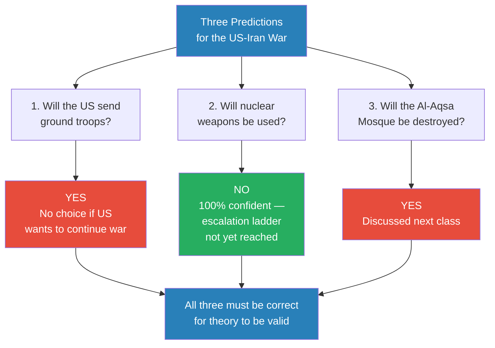
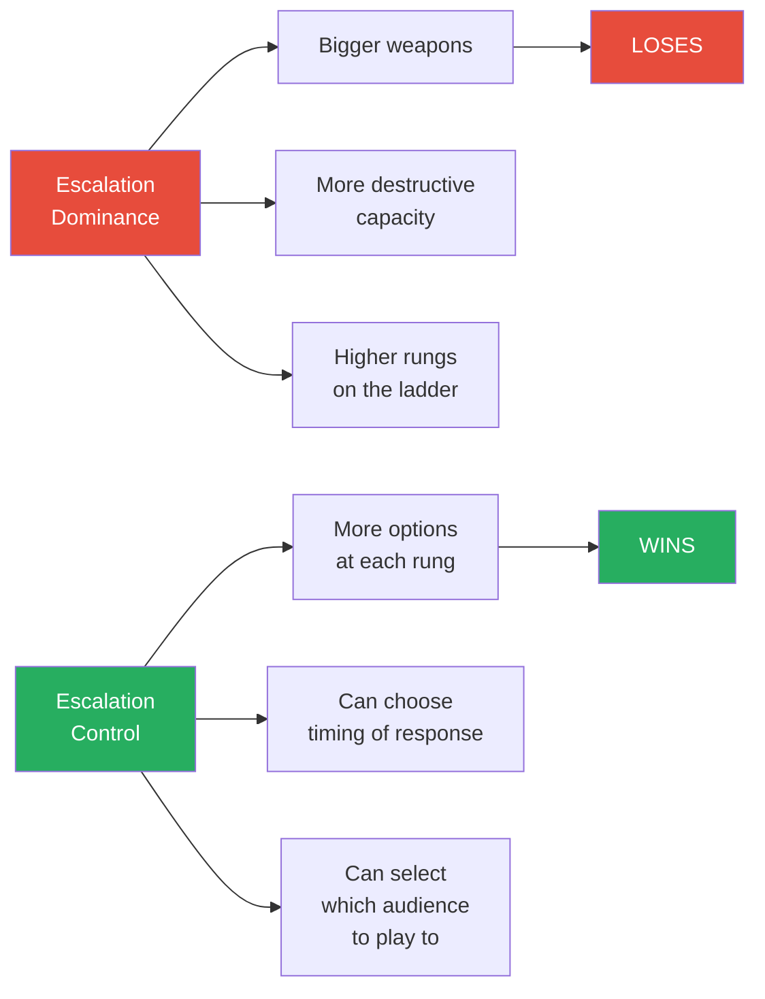
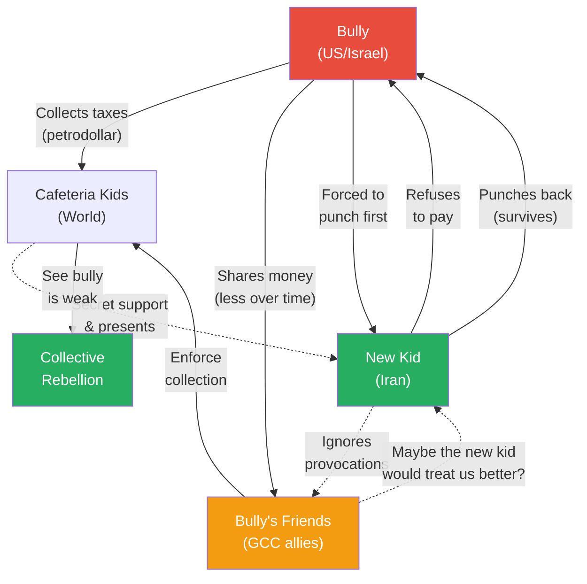
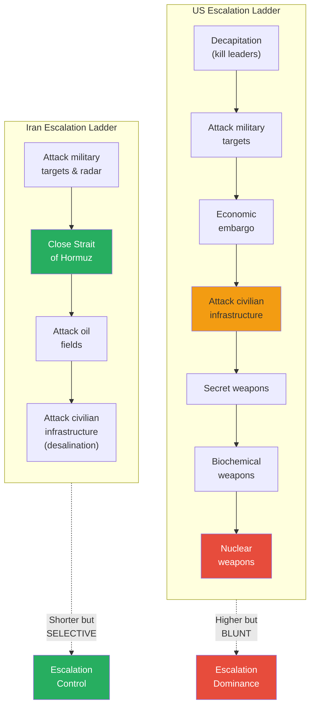
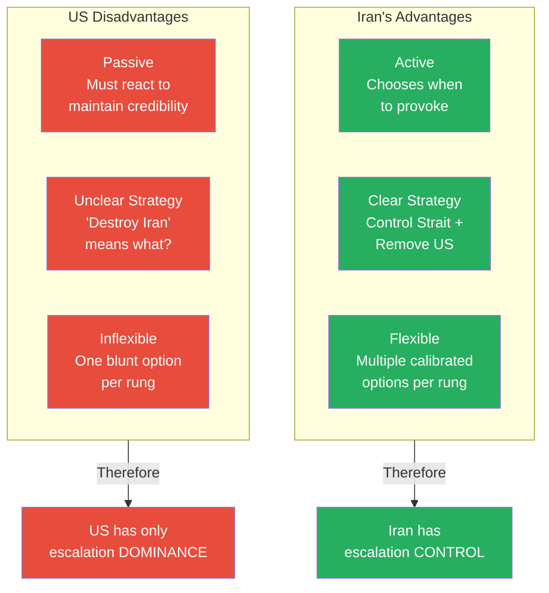
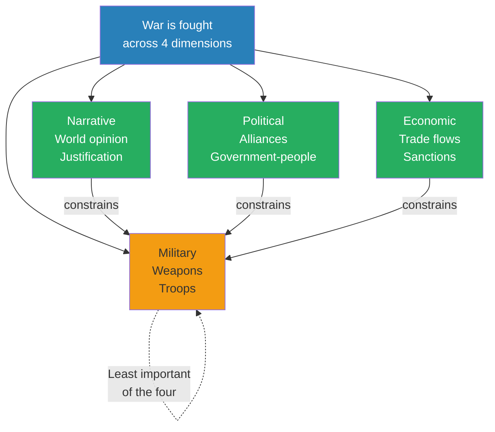
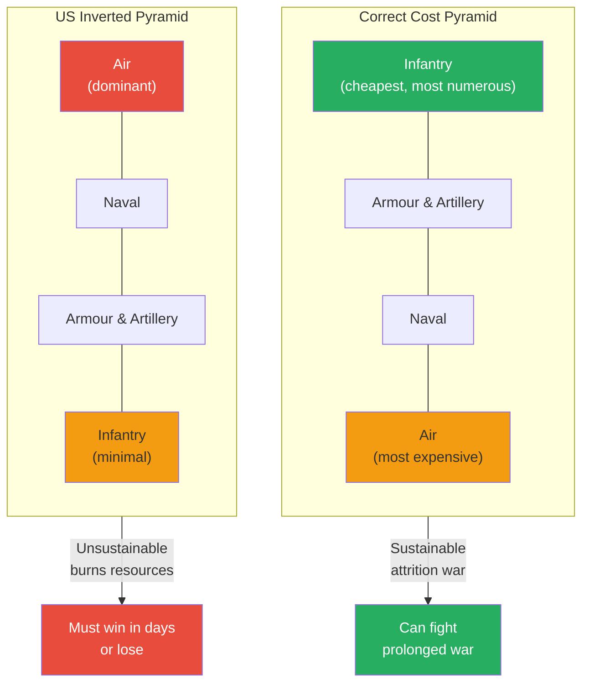
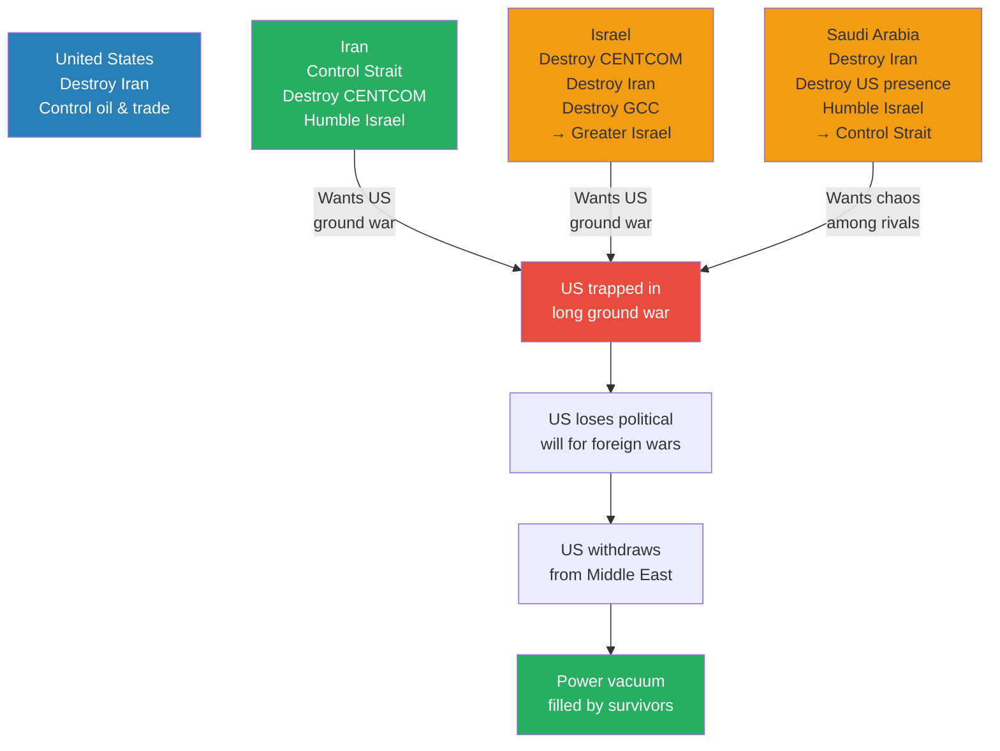
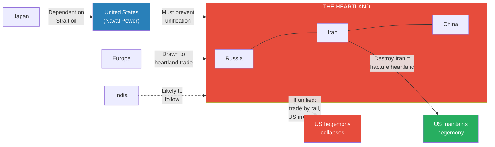

# The Law of Escalation

> Prof. Jiang continues his real-time analysis of the US-Iran war by introducing the law of escalation: control is more important than dominance. Using the analogy of a schoolyard bully confronted by a new kid who refuses to play by the rules, he demonstrates that the nation with more rungs on the escalation ladder does not necessarily win — the nation with more strategic flexibility does. He applies this framework to make three testable predictions: the US will send ground troops (yes), nuclear weapons will be used (no), and the Al-Aqsa Mosque will be destroyed (yes). The lecture systematically explains why Iran's calibrated, selective strategy gives it escalation control over the blunt, reactive US approach — and reveals that Israel, Saudi Arabia, and Iran all share a hidden objective: trapping the United States in a catastrophic ground war.

---

## Overview: Key Highlights

- <b style="color: #27ae60">Control is more important than dominance</b> — the law of escalation: having the biggest weapons matters less than having the most strategic options
- <b style="color: #2980b9">Escalation ladder</b> — the step-by-step sequence from verbal conflict to nuclear weapons that all military engagements must follow
- <b style="color: #e74c3c">Escalation dominance is a trap</b> — the US and Israel can climb higher on the ladder, but this makes them less flexible, not more powerful
- <b style="color: #27ae60">Calibration beats brute force</b> — Iran selectively applies pressure through the Strait of Hormuz, letting allies pass and taxing enemies
- <b style="color: #2980b9">Three predictions staked on this analysis</b> — ground troops (yes), nuclear weapons (no), Al-Aqsa Mosque destroyed (yes); all three must hold for the theory to be valid
- <b style="color: #e74c3c">The US has an inverted cost pyramid</b> — air power dominates, infantry is minimal, making sustained war unsustainable without a national draft
- <b style="color: #27ae60">Iran is active, the US is passive</b> — Iran chooses when and how to provoke; the US must react to maintain credibility
- <b style="color: #2980b9">Four dimensions of war</b> — narrative, political, economic, and military, with military being the least important
- <b style="color: #e74c3c">Israel, Saudi Arabia, and Iran all want to destroy the US position</b> — even America's allies benefit from trapping it in a long ground war
- <b style="color: #2980b9">Heartland theory</b> — the US military doctrine of preventing Eurasian unification explains why America has no choice but to fight this war
- <b style="color: #27ae60">The bully analogy</b> — the strongest player has the fewest options because he must maintain credibility; the challenger can choose timing, method, and audience
- <b style="color: #e74c3c">Venezuela is not Iran</b> — decapitation works when elites have assets in America; Iran's elites have been sanctioned for 40 years and have nothing to lose

| Concept | One-line summary |
|---------|-----------------|
| **Escalation ladder** | The mandatory step-by-step sequence of conflict intensity from insults to nuclear weapons |
| **Escalation dominance** | Having superior weapons at the top of the ladder — the conventional (but flawed) theory of advantage |
| **Escalation control** | Having more strategic options at each rung — what actually determines the winner |
| **Calibration** | Timing and structuring your response to achieve strategic objectives, not just score points |
| **Strategic flexibility** | The number of options available to a player — the player with the most options usually wins |
| **Cost pyramid** | The production hierarchy of military assets — infantry (cheapest) to air power (most expensive) |
| **Inverted cost pyramid** | America's structural weakness — relying on expensive air power instead of cheap infantry |
| **Mission creep** | Gradual, unplanned escalation of military involvement — how the US got trapped in Vietnam |
| **Credibility trap** | The bully's dilemma: must respond to every challenge or lose authority, eliminating strategic choice |
| **Four dimensions of war** | Narrative, political, economic, and military — the complete battlefield beyond weapons |
| **Heartland theory** | US doctrine that preventing Eurasian land-power unification is existentially necessary |
| **Decapitation** | Killing enemy leadership to force surrender — failed against Iran's decentralised structure |

---

# The Lecture

## Three Questions That Will Determine the Future of the World [0:00 - 9:50]

*Prof. Jiang opens by framing the entire lecture around three binary predictions about the US-Iran war. Each prediction is testable, and he stakes the validity of his entire game theory model on getting all three correct. He then introduces the escalation ladder through a street-fight analogy, showing that every conflict must climb step by step — and that the real advantage belongs not to the strongest fighter, but to the calmest one.*

> [!tip] Core Insight
> In any escalation, you are not fighting just your opponent. You are performing for three audiences simultaneously: your allies (the crowd), the authorities (the police/international law), and your own conscience (God). The fighter who forgets any audience loses, even if he wins the punch.

*Prof. Jiang does not hedge. He stakes his entire analytical framework on three binary outcomes — a rare and deliberate move that forces both him and his students to take the predictions seriously.*

> [!note]- Expand: Full Lecture Detail
> Prof. Jiang opens by telling the class that three major questions will determine the outcome of the US-Iran war — and the shape of the world afterwards:
>
> - **Question 1: Will the US launch a ground invasion?** Right now, the US and Israel are fighting an air war — striking Iran from a distance. He calls this modern "siege warfare." As long as it stays an air war, the US can choose to de-escalate and withdraw. The loss would be painful but survivable. But if ground troops are committed, <b style="color: #e74c3c">the US would be trapped in Iran for five to ten years</b> — a catastrophe regardless of outcome. A ground war would require a national draft, forcing young men as young as 18 into service. He introduces the concept of <b style="color: #2980b9">mission creep</b> — the gradual, unplanned deepening of military involvement: "Maybe in the beginning you send 1,000 troops for a small mission, but then it doesn't go well, so you send 2,000." This is how the US embroiled itself in Vietnam.
>
> - **Question 2: Will nuclear weapons be used?** There is widespread online concern that Israel is preparing a nuclear strike on Iran. Prof. Jiang notes that nuclear weapons are a taboo in geopolitics — used by the US at the end of World War Two and never since. If Israel uses tactical nuclear weapons, it would break this universal taboo and potentially trigger a nuclear apocalypse.
>
> - **Question 3: Will the Al-Aqsa Mosque be destroyed?** The third holiest site in Islam, where Muslims believe Muhammad ascended to heaven. Jews believe the mosque sits on the site of their ancient Temple. Religious Jewish extremists want to demolish it to rebuild the Third Temple. If they succeed, <b style="color: #e74c3c">two billion Muslims would be religiously obligated to go to war against Israel</b>.
>
> Prof. Jiang then delivers his predictions: **Yes** (ground troops), **No** (nuclear weapons), **Yes** (Al-Aqsa destruction). He emphasises that all three must be correct for his theory to hold: "If I miss one, then all my theory is wrong." On nuclear weapons, he adds with dark humour: "I'm 100% confident that nukes will not be used at this time in this war. And if I'm wrong, I apologise to the world — but at the same time, we'll all be dead anyway, so it doesn't really matter."
>
> He then introduces the <b style="color: #2980b9">escalation ladder</b> through a street-fight analogy. Two people bump into each other. The conflict starts small — an argument over who should apologise. It escalates step by step: cursing, pushing, punching, fighting, pulling a knife, pulling a gun, and finally one shoots the other dead. He identifies three factors that drive people up the ladder:
>
> - **Emotions** — adrenaline makes you angry, but also stronger and more resolved
> - **Power** — the weapons and physical advantages each side holds
> - **Reason / Logic** — the strategic calculation of what you can justify
>
> Critically, the fight is not just between A and B. There are three audiences watching:
>   - **Spectators and friends** — the crowd whose opinion determines your social standing
>   - **The police / government** — the authority that will investigate and assign blame
>   - **God** — the ultimate judge of whether your actions were just
>
> The key insight: <b style="color: #27ae60">it is not about how fast you climb the escalation ladder — if you overreact, you are at fault</b>. The strategically superior move is to climb slowly and deliberately, maintaining calm and control. This gives three advantages: **focus** (you know what you are doing), **clarity** (you know how to achieve your strategy), and **resolve** (you are determined to achieve it). The person who has all three is the person who remains calm — and calmness requires controlling yourself as you climb.

---

## The Law of Escalation: Control Over Dominance [9:50 - 13:30]

*Prof. Jiang states the central law of the lecture: control is more important than dominance. He defines calibration as the strategic timing and structuring of responses, and strategic flexibility as the number of options available at any given moment. The player with more options wins — not the player with bigger weapons.*

*The conventional assumption — that whoever can escalate higher wins — is inverted. Control, not dominance, determines the outcome.*

> [!note]- Expand: Full Lecture Detail
> Prof. Jiang states the law directly: <b style="color: #27ae60">"Control is more important than dominance."</b> He calls this the law of escalation and frames it as the most important idea in his game theory model.
>
> He defines the key terms:
>
> - <b style="color: #2980b9">Calibration</b> — timing or structuring your response in a way that achieves your strategic objective. "You're not just scoring punches. You're throwing a punch in a certain way that allows you to defend yourself, that strikes fear in an opponent, and also allows you to seem like the good guy among spectators." When the police come, you can justify why you threw that punch.
>
> - <b style="color: #2980b9">Strategic flexibility</b> — in a fight, the person who has the most options, the most flexible strategy, usually wins. This is the operational consequence of calibration: every move you make should preserve or expand your future options, not narrow them.
>
> He previews the application: the US and Israel have escalation dominance (they can reach higher on the ladder — nuclear weapons), but Iran has escalation control (more options at every rung). The lecture will show why control beats dominance.

---

## The Bully and the New Kid — A Thought Experiment [13:30 - 21:34]

*Prof. Jiang constructs an extended schoolyard analogy that maps precisely onto the US-Iran conflict. A bully controls a cafeteria through taxes and intimidation. A new kid arrives, refuses to pay, and through patience, focus, and calibrated non-compliance, destabilises the entire system without throwing the first punch.*

> [!tip] Core Insight
> The bully's power depends on credibility — the belief that disobedience will be punished. The moment someone demonstrates that the punishment is survivable, the bully must either retreat or escalate to destruction. Either way, he loses.

*The bully's system unravels not because the new kid is stronger, but because he is more patient. Each actor in the cafeteria maps to a player in the Middle East.*

> [!note]- Expand: Full Lecture Detail
> Prof. Jiang builds the analogy step by step. The bully is the biggest kid in school, backed by a gang of four friends. Together, they impose a tax on everyone in the cafeteria — $1 to eat lunch. The friends collect the money and share it with the bully. At first, the system works because the bully provides order: "He's keeping everyone safe. So yeah, I pay $1 but it's not that much money, and we're all safe."
>
> But over time, <b style="color: #e74c3c">hubris</b> sets in. The bully raises the tax and pays his friends less — he wants a car, a trip to Paris. Everyone is unhappy but powerless.
>
> Then a new kid arrives. He does not know the rules. When asked for $1, he refuses — not out of defiance, but ignorance. The gang ostracises him, making him sit alone. His response: "I don't care. I'm happy not having any friends."
>
> The gang escalates to verbal bullying. The new kid ignores them. Prof. Jiang tracks what happens next:
>
> - The other students notice someone is resisting — and surviving
> - They begin secret outreach: presents, smiles, quiet greetings
> - The bully's friends start questioning the arrangement: "We don't actually benefit that much. Maybe the new kid would treat us better as the new boss"
> - Other friends think: "This bully's fat, he's ugly — maybe I should be the boss"
> - The new kid ignores all of it and stays focused
>
> Eventually the bully is provoked into punching first. The new kid gets hurt — but punches back. The bully wins the fight physically, but everyone has now seen that <b style="color: #27ae60">the bully is not that strong</b>. The students unite with the new kid, and the bully is eventually defeated.
>
> Prof. Jiang draws out the strategic lessons:
>
> - The bully has escalation dominance — he is the strongest kid. He can beat anyone
> - But the new kid has escalation control — more options, better timing, the ability to choose when and how to respond
> - <b style="color: #27ae60">"By calibrating your movements strategically, you can manipulate the bully into self-destruction"</b>
> - The bully is trapped by the <b style="color: #2980b9">credibility trap</b>: his power depends on the belief that disobedience is punished. He either retreats (loses credibility) or strikes harder (looks like the aggressor). Either path leads to his downfall.

---

## US vs Iran Escalation Ladders Compared [21:34 - 27:33]

*Prof. Jiang draws both nations' escalation ladders side by side, showing that while the US ladder extends higher (all the way to nuclear weapons), each rung is blunt and inflexible. Iran's ladder is shorter but each rung offers selective, calibrated options — giving Iran escalation control despite having inferior weapons.*

*The US ladder extends to nuclear weapons, but each step is a blunt hammer. Iran's shorter ladder contains selective, calibrated tools — especially the Strait of Hormuz, which functions as a strategic switchboard.*

> [!note]- Expand: Full Lecture Detail
> Prof. Jiang draws the US escalation ladder step by step:
>
> 1. <b style="color: #2980b9">Decapitation</b> — kill enemy leaders so the country has no direction and surrenders. "It didn't work."
> 2. **Attack military targets** — destroy air defence and military bases. "That didn't work either."
> 3. **Economic embargo** — prevent Iran from trading, blockade the seas, cut off oil sales to China. "That's not working either."
> 4. **Attack civilian infrastructure** — primarily water and oil. He notes that Israel recently attacked an oil depot in Tehran, turning part of the city black with smoke. "This is a war crime — it goes against international law. But that's what you do when you feel you need to apply more pressure."
> 5. **Secret weapons** — advanced missiles never seen before, designed to intimidate
> 6. **Biochemical weapons** — biological and chemical attacks
> 7. **Nuclear weapons** — the top of the ladder
>
> His critical observation: <b style="color: #27ae60">you must follow the escalation ladder sequentially</b>. You cannot skip rungs. "Unless I see biochemical weapons being used, I refuse to believe that nuclear weapons is on the table." He estimates the US is currently at the beginning of step 4 (attacking civilian infrastructure), meaning there is a long way to go before nuclear weapons.
>
> He also notes a strategic problem with attacking civilian infrastructure: it unites the people behind the government. The whole point of air strikes was to split the government from the people, hoping civilians would overthrow their own leaders. Destroying civilian targets achieves the opposite.
>
> Iran's ladder is different:
>
> 1. **Attack military targets** — specifically US radar systems and air defences. "Once these go, Iran can attack whatever it wants."
> 2. **Close the Strait of Hormuz** — puts pressure on GCC economies and East Asian oil supply. China gets 40% of its oil through the Strait; Japan gets 75%.
> 3. **Attack oil fields** — if the US attacks Iran's economy, Iran retaliates against GCC oil fields
> 4. **Attack civilian infrastructure** — specifically <b style="color: #e74c3c">desalination plants</b>, the main vulnerability of GCC nations
>
> Iran's ladder stops there — no nuclear weapons, no biochemical weapons, no intercontinental missiles. But Prof. Jiang argues this is actually an advantage, because every rung Iran does have is <b style="color: #27ae60">selectively deployable</b>:
>
> - Closing the Strait of Hormuz is not all-or-nothing. Iran can let Chinese ships pass. It can let GCC nations pay a tax for passage. It can let nations that distance themselves from the US pass freely.
> - "By closing the Strait of Hormuz, it creates a calibration strategy. It allows Iran to selectively and strategically apply pressure to the friends of the United States so that they become the friends of Iran."
> - Drone strikes against oil fields and military targets work the same way: "If you attack me, I attack you. If you don't attack me, I don't attack you."

---

## Iran's Structural Advantages [27:33 - 35:07]

*Prof. Jiang identifies three structural advantages Iran holds over the United States — initiative, clarity, and flexibility — and explains how these translate into escalation control despite inferior firepower. He then outlines what the Middle East must become as the war escalates: unified, censored, and fully militarised.*

*The three-column comparison mirrors the bully analogy exactly: the new kid (Iran) is active, focused, and flexible; the bully (US) is reactive, confused, and rigid.*

> [!note]- Expand: Full Lecture Detail
> Prof. Jiang identifies three decisive asymmetries between the US and Iran:
>
> - **Active vs Passive:** Iran is active — it chooses whether, when, and how to provoke. The US is passive — it must react to every provocation to maintain credibility. This maps directly to the bully analogy: "The bully has to maintain credibility. He has to show that he's more powerful. So if you provoke him, he has no choice but to hit you. But you, the new kid, can choose the timing of when to provoke him."
>
> - **Clear Strategy vs Ambiguous Strategy:** Iran knows exactly what it wants — control the Strait of Hormuz and remove the US from the Middle East. It calibrates every attack to achieve this specific end goal, "and it's working out very well for Iran." The United States "wants to destroy Iran. What does that mean? It could mean regime change. It could mean the economy collapses. It could mean the civilian population starves. Because there's so much ambiguity, it confuses military strategy."
>
> - **Flexible vs Inflexible:** Iran has many options at each rung of its escalation ladder — selective passage through the Strait, targeted drone strikes, calibrated economic pressure. The US has one option per rung: bomb harder.
>
> Prof. Jiang then outlines the consequences of escalation for society itself. To fight at higher rungs, nations need three things that map to the fighter's focus-clarity-resolve framework:
>
> - <b style="color: #2980b9">Focus = Unity</b> — uniting the population, "which means basically crushing all dissent. We can't argue anymore. We have to unify for a purpose."
> - <b style="color: #2980b9">Clarity = Censorship</b> — controlling information. He notes this is already happening: "In Israel, you're not allowed to film military strikes. If a drone attacks Tel Aviv, you cannot film it and put it on social media. The government will arrest you. Same thing in Dubai."
> - <b style="color: #2980b9">Resolve = Militarisation</b> — moving towards <b style="color: #e74c3c">total war</b>, where every citizen is recruited into the war effort and the entire economy is geared towards combat.
>
> He closes this section with a critical framing: the war is fought across <b style="color: #2980b9">four dimensions</b> — narrative (world opinion), political (relationships between nations and between governments and their people), economic (trade continues even during war), and military. "What's really important to understand is that the military dimension is probably the least important."

---

## The Four Dimensions of War [35:07 - 38:00]

*Prof. Jiang expands the analysis beyond the battlefield to show that military action is just one of four interconnected dimensions. Narrative, political, and economic factors constrain and shape military decisions — which is why nuclear weapons are not simply a matter of having them.*

*Military power sits at the bottom of the influence hierarchy, not the top. The other three dimensions constrain what military options are actually available.*

> [!note]- Expand: Full Lecture Detail
> Prof. Jiang identifies four factors that determine how nations move up the escalation ladder:
>
> - **Narrative** — controlling world opinion and justifying your actions. "Your purpose is to control the narrative and justify why you're doing what you're doing."
> - **Political** — maintaining relationships with other states. "As the United States is fighting this war against Iran, it's still talking to China, still talking to Russia. That political discussion determines the contours of this fight."
> - **Economic** — nations continue trading during war, and those trade flows shape military options. Sanctions, oil dependence, and currency all factor in.
> - **Military** — weapons, troops, and tactical decisions. Prof. Jiang stresses this is "probably the least important" of the four dimensions.
>
> He uses these four dimensions to explain why using nuclear weapons is not as simple as "having them." You must worry about:
>   - <b style="color: #2980b9">Troop morale</b> — soldiers must believe they fight for a good cause
>   - <b style="color: #2980b9">Public opinion</b> — the world must be on your side
>   - <b style="color: #2980b9">Political will</b> — the people must be unified
>   - <b style="color: #2980b9">Enemy morale</b> — you do not want to provoke the enemy into jumping the escalation ladder beyond your control
>
> "War is extremely complicated. It's not just about weaponry. It's not just about resources. It's ultimately about controlling the narrative, controlling the political landscape, marshalling the resources in a proper way that is strategically beneficial."

---

## Why the US Must Send Ground Troops [38:00 - 42:55]

*Prof. Jiang introduces the cost pyramid — the production hierarchy of military assets — and shows that the US has an inverted pyramid that makes sustained warfare impossible without infantry. The 1991 and 2003 Iraq wars were "video games" against a weak opponent; Iran is a real war, and real wars require soldiers.*

> [!tip] Core Insight
> You cannot fight a real war with an inverted cost pyramid. Air power is the most expensive asset and infantry the cheapest. When the cheapest product is also the scarcest, every engagement bleeds the treasury faster than the battlefield.

*The US military is structured upside-down for a real war. The correct pyramid has cheap, replaceable infantry at the base; the US pyramid puts expensive, irreplaceable aircraft at the top.*

> [!note]- Expand: Full Lecture Detail
> Prof. Jiang introduces the <b style="color: #2980b9">cost pyramid</b> — the hierarchy of military production costs:
>
> - **Infantry** (bottom) — cheapest to produce, fastest to train, most numerous
> - **Armour and artillery** — more expensive, more time-consuming
> - **Naval** — expensive ships, long production cycles
> - **Air** (top) — most expensive, most resource-intensive
>
> Wars are usually <b style="color: #2980b9">wars of attrition</b> — you must commit all resources to win. The correct pyramid puts the cheapest, most replaceable assets at the base. But the United States has an <b style="color: #e74c3c">inverted pyramid</b>: air power is dominant, naval is secondary, armour is minimal, and infantry is almost absent.
>
> "You can't fight a war like this. The moment you choose to fight a war like this, you've lost the war, because you either take out the country in two days, or you scoot over, but you cannot replenish your forces."
>
> He addresses the obvious counterexample: "The 1991 Persian Gulf War. The 2003 Iraq War. These are not real wars. The Americans were so dominant and Iraq was so weak that it was basically a video game. Guys in tanks just running over the Iraqi army. But this Iran thing is a real war, and therefore you cannot fight a war like this."
>
> The conclusion: if the United States wants to win or even continue this war, it has no choice but to return to a correct cost pyramid — meaning <b style="color: #e74c3c">infantry must become the main force</b>, which requires a national draft.

---

## The Hidden Game: All Players Want a US Ground War [42:55 - 49:53]

*Prof. Jiang reveals the lecture's most counterintuitive insight: Israel, Saudi Arabia, and Iran — despite being nominal enemies — all share a strategic interest in trapping the United States in a long ground war. Each player's optimal strategy requires the US to be weakened, which means the US is being manipulated by its own allies.*

*The US is the only player that does not want a ground war. Every other major actor — including its own allies — benefits from the US being drawn into a long, draining conflict.*

> [!note]- Expand: Full Lecture Detail
> Prof. Jiang maps out the strategic objectives of the four major players:
>
> **United States:** "Destroy Iran. Why? Because if you destroy Iran, the US would have complete control over Middle East oil, control global trade through the Strait of Hormuz, and maintain its empire. Really simple objective."
>
> **Iran:** Three objectives — (1) control the Strait of Hormuz, (2) destroy CENTCOM (the American Central Command in the Middle East), and (3) humble Israel. "You can't destroy Israel because Israel has nuclear weapons. You piss off Israel, those nukes start flying." If CENTCOM is destroyed, Iran becomes the hegemon of the Middle East: "Now Dubai, Oman, Bahrain, Kuwait have to pay taxes to Iran. The new kid is now the bully."
>
> **Israel:** Here the analysis gets surprising. Israel's optimal strategy is to (1) destroy CENTCOM, (2) destroy Iran, and (3) destroy the GCC — especially Saudi Arabia, whose resources would then belong to Israel. This creates the <b style="color: #2980b9">Greater Israel project</b>, to be discussed next class. "Even though the United States and Israel are allies, their optimal strategy is different. Their objectives are different. In fact, they're in conflict."
>
> **Saudi Arabia:** Wants to (1) destroy Iran, (2) destroy the US presence, and (3) humble Israel. If all three rivals destroy each other, Saudi Arabia emerges on top and can control the Strait of Hormuz — which is its only viable economic future since oil will eventually run out.
>
> The devastating conclusion: <b style="color: #e74c3c">"The United States just wants to destroy Iran. But Israel, Saudi Arabia, and Iran all want to destroy the United States."</b> All three achieve this by forcing the US into a long ground war that destroys American political will to fight foreign wars. Israel specifically does not want nuclear weapons used — "because nukes would end the war too quickly. You want to drag this war out as long as possible to force the United States to send ground troops."
>
> The US will send ground troops not because it chooses to, but because "Iran, Saudi Arabia, and Israel will work together to force a ground invasion. The United States doesn't have a clear, coherent strategy, it's passive, therefore it can be manipulated."

---

## Q&A: Why the Venezuela Model Failed in Iran [49:53 - 51:46]

*A student asks whether the US could overthrow Iran's government the way it captured Venezuela's president. Prof. Jiang explains why decapitation works in Venezuela but not in Iran — the difference is where the elites keep their money.*

> [!note]- Expand: Full Lecture Detail
> A student asks whether the US will take over Iran the way it captured Venezuela's president.
>
> Prof. Jiang explains the critical difference:
>
> - **Venezuela's elite is pro-American.** Their wealth, children, and families are stored in America. They have a vested interest in negotiating with the US to protect their own assets. Decapitation works because the next leader who emerges will cooperate.
>
> - **Iran's elite has been sanctioned for 40+ years.** They have no wealth in America, no children studying there, no assets to protect. "Iran has become poor and angry and disgruntled because of that. Therefore they have nothing to lose by fighting you."
>
> - Even though the US killed the Supreme Leader and many other leaders, <b style="color: #27ae60">"the elite themselves are unified in opposing you"</b> — precisely because sanctions eliminated any incentive for cooperation.
>
> > [!example] Venezuela vs Iran: The Elite Loyalty Test
> > - In Venezuela, the elite store their wealth in American banks and their children in American universities
> > - When the US captures the president, the next leader has personal incentive to negotiate — his family's wealth depends on it
> > - In Iran, 40 years of sanctions have severed every economic link between Iranian elites and the US
> > - Iranian leaders have no foreign assets to protect, no families abroad to worry about
> > - The sanctions that were supposed to weaken Iran actually unified its elite against America
> > **The lesson:** Decapitation only works when the elite class has something to lose by fighting. Sanctions that impoverish an entire leadership class create enemies with nothing left to lose.

---

## Q&A: Why the US Has No Choice But to Fight [51:46 - 55:22]

*A student challenges the logic of the US risking systemic collapse for Middle Eastern oil. Prof. Jiang introduces heartland theory — the foundational American military doctrine that preventing Eurasian unification is existentially necessary — and explains why destroying Iran is not optional for the US empire.*

*The heartland theory explains why the US cannot walk away from this war. If Russia, Iran, and China unify, trade moves to railways, the US navy becomes irrelevant, and American hegemony collapses.*

> [!note]- Expand: Full Lecture Detail
> A student asks why the US would risk the entire global system collapsing just to control Iranian oil. Prof. Jiang acknowledges this is "the key question that everyone's arguing about. We're going to argue this for the rest of eternity." He offers the simple explanation (with a more complicated one promised for the next class).
>
> The answer is <b style="color: #2980b9">heartland theory</b> — the foundational doctrine of American military strategy:
>
> - The greatest threat to American power is the <b style="color: #e74c3c">heartland unifying</b> — the Eurasian landmass from Europe to China
> - If the heartland unifies, nations can trade by railway — overland routes that bypass American naval power entirely
> - America is primarily a naval power; it requires nations to trade by sea, where the US Navy controls the routes
> - This is why America fought both World Wars — the fear that Germany would conquer Europe and Asia, creating the heartland
> - The current problem: the BRICS nations (Russia, Iran, China) are coming together. "And if they come together, that's a major piece of heartland. And everyone else — Europe, Middle East, Africa, India — will probably follow, because it's easier to trade in the heartland than to trade with America, especially with the US dollar declining."
>
> Therefore: "The United States has no choice but to fight this war, because that's their entire strategy — to maintain hegemony in the world, to prevent the heartland from unifying." Destroying Iran fractures the heartland permanently, keeping nations dependent on American maritime routes. "Whoever controls world trade controls the world. Whoever controls the heartland controls world trade."

---

## Q&A: Saudi Arabia's Desperate Gamble [55:22 - end]

*A student asks how Saudi Arabia could realistically achieve its ambitious goals of destroying the US, Iran, and Israel. Prof. Jiang explains that Saudi Arabia is acting from desperation — its oil economy has an expiration date, and only chaos offers a path to survival.*

> [!note]- Expand: Full Lecture Detail
> A student asks how Saudi Arabia can possibly hope to see the downfall of the US, Iran, and Israel simultaneously. Prof. Jiang corrects him — Saudi Arabia also wants to humble Israel, not just the US and Iran.
>
> He explains the Saudi-Iranian rivalry through three structural conflicts:
>
> - **Theocracy vs Monarchy:** Iran is ruled by clerics who represent God. Saudi Arabia is ruled by a king who represents God. "For the Iranians, that is blasphemy, heresy." Iran sees Saudi Arabia as an affront to Islam; Saudi Arabia sees Iran as a revolutionary threat.
> - **Sunni vs Shia:** "Like Protestants and Catholics. They just hate each other."
> - **Pro-US vs Anti-US:** Saudi Arabia hosts American military bases on the holy land. For Iran, this is "the worst crime — infidels who are protecting the Holy Land. Infidels are not allowed in the Holy Land."
>
> But Saudi Arabia's real driver is economic desperation:
>
> - Its GDP depends almost entirely on oil exports
> - Oil will eventually run out, and electric vehicles and digitalization will further reduce demand
> - The kingdom's attempts to build tourism and a knowledge economy have not succeeded
> - <b style="color: #27ae60">The only viable future is controlling the Strait of Hormuz — earning revenue from trade access rather than oil exports</b>
>
> So Saudi Arabia's strategy is to create conflict between the US, Israel, and Iran, hoping they destroy each other. After the war, Saudi Arabia would negotiate a partition of the Middle East with Israel. "Will Israel agree to this deal? Probably not. But according to game theory, Saudi Arabia has no choice in this matter, because it is so far behind everyone else. It can only hope that this chaos leads to new possibilities."
>
> Prof. Jiang closes by reminding the class to follow the war closely: "The three big predictions — we'll know in the next year or two if these three things happen or not." The Al-Aqsa Mosque question will be answered in the next class.

---

## Connections

**Builds on:** [[09 - The US-Iran War]] (the strategic landscape, Strait of Hormuz, asymmetric warfare, and both sides' grand strategies that this lecture extends with escalation theory)
**Sets up:** Lecture 12 — The Law of Eschatological Convergence (the Al-Aqsa Mosque prediction and the Greater Israel project, both previewed here)
**Related lectures:** [[05 - The World Game]] (Ibn Khaldun's cycle of civilisational rise and fall — the bully's hubris is the same pattern), [[07 - America's Game]] (the US empire's structural dependencies on maritime trade and the petrodollar), [[08 - Communist Specter]] (great-power manipulation through proxy conflicts)
**Related books in vault:** [[The 33 Strategies of War - Robert Greene]] (escalation control, calibration, strategic flexibility), [[The 48 Laws of Power - Robert Greene]] (Law 1: Never Outshine the Master — the bully's credibility trap)

---

## The Takeaway

This lecture inverts the intuitive assumption that power equals advantage. The law of escalation — control is more important than dominance — is Prof. Jiang's central contribution to his game theory framework. It explains why the strongest military in human history is being outmanoeuvred by a nation with no nuclear weapons, no intercontinental missiles, and no aircraft carriers. The US can climb higher on the escalation ladder, but each rung narrows its options further. Iran can only climb partway, but at every rung it can choose whom to pressure, whom to release, and whom to court. The bully analogy crystallises this perfectly: the moment someone shows that the bully's punch is survivable, the bully's entire system of control collapses.

The most counterintuitive insight is that all four major players — including America's own allies — are working to trap the US in a ground war. Israel does not want nuclear weapons used because a quick war preserves American power. Saudi Arabia does not want a quick resolution because only prolonged chaos gives it a chance to emerge. Iran wants a ground invasion because guerrilla warfare in mountainous terrain is precisely where its advantages are greatest. The US is the only player that does not want a ground war, and it is the only player without a clear strategy — which is precisely what makes it manipulable. Prof. Jiang's three testable predictions (ground troops yes, nukes no, Al-Aqsa yes) are unusually bold for an academic analysis, and he explicitly stakes the validity of his entire theoretical framework on their accuracy. The next lecture will complete the picture with the most explosive prediction of the three.
