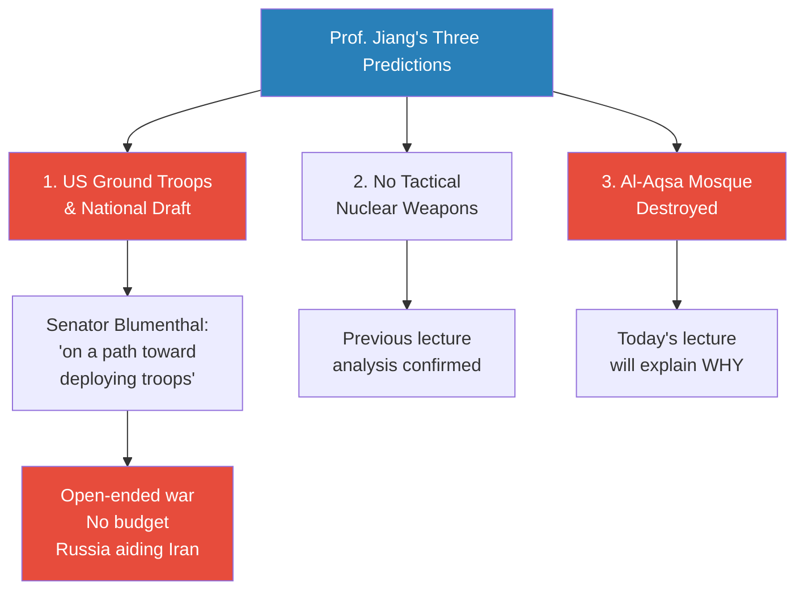
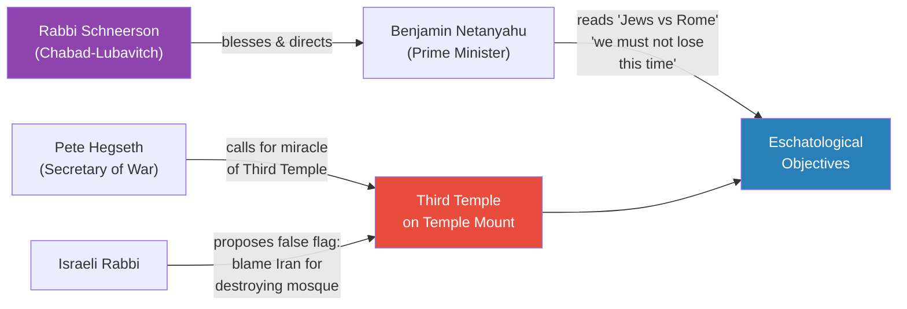
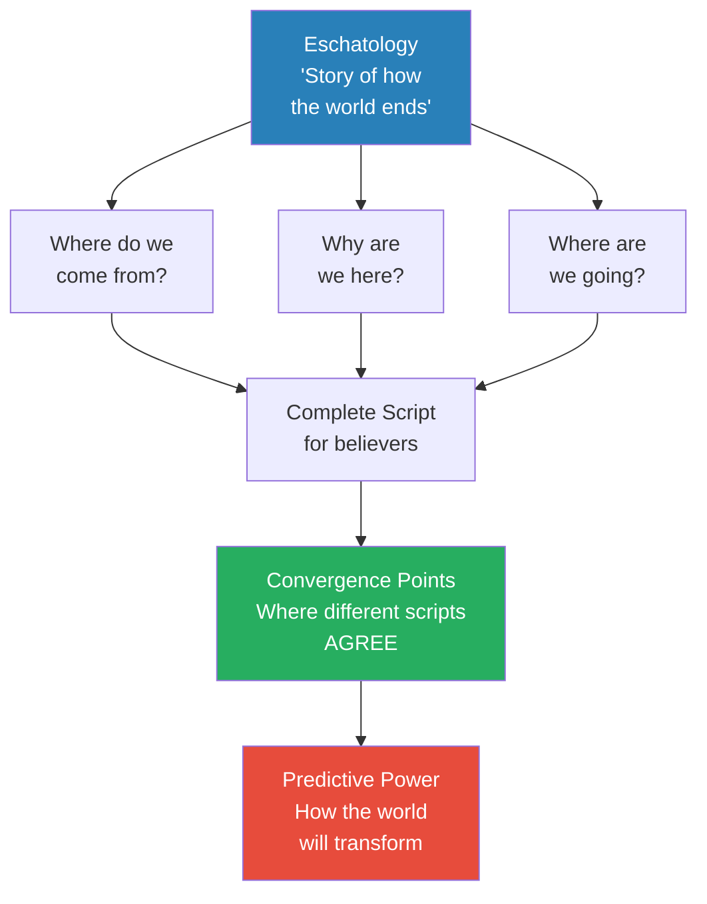
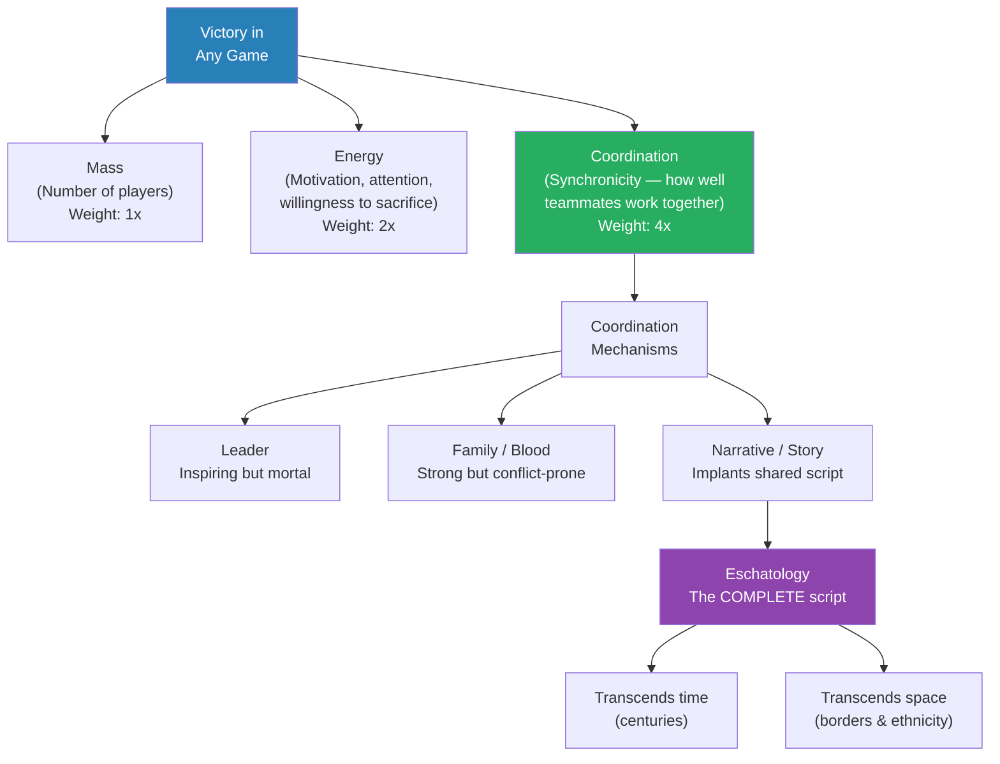
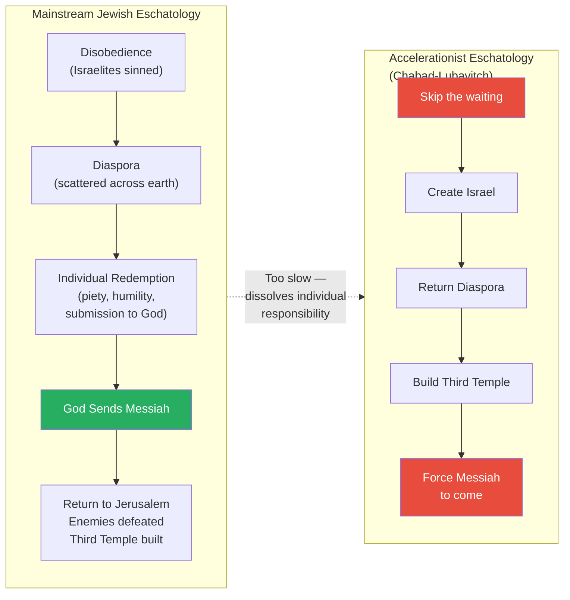
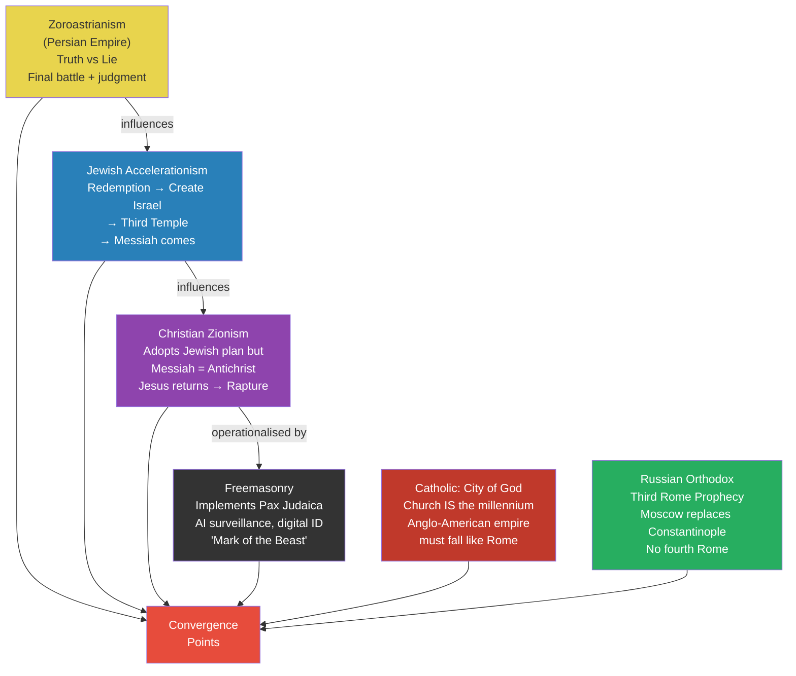
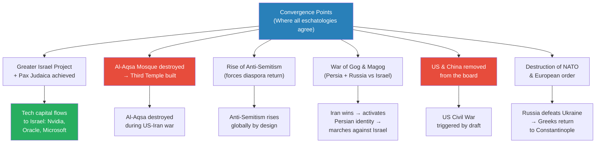
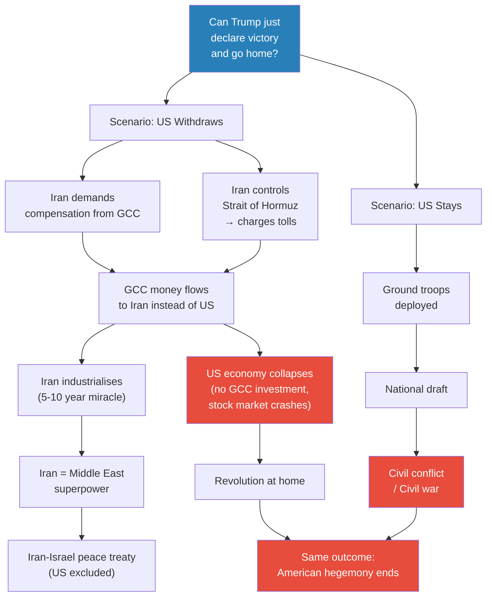

# The Law of Eschatological Convergence

> Prof. Jiang introduces a new game-theory law: the Law of Eschatological Convergence. Eschatology — the story of how the world ends — functions as the most powerful coordination mechanism in history, because it gives every believer a complete script spanning centuries and borders. By mapping the most extreme eschatologies of six traditions (Zoroastrianism, Judaism, Christian Zionism, Freemasonry, Islam/Shia Islam, Catholicism, and Russian Orthodoxy), Prof. Jiang identifies the points where these scripts converge — and from those convergence points, derives concrete predictions about the US-Iran war, the destruction of the Al-Aqsa Mosque, the Greater Israel project, and the coming collapse of American hegemony.

---

## Overview: Key Highlights

- <b style="color: #27ae60">Eschatology is the ultimate coordination mechanism</b> — it provides a complete script that transcends time, space, ethnicity, and national borders
- <b style="color: #2980b9">The Law of Eschatological Convergence</b> — where the end-times scripts of multiple religions agree, you can predict real-world geopolitical outcomes
- <b style="color: #e74c3c">The Al-Aqsa Mosque will be destroyed</b> — Prof. Jiang's third and most provocative prediction about the US-Iran war, driven by convergent eschatologies demanding the Third Temple
- <b style="color: #2980b9">Universal Law of Game Theory: Mass x Energy x Coordination</b> — coordination is four times more important than mass; narrative is the strongest coordination mechanism
- <b style="color: #27ae60">Extreme eschatologies drive the mainstream</b> — the most radical believers work hardest, creating a vector that forces moderate majorities in their direction
- <b style="color: #e74c3c">The US-Iran war is inexplicable from a purely geopolitical lens</b> — only the religious-eschatological perspective makes the war's logic coherent
- <b style="color: #2980b9">Pax Judaica</b> — a one-world government based in Jerusalem, powered by AI surveillance and digital currency, distinct from the Greater Israel territorial project
- <b style="color: #27ae60">Six eschatologies all agree: the Anglo-American empire must fall</b> — Zoroastrian, Jewish extremist, Christian Zionist, Freemason, Catholic, and Orthodox traditions converge on this point
- <b style="color: #e74c3c">America cannot withdraw from Iran without economic collapse</b> — the petrodollar system means retreat and staying both lead to catastrophe
- <b style="color: #2980b9">Third Rome Prophecy</b> — Russian Orthodox eschatology demands Moscow replace Constantinople as the centre of Christendom, requiring the destruction of NATO and the return of Greeks to Istanbul
- <b style="color: #27ae60">The Chabad-Lubavitch rescue operation proves eschatological coordination</b> — in 1939, believers on opposite sides of a world war coordinated across national borders to rescue one rabbi
- <b style="color: #e74c3c">Rising anti-Semitism is a feature, not a bug</b> — multiple eschatologies require it to force the Jewish diaspora back to Israel

| Concept | One-line summary |
|---------|-----------------|
| **Eschatology** | A religious narrative of how the world ends — answers where we come from, why we are here, and where we are going |
| **Law of Eschatological Convergence** | Where multiple end-times scripts agree, those convergence points predict real geopolitical outcomes |
| **Universal Law of Game Theory** | Victory = Mass x Energy x Coordination, with coordination weighted 4x and energy 2x over mass |
| **Accelerationism (eschatological)** | The belief that believers should actively hasten the end-times rather than passively await God's plan |
| **Pax Judaica** | A prophesied one-world government centred in Jerusalem, powered by AI surveillance and digital ID |
| **Greater Israel Project** | Territorial expansion of Israel to the boundaries God promised Abraham — distinct from Pax Judaica |
| **Third Temple** | The rebuilding of Solomon's Temple on the Temple Mount, requiring the removal of the Al-Aqsa Mosque |
| **Christian Zionism** | Protestant eschatology (premillennial dispensationalism) that adopts Jewish end-times narrative but replaces the Messiah with the Antichrist and awaits Christ's return |
| **War of Gog and Magog** | The prophesied final war before divine intervention — interpreted as Persia and Russia marching against Israel |
| **Third Rome Prophecy** | Russian Orthodox belief that Moscow is the Third Rome after Rome and Constantinople, and there will be no fourth |
| **Chabad-Lubavitch** | Hasidic Jewish movement founded in Belarus, now global, whose extreme eschatology drives accelerationist action |
| **Zoroastrianism** | Persian eschatology: truth vs lie, light vs darkness, culminating in a final battle and divine judgment |

---

# The Lecture

## Three Predictions Revisited and Video Evidence [0:00 - 6:47]

*Prof. Jiang opens by recapping his three predictions about the US-Iran war from the previous lectures, then shows a series of video clips — a US Senator, Iran's Foreign Minister, and others — to demonstrate how current events are confirming his analytical framework in real time.*

> [!tip] Core Insight
> The people closest to this war — senators who receive classified briefings, Iranian officials directing the defence — are saying exactly what Prof. Jiang's model predicts. The US is drifting toward ground troops with no budget and no exit strategy; Iran is not merely unafraid of invasion but actively welcoming it as a trap.

*Prof. Jiang's three predictions form the backbone of his game-theory analysis. Today's lecture explains the religious logic behind the third and most controversial prediction.*

> [!note]- Expand: Full Lecture Detail
> Prof. Jiang reminds the class of his three predictions from the previous lectures:
>
> - **Prediction 1:** The United States will use ground troops, which will require Donald Trump to institute a national draft
> - **Prediction 2:** Israel and the United States will not use tactical nuclear weapons
> - **Prediction 3:** The Al-Aqsa Mosque — the third holiest site in the Islamic world — will be destroyed during this war
>
> He explains that predictions one and two were covered last class. Today, he will explain prediction three — but first, he shows the class several video clips to establish the context and the players.
>
> **Video 1 — Senator Blumenthal (Gang of Eight briefing):**
> - Senator Blumenthal of Connecticut is one of the eight members of Congress who receive confidential briefings from the White House on war progress
> - After being briefed, Blumenthal tells reporters he is "as dissatisfied and angry as I have been from any past briefing in my 15 years in the Senate"
> - Three key takeaways from Blumenthal's statement:
>   - The administration has not articulated a budget — this is an open-ended war with no defined end
>   - The US is "on a path toward deploying ground troops in Iran" — confirming Prof. Jiang's first prediction
>   - Russia is already involved, actively aiding Iran — a fact the administration has confirmed
>
> **Video 2 — Iran's Foreign Minister Aragchi on NBC News:**
> - When asked whether Iran fears a US ground invasion, Aragchi responds: "No, we are waiting for them"
> - He states Iran has been preparing for this scenario for twenty years and is "confident we can confront them"
> - <b style="color: #27ae60">The journalist is visibly shocked into silence</b> — he has to ask again to confirm what he heard
> - Prof. Jiang's interpretation: "Within the Trump administration, within the foreign policy elite, within the media elite, they haven't really thought this through. They haven't considered the possibility of losing this war."
> - He calls it an "insular bubble where everyone just believes the same things" — a dangerous epistemic failure during wartime

---

## The Religious Players: Netanyahu, Schneerson, Hegseth, and the Rabbis [6:47 - 15:59]

*Prof. Jiang introduces four video clips that reveal the religious motivations behind key political actors — Rabbi Schneerson blessing Netanyahu's career, Netanyahu reading about Jewish defeat by Rome, Secretary of Defence Hegseth calling for the Third Temple, and an Israeli rabbi proposing a false-flag attack on the Al-Aqsa Mosque.*

*Four seemingly unrelated public moments — a 1990 blessing, a book recommendation, a 2018 speech, and a rabbi's offhand suggestion — all point toward the same eschatological objective: the Third Temple.*

> [!note]- Expand: Full Lecture Detail
> **Video 3 — Rabbi Schneerson and Netanyahu (1990):**
> - The year is 1990 and Netanyahu is a young, up-and-coming Israeli politician
> - He visits Rabbi Schneerson, the leader of the Chabad-Lubavitch movement, seeking his blessing and political support
> - The rabbi grants the blessing and they discuss "how things are progressing" — implying a plan in motion toward certain religious objectives
> - Rabbi Schneerson tells Netanyahu that progress is "not going fast enough, because we need the Messiah... and we can set in motion things that will force the coming of Messiah"
> - Prof. Jiang: "So let's speed things up, Netanyahu" — the rabbi is urging acceleration of the eschatological timeline
>
> **Video 4 — Netanyahu's Book Choice:**
> - A journalist asks Netanyahu what he is currently reading
> - He says *The War Against the Jews* by Barry Strauss — about the three wars Jews fought against Rome, ending in the destruction of the Second Temple and the Jewish diaspora
> - Netanyahu's reason for reading it: "We lost" that war against Rome — implying that this time, in this era's equivalent war, the Jews must not lose
> - Prof. Jiang asks: "Who's Rome? It's probably not Iran. It's probably not Russia. It's probably America." The great empire that Israel is allied with but ultimately sees as its historical antagonist
>
> **Video 5 — Pete Hegseth in Jerusalem (2018):**
> - Hegseth (then a Fox News host, now Secretary of War) speaks to Christian Zionists in Jerusalem
> - He lists a series of "miracles": 1917 (Balfour Declaration), 1948 (Israel founded), 1967 (Six-Day War victory), 2017 (Trump recognises Jerusalem as capital)
> - His conclusion: "There is no reason why the miracle of the reestablishment of the temple on the Temple Mount is not possible"
> - <b style="color: #e74c3c">A Christian, not Jewish, US cabinet member openly calling for the Third Temple</b> — which requires destroying the Al-Aqsa Mosque
>
> **Video 6 — An Israeli Rabbi's False-Flag Proposal:**
> - A rabbi in Israel suggests that during an Iranian missile attack, Israel could "pretend that one missile came from Iran and shoot it down" — striking the Dome of the Rock / Al-Aqsa Mosque and blaming Iran
> - "Then all the Arabs will go against Iran. It will be the end of the problems."
> - Prof. Jiang presents this without endorsement — simply demonstrating the kind of thinking that exists within the eschatological framework
>
> Prof. Jiang pauses: "This may be confusing to you as to who these people are, why they are saying these things. But now what I'm going to do is explain to you what is really going on."

---

## Introducing the Law of Eschatological Convergence [15:59 - 17:40]

*Prof. Jiang names the lecture's central concept: the Law of Eschatological Convergence. He defines eschatology, explains why it matters for geopolitical analysis, and frames it as a predictive tool — not a theological argument.*

> [!tip] Core Insight
> Eschatology is not just theology — it is a predictive framework. If you can identify the scripts that different religious traditions are acting out, and find where those scripts agree, you can predict real-world outcomes with startling accuracy.

*Eschatology answers all three fundamental human questions. When multiple eschatologies converge on the same answers, those convergence points become predictive.*

> [!note]- Expand: Full Lecture Detail
> Prof. Jiang introduces the new concept: "Today I want to introduce you to a new theory of game theory called the Law of Eschatological Convergence."
>
> - <b style="color: #2980b9">Eschatology</b> is "a story of how the world ends" — and it is compelling because it answers the three questions humans need answered: Where do we come from? Why are we here? Where are we going?
> - He reminds the class these three questions were discussed last semester — they are fundamental to human psychology and the basis of all religion
> - Different traditions have different eschatologies — different scripts for how history ends
> - The analytical key: "What's important to figure out is, in what aspect do these eschatologies converge? Converge, meaning a union of these eschatologies."
> - <b style="color: #27ae60">Convergence is important because it allows you to predict behaviour</b> — "Think of a story as the operating system of a society, and as such, it's a script that they will act out"
> - If you can identify the convergence points across multiple scripts, "you can actually predict how the world will turn out"

---

## The Universal Law of Game Theory: Mass, Energy, Coordination [17:40 - 25:13]

*Prof. Jiang pauses the eschatological analysis to ground it in game theory fundamentals. He introduces the Universal Law of Game Theory — victory equals mass times energy times coordination — and argues that narrative, and specifically eschatology, is the most powerful coordination mechanism ever devised.*

*Coordination is four times more important than mass. And within coordination mechanisms, eschatology is the apex — the only mechanism that can sustain a multi-century, multi-continent game plan.*

> [!note]- Expand: Full Lecture Detail
> Prof. Jiang lays out the theoretical foundation for why eschatology matters in game theory:
>
> **The Universal Law of Game Theory:**
> - Victory = Mass x Energy x Coordination
> - <b style="color: #2980b9">Mass</b> = the number of people on your team
> - <b style="color: #2980b9">Energy</b> = how much attention, focus, motivation, and willingness to sacrifice exists — "how invested are you in winning the game, and how hard are you willing to work?" Energy is twice as important as mass
> - <b style="color: #2980b9">Coordination</b> = synchronicity — how well teammates work together. <b style="color: #27ae60">Four times more important than mass</b>
> - "You can have a lot of people, but if they don't work well together, you're defeated by another team with fewer people but they work well together"
>
> **Individual vs Team Games:**
> - In an individual game (chess, ping pong), only energy matters — how motivated and prepared you are
> - In a team sport with fixed rosters, mass is constant — what differentiates winners is energy and coordination
>
> **Coordination Mechanisms (in ascending order of power):**
> - **Leader:** Inspiring leaders increase energy and simplify coordination ("all they have to do is listen"), but leaders are mortal — "eventually he will die"
> - **Family / Blood:** Shared ancestry creates natural bonds, but cannot account for internal conflict and differences
> - **Narrative / Story:** The most powerful mechanism "historically, in the long term" — because a narrative "implants in the minds of all those who believe in it a series of actions that they must take in order to win the game"
>   - A script where everyone knows their part and acts it out — enabling coordination without direct communication
>
> **Eschatology as the Ultimate Narrative:**
> - <b style="color: #27ae60">Eschatology is a *complete* script</b> — "everyone knows what he or she must do in order to achieve the desired outcome"
> - It transcends time: "You can spend centuries acting out the script, because everyone knows his role anyway"
> - It transcends space: "You can go beyond ethnic identity and family"
> - "The most powerful mechanism in history is eschatology"
>
> **Extreme vs Mainstream:**
> - Most religions share similar ethical cores — "be humble, be kind, be generous"
> - But certain aspects are extreme — these are the eschatologies that matter for prediction
> - <b style="color: #e74c3c">Even though extreme versions are shared by only a few people, "they're the ones who are working the hardest to achieve their eschatology, and therefore they're forcing the religion they are in to move in a certain direction"</b>
> - The most extreme, most violent eschatology creates a vector that pulls the mainstream — "whichever eschatology is the most extreme, the most violent, will be the one that wins out"

---

## Jewish Eschatology: Redemption vs Acceleration [25:13 - 35:16]

*Prof. Jiang explains the mainstream Jewish eschatological narrative — disobedience, diaspora, redemption, and the coming of the Messiah — then introduces the accelerationist variant championed by Chabad-Lubavitch: skip the waiting, force God's hand by building the Third Temple yourself. He demonstrates the operational power of this eschatology through the extraordinary 1939 rescue of Rabbi Yosef Yitzchak from Nazi-occupied Warsaw.*

> [!tip] Core Insight
> Accelerationist eschatology dissolves the boundary between prayer and action. Instead of waiting for God to send the Messiah, you build the conditions that compel his arrival — create Israel, return the diaspora, build the Third Temple. This transforms religion from passive faith into an active geopolitical programme.

*The mainstream waits for God to act; the accelerationists act to force God. The accelerationists' willingness to work harder makes them the vector that pulls the mainstream.*

> [!note]- Expand: Full Lecture Detail
> Prof. Jiang walks through the Jewish eschatological narrative step by step:
>
> **Mainstream Jewish Eschatology:**
> - The Israelites once lived in Israel but disobeyed God — they worshipped false idols despite being commanded not to
> - Punishment: expelled from Jerusalem and forced to wander the earth in the diaspora for centuries
> - Path to redemption: each individual Jew must "engage in an act of redemption, of humility, of submission, of piety to God" to help redeem the whole Jewish people
> - When collective redemption is achieved, God will send the <b style="color: #2980b9">Messiah</b> to:
>   - Lead them back to Jerusalem
>   - Defeat the enemies of the Jews
>   - Unify the Jewish people from the diaspora
>   - Build the Third Temple so God can "come to earth and live with all the Jews and create heaven on earth"
> - Prof. Jiang notes this is simplified — "there are a lot of differences" — but captures the essential structure
>
> **Accelerationist Variant:**
> - <b style="color: #e74c3c">A fringe group says: "This is fine, but it's way too slow, and it dissolves us of individual responsibility"</b>
> - Their logic: "If you have faith in God, then you should want to hurry things up and force the return of God as soon as possible"
> - The method: reverse the order — instead of waiting for the Messiah to create Israel, create Israel first and the Messiah will come naturally
> - Build the nation, return the diaspora, build the Third Temple, defeat the enemies — then the Messiah arrives
> - Most Jews hear this and consider it "blasphemy, heresy" — "you are defying the will of God. You think you can manipulate God into action. That is the opposite of redemption. That is the worst possible sin."
> - But Prof. Jiang argues this objection misses the game-theory point: <b style="color: #27ae60">"What an eschatology is really doing is creating a vector to force the religion to move in a certain direction"</b>
>
> > [!example] The 1939 Rescue of Rabbi Yosef Yitzchak from Nazi Warsaw
> > - Rabbi Yosef Yitzchak, the Rebbe of Chabad-Lubavitch and father-in-law of Rabbi Schneerson, is trapped in Nazi-occupied Warsaw in 1939
> > - His followers in America mount a rescue effort — but there are no commercial flights, borders are closing, and the war is breaking out
> > - The Lubavitch network activates: attorney Stan Kramer hires a politically connected lawyer to secure American visas
> > - They reach out to Attorney General Benjamin Cohen and Supreme Court Justice Louis Brandeis — "the most powerful Jew in America at this time"
> > - The American side is secured — "they've won over the entire American political apparatus"
> > - For the Nazi side: American diplomat Robert Pell contacts Helmuth Wohlthat, a Nazi party member who had studied at Columbia and forged a relationship with Pell
> > - Wohlthat, "seeing an opportunity to curry goodwill," secretly contacts Admiral Wilhelm Canaris — the head of German military intelligence
> > - Canaris, who "disapproved of SS atrocities and thought the invasion of Poland a mistake," enlists Major Ernst Bloch — a distinguished WWI veteran who was a mischling (partial Jewish ancestry) but had been "declared of German blood by Hitler" in 1939
> > - Bloch is dispatched into the ruins of Warsaw to find a rabbi who "did not know of their mission and did not want to be found"
> > - Jews in the city refuse to reveal the Rebbe's location to a Nazi officer — information eventually comes from America via Brandeis, through Cohen, Pell, and the US charge d'affaires in Germany
> > - Bloch finds the apartment, convinces the residents he is there to help, secures fuel coupons, train tickets, and military clearances for SS checkpoints
> > - The Rebbe and his family board a first-class train "filled with Nazi officials and soldiers" and escape Europe
> > **The lesson:** Eschatological coordination operates above the bureaucracy of nation-states. People on opposite sides of a world war — American Jews, Nazi intelligence officers, a German mischling veteran — coordinated across every conceivable boundary to achieve a shared eschatological objective.

---

## Six Eschatologies Mapped [35:16 - 50:10]

*Prof. Jiang surveys the major eschatological traditions at play in the current geopolitical landscape — Zoroastrianism, Jewish accelerationism, Christian Zionism, Freemasonry, Catholic "City of God," and Russian Orthodox "Third Rome" — showing how each provides a script for the end of history, and how these scripts interact.*

*Six eschatological traditions, each with its own script for the end of history. The convergence points — where all scripts agree — are where Prof. Jiang derives his predictions.*

> [!note]- Expand: Full Lecture Detail
> Prof. Jiang surveys each eschatology in turn, emphasising that he is looking at the most extreme versions because those are the ones driving action:
>
> **1. Zoroastrianism (Persian Empire — the first eschatology):**
> - The world is divided between truth and lie, light and darkness
> - Humanity's responsibility: "live for the light, die for the truth, against the lie"
> - At the end of days: a final battle and a Day of Judgment
> - The god <b style="color: #2980b9">Ahura Mazda</b> will come down and create paradise
> - This explains Iranian war strategy: "The Iranians refuse to take the initiative and destroy too much. They refuse to be the villains, because in their eschatology, it's important to die for the light, to fight for the truth"
>
> **2. Jewish Accelerationism (covered in previous section):**
> - The extreme version: actively compel the Messiah's return by creating Israel, returning the diaspora, and building the Third Temple
> - This will trigger the <b style="color: #2980b9">War of Gog and Magog</b> — when Jews are most threatened, the Messiah will save them
> - This creates the <b style="color: #2980b9">Messianic Age</b> — God ruling earth through his Messiah from the house of David
>
> **3. Christian Zionism (Premillennial Dispensationalism):**
> - Takes the Jewish eschatology and makes key modifications:
> - The Jewish Messiah becomes the <b style="color: #e74c3c">Antichrist</b> — "the representative of Satan" — because for Christians, the true Messiah must be Jesus
> - The Antichrist rules the world from Jerusalem, starts the War of Gog and Magog to conquer the world and destroy the Jews
> - At that point, Jesus returns to save God's chosen people
> - The <b style="color: #2980b9">Rapture</b>: all Christians immediately ascend to heaven
> - Prof. Jiang's key insight: "In the beginning, Zionists and Christian Zionists will work together to reach a certain point of history — the Greater Israel project — but then they will diverge and fight against each other. They're allies now, but eventually they'll turn against each other."
>
> **4. Freemasonry (Operationalising Christian Zionism):**
> - Working within the Christian Zionist framework but focused on implementation
> - Their goal: turn the Antichrist concept into a system — <b style="color: #2980b9">Pax Judaica</b>
> - Pax Judaica = "Israel controls the world through AI, an AI surveillance state" — their term: "Holy Empire"
> - Key components:
>   - <b style="color: #e74c3c">Mark of the Beast</b> = digital ID — "a microchip or a QR bar in your forehead"
>   - Digital currency replacing physical money
>   - One world government headquartered at Solomon's Temple / the Third Temple in Jerusalem
>
> **5. Catholic Eschatology (City of God):**
> - Based on St. Augustine's framework: the Catholic Church itself is the Messianic Age — "we represent God and we bring peace and prosperity to the world"
> - The Church rose to dominance because Rome fell — this was part of God's plan
> - Rome = "the city of Earth — power, money, wealth"; Jerusalem = "the city of God — spirituality, divinity"
> - The City of God ended with the rise of Protestantism and the Anglo-American Empire
> - <b style="color: #27ae60">To restore the City of God, the Catholic Church needs the Anglo-American Empire destroyed — just as the Roman Empire was destroyed</b>
>
> **6. Russian Orthodox Eschatology (Third Rome Prophecy):**
> - <b style="color: #2980b9">Moscow will become the Third Rome</b> — first Rome was Rome, second Rome was Constantinople, third Rome is Moscow
> - Crucially: "There will be no fourth Rome" — when Moscow achieves this status, history ends
> - Russia will unite the Orthodox world (currently split between Eastern Orthodoxy and Greek Orthodoxy)
> - The prophecy requires Russia to defeat Turkey in a war and return the Greeks to Constantinople (modern Istanbul)
> - This explains the Ukraine war in eschatological terms: "This war in Ukraine is also meant to achieve Orthodox eschatology — to destroy Europe, to destroy NATO, so that Russia can achieve the Third Rome prophecy"

---

## The Convergence Points: Predictions [50:10 - 1:00:51]

*Prof. Jiang maps where the six eschatologies agree — the convergence points — and derives a set of concrete geopolitical predictions for the next two to four years. The convergences are startling: every tradition either demands or is indifferent to the destruction of the Al-Aqsa Mosque, the collapse of American power, and the rise of a Jerusalem-centred world order.*

*Six traditions, six convergence points, six predictions. The most alarming: every eschatology agrees that the United States will not be a significant player in the future.*

> [!note]- Expand: Full Lecture Detail
> Prof. Jiang draws together all six eschatologies and identifies where they converge:
>
> **Convergence Point 1 — Greater Israel Project + Pax Judaica:**
> - All eschatologies either demand or accept that the Greater Israel project will be achieved
> - <b style="color: #2980b9">Greater Israel</b> = territorial expansion to the boundaries God promised Abraham
> - <b style="color: #2980b9">Pax Judaica</b> = one-world government based on AI surveillance and the Mark of the Beast — these are distinct objectives
> - Prediction: Israel will use this war to expand territory; then technology capital (Nvidia, Oracle, Microsoft, Google) will flow to Israel "because that is where the power will rest"
>
> **Convergence Point 2 — Al-Aqsa Mosque Destroyed / Third Temple Built:**
> - "All these eschatologies either say this or are indifferent to saying this — they're not opposed to this"
> - This is why Prof. Jiang predicts the mosque's destruction: the convergence is unanimous
>
> **Convergence Point 3 — Rise of Anti-Semitism:**
> - Anti-Semitism is needed to "force the diaspora, the Jewish diaspora, to return to Israel"
> - <b style="color: #e74c3c">Rising anti-Semitism is a feature of the eschatological plan, not an unintended side-effect</b>
>
> **Convergence Point 4 — War of Gog and Magog:**
> - "We don't actually know what this is, but this war is supposed to be the final war before the return of God"
> - The current US-Iran war will lead to it "at some point"
> - Gog and Magog are increasingly interpreted as Persia and Russia together marching against Pax Judaica
> - Iran winning the current war actually serves the eschatology — "by winning this war, Iran will activate its Persian identity" needed for this future confrontation
>
> **Convergence Point 5 — US and China Removed:**
> - <b style="color: #e74c3c">"US and China are not part of this eschatology. This is where everyone agrees — for whatever reason, the United States is not going to partake in future events, neither will China"</b>
> - Something will make both countries "not significant anymore"
> - For the US: the best prediction is civil war, triggered by the national draft and war exhaustion
>
> **Convergence Point 6 — Destruction of NATO and Europe:**
> - The Ukraine war serves Orthodox eschatology: destroy Europe and NATO so Russia can achieve the Third Rome prophecy
> - Possible scenario: Greece goes to war against Turkey, Russia supports Greece, returns Greeks to Istanbul
> - "But Turkey is a NATO member" — which is why NATO itself must be destroyed first
>
> **Specific Predictions for the Next 2-4 Years:**
> - US ground troops in Iran → national draft → civil unrest → civil war dynamics
> - CENTCOM transfers operations to Israel as US military capability degrades
> - GCC economies destroyed — "part of the plan" for Greater Israel to absorb the region
> - Turkey and Saudi Arabia drawn into the war, "suffering tremendously" from their participation
> - Al-Aqsa Mosque destroyed
> - Iran rises as Middle Eastern superpower controlling the Strait of Hormuz
> - Israel achieves Greater Israel + begins building Pax Judaica infrastructure
> - Russia wins in Ukraine, achieves Third Rome prophecy objectives

---

## The Trap: Why America Cannot Leave [1:00:51 - end]

*A student challenges Prof. Jiang's framework with a simpler explanation — Trump is just arrogant and stumbled into Iran like he did with Venezuela. Prof. Jiang accepts the premise but demonstrates that even if the war was a mistake, the economic architecture of American power makes withdrawal impossible. The outcome is the same whether the war was planned or accidental.*

*Whether the US stays or leaves, the outcome converges on the same point: the end of American hegemony. This is the structural trap — and it aligns perfectly with what every eschatology predicts.*

> [!note]- Expand: Full Lecture Detail
> **The Student's Challenge:**
> - A student argues that the war might have a simpler explanation: Trump is arrogant, had success in Venezuela, assumed Iran would be the same, and is now losing
> - If this is true, the expected outcome would be: Trump declares victory and goes home
>
> **Prof. Jiang's Response — Accepting the Premise but Showing the Trap:**
> - "That's a great point. Listen, there's an explanation which is that Trump is just stupid. He's arrogant. They have too much success in Venezuela, they go into Iran, they think it's the same thing, and now they're losing. And because they're losing, they're just panicking."
> - But the question is: what happens if the US goes home?
>
> **The Withdrawal Trap:**
> - Iran controls the GCC's survival because it can attack the undefendable desert economies and has closed the Strait of Hormuz
> - If America leaves:
>   - Iran tells the GCC: "You attacked us. You destroyed our infrastructure. You have to pay compensation."
>   - Iran controls the Strait: "You want to use the strait, you pay us a toll, a tax"
>   - <b style="color: #e74c3c">Trillions of dollars that previously fuelled the US economy now flow to Iran</b>
>   - Iran industrialises rapidly — "in 5-10 years, this is gonna be an economic miracle"
>   - Iran becomes the Middle East superpower; Israel and Iran sign a peace treaty — the US is excluded
>   - Without GCC investment, "the entire US economy — based on the stock market, on finance, on AI, on investment from the GCC — is gonna collapse"
>   - Economic collapse leads to revolution at home
>
> **The Stay Trap:**
> - Staying means ground troops → national draft → civil conflict
>
> **The Structural Conclusion:**
> - <b style="color: #27ae60">"Whether it was intentional or accidental, you have the same outcome. And strangely enough, this outcome matches, aligns with these different eschatologies"</b>
> - The US is caught in a position where both action and inaction lead to the same result: the end of American hegemony
> - This convergence between structural geopolitical logic and eschatological prophecy is precisely what the Law of Eschatological Convergence describes

---

## Connections

**Builds on:** [[09 - The US-Iran War]] (the three predictions, Strait of Hormuz analysis, GCC vulnerability), [[08 - Communist Specter]] (hidden coordination behind ideological movements), [[05 - The World Game]] (asabiyyah, energy, cohesion as competitive advantages)
**Sets up:** [[13 - Epstein's World]] (the operational networks behind eschatological movements), [[16 - Pax Judaica Rising]] (the AI surveillance state in detail)
**Related books in vault:** [[Sapiens - Yuval Noah Harari]] (religion as coordination mechanism), [[The 33 Strategies of War - Robert Greene]] (grand strategy and long-term planning)

---

## The Takeaway

This lecture marks a fundamental shift in the Game Theory series — from analysing wars through conventional geopolitics to revealing the religious operating systems that drive them. Prof. Jiang's central argument is not theological but structural: eschatology functions as a coordination mechanism so powerful that it can synchronise the actions of believers across centuries, continents, and even enemy lines. The 1939 Chabad rescue operation is the proof of concept — Americans, Nazis, and Jews coordinating above the bureaucracy of a world war to achieve a shared eschatological objective. If that level of coordination is possible in wartime, it is certainly possible in peacetime, and the convergence points Prof. Jiang identifies suggest it is happening now.

The most unsettling element of the lecture is not any single prediction but the structural trap he describes at the end. A student offers the simplest possible explanation — Trump is arrogant and made a mistake — and Prof. Jiang accepts it entirely. But he shows that even a mistake produces the same outcome as intentional eschatological action: American hegemony ends, the Middle East reorganises around Iran and Israel, and the conditions for the War of Gog and Magog are created. Whether you believe in eschatology or not, the structural logic of the situation converges on the same point. That is the Law of Eschatological Convergence — not that people believe in prophecy, but that the world arranges itself as if they were right.

The lecture leaves several questions deliberately unresolved. What exactly is the War of Gog and Magog, and when does it begin? How will the Christian Zionist-Jewish alliance fracture? What role do the Freemasons play in building the AI surveillance infrastructure of Pax Judaica? And the question Prof. Jiang stakes his credibility on: will the Al-Aqsa Mosque be destroyed? He tells the class outright — if it is not, his entire analytical model is wrong, and they should ignore him. That is the mark of a serious prediction: one that can be falsified.