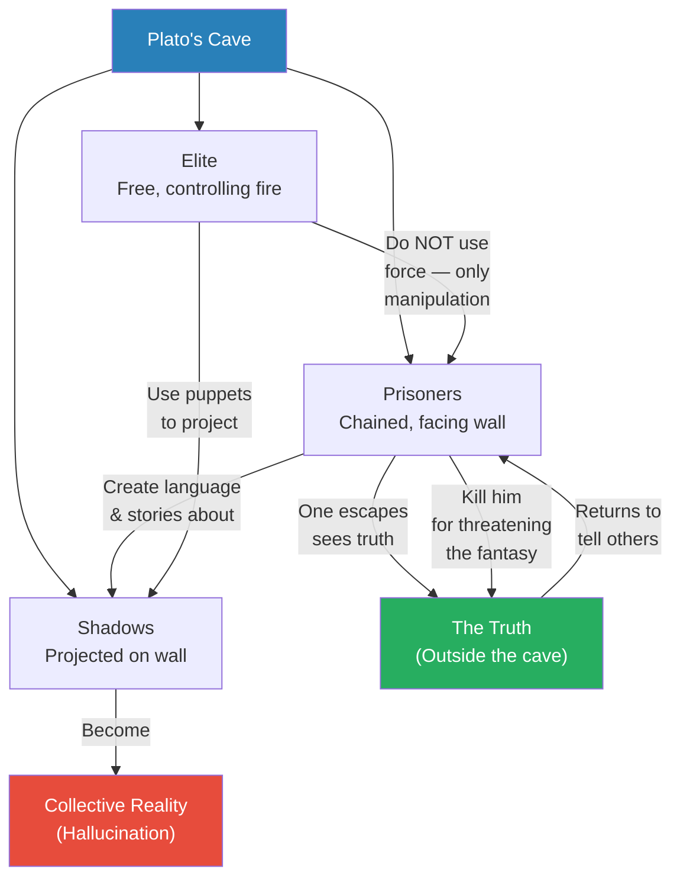
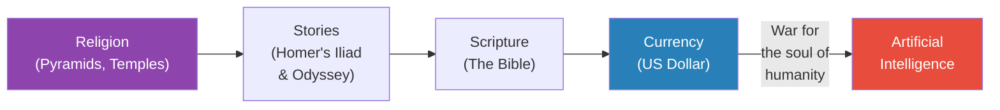
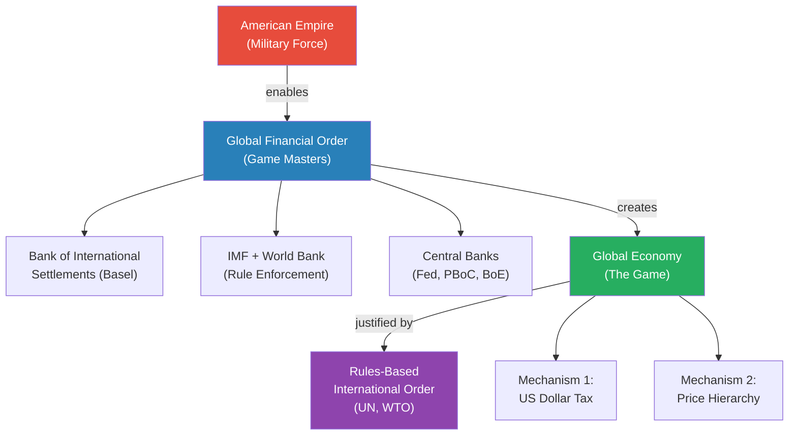
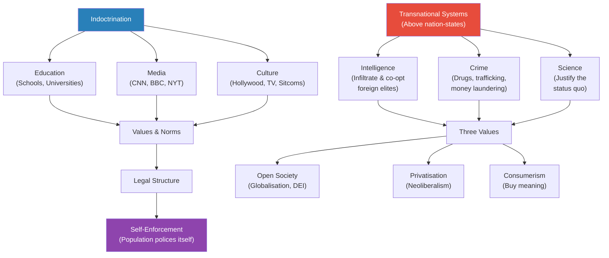
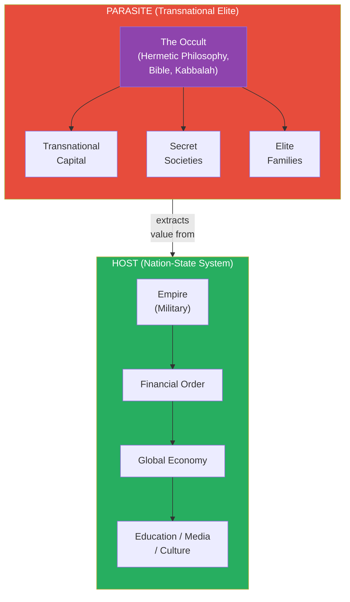
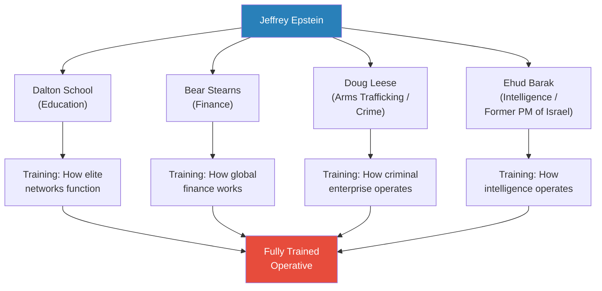
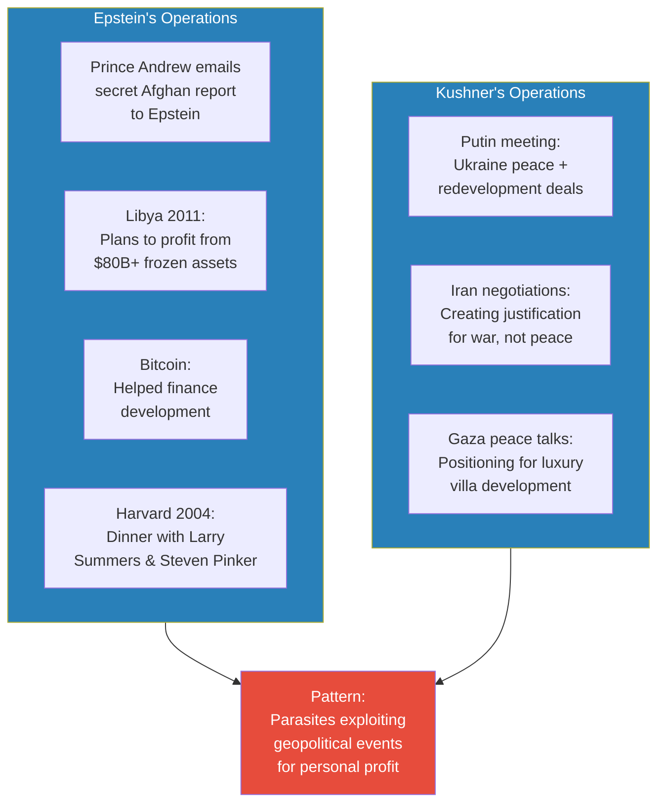
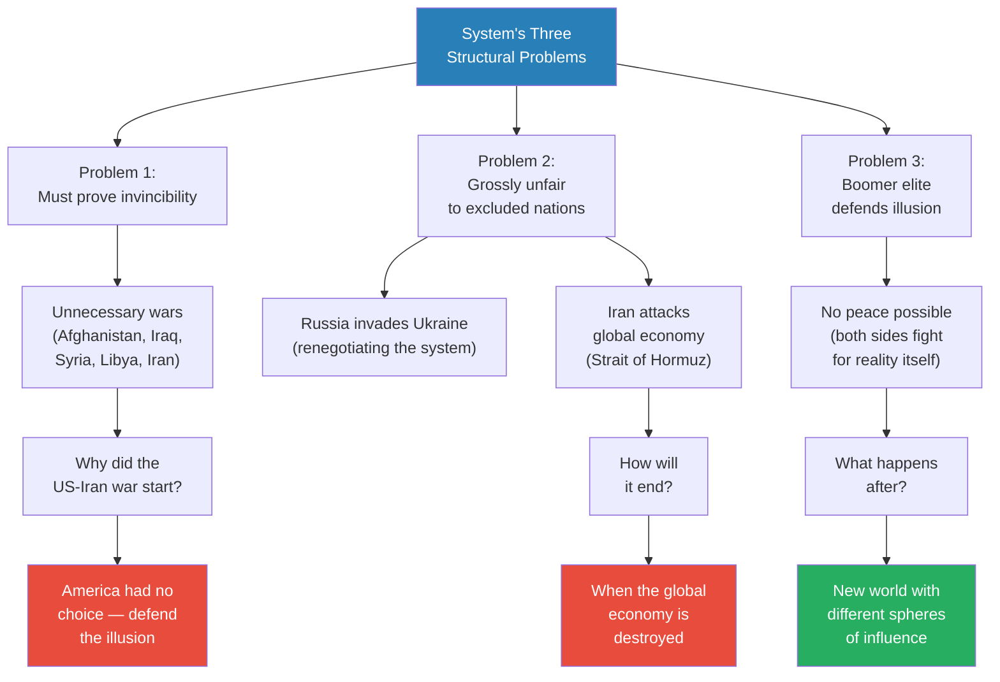

# Epstein's World

> Prof. Jiang opens with three questions about the US-Iran conflict — why it started, how it will end, and what comes after — then reveals that answering them requires understanding the hidden architecture of global reality itself. Drawing on Plato's Allegory of the Cave, he constructs a layered model of how the American Empire, the global financial order, and a transnational parasitic elite work together to extract consciousness-as-wealth from the world's population. He then introduces Jeffrey Epstein and Jared Kushner as operators of this system, using recently released FBI documents and Epstein files as primary evidence. The lecture ends with a structural crisis: a civil war among elites for control of the parasitic apparatus.

---

## Overview: Key Highlights

- <b style="color: #27ae60">Reality is a collective hallucination</b> — Plato's cave reframed as the operating system of the modern world, sustained not by force but by belief
- <b style="color: #2980b9">Consciousness is wealth</b> — capital is the mechanism that extracts and stores human attention; pyramids, Homer, the Bible, and the US dollar are all forms of this extraction
- <b style="color: #e74c3c">The elite maintain power through manipulation, not force</b> — the prisoners' chains are ropes they could snap at any time, but they choose not to
- <b style="color: #2980b9">The global financial order</b> — Bank of International Settlements at the top, then IMF/World Bank, then central banks, all structured around the US dollar
- <b style="color: #2980b9">Price hierarchy</b> — resources at the bottom, manufacturing above, knowledge economy next, finance at the top — a tiered system that benefits the West
- <b style="color: #e74c3c">The host-parasite distinction</b> — the nation-state system is the host; transnational capital, secret societies, and elite families are the parasite extracting value from it
- <b style="color: #27ae60">Jeffrey Epstein was not primarily a blackmailer</b> — the Epstein files reveal arms trafficking, money laundering, and deep connections to the Rothschild family as his real operations
- <b style="color: #2980b9">Three indoctrination mechanisms</b> — education, media, and culture work together to make the population believe the system is fair and natural
- <b style="color: #e74c3c">America must fight wars to maintain the illusion of invincibility</b> — the system collapses if anyone believes the empire can be defeated
- <b style="color: #27ae60">Iran's strategy targets the global economy</b> — recognising that the entire edifice is a house of cards, Iran attacks the weakest structural point rather than the empire directly
- <b style="color: #2980b9">Chabad Lubavitch</b> — a transnational religious network connecting Netanyahu, the Trump family, Putin, and the Epstein-Rothschild axis
- <b style="color: #e74c3c">The system's fatal flaw is elite civil war</b> — counter-elites want to replace the parasites, creating internal fractures that threaten the entire structure

| Concept | One-line summary |
|---------|-----------------|
| **Plato's Allegory of the Cave** | Reality is shadows on a wall; the prisoners create and defend the illusion themselves |
| **Consciousness as capital** | Human attention is the raw material of wealth; money is the mechanism that extracts and stores it |
| **The game masters** | The financial elite who construct the rules and incentives of the global economy |
| **Price hierarchy** | Resources cheapest, finance most expensive — a tiered system benefiting the US and allies |
| **Rules-based international order** | UN, WTO, and multilateral organisations that appear neutral but serve the empire |
| **Three indoctrination pillars** | Education, media, and culture — the mechanisms that make the system feel natural |
| **Transnational parasitic network** | Intelligence, crime, and science operating above nation-states to protect the status quo |
| **The occult** | Hidden knowledge from Hermetic philosophy, the Bible, and the Kabbalah binding the elite together |
| **Host vs. parasite** | The nation-state system creates value (host); the transnational elite extracts it (parasite) |
| **Epstein files** | 3 million DOJ documents revealing Epstein's network across intelligence, crime, and finance |
| **Elite civil war** | Counter-elites challenging the incumbent parasites for control of the extraction apparatus |

---

# The Lecture

## Plato's Cave and the Nature of Reality [0:00 - 3:00]

*Prof. Jiang opens by announcing three questions — why did the US-Iran war start, how will it end, and what happens after — then immediately pivots to something deeper: to answer these questions, we must first understand that our world is a hallucination. He introduces Plato's Allegory of the Cave as the foundational framework.*

> [!tip] Core Insight
> The elite do not maintain power through force or armies. Their power rests entirely on the prisoners' belief in the illusion. The chains are ropes. The shackles are ribbons. Anyone could walk out — but no one does.

*Three layers of Plato's cave mapped to power: the elite project, the prisoners believe, and anyone who reveals the truth is destroyed — not by the elite, but by fellow prisoners who refuse to lose their fantasy.*

> [!note]- Expand: Full Lecture Detail
> Prof. Jiang sets the scene dramatically. Deep inside the earth, a million people sit chained together on the floor, shackled at the neck, unable to turn around. They stare at a blank wall. Behind them burns a great fire, and around it move free people — the elite — who take puppets and project their shadows onto the wall.
>
> - The prisoners are mesmerised by these shadows because they know nothing else
> - They give the shadows names, create a language, tell stories about them
> - <b style="color: #27ae60">This becomes their collective reality — a hallucination they build together</b>
>
> Prof. Jiang draws three critical lessons from the allegory:
>
> - **Lesson 1 — We create our own reality:** The wealth in society is consciousness itself — the amount of thought and attention we invest. He illustrates with a vase: if you make a vase while distracted, chatting, listening to music, it will be mediocre. If you are completely focused, it will be beautiful and valuable. <b style="color: #2980b9">Money is the mechanism that extracts and stores consciousness, turning it into wealth</b>
> - **Lesson 2 — The elite rule through deception, not force:** When one prisoner breaks free, the elite do not stop him. "Whatever, man, do whatever you want." They watch him stumble toward the light. They do not care. Their power does not rest on armies or magic — it rests entirely on the prisoners' belief
> - **Lesson 3 — The prisoners will kill for the illusion:** When the freed man returns to tell the truth, the elite still do nothing. The prisoners themselves will murder him — because he threatens their fantasy, the reality they have invested their entire lives in believing
>
> > [!example] The Freed Prisoner's Return
> > - One prisoner decides the cave is not the real world — something exists outside
> > - He discovers the chains are ropes, the neck shackle is a ribbon — he snaps them off
> > - The elite watch and do nothing: "Do whatever you want, man"
> > - Blind from a lifetime in darkness, he stumbles toward the light outside the cave
> > - Outside, he discovers a beautiful world — heaven compared to the cave
> > - He falls in love with this reality and decides to go back and tell everyone
> > - The elite again do not stop him
> > - But when he tells the other prisoners the truth — that their chains are fake, their reality is shadows — they kill him
> > **The lesson:** The most powerful prison is not one where the guards are strong, but one where the inmates defend their own captivity.

---

## Consciousness as Capital — From Pyramids to AI [3:00 - 5:00]

*Prof. Jiang extends the cave allegory into economic theory, arguing that every civilisation has developed mechanisms to extract and store human consciousness as wealth. He traces these mechanisms from Egyptian pyramids to the US dollar — and introduces artificial intelligence as the next.*

*Each era develops a more powerful mechanism for capturing human attention. Prof. Jiang frames the current moment as a war between the old extraction system (the dollar) and the new one (AI) — a war for the soul of humanity.*

> [!note]- Expand: Full Lecture Detail
> Prof. Jiang explains that the system described in Plato's cave — reality structured to extract consciousness in order to create wealth for the elite — has operated throughout history using different mechanisms:
>
> - <b style="color: #2980b9">Religion and pyramids</b> — the Egyptian pyramids focused collective attention and motivated people to engage in worship and labour. Temples serve the same function across cultures
> - <b style="color: #2980b9">Stories</b> — Homer is "the father of Greek civilization" because The Iliad and The Odyssey focused people's attention and drove them to great things
> - <b style="color: #2980b9">The Bible</b> — the dominant mechanism of the medieval and early modern world
> - <b style="color: #2980b9">The US dollar</b> — the current primary mechanism for extracting and storing wealth globally
> - <b style="color: #e74c3c">Artificial intelligence</b> — the emerging force being created to replace the US dollar as the primary extraction mechanism
>
> Prof. Jiang frames the present moment starkly: "There's a war going on for the soul of humanity, for the human consciousness, between the US dollar — the old world order — and artificial intelligence — the new world order."

---

## The Architecture of Empire [5:00 - 10:00]

*Prof. Jiang builds the structural model of the modern world — from the American military at its foundation, through the global financial order, to the global economy and the rules-based international order. Each layer serves a purpose: to chain the world's population to a system that transfers wealth to the United States.*

> [!tip] Core Insight
> The American Empire does not rule directly. It provides the military force that enables a financial order, which constructs the game everyone plays. The empire is the foundation, not the operator.

*The layered architecture of global power: military force at the base enables a financial order that constructs the game, which is justified by the appearance of neutral international rules.*

> [!note]- Expand: Full Lecture Detail
> Prof. Jiang explains that to create the collective reality described in Plato's cave, you need a force — and that force is the American Empire, the military. But the military itself does not want to control the world; it allows the creation of a global financial order that constructs the game.
>
> **The global financial order:**
> - At the top: <b style="color: #2980b9">Bank of International Settlements</b> (Basel, Switzerland) — the central bank of central banks
> - Below: the <b style="color: #2980b9">World Bank</b> and <b style="color: #2980b9">IMF</b> (International Monetary Fund) — which control the rules
> - Below: central banks — the Federal Reserve (US), People's Bank of China, Bank of England
> - Together they create the global financial order, which is fundamentally about using the US dollar as the main mechanism of wealth extraction
>
> **The global economy — how the game works:**
> - Two extraction mechanisms operate simultaneously:
>   - <b style="color: #e74c3c">The US dollar tax</b> — every time anyone uses the dollar, they pay a hidden tax to America, because America can print as many dollars as it wants
>   - <b style="color: #2980b9">The price hierarchy</b> — the global economy is divided into tiers where resources are artificially cheapest and finance is most expensive
>
> **Price hierarchy tiers and their assigned nations:**
>
> | Tier | Activity | Assigned Nations |
> |------|----------|-----------------|
> | 4 (Top) | Finance | United States |
> | 3 | Knowledge Economy | Europe, Five Eyes (UK, Canada, Australia, NZ) |
> | 2 | Manufacturing | China |
> | 1 (Bottom) | Resources | Russia, Middle East, GCC |
> | Excluded | Not allowed to play | North Korea, Iran |
>
> - Prof. Jiang emphasises the absurdity: resources should be the most expensive because they are finite, yet the system prices them as cheapest
> - Countries like Iran and North Korea are not just disadvantaged — they are excluded from playing the game entirely
>
> **The rules-based international order:**
> - The UN and WTO create the appearance of fairness and neutrality
> - Prof. Jiang is blunt: "You can't have people believing that this entire global economy is structured so that the West can steal resources from everyone else"
> - The rules-based order is "really controlled by the Empire" — another set of shadows on the wall

---

## The Indoctrination Machine [10:00 - 15:00]

*Prof. Jiang maps the three mechanisms — education, media, and culture — that indoctrinate populations into believing the system is fair. He then introduces the three transnational organisations (intelligence, crime, and science) that operate above nation-states to protect the status quo, and the three values they promote: open society, privatisation, and consumerism.*

*Two parallel systems enforce the illusion: indoctrination makes the population believe; transnational networks ensure the elite cooperate. Both converge on the same goal — making the system self-enforcing so the elite never have to use direct force.*

> [!note]- Expand: Full Lecture Detail
> Prof. Jiang walks through the three indoctrination mechanisms with pointed examples:
>
> **Education:**
> - "You think that you go to university to learn knowledge. No, you don't. You go to university to be brainwashed"
> - Universities teach students to believe the system is not just fair but based on rules — "the phrase you'll keep hearing over and over is rules-based international order"
> - <b style="color: #e74c3c">Education does not pursue truth — it manufactures consent</b>
>
> **Media:**
> - CNN, BBC, New York Times — "Each time you read an article, you think you're receiving news. You're not. You're being brainwashed"
> - Media reinforces the belief that the current order is "fair, just and appropriate"
>
> **Culture:**
> - Hollywood, television shows, sitcoms — both high culture and low culture
> - These are absorbed daily, shaping worldview without conscious awareness
>
> Together, these three create values and norms that produce a legal structure. The key insight: <b style="color: #27ae60">if you break the rules, the elite do not come after you — everyone else does</b>. The population polices itself, exactly as in Plato's cave.
>
> **The three transnational systems:**
> - <b style="color: #2980b9">Intelligence</b> — spies whose job is to infiltrate other nations' elites and co-opt them into the system
> - <b style="color: #2980b9">Crime</b> — the most profitable enterprises: drugs, human trafficking, money laundering. These incentivise the global elite to work together
> - <b style="color: #2980b9">Science</b> — "You think science is about pursuing the truth? No. Science is fundamentally about finding evidence to justify and protect the status quo." This is why science is fundamentally materialistic
>
> **The three values these systems promote:**
> - <b style="color: #2980b9">Open society</b> — globalisation, multiculturalism, DEI. "Why is diversity good? Because it's good. If you don't believe it, you're a racist"
> - <b style="color: #2980b9">Privatisation (neoliberalism)</b> — "governments suck, let entrepreneurs handle things." If you disagree, "you're a communist"
> - <b style="color: #2980b9">Consumerism</b> — "How do you prove your value in life? Buy things. Put them on Instagram so people can like it"
>
> > [!example] The Instagram Yacht — Prof. Jiang on Consumerism
> > - Prof. Jiang describes the consumerist ideal with mock admiration
> > - Make as much money as possible, buy a yacht, get a "super hot girlfriend"
> > - Broadcast it all on Instagram — that is the value of life
> > - Meanwhile the system is making people lonely, miserable, depressed, suicidal
> > - The solution offered by the system: take antidepressants
> > - The depression is treated as a medical problem, not a systemic one
> > **The lesson:** Consumerism offers a counterfeit purpose — buy meaning, display meaning, feel empty, medicate the emptiness, repeat.

---

## The Parasitic Elite [15:00 - 20:00]

*Prof. Jiang introduces the distinction between the host system (the nation-state order) and the parasite (the transnational elite). He names the three groups that compose the parasitic network — transnational capital, secret societies, and elite families — and identifies the occult as the binding force that holds them together.*

*The critical structural insight: these are two separate systems. The host creates value; the parasite extracts it. Understanding this separation explains why the system appears functional on the surface while being exploitative underneath.*

> [!note]- Expand: Full Lecture Detail
> Prof. Jiang stresses that the transnational systems (intelligence, crime, science) operate above the nation-state, requiring a different organisational structure. Three groups of elites operate these systems:
>
> - <b style="color: #2980b9">Transnational capital</b> — global finance networks
> - <b style="color: #2980b9">Secret societies</b> — unnamed in detail but referenced as organisational structures
> - <b style="color: #2980b9">Elite families</b> — multigenerational dynasties
>
> These three groups are bound together by the <b style="color: #2980b9">occult</b> — hidden, secret knowledge not available to ordinary people, drawn from three sources: Hermetic philosophy, the Bible, and the Kabbalah.
>
> Prof. Jiang anticipates the obvious question: why are these two systems separate? Why not just put the occult at the top of one unified hierarchy?
>
> His answer is structural: <b style="color: #e74c3c">"This is the parasite. It doesn't actually create anything. All it does is suck up value, extract value."</b> The nation-state system is the host — it creates value through labour, production, and economic activity. The transnational elite is the parasite — it attaches to the host and extracts without contributing.
>
> - These must be separate systems because the parasite depends on the host remaining functional
> - If the parasite kills the host, it dies too
> - The distinction explains why the system looks legitimate from inside while being exploitative from above
>
> Prof. Jiang then names the key operators: Jeffrey Epstein and Jared Kushner. He names the families: the Rothschilds. He names the organisations: Chabad Lubavitch.
>
> He addresses the inevitable objection: "Some of you will say, they're all Jews. Well, the evidence implicates these people who are Jewish, but there are other people who are more powerful who are able to maintain themselves in the shadows. It's not really fair to say it's a Jewish conspiracy. This system is much more complicated than that."

---

## Jeffrey Epstein — The Operator Revealed [29:52 - 40:00]

*Prof. Jiang introduces the Epstein files — 3 million DOJ documents released recently — and uses them to show that Jeffrey Epstein was not merely a blackmailer but a trained operative embedded across intelligence, crime, and finance. He traces Epstein's career as a structured mentorship program and reveals his connections to the Rothschilds, Peter Thiel, Elon Musk, and Vladimir Putin.*

> [!tip] Core Insight
> The conventional understanding of Epstein — that he lured powerful people to his island and blackmailed them — is only a fraction of the story. The files reveal he was an arms trafficker, money launderer, and scion of one of the world's most powerful families. Bill Gates did not go to Epstein to give him money. He went to beg for money.

*Epstein's career was not a series of random jobs — it was a structured apprenticeship across four sectors of power. Prof. Jiang compares it to a chairman training his son by rotating him through every department of the company.*

> [!note]- Expand: Full Lecture Detail
> Prof. Jiang shows the class the Epstein files — documents released by the Department of Justice on their website. He explains that Epstein died in a federal prison in 2019 while being charged with multiple crimes, and the FBI's investigation produced approximately 3 million documents.
>
> **The conventional understanding vs. reality:**
> - The conventional story: Epstein was a Mossad agent who lured powerful Americans (Bill Gates, Bill Clinton) to his island, filmed them in compromising activities, and blackmailed them
> - <b style="color: #27ae60">The emails reveal: "That's what he did for fun." He made most of his money in arms trafficking and money laundering</b>
> - The power dynamic is inverted: "Bill Gates — once the wealthiest man in the world — was begging Jeff Epstein for money"
>
> **Key connections from the files:**
> - <b style="color: #2980b9">Peter Thiel</b> — one of the wealthiest men in America. He and Epstein are arranging meetings — Thiel is seeking Epstein out, not the other way around
> - <b style="color: #2980b9">Elon Musk</b> — the wealthiest man in the world, trying to arrange an appointment with Epstein
> - Prof. Jiang explains why: "Epstein says, I represent the Rothschilds. Your money is fake. Your money is stock market money, an illusion. I represent real money, real power, real wealth"
>
> **The Rothschild connection:**
> - In December 2018 (a year before Epstein's death), Epstein emails Ariane de Rothschild
> - He shares a finding from Harvard: when Hitler was poor, he lived in a charity home financed by three wealthy Jewish families — the Rothschilds, the Epsteins, and the Gutmanns
> - Ariane de Rothschild dismisses it as a conspiracy theory
> - Epstein pushes back angrily: "No, it's 100% true. Hitler was selling his clothes and living in a shelter funded by Epsteins, Rothschilds, Gutmanns. No conspiracy. The Epsteins were the Vienna bankers. We've been around for the longest time"
>
> **Epstein's career as structured training:**
> - Prof. Jiang reframes Epstein's career trajectory as a mentorship programme:
>
> | Position | Sector | What He Learned |
> |----------|--------|----------------|
> | Teacher at Dalton School | Education | How elite networks function |
> | Employee at Bear Stearns | Finance | How global money works |
> | Associate of Doug Leese | Crime (arms trafficking) | How criminal enterprise operates |
> | Protege of Ehud Barak | Intelligence (former Israeli PM) | How intelligence agencies work |
>
> - "You think everyone says he sucked at everything and that's why he was moved from one place to another. But another way of saying this is: he's an operative being trained in how power works by mentors"
>
> > [!example] The Chairman's Son Analogy
> > - Imagine you are the chairman of a large company and your son will inherit it
> > - How do you prepare him? You rotate him through every department
> > - Each department has a mentor who trains him in that function
> > - Dalton = education department; Bear Stearns = finance department
> > - Doug Leese = the "criminal enterprise" department; Barak = the intelligence department
> > - By the end, the son understands the entire operation from the inside
> > **The lesson:** Epstein's seemingly erratic career path makes perfect sense when viewed as a training programme for a transnational operative.

---

## The FBI's Discovery — Confidential Source Revelations [35:41 - 40:00]

*Prof. Jiang has a student read directly from FBI documents where a confidential human source describes Epstein's network, revealing connections to Mossad, Vladimir Putin, the Trump family, and Chabad Lubavitch. The documents paint a picture of a transnational network that co-opts nation-states rather than serving them.*

> [!note]- Expand: Full Lecture Detail
> Prof. Jiang has a student (Amber) read from FBI investigation documents. The confidential human source (CHS) reveals:
>
> - <b style="color: #2980b9">Alan Dershowitz</b> (Harvard professor, one of the most powerful men in America) was Epstein's attorney
> - Dershowitz told the Florida US Attorney in 2008 that Epstein "belonged to both US and allied intelligence services" — used as a reason to protect him from prosecution
> - Prof. Jiang's correction: "Intelligence works for him, not the other way around"
> - After phone calls between Dershowitz and Epstein, <b style="color: #e74c3c">Mossad would call Dershowitz to debrief</b>
> - Epstein was close to former Israeli PM Ehud Barak and "trained as a spy under him"
>
> **The Putin connection:**
> - <b style="color: #2980b9">Masha Drokova</b> — based in Silicon Valley, runs a firm called Day One Ventures
> - She was formerly Vladimir Putin's main contact in the Russian youth movement
> - When meeting the CHS, she ignored technology entirely and asked: "You knew Epstein, didn't you? He was a wonderful man"
>
> **The Chabad Lubavitch revelation:**
> - The CHS reveals that Chabad Lubavitch "is doing everything they can to co-opt the Trump presidency"
> - Chabad is described as "basically state-sanctioned Judaism" used by Putin to keep tabs on Russian Jewish oligarchs
> - On the day Trump was elected, Ivanka Trump and Jared Kushner visited the grave of <b style="color: #2980b9">Rabbi Schneerson</b> — the same rabbi who told Netanyahu to "hurry up and make the Messiah come"
> - The CHS believed Kushner "moved a lot of Russian investment money around" and that this was "the real Russian collusion story"
> - "The FBI should investigate Kushner's family charities to find evidence of corruption and money laundering. Chabad routinely uses charities to launder money"
>
> Prof. Jiang summarises: "What they discovered is that Jeffrey Epstein and Jared Kushner are both part of this transnational network that's able to co-opt different nation-states — including Russia, including America — and they're all connected to this transnational religious organisation called Chabad Lubavitch, and their leader is Rabbi Schneerson. It's all one big network."
>
> > [!quote] Prof. Jiang
> > "You think these guys work for the government? No. They work for Jeffrey Epstein, who works for the Rothschilds."

---

## Epstein and Kushner as Parasitic Operators [40:00 - 47:00]

*Prof. Jiang presents direct evidence of Epstein and Kushner operating as parasites on geopolitical events — profiting from the Libya intervention, developing Bitcoin, corrupting academia, and positioning for post-war real estate deals in Ukraine and Gaza.*

*Both Epstein and Kushner follow the same pattern: position themselves at the intersection of geopolitical conflict and financial opportunity, extract maximum value from events that devastate millions.*

> [!note]- Expand: Full Lecture Detail
> Prof. Jiang presents a series of documentary evidence showing how the parasitic network operates in practice:
>
> **Prince Andrew and the Afghanistan report:**
> - When British forces entered Afghanistan alongside the Americans, Prince Andrew asked the British government to investigate investment opportunities
> - This produced a confidential government report — essentially a state secret
> - Prince Andrew emailed this report directly to Jeffrey Epstein
> - Prof. Jiang's interpretation: "You think Prince Andrew works for the government? No — he works for Epstein, who works for the Rothschilds"
>
> **The Libya scheme:**
> - In February 2011, America began bombing Libya
> - By July 2011, with Gaddafi falling, Epstein and associates were already discussing how to profit
> - A student reads the key passage from the emails: there are "$80 billion in frozen funds internationally, of which $32.4 billion is in the US" — and the real number is estimated at 3-4 times higher
> - The plan: identify and recover 5-10% of stolen/misappropriated assets, take 10-25% as commission
> - "If we can become their go-to guys — they plan to spend at least $100 billion next year to rebuild"
> - Libya has the ninth largest crude oil and natural gas reserves on the planet, with a population smaller than New York City
>
> > [!example] The Libya Profit Calculation
> > - America bombs Libya in 2011 — a sovereign nation is destroyed
> > - Gaddafi's regime had $80 billion+ in frozen international assets
> > - Epstein and associates calculate: recover 5-10% of stolen assets, take 10-25% commission
> > - "We are talking about billions of dollars"
> > - The real prize: becoming the go-to intermediaries for $100 billion in reconstruction spending
> > - Libya's population is under 2 million people — smaller than one American city — sitting on the ninth-largest oil reserves on Earth
> > **The lesson:** Geopolitical destruction is a business opportunity for parasitic operators. The bombers create the chaos; the parasites harvest the profit.
>
> **Bitcoin and academia:**
> - A Guardian article reveals Epstein helped finance the development of Bitcoin
> - Prof. Jiang shows a 2004 photograph from Harvard: Larry Summers (president of Harvard), Steven Pinker (one of Harvard's most famous scholars), and Jeffrey Epstein at dinner together
> - "You think academia is about pursuing truth? No. It's about protecting and justifying the status quo. It's about providing a network for powerful people to meet and work together"
>
> **Jared Kushner's operations:**
> - <b style="color: #2980b9">Ukraine</b> — photographed with Putin discussing peace. Prof. Jiang speculates: as a real estate developer, Kushner is positioning for post-war redevelopment contracts
> - <b style="color: #2980b9">Iran</b> — photographed with Steve Witkoff and the Omani foreign minister in pre-attack peace negotiations. But Witkoff went on television and claimed Iran was enriching weapons-grade uranium — sabotaging the negotiations. "They're negotiating not to create a peace treaty, but to create a justification for war"
> - <b style="color: #2980b9">Gaza</b> — photographed with Witkoff and Benjamin Netanyahu discussing peace, while simultaneously planning to lead a real estate team to develop Gaza into luxury villas
>
> > [!quote] Prof. Jiang
> > "These are parasites. They look at geopolitics and ask: how can we take advantage of geopolitical events to make the most money for ourselves?"

---

## Three Problems with the System [20:02 - 29:52]

*Prof. Jiang identifies three structural weaknesses in the system that explain the current geopolitical crisis: the empire must perpetually demonstrate invincibility, the system is grossly unfair to excluded nations, and the "prisoners" (the boomer elite) will fight to the death to maintain the illusion.*

> [!tip] Core Insight
> There can be no ceasefire, no truce, and no peace between America and Iran — because both sides are fighting for the nature of reality itself. America fights to preserve the illusion; Iran fights to shatter it.

*The three structural problems map directly onto Prof. Jiang's three opening questions. Each problem makes the system more fragile, and each answer reveals that the current order cannot survive.*

> [!note]- Expand: Full Lecture Detail
> Prof. Jiang returns to his three opening questions and now answers them through the lens of the structural model:
>
> **Problem 1 — The empire must prove invincibility:**
> - The entire system rests on the perception that the American Empire cannot be defeated
> - <b style="color: #e74c3c">"It's like being the school bully. People pay you money because they think you're unreasonable. So every now and then, you have to go beat up another kid for no reason"</b>
> - This explains every Middle Eastern war of the past 20 years: Afghanistan, Iraq, Syria, Libya, Iran
> - The purpose is not strategic — it is theatrical. The wars are demonstrations of invincibility
>
> **Problem 2 — The system is unfair to excluded nations:**
> - Russia, Iran, and North Korea are discriminated against or excluded entirely
> - Russia invaded Ukraine in 2022 to renegotiate the system — "showing the Empire is not so tough"
> - America refuses to surrender Ukraine even though "this war was lost about two years ago" — because admitting defeat would destroy the perception of invincibility
> - <b style="color: #27ae60">Iran recognises the system is a house of cards</b> — it cannot attack the empire directly (nuclear weapons), cannot attack the indoctrination system (too embedded), cannot attack the UN/WTO (controlled by America)
> - So Iran attacks the global economy — the structural weak point. "That's why they close the Strait of Hormuz"
>
> **Problem 3 — The boomers defend the illusion:**
> - The elite of the boomer generation — people at the top of education, media, and culture — are not in power, but they benefit from the system
> - They will force their politicians and military to "fight to the death to maintain the illusion of Empire"
> - This is Plato's cave again: the prisoners who benefit most from the fantasy are the ones who will kill to preserve it
>
> **Answering the three questions:**
>
> | Question | Answer |
> |----------|--------|
> | Why did the US-Iran war start? | America had no choice — it had to defend the illusion of invincibility or watch the entire edifice collapse |
> | How will this war end? | When the global economy is destroyed — because once it falls, the entire edifice collapses |
> | What happens after? | A new world emerges with different spheres of influence |
>
> > [!example] The School Bully Analogy
> > - Imagine you are the biggest bully in school
> > - Other kids pay you money because they believe you will beat them up if they refuse
> > - Your power rests not on fighting everyone, but on everyone believing you would
> > - To maintain this belief, you must periodically beat up a random kid for no reason
> > - If you stop, or if someone fights back and wins, every kid stops paying
> > - America's wars in the Middle East serve this function — theatrical demonstrations of invincibility
> > **The lesson:** The bully's power is not physical strength but the perception of it. The moment the perception breaks, every relationship reverses simultaneously.

---

## The Elite Civil War [47:00 - End]

*Prof. Jiang closes by revealing the system's deepest vulnerability: a civil war between the incumbent parasitic elite and counter-elites who want to replace them. The release of the Epstein files itself is evidence of this internal fracture — one faction exposing another.*

> [!note]- Expand: Full Lecture Detail
> Prof. Jiang poses the final question: if this system works, why are the Epstein files publicly available on the Department of Justice website? Why can anyone read these documents?
>
> His answer: <b style="color: #e74c3c">there is a civil war within the elite</b>. The parasitic system extracts value from the nation-state, and other elites are asking: "Why can they be the parasites but not us?"
>
> - The conflict is not between the people and the elite — it is between competing elite factions
> - One faction (the incumbent parasites) controls the extraction apparatus
> - Another faction (the counter-elite) wants to take their position
> - The release of the Epstein files is a weapon in this intra-elite war — one faction exposing the other's network
> - "That's why we're seeing this conflict right now emerge in America"
>
> Prof. Jiang promises to discuss this civil war in detail in the next class, and ends the lecture.

---

## Connections

**Builds on:** [[09 - The US-Iran War]] (geopolitical context for the US-Iran conflict), [[07 - America's Game]] (the structure of American imperial power), [[06 - The World's Bank]] (the global financial order)
**Sets up:** Lecture 14 (the elite civil war in detail)
**Related books in vault:** [[The 48 Laws of Power - Robert Greene]] (power through perception and manipulation), [[The Prince - Niccolò Machiavelli]] (statecraft and the maintenance of power), [[Sapiens - Yuval Noah Harari]] (consciousness, collective myths, and the agricultural revolution)

---

## The Takeaway

This lecture is the most structurally ambitious of the Game Theory series so far. Prof. Jiang does not merely describe a geopolitical event — he constructs a complete model of how reality itself is manufactured, maintained, and exploited. The Plato's cave framework is not a metaphor here; it is presented as a literal description of how power operates. The elite do not need force because the population has internalised the illusion so deeply that anyone who threatens it is destroyed from below, not from above. The system is self-enforcing precisely because its beneficiaries — from university professors to media anchors to the boomer elite — genuinely believe it is real.

The most counterintuitive insight is the inversion of the Epstein story. The conventional narrative — wealthy pedophile blackmails the powerful — turns out to be the least important dimension. The Epstein files reveal a trained operative embedded across education, finance, crime, and intelligence, representing a multigenerational family network connected to the Rothschilds. The power dynamic runs opposite to what the public assumed: the world's wealthiest individuals were seeking Epstein out, not the other way around. His "island" was a sideshow; his real operation was arms trafficking, money laundering, and serving as a node in a transnational network that treats geopolitical destruction as a business opportunity.

The unresolved question — and the one Prof. Jiang promises to address next — is what happens when the parasite turns on itself. The Epstein files are public not because the system believes in transparency, but because one elite faction is weaponising them against another. If the parasitic class is fracturing, the entire edifice becomes unstable — not from external pressure (Iran, Russia) but from internal betrayal. The next lecture will explore whether this civil war among elites represents the beginning of the system's collapse or merely a rotation of which faction sits at the top.
