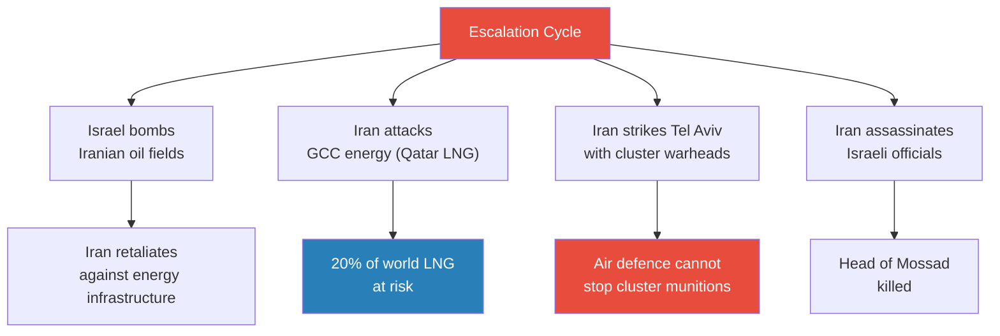
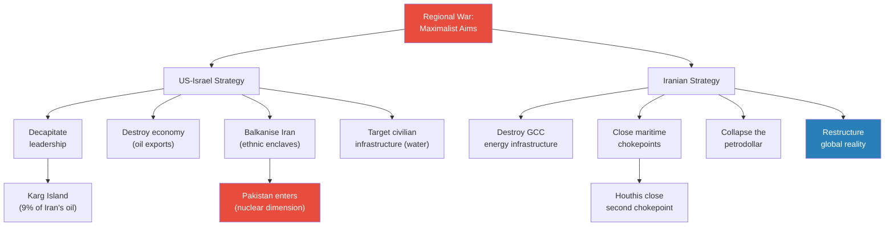
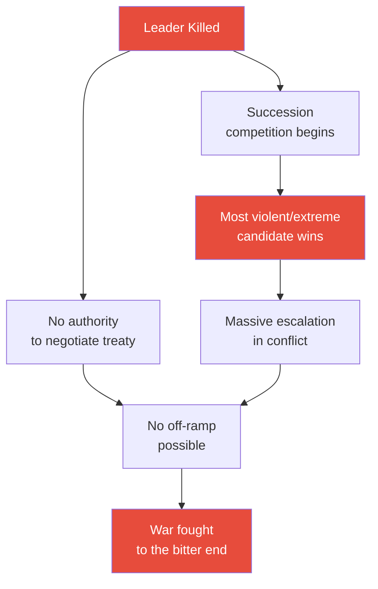
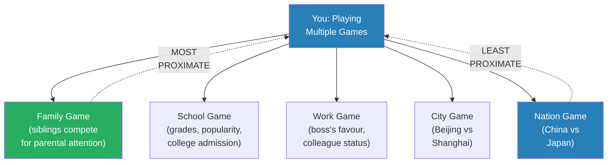
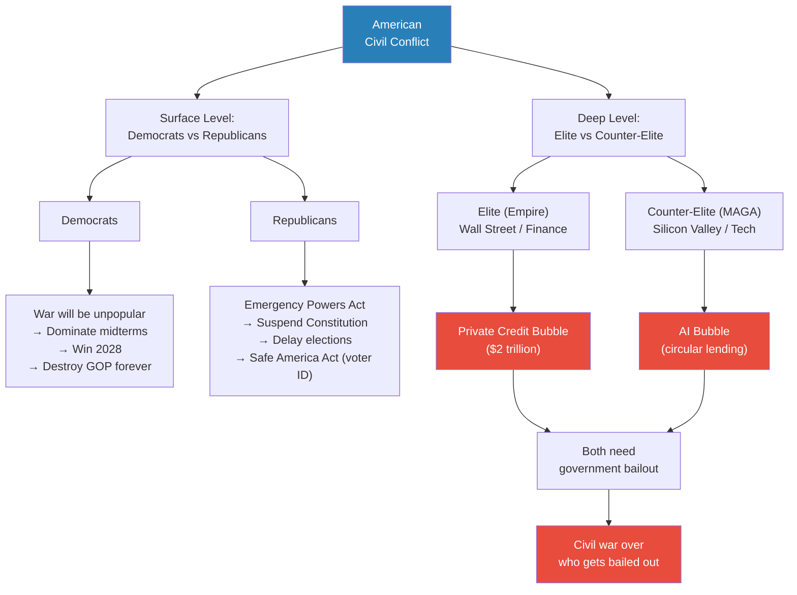
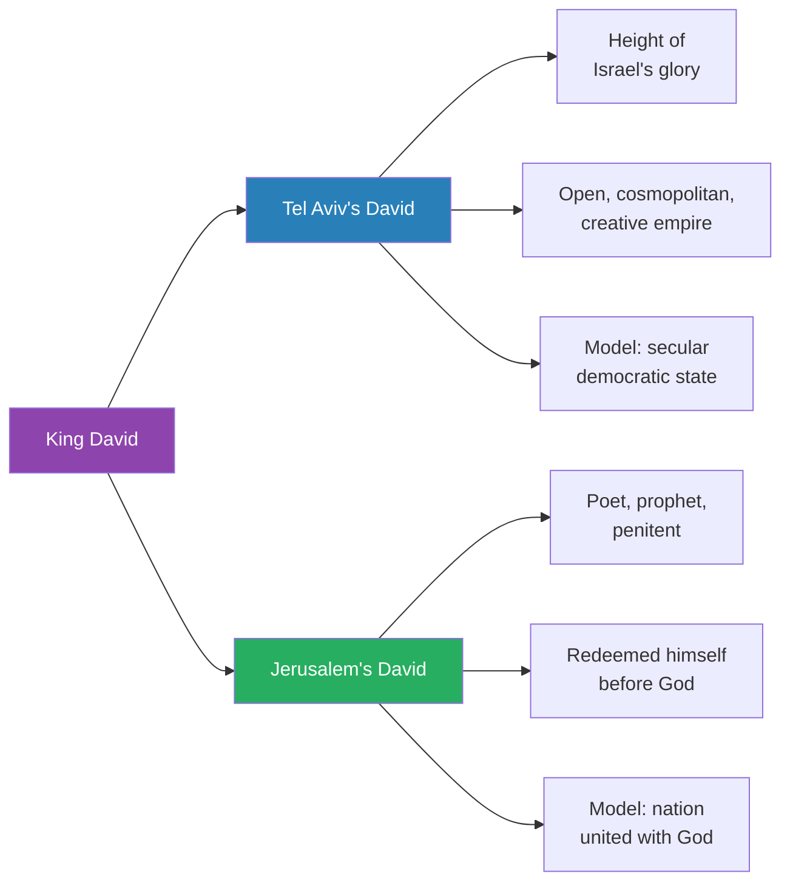
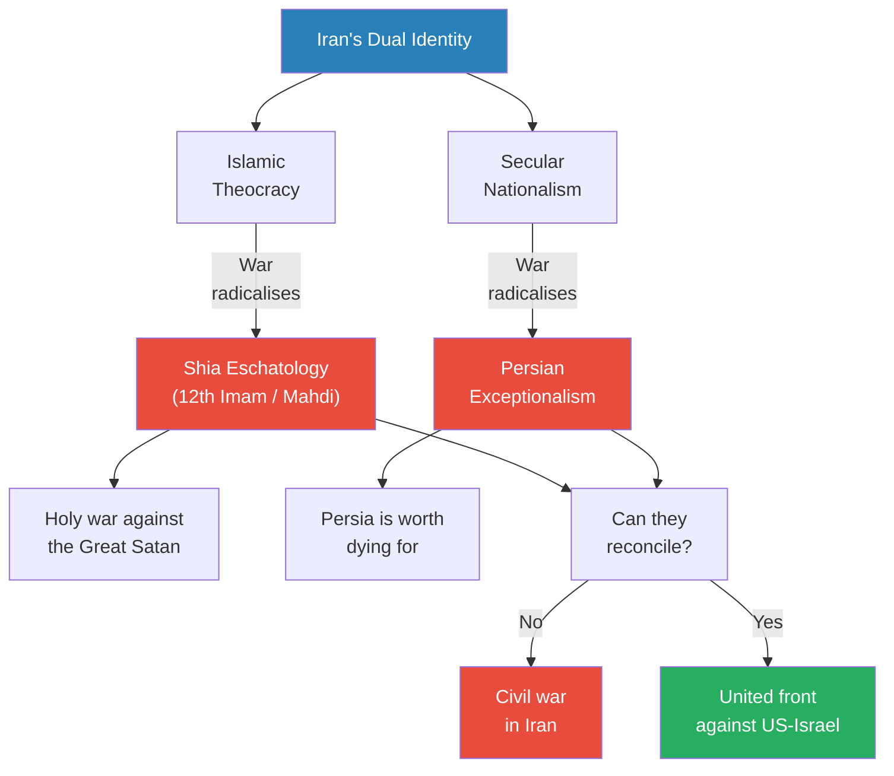
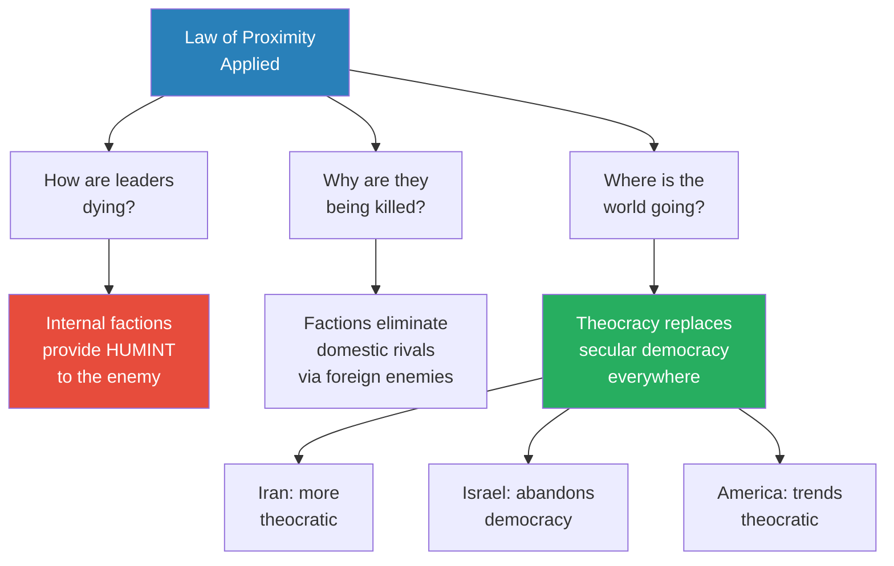

# The Law of Proximity

> Prof. Jiang opens with a war update -- Iran has struck Qatar's LNG infrastructure and pummeled Tel Aviv with cluster warheads, while the Israelis and Americans have assassinated Ali Larijani, Iran's pragmatic de facto war leader. But the lecture's central question is not about the war itself -- it is about why leaders on both sides keep dying. Prof. Jiang introduces the **Law of Proximity**: the game closest to you is the one that determines your behaviour. Applied to nations at war, the law reveals that internal civil conflicts -- Democrats vs Republicans, Tel Aviv vs Jerusalem, secular nationalists vs Islamic theocrats -- are more powerful than the external war, and that factions within each country are betraying their own leaders to enemy intelligence in order to win their domestic game. The world, Prof. Jiang concludes, is heading toward theocracy.

---

## Overview: Key Highlights

- <b style="color: #27ae60">The Law of Proximity</b> -- you are always playing multiple games simultaneously, and the game closest to you determines your decisions more than any distant one
- <b style="color: #e74c3c">Leaders are being killed by their own side</b> -- internal factions provide intelligence to foreign enemies in order to eliminate domestic rivals
- <b style="color: #2980b9">Elite overproduction</b> -- Peter Turchin's theory explains the real American divide: Empire (finance/Democrats) vs MAGA (tech/Republicans) fighting over who gets bailed out
- <b style="color: #e74c3c">Killing Larijani destroyed the off-ramp</b> -- assassinating the pragmatic negotiator ensures the war cannot end through diplomacy
- <b style="color: #27ae60">Israel's core divide is Tel Aviv vs Jerusalem</b> -- secular democracy vs religious theocracy, the animal soul vs the divine soul
- <b style="color: #2980b9">The private credit bubble ($2 trillion)</b> -- finance sector parasitism backed by the assumption that Washington will bail them out
- <b style="color: #2980b9">The AI bubble</b> -- tech companies lending money in circles, dependent on GCC investment and government rescue
- <b style="color: #e74c3c">Netanyahu may be dead or incapacitated</b> -- he has not been seen publicly, AI-generated videos are being used, and Iran has targeted his residence
- <b style="color: #27ae60">The world is trending toward theocracy</b> -- Iran, Israel, and America are all moving away from secular democracy and toward religious-nationalist governance
- <b style="color: #2980b9">Iran's dual identity</b> -- Islamic theocracy vs secular Persian nationalism, with war radicalising both sides toward extremism
- <b style="color: #e74c3c">Both sides seek maximalist aims</b> -- the US-Israel wants to destroy Iran as a nation-state; Iran wants to destroy the global economy permanently
- <b style="color: #27ae60">Redemption through suffering</b> -- Jerusalem's theological framework: destruction brings the Messiah, and only suffering can reunite Jews with God

| Concept | One-line summary |
|---------|-----------------|
| **Law of Proximity** | The game closest to you -- family, faction, city -- dominates your decisions over distant geopolitical games |
| **Decapitation strikes** | Targeting enemy leadership to collapse command -- counterproductive because replacements are always more extreme |
| **HUMINT vs SIGINT** | Human intelligence (embedded spies) vs signal intelligence (electronic surveillance) -- HUMINT explains the precision of kills |
| **Elite overproduction** | Too many elites competing for finite power leads to civil war -- Turchin's framework applied to America |
| **Emergency Powers Act** | Presidential authority to suspend constitutional norms during wartime -- enables election delay or cancellation |
| **Private credit bubble** | $2 trillion in risky company-to-company loans backed by moral hazard -- finance's bet that government will bail them out |
| **AI bubble** | Circular lending among tech companies inflated by GCC investment -- collapses when Gulf money stops flowing |
| **Animal soul vs divine soul** | Jerusalem's framing of Israel's divide: Tel Aviv pursues material pleasure, Jerusalem pursues union with God |
| **Balkanisation** | The US-Israeli strategy to fracture Iran into competing ethnic enclaves |
| **Shia eschatology** | The belief that war and suffering will bring the return of the 12th Imam (Mahdi) to lead the faithful |
| **Persian exceptionalism** | Secular Iranian nationalism: Persia as the greatest civilisation in history, worth dying for |
| **Mission creep** | Small military actions that expand because each step creates justification for the next -- Karg Island as example |

---

# The Lecture

## War Update: The Escalation [0:00 - 2:24]

*Prof. Jiang opens the class with breaking news: Israel has bombed Iranian oil fields, and Iran has retaliated by attacking Qatar's LNG infrastructure and Tel Aviv with cluster warheads. He walks the class through the footage and the implications -- Qatar supplies 20% of the world's LNG, and Iran's strategy remains the destruction of the global economy through energy infrastructure.*

*The war has entered a phase of mutual infrastructure destruction -- Israel targets Iran's oil exports while Iran targets the GCC's energy infrastructure and Israel's cities. Neither side can defend against the other's preferred weapons.*

> [!note]- Expand: Full Lecture Detail
> - Prof. Jiang shows footage of Qatar being attacked: "Oh, shit -- Qatar provides 20% of the world's LNG, and this is a major escalation"
> - Iran's entire strategy remains consistent with previous lectures: <b style="color: #e74c3c">destroy the global economy by attacking the energy infrastructure of the GCC</b>
> - Iran also struck Tel Aviv in retaliation for the assassination of Ali Larijani -- their de facto war leader
> - Prof. Jiang shows a picture of cluster warheads: "It is impossible for air defence to stop this"
> - Tel Aviv footage is being censored, but the city is "getting pummeled"
> - Despite the destruction, some Israelis are "very happy about all this" -- Prof. Jiang shows a video of an influential rabbi in Jerusalem
> - The rabbi claims the war of destruction will bring the coming of the Messiah -- "and it will happen on Thursday, which is today"
> - Prof. Jiang's key framing: <b style="color: #27ae60">"You cannot look at this war from a geopolitical lens. You have to look at it from an eschatological perspective"</b>

---

## The Strategic Map: Maximalist Aims on Both Sides [2:24 - 8:00]

*Prof. Jiang maps the current state of the regional war, showing that both sides are pursuing maximalist objectives -- the US-Israel seeks to permanently destroy Iran as a nation-state, while Iran seeks to permanently restructure reality itself by collapsing the global economy. He identifies the key flashpoints ahead: Karg Island, Saudi Arabia's mutual defence pact with Pakistan, and the closure of maritime chokepoints.*

> [!tip] Core Insight
> This war has no natural stopping point. Both sides define victory as the permanent destruction of the other's capacity to exist in its current form. The US-Israel wants to eliminate Iran's statehood; Iran wants to eliminate the global economic order.

*Both sides pursue total destruction of the other's core capacity. The flashpoints -- Karg Island, Pakistan's entry, and the Houthi closure of a second chokepoint -- are escalation triggers that could draw in Japan, South Korea, and other energy-dependent nations.*

> [!note]- Expand: Full Lecture Detail
> - The war is now regional with both sides seeking "maximus objectives"
> - <b style="color: #2980b9">US-Israeli strategy</b> has four components:
>   - Decapitating Iranian leadership
>   - Targeting the Iranian economy
>   - Attacking civilian critical infrastructure including water
>   - Provoking ethnic conflict to balkanise Iran into enclaves
> - <b style="color: #2980b9">Iranian strategy</b>: destroy the GCC's energy infrastructure because "the entire basis of the global economy is cheap energy"
> - **Karg Island flashpoint:** stores 9% of Iran's oil for export; easy to take but hard to defend because of coastline exposure
>   - Taking the coastline requires controlling the Zagros Mountains
>   - This is <b style="color: #e74c3c">mission creep</b>: "you cannot justify the war, so you put in some soldiers, and then the mission creep becomes justification for the war"
> - **Pakistan flashpoint:** Saudi Arabia has a mutual defence pact with Pakistan
>   - If Saudi Arabia declares war on Iran, Pakistan is obligated to join
>   - This opens the eastern front and introduces nuclear weapons into the conflict
>   - Prof. Jiang "strongly believes" tactical nuclear weapons will not be used -- but acknowledges they are now "at play"
> - **Houthi chokepoint:** when Iran activates its Houthi proxies to close a second maritime chokepoint, the GCC becomes isolated
>   - Two closed chokepoints cut off the world's access to cheap energy
>   - Japan and South Korea may be "forced into this war because they are so dependent on GCC energy"
>
> > [!example] The Netanyahu Mystery
> > - Benjamin Netanyahu has not been seen in a public setting for many days
> > - He has been absent from cabinet meetings he usually chairs
> > - Fake AI-generated videos of him giving speeches have appeared -- "and it's pretty blatant"
> > - A photo was released showing him visiting a cafe in Jerusalem -- but the cafe is on a mountain 50 minutes from where he would be, raising the question of why he does not simply hold a cabinet meeting or call Trump to prove he is alive
> > - Prof. Jiang does not believe he is dead but suggests he may be hiding or injured
> > - The Iranians have successfully killed the head of Mossad and targeted Netanyahu's residence in Tel Aviv
> > **The lesson:** The precision with which both sides are killing each other's leadership is itself evidence that intelligence is flowing from internal factions, not just external surveillance.

---

## Why You Do Not Kill Leaders [8:00 - 11:15]

*Prof. Jiang uses a gang war analogy to explain why, historically, warring factions avoid targeting each other's leaders. Two reasons: leaders have the authority to negotiate and implement a treaty, and killing a leader triggers a succession competition where the most violent person wins.*

*Killing a leader eliminates both the capacity to negotiate and the moderating influence at the top, guaranteeing escalation and the destruction of any path to peace.*

> [!note]- Expand: Full Lecture Detail
> - Prof. Jiang sets up the analogy: imagine two gangs at war, Gang A and Gang B
> - Gangs are structured as hierarchies with a lot of autonomy among different sections -- the leader holds the structure together
> - **Reason 1 not to kill the leader:** war is used to achieve political objectives
>   - "The point isn't to kill everyone. The point is to negotiate a treaty that is most beneficial to you"
>   - You negotiate with the leader because <b style="color: #27ae60">they have the authority to implement the treaty</b>
> - **Reason 2 not to kill the leader:** succession competition produces extremists
>   - "If you kill the leader, there'll be a competition to replace the leader"
>   - "During a gang war, the person who is most violent, the most extreme, will often become the new leader"
>   - This causes both internal chaos and massive external escalation
>
> > [!example] The Assassination of Ali Larijani
> > - Larijani was the de facto head of Iran's war effort
> > - He was assassinated two days before this lecture -- Iran has confirmed his death
> > - Analysts are "extremely worried" because he was a pragmatic person who could be negotiated with
> > - He was experienced enough and influential enough to unite Iran's different factions behind a ceasefire
> > - With him dead, "it is now almost impossible to foresee a ceasefire"
> > - His assassination confirms both sides are pursuing maximalist aims -- destroy Iran permanently, or restructure reality permanently
> > **The lesson:** By killing the one person capable of negotiating a ceasefire, Israel and America have ensured there is no off-ramp. The war will be fought to the bitter end.

---

## The Three Questions [11:15 - 14:00]

*Prof. Jiang frames the lecture around three questions: How are leaders on both sides dying with such precision? Why are they being killed when replacements are always more extreme? And what does this mean for the world? To answer all three, he introduces the Law of Proximity.*

> [!note]- Expand: Full Lecture Detail
> - **Question 1: How are these leaders dying?**
>   - It is not easy to kill a protected leader
>   - Two methods of intelligence: <b style="color: #2980b9">HUMINT (human intelligence)</b> -- embedded spies; and <b style="color: #2980b9">SIGINT (signal intelligence)</b> -- electronic eavesdropping, phone tracking, IP tracing
>   - The Americans and Israelis claim they are using SIGINT
>   - Prof. Jiang disagrees: "I think the most important, the most reliable source of information is human intelligence -- having spies embedded in local networks to spot for you where they are"
> - **Question 2: Why are they being killed?**
>   - Once a leader dies, they are replaced -- "and they're often replaced by a more extreme individual"
>   - So what is the strategic logic?
> - **Question 3: What does this mean for the war and the world?**
>   - What do decapitation strikes ultimately mean for how the war progresses?

---

## The Law of Proximity [14:00 - 19:00]

*Prof. Jiang introduces the lecture's central concept: the Law of Proximity. Every person, organisation, and nation plays multiple games simultaneously -- but the game closest to you, the one most proximate, is the one that dominates your decision-making. He walks through personal examples before applying the law to nations, revealing that the internal conflicts within America, Israel, and Iran explain far more than the external war between them.*

> [!tip] Core Insight
> Nations at war are not playing one game against each other. They are playing many games within themselves -- and the internal game always dominates. Factions within each country will betray their own nation's leaders to the enemy if it helps them win the domestic game.

*The Law of Proximity: every person plays games at multiple scales simultaneously, but the game nearest to you -- family, faction, workplace -- determines your behaviour far more than the distant national or global game.*

> [!note]- Expand: Full Lecture Detail
> - <b style="color: #27ae60">The Law of Proximity</b>: "Whenever you play a game, you're not just playing one game. You're playing many, many different games, and the game that you choose to play is the one that is most proximate to you"
> - Prof. Jiang illustrates with everyday life:
>   - **Family game:** competing with siblings for parental attention -- "depending on who your siblings are, you might use different strategies, including doing well in school or being a pain in the ass. Unfortunately, my kids choose to be a pain in the ass"
>   - Parents play their own game: social prestige, competing against other parents for "the best family possible"
>   - **School game:** competing with classmates for attention and popularity, and for the best grades to get into college
>   - **Work game:** competing for the boss's favour and colleague popularity
>   - **City game:** wanting Beijing to be better than Shanghai or Shenzhen
>   - **Nation game:** wanting China to be stronger than Japan
> - The key insight for geopolitics: "We think that the game is between nations, but really, the game is within nations"
> - <b style="color: #27ae60">"The conflict within nations is the one conflict that determines how nations behave against each other"</b>
> - He announces the plan: examine the civil conflicts in America, Israel, and Iran to understand why they behave the way they do externally

---

## America's Internal Game: Democrats vs Republicans vs the Real Divide [19:00 - 26:16]

*Prof. Jiang maps America's internal conflicts at two levels. On the surface, Democrats and Republicans both support the war but for opposite reasons -- Democrats want the war to destroy Trump, Republicans want the war to grant emergency powers. Beneath that, the deeper divide is between two parasitic economic bubbles -- finance (backing Democrats) and AI/tech (backing Republicans) -- fighting over who gets the government bailout when their bubble bursts.*

> [!tip] Core Insight
> The US-Iran war is not really about defeating Iran. For both American political parties, the war is a weapon in their domestic game -- a tool for seizing or maintaining power. The real civil conflict is between two parasitic economic sectors competing for a finite government bailout.

*America's real game is not against Iran but within itself. Two parasitic bubbles -- private credit and AI -- will both burst, and only one can be bailed out. The 2028 election determines which side survives.*

> [!note]- Expand: Full Lecture Detail
> - **Surface level: why both parties support the war despite opposing each other**
> - <b style="color: #2980b9">Democratic strategy</b>:
>   - The war will be "extremely unpopular in America"
>   - This allows Democrats to dominate the midterms in November and win the 2028 presidential election
>   - They believe it will be so unpopular that it "will basically destroy the Republican Party" and allow Democrats to "rule forever"
> - <b style="color: #2980b9">Republican strategy</b>:
>   - The war grants the President the <b style="color: #e74c3c">Emergency Powers Act</b>, which allows him to "essentially suspend the Constitution and suspend or delay elections"
>   - They also want to pass the **Safe America Act** -- requiring voter ID
>   - "Historically, the idea of checking ID is a way to discriminate against minorities -- to have police officers there to scare minorities, and that's traditionally how racism was enforced in America"
>   - If the war goes very badly, they can call a national draft and cancel elections entirely
> - <b style="color: #27ae60">"This is not really about America defeating Iran. This is really about the Democrats or Republicans trying to obtain power and keep it"</b>
>
> - **Deep level: elite overproduction**
> - Prof. Jiang references <b style="color: #2980b9">Peter Turchin's theory of elite overproduction</b> -- introduced in [[03 - Rich Dad, Poor Dad]]
>   - Too many elites competing for finite power leads to civil war
>   - "Power is a zero-sum game"
> - The real divide: **Empire** (Democrats/finance/Wall Street) vs **MAGA** (Republicans/tech/Silicon Valley)
>   - Empire wants to maintain the current global order
>   - MAGA wants to retreat to the Western Hemisphere and focus on core national interests
>   - They are "two different ideals for America"
>
> - **The parasitic bubbles:**
> - <b style="color: #e74c3c">Private credit bubble ($2 trillion)</b>:
>   - Companies privately issue loans to other companies instead of banks
>   - After the 2008 bailout, they learned there are no consequences for stupidity -- <b style="color: #e74c3c">moral hazard</b>
>   - "They're giving out lots and lots of silly loans to companies because they collect a fee"
>   - When companies go bankrupt, they lend more money to keep them afloat
>   - Their assumption: "worst case scenario, the government will bail us out because we're too big to fail"
> - <b style="color: #e74c3c">AI bubble</b>:
>   - Companies like Microsoft, OpenAI, Oracle, and Nvidia "just lend money to each other"
>   - "I give you a billion dollars, then you give me a billion dollars, and now we have $2 billion -- it's a circle jerk"
>   - Heavily funded by GCC investors -- but the war threatens that capital flow
>   - Their assumption: "We control Trump. We control the White House. We are the stock market, therefore Washington DC will bail us out"
> - <b style="color: #e74c3c">"The government doesn't have infinite money. It can only bail one side"</b>
>   - If Democrats win 2028: private credit gets bailed out
>   - If Trump stays in power: AI gets bailed out
>   - "That's the civil war going on in America right now"

---

## Israel's Internal Game: Tel Aviv vs Jerusalem [26:16 - 38:19]

*Prof. Jiang reveals Israel's fundamental divide -- not between political parties, but between two cities representing two irreconcilable visions. Tel Aviv is secular, democratic, cosmopolitan, progressive. Jerusalem is theocratic, conservative, traditional, and views the war's destruction as a necessary path to redemption. Both cities claim King David as their model, but they see two completely different men.*

*Both Tel Aviv and Jerusalem claim David as their founding ideal -- but they see entirely different figures. Tel Aviv sees a brilliant empire-builder. Jerusalem sees a sinner who found redemption through suffering and prayer.*

> [!note]- Expand: Full Lecture Detail
> - **Israel's political fragmentation:**
> - In 2020, over a million people in Tel Aviv called for Netanyahu's impeachment and jailing
>   - Netanyahu is "very corrupt, like most Israeli politicians"
>   - To avoid jail, he proposed changing the judiciary and the laws
>   - It seemed he would "fall from power and go to jail for the rest of his life"
>   - Then October 7 happened -- permanent war gave him emergency powers
> - The Knesset (parliament) has an extraordinary number of political parties
>   - Likud, Netanyahu's party, has only ~30 seats and cannot rule alone -- requires coalition
>   - Prof. Jiang: "none of them are dominant" and "they really hate each other -- it's not a show"
>
> - **The deeper historical pattern:**
>
> > [!example] The Jews and Jerusalem in 70 AD
> > - In the year 70, the Romans brought a huge army to destroy Jerusalem
> > - The people of Jerusalem should have united to defend the city -- otherwise they would all be killed
> > - Instead, three major factions -- the Sadducees, Pharisees, and Essenes -- continued fighting each other
> > - The Romans destroyed Jerusalem, burned down the Second Temple, and massacred thousands
> > - Prof. Jiang: "The Jews have always had this problem where they're extremely creative and intellectual, but that just leads to massive infighting"
> > **The lesson:** The Law of Proximity in action -- even facing total annihilation by an external enemy, internal factional conflict dominated. The proximate game (who controls Jerusalem?) mattered more than the existential game (will Jerusalem survive?).
>
> - **The Tel Aviv-Jerusalem divide:**
>
> | | Tel Aviv | Jerusalem |
> |--|---------|-----------|
> | **Government** | Democratic | Theocratic |
> | **Culture** | Open, cosmopolitan | Conservative, traditional |
> | **Sexuality** | Large LGBT community | Deeply opposed |
> | **Orientation** | Secular, outward-looking, Western | Religious, inward-looking |
> | **View of David** | Empire builder at Israel's glory | Poet-prophet who found redemption through repentance |
> | **View of the war** | Existential threat | Necessary path to the Messiah |
>
> - **The story of David and Bathsheba** (Jerusalem's founding narrative):
>   - David is king; he falls in love with Bathsheba, who is married to Uriah the Hittite
>   - David has Uriah killed -- he can do this because he is king
>   - God sends the prophet Nathan to tell David he has sinned
>   - David refuses to admit wrong at first, but then his child with Bathsheba dies
>   - David falls into "tremendous grief" and prays daily for forgiveness
>   - God forgives him -- and in the process, David becomes united with God: "now they're best friends, now they talk every day"
>   - <b style="color: #27ae60">This is Jerusalem's vision for Israel: a nation that achieves redemption through repentance</b>
>
> - **The animal soul vs the divine soul:**
>   - Jerusalem's theology: every person has a divine soul (from God) trapped in an animal soul
>   - Tel Aviv represents the animal soul: material comfort, sex, parties, Ferraris
>   - Jerusalem represents the divine soul: seeking only to be with God
>   - "We are constantly in a struggle between the animal soul and the divine soul"
>   - <b style="color: #e74c3c">People in Jerusalem are okay with Tel Aviv being destroyed</b>: "Tel Aviv is the great Satan. Let's destroy it so that we can build a theocracy"
>   - War is good because suffering is necessary for spiritual renewal -- the Book of Job model
>   - When Jews lose everything, they will recognise "the glory of God"
>   - The Messiah comes when people truly, desperately want him: "You need to create the conditions when people really want the Messiah"

---

## Student Question: The Animal Soul and the Divine Soul [38:19 - 39:13]

*A student asks whether the animal-soul/divine-soul framework applies to individuals, not just nations. Prof. Jiang affirms the insight and connects it to the broader global crisis.*

> [!note]- Expand: Full Lecture Detail
>
> > [!quote] Student (Vincent)
> > "You said that Israel has two divided parts -- one represents the animal soul and the other the divine soul. Can I apply this logic to a single person? People are always struggling with separating the divine soul and pursuing it, but they cannot get rid of the animal soul. Is there a way, or will we only ever struggle?"
>
> - Prof. Jiang clarifies that this is how the religious people in Jerusalem frame the conflict -- people in Tel Aviv would frame it as "progress vs tradition, going forward or staying backward"
> - But he validates the broader insight: "For the past 20 years, we only have been indulging in the animal soul. We've abandoned the divine soul"
> - <b style="color: #27ae60">"That's why people are so desperate for change, and this is what's leading to so much conflict around the world -- the human soul is off balance"</b>
> - Historical pattern: societies that go too far in one extreme always swing back to the other
> - The war and coming economic depression may force a positive reset: people will focus on "introspection, reflection, family" instead of materialism
> - "The answer, of course, is each other"

---

## Iran's Internal Game: Theocracy vs Secular Nationalism [39:13 - 46:12]

*Prof. Jiang maps Iran's dual identity -- Islamic theocracy on one side, secular Persian nationalism on the other -- and shows how the war will radicalise both into more extreme versions of themselves. The question is whether Iran can reconcile these strands or whether the Law of Proximity will pull it apart from within.*

*War radicalises both strands of Iranian identity. The theocrats become eschatological; the secularists become ultra-nationalist. If the two strands cannot find common ground, the Law of Proximity predicts civil war -- even while the country is under bombardment.*

> [!note]- Expand: Full Lecture Detail
> - Iran's government structure is deliberately complex -- divided into religious (Assembly of Experts) and secular (government) branches, with Islamic clerics at the very top
> - The last presidential election showed geographic division: cities voted for Jalali, rural areas for Pezeshkian
> - Conflict is political, religious, and ethnic -- but Prof. Jiang focuses on the main divide: <b style="color: #2980b9">Islamic theocracy vs secular nationalism</b>
>   - The urban-educated population wants Iran as "a secular state that promotes democracy and progress in science"
>   - The religious establishment seeks divine governance
> - **War radicalises both sides:**
>   - The theocracy transitions into <b style="color: #e74c3c">Shia eschatology / martyrdom</b>: this war is about the 12th Imam (Mahdi) returning to lead the faithful against the "great Satan" (Israel and the US)
>   - The secular nationalists transition into <b style="color: #2980b9">Persian exceptionalism</b>: "Persia is the greatest civilisation in human history, and therefore it is worth dying for"
>   - Key distinction: "The survival of the Persian civilisation is much more important than the survival of the Iranian state"
> - The great question: can Iran reconcile these two strands, or will it lead to civil war?
> - <b style="color: #e74c3c">"Iran cannot afford to fight a civil war at this time because they're being bombarded by two very powerful nations"</b>
> - "But unfortunately, the Law of Proximity teaches us that people are much more interested in their own internal conflict than the outside global conflict"

---

## Answering the Three Questions [46:12 - end]

*Prof. Jiang returns to his three opening questions and uses the Law of Proximity to answer all of them. Leaders are dying because internal factions are providing intelligence to the enemy. They are being killed because each faction is playing its domestic game, not the geopolitical one. And the world is heading toward theocracy -- the secular financial order is losing to nationalist-religious movements everywhere.*

*The Law of Proximity provides a unified answer to all three questions. Internal factions betray their own leaders, leaders die because factions are playing the domestic game, and the world trends toward theocracy because every nation's internal game is pushing in that direction.*

> [!note]- Expand: Full Lecture Detail
> - **Question 1 -- How are they dying?**
>   - "They're getting killed because of these civil conflicts within these nations"
>   - Internal factions provide intelligence to enemies "in order to eliminate their internal enemies"
>   - Prof. Jiang acknowledges: "I don't have evidence, but I think, according to game theory, that's the best explanation"
>   - The precision of the kills on both sides is unusual -- "that's not actually common" -- and civil conflict offers the best explanation
>
> - **Question 2 -- Why are they being killed?**
>   - Each faction is playing its proximate game, not the national game
>   - Eliminating a rival faction's leader through foreign assassination serves the domestic power struggle
>
> - **Question 3 -- Where is the world going?**
>   - <b style="color: #27ae60">"It seems as though the world can only become much more theocratic in the end"</b>
>   - The war is really between two visions of the world:
>     - The **global secular financial order** -- the world as it exists today
>     - A **nationalist theocratic order** -- what is emerging
>   - Over the next 5-10 years:
>     - Iran becomes "much more theocratic and extreme and nationalistic"
>     - Israel "abandons democracy and embraces theocracy"
>     - America "will also abandon democracy and embrace theocracy because that is the general trend of the world"
>
> - **Prof. Jiang's closing reflection:**
>   - The coming economic depression will force people to find meaning in "introspection, reflection, family"
>   - "What makes me happy, what gives me meaning and purpose in life? And the answer, of course, is each other"
>   - "Maybe this is a good thing. Maybe this is the intention of the universe"
>   - Religious perspective: "We can only find redemption through suffering and through pain and through tragedy"
>   - He previews next class: "how the world will change next five to ten years"

---

## Connections

**Builds on:** [[09 - The US-Iran War]] (the strategic framework for the conflict -- maximalist aims, GCC vulnerability, asymmetric warfare), [[03 - Rich Dad, Poor Dad]] (elite overproduction theory from Peter Turchin, now applied to the Empire vs MAGA divide), [[05 - The World Game]] (Ibn Khaldun's asabiyyah and the lifecycle of civilisations -- cohesion vs fragmentation)

**Sets up:** Lecture 15 -- Prof. Jiang promises to discuss "how the world will change in the next five to ten years," including the global economic depression and the shift from secular to theocratic governance

**Recurring themes:**
- Internal conflict as the driver of external behaviour -- first introduced in the gang analogy, now elevated to a formal law
- Elite overproduction -- from Turchin's theory (Lecture 3) to the concrete finance-vs-tech bailout competition
- Eschatology shaping geopolitics -- from Iran's Shia martyrdom (Lecture 9) to Jerusalem's messianic theology and America's theocratic drift
- Moral hazard -- the 2008 bailout's legacy continues to distort economic behaviour
- The impossibility of off-ramps when both sides pursue maximalist objectives

**Related books in vault:**
- [[Sapiens - Yuval Noah Harari]] -- the tension between material and spiritual explanations for human behaviour; Prof. Jiang's argument that materialism has left "the human soul off balance" echoes Harari's account of the Cognitive Revolution's unfulfilled promise
- [[The 48 Laws of Power - Robert Greene]] -- Law 1 (Never Outshine the Master) and the dynamics of succession crises when leaders are removed; the Bathsheba story as a power parable

---

## The Takeaway

This lecture reframes the entire US-Iran conflict through a single powerful lens: the game closest to you matters more than the game in front of you. Prof. Jiang does not merely observe that America, Israel, and Iran are internally divided -- he argues that their internal divisions are the primary engine of the external war. Leaders are dying not because of brilliant foreign intelligence operations but because factions within each country are feeding information to the enemy to eliminate their domestic rivals. The war is a tool in each faction's proximate game, not the game itself.

The most striking insight is the convergence toward theocracy. Prof. Jiang traces a parallel movement in all three nations: Jerusalem's messianic zealots welcoming the destruction of Tel Aviv, Iran's theocrats transitioning from governance to eschatology, and America's political system drifting away from democratic norms under the pressure of emergency powers and elite competition. The secular financial order that has governed the world for decades is being challenged not by a single ideology but by a structural tendency: when material systems fail, people reach for spiritual meaning, and that spiritual meaning always carries political consequences.

What remains unresolved is whether this theocratic turn is a permanent shift or a pendulum swing. Prof. Jiang hints at both possibilities -- the historical pattern of societies swinging between extremes suggests a correction, but the depth of the current economic and geopolitical crisis may make this swing more lasting than previous ones. His preview of next class -- "how the world will change in the next five to ten years" -- promises to address this directly.
