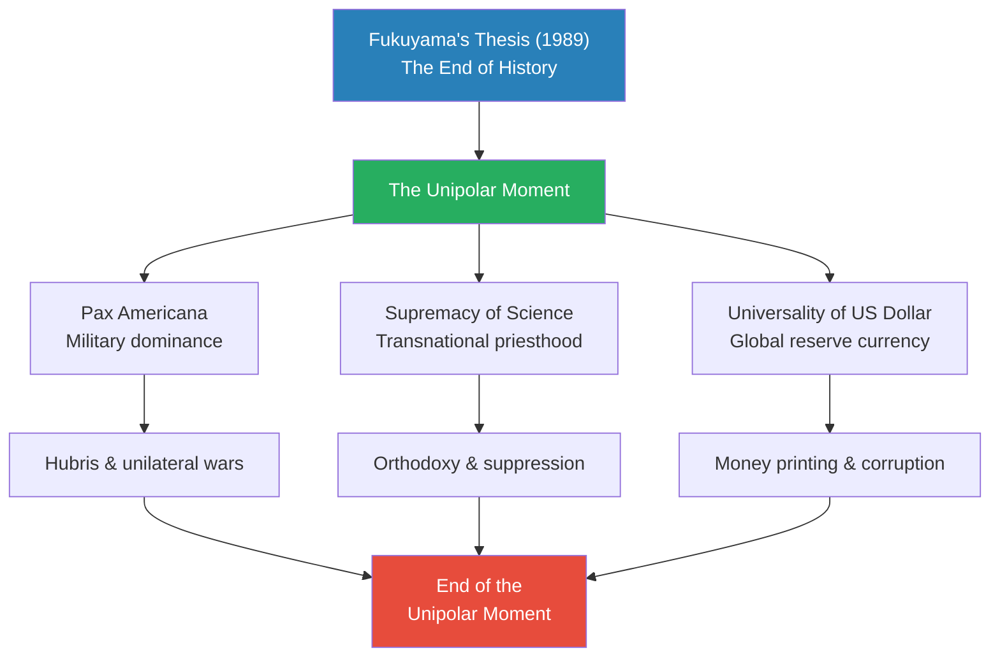
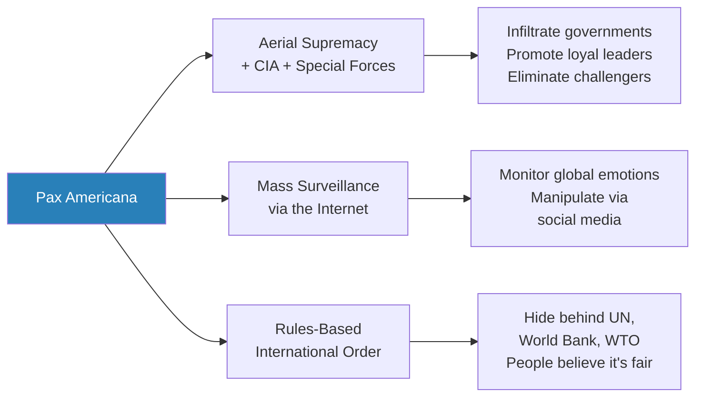
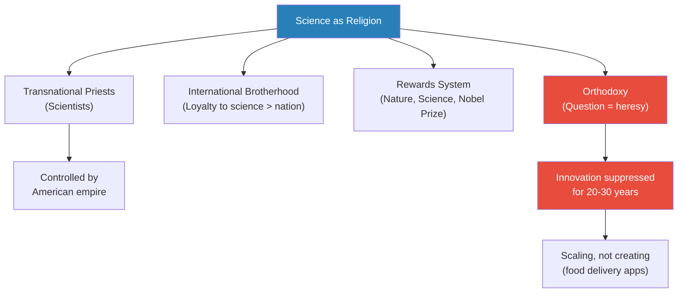
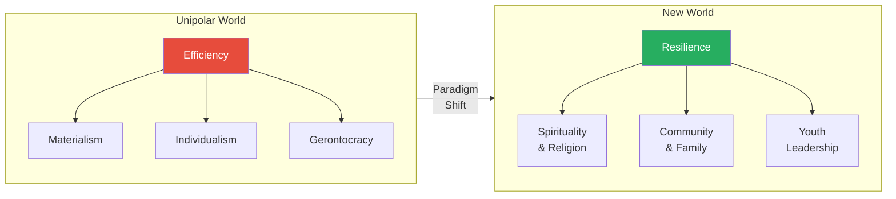
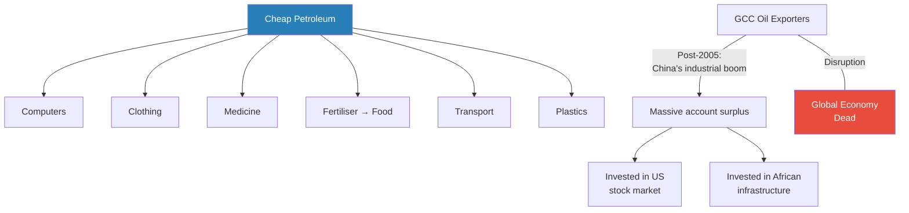
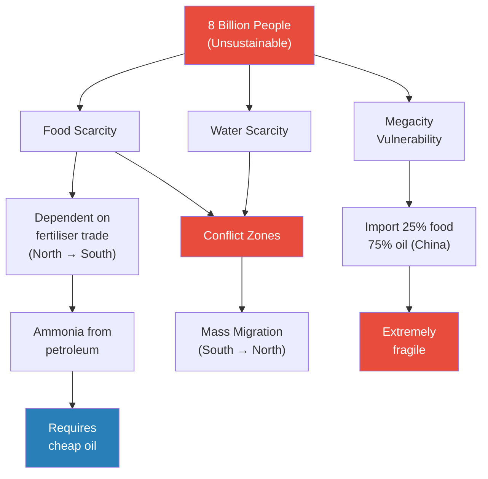
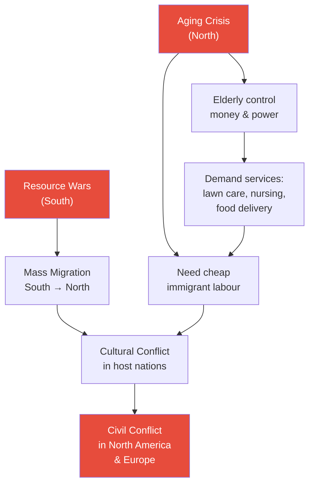
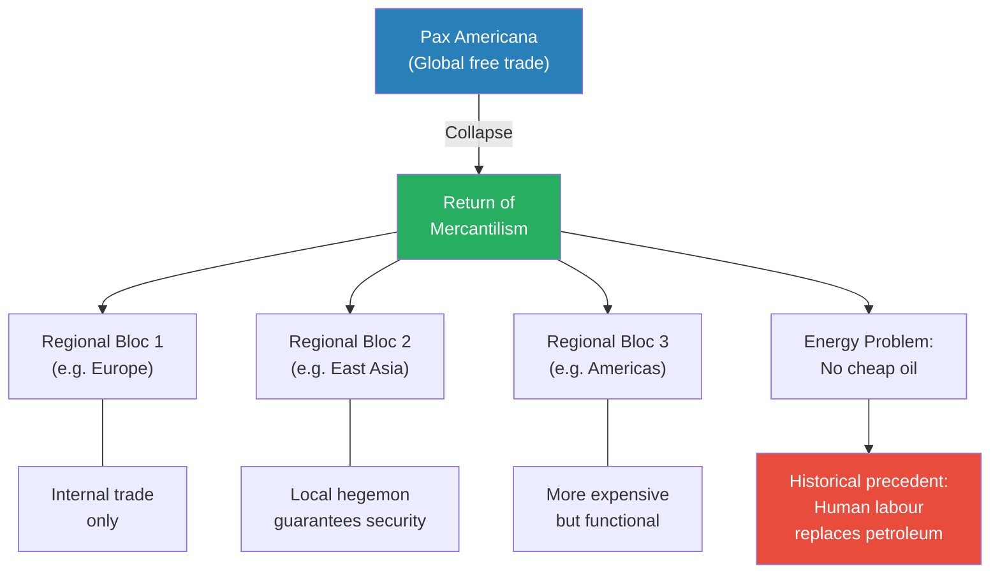
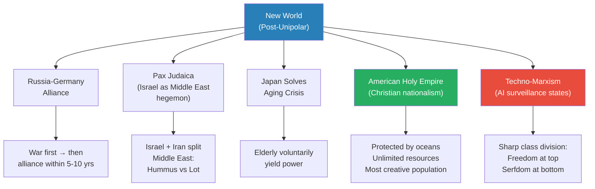

# The Return of History

> Prof. Jiang declares the Unipolar Moment dead. Francis Fukuyama's 1989 thesis — that liberal consumer democracy had won and history was over — has collapsed under the weight of American hubris, scientific orthodoxy, and a debased dollar. The war on Iran is not a single event but a symptom of systemic decay across all three pillars of Pax Americana. What follows is not a return to the old world but entry into a new one, where the organising principle shifts from efficiency to resilience, and nations that fail to make three fundamental transitions — from materialism to spirituality, from individualism to community, from gerontocracy to youth — will be eliminated.

---

## Overview: Key Highlights

- <b style="color: #2980b9">The Unipolar Moment</b> — Fukuyama's "End of History" thesis: liberal consumer democracy as the apex of civilisation, now collapsing
- <b style="color: #27ae60">Efficiency to resilience</b> — the defining shift of the coming era: stop optimising for profit and start optimising for survival
- <b style="color: #e74c3c">All three pillars of Pax Americana are decaying</b> — military hubris, scientific orthodoxy, and dollar debasement are mutually reinforcing
- <b style="color: #2980b9">Three survival transitions</b> — materialism to spirituality, individualism to community, gerontocracy to youth
- <b style="color: #e74c3c">Global food security depends on fertiliser trade</b> — ammonia from petroleum in the North sustains populations in the South, and any disruption means famine
- <b style="color: #27ae60">Japan may be the only nation capable of voluntary power transfer</b> — the aging crisis is a universal problem, but cultural obligation gives Japan a unique advantage
- <b style="color: #2980b9">Mercantilism</b> — the return of regional trading blocs replacing the globalised free-trade order
- <b style="color: #e74c3c">Megacities are fragile, not impressive</b> — concentrating populations in cities dependent on imported food and energy is the opposite of resilience
- <b style="color: #27ae60">America is best positioned for long-term survival</b> — two oceans, unlimited resources, creative population, and a potential Christian national renewal
- <b style="color: #2980b9">Pax Judaica</b> — Israel's strategic goal is to replace American hegemony in the Middle East and establish a regional order
- <b style="color: #e74c3c">Mass migration will accelerate 100x</b> — resource wars in the South will drive refugees north, creating cultural conflict in aging societies
- <b style="color: #2980b9">Techno-Marxism</b> — AI surveillance states will emerge to marshal limited resources, creating sharp class divisions

| Concept | One-line summary |
|---------|-----------------|
| **Unipolar Moment** | The post-Cold War era where America was the sole global hegemon — now ending |
| **Pax Americana** | American military, surveillance, and institutional power guaranteeing global peace |
| **Rules-based international order** | American power hidden behind multilateral organisations like the UN and WTO |
| **Scientific orthodoxy** | Science as a transnational religion that suppresses innovation rather than driving it |
| **Efficiency vs resilience** | The fundamental shift from maximising profit to surviving crises |
| **Gerontocracy** | Rule by the elderly — the baby boomers who control wealth and power and refuse to yield |
| **Mercantilism** | Regional trading blocs replacing globalised free trade — the historical norm |
| **Megacity vulnerability** | Cities over 10 million people are globalisation's product and its biggest liability |
| **Fertiliser dependency** | The South's food supply depends on ammonia from Northern petroleum — a single point of failure |
| **Pax Judaica** | Israel's strategic goal of becoming the Middle East's regional hegemon after American withdrawal |
| **Techno-Marxism** | AI surveillance states with sharp class divisions — freedom at the top, serfdom at the bottom |

---

# The Lecture

## Fukuyama and the End of History [0:00 - 2:00]

*Prof. Jiang opens by naming the lecture's central thesis: Francis Fukuyama's 1989 declaration that history had ended with the triumph of liberal capitalism is itself now history. The Unipolar Moment it described is over, and the war on Iran is the proof.*

> [!tip] Core Insight
> The war on Iran is not a decision by one man or one country. It is the symptom of an entire world order collapsing — the Unipolar Moment is ending, and everything built on it is coming apart.

*Fukuyama's thesis gave the Unipolar Moment its intellectual architecture — three pillars that each contained the seeds of their own decay, now converging into systemic collapse.*

> [!note]- Expand: Full Lecture Detail
> Prof. Jiang opens with a historical marker: "When the Berlin Wall fell, there was an American State Department official named Francis Fukuyama, and he wrote a very influential essay called *The End of History*." For decades, capitalism and communism had been locked in struggle. With capitalism's triumph, Fukuyama argued, humanity had discovered what it most strives for — <b style="color: #2980b9">a liberal consumer democracy</b>, where people feel empowered to buy whatever they want. This, for Fukuyama, was the apex of human civilisation.
>
> This created what Prof. Jiang calls <b style="color: #2980b9">the Unipolar Moment</b> — America as the sole global hegemon, presiding over a world that was "heavily globalised, capitalistic, and very individualistic." He frames it as genuinely unique in human history: no single power had ever dominated the entire globe before.
>
> He tells the class bluntly: "We've come with this Iran war to the end of this moment." The lecture's purpose is to explain what that ending means and what comes next.

---

## The Three Pillars of Pax Americana [2:00 - 9:00]

*Prof. Jiang breaks down the three mechanisms that sustained American global dominance — aerial supremacy backed by the CIA, mass surveillance through the internet, and a rules-based order that disguised empire as fairness — then shows how each pillar has rotted from within.*

*The three mechanisms of Pax Americana operated at different levels — military force for hard power, the internet for soft surveillance, and institutions for legitimacy — but all served the same function: invisible empire.*

> [!note]- Expand: Full Lecture Detail
> Prof. Jiang identifies three mechanisms of American global control:
>
> **Mechanism 1 — Aerial supremacy, Special Forces, and the CIA:**
> - The CIA infiltrated "every single government in the world" to identify and promote individuals loyal to the American empire
> - Those who challenged the empire were "demoted or eliminated"
> - Nations that proved problematic — Syria, Libya — faced Special Forces sabotaging their economies, followed by aerial bombardment destroying their governments
> - He acknowledges the upside: Pax Americana brought genuine peace to volatile regions — "Japan, South Korea, North Korea, China, Vietnam don't compete against each other, they just participate in the global economy," which brought tremendous wealth to East Asia
>
> **Mechanism 2 — Mass surveillance through the internet:**
> - Prof. Jiang delivers this with visible amusement: "The internet was created not to help you communicate and watch pornography. It was actually to have a mass surveillance system over the entire human population"
> - The Pentagon used the internet to monitor "the vibe or the culture, the attitudes, the emotions of each region"
> - Through social media — Facebook, Twitter — they were able to manipulate those emotions
>
> **Mechanism 3 — Rules-based international order:**
> - American power hid behind multilateral organisations — the United Nations, the World Bank, the World Trade Organisation
> - <b style="color: #e74c3c">"People didn't notice that the American empire was dominating everything. They believed that the world was fair and just"</b>
> - This legitimacy screen meant nations could present their case through "logic and reason and debate" — without realising the outcome was already shaped by American interests
>
> He then pivots to the decay. Each pillar contained its own corrosion:
>
> **Pillar 1 decay — Hubris:**
> - America began ignoring the rules-based order it had created
> - Bombing Libya and Syria without international approval, then attacking Iran "without even asking for the opinion of the world, not even caring what the world thought"
> - <b style="color: #e74c3c">"Maybe the first generation appreciates the importance of collaboration, of consensus, but the second generation, the children, are arrogant. They're hubristic. They want to enjoy their power."</b>
>
> **Pillar 2 decay — Scientific orthodoxy:**
> - Science became "the main engine of orthodoxy or suppression" rather than innovation
>
> **Pillar 3 decay — Dollar debasement:**
> - America's ability to print unlimited dollars funded corruption, widened inequality, and made people "very lazy"

---

## Science as the New Religion [4:30 - 9:17]

*Prof. Jiang uses the COVID vaccine response as proof that science has become a faith system — with transnational priests, international brotherhoods, and heresy charges for sceptics — then argues that this orthodoxy has killed genuine innovation for decades.*

> [!tip] Core Insight
> For the past twenty to thirty years, we have seen very little genuine technological innovation. Silicon Valley makes food delivery apps. What we have seen is the scaling and popularisation of existing technology, not the creation of new breakthroughs.

*Science evolved from a tool of discovery into a hierarchical faith — with its own priesthood, reward structure, and heresy enforcement — that now actively suppresses the innovation it was designed to produce.*

> [!note]- Expand: Full Lecture Detail
> Prof. Jiang tells a personal story to make the point visceral:
>
> > [!example] The COVID Vaccine Conversation
> > - When COVID vaccines were announced, Prof. Jiang expressed scepticism to friends, both Chinese and American
> > - He pointed out that vaccines normally take about ten years to develop, and that is when the virus is stable and well-understood
> > - COVID was constantly mutating, and insufficient trial research had been conducted
> > - The response from both Chinese and American friends was identical: "How dare you question science? You are a peasant. Have you gone to school? Have you no culture? Can you not think?"
> > - The uniformity of the reaction — across political systems, cultures, and languages — proved his thesis
> > **The lesson:** When questioning a claim is treated as moral failure rather than intellectual rigour, you are dealing with religion, not science.
>
> He extends the analogy:
> - Scientists are "transnational priests" — if you are a scientist in China, "you're not actually loyal to China, you're loyal to the international order of science"
> - Advancement comes through publication in *Nature* or *Science*, through the Nobel Prize — not through service to your own nation
> - <b style="color: #2980b9">The brotherhood of science</b> commands more loyalty than the nation state
> - And it is the American empire that controls this brotherhood
>
> On innovation, he is blunt: "Don't tell me Silicon Valley is a centre of innovation. All they do is make food delivery apps." What the past two to three decades have produced is not new science but the "scaling out, the popularisation of innovation" — American technology spread throughout the world, especially to China. Genuine scientific breakthroughs have stalled.

---

## The Universality of the Dollar and Its Corruption [7:30 - 9:17]

*Prof. Jiang marvels at the psychological power of a piece of paper that everyone in the world believes has value — then shows how the ability to print it without constraint has poisoned the system, creating inequality, corruption, and a generation that either quits or gambles.*

> [!note]- Expand: Full Lecture Detail
> Prof. Jiang describes the dollar's power with something close to wonder:
> - "Just a piece of paper, you think it's gold, you think there's value in it, and not just you, but everyone around you"
> - You can take US dollars anywhere in the world and buy a villa, take a vacation, fly around
> - People aspire to accumulate as many as possible — "Is there really a difference between 100 million dollars and a billion dollars? There's no difference. You can't spend it. But you want to achieve as much as possible"
>
> The corruption follows inevitably:
> - America can print as much as it wants to fund its corruption, so it does
> - The dollar has lessened in value, making inequality worse
> - <b style="color: #e74c3c">The young have two responses: quiet quitting or gambling</b>
> - "No matter how hard I work, I'm still screwed in the end, because the boomers have so much more money than I do, I can never catch up"
> - So they either refuse to play — "quiet quit" — or they gamble: Bitcoin, the stock market, sports betting
> - "That's why in America, gambling has become so popular"

---

## The Paradigm Shift: From Efficiency to Resilience [10:00 - 15:00]

*Prof. Jiang names the defining shift of the coming era — the move from maximising profit under optimistic assumptions to surviving crises under pessimistic ones — and lays out the three transitions every society must make or face elimination.*

> [!tip] Core Insight
> The idea of efficiency is: imagine the best-case scenario and make as much money as possible. The idea of resilience is: imagine the worst-case scenario and see if you can survive it.

*The three transitions map onto each other perfectly — each pillar of the efficiency world has a corresponding pillar in the resilience world, and each requires the reversal of a deeply held modern assumption.*

> [!note]- Expand: Full Lecture Detail
> Prof. Jiang frames the shift with stark clarity: "For a nation, for a community to survive in the future, there are three major changes. If you're able to make these three major changes, you will survive. If you do not make these changes, you will be eliminated. It will be survival of the fittest."
>
> **Transition 1 — Materialism to Spirituality:**
> - Nation states currently buy obedience through material provision: "If you are driving a car, if you have a house, if you have enough food to eat, then you should shut up and obey"
> - In the future, governments cannot do this because resources will not go around
> - Instead, governments must convince people that "what matters is your happiness, your well-being, your spirituality"
> - <b style="color: #27ae60">This usually means a renewed focus on religion</b>
>
> **Transition 2 — Individualism to Community:**
> - Today's teaching: "What matters is you, me, the ego. If it's doing well for me, it's good. I don't actually care about other people"
> - In the future: "You have to focus on building community, on helping others"
>
> **Transition 3 — Old to Young:**
> - <b style="color: #e74c3c">The hardest transition of all</b> — wealthy Western nations are controlled by baby boomers who have all the money, all the power, and access to the best healthcare
> - They are living to 100, enjoying life, and "really selfish"
> - The young cannot develop the experience and expertise to lead because the old will not step aside
> - "Historically, we've never ever faced this problem before — the old simply didn't live that long"
> - Prof. Jiang predicts Japan will solve this first, because the problem is most acute there — "the oldest population in the world" — and Japanese elderly have a stronger cultural obligation to the nation
> - "Japan may be the only nation that would do this voluntarily. Every other nation basically has to have wars in order for the young to arise to power"

---

## The Petroleum Foundation of Everything [15:00 - 19:00]

*Prof. Jiang forces the class to look around the room and realise that every object they can see — the computer, the carpet, the clothing, the pad, the medicine, the food — is a petroleum product, and asks what happens when it is no longer cheap.*

*The global economy rests on a single foundation — cheap petroleum — and the two pillars that distribute it (GCC exports and Chinese industrial demand) are both under threat from the war and its aftermath.*

> [!note]- Expand: Full Lecture Detail
> Prof. Jiang makes the class look around: "Your computer is based on what? Petroleum. This carpet — petroleum. This clothing — petroleum. The medicine you eat — petroleum. The food you eat comes from fertilisers, which is also based on petroleum. Everything in this room, everything in the world, is based on cheap petroleum."
>
> He turns to the GCC countries and the chart showing their massive account surpluses beginning around 2005:
> - He asks the class why — what happened in 2004-2005 that made these countries extraordinarily wealthy
> - The answer: <b style="color: #2980b9">China's industrial boom</b> — in the 1980s and 1990s China was building factories, then wanted to develop its industrial base by importing oil from the GCC
> - The GCC took the money and invested it back into the American stock market and African infrastructure
> - "The Chinese economy and the GCC are the two main pillars of the entire global economy"
> - If the GCC can no longer export oil, the impact on China is massive, and together they crash the global economy
> - "Basically, the global economy is dead"
>
> He then walks through the infrastructure of globalisation that people take for granted:
> - **Flights:** In 1950, flying was an "unbelievable luxury — you had to be a millionaire." Now anyone can book a flight on their phone and be somewhere by morning. This happened in the past 30-40 years, entirely because Pax Americana guaranteed no conflict — "otherwise you'd be shot down." In the future, flights will be expensive and vacations unaffordable.
> - **The internet:** Not wireless signals from the sky, but undersea cables connecting the world. There is a war happening right where those cables run, and "it's really easy for Iran to cut off the undersea cables, which would lead to internet disruption for maybe 20-30% of the world." The entire world economy runs on the cloud — banking, finance, everything. Cable disruption means economic chaos.

---

## Food, Water, and the 8-Billion-Person Problem [22:00 - 30:00]

*Prof. Jiang presents the collision between unsustainable population growth and fragile supply chains — showing that the fertiliser trade from North to South is the only thing keeping billions alive, and that food security, water scarcity, and lack of freedom form a mutually reinforcing crisis triangle.*

> [!tip] Core Insight
> The idea of efficiency is: imagine the best-case scenario and try to make as much money as possible. The idea of resilience is: imagine the worst-case scenario and see if we can survive it. If you have food security issues, you are facing a massive problem.

*Every arrow in this diagram points toward the same conclusion: the global system was built for efficiency, not resilience, and the population it sustains cannot survive the disruption of any single link in the chain.*

> [!note]- Expand: Full Lecture Detail
> **Population:**
> - After World War Two, Pax Americana enabled a massive boom in population
> - "It is not possible for the planet to sustain 8 billion people, many of whom want to fly around the world twice a year, drive an SUV, have food anytime, have cherries every single day"
> - <b style="color: #e74c3c">When a correction comes, it will be extreme</b> — "if there's a crisis, the population will see a massive shrinkage"
> - The mechanism: food scarcity
>
> **Fertiliser dependency:**
> - Prof. Jiang shows a map: the yellow zones need fertiliser to grow food — their land is poor for farming but their populations are large (Africa, Central Asia, parts of South America)
> - <b style="color: #2980b9">Ammonia</b> — the chemical produced from petroleum that is fundamental to fertilisers — is produced mainly in the North
> - "What allows for 8 billion people is the fact that the North is able to export fertiliser to the South, and that's it"
> - If this trade stops, "people in the South would be in a lot of trouble"
> - He shows a colour-coded map: green means safe, red means extreme danger — "if you are in the red, you are in a lot of trouble"
> - China is not in the green
>
> **Water scarcity:**
> - Many countries with food scarcity also suffer from water scarcity
> - Prof. Jiang says water is "far more problematic than food"
> - The same vulnerable belt — Africa, Middle East, Central/South Asia — faces both crises simultaneously
>
> **Freedom and resilience:**
> - Freedom matters for resilience because "when there's a crisis, leaders and the population need to collectively make sacrifices"
> - Without transparency and accountability, "the leadership could possibly make selfish, self-defeating decisions, and the public is not involved"
> - The public then "refuses to make sacrifices necessary to make the nation survive"
> - Countries that suffer most from food and water issues are also the most likely to descend into conflict
>
> **Megacities:**
> - Cities over 10 million people exist because of globalisation — they concentrate populations in specialised industrial zones that export to the world
> - Most megacities are in India and China — both of which suffer from food and water issues
> - <b style="color: #e74c3c">"If you are to be resilient, you actually want most of your population not in cities but in the countryside, growing food"</b>
> - China imports a quarter of its food and 75% of its oil — the opposite of resilience
> - "If you're a national leader, you should be worried right now"

---

## Migration, Aging, and the Coming Cultural Wars [30:00 - 37:00]

*Prof. Jiang traces the inevitable chain: resource wars in the South produce refugees, refugees flow north, but the North needs them because its own populations are aging — and this dependency creates cultural conflict that will tear open Western societies from the inside.*

*The North faces a structural trap: it cannot survive without importing labour from the South, but importing that labour creates the internal conflict that destabilises it. There is no exit from this loop within the current system.*

> [!note]- Expand: Full Lecture Detail
> **Migration trends already visible:**
> - People from Africa and the Middle East are moving to Europe
> - People from South America and Latin America are moving to the United States
> - These trends will "not only continue but accelerate by maybe 100 times"
> - Building walls is the obvious response — "Europe and North America should right now build a wall, because you're going to see a massive influx of refugees"
>
> **But the aging crisis makes walls impossible:**
> - In 2020, countries in purple already had significant elderly populations
> - By 2050, "the entire northern hemisphere will have a significant elderly population"
> - <b style="color: #e74c3c">The industrial economies are aging rapidly, and their only option is to bring in "cheap, desperate workers from the South who are fleeing conflict zones"</b>
> - The elderly want people to "mow their lawns, nourish them, deliver food to them"
> - Young native-born citizens will not do this work because "their parents have money"
> - The only workaround is importing cheap immigrant labour
>
> **Cultural conflict:**
> - "The local populations, native populations, will feel they're being replaced by these refugees and immigrants"
> - This will "probably lead to civil conflict within North America and within Europe"
> - Prof. Jiang states flatly: "Unfortunately, there's really no way around this issue"

---

## The Return of Mercantilism [33:00 - 37:00]

*Prof. Jiang explains that the post-Pax Americana world will not end trade but will replace the single globalised system with regional trading blocs — the same mercantile pattern that governed most of human history — and notes that slavery was an integral part of that system because human labour replaces petroleum as the cheap energy source.*

*The global trade system was historically abnormal — the norm was regional blocs with a local hegemon. The disturbing implication is that without cheap petroleum, history suggests human beings become the replacement energy source.*

> [!note]- Expand: Full Lecture Detail
> Prof. Jiang takes the class back to the 16th and 17th centuries:
> - The British, Portuguese, French, and Spanish each had their own trade networks and "refused to work with each other, but the system worked fine"
> - It was more expensive and less convenient, but it functioned
> - "This does not mean the end of global trade. It just means much more limited global trade"
> - Each region had a local hegemon that guaranteed trade among its allies
>
> He then raises the uncomfortable parallel:
> - "Another thing you will notice about the Asian economies is slaves. Slaves were a very important part of the trade"
> - "You need energy to arrange society. Today we use oil. Back then they used human beings"
> - <b style="color: #e74c3c">"If you can no longer have access to cheap oil, what you do is you enslave people — and that's why, historically, we've done this"</b>
>
> He also addresses religion's role in the future:
> - Resilience requires people to "focus more on spirituality and less on materialism"
> - Countries in the grey on the religion map — non-religious, too materialistic — will struggle
> - <b style="color: #e74c3c">East Asia — Japan, China, Korea, Vietnam — is "especially non-religious" and this will be a problem for them in the future</b>

---

## The Trends: A Summary of the Coming Decades [37:39 - 42:00]

*Prof. Jiang delivers a rapid-fire list of the major trends he expects over the next ten to twenty years, framing each as an inevitable consequence of the Unipolar Moment's collapse, and explicitly warns the class against the fantasy that normality will return.*

> [!note]- Expand: Full Lecture Detail
> Prof. Jiang addresses the class directly: "If you really believe that next week Donald Trump and Iran are going to come to a peace agreement — if you believe that in five or six months both sides will exhaust themselves and the global economy will make them stop — I don't know what to tell you. You're living in a fantasy world."
>
> The trends he lists:
>
> - **De-industrialisation and de-urbanisation:** people will move from cities back to the countryside, especially young people — "learn how to milk a cow or kill a chicken or grow food, whatever — actual useful skills for your life"
> - **Nationalism and re-militarisation:** nations must get young people willing to fight and defend their land — "whichever nations are most ready and able to excite their young population into fighting will be most resilient"
> - **Mercantile systems:** independent regional trading blocs
> - **Resource wars:** competition over water and food
> - **Famines, genocide, slavery:** "If you don't have access to cheap oil, then you enslave human beings. This is not a pretty future, but it is a future that could happen"
> - **Mass migration:** people from the South escape to Europe and North America
> - **Revolution and civil wars:** in America and Europe, driven by inequality, corruption, and the gerontocracy's refusal to yield
> - **Religion:** "If you are not religious, I actually recommend looking into the possibility of a government religion"

---

## The Geopolitical Futures [42:00 - 47:00]

*Prof. Jiang sketches five specific geopolitical scenarios he sees emerging over the next ten to fifty years — a Russian-German alliance, Pax Judaica in the Middle East, Japan solving the aging crisis, an American Holy Empire, and the rise of Techno-Marxism.*

*Five visions of the post-unipolar world — each representing a different civilisational response to the same crisis. Prof. Jiang bets on America's survival and Japan's adaptability, while warning that Techno-Marxism may be the default for nations with resources but no freedom.*

> [!note]- Expand: Full Lecture Detail
> **1. Russia-Germany Alliance:**
> - For the next five to ten years, Germany and Russia may go to war
> - But eventually "what the two will figure out is it's better to actually work together than fight each other"
>
> **2. Pax Judaica:**
> - "The entire point of this war in Iran, from Israel's perspective, is to knock out America from the Middle East and establish yourself as the local hegemon"
> - If America were to leave, Israel and Iran would find a way to coexist
> - "Israel is like, I don't want Persia, and Iran is like, I don't want Israel"
> - Israel has nuclear weapons, so they would agree to split the Middle East
> - Historically, "the Israelis, the Jewish people — they hated the Greeks, they hated the Romans, but they actually got along with the Persians"
> - The place outside Israel with the largest Jewish population is Iran — "and they're very well treated there"
>
> **3. Japan:**
> - The major problem facing all Western industrial nations is aging
> - Japan is uniquely positioned because "the elderly have more obligation to the nation, to the people"
> - It could be that "the elderly voluntarily choose to exit power and give it to the young"
> - <b style="color: #27ae60">"Japan may be the only nation that would do this voluntarily"</b>
>
> **4. The American Holy Empire:**
> - <b style="color: #27ae60">America is the nation most capable of surviving the next few decades of tribulation</b>
> - Protected by two oceans, controls Canada and Mexico, unlimited resources, unlimited population
> - "Americans are the most creative, most entrepreneurial, most energetic people in the world"
> - But America will need a new identity — shifting from secular Pax Americana to something "much more nationalistic, more focused on community and nation"
> - <b style="color: #2980b9">Christianity will be the force that rebuilds America</b> after its crises
>
> **5. Techno-Marxism:**
> - Nations with resources will institute <b style="color: #2980b9">AI surveillance states</b> to better marshal limited resources and control populations
> - Sharp class division: "At the very top you have freedom, but people at the very bottom become slaves or serfs"

---

## Q&A: The Dynamic New World [46:57 - 49:16]

*A student asks whether the relationships between major powers — China, Japan, and others — will be permanently redrawn. Prof. Jiang responds that the new world will be defined by constant flux, not stable alliances.*

> [!note]- Expand: Full Lecture Detail
> A student asks whether country relationships will all change — China and Japan, the other major powers.
>
> Prof. Jiang responds:
> - "The best way to understand the geopolitical situation is that it's constantly in flux — constantly dynamic"
> - "You cannot easily divide nation states into enemies anymore"
> - Alliances will shift constantly, and the nation-state system itself may fragment into city-states
> - He compares it to China during the Warring States period or the 1930s world
> - In East Asia, perhaps Vietnam, Japan, South Korea, the US, and Russia combine to contain China initially — "but then Japan's rising in power, so let's combine against Japan"
> - <b style="color: #27ae60">"Everything you've been taught in school, everything you understand about the world, everything you believe to be true — will change. You have to open your mind and be ready for constant political flux."</b>
>
> He closes by previewing the next lecture: "What I'll do next class is examine how this war between the United States and Iran will eventually end."

---

## Connections

**Builds on:** [[09 - The US-Iran War]] (the war that signals the Unipolar Moment's end), [[07 - America's Game]] (the petrodollar system and Bretton Woods institutions now collapsing), [[06 - The World's Bank]] (over-financialisation as the West's self-inflicted poison)
**Sets up:** [[16 - Pax Judaica Rising]] (Israel's regional hegemony after American withdrawal)
**Related lectures:** [[05 - The World Game]] (Ibn Khaldun's asabiyyah and civilisational lifecycle — the theoretical framework for why empires decay), [[08 - Communist Specter]] (the false dialectic and Wall Street's role in shaping global systems)
**Related books in vault:** [[Sapiens - Yuval Noah Harari]] (the agricultural revolution and its discontents), [[The End of the World Is Just the Beginning - Peter Zeihan]] (deglobalisation and the return of geography)

---

## The Takeaway

This lecture is Prof. Jiang's most sweeping — a panoramic view of the entire global system from above, showing not individual moves on the board but the board itself breaking apart. The core argument is structural, not political: the Unipolar Moment was not stable, because each of its three pillars — military supremacy, scientific authority, and dollar hegemony — contained a self-destruct mechanism that activated within a single generation. Hubris replaced restraint, orthodoxy replaced inquiry, and money printing replaced productivity. The war on Iran is not the cause of the collapse but the moment when the collapse became undeniable.

The most provocative claim is the resilience framework. Prof. Jiang argues that the three transitions — materialism to spirituality, individualism to community, gerontocracy to youth — are not preferences but survival requirements. Nations that fail to make them will be "eliminated." The aging crisis is particularly striking: for the first time in history, the old are living long enough and holding enough wealth to block the generational transfer that every previous civilisation achieved through natural attrition. Japan's potential to solve this voluntarily is presented as a genuine exception, not an optimistic prediction for the world.

What remains open is whether the future Prof. Jiang describes is inevitable or conditional. He presents it as inevitable — "you will adapt or you will die" — but the range of scenarios he sketches (American Holy Empire, Techno-Marxism, Pax Judaica, Russian-German alliance) suggests that human agency still determines the specific form the new world takes. The question the lecture leaves unresolved is the one it opens with: if Fukuyama was wrong that history ended, is Prof. Jiang right that it is returning? Or is something genuinely unprecedented happening — a crisis for which there is no historical template?
