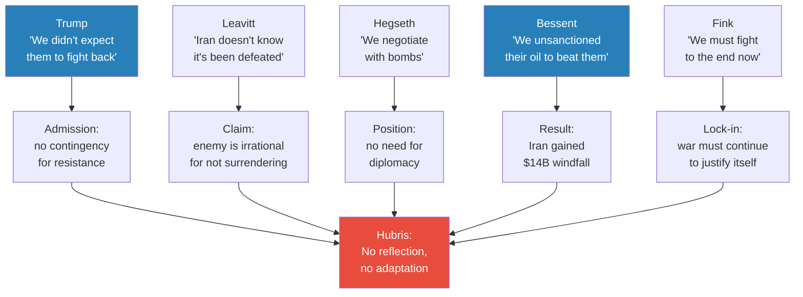
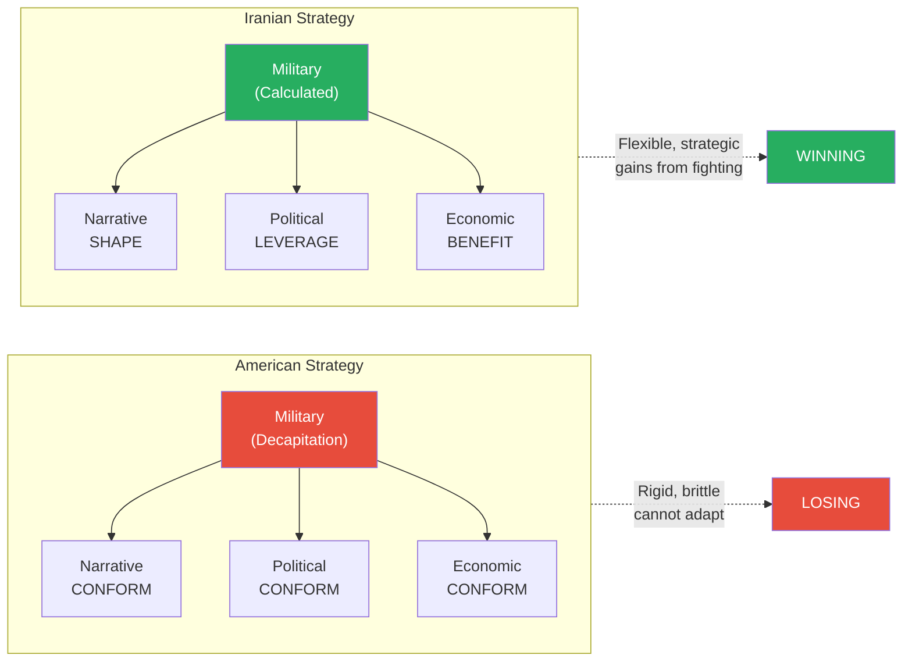
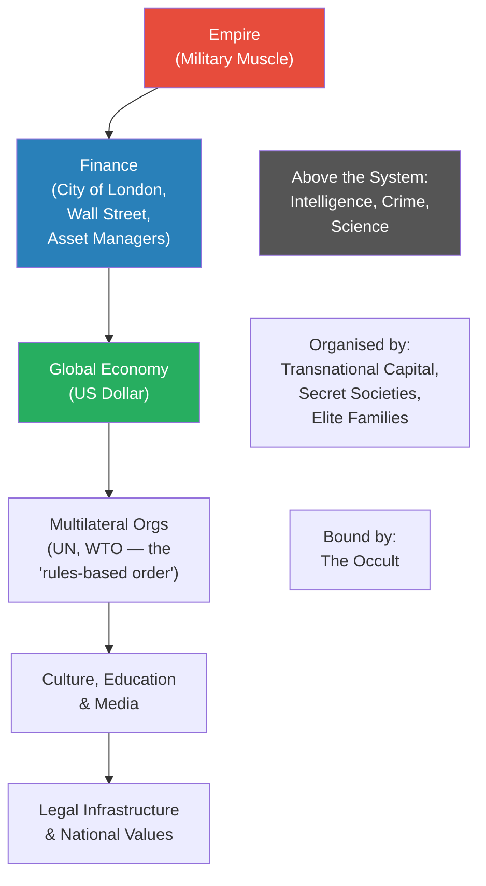
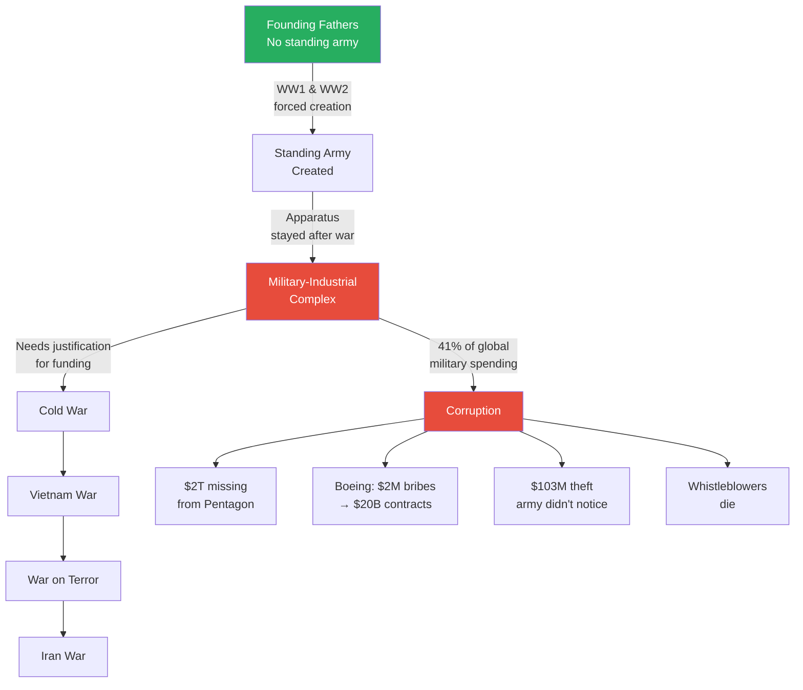
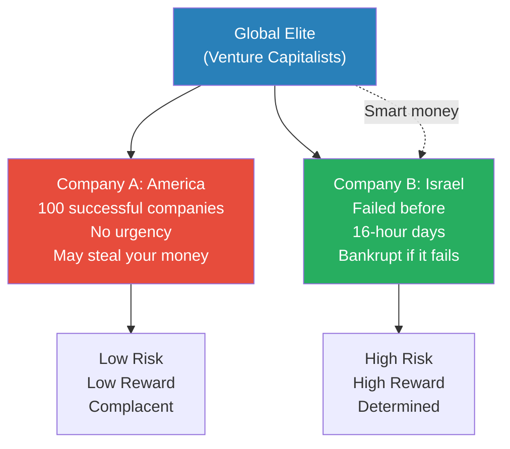
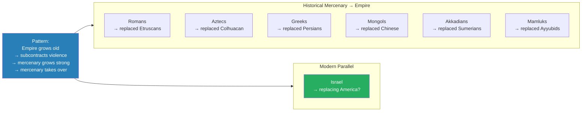
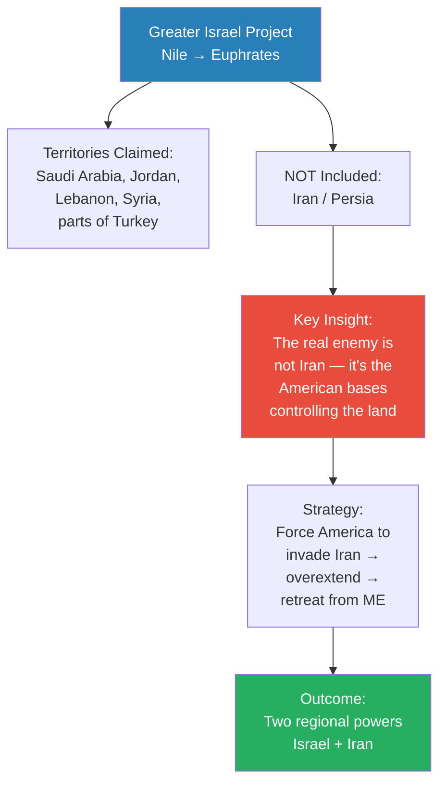
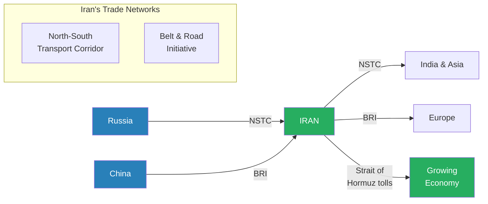
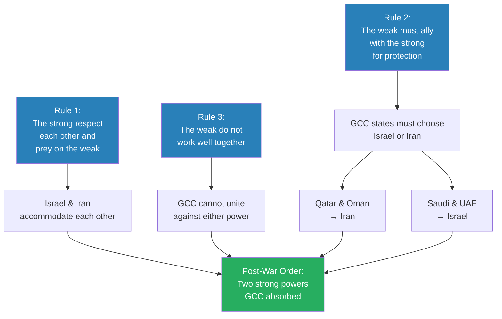

# Pax Judaica Rising

> Prof. Jiang opens with a barrage of clips from Trump, his press secretary, the Pentagon chief, the Treasury Secretary, and BlackRock's Larry Fink -- each claiming the US-Iran war is going well -- and then dismantles every claim. He argues the American empire is losing the war because of hubris, a corrupt military-industrial complex, and three fatal constraints: lack of political will, lack of manufacturing capacity, and unwillingness to sustain casualties. The lecture's central thesis follows: the global elite need an empire to provide muscle, and Israel is auditioning to replace America by demonstrating the unity, capacity, and determination that America lacks. Prof. Jiang maps out what a post-war Middle East looks like under Pax Judaica -- the Greater Israel project, control of oil and gas, AI surveillance dominance, and the India-Middle East-Europe trade corridor -- while Iran emerges as the other regional power via the Belt and Road Initiative and the North-South Transport Corridor. He closes with three rules of geopolitics that predict an eventual Israel-Iran accommodation at the expense of the weak Gulf states.

---

## Overview: Key Highlights

- <b style="color: #e74c3c">American hubris is losing the war</b> -- the US forces the narrative, political, and economic spheres to conform to a failing military strategy instead of adapting
- <b style="color: #27ae60">Israel is auditioning to replace America as the empire</b> -- demonstrating unity, low-cost operations, and willingness to sustain casualties that America cannot match
- <b style="color: #2980b9">Military-Industrial Complex (MIC)</b> -- the apparatus that survives by starting wars, not winning them, transferring taxpayer money to transnational elites
- <b style="color: #e74c3c">$2 trillion missing from the Pentagon</b> -- Rumsfeld announced the unaccounted funds the day before 9/11, illustrating systemic military corruption
- <b style="color: #2980b9">The Greater Israel Project</b> -- the biblical territorial claim from the Nile to the Euphrates that frames Israel's strategic ambitions in the Middle East
- <b style="color: #27ae60">Iran's strategy reverses America's</b> -- Iran uses military action to strengthen its economy, politics, and narrative, while America sacrifices all three to serve a failing military plan
- <b style="color: #2980b9">Three rules of geopolitics</b> -- the strong respect each other and prey on the weak; the weak ally with the strong for protection; the weak do not work well together
- <b style="color: #e74c3c">America's three fatal constraints</b> -- lack of political will (only 40% support), lack of manufacturing capacity, and unwillingness to sustain casualties
- <b style="color: #27ae60">The war delivered Iran de facto sanctions relief</b> -- Iran is now embedded in the global economy, making it less incentivised to end the war
- <b style="color: #2980b9">India-Middle East-Europe Corridor (IMEC)</b> -- the trade network that positions Israel as the epicentre of global trade connecting Asia, Europe, and Africa
- <b style="color: #27ae60">The mercenary-to-empire pattern repeats throughout history</b> -- Romans, Aztecs, Greeks, Mongols, Akkadians, and Mamluks all began as mercenaries before replacing their masters
- <b style="color: #2980b9">AI surveillance as imperial backbone</b> -- Israel's data centre advantage and human capital position it to control the Middle East's surveillance infrastructure

| Concept | One-line summary |
|---------|-----------------|
| **Military-Industrial Complex (MIC)** | The apparatus that profits from perpetual war, not victory -- transferring public money to private contractors |
| **Pax Judaica** | The thesis that Israel will replace America as the empire providing muscle for the global elite's system |
| **Greater Israel Project** | Biblical territorial claim from the Nile to the Euphrates driving Israeli strategic ambition |
| **Four dimensions of war** | Narrative, political, economic, and military -- the spheres across which wars are actually fought |
| **Hubris** | The fatal refusal to reflect, adapt, or acknowledge failure -- America's core strategic weakness |
| **The mercenary pattern** | Historical cycle where empire subcontractors grow strong enough to replace their masters |
| **Three rules of geopolitics** | The strong respect each other; the weak ally with the strong; the weak cannot cooperate effectively |
| **North-South Transport Corridor** | Russian-Iranian trade route linking Russia to India and Asia through Iran |
| **IMEC** | India-Middle East-Europe Corridor positioning Israel at the centre of intercontinental trade |
| **Decapitation strategy** | America's approach of destroying enemy leadership and economy to force surrender |
| **De facto sanctions relief** | The unintended consequence of war: Iran's oil is now flowing freely to global markets |
| **Venture capitalist analogy** | The global elite as investors choosing between a complacent incumbent (America) and a desperate challenger (Israel) |

---

# The Lecture

## The American War Machine on Display [0:00 - 8:56]

*Prof. Jiang opens by playing five video clips back-to-back -- Trump, press secretary Karen Leavitt, Pentagon chief Pete Hegseth, Treasury Secretary Scott Bessent, and BlackRock CEO Larry Fink -- each presenting a different face of American confidence. He then dismantles every claim, revealing a pattern of denial, improvisation, and strategic incoherence.*

> [!tip] Core Insight
> Every American official claims the war is going according to plan, but each reveals a different plan -- and none of them account for the enemy fighting back.

*Each official's statement, intended to project strength, inadvertently reveals a different failure -- and all five converge on the same underlying problem: hubris prevents reflection.*

> [!note]- Expand: Full Lecture Detail
> Prof. Jiang plays a clip of Trump acknowledging the US was shocked that Iran fought back: "We hit Qatar, Saudi Arabia, UAE, Bahrain, Kuwait. Nobody expected that. We were shocked." Prof. Jiang translates: the Americans went in expecting to decapitate the leadership and force surrender. They had no plan for an enemy that actually resists.
>
> - <b style="color: #e74c3c">The press secretary Karen Leavitt</b> frames the problem as Iranian irrationality: "Iran fails to accept the reality of the current moment... they have been defeated militarily." Prof. Jiang's reading: the administration cannot process the possibility that their strategy has failed, so they blame the enemy for not surrendering on cue.
>
> - Pentagon chief Pete Hegseth declares: "Never in history has a modern military been so rapidly and historically obliterated." He adds: "We negotiate with bombs." Prof. Jiang notes this is the military's position: we are winning, there is no need for diplomacy, we will continue bombing until they submit.
>
> - Treasury Secretary Scott Bessent addresses the oil crisis caused by Iran closing the Strait of Hormuz. His plan: unsanction Russian and Iranian oil to flood the market and keep prices down.
>   - Prof. Jiang delivers the punchline: "The Americans basically unsanctioned Iranian oil. Because of that, the Iranians were able to make $14 billion just like that. The total Iranian military budget for one year is $10 billion."
>   - The "brilliant plan" to destroy Iran financially ended up funding Iran's entire military budget in one stroke
>
> - BlackRock's Larry Fink tells the BBC: if the war stops now, oil will stay above $100-150 for years, causing global recession. Therefore, the war must continue to the end. Prof. Jiang's observation: "What he doesn't address is, if you didn't start this war in the first place, you wouldn't have this problem."
>
> - The final clip shows an Iranian proxy drone flying over an American base in Iraq, spotting two helicopters, and destroying one. No air defences stop it. "Meaning that you have all these American bases throughout the Middle East, and they are vulnerable. They cannot be protected against cheap drones."

---

## Two Strategies of War: America vs Iran [8:56 - 18:39]

*Prof. Jiang introduces his four-dimensional model of war -- narrative, political, economic, and military -- and shows that America and Iran are fighting in completely opposite ways. America forces everything to serve its military strategy. Iran uses its military to serve everything else. The difference explains why one is winning and the other is losing.*

*The arrows tell the story: America's strategy flows one way (military dictates all), while Iran's strategy uses military action to improve its position across all other dimensions simultaneously.*

> [!note]- Expand: Full Lecture Detail
> Prof. Jiang introduces his <b style="color: #2980b9">four dimensions of war</b>:
>
> - **Narrative** -- global opinion, how history will perceive this war
> - **Political** -- how allies and the domestic base perceive the war
> - **Economic** -- impact on trade, oil, the global economy
> - **Military** -- the actual battlefield operations
>
> **The American approach:**
> - The military strategy is <b style="color: #2980b9">decapitation</b>: destroy Iranian leadership, destroy the Iranian economy, force surrender, dictate terms
> - Everything else must conform to this strategy
>   - Politically: Trump ordered NATO to open the Strait of Hormuz; he refuses to acknowledge the war is unpopular at home
>   - Economically: they unsanctioned Russian and Iranian oil to keep prices low -- which benefits enemy economies
>   - Narratively: Trump threatened journalists with prison if they do not report the war as going well
>
> **The Iranian approach:**
> - The military is used strategically to benefit the other three dimensions
>   - Economically: Iran controls the Strait of Hormuz selectively -- Chinese ships pass (China is the main buyer of Iranian oil), plus Japan, Qatar, and Oman if they cooperate
>   - Politically: Iran is trying to split the GCC -- Saudi Arabia and UAE are committed to regime change, but Qatar and Oman are wavering
>   - Narratively: Iran shapes global opinion to make itself appear on the right side of history -- "you have a lot of Americans who are rooting for the Iranians to win"
>
> **Three consequences of the strategic difference:**
>
> - <b style="color: #e74c3c">Reflection</b> -- America cannot sit down with its strategists and honestly assess how the war is going, because the military strategy is treated as infallible. Iran can, because its military must adapt to serve economic and political goals.
>
> - <b style="color: #e74c3c">Flexibility</b> -- when the military strategy is not working, America doubles down: more bombing, or potentially sending ground troops ("which most military analysts believe to be either counter-effective or suicidal"). Iran adapts: they are now charging tolls to cross the Strait of Hormuz.
>
> - <b style="color: #27ae60">Resilience</b> -- America forces its allies, economy, and public to support a failing strategy, so support erodes. Iran is winning popular opinion, strengthening its economy, and gaining political allies, so it can draw on increasing support and recruit foreign fighters.
>
> Prof. Jiang's conclusion: "I believe that America is losing this war, and that ultimately this war will be lost. When this will happen, we don't know, because America is an empire, and they can drag this on for at least 20 years."

---

## The Structure of the World [18:39 - 21:00]

*Prof. Jiang revisits the layered model of global power introduced in previous lectures -- empire at the core, finance as game masters, the global economy built on the dollar, multilateral organisations as the facade, and culture/education/media as justification -- to set up his central argument: what happens when the empire at the core fails.*

*The empire is the foundation -- if it falls, every layer above it is threatened. The entire system's interest is maintaining the status quo, which means replacing a failing empire rather than letting the structure collapse.*

> [!note]- Expand: Full Lecture Detail
> Prof. Jiang recaps the world-system model from previous lectures:
>
> - At the core: the <b style="color: #2980b9">Empire</b>, which provides the military muscle to shape reality
> - Around it: <b style="color: #2980b9">Finance</b> -- City of London, Wall Street, Bank for International Settlements, asset managers -- "the game masters"
> - This creates the <b style="color: #2980b9">global economy</b>, based on the US dollar
> - To make the game appear fair, you create <b style="color: #2980b9">multilateral organisations</b> -- the UN, WTO -- "what the Americans like to call the rules-based international order"
> - "You hide the finance and the Empire behind multilateral organisations"
> - The justification layer: culture, education, and media, which create the legal infrastructure and values of nations
>
> Above the system, operating across national boundaries: intelligence, crime, and science. These are organised by transnational capital, secret societies, and elite families, bound together by what Prof. Jiang calls "the occult" -- a concept he promises to study later.
>
> The critical point: "All these players are interested in maintaining the status quo." If the empire at the core falls, the entire edifice could collapse. "So the only solution is to replace the Empire."

---

## Why the American Empire Is Falling [21:00 - 33:27]

*Prof. Jiang traces America's decline to the military-industrial complex -- a standing army that was never supposed to exist, which now exists solely to perpetuate itself through endless wars. He presents the corruption data, the contractor grift, the Boeing scandal, and the $103 million theft that the army did not even notice, before identifying three fatal constraints that will lose America the war in Iran.*

> [!tip] Core Insight
> The purpose of the American military is not to win wars. It is to transfer taxpayer money to a transnational elite through never-ending wars. Victory would end the revenue stream.

*The American military was designed to be temporary. Once it became permanent, the incentive shifted from winning wars to starting them -- each new conflict justifying the next budget increase.*

> [!note]- Expand: Full Lecture Detail
> Prof. Jiang explains that for most of its history, America did not have a professional army. The Founding Fathers and most citizens believed a standing army was a direct threat to liberty -- "because the Americans fought a war, the Revolutionary War, to get rid of the professional army that was the British."
>
> - World War One and Two forced America to create a standing army
> - After winning World War Two, the apparatus stayed -- and wanted to maintain access to unlimited government funds
> - This led to the Cold War as justification for the <b style="color: #2980b9">military-industrial complex (MIC)</b>
> - Government military expenditure dropped after WW2 but immediately rose again with the Cold War, the Vietnam War, and the War on Terror
>
> Prof. Jiang cites Julian Assange: <b style="color: #e74c3c">"The point is not to have successful wars. The point is not to win wars. The point is never-ending wars, which allows the military-industrial complex to transfer American taxpayer money to a transnational elite."</b>
>
> **The corruption evidence:**
> - America accounts for 41% of all global military spending; Russia, America's main military enemy, spends 4.1% -- one-tenth
> - September 10, 2001 -- the day before 9/11 -- Donald Rumsfeld announced $2 trillion was missing from the Pentagon budget: "It went somewhere. We don't know where."
> - Boeing received $20 billion in government contracts after spending $16 million on campaign lobbying and $2 million in direct bribes to politicians. "This is extremely profitable."
>
> > [!example] The Boeing Whistleblower Deaths
> > - Boeing's civilian 737 MAX had engineering flaws causing crashes
> > - Several whistleblowers came forward to testify about Boeing's corrupt practices
> > - Before they could testify, "they somehow died"
> > - Prof. Jiang leaves the implication hanging: in the MIC ecosystem, threatening the revenue stream is dangerous
> > **The lesson:** The military-industrial complex protects its revenue stream with lethal seriousness.
>
> > [!example] The $103 Million Army Theft
> > - A female contractor stole $103 million from the US Army over an extended period
> > - The Army did not notice the money was missing
> > - The IRS -- the tax authority -- noticed she had unexplained income and investigated
> > - The IRS then informed the Army of the theft
> > - "The fact that the army didn't notice you were stealing $103 million tells you theft in the military is probably a very common thing"
> > **The lesson:** When an institution's own accounting cannot detect nine-figure theft, corruption is structural, not aberrational.
>
> **America's three fatal constraints in the Iran war:**
>
> - <b style="color: #e74c3c">Lack of political will</b> -- only 40% of Americans support the war, and support is declining. Trump has asked for $200 billion in funding and may institute a national draft, both of which will further erode support.
>
> - <b style="color: #e74c3c">Lack of manufacturing capacity</b> -- if America loses planes and expends bombs, it cannot replenish them fast enough. The factories are not there. If the war drags on, "America will just run out of bombs."
>
> - <b style="color: #e74c3c">Unwillingness to sustain casualties</b> -- the Pentagon is afraid to report deaths because of political backlash. "In a war, soldiers die. That's just the reality of war. But the Pentagon is afraid of reporting too many deaths."

---

## Israel's Audition for Empire [33:27 - 43:26]

*Prof. Jiang frames the entire war as an audition. The global elite -- the finance layer, the multilateral organisations, the system's beneficiaries -- need an empire to provide muscle. Israel is proving it can deliver where America cannot: unity, cost-efficiency, and a willingness to pay the price. He draws on the venture capitalist analogy, Gaza as proof of concept, the Lebanon pager attack, and the ISIS-Mossad connection.*

> [!tip] Core Insight
> The global elite are venture capitalists choosing between Company A (America -- rich, experienced, complacent) and Company B (Israel -- desperate, determined, all-in). Smart money goes to B.

*The analogy crystallises Prof. Jiang's argument: an empire must demonstrate unity, capacity, and determination -- and the desperate challenger outperforms the complacent incumbent every time.*

> [!note]- Expand: Full Lecture Detail
> Prof. Jiang establishes three requirements an empire must prove to the global elite:
>
> - <b style="color: #2980b9">Unity</b> -- internal cohesion and shared purpose
> - <b style="color: #2980b9">Capacity</b> -- resources and operational ability
> - <b style="color: #2980b9">Determination</b> -- willingness to pay the price
>
> He illustrates with a venture capitalist thought experiment:
> - Company A has 100 successful companies, plenty of resources, skill, and experience -- but "people in the company don't really care if the new enterprise is successful or not"
> - Company B is a group of young people who have failed before, but will work 16 hours a day, stake everything, and go bankrupt or die if they fail
> - "Most people would put their money in A because they think it is low risk. But if you're a smart venture capitalist, you put your money in B because it's high reward."
> - Company A is more likely to steal your money than invest it properly; Company B will make sure it grows because their survival depends on it
>
> **American military failures as proof of incompetence:**
> - The <b style="color: #e74c3c">Patriot missile system</b> -- "supposed to protect the GCC, Israel, and American bases from Iranian drones and missiles. Guess what? Doesn't really work."
> - The <b style="color: #e74c3c">F-35</b> -- $100 million each, 26 years to develop, but Iran has shot at least one down "using very low radar." "It took 26 years because the MIC is really corrupt and they want to steal as much money as possible."
> - The <b style="color: #e74c3c">USS Gerald Ford</b> -- $13 billion aircraft carrier (more than Iran's entire annual defence budget). Entered the war theatre and withdrew after three weeks. Three competing explanations: a laundry room fire, an Iranian missile hit, or the Pentagon recognising it was useless in actual combat. "Whichever story is true, it doesn't paint a good picture."
>
> He contrasts this with Iwo Jima, where 6,000 Marines died taking an island -- "the sacrifice you need in order to win wars." America now sends 5,000 Marines to Iran "hoping that 5,000 Marines will be enough to win this war."
>
> **Israel's proof of concept:**
>
> - <b style="color: #27ae60">Gaza as audition</b> -- "We all know that what Gaza did was terrible, but if you are auditioning to be an empire, Gaza is proof of concept." Israeli public opinion: 82% support expelling all Palestinians from Gaza; 66% believe an existential enemy (Amalek) exists today. "This is unity. This is determination. Americans don't have this."
>
> > [!example] The Lebanon Pager Attack (2024)
> > - Israel implanted bombs into pagers distributed to Hezbollah members
> > - The operation took decades to implement and cost $275 million
> > - "From a military perspective, it didn't accomplish that much. From a psychological perspective, it accomplished a lot."
> > - It terrified Hezbollah, made them paranoid, and made the world respect Israeli intelligence
> > - Prof. Jiang's reading: "Israel is telling the global elite, look, not only will we fight this war for you, not only will we be your muscle, but we'll do it cheaply. Not billions of dollars -- millions of dollars."
> > **The lesson:** Israel is advertising cost-efficiency and operational sophistication to the global elite as an alternative to America's bloated, corrupt military spending.
>
> > [!example] ISIS as a Mossad Operation
> > - The New York Times mapped ISIS attacks across the Middle East
> > - ISIS operates everywhere in the region except one country: Israel
> > - "Really funny, how you have these Muslim extremists going around committing all sorts of atrocities everywhere in the Middle East except Israel"
> > - Multiple stories exist of arrested ISIS commanders who turned out to be Mossad agents
> > - Prof. Jiang's reading: Israel is showing the global elite it can control the Middle East through intelligence infiltration rather than brute bombing -- "much more efficient, much more effective"
> > **The lesson:** Israel's pitch is not just military strength but strategic sophistication -- controlling enemies from within rather than destroying them from above.

---

## The Mercenary-to-Empire Pattern [43:26 - 48:00]

*Prof. Jiang zooms out to reveal a pattern that has repeated throughout human history: empires grow old, subcontract their violence to mercenaries, and the mercenaries eventually realise they are stronger than their masters and take over. Israel is following the same trajectory.*

*Six historical precedents, one contemporary case. The pattern is always the same: the empire outsources its dirty work until the subcontractor realises it no longer needs the principal.*

> [!note]- Expand: Full Lecture Detail
> Prof. Jiang states the core dynamic: "The problem with Empire, as it grows old, is it doesn't want to do bad things. It wants to feel good about itself. Therefore, it subcontracts the violence, the murder, the genocide, to different people -- to mercenaries."
>
> He lists six historical precedents:
> - The <b style="color: #2980b9">Romans</b> started as mercenaries for the Etruscans in Italy
> - The <b style="color: #2980b9">Aztecs</b> started as mercenaries for the Colhuacan in Mexico
> - The <b style="color: #2980b9">Greeks</b> started as mercenaries for the Persians
> - The <b style="color: #2980b9">Mongols</b> started as mercenaries for the Chinese
> - The <b style="color: #2980b9">Akkadians</b> started as mercenaries for the Sumerians
> - The <b style="color: #2980b9">Mamluks</b> started as mercenaries for the Ayyubid dynasty in Egypt
>
> "In every instance, what happened is the mercenaries eventually got to a point where: we are the ones killing ourselves for this empire. The Empire is corrupt, decadent, and weak. Why don't we just take it over? And they did."
>
> The modern parallel: "Israel was created by the British and Americans to be their pit bull, their aircraft carrier in the Middle East, to create as much instability as possible so that the Americans and the British can control the oil supply." After decades of doing the dirty work: "Now the Israelis are like, wait a minute here. We're the ones doing all the work. We're the ones making all the sacrifices. We're the ones getting all the hate. So why shouldn't we be the empire? America is useless."

---

## The Greater Israel Project and Post-War Geography [48:00 - 53:09]

*Prof. Jiang maps out what Pax Judaica actually looks like on the ground: the Greater Israel territorial claim, control of Middle Eastern oil and gas, AI surveillance dominance through data centres, and the pivotal observation that Iran is not part of the Greater Israel project -- meaning the real target of the war is not Iran but the American presence in the Middle East.*

*The Greater Israel map reveals the hidden logic of the war: Iran is not the strategic objective -- the American military presence is. The war is designed to exhaust and expel the Americans, leaving Israel and Iran as the two standing powers.*

> [!note]- Expand: Full Lecture Detail
> Prof. Jiang explains the <b style="color: #2980b9">Greater Israel Project</b>: "Extremists in Israel believe that God in the Bible promised the entire Middle East to the Jewish people, extending from the Nile in Egypt all the way to the Euphrates in Iraq." This also encompasses Saudi Arabia, Jordan, Lebanon, Syria, and parts of Turkey.
>
> The critical observation: "Iran, Persia, is not part of the Greater Israel Project."
>
> - If Iran is not part of the territorial claim, why is Israel at war with Iran?
> - Because the land of Greater Israel is currently controlled by American military bases
> - "In the Greater Israel Project, it's the Americans that control the land of Greater Israel, the Middle East"
> - <b style="color: #27ae60">The strategy: use the war against Iran to destroy the American empire</b> -- force America to invade, overextend, and then retreat
> - Once America retreats, two regional powers remain: Israel and Iran
> - "The Israelis don't really care if Iran is still standing. They want Iran to be as weak as possible, but they don't need to defeat Iran to achieve the political prophecy. They do need to defeat the Americans."
>
> **What Pax Judaica controls:**
>
> - <b style="color: #27ae60">Oil and gas</b> -- approximately 20% of the world's oil. Prof. Jiang shows a map of gas fields and trade routes with Israel at the centre.
>
> - <b style="color: #2980b9">AI and surveillance</b> -- Israel has 36 data centres, UAE has 34, Saudi Arabia is competing. But Saudi Arabia and UAE must import foreign expertise to build and run their infrastructure. "Israel has the best universities in the Middle East, the best IT talent, the best human capital." Israel will absorb the region's AI network and become "the main epicentre of AI surveillance in the Middle East -- which will become the backbone of Pax Judaica."
>
> - <b style="color: #2980b9">The India-Middle East-Europe Corridor (IMEC)</b> -- for India to reach Europe, the route passes through Israel. Prof. Jiang adds that this corridor also connects to Africa ("no other place is able to access Africa -- only Israel") and to Ukraine and Russia for energy and food, which can then be transported into Africa. "Israel, because of its location, can really be the epicentre of all global trade."

---

## Iran's Post-War Position [53:09 - 58:00]

*Prof. Jiang turns to Iran's side of the post-war equation. The war has inadvertently lifted sanctions, embedded Iran into the global economy, and positioned it at the centre of two major trade corridors -- the North-South Transport Corridor linking Russia to India, and China's Belt and Road Initiative.*

*Iran sits at the intersection of two independent trade corridors -- one Russian-backed, one Chinese-backed -- making it indispensable to both powers and structurally difficult to isolate.*

> [!note]- Expand: Full Lecture Detail
> Prof. Jiang cites Trita Parsi, "probably America's foremost expert on Iran": the war has delivered Iran <b style="color: #27ae60">de facto sanctions relief</b>. Before the war, Iran was cut off from the global economy. Because of the war, Iran is now producing oil, transporting it across the world, and getting paid for it.
>
> > [!quote] Trita Parsi (paraphrased by Prof. Jiang)
> > "Trump's war has ended up delivering Iran de facto sanctions relief."
>
> - The conclusion: "Iran is now less incentivised to end the war. The more this war keeps on going, the more Iran benefits economically."
>
> **Two trade corridors position Iran post-war:**
>
> - The <b style="color: #2980b9">North-South Transport Corridor</b> -- links Russia and Iran together, allowing Russia to access India and Asia, and Iran to access Europe. Controlled by Russia but centred on Iran.
>
> - The <b style="color: #2980b9">Belt and Road Initiative</b> -- for China to access Europe, it must go through Iran; for Europe to access China, it must go through Iran.
>
> - Russia and China both have strategic interest in developing Iranian infrastructure to facilitate global trade
>
> - Iran will also control the Strait of Hormuz as a toll, feeding its economy
>
> Prof. Jiang's post-war picture: "Two regional powers, Israel and Iran, with their own independent trade networks and their own access to resources. Israel will control the resources of the Middle East. Iran will control the Strait of Hormuz."

---

## Three Rules of Geopolitics [58:00 - 1:02:27]

*Prof. Jiang introduces three principles from game theory that predict the post-war alignment: the strong respect each other and prey on the weak; the weak must ally with a strong power for protection; and the weak cannot cooperate effectively. These rules explain why Israel and Iran will eventually accommodate each other while the GCC is consumed.*

*Game theory predicts that ideological enmity between Israel and Iran matters less than strategic rationality. The strong have no incentive to destroy each other when weak neighbours offer easier gains.*

> [!note]- Expand: Full Lecture Detail
> Prof. Jiang acknowledges the objection: "But Iran and Israel are enemies." He responds: "This is a misunderstanding. Ideologically, Iran and Israel are enemies. But I want to teach you three basic principles of geopolitics."
>
> **Rule 1: The strong respect each other and prey on the weak**
> - "Why are the strong fighting each other? Wouldn't it be easier to leave each other alone and go pick on the weak?"
> - If Iran proves it is strong and Israel proves it is strong, and the GCC and US prove they are weak, "Israel and Iran are going to get together and say, screw these guys, let's just work together"
> - <b style="color: #27ae60">"According to game theory, this is what is in the best interest for Israel"</b>
>
> **Rule 2: The weak must ally with the strong for protection**
> - The six GCC countries (Saudi Arabia, UAE, Bahrain, Oman, Kuwait, Qatar) are all weak
> - "You would think, if they combined their resources and fought together, they could probably beat Israel or beat Iran"
> - But weak players "don't work well together -- they're weak because they're stupid"
> - Rather than uniting, they seek to ally with stronger forces
> - Currently all aligned with the US and Israel against Iran, but as the US falls, they must choose
>
> **Rule 3: The predicted split**
> - Qatar and Oman may choose Iran
> - Saudi Arabia and UAE may choose Israel
> - "But the GCC, regardless of what happens, will no longer be a major geopolitical factor in the Middle East anymore. A lot of them will be destroyed because of this war."
>
> Prof. Jiang adds a careful caveat: "This is all theory. This is a class focused on intellectual speculation. It's meant to be fun. It's meant to make us more curious about the world. This is not meant to be prophecy."

---

## Q&A: Israel Is Not Fighting America [1:02:27 - 1:03:21]

*A student asks whether Israel will defeat America. Prof. Jiang corrects the framing sharply: Israel is not fighting America -- it is auditioning to replace America. The distinction is crucial to the entire argument.*

> [!note]- Expand: Full Lecture Detail
> - Student: "Will Israel really defeat America?"
> - Prof. Jiang, firmly: "I didn't say Israel will defeat America. I never said that. Let's be clear about language. I did not say Israel will fight America. What I said is Israel is auditioning to replace America. Israel is trying to prove to the global elite: I'm strong enough to replace America when America leaves the Middle East."
> - Student follow-up: "What is the next step Israel will take to show it's strong?"
> - Prof. Jiang: "Israel doesn't have to do anything different. Israel is determined to win this war. That's all it has to do. The United States doesn't even know what it's doing."
>
> He returns to the world-system model: every player in the system -- finance, multilateral organisations, culture -- is interested in maintaining the status quo. As the war progresses, "they're going to recognise that America is actually a problem. The American Empire is not a benefit to us, it's a problem for us. And so we need to replace the American empire. And who's the only alternative? Israel."
>
> The final strategic insight: "Empires don't surrender power willingly. So we need to create a situation in which America is forced out of the Middle East." Since Iran cannot defeat America on the battlefield and the war could drag on for 20 years, the alternative is to <b style="color: #e74c3c">cause America to implode</b> -- crash the stock market, drive oil prices up, foment civil unrest, trigger a civil war, and force the American military to retreat home. "And then Israel will naturally take over from America."
>
> Prof. Jiang promises: "This is something we'll discuss next class -- the strategy for how to destroy the American empire and replace it with Israel."

---

## Connections

**Builds on:** [[09 - The US-Iran War]] (the strategic analysis of the US-Iran conflict and asymmetric warfare), [[07 - America's Game]] (how America built and maintained its global game), [[05 - The World Game]] (Ibn Khaldun's asabiyyah and the lifecycle of civilisations)
**Sets up:** A promised next lecture on the strategy for forcing American imperial collapse
**Related books in vault:** [[The 33 Strategies of War - Robert Greene]] (mercenary dynamics, strategic flexibility), [[The 48 Laws of Power - Robert Greene]] (Law 1: Never Outshine the Master -- the mercenary's dilemma)

---

## The Takeaway

This lecture reframes the US-Iran war as a sideshow concealing the real event: a transfer of imperial power from America to Israel. Prof. Jiang's most provocative move is not the prediction itself but the framework he uses to arrive at it -- the venture capitalist analogy, the mercenary-to-empire historical pattern, and the three rules of geopolitics that predict Israel-Iran accommodation. Whether the prediction proves correct matters less than the analytical toolkit: once you see empires as auditions rather than conquests, the behaviour of every actor in the Middle East -- from BlackRock to the GCC to Iran's toll-collecting navy -- becomes legible in a way that conventional analysis misses entirely.

The most counterintuitive insight is that Israel's target is not Iran but America. The Greater Israel Project excludes Persia entirely. Every Israeli action -- Gaza, the pager attack, the ISIS connection, the cost-efficient operations -- reads as a pitch deck to the global elite, not a war strategy against Iran. The war against Iran is the mechanism by which America exhausts itself and withdraws, leaving the stage clear.

What remains unresolved is the transition mechanism. Prof. Jiang acknowledges that empires do not surrender power willingly and that the war could drag on for 20 years. He hints at an economic implosion strategy -- crashing markets, spiking oil, triggering civil unrest -- but defers the details to the next lecture. The open question is whether the global elite can execute a managed transition or whether the handover will be as chaotic and destructive as every previous mercenary-to-empire succession in history.
