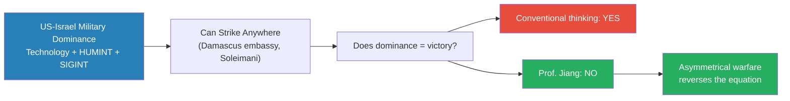
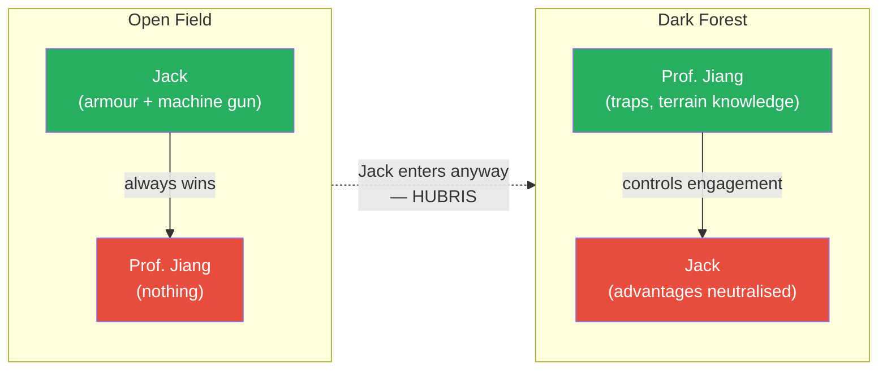
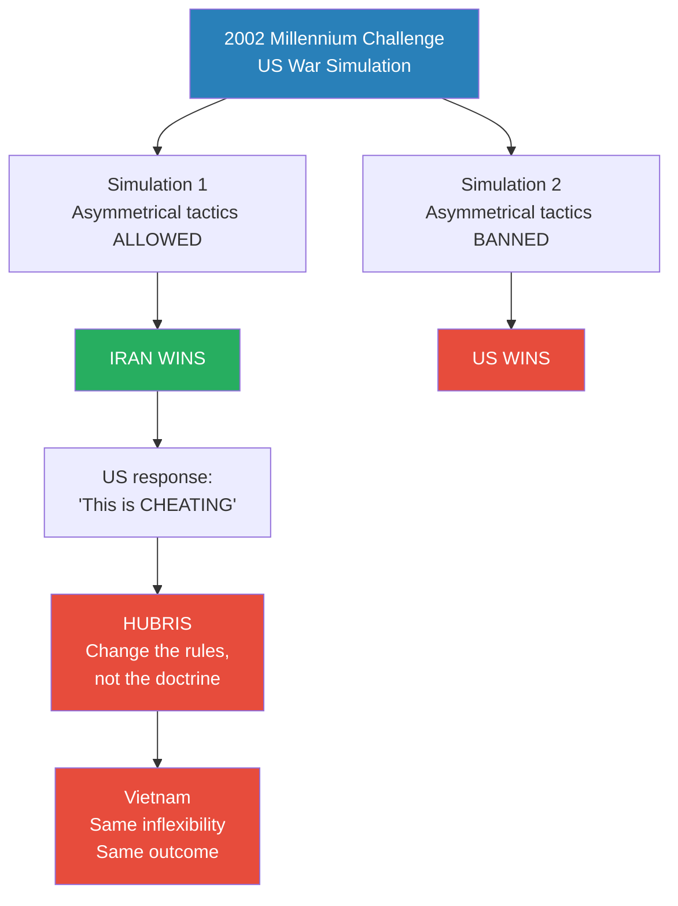
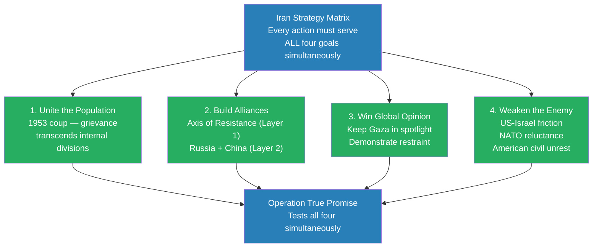
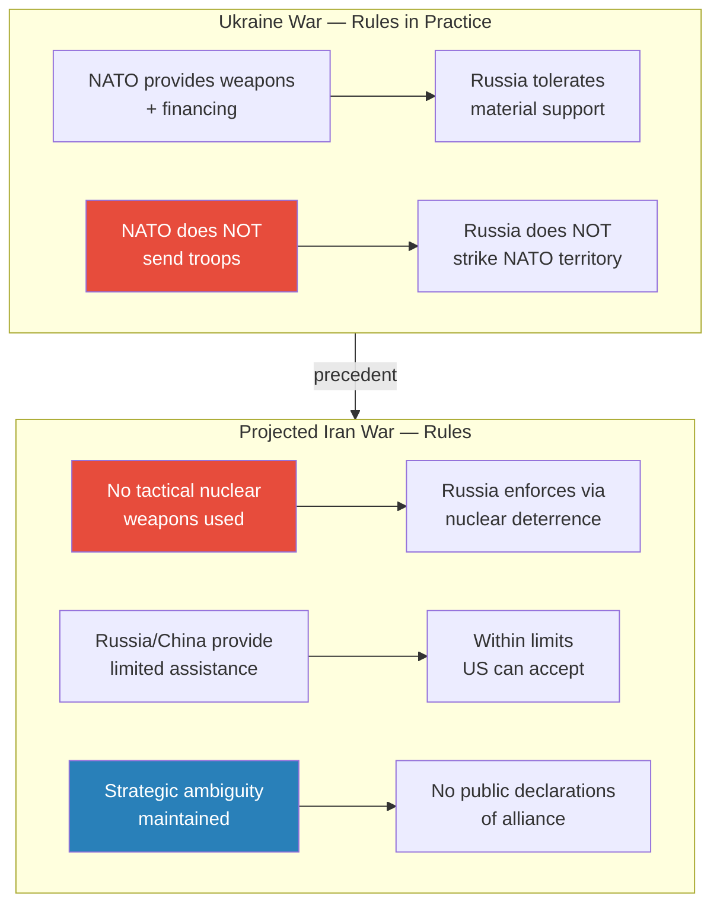
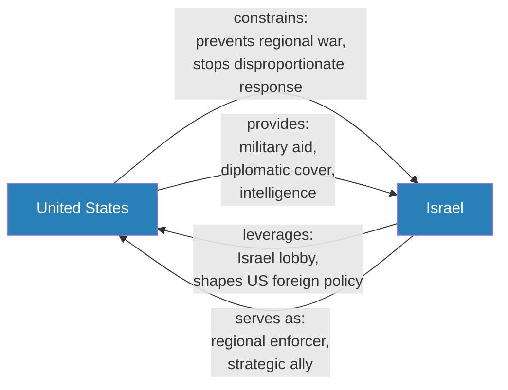
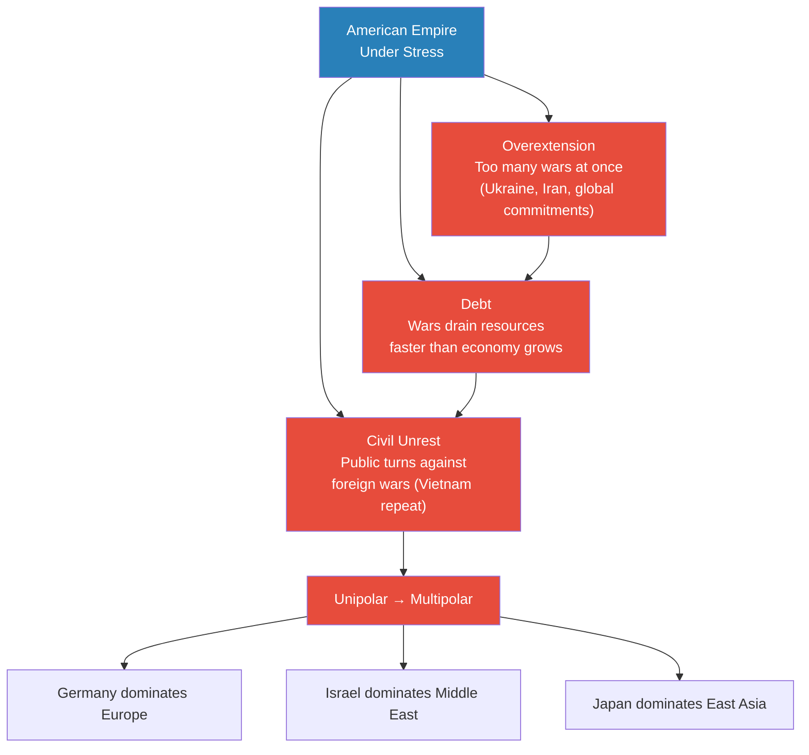

# Iran's Strategy Matrix

> Prof. Jiang opens the Geo-Strategy series with a provocation: if Israel and the United States have overwhelming military dominance over Iran — superior technology, superior intelligence, superior firepower — why might Iran still win a war? The answer lies in asymmetrical warfare, a strategy where the inferior force wins by controlling the terms of engagement rather than matching the enemy's conventional power. Prof. Jiang builds a four-pronged framework he calls the Iran Strategy Matrix — unite the population, build alliances, win global opinion, weaken the enemy — and demonstrates through Operation True Promise how a seemingly "failed" military operation can accomplish all four strategic goals simultaneously.

---

## Overview: Key Highlights

- <b style="color: #e74c3c">Military dominance does not guarantee victory</b> — the US-Israel alliance has complete technological and intelligence superiority over Iran, yet this alone will not decide the war
- <b style="color: #2980b9">Asymmetrical warfare</b> — the inferior force wins by controlling the terms of engagement, fighting in its "dark forest" rather than on the dominant power's terms
- <b style="color: #e74c3c">Hubris is the fatal flaw of empires</b> — when Iran won the 2002 Millennium Challenge war simulation, the US military called asymmetrical tactics "cheating" rather than adapting
- <b style="color: #27ae60">Cost asymmetry makes the strategy sustainable</b> — a $20 million drone swarm can sink a $1 billion aircraft carrier; a $30 million strike forces $1 billion in defence spending
- <b style="color: #2980b9">Iran Strategy Matrix</b> — four simultaneous goals every Iranian action must serve: unite the population, build alliances, win global opinion, weaken the enemy
- <b style="color: #27ae60">The 1953 coup is the grievance that unites Iran</b> — the CIA-MI6 overthrow of Iran's democracy and installation of the Shah explains why Iranians will resist Western invasion despite internal divisions
- <b style="color: #2980b9">Axis of Resistance</b> — Iran's first alliance layer: Hezbollah, Hamas, Houthis, Shia militias in Iraq and Syria — aligned by shared interests, not controlled by Tehran
- <b style="color: #e74c3c">Russia and China will not commit until Iran proves two things</b> — that it is willing to fight and that it can win
- <b style="color: #27ae60">Operation True Promise was a strategic success, not a military failure</b> — a strike designed to cause no casualties advanced all four Matrix goals simultaneously
- <b style="color: #2980b9">Rules of engagement</b> — invisible pre-war agreements among major powers that prevent regional conflicts from escalating into global ones
- <b style="color: #e74c3c">Three causes of imperial collapse are converging on the US simultaneously</b> — overextension, debt, and civil unrest

| Concept | One-line summary |
|---------|-----------------|
| **Asymmetrical warfare** | The inferior force wins by controlling the terms of engagement, not matching firepower |
| **Hubris** | The empire's fatal refusal to adapt — choosing denial over learning from defeat |
| **Cost asymmetry** | Cheap attacks ($20M drone swarm) force expensive defences ($1B carrier) — economics favour the defender |
| **Iran Strategy Matrix** | Four simultaneous goals: unite population, build alliances, win global opinion, weaken enemy |
| **HUMINT / SIGINT** | Human intelligence (spies) and signals intelligence (electronic surveillance) — how the US-Israel alliance knew where Iranian commanders would be |
| **Axis of Resistance** | Iran's first alliance layer — aligned by common interest in resisting US dominance, not directed from Tehran |
| **Strategic ambiguity** | Russia and China's deliberate refusal to openly support Iran — maintaining flexibility while providing quiet assistance |
| **Disproportionality** | Israel's doctrine of responding to any attack with vastly greater force — deterrence through fear |
| **Rules of engagement** | Pre-war agreements among major powers defining permissible weapons, tactics, and involvement levels |
| **Three causes of imperial collapse** | Overextension, debt, and civil unrest — all three building simultaneously for the US |
| **Multipolar world** | The regional order that would emerge if American hegemony ends: Germany (Europe), Israel (Middle East), Japan (East Asia) |

---

# The Lecture

## Why Military Dominance Does Not Guarantee Victory [0:00–5:54]

*Prof. Jiang opens with two recent events — the Damascus embassy strike and the Soleimani assassination — that together prove the US-Israel alliance has complete dominance over Iran. He then pivots to the question that drives the entire lecture: does dominance mean you win?*

> [!tip] Core Insight
> The US-Israel alliance can reach Iranian targets anywhere, anytime. But military dominance is necessary, not sufficient. What determines victory is not who has the biggest guns but who controls how the war is fought.

*The lecture's foundational argument: dominance in conventional terms does not translate to victory when the inferior force controls the terrain and the terms of engagement.*

> [!note]- Expand: Full Lecture Detail
> Prof. Jiang opens by asking the class about their research on the April 1 Damascus embassy strike. Israeli jets hit the Iranian embassy in Damascus, Syria, killing seven people including two commanders. He points out a critical detail: the Canadian Embassy is immediately adjacent, and was completely untouched. "That's a precision strike. That's how powerful the technology that the Americans and Israelis have."
>
> He identifies the two forms of intelligence that made this possible:
>
> - <b style="color: #2980b9">SIGINT (signals intelligence)</b> — electronic surveillance: listening to cell phones, tracking cars, monitoring locations
> - <b style="color: #2980b9">HUMINT (human intelligence)</b> — "spies in the Embassy who tell the Israelis that this meeting will happen"
>
> He then mentions the 2020 assassination of General Qassem Soleimani — a drone strike in Baghdad that killed one of Iran's top military commanders. Both events tell the same story: <b style="color: #e74c3c">the US-Israel alliance has complete military dominance over Iran</b>, in technology and intelligence.
>
> But here is where he pivots. When Operation True Promise launched — 300 Iranian drones and missiles fired at Israel — Israel claimed 99% were intercepted, proof of Iron Dome's superiority. Iran claimed the attack was intentionally designed to be harmless. Prof. Jiang says the Iranians are more credible, and "the reason why is that the Iranians have to be very strategic in their response to the Americans and the Israelis."
>
> > [!example] The Damascus Embassy Strike (April 1)
> > - Israeli jets struck the Iranian embassy in Damascus, Syria — killing seven people including two senior commanders
> > - The Canadian embassy is immediately adjacent and was completely untouched — demonstrating extreme precision
> > - The strike demonstrated intelligence superiority: someone knew exactly when those commanders would be present
> > - Under international law, embassies are sovereign territory — the strike constituted an act of war
> > - This followed the 2020 US assassination of General Qassem Soleimani by drone strike in Baghdad
> > **The lesson:** The US-Israel alliance can reach Iranian targets anywhere, anytime. By every conventional measure, Iran is outmatched.
>
> Prof. Jiang's prediction: "I believe that Iran and Israel are committed to a war, and it's possible that in two years time, there will be a ground invasion of Iran." But just because they have military dominance does not mean they will win. This is the puzzle the lecture is designed to solve.

---

## What Is Asymmetrical Warfare — and Why Does It Work? [5:54–10:50]

*Prof. Jiang builds the foundational concept of the series using a vivid analogy about Jack and a dark forest, then grounds it in a 2002 US military simulation that proved his point — and in the military's response to losing, which proved something even more important.*

*In the open field, conventional superiority decides the outcome. In the dark forest — terrain the inferior force controls — the equation reverses entirely. Hubris is what makes the empire walk into the forest despite every warning.*

> [!note]- Expand: Full Lecture Detail
> Prof. Jiang turns to a student named Jack and constructs an analogy the class will not forget. Imagine Jack and Prof. Jiang are enemies who want to kill each other. Jack has armour and a machine gun. Prof. Jiang has nothing. In most battles, Jack wins — no contest. But Prof. Jiang has lived in a dark forest for decades. He knows every tree, every path, every shadow.
>
> "If Jack attacks me in this dark force, then it's possible for me to win, because I can set traps. I can play tricks on Jack. And that's the idea of asymmetrical warfare."
>
> The logic extends directly:
>
> - <b style="color: #27ae60">Being forced to be inferior makes you more strategic, more creative, more adaptive</b> — because you have no other choice
> - "As long as you can define the terms of engagement, as long as you can control how the war is fought, you will win"
> - Jack walks into the forest anyway, despite every warning — that is hubris
>
> Prof. Jiang then introduces the economics. The US has aircraft carriers that cost around a billion dollars. In symmetrical warfare, Iran sends its navy against one aircraft carrier — and the US destroys the entire Iranian navy. So you do not do that. Instead, you send drone swarms.
>
> > [!example] The 2002 Millennium Challenge
> > - The US military ran a massive war simulation of a hypothetical invasion of Iran
> > - Two teams: Team USA (the most powerful military ever to exist) and Team Iran (a comparatively poor country)
> > - In Simulation 1, the Iran team used asymmetrical tactics: drone swarms, suicide boats charging aircraft carriers
> > - "If there's a lot of them, like 1000 of them, you can't stop all of them. And if one hits, then your boat sinks."
> > - Iran won the first simulation
> > - The US military's response: "This is cheating. You cannot use asymmetrical warfare."
> > - In Simulation 2, with asymmetrical tactics banned, the US won
> > **The lesson:** The US military would rather change the rules of the game than change its doctrine. This is the defining example of imperial hubris.
>
> The drone economics are stark. A real attack drone costs around $1,000. A decoy costs about $100. Send 1,000 real ones and 10,000 decoys — total cost roughly $20 million. That swarm could sink a $1 billion aircraft carrier. "Does that make sense? And this is why Iran would win a war, because Iran would employ asymmetrical warfare — drone swarms against the American aircraft carriers."
>
> Operation True Promise confirmed this logic: the Iranian strike package cost $10–30 million. Israel spent at least $1 billion defending against it. Even a "successful" defence is an economic defeat.
>
> > [!quote] Prof. Jiang
> > "Even though Jack is superior, because I'm inferior, I'm forced to be much more strategic in how I fight against Jack."

---

## Why Empires Cannot Adapt — The Hubris Problem [10:50–14:21]

*A student asks the obvious question: if the Americans know Iran will use asymmetrical warfare, shouldn't they prepare for it? Prof. Jiang's answer is the lecture's most important psychological insight.*

*The Millennium Challenge is Prof. Jiang's most important piece of evidence. Not only did asymmetrical warfare defeat the most powerful military in history — the response to losing revealed the psychology that makes hubris fatal.*

> [!note]- Expand: Full Lecture Detail
> A student asks the sharp follow-up: the Americans will use asymmetrical warfare, so shouldn't they respond more strategically? Prof. Jiang is blunt: "The Americans would not do that. Why not? Why is asymmetrical warfare so effective against empires?"
>
> He leads the class back to the Millennium Challenge. In the first simulation, Iran won. "So what did the United States do? They did another simulation. And what did they do? They said, nope, this is cheating. Asymmetrical warfare is cheating. You cannot cheat. And then the Americans won."
>
> What does this tell us about the American military? "Exactly. They are inflexible. Empires are inflexible. And the reason why is the idea of hubris."
>
> The anatomy of hubris:
>
> - <b style="color: #e74c3c">Hubris is not stupidity</b> — it is an inability to acknowledge vulnerability
> - If you are an empire, you refuse to admit your failings and faults
> - Jack has a machine gun, he has armour — he walks into the dark forest saying "I'm invincible" even as everyone around him says don't
> - The fatal flaw is psychological, not intellectual: "The empire would rather change the rules of the game than change its doctrine"
>
> The classic historical example is Vietnam. The Vietnamese were "clearly dominated" by the Americans in conventional terms. But they used "extremely creative and flexible tactics" — while the Americans "insisted on their main military doctrine." Result: massive protests, civil unrest in America, and a war that "America accomplished nothing by fighting."
>
> The connection is explicit: Vietnam is the template for what Prof. Jiang believes will happen in Iran. Same psychology, same economics, same domestic dynamics, same outcome.
>
> > [!example] Vietnam — Asymmetrical Warfare's Classic Precedent
> > - The United States had overwhelming military superiority over Vietnam
> > - Vietnamese forces used guerrilla tactics — the "dark forest" in practice: tunnels, ambushes, creative resistance
> > - The US military insisted on its conventional doctrine and refused to adapt
> > - Despite technological dominance, the US could not win on terms it did not control
> > - The war produced massive anti-war protests and civil unrest across America
> > - America withdrew, having accomplished nothing strategically
> > **The lesson:** When the inferior force is creative and the superior force is rigid, creativity wins. Vietnam is the template for Iran.

---

## The Iran Strategy Matrix — Four Goals, Every Action [14:21–31:58]

*Prof. Jiang introduces the lecture's central framework: from now until any invasion, everything Iran does must simultaneously accomplish all four goals. He walks through each goal and then demonstrates the framework through Operation True Promise.*

*The four goals are not independent — they are interconnected constraints. An action that unites the population but alienates global opinion would fail the matrix. Every Iranian decision must be evaluated against all four simultaneously.*

> [!note]- Expand: Full Lecture Detail
> "If the Iranians are going to use asymmetrical warfare, what would it look like? And the answer is this: when the Americans invade, the war started before the invasion. The Iranians must do four things if they are to prevail."
>
> Prof. Jiang names the framework: the Iran Strategy Matrix. Everything Iran does from now until the actual invasion must accomplish all four goals at once. If it can only accomplish three, the missing goal becomes a vulnerability. "Does that make sense? From now on, everything that Iran does will be to accomplish all four goals."
>
> **Goal 1 — Unite the population:**
>
> - Iran is currently divided — there have been protests, particularly by women demanding more rights
> - But most Iranians would resist an invasion because they have "a very bad history with Westerners"
> - The foundational narrative: <b style="color: #2980b9">the 1953 coup d'etat</b>
>
> > [!example] The 1953 Iranian Coup d'Etat
> > - In 1909, the British discovered oil in Persia and created the Anglo-Iranian Petroleum Company — today known as BP
> > - The deal gave Iran only 16% of oil profits; the British took the rest
> > - For decades, Iranians tried to renegotiate; in 1953 the democratically elected government proposed a 50-50 split
> > - Instead of accepting, the British and Americans launched a CIA-MI6 coup and overthrew the democratic government
> > - They installed the Shah — a brutal monarchy that ruled as a police state
> > - The Shah's brutality provoked the 1979 Revolution that overthrew him
> > - "The Iranian people do not like the idea of foreign invaders coming in and controlling the resource"
> > **The lesson:** The narrative is simple and powerful — the last time the West intervened, they destroyed Iran's democracy and stole its resources. That memory unites the population across internal divisions.
>
> As Israel and America continue their aggression, the Iranian population will coalesce. Every act of Western aggression (the Soleimani assassination, the Damascus strike) reinforces the grievance and pushes more Iranians toward resistance.
>
> **Goal 2 — Build alliances:**
>
> Iran's alliance structure has two distinct layers:
>
> - <b style="color: #2980b9">Layer 1 — Axis of Resistance</b>: Shia militias in Iraq and Syria, Hezbollah in Lebanon, Hamas, the Houthis in Yemen
>   - "What's important to understand is that this is an alliance. They agreed to fight together because they have common interests, which is to remain independent of American influence"
>   - <b style="color: #e74c3c">Iran does not control these groups</b> — it supports them militarily and financially, but cannot dictate their behaviour
>   - Proof: Iran claimed it was not involved in the October 7 Hamas attack; Israel insisted Iran controls Hamas. The truth is more nuanced: shared interests, not direct command
> - <b style="color: #2980b9">Layer 2 — Russia and China</b>: conditional support, dependent on Iran proving two things
>   - Russia wants the US to fight Iran: it distracts America from Ukraine (where Russia is "about to win"), diverts resources away, and moves attention from the Ukraine war. Russia would limit US military options — including threatening nuclear retaliation if the US uses tactical nuclear weapons against Iran
>   - China needs Iranian oil: "China cannot afford for the United States to take over both Iraq and Iran, because then it can control the energy supply to China"
>   - What Iran must prove to both: "The first thing is we will fight. Second thing is we will win." The more Iran demonstrates both willingness and capability, the more Russia and China will invest
>
> **Goal 3 — Win global opinion:**
>
> - "How will Iran win global opinion? What's happening right now that's helping Iran win global opinion?"
> - The answer is Gaza: "What's happening in Gaza, it's basically genocide, right? Where the Israelis are committed to solving the Palestinian problem once and for all."
> - Iran must maintain the world spotlight on Gaza: "As long as the attention is on Gaza, then people will become much more sympathetic towards Iran over time"
> - Evidence this is working: major protests at Yale, Columbia, and other universities about Gaza
> - The mechanism is organic — Iran does not need to manufacture propaganda when the reality generates its own opposition
>
> **Goal 4 — Weaken the enemy:**
>
> - When the US invades, it will want to build a large coalition for legitimacy — NATO, Middle Eastern countries, Israel, Saudi Arabia
> - Iran must create conflict and dissent in this coalition so it either never forms or cannot hold
> - Three fracture points:
>   - <b style="color: #2980b9">Israel-US friction</b>: Israel's doctrine of <b style="color: #2980b9">disproportionality</b> — if you kill one Israeli, they kill a hundred — creates natural tension with America, which needs to manage the coalition and cannot afford escalation
>   - <b style="color: #e74c3c">US-NATO friction</b>: "Why would France and Germany want to involve themselves?" — they have no strategic interest in fighting Iran
>   - <b style="color: #e74c3c">American civil unrest</b>: "Most people in America do not support a war against Iran" — Iran needs to encourage this internal dissent
>
> **Operation True Promise — all four goals at once:**
>
> Prof. Jiang returns to the 300-drone strike and shows how it advanced every goal simultaneously:
>
> - **Unite the population:** "Iran needed to show its population that Iran can strike back against Israel" — the first-ever direct Iranian strike on Israel
> - **Build alliances:** "Striking Israel is showing its allies, and to China and Russia, that Iran is willing to fight"
> - **Win global opinion:** "Iran said we designed the strike to not cause damage in Israel" — it wanted to win global opinion. If it had killed many people, global sympathy would have shifted to Israel. By designing it for zero casualties, Iran showed restraint and preserved the moral high ground
> - **Weaken the enemy:** After the strike, Israel wanted a disproportionate response. The US stopped it — "because the United States cannot afford right now to fight in the war" and no coalition would participate. This US restraint of Israel created exactly the friction the Matrix requires
>
> "From a military dominance perspective, Operation True Promise accomplished nothing. But from an asymmetrical warfare perspective, you accomplish all your four major goals. And that's why the Iranians claimed success."
>
> > [!quote] Prof. Jiang
> > "From a military dominance perspective, Operation True Promise accomplished nothing, okay, because you blew nothing up. But from an asymmetrical warfare perspective, you accomplish all your four major goals, and that's why the Iranians claimed success."

---

## Rules of Engagement — How Wars Stay Contained [31:58–36:30]

*A student named Peter, heading to the US for college, asks how a potential Iran war would affect Chinese students. The answer introduces one of the series' most important concepts: the invisible architecture of rules that prevent regional conflicts from becoming global ones.*

*Ukraine provides the working template. Both sides observe the rules because crossing them risks nuclear escalation. Prof. Jiang projects the same framework onto any Iran war.*

> [!note]- Expand: Full Lecture Detail
> Peter asks: this war, how will it affect us? We are going to the United States for college. We are Chinese students.
>
> Prof. Jiang's three-part answer:
>
> **Part 1 — Rules of engagement:**
>
> "Before they have a war, all the major parties agree on what the rules are." He uses Ukraine as the model:
>
> - The US and NATO openly supply weapons, financing, and intelligence to Ukraine
> - From Russia's perspective: "We allow that. We will not allow NATO to send troops to fight with the Ukrainians, but we will allow NATO to provide weapons and financing"
> - Both sides understand and observe this line — which is why a US-Russia war has not happened
> - <b style="color: #2980b9">Rules of engagement</b> are not published — they are understood agreements negotiated through back channels
>
> For a US-Iran war, Prof. Jiang projects similar rules:
>
> - **No tactical nuclear weapons**: "Iran, you may have nuclear weapons. US, Israel — you have nuclear weapons. But you are not allowed to use them in this war." Russia would enforce this by threatening nuclear retaliation
> - **Limited Russian and Chinese assistance**: China will "probably provide weapons and material, but this will not impact the relationship between China and the United States" — it stays within limits the US can accept
> - **Strategic ambiguity maintained**: "China is not going to say that we support Iran. Russia will not come out and say we support Iran." They will not sign a mutual defence treaty with Iran — doing so eliminates their flexibility
>
> **Part 2 — Epistemic humility:**
>
> "I'm just making a prediction of this war. I don't know it's going to happen. Okay? You understand — I'm just your high school teacher. I'm not making the decisions."
>
> **Part 3 — The practical reality (and the class laughs):**
>
> "When you actually get to the United States, you'll find that there's so much anger at Israel that nobody cares about Chinese students." The campus will be consumed by anti-war anger — like the Vietnam War, with massive protests and civil unrest. "America accomplished nothing by fighting that war. Okay? So great question, Peter."
>
> The Gaza university protests at Yale and Columbia are already a preview of this dynamic.

---

## Israel as a Regional Empire — and the US-Israel Relationship [36:30–40:14]

*A student challenges Prof. Jiang's use of "hubris" to describe Israel: it is only 8-9 million people, not an empire. Prof. Jiang's response redefines empire around military dominance — and reveals the complexity of the US-Israel relationship.*

*The US-Israel relationship is simultaneously one of constraint and exploitation. Prof. Jiang's personal view: America is currently constraining Israel — but without America, Israel would "unleash the full might of its military" across the Middle East.*

> [!note]- Expand: Full Lecture Detail
> A student points out: Israel has only 8-9 million people. It is not the American empire. How can it have hubris?
>
> Prof. Jiang redefines empire around military dominance, not population size:
>
> - Israel is "the strongest military power in the Middle East by far"
> - "If the entire Middle East got together and attacked Israel, Israel would win" — this has happened twice: the Yom Kippur War and the Six-Day War
> - "If the United States were to retreat from the Middle East, Israel would dominate"
> - <b style="color: #27ae60">Empire is defined by military dominance relative to your neighbours, not population size</b>
> - And because it functions as an empire, it suffers from the same fatal flaw: hubris — it does not need to be strategic, flexible, or creative, because it has military dominance over everyone in the region
>
> David then asks: is the US constraining Israel, or is Israel using America?
>
> - "You can make the argument both ways"
> - **Constraint argument**: Israel needs American support — that dependence constrains its actions. After Operation True Promise, the US stopped Israel from launching a disproportionate response
> - **Exploitation argument**: The <b style="color: #2980b9">Israel lobby</b> gives Israel enormous influence over US foreign policy — more than a nation of its size would normally possess
> - Prof. Jiang's personal view: "I personally think that America is right now constraining Israel. Because Israel needs American support, and that constrains the actions of Israel. But if America were not around, then it's possible that Israel unleashes the full might of its military"
> - He promises an entire future class on the Israel lobby — because the relationship cannot be understood without it
>
> The regional power logic extends globally:
>
> - "If America left Europe, who becomes the dominant power? Germany"
> - "If America left East Asia, who becomes the dominant power? Japan"
> - "The regional powers right now are Germany, Israel and Japan, and it's American empire that's constraining all three right now"

---

## What Happens If America Loses — Three Causes of Imperial Collapse [40:14–43:33]

*A student asks what it would mean for America if it loses the war. Prof. Jiang zooms out to the fate of the American empire itself, introducing three causes of imperial collapse that are all building simultaneously.*

*The three causes of imperial collapse are sequential and self-reinforcing. Critically, all three are already in motion for the United States before any Iran war begins.*

> [!note]- Expand: Full Lecture Detail
> A student asks: what will happen to America if it loses the war?
>
> Prof. Jiang's first qualification: this is all theory and conjecture. America has not expressed intent to invade Iran. And if it does invade, "chances are it will win the war." But losing would "basically mean the end of the American empire."
>
> He presents three causes of imperial collapse:
>
> - <b style="color: #2980b9">Overextension</b> — "doing too many things at once. It's fighting this war in Ukraine, it's fighting this war in Iran, it's fighting this war everywhere." Overextension is the most visible cause: the empire simply tries to do too much
> - <b style="color: #2980b9">Debt</b> — "it basically just runs out of money, right? Because it's overextended." Every war is expensive; asymmetrical wars are worse because the cost ratio favours the defender. Overextension produces debt; debt limits the ability to sustain further overextension — a self-reinforcing cycle
> - <b style="color: #2980b9">Civil unrest</b> — "the American Empire is heading into a lot of trouble over the next ten years, because all three things are happening at once." When the public turns against a war it considers unjust, the political consensus that sustains that war collapses. Vietnam is the precedent
>
> The critical qualifier: <b style="color: #e74c3c">all three are happening simultaneously for the US</b>. This is what makes the current moment different from previous imperial stresses — they are converging, not staggered.
>
> Even so, "the decline of American Empire is going to take decades, possibly centuries." There is still no peer competitor. But the trajectory is clear: from a <b style="color: #2980b9">unipolar world</b> (one superpower controls everything) to a <b style="color: #2980b9">multipolar world</b> (regional blocs controlled by dominant regional powers).
>
> On the invasion trigger: "America doesn't really need a reason to fight a war. It can just make up a reason." His specific prediction: if Trump wins the presidency, he will initiate a war against Iran, possibly within two years.
>
> > [!example] The Spiral of Imperial Overextension
> > - An empire fights a war it cannot win on its own terms
> > - The war lasts longer than expected because the enemy refuses to fight conventionally
> > - Costs escalate — conventional weapons are expensive, asymmetrical attacks are cheap
> > - Casualties mount without visible progress; public turns against the war
> > - Civil unrest forces the empire to fight on two fronts simultaneously: abroad and at home
> > - The empire faces a choice: escalate (deepening debt and overextension) or withdraw (admitting defeat)
> > **The lesson:** Either path is a loss. Escalation accelerates collapse; withdrawal confirms it.

---

## Connections

**Previous lecture:** This is Lecture 1 — series opener.
**Sets up:** [[02 - Christian Zionism and the Middle East Conflict]] (the Israel lobby and why the US-Israel alliance exists), [[04 - Saudi Arabia's Trump Card Against Iran]] (Saudi strategy in the Iran conflict), [[06 - America's Imperial Hubris]] (hubris theme continues), [[08 - The Iran Trap]] (the war scenario in detail)
**Related books in vault:** [[The 33 Strategies of War - Robert Greene]] (asymmetrical warfare and controlling terms of engagement), [[The Art of War - Sun Tzu]] (terrain control and knowing the enemy), [[The 48 Laws of Power - Robert Greene]] (hubris and power dynamics), [[Sapiens - Yuval Noah Harari]] (narratives shaping collective behaviour — relevant to the 1953 grievance)

---

## The Takeaway

This lecture establishes the intellectual architecture for the entire Geo-Strategy series. Prof. Jiang does not simply analyse Iran's military situation — he builds a framework for understanding how asymmetrical conflicts work, why empires repeatedly lose to inferior forces, and what determines the outcome of wars that conventional analysis cannot predict. The Iran Strategy Matrix — unite the population, build alliances, win global opinion, weaken the enemy — is not just a description of Iranian strategy. It is a template for how any inferior force survives a confrontation with a dominant power.

The most counterintuitive insight is the one the Millennium Challenge hammers home: military dominance does not determine who wins. The Americans possess the most powerful military in human history and have complete technological and intelligence superiority over Iran. None of that matters if the war is fought on asymmetrical terms — terms Iran controls. The superior force's greatest weakness is not a lack of weapons but a surplus of hubris: the psychological inability to adapt, to acknowledge vulnerability, to take an inferior force seriously. The Americans proved this about themselves in their own war simulation — and then chose to ban the lesson rather than learn it. Calling asymmetrical warfare "cheating" is not just an institutional failure. It is the definition of imperial hubris in action.

The questions that remain open drive the rest of the series. Will Trump start the war, and what would it actually look like on the ground? Can Iran hold the Axis of Resistance, Russia, and China together through a prolonged conflict, or will the alliances fracture under pressure? Why does the US-Israel relationship work the way it does — is the Israel lobby the answer? And the biggest question: if the United States loses in Iran, what does the multipolar world that emerges look like — and is it better or worse than what we have now? Prof. Jiang promises answers in the lectures ahead.
