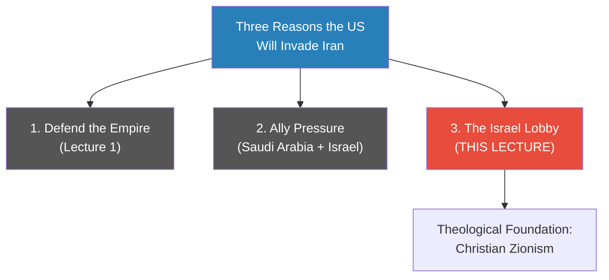
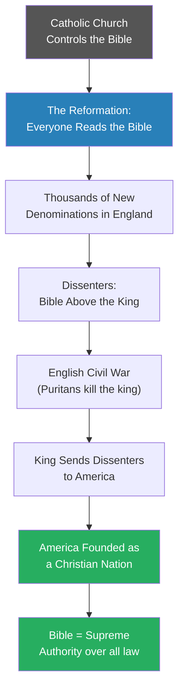
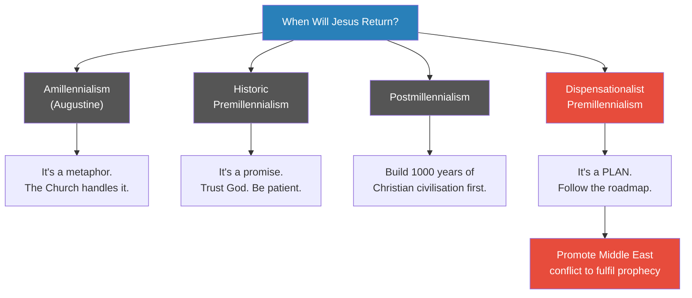
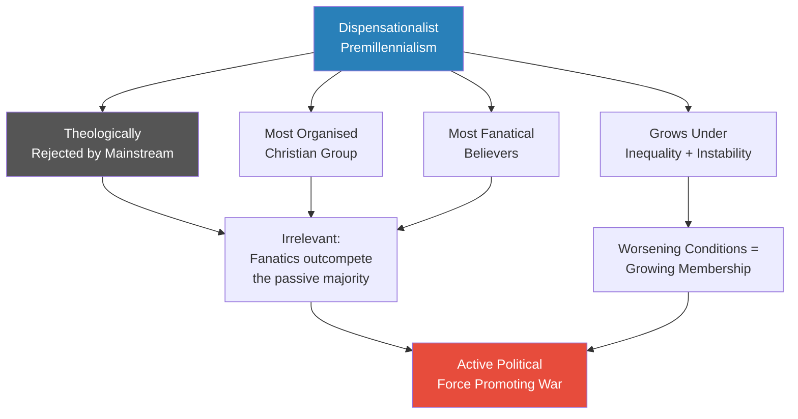

# Christian Zionism and the Middle East Conflict

> Prof. Jiang turns from military strategy to theology to explain why a significant bloc of American Christians actively want war in the Middle East. The answer begins not with lobbying or campaign finance but with Jesus of Galilee — a religion born among slaves and outcasts that promised the destruction of the world they lived in. The chain runs through Augustine's reinterpretation of the Second Coming, the Protestant Reformation, English religious dissenters sent to America, and finally a radical theology called dispensationalist premillennialism — the belief that the Bible contains a literal roadmap for forcing Jesus's return. Prof. Jiang argues this theology, expressed politically as Christian Zionism, is the engine behind America's unconditional support for Israel and the religious imperative that will eventually push the United States into war with Iran.

---

## Overview: Key Highlights

- <b style="color: #2980b9">Three reasons the US will invade Iran</b> — defending empire, ally pressure, and the Israel lobby — this lecture builds the third
- <b style="color: #e74c3c">Christianity began as a free lottery ticket</b> — it cost nothing to believe and promised the destruction of the world that oppressed you
- <b style="color: #27ae60">Augustine neutralised the Second Coming</b> — reinterpreted it as a metaphor to protect Church authority, creating the faultline all later theology fights over
- <b style="color: #2980b9">Dispensationalist premillennialism</b> — the belief that the Bible contains a literal plan, not just a promise, for Jesus's return — the most organised and fanatical Christian minority
- <b style="color: #e74c3c">The roadmap requires conflict</b> — Israel reconstituted (1948, done), Temple rebuilt, Antichrist appears, all nations attack Israel, Jesus returns
- <b style="color: #2980b9">Christian Zionism</b> — the belief Christians have a religious duty to support Jews returning to Israel — preceded and created Jewish Zionism, not the other way around
- <b style="color: #e74c3c">The theology is cynical</b> — two-thirds of Jews die in the final battle, the rest convert; Jews are tools in a Christian prophecy, not beneficiaries
- <b style="color: #27ae60">America was founded as a Christian nation</b> — dissenters sent from England to build the kingdom of God on earth; their descendants now control US foreign policy
- <b style="color: #2980b9">The Pax Americana parallel</b> — the same conditions that made Christianity explosive under Roman imperial peace are recurring now: peace produces inequality, inequality produces radical belief
- <b style="color: #e74c3c">Israel's calculation</b> — if America will fight for religious reasons, war costs Israel nothing and gains it everything
- <b style="color: #27ae60">Promise vs. plan</b> — the single most important distinction: historic premillennialists trust God; dispensationalists work to force God's hand
- <b style="color: #e74c3c">The forces for war are overdetermined</b> — theological conviction, imperial necessity, and allied pressure all point the same direction simultaneously

| Concept | One-line summary |
|---------|-----------------|
| **Dispensationalist premillennialism** | The Bible contains a literal plan — a specific sequence of steps — for bringing Jesus back |
| **Christian Zionism** | Christians have a religious duty to support Jews returning to and controlling Israel |
| **Zionism** | Jews are a chosen race whose promised land is Israel — reframes Jewish identity from religion to ethnicity |
| **Amillennialism** | Augustine's position: the 1000 years of peace is a metaphor; the Church already fulfils it |
| **Historic premillennialism** | Jesus promised to return — trust God, be patient, it is His business not ours |
| **Postmillennialism** | Humans must build 1000 years of Christian civilisation first; then Jesus returns |
| **The prophecy roadmap** | Israel as nation → Temple rebuilt → Antichrist → all nations attack Israel → Jesus returns → 1000 years → Last Judgement |
| **The free lottery ticket** | Prof. Jiang's model for radical religious adoption: zero cost to believe, infinite payoff if true |
| **Pax Americana parallel** | Imperial peace eliminates social mobility, compounds inequality, and radicalises the hopeless — identical to the Pax Romana |
| **Promise vs. plan** | The decisive distinction between passive waiting for God and actively working to force His return |

---

# The Lecture

## Why Does the US Really Want to Fight Iran? [0:01–1:30]

*Prof. Jiang opens by naming three reasons the United States will eventually invade Iran — and tells the class that today he will explain the third, the most surprising, and the most deeply embedded.*

> [!tip] Core Insight
> The US-Iran conflict is not simply strategic. At its foundation lies a religious worldview woven into America's founding DNA. To understand why, you first need to understand Christianity.

*Reason three — the Israel lobby — is not a simple political organisation. It is the surface expression of a theological worldview that took 2000 years to build.*

> [!note]- Expand: Full Lecture Detail
> - Prof. Jiang says the class is continuing the United States-Iran war
> - He repeats his thesis: "The United States will invade Iran. We don't know when. It might be two years from now. It might be six years from now, but eventually it will happen."
> - He names the three major reasons:
>   - The US must defend its empire
>   - The US will be pressured by its allies, mainly Saudi Arabia and Israel
>   - The Israel lobby
> - He tells the class: to understand the Israel lobby, you first need to understand Christianity
> - This signals the entire lecture's unexpected structure — he goes back 2000 years before returning to the present

---

## Christianity's Origin — A Religion for the Oppressed [1:30–9:40]

*Prof. Jiang begins with what Christianity actually was before it became powerful — a revolutionary religion that spread among slaves, peasants, and women by promising the destruction of the world that oppressed them.*

> [!tip] Core Insight
> Christianity became the most powerful religion on earth not because of theological sophistication but because it was, in Prof. Jiang's words, "a free lottery ticket" — it cost nothing to believe, and if it was right, the payoff was infinite. This is the same economic logic that drives dispensationalist premillennialism today.

*Augustine solved the Church's political crisis by neutralising Christianity's most dangerous promise — but from that moment forward, the question of when and how Jesus returns became the most contested issue in Christian theology.*

> [!note]- Expand: Full Lecture Detail
> - Prof. Jiang opens with what is actually known about Jesus: born around 4 BCE, died around 31 CE, from Galilee, crucified by the Romans — "that's about it"
> - Believers say he was God come to earth, preaching that the kingdom of heaven was coming
> - After crucifixion he was resurrected, ascended to heaven, and promised to return — this is the <b style="color: #2980b9">Second Coming</b>
> - Christianity's early followers were not the powerful but the marginalised:
>   - Slaves, peasants, women — people who had nothing
>   - The religion promised: "the meek shall inherit the earth"
>   - For criminals, it offered salvation and redemption without requiring establishment approval
> - The appeal was structurally rational: "Christianity is a free lottery ticket. It doesn't make sense. But hey, if it's right, then you go to heaven. It costs you nothing."
> - The early religion had three characteristics:
>   - **Revolutionary** — it challenged the existing order
>   - **Egalitarian** — everyone equal before God
>   - **Anti-authority** — no earthly power was supreme
>
> **The establishment problem:**
>
> - Christianity became so popular it became the official religion of the Roman Empire
> - This created a fatal contradiction: <b style="color: #e74c3c">a revolutionary, anti-authority religion was now run by the establishment</b>
> - New theology was needed to make Christianity compatible with empire
>
> > [!example] Augustine's Solution (5th Century CE)
> > - Augustine faced two interlocking political problems with the literal Second Coming
> > - Problem one: if the world is ending, why should anyone work? Why not just drink and wait?
> > - Problem two: Jesus returns because the world is bad — but who runs the world? The Catholic Church does
> > - A literal Second Coming was an indictment of Church authority — Jesus returns to destroy it
> > - Augustine's solution: "that 1000 years, it's just a metaphor. It's not actually going to happen. In fact, it's already happened, because the Catholic Church is giving us this 1000 years of peace and prosperity."
> > - Don't worry about the Second Coming — the Church will take care of everyone until Jesus returns whenever he chooses
> > - His works *City of God* and *Confessions* made this reinterpretation the official Catholic position
> > **The lesson:** When a revolutionary religion becomes the establishment, its most radical promises must be neutralised — or they will destroy the institution from within.
>
> - This position is called <b style="color: #2980b9">amillennialism</b> — "a-" meaning "no," as in the 1000 years is not literal
> - It became mainstream Catholic and mainstream Protestant doctrine
> - But it created a faultline: from Augustine onwards, Christians have had divergent understandings of what the Second Coming means

---

## The Reformation, the Dissenters, and the Founding of America [9:40–14:30]

*The Reformation broke the Church's monopoly on biblical interpretation — and within a century, the most radical interpreters had been expelled from England and sent to build their own kingdom of God in America.*

*The pipeline from the Reformation to America's founding explains why a question about biblical prophecy — when will Jesus return? — has direct consequences for 21st-century foreign policy.*

> [!note]- Expand: Full Lecture Detail
> - Before the Reformation, Catholics did not read the Bible — priests interpreted it for them
> - <b style="color: #2980b9">The Reformation</b>'s core claim: God speaks to all of us through the Bible; seek meaning and guidance from your own interpretation
> - Immediately, thousands then tens of thousands of new denominations emerged, each believing something different about Scripture
>
> **In England:**
>
> - The king supported the Reformation initially to escape Catholic authority — he created the Anglican Church with himself, not the Pope, in charge
> - But once people started reading the Bible, new dissenter religions multiplied
> - All dissenters shared one conviction: the Bible is the supreme authority — above the king
> - This triggered constant conflict, culminating in the English Civil War — the Puritans killed the king
> - The monarchy was restored, but decades of conflict followed with no resolution
>
> **The solution:**
>
> - The king's answer was to send the dissenters to America
> - "If you really believe in these things, go to America. Why? Because there's nobody in America so you can build your own kingdom of heaven."
>
> > [!example] The Dissenters' Mission
> > - The Puritan dissenters believed the Bible was the supreme authority over all earthly power
> > - They were in constant conflict with the English Crown — no compromise was possible
> > - The Crown's solution: give them a continent to govern themselves
> > - They arrived in America with a specific mandate: build the kingdom of God on earth
> > - Not permitted to drink, dance, or entertain themselves — all focus on spiritual improvement
> > - Also not permitted to own slaves — the Bible required it
> > - This created constant conflict with wealthy colonists who wanted cheap labour
> > **The lesson:** America was not founded as a secular experiment. It was founded as a religious project — a kingdom of God on earth governed by Biblical law.
>
> - Prof. Jiang says this surprises students who view the US from the outside as secular and multicultural
> - "Inside its soul, its history — it is a Christian nation dedicated to achieving the kingdom of God on earth, using the Bible as the supreme authority and guide."
> - The descendants of these founding dissenters now control the military and foreign policy apparatus of America

---

## The Four Views of the End Times [14:30–20:34]

*Once in America, the dissenters kept asking one question — why is Jesus not back yet? Four distinct answers emerged, and three of them are harmless. The fourth is what drives Middle East policy.*

> [!tip] Core Insight
> The difference between historic premillennialism and dispensationalist premillennialism is the difference between a promise and a plan. Historic premillennialists wait for God. Dispensationalists work to force God's hand. That single distinction turns a private religious belief into a driver of foreign policy and war.

*Three of the four positions lead to passivity or positive action. Only dispensationalist premillennialism translates directly into support for war — because war is a necessary step in the divine plan.*

> [!note]- Expand: Full Lecture Detail
> - In America, the dissenters' central question was: "Why isn't Jesus back yet?"
> - From the premillennialist camp, two further groups broke off:
>
> **<b style="color: #2980b9">Amillennialism</b> (Augustine's position):**
> - The 1000 years of peace is not literal — it is a metaphor
> - The Catholic Church is already fulfilling this promise through its stewardship of the world
> - No urgency, no plan needed — defer to the Church
>
> **<b style="color: #2980b9">Historic premillennialism</b>:**
> - Jesus literally promised to return — and God keeps His promises
> - But the timing is God's business, not ours
> - "He's God. He's probably very busy right now with other things, so don't worry about it, guys. Just be patient and trust in Jesus."
> - Be a good person; when God returns, He will handle everything
>
> **<b style="color: #2980b9">Postmillennialism</b>:**
> - Jesus will return *after* humanity establishes 1000 years of Christian civilisation
> - The burden is on us to prove ourselves worthy
> - God is not going to do it for us — we must build it, then Jesus returns
>
> **<b style="color: #e74c3c">Dispensationalist premillennialism</b> — the dangerous outlier:**
> - The Bible contains not just a promise but a **plan** — a specific sequence of events
> - The roadmap: Israel reconstituted as a Jewish nation, the Temple rebuilt, the Antichrist appears, all nations attack Israel, Jesus returns and destroys the Antichrist, 1000 years of peace, then the Last Judgement
> - Believers see themselves as active participants who must work to fulfil the prophecy
> - The critical shift: the Second Coming is not something to wait for — it is something to make happen
>
> Prof. Jiang summarises the distinction:
> - Historic premillennialism: "Jesus promises to return. He's God, He will keep His promise. He's probably very busy right now. Just be patient."
> - Dispensationalism: "It's a plan. It's something that we must achieve to bring Jesus back."
>
> > [!quote] Prof. Jiang
> > "There are different variations of this prophecy... but the key point is that the prophecy, it's a plan. It's something that we must achieve."

---

## Why Dispensationalism Is Dangerous — and Growing [20:34–24:44]

*Most Christians regard dispensationalism as blasphemous. But Prof. Jiang argues that theological rejection is irrelevant — because the believers are the most organised and most fanatical, and the structural conditions guaranteeing their growth are worsening.*

*The theological objection does not constrain political impact. What matters is organisation, intensity, and structural conditions — all of which favour dispensationalists.*

> [!note]- Expand: Full Lecture Detail
> **Why most Christians reject dispensationalism:**
>
> - The mainstream Christian objection is theological: <b style="color: #e74c3c">you are trying to manipulate God</b>
> - If you truly believe in God, you trust God and focus on being a good person
> - Trying to force God's return puts human agency above divine sovereignty
> - "If you believe in God, then you will trust God, and you will try your best to be a good person... And when God returns, it's none of your business."
> - Prof. Jiang poses it as a question to the class: why would Christians think this is evil? Then answers: "You are trying to force God to return, and you shouldn't do that."
> - This makes dispensationalism "an extremely controversial minority within Christianity" — most Christians find it evil and possibly blasphemous
>
> **Why theological rejection does not matter:**
>
> - Despite being a minority, dispensationalists have decisive structural advantages:
>   - They are <b style="color: #e74c3c">the most organised</b> of all Christian eschatological groups
>   - They are <b style="color: #e74c3c">the most fanatical</b> — they genuinely believe they are executing God's plan
>   - History consistently shows that the most united and fanatical groups achieve their goals regardless of majority opposition
> - The belief thrives in conditions of massive uncertainty and inequality — conditions that are actively worsening
> - Prof. Jiang: "This sort of belief thrives in a time of massive uncertainty and inequality, like the time that we are living in today."
>
> **Why this matters for the Middle East:**
>
> - Dispensationalist Christians are actively encouraging conflict between Palestinians and Israelis
> - They want Israel and Iran to go to war
> - Because conflict advances the prophecy — every step toward war is a step toward Jesus's return
> - "These Christians are actually promoting war between Israel and its neighbours."

---

## The Dispensationalist Prophecy Roadmap [23:43–24:44]

*The specific sequence of events dispensationalists believe they are working to fulfil — and why step one's completion in 1948 supercharged the movement.*

*Step one — Israel's reconstitution as a nation in 1948 — has already been achieved. From this point, every subsequent step requires conflict in the Middle East.*

> [!note]- Expand: Full Lecture Detail
> - The prophecy the dispensationalists read in the Bible runs as a specific sequence:
>   - Israel must be reconstituted as a nation ruled by Jews
>   - Israel must have the Temple — "because that's where God resides"
>   - The Antichrist (Satan in disguise, the Great Deceiver) will appear and launch a war against Israel
>   - All nations of the world will attack Israel
>   - At this point, Jesus returns, destroys the Antichrist, saves Israel
>   - 1000 years of peace follow
>   - Then the Last Judgement: the worthy live forever, the unworthy burn in hell
> - 1948 was the turning point: the State of Israel was established
> - Dispensationalists celebrated — "they feel that we've achieved the first step in this plan to bring Jesus back"
> - Every subsequent step requires escalation and conflict
> - This is why they actively promote the Israel-Palestine conflict and want an Iran-Israel war:
>   - <b style="color: #e74c3c">"War is not a failure of policy — it is the goal"</b>

---

## Christian Zionism — Theology Becomes Foreign Policy [24:44–30:20]

*Prof. Jiang traces how the abstract theology of dispensationalism crystallised into a political movement — Christian Zionism — and how that movement preceded, enabled, and ultimately created Jewish Zionism.*

> [!tip] Core Insight
> Christian Zionism preceded Jewish Zionism. It was Christians, not Jews, who first championed the idea that Jews were a race whose destiny was to return to Israel. And the reason Christians championed it was not concern for Jewish welfare — it was to fulfil a Christian prophecy in which two-thirds of Jews die.

*Christian Zionism created the ideology, the Holocaust provided the catalyst, and Israel's establishment in 1948 gave dispensationalists confirmation that the prophecy was real and in motion.*

> [!note]- Expand: Full Lecture Detail
> **What Christian Zionism is:**
>
> - <b style="color: #2980b9">Christian Zionism</b> — the belief that as a Christian, you have a religious duty to support Jews in returning to and taking control of Israel
> - Emerged after the Reformation, roughly 200 years ago
> - The Romans burned down the Jewish Temple in approximately 70 CE, and Jews lost control of Israel for roughly 2000 years
> - Christian Zionists believe: it is their responsibility to help Jews take back Israel
>
> **The cynical theology underneath:**
>
> - Christian Zionism intersects with dispensationalism in a critical way
> - Christians need Israel back and in conflict — because that is what the prophecy requires
> - But Christianity's own prophecy predicts: two-thirds of all Jews will die in the final battle; the surviving third will immediately convert to Christianity; Judaism as a religion ceases to exist
> - Prof. Jiang: "You can make the argument that Christian Zionism, it's a pretty cynical and a pretty evil idea."
> - <b style="color: #e74c3c">Jews are tools in this framework, not beneficiaries</b>
>
> > [!example] Christian Zionism's Cynical Bargain
> > - Christian Zionists lobby passionately for Israel, donate money, vote for pro-Israel politicians
> > - They genuinely claim to be friends and allies of the Jewish people
> > - But their own theology predicts: two-thirds of the Jewish people will die in the final battle
> > - The surviving third will convert to Christianity — Judaism will cease to exist
> > - The people Christian Zionists claim to support are, in their own theology, scheduled for destruction or conversion
> > - The support is not about Jewish wellbeing — it is about completing a Christian prophecy
> > **The lesson:** Political alliances built on eschatological theology can appear supportive while being fundamentally exploitative. The intended beneficiary and the intended instrument are not the same person.
>
> **From Christian Zionism to Jewish Zionism:**
>
> - <b style="color: #2980b9">Zionism</b> — the belief that Jews are a chosen people, Israel is their promised land, and Jews must return to Israel
> - Before Christian Zionism, most Jews did not think of themselves as a race
> - An Iraqi Jew was Iraqi; a Chinese Jew was Chinese — religion did not override nationality
> - "They felt they were a religion... I'm in Iraq, guess what? I'm an Iraqi. Like everyone else."
> - Zionism reframed Jewish identity from religion to race — claiming direct descent from the biblical Hebrews
> - Prof. Jiang: "This is complete nonsense. This is not true."
> - Zionism was initially extremely unpopular among Jews — it could not convince significant numbers to migrate to Palestine
> - The Holocaust changed everything: mass Jewish migration followed, and in 1948 Israel was established
> - Dispensationalists celebrated: step one of the prophecy was fulfilled

---

## The Three-Part Mechanism — Why America Goes to War [30:20–33:37]

*Prof. Jiang pulls the threads together into a three-part summary of how theology becomes foreign policy — and why Israel is perfectly positioned to exploit it.*

*The system is self-reinforcing: Christian Zionism drives US support for Israel, Israel exploits that support, conflict advances the prophecy, prophecy generates more believers, more believers generate more political pressure for conflict.*

> [!note]- Expand: Full Lecture Detail
> Prof. Jiang summarises the full mechanism in three parts:
>
> **Part 1: Many Christians believe Israel must be used as a tool to bring Jesus back**
>
> - Dispensationalist premillennialists genuinely believe Middle East conflict advances the prophecy
> - This is not metaphorical or abstract — they are actively promoting conflict
> - They see war between Iran and Israel as a step toward the Second Coming
>
> **Part 2: America was founded as a Christian nation — its soul is Christian**
>
> - The first leaders of America were Christians who believed in Christian Zionism
> - Their descendants now control the military and foreign policy apparatus
> - "United States was founded as a Christian nation which put the Bible as the supreme authority."
> - The people making decisions about Iran, Israel, and the Middle East are shaped by this founding worldview
>
> **Part 3: Israel knows it can exploit Christian Zionism for geopolitical gain**
>
> - Israel's calculation: if America will fight for us because of religious conviction, why not push for war?
> - "If we go to war with Iran, America is going to fight for us. So why not? We don't fight this war. America is going to do it for us."
> - War costs Israel nothing; America bears the burden; Israel gains regional dominance
> - <b style="color: #27ae60">War is not a strategic risk for Israel — it is a free play</b>
>
> > [!quote] Prof. Jiang
> > "All this is driven by a religious worldview... America believes it has a religious responsibility to protect Israel against Iran. If there's a war between Iran and Israel, that's a good thing, because it's going to drive this prophecy."

---

## The Pax Americana Parallel — Why the Movement Will Only Grow [33:37–44:38]

*A student asks why dispensationalist premillennialism will become more popular over time. Prof. Jiang's answer reaches back 2000 years to the Roman Empire — and then forward to a delivery driver in Beijing.*

*The structural pattern is identical across 2000 years: imperial peace eliminates war as a mechanism of social mobility, inequality compounds without interruption, hopelessness spreads, and radical religious belief becomes rational for people with nothing to lose.*

> [!note]- Expand: Full Lecture Detail
> **The Pax Romana comparison:**
>
> - Prof. Jiang draws the structural parallel explicitly
> - <b style="color: #2980b9">Pax Romana</b> — Rome controlled everything, so there were no wars
>   - No wars meant no social mobility — war had been the mechanism by which the poor could rise
>   - Peace meant compounding inequality: the rich got richer, the poor got poorer
>   - For the poor: "life is hopeless, life is pointless. There's no future, there's no hope."
>   - Into this hopelessness, Christianity arrived: a free lottery ticket
> - <b style="color: #2980b9">Pax Americana</b> — same structure, same consequence
>   - 70 years of relative global peace under American hegemony
>   - Inequality has exploded: "Billionaires make no sense. Why should a few people have all the money?"
>   - "If you go to America, you'll find that there are many young people who feel that life is pointless."
>   - Dispensationalist premillennialism offers the same promise: a new world is coming
>
> > [!example] The Delivery Person in Beijing
> > - Imagine you are a delivery driver in Beijing — one of millions working for just enough to survive
> > - You have no hope of marriage, because you cannot afford it
> > - Even if you marry, you cannot have children, because you cannot afford their education
> > - You cannot buy a house, cannot save, cannot advance — stuck delivering packages forever
> > - Prof. Jiang: "Do you know how many delivery people there are in China? Millions and millions. You have millions and millions of young men who have no hope in the future."
> > - For these people, the promise that Jesus is coming to destroy this world and build a new one is not irrational
> > - It is the only hope available: "that's kind of attractive to you"
> > **The lesson:** Radical religious belief is not a failure of education. It is a rational response to structural hopelessness. When the existing order offers nothing, the promise of its destruction becomes the most attractive option.
>
> **Why war becomes attractive:**
>
> - For people trapped in permanent poverty, peace is not a positive condition — it is a prison
> - "Peace just means like tomorrow you'll still be poor and hopeless, right? But war, it's an opportunity for a new world."
> - <b style="color: #e74c3c">When peace offers nothing, war offers everything</b>
> - This is why dispensationalist Christians support America, support Israel, and want more conflict in the Middle East — conflict drives the prophecy, and the prophecy promises a new world
>
> **Why the government cannot fix this:**
>
> - A student asks: could the government provide social welfare to reduce hopelessness?
> - Prof. Jiang's response: where does the money come from? From rich people
> - "Who's more dangerous to you — a few rich people or millions of poor people? A few rich people are much more dangerous than millions of poor people — because they are united."
> - Poor people do not know how to unite — "that's right, that's why they're poor"
> - <b style="color: #e74c3c">In the real world, the poor will always lose and the rich will always win</b>
> - Religion fills the gap government cannot: it gives hopeless people hope, costs nothing, and gives dispensationalists something concrete to do — support Israel, support war, advance the prophecy
> - Conclusion: inequality under the Pax Americana will continue to worsen, and as it worsens, dispensationalist premillennialism will grow

---

## Student Q&A — Race, Religion, and the Logic of Belief [33:37–44:38]

*The class Q&A sharpens several important points: the racial fiction underlying Zionism, why dispensationalism is growing despite theological objections, and the logic of why people believe in things that might never come true.*

> [!note]- Expand: Full Lecture Detail
> **Is being Jewish a race or a religion?**
>
> - A student asks why Jews historically placed nationality above their Jewish identity
> - Prof. Jiang: "Both Judaism and Christianity are religions. There's no race."
> - You can be Chinese and Christian, American and Christian — it doesn't matter
> - The Jewish people said the same: being Jewish is a religion, not a race
> - Zionism invented the idea that being Jewish is a racial identity — that Jewish people are directly descended from the biblical Hebrews
> - "This is complete nonsense. This is not true."
> - The racial framing was an innovation of Zionism, not a recovery of ancient identity
>
> **Is Zionism still unpopular?**
>
> - A student asks whether Zionism remains a minority view
> - Prof. Jiang: Zionism is now the dominant political ideology of Israel
> - "Why does Israel exist? Because Israel is the promised land that God gave to His chosen people, and this was a promise that dates back at least 3000 years to the time of Abraham, and it's written in the Bible, therefore it must be true."
> - The irony: an originally fringe and historically unfounded idea became the foundation of a nation-state
>
> **Why do people believe in something that might never come true?**
>
> - Prof. Jiang: as non-religious people, it's hard to understand how religious people think
> - "On this planet Earth, most people are religious, and they take their religion very, very seriously. They're willing to die for the religion because they think that if I die for my religion, I'll go to heaven."
> - For people with nothing, belief costs nothing and promises everything
> - This is the free lottery ticket logic — and it is structurally rational for the hopeless
>
> > [!quote] Prof. Jiang
> > "Christianity is a free lottery ticket. It costs you nothing, and if you win, you win big."
>
> **What does believing in dispensationalism lead you to do?**
>
> - Support America
> - Support Israel
> - Support war in the Middle East
> - Want more conflict, because conflict drives the prophecy
> - Prof. Jiang: "What good does peace do you, right? Peace just means tomorrow you'll still be poor and hopeless. But war — it's an opportunity for a new world."

---

## Connections

**Previous lecture:** [[01 - Iran's Strategy Matrix]] — established Iran's asymmetric military strategy and the four-goal framework; this lecture explains why the US is religiously motivated to fight despite that strategy

**Next in series:** [[04 - Saudi Arabia's Trump Card Against Iran]] — the third driving force (ally pressure) that Prof. Jiang previews at the start of this lecture

**Related books in vault:**
- [[Sapiens - Yuval Noah Harari]] — the agricultural revolution and how belief systems shape civilisation; Harari's "wheat domesticated us" parallels Prof. Jiang's "free lottery ticket" model
- [[The 48 Laws of Power - Robert Greene]] — Law 1 (Never outshine the master): Christian Zionism's exploitation of Jewish identity maps onto the power dynamics Greene describes; also relevant to how the weak use religion as leverage
- [[Civilization and Its Discontents - Sigmund Freud]] — the tension between civilisation's repression and the death instinct; the appeal of apocalyptic religion maps onto Freud's analysis of why humans are drawn to destruction

---

## The Takeaway

This lecture's deepest argument is that American foreign policy toward the Middle East is not primarily strategic — it is eschatological. The Israel lobby is not chiefly about campaign donations or lobbying organisations. It is the political expression of a theology woven into America's founding identity: the belief that the Bible contains a roadmap for the Second Coming, that Israel's existence and conflict are necessary steps on that roadmap, and that American Christians have a sacred duty to ensure those steps are taken. This worldview did not arrive recently. It was carried to America by religious dissenters in the 17th century and has been amplifying ever since.

The most counterintuitive insight of the lecture is that dispensationalism is growing precisely because modern life is becoming more hopeless for ordinary people. Prof. Jiang's Pax Americana parallel is not decorative — it is causal. The same conditions that made Christianity explosive among first-century Roman slaves are recurring now: imperial peace without war as a mechanism of social mobility means compounding inequality, which means millions of people with no plausible path upward. For those people, the promise that the current world order will be destroyed and replaced is not irrational — it is the most rational available response. The theology grows stronger as conditions worsen.

The question the lecture leaves open is whether there is any structural mechanism that breaks this cycle. Prof. Jiang is pessimistic. The rich are too organised and too powerful to be taxed into funding redistribution. The poor are too disorganised to unite politically. Religion fills the gap that neither the market nor the government will touch. And dispensationalism gives the hopeless not just consolation but a mission: support Israel, encourage conflict, advance the prophecy. Until the structural conditions change — and Prof. Jiang sees no sign they will — this theology will remain one of the most powerful forces driving American foreign policy.
