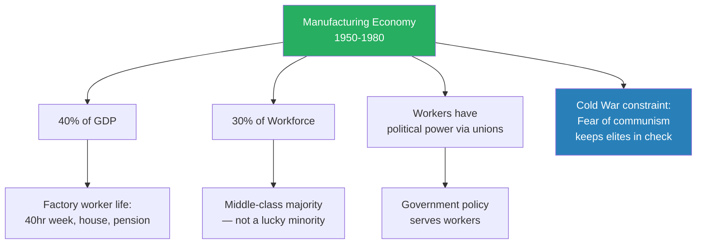
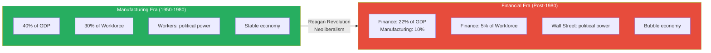
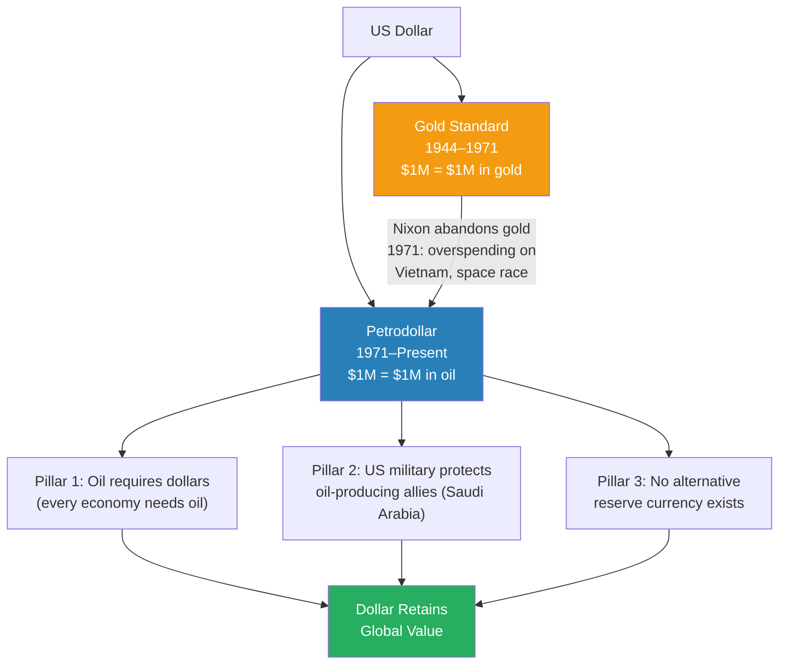
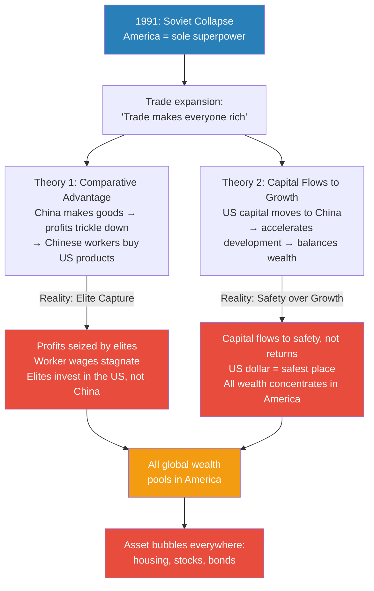
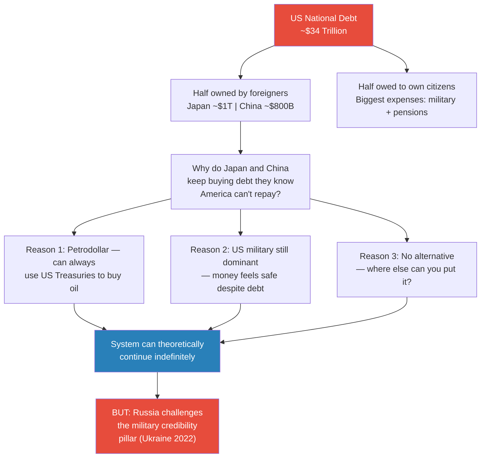
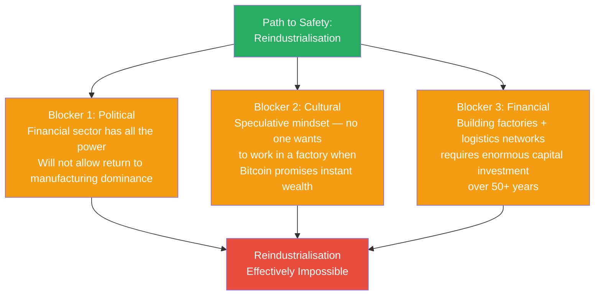
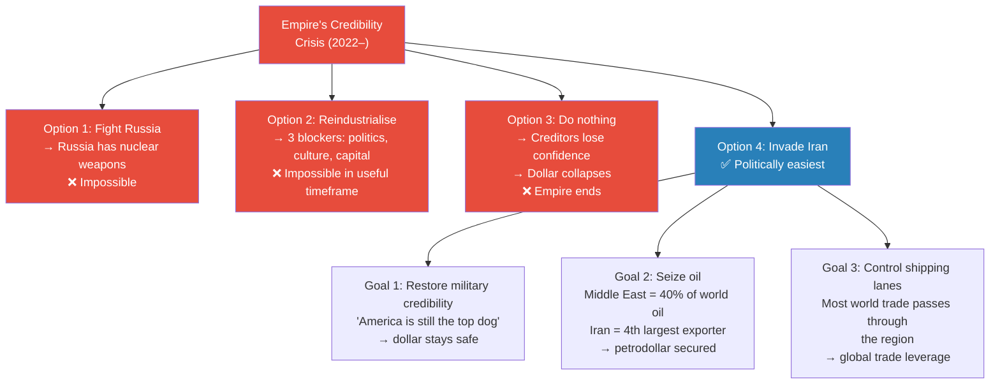
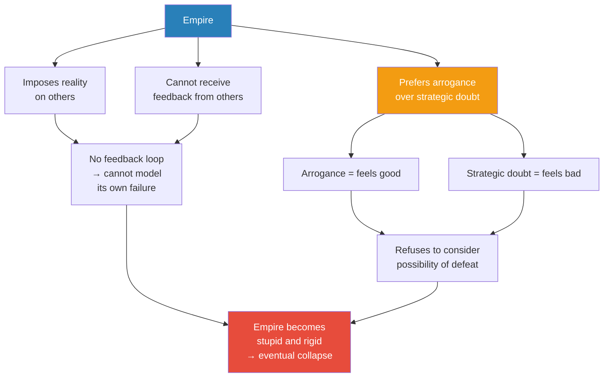

# How Empire is Destroying America

> Prof. Jiang delivers the second of his three predictions: the United States will go to war with Iran, and the reason is structural. America built the most prosperous working class in human history through manufacturing — then dismantled it to become a financial empire. That empire now depends on a single perception: that the US dollar is safe because America is militarily invincible. Russia's invasion of Ukraine has cracked that perception. Reindustrialisation is politically and culturally impossible. Invading Iran — to seize oil, control shipping lanes, and restore the image of dominance — becomes the least-bad option for an empire addicted to easy money and incapable of imagining defeat.

---

## Overview: Key Highlights

- <b style="color: #27ae60">America's 1950–1980 factory workers were the luckiest people on earth</b> — 40-hour weeks, home ownership, pensions, on a single salary
- <b style="color: #2980b9">Financialisation</b> — financial services now take 22% of GDP and 40% of profits, while employing only 5% of the workforce
- <b style="color: #e74c3c">The Reagan Revolution did not cause financialisation — empire did</b> — neoliberalism was the mechanism, empire is the master cause
- <b style="color: #2980b9">Petrodollar system</b> — Nixon abandoned gold in 1971 and replaced it with oil, tying the dollar's value to control of the Middle East
- <b style="color: #e74c3c">Both mainstream trade theories are false</b> — trickle-down fails because of elite capture; capital flows to safety, not growth
- <b style="color: #27ae60">The US holds 60% of all global stock wealth despite being one country</b> — a direct consequence of every nation's wealth draining into American markets
- <b style="color: #2980b9">Elite capture</b> — trade profits never reach workers; elites bank them in US Treasuries because there is nowhere safer to put money
- <b style="color: #e74c3c">America cannot reindustrialise</b> — three blockers: financial sector's political power, the speculative mindset that kills the factory work ethic, and the sheer investment required
- <b style="color: #2980b9">Imperial hubris</b> — empires cannot imagine defeat: they impose reality (no feedback), and arrogance feels better than strategic doubt
- <b style="color: #27ae60">Invading Iran solves three problems at once</b> — restore military credibility, control 40% of world oil, seize shipping lane dominance
- <b style="color: #e74c3c">America is addicted to easy money</b> — the system can survive, but only as long as the illusion of invincibility holds
- <b style="color: #2980b9">Fear of communism kept workers prosperous</b> — once ideology competition disappeared after 1991, the constraint on exploitation vanished

| Concept | One-line summary |
|---------|-----------------|
| **Financialisation** | Shift from making goods (40% GDP) to speculating with money (22% GDP, 40% profits, 5% jobs) |
| **Petrodollar system** | Oil is priced in dollars, so every economy needing oil must hold dollars |
| **Elite capture** | Trade profits are seized by a small elite instead of trickling down to workers |
| **Professional-managerial elite** | Coastal, Ivy League class that replaced factory workers as America's dominant political force |
| **Rentier economy** | Young people can only rent, never own — social mobility permanently destroyed |
| **Speculative mindset** | Bitcoin is more rational than factory work when the financial economy rewards gambling |
| **Imperial hubris** | Empires impose reality rather than receive it — no feedback loop, so defeat is unthinkable |
| **Paper tiger** | A power whose dominance is perception — what Russia is proving America has become |
| **Gold standard** | Pre-1971: every dollar was a receipt for gold, limiting money printing |
| **Three pillars of the dollar** | Petrodollar + military invincibility + no alternative = why creditors keep buying debt they know can't be repaid |
| **Comparative advantage** | Trade theory: each country specialises in what it does best — in practice, elite capture breaks the mechanism |
| **Deism** | The founding fathers' theology: God created the world but leaves humans free to shape it — foundation for the wealth-creation mandate |

---

# The Lecture

## Three Big Predictions [0:00 – 1:20]

*Prof. Jiang opens by reminding the class of the semester's three forecasts, then frames today's lecture as the structural explanation for prediction two — the Iran war — that goes deeper than the Israel lobby covered last time.*

> [!note]- Expand: Full Lecture Detail
> - Prof. Jiang opens by reminding the class of three predictions he made at the start of the semester:
>   - Trump will win in November
>   - The United States will go to war with Iran
>   - The United States will lose that war — permanently changing the global order
> - Last class covered one reason for the Iran war: the Israel lobby and Christian Zionism
> - Today's lecture covers what he considers the more fundamental reason: <b style="color: #e74c3c">the defence of empire</b>
> - America is not just a large country with a military — it is an empire, and empires must protect the economic systems that sustain them
> - The lecture will show that the decision to invade Iran is not ideological but structural — the only move left for an empire that cannot reinvent itself

---

## The Golden Age: American Workers 1950–1980 [1:20 – 4:30]

*Prof. Jiang begins with a portrait of the life a regular factory worker could expect in postwar America — painting it in deliberately personal, vivid terms before showing how systematically it was destroyed.*

> [!tip] Core Insight
> You were better off being born into the American middle class from 1950 to 1980 than being born rich in Africa, Asia, or South America. This was the wealthiest, most secure working class in human history — and it was built on manufacturing.

*Manufacturing's dominance created a self-reinforcing system: high employment → political power → policies that maintained high employment. The Cold War added a second stabiliser: treating workers well was an ideological necessity.*

> [!note]- Expand: Full Lecture Detail
> - Prof. Jiang lays out the manufacturing numbers: from 1950 to 1980, manufacturing accounted for 40% of GDP and employed 30% of the workforce
> - The WWII factories that had produced weapons pivoted to consumer goods — cars, electronics — and sold them to the world
> - He describes the life of a factory worker in that era in precise, personal terms:
>   - Worked 40 hours a week — not a minute more required
>   - Had full health insurance through the employer
>   - Could buy a house on a single income
>   - Wife did not need to work
>   - Could afford 3–4 children
>   - Owned two cars; went on vacation somewhere nice; ate out once a week
>   - Retired with a genuine pension
> - His summary: "It was really the best life"
> - Workers also had real political power — confident, middle-class, and organised through unions; government shaped policy in their favour
>
> > [!example] The Golden Age Factory Worker
> > - A typical 1960s factory worker in Detroit or Pittsburgh earned enough on one salary to support a family of five
> > - He worked a standard 40-hour week with guaranteed health insurance, paid vacation, and a defined pension
> > - The family owned a house, two cars, ate out weekly, and took annual holidays
> > - Prof. Jiang's comparison: this standard of living was higher than what wealthy families in most of Africa, Asia, and South America could expect
> > - The system was underpinned not just by economics but by ideology — American elites treated workers well partly out of fear that exploited workers might turn to communism
> > **The lesson:** The American middle class was not a natural equilibrium — it was held in place by manufacturing dominance and the ideological pressure of Cold War competition.
>
> - <b style="color: #2980b9">Fear of communism as the hidden stabiliser</b>: the real threat from the Soviet Union was never military — it was ideological
>   - If American workers felt exploited, they might embrace communism as an alternative
>   - So the system had a built-in check: treat workers well, or risk internal revolt
>   - Once communism ceased to be a credible competing ideology after 1991, that constraint vanished

---

## The Reagan Revolution and the Shift to Finance [4:30 – 9:49]

*Prof. Jiang pivots from the golden age to its destruction, introducing the numbers that show how completely the economy was reorganised — and naming two rival explanations before proposing his own.*

*Manufacturing fell from 40% to 10% of GDP while financial services rose to 22% — the economy did not simply evolve, it was restructured.*

> [!note]- Expand: Full Lecture Detail
> - After 1980: the Reagan Revolution introduces <b style="color: #2980b9">neoliberalism</b> — an economic philosophy centred on free markets and deregulation
> - The numbers reveal a complete transformation:
>
> | Metric | 1950–1980 | Today |
> |--------|-----------|-------|
> | Manufacturing share of GDP | 40% | 10% |
> | Financial services share of GDP | — | 22% |
> | Financial services share of profits | — | 40% |
> | Financial services share of workforce | — | 5% |
> | Political power base | Workers and unions | Wall Street and coastal elite |
>
> - Four cascading consequences of this shift:
>   - **Politics**: the <b style="color: #2980b9">professional-managerial elite</b> — coastal, Ivy League, multicultural — replaced factory workers as the most powerful political group; government now serves them, not workers; this has produced <b style="color: #e74c3c">massive political divisions</b>
>   - **Education**: top graduates in the 1950s wanted to be professors, scientists, or entrepreneurs; today they all want Wall Street — "PhDs in statistics and AI who should be developing technology are instead at hedge funds gambling with other people's money"
>   - **Economy**: the system became chronically unstable — dot-com crash 2001, financial crisis 2008, bank failures in 2023; all caused by the same mechanism: overpriced assets, speculative bubbles, and inevitable bursts
>   - **Inequality**: the top 1% capture a growing and disproportionate share; a <b style="color: #2980b9">rentier economy</b> emerged in which young people can never afford to buy a house — without home ownership there is no wealth accumulation, no social mobility
>
> > [!example] PhDs on Wall Street
> > - A brilliant statistics graduate in the 1950s would aspire to IBM or Bell Labs — building technology that would change the world
> > - Today, that same person heads straight to a hedge fund, designing algorithms to gamble with other people's money
> > - Pay on Wall Street is multiples of anything available in science, engineering, or education
> > - Prof. Jiang presents this as the clearest symptom of the disease: the nation's sharpest minds are engaged in speculation, not creation
> > **The lesson:** When financial services capture 40% of all profits while employing 5% of workers, they distort every incentive — including where the country's best talent goes.
>
> - Two mainstream explanations for why this happened — and why Prof. Jiang rejects both as incomplete:
>   - **Late-stage capitalism theory**: financialisation is the natural evolution of any capitalist economy — partial truth, but not a complete cause
>   - **Neoliberalism / Reagan Revolution theory**: deregulation and free markets directly caused over-financialisation — also a partial truth, but a mechanism not a root cause
> - Prof. Jiang's thesis: <b style="color: #27ae60">the real reason is empire</b> — after 1991, America set the rules of the global game so that all money would flow to America

---

## From the Declaration of Independence to Bretton Woods [9:49 – 17:00]

*To explain how America became an empire, Prof. Jiang traces the argument all the way back to 1776, showing that the founding philosophy contained — from the very beginning — the seeds of financial dominance.*

> [!note]- Expand: Full Lecture Detail
> - The founding fathers were <b style="color: #2980b9">deists</b> — they believed God created the world but does not manage human affairs, leaving humans empowered to shape the world as they choose
> - The Declaration of Independence enshrined three fundamental rights:
>   - **Life** — security and protection from enemies
>   - **Liberty** — freedom of speech, belief, and tolerance of all creeds
>   - **Pursuit of happiness** — Prof. Jiang emphasises Thomas Jefferson's specific meaning: <b style="color: #27ae60">the right to amass as much wealth as possible</b>
> - The founding logic: if every American is free to pursue wealth creation, the nation will become powerful — and the logic proved correct; America industrialised rapidly and by 1945 was the most powerful country on earth
>
> > [!example] The Bretton Woods Conference (1944)
> > - By 1944, Nazi Germany's defeat was certain; Japan's imminent — America would emerge as the world's richest nation
> > - American allies gathered at Bretton Woods, New Hampshire to design the post-war global financial system
> > - Core decision: the US dollar would become the global reserve currency — anything in the world could be bought with dollars
> > - Some economists warned this was dangerous: giving one government control of the reserve currency was like making them God, able to print money like King Midas
> > - The compromise: the gold standard — every dollar was a receipt for gold; one million dollars could be exchanged at any American bank for one million dollars' worth of gold
> > - Result: tremendous prosperity in America, Europe, and Japan for the next three decades
> > **The lesson:** Bretton Woods handed the United States structural financial dominance — but the gold standard was the constraint that kept the system honest. Removing it would change everything.

---

## Nixon's Gamble: The Petrodollar System (1971) [17:00 – 22:30]

*The pivotal hinge of the lecture: Nixon abandons the gold standard in 1971, and America must find a new foundation for the dollar's value. The solution — oil — creates a system that ties American financial power directly to control of the Middle East.*

> [!tip] Core Insight
> The dollar's value shifted from a commodity guarantee (gold) to a utility guarantee (you need oil, oil costs dollars). But oil-backed currency depends on controlling oil-producing regions — which is exactly why the Middle East became existentially important to American power.

*Three pillars, all ultimately dependent on the perception of American power. If military credibility cracks, the entire structure is threatened.*

> [!note]- Expand: Full Lecture Detail
> - By 1971, America had overspent: the space race, the Vietnam War, and domestic programs had drained the gold reserves
> - Nixon announced that America would leave the gold standard — the dollar was no longer convertible to gold
> - The existential question: if not gold, what gives the dollar value?
> - The answer: Middle Eastern nations — primarily Saudi Arabia — agreed that oil would be sold in US dollars
>   - Before 1971: one million dollars = one million dollars' worth of gold
>   - After 1971: one million dollars = one million dollars' worth of oil
> - Why this works: every economy on earth needs oil to function; therefore every economy on earth needs to hold US dollars
> - This was the birth of the <b style="color: #2980b9">petrodollar system</b> — and it made American financial dominance structural rather than merely political
>
> > [!example] Nixon Ends the Gold Standard (1971)
> > - America had overspent on Vietnam, the space race, and Great Society programs — the gold reserves could no longer back all dollars in circulation
> > - Nixon's announcement: the dollar was no longer convertible to gold
> > - The solution: Saudi Arabia and other Middle Eastern nations agreed to price oil exclusively in US dollars
> > - Every economy needing oil now needed dollars — giving the currency a new, energy-based foundation
> > - The petrodollar replaced one anchor (gold) with another (oil) — but oil-backed currency creates a geopolitical dependency: whoever controls the oil fields controls the dollar's value
> > **The lesson:** The moment America tied its currency to oil, the Middle East became not just strategically important but existentially necessary to American financial survival.

---

## 1991: Empire Begins, Trade Theory Fails [22:30 – 29:00]

*The Soviet Union falls, America becomes the sole ruler of the global economy, and the great experiment in free trade begins. Prof. Jiang walks through both mainstream trade theories — then demolishes them against the evidence of how money actually flows.*

*Both mainstream trade theories break down for the same structural reason: wealth concentrates among elites who then park it in America for safety, not in domestic development.*

> [!note]- Expand: Full Lecture Detail
> - After 1991, America told the world: focus on trade, because trade will make everyone rich
> - Prof. Jiang presents the two theories every economics undergraduate must learn:
>
> **Theory 1 — Comparative advantage (trade makes everyone rich):**
> - Each country specialises in its competitive advantage — China in cheap labour, America in technology
> - China makes goods for American consumers; in theory, profits trickle down to Chinese workers
> - Rising Chinese wages mean Chinese workers can buy American products (iPhones, etc.)
> - Over time, trade balances and both countries grow richer
>
> **Theory 2 — Capital flows to where it grows most:**
> - In a globalised world, investors should move money to wherever returns are highest
> - A million dollars buys one house in America but ten houses in China
> - So capital should flow from rich countries to developing ones, accelerating growth and eventually balancing wealth
>
> - Prof. Jiang's verdict: <b style="color: #e74c3c">both theories are false in practice</b>
>
> **Why Theory 1 fails — elite capture:**
> - Trade profits do not trickle down to Chinese workers; wages have stagnated relative to the gains from trade
> - Instead, profits are captured by a small elite — <b style="color: #2980b9">elite capture</b>
> - These elites cannot spend domestically fast enough, so they must invest — but where?
>
> **Why Theory 2 fails — safety over growth:**
> - Prof. Jiang: "You don't put your money where you make the most money — you put your money where it's most safe"
> - The US dollar is the global reserve currency; wealth is denominated in dollars; the safest place to hold dollars is in the US
> - So Chinese elites, Japanese elites, and elites everywhere park their money in American assets — not back in China or Japan
>
> > [!quote] Prof. Jiang
> > "You don't put your money where you make the most money. You put your money where it's most safe."
>
> - The result: starting in the 1990s, wealth from every corner of the world accumulated in the United States
> - Everything in America became overpriced; all assets became speculative bubbles
> - The stock market illustration: in 1900, the UK held 25% of global stock wealth; the US held 14.5%; Germany 13%; France 11%
> - Today: <b style="color: #27ae60">the United States holds 60% of all global stock wealth</b>; Japan is second with 6%; China — the world's second-largest economy — holds only 3%
> - The disparity is staggering: one country holds 60% of global equity; the second-place country holds 6%

---

## The $34 Trillion Debt and Why It Doesn't Matter (Yet) [29:00 – 33:30]

*Prof. Jiang confronts the elephant in the room: America's national debt is $34 trillion and can never realistically be repaid. He explains the paradox of why creditors keep lending anyway — and what it would take to break the system.*

*The debt trap is self-reinforcing: creditors keep lending because there is nowhere else to go — but that trap depends entirely on the military credibility that Russia is now actively undermining.*

> [!note]- Expand: Full Lecture Detail
> - The US national debt stands at approximately $34 trillion
> - Half is owned by foreigners: Japan holds about $1 trillion; China holds about $800 billion in US Treasuries
> - The debt carries interest and is growing at roughly $1–2 trillion every two to three months
> - The conclusion is clear: "There is absolutely no way that America can pay all this debt"
> - Prof. Jiang poses the question directly to the class: if Japan and China know America can never truly repay, why do they keep buying US Treasuries?
>
> Three reasons:
> - **Reason 1 (petrodollar)**: Japan and China can always take their US Treasuries and use them to buy oil — the petrodollar connection gives the debt practical utility
> - **Reason 2 (military power)**: America remains the greatest military power in the world — money placed in the US feels safe because no one can challenge it militarily
> - **Reason 3 (no alternative)**: there is simply nowhere else to put this money; no other asset or currency offers comparable safety and scale
>
> - The result: the system can theoretically go on forever — the debt might reach $40 or $50 trillion and the logic still holds, as long as all three pillars remain intact
> - The critical vulnerability: **Reason 2 — military credibility**
> - In 2022, Russia invaded Ukraine: "What Putin is really saying is — I think your empire is based on nothing. I'm going to prove you're a paper tiger"
> - If Putin succeeds, the fundamental assumption that America is militarily invincible will be destroyed, and with it, the entire financial system built on that assumption

---

## Why America Cannot Reindustrialise [33:30 – 38:00]

*The logical escape route — rebuilding the manufacturing economy that made America genuinely strong — turns out to be blocked by three structural obstacles, each harder than the last.*

> [!tip] Core Insight
> America could theoretically escape the empire trap by reindustrialising — but the three blockers (political, cultural, financial) make this effectively impossible within any timeframe that matters.

*Each blocker alone would be difficult. All three together, reinforcing each other, make reindustrialisation effectively impossible within any useful timeframe.*

> [!note]- Expand: Full Lecture Detail
> - Prof. Jiang acknowledges the obvious solution: if America could transition back from a financial economy to a manufacturing economy, it would solve everything
>   - No need to worry about the debt
>   - No need to worry about Russia
>   - No need to worry about the world — America is self-sufficient in resources and could sustain itself without global trade
> - But three blockers make this impossible:
>
> **Blocker 1 — Political:**
> - A student (Jack) correctly identifies it first: "The financial sector has too much political power"
> - The financial sector does not want to return to a world where manufacturing holds the power — it would lose dominance
> - Any attempt to reindustrialise faces ferocious political opposition from the most powerful lobby in the country
>
> **Blocker 2 — Cultural (the speculative mindset):**
> - Prof. Jiang argues this is actually the bigger problem
> - The financial economy has created a <b style="color: #e74c3c">speculative mindset</b>: nobody wants to work hard anymore
> - "If you're a young person, you would much rather spend your time investing in Bitcoin than working in a factory"
> - Bitcoin offers the chance to get rich; factory work means 40 years of hard labour to buy a house
> - The rational economic choice — for an individual — is speculation
> - You cannot build factories without workers willing to do factory work
>
> **Blocker 3 — Capital:**
> - Building factories is not just about factories — it requires logistics networks, supply chains, infrastructure
> - The capital investment is enormous and the timeline is decades: "It took about 50 years to reindustrialise"
> - That investment won't come from a financial sector incentivised to create speculative assets

---

## Why Invading Iran Solves Three Problems at Once [38:00 – 42:42]

*With Russia unbeatable (nuclear weapons), reindustrialisation politically impossible, and the empire's financial credibility cracking, Prof. Jiang arrives at the conclusion: invading Iran is what remains when all other options are blocked.*

> [!tip] Core Insight
> Of all the options available to a financial empire facing a credibility crisis, invading Iran is politically the easiest. It is not a sign of strength — it is the desperate move of a system that has run out of better choices.

*The Iran war is not chosen because it is a good option — it is chosen because it is the only option that doesn't immediately destroy the empire.*

> [!note]- Expand: Full Lecture Detail
> - Prof. Jiang presents the decision as a process of elimination:
>   - Cannot fight Russia — nuclear weapons make direct war with Russia unthinkable
>   - Cannot reindustrialise — three blockers make it politically, culturally, and financially impossible within a relevant timeframe
>   - Cannot sit back and let the empire collapse — if China, Japan, and other creditors lose confidence and sell US Treasuries, America faces a sovereign debt crisis and loses access to the "easy money" the system depends on
> - What remains: invade Iran
>
> Three things an Iran invasion accomplishes:
> - **Goal 1 — Restore military credibility**: show the world that America is still the top military power; make foreign investors holding trillions in US assets feel safe again
> - **Goal 2 — Seize oil**: the Middle East produces 40% of the world's oil; Iran is the world's fourth-largest oil exporter; controlling Iran also means controlling Iraq — securing the petrodollar's foundation directly
> - **Goal 3 — Control global shipping lanes**: most of the world's trade passes through the region; controlling it gives America leverage over the entire global economy
>
> - Prof. Jiang's summary: "The motivation would be to save the American empire, because if Putin wins in Ukraine, America is going to look like a paper tiger"
> - He points to cascading effects already visible: African nations rebelling against French (American) influence, Hamas attacking Israel — all traceable to Putin's demonstration that American military dominance can be challenged
> - The key driver: <b style="color: #e74c3c">America is an empire addicted to easy money</b> — "People are so used to sitting around making millions of dollars that they cannot imagine or tolerate having to go back to working hard"
>
> > [!quote] Prof. Jiang
> > "America is an empire addicted to easy money."

---

## Imperial Hubris: Why Empires Cannot Imagine Defeat [42:42 – 47:00]

*A student (Jack) raises the obvious objection: if invading Iran is meant to restore confidence, losing the war would destroy even more confidence. Prof. Jiang's answer reveals something fundamental about how empires work — and why they all eventually fall.*

> [!tip] Core Insight
> Empires cannot imagine defeat because they are structurally designed to suppress feedback — and because arrogance feels better than strategic doubt. This is not a personality flaw; it is a feature of power that eventually becomes fatal.

*The feedback loop failure and the emotional preference for arrogance are independent mechanisms that reinforce each other — making imperial hubris self-reinforcing and self-destructive.*

> [!note]- Expand: Full Lecture Detail
> - A student (Jack) raises the contradiction: "If going to Iran is about restoring confidence, and America loses the war, that would destroy even more confidence"
> - Prof. Jiang responds: "This is the problem of empires — imperial hubris"
> - <b style="color: #2980b9">Imperial hubris</b>: the empire cannot imagine the possibility of losing a war
>
> Two reasons:
>
> **Reason 1 — The feedback loop problem:**
> - An empire is a force that imposes reality on others — it makes others see the world the way the empire wants them to see it
> - This means there is no feedback loop: you cannot tell the empire what you actually think; your voice doesn't matter
> - Without feedback, the empire cannot model the possibility of its own collapse
> - If it could genuinely model it, it would take preventive action and never collapse in the first place
>
> **Reason 2 — The psychology of arrogance:**
> - Prof. Jiang poses a thought experiment: if you had a choice, would you rather be smart and strategic or stupid and arrogant?
> - The answer, he argues, is stupid and arrogant — "because it makes you feel good"
> - Smart people get depressed; they doubt themselves; they question their assumptions — this feels bad
> - Stupid people feel good about themselves, always
> - When an empire has too much power, it chooses arrogance because arrogance feels good
> - The result: it refuses to consider the possibility it could be wrong
>
> - The connection to the Cold War: before 1991, America had to behave because it feared communism as an ideology — not the Soviet Union militarily, but communism as a competing vision that might attract America's own workers
> - After 1991, no competing ideology remained to check American arrogance
> - The empire is now free to do whatever it wants — and that freedom is ultimately what will destroy it

---

## The Asset Bubble Trap and the Unsustainable System [42:42 – 43:43]

*A brief but important coda: Prof. Jiang explains why the financial system, even at its most powerful, is self-undermining. The very success of drawing global wealth into America is destroying the value of American assets.*

> [!note]- Expand: Full Lecture Detail
> - All global wealth now flows into American assets: stocks, houses, bonds
> - The problem: too many rich people in the world, all forced into the same narrow set of assets
> - The result: all American assets are now bubbles — overpriced relative to any fundamental value
> - The irony: "You feel your only option is to invest in America, but when you do, you're actually losing value"
> - The system is self-undermining:
>   - Global wealth flows to America → asset prices inflate → bubbles form → individual wealth is destroyed when bubbles burst → yet there is still nowhere else to go
> - <b style="color: #e74c3c">The system is not sustainable</b> — it can continue for a while, but eventually the bubbles destroy the very wealth they were meant to preserve
> - Wall Street's perverse incentive structure makes this worse: fund managers are paid management fees based on assets under management, not on actual returns — so they are incentivised to design riskier and riskier products to attract more capital, regardless of whether clients actually profit
>
> > [!quote] Prof. Jiang
> > "Everyone's going to America, and that's pushing up all these asset prices — but in the long term, that will destroy the American economy."

---

## Connections

**Builds on:**
- [[01 - Iran's Strategy Matrix]] — Iran's asymmetric war doctrine, which makes the US invasion plan dangerous despite American conventional superiority
- [[02 - Christian Zionism and the Middle East Conflict]] — the theological and lobbying pressure that makes Iran war politically desirable in Washington

**Sets up:**
- The third prediction: the United States will lose the war — this lecture explains why the financial system makes war necessary, and [[01 - Iran's Strategy Matrix]] explains why it will be lost

**Related books in vault:**
- [[The Wealth of Nations - Adam Smith]] — comparative advantage and trade theory, which Prof. Jiang tests against imperial reality and finds wanting
- [[Sapiens - Yuval Noah Harari]] — the macro-scale view of how civilisations trap themselves in systems that began as advantages; the empire trap mirrors the agricultural trap
- [[The 48 Laws of Power - Robert Greene]] — Law 1: Never outshine the master; the petrodollar system forces every nation to keep America powerful even against their own interests
- [[Thinking Fast and Slow - Daniel Kahneman]] — System 1 and System 2 thinking parallels imperial hubris: empires choose the fast, emotionally satisfying response (arrogance) over the slow, effortful one (strategic doubt)

---

## The Takeaway

This lecture is about structural inevitability. Prof. Jiang is not making a moral argument about American imperialism — he is making a mechanical one. A financial empire that has pooled 60% of global stock wealth within its borders, that depends on the petrodollar for the dollar's value, that has 30 million dollars in national debt growing faster than GDP, and that has made its entire educated class rich through speculation rather than production — that empire cannot simply decide to be different. The structure is the destiny.

The most counterintuitive insight is that the wealth concentration which looks like American power is actually the source of American fragility. Every trillion dollars that flows from China, Japan, and the Gulf states into American assets is not a sign that investors trust America — it is a sign that they have nowhere else to go. Trust and captivity look identical from the outside. The day a credible alternative emerges, the entire system unwinds simultaneously.

What remains open is the question of timing and mechanism. Prof. Jiang leaves implicit what the losing war in Iran would actually trigger — whether a controlled retrenchment, a currency crisis, or a more chaotic unravelling. The lecture establishes the logic of the trap but does not model the exit. That question — what comes after the American empire — runs through the rest of the series.
