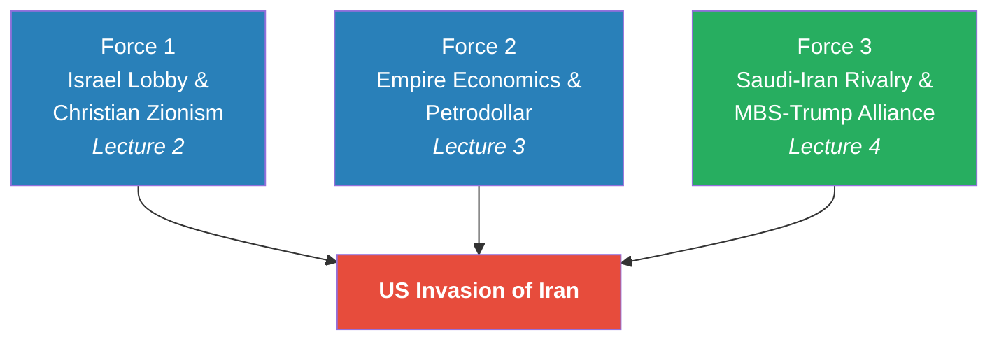
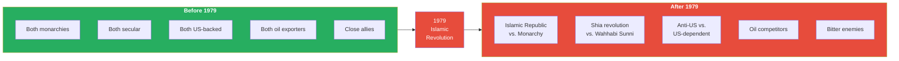
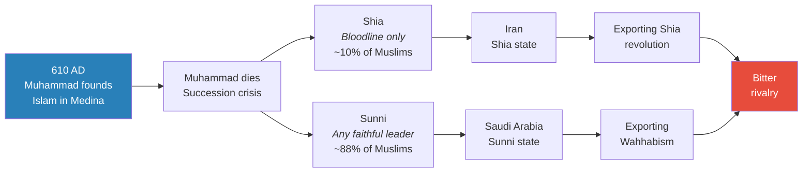
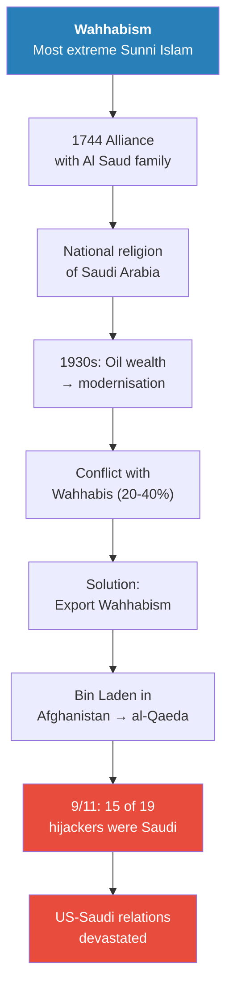
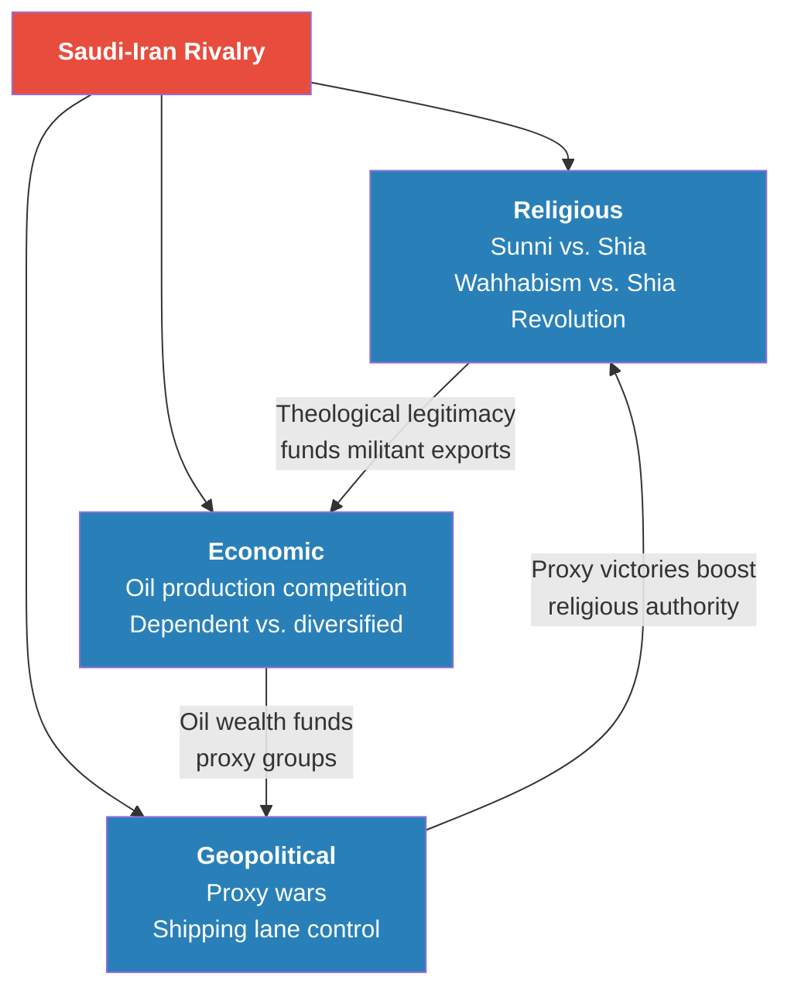
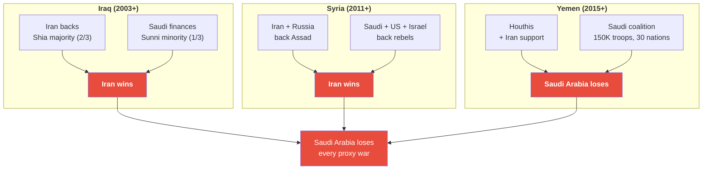
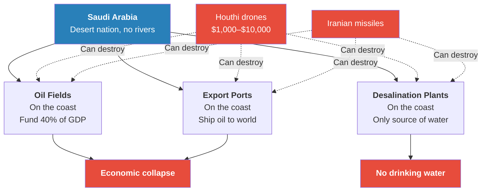
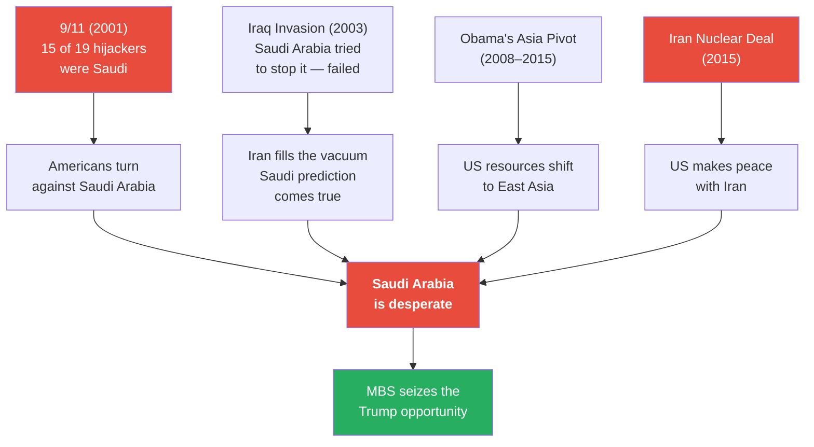
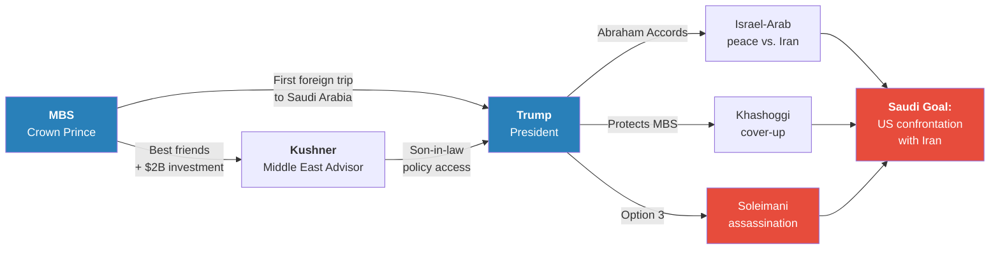

# Saudi Arabia's Trump Card Against Iran

> Most people assume Iran's greatest enemy is Israel. Prof. Jiang argues they are wrong — Iran's real enemy is Saudi Arabia. Before 1979, the two nations were close allies: both monarchies, both secular, both oil-rich, both sheltered by American power. Then the Islamic Revolution detonated like a political earthquake, turning allies into ideological enemies competing across three dimensions — religion, economics, and geopolitical influence. Saudi Arabia has lost every proxy war it has fought against Iran, discovered that its entire economy can be destroyed by cheap drones, and concluded that only America can save it. This lecture completes the three-force model driving the United States toward war with Iran: the Israel lobby (Lecture 2), empire economics (Lecture 3), and now the Saudi-Iran rivalry — the force that comes with a face, a name, and a $2 billion financial trail.

---

## Overview: Key Highlights

- <b style="color: #27ae60">Iran's real enemy is Saudi Arabia, not Israel</b> — most people have this backwards; the Saudi-Iran rivalry is the third and final force driving America toward war
- <b style="color: #2980b9">The 1979 Islamic Revolution</b> — transformed Saudi Arabia and Iran from close allies (both monarchies, secular, US-backed) into irreconcilable enemies in a matter of months
- <b style="color: #e74c3c">Saudi Arabia lost all three proxy wars</b> — in Iraq, Syria, and Yemen — proving it cannot defeat Iran by itself, no matter how many troops or advanced weapons it deploys
- <b style="color: #2980b9">Shock and awe failed in Yemen</b> — 150,000 troops, 30-nation coalition, advanced American weapons; the Houthis used $10,000 drones to destroy Saudi oil infrastructure worth billions
- <b style="color: #e74c3c">Saudi Arabia's triple vulnerability</b> — oil dependence (40% GDP, 75% revenue), exposed coastal infrastructure, and no fresh water — means Iran can destroy the entire Saudi economy without an invasion
- <b style="color: #2980b9">Wahhabism</b> — the most extreme form of Sunni Islam, Saudi Arabia's national religion since 1744, exported globally to manage domestic extremists — and the source of al-Qaeda and 9/11
- <b style="color: #27ae60">MBS identified Trump as Saudi Arabia's reset opportunity</b> — cultivated Kushner, brokered the Abraham Accords, and bragged privately that Kushner was "in my pocket"
- <b style="color: #e74c3c">The Soleimani assassination</b> — both Bush and Obama refused to kill Iran's second-most powerful man, believing it would start World War Three; Trump chose it as "Option 3" after the Pentagon designed it to be unchosen
- <b style="color: #2980b9">The $2 billion investment</b> — after leaving office, Kushner set up a private equity fund; MBS invested $2 billion, the financial evidence of what had been a political relationship
- <b style="color: #e74c3c">If Trump wins a second term</b>, Prof. Jiang argues it is very likely he will declare war on Iran — completing the convergence of all three forces
- <b style="color: #27ae60">The Sunni-Shia split</b> — a 7th-century succession dispute that became the theological fault line of 21st-century Middle East geopolitics; Saudi Arabia is Sunni, Iran is Shia

| Concept | One-line summary |
|---------|-----------------|
| **The 1979 Islamic Revolution** | Bottom-up revolution replaced Iran's secular monarchy with an Islamic Republic, turning allies into enemies |
| **Sunni-Shia split** | 7th-century dispute over who succeeds Muhammad — bloodline (Shia) vs. merit (Sunni) — still driving Middle East conflict |
| **Wahhabism** | Most extreme Sunni Islam; Saudi Arabia's national religion since 1744, exported globally as a safety valve for domestic fanatics |
| **Proxy wars** | Saudi Arabia and Iran fight through local proxies — Saudi Arabia lost all three: Iraq, Syria, Yemen |
| **Shock and awe** | Saudi Arabia's Yemen strategy: overwhelming conventional force for rapid victory — failed for same reasons as the Millennium Challenge |
| **Triple vulnerability** | Oil dependence + coastal infrastructure + no fresh water = Saudi Arabia can be destroyed without an invasion |
| **Vision 2030** | MBS's plan to diversify the Saudi economy before oil runs out — a race against a ticking clock |
| **Abraham Accords** | Israel-Arab normalisation agreements; built the coalition infrastructure for a coordinated campaign against Iran |
| **MBS-Kushner triangle** | Saudi Arabia's mechanism for purchasing American foreign policy — cultivated Kushner, influenced Trump, bought impunity |
| **Soleimani assassination** | Trump killed Iran's No. 2 — an act both Bush and Obama refused; Prof. Jiang says it nearly started World War Three |
| **The $2 billion** | MBS invested $2 billion in Kushner's post-office private equity fund — the financial receipt for American foreign policy |

---

# The Lecture

## Reviewing the Three-Force Model [0:00 – 1:30]

*Prof. Jiang opens by reviewing where the series stands — two forces already established — before introducing the third and most personal one.*

> [!tip] Core Insight
> Iran's primary enemy is not Israel. It is Saudi Arabia. The two were close allies in 1979. A political earthquake destroyed that alliance in months — and the consequences of that destruction are still pushing the world toward a war no rational actor would choose.

*Each force is independently sufficient to push the United States toward war. Together, they create a convergence of theological, economic, and geopolitical pressure that no president can easily resist.*

> [!note]- Expand: Full Lecture Detail
> Prof. Jiang opens the class with a review. "So let's review where we are," he says. "We are discussing or exploring why the United States would want to invade Iran, and so far, we have two good reasons."
>
> He recaps the two forces already covered:
>
> - <b style="color: #2980b9">Force 1 — The Israel Lobby (Lecture 2):</b> Millions of Christian Zionists believe a war in the Middle East — specifically between Israel and Iran — will bring Jesus back to Earth. "They want their God, Jesus to return to Earth, and they believe that a war in the Middle East will force him to return." That is the first reason.
> - <b style="color: #2980b9">Force 2 — Empire Economics (Lecture 3):</b> America is $34 trillion in debt, growing by a trillion every two months. It can sustain this only as long as the world fears American military power. Putin's invasion of Ukraine is eroding that fear. America must demonstrate it is still the military hegemon — and invading Iran is how you do that.
>
> Today, he introduces the third and final force: the conflict between Saudi Arabia and Iran. He makes the key claim directly: "Most people think that Iran's major enemy in the Middle East is Israel. In fact, Iran's major enemy is Saudi Arabia. These two are bitter rivals — and to understand why, we have to look at their history."

---

## Before 1979: When Enemies Were Friends [1:30 – 3:00]

*Prof. Jiang sets the scene with a geography lesson and an inventory of everything Saudi Arabia and Iran had in common — before 1979 destroyed all of it.*

*The 1979 revolution reversed every single feature that had made Saudi Arabia and Iran allies. What had been a stable, US-aligned partnership became an ideological rivalry that would reshape the Middle East for the next half-century.*

> [!note]- Expand: Full Lecture Detail
> Prof. Jiang draws the map on the board: Iran next to Iraq, Saudi Arabia down below, Egypt, Yemen, Oman, the Strait of Hormuz, the Suez Canal, the Red Sea.
>
> "In 1979 Saudi Arabia and Iran were very good friends," he tells the class. He lists the similarities:
>
> - Both were monarchies — ruled by a king
> - Both were secular — religion and politics separated
> - Both relied on American power to defend themselves
> - Both were prosperous oil exporters
>
> "There was a general consensus agreement in the Middle East that religion and politics would be separated." That consensus held — and then a bottom-up revolution obliterated it.
>
> The 1979 Islamic Revolution in Iran was driven by three popular demands:
>
> - No monarchy — the people refused to be ruled by a king
> - No American interference — the Shah had been supported by the US military and the people wanted it gone
> - Islamic law — as Muslims, they demanded their government be focused on Islamic governance
>
> "In a referendum, 98% of the people of Iran voted to install an Islamic Republic to replace their monarchy. And this was completely unexpected, and this caused an earthquake throughout the Middle East."
>
> Each of the revolution's three demands was a direct threat to Saudi Arabia's existence:
>
> - If monarchy is illegitimate in Iran, why is it legitimate in Saudi Arabia?
> - If American interference is unacceptable in Iran, why is it acceptable in Saudi Arabia?
> - If Islamic law should govern Iran, why does Saudi Arabia serve Western secular interests?
>
> The revolution was a template that could be applied to Saudi Arabia itself — and within months, someone tried.
>
> > [!example] The Siege of Mecca (November 1979)
> > - In November 1979, just months after the Islamic Revolution, 600 religious extremists besieged Mecca — the holiest city in Islam
> > - Mecca is the birthplace of the Prophet Muhammad and the destination of the Hajj pilgrimage
> > - The 600 extremists were Wahhabis — adherents of the most extreme form of Sunni Islam
> > - They made the same three demands as the Iranian revolution: the Saudi monarchy must abdicate, the US must withdraw, Saudi Arabia must be governed by Islamic law
> > - The revolt was crushed by the Saudi military
> > - But the message was unmistakable: the revolution could spread
> > **The lesson:** From that day on, Iran and Saudi Arabia became bitter enemies — both trying to impose their version of Islam on the Middle East.

---

## The Sunni-Shia Fault Line [3:00 – 7:00]

*The rivalry between Saudi Arabia and Iran is not just political — it is theological. And the theological dimension reaches back not decades but centuries, to a dispute over who should lead Islam after the Prophet Muhammad died.*

*A 7th-century theological dispute about succession became the fault line for a 21st-century geopolitical rivalry — with Saudi Arabia and Iran each claiming to represent the true version of Islam.*

> [!note]- Expand: Full Lecture Detail
> Prof. Jiang traces the split to its origins. In 610 AD, the Prophet Muhammad had a vision in the city of Medina to found Islam. He spread the religion throughout the Arab world. But when Muhammad died, a problem arose: who would succeed the Prophet as leader?
>
> Two answers emerged:
>
> - <b style="color: #2980b9">The Shia position:</b> Only people of Muhammad's bloodline can be leaders — leadership is hereditary, tied to the Prophet's family
> - <b style="color: #2980b9">The Sunni position:</b> Anyone who proves himself competent and faithful to the religion can be leader — leadership is earned, not inherited
>
> "For hundreds of years, these two groups, the Sunni and the Shia, fought a war over the succession, and this led to a bit of rivalry that's lasted to this day." Prof. Jiang is candid about the complexity: "No one actually knows" the full depth of the differences.
>
> The demographics matter: approximately 88% of the world's Muslims are Sunni; about 10% are Shia. Saudi Arabia is a Sunni country; Iran is a Shia country. After the 1979 revolution, Iran committed itself to spreading the Shia revolution throughout the world.
>
> Saudi Arabia's authority claim rests on geography: it controls Mecca and Medina, Islam's two holiest cities. Every Muslim must make the Hajj pilgrimage to Mecca once in their lifetime. Controlling those cities is the source of Saudi religious authority.
>
> Iran's counter-argument is devastating in its simplicity: Saudi Arabia is ruled by a king (anti-Muslim), defended by the US military (anti-Muslim), and therefore is a heresy. "Iran has dedicated itself to subverting Saudi Arabia's authority."
>
> > [!abstract] The Battle for Islamic Leadership
> > | Claim | Saudi Arabia (Sunni) | Iran (Shia) |
> > |-------|---------------------|-------------|
> > | **Basis of authority** | Controls Mecca and Medina — Islam's holiest cities | Led a popular Islamic revolution — government by Islamic law |
> > | **Theological position** | Any faithful Muslim can lead (Sunni) | Only the Prophet's bloodline can lead (Shia) |
> > | **Accusation against rival** | Iran spreads a heretical minority sect | Saudi Arabia is a Western puppet ruled by illegitimate kings |
> > | **Global strategy** | Export Wahhabism through schools, mosques, militants | Export Shia revolution through proxy groups and alliances |
> > | **Share of global Muslims** | ~88% Sunni | ~10% Shia |

---

## Wahhabism: Saudi Arabia's Dangerous Export [7:00 – 12:00]

*Prof. Jiang introduces the element that makes Saudi Arabia's situation uniquely paradoxical: the most extreme form of its own religion is simultaneously the source of its legitimacy, its greatest internal threat, and the spark that ignited its worst foreign policy disaster.*

*Saudi Arabia's Wahhabi problem is a trap with no good exit: suppress them domestically and risk revolution; export them globally and risk blowback. The export strategy that was supposed to protect the monarchy eventually produced 9/11.*

> [!note]- Expand: Full Lecture Detail
> In 1744, the Wahhabis — the most extreme Islamic group — made an alliance with the Al Saud family. The deal: Wahhabism would become the national religion of Saudi Arabia; in return, the Wahhabis would swear political allegiance to the Al Saud monarchy.
>
> This arrangement worked — until the 1930s, when oil was discovered. Saudi Arabia had the most valuable oil resources in the world. As oil money poured in, Saudi Arabia tried to become more Western, more secular, more modern. This brought the government into direct conflict with the Wahhabis.
>
> Prof. Jiang gives the key numbers: Wahhabis account for 20–40% of Saudi Arabia's population — "a very significant group." More important, "Wahhabi people tend to be extremely fanatical." The 1979 Mecca siege was carried out by Wahhabis. Wahhabis were also responsible for terrorist attacks against tourists and foreigners inside Saudi Arabia.
>
> Saudi Arabia's solution to its Wahhabi problem was to export it: fund Wahhabi religious schools, mosques, and militant organisations across the Muslim world. The logic — if the fanatics are busy spreading the faith abroad, they are not overthrowing the monarchy at home.
>
> > [!example] Osama bin Laden and the Export of Wahhabism (1980s–2001)
> > - Osama bin Laden was a Saudi citizen — a product of the Saudi system
> > - He was responsible for spreading Wahhabism in Afghanistan
> > - This is what started al-Qaeda
> > - Saudi Arabia's strategy of exporting extremism to manage its domestic problem created the most dangerous terrorist organisation in the world
> > - 15 of the 19 hijackers on 9/11 were Saudi citizens
> > - This devastated US-Saudi relations — Americans did not just blame al-Qaeda, they blamed Saudi Arabia
> > **The lesson:** Saudi Arabia's attempt to solve its Wahhabi problem by exporting it did not eliminate the threat — it globalised it, and the blowback nearly destroyed the US-Saudi alliance the monarchy depended on.
>
> The irony is sharp: Saudi Arabia's export strategy was designed to protect the monarchy. It ultimately produced 9/11, which turned America against Saudi Arabia, which left Saudi Arabia exposed to Iran. The internal problem became an external catastrophe, which became the diplomatic crisis that eventually drove Saudi Arabia into the arms of Donald Trump. Every thread in this lecture connects back to this paradox.

---

## Three Dimensions of Rivalry [12:00 – 15:00]

*The Saudi-Iran rivalry is not a single conflict but a war fought simultaneously across three dimensions — religious, economic, and geopolitical. Each intensifies the others, making the rivalry virtually impossible to resolve by addressing only one.*

*Each dimension feeds the others: religious authority justifies economic competition, oil wealth funds proxy wars, and proxy victories reinforce claims to religious leadership. No single diplomatic effort can resolve the rivalry.*

> [!note]- Expand: Full Lecture Detail
> **The Economic Dimension**
>
> Prof. Jiang gives the numbers and the asymmetry is stark:
>
> - Saudi Arabia: 40% of GDP from oil, 75% of government revenue from oil, world's #1 oil exporter, does not collect taxes from citizens — it just sells oil
> - Iran: world's #4 oil exporter, but has a diversified economy — "a very well educated population that does all sorts of different activities: science, art, education"
>
> The structural conflict: Saudi Arabia wants to cut production to raise oil prices and maximise profits. Iran wants to sell as much oil as possible to boost its economy — especially when sanctions are lifted. "There's economic conflict between these two countries."
>
> **The Geopolitical Dimension**
>
> Iran's motivation traces back to the Iran-Iraq War (1980–1988). After the 1979 revolution, Saudi Arabia and the US encouraged Iraq to invade Iran. That war cost the lives of millions of Iranians. From that point on, Iran adopted a policy of aggressive intervention in the Middle East — financing Hamas and Hezbollah to distract Israel, building proxy networks to create strategic depth.
>
> Saudi Arabia's motivation is economic survival: as the world's #1 oil exporter, it must control the shipping lanes. The two critical chokepoints — the Strait of Hormuz and the Suez Canal — carry 40% of all the world's oil, mainly to China, South Korea, and Japan.
>
> "Because of these geopolitical tensions, Iran and Saudi Arabia have fought three proxy wars. They fought three shadow wars."

---

## Three Proxy Wars — Saudi Arabia Loses All Three [15:00 – 22:00]

*Saudi Arabia fought Iran's proxies in Iraq, Syria, and Yemen — and lost every time. The defeats grew progressively worse, and the third one was existential.*

*Three proxy wars, three Iranian victories — each escalating in severity and proximity to Saudi Arabia. Iraq was a distant loss. Syria was a humiliating loss with American and Israeli partners. Yemen was an existential loss on Saudi Arabia's own border.*

> [!note]- Expand: Full Lecture Detail
> **Proxy War 1 — Iraq (2003 onwards)**
>
> America invaded Iraq in 2003 and destroyed the country. A power vacuum emerged. Iran moved in to fill it — and it had a decisive advantage: two-thirds of Iraq's population were Shiite.
>
> Saudi Arabia financed the one-third Sunni population against the Shia majority. Many analysts believe Saudi Arabia also funded ISIS, "because ISIS really hates the Shia religion." Over time, Iran proved far more effective. "Basically Iran now controls much of Iraq." Iran won the first proxy war.
>
> > [!example] The Iraq Proxy War (2003 onwards)
> > - The US invasion destroyed Iraq's government and created a power vacuum
> > - Iran leveraged the two-thirds Shiite population — demographic advantage that Saudi money could not overcome
> > - Saudi Arabia financed Sunni militias, fuelling a violent sectarian civil war
> > - Many analysts believe Saudi Arabia also financed ISIS for its extreme anti-Shia stance
> > - Iran proved far more effective at projecting power through committed, ground-level proxy engagement
> > - Iran now effectively controls much of Iraq
> > **The lesson:** Demographic reality defeats financial intervention. Iran's model of deep proxy engagement outperformed Saudi Arabia's model of remote financing.
>
> **Proxy War 2 — Syria (2011 onwards)**
>
> Syria's leader Assad faced a rebellion. Saudi Arabia, America, and Israel all supported the rebels. Iran and Russia backed Assad. "Over time, Assad was able to crush the rebellion." Iran won the second proxy war — despite Saudi Arabia having the United States and Israel as partners.
>
> **Proxy War 3 — Yemen (2015–present): The War That Changed Everything**
>
> Yemen was not a distant conflict — it was on Saudi Arabia's border. The Houthis were Shia mountain villagers launching a rebellion. Saudi Arabia feared they would become Iranian proxies on the Saudi border. Its response was massive:
>
> - 150,000 Saudi Arabian troops
> - Warplanes with advanced American weapons and technology
> - Coalition of over 30 nations including Egypt and the UAE
> - Named "Operation Decisive Storm"
>
> The strategy was shock and awe: "Go in. Go fast. Be decisive. Destroy your enemy." And it failed comprehensively.
>
> Why it failed:
>
> - The Houthis were in the mountains — Saudi bombs could not reach them. What the bombs did was kill civilians, "so you're basically uniting the entire population against you"
> - The Houthis responded with cheap drones — costing $1,000 to $10,000 — that destroyed Saudi oil fields and ports worth billions
> - Saudi Arabia has no fresh water. It is a desert with no rivers. It relies entirely on desalination plants on the coast — "and guess what guys, the coast" — easily targeted by drones and missiles
>
> > [!example] Operation Decisive Storm: How 150,000 Troops Lost to Mountain Villagers (2015–present)
> > - Saudi Arabia launched its largest military operation: 150,000 troops, 30+ nation coalition, advanced American weapons
> > - The Houthis retreated into the mountains where air strikes could not reach them
> > - Saudi bombs killed civilians instead, uniting the Yemeni population against Saudi Arabia
> > - Houthis retaliated with cheap drones ($1,000–$10,000) that destroyed Saudi oil fields and ports worth billions
> > - Saudi Arabia's desalination plants — its only source of fresh water — sit exposed on the coastline
> > **The lesson:** Military superiority is meaningless when the enemy can destroy your economy faster than you can destroy their fighters.
>
> **Three Lessons from Three Defeats**
>
> Prof. Jiang identifies the three conclusions Saudi Arabia drew from its proxy war record:
>
> 1. To defeat the Houthis, Syrians, and Iraqis, Saudi Arabia must first defeat Iran — all three proxy enemies are Iranian-backed, and eliminating the proxies without eliminating the patron is futile
> 2. Saudi Arabia's economy is extremely vulnerable — Iran could destroy the oil fields and desalination plants with missiles and drones at any point
> 3. Saudi Arabia cannot defeat Iran alone — it needs America to fight Iran for it

---

## Saudi Arabia's Triple Vulnerability [20:00 – 23:00]

*Yemen revealed that Saudi Arabia's entire civilisation depends on infrastructure that cheap weapons can destroy.*

*Every piece of critical infrastructure Saudi Arabia possesses sits on the coastline — within range of cheap weapons that Iran and the Houthis have already demonstrated they can deploy.*

> [!note]- Expand: Full Lecture Detail
> Prof. Jiang makes the vulnerability concrete with three specific points, each more alarming than the last.
>
> **Vulnerability 1 — Oil dependence:** 40% of Saudi GDP and 75% of government revenue comes from oil. Saudi Arabia does not tax its citizens — it sells oil. If the fields are destroyed or the ports blocked, the state ceases to function.
>
> **Vulnerability 2 — Coastal exposure:** Oil fields, export ports, and desalination plants are all on the coast. "And guess what guys, the coast." They are within range of the Houthis' cheap drones and Iran's missiles. The Houthis have already demonstrated this capability during the Yemen war.
>
> **Vulnerability 3 — No fresh water:** "Saudi Arabia has no fresh water. It's in the desert. It is a desert, no water guys, no rivers." The entire country relies on desalination plants that convert seawater to fresh water. These plants sit on the same exposed coastline as everything else.
>
> The cost asymmetry is what Prof. Jiang emphasises: a $10,000 drone can destroy a facility worth billions. Saudi Arabia can spend unlimited amounts on advanced American weapons systems — and still be destroyed for almost nothing. "Saudi Arabia basically lost this war, because the Houthis could inflict massive economic damage on Saudi Arabia."
>
> > [!abstract] Saudi Arabia's Triple Vulnerability — Exposed by Yemen
> > | Vulnerability | What it means | Why it's fatal |
> > |--------------|---------------|---------------|
> > | **Oil dependence** | 40% GDP, 75% revenue, no taxation | Destroy the fields, destroy the state |
> > | **Coastal infrastructure** | Oil fields, ports, desalination plants all on the coast | Every critical asset is within range of cheap drones |
> > | **No fresh water** | Desert with no rivers — 100% reliant on desalination | Destroy the coastal plants and Saudi Arabia has no drinking water |

---

## The Collapse of US-Saudi Relations [23:00 – 28:00]

*Before MBS could get America to fight Iran, he had to reckon with a relationship that 9/11 had nearly destroyed, an invasion he had failed to stop, and a president who had tried to make peace with his enemy.*

*Four successive blows — 9/11, the Iraq disaster, the Asia pivot, the Iran Nuclear Deal — left Saudi Arabia more isolated and more vulnerable than at any point since 1979. In this moment of maximum desperation, MBS identified Trump as his opportunity.*

> [!note]- Expand: Full Lecture Detail
> Prof. Jiang traces the four events that left Saudi Arabia desperate:
>
> **Blow 1 — 9/11 (2001):** "15 of the 19 hijackers were citizens of Saudi Arabia, which meant that America was very unhappy with Saudi Arabia." Americans also knew about Saudi human rights abuses. The US-Saudi alliance — decades of oil-for-protection — was shattered in a single morning.
>
> **Blow 2 — Iraq (2003):** Saudi Arabia knew that destroying Iraq would create a power vacuum Iran would fill. It "tried to exert as much influence as possible in Washington, DC to stop the war." It failed. The invasion happened. Iran took control of Iraq. Saudi Arabia's worst prediction came true and it had been powerless to prevent it.
>
> **Blow 3 — Obama's Asia Pivot (2008–2015):** Obama's understanding of the world, Prof. Jiang summarises bluntly, was that "the Middle East is a complete mess, and it's hopeless." China was rising. The real threat to American power was in East Asia. He proposed the Asia Pivot — transferring military resources from the Middle East to East Asia. To pivot, he needed to reduce Middle East tensions first.
>
> **Blow 4 — The Iran Nuclear Deal (2015):** Obama told Iran: if you promise not to develop nuclear weapons, we will lift economic sanctions. Iran agreed. From Saudi Arabia's perspective, this was a death sentence: America was making peace with the kingdom's worst enemy and preparing to leave the region. "Saudi Arabia became very, very desperate. Its very existence was threatened."
>
> **The Saudi economy's ticking clock** added to the desperation. The entire economy depends on oil — a finite resource being attacked from multiple directions:
>
> - Pessimistic estimates: as few as 10 years of oil remaining
> - Optimistic estimates: 70–80 years
> - Global warming and the transition to renewable energy are reducing demand
> - The global economic slowdown is reducing demand further
> - Unlike Iran, Saudi Arabia has no diversified human capital to fall back on
>
> In 2017, Saudi Arabia appointed a new Crown Prince: Mohammed bin Salman (MBS). He was young, progressive — "he wanted women to drive, he wanted young people to go to the movie theatre." He proposed Vision 2030, a plan to diversify the economy before the oil ran out. But his most important move was not domestic.

---

## The MBS-Trump Alliance: Buying American Foreign Policy [28:00 – 36:00]

*Having lost every proxy war and discovered its economy can be destroyed by cheap drones, Saudi Arabia needed America to fight Iran. The question was how to purchase that commitment. MBS found the answer in Jared Kushner — and through him, Donald Trump.*

> [!tip] Core Insight
> The title of this lecture is a double meaning. The "trump card" is not just a metaphor for an ace up the sleeve — it is literally Donald Trump. The president whose alliance with MBS, mediated by Kushner and cemented by $2 billion, makes American war with Iran more probable than at any point since the 1979 revolution.

*The MBS-Trump-Kushner triangle operated as a single system: Saudi money purchased access (Kushner), access shaped policy (Trump), and policy served Saudi Arabia's strategic goal — pushing America toward confrontation with Iran.*

> [!note]- Expand: Full Lecture Detail
> In 2016, Donald Trump became president. MBS saw an opportunity. "MBS decided that this is an opportunity for Saudi Arabia to reset relationships with America."
>
> The key moves:
>
> - Trump's first trip outside the United States was to Saudi Arabia — a deliberate signal of priority
> - MBS became best friends with Jared Kushner, Trump's son-in-law and Middle East advisor
> - Kushner's job was to bring peace to the Middle East, mainly between Israel and Arab countries
> - MBS helped Kushner achieve this through the Abraham Accords — "just to establish peace between Israel and the Arab countries so that they can unite against Iran together"
>
> For MBS, the accords served a dual purpose: they gave Kushner a win to present to Trump (peace in the Middle East), while simultaneously advancing Saudi Arabia's strategic goal of isolating Iran. MBS was helping Kushner's career while Kushner was helping Saudi Arabia's survival.
>
> "MBS was looking very good. But then in 2018 he did something that scared the world."
>
> > [!example] The Assassination of Jamal Khashoggi (2018)
> > - Jamal Khashoggi was a Saudi journalist working for the Washington Post and a permanent US resident
> > - He was critical of MBS's leadership
> > - "MBS had him killed, and this caused an international uproar"
> > - The CIA conducted an investigation and determined MBS personally ordered the assassination
> > - Under any previous president, this would have destroyed the US-Saudi relationship
> > - "Trump protected MBS" — refusing to hold the crown prince accountable despite the CIA's findings
> > **The lesson:** Trump's willingness to protect MBS even after a brazen assassination proved the depth of the alliance. Saudi Arabia had purchased not just access but impunity.
>
> **The Soleimani Assassination — Trump Chooses "Option Three"**
>
> Prof. Jiang tells the next story through his "three options" framework. He explains how the Pentagon typically manages presidential decisions: they design the choices so that the president will do what the Pentagon thinks is best.
>
> "So an example is that, if I'm the military and I go to Trump, I give you three choices. The first choice is — let's do nothing. Two is what you should do. And three is — let's blow up the world. So when I present these three options to you, you as a president, being wise and strategic, will obviously always pick option two."
>
> Qasem Soleimani was the second most powerful man in Iran after the Ayatollah. He was responsible for all of Iran's policies in the Iraq War, the Syrian War, and the Yemen War. "From the perspective of Saudi Arabia, Qasem Soleimani is public enemy number one."
>
> Before Soleimani could be killed: George W. Bush had the opportunity. He refused — "doing so would cause basically, World War Three." Barack Obama had the opportunity. He refused for the same reason.
>
> When conflict between US soldiers and Shia militiamen in Iraq created a crisis, the Pentagon presented Trump with options. Option 3 was the assassination of Soleimani — designed to be unchosen. "Unfortunately, in this instance, Trump chose option three, let's blow up the world."
>
> "The entire military was stunned." This was not a figure of speech. The option was included precisely because it was supposed to be rejected. Trump chose it.
>
> > [!example] The Assassination of Qasem Soleimani (January 2020)
> > - Soleimani was Iran's #2 leader — responsible for all Iranian proxy strategy in Iraq, Syria, and Yemen
> > - Saudi Arabia considered him public enemy number one: the architect of every Iranian victory that had humiliated the kingdom
> > - George W. Bush refused to kill him — believed it would start World War Three
> > - Barack Obama refused — same calculation
> > - Trump was presented with three options; Option 3 was the assassination — designed to be unchosen
> > - "Trump chose option three"
> > - The entire military was stunned
> > **The lesson:** Two presidents refused Soleimani's assassination because they believed it would start a world war. Trump treated the most extreme option as the obvious choice — and in doing so, served Saudi Arabia's interests more effectively than any previous president had.
>
> **The $2 Billion Receipt**
>
> The financial evidence of what was happening behind the scenes:
>
> - MBS privately bragged to a friend that Jared Kushner was "in my pocket — meaning I own him"
> - After Trump left office, after Kushner left office, Kushner set up a private equity fund
> - MBS and the Saudi government invested $2 billion into the fund
>
> "We don't know this for sure — but it seems like Trump is doing exactly what the Saudis want, which is to inflame tensions with Iran."
>
> Prof. Jiang makes the implication explicit: if Trump wins a second term in November, "it is very possible that Trump will declare war on Iran, or at the very least, continue to escalate tensions with Iran" — which would very likely lead to World War Three. "In that respect, the election in November, whether or not Trump comes back into office, is one of the most consequential elections."

---

## The November Election as the Trigger [35:00 – 36:00]

*Prof. Jiang closes by completing the three-force model and pointing to the final variable: whether the man at the centre of the MBS alliance returns to power.*

> [!tip] Core Insight
> The three-force model is powerful precisely because the forces are independent. Christian Zionists do not coordinate with Saudi intelligence. Empire economists do not share a strategy room with MBS. Yet all three forces push in the same direction — toward American confrontation with Iran. When three independent forces converge on the same outcome, the probability of that outcome increases not linearly but exponentially.

> [!note]- Expand: Full Lecture Detail
> Prof. Jiang wraps the lecture quickly and directly. The three-force model is now complete:
>
> - Force 1 — the Israel lobby: theological pressure (millions of Christian Zionists who believe war brings Jesus back)
> - Force 2 — empire economics: structural pressure (America must demonstrate it is still the hegemon or its debt-based empire collapses)
> - Force 3 — the Saudi-Iran rivalry: geopolitical pressure, personal relationships, financial incentives that translate structural forces into presidential decisions
>
> The remaining variable is Trump. If he wins in November:
>
> - The Soleimani precedent shows he will choose the most extreme option available
> - MBS will have a direct channel to the president, pushing for confrontation
> - The Abraham Accords have already built the coalition structure — Israel and Sunni Arab states aligned against Iran
> - All three forces converge on the same outcome
>
> "What we will do next class is figure out if Trump will win in November. And I will make the argument to you that it is almost very certain, very likely, that he will win."
>
> > [!quote] Prof. Jiang
> > "It is very possible that Trump will declare war on Iran — or at the very least, continue to escalate tensions with Iran, which will very likely lead to World War Three."

---

## Connections

**Builds on:**
- [[01 - Iran's Strategy Matrix]] — Iran's asymmetrical warfare doctrine is precisely why Saudi Arabia cannot win. The Houthis in Yemen applied the same tactics as the "Iran" team in the Millennium Challenge: cheap drones destroying billion-dollar infrastructure. Saudi Arabia's defeat is Lecture 1's theory confirmed in the real world
- [[02 - Christian Zionism and the Middle East Conflict]] — The Wahhabi minority in Saudi Arabia mirrors the Christian Zionist minority in the US: both are organised fanatics who drive the foreign policy of a powerful state. Both demonstrate Prof. Jiang's theme that organised minorities defeat passive majorities
- [[03 - How Empire is Destroying America]] — Saudi oil is the foundation of the petrodollar system. Saudi Arabia needs American military protection; America needs Saudi oil priced in dollars. The economic interdependence makes the alliance structural. Obama's Asia Pivot directly threatened it

**Sets up:**
- [[05 - Why Trump Will Win]] — Prof. Jiang promises to explain why Trump is almost certain to win the November election. If he does, the three-force model predicts war with Iran becomes highly probable

**Related books in vault:**
- [[The 48 Laws of Power - Robert Greene]] — Law 7 ("Get Others to Do the Work for You") applies precisely to MBS's strategy: cultivating Trump while ensuring America does the fighting against Iran
- [[The 33 Strategies of War - Robert Greene]] — Saudi Arabia's shock-and-awe failure in Yemen illustrates Greene's warnings about the dangers of fighting an asymmetrical enemy on terrain they control
- [[The Art of War - Sun Tzu]] — Iran's proxy network achieves strategic objectives without direct confrontation — Sun Tzu's "supreme art of war is subduing the enemy without fighting"
- [[Antifragile - Nassim Nicholas Taleb]] — Saudi Arabia's concentrated economy is the opposite of antifragile: a single drone strike can begin its collapse. Iran's diversified economy is resilient under the same pressure

---

## The Takeaway

This lecture completes the three-force model Prof. Jiang has been constructing across Lectures 2–4. The Saudi-Iran dimension is the most concrete of the three forces: it has real names, a financial trail, and a sequence of events that can be traced from the 1979 earthquake all the way to a $2 billion private equity investment. Where the Israel lobby operates through theology and empire economics operates through structural incentives, the Saudi force operates through personal relationships — MBS cultivating Kushner, Kushner shaping Trump, Trump choosing Option 3. The personal makes the structural actionable.

The most counterintuitive insight in this lecture is not the financial corruption — the $2 billion is striking but unsurprising. It is the story of Saudi Arabia's proxy war defeats. A country equipped with the most advanced American weapons money can buy, with 150,000 troops and a 30-nation coalition, was strategically defeated by mountain villagers with $10,000 drones. The defeat revealed that Saudi Arabia's entire civilisation — its oil fields, its ports, its only source of fresh water — sits exposed on a coastline that cheap weapons can reach. This is the asymmetry that makes Saudi Arabia so desperate: not that Iran is powerful, but that Saudi Arabia is fragile in ways that money and military hardware cannot fix.

The question this lecture leaves open is whether the three-force convergence is inevitable or whether the election in November 2024 is genuinely the deciding variable. Prof. Jiang argues that Trump's return makes war with Iran "very likely" — but he also implies that even without Trump, the structural pressures have not disappeared. The Israel lobby exists regardless of who is president. Empire economics creates incentives regardless of the occupant of the White House. And Saudi Arabia's desperation, rooted in three proxy war defeats and a triple economic vulnerability, will persist whether MBS has a friend in the Oval Office or not. What Trump adds is not the forces themselves — it is the willingness to choose Option 3.
