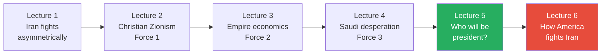
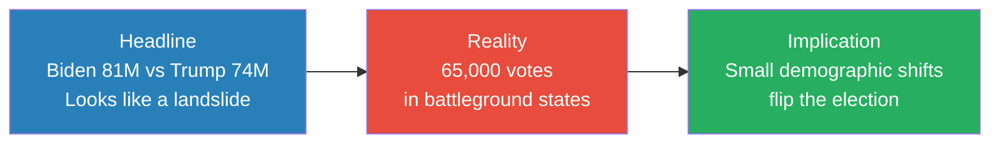
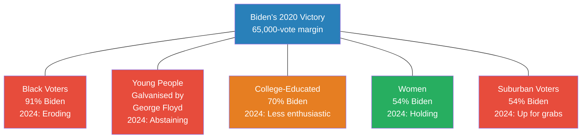
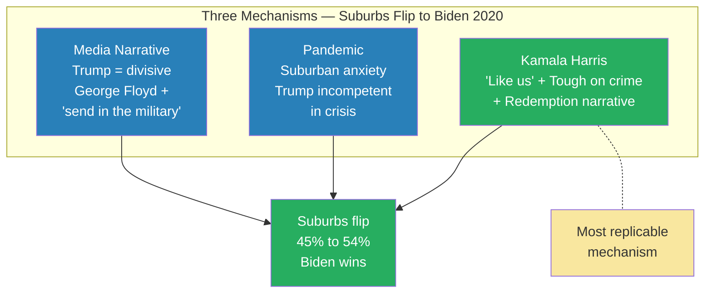
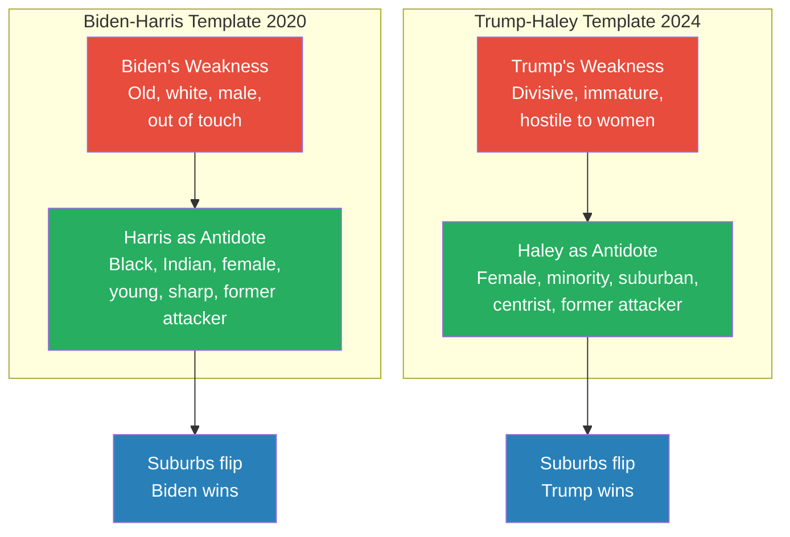
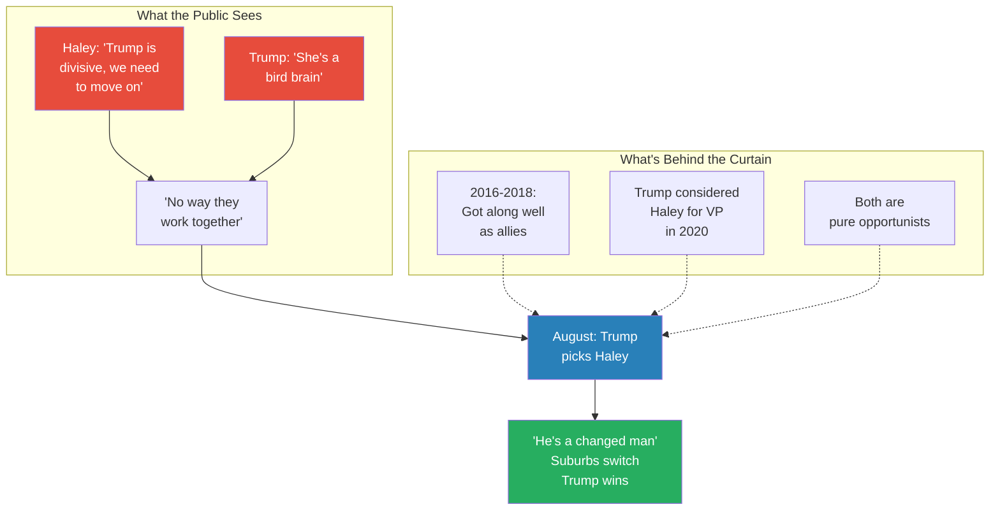
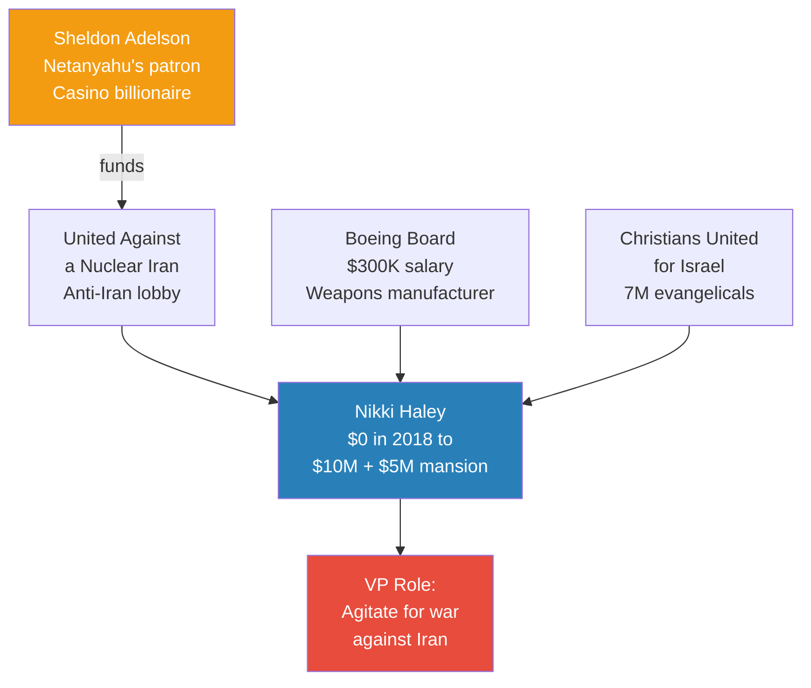
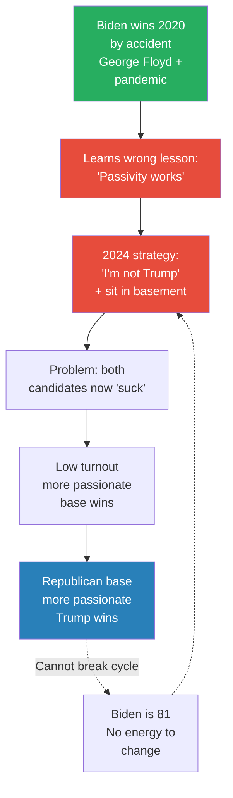
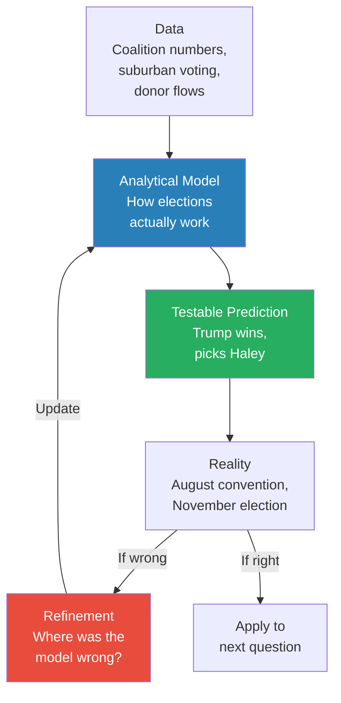

# Why Trump Will Win

> Lectures 1-4 established three forces pushing the United States toward war with Iran: Christian Zionism, empire economics, and Saudi Arabia's desperation. But one variable remained unsettled — who wins the 2024 presidential election? Prof. Jiang answers that question here with a detailed electoral analysis. Biden's 2020 victory was built on five demographic pillars, each held together by two unrepeatable events: the George Floyd protests and the pandemic. Every pillar is now weakening. The decisive battleground is the suburbs, where Biden flipped two million voters in 2020 by picking Kamala Harris — a former rival who had publicly called him a racist on national television. That act of reconciliation signalled empathy, growth, and magnanimity. Trump can replicate this template identically by picking Nikki Haley — whose financial backers reveal that her role in the White House would be to push for war against Iran.

---

## Overview: Key Highlights

- <b style="color: #27ae60">Trump will win in 2024 and should pick Nikki Haley as VP</b> — Prof. Jiang's testable prediction, not punditry
- <b style="color: #e74c3c">Biden won by just 65,000 votes</b> — a razor-thin electoral college margin behind the 81-million headline
- <b style="color: #2980b9">The suburban swing is the entire election</b> — urban areas are fixed Democratic, rural areas fixed Republican; only the suburbs decide
- <b style="color: #e74c3c">Biden's five-pillar coalition is collapsing</b> — black voters, young people, college graduates, women, and suburbanites all weakening
- <b style="color: #27ae60">The redemption narrative wins suburbs</b> — picking a former rival as VP signals forgiveness, empathy, and growth: exactly what suburban voters prize
- <b style="color: #2980b9">Kamala Harris effect</b> — she called Biden a racist on TV; he picked her anyway; the suburbs read this as proof of character and flipped 2 million votes
- <b style="color: #27ae60">Nikki Haley is Trump's Kamala Harris</b> — female, minority, suburban appeal, proven primary attacker, same redemption narrative template
- <b style="color: #e74c3c">Follow the money: $0 to $10M after leaving office</b> — Haley's wealth came from United Against a Nuclear Iran, Boeing, and Christians United for Israel
- <b style="color: #2980b9">Politics is theatre</b> — the Haley-Trump feud is a staged performance; their real relationship was collegial; both are pure opportunists
- <b style="color: #e74c3c">Biden's non-strategy: "I'm not Trump"</b> — won by accident in 2020, drew the wrong lesson, and cannot adapt at 81
- <b style="color: #27ae60">Analytical model-building</b> — the prediction is testable and falsifiable; a wrong prediction refines the model rather than invalidating it
- <b style="color: #2980b9">VP pick as foreign policy signal</b> — whoever Trump picks reveals how he will govern; Haley means war with Iran is coming

| Concept | One-line summary |
|---------|-----------------|
| **65,000-vote margin** | Biden's popular vote landslide masked a razor-thin electoral college result |
| **Five-pillar coalition** | Black voters, young people, college-educated, women, suburban — all held by unrepeatable events |
| **The suburban swing** | The only variable that decides American elections; flipped 9 points between 2016 and 2020 |
| **Redemption narrative** | Picking a former attacker as VP signals growth, empathy, and magnanimity to suburban voters |
| **Kamala Harris template** | Called Biden a racist on TV; he picked her anyway; suburbs interpreted this as the anti-Trump character signal |
| **Nikki Haley parallel** | Indian immigrant, suburban appeal, former primary attacker — the template applied to Trump |
| **Politics as theatre** | The Haley-Trump feud is scripted; their actual rapport was strong; both are pure opportunists |
| **United Against a Nuclear Iran** | The anti-Iran lobbying group funded by Netanyahu's patron Sheldon Adelson that paid Haley after she left office |
| **Boeing board seat** | $300K to sit on the board of a weapons manufacturer — profit from war |
| **Christians United for Israel** | 7-million evangelical organisation that wants war in the Middle East to bring Jesus back |
| **Biden's "I'm not Trump"** | His entire 2024 strategy — won by accident once, cannot work when both candidates are disliked |
| **JD Vance alternative** | The only alternative VP scenario — loyal to Trump but carries none of Haley's suburban appeal |

---

# The Lecture

## The Series Argument — And the Remaining Variable [0:00–0:30]

*Prof. Jiang opens by placing this lecture in context: Lectures 1-4 established three converging forces pushing toward war with Iran. This lecture answers the last remaining question — who will be sitting in the White House when those forces converge?*

> [!tip] Core Insight
> The three forces — Christian Zionism, empire economics, Saudi desperation — do not start wars by themselves. They need specific people in specific positions to translate structural pressure into policy. This lecture identifies those people.

*Lecture 5 is the bridge between "why war is coming" (Lectures 1-4) and "how it will be fought" (Lecture 6). The electoral analysis is not a detour — it identifies the specific personnel who will make the decision.*

> [!note]- Expand: Full Lecture Detail
> Prof. Jiang opens directly: "Today we are discussing whether or not Trump will win in November, and I'm making the prediction that he will win in November and that he will pick Nikki Haley as his vice president."
>
> He frames this not as punditry but as an exercise in analytical model-building. The argument breaks into two parts:
>
> - **Electoral analysis:** Why Biden's 2020 coalition is falling apart, and what strategic move Trump can make to seal the victory
> - **Foreign policy implication:** If Nikki Haley becomes VP, she becomes the person inside the White House agitating for war against Iran — connecting the electoral question directly to the series' central thesis
>
> He connects to the previous four lectures:
> - [[01 - Iran's Strategy Matrix]] established that Iran fights asymmetrically and America's military superiority does not guarantee victory
> - [[02 - Christian Zionism and the Middle East Conflict]] identified Christian Zionism as Force 1
> - [[03 - How Empire is Destroying America]] identified empire economics as Force 2 — the petrodollar, financialisation, and the debt spiral
> - [[04 - Saudi Arabia's Trump Card Against Iran]] identified Saudi desperation as Force 3 — three lost proxy wars and the MBS-Kushner-Trump triangle
>
> "Now: who will be president when these three forces converge?"

---

## Biden's Fragile 65,000-Vote Margin [0:30–2:00]

*The 2020 election looked like a decisive victory for Biden. Prof. Jiang strips away the headline and reveals a coalition balanced on a razor's edge — 65,000 votes from reversal.*

*The gap between perception and reality in American elections is enormous. The popular vote is a headline; the electoral college margin is what matters — and that margin was razor-thin.*

> [!note]- Expand: Full Lecture Detail
> Prof. Jiang lays out the numbers: "It was the largest turnout in American history since about 1900. 74 million people voted for Trump, 81 million people voted for Biden, and two out of every three American adults came out to vote."
>
> The headline looks comfortable — a seven-million-vote margin. But America does not elect presidents by popular vote:
>
> - The <b style="color: #2980b9">electoral college system</b> allocates votes state by state, not nationally
> - Under that system, the actual margin of victory was <b style="color: #e74c3c">just 65,000 votes in key battleground states</b>
> - "If 65,000 people in key battleground states flip their votes, then Trump would have won"
> - This is why coalition analysis matters — Biden's victory was not built on a broad, durable majority
>
> The implication: small shifts in specific demographic groups are all that is needed to reverse the result. Prof. Jiang's analysis of Biden's five-pillar coalition is precisely targeted at finding where those small shifts will occur.

---

## Biden's Collapsing Coalition: Five Pillars [2:00–9:30]

*Prof. Jiang breaks down the five groups that delivered Biden's 2020 victory and shows how each one is cracking. The structure is methodical: who voted for Biden, why they did, and why they will not do so with the same enthusiasm.*

*Every pillar except women is weakening. With a margin of just 65,000 votes, even modest erosion in any single group could be fatal.*

> [!note]- Expand: Full Lecture Detail
> **Pillar 1: Black Voters — The Debt Is Paid**
>
> In 2020, <b style="color: #2980b9">91% of black voters chose Biden</b>. Only 8% voted for Trump. This overwhelming margin was driven by two specific forces:
>
> - **Loyalty to Obama's VP:** Biden served as Barack Obama's vice president for eight years. Many older black voters felt a personal debt — "we owe this man because he served loyally to our man, Barack Obama, for years, and so now we must bring him into the White House"
> - **The George Floyd protests:** In May 2020, George Floyd was killed by a white police officer in Minneapolis. The video went viral. Trump refused to acknowledge the pain black Americans felt. Black voters were galvanised against him
>
> In 2024, both forces have evaporated:
> - <b style="color: #e74c3c">The debt is paid off</b> — Biden won. The one-time obligation has been fulfilled
> - No George Floyd moment — no galvanising event to drive turnout
> - Biden's record has actively hurt black Americans:
>   - **Inflation** has risen — and inflation disproportionately hurts poor people
>   - **Illegal immigration** has roughly doubled under Biden's watch — from about 10 million to 20 million undocumented immigrants — competing for the same low-wage jobs
>   - **Tens of billions** sent to Ukraine — a war black Americans see as having nothing to do with their lives
>
> > [!example] The Black Voter Question (2024)
> > - In 2020, black voters gave Biden the largest demographic margin of any group — 91% to 8%
> > - The loyalty was personal (Obama's VP) and event-driven (George Floyd)
> > - Four years later, the question is simple: what has Biden done for us?
> > - Inflation up, wages stagnant, immigration increased job competition at the bottom
> > - Meanwhile, billions to Ukraine — a war that feels irrelevant to black communities
> > **The lesson:** Coalition loyalty built on a one-time event and a personal debt has a shelf life. When the event fades and the debt is repaid, the question becomes: what have you done for me lately?
>
> **Pillar 2: Young People — Gaza, Not George Floyd**
>
> Young voters leaned Democratic in 2020 and were exceptionally motivated. The George Floyd protests made Trump appear to be a hateful, racist figure they had a moral obligation to remove. In 2024 the motivation has reversed:
>
> - <b style="color: #e74c3c">Gaza has replaced George Floyd</b> as the defining moral issue for young Americans
> - On college campuses across the country, students are protesting America's support for Israel's war in Gaza
> - These young voters will not switch to Trump — but many will <b style="color: #e74c3c">refuse to vote for Biden as a protest</b> against American policy on Israel
> - The result is not a vote flip but a turnout collapse — exactly the kind of small shift that matters in a 65,000-vote-margin election
>
> **Pillar 3: College-Educated Voters — Still Democratic, Less Enthusiastic**
>
> In 2020, <b style="color: #2980b9">70% of people with college degrees voted for Biden</b> — the coastal professional-managerial elite, the core Democratic base. They will still vote Democratic in 2024. But there is a difference between voting for someone and voting enthusiastically:
>
> - Under Biden's watch, Ukraine and Gaza both erupted
> - Many college-educated voters see Biden as <b style="color: #e74c3c">too old, too weak, and too feeble to stand against Putin</b>
> - They will vote "primarily against Trump" rather than "for Biden" — lower enthusiasm, fewer donations, less volunteer energy
>
> **Pillar 4: Women — The One Pillar That Holds**
>
> In 2020, 54% of women voted for Biden and 44% for Trump. Prof. Jiang treats this as the one group that will remain consistent:
>
> - Trump is still perceived as a hateful figure by women voters
> - <b style="color: #27ae60">Abortion rights</b> have become an even more powerful motivator since the Supreme Court overturned Roe v. Wade
> - But women alone cannot hold the coalition together if every other pillar is weakening
>
> **Pillar 5: Suburban Voters — Where the Election Will Be Won or Lost**
>
> The suburbs — between the solidly Democratic cities and the solidly Republican rural areas — are where American elections are decided. The evidence from two elections is stark:
>
> | Election | Suburban vote | Result |
> |----------|-------------|--------|
> | **2016** | 45% voted for Clinton | Trump won |
> | **2020** | 54% voted for Biden | Biden won |
>
> That nine-point swing — a flip of roughly <b style="color: #2980b9">two million voters</b> — was the entire election. Everything else was noise.

---

## How Biden Won the Suburbs: Three Mechanisms [9:30–18:15]

*Biden did not win the suburbs by accident. Three specific forces swung two million suburban voters in 2020 — and the most powerful one is a deliberate, replicable strategic template.*

*The media narrative and the pandemic were gifts of circumstance. The Kamala Harris pick was a deliberate strategic choice — and it was the mechanism that mattered most, because it spoke directly to what suburban voters care about: character, empathy, and the ability to forgive.*

> [!note]- Expand: Full Lecture Detail
> **Mechanism 1: The Media Narrative — Trump as Divider**
>
> Throughout Trump's presidency, the mainstream media constructed a sustained case against him:
>
> - First came <b style="color: #2980b9">Russiagate</b> — the claim that Trump was a Russian asset, a Putin puppet. Prof. Jiang calls this "a complete lie," but it shaped perception
> - Then the narrative shifted to Trump as a <b style="color: #e74c3c">divisive figure</b> — and this idea caught the imagination of suburban voters
>
> Why did this resonate with suburbs specifically?
> - They tend to be middle class, relatively wealthy, well-educated
> - They <b style="color: #27ae60">like the status quo</b> — they have something to protect
> - They want a leader who is conservative in temperament and who unifies rather than divides
> - The growing polarisation — left and right attacking each other — alarmed them
>
> The George Floyd protests crystallised this fear. Trump threatened to send in the military to crush the protesters. Biden appeared as the opposite: steady, establishment, a man who could unite both parties.
>
> **Mechanism 2: The Pandemic — Incompetence in Crisis**
>
> COVID-19 hit the United States, and suburban voters were among the most anxious:
> - They tend to have children in school; they tend to be older
> - They saw Trump's pandemic response as <b style="color: #e74c3c">deeply incompetent</b>
> - As a political outsider, Trump could not get things done in Washington — the quality that attracted voters in 2016 became a liability when crisis demanded institutional competence
>
> **Mechanism 3: Kamala Harris — The Decisive Factor**
>
> Biden picked Kamala Harris as his running mate. Her background: father Jamaican, mother Indian; father left the family when she was young, mother raised two daughters alone; Stanford, then Attorney General of California, then US Senator.
>
> Three reasons the suburbs loved her:
> - **"Like us"** — Harris spoke and thought like suburban voters: well-educated, articulate, moderate in presentation
> - **Establishment credentials** — as California's Attorney General, she was famously tough on crime. Suburban voters value safety and security; they have children; they want law and order
> - **The redemption narrative** — and this is the key to the entire lecture
>
> > [!example] The June 2019 Democratic Debate — The Moment That Won the Suburbs
> > - At the first Democratic primary debate, Kamala Harris turned directly to Biden and launched a devastating personal attack on national television
> > - "Joe, you've been in Washington, DC, for 50 years, and some of your policies I don't support. For example, you do not support the integration of black and white students together"
> > - Then she made it personal: "I'm a black student. I was a black little girl. Grew up in the 70s in California, and I got my opportunity to succeed in America because of integration, because I could go to white school — and you opposed my opportunity to succeed"
> > - She was calling Biden a racist on national television. Biden was visibly shell-shocked
> > - Everyone watching assumed there was no way Biden would pick this woman as his running mate
> > - Then he picked her
> > **The lesson:** When Biden chose Harris despite her public attack, he sent a signal more powerful than any policy position: this man does not hold grudges. He listens. He is a team player. He has empathy. These four qualities are the exact opposite of Trump's public persona — and they are precisely what suburban women had been voting against.
>
> Prof. Jiang explains why this worked with suburban women specifically:
> - <b style="color: #27ae60">Women want compassionate, empathetic leadership that is decisive and bold but also tolerant</b>
> - The Biden-Harris pick embodied all of these qualities simultaneously
> - This also explains a historical puzzle: Hillary Clinton lost the suburbs in 2016 despite being a woman — she did not come across as compassionate, forgiving, or tolerant. Being a woman was not enough. Suburban voters were looking for a specific emotional signal.

---

## Trump's Mirror Move: Picking Nikki Haley [18:15–22:15]

*If the redemption narrative is a replicable template, who is Trump's Kamala Harris? Prof. Jiang argues the answer is sitting right in front of us — a former UN ambassador who ran against Trump, called him a divider, and is now loved by exactly the suburban voters Trump needs.*

*The structure is identical. Biden picked the woman who called him a racist. If Trump picks the woman who called him a divider, the same narrative mechanism activates — and the same suburban voters respond.*

> [!note]- Expand: Full Lecture Detail
> Prof. Jiang introduces the strategic formula: <b style="color: #27ae60">identify your greatest weakness, then pick a VP who is the living antidote to that weakness</b>.
>
> Trump's weakness is equally clear — he is seen as <b style="color: #e74c3c">divisive, immature, incapable of growth, hostile to women, and threatening to suburban families</b>. He needs a VP who is the living antidote to every one of those perceptions.
>
> Enter <b style="color: #2980b9">Nikki Haley</b>:
> - Indian immigrant parents, South Asian descent — not a wealthy family, but hardworking
> - Became Governor of South Carolina for two terms
> - Joined the Trump administration as <b style="color: #2980b9">UN Ambassador</b> in 2016 — held the role until 2018; everyone said the two got along well; Trump even considered dropping Mike Pence and putting her on the 2020 ticket
>
> Then came the Republican primary. Haley ran against Trump positioning herself as the anti-Trump:
> - "I served under Trump, and I think he's a divisive figure. Right now our country needs a unifier"
> - Trump responded by calling her "a bird brain"
> - She lost the primary — but the demographic group that loved her most was <b style="color: #27ae60">college-educated suburban women</b>, who voted for her in droves
> - Even after dropping out, she continued receiving 25-33% of all Republican primary votes — a remarkable figure for a defeated candidate
>
> Prof. Jiang walks the class through the moment that would matter:
> - News reports have already surfaced that Haley is "in consideration" for VP
> - Trump publicly denied it: "I am not considering Nikki Haley"
> - Imagine it is August, the Republican convention — and Trump announces: "I was wrong. Nikki Haley is the best person to be my VP"
>
> How would people react? Prof. Jiang asks the class. The answer: "He's a changed man. Trump has grown."
> - The narrative about Trump has always been that he is "a five-year-old child" — immature, incapable of growth
> - Picking Haley — after publicly feuding with her, after calling her a bird brain, after denying he would ever consider her — would destroy that narrative overnight
> - The media would report: he listens, he has empathy, he has learned his lessons
> - <b style="color: #27ae60">The suburbs would switch — and Trump would win</b>

---

## Politics as Theatre: Why the Feud is Staged [22:15–30:15]

*A student asks the obvious question: what if Haley holds a grudge and says no? Prof. Jiang's answer reveals his deepest conviction about how politics works — and introduces a framework for reading all political behaviour.*

> [!tip] Core Insight
> Politics is theatre. The most powerful political narratives are often the most artificial. The candidate who understands that voters respond to character arcs, not position papers, will always defeat the candidate who believes substance should speak for itself.

*The gap between the public performance and the private reality is the entire mechanism. Voters see the drama; they do not see the script. The more bitter the feud appears, the more powerful the reconciliation.*

> [!note]- Expand: Full Lecture Detail
> A student asks: what if Haley holds a grudge and says no? She has publicly said Trump is divisive and she would not serve as his VP. What if she means it?
>
> Prof. Jiang references a previous class where they studied Trump's personality through his WWE appearances:
> - In the WWE, Vince McMahon — the billionaire owner — "challenges Trump to a fight"
> - Everyone watching knows it is staged entertainment
> - <b style="color: #27ae60">Politics is the same thing — it is all theatre</b>
>
> What Haley and Trump are doing is <b style="color: #e74c3c">pretending to be bitter enemies so that their reconciliation will be so dramatic</b>. The feud is not real — it is a performance designed to maximise the narrative impact of the eventual reunion.
>
> The evidence that the feud is staged:
> - Haley served under Trump for two years as UN Ambassador — "everyone says that the two got along really well"
> - Trump was considering her for VP as far back as 2020
> - The two respect each other and have a genuine rapport behind the scenes
>
> And even if the feud were real, it would not matter — because <b style="color: #2980b9">politicians are pure opportunists</b>:
> - "They have no ideas, they have no principles. All they care about is political power"
> - VP is one step from the presidency — if anything happens to Trump, she becomes president
> - In four years she can run as the Republican nominee with incumbency advantage
>
> Prof. Jiang extends this to a general law of motivation:
> - Politicians will do anything for power
> - Rich people will do anything for money
> - Celebrities will do anything for fame
> - All will, as he puts it, "sell their own mother" for their primary currency
>
> > [!example] Trump in the WWE — The Analogy That Explains Everything
> > - In a previous class, Prof. Jiang studied Trump's appearances in the WWE
> > - Vince McMahon, the billionaire owner, challenged Trump to a fight on live television
> > - The audience knows it is scripted; the "enemies" are friends behind the curtain; the drama is manufactured for maximum entertainment
> > - Political feuds work identically — the Haley-Trump conflict is scripted, the reconciliation is planned, and the audience (voters) respond to the dramatic arc without realising it is manufactured
> > - Trump, more than any modern politician, understands this — he literally came from the world of staged entertainment
> > **The lesson:** In political theatre, the public denial is not a mistake — it is a setup. The more impossible the reconciliation appears, the more powerful the narrative when it happens.

---

## The Iran Connection: Why Haley's Pick Means War [22:15–30:15]

*The electoral analysis is not a detour from the series' driving question — it is the answer. If Trump wins with Haley, the three forces identified in Lectures 1-4 gain the one thing they lacked: a representative inside the White House whose job is to push for war with Iran.*

*Every dollar that made Haley wealthy came from organisations whose primary objective is confrontation with Iran. The money trail is not subtle — it is a straight line from anti-Iran donors to the person who would sit one heartbeat from the presidency.*

> [!note]- Expand: Full Lecture Detail
> Prof. Jiang turns from electoral strategy to foreign policy with a single question: who is Nikki Haley, and where did her money come from?
>
> When Haley left office as UN Ambassador in 2018, <b style="color: #e74c3c">she had nothing in her bank account</b>. By 2024, she has $10 million in cash and lives in a $5 million mansion. The transformation came from three sources:
>
> **Source 1: <b style="color: #2980b9">United Against a Nuclear Iran</b>**
> - An organisation whose stated purpose is to create conflict between the United States and Iran
> - Targets companies and individuals who do business with Iran
> - Hired Haley after she left office and paid her substantial sums
> - A major donor: <b style="color: #2980b9">Sheldon Adelson</b> — the billionaire casino magnate who was the primary political patron and financial backer of Benjamin Netanyahu
> - Adelson funded both Netanyahu and this anti-Iran organisation — and the organisation hired Haley
>
> **Source 2: <b style="color: #2980b9">Boeing</b>**
> - A weapons manufacturer — "they make aeroplanes, but they mainly make bombs and missiles. Okay, so they love war"
> - Haley was given a seat on Boeing's board of directors — an extremely prestigious position
> - She was paid $300,000 "just to sit on the board and do nothing"
> - Boeing, as a weapons manufacturer, profits directly from war
>
> **Source 3: <b style="color: #2980b9">Christians United for Israel (CUFI)</b>**
> - The 7-million-strong evangelical organisation introduced in [[02 - Christian Zionism and the Middle East Conflict]]
> - Dispensationalist premillennialists who believe war between Israel and Iran will bring Jesus back to Earth and establish the Kingdom of Heaven
> - "They want as much conflict in the Middle East as possible"
> - Haley has given speeches for them — accepting their platform and their money
>
> > [!example] The $12 Million Signal (January 2024)
> > - By January 2024, Trump had effectively won the Republican primary — Haley had no realistic path to the nomination
> > - Yet in that month, Haley raised $12 million from donors — more than Trump's $11 million
> > - No rational donor would invest in a lost cause unless the investment served a different purpose
> > - Prof. Jiang's interpretation: the donors were buying Haley a VP position, not a presidential campaign
> > - By funding her continued presence in the race, they ensured she remained visible, popular, and associated with the suburban voters Trump needs
> > - The same donors — from the anti-Iran network — would then have their representative inside the White House
> > **The lesson:** In American politics, follow the money. When the funding pattern defies electoral logic, it is serving a different strategic purpose.
>
> Prof. Jiang draws the full chain from election to war:
>
> - Biden's coalition collapses → suburbs are the decisive swing
> - Trump picks Nikki Haley → redemption narrative activates → suburbs flip
> - Trump wins the presidency → Haley enters the White House
> - Haley's backers: anti-Iran lobby + Boeing + Christians United for Israel
> - <b style="color: #e74c3c">Haley agitates for war with Iran</b>
>
> Combined with the three forces from Lectures 1-4 (Christian Zionism, empire economics, Saudi desperation), the probability of war becomes very high.

---

## Biden's Non-Strategy [33:50–39:00]

*A student asks: Biden has a team of experienced strategists. They can see all of this. What can Biden do? Prof. Jiang's answer is devastating — Biden has no strategy, has never had a strategy, and is constitutionally incapable of developing one.*

*Biden's non-strategy is a structural trap. He won by accident, drew the wrong conclusion, and is now too old and too set in his ways to adapt.*

> [!note]- Expand: Full Lecture Detail
> A student (Jack) raises a sharp point: if a professor teaching a class of students can figure out Trump's optimal strategy, surely Biden's well-paid professional strategists can see it too. So what is Biden's counter-move?
>
> Prof. Jiang demolishes the premise:
> - Biden ran for president twice before 2020 — and lost both times
> - He lacks charisma: "When Biden goes to speak, there's no one there to listen to him. He's boring and he has no ideas. And he's old"
> - His 2020 "strategy" was simply: "I'm gonna win" — with no elaboration on how
>
> Then two events saved Biden by accident:
> - The George Floyd protests galvanised young people, black voters, and suburban families against Trump
> - The pandemic shut down Trump's ability to campaign — Biden could "sit in his basement and do nothing" while his surrogates did the work
>
> <b style="color: #e74c3c">Biden learned the wrong lesson from this accidental victory.</b> The lesson he took: "If I just sit in my basement all day and make no mistakes, my surrogates — Hillary Clinton, Bill Clinton, Barack Obama — will fire up the base, and I'll win because I'm not Trump." His entire strategy for 2024 is three words: <b style="color: #e74c3c">"I'm not Trump."</b>
>
> Why it fails in 2024:
> - In 2020, the American people had four years of Trump and knew he was a problem
> - Now the American people have had four years of Biden — and Biden is a problem too
> - The question becomes: "who sucks more — Biden or Trump?"
> - When both candidates are perceived as failures, voters do not come out — and <b style="color: #27ae60">the party whose base feels more passionately will win</b>
> - The Republican coalition — rural voters, conservatives, Christians, white voters — feels far more passionately about Trump than the Democratic coalition feels about Biden
>
> Biden cannot adapt because he is 81 years old and lacks the energy to reinvent himself. "It's much easier for him to sit around and pray that 'I'm not Trump' will deliver another election than it is for him to go out and change who he is. He can't change who he is."

---

## The Analytical Method — Building and Testing Models [39:00–End]

*Prof. Jiang closes by pulling back from the specific prediction and explaining the epistemological framework that produced it. This is not a lecture about elections — it is a lecture about how to think.*

> [!tip] Core Insight
> The purpose of making predictions is not to be right — it is to build and refine models. A failed prediction that reveals a flaw in the model is more valuable than a lucky guess that teaches nothing.

*The analytical method is cyclical: data produces a model, the model produces a prediction, reality tests the prediction, and failure feeds back into a better model.*

> [!note]- Expand: Full Lecture Detail
> Prof. Jiang acknowledges uncertainty with striking honesty:
>
> - "I am not sure who will win this year. I think it's Trump"
> - "I'm not sure that Nikki Haley will be his Vice President. I'm just making a guess"
> - He names <b style="color: #2980b9">JD Vance</b> as the most likely alternative VP pick — noting that "the only thing you need to know about JD Vance is he's very loyal to Trump"
>
> The JD Vance scenario is illuminating because it tests a different part of the model:
> - **Haley pick** = coalition expansion strategy: reach for the suburban swing voters who decided 2016 and 2020
> - **Vance pick** = base consolidation strategy: maximise turnout among existing supporters, bet that passion advantage overcomes the suburban deficit
>
> Prof. Jiang explains the meta-purpose of the lecture:
> - "We have to build an analytical model of how the world works, and the only way we know if this model works or not is by making predictions and testing it against reality"
> - If the prediction fails: "I go back to this analysis, and I make changes to analysis this analysis, so that it's much more reflective and accurate"
> - "That's how we try to think critically about the world — by building analytical models that we can then test against reality and then, based on what happens in reality, we can refine"
>
> The distinction between analyst and pundit:
> - **Pundits** start from conclusions and work backward to find supporting evidence; they never admit error
> - **Analysts** start from data and work forward to testable predictions; they treat error as information
>
> > [!example] The Analyst vs. The Pundit — A Comparison
> > - A television pundit in 2024 says: "I think Trump will win because he has momentum and Biden is old"
> > - No mechanism specified, no falsification condition — if Trump loses, the pundit says "nobody could have predicted this" and moves on
> > - Prof. Jiang says: "Trump will win because Biden's coalition is collapsing across five specific demographics, and Trump can replicate the Biden-Harris suburban strategy by picking Nikki Haley"
> > - The mechanism is specific; the falsification conditions are clear: if Trump does not pick Haley, if the suburbs do not respond, if Biden's coalition holds in one unexpected group — each failure points to a specific flaw
> > **The lesson:** The value of a prediction lies not in whether it comes true, but in whether the model that produced it can be tested, refined, and applied to the next question.
>
> Prof. Jiang closes with a preview: "Next week we discuss the war in Iran. If Nikki Haley becomes the Vice President, it is very likely she will agitate for war against Iran and Trump will go along. And if that's the case, then we need to understand how America will fight the war and how Iran will respond."

---

## Connections

**Builds on:**
- [[01 - Iran's Strategy Matrix]] — asymmetrical warfare framework; war with Iran as the series' driving question; this lecture identifies the specific personnel who will make that war probable
- [[02 - Christian Zionism and the Middle East Conflict]] — Christians United for Israel reappears here as one of Haley's three financial backers; the dispensationalist belief system is the ideological fuel behind her evangelical support
- [[03 - How Empire is Destroying America]] — the "I'm not Trump" vs. "who sucks more?" dynamic connects to the broader theme of American decline; neither candidate offers a path out of imperial decay
- [[04 - Saudi Arabia's Trump Card Against Iran]] — direct continuation; Haley's anti-Iran financial network mirrors the MBS-Kushner-Trump triangle that purchased American foreign policy

**Sets up:**
- [[06 - America's Imperial Hubris]] — if Trump wins (as predicted here), the question becomes what his hubris will produce; the hubris framework from Lectures 1, 3, and 4 will be applied to the war itself

**Related books in vault:**
- [[The 48 Laws of Power - Robert Greene]] — Law 25 (Re-Create Yourself): Trump potentially re-creating himself as a "changed man" through the Haley pick
- [[The Laws of Human Nature - Robert Greene]] — character as destiny: Biden cannot change at 81; people's fundamental nature constrains their strategic options
- [[Influence - Robert Cialdini]] — the liking principle: Haley is "like us" for suburban voters; contrast effect: her attacks make Trump's magnanimity appear more dramatic

---

## The Takeaway

This lecture completes the structural argument of the series' first half. Lectures 1-4 assembled three forces pushing the United States toward war with Iran — Christian Zionism, empire economics, and Saudi desperation. But structural forces do not start wars by themselves; they need specific people in specific positions to translate pressure into policy. This lecture identifies those people. If Trump wins the presidency and Haley enters the White House, the three forces gain what they lacked: a representative inside the West Wing whose entire financial existence was built by anti-Iran donors, a weapons manufacturer, and evangelical war advocates. The money trail runs in a straight line from organisations whose stated purpose is confrontation with Iran to the person who would sit one heartbeat from the presidency.

The most surprising insight is not the prediction itself but the mechanism behind it. American elections are not decided by policy debates or the candidates' records. They are decided by the suburbs — a single demographic that swings between parties based on character narratives, not platforms. The redemption narrative (picking a former rival as VP to signal growth and empathy) is a repeatable template that both parties can deploy. Biden used it with Harris in 2020. Trump could use it with Haley in 2024. The content of the narrative matters less than its emotional structure: conflict, surprise, reconciliation, perceived growth. This is what wins two million suburban votes — not infrastructure plans, but a story about a candidate who has changed. This has a darker implication that Prof. Jiang makes explicit through his WWE analogy: if elections are decided by narratives rather than policies, then democracy is not a mechanism for choosing the best leader — it is a mechanism for choosing the best storyteller.

The question that remains open is the one Prof. Jiang deliberately leaves unresolved: what if Trump does not pick Haley? He names JD Vance as the alternative and frames his prediction as explicitly testable — if wrong, go back and find the flaw. This intellectual honesty is the lecture's meta-lesson. The habit of building models, making specific predictions, and revising when reality contradicts them is more valuable than any single prediction. A pundit who is right by accident learns nothing. An analyst who is wrong for identifiable reasons learns everything. The series moves next from "who will decide" to "what will happen" — and from the structural analysis of forces and personnel to the operational question of how imperial hubris meets asymmetric resistance.
